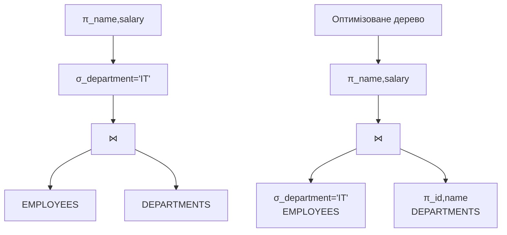

# Лекція 4. Реляційна модель даних

## Вступ

**Реляційна модель даних** є найпоширенішою та найуспішнішою моделлю організації даних у сучасних інформаційних системах. Розроблена Едгаром Коддом у 1970 році, вона заклала математичні основи для створення систем управління базами даних, які забезпечують надійність, гнучкість та ефективність обробки інформації.

Унікальність реляційної моделі полягає в тому, що вона базується на строгих математичних концепціях теорії множин та реляційної алгебри, що дозволяє формально описувати структури даних та операції над ними. Водночас, ця модель достатньо інтуїтивна для практичного використання завдяки табличному представленню даних.

Розуміння реляційної моделі є фундаментальним для роботи з будь-якими сучасними СУБД, оскільки навіть системи, що підтримують інші моделі даних, часто використовують реляційні принципи як основу або надають реляційний інтерфейс для взаємодії з даними.

## Математичний апарат реляційної моделі

### Основні математичні поняття

Реляційна модель ґрунтується на декількох ключових математичних концепціях, які забезпечують її строгість та формальність.

#### Домени

**Домен** в реляційній моделі є множиною допустимих значень для певного атрибута. Домен визначає не лише тип даних, але й семантичне значення та обмеження для атрибута.

Формально домен можна записати як:

D = {v₁, v₂, v₃, ..., vₙ}

де кожне vᵢ є допустимим значенням домену.

Приклади доменів:

```
Домен ПІБ_СПІВРОБІТНИКА:
- Тип: VARCHAR(100)
- Обмеження: не може бути NULL, містить лише літери та пробіли
- Приклад значень: {"Іван Петрович Коваленко", "Марія Іванівна Мельник"}

Домен ЗАРПЛАТА:
- Тип: DECIMAL(10,2)
- Обмеження: >= 0, <= 1000000
- Приклад значень: {15000.00, 25000.50, 45000.00}

Домен КОД_ВІДДІЛУ:
- Тип: CHAR(3)
- Обмеження: складається з літер та цифр
- Приклад значень: {"IT1", "HR2", "FIN", "ADM"}
```

Важливо розуміти, що домени можуть мати однаковий базовий тип даних, але різну семантику. Наприклад, домени НОМЕР_ТЕЛЕФОНУ та НОМЕР_ПАСПОРТА можуть обидва мати тип VARCHAR(20), але семантично це різні домени.

#### Відношення (Relations)

**Відношення** є центральним поняттям реляційної моделі. Формально відношення R на доменах D₁, D₂, ..., Dₙ визначається як підмножина картезіанського добутку цих доменів:

R ⊆ D₁ × D₂ × ... × Dₙ

Кожен елемент відношення називається **кортежем** (tuple) або рядком.

Приклад відношення СПІВРОБІТНИКИ на доменах (ПІБ, ЗАРПЛАТА, КОД_ВІДДІЛУ):

```
СПІВРОБІТНИКИ ⊆ ПІБ_СПІВРОБІТНИКА × ЗАРПЛАТА × КОД_ВІДДІЛУ

Можливі кортежі:
t₁ = ("Іван Петрович Коваленко", 25000.00, "IT1")
t₂ = ("Марія Іванівна Мельник", 30000.00, "HR2")
t₃ = ("Олександр Миколайович Сидоров", 28000.00, "IT1")
```

#### Картезіанський добуток

**Картезіанський добуток** множин D₁ × D₂ × ... × Dₙ містить всі можливі комбінації значень з відповідних доменів. Якщо домен D₁ містить m₁ елементів, D₂ містить m₂ елементів, то їх картезіанський добуток містить m₁ × m₂ елементів.

Приклад:
```
Нехай:
ІМЕНА = {"Іван", "Марія", "Петро"}
ВІДДІЛИ = {"IT", "HR"}

Тоді ІМЕНА × ВІДДІЛИ = {
    ("Іван", "IT"), ("Іван", "HR"),
    ("Марія", "IT"), ("Марія", "HR"),
    ("Петро", "IT"), ("Петро", "HR")
}
```

Відношення завжди є підмножиною картезіанського добутку, оскільки не всі теоретично можливі комбінації значень мають сенс у реальному світі.

#### Проекція

**Проекція** є операцією, яка дозволяє отримати підмножину атрибутів з відношення. Формально проекція відношення R на множину атрибутів A = {A₁, A₂, ..., Aₖ} позначається як πₐ(R).

Приклад проекції:

```
Початкове відношення СПІВРОБІТНИКИ:
| ПІБ | ЗАРПЛАТА | ВІДДІЛ | ТЕЛЕФОН |
|-----|----------|--------|---------|
| Іван Коваленко | 25000 | IT | 555-1234 |
| Марія Мельник | 30000 | HR | 555-5678 |

Проекція π{ПІБ,ЗАРПЛАТА}(СПІВРОБІТНИКИ):
| ПІБ | ЗАРПЛАТА |
|-----|----------|
| Іван Коваленко | 25000 |
| Марія Мельник | 30000 |
```

Важливою властивістю проекції є те, що вона автоматично видаляє дублікати рядків, оскільки відношення за визначенням є множиною.

### Властивості відношень

Відношення в реляційній моделі мають кілька важливих властивостей, які відрізняють їх від звичайних таблиць:

#### Відсутність впорядкованості рядків

Рядки у відношенні не мають визначеного порядку. Це означає, що відношення:

```
| ID | ІМ'Я |
|----|------|
| 1  | Іван |
| 2  | Марія |
```

є ідентичним до відношення:

```
| ID | ІМ'Я |
|----|------|
| 2  | Марія |
| 1  | Іван |
```

#### Відсутність впорядкованості стовпців

Стовпці у відношенні також не мають визначеного порядку, але на практиці порядок стовпців фіксується схемою відношення для зручності роботи.

#### Унікальність рядків

Відношення не може містити однакових рядків, оскільки воно є множиною за математичним визначенням.

#### Атомарність значень

Кожна комірка відношення може містити лише одне атомарне (неподільне) значення. Це означає, що не можна зберігати в одній комірці список значень або складну структуру даних.

## Структурний аспект реляційної моделі

### Домени в контексті баз даних

У практичних системах управління базами даних домени реалізуються через типи даних та обмеження. Сучасні СУБД підтримують як стандартні типи даних, так і можливість створення користувацьких доменів.

#### Стандартні домени

```sql
-- Числові домени
INTEGER, BIGINT, DECIMAL(p,s), REAL, DOUBLE

-- Символьні домени
CHAR(n), VARCHAR(n), TEXT

-- Часові домени
DATE, TIME, TIMESTAMP, INTERVAL

-- Логічні домени
BOOLEAN

-- Спеціальні домени
JSON, XML, UUID
```

#### Користувацькі домени

Деякі СУБД дозволяють створювати власні домени з додатковими обмеженнями:

```sql
-- Створення домену для email
CREATE DOMAIN email_domain AS VARCHAR(255)
CHECK (VALUE ~ '^[A-Za-z0-9._%+-]+@[A-Za-z0-9.-]+\.[A-Za-z]{2,}$');

-- Створення домену для позитивних чисел
CREATE DOMAIN positive_amount AS DECIMAL(10,2)
CHECK (VALUE > 0);

-- Використання доменів у таблиці
CREATE TABLE customers (
    id INTEGER PRIMARY KEY,
    name VARCHAR(100) NOT NULL,
    email email_domain,
    credit_limit positive_amount
);
```

### Атрибути та їх характеристики

**Атрибут** є найменшою іменованою одиницею даних в реляційній моделі. Кожен атрибут має назву, домен та додаткові характеристики.

#### Властивості атрибутів

```sql
CREATE TABLE students (
    -- Атрибут з обов'язковим значенням
    student_id INTEGER NOT NULL,

    -- Атрибут з значенням за замовчуванням
    enrollment_date DATE DEFAULT CURRENT_DATE,

    -- Атрибут з обмеженням унікальності
    email VARCHAR(100) UNIQUE,

    -- Атрибут з перевіркою значення
    age INTEGER CHECK (age >= 16 AND age <= 65),

    -- Атрибут, що може бути NULL
    middle_name VARCHAR(50)
);
```

#### Класифікація атрибутів

Атрибути можна класифікувати за різними критеріями:

За обов'язковістю значення:

- Обов'язкові (NOT NULL)
- Необов'язкові (можуть мати значення NULL)

За унікальністю:

- Унікальні (UNIQUE)
- Звичайні (можуть повторюватися)

За походженням:

- Збережені (stored) - фізично зберігаються в базі
- Обчислювані (computed) - обчислюються на основі інших атрибутів

```sql
-- Приклад обчислюваного атрибута
CREATE TABLE orders (
    id INTEGER PRIMARY KEY,
    quantity INTEGER,
    unit_price DECIMAL(10,2),
    -- Обчислюваний атрибут
    total_amount DECIMAL(12,2) GENERATED ALWAYS AS (quantity * unit_price)
);
```

### Кортежі та їх структура

**Кортеж** є упорядкованим набором значень атрибутів, що відповідає одному рядку в таблиці. Кожен кортеж має фіксовану структуру, визначену схемою відношення.

#### Формальне визначення кортежу

Кортеж t на схемі відношення R(A₁: D₁, A₂: D₂, ..., Aₙ: Dₙ) є функцією:

t: {A₁, A₂, ..., Aₙ} → D₁ ∪ D₂ ∪ ... ∪ Dₙ ∪ {NULL}

така, що t(Aᵢ) ∈ Dᵢ ∪ {NULL} для всіх i = 1, 2, ..., n.

#### Практичний приклад кортежу

```sql
-- Схема відношення
CREATE TABLE employees (
    id INTEGER,
    name VARCHAR(100),
    department VARCHAR(50),
    salary DECIMAL(10,2),
    hire_date DATE
);

-- Приклад кортежу
INSERT INTO employees VALUES
(1001, 'Іван Петрович Коваленко', 'Інформаційні технології', 25000.00, '2023-01-15');
```

Цей кортеж можна записати як:
t(id) = 1001
t(name) = 'Іван Петрович Коваленко'
t(department) = 'Інформаційні технології'
t(salary) = 25000.00
t(hire_date) = '2023-01-15'

### Схема відношення

**Схема відношення** визначає структуру відношення, включаючи назви атрибутів, їх домени та обмеження.

#### Формальне визначення схеми

Схема відношення R записується як:
R(A₁: D₁, A₂: D₂, ..., Aₙ: Dₙ)

де R - назва відношення, Aᵢ - назви атрибутів, Dᵢ - відповідні домени.

#### Повна схема включає обмеження

```sql
CREATE TABLE courses (
    -- Первинний ключ
    course_id CHAR(8) PRIMARY KEY,

    -- Обов'язковий атрибут
    course_name VARCHAR(200) NOT NULL,

    -- Атрибут з обмеженням
    credits INTEGER CHECK (credits BETWEEN 1 AND 10),

    -- Зовнішній ключ
    department_id INTEGER REFERENCES departments(id),

    -- Унікальне обмеження
    UNIQUE (course_name, department_id)
);
```

## Обмеження цілісності

**Обмеження цілісності** є правилами, які забезпечують коректність та узгодженість даних у базі даних. Реляційна модель визначає три основні типи обмежень цілісності.

### Доменна цілісність

**Доменна цілісність** забезпечує, що всі значення атрибута належать визначеному для нього домену.

#### Типи доменних обмежень

```sql
-- Обмеження типу даних
CREATE TABLE products (
    id INTEGER,  -- Тільки цілі числа
    price DECIMAL(10,2),  -- Числа з 2 знаками після коми
    name VARCHAR(100)  -- Рядки довжиною до 100 символів
);

-- Обмеження діапазону значень
CREATE TABLE students (
    age INTEGER CHECK (age >= 16 AND age <= 65),
    grade CHAR(1) CHECK (grade IN ('A', 'B', 'C', 'D', 'F')),
    gpa DECIMAL(3,2) CHECK (gpa >= 0.0 AND gpa <= 4.0)
);

-- Обмеження формату
CREATE TABLE users (
    email VARCHAR(255) CHECK (email LIKE '%@%.%'),
    phone VARCHAR(20) CHECK (phone ~ '^\+?[0-9\-\(\)\s]+$')
);
```

#### Обробка NULL значень

**NULL** представляє відсутність значення та має спеціальні правила обробки:

```sql
-- Обмеження NOT NULL
CREATE TABLE employees (
    id INTEGER NOT NULL,
    name VARCHAR(100) NOT NULL,
    middle_name VARCHAR(50),  -- Може бути NULL
    salary DECIMAL(10,2) NOT NULL
);

-- Поведінка NULL у виразах
SELECT
    name,
    salary,
    salary * 12 AS annual_salary,  -- NULL якщо salary є NULL
    COALESCE(middle_name, 'Не вказано') AS middle_name_display
FROM employees;
```

### Цілісність сутності

**Цілісність сутності** вимагає, щоб кожен кортеж у відношенні був унікально ідентифікований і щоб первинний ключ не містив NULL значень.

#### Первинний ключ

**Первинний ключ** є атрибутом або комбінацією атрибутів, які унікально ідентифікують кожен кортеж у відношенні.

```sql
-- Простий первинний ключ
CREATE TABLE departments (
    id INTEGER PRIMARY KEY,
    name VARCHAR(100) NOT NULL,
    budget DECIMAL(15,2)
);

-- Складений первинний ключ
CREATE TABLE enrollments (
    student_id INTEGER,
    course_id INTEGER,
    semester VARCHAR(20),
    grade CHAR(1),
    PRIMARY KEY (student_id, course_id, semester)
);

-- Автоматично генерований ключ
CREATE TABLE orders (
    id SERIAL PRIMARY KEY,  -- Автоінкремент
    order_date DATE NOT NULL,
    customer_id INTEGER NOT NULL
);
```

#### Унікальні ключі

Крім первинного ключа, відношення може мати **альтернативні ключі**:

```sql
CREATE TABLE students (
    id INTEGER PRIMARY KEY,
    student_number VARCHAR(10) UNIQUE NOT NULL,
    email VARCHAR(255) UNIQUE,
    name VARCHAR(100) NOT NULL
);
```

### Посилальна цілісність

**Посилальна цілісність** забезпечує коректність зв'язків між відношеннями через зовнішні ключі.

#### Зовнішній ключ

**Зовнішній ключ** є атрибутом або комбінацією атрибутів у одному відношенні, що посилається на первинний ключ іншого відношення.

```sql
-- Основні таблиці
CREATE TABLE departments (
    id INTEGER PRIMARY KEY,
    name VARCHAR(100) NOT NULL
);

CREATE TABLE employees (
    id INTEGER PRIMARY KEY,
    name VARCHAR(100) NOT NULL,
    department_id INTEGER,
    FOREIGN KEY (department_id) REFERENCES departments(id)
);

-- Самопосилання
CREATE TABLE employees_hierarchy (
    id INTEGER PRIMARY KEY,
    name VARCHAR(100) NOT NULL,
    manager_id INTEGER,
    FOREIGN KEY (manager_id) REFERENCES employees_hierarchy(id)
);
```

#### Правила підтримки посилальної цілісності

При порушенні посилальної цілісності СУБД може виконати різні дії:

```sql
CREATE TABLE orders (
    id INTEGER PRIMARY KEY,
    customer_id INTEGER,

    -- Різні стратегії при видаленні
    FOREIGN KEY (customer_id) REFERENCES customers(id)
        ON DELETE CASCADE,     -- Видалити залежні записи
        ON UPDATE SET NULL     -- Встановити NULL при оновленні
);

-- Інші стратегії:
-- ON DELETE RESTRICT     -- Заборонити видалення
-- ON DELETE SET DEFAULT  -- Встановити значення за замовчуванням
-- ON UPDATE CASCADE      -- Каскадне оновлення
```

#### Складені зовнішні ключі

```sql
CREATE TABLE course_prerequisites (
    course_id INTEGER,
    prerequisite_id INTEGER,
    min_grade CHAR(1),
    PRIMARY KEY (course_id, prerequisite_id),
    FOREIGN KEY (course_id) REFERENCES courses(id),
    FOREIGN KEY (prerequisite_id) REFERENCES courses(id)
);
```

## Реляційна алгебра

**Реляційна алгебра** є формальною мовою для виконання операцій над відношеннями. Вона складається з набору операторів, які приймають одне або два відношення як операнди і повертають відношення як результат.

### Базові операції реляційної алгебри

#### Селекція (Selection) - σ

**Селекція** вибирає кортежі з відношення, які задовольняють заданій умові.

Формальний запис: σ_умова(R)

```sql
-- Реляційна алгебра: σ_salary>25000(EMPLOYEES)
-- SQL еквівалент:
SELECT * FROM employees WHERE salary > 25000;

-- Складні умови
-- σ_department='IT' AND salary>20000(EMPLOYEES)
SELECT * FROM employees
WHERE department = 'IT' AND salary > 20000;
```

Приклад виконання селекції:

```
Початкове відношення EMPLOYEES:
| ID | NAME | DEPARTMENT | SALARY |
|----|------|------------|--------|
| 1  | Іван | IT         | 30000  |
| 2  | Марія| HR         | 25000  |
| 3  | Петро| IT         | 20000  |

σ_department='IT'(EMPLOYEES):
| ID | NAME | DEPARTMENT | SALARY |
|----|------|------------|--------|
| 1  | Іван | IT         | 30000  |
| 3  | Петро| IT         | 20000  |
```

#### Проекція (Projection) - π

**Проекція** вибирає певні атрибути з відношення та видаляє дублікати.

Формальний запис: π_список_атрибутів(R)

```sql
-- Реляційна алгебра: π_name,salary(EMPLOYEES)
-- SQL еквівалент:
SELECT DISTINCT name, salary FROM employees;

-- Проекція на один атрибут
-- π_department(EMPLOYEES)
SELECT DISTINCT department FROM employees;
```

#### Декартів добуток (Cartesian Product) - ×

**Декартів добуток** поєднує кожен кортеж першого відношення з кожним кортежем другого відношення.

Формальний запис: R × S

```
R:
| A | B |
|---|---|
| 1 | x |
| 2 | y |

S:
| C | D |
|---|---|
| a | 3 |
| b | 4 |

R × S:
| R.A | R.B | S.C | S.D |
|-----|-----|-----|-----|
| 1   | x   | a   | 3   |
| 1   | x   | b   | 4   |
| 2   | y   | a   | 3   |
| 2   | y   | b   | 4   |
```

#### Об'єднання (Union) - ∪

**Об'єднання** повертає всі кортежі, що присутні в одному або обох відношеннях. Відношення мають бути сумісними за об'єднанням.

Формальний запис: R ∪ S

Умови сумісності:
- Однакова кількість атрибутів
- Відповідні атрибути мають сумісні домени

```sql
-- Студенти денної форми навчання
CREATE VIEW day_students AS
SELECT student_id, name FROM students WHERE form = 'day';

-- Студенти заочної форми навчання
CREATE VIEW evening_students AS
SELECT student_id, name FROM students WHERE form = 'evening';

-- Об'єднання: всі студенти
-- day_students ∪ evening_students
SELECT student_id, name FROM day_students
UNION
SELECT student_id, name FROM evening_students;
```

#### Різниця (Difference) - −

**Різниця** повертає кортежі, що присутні в першому відношенні, але відсутні в другому.

Формальний запис: R − S

```sql
-- Студенти, які не є випускниками
-- all_students − graduates
SELECT student_id, name FROM students
EXCEPT
SELECT student_id, name FROM graduates;
```

#### Перетин (Intersection) - ∩

**Перетин** повертає кортежі, що присутні в обох відношеннях.

Формальний запис: R ∩ S

```sql
-- Студенти, які одночасно навчаються та працюють
-- students ∩ employees
SELECT student_id, name FROM students
INTERSECT
SELECT employee_id, name FROM employees;
```

### Похідні операції реляційної алгебри

#### З'єднання (Join) - ⋈

**З'єднання** поєднує кортежі з двох відношень на основі умови.

##### Натуральне з'єднання (Natural Join)

**Натуральне з'єднання** автоматично з'єднує відношення по всіх атрибутах з однаковими назвами.

```sql
EMPLOYEES:
| EMP_ID | NAME | DEPT_ID |
|--------|------|---------|
| 1      | Іван | 10      |
| 2      | Марія| 20      |

DEPARTMENTS:
| DEPT_ID | DEPT_NAME |
|---------|-----------|
| 10      | IT        |
| 20      | HR        |

EMPLOYEES ⋈ DEPARTMENTS:
| EMP_ID | NAME | DEPT_ID | DEPT_NAME |
|--------|------|---------|-----------|
| 1      | Іван | 10      | IT        |
| 2      | Марія| 20      | HR        |
```

SQL еквівалент:
```sql
SELECT e.emp_id, e.name, d.dept_id, d.dept_name
FROM employees e NATURAL JOIN departments d;
```

##### Тета-з'єднання (Theta Join)

**Тета-з'єднання** використовує довільну умову для з'єднання.

Формальний запис: R ⋈_θ S, де θ - умова з'єднання

```sql
-- Знайти співробітників з зарплатою вищою за середню в їх відділі
-- employees ⋈_employees.salary > dept_avg.avg_salary dept_avg_salaries

SELECT e.name, e.salary, d.avg_salary
FROM employees e
JOIN (
    SELECT department_id, AVG(salary) as avg_salary
    FROM employees
    GROUP BY department_id
) d ON e.department_id = d.department_id AND e.salary > d.avg_salary;
```

##### Зовнішнє з'єднання (Outer Join)

**Зовнішнє з'єднання** зберігає кортежі, для яких не знайдено відповідності.

```sql
-- Ліве зовнішнє з'єднання
SELECT e.name, d.dept_name
FROM employees e LEFT JOIN departments d ON e.dept_id = d.id;

-- Праве зовнішнє з'єднання
SELECT e.name, d.dept_name
FROM employees e RIGHT JOIN departments d ON e.dept_id = d.id;

-- Повне зовнішнє з'єднання
SELECT e.name, d.dept_name
FROM employees e FULL OUTER JOIN departments d ON e.dept_id = d.id;
```

#### Ділення (Division) - ÷

**Ділення** знаходить кортежі в одному відношенні, які пов'язані з усіма кортежами другого відношення.

Формальний запис: R ÷ S

Приклад: знайти студентів, які записані на всі курси.

```sql
-- Студенти, записані на всі курси
-- enrollments ÷ courses
SELECT student_id
FROM enrollments e1
WHERE NOT EXISTS (
    SELECT course_id FROM courses c
    WHERE NOT EXISTS (
        SELECT 1 FROM enrollments e2
        WHERE e2.student_id = e1.student_id
        AND e2.course_id = c.course_id
    )
);
```

### Властивості операцій реляційної алгебри

#### Комутативність

```
R ∪ S = S ∪ R
R ∩ S = S ∩ R
R ⋈ S = S ⋈ R  (для натурального з'єднання)
R × S = S × R
```

#### Асоціативність

```
(R ∪ S) ∪ T = R ∪ (S ∪ T)
(R ∩ S) ∩ T = R ∩ (S ∩ T)
(R ⋈ S) ⋈ T = R ⋈ (S ⋈ T)
```

#### Дистрибутивність

```
R ∩ (S ∪ T) = (R ∩ S) ∪ (R ∩ T)
R ∪ (S ∩ T) = (R ∪ S) ∩ (R ∪ T)
σ_p(R ∪ S) = σ_p(R) ∪ σ_p(S)
π_A(R ∪ S) = π_A(R) ∪ π_A(S)
```

### Оптимізація виразів реляційної алгебри

Властивості операцій дозволяють оптимізувати запити шляхом їх еквівалентних перетворень.

#### Основні правила оптимізації

Правило 1: Застосування селекції якомога раніше

Неоптимізований вираз:
```
π_name(σ_salary>25000(EMPLOYEES ⋈ DEPARTMENTS))
```

Оптимізований вираз:
```
π_name(σ_salary>25000(EMPLOYEES) ⋈ DEPARTMENTS)
```

Правило 2: Застосування проекції якомога раніше

Неоптимізований вираз:
```
π_name,dept_name(EMPLOYEES ⋈ DEPARTMENTS)
```

Оптимізований вираз:
```
π_name,dept_name(π_name,dept_id(EMPLOYEES) ⋈ π_id,dept_name(DEPARTMENTS))
```

Правило 3: Комбінування селекцій

```
σ_p1(σ_p2(R)) = σ_p1 AND p2(R)
```

Правило 4: Розбиття селекції з OR

```
σ_p1 OR p2(R) = σ_p1(R) ∪ σ_p2(R)
```

#### Дерево виконання запиту



## Повнота реляційної алгебри

### Поняття повноти

**Реляційна алгебра** є реляційно повною, що означає можливість виразити будь-який запит, який може бути сформульований у термінах реляційної моделі. Мінімальний набір операцій для досягнення повноти включає:

1. Селекція (σ)
2. Проекція (π)
3. Декартів добуток (×)
4. Об'єднання (∪)
5. Різниця (−)

Всі інші операції можуть бути виражені через цей базовий набір.

#### Вираження похідних операцій

Перетин через різницю та об'єднання:
```
R ∩ S = R − (R − S) = S − (S − R)
```

Натуральне з'єднання через декартів добуток та селекцію:
```
R ⋈ S = σ_R.A=S.A(R × S)
```

де A - спільні атрибути відношень R та S.

Тета-з'єднання через декартів добуток та селекцію:
```
R ⋈_θ S = σ_θ(R × S)
```

### Обмеження реляційної алгебри

Реляційна алгебра має певні обмеження порівняно з практичними мовами запитів:

#### Відсутність агрегатних функцій

Реляційна алгебра не включає операції підрахунку, сумування, обчислення середніх значень:

```sql
-- Це неможливо виразити в чистій реляційній алгебрі
SELECT department, COUNT(*), AVG(salary)
FROM employees
GROUP BY department;
```

#### Відсутність рекурсії

Реляційна алгебра не може виражати рекурсивні запити:

```sql
-- Транзитивне замикання неможливо в реляційній алгебрі
WITH RECURSIVE manager_hierarchy AS (
    SELECT employee_id, manager_id, 1 as level
    FROM employees
    WHERE manager_id IS NOT NULL

    UNION ALL

    SELECT e.employee_id, mh.manager_id, mh.level + 1
    FROM employees e
    JOIN manager_hierarchy mh ON e.manager_id = mh.employee_id
)
SELECT * FROM manager_hierarchy;
```

#### Відсутність оновлень

Реляційна алгебра описує тільки операції читання, не включаючи операції модифікації даних.

### Розширення реляційної алгебри

Для подолання обмежень базової реляційної алгебри були запропоновані розширення:

#### Агрегатні операції

Розширена реляційна алгебра включає оператор групування γ:

```
γ_group_attrs; agg_funcs(R)
```

Приклад:
```
γ_department; COUNT(*) AS emp_count, AVG(salary) AS avg_sal(EMPLOYEES)
```

#### Оператор присвоєння

Для багатокрокових обчислень:
```
TEMP1 ← σ_department='IT'(EMPLOYEES)
TEMP2 ← π_name,salary(TEMP1)
RESULT ← σ_salary>25000(TEMP2)
```

#### Зовнішнє з'єднання

Оператори лівого (⟕), правого (⟖) та повного (⟗) зовнішнього з'єднання.

## Зв'язок реляційної алгебри із SQL

### Відповідність операцій

SQL базується на принципах реляційної алгебри, але має важливі відмінності:

#### Основні операції

| Реляційна алгебра | SQL |
|-------------------|-----|
| σ_умова(R) | SELECT * FROM R WHERE умова |
| π_атрибути(R) | SELECT DISTINCT атрибути FROM R |
| R ∪ S | SELECT * FROM R UNION SELECT * FROM S |
| R − S | SELECT * FROM R EXCEPT SELECT * FROM S |
| R ∩ S | SELECT * FROM R INTERSECT SELECT * FROM S |
| R × S | SELECT * FROM R CROSS JOIN S |
| R ⋈_умова S | SELECT * FROM R JOIN S ON умова |

#### Розширення SQL

SQL надає додаткові можливості:

Агрегатні функції:
```sql
-- Розширення реляційної алгебри
SELECT department, COUNT(*), AVG(salary), MAX(salary)
FROM employees
GROUP BY department
HAVING COUNT(*) > 5;
```

Підзапити:
```sql
-- Корельовані підзапити
SELECT name, salary
FROM employees e1
WHERE salary > (
    SELECT AVG(salary)
    FROM employees e2
    WHERE e2.department = e1.department
);
```

Віконні функції:
```sql
-- Аналітичні функції
SELECT
    name,
    salary,
    RANK() OVER (PARTITION BY department ORDER BY salary DESC) as rank_in_dept
FROM employees;
```

### Мультимножини проти множин

Важлива відмінність між реляційною алгеброю та SQL:

#### Реляційна алгебра - множини

```
R = {(1, 'A'), (2, 'B'), (1, 'A')}  -- Недійсне відношення
R = {(1, 'A'), (2, 'B')}            -- Дійсне відношення
```

#### SQL - мультимножини

```sql
-- SQL дозволяє дублікати за замовчуванням
SELECT department FROM employees;
-- Може повернути: IT, IT, HR, IT, Finance

-- Явне видалення дублікатів
SELECT DISTINCT department FROM employees;
-- Поверне: IT, HR, Finance
```

### Порядок виконання SQL запиту

SQL запит виконується в порядку, який відповідає операціям реляційної алгебри:

```sql
SELECT department, AVG(salary) as avg_sal    -- 6. Проекція
FROM employees                               -- 1. Декартів добуток
WHERE hire_date > '2020-01-01'             -- 2. Селекція
GROUP BY department                         -- 3. Групування
HAVING AVG(salary) > 30000                 -- 4. Селекція груп
ORDER BY avg_sal DESC                      -- 5. Сортування
LIMIT 5;                                   -- 7. Обмеження
```

Відповідний вираз у реляційній алгебрі:
```
LIMIT_5(SORT_avg_sal_DESC(σ_AVG(salary)>30000(γ_department;AVG(salary)(σ_hire_date>'2020-01-01'(EMPLOYEES)))))
```

### Оптимізація SQL через реляційну алгебру

Принципи оптимізації реляційної алгебри застосовуються в оптимізаторах SQL:

```sql
-- Неефективний запит
SELECT e.name, d.dept_name
FROM employees e, departments d
WHERE e.salary > 50000 AND e.dept_id = d.id AND d.budget > 100000;

-- Оптимізатор перетворює в:
SELECT e.name, d.dept_name
FROM (SELECT name, dept_id FROM employees WHERE salary > 50000) e
JOIN (SELECT id, dept_name FROM departments WHERE budget > 100000) d
ON e.dept_id = d.id;
```

## Практичні приклади та задачі

### Приклад 1: Університетська база даних

Розглянемо схему бази даних університету:

```sql
STUDENTS(student_id, name, year, major)
COURSES(course_id, title, credits, department)
ENROLLMENTS(student_id, course_id, semester, grade)
PROFESSORS(prof_id, name, department, rank)
TEACHING(prof_id, course_id, semester)
```

#### Завдання та їх рішення

Завдання 1: Знайти всіх студентів 3-го курсу, які вивчають комп'ютерні науки.

Реляційна алгебра:
```
σ_year=3 AND major='Computer Science'(STUDENTS)
```

SQL:
```sql
SELECT * FROM students
WHERE year = 3 AND major = 'Computer Science';
```

Завдання 2: Знайти назви курсів, які викладає професор "Іваненко".

Реляційна алгебра:
```
π_title(COURSES ⋈ TEACHING ⋈ σ_name='Іваненко'(PROFESSORS))
```

SQL:
```sql
SELECT DISTINCT c.title
FROM courses c
JOIN teaching t ON c.course_id = t.course_id
JOIN professors p ON t.prof_id = p.prof_id
WHERE p.name = 'Іваненко';
```

Завдання 3: Знайти студентів, які не записані на жоден курс.

Реляційна алгебра:
```
π_student_id(STUDENTS) − π_student_id(ENROLLMENTS)
```

SQL:
```sql
SELECT student_id FROM students
EXCEPT
SELECT student_id FROM enrollments;
```

### Приклад 2: Система управління проєктами

Схема бази даних:

```sql
EMPLOYEES(emp_id, name, department, position, salary)
PROJECTS(proj_id, title, budget, start_date, end_date)
ASSIGNMENTS(emp_id, proj_id, role, hours_allocated)
```

#### Складні запити

Завдання 1: Знайти співробітників, які працюють над більш ніж одним проєктом.

Реляційна алгебра:
```
π_emp_id(σ_count>1(γ_emp_id;COUNT(*)(ASSIGNMENTS)))
```

SQL:
```sql
SELECT emp_id
FROM assignments
GROUP BY emp_id
HAVING COUNT(DISTINCT proj_id) > 1;
```

Завдання 2: Знайти проєкти, над якими працюють тільки співробітники відділу IT.

SQL:
```sql
SELECT DISTINCT p.proj_id, p.title
FROM projects p
WHERE NOT EXISTS (
    SELECT 1
    FROM assignments a
    JOIN employees e ON a.emp_id = e.emp_id
    WHERE a.proj_id = p.proj_id AND e.department != 'IT'
);
```

## Висновки

Реляційна модель даних представляє собою потужний та елегантний підхід до організації та обробки інформації. Її математичні основи забезпечують строгість та передбачуваність, водночас практичні реалізації надають гнучкість та зручність використання.

### Ключові переваги реляційної моделі

Математична строгість забезпечує формальне обґрунтування операцій над даними та можливість доведення коректності алгоритмів обробки інформації.

Незалежність даних дозволяє змінювати фізичну організацію даних без впливу на логічну структуру та прикладні програми.

Декларативність SQL надає можливість описувати що потрібно отримати, а не як це зробити, що значно спрощує розробку додатків.

Цілісність даних забезпечується системою обмежень, які автоматично підтримуються СУБД.

### Практичне значення

Розуміння реляційної моделі є фундаментальним для роботи з будь-якими сучасними системами управління базами даних. Навіть NoSQL системи часто надають SQL-подібні інтерфейси або реляційні представлення для взаємодії з даними.

Принципи реляційної алгебри лежать в основі оптимізації запитів у всіх сучасних СУБД, тому розуміння цих принципів допомагає писати ефективні запити та розуміти поведінку системи.

### Еволюція та сучасність

Хоча реляційна модель була розроблена понад 50 років тому, вона продовжує бути актуальною та розвиватися. Сучасні розширення включають підтримку XML, JSON, масивів та інших складних типів даних, зберігаючи при цьому основні принципи реляційної моделі.

Розуміння математичних основ реляційної моделі надає міцний фундамент для вивчення як традиційних реляційних СУБД, так і сучасних багатомодельних систем, які поєднують реляційні та нереляційні підходи до управління даними.
