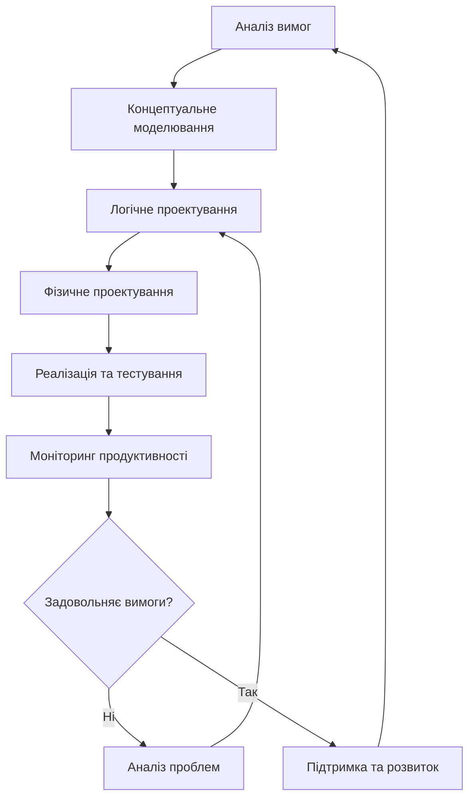

# Лекція 7. Логічне та фізичне проектування

## Вступ

Процес проектування бази даних складається з кількох етапів, кожен з яких має свою специфіку та призначення. Після створення концептуальної моделі, яка відображає структуру предметної області в незалежному від технології вигляді, необхідно перейти до наступних етапів: логічного та фізичного проектування.

Логічне проектування передбачає перетворення концептуальної моделі в модель даних, підтримувану конкретною СУБД, але ще не прив'язану до специфічних параметрів продуктивності та зберігання. Фізичне проектування, у свою чергу, визначає конкретні способи зберігання даних на фізичних носіях з метою оптимізації продуктивності системи.

## Логічне проектування

### Відображення концептуальної схеми в реляційну модель

Процес трансформації концептуальної моделі (зазвичай представленої у вигляді ER-діаграми) в реляційну схему називається логічним відображенням. Цей процес включає систематичне перетворення всіх елементів концептуальної моделі в реляційні конструкції.

#### Основні правила відображення

**1. Відображення сутностей**

Кожна сутність концептуальної моделі перетворюється на окрему таблицю. Атрибути сутності стають стовпцями таблиці, а первинний ключ сутності визначає первинний ключ таблиці.

```sql
-- Концептуальна сутність СТУДЕНТ
-- Атрибути: номер_студента, ім'я, прізвище, дата_народження, email

-- Відображення в реляційну таблицю
CREATE TABLE students (
    student_id INT PRIMARY KEY,
    first_name VARCHAR(50) NOT NULL,
    last_name VARCHAR(50) NOT NULL,
    birth_date DATE,
    email VARCHAR(100) UNIQUE
);
```

**2. Відображення зв'язків "один-до-багатьох"**

Зв'язки типу "один-до-багатьох" реалізуються через додавання зовнішнього ключа до таблиці на стороні "багато". Зовнішній ключ посилається на первинний ключ таблиці на стороні "один".

```sql
-- Зв'язок ФАКУЛЬТЕТ(1) - СТУДЕНТ(N)
CREATE TABLE faculties (
    faculty_id INT PRIMARY KEY,
    faculty_name VARCHAR(100) NOT NULL,
    dean_name VARCHAR(100)
);

CREATE TABLE students (
    student_id INT PRIMARY KEY,
    first_name VARCHAR(50) NOT NULL,
    last_name VARCHAR(50) NOT NULL,
    faculty_id INT,
    FOREIGN KEY (faculty_id) REFERENCES faculties(faculty_id)
);
```

**3. Відображення зв'язків "багато-до-багатьох"**

Зв'язки типу "багато-до-багатьох" вимагають створення окремої асоціативної таблиці (таблиці зв'язків), яка містить зовнішні ключі обох пов'язаних сутностей як частини складеного первинного ключа.

```sql
-- Зв'язок СТУДЕНТ(N) - КУРС(M)
CREATE TABLE courses (
    course_id INT PRIMARY KEY,
    course_name VARCHAR(100) NOT NULL,
    credits INT CHECK (credits > 0)
);

CREATE TABLE enrollments (
    student_id INT,
    course_id INT,
    enrollment_date DATE DEFAULT CURRENT_DATE,
    grade CHAR(2),
    PRIMARY KEY (student_id, course_id),
    FOREIGN KEY (student_id) REFERENCES students(student_id),
    FOREIGN KEY (course_id) REFERENCES courses(course_id)
);
```

**4. Відображення зв'язків "один-до-одного"**

Зв'язки "один-до-одного" можуть бути реалізовані кількома способами: об'єднанням таблиць в одну, додаванням зовнішнього ключа до однієї з таблиць, або створенням окремої таблиці зв'язків.

```sql
-- Варіант 1: Додавання зовнішнього ключа
CREATE TABLE employees (
    employee_id INT PRIMARY KEY,
    first_name VARCHAR(50) NOT NULL,
    last_name VARCHAR(50) NOT NULL,
    parking_permit_id INT UNIQUE,
    FOREIGN KEY (parking_permit_id) REFERENCES parking_permits(permit_id)
);

-- Варіант 2: Окрема таблиця зв'язків
CREATE TABLE employee_parking (
    employee_id INT PRIMARY KEY,
    permit_id INT UNIQUE,
    assignment_date DATE,
    FOREIGN KEY (employee_id) REFERENCES employees(employee_id),
    FOREIGN KEY (permit_id) REFERENCES parking_permits(permit_id)
);
```

### Стратегії реалізації ієрархій спеціалізації/узагальнення

Ієрархії спеціалізації/узагальнення в концептуальних моделях відображають відношення "ISA" (is-a) між сутностями. У реляційній моделі існує кілька стратегій їх реалізації.

#### Стратегія 1: Таблиця на ієрархію (Table per Hierarchy)

Усі класи ієрархії зберігаються в одній таблиці з додатковим дискримінаторним стовпцем для розрізнення типів.

```sql
-- Ієрархія: ОСОБА -> СТУДЕНТ, ВИКЛАДАЧ
CREATE TABLE persons (
    person_id INT PRIMARY KEY,
    person_type VARCHAR(20) NOT NULL, -- 'STUDENT' або 'TEACHER'
    first_name VARCHAR(50) NOT NULL,
    last_name VARCHAR(50) NOT NULL,
    birth_date DATE,

    -- Атрибути студента
    student_number VARCHAR(20),
    enrollment_year INT,

    -- Атрибути викладача
    employee_number VARCHAR(20),
    department VARCHAR(50),
    salary DECIMAL(10,2),

    CHECK (
        (person_type = 'STUDENT' AND student_number IS NOT NULL) OR
        (person_type = 'TEACHER' AND employee_number IS NOT NULL)
    )
);
```

**Переваги:**
- Простота запитів, що стосуються базового класу
- Високра продуктивність для запитів поліморфного типу
- Легкість підтримки зв'язків з базовим класом

**Недоліки:**
- Значна кількість NULL-значень
- Складність забезпечення цілісності специфічних атрибутів
- Неефективне використання простору

#### Стратегія 2: Таблиця на клас (Table per Class)

Кожен клас ієрархії має власну таблицю з усіма атрибутами (успадкованими та власними).

```sql
CREATE TABLE students (
    person_id INT PRIMARY KEY,
    first_name VARCHAR(50) NOT NULL,
    last_name VARCHAR(50) NOT NULL,
    birth_date DATE,
    student_number VARCHAR(20) UNIQUE NOT NULL,
    enrollment_year INT NOT NULL
);

CREATE TABLE teachers (
    person_id INT PRIMARY KEY,
    first_name VARCHAR(50) NOT NULL,
    last_name VARCHAR(50) NOT NULL,
    birth_date DATE,
    employee_number VARCHAR(20) UNIQUE NOT NULL,
    department VARCHAR(50) NOT NULL,
    salary DECIMAL(10,2)
);
```

**Переваги:**
- Відсутність NULL-значень
- Ясна структура та проста валідація
- Ефективне використання простору

**Недоліки:**
- Дублювання структури базових атрибутів
- Складність поліморфних запитів
- Складність підтримки змін в базовому класі

#### Стратегія 3: Таблиця на підклас (Table per Subclass)

Створюється таблиця для базового класу та окремі таблиці для кожного підкласу, які посилаються на базову через зовнішній ключ.

```sql
CREATE TABLE persons (
    person_id INT PRIMARY KEY,
    first_name VARCHAR(50) NOT NULL,
    last_name VARCHAR(50) NOT NULL,
    birth_date DATE
);

CREATE TABLE students (
    person_id INT PRIMARY KEY,
    student_number VARCHAR(20) UNIQUE NOT NULL,
    enrollment_year INT NOT NULL,
    FOREIGN KEY (person_id) REFERENCES persons(person_id)
);

CREATE TABLE teachers (
    person_id INT PRIMARY KEY,
    employee_number VARCHAR(20) UNIQUE NOT NULL,
    department VARCHAR(50) NOT NULL,
    salary DECIMAL(10,2),
    FOREIGN KEY (person_id) REFERENCES persons(person_id)
);
```

**Переваги:**
- Нормалізована структура без дублювання
- Легкість додавання нових підкласів
- Ефективна підтримка зв'язків з базовим класом

**Недоліки:**
- Необхідність JOIN-операцій для отримання повної інформації
- Складність забезпечення того, що кожна особа належить рівно одному підкласу

### Вибір первинних ключів

Первинний ключ є фундаментальним елементом реляційної таблиці, який однозначно ідентифікує кожен рядок. Вибір правильної стратегії первинних ключів критично важливий для продуктивності та підтримки системи.

#### Природні ідентифікатори

Природні ключі базуються на реальних атрибутах бізнес-сутностей, які природним чином є унікальними.

```sql
-- Приклад природного ключа
CREATE TABLE countries (
    country_code CHAR(3) PRIMARY KEY, -- ISO 3166-1 alpha-3
    country_name VARCHAR(100) NOT NULL,
    capital VARCHAR(100)
);

CREATE TABLE products (
    product_sku VARCHAR(20) PRIMARY KEY, -- SKU (Stock Keeping Unit)
    product_name VARCHAR(200) NOT NULL,
    price DECIMAL(10,2),
    category_id INT
);
```

**Переваги природних ключів:**
- Мають бізнес-значення та зрозумілі користувачам
- Не потребують додаткових механізмів генерації
- Можуть використовуватися в звітах без додаткових JOIN-операцій
- Забезпечують природні зв'язки між пов'язаними системами

**Недоліки природних ключів:**
- Можуть змінюватися з часом через бізнес-вимоги
- Іноді складні або громіздкі для використання
- Можуть мати проблеми з конфіденційністю
- Ризик дублювання при інтеграції систем

#### Штучні ідентифікатори

Штучні (сурогатні) ключі створюються системою автоматично та не мають бізнес-значення.

```sql
-- Приклад штучного ключа з автоінкрементом
CREATE TABLE customers (
    customer_id SERIAL PRIMARY KEY, -- PostgreSQL SERIAL
    customer_code VARCHAR(20) UNIQUE, -- Можливий природний ключ
    company_name VARCHAR(200) NOT NULL,
    contact_email VARCHAR(100)
);

-- Приклад з UUID
CREATE EXTENSION IF NOT EXISTS "uuid-ossp";

CREATE TABLE orders (
    order_id UUID PRIMARY KEY DEFAULT uuid_generate_v4(),
    customer_id INT NOT NULL,
    order_date TIMESTAMP DEFAULT CURRENT_TIMESTAMP,
    total_amount DECIMAL(12,2),
    FOREIGN KEY (customer_id) REFERENCES customers(customer_id)
);
```

**Переваги штучних ключів:**
- Ніколи не змінюються, забезпечуючи стабільність зв'язків
- Завжди унікальні та компактні
- Не розкривають бізнес-інформацію
- Ефективні для індексування та JOIN-операцій
- Підтримують розподілене генерування (UUID)

**Недоліки штучних ключів:**
- Не мають бізнес-значення
- Потребують додаткової пам'яті
- Можуть ускладнити налагодження
- Вимагають додаткових індексів на природні атрибути

#### Гібридний підхід

Часто оптимальним рішенням є комбінування штучних та природних ключів.

```sql
CREATE TABLE employees (
    employee_id SERIAL PRIMARY KEY, -- Штучний ключ для системи
    employee_number VARCHAR(20) UNIQUE NOT NULL, -- Природний ключ для бізнесу
    ssn VARCHAR(11) UNIQUE, -- Ще один природний ідентифікатор
    first_name VARCHAR(50) NOT NULL,
    last_name VARCHAR(50) NOT NULL,
    department_id INT,
    FOREIGN KEY (department_id) REFERENCES departments(department_id)
);
```

### Денормалізація

Денормалізація є процесом навмисного відходу від нормалізованої структури даних з метою покращення продуктивності запитів. Хоча нормалізація зменшує надмірність та покращує цілісність даних, вона може призводити до складних JOIN-операцій, які знижують продуктивність.

#### Мотивація для денормалізації

**1. Продуктивність запитів**

Нормалізовані структури часто вимагають множинних JOIN-операцій для отримання даних, що може бути повільним для великих обсягів даних.

```sql
-- Нормалізована структура вимагає JOIN
SELECT
    o.order_id,
    c.company_name,
    p.product_name,
    od.quantity,
    od.unit_price
FROM orders o
JOIN customers c ON o.customer_id = c.customer_id
JOIN order_details od ON o.order_id = od.order_id
JOIN products p ON od.product_id = p.product_id
WHERE o.order_date >= '2023-01-01';
```

**2. Спрощення звітності**

Складні аналітичні запити можуть значно спроститися при денормалізованій структурі.

**3. Зменшення навантаження на систему**

Менша кількість JOIN-операцій означає менше навантаження на CPU та I/O підсистему.

#### Техніки денормалізації

**1. Дублювання атрибутів**

Копіювання часто запитуваних атрибутів з пов'язаних таблиць.

```sql
-- Денормалізована таблиця замовлень з дублюванням інформації про клієнта
CREATE TABLE orders_denormalized (
    order_id INT PRIMARY KEY,
    customer_id INT,
    customer_name VARCHAR(200), -- Дубльована з customers
    customer_city VARCHAR(100), -- Дубльована з customers
    order_date DATE,
    total_amount DECIMAL(12,2),

    -- Зберігаємо зв'язок для цілісності
    FOREIGN KEY (customer_id) REFERENCES customers(customer_id)
);
```

**2. Передобчислені агрегати**

Зберігання результатів обчислень для уникнення повторних розрахунків.

```sql
-- Таблиця з передобчисленими сумами
CREATE TABLE customer_summary (
    customer_id INT PRIMARY KEY,
    total_orders INT DEFAULT 0,
    total_amount DECIMAL(15,2) DEFAULT 0,
    last_order_date DATE,
    average_order_value DECIMAL(10,2),

    FOREIGN KEY (customer_id) REFERENCES customers(customer_id)
);

-- Тригер для оновлення агрегатів
CREATE OR REPLACE FUNCTION update_customer_summary()
RETURNS TRIGGER AS $$
BEGIN
    UPDATE customer_summary
    SET
        total_orders = (SELECT COUNT(*) FROM orders WHERE customer_id = NEW.customer_id),
        total_amount = (SELECT COALESCE(SUM(total_amount), 0) FROM orders WHERE customer_id = NEW.customer_id),
        last_order_date = (SELECT MAX(order_date) FROM orders WHERE customer_id = NEW.customer_id),
        average_order_value = (SELECT AVG(total_amount) FROM orders WHERE customer_id = NEW.customer_id)
    WHERE customer_id = NEW.customer_id;

    RETURN NEW;
END;
$$ LANGUAGE plpgsql;
```

**3. Розгортання ієрархій**

Перетворення ієрархічних структур у плоскі таблиці.

```sql
-- Замість ієрархії категорій
CREATE TABLE product_categories_flat (
    product_id INT,
    category_level_1 VARCHAR(100),
    category_level_2 VARCHAR(100),
    category_level_3 VARCHAR(100),
    product_name VARCHAR(200),

    PRIMARY KEY (product_id),
    FOREIGN KEY (product_id) REFERENCES products(product_id)
);
```

**4. Горизонтальне дублювання**

Розбиття великих таблиць на менші за певними критеріями.

```sql
-- Розбиття за роками
CREATE TABLE orders_2023 (
    CHECK (order_date >= '2023-01-01' AND order_date < '2024-01-01')
) INHERITS (orders);

CREATE TABLE orders_2024 (
    CHECK (order_date >= '2024-01-01' AND order_date < '2025-01-01')
) INHERITS (orders);
```

#### Ризики денормалізації

**1. Проблеми цілісності даних**

Дублювання даних створює ризик неузгодженості.

**2. Ускладнення оновлень**

Зміни повинні поширюватися на всі дубльовані місця.

**3. Збільшення обсягу даних**

Дублювання збільшує потребу в дисковому просторі.

**4. Складність підтримки**

Денормалізовані структури важче розуміти та підтримувати.

## Фізичне проектування

Фізичне проектування визначає, як логічна модель даних буде реалізована на конкретній апаратній та програмній платформі. Цей етап критично важливий для забезпечення необхідної продуктивності системи.

### Розміщення файлів

Правильне розміщення файлів бази даних на фізичних пристроях може суттєво вплинути на продуктивність системи.

#### Стратегії розміщення

**1. Розділення за типом активності**

```sql
-- PostgreSQL: Розміщення на різних табличних просторах
CREATE TABLESPACE fast_ssd LOCATION '/fast_ssd/pg_data';
CREATE TABLESPACE archive_hdd LOCATION '/archive_hdd/pg_data';

-- Активні таблиці на швидких дисках
CREATE TABLE current_orders (
    order_id SERIAL PRIMARY KEY,
    customer_id INT,
    order_date DATE DEFAULT CURRENT_DATE,
    status VARCHAR(20)
) TABLESPACE fast_ssd;

-- Архівні дані на повільніших, але більших дисках
CREATE TABLE archived_orders (
    order_id INT PRIMARY KEY,
    customer_id INT,
    order_date DATE,
    status VARCHAR(20)
) TABLESPACE archive_hdd;
```

**2. Розділення даних та індексів**

```sql
-- Створення окремих табличних просторів
CREATE TABLESPACE data_space LOCATION '/data_drives/pg_data';
CREATE TABLESPACE index_space LOCATION '/index_drives/pg_data';

-- Таблиця на одному пристрої
CREATE TABLE products (
    product_id SERIAL PRIMARY KEY,
    name VARCHAR(200),
    description TEXT,
    price DECIMAL(10,2)
) TABLESPACE data_space;

-- Індекси на іншому пристрою
CREATE INDEX idx_products_name ON products(name) TABLESPACE index_space;
CREATE INDEX idx_products_price ON products(price) TABLESPACE index_space;
```

**3. Розподіл за частотою доступу**

```sql
-- Часто запитувані таблиці на SSD
CREATE TABLESPACE hot_data LOCATION '/nvme_ssd/pg_data';

-- Рідко запитувані таблиці на HDD
CREATE TABLESPACE cold_data LOCATION '/slow_hdd/pg_data';

CREATE TABLE user_sessions (
    session_id UUID PRIMARY KEY,
    user_id INT,
    login_time TIMESTAMP,
    last_activity TIMESTAMP
) TABLESPACE hot_data;

CREATE TABLE audit_logs (
    log_id BIGSERIAL PRIMARY KEY,
    table_name VARCHAR(100),
    operation VARCHAR(10),
    old_values JSONB,
    new_values JSONB,
    timestamp TIMESTAMP DEFAULT CURRENT_TIMESTAMP
) TABLESPACE cold_data;
```

### Кластеризація

Кластеризація визначає фізичний порядок зберігання рядків у таблиці, що може значно покращити продуктивність певних типів запитів.

#### Кластеризація за індексом

```sql
-- Створення індексу для кластеризації
CREATE INDEX idx_orders_date ON orders(order_date);

-- Кластеризація таблиці за датою
CLUSTER orders USING idx_orders_date;

-- Перевірка ефективності
EXPLAIN (ANALYZE, BUFFERS)
SELECT * FROM orders
WHERE order_date BETWEEN '2023-01-01' AND '2023-01-31';
```

#### Переваги кластеризації

**1. Покращення локальності даних**

Пов'язані рядки зберігаються фізично поруч, що зменшує кількість дискових операцій.

**2. Ефективніші діапазонні запити**

Запити за діапазонами значень виконуються швидше.

**3. Покращення стиснення**

Подібні дані стискаються краще.

#### Недоліки кластеризації

**1. Накладні витрати на підтримку**

Вставки можуть бути повільнішими через необхідність підтримання порядку.

**2. Потреба в перекластеризації**

З часом ефективність кластеризації знижується.

### Розподіл (Partitioning)

Розподіл дозволяє розбити велику таблицю на менші, більш керовані частини.

#### Горизонтальний розподіл

**1. Розподіл за діапазонами**

```sql
-- Батьківська таблиця
CREATE TABLE sales (
    sale_id SERIAL,
    sale_date DATE NOT NULL,
    customer_id INT,
    amount DECIMAL(10,2)
) PARTITION BY RANGE (sale_date);

-- Секції за місяцями
CREATE TABLE sales_2023_01 PARTITION OF sales
    FOR VALUES FROM ('2023-01-01') TO ('2023-02-01');

CREATE TABLE sales_2023_02 PARTITION OF sales
    FOR VALUES FROM ('2023-02-01') TO ('2023-03-01');

CREATE TABLE sales_2023_03 PARTITION OF sales
    FOR VALUES FROM ('2023-03-01') TO ('2023-04-01');
```

**2. Розподіл за хешем**

```sql
-- Розподіл за хешем customer_id
CREATE TABLE user_activities (
    activity_id SERIAL,
    user_id INT NOT NULL,
    activity_type VARCHAR(50),
    timestamp TIMESTAMP DEFAULT CURRENT_TIMESTAMP
) PARTITION BY HASH (user_id);

-- Створення секцій
CREATE TABLE user_activities_0 PARTITION OF user_activities
    FOR VALUES WITH (modulus 4, remainder 0);

CREATE TABLE user_activities_1 PARTITION OF user_activities
    FOR VALUES WITH (modulus 4, remainder 1);

CREATE TABLE user_activities_2 PARTITION OF user_activities
    FOR VALUES WITH (modulus 4, remainder 2);

CREATE TABLE user_activities_3 PARTITION OF user_activities
    FOR VALUES WITH (modulus 4, remainder 3);
```

**3. Розподіл за списком**

```sql
-- Розподіл за регіонами
CREATE TABLE regional_sales (
    sale_id SERIAL,
    region VARCHAR(50) NOT NULL,
    customer_id INT,
    amount DECIMAL(10,2)
) PARTITION BY LIST (region);

CREATE TABLE sales_north PARTITION OF regional_sales
    FOR VALUES IN ('North', 'Northeast', 'Northwest');

CREATE TABLE sales_south PARTITION OF regional_sales
    FOR VALUES IN ('South', 'Southeast', 'Southwest');

CREATE TABLE sales_other PARTITION OF regional_sales
    FOR VALUES IN ('East', 'West', 'Central');
```

#### Переваги розподілу

**1. Покращення продуктивності запитів**

Запити можуть виконуватися тільки на релевантних секціях.

**2. Простіше обслуговування**

Можна виконувати операції обслуговування на окремих секціях.

**3. Паралельна обробка**

Різні секції можуть оброблятися паралельно.

**4. Ефективне видалення старих даних**

Можна швидко видалити цілу секцію замість окремих рядків.

### Індексні стратегії

Правильний вибір та розміщення індексів є критично важливим для продуктивності.

#### Типи індексів та їх застосування

**1. B-tree індекси (за замовчуванням)**

```sql
-- Стандартний B-tree індекс
CREATE INDEX idx_customers_email ON customers(email);

-- Складений індекс
CREATE INDEX idx_orders_customer_date ON orders(customer_id, order_date);

-- Частковий індекс
CREATE INDEX idx_active_customers ON customers(customer_id)
WHERE status = 'ACTIVE';
```

**2. Hash індекси**

```sql
-- Hash індекс для точних пошуків
CREATE INDEX idx_products_sku_hash ON products USING HASH(product_sku);
```

**3. GIN індекси для JSONB**

```sql
-- Індекс для JSON даних
CREATE INDEX idx_product_attributes ON products USING GIN(attributes);

-- Запит з використанням GIN індексу
SELECT * FROM products
WHERE attributes @> '{"color": "red"}';
```

**4. GiST індекси для геометричних даних**

```sql
-- Індекс для геопросторових даних
CREATE INDEX idx_locations_point ON locations USING GIST(coordinates);
```

### Моніторинг та оптимізація

Фізичне проектування вимагає постійного моніторингу та оптимізації.

#### Інструменти аналізу

```sql
-- Аналіз використання індексів
SELECT
    schemaname,
    tablename,
    indexname,
    idx_scan,
    idx_tup_read,
    idx_tup_fetch
FROM pg_stat_user_indexes
ORDER BY idx_scan DESC;

-- Аналіз розміру таблиць
SELECT
    schemaname,
    tablename,
    pg_size_pretty(pg_total_relation_size(schemaname||'.'||tablename)) as size
FROM pg_tables
WHERE schemaname = 'public'
ORDER BY pg_total_relation_size(schemaname||'.'||tablename) DESC;
```

#### Оптимізація запитів

```sql
-- Використання EXPLAIN для аналізу планів виконання
EXPLAIN (ANALYZE, BUFFERS, VERBOSE)
SELECT c.company_name, COUNT(o.order_id) as order_count
FROM customers c
LEFT JOIN orders o ON c.customer_id = o.customer_id
WHERE c.registration_date >= '2023-01-01'
GROUP BY c.customer_id, c.company_name
HAVING COUNT(o.order_id) > 5;
```

## Практичні рекомендації

### Етапність проектування

1. **Починайте з нормалізованої структури** — завжди спочатку створюйте правильно нормалізовану логічну модель.
2. **Ідентифікуйте критичні запити** — визначте найважливіші запити для вашої системи.
3. **Вимірюйте продуктивність** — завжди вимірюйте продуктивність перед оптимізацією.
4. **Поступова денормалізація** — денормалізуйте тільки там, де це дійсно необхідно.
5. **Моніторинг в продукції** — встановіть системи моніторингу для відстеження продуктивності.

### Загальні принципи

- **Правило 80/20** — 80% запитів зазвичай стосуються 20% даних
- **Індекси не безкоштовні** — кожен індекс сповільнює операції модифікації
- **Тестування на реальних даних** — тестуйте продуктивність на обсягах даних, близьких до продукційних
- **Еволюційний підхід** — проектування бази даних є ітеративним процесом
- **Документування рішень** — завжди документуйте причини прийняття проектних рішень

### Типові помилки та як їх уникати

**1. Передчасна оптимізація**

Найпоширенішою помилкою є спроба оптимізувати продуктивність до того, як система почне працювати та будуть зібрані реальні метрики використання.

```sql
-- Неправильно: створення індексів "на всякий випадок"
CREATE INDEX idx_users_first_name ON users(first_name);
CREATE INDEX idx_users_last_name ON users(last_name);
CREATE INDEX idx_users_middle_name ON users(middle_name);
CREATE INDEX idx_users_phone ON users(phone);

-- Правильно: створення індексів на основі реальних запитів
-- Спочатку аналізуємо, які запити виконуються найчастіше
SELECT query, calls, mean_time, total_time
FROM pg_stat_statements
ORDER BY total_time DESC
LIMIT 10;

-- Потім створюємо відповідні індекси
CREATE INDEX idx_users_email ON users(email); -- для автентифікації
CREATE INDEX idx_users_status_created ON users(status, created_at); -- для адмін-панелі
```

**2. Ігнорування кардинальності**

Створення індексів на стовпці з низькою кардинальністю (малою кількістю унікальних значень) зазвичай неефективне.

```sql
-- Неефективний індекс на стовпці з низькою кардинальністю
CREATE INDEX idx_orders_status ON orders(status); -- тільки 5-10 різних статусів

-- Краще: складений індекс з високою селективністю
CREATE INDEX idx_orders_status_date ON orders(status, order_date)
WHERE status IN ('PENDING', 'PROCESSING'); -- частковий індекс
```

**3. Неправильна денормалізація**

Денормалізація без розуміння паттернів доступу до даних може призвести до проблем із цілісністю.

```sql
-- Проблематична денормалізація
CREATE TABLE orders_bad (
    order_id INT PRIMARY KEY,
    customer_name VARCHAR(200), -- дубльоване з customers
    customer_email VARCHAR(100), -- дубльоване з customers
    product_name VARCHAR(200), -- проблема для замовлень з кількома товарами
    quantity INT,
    total_amount DECIMAL(10,2)
);

-- Правильний підхід: денормалізація тільки стабільних даних
CREATE TABLE orders_optimized (
    order_id INT PRIMARY KEY,
    customer_id INT,
    customer_name_snapshot VARCHAR(200), -- знімок на момент замовлення
    order_date DATE,
    total_amount DECIMAL(10,2),

    FOREIGN KEY (customer_id) REFERENCES customers(customer_id)
);
```

## Інструменти та методології

### Інструменти для логічного проектування

**1. ERD (Entity-Relationship Diagram) інструменти**

- **MySQL Workbench** — безкоштовний інструмент з можливістю зворотного інжинірингу
- **PostgreSQL pgAdmin** — вбудовані можливості візуального проектування
- **Draw.io / Lucidchart** — веб-інструменти для створення діаграм
- **ERwin Data Modeler** — професійний інструмент для корпоративного моделювання

**2. Автоматизація генерації схем**

```sql
-- Використання міграцій для версіонування схеми (приклад Flyway)
-- V1__Create_initial_schema.sql
CREATE TABLE customers (
    customer_id SERIAL PRIMARY KEY,
    company_name VARCHAR(200) NOT NULL,
    created_at TIMESTAMP DEFAULT CURRENT_TIMESTAMP
);

-- V2__Add_customer_email.sql
ALTER TABLE customers ADD COLUMN email VARCHAR(100);
CREATE UNIQUE INDEX idx_customers_email ON customers(email);

-- V3__Add_orders_table.sql
CREATE TABLE orders (
    order_id SERIAL PRIMARY KEY,
    customer_id INT NOT NULL,
    order_date DATE DEFAULT CURRENT_DATE,
    FOREIGN KEY (customer_id) REFERENCES customers(customer_id)
);
```

### Інструменти для фізичного проектування

**1. Моніторинг продуктивності**

```sql
-- Аналіз повільних запитів в PostgreSQL
SELECT
    query,
    calls,
    total_time,
    mean_time,
    rows,
    100.0 * shared_blks_hit / nullif(shared_blks_hit + shared_blks_read, 0) AS hit_percent
FROM pg_stat_statements
ORDER BY total_time DESC
LIMIT 20;

-- Аналіз використання індексів
SELECT
    t.tablename,
    indexname,
    c.reltuples AS num_rows,
    pg_size_pretty(pg_relation_size(quote_ident(t.tablename)::text)) AS table_size,
    pg_size_pretty(pg_relation_size(quote_ident(indexrelname)::text)) AS index_size,
    CASE WHEN indisunique THEN 'Y' ELSE 'N' END AS unique,
    idx_scan AS number_of_scans,
    idx_tup_read AS tuples_read,
    idx_tup_fetch AS tuples_fetched
FROM pg_tables t
LEFT OUTER JOIN pg_class c ON c.relname=t.tablename
LEFT OUTER JOIN (
    SELECT
        c.relname AS ctablename,
        ipg.relname AS indexname,
        x.indnatts AS number_of_columns,
        idx_scan,
        idx_tup_read,
        idx_tup_fetch,
        indexrelname,
        indisunique
    FROM pg_index x
    JOIN pg_class c ON c.oid = x.indrelid
    JOIN pg_class ipg ON ipg.oid = x.indexrelid
    JOIN pg_stat_all_indexes psai ON x.indexrelid = psai.indexrelid
) AS foo ON t.tablename = foo.ctablename
WHERE t.schemaname='public'
ORDER BY 1,2;
```

**2. Аналіз планів виконання**

```sql
-- Детальний аналіз плану виконання
EXPLAIN (ANALYZE, BUFFERS, VERBOSE, FORMAT JSON)
SELECT
    c.company_name,
    COUNT(o.order_id) as total_orders,
    SUM(o.total_amount) as total_revenue,
    AVG(o.total_amount) as avg_order_value
FROM customers c
LEFT JOIN orders o ON c.customer_id = o.customer_id
WHERE c.created_at >= '2023-01-01'
  AND o.order_date BETWEEN '2023-01-01' AND '2023-12-31'
GROUP BY c.customer_id, c.company_name
HAVING COUNT(o.order_id) > 5
ORDER BY total_revenue DESC
LIMIT 100;
```

**3. Автоматичні рекомендації оптимізації**

```sql
-- Використання pg_stat_statements для виявлення проблемних запитів
CREATE EXTENSION IF NOT EXISTS pg_stat_statements;

-- Функція для аналізу неефективних запитів
CREATE OR REPLACE FUNCTION analyze_slow_queries()
RETURNS TABLE (
    query_text TEXT,
    total_time_minutes NUMERIC,
    avg_time_ms NUMERIC,
    calls BIGINT,
    optimization_suggestion TEXT
) AS $
BEGIN
    RETURN QUERY
    SELECT
        LEFT(pss.query, 100) as query_text,
        ROUND(pss.total_time / 1000.0 / 60.0, 2) as total_time_minutes,
        ROUND(pss.mean_time, 2) as avg_time_ms,
        pss.calls,
        CASE
            WHEN pss.mean_time > 1000 THEN 'Consider adding indexes or query optimization'
            WHEN pss.calls > 10000 AND pss.mean_time > 100 THEN 'High frequency query needs optimization'
            WHEN pss.total_time > 300000 THEN 'Major contributor to system load'
            ELSE 'Monitor performance'
        END as optimization_suggestion
    FROM pg_stat_statements pss
    WHERE pss.total_time > 60000 -- більше 1 хвилини загального часу
    ORDER BY pss.total_time DESC;
END;
$ LANGUAGE plpgsql;
```

### Методології проектування

**1. Ітеративне проектування**

Процес проектування повинен бути ітеративним, з постійним уточненням та покращенням схеми на основі нових вимог та даних про продуктивність.



**2. Прототипування**

Створення прототипів з реальними або близькими до реальних обсягами даних для тестування проектних рішень.

```sql
-- Генерація тестових даних для прототипування
CREATE OR REPLACE FUNCTION generate_test_customers(num_customers INT)
RETURNS VOID AS $
DECLARE
    i INT;
BEGIN
    FOR i IN 1..num_customers LOOP
        INSERT INTO customers (
            company_name,
            email,
            created_at
        ) VALUES (
            'Company ' || i,
            'customer' || i || '@example.com',
            CURRENT_DATE - (random() * 365)::INT
        );
    END LOOP;
END;
$ LANGUAGE plpgsql;

-- Генерація 100,000 клієнтів для тестування
SELECT generate_test_customers(100000);

-- Генерація замовлень з реалістичним розподілом
CREATE OR REPLACE FUNCTION generate_test_orders(num_orders INT)
RETURNS VOID AS $
DECLARE
    customer_count INT;
    random_customer_id INT;
    i INT;
BEGIN
    SELECT COUNT(*) INTO customer_count FROM customers;

    FOR i IN 1..num_orders LOOP
        SELECT customer_id INTO random_customer_id
        FROM customers
        ORDER BY random()
        LIMIT 1;

        INSERT INTO orders (
            customer_id,
            order_date,
            total_amount
        ) VALUES (
            random_customer_id,
            CURRENT_DATE - (random() * 180)::INT,
            (random() * 5000 + 100)::DECIMAL(10,2)
        );
    END LOOP;
END;
$ LANGUAGE plpgsql;

-- Генерація 1,000,000 замовлень
SELECT generate_test_orders(1000000);
```

## Висновки

Логічне та фізичне проектування баз даних є критично важливими етапами розробки інформаційних систем, які значною мірою визначають їх продуктивність, масштабованість та підтримуваність.

### Ключові принципи логічного проектування

1. **Систематичність відображення** — використовуйте чіткі правила для перетворення концептуальної моделі в логічну схему.
2. **Гнучкість у виборі стратегій** — різні типи зв'язків та ієрархій можуть вимагати різних підходів до реалізації.
3. **Баланс між нормалізацією та практичністю** — не завжди найвища нормальна форма є оптимальною для реальних застосувань.
4. **Врахування майбутніх потреб** — проектуйте з урахуванням можливого розширення та еволюції системи.

### Ключові принципи фізичного проектування

1. **Врахування характеристик навантаження** — проектування повинно базуватися на реальних патернах використання даних.
2. **Ітеративна оптимізація** — фізичне проектування є процесом постійного вдосконалення на основі моніторингу.
3. **Збалансованість рішень** — кожне рішення про оптимізацію має переваги та недоліки, які необхідно враховувати.
4. **Використання інструментів моніторингу** — сучасні СУБД надають потужні інструменти для аналізу продуктивності.

### Рекомендації для практичного застосування

- Завжди починайте з правильно нормалізованої логічної схеми
- Вимірюйте продуктивність перед оптимізацією
- Документуйте всі проектні рішення та їх обґрунтування
- Використовуйте системи контролю версій для схем баз даних
- Регулярно переглядайте та оновлюйте фізичне проектування

Правильне проектування на логічному та фізичному рівнях створює міцну основу для побудови ефективних, масштабованих та підтримуваних систем управління даними, які можуть адаптуватися до змінних потреб бізнесу та зростання обсягів інформації.
