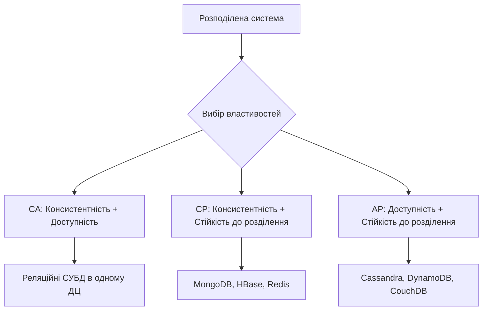
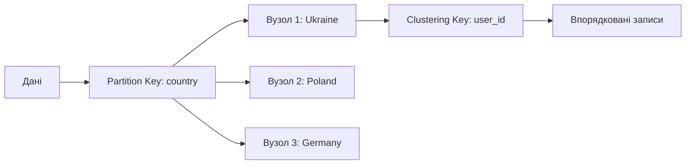
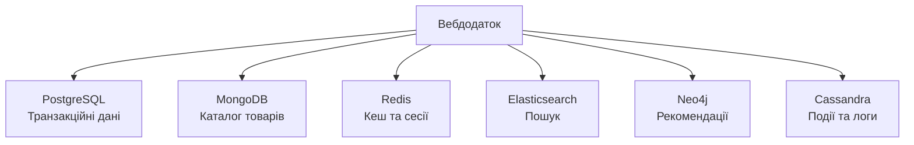

# Лекція 11. Теоретичні основи NoSQL систем

## Вступ

Протягом кількох десятиліть реляційні системи управління базами даних залишалися домінуючим рішенням для зберігання та обробки структурованих даних. Однак стрімкий розвиток вебтехнологій, зростання обсягів даних та поява розподілених систем планетарного масштабу виявили принципові обмеження реляційної моделі. Ці виклики призвели до виникнення нового класу систем управління даними, відомих як NoSQL (Not Only SQL), які пропонують альтернативні підходи до організації та обробки інформації.

У цій лекції розглянемо фундаментальні причини виникнення NoSQL систем, проаналізуємо теоретичні основи їх функціонування, вивчимо основні типи NoSQL баз даних та з'ясуємо, коли доцільно використовувати той чи інший підхід.

## Обмеження реляційної моделі для вебдодатків масштабу Internet

### Історичний контекст

Реляційна модель даних, запропонована Едгаром Коддом у 1970 році, була розроблена для вирішення проблем систем того часу. Основні припущення реляційної моделі включали централізоване зберігання даних, відносно невеликі обсяги інформації та передбачувану структуру даних. Однак з розвитком інтернету та появою вебдодатків глобального масштабу ці припущення перестали відповідати реальності.

### Проблема масштабування

Реляційні СУБД традиційно масштабуються вертикально, тобто шляхом збільшення потужності одного сервера. Це створює природні фізичні та економічні обмеження.

**Вертикальне масштабування:**
- Збільшення оперативної пам'яті
- Додавання більш потужних процесорів
- Використання швидших дисків
- Обмежена максимальна потужність одного сервера
- Експоненційне зростання вартості при підвищенні потужності

**Обмеження вертикального масштабування:**
- Фізичні межі апаратного забезпечення
- Надзвичайно висока вартість топових серверів
- Єдина точка відмови
- Складність забезпечення високої доступності

На противагу цьому, горизонтальне масштабування передбачає додавання нових серверів до кластера. Реляційні бази даних важко масштабуються горизонтально через необхідність підтримки властивостей ACID та складність розподілу даних між вузлами.

### Жорсткість схеми даних

Реляційна модель вимагає визначення фіксованої схеми до внесення даних. Кожна таблиця має чітко визначені стовпці з конкретними типами даних. Зміна схеми в робочій системі з мільйонами записів може бути складною та ресурсовитратною операцією.

**Проблеми жорсткої схеми:**

```sql
-- Початкова схема користувача
CREATE TABLE users (
    user_id INT PRIMARY KEY,
    username VARCHAR(50),
    email VARCHAR(100),
    created_at TIMESTAMP
);

-- Через деякий час потрібно додати опціональні поля
ALTER TABLE users ADD COLUMN phone VARCHAR(20);
ALTER TABLE users ADD COLUMN address TEXT;
ALTER TABLE users ADD COLUMN preferences JSON;

-- Проблема: всі існуючі записи мають NULL для нових полів
-- Міграція великої таблиці може тривати години
```

У сучасних вебдодатках часто виникає потреба швидко адаптувати структуру даних до нових вимог. Наприклад, соціальна мережа може додавати нові типи користувацького контенту, а інтернетмагазин - нові категорії товарів з різними атрибутами.

### Складність відображення об'єктів на реляційну модель

Сучасні додатки зазвичай розробляються з використанням об'єктноорієнтованого програмування. Відображення складних об'єктних структур на плоскі реляційні таблиці створює так званий impedance mismatch.

**Приклад складного об'єкта:**

```javascript
// Об'єкт користувача в додатку
const user = {
    id: "user123",
    name: "Іван Петров",
    email: "ivan@example.com",
    addresses: [
        {
            type: "home",
            street: "вул. Хрещатик, 1",
            city: "Київ",
            country: "Україна"
        },
        {
            type: "work",
            street: "просп. Перемоги, 50",
            city: "Київ",
            country: "Україна"
        }
    ],
    preferences: {
        language: "uk",
        notifications: {
            email: true,
            sms: false,
            push: true
        },
        theme: "dark"
    },
    orders: [/* масив замовлень */]
};
```

Для зберігання такого об'єкта в реляційній базі даних потрібно створити кілька таблиць та складні зв'язки:

```sql
-- Необхідні таблиці для реляційного представлення
CREATE TABLE users (
    user_id VARCHAR(50) PRIMARY KEY,
    name VARCHAR(100),
    email VARCHAR(100)
);

CREATE TABLE addresses (
    address_id INT PRIMARY KEY AUTO_INCREMENT,
    user_id VARCHAR(50),
    address_type VARCHAR(20),
    street VARCHAR(100),
    city VARCHAR(50),
    country VARCHAR(50),
    FOREIGN KEY (user_id) REFERENCES users(user_id)
);

CREATE TABLE preferences (
    user_id VARCHAR(50) PRIMARY KEY,
    language VARCHAR(10),
    theme VARCHAR(20),
    FOREIGN KEY (user_id) REFERENCES users(user_id)
);

CREATE TABLE notification_settings (
    user_id VARCHAR(50) PRIMARY KEY,
    email_enabled BOOLEAN,
    sms_enabled BOOLEAN,
    push_enabled BOOLEAN,
    FOREIGN KEY (user_id) REFERENCES users(user_id)
);
```

Отримання повної інформації про користувача вимагає складного запиту з кількома JOIN операціями, що негативно впливає на продуктивність.

### Проблеми з великими обсягами даних

Сучасні вебдодатки генерують величезні обсяги даних. Соціальні мережі, системи аналітики, IoT пристрої створюють потоки інформації, які складно обробляти традиційними реляційними системами.

**Характеристики великих даних:**
- Обсяг: петабайти та ексабайти інформації
- Швидкість: потокові дані в реальному часі
- Різноманітність: структуровані, напівструктуровані та неструктуровані дані
- Достовірність: необхідність обробки неповних або неточних даних

Реляційні системи оптимізовані для транзакційної обробки невеликих обсягів даних з високою консистентністю, що не завжди відповідає вимогам систем обробки великих даних.

### Географічна розподіленість

Глобальні вебдодатки обслуговують користувачів з різних регіонів світу. Для забезпечення низької затримки доступу до даних необхідно розміщувати копії даних близько до користувачів. Реляційні СУБД традиційно не розроблялися для роботи в географічно розподілених середовищах.

**Виклики географічної розподіленості:**
- Високі мережеві затримки між датацентрами
- Необхідність реплікації даних між регіонами
- Складність забезпечення консистентності при розподіленні
- Вимоги до локалізації даних відповідно до законодавства

## Теорема CAP: консистентність, доступність, стійкість до розділення мережі

### Формулювання теореми

У 2000 році Ерік Брюер сформулював гіпотезу, яка пізніше отримала назву теореми CAP (також відома як теорема Брюера). Вона стверджує, що розподілена система не може одночасно гарантувати всі три наступні властивості:

**Consistency (Консистентність):** усі вузли системи бачать одні й ті самі дані в один і той самий момент часу. Після завершення операції запису всі наступні операції читання повертають щойно записане значення.

**Availability (Доступність):** кожний запит до системи отримує відповідь про успішне або неуспішне виконання операції. Система залишається операційною навіть при відмові частини вузлів.

**Partition Tolerance (Стійкість до розділення):** система продовжує функціонувати навіть при втраті або затримці довільної кількості повідомлень між вузлами. Мережеві розділення не призводять до повної відмови системи.



### Докази теореми

У 2002 році Сет Гілберт та Ненсі Лінч формально довели теорему CAP. Їхній доказ базується на простому міркуванні про неможливість одночасного задоволення всіх трьох властивостей у розподілених системах.

**Основна ідея доказу:**

Припустімо, що існує розподілена система з принаймні двома вузлами, які можуть втратити зв'язок між собою (partition tolerance). Розглянемо ситуацію, коли мережа розділилася на дві частини:

1. Клієнт виконує запис даних на вузол A
2. Мережа розділяється, і вузли A та B більше не можуть обмінюватися даними
3. Інший клієнт намагається прочитати дані з вузла B

У цій ситуації система має два варіанти:

**Варіант 1:** Повернути старе значення (порушення консистентності)
- Система залишається доступною
- Зберігається стійкість до розділення
- Втрачається консистентність

**Варіант 2:** Відхилити запит читання (порушення доступності)
- Зберігається консистентність
- Зберігається стійкість до розділення
- Втрачається доступність

### Практичне застосування теореми CAP

У реальних системах вибір між властивостями CAP не є бінарним. Сучасні розподілені системи пропонують різні рівні компромісів між цими властивостями.

**CA системи (Консистентність + Доступність):**

Традиційні реляційні СУБД в одному датацентрі зазвичай належать до цієї категорії. Вони гарантують консистентність та доступність, але не витримують мережевих розділень.

```sql
-- PostgreSQL з синхронною реплікацією
-- Гарантує консистентність та доступність
-- Але при втраті зв'язку з репліками може стати недоступною

BEGIN TRANSACTION;
UPDATE accounts SET balance = balance - 100 WHERE account_id = 1;
UPDATE accounts SET balance = balance + 100 WHERE account_id = 2;
COMMIT;

-- Транзакція виконується атомарно на всіх репліках
-- або відкочується повністю
```

**CP системи (Консистентність + Стійкість до розділення):**

Системи типу MongoDB, HBase, Redis Cluster обирають консистентність перед доступністю. При мережевому розділенні частина вузлів може стати недоступною для запису.

```javascript
// MongoDB з налаштуванням write concern "majority"
db.users.insertOne(
    { name: "Іван Петров", email: "ivan@example.com" },
    { writeConcern: { w: "majority", wtimeout: 5000 } }
);

// Запис підтверджується тільки після реплікації
// на більшість вузлів
// При мережевому розділенні операція може не виконатися
```

**AP системи (Доступність + Стійкість до розділення):**

Системи типу Cassandra, DynamoDB, CouchDB віддають перевагу доступності перед консистентністю. Вони дозволяють операції читання та запису навіть при мережевих розділеннях, але можуть повертати застарілі дані.

```javascript
// Cassandra з рівнем консистентності ONE
client.execute(
    'INSERT INTO users (user_id, name, email) VALUES (?, ?, ?)',
    [uuid(), 'Іван Петров', 'ivan@example.com'],
    { consistency: consistencies.one }
);

// Запис підтверджується відразу після збереження
// на одному вузлі
// Дані поступово реплікуються на інші вузли
```

### Розширення теореми CAP

Дослідники виявили, що теорема CAP є спрощенням реальної ситуації. У 2012 році Ерік Брюер уточнив свою теорему, зазначивши що вибір між C та A не є абсолютним і може бути адаптивним.

**PACELC розширення:**

Даніель Абаді запропонував розширення CAP у вигляді теореми PACELC:
- **P**artition: при мережевому розділенні треба обрати між **A**vailability та **C**onsistency
- **E**lse: у нормальній роботі треба обрати між **L**atency та **C**onsistency

Це розширення краще відображає компроміси в реальних системах, де навіть за відсутності мережевих розділень існує вибір між швидкістю відповіді та консистентністю.

## BASE семантика: Basically Available, Soft state, Eventual consistency

### Контраст з ACID

Традиційні реляційні системи базуються на властивостях ACID:
- **Atomicity:** операції виконуються повністю або не виконуються зовсім
- **Consistency:** система переходить від одного консистентного стану до іншого
- **Isolation:** паралельні транзакції не впливають одна на одну
- **Durability:** підтверджені зміни зберігаються назавжди

NoSQL системи часто використовують альтернативний підхід, відомий як BASE:
- **Basically Available:** система гарантує доступність більшу частину часу
- **Soft state:** стан системи може змінюватися з часом навіть без нових запитів
- **Eventual consistency:** система з часом досягне консистентного стану

### Basically Available (Базова доступність)

Замість гарантії стовідсоткової доступності BASE системи прагнуть забезпечити доступність у більшості випадків. Система може тимчасово повертати неповні або приблизні дані замість того, щоб бути повністю недоступною.

**Приклад базової доступності:**

```javascript
// Система підрахунку лайків в соціальній мережі
// При високому навантаженні може повертати приблизну кількість

async function getLikesCount(postId) {
    try {
        // Спроба отримати точне значення з основної бази
        const exactCount = await db.likes.count({ postId });
        return { count: exactCount, approximate: false };
    } catch (error) {
        // При недоступності основної бази повертаємо
        // кешоване або приблизне значення
        const cachedCount = await cache.get(`likes:${postId}`);
        return { count: cachedCount || 0, approximate: true };
    }
}
```

У цьому прикладі система залишається доступною навіть при проблемах з основною базою даних, хоча повертає менш точні дані.

### Soft State (М'який стан)

На відміну від ACID систем, де стан чітко визначений та стабільний, BASE системи допускають проміжні стани. Стан системи може змінюватися з часом через процеси синхронізації, реплікації або видалення застарілих даних.

**Характеристики м'якого стану:**
- Дані можуть бути тимчасово неузгодженими між вузлами
- Система виконує фонові процеси синхронізації
- Застарілі дані можуть автоматично видалятися
- Проміжні стани є нормальною частиною роботи

**Приклад м'якого стану:**

```javascript
// Система кешування з TTL (Time To Live)
class CacheWithSoftState {
    constructor() {
        this.data = new Map();
    }

    set(key, value, ttlSeconds) {
        const expiresAt = Date.now() + (ttlSeconds * 1000);
        this.data.set(key, { value, expiresAt });

        // Фоновий процес видалення застарілих даних
        setTimeout(() => {
            const item = this.data.get(key);
            if (item && item.expiresAt <= Date.now()) {
                this.data.delete(key);
            }
        }, ttlSeconds * 1000);
    }

    get(key) {
        const item = this.data.get(key);
        if (!item) return null;

        // Стан м'який: дані можуть бути застарілими
        if (item.expiresAt <= Date.now()) {
            this.data.delete(key);
            return null;
        }

        return item.value;
    }
}
```

### Eventual Consistency (Евентуальна консистентність)

Це ключова концепція BASE семантики. Система не гарантує негайної консистентності після запису, але обіцяє, що якщо нових оновлень не буде, всі вузли з часом досягнуть однакового стану.

**Механізми досягнення евентуальної консистентності:**

**Репліка з відкладеною синхронізацією:**

```javascript
// Запис даних у головну базу
async function writeData(key, value) {
    // Негайний запис у головну базу
    await masterDB.set(key, value);

    // Асинхронна реплікація на інші вузли
    replicationQueue.add({
        operation: 'set',
        key: key,
        value: value,
        timestamp: Date.now()
    });

    return { success: true };
}

// Фоновий процес реплікації
async function replicationWorker() {
    while (true) {
        const operation = await replicationQueue.take();

        // Реплікація на кожен вузол
        for (const replica of replicas) {
            try {
                await replica.set(
                    operation.key,
                    operation.value
                );
            } catch (error) {
                // При помилці операція повертається в чергу
                replicationQueue.add(operation);
            }
        }
    }
}
```

**Vector Clocks для відстеження версій:**

Vector clocks дозволяють відстежувати причинно-наслідкові зв'язки між оновленнями в розподіленій системі.

```javascript
// Реалізація Vector Clock
class VectorClock {
    constructor() {
        this.clock = {};
    }

    increment(nodeId) {
        this.clock[nodeId] = (this.clock[nodeId] || 0) + 1;
    }

    merge(otherClock) {
        for (const [nodeId, timestamp] of Object.entries(otherClock.clock)) {
            this.clock[nodeId] = Math.max(
                this.clock[nodeId] || 0,
                timestamp
            );
        }
    }

    happensBefore(otherClock) {
        let atLeastOneSmaller = false;

        for (const nodeId in this.clock) {
            const myTimestamp = this.clock[nodeId];
            const otherTimestamp = otherClock.clock[nodeId] || 0;

            if (myTimestamp > otherTimestamp) {
                return false;
            }
            if (myTimestamp < otherTimestamp) {
                atLeastOneSmaller = true;
            }
        }

        return atLeastOneSmaller;
    }
}

// Використання Vector Clock при записі
async function writeWithVersioning(key, value, nodeId) {
    const existingData = await db.get(key);
    const vectorClock = existingData?.vectorClock || new VectorClock();

    vectorClock.increment(nodeId);

    await db.set(key, {
        value: value,
        vectorClock: vectorClock,
        timestamp: Date.now()
    });
}
```

### Конфлікти та їх розв'язання

При евентуальній консистентності можливі ситуації, коли різні вузли мають різні версії одних і тих самих даних. Системи використовують різні стратегії розв'язання конфліктів.

**Стратегія Last Write Wins:**

```javascript
// Найпростіша стратегія: перемагає останній запис
function resolveConflict(value1, value2) {
    if (value1.timestamp > value2.timestamp) {
        return value1;
    }
    return value2;
}
```

**Стратегія версіонування:**

```javascript
// Збереження всіх версій для подальшого розв'язання
class MultiVersionStore {
    constructor() {
        this.data = new Map();
    }

    write(key, value, nodeId) {
        if (!this.data.has(key)) {
            this.data.set(key, []);
        }

        const versions = this.data.get(key);
        versions.push({
            value: value,
            nodeId: nodeId,
            timestamp: Date.now()
        });
    }

    read(key, resolver) {
        const versions = this.data.get(key) || [];

        if (versions.length === 1) {
            return versions[0].value;
        }

        // Використання зовнішнього розв'язувача
        return resolver(versions);
    }
}
```

## Таксономія NoSQL систем

NoSQL системи класифікуються за моделлю даних, яку вони використовують. Кожна модель оптимізована для певних типів даних та паттернів доступу.

### Документоорієнтовані бази даних

Документоорієнтовані системи зберігають дані у вигляді документів, зазвичай у форматі JSON або BSON. Кожен документ є самодостатньою структурою даних.

**Характеристики документоорієнтованих БД:**
- Гнучка схема: різні документи можуть мати різну структуру
- Вкладені структури: підтримка складних ієрархічних даних
- Індексація: можливість створювати індекси на будь-які поля
- Запити: потужні мови запитів для пошуку та фільтрації

**Приклад документа в MongoDB:**

```javascript
{
    "_id": ObjectId("507f1f77bcf86cd799439011"),
    "type": "blog_post",
    "title": "Вступ до NoSQL систем",
    "author": {
        "name": "Іван Петров",
        "email": "ivan@example.com",
        "profile_url": "/users/ivan"
    },
    "content": "Текст статті...",
    "tags": ["nosql", "databases", "mongodb"],
    "comments": [
        {
            "user": "Марія Коваленко",
            "text": "Чудова стаття!",
            "date": ISODate("2024-01-15T10:30:00Z"),
            "likes": 5
        },
        {
            "user": "Олександр Сидоров",
            "text": "Дякую за пояснення",
            "date": ISODate("2024-01-15T14:20:00Z"),
            "likes": 3
        }
    ],
    "metadata": {
        "views": 1523,
        "shares": 47,
        "created_at": ISODate("2024-01-15T08:00:00Z"),
        "updated_at": ISODate("2024-01-15T15:30:00Z")
    }
}
```

**Типові операції:**

```javascript
// Вставка документа
db.posts.insertOne({
    title: "Нова стаття",
    author: { name: "Іван Петров" },
    tags: ["tutorial", "beginner"]
});

// Пошук документів
db.posts.find({
    "tags": "nosql",
    "metadata.views": { $gt: 1000 }
});

// Оновлення документа
db.posts.updateOne(
    { "_id": ObjectId("507f1f77bcf86cd799439011") },
    {
        $push: {
            comments: {
                user: "Новий користувач",
                text: "Коментар",
                date: new Date()
            }
        },
        $inc: { "metadata.views": 1 }
    }
);
```

**Представники:** MongoDB, CouchDB, RavenDB, DocumentDB

**Сфери застосування:**
- Системи управління контентом
- Каталоги продуктів
- Профілі користувачів
- Аналітичні системи з різнорідними даними

### Ключзначення сховища

Найпростіша модель NoSQL, яка зберігає дані як колекцію пар ключзначення. Операції обмежені простим читанням, записом та видаленням за ключем.

**Характеристики keyvalue сховищ:**
- Максимальна простота
- Найвища продуктивність
- Обмежені можливості запитів
- Відмінна масштабованість

**Приклад роботи з Redis:**

```javascript
// Простий ключзначення
await redis.set('user:1001:name', 'Іван Петров');
const name = await redis.get('user:1001:name');

// Складні структури даних
// Хеші
await redis.hset('user:1001', {
    'name': 'Іван Петров',
    'email': 'ivan@example.com',
    'age': '25'
});

// Списки
await redis.lpush('user:1001:notifications', 'Нове повідомлення');
await redis.lpush('user:1001:notifications', 'Новий коментар');

// Множини
await redis.sadd('user:1001:friends', 'user:1002', 'user:1003');

// Впорядковані множини
await redis.zadd('leaderboard', 100, 'user:1001');
await redis.zadd('leaderboard', 150, 'user:1002');
```

**Розширені можливості сучасних keyvalue сховищ:**

```javascript
// Time To Live (автоматичне видалення)
await redis.setex('session:abc123', 3600, JSON.stringify({
    userId: '1001',
    loginTime: Date.now()
}));

// Атомарні операції
await redis.incr('page:views:homepage');
await redis.hincrby('user:1001', 'points', 10);

// Pub/Sub повідомлення
await redis.publish('notifications', JSON.stringify({
    type: 'new_message',
    userId: '1001'
}));
```

**Представники:** Redis, Memcached, Amazon DynamoDB, Riak

**Сфери застосування:**
- Кешування
- Управління сесіями
- Черги повідомлень
- Лічильники та метрики
- Розподілені блокування

### Стовпцеві бази даних

Стовпцеві (column-family) бази даних організують дані в стовпці замість рядків. Це дозволяє ефективно зберігати та обробляти розріджені дані.

**Характеристики стовпцевих БД:**
- Зберігання даних по стовпцях
- Ефективна робота з розрідженими даними
- Оптимізація для аналітичних запитів
- Висока продуктивність запису

**Модель даних Cassandra:**

```javascript
// Визначення сімейства стовпців
CREATE TABLE users_by_country (
    country text,
    user_id uuid,
    name text,
    email text,
    registration_date timestamp,
    PRIMARY KEY (country, user_id)
);

// Вставка даних
INSERT INTO users_by_country (country, user_id, name, email, registration_date)
VALUES ('Ukraine', uuid(), 'Іван Петров', 'ivan@example.com', toTimestamp(now()));

// Запит даних
SELECT * FROM users_by_country
WHERE country = 'Ukraine'
AND registration_date > '2024-01-01';
```

**Розподіл даних:**



**Представники:** Apache Cassandra, Apache HBase, ScyllaDB

**Сфери застосування:**
- Системи обліку подій
- Аналітика часових рядів
- Логування та моніторинг
- Системи рекомендацій

### Графові бази даних

Графові бази даних оптимізовані для зберігання та обробки зв'язаних даних. Вони використовують вузли, ребра та властивості для представлення інформації.

**Характеристики графових БД:**
- Ефективна обробка зв'язків
- Природне представлення мережевих структур
- Потужні алгоритми обходу графів
- Гнучка модель даних

**Приклад моделі в Neo4j:**

```cypher
// Створення вузлів
CREATE (ivan:Person {name: 'Іван Петров', age: 25})
CREATE (maria:Person {name: 'Марія Коваленко', age: 23})
CREATE (kyiv:City {name: 'Київ', country: 'Україна'})
CREATE (company:Company {name: 'TechCorp', industry: 'IT'})

// Створення зв'язків
CREATE (ivan)-[:LIVES_IN]->(kyiv)
CREATE (maria)-[:LIVES_IN]->(kyiv)
CREATE (ivan)-[:WORKS_FOR {position: 'Developer', since: 2020}]->(company)
CREATE (maria)-[:WORKS_FOR {position: 'Designer', since: 2021}]->(company)
CREATE (ivan)-[:FRIEND_OF {since: 2019}]->(maria)

// Пошук друзів друзів
MATCH (person:Person {name: 'Іван Петров'})-[:FRIEND_OF*1..2]-(friend)
RETURN DISTINCT friend.name

// Пошук колег з того самого міста
MATCH (person:Person {name: 'Іван Петров'})-[:LIVES_IN]->(city:City),
      (colleague:Person)-[:LIVES_IN]->(city),
      (person)-[:WORKS_FOR]->(company:Company),
      (colleague)-[:WORKS_FOR]->(company)
WHERE person <> colleague
RETURN colleague.name, city.name
```

**Представники:** Neo4j, Amazon Neptune, ArangoDB, OrientDB

**Сфери застосування:**
- Соціальні мережі
- Системи рекомендацій
- Виявлення шахрайства
- Управління знаннями
- Мережевий аналіз

## Polyglot Persistence: гетерогенні архітектури зберігання даних

### Концепція Polyglot Persistence

Polyglot Persistence означає використання різних технологій зберігання даних в одному додатку, вибираючи найбільш підходящу базу даних для кожної конкретної задачі. Цей підхід визнає, що не існує універсального рішення, яке оптимально підходить для всіх типів даних та паттернів доступу.

**Принципи Polyglot Persistence:**
- Кожна технологія має свої сильні та слабкі сторони
- Різні частини додатку мають різні вимоги до зберігання
- Оптимізація під конкретну задачу важливіша за уніфікацію
- Складність інтеграції виправдана перевагами спеціалізації

### Приклад архітектури інтернетмагазину

Розглянемо типову архітектуру сучасного інтернетмагазину з використанням різних систем зберігання даних.



**PostgreSQL для транзакційних даних:**

```sql
-- Замовлення та платежі
CREATE TABLE orders (
    order_id SERIAL PRIMARY KEY,
    user_id INT NOT NULL,
    total_amount DECIMAL(10,2) NOT NULL,
    status VARCHAR(20) NOT NULL,
    created_at TIMESTAMP DEFAULT CURRENT_TIMESTAMP,
    FOREIGN KEY (user_id) REFERENCES users(user_id)
);

CREATE TABLE order_items (
    order_item_id SERIAL PRIMARY KEY,
    order_id INT NOT NULL,
    product_id INT NOT NULL,
    quantity INT NOT NULL,
    price DECIMAL(10,2) NOT NULL,
    FOREIGN KEY (order_id) REFERENCES orders(order_id)
);

-- Транзакційна обробка замовлення
BEGIN TRANSACTION;
    INSERT INTO orders (user_id, total_amount, status)
    VALUES (1001, 299.99, 'pending');

    INSERT INTO order_items (order_id, product_id, quantity, price)
    VALUES (currval('orders_order_id_seq'), 501, 2, 149.99);

    UPDATE products SET stock = stock - 2 WHERE product_id = 501;
COMMIT;
```

**MongoDB для каталогу товарів:**

```javascript
// Гнучка структура для різних типів товарів
db.products.insertOne({
    sku: "LAPTOP-DELL-5520",
    name: "Dell Latitude 5520",
    category: "Ноутбуки",
    price: 35999,
    specifications: {
        processor: "Intel Core i7-1165G7",
        ram: "16GB DDR4",
        storage: "512GB SSD",
        display: "15.6\" FHD",
        graphics: "Intel Iris Xe"
    },
    images: [
        "/images/laptop-dell-5520-1.jpg",
        "/images/laptop-dell-5520-2.jpg"
    ],
    reviews: [
        {
            user: "Петро Іваненко",
            rating: 5,
            comment: "Чудовий ноутбук!",
            date: ISODate("2024-01-10")
        }
    ],
    availability: {
        inStock: true,
        quantity: 15,
        warehouses: ["Київ", "Львів", "Одеса"]
    }
});
```

**Redis для кешування та сесій:**

```javascript
// Кешування популярних товарів
await redis.setex(
    'product:bestseller:1',
    3600,
    JSON.stringify({
        id: 501,
        name: "Ноутбук Dell",
        price: 35999
    })
);

// Управління кошиком покупця
await redis.hset('cart:user:1001', {
    'product:501': '2',
    'product:502': '1'
});

// Сесії користувачів
await redis.setex(
    'session:abc123xyz',
    1800,
    JSON.stringify({
        userId: 1001,
        loginTime: Date.now(),
        preferences: { language: 'uk' }
    })
);
```

**Elasticsearch для пошуку:**

```javascript
// Індексування товарів
await esClient.index({
    index: 'products',
    id: '501',
    body: {
        name: 'Dell Latitude 5520',
        category: 'Ноутбуки',
        brand: 'Dell',
        description: 'Потужний бізнес-ноутбук',
        price: 35999,
        specifications: {
            processor: 'Intel Core i7',
            ram: '16GB',
            storage: '512GB SSD'
        },
        tags: ['ноутбук', 'бізнес', 'dell', 'core i7']
    }
});

// Повнотекстовий пошук
const results = await esClient.search({
    index: 'products',
    body: {
        query: {
            multi_match: {
                query: 'ноутбук core i7',
                fields: ['name^2', 'description', 'tags']
            }
        },
        aggs: {
            categories: {
                terms: { field: 'category.keyword' }
            },
            price_ranges: {
                range: {
                    field: 'price',
                    ranges: [
                        { to: 20000 },
                        { from: 20000, to: 40000 },
                        { from: 40000 }
                    ]
                }
            }
        }
    }
});
```

**Neo4j для рекомендацій:**

```cypher
// Модель графу для рекомендацій
CREATE (user:User {id: 1001, name: 'Іван Петров'})
CREATE (product1:Product {id: 501, name: 'Dell Latitude 5520'})
CREATE (product2:Product {id: 502, name: 'HP EliteBook 840'})
CREATE (product3:Product {id: 503, name: 'Lenovo ThinkPad X1'})

CREATE (user)-[:VIEWED]->(product1)
CREATE (user)-[:PURCHASED]->(product2)

// Знаходження схожих користувачів
MATCH (user:User {id: 1001})-[:PURCHASED]->(product:Product)
      <-[:PURCHASED]-(similar:User)
WHERE user <> similar
RETURN similar, COUNT(product) as commonPurchases
ORDER BY commonPurchases DESC
LIMIT 10

// Рекомендації на основі покупок схожих користувачів
MATCH (user:User {id: 1001})-[:PURCHASED]->(product:Product)
      <-[:PURCHASED]-(similar:User)-[:PURCHASED]->(recommendation:Product)
WHERE NOT (user)-[:PURCHASED]->(recommendation)
RETURN recommendation, COUNT(similar) as score
ORDER BY score DESC
LIMIT 5
```

**Cassandra для подій та логів:**

```javascript
// Таблиця для логування подій
CREATE TABLE user_activity (
    user_id uuid,
    activity_date date,
    activity_time timestamp,
    activity_type text,
    product_id int,
    session_id text,
    metadata map<text, text>,
    PRIMARY KEY ((user_id, activity_date), activity_time)
) WITH CLUSTERING ORDER BY (activity_time DESC);

// Запис активності
INSERT INTO user_activity (
    user_id, activity_date, activity_time,
    activity_type, product_id, session_id
) VALUES (
    uuid(),
    '2024-01-15',
    toTimestamp(now()),
    'product_view',
    501,
    'session123'
);

// Аналіз активності користувача за день
SELECT * FROM user_activity
WHERE user_id = 1001-uuid-here
AND activity_date = '2024-01-15';
```

### Виклики Polyglot Persistence

**Складність інтеграції:**
- Необхідність підтримувати з'єднання з кількома базами даних
- Синхронізація даних між різними системами
- Управління транзакціями, що охоплюють кілька баз

**Операційні виклики:**
- Різні інструменти моніторингу та адміністрування
- Необхідність експертизи в кількох технологіях
- Складність резервного копіювання та відновлення

**Консистентність даних:**
- Відсутність розподілених транзакцій між системами
- Потреба в механізмах евентуальної консистентності
- Складність відстеження змін у різних системах

### Паттерни інтеграції

**Event Sourcing:**

```javascript
// Центральна шина подій координує зміни
class EventBus {
    async publishEvent(event) {
        // Публікація події
        await this.kafka.send({
            topic: 'domain-events',
            messages: [{ value: JSON.stringify(event) }]
        });

        // Обробники подій оновлюють різні бази
        await this.handlersRegistry.dispatch(event);
    }
}

// Обробник події для оновлення пошукового індексу
class ProductSearchIndexUpdater {
    async handle(event) {
        if (event.type === 'ProductCreated') {
            await elasticsearch.index({
                index: 'products',
                id: event.productId,
                body: event.productData
            });
        }
    }
}
```

**CQRS (Command Query Responsibility Segregation):**

```javascript
// Команди змінюють стан в транзакційній базі
class CreateOrderCommand {
    async execute(orderData) {
        return await postgres.transaction(async tx => {
            const order = await tx.orders.create(orderData);
            await tx.orderItems.createMany(orderData.items);

            // Публікація події
            await eventBus.publish({
                type: 'OrderCreated',
                order: order
            });

            return order;
        });
    }
}

// Запити читають з оптимізованої для читання бази
class OrderQueryService {
    async getOrderDetails(orderId) {
        // Читання з MongoDB, оптимізованої для запитів
        return await mongodb.orders.findOne({
            _id: orderId
        });
    }
}
```

## Висновки

NoSQL системи виникли як відповідь на обмеження реляційної моделі при роботі з великими обсягами розподілених даних. Теорема CAP формалізує компроміси між консистентністю, доступністю та стійкістю до розділення мережі, які необхідно враховувати при проєктуванні розподілених систем.

BASE семантика пропонує альтернативу традиційним ACID властивостям, жертвуючи негайною консистентністю заради доступності та масштабованості. Різні типи NoSQL систем оптимізовані для різних моделей даних та паттернів доступу.

Сучасні архітектури часто використовують підхід Polyglot Persistence, комбінуючи різні технології зберігання даних для оптимального вирішення конкретних задач. Розуміння особливостей кожного типу NoSQL систем та вміння обирати відповідну технологію є критично важливим для розробки ефективних розподілених додатків.

У наступних лекціях детально розглянемо конкретні NoSQL системи, їх архітектуру, моделі даних та практичні аспекти використання.
