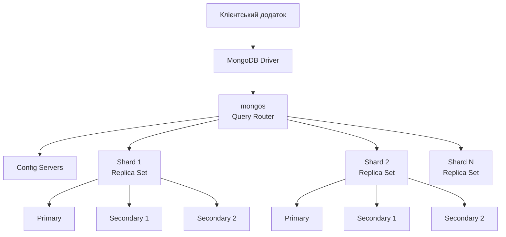
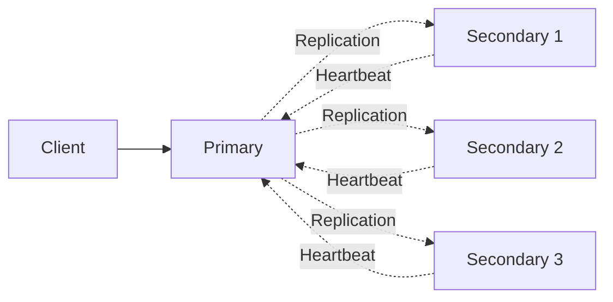
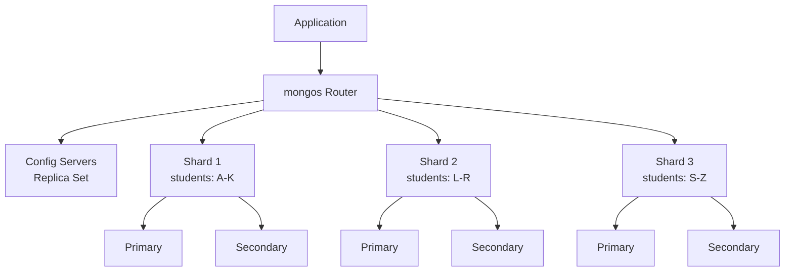
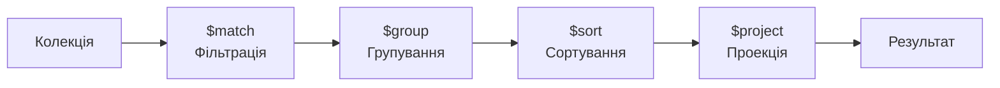

# Лекція 12. MongoDB: архітектура та модель даних

## Вступ

MongoDB є однією з найпопулярніших документо-орієнтованих СУБД, яка революціонізувала підхід до зберігання та обробки даних. На відміну від традиційних реляційних систем з їх жорсткими схемами та таблицями, MongoDB пропонує гнучку модель даних, що базується на документах формату BSON. Розуміння архітектури MongoDB та особливостей її моделі даних є критично важливим для розробників сучасних вебдодатків, які потребують масштабованості, швидкодії та гнучкості в роботі з даними.

У цій лекції ми детально розглянемо фундаментальні концепції MongoDB, починаючи від структури документів і закінчуючи складними механізмами розподіленої обробки даних. Особливу увагу приділимо практичним аспектам роботи з системою та порівнянню підходів MongoDB з реляційними аналогами.

## Документо-орієнтована модель даних

### Концепція документів у MongoDB

Документ є базовою одиницею зберігання даних у MongoDB. На відміну від рядків у реляційних таблицях, документи можуть мати складну ієрархічну структуру та вкладені елементи. Кожен документ представляє собою набір пар ключ-значення, де значення можуть бути різних типів.

Документи в MongoDB мають кілька важливих характеристик. По-перше, вони є самодостатніми структурами даних, які інкапсулюють всю необхідну інформацію про певну сутність. По-друге, документи в одній колекції можуть мати різну структуру, що забезпечує гнучкість моделі даних. По-третє, документи підтримують вкладені структури та масиви, що дозволяє природно моделювати складні зв'язки.

Приклад простого документа студента виглядає наступним чином:

```javascript
{
    "_id": ObjectId("507f1f77bcf86cd799439011"),
    "student_id": "S2024001",
    "first_name": "Іван",
    "last_name": "Петров",
    "email": "ivan.petrov@university.edu.ua",
    "birth_date": ISODate("2004-05-15T00:00:00Z"),
    "enrollment_year": 2024,
    "status": "active"
}
```

У цьому прикладі поле "_id" є унікальним ідентифікатором документа, який MongoDB генерує автоматично, якщо його не вказано явно. Тип ObjectId гарантує унікальність навіть у розподіленому середовищі та містить інформацію про час створення документа.

### Формат BSON

BSON (Binary JSON) є бінарним форматом серіалізації, який використовує MongoDB для зберігання документів. Хоча документи зазвичай представляються у вигляді JSON для зручності читання людиною, внутрішньо вони зберігаються у форматі BSON, який має кілька переваг.

Основні відмінності BSON від JSON полягають у підтримці додаткових типів даних, ефективнішому використанні пам'яті та швидшій обробці. BSON включає типи даних, яких немає в стандартному JSON, такі як ObjectId, Date, Binary Data, Regular Expression, Timestamp та інші спеціалізовані типи.

Розглянемо приклад документа з різними типами BSON:

```javascript
{
    "_id": ObjectId("507f1f77bcf86cd799439011"),
    "name": "Іван Петров",
    "registration_date": ISODate("2024-09-01T09:00:00Z"),
    "age": NumberInt(20),
    "gpa": NumberDecimal("3.85"),
    "courses_completed": NumberLong(24),
    "profile_picture": BinData(0, "base64encodedimagedata"),
    "email_verified": true,
    "metadata": {
        "created_at": Timestamp(1693566000, 1),
        "last_modified": ISODate("2024-10-15T14:30:00Z")
    }
}
```

Кожен тип BSON має специфічне призначення. NumberInt використовується для 32-бітних цілих чисел, NumberLong для 64-бітних, а NumberDecimal забезпечує точність для фінансових розрахунків. ISODate зберігає дату та час з мілісекундною точністю, тоді як Timestamp використовується для внутрішніх операцій реплікації MongoDB.

### Колекції та схеми

Колекція в MongoDB є аналогом таблиці в реляційних СУБД, але з суттєвими відмінностями. Колекція містить набір документів, які логічно пов'язані між собою, але не обов'язково мають однакову структуру.

Важливою особливістю MongoDB є відсутність жорсткої схеми на рівні бази даних. Це означає, що документи в одній колекції можуть мати різну структуру, різну кількість полів та різні типи даних для однойменних полів. Така гнучкість дозволяє легко адаптувати модель даних до змін у вимогах додатка.

Розглянемо приклад колекції студентів з документами різної структури:

```javascript
// Студент бакалаврату
{
    "_id": ObjectId("507f1f77bcf86cd799439011"),
    "student_id": "S2024001",
    "name": "Іван Петров",
    "degree": "bachelor",
    "year": 3,
    "major": "Інженерія програмного забезпечення"
}

// Студент магістратури з додатковими полями
{
    "_id": ObjectId("507f1f77bcf86cd799439012"),
    "student_id": "M2024001",
    "name": "Марія Коваленко",
    "degree": "master",
    "thesis_topic": "Розподілені системи обробки даних",
    "supervisor": "Проф. Іваненко",
    "defense_date": ISODate("2025-06-15T00:00:00Z")
}

// Іноземний студент з додатковою інформацією
{
    "_id": ObjectId("507f1f77bcf86cd799439013"),
    "student_id": "F2024001",
    "name": "John Smith",
    "degree": "bachelor",
    "year": 2,
    "country": "USA",
    "visa_expiry": ISODate("2026-08-31T00:00:00Z"),
    "language_proficiency": {
        "ukrainian": "B1",
        "english": "native"
    }
}
```

Незважаючи на відсутність жорсткої схеми, MongoDB підтримує механізм валідації схем, який дозволяє визначити правила для структури документів та типів їх полів. Валідація може бути додана до існуючої колекції або визначена під час її створення.

Приклад створення колекції з валідацією схеми:

```javascript
db.createCollection("students", {
    validator: {
        $jsonSchema: {
            bsonType: "object",
            required: ["student_id", "name", "email", "degree"],
            properties: {
                student_id: {
                    bsonType: "string",
                    pattern: "^[SMF][0-9]{7}$",
                    description: "Повинен бути рядок формату S0000000"
                },
                name: {
                    bsonType: "string",
                    minLength: 1,
                    maxLength: 100,
                    description: "Повне ім'я студента"
                },
                email: {
                    bsonType: "string",
                    pattern: "^[a-zA-Z0-9._%+-]+@[a-zA-Z0-9.-]+\\.[a-zA-Z]{2,}$",
                    description: "Валідна email адреса"
                },
                degree: {
                    enum: ["bachelor", "master", "phd"],
                    description: "Рівень освіти"
                },
                year: {
                    bsonType: "int",
                    minimum: 1,
                    maximum: 6,
                    description: "Рік навчання"
                },
                gpa: {
                    bsonType: "decimal",
                    minimum: 0.0,
                    maximum: 4.0,
                    description: "Середній бал"
                }
            }
        }
    },
    validationLevel: "moderate",
    validationAction: "error"
})
```

Валідація може працювати в режимі "strict", коли перевіряються всі операції вставки та оновлення, або в режимі "moderate", коли валідуються тільки документи, що відповідають схемі. Параметр validationAction визначає, що робити при порушенні правил: "error" відхиляє операцію, а "warn" тільки записує попередження в лог.

### Вкладені документи та масиви

Одна з найпотужніших можливостей MongoDB полягає в підтримці вкладених документів та масивів, що дозволяє природно моделювати складні ієрархічні структури даних без необхідності створення окремих колекцій та складних JOIN операцій.

Розглянемо приклад документа студента з вкладеними структурами:

```javascript
{
    "_id": ObjectId("507f1f77bcf86cd799439011"),
    "student_id": "S2024001",
    "personal_info": {
        "first_name": "Іван",
        "last_name": "Петров",
        "middle_name": "Володимирович",
        "birth_date": ISODate("2004-05-15T00:00:00Z"),
        "gender": "male"
    },
    "contact": {
        "email": "ivan.petrov@university.edu.ua",
        "phone": "+380501234567",
        "address": {
            "city": "Київ",
            "street": "вул. Хрещатик",
            "building": "15",
            "apartment": "42",
            "postal_code": "01001"
        }
    },
    "academic_record": {
        "enrollment_year": 2024,
        "major": "Інженерія програмного забезпечення",
        "current_year": 1,
        "gpa": NumberDecimal("3.85")
    },
    "courses": [
        {
            "course_id": "CS101",
            "name": "Основи програмування",
            "credits": 6,
            "semester": 1,
            "year": 2024,
            "grade": "A",
            "instructor": "Проф. Іваненко"
        },
        {
            "course_id": "MATH201",
            "name": "Дискретна математика",
            "credits": 5,
            "semester": 1,
            "year": 2024,
            "grade": "B+",
            "instructor": "Доц. Коваленко"
        }
    ],
    "skills": ["Python", "Java", "SQL", "Git"],
    "certifications": [
        {
            "name": "Oracle Certified Associate",
            "issued_by": "Oracle",
            "issue_date": ISODate("2024-06-15T00:00:00Z"),
            "expiry_date": ISODate("2027-06-15T00:00:00Z"),
            "credential_id": "OCA2024001"
        }
    ]
}
```

Вкладені документи дозволяють групувати пов'язані дані в логічні блоки. У наведеному прикладі особиста інформація, контактні дані та академічний запис організовані у вкладені об'єкти, що робить структуру даних більш читабельною та логічною.

Масиви в MongoDB можуть містити як прості значення, так і складні документи. Поле "skills" містить простий масив рядків, тоді як "courses" та "certifications" є масивами документів з детальною інформацією про кожен елемент.

Важливо розуміти, коли доцільно використовувати вкладені документи, а коли краще створити окрему колекцію з посиланнями. Вкладені документи підходять для даних, які завжди використовуються разом з батьківським документом, мають обмежений розмір та рідко змінюються незалежно. Окремі колекції з посиланнями краще використовувати для даних, які можуть зростати необмежено, часто використовуються окремо або спільно використовуються кількома документами.

## Архітектура MongoDB

### Базова архітектура та компоненти

MongoDB має модульну архітектуру, яка складається з кількох ключових компонентів, кожен з яких відповідає за специфічні аспекти роботи системи. Розуміння цієї архітектури допомагає ефективно проєктувати та налаштовувати системи на базі MongoDB.



Основні компоненти архітектури включають сервер MongoDB (mongod), який відповідає за зберігання даних та обробку запитів, маршрутизатор запитів (mongos), що використовується в шардованих кластерах, та конфігураційні сервери, які зберігають метадані про розподіл даних.

Сервер mongod виконує всі основні операції з даними: читання, запис, індексування, агрегацію. Він керує зберіганням даних на диску, підтримує індекси, виконує запити та забезпечує транзакційність операцій. Кожен екземпляр mongod може працювати як окремий сервер або як частина набору реплік.

### Реплікація

Реплікація є фундаментальним механізмом забезпечення високої доступності та надійності даних у MongoDB. Набір реплік (replica set) складається з кількох екземплярів mongod, що зберігають однакові дані, але виконують різні ролі.



Первинний вузол (Primary) приймає всі операції запису та є єдиним вузлом, на який можна писати за замовчуванням. Він записує всі зміни в спеціальний журнал операцій (oplog), який використовується для реплікації.

Вторинні вузли (Secondary) асинхронно копіюють дані з oplog первинного вузла та застосовують ці операції до власних копій даних. За замовчуванням, операції читання також виконуються на первинному вузлі, але можна налаштувати читання з вторинних вузлів для розподілення навантаження.

Приклад ініціалізації набору реплік:

```javascript
// Підключення до одного з вузлів
mongo --host mongodb1.example.com:27017

// Ініціалізація набору реплік
rs.initiate({
    _id: "rs0",
    members: [
        { _id: 0, host: "mongodb1.example.com:27017", priority: 2 },
        { _id: 1, host: "mongodb2.example.com:27017", priority: 1 },
        { _id: 2, host: "mongodb3.example.com:27017", priority: 1 }
    ]
})

// Перевірка статусу реплікації
rs.status()

// Додавання нового вузла до набору
rs.add({
    host: "mongodb4.example.com:27017",
    priority: 0,
    hidden: true,
    votes: 0
})
```

Параметр priority визначає пріоритет вузла під час виборів нового Primary. Вузли з вищим пріоритетом мають більше шансів стати первинними. Приховані вузли (hidden) не видимі для клієнтів і зазвичай використовуються для аналітичних запитів або резервного копіювання.

Процес автоматичного перемикання (automatic failover) відбувається, коли вторинні вузли виявляють, що первинний вузол недоступний. Вони ініціюють вибори, під час яких визначається новий первинний вузол. Цей процес зазвичай займає кілька секунд, протягом яких операції запису будуть недоступні.

Налаштування преференцій читання (read preference) дозволяє контролювати, з яких вузлів читати дані:

```javascript
// Читання тільки з Primary
db.collection.find().readPref("primary")

// Читання з будь-якого Secondary, якщо можливо
db.collection.find().readPref("secondary")

// Читання переважно з Primary, але можливе з Secondary
db.collection.find().readPref("primaryPreferred")

// Читання переважно з Secondary
db.collection.find().readPref("secondaryPreferred")

// Читання з найближчого вузла за мережевою затримкою
db.collection.find().readPref("nearest")
```

### Шардинг

Шардинг є механізмом горизонтального масштабування MongoDB, який дозволяє розподілити великі обсяги даних між кількома серверами. Кожен шард містить підмножину даних, а разом вони формують повний набір даних.



Ключ шардингу (shard key) визначає, як дані розподіляються між шардами. Вибір правильного ключа шардингу є критичним для продуктивності та рівномірного розподілу даних.

Приклад налаштування шардингу:

```javascript
// Увімкнення шардингу для бази даних
sh.enableSharding("university")

// Створення хеш-індексу для ключа шардингу
db.students.createIndex({ "student_id": "hashed" })

// Шардинг колекції за хеш-ключем
sh.shardCollection(
    "university.students",
    { "student_id": "hashed" }
)

// Або шардинг за діапазоном значень
sh.shardCollection(
    "university.courses",
    { "department": 1, "course_number": 1 }
)

// Перегляд статистики шардингу
db.students.getShardDistribution()
```

Існує два основних типи ключів шардингу: хеш-ключі та діапазонні ключі. Хеш-ключі забезпечують рівномірний розподіл даних, але не підтримують ефективні діапазонні запити. Діапазонні ключі зберігають порядок даних, що корисно для часових рядів та інших упорядкованих даних.

Стратегії балансування даних між шардами включають автоматичне балансування, яке MongoDB виконує в фоновому режимі, та ручне керування зонами для географічного розподілу даних:

```javascript
// Додавання тегів до шардів для зонування
sh.addShardTag("shard0000", "EU")
sh.addShardTag("shard0001", "US")
sh.addShardTag("shard0002", "ASIA")

// Призначення діапазонів даних до зон
sh.addTagRange(
    "university.students",
    { "country": "Ukraine" },
    { "country": "Ukraine\uffff" },
    "EU"
)

sh.addTagRange(
    "university.students",
    { "country": "USA" },
    { "country": "USA\uffff" },
    "US"
)
```

### Індексування

Індекси в MongoDB працюють подібно до індексів у реляційних СУБД, прискорюючи виконання запитів за рахунок додаткових структур даних. MongoDB підтримує різні типи індексів для різних сценаріїв використання.

Одинарні індекси створюються для одного поля:

```javascript
// Створення індексу для швидкого пошуку за email
db.students.createIndex({ "email": 1 })

// Створення унікального індексу
db.students.createIndex(
    { "student_id": 1 },
    { unique: true }
)

// Створення розрідженого індексу (індексує тільки документи з полем)
db.students.createIndex(
    { "graduation_date": 1 },
    { sparse: true }
)
```

Складені індекси охоплюють кілька полів та корисні для запитів, що фільтрують або сортують за кількома критеріями:

```javascript
// Складений індекс для запитів за факультетом та курсом
db.students.createIndex({
    "academic_record.major": 1,
    "academic_record.current_year": 1
})

// Складений індекс з різним порядком сортування
db.grades.createIndex({
    "student_id": 1,
    "semester": -1,
    "grade": -1
})
```

Текстові індекси дозволяють виконувати повнотекстовий пошук:

```javascript
// Створення текстового індексу
db.courses.createIndex({
    "name": "text",
    "description": "text"
})

// Пошук за текстовим індексом
db.courses.find({
    $text: { $search: "database management" }
})

// Пошук з оцінкою релевантності
db.courses.find(
    { $text: { $search: "machine learning" } },
    { score: { $meta: "textScore" } }
).sort({ score: { $meta: "textScore" } })
```

Геопросторові індекси підтримують запити на основі географічних координат:

```javascript
// Створення 2dsphere індексу для GeoJSON даних
db.universities.createIndex({ "location": "2dsphere" })

// Пошук університетів у радіусі 5 км
db.universities.find({
    location: {
        $near: {
            $geometry: {
                type: "Point",
                coordinates: [50.4501, 30.5234]
            },
            $maxDistance: 5000
        }
    }
})
```

Аналіз використання індексів допомагає оптимізувати продуктивність:

```javascript
// Пояснення плану виконання запиту
db.students.find({ "email": "ivan@example.com" }).explain("executionStats")

// Перегляд використання індексів
db.students.aggregate([
    { $indexStats: {} }
])

// Видалення невикористовуваних індексів
db.students.dropIndex("unused_index_name")
```

## Мова запитів MongoDB

### Основні операції CRUD

MongoDB використовує власну мову запитів, яка базується на документах JSON та відрізняється від SQL. Розглянемо основні операції створення, читання, оновлення та видалення документів.

Операції вставки додають нові документи до колекції:

```javascript
// Вставка одного документа
db.students.insertOne({
    student_id: "S2024001",
    name: "Іван Петров",
    email: "ivan@example.com",
    enrollment_year: 2024
})

// Вставка кількох документів
db.students.insertMany([
    {
        student_id: "S2024002",
        name: "Марія Коваленко",
        email: "maria@example.com"
    },
    {
        student_id: "S2024003",
        name: "Олександр Сидоров",
        email: "alex@example.com"
    }
])
```

Операції читання використовують різноманітні оператори фільтрації:

```javascript
// Пошук всіх студентів певного року
db.students.find({ enrollment_year: 2024 })

// Пошук з кількома умовами
db.students.find({
    enrollment_year: 2024,
    "academic_record.gpa": { $gte: 3.5 }
})

// Пошук з логічними операторами
db.students.find({
    $or: [
        { "academic_record.major": "Computer Science" },
        { "academic_record.major": "Software Engineering" }
    ]
})

// Пошук з проекцією полів
db.students.find(
    { enrollment_year: 2024 },
    { name: 1, email: 1, _id: 0 }
)

// Пошук з сортуванням та лімітом
db.students.find({ enrollment_year: 2024 })
    .sort({ "academic_record.gpa": -1 })
    .limit(10)
```

Операції оновлення модифікують існуючі документи:

```javascript
// Оновлення одного документа
db.students.updateOne(
    { student_id: "S2024001" },
    {
        $set: { "contact.phone": "+380501234567" },
        $inc: { "academic_record.current_year": 1 }
    }
)

// Оновлення кількох документів
db.students.updateMany(
    { enrollment_year: 2024 },
    { $set: { status: "active" } }
)

// Додавання елемента до масиву
db.students.updateOne(
    { student_id: "S2024001" },
    {
        $push: {
            courses: {
                course_id: "CS301",
                name: "Бази даних",
                semester: 5
            }
        }
    }
)

// Видалення поля з документа
db.students.updateOne(
    { student_id: "S2024001" },
    { $unset: { temporary_field: "" } }
)
```

Операції видалення вилучають документи з колекції:

```javascript
// Видалення одного документа
db.students.deleteOne({ student_id: "S2024001" })

// Видалення кількох документів
db.students.deleteMany({ status: "inactive" })

// Видалення всіх документів колекції
db.students.deleteMany({})
```

### Еквівалентність операторів SQL

Розуміння відповідності між операторами MongoDB та SQL допомагає розробникам, знайомим з реляційними СУБД, швидше освоїти MongoDB.

Оператор SELECT в SQL відповідає методу find() в MongoDB:

```javascript
// SQL: SELECT * FROM students WHERE enrollment_year = 2024
db.students.find({ enrollment_year: 2024 })

// SQL: SELECT name, email FROM students WHERE gpa > 3.5
db.students.find(
    { "academic_record.gpa": { $gt: 3.5 } },
    { name: 1, email: 1, _id: 0 }
)

// SQL: SELECT * FROM students ORDER BY gpa DESC LIMIT 10
db.students.find()
    .sort({ "academic_record.gpa": -1 })
    .limit(10)
```

Оператори умов в WHERE clause мають прямі аналоги:

```javascript
// SQL: WHERE age >= 18 AND age <= 25
{ age: { $gte: 18, $lte: 25 } }

// SQL: WHERE name LIKE 'Іван%'
{ name: { $regex: /^Іван/ } }

// SQL: WHERE major IN ('CS', 'SE', 'IT')
{ major: { $in: ['CS', 'SE', 'IT'] } }

// SQL: WHERE graduation_date IS NULL
{ graduation_date: { $exists: false } }

// SQL: WHERE NOT (status = 'inactive')
{ status: { $ne: 'inactive' } }
```

JOIN операції в MongoDB реалізуються через $lookup в aggregation pipeline:

```javascript
// SQL:
// SELECT s.*, c.course_name
// FROM students s
// JOIN enrollments e ON s.student_id = e.student_id
// JOIN courses c ON e.course_id = c.course_id

db.students.aggregate([
    {
        $lookup: {
            from: "enrollments",
            localField: "student_id",
            foreignField: "student_id",
            as: "student_courses"
        }
    },
    {
        $unwind: "$student_courses"
    },
    {
        $lookup: {
            from: "courses",
            localField: "student_courses.course_id",
            foreignField: "course_id",
            as: "course_details"
        }
    }
])
```

Агрегаційні функції SQL мають відповідники в aggregation framework:

```javascript
// SQL: SELECT COUNT(*) FROM students WHERE enrollment_year = 2024
db.students.countDocuments({ enrollment_year: 2024 })

// SQL: SELECT major, COUNT(*) FROM students GROUP BY major
db.students.aggregate([
    {
        $group: {
            _id: "$academic_record.major",
            count: { $sum: 1 }
        }
    }
])

// SQL: SELECT major, AVG(gpa) FROM students GROUP BY major
db.students.aggregate([
    {
        $group: {
            _id: "$academic_record.major",
            avg_gpa: { $avg: "$academic_record.gpa" }
        }
    }
])
```

## Aggregation Pipeline

### Концепція багатоетапної обробки

Aggregation Pipeline є потужним інструментом для складної обробки та трансформації даних у MongoDB. Він працює як конвеєр, де дані проходять через послідовність етапів (stages), кожен з яких виконує певну операцію.



Кожен етап отримує документи від попереднього етапу, обробляє їх та передає результат наступному етапу. Це дозволяє будувати складні запити, розбиваючи їх на послідовність простих операцій.

Базовий приклад aggregation pipeline:

```javascript
db.students.aggregate([
    // Етап 1: Фільтрація студентів 2024 року
    {
        $match: {
            enrollment_year: 2024
        }
    },
    // Етап 2: Групування за спеціальністю
    {
        $group: {
            _id: "$academic_record.major",
            total_students: { $sum: 1 },
            avg_gpa: { $avg: "$academic_record.gpa" },
            max_gpa: { $max: "$academic_record.gpa" }
        }
    },
    // Етап 3: Сортування за середнім балом
    {
        $sort: { avg_gpa: -1 }
    },
    // Етап 4: Форматування результату
    {
        $project: {
            _id: 0,
            major: "$_id",
            total_students: 1,
            avg_gpa: { $round: ["$avg_gpa", 2] },
            max_gpa: { $round: ["$max_gpa", 2] }
        }
    }
])
```

### Основні етапи pipeline

Етап $match фільтрує документи подібно до WHERE в SQL:

```javascript
db.students.aggregate([
    {
        $match: {
            enrollment_year: { $gte: 2020 },
            "academic_record.gpa": { $gt: 3.0 },
            status: "active"
        }
    }
])
```

Етап $project вибирає або обчислює поля для включення в результат:

```javascript
db.students.aggregate([
    {
        $project: {
            full_name: {
                $concat: [
                    "$personal_info.first_name",
                    " ",
                    "$personal_info.last_name"
                ]
            },
            email: "$contact.email",
            years_enrolled: {
                $subtract: [
                    { $year: new Date() },
                    "$enrollment_year"
                ]
            },
            gpa_category: {
                $switch: {
                    branches: [
                        {
                            case: { $gte: ["$academic_record.gpa", 3.7] },
                            then: "Excellent"
                        },
                        {
                            case: { $gte: ["$academic_record.gpa", 3.0] },
                            then: "Good"
                        }
                    ],
                    default: "Average"
                }
            }
        }
    }
])
```

Етап $group агрегує документи за вказаним ключем:

```javascript
db.enrollments.aggregate([
    {
        $group: {
            _id: {
                student_id: "$student_id",
                semester: "$semester"
            },
            total_credits: { $sum: "$credits" },
            courses_count: { $sum: 1 },
            avg_grade: { $avg: "$numeric_grade" },
            courses: {
                $push: {
                    course_name: "$course_name",
                    grade: "$grade"
                }
            }
        }
    }
])
```

Етап $unwind розгортає масиви в окремі документи:

```javascript
db.students.aggregate([
    // Розгортання масиву курсів
    { $unwind: "$courses" },
    // Фільтрація за оцінками
    {
        $match: {
            "courses.grade": { $in: ["A", "B"] }
        }
    },
    // Групування для підрахунку
    {
        $group: {
            _id: "$student_id",
            high_grade_courses: { $sum: 1 }
        }
    }
])
```

Етап $lookup виконує операції, подібні до JOIN:

```javascript
db.enrollments.aggregate([
    {
        $lookup: {
            from: "courses",
            localField: "course_id",
            foreignField: "course_id",
            as: "course_info"
        }
    },
    {
        $unwind: "$course_info"
    },
    {
        $lookup: {
            from: "students",
            localField: "student_id",
            foreignField: "student_id",
            as: "student_info"
        }
    },
    {
        $unwind: "$student_info"
    },
    {
        $project: {
            student_name: "$student_info.name",
            course_name: "$course_info.name",
            grade: 1,
            semester: 1
        }
    }
])
```

### Складні сценарії aggregation

Розглянемо практичний приклад розрахунку статистики успішності за факультетами:

```javascript
db.students.aggregate([
    // Етап 1: Розгортання курсів
    { $unwind: "$courses" },

    // Етап 2: Конвертація літерних оцінок у числові
    {
        $addFields: {
            numeric_grade: {
                $switch: {
                    branches: [
                        { case: { $eq: ["$courses.grade", "A"] }, then: 4.0 },
                        { case: { $eq: ["$courses.grade", "B"] }, then: 3.0 },
                        { case: { $eq: ["$courses.grade", "C"] }, then: 2.0 },
                        { case: { $eq: ["$courses.grade", "D"] }, then: 1.0 }
                    ],
                    default: 0.0
                }
            }
        }
    },

    // Етап 3: Групування за факультетом та семестром
    {
        $group: {
            _id: {
                major: "$academic_record.major",
                semester: "$courses.semester"
            },
            avg_grade: { $avg: "$numeric_grade" },
            students_count: { $addToSet: "$student_id" },
            total_courses: { $sum: 1 },
            excellent_count: {
                $sum: {
                    $cond: [{ $eq: ["$courses.grade", "A"] }, 1, 0]
                }
            }
        }
    },

    // Етап 4: Обчислення відсотка відмінників
    {
        $addFields: {
            excellence_rate: {
                $multiply: [
                    { $divide: ["$excellent_count", "$total_courses"] },
                    100
                ]
            },
            unique_students: { $size: "$students_count" }
        }
    },

    // Етап 5: Сортування
    {
        $sort: {
            "_id.major": 1,
            "_id.semester": 1
        }
    },

    // Етап 6: Форматування результату
    {
        $project: {
            _id: 0,
            major: "$_id.major",
            semester: "$_id.semester",
            avg_grade: { $round: ["$avg_grade", 2] },
            students_count: "$unique_students",
            excellence_rate: { $round: ["$excellence_rate", 1] }
        }
    }
])
```

Приклад аналізу тенденцій зарахування студентів:

```javascript
db.students.aggregate([
    {
        $group: {
            _id: {
                year: "$enrollment_year",
                major: "$academic_record.major"
            },
            count: { $sum: 1 }
        }
    },
    {
        $sort: {
            "_id.year": 1,
            "_id.major": 1
        }
    },
    {
        $group: {
            _id: "$_id.major",
            yearly_enrollment: {
                $push: {
                    year: "$_id.year",
                    count: "$count"
                }
            }
        }
    },
    {
        $project: {
            _id: 0,
            major: "$_id",
            yearly_enrollment: 1,
            total_enrolled: { $sum: "$yearly_enrollment.count" },
            avg_yearly: { $avg: "$yearly_enrollment.count" }
        }
    }
])
```

## Транзакційна підтримка

### Концепція транзакцій у MongoDB

Починаючи з версії 4.0, MongoDB підтримує багатодокументні транзакції, які забезпечують властивості ACID для операцій, що охоплюють кілька документів або навіть кілька колекцій. Це було значним кроком вперед для документо-орієнтованих систем, оскільки традиційно вони забезпечували атомарність тільки на рівні окремого документа.

Транзакції в MongoDB працюють подібно до транзакцій у реляційних СУБД, але з деякими особливостями, пов'язаними з розподіленою природою системи.

Базовий приклад використання транзакції:

```javascript
const session = db.getMongo().startSession()

session.startTransaction()

try {
    const studentsCollection = session.getDatabase("university").students
    const enrollmentsCollection = session.getDatabase("university").enrollments

    // Операція 1: Зарахування студента на курс
    enrollmentsCollection.insertOne({
        student_id: "S2024001",
        course_id: "CS301",
        enrollment_date: new Date(),
        status: "active"
    }, { session })

    // Операція 2: Оновлення лічильника зарахованих студентів
    studentsCollection.updateOne(
        { student_id: "S2024001" },
        {
            $inc: { "academic_record.total_credits": 6 },
            $push: {
                courses: {
                    course_id: "CS301",
                    enrollment_date: new Date()
                }
            }
        },
        { session }
    )

    // Підтвердження транзакції
    session.commitTransaction()

} catch (error) {
    // Відкат транзакції при помилці
    session.abortTransaction()
    throw error
} finally {
    session.endSession()
}
```

### Рівні ізоляції та консистентність

MongoDB підтримує два рівні ізоляції для транзакцій: snapshot та local. Рівень snapshot забезпечує консистентне читання даних станом на момент початку транзакції, що еквівалентно рівню READ COMMITTED у реляційних СУБД.

Приклад складної транзакції з обробкою помилок:

```javascript
async function transferCredits(fromStudentId, toStudentId, credits) {
    const session = client.startSession()

    try {
        await session.withTransaction(async () => {
            const students = db.collection("students")

            // Перевірка наявності достатньої кількості кредитів
            const fromStudent = await students.findOne(
                { student_id: fromStudentId },
                { session }
            )

            if (!fromStudent || fromStudent.available_credits < credits) {
                throw new Error("Insufficient credits")
            }

            // Списання кредитів з першого студента
            await students.updateOne(
                { student_id: fromStudentId },
                { $inc: { available_credits: -credits } },
                { session }
            )

            // Зарахування кредитів другому студенту
            await students.updateOne(
                { student_id: toStudentId },
                { $inc: { available_credits: credits } },
                { session }
            )

            // Запис в історію транзакцій
            await db.collection("credit_transfers").insertOne({
                from: fromStudentId,
                to: toStudentId,
                credits: credits,
                timestamp: new Date()
            }, { session })

        }, {
            readConcern: { level: "snapshot" },
            writeConcern: { w: "majority" },
            readPreference: "primary"
        })

        return { success: true }

    } catch (error) {
        console.error("Transaction failed:", error)
        return { success: false, error: error.message }
    } finally {
        await session.endSession()
    }
}
```

### Обмеження транзакцій

Важливо розуміти обмеження транзакцій у MongoDB. Транзакції мають обмеження за часом виконання (за замовчуванням 60 секунд) та розміром операцій. Крім того, деякі операції не підтримуються всередині транзакцій, наприклад, створення колекцій або індексів.

Рекомендації щодо використання транзакцій:

```javascript
// Добре: Коротка транзакція з мінімальною кількістю операцій
async function enrollStudent(studentId, courseId) {
    const session = client.startSession()

    try {
        await session.withTransaction(async () => {
            await db.collection("enrollments").insertOne({
                student_id: studentId,
                course_id: courseId,
                date: new Date()
            }, { session })

            await db.collection("courses").updateOne(
                { course_id: courseId },
                { $inc: { enrolled_count: 1 } },
                { session }
            )
        })
    } finally {
        await session.endSession()
    }
}

// Погано: Довга транзакція з багатьма операціями
// Краще розбити на окремі операції або використати вкладені документи
async function massEnrollment(enrollments) {
    const session = client.startSession()

    try {
        await session.withTransaction(async () => {
            // Занадто багато операцій в одній транзакції
            for (const enrollment of enrollments) {
                await db.collection("enrollments").insertOne(
                    enrollment,
                    { session }
                )
            }
        })
    } finally {
        await session.endSession()
    }
}
```

## Висновки

MongoDB представляє собою потужну документо-орієнтовану СУБД, яка пропонує гнучку модель даних, горизонтальне масштабування через шардинг та високу доступність через реплікацію. Формат BSON забезпечує ефективне зберігання даних різних типів, а підтримка вкладених документів і масивів дозволяє природно моделювати складні структури даних.

Архітектура MongoDB включає механізми реплікації для забезпечення надійності та доступності, шардинг для горизонтального масштабування та різноманітні типи індексів для оптимізації продуктивності запитів. Мова запитів MongoDB, хоча і відрізняється від SQL, пропонує потужні можливості для роботи з даними через CRUD операції та Aggregation Pipeline.

Aggregation Pipeline надає інструменти для складної обробки та трансформації даних через послідовність етапів, що робить можливим виконання складних аналітичних запитів. Підтримка багатодокументних транзакцій у сучасних версіях MongoDB додає можливості забезпечення ACID властивостей для критичних операцій.

Розуміння цих концепцій та механізмів є фундаментом для ефективного використання MongoDB у реальних проєктах, від невеликих вебдодатків до великих розподілених систем з високим навантаженням.
