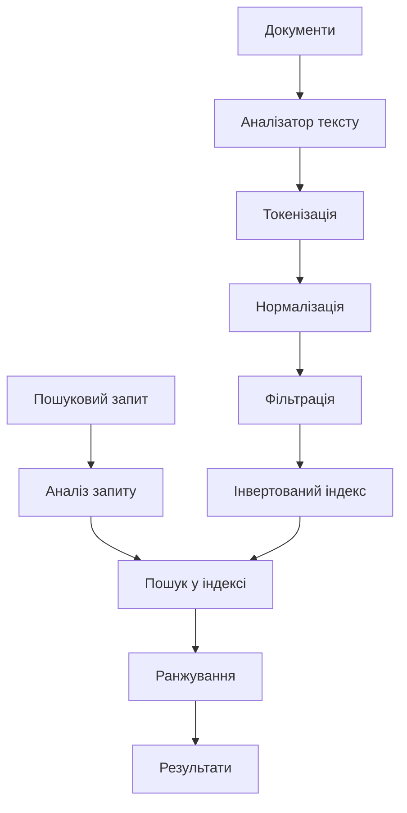
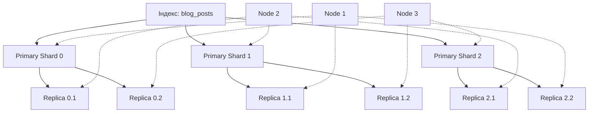
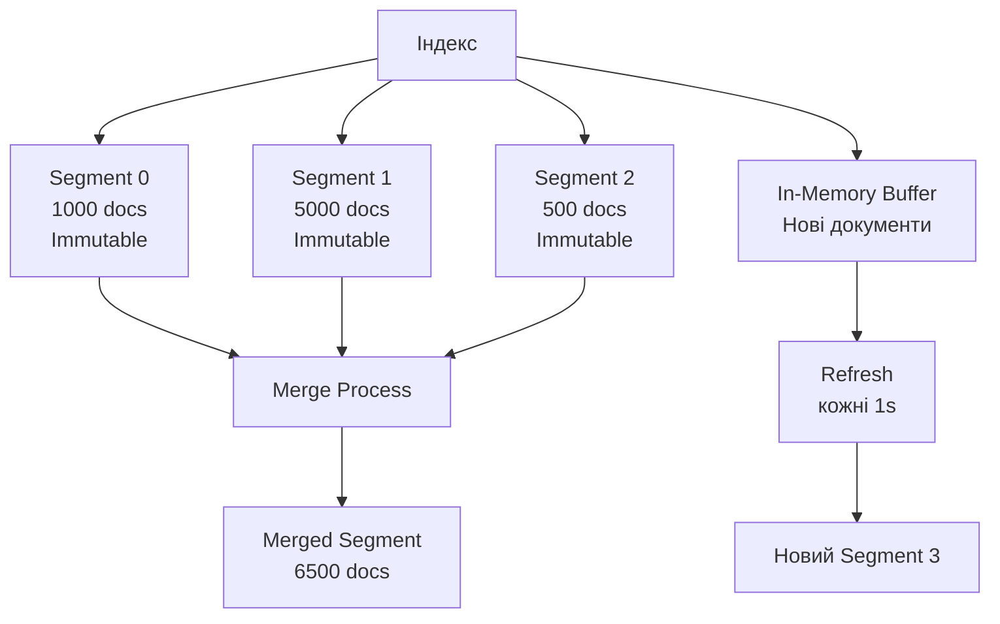

# Лекція 14. Elasticsearch та пошукові системи

## Вступ

Сучасні вебдодатки потребують швидкого та релевантного пошуку по великих обсягах текстових даних. Традиційні бази даних, навіть з індексами, не завжди здатні забезпечити необхідну швидкість та якість пошуку, особливо коли йдеться про повнотекстовий пошук з урахуванням морфології, синонімів, нечіткого пошуку та ранжування за релевантністю. Саме для вирішення цих завдань призначені спеціалізовані пошукові системи, серед яких Elasticsearch займає провідне місце.

Elasticsearch є розподіленою пошуковою та аналітичною системою, побудованою на базі бібліотеки Apache Lucene. Вона забезпечує майже реальночасний пошук, горизонтальне масштабування та високу доступність даних. Elasticsearch використовується компаніями по всьому світу для різноманітних задач: від пошуку по каталогу товарів до аналізу логів та моніторингу інфраструктури.

На відміну від традиційних баз даних, де пошук реалізується через SQL запити з оператором LIKE або регулярними виразами, Elasticsearch використовує інвертовані індекси, які дозволяють миттєво знаходити документи, що містять певні терміни. Це фундаментальна різниця в архітектурі, яка забезпечує неперевершену швидкість пошуку навіть у мільярдах документів.

У цій лекції ми детально розглянемо архітектуру Elasticsearch, принципи побудови інвертованих індексів, механізми аналізу тексту, можливості пошуку та агрегації даних, а також практичні аспекти інтеграції Elasticsearch з іншими системами управління даними.

## Архітектура повнотекстових пошукових систем

### Фундаментальні концепції

Повнотекстові пошукові системи базуються на принципово іншому підході до організації даних порівняно з реляційними або документо-орієнтованими базами даних. Замість зберігання даних у вигляді рядків таблиць або документів JSON, пошукові системи створюють спеціалізовані індексні структури, оптимізовані для швидкого текстового пошуку.

Ключовою концепцією є інвертований індекс (inverted index), який встановлює відображення від термінів до документів, що їх містять. Це протилежно до прямого індексу, де ми маємо відображення від документів до термінів. Інвертований індекс дозволяє швидко знайти всі документи, що містять певне слово, без необхідності сканувати весь набір даних.



Процес індексування документа включає кілька етапів. Спочатку текст проходить через аналізатор, який розбиває його на окремі токени (зазвичай слова), потім токени нормалізуються (приводяться до нижнього регістру, видаляються спеціальні символи), застосовуються фільтри (видалення стоп-слів, стемінг), і нарешті створюється або оновлюється інвертований індекс.

Розглянемо простий приклад індексування:

```javascript
// Вихідні документи
const documents = [
    {
        id: 1,
        title: "Вступ до баз даних",
        content: "Бази даних є фундаментальною частиною сучасних інформаційних систем"
    },
    {
        id: 2,
        title: "NoSQL системи",
        content: "NoSQL бази даних пропонують гнучкі схеми для зберігання даних"
    },
    {
        id: 3,
        title: "Elasticsearch та пошук",
        content: "Elasticsearch забезпечує швидкий повнотекстовий пошук у великих обсягах даних"
    }
]

// Після аналізу та індексування створюється інвертований індекс:
const invertedIndex = {
    "баз": [1, 2],           // Термін "баз" зустрічається в документах 1 і 2
    "даних": [1, 2, 3],      // Термін "даних" у всіх трьох документах
    "фундаментальною": [1],
    "частиною": [1],
    "сучасних": [1],
    "інформаційних": [1],
    "систем": [1],
    "nosql": [2],
    "пропонують": [2],
    "гнучкі": [2],
    "схеми": [2],
    "зберігання": [2],
    "elasticsearch": [3],
    "забезпечує": [3],
    "швидкий": [3],
    "повнотекстовий": [3],
    "пошук": [3],
    "великих": [3],
    "обсягах": [3]
}

// При пошуку за запитом "баз даних" система:
// 1. Аналізує запит: ["баз", "даних"]
// 2. Знаходить документи для кожного терміну:
//    "баз" -> [1, 2]
//    "даних" -> [1, 2, 3]
// 3. Об'єднує результати: [1, 2, 3]
// 4. Ранжує за релевантністю (документ 1 найбільш релевантний)
```

### Компоненти пошукової системи

Архітектура Elasticsearch складається з кількох ключових компонентів, кожен з яких відповідає за специфічні аспекти роботи системи.

**Кластер (Cluster)** є найвищим рівнем організації в Elasticsearch. Кластер складається з одного або кількох вузлів (nodes), які разом зберігають всі дані та надають можливості індексування та пошуку. Кожен кластер має унікальне ім'я, яке використовується вузлами для приєднання до правильного кластера.

**Вузол (Node)** є окремим сервером Elasticsearch, який є частиною кластера. Вузол зберігає дані та бере участь у процесах індексування та пошуку. Існує кілька типів вузлів з різними ролями:

```javascript
// Конфігурація різних типів вузлів

// Master-eligible вузол (може стати головним вузлом кластера)
{
    "node.roles": ["master"],
    "node.name": "master-node-1"
}

// Data вузол (зберігає дані та виконує операції з даними)
{
    "node.roles": ["data", "data_content", "data_hot", "data_warm", "data_cold"],
    "node.name": "data-node-1"
}

// Coordinating вузол (маршрутизує запити, агрегує результати)
{
    "node.roles": [],  // Порожній список означає тільки координуючу роль
    "node.name": "coordinating-node-1"
}

// Ingest вузол (попередня обробка документів перед індексуванням)
{
    "node.roles": ["ingest"],
    "node.name": "ingest-node-1"
}

// ML вузол (машинне навчання та аномалія детекція)
{
    "node.roles": ["ml"],
    "node.name": "ml-node-1"
}
```

**Індекс (Index)** в Elasticsearch є колекцією документів, які мають схожі характеристики. Індекс ідентифікується унікальним ім'ям і використовується для операцій індексування, пошуку, оновлення та видалення документів. Концептуально індекс подібний до бази даних в реляційних системах або до колекції в MongoDB.

```javascript
// Створення індексу для блогу
PUT /blog_posts
{
    "settings": {
        "number_of_shards": 3,        // Кількість первинних шардів
        "number_of_replicas": 2,       // Кількість реплік для кожного шарда
        "analysis": {
            "analyzer": {
                "ukrainian_analyzer": {
                    "type": "custom",
                    "tokenizer": "standard",
                    "filter": ["lowercase", "ukrainian_stop", "ukrainian_stemmer"]
                }
            },
            "filter": {
                "ukrainian_stop": {
                    "type": "stop",
                    "stopwords": ["і", "в", "на", "з", "до", "для"]
                },
                "ukrainian_stemmer": {
                    "type": "stemmer",
                    "language": "russian"  // Використовуємо російський для слов'янських мов
                }
            }
        }
    },
    "mappings": {
        "properties": {
            "title": {
                "type": "text",
                "analyzer": "ukrainian_analyzer"
            },
            "content": {
                "type": "text",
                "analyzer": "ukrainian_analyzer"
            },
            "author": {
                "type": "keyword"
            },
            "published_date": {
                "type": "date"
            },
            "tags": {
                "type": "keyword"
            },
            "views_count": {
                "type": "integer"
            }
        }
    }
}
```

**Документ (Document)** є базовою одиницею інформації, яка індексується. Документ представлений у форматі JSON і містить пари ключ-значення. Кожен документ належить до певного індексу та має унікальний ідентифікатор.

```javascript
// Приклад документа блог-поста
{
    "_index": "blog_posts",
    "_id": "1",
    "_source": {
        "title": "Вступ до Elasticsearch",
        "content": "Elasticsearch є потужною пошуковою системою, яка дозволяє швидко шукати та аналізувати великі обсяги даних. У цій статті ми розглянемо основні концепції та можливості Elasticsearch.",
        "author": "ivan_petrov",
        "published_date": "2024-10-15T10:00:00Z",
        "tags": ["elasticsearch", "пошук", "big data"],
        "views_count": 1547,
        "category": "Technology",
        "status": "published"
    }
}
```

**Шард (Shard)** є базовою одиницею розподілу даних в Elasticsearch. Індекс може бути розділений на кілька шардів, що дозволяє розподілити дані та навантаження між вузлами кластера. Існує два типи шардів: первинні (primary) та репліки (replica).



Розподіл шардів між вузлами забезпечує горизонтальне масштабування та відмовостійкість. Якщо один вузол виходить з ладу, репліки на інших вузлах продовжують обслуговувати запити.

### Життєвий цикл запиту

Розуміння того, як обробляються запити в Elasticsearch, допомагає оптимізувати продуктивність та діагностувати проблеми.

**Етап 1: Маршрутизація запиту**

Коли клієнт надсилає запит до будь-якого вузла кластера, цей вузол стає координуючим вузлом для даного запиту. Координуючий вузол визначає, які шарди містять необхідні дані, та розподіляє запит між ними.

```javascript
// Клієнт надсилає пошуковий запит
POST /blog_posts/_search
{
    "query": {
        "match": {
            "content": "elasticsearch пошук"
        }
    }
}

// Координуючий вузол визначає:
// - Індекс: blog_posts має 3 шарди (0, 1, 2)
// - Кожен шард має 2 репліки
// - Запит буде відправлено до одного примірника кожного шарда
//   (primary або replica, вибирається за алгоритмом балансування)
```

**Етап 2: Виконання на шардах (Query Phase)**

Координуючий вузол надсилає запит до відповідних шардів. Кожен шард виконує пошук локально на своїх даних та повертає ідентифікатори знайдених документів разом з їх оцінками релевантності.

```javascript
// Шард 0 повертає:
{
    "hits": [
        { "_id": "1", "_score": 4.52 },
        { "_id": "5", "_score": 3.21 },
        { "_id": "8", "_score": 2.87 }
    ]
}

// Шард 1 повертає:
{
    "hits": [
        { "_id": "3", "_score": 4.15 },
        { "_id": "7", "_score": 3.94 },
        { "_id": "11", "_score": 2.43 }
    ]
}

// Шард 2 повертає:
{
    "hits": [
        { "_id": "2", "_score": 4.78 },
        { "_id": "9", "_score": 3.56 },
        { "_id": "12", "_score": 2.91 }
    ]
}
```

**Етап 3: Агрегація результатів (Fetch Phase)**

Координуючий вузол збирає результати від всіх шардів, об'єднує їх, сортує за релевантністю та відбирає топ N документів. Потім він запитує повний вміст цих документів у відповідних шардів.

```javascript
// Координуючий вузол об'єднує результати:
// Всього знайдено: 9 документів
// Топ-5 за релевантністю:
// 1. "_id": "2", "_score": 4.78 (з шарда 2)
// 2. "_id": "1", "_score": 4.52 (з шарда 0)
// 3. "_id": "3", "_score": 4.15 (з шарда 1)
// 4. "_id": "7", "_score": 3.94 (з шарда 1)
// 5. "_id": "9", "_score": 3.56 (з шарда 2)

// Координуючий вузол запитує повні документи
// у відповідних шардів та повертає клієнту:
{
    "took": 5,
    "timed_out": false,
    "hits": {
        "total": { "value": 9, "relation": "eq" },
        "max_score": 4.78,
        "hits": [
            {
                "_id": "2",
                "_score": 4.78,
                "_source": {
                    "title": "Повнотекстовий пошук в Elasticsearch",
                    "content": "...",
                    "author": "maria_koval"
                }
            },
            // ... інші документи
        ]
    }
}
```

## Інвертовані індекси: побудова та підтримка

### Структура інвертованого індексу

Інвертований індекс є серцем будь-якої пошукової системи. Він дозволяє швидко знаходити документи за термінами, що в них містяться. Розглянемо детально, як побудований та організований інвертований індекс в Elasticsearch.

Базова структура інвертованого індексу включає словник термінів (term dictionary) та списки постінгів (posting lists). Словник термінів містить всі унікальні терміни, що зустрічаються в індексованих документах, відсортовані в лексикографічному порядку. Для кожного терміну зберігається покажчик на список постінгів.

```javascript
// Припустимо, ми індексуємо три документи:

// Документ 1:
{
    "_id": "1",
    "title": "Вступ до баз даних",
    "content": "Бази даних зберігають структуровані дані"
}

// Документ 2:
{
    "_id": "2",
    "title": "NoSQL бази даних",
    "content": "NoSQL бази пропонують гнучкі схеми даних"
}

// Документ 3:
{
    "_id": "3",
    "title": "Реляційні бази",
    "content": "Реляційні бази використовують таблиці для зберігання даних"
}

// Після аналізу та токенізації створюється інвертований індекс:

const invertedIndex = {
    // Термін: [документи, позиції, частота]
    "баз": {
        "doc_freq": 3,  // Зустрічається в 3 документах
        "postings": [
            {
                "doc_id": "1",
                "term_freq": 2,      // Двічі в документі
                "positions": [2, 4],  // Позиції в документі
                "field": "title"
            },
            {
                "doc_id": "2",
                "term_freq": 2,
                "positions": [1, 6],
                "field": "content"
            },
            {
                "doc_id": "3",
                "term_freq": 2,
                "positions": [1, 8],
                "field": "content"
            }
        ]
    },
    "даних": {
        "doc_freq": 3,
        "postings": [
            {
                "doc_id": "1",
                "term_freq": 2,
                "positions": [3, 5],
                "field": "content"
            },
            {
                "doc_id": "2",
                "term_freq": 2,
                "positions": [2, 7],
                "field": "content"
            },
            {
                "doc_id": "3",
                "term_freq": 1,
                "positions": [9],
                "field": "content"
            }
        ]
    },
    "nosql": {
        "doc_freq": 1,
        "postings": [
            {
                "doc_id": "2",
                "term_freq": 2,
                "positions": [0, 3],
                "field": "content"
            }
        ]
    },
    "реляційні": {
        "doc_freq": 1,
        "postings": [
            {
                "doc_id": "3",
                "term_freq": 2,
                "positions": [0, 2],
                "field": "content"
            }
        ]
    },
    "зберігають": {
        "doc_freq": 1,
        "postings": [
            {
                "doc_id": "1",
                "term_freq": 1,
                "positions": [3],
                "field": "content"
            }
        ]
    }
    // ... інші терміни
}
```

### Оптимізація зберігання індексів

Інвертовані індекси можуть займати значний обсяг пам'яті, особливо для великих корпусів текстів. Elasticsearch використовує кілька технік для оптимізації зберігання.

**Компресія словника термінів**

Словник термінів зберігається у компресованому вигляді з використанням алгоритмів, що враховують упорядкованість термінів. Поширені префікси термінів зберігаються один раз.

```javascript
// Замість зберігання повних термінів:
// "database", "databases", "data", "datastore", "datum"

// Використовується префіксне дерево (trie):
{
    "dat": {
        "a": {
            "": { posting_list: [...] },      // "data"
            "base": {
                "": { posting_list: [...] },  // "database"
                "s": { posting_list: [...] }  // "databases"
            },
            "store": { posting_list: [...] }, // "datastore"
        },
        "um": { posting_list: [...] }         // "datum"
    }
}

// Це значно зменшує розмір словника, оскільки
// спільні префікси зберігаються тільки один раз
```

**Компресія списків постінгів**

Списки постінгів компресуються з використанням різницевого кодування (delta encoding) та алгоритмів типу Variable Byte Encoding.

```javascript
// Замість зберігання абсолютних ID документів:
// [5, 23, 47, 103, 205, 312, 501]

// Зберігаються різниці (дельти):
// [5, 18, 24, 56, 102, 107, 189]

// Малі числа займають менше байтів при кодуванні:
// 5    -> 1 байт
// 18   -> 1 байт
// 24   -> 1 байт
// 56   -> 1 байт
// 102  -> 1 байт
// 107  -> 1 байт
// 189  -> 2 байти

// Замість 7 * 4 байти = 28 байтів (при звичайному int32)
// Використовується тільки 8 байтів
```

**Сегментна архітектура**

Elasticsearch базується на Apache Lucene, який використовує сегментну архітектуру. Замість одного великого індексу, дані організовані в незмінювані сегменти.



Коли додаються нові документи, вони спочатку накопичуються в пам'яті (in-memory buffer), а потім періодично (за замовчуванням кожну секунду) записуються в новий незмінюваний сегмент. Малі сегменти періодично об'єднуються (merge) у більші для оптимізації продуктивності пошуку.

```javascript
// Налаштування параметрів refresh та merge
PUT /blog_posts/_settings
{
    "index": {
        // Інтервал refresh (як часто нові документи стають доступними для пошуку)
        "refresh_interval": "1s",

        // Налаштування merge політики
        "merge": {
            "policy": {
                // Максимальна кількість сегментів для одночасного merge
                "max_merge_at_once": 10,

                // Максимальний розмір сегмента для merge (5GB)
                "max_merged_segment": "5gb",

                // Коефіцієнт для визначення, коли запускати merge
                "segments_per_tier": 10
            }
        }
    }
}

// Ручне примусове об'єднання сегментів
POST /blog_posts/_forcemerge
{
    "max_num_segments": 1  // Об'єднати всі сегменти в один
}
```

### Процес індексування документів

Розглянемо детально, що відбувається, коли новий документ додається до індексу Elasticsearch.

```javascript
// Етап 1: Клієнт надсилає документ для індексування
POST /blog_posts/_doc/1
{
    "title": "Основи Elasticsearch",
    "content": "Elasticsearch - це розподілена пошукова система",
    "author": "Ivan Petrov",
    "published_date": "2024-10-17",
    "tags": ["elasticsearch", "пошук"]
}

// Етап 2: Координуючий вузол визначає, в який шард належить документ
// Використовується формула: shard = hash(routing) % number_of_primary_shards
// За замовчуванням routing = document_id
const shard_num = hash("1") % 3  // Припустимо, результат = 1

// Етап 3: Документ надсилається на Primary Shard 1
// Шард додає документ у in-memory buffer

// Етап 4: Аналіз тексту
// Для поля "content" застосовується налаштований аналізатор:
const analyzedTokens = {
    "title": ["основи", "elasticsearch"],
    "content": ["elasticsearch", "розподілена", "пошукова", "система"]
}

// Етап 5: Оновлення інвертованого індексу в пам'яті
// Для кожного токену додається запис про новий документ

// Етап 6: Refresh (кожну 1 секунду за замовчуванням)
// In-memory buffer записується у новий незмінюваний сегмент
// Документ стає доступним для пошуку (але ще не гарантовано збережений)

// Етап 7: Flush (кожні 30 секунд або коли translog заповнений)
// Сегменти записуються на диск
// Translog (журнал транзакцій) очищується
// Документ тепер гарантовано збережений

// Етап 8: Реплікація
// Primary shard надсилає документ на всі replica shards
// Тільки після успішної реплікації клієнту повертається успішна відповідь
```

Translog є критичним компонентом для забезпечення довговічності даних:

```javascript
// Налаштування translog
PUT /blog_posts/_settings
{
    "index": {
        "translog": {
            // Коли синхронізувати translog на диск
            "durability": "request",  // або "async"

            // Розмір translog для trigger flush
            "flush_threshold_size": "512mb",

            // Період для flush
            "sync_interval": "5s"
        }
    }
}

// "durability": "request" - кожна операція чекає fsync (повільно, але надійно)
// "durability": "async" - fsync кожні 5 секунд (швидко, але ризик втрати даних)
```

### Оновлення та видалення документів

Оскільки сегменти є незмінюваними, оновлення та видалення реалізуються особливим чином.

```javascript
// Оновлення документа
POST /blog_posts/_update/1
{
    "doc": {
        "views_count": 100
    }
}

// Що відбувається внутрішньо:
// 1. Старий документ позначається як видалений у .del файлі
// 2. Створюється новий документ з оновленими даними
// 3. Обидва документи існують до merge сегментів
// 4. При merge старий документ фізично видаляється

// Видалення документа
DELETE /blog_posts/_doc/1

// Що відбувається:
// 1. Документ позначається як видалений у .del файлі
// 2. При пошуку видалені документи фільтруються
// 3. Фізичне видалення відбувається при merge сегментів

// Перегляд статистики видалених документів
GET /blog_posts/_stats
{
    "docs": {
        "count": 10000,      // Активні документи
        "deleted": 2500      // Видалені, але ще не очищені документи
    }
}

// Примусове очищення видалених документів
POST /blog_posts/_forcemerge
{
    "only_expunge_deletes": true
}
```

## Elasticsearch: кластеризація, шардинг, реплікація

### Архітектура кластера

Кластер Elasticsearch побудований на принципах розподілених систем з автоматичним керуванням станом та відмовостійкістю. Розглянемо детально, як організована кластеризація.

**Master вузли та керування кластером**

Master вузол відповідає за керування станом кластера, створення та видалення індексів, додавання та видалення вузлів, призначення шардів вузлам. При цьому master вузол не бере участь у операціях з даними (індексування та пошук).

```javascript
// Конфігурація для високодоступного кластера з трьома master-eligible вузлами
// elasticsearch.yml на вузлі 1
{
    "cluster.name": "production-cluster",
    "node.name": "master-1",
    "node.roles": ["master"],
    "network.host": "192.168.1.10",
    "discovery.seed_hosts": ["192.168.1.10", "192.168.1.11", "192.168.1.12"],
    "cluster.initial_master_nodes": ["master-1", "master-2", "master-3"]
}

// elasticsearch.yml на вузлі 2
{
    "cluster.name": "production-cluster",
    "node.name": "master-2",
    "node.roles": ["master"],
    "network.host": "192.168.1.11",
    "discovery.seed_hosts": ["192.168.1.10", "192.168.1.11", "192.168.1.12"],
    "cluster.initial_master_nodes": ["master-1", "master-2", "master-3"]
}

// elasticsearch.yml на вузлі 3
{
    "cluster.name": "production-cluster",
    "node.name": "master-3",
    "node.roles": ["master"],
    "network.host": "192.168.1.12",
    "discovery.seed_hosts": ["192.168.1.10", "192.168.1.11", "192.168.1.12"],
    "cluster.initial_master_nodes": ["master-1", "master-2", "master-3"]
}
```

Вибори master вузла відбуваються автоматично при старті кластера або коли поточний master стає недоступним. Використовується алгоритм Raft для досягнення консенсусу.

```javascript
// Перевірка стану кластера
GET /_cluster/health

{
    "cluster_name": "production-cluster",
    "status": "green",  // green, yellow, або red
    "timed_out": false,
    "number_of_nodes": 9,
    "number_of_data_nodes": 6,
    "active_primary_shards": 15,
    "active_shards": 45,
    "relocating_shards": 0,
    "initializing_shards": 0,
    "unassigned_shards": 0,
    "delayed_unassigned_shards": 0,
    "number_of_pending_tasks": 0,
    "number_of_in_flight_fetch": 0,
    "task_max_waiting_in_queue_millis": 0,
    "active_shards_percent_as_number": 100.0
}

// Пояснення статусів:
// green - всі primary та replica шарди активні
// yellow - всі primary шарди активні, але деякі репліки ні
// red - деякі primary шарди неактивні, дані частково недоступні
```

**Data вузли та зберігання даних**

Data вузли зберігають шарди та виконують операції з даними. В продакшн середовищі рекомендується мати окремі data вузли.

```javascript
// Конфігурація data вузла
// elasticsearch.yml
{
    "cluster.name": "production-cluster",
    "node.name": "data-1",
    "node.roles": ["data", "data_content"],
    "network.host": "192.168.1.20",

    // Шлях для зберігання даних
    "path.data": ["/mnt/elasticsearch/data1", "/mnt/elasticsearch/data2"],

    // Налаштування пам'яті
    "bootstrap.memory_lock": true,

    // Максимальний розмір heap (50% від RAM, але не більше 31GB)
    "Xms": "16g",
    "Xmx": "16g"
}

// Перевірка розподілу шардів по вузлах
GET /_cat/shards/blog_posts?v

// index      shard prirep state   docs  store ip            node
// blog_posts 0     p      STARTED 1234  5.2mb 192.168.1.20  data-1
// blog_posts 0     r      STARTED 1234  5.2mb 192.168.1.21  data-2
// blog_posts 1     p      STARTED 1567  6.1mb 192.168.1.21  data-2
// blog_posts 1     r      STARTED 1567  6.1mb 192.168.1.22  data-3
// blog_posts 2     p      STARTED 1890  7.3mb 192.168.1.22  data-3
// blog_posts 2     r      STARTED 1890  7.3mb 192.168.1.20  data-1
```

### Стратегії шардингу

Правильне налаштування кількості шардів критично важливе для продуктивності та масштабованості Elasticsearch.

**Визначення оптимальної кількості шардів**

Кількість шардів визначається при створенні індексу і не може бути змінена пізніше (тільки через reindex). Тому важливо правильно вибрати цей параметр з самого початку.

```javascript
// Загальні рекомендації для вибору кількості шардів:

// 1. Розмір шарда
// Оптимально: 10-50 GB на шард
// Максимально: до 200 GB (у виняткових випадках)

// 2. Кількість документів
// Оптимально: до 200 мільйонів документів на шард

// 3. Heap memory вузла
// На 1 GB heap можна ефективно обслуговувати ~20 шардів

// Приклад розрахунку для блогу з 10 мільйонами постів:
const totalDocuments = 10_000_000
const avgDocumentSize = 5  // KB
const totalDataSize = totalDocuments * avgDocumentSize / 1024 / 1024  // GB
console.log(`Total data size: ${totalDataSize} GB`)  // ~47.7 GB

// Варіант 1: 3 шарди по ~16 GB
// Варіант 2: 5 шардів по ~9.5 GB
// Рекомендація: 5 шардів (більш гнучке масштабування)

PUT /blog_posts
{
    "settings": {
        "number_of_shards": 5,
        "number_of_replicas": 2,

        // Додаткові налаштування для великих індексів
        "refresh_interval": "30s",  // Зменшуємо частоту refresh
        "index.translog.durability": "async",  // Async для продуктивності
        "index.translog.sync_interval": "30s"
    }
}
```

**Routing та розподіл документів**

За замовчуванням Elasticsearch використовує hash від document ID для визначення шарда. Можна налаштувати custom routing для контролю над розподілом документів.

```javascript
// За замовчуванням:
// shard = hash(_id) % number_of_primary_shards

// Custom routing за автором
PUT /blog_posts/_doc/1?routing=ivan_petrov
{
    "title": "My Post",
    "author": "ivan_petrov",
    "content": "..."
}

// Тепер всі пости автора ivan_petrov будуть в одному шарді
// Це прискорює пошук постів одного автора, але може призвести
// до нерівномірного розподілу даних

// Пошук з використанням routing
GET /blog_posts/_search?routing=ivan_petrov
{
    "query": {
        "term": { "author": "ivan_petrov" }
    }
}

// Переваги custom routing:
// - Швидший пошук (тільки один шард замість усіх)
// - Можливість локалізації пов'язаних даних

// Недоліки:
// - Ризик нерівномірного розподілу (hot spots)
// - Менша гнучкість масштабування
```

**Shard allocation awareness**

Для забезпечення високої доступності можна налаштувати Elasticsearch враховувати фізичне розміщення вузлів.

```javascript
// Налаштування zone awareness для розподілу реплік між дата-центрами

// elasticsearch.yml на вузлах у зоні A
{
    "node.attr.zone": "zone_a"
}

// elasticsearch.yml на вузлах у зоні B
{
    "node.attr.zone": "zone_b"
}

// elasticsearch.yml на вузлах у зоні C
{
    "node.attr.zone": "zone_c"
}

// Налаштування кластера для zone awareness
PUT /_cluster/settings
{
    "persistent": {
        "cluster.routing.allocation.awareness.attributes": "zone",
        "cluster.routing.allocation.awareness.force.zone.values": ["zone_a", "zone_b", "zone_c"]
    }
}

// Тепер Elasticsearch гарантує, що репліки шарда
// ніколи не будуть у тій самій зоні, що й primary шард
// Це забезпечує доступність навіть при падінні цілого дата-центру

// Перевірка розподілу шардів за зонами
GET /_cat/shards/blog_posts?v&h=index,shard,prirep,state,node,zone

// index      shard prirep state   node    zone
// blog_posts 0     p      STARTED data-1  zone_a
// blog_posts 0     r      STARTED data-3  zone_b
// blog_posts 0     r      STARTED data-5  zone_c
```

### Реплікація та відмовостійкість

Реплікація забезпечує як високу доступність, так і можливість розподілення навантаження читання.

```javascript
// Динамічна зміна кількості реплік
PUT /blog_posts/_settings
{
    "number_of_replicas": 3
}

// Налаштування auto-expand replicas
// Автоматично створює репліки на нових вузлах
PUT /blog_posts/_settings
{
    "index.auto_expand_replicas": "0-all"  // або "0-5" для максимум 5 реплік
}

// Сценарій 1: Падіння data вузла
// 1. Master вузол виявляє недоступність вузла (heartbeat timeout)
// 2. Шарди на цьому вузлі позначаються як unassigned
// 3. Master призначає репліки замість втрачених primary шардів
// 4. При поверненні вузла відбувається синхронізація

// Налаштування затримки перед переміщенням шардів
PUT /_all/_settings
{
    "settings": {
        "index.unassigned.node_left.delayed_timeout": "5m"
    }
}
// Це дає час вузлу відновитися без непотрібного переміщення даних

// Сценарій 2: Розширення кластера
// 1. Новий data вузол додається до кластера
// 2. Master автоматично починає балансування шардів
// 3. Деякі репліки переміщуються на новий вузол
// 4. Навантаження розподіляється рівномірніше

// Контроль швидкості балансування
PUT /_cluster/settings
{
    "persistent": {
        // Скільки шардів можна переміщувати одночасно
        "cluster.routing.allocation.node_concurrent_recoveries": 2,

        // Максимальна швидкість передачі даних при recovery
        "indices.recovery.max_bytes_per_sec": "100mb",

        // Скільки шардів може ініціалізуватися одночасно на вузлі
        "cluster.routing.allocation.node_initial_primaries_recoveries": 4
    }
}
```

**Monitoring та діагностика**

```javascript
// Детальна інформація про стан кластера
GET /_cluster/stats?human&pretty

// Інформація про розподіл шардів
GET /_cat/allocation?v

// node       shards disk.indices disk.used disk.avail disk.total disk.percent
// data-1     15     48.3gb       100.7gb   429.8gb    530.5gb    18
// data-2     15     47.9gb       99.2gb    431.3gb    530.5gb    18
// data-3     15     49.1gb       101.5gb   429.0gb    530.5gb    19

// Пояснення, чому шард не призначений
GET /_cluster/allocation/explain
{
    "index": "blog_posts",
    "shard": 0,
    "primary": true
}

// Відповідь покаже детальне пояснення, наприклад:
{
    "note": "No shard was specified in the explain API request, so this response explains a randomly chosen unassigned shard",
    "index": "blog_posts",
    "shard": 0,
    "primary": true,
    "current_state": "unassigned",
    "unassigned_info": {
        "reason": "NODE_LEFT",
        "at": "2024-10-17T14:30:00.000Z",
        "details": "node_left[data-2]"
    },
    "can_allocate": "no",
    "allocate_explanation": "cannot allocate because allocation is not permitted to any of the nodes",
    "node_allocation_decisions": [
        {
            "node_name": "data-1",
            "node_decision": "no",
            "deciders": [
                {
                    "decider": "same_shard",
                    "decision": "NO",
                    "explanation": "a copy of this shard is already allocated to this node"
                }
            ]
        }
    ]
}
```

## Аналітичні можливості Elasticsearch

### Агрегації: метрики та візуалізація

Elasticsearch надає потужні можливості для аналізу та агрегації даних у реальному часі. Агрегації дозволяють обчислювати статистики, будувати гістограми, групувати дані та виконувати складні аналітичні запити.

**Метричні агрегації**

Метричні агрегації обчислюють числові значення на основі документів.

```javascript
// Базові статистики для поля views_count
GET /blog_posts/_search
{
    "size": 0,  // Не повертаємо документи, тільки агрегації
    "agg s": {
        "views_stats": {
            "stats": {
                "field": "views_count"
            }
        }
    }
}

// Відповідь:
{
    "aggregations": {
        "views_stats": {
            "count": 1000,
            "min": 5.0,
            "max": 15347.0,
            "avg": 523.4,
            "sum": 523400.0
        }
    }
}

// Розширена статистика
GET /blog_posts/_search
{
    "size": 0,
    "aggs": {
        "views_extended_stats": {
            "extended_stats": {
                "field": "views_count"
            }
        }
    }
}

// Відповідь включає додаткові метрики:
{
    "aggregations": {
        "views_extended_stats": {
            "count": 1000,
            "min": 5.0,
            "max": 15347.0,
            "avg": 523.4,
            "sum": 523400.0,
            "sum_of_squares": 537894523.0,
            "variance": 234523.45,
            "std_deviation": 484.27,
            "std_deviation_bounds": {
                "upper": 1491.94,
                "lower": -445.14
            }
        }
    }
}

// Персентилі для аналізу розподілу
GET /blog_posts/_search
{
    "size": 0,
    "aggs": {
        "views_percentiles": {
            "percentiles": {
                "field": "views_count",
                "percents": [25, 50, 75, 90, 95, 99]
            }
        }
    }
}

// Відповідь:
{
    "aggregations": {
        "views_percentiles": {
            "values": {
                "25.0": 120.0,
                "50.0": 350.0,
                "75.0": 650.0,
                "90.0": 1200.0,
                "95.0": 1850.0,
                "99.0": 3450.0
            }
        }
    }
}
```

**Bucket агрегації**

Bucket агрегації групують документи в "відра" (buckets) за певними критеріями.

```javascript
// Групування постів за категоріями
GET /blog_posts/_search
{
    "size": 0,
    "aggs": {
        "posts_by_category": {
            "terms": {
                "field": "category",
                "size": 10  // Топ 10 категорій
            }
        }
    }
}

// Відповідь:
{
    "aggregations": {
        "posts_by_category": {
            "buckets": [
                {
                    "key": "Technology",
                    "doc_count": 450
                },
                {
                    "key": "Science",
                    "doc_count": 320
                },
                {
                    "key": "Programming",
                    "doc_count": 180
                }
            ]
        }
    }
}

// Гістограма публікацій за датами (по місяцях)
GET /blog_posts/_search
{
    "size": 0,
    "aggs": {
        "posts_over_time": {
            "date_histogram": {
                "field": "published_date",
                "calendar_interval": "month",
                "format": "yyyy-MM"
            }
        }
    }
}

// Відповідь:
{
    "aggregations": {
        "posts_over_time": {
            "buckets": [
                {
                    "key_as_string": "2024-01",
                    "key": 1704067200000,
                    "doc_count": 45
                },
                {
                    "key_as_string": "2024-02",
                    "key": 1706745600000,
                    "doc_count": 67
                },
                {
                    "key_as_string": "2024-03",
                    "key": 1709251200000,
                    "doc_count": 89
                }
            ]
        }
    }
}

// Діапазонна агрегація для класифікації постів за популярністю
GET /blog_posts/_search
{
    "size": 0,
    "aggs": {
        "popularity_ranges": {
            "range": {
                "field": "views_count",
                "ranges": [
                    { "key": "low", "to": 100 },
                    { "key": "medium", "from": 100, "to": 1000 },
                    { "key": "high", "from": 1000, "to": 5000 },
                    { "key": "viral", "from": 5000 }
                ]
            }
        }
    }
}

// Відповідь:
{
    "aggregations": {
        "popularity_ranges": {
            "buckets": [
                {
                    "key": "low",
                    "to": 100.0,
                    "doc_count": 230
                },
                {
                    "key": "medium",
                    "from": 100.0,
                    "to": 1000.0,
                    "doc_count": 520
                },
                {
                    "key": "high",
                    "from": 1000.0,
                    "to": 5000.0,
                    "doc_count": 200
                },
                {
                    "key": "viral",
                    "from": 5000.0,
                    "doc_count": 50
                }
            ]
        }
    }
}
```

**Вкладені агрегації**

Найпотужнішою можливістю є комбінування агрегацій для багаторівневого аналізу.

```javascript
// Складна аналітика: середня кількість переглядів по категоріях і авторах
GET /blog_posts/_search
{
    "size": 0,
    "aggs": {
        "categories": {
            "terms": {
                "field": "category",
                "size": 5
            },
            "aggs": {
                // Вкладена агрегація: автори в кожній категорії
                "top_authors": {
                    "terms": {
                        "field": "author",
                        "size": 3
                    },
                    "aggs": {
                        // Ще глибша вкладеність: статистика для кожного автора
                        "avg_views": {
                            "avg": {
                                "field": "views_count"
                            }
                        },
                        "total_posts": {
                            "value_count": {
                                "field": "_id"
                            }
                        }
                    }
                },
                // Середня кількість переглядів у категорії
                "category_avg_views": {
                    "avg": {
                        "field": "views_count"
                    }
                }
            }
        }
    }
}

// Відповідь (структурована ієрархічно):
{
    "aggregations": {
        "categories": {
            "buckets": [
                {
                    "key": "Technology",
                    "doc_count": 450,
                    "category_avg_views": {
                        "value": 678.5
                    },
                    "top_authors": {
                        "buckets": [
                            {
                                "key": "ivan_petrov",
                                "doc_count": 87,
                                "avg_views": {
                                    "value": 1234.5
                                },
                                "total_posts": {
                                    "value": 87
                                }
                            },
                            {
                                "key": "maria_koval",
                                "doc_count": 65,
                                "avg_views": {
                                    "value": 890.2
                                },
                                "total_posts": {
                                    "value": 65
                                }
                            }
                        ]
                    }
                }
            ]
        }
    }
}

// Часова аналітика з метриками
GET /blog_posts/_search
{
    "size": 0,
    "aggs": {
        "posts_per_month": {
            "date_histogram": {
                "field": "published_date",
                "calendar_interval": "month"
            },
            "aggs": {
                "total_views": {
                    "sum": {
                        "field": "views_count"
                    }
                },
                "avg_views_per_post": {
                    "avg": {
                        "field": "views_count"
                    }
                },
                "unique_authors": {
                    "cardinality": {
                        "field": "author"
                    }
                },
                "top_categories": {
                    "terms": {
                        "field": "category",
                        "size": 3
                    }
                }
            }
        }
    }
}
```

**Pipeline агрегації**

Pipeline агрегації працюють з результатами інших агрегацій, дозволяючи обчислювати похідні метрики.

```javascript
// Обчислення moving average для трендів
GET /blog_posts/_search
{
    "size": 0,
    "aggs": {
        "posts_per_week": {
            "date_histogram": {
                "field": "published_date",
                "calendar_interval": "week"
            },
            "aggs": {
                "weekly_views": {
                    "sum": {
                        "field": "views_count"
                    }
                }
            }
        },
        // Pipeline агрегація: ковзне середнє
        "views_moving_avg": {
            "moving_avg": {
                "buckets_path": "posts_per_week>weekly_views",
                "window": 4,  // 4-тижневе вікно
                "model": "simple"
            }
        }
    }
}

// Derivative для обчислення змін
GET /blog_posts/_search
{
    "size": 0,
    "aggs": {
        "posts_per_month": {
            "date_histogram": {
                "field": "published_date",
                "calendar_interval": "month"
            },
            "aggs": {
                "monthly_posts": {
                    "value_count": {
                        "field": "_id"
                    }
                }
            }
        },
        // Зміна кількості постів місяць до місяця
        "posts_change": {
            "derivative": {
                "buckets_path": "posts_per_month>monthly_posts"
            }
        }
    }
}

// Bucket sort для топ-N
GET /blog_posts/_search
{
    "size": 0,
    "aggs": {
        "authors": {
            "terms": {
                "field": "author",
                "size": 100  // Беремо багато авторів спочатку
            },
            "aggs": {
                "total_views": {
                    "sum": {
                        "field": "views_count"
                    }
                },
                // Pipeline агрегація для сортування та обмеження
                "top_authors_by_views": {
                    "bucket_sort": {
                        "sort": [
                            { "total_views": { "order": "desc" } }
                        ],
                        "size": 10  // Тільки топ-10
                    }
                }
            }
        }
    }
}
```

### Візуалізація даних з Kibana

Kibana є офіційним інструментом візуалізації для Elasticsearch, який дозволяє створювати інтерактивні дашборди та графіки.

```javascript
// Створення index pattern у Kibana через API
POST /kibana/api/saved_objects/index-pattern/blog_posts_pattern
{
    "attributes": {
        "title": "blog_posts*",
        "timeFieldName": "published_date"
    }
}

// Створення візуалізації через Kibana Lens API
// Приклад: лінійний графік публікацій за часом
POST /kibana/api/lens/visualizations
{
    "title": "Posts Over Time",
    "visualizationType": "lnsXY",
    "state": {
        "datasourceStates": {
            "indexpattern": {
                "layers": {
                    "layer1": {
                        "columnOrder": ["date", "count"],
                        "columns": {
                            "date": {
                                "label": "Publication Date",
                                "dataType": "date",
                                "operationType": "date_histogram",
                                "sourceField": "published_date",
                                "params": {
                                    "interval": "1M"
                                }
                            },
                            "count": {
                                "label": "Number of Posts",
                                "dataType": "number",
                                "operationType": "count"
                            }
                        }
                    }
                }
            }
        },
        "visualization": {
            "legend": {
                "isVisible": true,
                "position": "right"
            },
            "layers": [
                {
                    "layerId": "layer1",
                    "seriesType": "line",
                    "xAccessor": "date",
                    "accessors": ["count"]
                }
            ]
        }
    }
}

// Збереження дашборду
POST /kibana/api/saved_objects/dashboard/blog_analytics
{
    "attributes": {
        "title": "Blog Analytics Dashboard",
        "panelsJSON": "[...]",  // JSON конфігурація панелей
        "optionsJSON": "{\"darkTheme\":false}",
        "timeRestore": true,
        "timeTo": "now",
        "timeFrom": "now-30d"
    }
}
```

Типові візуалізації для блогу:

```javascript
// 1. Гістограма популярності постів
{
    "visualization_type": "vertical_bar",
    "x_axis": "popularity_range",
    "y_axis": "count",
    "split_series": "category"
}

// 2. Теплова карта активності по годинах та днях тижня
{
    "visualization_type": "heatmap",
    "x_axis": "hour_of_day",
    "y_axis": "day_of_week",
    "color_scale": "post_count"
}

// 3. Pie chart розподілу постів за категоріями
{
    "visualization_type": "pie",
    "slices": "category",
    "size": "doc_count"
}

// 4. Metric для KPI
{
    "visualization_type": "metric",
    "metrics": [
        "total_posts",
        "total_views",
        "avg_views_per_post",
        "unique_authors"
    ]
}

// 5. Tag cloud найпопулярніших тегів
{
    "visualization_type": "tagcloud",
    "tags_field": "tags",
    "size_by": "doc_count"
}
```

## Інтеграція з іншими системами

### Інтеграція з реляційними СУБД

Elasticsearch часто використовується разом з реляційними базами даних для забезпечення швидкого пошуку при збереженні переваг реляційних систем для транзакційних операцій.

**Патерн: Реляційна БД як джерело істини**

```javascript
// Архітектура:
// PostgreSQL (джерело істини) -> Logstash/Custom sync -> Elasticsearch (пошук)

// Приклад синхронізації за допомогою Logstash
// logstash.conf
input {
    jdbc {
        jdbc_driver_library => "/path/to/postgresql-jdbc.jar"
        jdbc_driver_class => "org.postgresql.Driver"
        jdbc_connection_string => "jdbc:postgresql://localhost:5432/blog_db"
        jdbc_user => "blog_user"
        jdbc_password => "password"

        // SQL запит для витягування даних
        statement => "SELECT
            p.post_id,
            p.title,
            p.content,
            p.published_date,
            p.author_id,
            u.username as author_username,
            u.full_name as author_name,
            c.category_name,
            p.views_count,
            p.updated_at
        FROM posts p
        JOIN users u ON p.author_id = u.user_id
        JOIN categories c ON p.category_id = c.category_id
        WHERE p.updated_at > :sql_last_value
        ORDER BY p.updated_at ASC"

        // Відстеження останньої обробленої дати
        use_column_value => true
        tracking_column => "updated_at"
        tracking_column_type => "timestamp"

        // Запускати кожні 30 секунд
        schedule => "*/30 * * * * *"
    }
}

filter {
    // Трансформація даних перед індексуванням
    mutate {
        rename => {
            "post_id" => "id"
        }
        remove_field => ["@version", "@timestamp"]
    }

    // Додавання обчислюваних полів
    ruby {
        code => "event.set('search_text', event.get('title') + ' ' + event.get('content'))"
    }
}

output {
    elasticsearch {
        hosts => ["localhost:9200"]
        index => "blog_posts"
        document_id => "%{id}"
        action => "index"
    }

    stdout {
        codec => dots
    }
}
```

**Патерн: Двонаправлена синхронізація**

```javascript
// Кастомний сервіс синхронізації на Node.js
const { Client } = require('@elastic/elasticsearch')
const { Pool } = require('pg')

const esClient = new Client({ node: 'http://localhost:9200' })
const pgPool = new Pool({
    user: 'blog_user',
    host: 'localhost',
    database: 'blog_db',
    password: 'password',
    port: 5432,
})

// Синхронізація з PostgreSQL до Elasticsearch
async function syncPostToElasticsearch(postId) {
    // Отримуємо дані з PostgreSQL
    const result = await pgPool.query(`
        SELECT
            p.*,
            u.username,
            u.full_name,
            c.category_name,
            array_agg(t.tag_name) as tags
        FROM posts p
        JOIN users u ON p.author_id = u.user_id
        JOIN categories c ON p.category_id = c.category_id
        LEFT JOIN post_tags pt ON p.post_id = pt.post_id
        LEFT JOIN tags t ON pt.tag_id = t.tag_id
        WHERE p.post_id = $1
        GROUP BY p.post_id, u.username, u.full_name, c.category_name
    `, [postId])

    if (result.rows.length === 0) {
        // Пост видалений - видаляємо з Elasticsearch
        await esClient.delete({
            index: 'blog_posts',
            id: postId
        })
        return
    }

    const post = result.rows[0]

    // Індексуємо в Elasticsearch
    await esClient.index({
        index: 'blog_posts',
        id: post.post_id,
        document: {
            title: post.title,
            content: post.content,
            author: {
                id: post.author_id,
                username: post.username,
                full_name: post.full_name
            },
            category: post.category_name,
            tags: post.tags.filter(t => t !== null),
            published_date: post.published_date,
            views_count: post.views_count,
            status: post.status
        }
    })
}

// Тригери в PostgreSQL для автоматичної синхронізації
// CREATE OR REPLACE FUNCTION notify_post_change()
// RETURNS trigger AS $$
// BEGIN
//     IF TG_OP = 'INSERT' OR TG_OP = 'UPDATE' THEN
//         PERFORM pg_notify('post_change', NEW.post_id::text);
//         RETURN NEW;
//     ELSIF TG_OP = 'DELETE' THEN
//         PERFORM pg_notify('post_change', OLD.post_id::text);
//         RETURN OLD;
//     END IF;
// END;
// $$ LANGUAGE plpgsql;

// CREATE TRIGGER post_change_trigger
// AFTER INSERT OR UPDATE OR DELETE ON posts
// FOR EACH ROW EXECUTE FUNCTION notify_post_change();

// Слухач PostgreSQL NOTIFY
pgPool.connect((err, client) => {
    if (err) throw err

    client.on('notification', async (msg) => {
        if (msg.channel === 'post_change') {
            const postId = parseInt(msg.payload)
            await syncPostToElasticsearch(postId)
            console.log(`Synced post ${postId} to Elasticsearch`)
        }
    })

    client.query('LISTEN post_change')
})

// Пошук через Elasticsearch, отримання деталей з PostgreSQL
async function searchAndEnrich(query) {
    // Пошук в Elasticsearch
    const searchResult = await esClient.search({
        index: 'blog_posts',
        body: {
            query: {
                multi_match: {
                    query: query,
                    fields: ['title^3', 'content', 'tags^2']
                }
            },
            size: 20
        }
    })

    const postIds = searchResult.hits.hits.map(hit => hit._id)

    // Отримання повних даних з PostgreSQL
    const fullPosts = await pgPool.query(`
        SELECT p.*, u.email, u.bio, c.description as category_description
        FROM posts p
        JOIN users u ON p.author_id = u.user_id
        JOIN categories c ON p.category_id = c.category_id
        WHERE p.post_id = ANY($1::int[])
        ORDER BY array_position($1::int[], p.post_id)
    `, [postIds])

    return fullPosts.rows
}
```

### Інтеграція з MongoDB

```javascript
// Використання Change Streams MongoDB для синхронізації
const { MongoClient } = require('mongodb')
const { Client } = require('@elastic/elasticsearch')

const mongoClient = new MongoClient('mongodb://localhost:27017')
const esClient = new Client({ node: 'http://localhost:9200' })

async function syncMongoToElasticsearch() {
    await mongoClient.connect()
    const db = mongoClient.db('blog')
    const collection = db.collection('posts')

    // Підписка на зміни в колекції
    const changeStream = collection.watch([
        {
            $match: {
                operationType: { $in: ['insert', 'update', 'replace', 'delete'] }
            }
        }
    ])

    changeStream.on('change', async (change) => {
        console.log('Change detected:', change.operationType)

        switch (change.operationType) {
            case 'insert':
            case 'update':
            case 'replace':
                // Індексуємо або оновлюємо документ в Elasticsearch
                const doc = change.fullDocument
                await esClient.index({
                    index: 'blog_posts',
                    id: doc._id.toString(),
                    document: {
                        title: doc.title,
                        content: doc.content,
                        author: doc.author.name,
                        published_date: doc.published_date,
                        tags: doc.tags,
                        category: doc.category
                    }
                })
                break

            case 'delete':
                // Видаляємо документ з Elasticsearch
                await esClient.delete({
                    index: 'blog_posts',
                    id: change.documentKey._id.toString()
                }).catch(err => {
                    // Ігноруємо помилку якщо документ вже видалений
                    if (err.statusCode !== 404) throw err
                })
                break
        }
    })

    console.log('MongoDB Change Stream listening for changes...')
}

syncMongoToElasticsearch().catch(console.error)
```

### Bulk операції та оптимізація продуктивності

При великих обсягах даних критично важливо використовувати bulk операції.

```javascript
// Ефективна bulk індексація
const { Client } = require('@elastic/elasticsearch')
const client = new Client({ node: 'http://localhost:9200' })

async function bulkIndexPosts(posts) {
    const body = posts.flatMap(post => [
        // Дія: index (або create, update, delete)
        { index: { _index: 'blog_posts', _id: post.id } },
        // Документ
        {
            title: post.title,
            content: post.content,
            author: post.author,
            published_date: post.published_date
        }
    ])

    const bulkResponse = await client.bulk({
        refresh: true,
        body
    })

    // Обробка помилок
    if (bulkResponse.errors) {
        const erroredDocuments = []
        bulkResponse.items.forEach((action, i) => {
            const operation = Object.keys(action)[0]
            if (action[operation].error) {
                erroredDocuments.push({
                    status: action[operation].status,
                    error: action[operation].error,
                    operation: body[i * 2],
                    document: body[i * 2 + 1]
                })
            }
        })
        console.error('Bulk indexing errors:', erroredDocuments)
    }

    return bulkResponse
}

// Оптимізована масова індексація з батчингом
async function massiveIndex(dataSource) {
    const BATCH_SIZE = 1000
    let batch = []

    for await (const document of dataSource) {
        batch.push(document)

        if (batch.length >= BATCH_SIZE) {
            await bulkIndexPosts(batch)
            console.log(`Indexed ${batch.length} documents`)
            batch = []

            // Невелика затримка для запобігання перевантаженню
            await new Promise(resolve => setTimeout(resolve, 100))
        }
    }

    // Індексуємо залишок
    if (batch.length > 0) {
        await bulkIndexPosts(batch)
        console.log(`Indexed final ${batch.length} documents`)
    }
}

// Використання helpers для автоматичного батчингу
const { helpers } = require('@elastic/elasticsearch')

async function streamIndex(dataIterator) {
    const result = await helpers.bulk({
        datasource: dataIterator,
        onDocument(doc) {
            return {
                index: { _index: 'blog_posts', _id: doc.id }
            }
        },
        onDrop(doc) {
            console.error('Document dropped:', doc)
        },
        flushBytes: 5000000,  // 5MB
        concurrency: 5,
        retries: 3,
        wait: 1000
    })

    console.log(`Indexed ${result.successful} documents`)
    console.log(`Failed ${result.failed} documents`)
}
```

## Висновки

Elasticsearch є потужною розподіленою пошуковою системою, яка революціонізувала підхід до організації повнотекстового пошуку у великих обсягах даних. Архітектура Elasticsearch, побудована на інвертованих індексах та розподілених обчисленнях, забезпечує майже миттєвий пошук навіть у мільярдах документів.

Інвертовані індекси є фундаментальною структурою даних, що дозволяє ефективно знаходити документи за термінами. Використання компресії, сегментної архітектури та оптимізованих алгоритмів зберігання забезпечує баланс між продуктивністю та використанням ресурсів. Розуміння принципів побудови та підтримки індексів критично важливе для проєктування ефективних пошукових рішень.

Кластеризація Elasticsearch з автоматичним шардингом та реплікацією забезпечує як горизонтальне масштабування, так і високу доступність системи. Правильне налаштування кількості шардів, стратегій реплікації та розподілу вузлів визначає продуктивність та надійність пошукового кластера. Моніторинг стану кластера та своєчасне реагування на проблеми є невід'ємною частиною експлуатації Elasticsearch.

Аналітичні можливості Elasticsearch виходять далеко за межі простого пошуку. Система агрегацій дозволяє виконувати складний багаторівневий аналіз даних у реальному часі, обчислювати статистики, будувати гістограми та візуалізувати тренди. Інтеграція з Kibana надає потужні інструменти для створення інтерактивних дашбордів та моніторингу ключових метрик.

Інтеграція Elasticsearch з іншими системами управління даними дозволяє поєднувати переваги різних технологій. Використання реляційних баз даних або MongoDB як джерела істини разом з Elasticsearch для пошуку є поширеним та ефективним паттерном архітектури. Bulk операції та потокова обробка даних забезпечують ефективну синхронізацію великих обсягів інформації між системами.

Успішне використання Elasticsearch вимагає глибокого розуміння як внутрішньої архітектури системи, так і специфіки конкретної предметної області. Інвестування часу в правильне проєктування індексів, налаштування кластера та розробку стратегії інтеграції окупається значним покращенням якості пошуку та задоволеністю користувачів системи.
