# Моделі представлення даних

## План лекції

1. Концептуальні моделі даних
2. Об'єктно-орієнтовані та об'єктно-реляційні розширення
3. Семіструктуровані моделі: XML, JSON
4. Багатовимірні моделі для OLAP
5. Критерії вибору моделі даних

## 📚 Основні поняття

**Модель даних** — абстрактний інструмент для опису реального світу за допомогою понять, зрозумілих комп'ютеру.

### Компоненти моделі даних:

- 🏗️ **Структурний** — як організовані дані
- ⚙️ **Маніпуляційний** — які операції можна виконувати
- 🛡️ **Цілісний** — правила та обмеження

## **1. Концептуальні моделі**

## Розвиток моделей даних

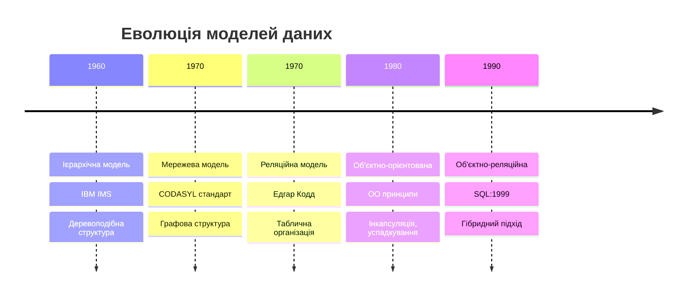

## Ієрархічна модель 🌳

### Основні принципи:

- **Структура дерева** — один батько, багато дітей
- **Навігаційний доступ** — від кореня до листя
- **Фізична близькість** — швидкий послідовний доступ

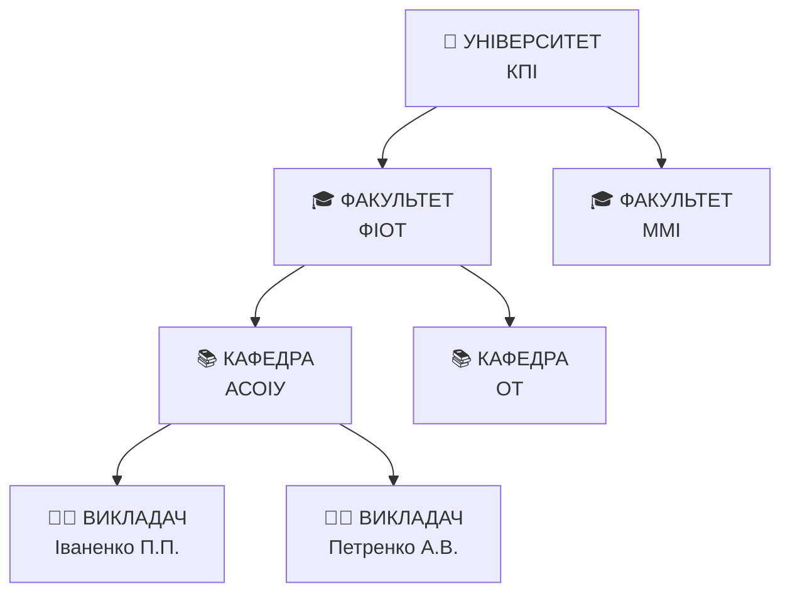

### ✅ Переваги vs ❌ Недоліки

| ✅ Переваги | ❌ Недоліки |
|-------------|-------------|
| Швидкий доступ по шляху | Жорстка структура |
| Природна для ієрархій | Дублювання даних |
| Простота розуміння | Складно змінювати |
| Цілісність зв'язків | Тільки 1-до-багатьох |

## Мережева модель 🕸️

### Розширення ієрархічної моделі:

- **Графова структура** — складні зв'язки
- **Набори (Sets)** — власник + члени
- **Багато батьків** — гнучкість моделювання

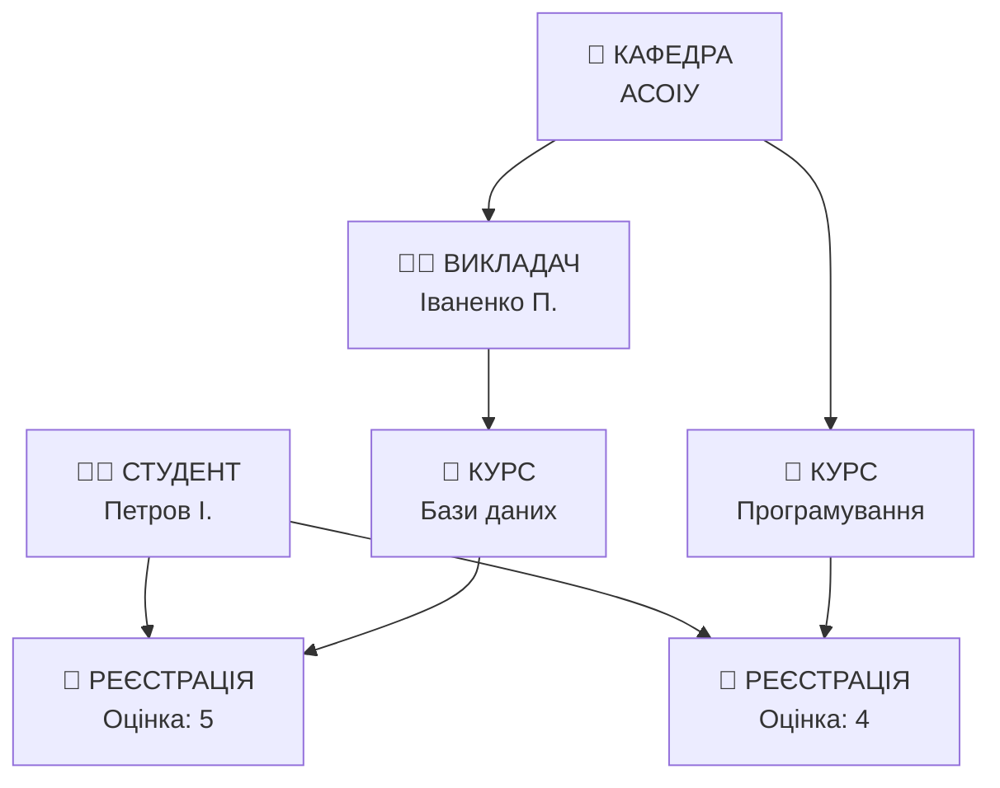

### Порівняння з ієрархічною

| Аспект | Ієрархічна | Мережева |
|--------|------------|----------|
| Зв'язки | 1-до-багатьох | багато-до-багатьох |
| Складність | Проста | Складна |
| Гнучкість | Обмежена | Висока |
| Програмування | Простіше | Складніше |

## Реляційна модель 📋

### Революція 1970 року — Едгар Кодд

#### Ключові принципи:

- 📊 **Таблична організація** — відношення як таблиці
- ⚛️ **Атомарність значень** — неподільні дані
- 🔑 **Унікальність кортежів** — первинні ключі
- 🔄 **Невпорядкованість** — логічна незалежність

### Приклад реляційної структури

```sql
-- Студенти
CREATE TABLE students (
    student_id INT PRIMARY KEY,
    first_name VARCHAR(50),
    last_name VARCHAR(50),
    group_name VARCHAR(10)
);

-- Курси
CREATE TABLE courses (
    course_id INT PRIMARY KEY,
    course_name VARCHAR(100),
    credits INT
);

-- Реєстрації (зв'язок багато-до-багатьох)
CREATE TABLE enrollments (
    student_id INT,
    course_id INT,
    grade DECIMAL(3,2),
    FOREIGN KEY (student_id) REFERENCES students(student_id),
    FOREIGN KEY (course_id) REFERENCES courses(course_id)
);
```

## Переваги реляційної моделі

### 🎯 Ключові переваги:

- **Математична строгість** — реляційна алгебра
- **Незалежність даних** — логічна ↔ фізична
- **Декларативність** — SQL описує "що", не "як"
- **Стандартизація** — SQL стандарт
- 🔄 Гнучкість зв'язків
- 🛡️ Вбудовані механізми цілісності

### 📊 Статистика використання:

| Тип системи | Використання реляційних СУБД |
|-------------|------------------------------|
| Корпоративні | 85% |
| Вебдодатки | 70% |
| Фінансові | 95% |
| Аналітичні | 60% |

## **2. Об'єктно-орієнтовані розширення**

## Об'єктно-орієнтована модель 🎯

### Принципи ОО-підходу:

- **Інкапсуляція** — дані + методи в об'єкті
- **Успадкування** — нові типи на основі існуючих
- **Поліморфізм** — різні реалізації одного інтерфейсу
- **Ідентичність об'єктів** — унікальний OID

### Мотивація створення:

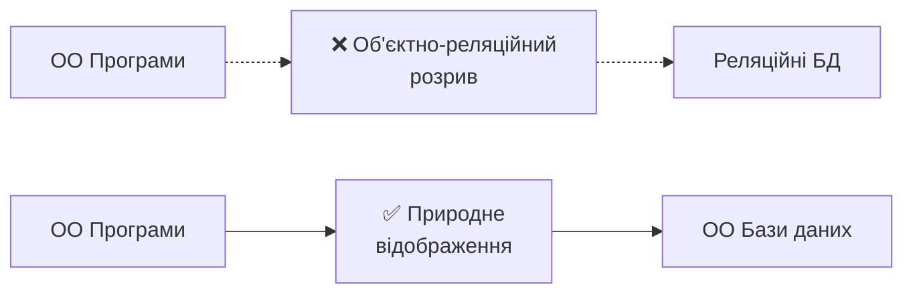

## Об'єктно-реляційна модель 🔄

### Гібридний підхід — найкраще з двох світів:

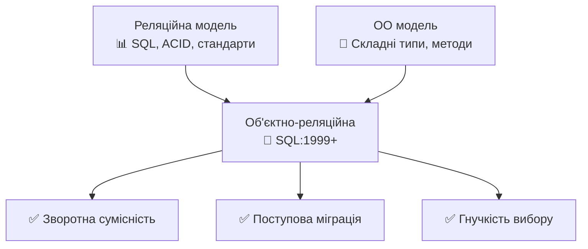

### Можливості ОР СУБД:

- 🔧 Користувацькі типи даних
- 📦 Вкладені таблиці та масиви
- 🔗 Об'єктні посилання
- ⚙️ Методи типів
- 🧬 Успадкування таблиць

## **3. Семіструктуровані моделі**

## XML vs JSON 📄

### Порівняння форматів:

| Характеристика | XML | JSON |
|----------------|-----|------|
| 📏 Розмір | Більший | Менший |
| ⚡ Швидкість парсингу | Повільніша | Швидша |
| 🔧 Валідація | XML Schema/DTD | JSON Schema |
| 💬 Коментарі | Підтримує | Не підтримує |
| 🌐 Стандартизація | W3C | ECMA-404 |
| 📱 Веб API | SOAP | REST |

### Приклад структури даних

#### XML:
```xml
<student id="S001">
    <personal_info>
        <first_name>Іван</first_name>
        <last_name>Петров</last_name>
    </personal_info>
    <courses>
        <course id="C001" credits="4">Бази даних</course>
        <course id="C002" credits="5">Програмування</course>
    </courses>
</student>
```

#### JSON:
```json
{
  "id": "S001",
  "personal_info": {
    "first_name": "Іван",
    "last_name": "Петров"
  },
  "courses": [
    {"id": "C001", "name": "Бази даних", "credits": 4},
    {"id": "C002", "name": "Програмування", "credits": 5}
  ]
}
```

## Застосування семіструктурованих даних

### 🌐 Веб-сервіси та API

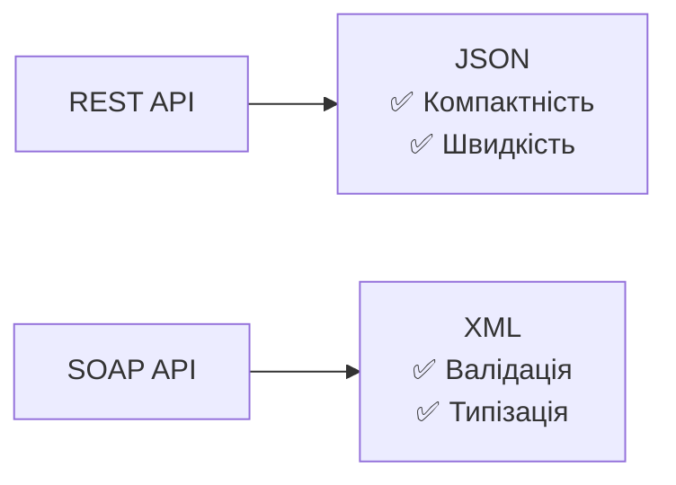

### 📊 NoSQL бази даних

- **MongoDB** — BSON (Binary JSON)
- **CouchDB** — JSON документи
- **MarkLogic** — XML документи

### 🛠️ Конфігурації

- **package.json** — Node.js проєкти
- **web.xml** — Java веб-додатки
- **docker-compose.yml** — контейнери

## **4. Багатовимірні моделі (OLAP)**

## OLTP vs OLAP

### Різні підходи до даних:

| Аспект | OLTP | OLAP |
|--------|------|------|
| 🎯 Мета | Обробка транзакцій | Аналіз даних |
| 📊 Запити | Прості, швидкі | Складні, агрегація |
| 💾 Дані | Поточні | Історичні |
| 👥 Користувачі | Багато | Мало |
| 📈 Навантаження | Запис інтенсивний | Читання інтенсивний |

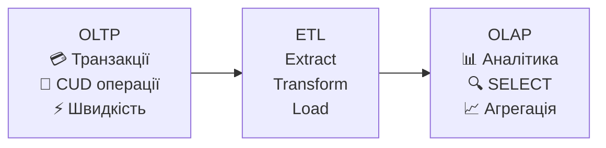

## Багатовимірний куб даних

### Концепція гіперкуба:

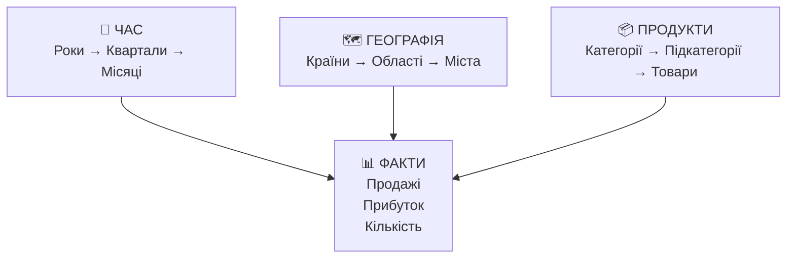

### Компоненти моделі:

- **Факти** — кількісні показники (продажі, прибуток)
- **Виміри** — аспекти аналізу (час, географія, продукти)
- **Міри** — функції агрегації (сума, середнє, кількість)
- **Ієрархії** — рівні деталізації в вимірах

## Схеми організації даних

### Схема "Зірка" ⭐

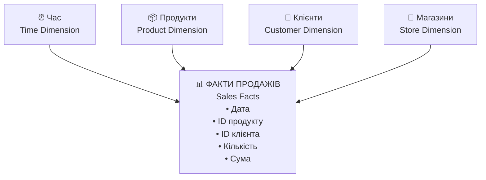

**✅ Переваги:** Простота, швидкі запити, мало JOIN-ів
**❌ Недоліки:** Дублювання в вимірах, складно оновлювати

### Схема "Сніжинка" ❄️

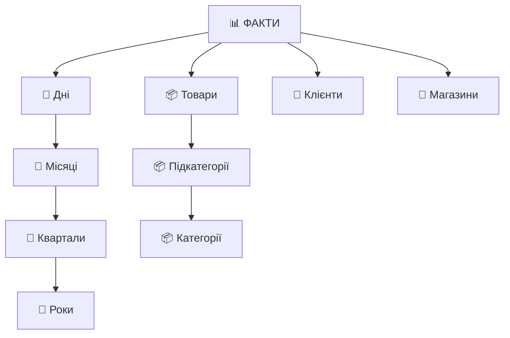

**✅ Переваги:** Нормалізація, менше дублювання
**❌ Недоліки:** Більше JOIN-ів, складніша структура

## OLAP операції

### 🔄 Основні операції з кубом:

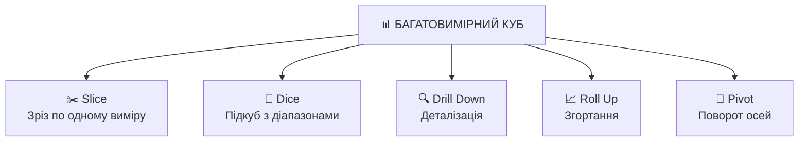

### Приклади операцій:

- **Slice:** Продажі тільки за 2023 рік
- **Dice:** Комп'ютери в Києві та Львові за Q4
- **Drill Down:** Рік → Квартал → Місяць → День
- **Roll Up:** День → Місяць → Квартал → Рік
- **Pivot:** Поміняти місцями час і географію

## Типи OLAP систем

### 🏗️ Архітектурні рішення:

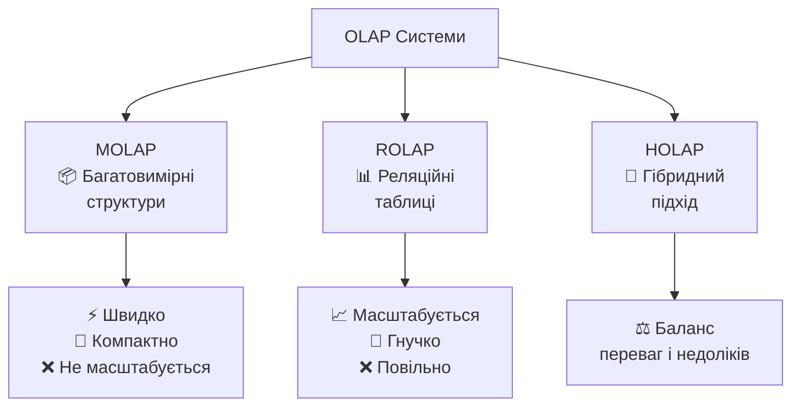

### Порівняння OLAP типів:

| Тип | Зберігання | Швидкість | Масштабованість |
|-----|------------|-----------|----------------|
| MOLAP | Куби | ⚡⚡⚡ | 📊 |
| ROLAP | Таблиці | ⚡ | 📈📈📈 |
| HOLAP | Змішане | ⚡⚡ | 📈📈 |

## **5. Критерії вибору моделі**

## Фактори вибору моделі даних

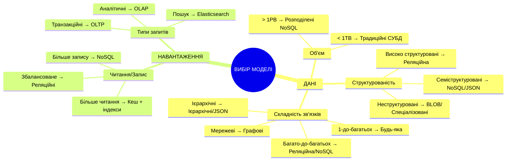

## Матриця вибору моделей

### 📊 Рекомендації для різних сценаріїв:

| Сценарій | Модель | Приклад СУБД | Обґрунтування |
|----------|--------|--------------|---------------|
| 🏢 Корпоративні системи | Реляційна | PostgreSQL, Oracle | ACID, складні зв'язки |
| 🌐 Вебдодатки | Гібридна | PostgreSQL + Redis | Гнучкість + швидкість |
| 📊 Аналітика | Багатовимірна | ClickHouse, Druid | Агрегація великих об'ємів |
| 👥 Соціальні мережі | Графова | Neo4j + MongoDB | Складні зв'язки + контент |
| 🔧 IoT системи | Часові ряди | InfluxDB | Часові дані, швидкий запис |

## Еволюція вибору

### 📈 Тренди використання моделей:

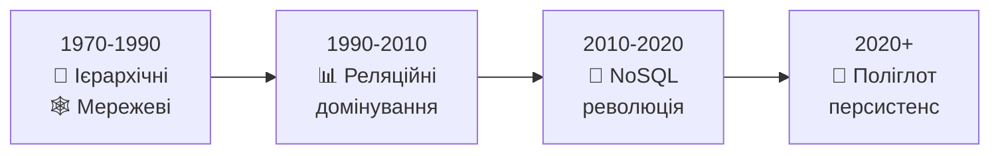

### Поліглот персистенс:

- **Транзакційні дані** → PostgreSQL
- **Кеш** → Redis
- **Документи** → MongoDB
- **Графи** → Neo4j
- **Пошук** → Elasticsearch
- **Аналітика** → ClickHouse

## Практичні рекомендації

### ✅ Питання для самоперевірки:

1. **Чи потрібна строга консистентність?**
   - Так → Реляційна модель
   - Ні → NoSQL варіанти

2. **Який тип запитів переважає?**
   - CRUD операції → Реляційна
   - Аналітика → Колонкові/OLAP
   - Пошук → Індексні системи

3. **Як часто змінюється схема?**
   - Рідко → Реляційна
   - Часто → Документо-орієнтована

4. **Який об'єм даних очікується?**
   - < 1TB → Традиційні СУБД
   - > 1PB → Розподілені системи

### 🎯 Золоте правило:

> **"Починайте з реляційної моделі, переходьте до спеціалізованих рішень тільки при конкретних потребах"**
