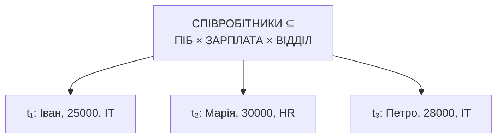
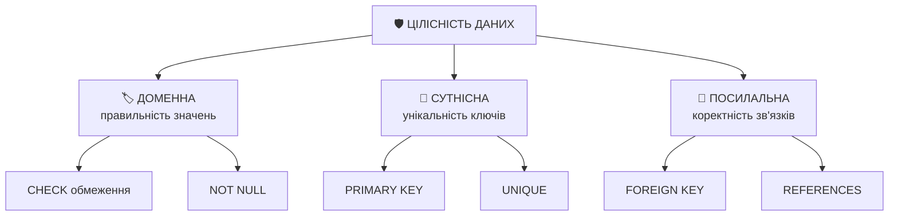
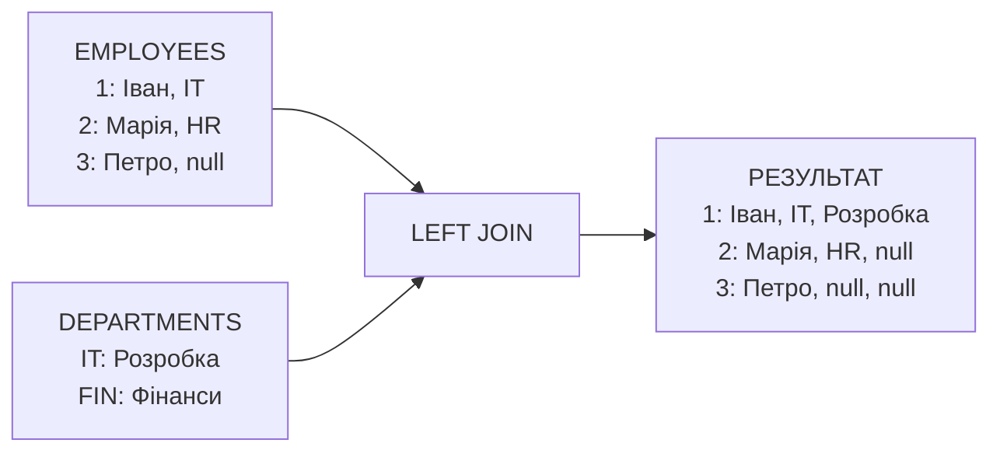
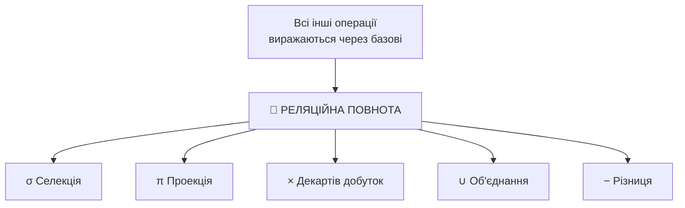
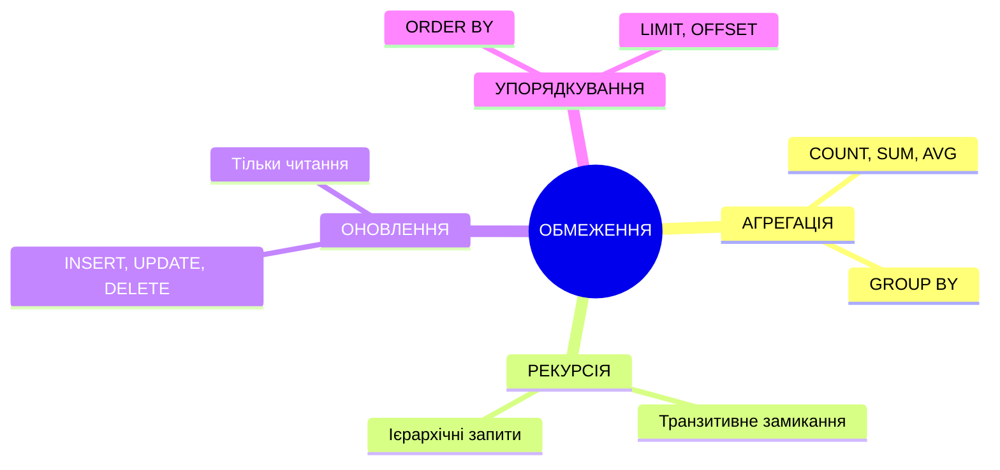
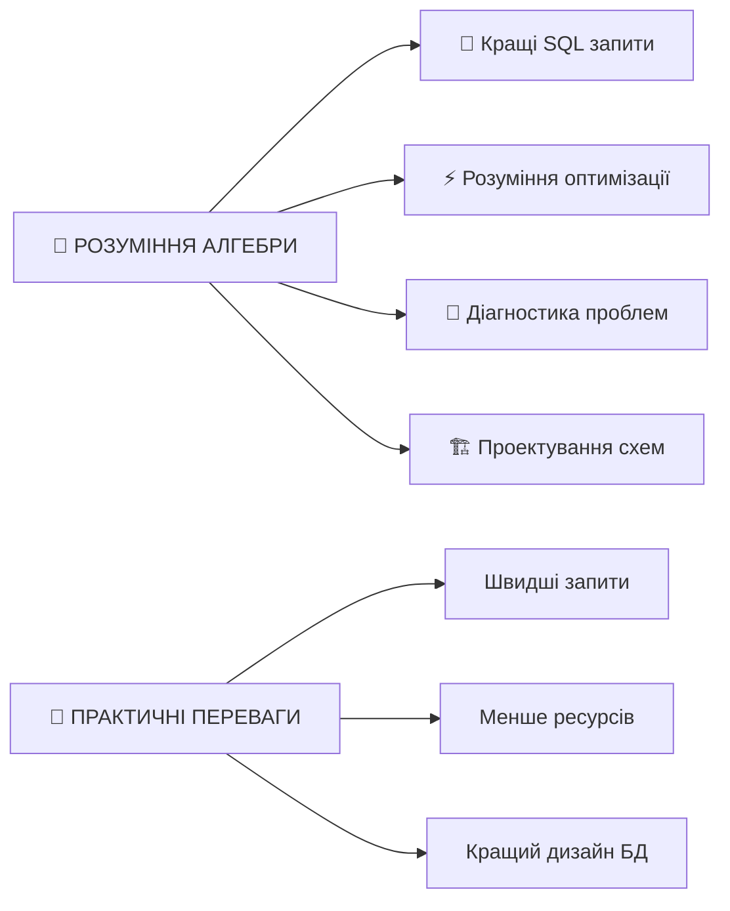

# Реляційна модель даних

## План лекції

1. Математичний апарат реляційної моделі
2. Структурний аспект реляційної моделі
3. Обмеження цілісності
4. Реляційна алгебра
5. Повнота реляційної алгебри та зв'язок із SQL

## 🎯 Ключові поняття

**Домен** — множина допустимих значень для певного атрибута

**Відношення** — підмножина картезіанського добутку доменів (таблиця)

**Кортеж** — упорядкований набір значень атрибутів (рядок таблиці)

**Схема відношення** — структура відношення з назвами атрибутів та їх доменами

**Реляційна алгебра** — формальна мова операцій над відношеннями

## 1. Математичний апарат

## Домени та їх властивості

### 🗃️ Формальне визначення домену

```
D = {v₁, v₂, v₃, ..., vₙ}
```

### Приклади доменів:

```
Домен ПІБ_СПІВРОБІТНИКА:
- Тип: VARCHAR(100)
- Обмеження: не NULL, тільки літери
- Значення: {"Іван Коваленко", "Марія Мельник"}

Домен ЗАРПЛАТА:
- Тип: DECIMAL(10,2)
- Обмеження: >= 0, <= 1000000
- Значення: {15000.00, 25000.50, 45000.00}
```

### 🔑 Важливо:

- Домени мають семантичне значення
- Однаковий тип ≠ однаковий домен
- НОМЕР_ТЕЛЕФОНУ ≠ НОМЕР_ПАСПОРТА

## Відношення як математична концепція

### 📊 Формальне визначення

```
R ⊆ D₁ × D₂ × ... × Dₙ
```

Відношення = підмножина картезіанського добутку доменів

### Приклад:


```mermaid
graph TD
    A[СПІВРОБІТНИКИ ⊆<br/>ПІБ × ЗАРПЛАТА × ВІДДІЛ] --> B[t₁: Іван, 25000, IT]
    A --> C[t₂: Марія, 30000, HR]
    A --> D[t₃: Петро, 28000, IT]
```

## Картезіанський добуток

### ✖️ Приклад обчислення:

```
ІМЕНА = {"Іван", "Марія"}
ВІДДІЛИ = {"IT", "HR"}

ІМЕНА × ВІДДІЛИ = {
    ("Іван", "IT"),
    ("Іван", "HR"),
    ("Марія", "IT"),
    ("Марія", "HR")
}
```

### 📈 Розмір добутку: |D₁| × |D₂| × ... × |Dₙ|

## Проекція

### 🎯 Операція проекції: π

**πₐ(R)** — вибір певних атрибутів з відношення

### Приклад:

```
СПІВРОБІТНИКИ:
| ПІБ | ЗАРПЛАТА | ВІДДІЛ | ТЕЛЕФОН |
|-----|----------|--------|---------|
| Іван | 25000 | IT | 555-1234 |
| Марія | 30000 | HR | 555-5678 |

π{ПІБ,ЗАРПЛАТА}(СПІВРОБІТНИКИ):
| ПІБ | ЗАРПЛАТА |
|-----|----------|
| Іван | 25000 |
| Марія | 30000 |
```

⚠️ Проекція автоматично видаляє дублікати!

## Властивості відношень

### 📋 4 ключові властивості:

1. 🔄 Відсутність порядку рядків — рядки не впорядковані
2. 📑 Відсутність порядку стовпців — стовпці ідентифікуються назвами
3. ✨ Унікальність рядків — кожен рядок унікальний
4. ⚛️ Атомарність значень — одне значення в комірці

### Приклад унікальності:

```
ДОЗВОЛЕНО:
| ID | ІМ'Я |
|----|------|
| 1  | Іван |
| 2  | Марія |

ЗАБОРОНЕНО:
| ID | ІМ'Я |
|----|------|
| 1  | Іван |
| 1  | Іван |  ← Дублікат!
```

## 2. Структурний аспект

## Домени у практичних СУБД

### 🛠️ Стандартні домени:

```sql
-- Числові домени
INTEGER, BIGINT, DECIMAL(p,s), REAL

-- Символьні домени
CHAR(n), VARCHAR(n), TEXT

-- Часові домени
DATE, TIME, TIMESTAMP

-- Спеціальні домени
JSON, XML, UUID, BOOLEAN
```

### Користувацькі домени:

```sql
-- Домен для email
CREATE DOMAIN email_domain AS VARCHAR(255)
CHECK (VALUE ~ '^[A-Za-z0-9._%+-]+@[A-Za-z0-9.-]+\.[A-Za-z]{2,}$');

-- Домен для позитивних сум
CREATE DOMAIN positive_amount AS DECIMAL(10,2)
CHECK (VALUE > 0);
```

## Атрибути та їх характеристики

### 🏷️ Властивості атрибутів:

```sql
CREATE TABLE students (
    -- Обов'язковий атрибут
    student_id INTEGER NOT NULL,

    -- Атрибут зі значенням за замовчуванням
    enrollment_date DATE DEFAULT CURRENT_DATE,

    -- Унікальний атрибут
    email VARCHAR(100) UNIQUE,

    -- Атрибут з обмеженням
    age INTEGER CHECK (age >= 16 AND age <= 65),

    -- Може бути NULL
    middle_name VARCHAR(50)
);
```

### Класифікація атрибутів:

| Критерій | Типи |
|----------|------|
| Обов'язковість | NOT NULL / NULL |
| Унікальність | UNIQUE / звичайні |
| Походження | збережені / обчислювані |

## Кортежі

### 📝 Формальне визначення кортежу:

```
t: {A₁, A₂, ..., Aₙ} → D₁ ∪ D₂ ∪ ... ∪ Dₙ ∪ {NULL}
```

### Практичний приклад:

```sql
-- Кортеж як функція
t(student_id) = 1001
t(name) = 'Іван Коваленко'
t(group_name) = 'КН-21'
t(email) = 'ivan@email.com'
t(middle_name) = NULL
```

## Схема відношення

### 🏗️ Повна схема включає:

```sql
CREATE TABLE courses (
    -- Первинний ключ
    course_id CHAR(8) PRIMARY KEY,

    -- Обов'язковий атрибут
    course_name VARCHAR(200) NOT NULL,

    -- Атрибут з обмеженням
    credits INTEGER CHECK (credits BETWEEN 1 AND 10),

    -- Зовнішній ключ
    department_id INTEGER REFERENCES departments(id),

    -- Унікальне обмеження
    UNIQUE (course_name, department_id)
);
```

### 📋 Схема = структура + обмеження + правила

## 3. Обмеження цілісності

## Три типи цілісності


```mermaid
graph TD
    A[🛡️ ЦІЛІСНІСТЬ ДАНИХ] --> B[🏷️ ДОМЕННА<br/>правильність значень]
    A --> C[🔑 СУТНІСНА<br/>унікальність ключів]
    A --> D[🔗 ПОСИЛАЛЬНА<br/>коректність зв'язків]

    B --> E[CHECK обмеження]
    B --> F[NOT NULL]

    C --> G[PRIMARY KEY]
    C --> H[UNIQUE]

    D --> I[FOREIGN KEY]
    D --> J[REFERENCES]
```

## Доменна цілісність

### ✅ Забезпечує правильність значень

```sql
CREATE TABLE products (
    id INTEGER,  -- Тільки цілі числа
    price DECIMAL(10,2) CHECK (price > 0),  -- Позитивна ціна
    category VARCHAR(50) CHECK (category IN ('Electronics', 'Books', 'Clothing')),
    name VARCHAR(100) NOT NULL  -- Обов'язкова назва
);
```

## Цілісність сутності

### 🔑 Первинний ключ — головне правило:

1. Унікальність — кожен кортеж ідентифікується однозначно
2. Не NULL — первинний ключ не може бути NULL
3. Мінімальність — найменший набір атрибутів

### Приклади:

```sql
-- Простий первинний ключ
CREATE TABLE departments (
    id SERIAL PRIMARY KEY,  -- Автогенерований
    name VARCHAR(100) NOT NULL
);

-- Складений первинний ключ
CREATE TABLE enrollments (
    student_id INTEGER,
    course_id INTEGER,
    semester VARCHAR(20),
    PRIMARY KEY (student_id, course_id, semester)
);
```

## Посилальна цілісність

### 🔗 Зовнішні ключі забезпечують зв'язки

```sql
CREATE TABLE employees (
    id INTEGER PRIMARY KEY,
    name VARCHAR(100) NOT NULL,
    department_id INTEGER,

    -- Зовнішній ключ
    FOREIGN KEY (department_id) REFERENCES departments(id)
);
```

### Стратегії підтримки цілісності:

```sql
FOREIGN KEY (customer_id) REFERENCES customers(id)
    ON DELETE CASCADE,      -- Видалити залежні записи
    ON UPDATE SET NULL,     -- Встановити NULL при оновленні
    -- ON DELETE RESTRICT   -- Заборонити видалення
    -- ON DELETE SET DEFAULT -- Значення за замовчуванням
```

## 4. Реляційна алгебра

## Селекція (Selection) - σ

### 🎯 Вибирає рядки за умовою

```
σ_умова(R)
```

### Приклади:

```sql
-- Реляційна алгебра: σ_salary>25000(EMPLOYEES)
SELECT * FROM employees WHERE salary > 25000;

-- Складна умова: σ_dept='IT' AND salary>20000(EMPLOYEES)
SELECT * FROM employees
WHERE department = 'IT' AND salary > 20000;
```

### Візуалізація:

```
EMPLOYEES:
| ID | NAME  | DEPT | SALARY |
|----|-------|------|--------|
| 1  | Іван  | IT   | 30000  |  ✓
| 2  | Марія | HR   | 25000  |  ✗
| 3  | Петро | IT   | 20000  |  ✗

σ_salary>25000(EMPLOYEES):
| ID | NAME | DEPT | SALARY |
|----|------|------|--------|
| 1  | Іван | IT   | 30000  |
```

## Проекція (Projection) - π

### 📋 Вибирає стовпці (атрибути)

```
π_список_атрибутів(R)
```

### Приклади:

```sql
-- π_name,salary(EMPLOYEES)
SELECT DISTINCT name, salary FROM employees;

-- π_department(EMPLOYEES)
SELECT DISTINCT department FROM employees;
```

⚠️ Автоматично видаляє дублікати!

## Теоретико-множинні операції

### 🔗 Об'єднання (∪), Різниця (−), Перетин (∩)

Умова: відношення мають бути сумісними за об'єднанням
- Однакова кількість атрибутів
- Відповідні атрибути мають сумісні домени

```sql
-- Об'єднання: всі студенти
SELECT student_id, name FROM day_students
UNION
SELECT student_id, name FROM evening_students;

-- Різниця: студенти, які не є випускниками
SELECT student_id, name FROM students
EXCEPT
SELECT student_id, name FROM graduates;

-- Перетин: студенти, які також працюють
SELECT student_id, name FROM students
INTERSECT
SELECT employee_id, name FROM employees;
```

## Декартів добуток (×)

### ✖️ Всі можливі комбінації

```
R:              S:
| A | B |       | C | D |
|---|---|       |---|---|
| 1 | x |       | a | 3 |
| 2 | y |       | b | 4 |

R × S:
| R.A | R.B | S.C | S.D |
|-----|-----|-----|-----|
| 1   | x   | a   | 3   |
| 1   | x   | b   | 4   |
| 2   | y   | a   | 3   |
| 2   | y   | b   | 4   |
```

📏 Розмір результату: |R| × |S| записів

## Похідні операції

### 🔄 З'єднання (Join) - ⋈

Найважливіша похідна операція!

#### Натуральне з'єднання:

```sql
EMPLOYEES ⋈ DEPARTMENTS
-- Автоматично з'єднує по DEPT_ID

SELECT e.name, d.dept_name
FROM employees e NATURAL JOIN departments d;
```

#### Тета-з'єднання:

```sql
-- R ⋈_θ S = σ_θ(R × S)
SELECT e.name, e.salary, d.avg_salary
FROM employees e
JOIN dept_averages d ON e.dept_id = d.dept_id
                     AND e.salary > d.avg_salary;
```

## Зовнішнє з'єднання

### 🔗 Зберігає записи без відповідностей


```mermaid
graph LR
    A[EMPLOYEES<br/>1: Іван, IT<br/>2: Марія, HR<br/>3: Петро, null] --> C[LEFT JOIN]
    B[DEPARTMENTS<br/>IT: Розробка<br/>FIN: Фінанси] --> C

    C --> D[РЕЗУЛЬТАТ<br/>1: Іван, IT, Розробка<br/>2: Марія, HR, null<br/>3: Петро, null, null]
```

```sql
-- Ліве зовнішнє з'єднання
SELECT e.name, d.dept_name
FROM employees e LEFT JOIN departments d
ON e.dept_id = d.id;
```

## Ділення (÷)

### 🎯 Знаходить "всі для всіх"

Приклад: студенти, записані на ВСІ курси

```sql
-- enrollments ÷ courses
SELECT student_id
FROM enrollments e1
WHERE NOT EXISTS (
    SELECT course_id FROM courses c
    WHERE NOT EXISTS (
        SELECT 1 FROM enrollments e2
        WHERE e2.student_id = e1.student_id
        AND e2.course_id = c.course_id
    )
);
```

## Властивості операцій

### 🔄 Алгебричні властивості:

```
Комутативність:
R ∪ S = S ∪ R
R ∩ S = S ∩ R
R ⋈ S = S ⋈ R

Асоціативність:
(R ∪ S) ∪ T = R ∪ (S ∪ T)
(R ⋈ S) ⋈ T = R ⋈ (S ⋈ T)

Дистрибутивність:
σ_p(R ∪ S) = σ_p(R) ∪ σ_p(S)
π_A(R ∪ S) = π_A(R) ∪ π_A(S)
```

## Оптимізація запитів

### ⚡ Правила оптимізації:

```mermaid
graph TD
    A[Неоптимізований:<br/>π_name(σ_salary>25000(EMPLOYEES ⋈ DEPARTMENTS))]
    --> B[Оптимізований:<br/>π_name(σ_salary>25000(EMPLOYEES) ⋈ DEPARTMENTS)]

    C[Принцип:<br/>Селекція якомога раніше] --> B
    D[Принцип:<br/>Проекція якомога раніше] --> B
```

💡 Основні правила:
1. Селекція раніше — зменшити кількість рядків
2. Проекція раніше — зменшити кількість стовпців
3. Комбінувати операції — σ_p1(σ_p2(R)) = σ_p1∧p2(R)

## 5. Повнота та зв'язок із SQL

## Повнота реляційної алгебри

### ✅ Мінімальний повний набір:


```mermaid
graph TD
    A[🎯 РЕЛЯЦІЙНА ПОВНОТА] --> B[σ Селекція]
    A --> C[π Проекція]
    A --> D[× Декартів добуток]
    A --> E[∪ Об'єднання]
    A --> F[− Різниця]

    G[Всі інші операції<br/>виражаються через базові] --> A
```

### Приклади виразження:

```
Перетин: R ∩ S = R − (R − S)
Натуральне з'єднання: R ⋈ S = σ_R.A=S.A(R × S)
Тета-з'єднання: R ⋈_θ S = σ_θ(R × S)
```

## Обмеження реляційної алгебри

### ❌ Чого немає в базовій алгебрі:


```mermaid
mindmap
  root((ОБМЕЖЕННЯ))
    АГРЕГАЦІЯ
      COUNT, SUM, AVG
      GROUP BY
    РЕКУРСІЯ
      Транзитивне замикання
      Ієрархічні запити
    ОНОВЛЕННЯ
      INSERT, UPDATE, DELETE
      Тільки читання
    УПОРЯДКУВАННЯ
      ORDER BY
      LIMIT, OFFSET
```

### Розширення алгебри:

```sql
-- Агрегатний оператор γ
γ_department; COUNT(*), AVG(salary)(EMPLOYEES)

-- SQL еквівалент:
SELECT department, COUNT(*), AVG(salary)
FROM employees
GROUP BY department;
```

## Відповідність SQL та реляційної алгебри

### 🔄 Основні відповідності:

| Реляційна алгебра | SQL |
|----------------------|---------|
| σ_умова(R) | WHERE умова |
| π_атрибути(R) | SELECT DISTINCT атрибути |
| R ∪ S | UNION |
| R − S | EXCEPT |
| R ∩ S | INTERSECT |
| R × S | CROSS JOIN |
| R ⋈ S | JOIN |

## Ключові відмінності SQL від алгебри

### 🔄 Множини vs Мультимножини

```sql
-- Реляційна алгебра (множини)
R = {(1, 'A'), (2, 'B')}  -- Без дублікатів

-- SQL (мультимножини)
SELECT department FROM employees;
-- Може повернути: IT, IT, HR, IT

-- Явне видалення дублікатів
SELECT DISTINCT department FROM employees;
```

### 📊 Розширення SQL:

```sql
-- Агрегатні функції
SELECT department, COUNT(*), AVG(salary)
FROM employees
GROUP BY department
HAVING AVG(salary) > 30000;

-- Віконні функції
SELECT name, salary,
    RANK() OVER (PARTITION BY department ORDER BY salary DESC)
FROM employees;

-- Підзапити та рекурсія
WITH RECURSIVE hierarchy AS (...)
```

## Порядок виконання SQL

### 🔢 Логічний порядок виконання:

```sql
SELECT department, AVG(salary)     -- 6. Проекція
FROM employees                     -- 1. Витяг даних
WHERE hire_date > '2020-01-01'    -- 2. Селекція
GROUP BY department               -- 3. Групування
HAVING AVG(salary) > 30000       -- 4. Селекція груп
ORDER BY AVG(salary) DESC         -- 5. Сортування
LIMIT 5;                         -- 7. Обмеження
```

### Відповідний вираз у алгебрі:

```
LIMIT_5(SORT_avg_DESC(σ_AVG>30000(γ_dept;AVG(sal)(σ_date>'2020'(EMPLOYEES)))))
```

## Оптимізація SQL через алгебру

### ⚡ Принципи оптимізатора:

```sql
-- Початковий запит
SELECT e.name, d.dept_name
FROM employees e, departments d
WHERE e.salary > 50000
  AND e.dept_id = d.id
  AND d.budget > 100000;

-- Оптимізатор перетворює в:
SELECT e.name, d.dept_name
FROM (SELECT name, dept_id FROM employees WHERE salary > 50000) e
JOIN (SELECT id, dept_name FROM departments WHERE budget > 100000) d
  ON e.dept_id = d.id;
```

🎯 Результат: селекція застосовується раніше, менше даних обробляється

## Практичне значення

### 🎯 Чому це важливо:


```mermaid
graph LR
    A[🧠 РОЗУМІННЯ АЛГЕБРИ] --> B[📝 Кращі SQL запити]
    A --> C[⚡ Розуміння оптимізації]
    A --> D[🐛 Діагностика проблем]
    A --> E[🏗️ Проектування схем]

    F[💼 ПРАКТИЧНІ ПЕРЕВАГИ] --> G[Швидші запити]
    F --> H[Менше ресурсів]
    F --> I[Кращий дизайн БД]
```

### 🚀 Сучасна актуальність:

- NoSQL системи часто надають SQL інтерфейси
- Розподілені СУБД використовують принципи алгебри
- Хмарні сервіси базуються на реляційних принципах
- Аналітичні системи розширюють реляційну модель

## Висновки

1. 🔢 Математичні основи — домени, відношення, картезіанський добуток
2. 🏗️ Структурні елементи — атрибути, кортежі, схеми
3. 🛡️ Цілісність даних — доменна, сутнісна, посилальна
4. ⚙️ Реляційна алгебра — базові та похідні операції

### 🎯 Практичне значення:

**Реляційна модель** = основа всіх сучасних СУБД

**Реляційна алгебра** = математичний фундамент SQL

**Обмеження цілісності** = автоматичне забезпечення якості даних
