# Концептуальне моделювання предметних областей

## План лекції

1. **Методологія проектування БД**
2. **Entity-Relationship модель**
3. **Семантичні обмеження**
4. **Розширена ER-модель**
5. **Альтернативні нотації**
6. **Практичний приклад**

---

## **🎯 Основна мета**

**Концептуальне моделювання** — це процес створення абстрактного представлення предметної області, яке служить мостом між реальним світом та технічною реалізацією бази даних.

### **✅ Результат правильного моделювання:**
- Чітке розуміння предметної області
- Основа для логічного проектування
- Документація бізнес-правил
- Можливість валідації з користувачами

---

## **1. Методологія проектування БД**

## Трирівнева архітектура проектування

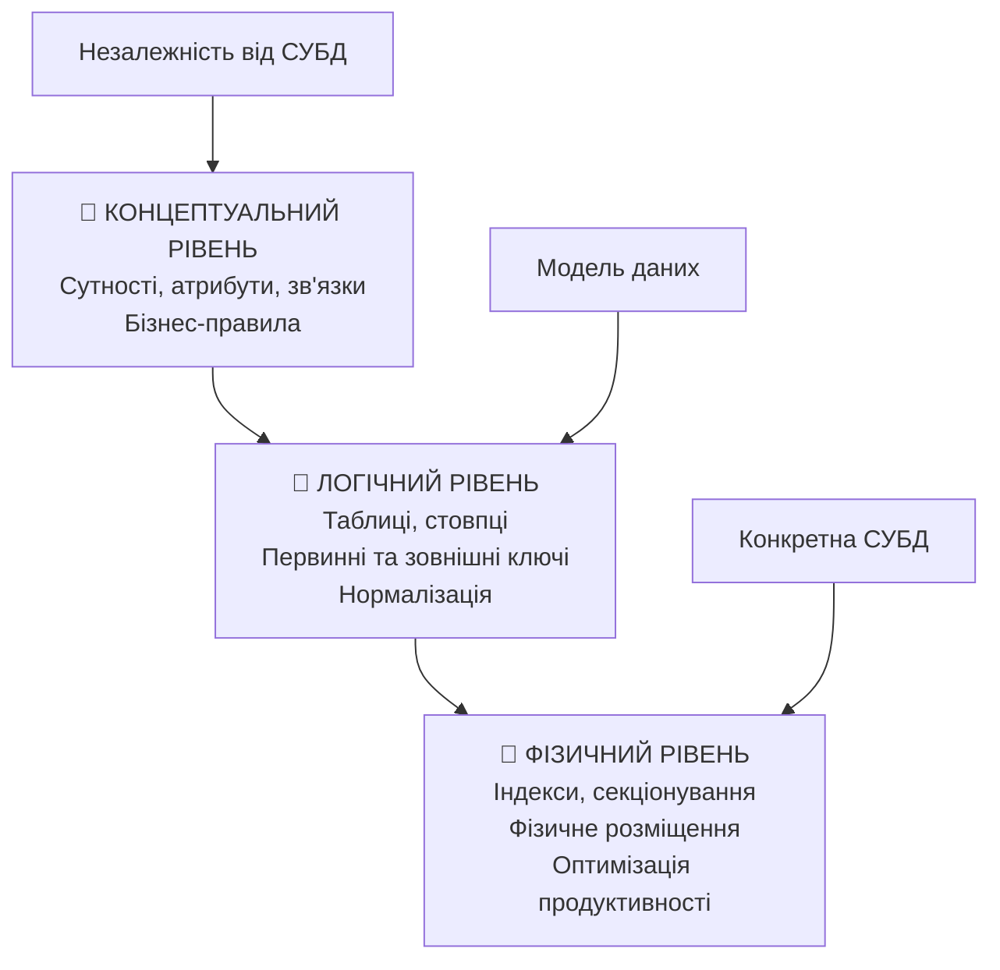

### **🔄 Взаємозв'язок рівнів:**
- Кожен рівень базується на попередньому
- Зміни на вищому рівні впливають на нижчі
- Незалежність між рівнями забезпечує гнучкість

---

## Концептуальний рівень

### **🎯 Основні завдання:**

- **🔍 Ідентифікація сутностей** предметної області
- **📋 Визначення атрибутів** кожної сутності
- **🔗 Встановлення зв'язків** між сутностями
- **📏 Визначення бізнес-правил** та обмежень

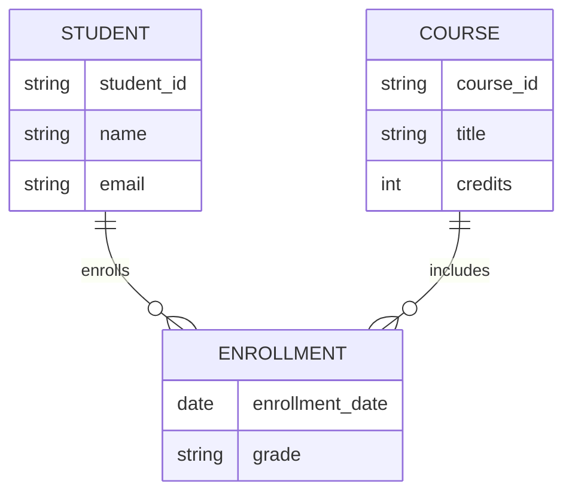

### **✅ Переваги концептуального моделювання:**
- Незалежність від технології
- Зрозумілість для бізнес-користувачів
- Основа для командної роботи

---

## Логічний рівень

### **🔄 Трансформація концептуальної моделі:**

**Концептуальна модель →**
```
СТУДЕНТ (атрибути: id, ім'я, email)
КУРС (атрибути: id, назва, кредити)
РЕЄСТРАЦІЯ (зв'язок: студент-курс)
```

**→ Логічна модель:**
```sql
CREATE TABLE students (
    student_id VARCHAR(10) PRIMARY KEY,
    name VARCHAR(100) NOT NULL,
    email VARCHAR(100) UNIQUE
);

CREATE TABLE courses (
    course_id VARCHAR(10) PRIMARY KEY,
    title VARCHAR(100) NOT NULL,
    credits INT CHECK (credits > 0)
);

CREATE TABLE enrollments (
    student_id VARCHAR(10),
    course_id VARCHAR(10),
    enrollment_date DATE,
    grade CHAR(2),
    FOREIGN KEY (student_id) REFERENCES students(student_id)
);
```

---

## Фізичний рівень

### **⚡ Оптимізація продуктивності:**

```sql
-- Створення індексів
CREATE INDEX idx_enrollments_student
ON enrollments(student_id);

CREATE INDEX idx_enrollments_course
ON enrollments(course_id);

-- Композитний індекс для складних запитів
CREATE INDEX idx_enrollments_grade_date
ON enrollments(grade, enrollment_date);

-- Секціонування великих таблиць
CREATE TABLE enrollments_2024
PARTITION OF enrollments
FOR VALUES FROM ('2024-01-01') TO ('2025-01-01');
```

### **📊 Фізичні аспекти:**
- Створення індексів для швидкого пошуку
- Секціонування великих таблиць
- Налаштування параметрів зберігання
- Оптимізація розміщення на дисках

---

## **2. Entity-Relationship модель**

## Основні компоненти ER-моделі

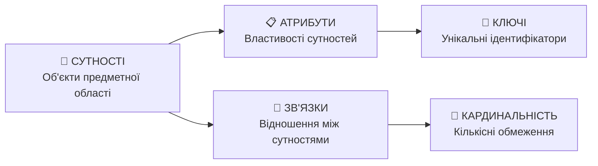

### **🎯 Призначення компонентів:**
- **Сутності** — моделюют об'єкти реального світу
- **Атрибути** — описують властивості сутностей
- **Зв'язки** — відображають взаємодії між сутностями

---

## Сутності (Entities)

### **📦 Типи сутностей:**

**🏛️ Сильні сутності:**
- Мають власний унікальний ідентифікатор
- Існують незалежно від інших сутностей

**🤝 Слабкі сутності:**
- Залежать від інших сутностей для ідентифікації
- Не мають власного повного ключа

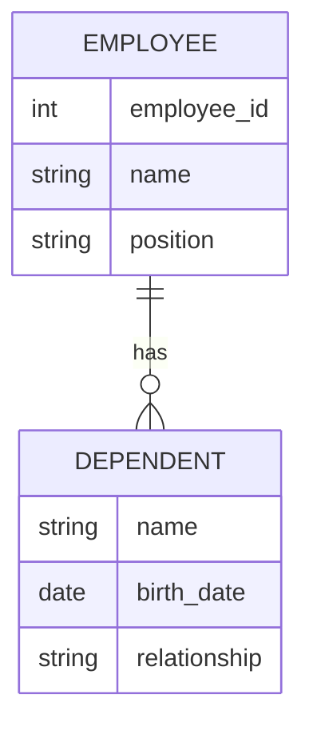

### **✅ Приклади:**
- **Сильні:** СТУДЕНТ, КУРС, ВИКЛАДАЧ
- **Слабкі:** ЗАЛЕЖНИК, КІМНАТА (в контексті будівлі)

---

## Атрибути (Attributes)

### **📋 Класифікація атрибутів:**

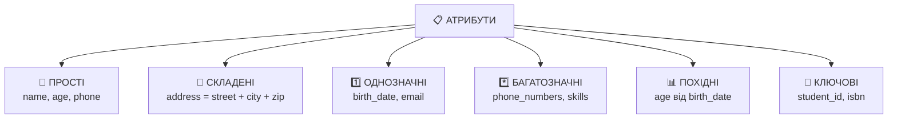

### **🎯 Особливості типів:**

| Тип атрибута | Характеристика | Приклад |
|--------------|-----------------|---------|
| **Простий** | Неподільне значення | `phone_number` |
| **Складений** | Можна розділити | `full_address` |
| **Багатозначний** | Множина значень | `languages[]` |
| **Похідний** | Обчислюється | `age = CURRENT_DATE - birth_date` |

---

## Зв'язки (Relationships)

### **🔗 Типи зв'язків:**

**За кількістю учасників:**
- **Бінарні** — між двома сутностями
- **Тернарні** — між трьома сутностями
- **N-арні** — між n сутностями

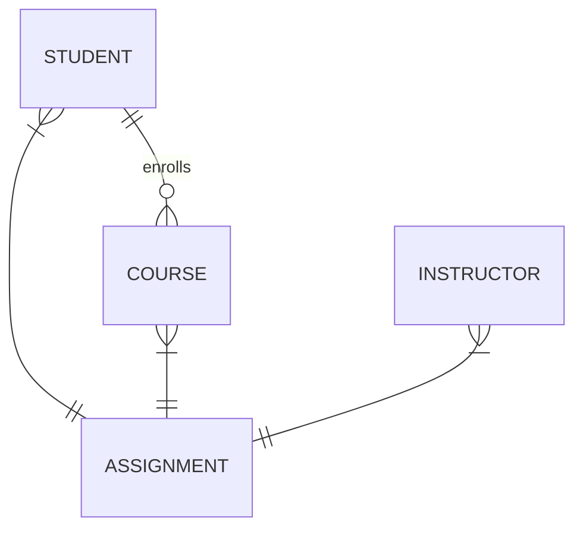

### **📊 Атрибути зв'язків:**

Зв'язки можуть мати власні атрибути:
- **РЕЄСТРАЦІЯ:** `enrollment_date`, `grade`
- **ПРАЦЕВЛАШТУВАННЯ:** `start_date`, `salary`
- **УЧАСТЬ_У_ПРОЄКТІ:** `role`, `hours_worked`

---

## **3. Семантичні обмеження**

## Кардинальність зв'язків

### **📏 Основні типи кардинальності:**

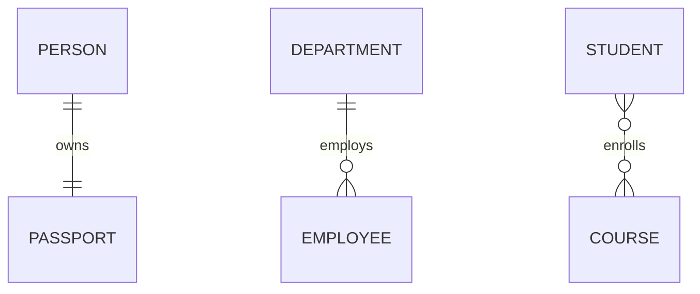

### **🎯 Практичні приклади:**

| Кардинальність | Опис | Приклад |
|----------------|------|---------|
| **1:1** | Один екземпляр ↔ один екземпляр | КРАЇНА ↔ СТОЛИЦЯ |
| **1:M** | Один екземпляр ↔ багато екземплярів | ВІДДІЛ → СПІВРОБІТНИКИ |
| **M:N** | Багато екземплярів ↔ багато екземплярів | СТУДЕНТИ ↔ КУРСИ |

---

## Участь у зв'язках

### **🎭 Типи участі:**

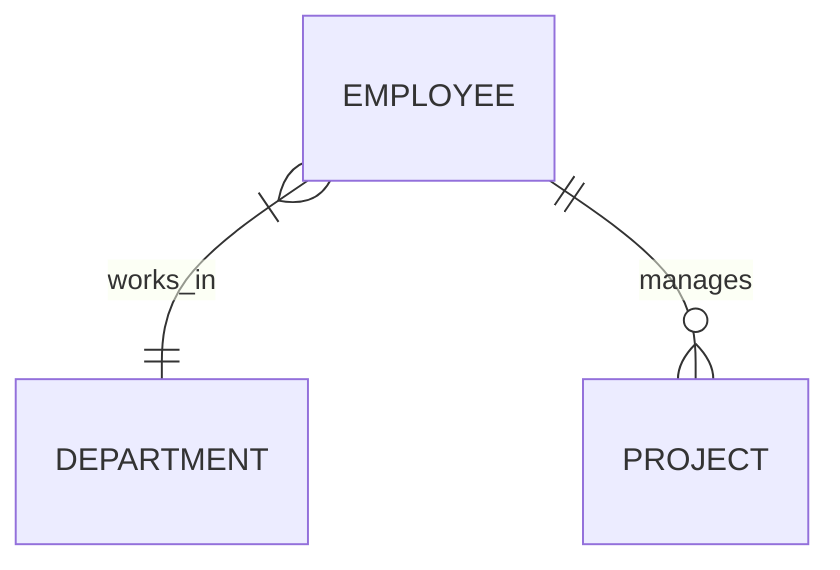

**🔒 Повна участь (Total Participation):**
- Кожен екземпляр **обов'язково** бере участь у зв'язку
- Графічно: **подвійна лінія**
- Приклад: кожен СПІВРОБІТНИК працює в ВІДДІЛІ

**🔓 Часткова участь (Partial Participation):**
- Екземпляр **може** брати участь у зв'язку
- Графічно: **одинарна лінія**
- Приклад: СПІВРОБІТНИК може керувати ПРОЄКТОМ

### **⚖️ Обмеження участі визначають:**
- Мінімальну кількість зв'язків для кожного екземпляра
- Бізнес-правила предметної області
- Обмеження цілісності даних

---

## Ідентифікуючі зв'язки

### **🆔 Характеристики ідентифікуючих зв'язків:**

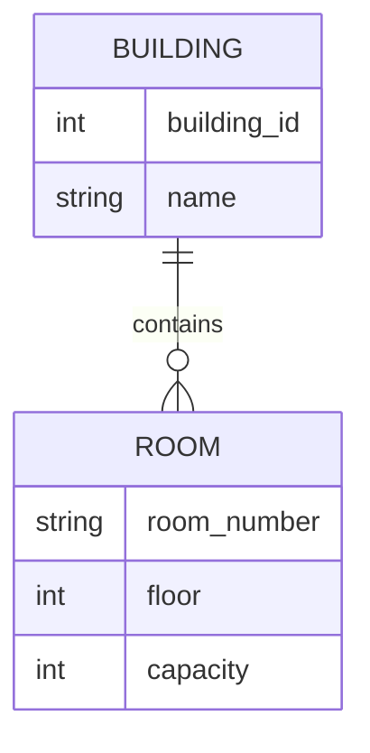

**🔑 Особливості:**
- **Слабка сутність** має повну участь
- **Кардинальність:** завжди 1:M від власницької до слабкої
- **Ключ слабкої сутності:** частковий ключ + ключ власницької сутності

**Приклад:** КІМНАТА ідентифікується як:
`(building_id, room_number)` = `(B001, "201A")`

---

## **4. Розширена ER-модель**

## Узагальнення та спеціалізація

### **⬆️ Узагальнення (Generalization):**

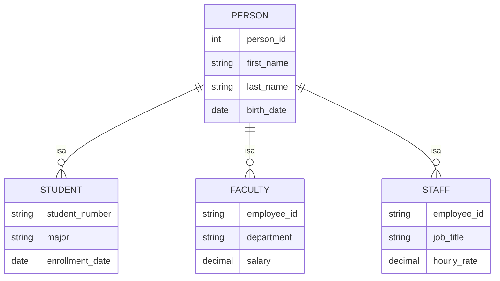

**🎯 Переваги спеціалізації:**
- Уникнення дублювання спільних атрибутів
- Чітке моделювання ієрархій
- Можливість специфічних атрибутів для підтипів

---

## Обмеження спеціалізації

### **🔀 Обмеження диз'юнктності (Disjointness):**

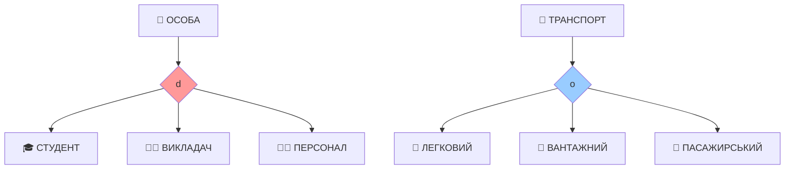

**🔒 Диз'юнктна спеціалізація (d):**
- Екземпляр може належати **тільки одному** підтипу
- Приклад: ОСОБА може бути АБО студентом, АБО викладачем

**🔓 Перехресна спеціалізація (o):**
- Екземпляр може належати **кільком підтипам** одночасно
- Приклад: ТРАНСПОРТ може бути одночасно легковим і пасажирським

### **📊 Обмеження повноти (Completeness):**

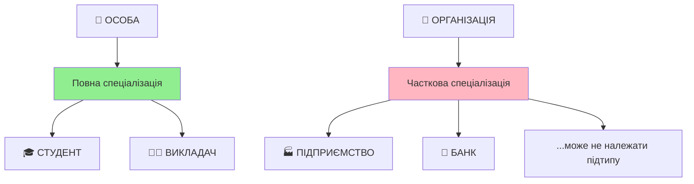

**✅ Повна спеціалізація:**
- **Кожен екземпляр** надтипу належить принаймні одному підтипу

**⭕ Часткова спеціалізація:**
- Екземпляри надтипу **можуть не належати** жодному підтипу

---

## Категорії (Union Types)

### **🔗 Коли використовувати категорії:**

Підтип може бути пов'язаний з **більш ніж одним надтипом**

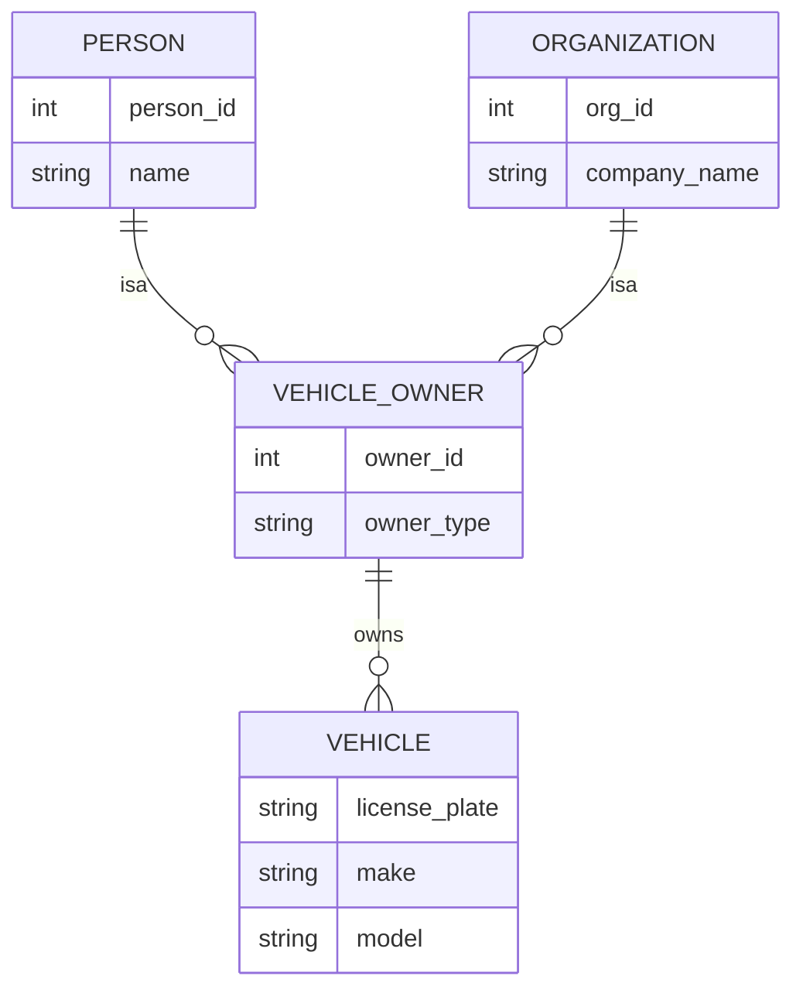

**🎯 Приклади категорій:**
- **ВЛАСНИК** = ОСОБА ∪ ОРГАНІЗАЦІЯ
- **КЛІЄНТ** = ФІЗИЧНА_ОСОБА ∪ ЮРИДИЧНА_ОСОБА

---

## Агрегація

### **📦 Концепція агрегації:**

**Зв'язок + його учасники = сутність вищого рівня**

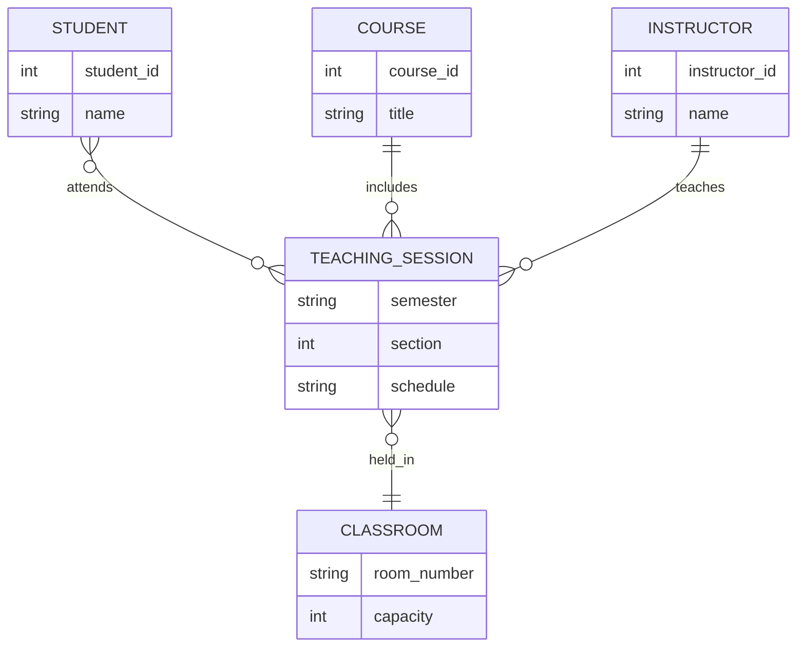

**✅ Переваги агрегації:**
- Моделювання складних зв'язків
- Додавання атрибутів до зв'язків
- Створення зв'язків вищого рівня

---

## **5. Альтернативні нотації**

## Порівняння основних нотацій

### **📊 Характеристики нотацій:**

| Нотація | Графічні елементи | Переваги | Недоліки |
|---------|-------------------|----------|----------|
| **Chen** | 📦🔶⚪ (прямокутники, ромби, овали) | Класична, детальна | Складна для великих схем |
| **Crow's Foot** | Символи на лініях | Інтуїтивна, компактна | Обмежені можливості |
| **UML** | Класи з атрибутами | Інтеграція з ОО-дизайном | Надлишкова для простих БД |
| **IDEF1X** | Строга типізація | Корпоративний стандарт | Складна для освоєння |

---

## Chen Notation

### **📐 Класична нотація Пітера Чена (1976):**

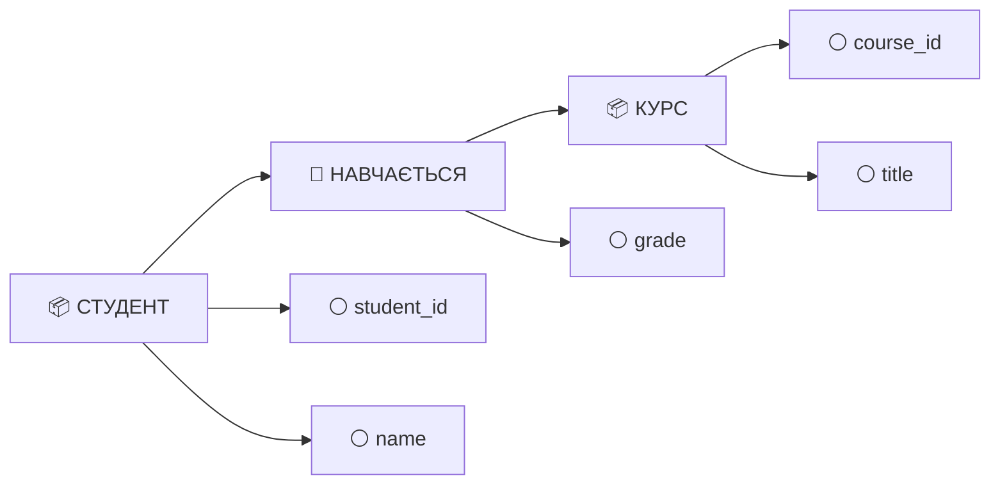

**🎯 Особливості:**
- **Прямокутники** для сутностей
- **Ромби** для зв'язків
- **Овали** для атрибутів
- **Подвійні лінії** для повної участі

---

## Crow's Foot Notation

### **🦶 Нотація "пташиних лапок":**

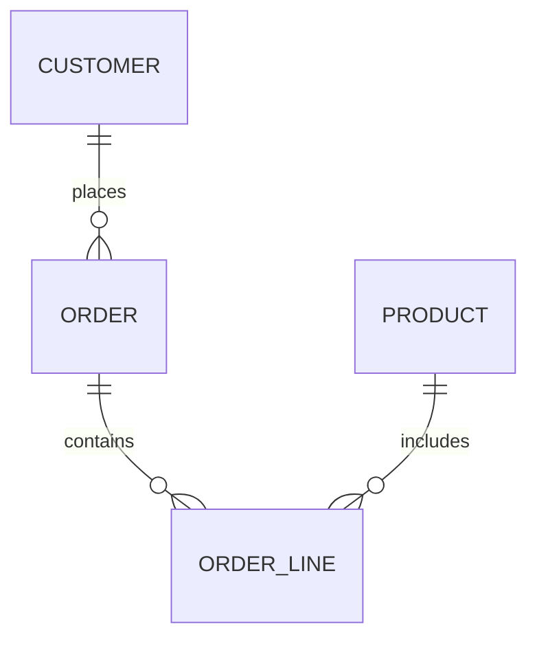

**🎯 Символи кардинальності:**
- **|** — один
- **o** — нуль (необов'язково)
- **{** — багато ("пташина лапка")
- **||** — один та обов'язково

**✅ Переваги:**
- Швидке розуміння зв'язків
- Широка підтримка в CASE-інструментах
- Компактність діаграм

---

## **6. Практичний приклад**

## Система управління бібліотекою

### **📋 Аналіз вимог:**

**Основні функції системи:**
- 📖 Каталогізація книг та матеріалів
- 👤 Реєстрація читачів
- 📤📥 Видача та повернення матеріалів
- 💰 Управління штрафами
- 🔖 Резервування популярних книг

### **🎯 Ключові бізнес-правила:**
- Читач може взяти максимум **5 книг** одночасно
- Штраф **2 грн/день** за прострочення
- Резервування діє **7 днів**

---

## Основні сутності системи

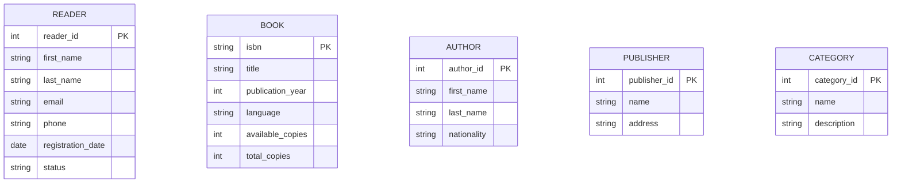

---

## Зв'язки та операції

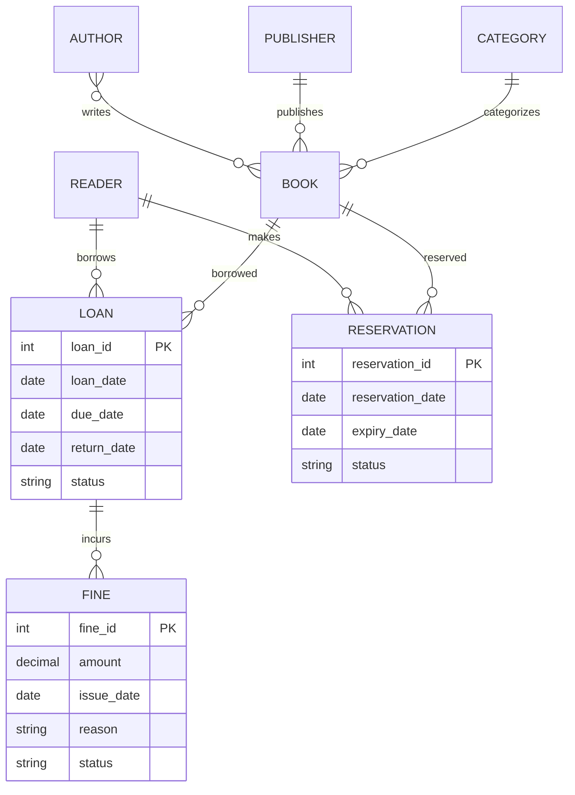

---

## Розширення моделі

### **📚 Спеціалізація матеріалів:**

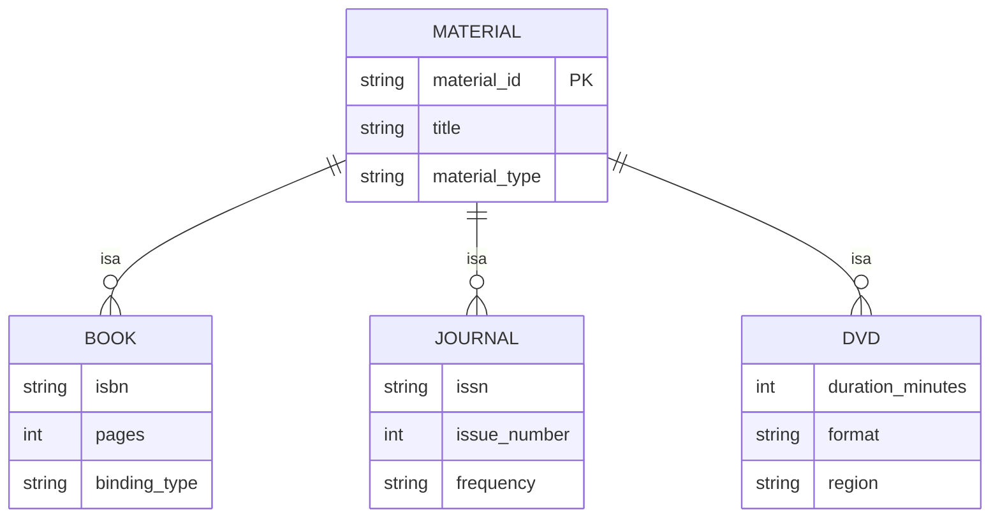

### **🏗️ Ієрархія категорій:**
```
📚 Комп'ютерні науки (1)
  ├── 💻 Програмування (11)
  │   ├── 🌐 Web-розробка (111)
  │   └── 📱 Мобільна розробка (112)
  └── 🗄️ Бази даних (12)
      ├── 📊 Реляційні СУБД (121)
      └── 📄 NoSQL системи (122)
```

---

## Перехід до логічної моделі

### **🔄 Трансформація сутностей → таблиці:**

```sql
-- Сутність ЧИТАЧ → таблиця readers
CREATE TABLE readers (
    reader_id SERIAL PRIMARY KEY,
    first_name VARCHAR(50) NOT NULL,
    last_name VARCHAR(50) NOT NULL,
    email VARCHAR(100) UNIQUE NOT NULL,
    phone VARCHAR(20),
    registration_date DATE DEFAULT CURRENT_DATE,
    status VARCHAR(20) DEFAULT 'active'
);

-- Зв'язок M:N АВТОР-КНИГА → окрема таблиця
CREATE TABLE book_authors (
    book_isbn VARCHAR(13) REFERENCES books(isbn),
    author_id INT REFERENCES authors(author_id),
    author_role VARCHAR(20) DEFAULT 'author',
    PRIMARY KEY (book_isbn, author_id)
);
```

### **🔗 Реалізація зв'язків:**
- **1:1** → зовнішній ключ в одній з таблиць
- **1:M** → зовнішній ключ в таблиці "багато"
- **M:N** → окрема таблиця зв'язку

---

## **Інструменти моделювання**

## Сучасні CASE-інструменти

### **💼 Професійні рішення:**
- **ERwin Data Modeler** — корпоративне моделювання
- **PowerDesigner** — комплексне рішення SAP
- **ER/Studio** — інструмент від IDERA

### **🆓 Безкоштовні альтернативи:**
- **MySQL Workbench** — вбудоване моделювання
- **pgModeler** — спеціально для PostgreSQL
- **draw.io** — веб-інструмент з ER-підтримкою

### **☁️ Хмарні платформи:**
- **Lucidchart** — професійна хмарна платформа
- **Creately** — інтерактивне моделювання
- **Cacoo** — колаборативні діаграми

---

## **Типові помилки та поради**

## Найчастіші помилки

### **❌ Проблеми з сутностями:**
- **Атрибути як сутності** — моделювання простих властивостей як окремих сутностей
- **Надлишкові сутності** — створення зайвих сутностей
- **Пропущені сутності** — ігнорування важливих об'єктів

### **❌ Помилки в атрибутах:**
- **Неатомарні атрибути** — включення складених значень
- **Пропущені багатозначні** — неврахування множинних значень
- **Неправильні ключі** — некоректна ідентифікація ключових атрибутів

### **❌ Проблеми зв'язків:**
- **Неправильна кардинальність** — некоректне визначення зв'язків
- **Пропущені зв'язки** — ігнорування важливих відносин
- **Надлишкові зв'язки** — створення зайвих зв'язків

---

## Поради для успішного моделювання

### **✅ Рекомендації:**

**🔍 Етап аналізу:**
- Проводьте детальні інтерв'ю з користувачами
- Вивчайте існуючі документи та процеси
- Ідентифікуйте всі бізнес-правила

**📐 Етап моделювання:**
- Починайте з простої моделі, поступово ускладнюючи
- Використовуйте зрозумілі назви сутностей та атрибутів
- Регулярно валідуйте модель з експертами

**🔄 Етап валідації:**
- Перевіряйте модель на реальних прикладах
- Тестуйте всі можливі сценарії використання
- Документуйте всі припущення та обмеження

---

## **Висновки**

## Ключові принципи

### **🎯 Основи успішного концептуального моделювання:**

1. **📋 Ретельний аналіз** предметної області
2. **🔄 Ітеративний підхід** з постійною валідацією
3. **⚖️ Баланс** між деталізацією та зрозумілістю
4. **🔮 Врахування майбутніх** потреб системи
5. **👥 Залучення всіх** зацікавлених сторін

### **✅ Результати правильного моделювання:**
- **Чітке розуміння** предметної області всіма учасниками
- **Надійна основа** для логічного та фізичного проектування
- **Документована база** бізнес-правил та обмежень
- **Можливість валідації** та верифікації вимог

### **🚀 Концептуальна модель — це інвестиція в успіх проекту!**

Правильно виконане концептуальне моделювання забезпечує міцний фундамент для всієї системи управління базами даних.
