# Теорія нормалізації реляційних схем

## План лекції

1. Аномалії в ненормалізованих відношеннях
2. Функціональні залежності
3. Правила виведення Армстронга
4. Замикання множин атрибутів
5. Нормальні форми (1НФ - 5НФ)
6. Алгоритми декомпозиції


## **🎯 Мета лекції**

Засвоїти теоретичні основи нормалізації реляційних схем та набути практичних навичок проектування якісних баз даних без аномалій.

### **Чому це важливо?**

- 📊 **Цілісність даних** — уникнення неконсистентності
- 💾 **Ефективність зберігання** — мінімізація надмірності
- 🔧 **Простота підтримки** — легше оновлювати та модифікувати
- 🚀 **Масштабованість** — краща продуктивність на великих обсягах


## **🚨 Аномалії: Чому нормалізація потрібна?**

### **Приклад ненормалізованої таблиці:**

```
СТУДЕНТ_КУРС_ВИКЛАДАЧ
+----------+-------------+----------+--------+---------------+-------------+-------+
| student  | student     | address  | course | course_name   | instructor  | grade |
|    _id   |   _name     |          |  _id   |               |   _name     |       |
+----------+-------------+----------+--------+---------------+-------------+-------+
| 1001     | Іван Петров | Лесі 5   | CS101  | Програмування | Іваненко А. | 5     |
| 1001     | Іван Петров | Лесі 5   | CS102  | Бази даних    | Петренко Б. | 4     |
| 1002     | Марія К.    | Київська | CS101  | Програмування | Іваненко А. | 5     |
+----------+-------------+----------+--------+---------------+-------------+-------+
```

**🔍 Що не так з цією таблицею?**


## **⚠️ Типи аномалій**

### **1. 🆕 Аномалії вставки**

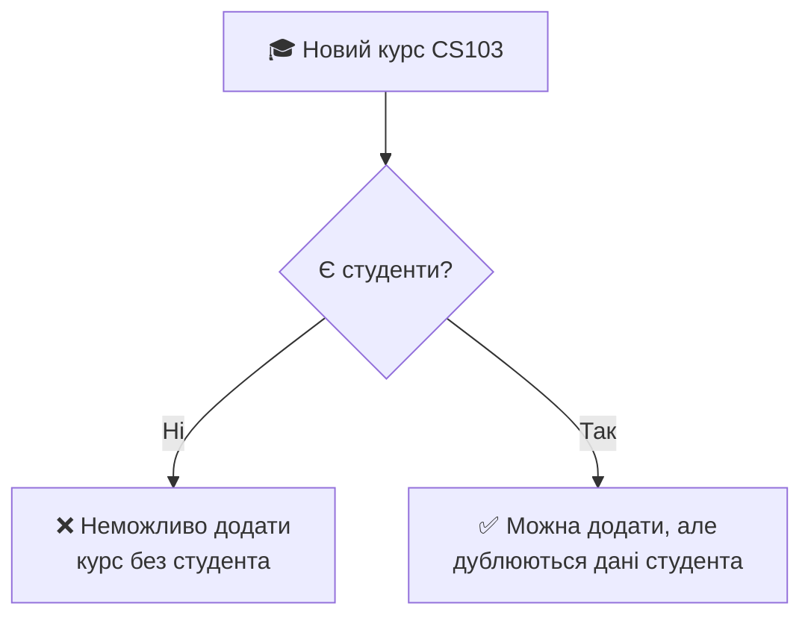

**Проблема:** Неможливо додати курс без студентів або дублювання інформації про студентів.

### **2. 🔄 Аномалії оновлення**

**Сценарій:** Іван Петров змінює адресу з "Лесі 5" на "Шевченка 10"

**❌ Неправильно:**
```
| 1001 | Іван Петров | Шевченка 10 | CS101 | ... |  ← Оновлено
| 1001 | Іван Петров | Лесі 5      | CS102 | ... |  ← Забули!
```

**Результат:** Студент має дві адреси! 🏠🏠


## **3. 🗑️ Аномалії видалення**

**Сценарій:** Видаляємо єдиного студента з курсу CS102


**Втрачаємо:**
- Назву курсу CS102
- Інформацію про викладача
- Зв'язок викладач-курс


## **💰 Вартість аномалій**

### **Кількісний приклад:**

**📊 Університет:** 1000 студентів, 50 курсів, 5 курсів/студент

```
Традиційна таблиця:     Нормалізована схема:
📝 5000 записів         📝 1000 + 50 + 5000 = 6050 записів
💾 Надмірність ×5        💾 Мінімальна надмірність
🔄 5000 оновлень         🔄 1 оновлення
```

**⚡ Наслідки:**
- **Зберігання:** +400% надмірних даних
- **Оновлення:** У 5 разів більше операцій
- **Ризики:** Висока ймовірність помилок


## **🔗 Функціональні залежності**

### **📋 Визначення**

**Функціональна залежність X → Y** означає:

> Якщо два рядки мають **однакові значення X**, то вони **обов'язково** мають **однакові значення Y**

### **💡 Приклади з університету:**

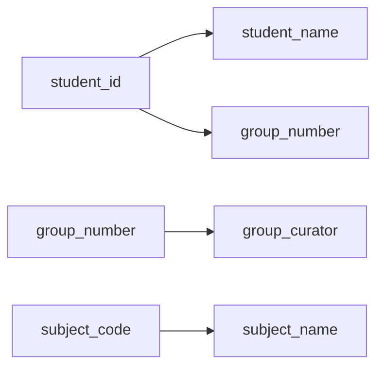

- **student_id → student_name** (код студента визначає ім'я)
- **group_number → group_curator** (група визначає куратора)
- **subject_code → subject_name** (код предмета визначає назву)


## **🎯 Типи функціональних залежностей**

### **🔄 Тривіальні залежності**
`{student_id, student_name} → student_id`

**Завжди виконуються** — права частина є підмножиною лівої

### **⚡ Нетривіальні залежності**
`student_id → student_name`

**Корисні для проектування** — права частина не є підмножиною лівої

### **🎯 Повністю нетривіальні**
`student_id → group_number`

**Найцікавіші** — права та ліва частини не перетинаються


## **📐 Правила виведення Армстронга**

### **🏛️ Основні аксіоми (1974):**

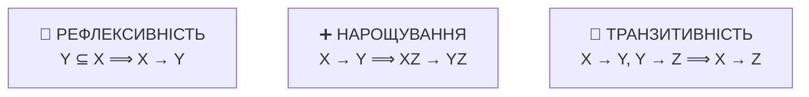

### **⚙️ Додаткові правила:**

- **🔗 Об'єднання:** X → Y, X → Z ⟹ X → YZ
- **✂️ Розкладання:** X → YZ ⟹ X → Y, X → Z
- **🔄 Псевдотранзитивність:** X → Y, YZ → W ⟹ XZ → W


## **🧮 Приклад застосування правил**

### **Дано:**
- F₁: `student_id → group_number`
- F₂: `group_number → group_curator`
- F₃: `student_id → student_name`

### **Виводимо:**

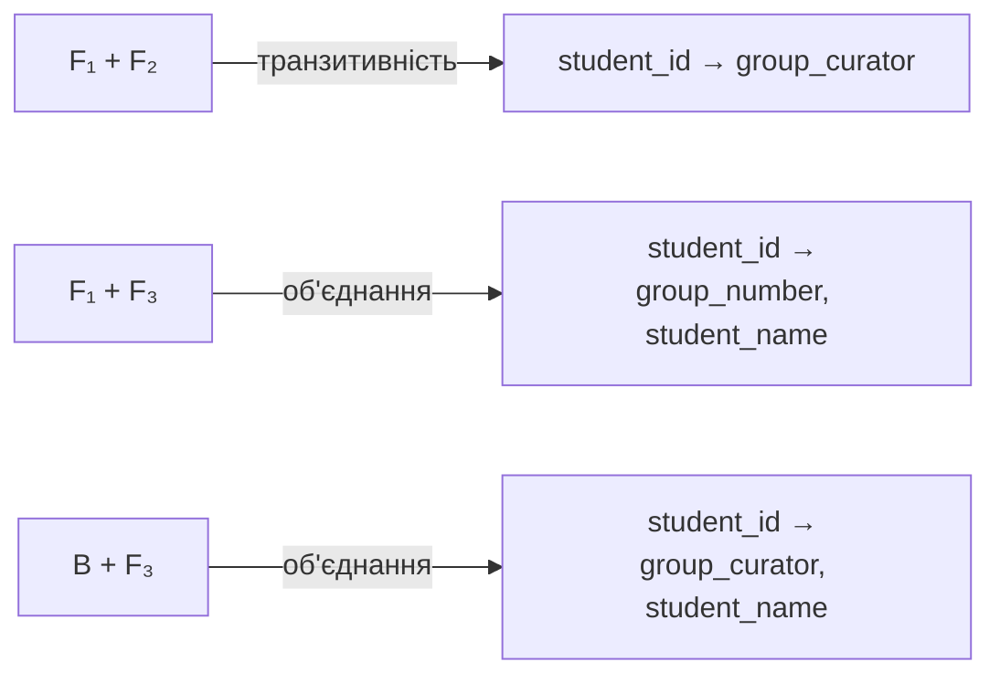

**Результат:** З 3 залежностей отримали 6!


## **🔄 Замикання множини атрибутів**

### **📋 Визначення**
**X⁺** = множина всіх атрибутів, які функціонально залежать від X

### **⚙️ Алгоритм обчислення:**

```python
def closure(X, F):
    result = X
    while True:
        old_result = result
        for dependency in F:
            if dependency.left ⊆ result:
                result = result ∪ dependency.right
        if result == old_result:
            break
    return result
```


## **📋 Нормальні форми: Ієрархія**

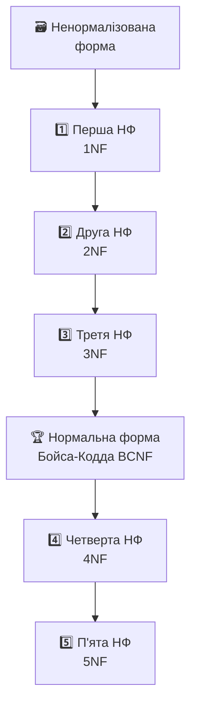

**🎯 Принцип:** Кожна наступна форма усуває додаткові аномалії


## **1️⃣ Перша нормальна форма (1НФ)**

### **📋 Правило:** Всі атрибути мають **атомарні** (неподільні) значення

### **❌ Порушення 1НФ:**

```
СТУДЕНТ_ПРЕДМЕТИ
+----------+-------------+------------------+
| student  | student     | subjects         |
|   _id    |   _name     |                  |
+----------+-------------+------------------+
| 1001     | Іван Петров | Математика, БД   |
| 1002     | Марія К.    | БД, Алгоритми    |
+----------+-------------+------------------+
```

### **✅ Приведення до 1НФ:**

```
СТУДЕНТ_ПРЕДМЕТ
+----------+-------------+------------+
| student  | student     | subject    |
|   _id    |   _name     |            |
+----------+-------------+------------+
| 1001     | Іван Петров | Математика |
| 1001     | Іван Петров | БД         |
| 1002     | Марія К.    | БД         |
| 1002     | Марія К.    | Алгоритми  |
+----------+-------------+------------+
```


## **2️⃣ Друга нормальна форма (2НФ)**

### **📋 Правила:**
1. Відношення в **1НФ**
2. Кожен неключовий атрибут **повністю** залежить від ключа

### **🎯 Проблема:** Часткові залежності

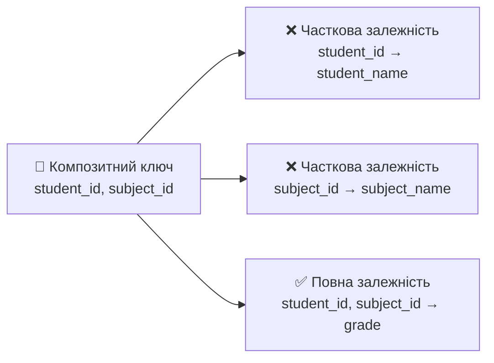


## **❌ Приклад порушення 2НФ**

```
СТУДЕНТ_ПРЕДМЕТ_ОЦІНКА
+----------+-------------+----------+-------------+-------+
| student  | student     | subject  | subject     | grade |
|   _id    |   _name     |   _id    |   _name     |       |
+----------+-------------+----------+-------------+-------+
| 1001     | Іван Петров | S001     | Математика  | 5     |
| 1001     | Іван Петров | S002     | БД          | 4     |
| 1002     | Марія К.    | S002     | БД          | 5     |
+----------+-------------+----------+-------------+-------+
```

**🚨 Проблеми:**
- `student_id → student_name` (часткова залежність)
- `subject_id → subject_name` (часткова залежність)


## **✅ Приведення до 2НФ**

### **Розбиваємо на 3 таблиці:**

```
СТУДЕНТИ                    ПРЕДМЕТИ
+----------+-------------+  +----------+-------------+
| student  | student     |  | subject  | subject     |
|   _id    |   _name     |  |   _id    |   _name     |
+----------+-------------+  +----------+-------------+
| 1001     | Іван Петров |  | S001     | Математика  |
| 1002     | Марія К.    |  | S002     | БД          |
+----------+-------------+  +----------+-------------+

ОЦІНКИ
+----------+----------+-------+
| student  | subject  | grade |
|   _id    |   _id    |       |
+----------+----------+-------+
| 1001     | S001     | 5     |
| 1001     | S002     | 4     |
| 1002     | S002     | 5     |
+----------+----------+-------+
```


## **3️⃣ Третя нормальна форма (3НФ)**

### **📋 Правила:**
1. Відношення в **2НФ**
2. Відсутні **транзитивні залежності** неключових атрибутів

### **🔗 Транзитивна залежність:**
`ключ → атрибут_A → атрибут_B`

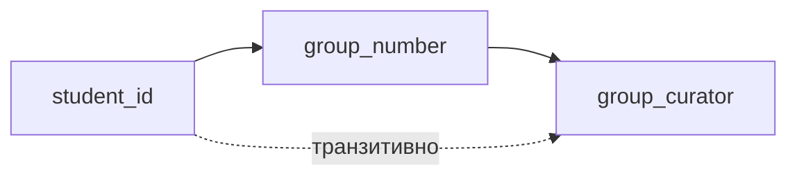


## **❌ Приклад порушення 3НФ**

```
СТУДЕНТИ_ГРУПИ
+----------+-------------+--------------+------------------+
| student  | student     | group        | group            |
|   _id    |   _name     |   _number    |   _curator       |
+----------+-------------+--------------+------------------+
| 1001     | Іван Петров | КН-21        | Петренко А.І.    |
| 1002     | Марія К.    | КН-21        | Петренко А.І.    |
| 1003     | Петро С.    | КН-22        | Іваненко Б.П.    |
+----------+-------------+--------------+------------------+
```

**🚨 Транзитивна залежність:**
`student_id → group_number → group_curator`


## **✅ Приведення до 3НФ**

```
СТУДЕНТИ                         ГРУПИ
+----------+-------------+------+ +---------+------------------+
| student  | student     |group | | group   | group            |
|   _id    |   _name     |_num  | |_number  |   _curator       |
+----------+-------------+------+ +---------+------------------+
| 1001     | Іван Петров | КН-21| | КН-21   | Петренко А.І.    |
| 1002     | Марія К.    | КН-21| | КН-22   | Іваненко Б.П.    |
| 1003     | Петро С.    | КН-22| +---------+------------------+
+----------+-------------+------+
```

**✅ Результат:**
- Кожен куратор зберігається один раз
- Зміна куратора = одне оновлення
- Немає аномалій оновлення


## **🏆 Нормальна форма Бойса-Кодда (НФБК)**

### **📋 Правило:**
Для **кожної** нетривіальної функціональної залежності X → Y атрибут X є **суперключем**

### **🎯 Більш строга** за 3НФ — усуває аномалії з перекриваючимися ключами

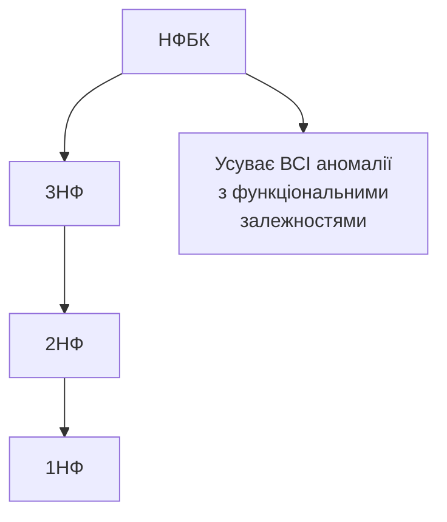


## **❌ Приклад порушення НФБК**

```
КУРСИ_ВИКЛАДАЧІ
+----------+------------------+----------+
| course   | instructor       | room     |
|  _code   |    _name         | _number  |
+----------+------------------+----------+
| CS101    | Петров А.І.      | 301      |
| CS101    | Іваненко Б.П.    | 302      |
| CS102    | Петров А.І.      | 301      |
+----------+------------------+----------+
```

**Умови:**
- Ключ: `{course_code, instructor_name}`
- Залежність: `instructor_name → room_number`
- **Проблема:** `instructor_name` не є суперключем!


## **✅ Приведення до НФБК**

```
КУРСИ_ВИКЛАДАЧІ               ВИКЛАДАЧІ_АУДИТОРІЇ
+----------+------------------+ +------------------+----------+
| course   | instructor       | | instructor       | room     |
|  _code   |    _name         | |    _name         | _number  |
+----------+------------------+ +------------------+----------+
| CS101    | Петров А.І.      | | Петров А.І.      | 301      |
| CS101    | Іваненко Б.П.    | | Іваненко Б.П.    | 302      |
| CS102    | Петров А.І.      | +------------------+----------+
+----------+------------------+
```

**✅ Переваги:**
- Аудиторія викладача зберігається один раз
- Зміна аудиторії = одне оновлення
- Повна НФБК нормалізація


## **4️⃣ Четверта нормальна форма (4НФ)**

### **📋 Проблема:** Багатозначні залежності

**X ↠ Y** — множина Y-значень залежить тільки від X (незалежно від інших атрибутів)

### **❌ Приклад:**

```
СТУДЕНТ_ХОБІ_МОВИ
+----------+----------+-----------+
| student  | hobby    | language  |
+----------+----------+-----------+
| 1001     | Футбол   | Англійська|
| 1001     | Футбол   | Німецька  |
| 1001     | Читання  | Англійська|
| 1001     | Читання  | Німецька  |
+----------+----------+-----------+
```

**🚨 Багатозначні залежності:**
- `student_id ↠ hobby`
- `student_id ↠ language`


## **✅ Приведення до 4НФ**

```
СТУДЕНТ_ХОБІ              СТУДЕНТ_МОВИ
+----------+----------+   +----------+-----------+
| student  | hobby    |   | student  | language  |
+----------+----------+   +----------+-----------+
| 1001     | Футбол   |   | 1001     | Англійська|
| 1001     | Читання  |   | 1001     | Німецька  |
+----------+----------+   +----------+-----------+
```

**✅ Результат:**
- Хобі та мови незалежні
- Немає штучних комбінацій
- Простіше оновлювати


## **5️⃣ П'ята нормальна форма (5НФ)**

### **📋 Проблема:** Залежності з'єднання

Відношення має **залежність з'єднання**, якщо воно може бути точно відтворене з'єднанням своїх проекцій.

### **🎯 П'ята НФ:**
- Відношення в **4НФ**
- Не може бути розкладене **без втрат**

### **💡 На практиці:**
5НФ рідко використовується — більшість реальних задач вирішується на рівні 3НФ/НФБК.


## **⚙️ Алгоритми декомпозиції**

### **🎯 Основні принципи:**

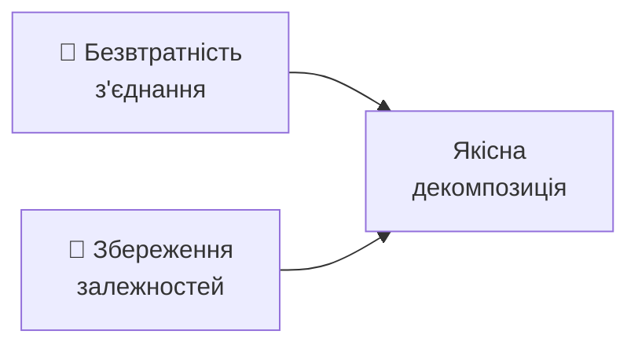

### **⚖️ Компроміс:**
- **3НФ:** Гарантує збереження залежностей
- **НФБК:** Гарантує безвтратність, але може втратити залежності


## **🔧 Алгоритм декомпозиції до 3НФ**

```python
def decompose_to_3NF(R, F):
    # 1. Знайти мінімальне покриття
    Fc = minimal_cover(F)

    # 2. Згрупувати за лівими частинами
    groups = group_by_left_side(Fc)

    # 3. Створити відношення для кожної групи
    result = []
    for group in groups:
        result.append(create_relation(group))

    # 4. Додати ключ якщо потрібно
    if not any(contains_key(rel, R) for rel in result):
        result.append(key_relation(R))

    return result
```


## **🔧 Алгоритм декомпозиції до НФБК**

```python
def decompose_to_BCNF(R, F):
    result = [R]

    while exists_bcnf_violation(result, F):
        # Знайти відношення що порушує НФБК
        S = find_violating_relation(result, F)

        # Знайти порушуючу залежність X → Y
        violation = find_violation(S, F)

        # Розкласти на дві частини
        S1 = violation.left + violation.right
        S2 = S - violation.right + violation.left

        # Замінити S на S1 та S2
        result.remove(S)
        result.extend([S1, S2])

    return result
```


## **📊 Приклад декомпозиції**

### **Дано:**
Відношення: `STUDENT_COURSE_INSTRUCTOR(S, C, I, G)`

Залежності:
- F₁: `{S, C} → G`
- F₂: `{S, C} → I`
- F₃: `I → C` ← **Порушує НФБК**

### **Декомпозиція:**

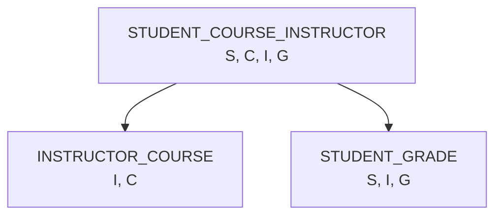

**✅ Результат:** Обидва відношення в НФБК!


## **✅ Перевірка якості декомпозиції**

### **🔄 Безвтратність з'єднання:**

Алгоритм **таблиці чейз (chase)**:

```
1. Створити таблицю з |D| рядками та |R| стовпцями
2. Заповнити a-символами для спільних атрибутів
3. Застосувати правила чейз для кожної залежності
4. Якщо з'явився рядок з усіма a-символами → безвтратна
```

### **🔗 Збереження залежностей:**

```python
def check_dependency_preservation(R, F, decomposition):
    for dependency in F:
        if not can_derive(dependency, decomposition):
            return False
    return True
```


## **🎯 Практичні рекомендації**

### **🏁 Коли зупинятися?**

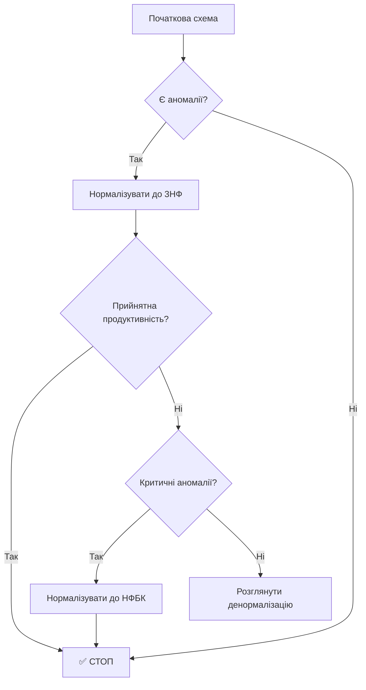

### **⚖️ Компроміси:**
- **Більше нормалізації** = менше аномалій, більше з'єднань
- **Менше нормалізації** = краща продуктивність, ризик аномалій


## **📈 Денормалізація: Коли і навіщо?**

### **🎯 Обґрунтовані випадки:**

- **📊 Звітні системи** — часті агрегації
- **🚀 Високе навантаження** на читання
- **📱 Кешування** часто запитуваних даних
- **🔍 Пошукові індекси**

### **⚠️ Умови денормалізації:**


## **🎯 Висновки**

### **🔑 Ключові принципи нормалізації:**

1. **🎯 Мета:** Усунення аномалій та мінімізація надмірності
2. **🔗 Основа:** Функціональні залежності та їх правила
3. **📐 Інструмент:** Поступова декомпозиція відношень
4. **⚖️ Баланс:** Між теоретичною досконалістю та практичністю

### **🚀 Практичний підхід:**

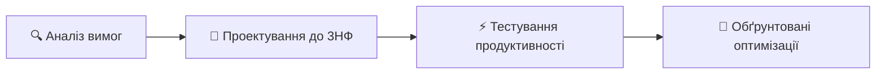
