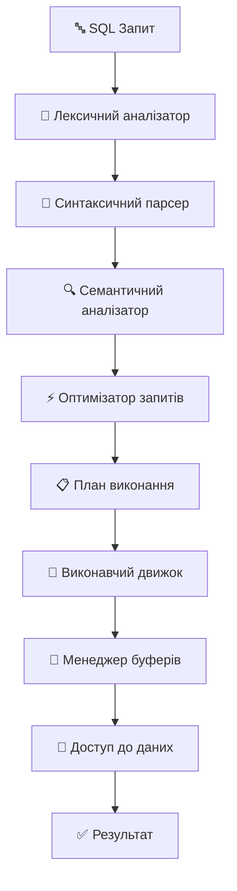
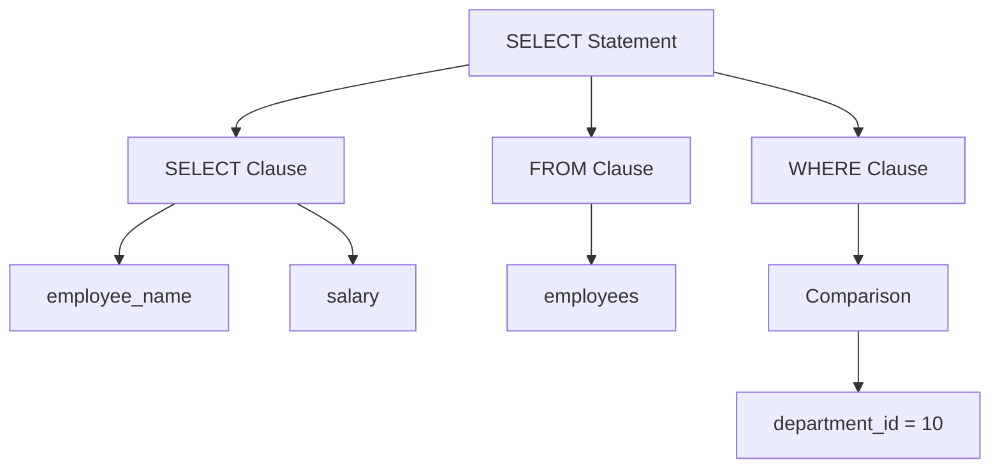
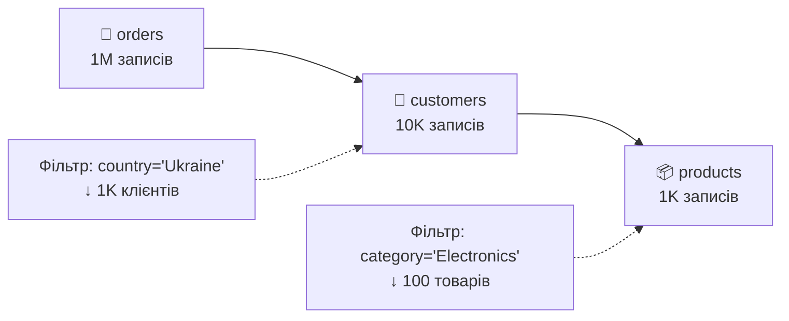
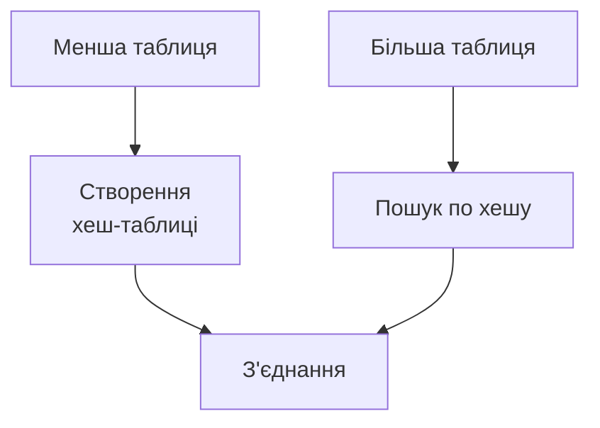
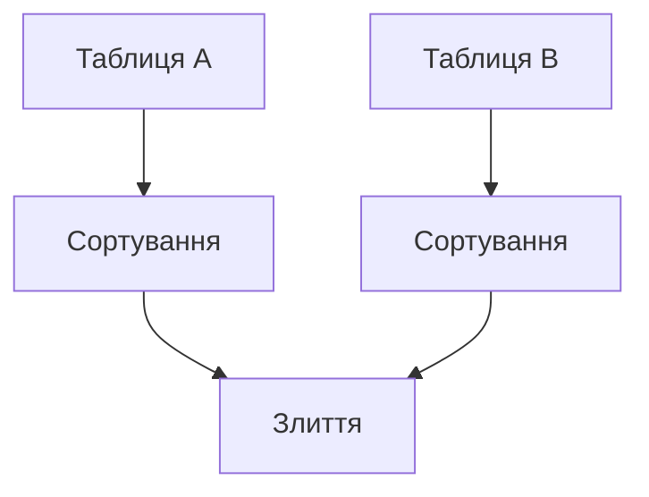
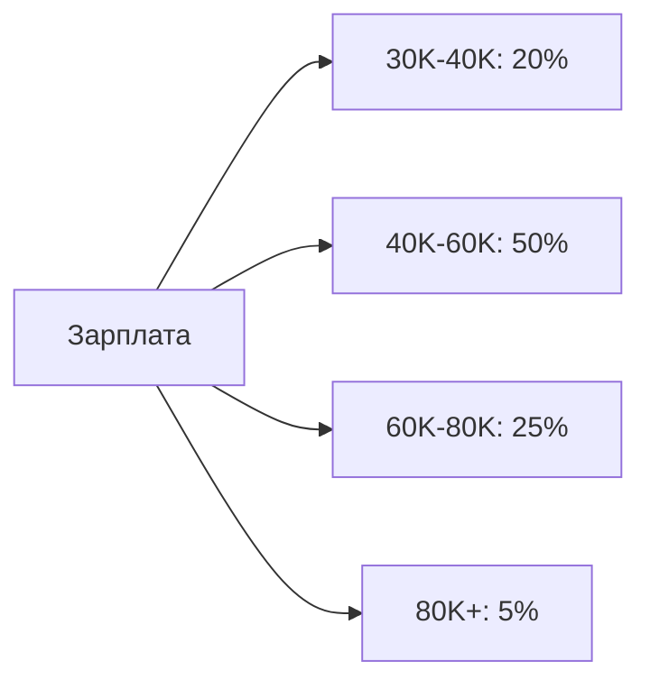
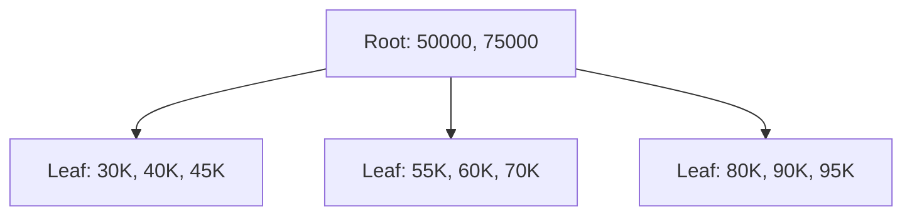
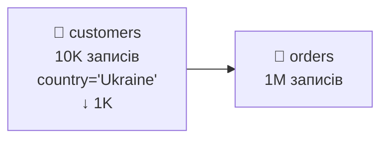

# Обробка та оптимізація запитів

## План лекції

1. Архітектура обробки запитів
2. Типи оптимізації запитів
3. Статистика та вартісна модель
4. Індекси та їх роль в оптимізації
5. План виконання запитів
6. Практичні методи оптимізації
7. Моніторинг та діагностика

## **🎯 Ключові поняття:**

**Оптимізатор запитів** — компонент СУБД, що визначає найефективніший спосіб виконання SQL-запиту шляхом аналізу різних планів виконання.

**План виконання** — детальний алгоритм виконання запиту, що включає послідовність операцій, методи доступу до даних та алгоритми з'єднань.

**Вартісна модель** — система оцінки ефективності різних варіантів виконання запиту на основі очікуваних ресурсних витрат.

**Селективність** — відсоток записів у таблиці, що відповідають певній умові WHERE.

## **1. Архітектура обробки запитів**

## Загальна схема обробки



## Етапи обробки запитів

### 📝 **1. Лексичний аналіз**

**Розбиття SQL на токени:**

```sql
SELECT employee_name, salary
FROM employees
WHERE department_id = 10;
```

**Токени:**
- `SELECT` ← ключове слово
- `employee_name` ← ідентифікатор
- `,` ← розділювач
- `salary` ← ідентифікатор
- `FROM` ← ключове слово
- `employees` ← ідентифікатор
- `WHERE` ← ключове слово
- `department_id` ← ідентифікатор
- `=` ← оператор
- `10` ← числовий літерал

### 🌳 **2. Синтаксичний аналіз**



### 🔍 **3. Семантичний аналіз**

**Перевірки:**
- ✅ **Існування таблиць** та стовпців
- ✅ **Відповідність типів** даних
- ✅ **Права доступу** користувача
- ✅ **Коректність агрегацій** та групування

### ⚡ **4. Оптимізація**

**Завдання оптимізатора:**
- 🔍 Аналіз різних планів виконання
- 📊 Оцінка вартості кожного плану
- 🎯 Вибір найефективнішого варіанту

## **2. Типи оптимізації**

## Логічна оптимізація

### 🔽 **Проштовхування селекції**

**До оптимізації:**
```sql
SELECT e.name, d.department_name
FROM employees e
JOIN departments d ON e.department_id = d.department_id
WHERE e.salary > 50000;
```

**Після оптимізації:**
```sql
SELECT e.name, d.department_name
FROM (SELECT * FROM employees WHERE salary > 50000) e
JOIN departments d ON e.department_id = d.department_id;
```

### 🔄 **Перестановка з'єднань**



**Результат:** Спочатку фільтруємо маленькі таблиці!

## Фізична оптимізація

### 📊 **Методи доступу**

| Метод | Коли використовувати | Приклад |
|-------|---------------------|---------|
| 🔍 **Table Scan** | Невеликі таблиці або більшість записів | `SELECT * FROM small_table` |
| 📇 **Index Scan** | Селективні умови | `WHERE employee_id = 12345` |
| ⚡ **Index Seek** | Точний пошук по ключу | `WHERE id = 100` |

### 🔗 **Алгоритми з'єднання**

**1. Nested Loop Join**

**Краще для:** невеликих таблиць

**2. Hash Join**

**Краще для:** великих таблиць з equi-joins

**3. Sort-Merge Join**

**Краще для:** вже відсортованих даних

## **3. Статистика та вартісна модель**

## Статистична інформація

### 📊 **Типи статистики**

**1. Кардинальність таблиць**
```sql
-- PostgreSQL
SELECT schemaname, tablename,
       n_tup_ins - n_tup_del as row_count
FROM pg_stat_user_tables;
```

**2. Розподіл значень (гістограми)**


**3. Селективність**
```sql
-- Висока селективність (👍 для індексу)
SELECT * FROM employees WHERE employee_id = 12345;  -- 0.001%

-- Низька селективність (👎 для індексу)
SELECT * FROM employees WHERE status = 'ACTIVE';    -- 95%
```

## Вартісна модель

### 💰 **Компоненти вартості**

**1. I/O вартість (найдорожча)**
```
I/O_cost = pages_to_read × random_page_cost +
           sequential_pages × seq_page_cost
```

**2. CPU вартість**
```
CPU_cost = rows_processed × cpu_tuple_cost +
           comparisons × cpu_operator_cost
```

**3. Мережева вартість** (для розподілених систем)

### 📈 **Приклад оцінки**

```sql
SELECT * FROM employees
WHERE department_id = 10 AND salary > 50000;
```

| Варіант | Вартість | Опис |
|---------|----------|------|
| 🔍 Table Scan | 1000 | Читання всієї таблиці |
| 📇 Index on dept_id | 100 | Індекс + фільтрація |
| ⚡ Composite Index | 10 | Оптимальний варіант |

## **4. Індекси та оптимізація**

## Типи індексів

### 🌳 **B-tree індекси**



**✅ Ефективні для:**
- Точні пошуки: `salary = 75000`
- Діапазони: `salary BETWEEN 50000 AND 100000`
- Сортування: `ORDER BY salary`

### # **Hash індекси**

```sql
-- PostgreSQL
CREATE INDEX idx_employee_id_hash
ON employees USING HASH(employee_id);

-- Ефективно тільки для =
SELECT * FROM employees WHERE employee_id = 12345;
```

## Стратегії індексування

### 🎯 **Правила створення індексів**

**1. Індексувати WHERE умови**
```sql
-- Якщо часто виконується
SELECT * FROM orders WHERE customer_id = 123;

-- Створити індекс
CREATE INDEX idx_orders_customer_id ON orders(customer_id);
```

**2. Індексувати JOIN стовпці**
```sql
-- Для ефективного з'єднання
SELECT * FROM orders o
JOIN customers c ON o.customer_id = c.customer_id;

-- Індекси на обох сторонах JOIN
CREATE INDEX idx_orders_customer_id ON orders(customer_id);
```

**3. Композитні індекси**
```sql
-- Правильний порядок стовпців
CREATE INDEX idx_dept_salary ON employees(department_id, salary);

-- ✅ Використовується повністю
WHERE department_id = 10 AND salary > 50000

-- ✅ Використовується частково
WHERE department_id = 10

-- ❌ НЕ використовується
WHERE salary > 50000
```

### ⚖️ **Баланс індексів**

**✅ Переваги:**
- ⚡ Швидкий пошук даних
- 🚀 Ефективні JOIN операції
- 📈 Швидке сортування

**❌ Недоліки:**
- 💾 Додаткове місце на диску
- 🐌 Уповільнення INSERT/UPDATE/DELETE
- 🔧 Накладні витрати на підтримку

## **5. План виконання запитів**

## Читання планів виконання

### 📋 **PostgreSQL EXPLAIN**

```sql
EXPLAIN SELECT e.name, d.department_name
FROM employees e
JOIN departments d ON e.department_id = d.department_id
WHERE e.salary > 50000;
```

### 📊 **Приклад плану**

```
Nested Loop  (cost=0.29..8.32 rows=1 width=64)
  ->  Seq Scan on employees e  (cost=0.00..4.00 rows=1 width=36)
        Filter: (salary > 50000)
  ->  Index Scan using departments_pkey on departments d
        (cost=0.29..4.31 rows=1 width=32)
        Index Cond: (department_id = e.department_id)
```

### 🔍 **Інтерпретація**

**Компоненти плану:**

| Елемент | Значення | Пояснення |
|---------|----------|-----------|
| **cost=0.29..8.32** | Вартість | Початкова..загальна |
| **rows=1** | Рядки | Очікувана кількість |
| **width=64** | Ширина | Розмір рядка в байтах |

**Типи операцій:**
- 🔍 **Seq Scan** — послідовне сканування
- 📇 **Index Scan** — сканування індексу
- 🔄 **Nested Loop** — вкладений цикл
- # **Hash Join** — хеш з'єднання

## Аналіз фактичної продуктивності

```sql
EXPLAIN (ANALYZE, BUFFERS)
SELECT e.name, d.department_name
FROM employees e
JOIN departments d ON e.department_id = d.department_id
WHERE e.salary > 50000;
```

**Розширений вивід:**
```
Nested Loop (cost=0.29..8.32 rows=1 width=64)
           (actual time=0.045..0.048 rows=1 loops=1)
  Buffers: shared hit=4
  ->  Seq Scan on employees e (actual time=0.023..0.025 rows=1 loops=1)
        Filter: (salary > 50000)
        Rows Removed by Filter: 99
        Buffers: shared hit=1
Planning Time: 0.123 ms
Execution Time: 0.071 ms
```

**🎯 Ключові метрики:**
- **actual time** — фактичний час виконання
- **Buffers: shared hit** — кеш-попадання
- **Rows Removed by Filter** — відфільтровані рядки

## **6. Практичні методи оптимізації**

## Оптимізація SELECT

### ❌ **Уникати SELECT * **

```sql
-- Неефективно
SELECT * FROM employees WHERE department_id = 10;

-- ✅ Ефективно
SELECT employee_id, name, salary
FROM employees WHERE department_id = 10;
```

### 🔍 **EXISTS vs IN**

```sql
-- ❌ Менш ефективно
SELECT * FROM customers
WHERE customer_id IN (
    SELECT customer_id FROM orders
    WHERE order_date > '2023-01-01'
);

-- ✅ Більш ефективно
SELECT * FROM customers c
WHERE EXISTS (
    SELECT 1 FROM orders o
    WHERE o.customer_id = c.customer_id
    AND o.order_date > '2023-01-01'
);
```

## Оптимізація JOIN

### 📊 **Правильний порядок таблиць**



**Принцип:** Спочатку фільтруємо меншу таблицю!

### 🔗 **Типи з'єднань**

```sql
-- ✅ INNER JOIN для обов'язкових зв'язків
SELECT e.name, d.department_name
FROM employees e
INNER JOIN departments d ON e.department_id = d.department_id;

-- ✅ LEFT JOIN коли потрібні всі записи зліва
SELECT e.name, COALESCE(d.department_name, 'No Department') as dept
FROM employees e
LEFT JOIN departments d ON e.department_id = d.department_id;
```

## Оптимізація підзапитів

### 🔄 **Перетворення корельованих підзапитів**

```sql
-- ❌ Корельований підзапит (повільно)
SELECT employee_name
FROM employees e1
WHERE salary = (
    SELECT MAX(salary) FROM employees e2
    WHERE e2.department_id = e1.department_id
);

-- ✅ Window function (швидше)
SELECT employee_name
FROM (
    SELECT employee_name, salary,
           MAX(salary) OVER (PARTITION BY department_id) as max_salary
    FROM employees
) t
WHERE salary = max_salary;
```

### 📝 **Common Table Expressions**

```sql
-- ✅ CTE для читабельності та переиспользования
WITH department_stats AS (
    SELECT department_id,
           AVG(salary) as avg_salary,
           COUNT(*) as employee_count
    FROM employees
    GROUP BY department_id
),
high_paying_depts AS (
    SELECT department_id
    FROM department_stats
    WHERE avg_salary > 60000 AND employee_count > 5
)
SELECT e.name, e.salary, d.department_name
FROM employees e
JOIN departments d ON e.department_id = d.department_id
JOIN high_paying_depts hpd ON e.department_id = hpd.department_id;
```

## **7. Моніторинг та діагностика**

## Інструменти моніторингу

### 📊 **Системні представлення PostgreSQL**

```sql
-- 🐌 Найповільніші запити
SELECT query, mean_time, calls, total_time
FROM pg_stat_statements
ORDER BY mean_time DESC LIMIT 10;

-- 📇 Статистика індексів
SELECT schemaname, tablename, indexname,
       idx_tup_read, idx_tup_fetch
FROM pg_stat_user_indexes
ORDER BY idx_tup_read DESC;

-- 🔄 Активні з'єднання
SELECT pid, usename, application_name,
       client_addr, state, query
FROM pg_stat_activity
WHERE state = 'active';
```

### 📝 **Логування повільних запитів**

```sql
-- Логувати запити довше 1 секунди
SET log_min_duration_statement = 1000;
```

## Типові проблеми

### 🚫 **1. Відсутність індексів**

**Симптоми:**
- 🐌 Повільні SELECT запити
- 🔥 Високе навантаження CPU
- 🔍 Sequential Scans у планах

**Рішення:**
```sql
-- Аналіз кандидатів для індексування
SELECT schemaname, tablename, attname, n_distinct
FROM pg_stats
WHERE n_distinct > 100
ORDER BY tablename, attname;
```

### 📊 **2. Застарілі статистики**

**Симптоми:**
- 🎯 Неоптимальні плани виконання
- 🔄 Неправильні алгоритми з'єднання

**Рішення:**
```sql
-- Оновлення статистики
ANALYZE employees;

-- Автоматичне оновлення
ALTER TABLE employees
SET (autovacuum_analyze_scale_factor = 0.05);
```

### 🔒 **3. Блокування та конкуренція**

**Симптоми:**
- ⏳ Довгі очікування транзакцій
- 📉 Зниження пропускної здатності

**Моніторинг:**
```sql
-- Перегляд блокувань
SELECT blocked_locks.pid AS blocked_pid,
       blocking_locks.pid AS blocking_pid,
       blocked_activity.query AS blocked_statement
FROM pg_catalog.pg_locks blocked_locks
JOIN pg_catalog.pg_stat_activity blocked_activity
  ON blocked_activity.pid = blocked_locks.pid
-- ... (детальний запит для аналізу блокувань)
```

## Сучасні підходи

### 🤖 **Автоматична оптимізація**

**Можливості:**
- 📇 **Адаптивні індекси** — автоматичне створення/видалення
- 🧠 **Machine Learning** — прогнозування вартості операцій
- 📊 **Автоналаштування** — оптимізація параметрів

### 📊 **Columnar Storage**

```sql
-- Для аналітичних навантажень
CREATE FOREIGN TABLE analytics_orders (
    order_id bigint,
    customer_id bigint,
    order_date date,
    amount decimal
) SERVER cstore_server
OPTIONS(compression 'pglz');
```

### 💾 **Матеріалізовані представлення**

```sql
-- Кешування складних обчислень
CREATE MATERIALIZED VIEW monthly_sales AS
SELECT DATE_TRUNC('month', order_date) as month,
       SUM(amount) as total_sales,
       COUNT(*) as order_count
FROM orders
GROUP BY DATE_TRUNC('month', order_date);

-- Періодичне оновлення
REFRESH MATERIALIZED VIEW monthly_sales;
```

## **Підсумок та рекомендації**

### 🎯 **Ключові принципи оптимізації**

1. **🔍 Розуміння архітектури** — знання роботи оптимізатора
2. **📇 Правильні індекси** — основний інструмент оптимізації
3. **📊 Аналіз планів** — регулярний моніторинг виконання
4. **📈 Знання даних** — розподіл, кардинальність, селективність
5. **📊 Постійний моніторинг** — відстеження продуктивності

### ✅ **Практичні рекомендації**

- 🎯 **Пишіть селективні запити** — уникайте SELECT *
- 📇 **Створюйте потрібні індекси** — але не зловживайте
- 📊 **Аналізуйте плани виконання** — використовуйте EXPLAIN
- 🔄 **Оновлюйте статистику** — для точних планів
- 📈 **Моніторьте продуктивність** — виявляйте проблеми рано
