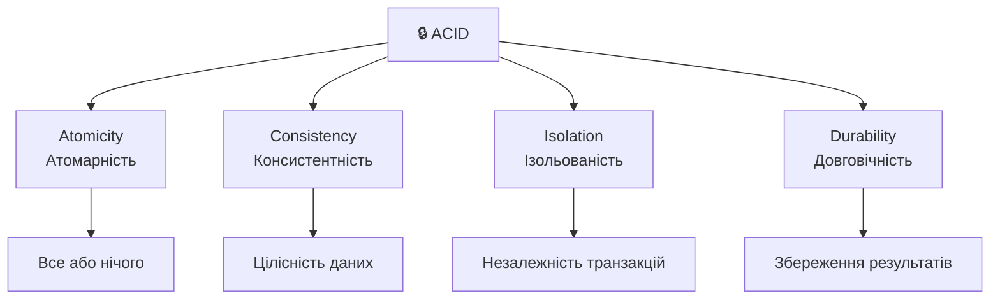
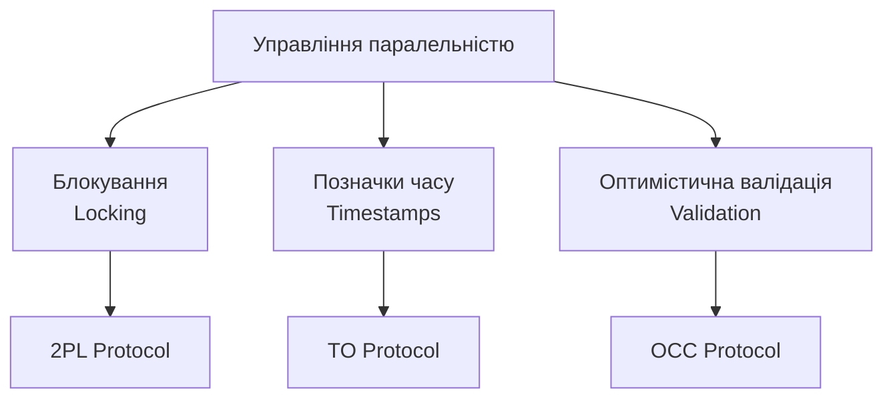
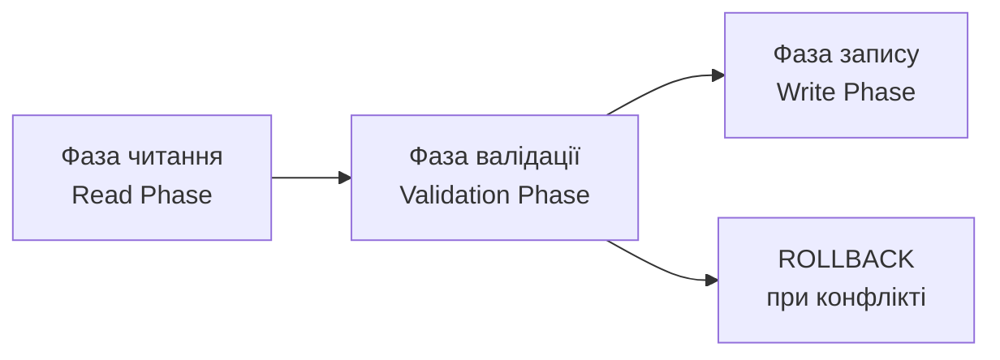

# Управління транзакціями та паралельним доступом

## План лекції

1. Концепція транзакції
2. ACID властивості транзакцій
3. Рівні ізоляції транзакцій
4. Протоколи управління паралельністю
5. Виявлення та вирішення взаємоблокувань
6. Багатоверсійний контроль паралельності (MVCC)

## 📚 **Основні поняття**

**Транзакція** — послідовність операцій з базою даних, які виконуються як єдине ціле. Або виконується повністю, або повністю скасовується.

**ACID** — набір властивостей, що гарантують надійність транзакцій: Atomicity, Consistency, Isolation, Durability.

**Блокування** — механізм контролю паралельного доступу, який запобігає одночасному доступу до одних і тих самих даних.

**MVCC** — багатоверсійний контроль паралельності, який зберігає кілька версій даних для підвищення паралельності.

## **1. Концепція транзакції**

## Що таке транзакція?

### 💡 **Логічна одиниця роботи**

Транзакція складається з:
- **BEGIN TRANSACTION** — початок
- Набір операцій **READ** та **WRITE**
- **COMMIT** — успішне завершення
- **ROLLBACK** — скасування всіх змін

### Приклад транзакції переказу коштів

```sql
BEGIN TRANSACTION;

-- Зняття з рахунку відправника
UPDATE accounts
SET balance = balance - 1000
WHERE account_id = 'ACC001';

-- Додавання на рахунок отримувача
UPDATE accounts
SET balance = balance + 1000
WHERE account_id = 'ACC002';

COMMIT;
```

## Навіщо потрібні транзакції?

### ⚠️ **Проблеми без транзакцій**

```
Сценарій без транзакційного контролю:

Крок 1: Зняти 1000 з рахунку A ✓
Крок 2: ЗБІЙ СИСТЕМИ! 💥
Крок 3: Додати 1000 на рахунок B ✗

Результат: 1000 грн зникли!
```

### ✅ **З транзакціями**

```
BEGIN TRANSACTION;
Крок 1: Зняти 1000 з рахунку A ✓
Крок 2: ЗБІЙ СИСТЕМИ! 💥
ROLLBACK — система автоматично повертає гроші!

Результат: Дані залишились консистентними
```

## Операції транзакції

### 📖 **Читання (READ)**

```sql
SELECT balance FROM accounts WHERE account_id = 'ACC001';
```

Характеристики:
- Отримання даних з БД
- Не змінює стан системи
- Позначення: **read(X)**

### ✍️ **Запис (WRITE)**

```sql
UPDATE accounts SET balance = balance - 100
WHERE account_id = 'ACC001';
```

Характеристики:
- Зміна даних в БД
- Впливає на стан системи
- Позначення: **write(X)**

## **2. ACID властивості**

## ACID: Фундамент надійності



### **Сформульовані Джимом Греєм у 1981 році**

## Атомарність (Atomicity)

### 💣 **Принцип "все або нічого"**

```
Транзакція або виконується повністю:
✓ Всі операції успішні → COMMIT

Або не виконується зовсім:
✗ Помилка в будь-якій операції → ROLLBACK
```

### Приклад атомарності

```sql
BEGIN TRANSACTION;

UPDATE accounts SET balance = balance - 1000
WHERE account_id = 'ACC001';

-- Якщо тут виникає помилка або збій
UPDATE accounts SET balance = balance + 1000
WHERE account_id = 'ACC002';

COMMIT;

-- При збої: автоматичний ROLLBACK всіх змін
```

## Консистентність (Consistency)

### ✅ **Збереження правил цілісності**

Транзакція переводить БД з одного **коректного** стану в інший **коректний** стан.

```sql
CREATE TABLE accounts (
    account_id VARCHAR(10) PRIMARY KEY,
    balance DECIMAL(15,2) NOT NULL
        CHECK (balance >= 0),  -- Правило: баланс >= 0
    customer_id INT NOT NULL,
    FOREIGN KEY (customer_id)
        REFERENCES customers(customer_id)
);
```

### Порушення консистентності

```sql
BEGIN TRANSACTION;

UPDATE accounts
SET balance = balance - 5000
WHERE account_id = 'ACC001' AND balance = 3000;

-- ❌ ERROR: порушено CHECK (balance >= 0)
-- Автоматичний ROLLBACK
```

## Ізольованість (Isolation)

### 🔒 **Незалежність паралельних транзакцій**

Кожна транзакція виконується так, ніби вона єдина в системі.

```
Без ізоляції:
T1: READ(X)=100 → X=X+50 → WRITE(X)=150
T2: READ(X)=100 → X=X+30 → WRITE(X)=130

Результат: 130 (втрачено +50!)

З ізоляцією:
T1: READ(X)=100 → X=X+50 → WRITE(X)=150
T2: чекає завершення T1...
T2: READ(X)=150 → X=X+30 → WRITE(X)=180

Результат: 180 ✓
```

## Проблеми без ізоляції

### 1️⃣ **Втрата оновлення (Lost Update)**

| Час | T1 | T2 | X |
|-----|----|----|---|
| t1 | READ(X)=100 | | 100 |
| t2 | | READ(X)=100 | 100 |
| t3 | X=150 | | 100 |
| t4 | | X=130 | 100 |
| t5 | WRITE(150) | | 150 |
| t6 | | WRITE(130) | 130 |

**Результат:** замість 180 маємо 130

### 2️⃣ **Брудне читання (Dirty Read)**

```
T1: UPDATE price = 100
T2: READ price = 100  ← Читає незафіксоване!
T1: ROLLBACK
T2: Використовує неіснуюче значення 100
```

## Довговічність (Durability)

### 💾 **Збереження після COMMIT**

Після успішного завершення транзакції її результати зберігаються назавжди, навіть при збоях системи.

### Журнал передзапису (WAL)

```
Процес фіксації:
1. Запис в журнал на диск ✓
2. Повідомлення користувачу "COMMIT успішний"
3. Застосування до БД (може бути пізніше)

При збої:
- REDO: повторити зафіксовані транзакції
- UNDO: відкотити незавершені транзакції
```

### Контрольні точки (Checkpoints)

```
[CP] CHECKPOINT
[101] BEGIN T1
[102] T1: UPDATE...
[103] COMMIT T1
[104] BEGIN T2
[ЗБІЙ]

Відновлення починається з останньої CP
```

## **3. Рівні ізоляції**

## Чотири рівні ізоляції SQL

### 📊 **Компроміс: коректність ⟷ продуктивність**

| Рівень | Брудне читання | Неповторюване | Фантоми |
|--------|----------------|---------------|---------|
| **READ UNCOMMITTED** | ❌ Можливо | ❌ Можливо | ❌ Можливо |
| **READ COMMITTED** | ✅ Неможливо | ❌ Можливо | ❌ Можливо |
| **REPEATABLE READ** | ✅ Неможливо | ✅ Неможливо | ❌ Можливо |
| **SERIALIZABLE** | ✅ Неможливо | ✅ Неможливо | ✅ Неможливо |

**↑ Більше гарантій = нижча продуктивність**

## READ UNCOMMITTED

### ⚡ **Максимальна швидкість, мінімальні гарантії**

```sql
SET TRANSACTION ISOLATION LEVEL READ UNCOMMITTED;

BEGIN TRANSACTION;
SELECT balance FROM accounts WHERE account_id = 'ACC001';
-- Може прочитати незафіксовані дані!
COMMIT;
```

**Застосування:**
- Звіти, де точність не критична
- Моніторинг системи
- Аналітика на копіях БД

**⚠️ Увага:** можливе брудне читання!

## READ COMMITTED

### ⭐ **Стандартний вибір (PostgreSQL, Oracle, SQL Server)**

```sql
SET TRANSACTION ISOLATION LEVEL READ COMMITTED;

BEGIN TRANSACTION;

SELECT balance FROM accounts WHERE account_id = 'ACC001';
-- Результат: 5000

-- Інша транзакція змінює баланс на 6000

SELECT balance FROM accounts WHERE account_id = 'ACC001';
-- Результат: 6000 (неповторюване читання)

COMMIT;
```

**Характеристики:**
- ✅ Запобігає брудному читанню
- ❌ Дозволяє неповторюване читання
- Підходить для більшості вебзастосунків

## REPEATABLE READ

### 🔒 **Консистентне читання протягом транзакції**

```sql
SET TRANSACTION ISOLATION LEVEL REPEATABLE READ;

BEGIN TRANSACTION;

SELECT balance FROM accounts WHERE account_id = 'ACC001';
-- Результат: 5000

-- Інша транзакція змінює баланс → БЛОКУЄТЬСЯ

SELECT balance FROM accounts WHERE account_id = 'ACC001';
-- Результат: 5000 (стабільне значення!)

COMMIT;
```

**Використання:**
- Фінансові операції
- Критичні бізнес-процеси
- Коли потрібна стабільність даних

## SERIALIZABLE

### 🛡️ **Максимальні гарантії коректності**

```sql
SET TRANSACTION ISOLATION LEVEL SERIALIZABLE;

BEGIN TRANSACTION;

SELECT COUNT(*) FROM products WHERE category = 'Electronics';
-- 50 товарів

-- Спроба вставити новий товар іншою транзакцією
-- → БЛОКУЄТЬСЯ або помилка серіалізації

SELECT COUNT(*) FROM products WHERE category = 'Electronics';
-- 50 товарів (фантоми неможливі)

COMMIT;
```

**Характеристики:**
- Транзакції виконуються як послідовні
- Найвищі гарантії
- Найнижча продуктивність

## **4. Протоколи управління паралельністю**

## Три основні підходи



**Різні підходи для різних сценаріїв!**

## Протокол блокування

### 🔐 **Типи блокувань**

**Спільне блокування (S-lock):**
- Для операцій читання
- Кілька транзакцій можуть утримувати одночасно
- Блокує виключні блокування

**Виключне блокування (X-lock):**
- Для операцій запису
- Лише одна транзакція
- Блокує всі інші блокування

### Матриця сумісності

|  | S-lock | X-lock |
|--|--------|--------|
| **S-lock** | ✅ Так | ❌ Ні |
| **X-lock** | ❌ Ні | ❌ Ні |

## Двофазний протокол (2PL)

### 📈📉 **Дві фази блокування**

```
Фаза зростання (Growing):
↗ Отримання нових блокувань
✗ Заборона звільнення

Фаза скорочення (Shrinking):
↘ Звільнення блокувань
✗ Заборона отримання нових
```

### Приклад 2PL

```
BEGIN
  LOCK-S(A)      ← Фаза зростання
  READ(A)
  LOCK-X(B)      ← Фаза зростання
  WRITE(B)
  UNLOCK(A)      ← Фаза скорочення
  UNLOCK(B)      ← Фаза скорочення
COMMIT
```

## Строгий 2PL (Strict 2PL)

### 🔒 **Утримання до COMMIT**

```
BEGIN
  LOCK-S(A)
  READ(A)
  LOCK-X(B)
  WRITE(B)
  // Блокування НЕ звільняються!
COMMIT ← Тут звільняються ВСІ блокування
```

**Переваги:**
- Запобігає каскадним відкатам
- Використовується в більшості СУБД
- Гарантує серіалізовність

## Гранулярність блокування

### 🎯 **Різні рівні блокування**

```
📊 База даних
  ├─ 📋 Таблиця
  │   ├─ 📄 Сторінка
  │   │   └─ 📝 Рядок (найдрібніше)
  │   └─ 🔍 Індекс
```

### Вибір гранулярності

**Блокування рядка:**
```sql
SELECT * FROM accounts
WHERE account_id = 'ACC001' FOR UPDATE;
-- Блокується ЛИШЕ один рядок
```

**Блокування таблиці:**
```sql
LOCK TABLE accounts IN EXCLUSIVE MODE;
-- Блокується ВСЯ таблиця
```

## Протокол позначок часу

### ⏰ **Без блокувань!**

Кожна транзакція T отримує унікальну позначку **TS(T)**

```
Для кожного елемента X зберігаємо:
- read_TS(X): остання транзакція, що читала
- write_TS(X): остання транзакція, що писала
```

### Правила протоколу

**READ(X) від T:**
```
Якщо TS(T) < write_TS(X):
  ROLLBACK T  // Застаріле читання
Інакше:
  Виконати READ(X)
  read_TS(X) = max(read_TS(X), TS(T))
```

**WRITE(X) від T:**
```
Якщо TS(T) < read_TS(X):
  ROLLBACK T  // Пізній запис
Інакше:
  Виконати WRITE(X)
  write_TS(X) = TS(T)
```

## Оптимістична валідація (OCC)

### 😊 **Припускаємо, що конфліктів немає**



### Три фази виконання

**1. Фаза читання:**
- Читання даних з БД
- Зміни у локальному буфері
- Формування read_set та write_set

**2. Фаза валідації:**
- Перевірка конфліктів
- Якщо конфлікт → ROLLBACK
- Якщо OK → перехід до запису

**3. Фаза запису:**
- Застосування змін до БД
- COMMIT

## Приклад OCC

### 📝 **Редагування профілю користувача**

```sql
BEGIN TRANSACTION;

-- Фаза читання
SELECT name, email, version FROM users WHERE user_id = 123;
-- Користувач заповнює форму (можливо, хвилини)

-- Фаза валідації + запису
IF (SELECT version FROM users WHERE user_id = 123) = original_version THEN
    -- Версія не змінилась → OK
    UPDATE users SET name = 'Нове ім''я', version = version + 1
    WHERE user_id = 123;
    COMMIT;
ELSE
    -- Хтось інший змінив дані
    ROLLBACK;
END IF;
```

**Ефективно при рідкісних конфліктах!**

## **5. Взаємоблокування (Deadlock)**

## Що таке Deadlock?

### 🔄 **Циклічне очікування**

```
Транзакція T1:          Транзакція T2:
LOCK-X(A) ✓             LOCK-X(B) ✓
READ(A)                 READ(B)

LOCK-X(B) ⏳            LOCK-X(A) ⏳
чекає на T2...          чекає на T1...

Граф очікування:
T1 → T2 → T1  (ЦИКЛ!)
```

**Жодна транзакція не може продовжити!**

## Детальний приклад Deadlock

```sql
-- Час t1: T1
BEGIN TRANSACTION;
UPDATE accounts SET balance = balance - 100
WHERE account_id = 'ACC001';
-- T1 тримає X-lock на ACC001

-- Час t2: T2
BEGIN TRANSACTION;
UPDATE accounts SET balance = balance - 200
WHERE account_id = 'ACC002';
-- T2 тримає X-lock на ACC002

-- Час t3: T1 потребує ACC002
UPDATE accounts SET balance = balance + 100
WHERE account_id = 'ACC002';
-- ⏳ Чекає на T2

-- Час t4: T2 потребує ACC001
UPDATE accounts SET balance = balance + 200
WHERE account_id = 'ACC001';
-- ⏳ Чекає на T1

-- 💥 DEADLOCK!
```

## Запобігання Deadlock

### 1️⃣ **Упорядкування ресурсів**

```sql
-- ✅ ПРАВИЛЬНО: завжди блокувати в порядку зростання ID
CREATE PROCEDURE transfer_money(from_acc, to_acc, amount)
BEGIN
    -- Визначення порядку блокування
    IF from_acc < to_acc THEN
        first = from_acc; second = to_acc;
    ELSE
        first = to_acc; second = from_acc;
    END IF;

    BEGIN TRANSACTION;
    SELECT balance FROM accounts WHERE account_id = first FOR UPDATE;
    SELECT balance FROM accounts WHERE account_id = second FOR UPDATE;
    -- Виконати переказ
    COMMIT;
END;
```

### 2️⃣ **Тайм-аути**

```sql
SET lock_timeout = '5s';

BEGIN TRANSACTION;
UPDATE accounts...  -- Якщо не отримано lock за 5с → ERROR
COMMIT;
```

## Виявлення Deadlock

### 🔍 **Граф очікування (Wait-For Graph)**

```
Стан блокувань:
T1 тримає X-lock(A), чекає X-lock(B)
T2 тримає X-lock(B), чекає X-lock(C)
T3 тримає X-lock(C), чекає X-lock(A)

Граф очікування:
T1 → T2 → T3 → T1

Виявлено ЦИКЛ = DEADLOCK!
```

### Вибір жертви

**Критерії вибору транзакції для відкату:**
- Вік транзакції (відкотити молодшу)
- Кількість виконаної роботи (менше роботи)
- Кількість блокувань
- Попередні відкати (уникати голодування)

## Моніторинг Deadlock

### 📊 **PostgreSQL**

```sql
-- Перегляд блокувань
SELECT
    blocked_locks.pid AS blocked_pid,
    blocking_locks.pid AS blocking_pid,
    blocked_activity.query AS blocked_statement,
    blocking_activity.query AS blocking_statement
FROM pg_locks blocked_locks
JOIN pg_locks blocking_locks ON ...
WHERE NOT blocked_locks.granted;

-- Налаштування детектора
SHOW deadlock_timeout;  -- За замовчуванням 1s
SET log_lock_waits = on;
```

## **6. MVCC**

## Багатоверсійний контроль паралельності

### 🔄 **Кілька версій кожного об'єкта**

```
Традиційний підхід:
T1: WRITE(X) → X заблоковано
T2: READ(X) → чекає на T1 ⏳

MVCC підхід:
T1: WRITE(X) → створює версію X₂
T2: READ(X) → читає версію X₁  ✓ Без очікування!
```

### Основна ідея

**Читання не блокує запис**
**Запис не блокує читання**

## Структура версій

### 📦 **Ланцюг версій об'єкта**

```
X₁: value=100, created=T1, deleted=T3 → X₂
X₂: value=150, created=T3, deleted=T5 → X₃
X₃: value=200, created=T5, deleted=NULL (активна)
```

### Правила читання версії

Транзакція T може прочитати версію Xᵢ, якщо:

```
1. created(Xᵢ) ≤ TS(T)
   ✓ Версія створена до або в момент початку T

2. deleted(Xᵢ) > TS(T) АБО deleted(Xᵢ) = NULL
   ✓ Версія не видалена або видалена після T
```

## Снапшот ізоляція

### 📸 **Консистентний знімок даних**

```sql
-- T1 розпочата в момент часу 10
BEGIN TRANSACTION ISOLATION LEVEL REPEATABLE READ;

SELECT balance FROM accounts WHERE account_id = 'ACC001';
-- Баланс: 1000 (снапшот на момент 10)

-- T2 змінює баланс на 2000 і фіксує (момент 20)

-- T1 продовжує
SELECT balance FROM accounts WHERE account_id = 'ACC001';
-- Баланс: 1000 (все ще бачить снапшот на момент 10!)

COMMIT;
```

**Транзакція бачить консистентний стан на момент початку**

## Реалізація в PostgreSQL

### 🐘 **XID та ctid**

```
Кортеж в PostgreSQL:

account_id = 'ACC001'
balance = 1000
xmin = 100  ← створена транзакцією 100
xmax = 150  ← видалена транзакцією 150
ctid = (0,1) → вказує на наступну версію

Транзакція з XID = 140:
✓ Бачить цей кортеж (xmin < 140, xmax > 140)

Транзакція з XID = 160:
✗ Не бачить (xmax = 150 < 160)
```

## Очищення старих версій

### 🧹 **VACUUM**

```sql
-- Ручне очищення
VACUUM accounts;

-- З аналізом статистики
VACUUM ANALYZE accounts;

-- Повне очищення (блокує таблицю!)
VACUUM FULL accounts;
```

### Коли потрібен VACUUM?

```
Критерії видалення версії Xᵢ:
1. deleted(Xᵢ) ≠ NULL
2. deleted(Xᵢ) < min(TS всіх активних транзакцій)
3. Транзакція видалення зафіксована

→ Жодна транзакція не може побачити цю версію
```

## Автоматичне очищення

### ⚙️ **Autovacuum**

```sql
-- Агресивне очищення для частих оновлень
ALTER TABLE accounts SET (
    autovacuum_vacuum_scale_factor = 0.05,
    autovacuum_vacuum_threshold = 50
);

-- Відкладене для рідких оновлень
ALTER TABLE audit_log SET (
    autovacuum_vacuum_scale_factor = 0.4
);
```

### Моніторинг роздування

```sql
SELECT
    tablename,
    n_live_tup,
    n_dead_tup,
    ROUND(n_dead_tup * 100.0 /
          NULLIF(n_live_tup + n_dead_tup, 0), 2) AS dead_ratio
FROM pg_stat_user_tables
WHERE n_dead_tup > 1000
ORDER BY dead_ratio DESC;
```

## Переваги MVCC

### ✅ **Висока паралельність**

**Традиційне блокування:**
```
T1: UPDATE accounts → блокує всю таблицю
T2: SELECT * → чекає... ⏳
```

**MVCC:**
```
T1: UPDATE accounts → створює нову версію
T2: SELECT * → читає стару версію ✓ Без очікування!
```

### ✅ **Консистентне читання**

```sql
BEGIN TRANSACTION;
SELECT COUNT(*) FROM products;  -- 100

-- Інша транзакція додає 10 продуктів

SELECT COUNT(*) FROM products;  -- Все одно 100!
COMMIT;
```

## Недоліки MVCC

### ❌ **Роздування БД**

```
Початковий розмір: 1 GB (1 млн рядків)

Після 1000 оновлень кожного рядка:
- Фізичний розмір: ~1000 GB
- Активні дані: 1 GB
- "Мертві" версії: 999 GB

Необхідне регулярне VACUUM!
```

### ❌ **Вартість обслуговування**

- Регулярний VACUUM споживає ресурси
- Роздування індексів потребує REINDEX
- Довгі транзакції блокують очищення
- Необхідний моніторинг та налаштування

## **7. Практичні рекомендації**

## Вибір рівня ізоляції

### 🎯 **За типом застосунку**

**Вебзастосунки:**
```sql
SET TRANSACTION ISOLATION LEVEL READ COMMITTED;
```
✓ Баланс коректності та продуктивності
✓ Підходить для більшості CRUD

**Фінансові системи:**
```sql
SET TRANSACTION ISOLATION LEVEL REPEATABLE READ;
```
✓ Критична консистентність
✓ Запобігання неповторюваному читанню

**Аналітика/звіти:**
```sql
SET TRANSACTION ISOLATION LEVEL READ COMMITTED;
```
✓ Продуктивність важливіша за точність
✓ Мінімальний вплив на операційні транзакції

## Оптимізація транзакцій

### 1️⃣ **Мінімізація розміру**

```sql
-- ❌ ПОГАНО: довга транзакція
BEGIN TRANSACTION;
FOR each IN (1..1000000) LOOP
    UPDATE processed SET status = 'done' WHERE id = each;
END LOOP;
COMMIT;  -- Утримує блокування дуже довго!

-- ✅ ДОБРЕ: пакетна обробка
FOR batch IN 1..1000 LOOP
    BEGIN TRANSACTION;
    UPDATE processed SET status = 'done'
    WHERE id BETWEEN batch*1000 AND (batch+1)*1000;
    COMMIT;  -- Швидке звільнення!
END LOOP;
```

### 2️⃣ **Правильний порядок блокування**

```sql
-- ❌ ПОГАНО: неупорядковане блокування
BEGIN TRANSACTION;
UPDATE accounts SET balance = balance - 100 WHERE account_id = 'ACC002';
UPDATE accounts SET balance = balance + 100 WHERE account_id = 'ACC001';
COMMIT;  -- Ризик deadlock!

-- ✅ ДОБРЕ: завжди в порядку зростання ID
BEGIN TRANSACTION;
UPDATE accounts SET balance = balance + 100 WHERE account_id = 'ACC001';
UPDATE accounts SET balance = balance - 100 WHERE account_id = 'ACC002';
COMMIT;  -- Без deadlock!
```

## Оптимістичне vs Песимістичне

### 😊 **Оптимістичне блокування**

**Коли:** рідкісні конфлікти

```sql
BEGIN TRANSACTION;
SELECT balance, version FROM accounts WHERE account_id = 'ACC001';

-- Користувач працює з даними...

UPDATE accounts
SET balance = new_balance, version = version + 1
WHERE account_id = 'ACC001' AND version = old_version;

IF ROW_COUNT = 0 THEN
    ROLLBACK;  -- Дані змінились
ELSE
    COMMIT;
END IF;
```

### 😐 **Песимістичне блокування**

**Коли:** часті конфлікти

```sql
BEGIN TRANSACTION;

SELECT balance FROM accounts
WHERE account_id = 'ACC001' FOR UPDATE;
-- Негайно отримати X-lock

UPDATE accounts SET balance = new_balance
WHERE account_id = 'ACC001';

COMMIT;
```

## Моніторинг транзакцій

### 📊 **Поточні блокування**

```sql
-- PostgreSQL
SELECT
    l.pid,
    l.locktype,
    l.mode,
    l.granted,
    a.query,
    a.wait_event
FROM pg_locks l
JOIN pg_stat_activity a ON l.pid = a.pid
WHERE NOT l.granted;
```

### 📊 **Довгі транзакції**

```sql
SELECT
    pid,
    now() - xact_start AS duration,
    state,
    query
FROM pg_stat_activity
WHERE xact_start IS NOT NULL
  AND now() - xact_start > interval '5 minutes'
ORDER BY duration DESC;
```

## Моніторинг MVCC

### 🔍 **Статистика таблиць**

```sql
SELECT
    tablename,
    n_tup_ins AS inserts,
    n_tup_upd AS updates,
    n_tup_del AS deletes,
    n_live_tup AS live,
    n_dead_tup AS dead,
    last_vacuum,
    last_autovacuum
FROM pg_stat_user_tables
ORDER BY n_dead_tup DESC;
```

### 🔍 **Роздування (Bloat)**

```sql
SELECT
    schemaname,
    tablename,
    pg_size_pretty(pg_total_relation_size(
        schemaname||'.'||tablename)) AS size,
    ROUND(n_dead_tup * 100.0 /
          NULLIF(n_live_tup + n_dead_tup, 0), 2) AS dead_ratio
FROM pg_stat_user_tables
WHERE n_live_tup > 0
ORDER BY dead_ratio DESC;
```

## Стратегії обслуговування

### 🗓️ **Регулярне обслуговування**

```sql
-- Щоденно: критичні таблиці
VACUUM ANALYZE accounts;
VACUUM ANALYZE transactions;

-- Щотижнево: перебудова індексів
REINDEX TABLE CONCURRENTLY accounts;

-- Щомісячно: повне очищення (у вікно обслуговування)
VACUUM FULL accounts;  -- Блокує таблицю!
```

### ⚙️ **Автоматизація**

```bash
# Cron job для нічного VACUUM
0 2 * * * psql -d mydb -c "VACUUM ANALYZE accounts;"

# Або pg_cron extension
SELECT cron.schedule('nightly-vacuum',
    '0 2 * * *',
    'VACUUM ANALYZE accounts');
```

## Налаштування параметрів

### 🔧 **PostgreSQL**

```sql
-- Логування повільних запитів
SET log_min_duration_statement = 1000;  -- мс

-- Тайм-аут блокування
SET lock_timeout = '5s';

-- Детектор deadlock
SET deadlock_timeout = '1s';

-- Логування блокувань
SET log_lock_waits = on;
```

### 🔧 **Autovacuum**

```sql
-- Для таблиць з частими оновленнями
ALTER TABLE hot_table SET (
    autovacuum_vacuum_scale_factor = 0.05,
    autovacuum_vacuum_threshold = 50
);

-- Для великих таблиць з рідкими оновленнями
ALTER TABLE cold_table SET (
    autovacuum_vacuum_scale_factor = 0.4,
    autovacuum_vacuum_threshold = 1000
);
```

## Поширені помилки

### ❌ **Помилка 1: Довгі транзакції**

```sql
-- ПОГАНО
BEGIN TRANSACTION;
-- Складна обробка 10+ хвилин
-- Блокує VACUUM, накопичує версії
COMMIT;

-- ДОБРЕ
-- Розбити на менші транзакції
-- Або винести обробку за межі транзакції
```

### ❌ **Помилка 2: Неправильний порядок**

```sql
-- ПОГАНО: deadlock-prone
UPDATE table1 WHERE id = 1;
UPDATE table2 WHERE id = 2;
UPDATE table1 WHERE id = 2;
UPDATE table2 WHERE id = 1;

-- ДОБРЕ: консистентний порядок
UPDATE table1 WHERE id IN (1, 2) ORDER BY id;
UPDATE table2 WHERE id IN (1, 2) ORDER BY id;
```

## Поширені помилки (продовження)

### ❌ **Помилка 3: Ігнорування VACUUM**

```sql
-- Без регулярного VACUUM:
- Роздування таблиць на 1000%
- Повільні запити
- Неефективні індекси
- Проблеми з планувальником

-- Рішення: моніторинг + автоматизація
```

### ❌ **Помилка 4: Неправильний рівень ізоляції**

```sql
-- SERIALIZABLE для звітів
-- → Зайві конфлікти серіалізації

-- READ UNCOMMITTED для фінансів
-- → Втрата даних, неконсистентність

-- Вибирайте рівень відповідно до задачі!
```

## Контрольний список (Checklist)

### ✅ **Перед запуском у продакшн**

**Транзакції:**
- ☐ Всі критичні операції в транзакціях
- ☐ Мінімальний розмір транзакцій
- ☐ Правильний порядок блокування
- ☐ Обробка помилок та відкатів

**Рівень ізоляції:**
- ☐ Вибрано відповідно до типу застосунку
- ☐ Протестовано під навантаженням
- ☐ Перевірено на deadlock

**Моніторинг:**
- ☐ Налаштовано логування
- ☐ Встановлено тайм-аути
- ☐ Моніторинг блокувань
- ☐ Відстеження довгих транзакцій

## Контрольний список (продовження)

### ✅ **MVCC та обслуговування**

**Autovacuum:**
- ☐ Увімкнено autovacuum
- ☐ Налаштовано параметри для кожної таблиці
- ☐ Моніторинг роздування
- ☐ Графіки dead_ratio

**Регулярне обслуговування:**
- ☐ Планові VACUUM ANALYZE
- ☐ Періодичний REINDEX
- ☐ Вікна обслуговування для VACUUM FULL
- ☐ Автоматизація через cron/pg_cron

**Документація:**
- ☐ Процедури обслуговування
- ☐ Інструкції при проблемах
- ☐ Контакти відповідальних

## Порівняльна таблиця

### 📊 **MVCC vs Блокування**

| Характеристика | MVCC | Блокування |
|----------------|------|------------|
| **Читання vs Запис** | Не блокують | Блокують |
| **Паралельність** | Висока | Середня |
| **Накладні витрати** | Простір | Час очікування |
| **Обслуговування** | VACUUM | Мінімальне |
| **Deadlock** | Рідко | Частіше |
| **Довгі транзакції** | Роздування | Черги |

### 📊 **Рівні ізоляції**

| Рівень | Продуктивність | Коректність | Застосування |
|--------|----------------|-------------|--------------|
| **READ UNCOMMITTED** | ⭐⭐⭐⭐⭐ | ⭐ | Звіти |
| **READ COMMITTED** | ⭐⭐⭐⭐ | ⭐⭐⭐ | Веб |
| **REPEATABLE READ** | ⭐⭐⭐ | ⭐⭐⭐⭐ | Фінанси |
| **SERIALIZABLE** | ⭐⭐ | ⭐⭐⭐⭐⭐ | Критичні |

## Ресурси для подальшого вивчення

### 📚 **Книги**

- **"Transaction Processing: Concepts and Techniques"** — Jim Gray, Andreas Reuter
- **"Designing Data-Intensive Applications"** — Martin Kleppmann
- **"PostgreSQL 14 Internals"** — Egor Rogov

### 🔗 **Документація**

- PostgreSQL: [www.postgresql.org/docs](https://www.postgresql.org/docs)
- MySQL InnoDB: [dev.mysql.com/doc/innodb](https://dev.mysql.com/doc/innodb)

### 🎥 **Відео та курси**

- CMU Database Systems (YouTube)
- Postgres Conference презентації

## **Висновки**

## Ключові висновки

### 1️⃣ **ACID — фундамент надійності**

- **Atomicity:** все або нічого
- **Consistency:** збереження цілісності
- **Isolation:** незалежність транзакцій
- **Durability:** збереження після COMMIT

### 2️⃣ **Рівні ізоляції — компроміс**

```
READ UNCOMMITTED → READ COMMITTED → REPEATABLE READ → SERIALIZABLE
     Швидкість ←                                    → Коректність
```

Вибирайте відповідно до вимог застосунку!

## Ключові висновки (продовження)

### 3️⃣ **Протоколи управління паралельністю**

**Блокування (2PL):**
- Традиційний підхід
- Явний контроль доступу
- Ризик deadlock

**Позначки часу:**
- Без блокувань
- Детерміністичне упорядкування
- Більше відкатів

**Оптимістична валідація:**
- Ефективна при низькій конфліктності
- Мінімум блокувань
- Валідація перед COMMIT

## Ключові висновки (фінал)

### 4️⃣ **Взаємоблокування**

- **Запобігання:** упорядкування ресурсів, тайм-аути
- **Виявлення:** граф очікування
- **Вирішення:** вибір жертви для відкату

### 5️⃣ **MVCC — високу паралельність**

**Переваги:**
- Читання не блокує запис
- Консистентні снапшоти

**Недоліки:**
- Роздування БД
- Потреба в VACUUM

**Ключ:** регулярне обслуговування!

## Практичні поради

### 💡 **Що робити завжди**

✅ Тримати транзакції короткими
✅ Використовувати консистентний порядок блокування
✅ Налаштувати моніторинг
✅ Регулярно виконувати VACUUM
✅ Вибирати правильний рівень ізоляції
✅ Обробляти помилки deadlock

### 💡 **Чого уникати**

❌ Довгих транзакцій (години)
❌ Хаотичного порядку блокувань
❌ Ігнорування роздування БД
❌ SERIALIZABLE там, де не потрібно
❌ Відсутності моніторингу
