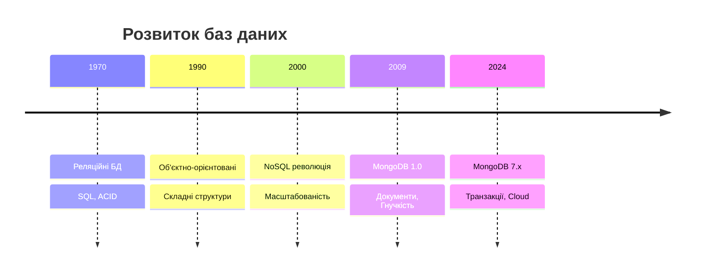
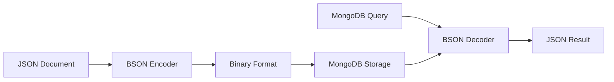
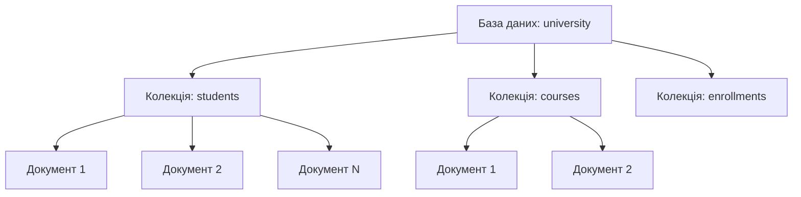
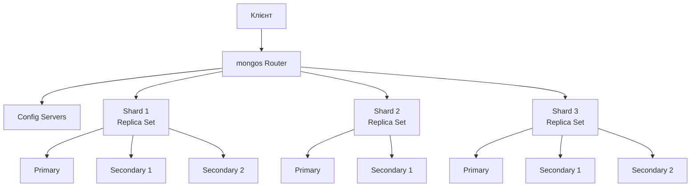
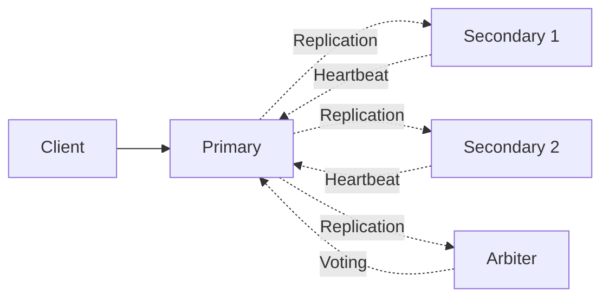
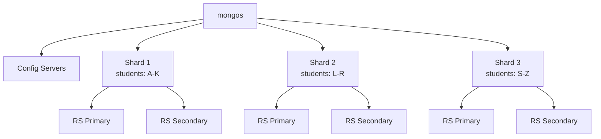
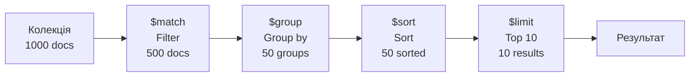

# Презентація 12. MongoDB: архітектура та модель даних

## План презентації

1. Вступ до MongoDB
2. Документо-орієнтована модель даних
3. Архітектура MongoDB
4. Мова запитів MongoDB
5. Aggregation Pipeline
6. Транзакційна підтримка

---

## **💡 Що таке MongoDB?**

**MongoDB** - провідна документо-орієнтована NoSQL СУБД

### 🎯 **Ключові характеристики:**

- 📄 Документи у форматі BSON (Binary JSON)
- 🔄 Гнучка схема даних
- ⚡ Горизонтальне масштабування
- 🌍 Розподілена архітектура
- 📊 Потужні можливості агрегації

### 🏆 **Де використовується:**

- Вебдодатки з динамічним контентом
- Системи керування контентом
- Аналітичні платформи
- IoT та системи реального часу
- Мобільні додатки

---

## **1. Вступ до MongoDB**

## Еволюція баз даних



### 📈 **Чому MongoDB?**

**Проблеми реляційних БД:**
- Жорсткі схеми
- Складність масштабування
- Object-relational impedance mismatch
- Повільні JOIN операції

**Рішення MongoDB:**
- Гнучкі документи
- Вбудовані структури
- Природне відображення об'єктів
- Швидкий доступ без JOIN

---

## Порівняння моделей даних

### 📊 **Реляційна модель:**

```sql
-- Три таблиці для студента
CREATE TABLE students (
    student_id INT PRIMARY KEY,
    name VARCHAR(100),
    email VARCHAR(100)
);

CREATE TABLE addresses (
    address_id INT PRIMARY KEY,
    student_id INT,
    street VARCHAR(200),
    city VARCHAR(100)
);

CREATE TABLE courses (
    enrollment_id INT PRIMARY KEY,
    student_id INT,
    course_name VARCHAR(100)
);
```

### 📄 **Документо-орієнтована модель:**

```javascript
// Один документ для студента
{
    "_id": ObjectId("..."),
    "student_id": "S2024001",
    "name": "Іван Петров",
    "email": "ivan@university.edu.ua",
    "address": {
        "street": "вул. Хрещатик, 15",
        "city": "Київ"
    },
    "courses": [
        { "name": "Бази даних", "credits": 6 },
        { "name": "Алгоритми", "credits": 5 }
    ]
}
```

---

## **2. Документо-орієнтована модель**

## Формат BSON

### 🔢 **Binary JSON - оптимізований для зберігання**



**Переваги BSON:**
- Швидша обробка
- Додаткові типи даних
- Ефективне зберігання
- Підтримка бінарних даних

---

## Типи даних BSON

### 📦 **Розширений набір типів:**

```javascript
{
    // Стандартні типи
    "string": "текст",
    "number": 42,
    "boolean": true,
    "null": null,

    // Спеціалізовані типи BSON
    "_id": ObjectId("507f1f77bcf86cd799439011"),
    "date": ISODate("2024-10-17T14:30:00Z"),
    "int32": NumberInt(100),
    "int64": NumberLong(9223372036854775807),
    "decimal": NumberDecimal("123.45"),
    "binary": BinData(0, "base64data=="),
    "timestamp": Timestamp(1634567890, 1),

    // Складні структури
    "array": [1, 2, 3],
    "object": { "nested": "value" },
    "regex": /pattern/i
}
```

---

## Структура документа

### 🗂️ **Гнучка організація даних:**

```javascript
// Приклад багаторівневого документа
{
    "_id": ObjectId("507f1f77bcf86cd799439011"),
    "student_id": "S2024001",

    // Вкладені об'єкти
    "personal_info": {
        "first_name": "Іван",
        "last_name": "Петров",
        "birth_date": ISODate("2004-05-15")
    },

    // Масиви примітивів
    "skills": ["Python", "Java", "SQL"],

    // Масиви документів
    "courses": [
        {
            "course_id": "CS101",
            "name": "Бази даних",
            "grade": "A",
            "credits": 6
        }
    ],

    // Змішані типи
    "metadata": {
        "created_at": ISODate("2024-09-01"),
        "tags": ["active", "scholarship"],
        "gpa": NumberDecimal("3.85")
    }
}
```

---

## Колекції та схеми

### 📚 **Організація документів:**



**Особливості:**
- Колекція = аналог таблиці
- Документи можуть мати різну структуру
- Динамічна схема (schema-less)
- Опціональна валідація схеми

---

## Валідація схеми

### ✅ **Контроль структури даних:**

```javascript
db.createCollection("students", {
    validator: {
        $jsonSchema: {
            bsonType: "object",
            required: ["student_id", "name", "email"],
            properties: {
                student_id: {
                    bsonType: "string",
                    pattern: "^S[0-9]{7}$"
                },
                name: {
                    bsonType: "string",
                    minLength: 1,
                    maxLength: 100
                },
                email: {
                    bsonType: "string",
                    pattern: "^[a-zA-Z0-9._%+-]+@[a-zA-Z0-9.-]+\\.[a-zA-Z]{2,}$"
                },
                gpa: {
                    bsonType: "decimal",
                    minimum: 0.0,
                    maximum: 4.0
                }
            }
        }
    },
    validationLevel: "moderate",
    validationAction: "error"
})
```

---

## **3. Архітектура MongoDB**

## Базові компоненти



**Ключові елементи:**
- 🖥️ **mongod** - сервер БД
- 🔀 **mongos** - маршрутизатор запитів
- ⚙️ **Config Servers** - метадані кластера
- 🔄 **Replica Set** - набір реплік
- 📦 **Shard** - частина даних

---

## Реплікація

### 🔄 **Забезпечення високої доступності:**



**Типи вузлів:**
- **Primary** - приймає записи
- **Secondary** - копіює дані
- **Arbiter** - бере участь у виборах

**Автоматичне відновлення:**
- Heartbeat моніторинг (кожні 2 сек)
- Вибори нового Primary (~12 сек)
- Синхронізація даних

---

## Налаштування Replica Set

```javascript
// Ініціалізація набору реплік
rs.initiate({
    _id: "rs0",
    members: [
        {
            _id: 0,
            host: "mongodb1.example.com:27017",
            priority: 2  // Вищий пріоритет для Primary
        },
        {
            _id: 1,
            host: "mongodb2.example.com:27017",
            priority: 1
        },
        {
            _id: 2,
            host: "mongodb3.example.com:27017",
            priority: 1
        }
    ]
})

// Перевірка статусу
rs.status()

// Додавання вузла
rs.add({
    host: "mongodb4.example.com:27017",
    priority: 0,    // Не буде Primary
    hidden: true,   // Не видимий для клієнтів
    votes: 0        // Не бере участь у виборах
})
```

---

## Preferencії читання

### 📖 **Контроль джерела даних:**

```javascript
// Primary (за замовчуванням) - найсвіжіші дані
db.collection.find().readPref("primary")

// Secondary - розподіл навантаження
db.collection.find().readPref("secondary")

// PrimaryPreferred - Primary якщо доступний
db.collection.find().readPref("primaryPreferred")

// SecondaryPreferred - Secondary якщо доступний
db.collection.find().readPref("secondaryPreferred")

// Nearest - найменша затримка
db.collection.find().readPref("nearest")
```

**Коли використовувати:**
- `primary` - критична консистентність
- `secondary` - аналітика, звіти
- `nearest` - найкраща продуктивність

---

## Шардинг

### 📊 **Горизонтальне масштабування:**



**Ключ шардингу визначає розподіл:**
- Hash-based - рівномірний розподіл
- Range-based - збереження порядку
- Zone-based - географічний розподіл

---

## Налаштування шардингу

```javascript
// Увімкнення шардингу для БД
sh.enableSharding("university")

// Створення індексу для ключа шардингу
db.students.createIndex({ "student_id": "hashed" })

// Шардинг колекції (hash-based)
sh.shardCollection(
    "university.students",
    { "student_id": "hashed" }
)

// Шардинг за діапазоном
sh.shardCollection(
    "university.courses",
    { "department": 1, "course_number": 1 }
)

// Перевірка розподілу
db.students.getShardDistribution()

// Результат:
// Shard shard0000: 33.3% (334 docs)
// Shard shard0001: 33.5% (335 docs)
// Shard shard0002: 33.2% (331 docs)
```

---

## Індексування

### 🔍 **Оптимізація пошуку:**

```javascript
// Одинарний індекс
db.students.createIndex({ "email": 1 })

// Унікальний індекс
db.students.createIndex(
    { "student_id": 1 },
    { unique: true }
)

// Складений індекс
db.students.createIndex({
    "academic_record.major": 1,
    "academic_record.current_year": 1
})

// Текстовий індекс
db.courses.createIndex({
    "name": "text",
    "description": "text"
})

// Геопросторовий індекс
db.universities.createIndex({
    "location": "2dsphere"
})
```

---

## Типи індексів

| Тип | Призначення | Приклад використання |
|-----|-------------|---------------------|
| **Single Field** | Один атрибут | Пошук за email |
| **Compound** | Кілька атрибутів | Сортування за кількома полями |
| **Text** | Повнотекстовий пошук | Пошук у контенті |
| **Geospatial** | Географічні дані | Пошук за координатами |
| **Hashed** | Рівномірний розподіл | Ключ шардингу |
| **TTL** | Автовидалення | Тимчасові дані |
| **Partial** | Часткове індексування | Тільки певні документи |
| **Sparse** | Розріджений | Тільки документи з полем |

---

## **4. Мова запитів MongoDB**

## CRUD операції

### ✏️ **Create - Створення:**

```javascript
// Один документ
db.students.insertOne({
    student_id: "S2024001",
    name: "Іван Петров",
    email: "ivan@example.com",
    enrollment_year: 2024
})

// Кілька документів
db.students.insertMany([
    {
        student_id: "S2024002",
        name: "Марія Коваленко"
    },
    {
        student_id: "S2024003",
        name: "Олександр Сидоров"
    }
])
```

---

## Read операції

### 📖 **Читання даних:**

```javascript
// Всі документи
db.students.find()

// З фільтром
db.students.find({ enrollment_year: 2024 })

// Складні умови
db.students.find({
    enrollment_year: 2024,
    "academic_record.gpa": { $gte: 3.5 }
})

// Логічні оператори
db.students.find({
    $or: [
        { "academic_record.major": "Computer Science" },
        { "academic_record.major": "Software Engineering" }
    ]
})

// Проекція полів (SELECT specific fields)
db.students.find(
    { enrollment_year: 2024 },
    { name: 1, email: 1, _id: 0 }
)

// Сортування та ліміт
db.students.find()
    .sort({ "academic_record.gpa": -1 })
    .limit(10)
```

---

## Update операції

### 🔄 **Оновлення даних:**

```javascript
// Один документ
db.students.updateOne(
    { student_id: "S2024001" },
    {
        $set: { "contact.phone": "+380501234567" },
        $inc: { "academic_record.current_year": 1 }
    }
)

// Кілька документів
db.students.updateMany(
    { enrollment_year: 2024 },
    { $set: { status: "active" } }
)

// Додавання до масиву
db.students.updateOne(
    { student_id: "S2024001" },
    {
        $push: {
            courses: {
                course_id: "CS301",
                name: "Бази даних"
            }
        }
    }
)

// Видалення поля
db.students.updateOne(
    { student_id: "S2024001" },
    { $unset: { temporary_field: "" } }
)
```

---

## Delete операції

### 🗑️ **Видалення даних:**

```javascript
// Один документ
db.students.deleteOne({ student_id: "S2024001" })

// Кілька документів
db.students.deleteMany({ status: "inactive" })

// Всі документи колекції
db.students.deleteMany({})
```

---

## Оператори запитів

### 🎯 **Порівняння з SQL:**

| SQL | MongoDB | Приклад |
|-----|---------|---------|
| `=` | `$eq` | `{ age: { $eq: 18 } }` |
| `>` | `$gt` | `{ age: { $gt: 18 } }` |
| `>=` | `$gte` | `{ age: { $gte: 18 } }` |
| `<` | `$lt` | `{ age: { $lt: 25 } }` |
| `<=` | `$lte` | `{ age: { $lte: 25 } }` |
| `!=` | `$ne` | `{ status: { $ne: 'inactive' } }` |
| `IN` | `$in` | `{ major: { $in: ['CS', 'SE'] } }` |
| `NOT IN` | `$nin` | `{ major: { $nin: ['Math'] } }` |
| `LIKE` | `$regex` | `{ name: { $regex: /^Іван/ } }` |
| `IS NULL` | `$exists: false` | `{ email: { $exists: false } }` |

---

## **5. Aggregation Pipeline**

## Концепція конвеєра



**Принцип роботи:**
- Послідовна обробка
- Кожен етап трансформує дані
- Результат попереднього → вхід наступного
- Можливість складних трансформацій

---

## Основні етапи pipeline

### 🔍 **$match - Фільтрація:**

```javascript
db.students.aggregate([
    {
        $match: {
            enrollment_year: { $gte: 2020 },
            "academic_record.gpa": { $gt: 3.0 },
            status: "active"
        }
    }
])
```

### 📊 **$group - Групування:**

```javascript
db.students.aggregate([
    {
        $group: {
            _id: "$academic_record.major",
            total_students: { $sum: 1 },
            avg_gpa: { $avg: "$academic_record.gpa" },
            max_gpa: { $max: "$academic_record.gpa" }
        }
    }
])
```

---

## Складний приклад pipeline

```javascript
db.students.aggregate([
    // Етап 1: Фільтрація активних студентів
    {
        $match: {
            status: "active",
            enrollment_year: { $gte: 2020 }
        }
    },

    // Етап 2: Розгортання масиву курсів
    { $unwind: "$courses" },

    // Етап 3: Групування за спеціальністю
    {
        $group: {
            _id: "$academic_record.major",
            total_students: { $addToSet: "$student_id" },
            avg_gpa: { $avg: "$academic_record.gpa" },
            total_courses: { $sum: 1 }
        }
    },

    // Етап 4: Обчислення кількості студентів
    {
        $project: {
            major: "$_id",
            students_count: { $size: "$total_students" },
            avg_gpa: { $round: ["$avg_gpa", 2] },
            avg_courses: {
                $round: [
                    { $divide: ["$total_courses", { $size: "$total_students" }] },
                    1
                ]
            }
        }
    },

    // Етап 5: Сортування
    { $sort: { avg_gpa: -1 } },

    // Етап 6: Топ-5
    { $limit: 5 }
])
```

---

## Агрегаційні оператори

### 📐 **Арифметичні:**

```javascript
{
    $project: {
        // Додавання
        total: { $add: ["$price", "$tax"] },

        // Віднімання
        profit: { $subtract: ["$revenue", "$cost"] },

        // Множення
        total_price: { $multiply: ["$price", "$quantity"] },

        // Ділення
        avg_price: { $divide: ["$total", "$count"] },

        // Округлення
        rounded: { $round: ["$value", 2] }
    }
}
```

### 📝 **Рядкові:**

```javascript
{
    $project: {
        // Конкатенація
        full_name: {
            $concat: ["$first_name", " ", "$last_name"]
        },

        // Підрядок
        initials: { $substr: ["$name", 0, 1] },

        // Верхній/нижній регістр
        upper_name: { $toUpper: "$name" },
        lower_email: { $toLower: "$email" }
    }
}
```

---

## $lookup - JOIN операції

### 🔗 **Об'єднання колекцій:**

```javascript
db.students.aggregate([
    // JOIN з колекцією courses
    {
        $lookup: {
            from: "courses",
            localField: "course_ids",
            foreignField: "course_id",
            as: "course_details"
        }
    },

    // Розгортання результату
    { $unwind: "$course_details" },

    // Проекція потрібних полів
    {
        $project: {
            student_name: "$name",
            course_name: "$course_details.name",
            credits: "$course_details.credits"
        }
    }
])
```

---

## **6. Транзакційна підтримка**

## ACID у MongoDB

### 🔒 **Властивості транзакцій:**

**A**tomicity - Атомарність
- Всі операції або виконуються, або відкочуються

**C**onsistency - Консистентність
- Дані залишаються в узгодженому стані

**I**solation - Ізольованість
- Транзакції не впливають одна на одну

**D**urability - Довговічність
- Підтверджені зміни зберігаються

---

## Використання транзакцій

```javascript
const session = db.getMongo().startSession()

session.startTransaction()

try {
    const students = session.getDatabase("university").students
    const enrollments = session.getDatabase("university").enrollments

    // Операція 1: Зарахування на курс
    enrollments.insertOne({
        student_id: "S2024001",
        course_id: "CS301",
        enrollment_date: new Date(),
        status: "active"
    }, { session })

    // Операція 2: Оновлення кредитів
    students.updateOne(
        { student_id: "S2024001" },
        {
            $inc: { "academic_record.total_credits": 6 }
        },
        { session }
    )

    // Підтвердження
    session.commitTransaction()

} catch (error) {
    // Відкат при помилці
    session.abortTransaction()
    throw error
} finally {
    session.endSession()
}
```

---

## Рівні ізоляції

### 📊 **Гарантії консистентності:**

```javascript
// Snapshot isolation (за замовчуванням)
session.withTransaction(async () => {
    // Операції бачать дані на момент початку транзакції
    await collection.find({}).toArray()
}, {
    readConcern: { level: "snapshot" },
    writeConcern: { w: "majority" },
    readPreference: "primary"
})
```

**Read Concern рівні:**
- `local` - локальні дані
- `majority` - підтверджені більшістю
- `snapshot` - консистентний знімок

**Write Concern:**
- `w: 1` - підтвердження від primary
- `w: "majority"` - від більшості вузлів
- `w: 3` - від 3 вузлів

---

## Обмеження транзакцій

### ⚠️ **Важливо знати:**

**Тимчасові обмеження:**
- Максимальний час виконання: 60 секунд (за замовчуванням)
- Можна збільшити до 24 годин

**Операційні обмеження:**
- Не можна створювати колекції
- Не можна створювати індекси
- Максимум 1000 операцій

**Рекомендації:**
- ✅ Короткі транзакції
- ✅ Мінімум операцій
- ✅ Використовувати для критичних даних
- ❌ Уникати довгих обчислень
- ❌ Не використовувати для батчів

---

## Практичні рекомендації

### 💡 **Best Practices:**

**Коли використовувати транзакції:**
- Фінансові операції
- Критичні бізнес-процеси
- Багатодокументні оновлення

**Альтернативи транзакціям:**
- Вбудовування даних в один документ
- Дизайн без потреби в транзакціях
- Eventual consistency для некритичних даних

**Оптимізація:**
```javascript
// Добре: швидка транзакція
async function transfer(from, to, amount) {
    await session.withTransaction(async () => {
        await accounts.updateOne(
            { _id: from },
            { $inc: { balance: -amount } }
        )
        await accounts.updateOne(
            { _id: to },
            { $inc: { balance: amount } }
        )
    })
}
```

---

## Порівняння: SQL vs MongoDB

| Аспект | SQL | MongoDB |
|--------|-----|---------|
| **Структура** | Таблиці, рядки | Колекції, документи |
| **Схема** | Жорстка | Гнучка |
| **Зв'язки** | JOIN | Вбудовування/$lookup |
| **Масштабування** | Вертикальне | Горизонтальне |
| **Транзакції** | Завжди | Опціонально |
| **Запити** | SQL | JSON-подібні |
| **Індекси** | B-tree | B-tree + інші |
| **Агрегація** | GROUP BY | Pipeline |

---

## Коли використовувати MongoDB?

### ✅ **Ідеально підходить:**

- 📱 Вебдодатки та мобільні додатки
- 📊 Системи аналітики в реальному часі
- 📝 Системи керування контентом
- 🌐 Каталоги продуктів
- 📍 Геопросторові додатки
- 📈 Логування та моніторинг
- 🔄 Прототипування з мінливими вимогами

### ❌ **Менш підходить:**

- 💰 Банківські транзакції (традиційно)
- 📊 Складна бізнес-логіка з багатьма JOIN
- 🔗 Сильно пов'язані дані
- 📋 Системи з жорсткими схемами

---

## Висновки

### 🎯 **Ключові переваги MongoDB:**

**Гнучкість:**
- Динамічні схеми
- Швидка адаптація до змін
- Природне відображення об'єктів

**Продуктивність:**
- Швидкий доступ без JOIN
- Ефективне індексування
- Горизонтальне масштабування

**Масштабованість:**
- Автоматичний шардинг
- Реплікація для високої доступності
- Розподілені обчислення

**Зручність:**
- Інтуїтивна мова запитів
- Багатий набір драйверів
- Потужні інструменти (Compass, Atlas)
