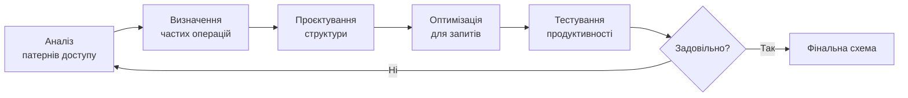
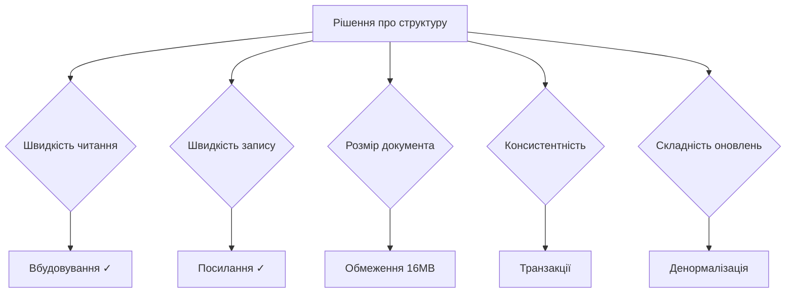
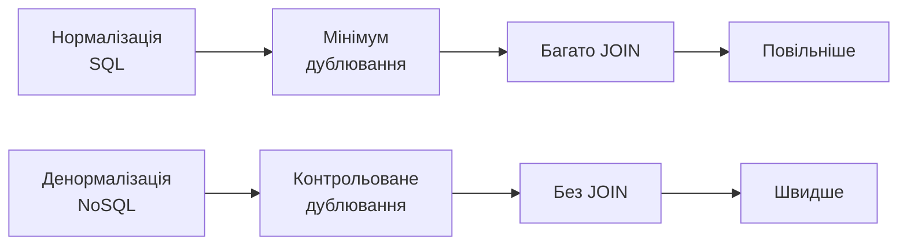
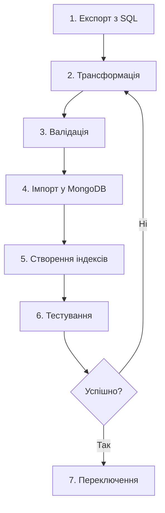

# Презентація 13. Проєктування NoSQL схем

## План презентації

1. Принципи моделювання даних у NoSQL
2. Embedded vs Referenced підходи
3. Денормалізація як парадигма
4. Міграція з реляційних схем
5. Паттерни проєктування

---

## **💡 Нова парадигма проєктування**

**Головна відмінність від реляційних БД**

### 🔄 **Зміна мислення:**

**Реляційні БД:**
- Проєктуємо схему → Пишемо запити
- Нормалізація - золотий стандарт
- Уникаємо дублювання даних
- JOIN для об'єднання таблиць

**NoSQL БД:**
- Аналізуємо запити → Проєктуємо схему
- Денормалізація - часто оптимальна
- Дублювання для продуктивності
- Вбудовування замість JOIN

---

## Фундаментальний принцип



**Ключова ідея:**
> Дані структуруються так, як додаток їх використовує

---

## **1. Принципи моделювання NoSQL**

## Орієнтація на запити

### 📊 **Реляційна модель:**

```sql
-- Нормалізована структура
CREATE TABLE students (
    student_id INT PRIMARY KEY,
    name VARCHAR(100),
    email VARCHAR(100)
);

CREATE TABLE addresses (
    address_id INT PRIMARY KEY,
    student_id INT,
    street VARCHAR(200),
    city VARCHAR(100)
);

CREATE TABLE courses (
    course_id INT PRIMARY KEY,
    course_name VARCHAR(100)
);

CREATE TABLE enrollments (
    student_id INT,
    course_id INT,
    grade VARCHAR(2)
);
```

**Проблема:** 3 JOIN для отримання даних студента!

---

## NoSQL модель

### 📄 **Документо-орієнтований підхід:**

```javascript
// Всі дані студента в одному документі
{
    "_id": ObjectId("..."),
    "student_id": "S2024001",
    "name": "Іван Петров",
    "email": "ivan@university.edu.ua",

    // Вбудована адреса
    "address": {
        "street": "вул. Хрещатик, 15",
        "city": "Київ",
        "postal_code": "01001"
    },

    // Вбудовані курси
    "courses": [
        {
            "course_id": "CS301",
            "name": "Бази даних",
            "grade": "A",
            "credits": 6
        },
        {
            "course_id": "CS302",
            "name": "Алгоритми",
            "grade": "B+",
            "credits": 5
        }
    ]
}
```

**Переваги:** 1 запит отримує ВСІ дані!

---

## Аналіз патернів доступу

### 🎯 **Матриця операцій:**

| Операція | Частота | Тип | Дані |
|----------|---------|-----|------|
| Профіль студента + курси | 1000/хв | Read | student, courses |
| Список курсів | 500/хв | Read | courses |
| Зарахування на курс | 100/хв | Write | enrollments |
| Оновлення оцінки | 50/хв | Write | enrollments |
| Створення курсу | 2/день | Write | courses |

**Висновок:** Оптимізуємо для читання профілю!

---

## Компроміси проєктування

### ⚖️ **Ключові фактори:**



**Головні питання:**
- Як часто читаємо vs пишемо?
- Скільки даних може бути?
- Чи змінюються дані разом?
- Наскільки критична консистентність?

---

## **2. Embedded vs Referenced**

## Вбудовування (Embedding)

### 📦 **Коли використовувати:**

**Ідеальні сценарії:**
- Дані завжди використовуються разом
- Зв'язок "один-до-небагатьох" (до 100-200 елементів)
- Дані рідко змінюються незалежно
- Потрібна атомарність операцій

```javascript
// Замовлення з позиціями (завжди разом)
{
    "order_id": "ORD001",
    "customer_id": "C001",
    "order_date": ISODate("2024-10-15"),

    // Вбудовуємо позиції замовлення
    "items": [
        {
            "product_id": "P001",
            "product_name": "Ноутбук Dell XPS 15",
            "quantity": 1,
            "unit_price": 45000,
            "subtotal": 45000
        },
        {
            "product_id": "P002",
            "product_name": "Миша Logitech",
            "quantity": 1,
            "unit_price": 2500,
            "subtotal": 2500
        }
    ],

    "total_amount": 47500
}
```

---

## Переваги вбудовування

### ✅ **Продуктивність:**

```javascript
// Один запит для всього
const order = db.orders.findOne({ order_id: "ORD001" })

// У реляційній БД потрібно:
// 1. SELECT * FROM orders WHERE order_id = 'ORD001'
// 2. SELECT * FROM order_items WHERE order_id = 'ORD001'
// Або JOIN з можливими проблемами продуктивності
```

**Переваги:**
- ⚡ Швидше читання (1 запит)
- 🔒 Атомарні оновлення
- 💾 Локальність даних
- 🎯 Простіша модель

**Недоліки:**
- 📏 Обмеження розміру (16MB)
- 🔄 Складність оновлень
- 💾 Можливе дублювання

---

## Посилання (Referencing)

### 🔗 **Коли використовувати:**

**Ідеальні сценарії:**
- Дані використовуються незалежно
- Зв'язок "багато-до-багатьох"
- Великі або необмежені колекції
- Дані часто змінюються

```javascript
// Колекція users
{
    "_id": ObjectId("..."),
    "user_id": "U001",
    "name": "Іван Петров",
    "email": "ivan@example.com",
    "created_at": ISODate("2024-01-15")
}

// Колекція posts (посилання на автора)
{
    "_id": ObjectId("..."),
    "post_id": "P001",
    "title": "Мій перший пост",
    "author_id": "U001",  // Посилання
    "content": "...",
    "created_at": ISODate("2024-10-15")
}

// Колекція comments (посилання на пост і автора)
{
    "_id": ObjectId("..."),
    "comment_id": "C001",
    "post_id": "P001",    // Посилання
    "author_id": "U002",  // Посилання
    "text": "Відмінний пост!",
    "created_at": ISODate("2024-10-16")
}
```

---

## Отримання даних з посиланнями

### 🔍 **Використання $lookup:**

```javascript
// Aggregation pipeline для JOIN
db.posts.aggregate([
    { $match: { post_id: "P001" } },

    // JOIN з користувачами
    {
        $lookup: {
            from: "users",
            localField: "author_id",
            foreignField: "user_id",
            as: "author"
        }
    },
    { $unwind: "$author" },

    // JOIN з коментарями
    {
        $lookup: {
            from: "comments",
            localField: "post_id",
            foreignField: "post_id",
            as: "comments"
        }
    },

    // Форматування
    {
        $project: {
            title: 1,
            content: 1,
            "author.name": 1,
            "author.email": 1,
            comments: 1
        }
    }
])
```

---

## Гібридний підхід

### 🎭 **Найкраще з обох світів:**

```javascript
// Вбудовуємо базову інформацію + зберігаємо посилання
{
    "post_id": "P001",
    "title": "Вступ до NoSQL",

    // Денормалізована інформація про автора
    "author": {
        "user_id": "U001",
        "name": "Іван Петров",
        "avatar_url": "https://example.com/avatar.jpg"
    },

    // Посилання для повної інформації
    "author_id": "U001",

    "content": "...",

    // Останні 5 коментарів для швидкого відображення
    "recent_comments": [
        {
            "comment_id": "C001",
            "author_name": "Марія К.",
            "text": "Відмінна стаття!",
            "created_at": ISODate("2024-10-16")
        }
    ],

    // Посилання для всіх коментарів
    "total_comments": 47
}
```

**Переваги:**
- Швидке читання (основні дані в одному документі)
- Актуальна повна інформація (через посилання)
- Компактність (тільки найважливіше вбудоване)

---

## Критерії вибору підходу

### 📋 **Таблиця рішень:**

| Критерій | Embedding | Referencing | Гібрид |
|----------|-----------|-------------|--------|
| **Частота спільного використання** | Завжди | Рідко | Часто |
| **Розмір даних** | <16MB | Без обмежень | <16MB |
| **Частота оновлень** | Рідко | Часто | Змішана |
| **Незалежність даних** | Ні | Так | Частково |
| **Атомарність** | Так | Ні | Частково |
| **Продуктивність читання** | ⭐⭐⭐ | ⭐ | ⭐⭐ |
| **Складність оновлень** | ⭐ | ⭐⭐⭐ | ⭐⭐ |

---

## **3. Денормалізація як парадигма**

## Філософія денормалізації

### 💾 **Диски дешеві, час дорогий:**



**Ключова ідея:**
- Дублювання даних ОК, якщо це покращує продуктивність
- Диск дешевший за CPU та мережу
- Оптимізуємо для читання

---

## Рівні денормалізації

### 📊 **Від мінімальної до агресивної:**

```javascript
// Рівень 0: Повна нормалізація (як у SQL)
// Колекція posts
{ "post_id": "P001", "author_id": "U001" }

// Колекція users
{ "user_id": "U001", "name": "Іван" }

// Рівень 1: Базова денормалізація
{
    "post_id": "P001",
    "author_id": "U001",
    "author_name": "Іван"  // Дублювання
}

// Рівень 2: Часткова денормалізація
{
    "post_id": "P001",
    "author": {
        "user_id": "U001",
        "name": "Іван",
        "avatar": "..."
    }
}

// Рівень 3: Агресивна денормалізація
{
    "post_id": "P001",
    "author": { /* повна інформація */ },
    "recent_comments": [ /* останні 10 */ ],
    "related_posts": [ /* схожі пости */ ]
}
```

---

## Стратегії консистентності

### 🔄 **Підтримка узгодженості:**

**Стратегія 1: Eventual Consistency**

```javascript
// Оновлення профілю користувача
async function updateUserProfile(userId, updates) {
    // 1. Оновлюємо головний документ
    await db.users.updateOne(
        { user_id: userId },
        { $set: updates }
    )

    // 2. Асинхронно оновлюємо денормалізовані копії
    // (може виконуватися у фоні)
    setTimeout(async () => {
        await db.posts.updateMany(
            { "author.user_id": userId },
            {
                $set: {
                    "author.name": updates.name,
                    "author.avatar": updates.avatar
                }
            }
        )
    }, 0)
}
```

**Переваги:** Швидке оновлення
**Недоліки:** Тимчасова неконсистентність

---

## Версіонування даних

### 🏷️ **Відстеження актуальності:**

```javascript
// Додаємо версію до денормалізованих даних
{
    "post_id": "P001",
    "author": {
        "user_id": "U001",
        "name": "Іван Петров",
        "avatar": "...",
        "version": 5  // Версія профілю
    }
}

// При читанні перевіряємо актуальність
async function getPost(postId) {
    const post = await db.posts.findOne({ post_id: postId })
    const author = await db.users.findOne(
        { user_id: post.author.user_id },
        { projection: { version: 1, name: 1, avatar: 1 } }
    )

    // Якщо версії не співпадають - оновлюємо
    if (post.author.version < author.version) {
        await db.posts.updateOne(
            { post_id: postId },
            {
                $set: {
                    "author.name": author.name,
                    "author.avatar": author.avatar,
                    "author.version": author.version
                }
            }
        )
        post.author = author
    }

    return post
}
```

---

## Append-Only підхід

### 📝 **Історія змін:**

```javascript
// Замість оновлення - додаємо нову версію
{
    "user_id": "U001",
    "profile_history": [
        {
            "version": 1,
            "name": "Іван Петров",
            "avatar": "avatar1.jpg",
            "valid_from": ISODate("2024-01-01"),
            "valid_to": ISODate("2024-06-01")
        },
        {
            "version": 2,
            "name": "Іван В. Петров",
            "avatar": "avatar2.jpg",
            "valid_from": ISODate("2024-06-01"),
            "valid_to": null  // Поточна версія
        }
    ]
}

// Отримання актуальної версії
db.users.aggregate([
    { $match: { user_id: "U001" } },
    {
        $project: {
            current: {
                $arrayElemAt: [
                    {
                        $filter: {
                            input: "$profile_history",
                            cond: { $eq: ["$$this.valid_to", null] }
                        }
                    },
                    0
                ]
            }
        }
    }
])
```

---

## Розрахунок вартості

### 💰 **Чи варто денормалізувати?**

```javascript
// Приклад: Соціальна мережа
// 1,000,000 користувачів
// 10,000,000 постів

// Варіант 1: Нормалізація
// users: 1M × 1KB = 1GB
// posts: 10M × 2KB = 20GB
// TOTAL: 21GB

// При перегляді стрічки (100 постів):
// - 1 запит постів
// - До 100 запитів користувачів (або складний $lookup)

// Варіант 2: Денормалізація
// users: 1M × 1KB = 1GB
// posts: 10M × 2.5KB = 25GB (додатково 500 bytes на автора)
// TOTAL: 26GB (+24%)

// При перегляді стрічки:
// - 1 запит (отримує ВСЕ)

// Виграш: Усунення 100 запитів або складного JOIN
// При 1000 переглядів/сек = економія ~100,000 запитів/сек
// Вартість: +5GB диску (~$1/місяць у хмарі)
```

**Висновок:** 24% диску за 100x продуктивність - вигідно!

---

## **4. Міграція реляційних схем**

## Аналіз вихідної схеми

### 🔍 **Реляційна модель e-commerce:**

```sql
-- 7 таблиць з зв'язками
CREATE TABLE users (
    user_id INT PRIMARY KEY,
    email VARCHAR(100),
    name VARCHAR(100)
);

CREATE TABLE addresses (
    address_id INT PRIMARY KEY,
    user_id INT,
    street VARCHAR(200),
    FOREIGN KEY (user_id) REFERENCES users(user_id)
);

CREATE TABLE products (
    product_id INT PRIMARY KEY,
    name VARCHAR(200),
    price DECIMAL(10,2)
);

CREATE TABLE orders (
    order_id INT PRIMARY KEY,
    user_id INT,
    order_date TIMESTAMP,
    FOREIGN KEY (user_id) REFERENCES users(user_id)
);

CREATE TABLE order_items (
    item_id INT PRIMARY KEY,
    order_id INT,
    product_id INT,
    FOREIGN KEY (order_id) REFERENCES orders(order_id)
);
```

---

## Стратегії трансформації

### 🔄 **Один-до-багатьох → Вбудовування:**

```javascript
// Користувач + адреси (SQL: 2 таблиці → MongoDB: 1 документ)
{
    "_id": ObjectId("..."),
    "user_id": "U001",
    "email": "ivan@example.com",
    "name": "Іван Петров",

    // Вбудовуємо адреси (обмежена кількість)
    "addresses": [
        {
            "type": "shipping",
            "street": "вул. Хрещатик, 15",
            "city": "Київ",
            "is_default": true
        },
        {
            "type": "billing",
            "street": "вул. Шевченка, 10",
            "city": "Київ",
            "is_default": false
        }
    ]
}
```

---

## Трансформація замовлень

### 📦 **Денормалізація для історичних даних:**

```javascript
// Замовлення з повною інформацією (фіксується на момент створення)
{
    "_id": ObjectId("..."),
    "order_id": "ORD001",
    "order_date": ISODate("2024-10-15"),

    // Денормалізуємо дані клієнта
    "customer": {
        "user_id": "U001",
        "email": "ivan@example.com",
        "name": "Іван Петров"
    },

    // Вбудовуємо позиції з денормалізацією товарів
    "items": [
        {
            "product_id": "P001",
            "product_name": "Ноутбук Dell XPS 15",  // Фіксуємо назву
            "unit_price": 45000,                     // Фіксуємо ціну
            "quantity": 1,
            "subtotal": 45000
        }
    ],

    // Вбудовуємо адреси (фіксуються)
    "shipping_address": {
        "street": "вул. Хрещатик, 15",
        "city": "Київ"
    },

    "total_amount": 47500,
    "status": "shipped"
}
```

**Чому денормалізуємо:**
- Історичні дані не змінюються
- Потрібна повна інформація на момент замовлення
- Один запит = повний звіт

---

## Процес міграції

### 🚀 **Крок за кроком:**



---

## Код міграції

### 💻 **Node.js скрипт:**

```javascript
const mysql = require('mysql2/promise')
const { MongoClient } = require('mongodb')

async function migrateUsers() {
    // Підключення
    const sqlConn = await mysql.createConnection({
        host: 'localhost',
        user: 'root',
        database: 'ecommerce'
    })

    const mongoClient = await MongoClient.connect('mongodb://localhost:27017')
    const db = mongoClient.db('ecommerce_nosql')

    // Експорт з SQL
    const [users] = await sqlConn.execute(`
        SELECT
            u.*,
            JSON_ARRAYAGG(
                JSON_OBJECT(
                    'type', a.type,
                    'street', a.street,
                    'city', a.city
                )
            ) as addresses
        FROM users u
        LEFT JOIN addresses a ON u.user_id = a.user_id
        GROUP BY u.user_id
    `)

    // Трансформація
    const documents = users.map(user => ({
        user_id: user.user_id,
        email: user.email,
        name: user.name,
        addresses: JSON.parse(user.addresses)
    }))

    // Імпорт у MongoDB
    await db.collection('users').insertMany(documents)

    // Створення індексів
    await db.collection('users').createIndex({ user_id: 1 }, { unique: true })
    await db.collection('users').createIndex({ email: 1 }, { unique: true })

    console.log(`Migrated ${documents.length} users`)
}
```

---

## **5. Паттерни проєктування**

## Паттерн Subset

### 🎯 **Проблема:** Великий документ з багатьма даними

```javascript
// ПОГАНО: Всі 5000 відгуків у документі товару
{
    "product_id": "P001",
    "name": "Ноутбук Dell XPS 15",
    "reviews": [
        // 5000 відгуків × 2KB = 10MB
        { "rating": 5, "comment": "..." },
        // ... 4999 інших
    ]
}

// ДОБРЕ: Subset Pattern
// Основний документ з підмножиною
{
    "product_id": "P001",
    "name": "Ноутбук Dell XPS 15",

    // Тільки останні 10 для швидкого показу
    "recent_reviews": [
        { "rating": 5, "comment": "Відмінно!" },
        // ... тільки 10
    ],

    // Агреговані дані
    "reviews_summary": {
        "total": 5000,
        "avg_rating": 4.6
    }
}

// Окрема колекція для всіх відгуків
// (завантажуються при кліку "Показати всі")
```

---

## Паттерн Computed

### 📊 **Проблема:** Дорогі обчислення при кожному запиті

```javascript
// ПОГАНО: Рахуємо при кожному запиті
db.posts.find({ author_id: "U001" }).count()
db.comments.find({ author_id: "U001" }).count()
// ... і так кожного разу

// ДОБРЕ: Computed Pattern
{
    "user_id": "U001",
    "name": "Іван Петров",

    // Попередньо обчислені метрики
    "computed_stats": {
        "total_posts": 127,
        "total_comments": 543,
        "followers_count": 523,
        "engagement_rate": 3.45,
        "last_computed": ISODate("2024-10-17T14:30:00Z")
    }
}

// Оновлюємо статистику:
// - При кожній дії (синхронно)
// - Через job queue (асинхронно)
// - За розкладом (cron)
// - На вимогу з кешуванням
```

---

## Паттерн Bucket

### 📈 **Проблема:** Мільйони окремих вимірювань

```javascript
// ПОГАНО: 1 документ = 1 вимірювання
// 1 вимірювання/секунду = 86,400 документів/день/сенсор
// 1000 сенсорів = 86,400,000 документів/день
{
    "sensor_id": "TEMP001",
    "timestamp": ISODate("2024-10-17T14:30:00Z"),
    "temperature": 22.5
}

// ДОБРЕ: Bucket Pattern
// 1 документ = 1 година вимірювань
{
    "sensor_id": "TEMP001",
    "bucket_start": ISODate("2024-10-17T14:00:00Z"),

    // 3600 вимірювань за годину
    "measurements": [
        { "offset": 0, "temp": 22.5 },
        { "offset": 1, "temp": 22.6 },
        // ... 3598 інших
    ],

    // Передобчислена статистика
    "summary": {
        "count": 3600,
        "avg": 22.4,
        "min": 21.8,
        "max": 23.2
    }
}

// 1000 сенсорів = тільки 24,000 документів/день (у 3600 разів менше!)
```

---

## Паттерн Schema Versioning

### 🏷️ **Проблема:** Еволюція схеми без міграції

```javascript
// Версія 1: Початкова схема
{
    "user_id": "U001",
    "schema_version": 1,
    "username": "ivanpetrov",
    "email": "ivan@example.com"
}

// Версія 2: Додали структуру name
{
    "user_id": "U002",
    "schema_version": 2,
    "username": "mariakoval",
    "name": {
        "first": "Марія",
        "last": "Коваленко"
    }
}

// Версія 3: Додали налаштування приватності
{
    "user_id": "U003",
    "schema_version": 3,
    "name": { "first": "Олександр", "last": "Сидоров" },
    "privacy": {
        "profile_visible": true,
        "show_email": false
    }
}

// Обробка різних версій
function normalizeUser(user) {
    if (user.schema_version < 3) {
        // Мігруємо до версії 3
        return { ...user, privacy: { /* defaults */ } }
    }
    return user
}
```

---

## Паттерн Polymorphic

### 🎭 **Проблема:** Різні типи в одній колекції

```javascript
// Колекція notifications - різні типи сповіщень

// Тип 1: Новий коментар
{
    "type": "new_comment",
    "user_id": "U001",
    "read": false,
    "post_id": "P123",
    "commenter": "Марія К.",
    "comment_preview": "Відмінна стаття!"
}

// Тип 2: Новий підписник
{
    "type": "new_follower",
    "user_id": "U001",
    "read": false,
    "follower": {
        "user_id": "U002",
        "username": "alexsid"
    }
}

// Тип 3: Системне повідомлення
{
    "type": "system",
    "user_id": "U001",
    "read": false,
    "title": "Нові функції",
    "message": "Ми додали...",
    "priority": "medium"
}

// Обробка на клієнті
switch(notification.type) {
    case 'new_comment': // render comment notification
    case 'new_follower': // render follower notification
    case 'system': // render system notification
}
```

---

## Паттерн Extended Reference

### 🔗 **Проблема:** Посилання без lookup'ів

```javascript
// ПОГАНО: Тільки ID
{
    "order_id": "ORD001",
    "customer_id": "U001"  // Потрібен lookup
}

// ДОБРЕ: Extended Reference
{
    "order_id": "ORD001",

    // Включаємо ключову інформацію
    "customer": {
        "user_id": "U001",
        "username": "ivanpetrov",
        "email": "ivan@example.com",
        "tier": "premium",        // Для фільтрації
        "verified": true
    }
}

// Переваги:
// 1. Швидке відображення без lookup
// 2. Можливість фільтрувати за tier клієнта
// 3. Критична інформація завжди доступна

// Знайти всі замовлення преміум клієнтів
db.orders.find({ "customer.tier": "premium" })
```

---

## Матриця паттернів

| Паттерн | Проблема | Рішення | Коли використовувати |
|---------|----------|---------|---------------------|
| **Subset** | Великі масиви | Підмножина + повна копія | Коментарі, логи, історія |
| **Computed** | Дорогі обчислення | Передобчислені метрики | Статистика, лічильники |
| **Bucket** | Багато малих docs | Групування в bucket | IoT, метрики, логи |
| **Schema Versioning** | Зміна схеми | Версії в документі | Еволюція моделі |
| **Polymorphic** | Різні типи | Поле type | Сповіщення, події |
| **Extended Reference** | Багато lookup'ів | ID + ключові поля | Часті запити |

---

## Практичні рекомендації

### 💡 **Best Practices:**

**1. Почніть з аналізу:**
- Документуйте ТОП-10 запитів
- Вимірюйте частоту операцій
- Визначте критичні для продуктивності

**2. Ітеративний підхід:**
- Почніть з простої схеми
- Тестуйте на реальних даних
- Оптимізуйте вузькі місця

**3. Моніторинг:**
- Відстежуйте розмір документів
- Аналізуйте повільні запити
- Перевіряйте використання індексів

**4. Баланс:**
- Не денормалізуйте все підряд
- Не оптимізуйте передчасно
- Вимірюйте перед зміною

---

## Анти-паттерни

### ❌ **Чого уникати:**

**1. Необмежені масиви:**
```javascript
// ПОГАНО
{
    "post_id": "P001",
    "all_likes": [
        // Може бути 1,000,000 лайків!
        "U001", "U002", /* ... */
    ]
}

// ДОБРЕ
{
    "post_id": "P001",
    "likes_count": 1000000,  // Лічильник
    "liked_by_current_user": true
}
```

---

## Анти-паттерни (продовження)

**2. Масивні вкладені структури:**
```javascript
// ПОГАНО: Глибока вкладеність
{
    "university": {
        "faculties": [
            {
                "departments": [
                    {
                        "courses": [
                            {
                                "students": [ /* ... */ ]
                            }
                        ]
                    }
                ]
            }
        ]
    }
}

// ДОБРЕ: Окремі колекції з посиланнями
```

**3. Надмірна денормалізація:**
```javascript
// ПОГАНО: Дублюємо ВСЕ
{
    "order_id": "ORD001",
    "customer": { /* 50 полів користувача */ }
}

// ДОБРЕ: Тільки необхідне
{
    "order_id": "ORD001",
    "customer": { "id": "U001", "name": "Іван", "email": "..." }
}
```

---

## Контрольний список

### ✅ **Перевірте перед запуском:**

**Структура:**
- [ ] Розмір документів < 16MB
- [ ] Масиви обмежені (< 200-300 елементів)
- [ ] Вкладеність < 4 рівнів
- [ ] Валідація схеми налаштована

**Продуктивність:**
- [ ] Індекси для частих запитів
- [ ] Тестування на реальних обсягах
- [ ] Швидкість критичних операцій < 100ms
- [ ] Розмір робочого набору (working set) в RAM

**Підтримка:**
- [ ] Стратегія консистентності визначена
- [ ] Версіонування схеми продумане
- [ ] Моніторинг налаштований
- [ ] Процес міграції документований

---

## Порівняння підходів

| Аспект | SQL | MongoDB NoSQL |
|--------|-----|---------------|
| **Проєктування** | Схема → Запити | Запити → Схема |
| **Нормалізація** | Обов'язкова | Опціональна |
| **Дублювання** | Мінімальне | Контрольоване |
| **JOIN** | Стандартний | $lookup або вбудовування |
| **Гнучкість** | Низька | Висока |
| **Консистентність** | Сильна | Налаштовувана |
| **Масштабування** | Вертикальне | Горизонтальне |
| **Швидкість змін** | Повільна | Швидка |

---

## Висновки

### 🎯 **Ключові принципи NoSQL проєктування:**

**Орієнтація на запити:**
- Схема слідує за використанням
- Аналізуйте патерни перед проєктуванням
- Оптимізуйте для частих операцій

**Вбудовування vs Посилання:**
- Вбудовуйте для спільного використання
- Посилайтесь для незалежних даних
- Гібридний підхід - найчастіше оптимальний

**Денормалізація:**
- Дублювання для продуктивності - нормально
- Плануйте стратегію консистентності
- Розраховуйте вартість vs виграш

**Паттерни:**
- Використовуйте перевірені рішення
- Адаптуйте під свій випадок
- Уникайте анти-паттернів
