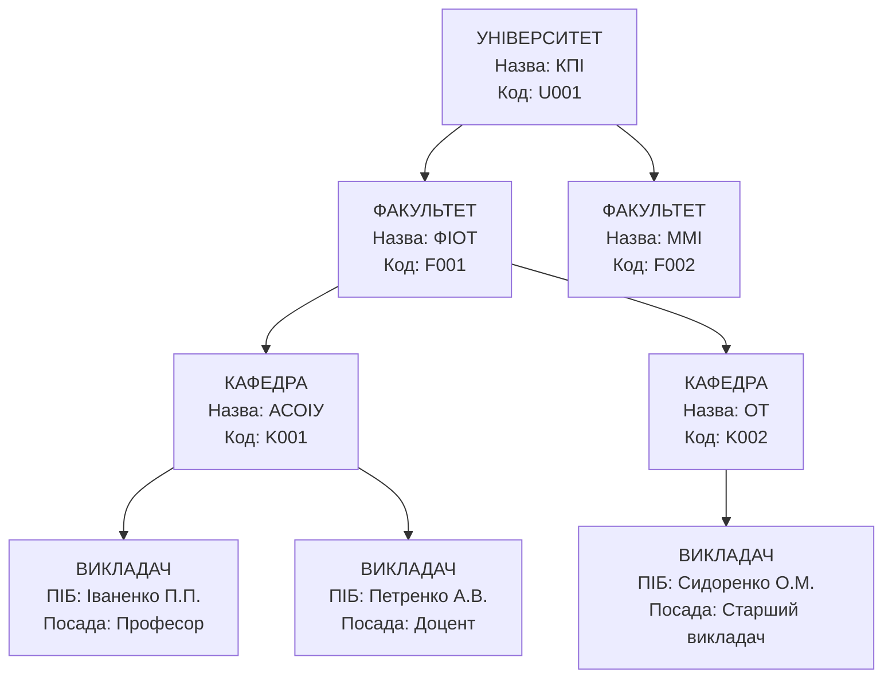
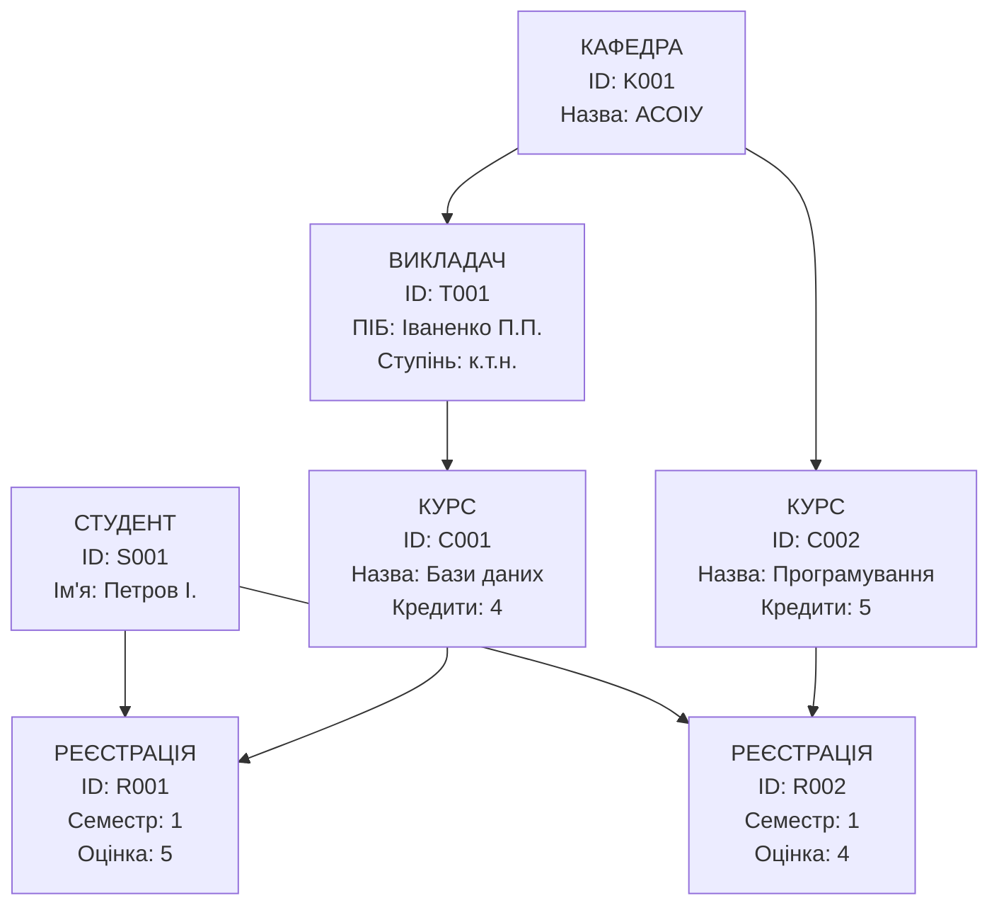
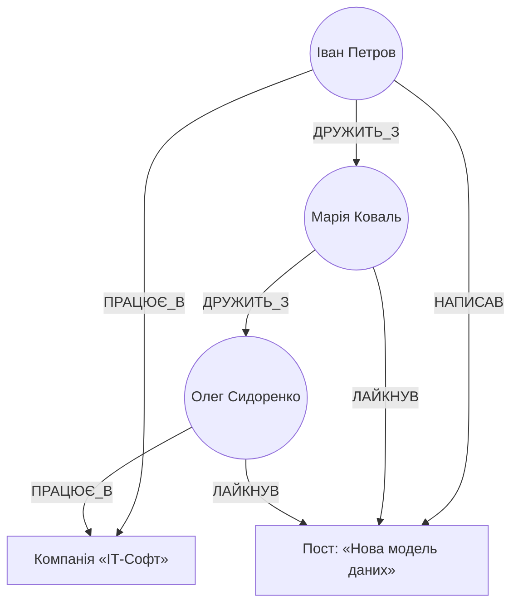
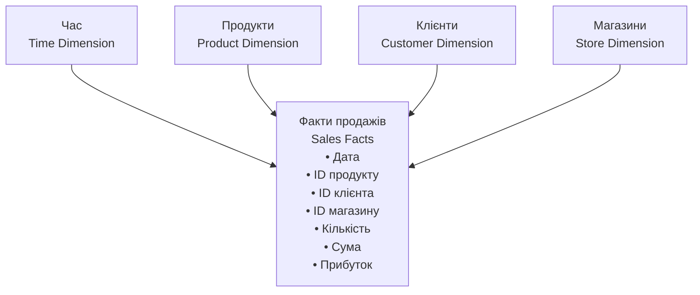
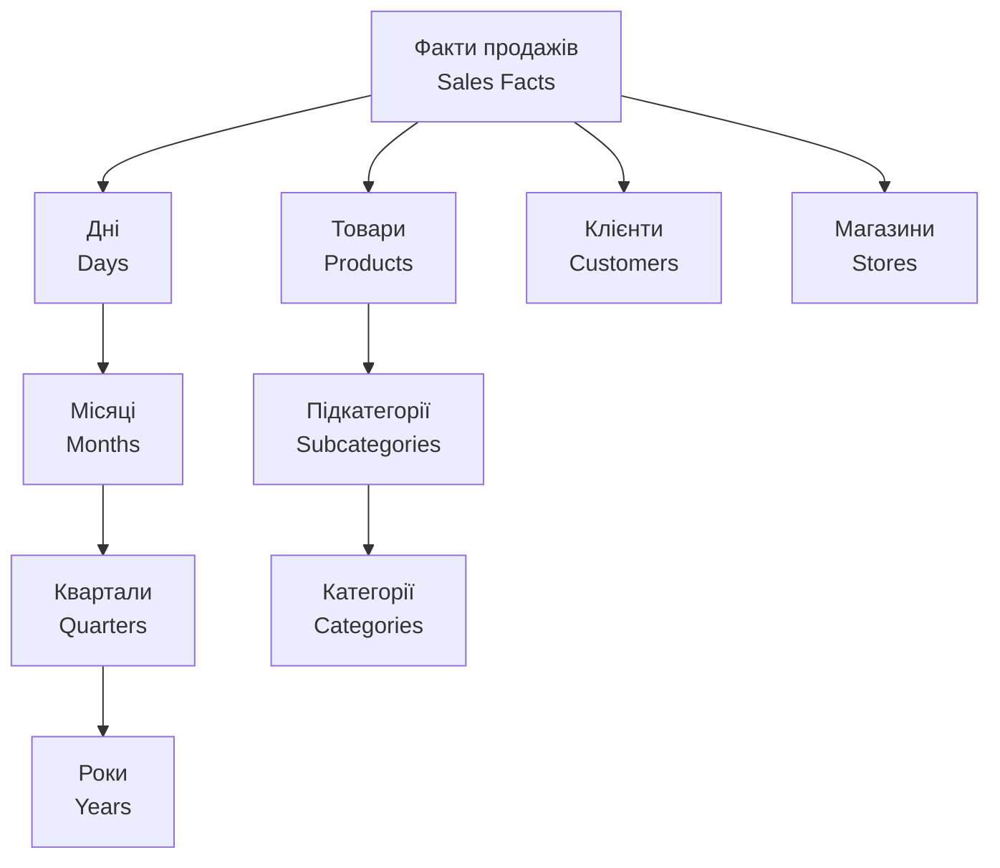

# Лекція 02 Моделі представлення даних

## Вступ

У попередній лекції ми розглянули, з яких етапів складається життєвий цикл бази даних і чому проєктування починається не з таблиць, а з моделі предметної області. Тепер настав час розібратися, що таке модель даних як інструмент, і чому за понад пів століття розвитку СУБД зʼявилося не одне, а кілька принципово різних рішень цього завдання.

**Модель даних** — це абстрактний інструмент для опису об'єктів реального світу за допомогою понять, зрозумілих комп'ютеру. Будь-яка модель даних складається з трьох компонентів:

- **Структурний компонент** — визначає, як організовані дані: у вигляді таблиць, дерев, графів тощо.
- **Маніпуляційний компонент** — описує, які операції можна виконувати над даними (вибірка, вставка, оновлення, видалення).
- **Цілісний компонент** — встановлює правила та обмеження, що гарантують коректність даних.

Модель даних — це рівень абстракції між тим, як людина мислить про предметну область, і тим, як дані фізично зберігаються на диску. Чим краще модель узгоджена з природою даних і з типовими запитами до них, тим простіше проєктувати систему, тим ефективніше вона працює і тим менше «магії» доводиться закладати в прикладний код. Саме тому вибір моделі — це не формальність, а одне з ключових архітектурних рішень, наслідки якого система відчуватиме роками.

Історично моделі даних з'являлися як відповідь на обмеження попередників. Ієрархічна модель розв'язала завдання структурованого зберігання, мережева — завдання складних зв'язків, реляційна — завдання математичної строгості й незалежності від фізичного зберігання, об'єктна — завдання інтеграції з мовами програмування, документна й графова — завдання гнучкості схеми та складних взаємозв'язків, а векторна, що набула масового поширення буквально останніми роками, — завдання пошуку не за точним збігом, а за змістовою подібністю. У цій лекції ми пройдемо цей шлях послідовно: від найстаріших навігаційних моделей до вимог сучасних аналітичних та AI-орієнтованих систем, і завершимо практичними критеріями, за якими можна свідомо обирати модель під конкретний проєкт — тема, яка безпосередньо готує ґрунт для детального розгляду реляційної моделі в наступній лекції.

## Концептуальні моделі даних

### Ієрархічна модель

Ієрархічна модель була однією з перших спроб структуризації даних на логічному рівні — вона з'явилася у 1960-х роках разом із системою IBM IMS, яка й досі використовується в деяких банківських мейнфреймах. Модель організовує дані у вигляді дерева, де кожен елемент (вузол) може мати декілька нащадків, але лише одного батька. Така структура природно відображає багато реальних ситуацій: організаційні структури компаній, класифікацію товарів, географічні поділи тощо.

#### Основні характеристики ієрархічної моделі

**Структура дерева.** Дані організовані у вигляді перевернутого дерева з кореневим сегментом на вершині. Кожен сегмент відповідає типу запису, а кожен екземпляр сегмента — конкретному запису.

**Зв'язки типу «один-до-багатьох».** Один батьківський запис може мати багато дочірніх записів, але кожен дочірній запис має рівно одного батька. Це створює природну ієрархію залежностей.

**Навігаційний доступ.** Щоб дістатися конкретного запису, потрібно пройти шлях від кореня дерева через усі проміжні рівні. Це забезпечує передбачуваність доступу, але може бути неефективним для складних запитів, що не збігаються із заздалегідь визначеними шляхами.

**Фізична близькість.** Пов'язані записи часто зберігаються фізично поруч на носії, що забезпечує швидкий послідовний доступ до всієї ієрархії — саме за це ієрархічну модель цінували в епоху, коли оперативна пам'ять була дефіцитним ресурсом, а диски — повільними.

#### Приклад ієрархічної структури



У цій структурі, щоб отримати інформацію про викладача Іваненка, потрібно пройти шлях: Університет → Факультет ФІОТ → Кафедра АСОІУ → Викладач Іваненко. Саме цей принцип — доступ лише через заздалегідь визначений шлях — і є одночасно головною перевагою (швидкодія) та головним обмеженням (негнучкість) моделі.

#### Переваги ієрархічної моделі

- **Швидкодія.** Навігація по заздалегідь визначених шляхах виконується дуже швидко, оскільки фізичне розміщення даних оптимізоване саме під такі операції.
- **Природність.** Багато предметних областей мають природну ієрархічну структуру, яка легко відображається в цій моделі.
- **Простота розуміння.** Деревоподібна структура інтуїтивно зрозуміла користувачам та розробникам.
- **Ефективність зберігання.** Відсутність складних зв'язків дозволяє компактно зберігати дані.
- **Цілісність.** Зв'язки «батько — дочірній елемент» автоматично забезпечують посилальну цілісність.

#### Недоліки ієрархічної моделі

- **Обмежена гнучкість.** Складно або неможливо представити зв'язки «багато-до-багатьох» і «багато-до-одного», що не вкладаються в ієрархію.
- **Дублювання даних.** Якщо запис повинен бути доступний через різні шляхи, його доводиться дублювати в різних гілках дерева.
- **Складність реструктуризації.** Зміна ієрархії вимагає повної перебудови бази даних і модифікації всіх програм, що з нею працюють.
- **Залежність від фізичної структури.** Програми повинні знати точні шляхи доступу до даних, що створює тісну залежність між логікою застосунку та організацією даних.

#### Області застосування

Попри свій вік, ієрархічна модель залишається актуальною там, де дані мають природну деревоподібну структуру:

- файлові системи операційних систем;
- організаційні структури підприємств;
- каталоги товарів та послуг;
- географічні класифікатори (країна → область → місто);
- XML-документи та веб-структури, які ми детальніше розглянемо далі в цій лекції.

### Мережева модель

Мережева модель виникла в 1970-х роках (стандарт CODASYL) як розширення ієрархічної моделі — спроба подолати її головне обмеження: неможливість ефективно представляти складні зв'язки. Вона дозволяє кожному запису мати кілька батьківських записів, утворюючи мережеву (графову) структуру зв'язків, а не жорстке дерево.

#### Основні характеристики мережевої моделі

**Графова структура.** Дані організовані у вигляді спрямованого графа, де вузли представляють типи записів, а ребра — зв'язки між ними.

**Набори (sets).** Зв'язки між записами організовані у вигляді наборів: кожен набір містить один тип власника (owner) та один або кілька типів членів (members).

**Багатобатьківські зв'язки.** На відміну від ієрархічної моделі, запис може бути членом кількох наборів одночасно, що дозволяє моделювати складні зв'язки типу «багато-до-багатьох».

**Навігаційний доступ.** Як і в ієрархічній моделі, доступ до даних здійснюється через навігацію по зв'язках, але можливих шляхів значно більше, а отже — і гнучкість запитів вища.

#### Приклад мережевої структури



У цій структурі студент може бути зареєстрований на кілька курсів, курс може викладати кілька викладачів, а викладач може працювати на кількох кафедрах — тобто саме ті ситуації, які ієрархічна модель могла представити лише через дублювання записів.

#### Переваги мережевої моделі

- **Гнучкість моделювання.** Можливість представлення зв'язків «багато-до-багатьох» робить модель значно універсальнішою за ієрархічну.
- **Ефективність зв'язків.** Фізичні покажчики забезпечують швидкий перехід між пов'язаними записами.
- **Менше дублювання.** Порівняно з ієрархічною моделлю дані дублюються значно рідше.
- **Підтримка складних структур.** Можливість моделювання предметних областей із багатьма перехресними зв'язками.

#### Недоліки мережевої моделі

- **Складність програмування.** Розробникам необхідно детально знати структуру мережі та писати навігаційний код для доступу до даних.
- **Відсутність стандартів.** На відміну від SQL для реляційних баз даних, для мережевих СУБД не існувало єдиного загальновизнаного стандарту запитів.
- **Складність адміністрування.** Управління складними мережевими структурами вимагає високої кваліфікації адміністраторів.
- **Залежність від фізичної структури.** Зміни в структурі мережі можуть вплинути на всі програми, що працюють із базою даних.
- **Проблема цілісності.** Забезпечити посилальну цілісність у мережі складніше, ніж у дереві.

Мережева модель у своєму класичному, «CODASYL»-вигляді практично вийшла з ужитку разом із витісненням реляційними СУБД у 1980–1990-х. Але сама ідея — представляти предметну область як граф із вузлами та зв'язками, а не як жорстку ієрархію чи набір таблиць — не зникла, а натомість пережила друге народження в сучасних графових базах даних, до яких ми зараз і перейдемо.

### Графова модель даних

**Графова модель даних** — це прямий концептуальний нащадок мережевої моделі, який набув масового практичного застосування у 2010–2020-х роках разом із появою таких СУБД, як Neo4j, Amazon Neptune та ArangoDB. Якщо мережева модель була навігаційною й жорстко прив'язаною до фізичних покажчиків, то сучасна графова модель поєднує ту саму ідею «вузли + зв'язки» з декларативними мовами запитів (Cypher, Gremlin, SQL/PGQ) і сучасними гарантіями цілісності.

#### Основні поняття графової моделі

**Вузол (node)** — представляє сутність предметної області (людину, продукт, локацію) і може мати довільний набір властивостей (пари «ключ-значення»).

**Зв'язок (relationship, edge)** — представляє відношення між двома вузлами, завжди має напрямок і тип, а також, як і вузол, може мати власні властивості (наприклад, зв'язок «ДРУЖИТЬ_З» може мати властивість «з якого року»).

**Мітка (label)** — категорія, до якої належить вузол чи зв'язок (наприклад, `Студент`, `Курс`, `ЗАПИСАНИЙ_НА`), яка й визначає, за яким «типом» можна швидко знаходити потрібні вузли.

На відміну від реляційної моделі, де зв'язок між таблицями обчислюється під час виконання запиту через `JOIN` за значенням зовнішнього ключа, у графовій моделі зв'язок — це фізично збережений об'єкт першого класу з прямим покажчиком між вузлами. Це принципова відмінність: перехід по зв'язку в графовій БД — це операція з приблизно постійним часом виконання незалежно від загального обсягу даних, тоді як вартість `JOIN` у реляційній СУБД зростає з розміром таблиць.

#### Приклад графової структури



Такий запит, як «знайти друзів друзів Івана, які працюють у тій самій компанії, що й він», у реляційній моделі вимагав би кількох каскадних `JOIN` таблиці «дружба» самої із собою — операції, яка стає все повільнішою зі зростанням мережі. У графовій моделі це природний «обхід графа» (graph traversal), швидкість якого практично не залежить від загального розміру бази.

#### Приклад запиту мовою Cypher (Neo4j)

```cypher
// Знайти друзів друзів Івана, які працюють у тій самій компанії
MATCH (ivan:Особа {name: 'Іван Петров'})-[:ПРАЦЮЄ_В]->(company:Компанія)
MATCH (ivan)-[:ДРУЖИТЬ_З]->(:Особа)-[:ДРУЖИТЬ_З]->(candidate:Особа)
MATCH (candidate)-[:ПРАЦЮЄ_В]->(company)
WHERE candidate <> ivan
RETURN DISTINCT candidate.name
```

#### Переваги графової моделі

- **Природність для зв'язних даних.** Соціальні мережі, рекомендаційні системи, аналіз шахрайства, керування знаннями (knowledge graphs) — усі ці задачі про зв'язки «за визначенням», і граф відображає їхню структуру напряму, без штучних таблиць-посередників.
- **Швидкість обходу зв'язків.** Перехід по зв'язку — операція сталої складності, тому запити з багатьма рівнями вкладеності (друзі друзів, ланцюжки постачання) виконуються значно швидше, ніж еквівалентні багаторівневі `JOIN`.
- **Гнучкість схеми.** Нові типи вузлів і зв'язків можна додавати без міграції всієї бази, що зручно для предметних областей, які активно еволюціонують.
- **Виразність запитів.** Мови на кшталт Cypher дозволяють описувати шаблони шляхів у графі декларативно й компактно.

#### Недоліки графової моделі

- **Гірша придатність для табличної аналітики.** Масові агрегатні обчислення над однорідними наборами записів (типове завдання OLAP) реляційні й колонкові СУБД зазвичай виконують ефективніше.
- **Молодша екосистема.** Порівняно з SQL інструментарій, стандарти (хоча стандарт SQL/PGQ уже існує) та досвід спільноти для графових СУБД поки що менші.
- **Складність масштабування.** Горизонтальне масштабування графа, у якому всі елементи потенційно пов'язані між собою, — нетривіальне інженерне завдання.

#### Області застосування

Графова модель домінує там, де саме зв'язки, а не окремі записи, несуть основну цінність: соціальні мережі, рекомендаційні системи, виявлення шахрайства у фінансових транзакціях, керування ІТ-інфраструктурою та залежностями, аналіз ланцюгів постачання, а також бази знань (knowledge graphs), які останніми роками активно використовують і для покращення точності відповідей мовних моделей.

### Реляційна модель

Реляційна модель, запропонована Едгаром Коддом у 1970 році, стала революційним кроком у розвитку баз даних. На відміну від навігаційних ієрархічної та мережевої моделей, вона базується на строгій математичній основі — теорії множин і реляційній алгебрі, — що забезпечує їй одночасно концептуальну простоту та обчислювальну потужність. Саме завдяки цій математичній строгості реляційна модель протрималася на вершині популярності понад пів століття і залишається базовою моделлю для переважної більшості нових проєктів; у наступній лекції ми розберемо її математичний апарат і реляційну алгебру детально, а тут зупинимося на основних принципах.

#### Основні принципи реляційної моделі

**Відношення (relations).** Дані організовані у вигляді відношень, які зазвичай представляють як таблиці. Кожне відношення має ім'я та складається з атрибутів (стовпців) і кортежів (рядків).

**Атомарність значень.** Кожна комірка таблиці містить атомарне (неподільне) значення. У полі не можна зберігати список значень чи складну структуру — саме ця вимога, до речі, і породила потребу в семіструктурованих та документних моделях там, де дані природно вкладені одне в одне.

**Унікальність кортежів.** Кожен рядок відношення повинен бути унікальним. Це забезпечується первинним ключем — атрибутом або комбінацією атрибутів, що однозначно ідентифікує кожен кортеж.

**Невпорядкованість.** Рядки та стовпці в таблиці не мають визначеного порядку. Результат запиту може повертати дані в будь-якій послідовності, якщо не вказано явне сортування.

#### Ключові поняття реляційної моделі

**Домен** — множина допустимих значень для атрибута. Наприклад, домен для атрибута «вік» може бути множиною цілих чисел від 0 до 150.

**Кортеж** — упорядкований набір значень атрибутів, що відповідає одному рядку таблиці.

**Відношення** — множина кортежів з однаковою структурою атрибутів.

**Схема відношення** — опис структури відношення, що включає назви атрибутів та їхні домени.

#### Приклад реляційної структури

```sql
-- Таблиця студентів
CREATE TABLE students (
    student_id INT PRIMARY KEY,
    first_name VARCHAR(50) NOT NULL,
    last_name VARCHAR(50) NOT NULL,
    group_name VARCHAR(10),
    birth_date DATE,
    email VARCHAR(100) UNIQUE
);

-- Таблиця курсів
CREATE TABLE courses (
    course_id INT PRIMARY KEY,
    course_name VARCHAR(100) NOT NULL,
    credits INT CHECK (credits > 0),
    teacher_name VARCHAR(100)
);

-- Таблиця реєстрацій (зв'язок багато-до-багатьох)
CREATE TABLE enrollments (
    student_id INT,
    course_id INT,
    enrollment_date DATE DEFAULT CURRENT_DATE,
    grade DECIMAL(3,2),
    PRIMARY KEY (student_id, course_id),
    FOREIGN KEY (student_id) REFERENCES students(student_id),
    FOREIGN KEY (course_id) REFERENCES courses(course_id)
);
```

#### Переваги реляційної моделі

- **Математична строгість.** Реляційна алгебра забезпечує теоретичну основу для операцій з даними, що гарантує коректність і передбачуваність результатів.
- **Незалежність даних.** Логічна структура даних не залежить від фізичного способу їх зберігання, тож фізичну організацію можна змінювати без впливу на програми.
- **Декларативність.** Мова SQL дозволяє описувати, які дані потрібні, не вказуючи, як саме їх отримати. Оптимізатор запитів самостійно визначає найефективніший спосіб виконання.
- **Гнучкість.** Можливість створювати довільні зв'язки між таблицями через зовнішні ключі та об'єднання.
- **Стандартизація.** SQL є міжнародним стандартом, що забезпечує переносимість між різними СУБД.
- **Цілісність даних.** Вбудовані механізми забезпечення посилальної цілісності, обмежень домену та бізнес-правил.

#### Недоліки реляційної моделі

- **Об'єктно-реляційний розрив.** Складність відображення об'єктно-орієнтованих структур програми в реляційні таблиці.
- **Обмеження при роботі з ієрархіями та мережами зв'язків.** Представлення деревоподібних чи щільно зв'язаних структур вимагає складних запитів або додаткових таблиць — саме тут графова модель почувається природніше.
- **Продуктивність складних запитів.** Об'єднання великої кількості таблиць може бути ресурсозатратним.
- **Жорсткість схеми.** Зміна структури таблиць може бути складною операцією в робочих (production) системах з великим обсягом даних.

#### Області застосування

Реляційна модель найкраще підходить для:

- транзакційних систем (OLTP);
- фінансових застосунків;
- систем управління ресурсами підприємства (ERP);
- систем управління взаємовідносинами з клієнтами (CRM);
- вебзастосунків зі структурованими даними.

## Об'єктно-орієнтовані та об'єктно-реляційні розширення

### Об'єктно-орієнтована модель

Об'єктно-орієнтована модель даних виникла в 1980-х роках як відповідь на потреби розробників, які працювали з об'єктно-орієнтованими мовами програмування. Головна ідея полягала в тому, щоб зберігати дані в тому ж вигляді, в якому вони існують у програмі, — як об'єкти з властивостями та методами, — і таким чином позбутися постійного «перекладання» між реляційними таблицями та об'єктами мови програмування.

#### Основні принципи об'єктно-орієнтованої моделі

**Інкапсуляція.** Об'єкт поєднує в собі дані (атрибути) та код, який їх обробляє (методи). Це забезпечує цілісність об'єкта та приховує деталі реалізації.

**Успадкування.** Можливість створювати нові типи об'єктів на основі наявних, успадковуючи їхні властивості та поведінку. Це забезпечує повторне використання коду та створення ієрархій типів.

**Поліморфізм.** Один інтерфейс може мати різні реалізації залежно від типу об'єкта. Це дозволяє писати гнучкий код, який працює з об'єктами різних типів.

**Ідентичність об'єктів.** Кожен об'єкт має унікальний ідентифікатор (OID), який не залежить від значень його атрибутів.

#### Переваги об'єктно-орієнтованої моделі

- **Природність моделювання.** Об'єкти бази даних прямо відповідають об'єктам програми, що усуває потребу в складному відображенні.
- **Підтримка складних типів.** Можливість зберігання мультимедійних даних, геометричних об'єктів, часових рядів тощо.
- **Повторне використання.** Успадкування та поліморфізм дозволяють створювати бібліотеки повторно використовуваних компонентів.
- **Бізнес-логіка в базі даних.** Методи об'єктів можуть містити складну бізнес-логіку, що виконується безпосередньо в базі даних.

#### Недоліки об'єктно-орієнтованої моделі

- **Відсутність стандартизації.** На відміну від SQL, немає загальноприйнятих стандартів для об'єктних баз даних.
- **Складність оптимізації.** Методи об'єктів можуть містити довільний код, що ускладнює оптимізацію запитів.
- **Обмежена підтримка запитів.** Декларативні мови запитів менш розвинені порівняно з SQL.
- **Продуктивність.** Накладні витрати на управління об'єктами можуть знижувати продуктивність.

Через ці недоліки «чисті» об'єктно-орієнтовані СУБД так і не витіснили реляційні, а натомість ринок пішов шляхом компромісу — об'єктно-реляційних розширень, які додають об'єктні можливості до звичних реляційних СУБД, не відмовляючись від SQL.

### Об'єктно-реляційна модель

Об'єктно-реляційна модель — це компроміс між реляційним та об'єктним підходами. Вона розширює реляційну модель об'єктно-орієнтованими можливостями, зберігаючи при цьому сумісність із SQL та перевіреними часом реляційними принципами. Більшість сучасних промислових СУБД, зокрема PostgreSQL, — саме об'єктно-реляційні: вони підтримують користувацькі типи, масиви, успадкування таблиць і водночас лишаються повністю сумісними зі стандартним SQL.

#### Основні можливості об'єктно-реляційних СУБД

**Користувацькі типи даних.** Можливість визначення власних складних типів даних, що виходять за межі стандартних скалярних типів.

**Вкладені таблиці.** Атрибут може містити не просте значення, а цілу таблицю або масив значень.

**Об'єктні посилання.** Можливість створювати посилання між об'єктами, що зберігаються в різних таблицях.

**Методи типів.** Користувацькі типи можуть мати асоційовані з ними функції та процедури.

**Успадкування таблиць.** Можливість створювати нові таблиці на основі наявних із успадкуванням структури та поведінки.

#### Приклад об'єктно-реляційних можливостей

```sql
-- Визначення користувацького типу
CREATE TYPE address_type AS (
    street VARCHAR(100),
    city VARCHAR(50),
    postal_code VARCHAR(10),
    country VARCHAR(50)
);

-- Тип з методами
CREATE TYPE person_type AS (
    first_name VARCHAR(50),
    last_name VARCHAR(50),
    birth_date DATE
);

-- Додавання методу до типу
CREATE FUNCTION get_age(person person_type) RETURNS INTEGER
AS $$
    SELECT EXTRACT(year FROM age(CURRENT_DATE, person.birth_date))::INTEGER;
$$ LANGUAGE SQL;

-- Використання в таблиці
CREATE TABLE employees (
    employee_id SERIAL PRIMARY KEY,
    personal_info person_type,
    addresses address_type ARRAY,
    skills TEXT[]
);
```

#### Переваги об'єктно-реляційної моделі

- **Зворотна сумісність.** Наявні реляційні застосунки продовжують працювати без змін.
- **Поступовість міграції.** Можна поступово додавати об'єктні можливості до наявних систем.
- **Стандартизація.** SQL:1999 та наступні стандарти включають об'єктно-реляційні розширення.
- **Гнучкість.** Можливість обирати між реляційним та об'єктним підходами залежно від конкретних потреб.

#### Недоліки об'єктно-реляційної моделі

- **Складність.** Поєднання двох парадигм може створювати концептуальну складність.
- **Часткова реалізація.** Багато СУБД реалізують лише частину об'єктно-реляційних можливостей.
- **Продуктивність.** Об'єктні розширення можуть знижувати продуктивність традиційних реляційних операцій.

## Семіструктуровані моделі: XML, JSON та їх застосування

Семіструктуровані дані займають проміжне положення між структурованими (реляційними) та неструктурованими даними. Вони мають певну структуру, але вона не є жорсткою й може варіюватися між різними записами. Два найпопулярніші формати семіструктурованих даних — **XML** та **JSON**.

### XML (eXtensible Markup Language)

XML — це мова розмітки, розроблена для зберігання та передавання структурованих даних. Вона використовує теги для позначення елементів та їхніх ієрархічних відносин.

#### Основні характеристики XML

**Ієрархічна структура.** XML-документи організовані як дерева елементів з кореневим елементом на вершині.

**Самоописність.** Структура та зміст документа описуються безпосередньо в ньому за допомогою тегів.

**Розширюваність.** Можна визначати власні теги та атрибути відповідно до потреб конкретної предметної області.

**Валідація.** XML Schema або DTD дозволяють визначити правила структури та змісту документів.

#### Приклад XML-документа

```xml
<?xml version="1.0" encoding="UTF-8"?>
<students>
    <student id="S001">
        <personal_info>
            <first_name>Іван</first_name>
            <last_name>Петров</last_name>
            <birth_date>2003-05-15</birth_date>
        </personal_info>
        <academic_info>
            <group>КН-21</group>
            <year_enrolled>2021</year_enrolled>
        </academic_info>
        <courses>
            <course id="C001" name="Бази даних" credits="4"/>
            <course id="C002" name="Програмування" credits="5"/>
        </courses>
        <contacts>
            <email>ivan.petrov@example.com</email>
            <phone>+380501234567</phone>
        </contacts>
    </student>
</students>
```

#### Переваги XML

- **Стандартизація.** XML є відкритим стандартом W3C з широкою підтримкою.
- **Читабельність.** Текстовий формат легко читається людиною та обробляється програмами.
- **Багатофункціональність.** Підтримка атрибутів, просторів імен, коментарів, інструкцій обробки.
- **Валідація.** Можливість строгої перевірки структури та змісту.
- **Трансформація.** XSLT дозволяє перетворювати XML-документи в різні формати.

#### Недоліки XML

- **Багатослів'я.** Теги та атрибути створюють значні накладні витрати на розмір документа.
- **Складність парсингу.** Обробка XML вимагає більше ресурсів порівняно з простішими форматами.
- **Надмірна гнучкість.** Можливість створювати різні структури для однієї предметної області може ускладнити інтеграцію.

### JSON (JavaScript Object Notation)

JSON — це легкий формат обміну даними, який легко читається людиною й обробляється комп'ютером. Попри назву, JSON не залежить від JavaScript і широко використовується в різних мовах програмування.

#### Основні характеристики JSON

**Простота.** JSON має мінімальний синтаксис з обмеженим набором типів даних.

**Компактність.** Відсутність закриваючих тегів робить JSON значно компактнішим за XML.

**Природність для програмістів.** Структура JSON дуже схожа на об'єкти й масиви в більшості мов програмування.

**Широка підтримка.** Практично всі сучасні мови програмування мають вбудовану підтримку JSON.

#### Приклад JSON-документа

```json
{
  "students": [
    {
      "id": "S001",
      "personal_info": {
        "first_name": "Іван",
        "last_name": "Петров",
        "birth_date": "2003-05-15"
      },
      "academic_info": {
        "group": "КН-21",
        "year_enrolled": 2021,
        "gpa": 4.5
      },
      "courses": [
        {
          "id": "C001",
          "name": "Бази даних",
          "credits": 4,
          "grade": "A"
        },
        {
          "id": "C002",
          "name": "Програмування",
          "credits": 5,
          "grade": "B+"
        }
      ],
      "contacts": {
        "email": "ivan.petrov@example.com",
        "phone": "+380501234567",
        "social_media": [
          {
            "platform": "Telegram",
            "handle": "@ivan_petrov"
          }
        ]
      }
    }
  ]
}
```

#### Переваги JSON

- **Компактність.** Менший розмір документів порівняно з XML.
- **Швидкість парсингу.** Простий синтаксис забезпечує швидку обробку.
- **Природність.** Прямо відповідає структурам даних у мовах програмування.
- **Читабельність.** Легко читається та редагується людиною.

#### Недоліки JSON

- **Обмеженість типів.** Підтримка лише основних типів даних (рядки, числа, логічні значення, масиви, об'єкти).
- **Відсутність коментарів.** Неможливо додавати коментарі безпосередньо в JSON.
- **Обмежена вбудована валідація.** Немає вбудованих механізмів перевірки структури, хоча існують зовнішні схеми, наприклад JSON Schema.

### Застосування семіструктурованих моделей

#### Веб-сервіси та API

JSON остаточно закріпився як стандарт де-факто для REST API завдяки своїй простоті й компактності. Класичний підхід з XML-повідомленнями всередині протоколу SOAP, що ще років десять тому був типовим для корпоративної інтеграції, сьогодні здебільшого зустрічається лише в застарілих (legacy) корпоративних системах — нові проєкти на SOAP практично не починають. Натомість там, де REST+JSON вже недостатньо (потрібна точна вибірка полів, строга типізація або висока швидкість передавання даних між сервісами), дедалі частіше використовують дві сучасні альтернативи:

- **GraphQL** — мова запитів до API, яка дозволяє клієнту самому визначати, які саме поля та вкладені зв'язки йому потрібні, замінюючи в такий спосіб десятки вузькоспеціалізованих REST-ендпойнтів одним гнучким;
- **gRPC** (на основі бінарного формату Protocol Buffers) — використовується переважно для взаємодії між внутрішніми мікросервісами, де важливі швидкість серіалізації та строга контрактна типізація повідомлень.

XML при цьому не зник: він і далі є стандартом для документів, де критична строга валідація структури (наприклад, електронна звітність, обмін даними між державними реєстрами, банківські повідомлення форматів SWIFT/ISO 20022).

#### Конфігураційні файли

Як JSON, так і XML широко використовуються для зберігання конфігурацій застосунків, хоча в цій ніші за останні роки дедалі більшої популярності набув формат YAML (наприклад, у Docker Compose чи Kubernetes) саме через компактність і зручність для людини. JSON лишається домінантним у веброзробці, тоді як XML і далі трапляється в корпоративних Java-застосунках старшого покоління.

#### Документо-орієнтовані бази даних

NoSQL бази даних, такі як MongoDB чи CouchDB, використовують JSON-подібні формати для зберігання документів. Це дозволяє зберігати складні, вкладені структури без потреби заздалегідь визначати жорстку схему — властивість, яка особливо цінна на ранніх, ще нестабільних етапах розробки продукту.

#### Обмін даними між системами

Семіструктуровані формати ідеально підходять для інтеграції різнорідних систем, особливо коли структура даних може змінюватися або не є повністю передбачуваною наперед.

## Векторна модель даних та пошук за подібністю

Усі моделі, розглянуті вище, — навіть найгнучкіші документні та графові — об'єднує одна спільна риса: пошук у них завжди відбувається за точним або структурним збігом (значення атрибута, шаблон шляху в графі). Але в задачах, повʼязаних з природною мовою, зображеннями чи звуком, найчастіше потрібен зовсім інший тип запиту — «знайти щось *схоже за змістом*», навіть якщо точного текстового збігу немає. Саме для цього за останні кілька років сформувалася окрема, четверта за значенням поруч із реляційною, документною й графовою, модель даних — **векторна**.

### Що таке вектор (embedding)

**Embedding** (вектор представлення) — це числовий масив фіксованої довжини (найчастіше кілька сотень чи тисяч вимірів), який модель машинного навчання ставить у відповідність тексту, зображенню чи іншому обʼєкту так, щоб семантично близькі обʼєкти опинялися «поруч» у цьому багатовимірному просторі. Наприклад, embedding-и для слів «кіт» і «кошеня» будуть розташовані значно ближче один до одного, ніж embedding-и для «кіт» і «трактор», навіть попри те, що текстово ці слова не мають нічого спільного.

### Основні поняття

**Вектор (vector)** — власне числовий масив-представлення обʼєкта.

**Розмірність (dimensionality)** — кількість чисел у векторі; типові сучасні моделі embedding-ів генерують вектори розмірністю від 384 до 3072.

**Метрика подібності (similarity metric)** — спосіб обчислити «відстань» між двома векторами: косинусна подібність, евклідова відстань або скалярний добуток — саме вона визначає, що вважати «схожим».

**Наближений пошук найближчих сусідів (ANN, Approximate Nearest Neighbor)** — клас алгоритмів (наприклад, HNSW чи IVFFlat), які дозволяють знаходити найближчі за метрикою вектори серед мільйонів записів за прийнятний час, жертвуючи абсолютною точністю заради швидкості.

### Векторний пошук у реляційній СУБД: приклад на pgvector

Важлива практична обставина: векторну модель необовʼязково реалізовувати в окремій спеціалізованій СУБД. Розширення **pgvector** додає векторний тип даних і оператори пошуку найближчих сусідів безпосередньо в PostgreSQL — тобто ту саму СУБД, яку ми використовуємо в лабораторних роботах цього курсу, — що дозволяє поєднувати звичайні реляційні таблиці з семантичним пошуком без додаткової інфраструктури.

```sql
-- Підключення розширення
CREATE EXTENSION IF NOT EXISTS vector;

-- Таблиця документів із текстом та його векторним представленням
CREATE TABLE documents (
    id SERIAL PRIMARY KEY,
    content TEXT NOT NULL,
    embedding VECTOR(768)  -- розмірність залежить від обраної моделі embedding
);

-- Пошук 5 найбільш семантично близьких документів
-- до вектора запиту за косинусною відстанню
SELECT id, content, embedding <=> '[0.012, -0.045, ...]' AS distance
FROM documents
ORDER BY embedding <=> '[0.012, -0.045, ...]'
LIMIT 5;

-- Індекс для швидкого наближеного пошуку на великих обсягах даних
CREATE INDEX ON documents USING hnsw (embedding vector_cosine_ops);
```

### Переваги векторної моделі

- **Семантичний пошук.** Знаходить результати за змістом, а не лише за точним збігом ключових слів.
- **Мультимодальність.** Один і той самий підхід працює для тексту, зображень, аудіо та інших типів даних, якщо для них існує модель embedding.
- **Природна інтеграція з ML/AI-застосунками.** Векторний пошук — технічна основа retrieval-augmented generation (RAG), рекомендаційних систем і систем виявлення аномалій.
- **Можливість поєднання з реляційними даними.** Розширення на кшталт pgvector дозволяють фільтрувати за звичайними реляційними умовами (`WHERE`) та одночасно сортувати за векторною подібністю в межах одного SQL-запиту.

### Недоліки векторної моделі

- **Непрозорість результату.** На відміну від `WHERE age > 25`, результат векторного пошуку неможливо пояснити настільки ж однозначно — «схожість» обчислюється моделлю, яка сама є «чорною скринькою».
- **Вартість обчислення embedding-ів.** Кожен новий текст чи зображення потрібно попередньо перетворити на вектор за допомогою окремої ML-моделі, що додає обчислювальне навантаження і затримку.
- **Компроміс «точність — швидкість».** Наближені алгоритми пошуку (ANN) можуть іноді пропускати справді найближчий результат заради прийнятної швидкості.
- **Складність масштабування на дуже великих обсягах.** Для мільярдів векторів вбудованих розширень часто вже недостатньо, і доводиться переходити до спеціалізованих векторних СУБД (Pinecone, Weaviate, Milvus, Qdrant).

### Області застосування

Векторна модель домінує в задачах, де самé поняття «схожість» є центральним: семантичний пошук документів, RAG-системи для чат-ботів та AI-агентів (пошук релевантного контексту перед формуванням відповіді мовною моделлю), рекомендаційні системи «схожі товари» та «схожий контент», пошук зображень за візуальною подібністю, а також виявлення аномалій і дублікатів за близькістю в просторі ознак.

## Багатовимірні моделі для аналітичних систем (OLAP)

Багатовимірні моделі даних розроблені спеціально для аналітичної обробки інформації та підтримки прийняття рішень. На відміну від транзакційних систем (OLTP), оптимізованих для швидкої обробки окремих операцій, аналітичні системи (OLAP) призначені для аналізу великих обсягів історичних даних — і саме тому вимагають окремого підходу до моделювання.

### Концепція багатовимірності

**Багатовимірна модель** розглядає дані як багатовимірний куб (гіперкуб), де кожен вимір представляє певний аспект аналізу, а комірки куба містять числові показники (міри).

#### Основні компоненти багатовимірної моделі

**Факти (facts)** — кількісні дані, які аналізуються. Зазвичай це числові показники бізнесу: продажі, прибуток, кількість товарів, витрати тощо.

**Виміри (dimensions)** — аспекти, за якими аналізуються факти. Типові виміри: час, географія, продукти, клієнти, канали продажів.

**Міри (measures)** — функції агрегації, які застосовуються до фактів: сума, середнє значення, кількість, максимум, мінімум.

**Ієрархії (hierarchies)** — структури всередині вимірів, які дозволяють аналізувати дані на різних рівнях деталізації.

### Схеми організації даних

#### Схема «зірка» (Star Schema)

Найпростіша та найпопулярніша схема для побудови сховищ даних. Вона складається з центральної таблиці фактів, оточеної таблицями вимірів.



Переваги схеми «зірка»:

- простота розуміння та реалізації;
- швидкі запити через мінімальну кількість об'єднань;
- ефективна робота з OLAP-інструментами;
- денормалізація вимірів спрощує запити.

Недоліки:

- дублювання даних у таблицях вимірів;
- складність оновлення при змінах у ієрархіях;
- більший розмір таблиць вимірів.

#### Схема «сніжинка» (Snowflake Schema)

Нормалізована версія схеми «зірка», де таблиці вимірів додатково розбиваються на пов'язані таблиці відповідно до ієрархій.



Переваги схеми «сніжинка»:

- менше дублювання даних;
- легше підтримувати ієрархії;
- краща нормалізація.

Недоліки:

- більше об'єднань у запитах;
- складніша для розуміння;
- повільніші запити.

### OLAP-операції

#### Slice (зріз)

Вибір підмножини багатовимірного куба шляхом фіксації одного або кількох вимірів на конкретних значеннях.

Приклад: аналіз продажів тільки за 2023 рік (фіксація виміру часу).

#### Dice (кубик)

Вибір підкуба шляхом встановлення діапазонів значень для кількох вимірів одночасно.

Приклад: продажі комп'ютерів і планшетів у Києві та Львові за останній квартал.

#### Drill Down (деталізація)

Перехід від більш агрегованого рівня до більш детального в рамках ієрархії виміру.

Приклад: перехід від річних продажів до щомісячних, потім до щоденних.

#### Roll Up (згортання)

Операція, протилежна до Drill Down, — перехід від детального рівня до більш агрегованого.

Приклад: перехід від щоденних продажів до щомісячних.

#### Pivot (поворот)

Зміна орієнтації куба — переміщення вимірів між осями для отримання різних поглядів на дані.

### Типи OLAP-систем

#### MOLAP (Multidimensional OLAP)

Дані зберігаються у спеціалізованих багатовимірних структурах.

Переваги:
- найшвидша продуктивність запитів;
- оптимізовані алгоритми агрегації;
- ефективне стиснення даних.

Недоліки:
- обмеження масштабованості;
- складність ETL-процесів;
- вимогливість до ресурсів при побудові кубів.

#### ROLAP (Relational OLAP)

Дані зберігаються у реляційних таблицях, а багатовимірність емулюється через SQL-запити.

Переваги:
- висока масштабованість;
- використання наявної реляційної інфраструктури;
- гнучкість у визначенні структур.

Недоліки:
- повільніші запити порівняно з MOLAP;
- складні SQL-запити для багатовимірних операцій.

#### HOLAP (Hybrid OLAP)

Комбінує підходи MOLAP та ROLAP — деталізовані дані зберігаються в реляційних таблицях, а попередньо обчислені агрегати — у багатовимірних структурах.

### Переваги багатовимірних моделей

- **Інтуїтивність.** Багатовимірне подання природно відповідає людському сприйняттю аналітичної інформації.
- **Швидкість аналізу.** Попередньо розраховані агрегати забезпечують швидкі відповіді на аналітичні запити.
- **Гнучкість перегляду.** Легкість зміни перспектив аналізу через OLAP-операції.
- **Підтримка складних розрахунків.** Можливість визначення бізнес-правил та розрахункових показників.

### Недоліки багатовимірних моделей

- **Складність підтримки.** Зміни у структурі даних вимагають перебудови кубів.
- **Ресурсоємність.** Побудова та оновлення багатовимірних структур потребує значних ресурсів.
- **Обмеженість запитів.** Оптимізація під конкретні типи аналітичних запитів може обмежувати гнучкість.

У сучасних хмарних сховищах даних (Snowflake, BigQuery, ClickHouse, Apache Druid) класичні MOLAP/ROLAP-архітектури дедалі частіше поступаються місцем колонковому зберіганню даних, яке дозволяє обчислювати агрегати «на льоту» над величезними обсягами сирих даних без попередньої побудови кубів — але сама логіка мислення в термінах фактів, вимірів і мір, закладена багатовимірною моделлю, лишається актуальною й досі.

## Критерії вибору моделі даних для конкретних застосувань

Вибір відповідної моделі даних — одне з найважливіших рішень при проєктуванні інформаційної системи. Правильний вибір може забезпечити ефективність, масштабованість і простоту підтримки, тоді як неправильний — призвести до проблем продуктивності, складності розробки та високої вартості експлуатації.

### Характеристики даних

#### Структурованість даних

Високоструктуровані дані з фіксованою схемою та чітко визначеними зв'язками найкраще підходять для реляційної моделі. Прикладами є фінансові дані, інформація про співробітників, інвентаризаційні дані.

Семіструктуровані дані з гнучкою або змінною структурою краще зберігати в документо-орієнтованих базах даних або використовувати JSON/XML у реляційних СУБД. Приклади: каталоги товарів, профілі користувачів, конфігурації.

Неструктуровані дані на кшталт текстів, зображень, відео потребують спеціалізованих рішень — blob-зберігання в традиційних СУБД для самих файлів і, дедалі частіше, векторного представлення для пошуку за їхнім змістом.

#### Складність зв'язків

Прості зв'язки типу «один-до-багатьох» ефективно підтримуються всіма моделями.

Складні мережеві зв'язки, де саме сама структура звʼязків є предметом аналізу, краще моделювати за допомогою графових баз даних.

Ієрархічні структури природно відображаються в ієрархічних базах даних або можуть ефективно зберігатися у вигляді JSON/XML чи рекурсивних запитів у реляційній СУБД.

#### Об'єм даних

Малі та середні обсяги (до терабайтів) ефективно обробляються традиційними реляційними СУБД.

Великі дані (петабайти й більше) потребують розподілених рішень: NoSQL баз даних, розподілених файлових систем, хмарних сховищ.

### Характеристики навантаження

#### Співвідношення читання та запису

Інтенсивне читання добре підтримується реляційними СУБД з індексами, кеш-системами на кшталт Redis, колонковими сховищами для аналітики.

Інтенсивний запис краще обробляється NoSQL-системами, оптимізованими для швидкої вставки даних.

Збалансоване навантаження ефективно обробляється традиційними реляційними СУБД з правильною конфігурацією.

#### Типи запитів

**Транзакційні запити (OLTP)** з частими оновленнями окремих записів оптимально підтримуються реляційними СУБД.

**Аналітичні запити (OLAP)** з агрегацією великих обсягів даних краще виконуються колонковими СУБД або спеціалізованими аналітичними платформами.

**Пошук за семантичною подібністю** вимагає векторної моделі — окремо чи як розширення реляційної СУБД.

Повнотекстовий пошук вимагає спеціалізованих рішень, таких як Elasticsearch, або вбудованих можливостей реляційних і NoSQL баз даних.

### Вимоги до консистентності

#### ACID-властивості

**Строга консистентність** необхідна для фінансових систем, де втрата або дублювання транзакцій неприпустимі. Це вимагає традиційних реляційних СУБД з підтримкою ACID.

**Eventual consistency** прийнятна для багатьох вебзастосунків, соціальних мереж, систем рекомендацій, де короткочасна неконсистентність не критична.

#### Розподілені транзакції

Локальні транзакції ефективно підтримуються однovузловими СУБД.

Розподілені транзакції складні в реалізації та можуть знижувати продуктивність. Часто краще проєктувати систему так, щоб уникати їхньої необхідності — або звернутися до нового класу розподілених SQL-систем (NewSQL), таких як CockroachDB, YugabyteDB чи Google Cloud Spanner, які намагаються поєднати ACID-гарантії реляційної моделі з горизонтальним масштабуванням, притаманним NoSQL.

### Вимоги до масштабованості

#### Вертикальне масштабування

Збільшення потужності одного сервера підходить для багатьох традиційних застосунків з помірним зростанням навантаження.

#### Горизонтальне масштабування

Додавання нових серверів необхідне для високонавантажених систем. NoSQL бази даних та NewSQL-рішення зазвичай краще підтримують горизонтальне масштабування, ніж класична одновузлова реляційна СУБД.

### Експлуатаційні вимоги

#### Доступність команди

Досвідчена SQL-команда може ефективно працювати з реляційними СУБД та складними запитами.

Команда з досвідом у конкретних NoSQL-технологіях необхідна для успішної експлуатації документо-орієнтованих, графових чи колонкових баз даних.

#### Бюджет та ресурси

Обмежений бюджет може схилити до використання відкритих рішень, таких як PostgreSQL чи MongoDB Community Edition.

Корпоративні вимоги можуть виправдати витрати на комерційні рішення з розширеною підтримкою.

### Рекомендації для типових сценаріїв

#### Корпоративні застосунки (ERP, CRM)

**Рекомендація:** реляційна модель (PostgreSQL, Oracle, SQL Server).

**Обґрунтування:** складні бізнес-правила, потреба в транзакційності, структурованість даних, необхідність звітності.

#### Вебзастосунки та мобільні застосунки

**Рекомендація:** гібридний підхід — реляційна база для основних даних + Redis для кешування + документо-орієнтована для гнучких даних.

**Обґрунтування:** різноманітність типів даних, потреба у швидкодії, гнучкість розробки.

#### Аналітичні системи

**Рекомендація:** багатовимірна модель або колонкові СУБД (ClickHouse, Apache Druid, BigQuery).

**Обґрунтування:** складні аналітичні запити, великі обсяги даних, потреба в агрегації.

#### Соціальні мережі та системи виявлення шахрайства

**Рекомендація:** графові бази даних (Neo4j, Amazon Neptune) для мережі зв'язків + документо-орієнтовані для контенту.

**Обґрунтування:** складні зв'язки між користувачами, різноманітний контент, масштабованість.

#### IoT-системи

**Рекомендація:** бази даних часових рядів (InfluxDB, TimescaleDB).

**Обґрунтування:** великі обсяги часових даних, потреба у швидкій вставці, аналіз трендів.

#### AI-застосунки, чат-боти та системи з RAG

**Рекомендація:** векторна модель — окремо (Pinecone, Weaviate, Qdrant) або як розширення реляційної СУБД (pgvector).

**Обґрунтування:** потреба в семантичному пошуку релевантного контексту, зручність поєднання з реляційними метаданими в межах одного запиту.

## Висновки

Вибір моделі даних має базуватися на ретельному аналізі специфічних вимог проєкту. Не існує універсального рішення, яке підходило б для всіх ситуацій. Кожна модель має свої переваги та недоліки, які проявляються по-різному залежно від контексту використання.

Сучасні системи дедалі частіше використовують підхід поліглот-персистенції (polyglot persistence), коли різні типи даних зберігаються в найбільш підходящих для них сховищах: транзакційні дані — в реляційній базі, документи — в MongoDB, графи зв'язків — у Neo4j, аналітичні дані — у колонковій СУБД, а векторні представлення для семантичного пошуку — у pgvector або спеціалізованій векторній базі. Прикметно, що за останні кілька років межа між цими світами почала розмиватися: одна й та сама реляційна СУБД (насамперед PostgreSQL) дедалі частіше виступає і сховищем документів (через тип `JSONB`), і графовим інструментом (через рекурсивні CTE), і векторною базою (через pgvector) — тож поліглот-персистенція не обов'язково означає «багато різних СУБД», іноді це «одна СУБД з кількома моделями всередині».

При виборі моделі важливо враховувати не лише поточні потреби, а й перспективи розвитку системи. Міграція між різними моделями даних може бути складною та дорогою, тому краще одразу закласти основи для майбутнього зростання.

Розуміння принципів роботи різних моделей даних дозволяє архітекторам і розробникам ухвалювати обґрунтовані рішення та створювати ефективні, масштабовані системи, які відповідають реальним потребам бізнесу. У наступній лекції ми детально розберемо математичний фундамент найпоширенішої з цих моделей — реляційної, — щоб зрозуміти, чому саме вона стала основою мови SQL і як реляційна алгебра пояснює роботу оптимізатора запитів у будь-якій сучасній СУБД.
