# Лекція 04 Концептуальне моделювання предметних областей

## Вступ

Проєктування бази даних є складним процесом, що вимагає ретельного планування та послідовного підходу. Концептуальне моделювання становить фундаментальну основу цього процесу, оскільки саме на цьому етапі визначаються основні сутності предметної області, їхні властивості та взаємозв'язки. Правильно виконане концептуальне моделювання забезпечує створення ефективної, масштабованої та зрозумілої структури бази даних — і, що не менш важливо, робить помилки проєктування дешевими для виправлення, поки вони існують лише на папері чи екрані, а не в мільйонах рядків продакшн-даних.

Концептуальна модель служить мостом між реальним світом предметної області та технічною реалізацією бази даних. Вона дозволяє проєктувальникам та зацікавленим сторонам — замовникам, аналітикам, майбутнім користувачам системи — спілкуватися однією мовою, незалежно від конкретної технології реалізації. Бібліотекар, який жодного разу не писав SQL-запит, цілком здатний прочитати ER-діаграму й сказати: «ні, читач може мати кілька прострочених видач одночасно, а не одну» — і саме на цьому етапі така поправка коштує хвилини, а не тижнів переписування коду.

У цій лекції ми розглянемо трирівневу методологію проєктування бази даних, детально зупинимося на Entity-Relationship моделі як основному інструменті концептуального рівня, розглянемо семантичні обмеження та розширені можливості моделі, а також порівняємо альтернативні нотації. Матеріал завершується наскрізним практичним прикладом — концептуальною моделлю системи управління бібліотекою, яку ми в наступних лекціях проведемо через логічне та фізичне проєктування аж до готової реляційної схеми.

## Методологія проєктування БД: концептуальний, логічний, фізичний рівні

### Трирівнева архітектура проєктування

Процес проєктування бази даних традиційно розділяється на три основні рівні, кожен з яких має свої специфічні завдання та результати. Це розділення не є суто академічним: воно дозволяє свідомо відкладати технічні рішення (яку СУБД використати, які індекси створити) до того моменту, коли головне питання — «що взагалі є в предметній області і як воно пов'язане» — вже вирішено. Змішування цих турбот з самого початку — одна з найпоширеніших причин, чому початківці застрягають, намагаючись одночасно придумати сутності й підібрати типи стовпців.

#### Концептуальний рівень

Концептуальний рівень є найвищим рівнем абстракції в процесі проєктування. На цьому етапі проєктувальник зосереджується на розумінні предметної області та визначенні її основних компонентів без урахування технічних деталей реалізації.

Основні завдання концептуального рівня:

- Ідентифікація основних сутностей предметної області та їхніх атрибутів.
- Визначення зв'язків між сутностями та їхніх характеристик.
- Встановлення бізнес-правил та обмежень цілісності.
- Створення концептуальної схеми, зрозумілої для всіх зацікавлених сторін.

Результатом концептуального моделювання є концептуальна схема, яка представляє повний та точний опис предметної області. Ця схема є незалежною від конкретної системи управління базами даних та технології реалізації — саме тому та сама концептуальна модель однаково добре описує майбутню реалізацію і в PostgreSQL, і в будь-якій іншій реляційній СУБД.

Приклад концептуального опису для системи управління університетом:

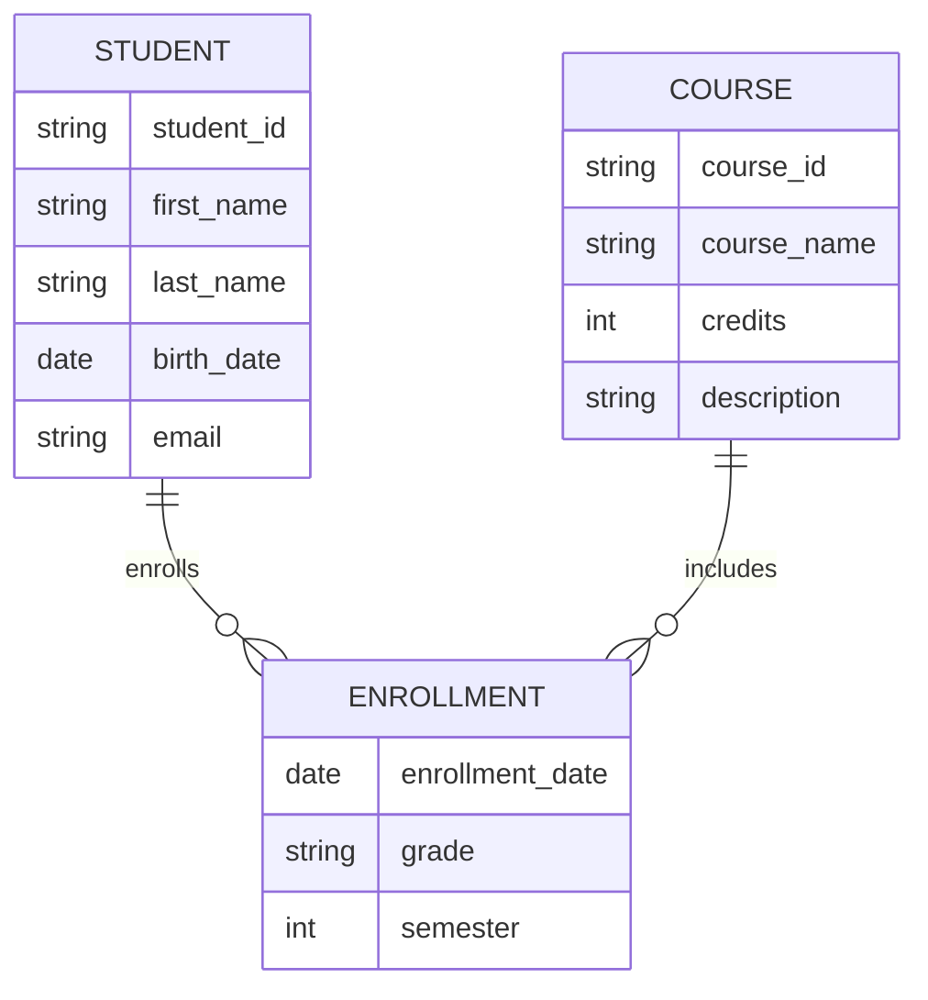

#### Логічний рівень

Логічний рівень є проміжним етапом, на якому концептуальна модель трансформується у структуру, що відповідає вибраній моделі даних. Для реляційних баз даних це означає перетворення концептуальної схеми у набір таблиць з визначеними зв'язками. Саме тут абстрактна сутність СТУДЕНТ уперше стає конкретною таблицею `students` зі своїми стовпцями й типами даних — але ще без прив'язки до індексів, розміщення файлів чи інших питань конкретної СУБД.

Основні завдання логічного рівня:

- Перетворення сутностей у таблиці з відповідними стовпцями.
- Реалізація зв'язків через зовнішні ключі або додаткові таблиці.
- Визначення типів даних для кожного атрибута.
- Встановлення первинних та зовнішніх ключів.
- Застосування правил нормалізації для усунення аномалій.

Приклад логічної схеми для системи управління університетом:

```sql
CREATE TABLE students (
    student_id VARCHAR(10) PRIMARY KEY,
    first_name VARCHAR(50) NOT NULL,
    last_name VARCHAR(50) NOT NULL,
    birth_date DATE,
    email VARCHAR(100) UNIQUE NOT NULL
);

CREATE TABLE courses (
    course_id VARCHAR(10) PRIMARY KEY,
    course_name VARCHAR(100) NOT NULL,
    credits INT CHECK (credits > 0),
    description TEXT
);

CREATE TABLE enrollments (
    student_id VARCHAR(10),
    course_id VARCHAR(10),
    enrollment_date DATE DEFAULT CURRENT_DATE,
    grade CHAR(2),
    semester INT,
    PRIMARY KEY (student_id, course_id, semester),
    FOREIGN KEY (student_id) REFERENCES students(student_id),
    FOREIGN KEY (course_id) REFERENCES courses(course_id)
);
```

#### Фізичний рівень

Фізичний рівень є найнижчим рівнем проєктування, на якому визначаються специфічні деталі реалізації для конкретної системи управління базами даних. На цьому етапі приймаються рішення щодо оптимізації продуктивності та ефективного використання ресурсів. Ці рішення ми детально розглянемо в лекції про логічне та фізичне проєктування — тут важливо лише зафіксувати, що вони існують окремо від логічної структури й не повинні впливати на неї.

Основні завдання фізичного рівня:

- Створення індексів для оптимізації запитів.
- Визначення стратегій секціонування великих таблиць.
- Налаштування параметрів зберігання та розміщення файлів.
- Оптимізація структур доступу до даних.
- Створення матеріалізованих представлень для складних запитів.

Приклад фізичних оптимізацій:

```sql
-- Створення індексів для оптимізації пошуку
CREATE INDEX idx_students_email ON students(email);
CREATE INDEX idx_enrollments_student ON enrollments(student_id);
CREATE INDEX idx_enrollments_course ON enrollments(course_id);

-- Створення композитного індексу для складних запитів
CREATE INDEX idx_enrollments_composite ON enrollments(semester, grade);

-- Налаштування параметрів таблиці
ALTER TABLE enrollments SET (fillfactor = 80);

-- Створення секціонування за семестрами
CREATE TABLE enrollments_2024_fall
PARTITION OF enrollments
FOR VALUES IN (202401);
```

### Взаємозв'язок між рівнями

Усі три рівні проєктування тісно взаємопов'язані та впливають один на одного. Зміни на концептуальному рівні можуть потребувати перегляду логічної та фізичної структури. Водночас обмеження фізичного рівня можуть впливати на рішення логічного рівня — наприклад, усвідомлення того, що таблиця видач книг зростатиме на мільйони рядків на рік, може вплинути на рішення про секціонування ще на етапі логічного проєктування.

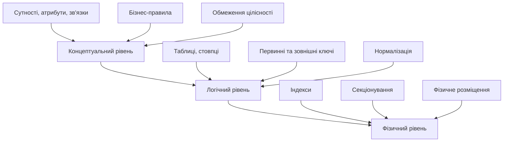

Розібравшись із загальною методологією, перейдімо до інструменту, який робить концептуальний рівень практично придатним для роботи, — Entity-Relationship моделі.

## Entity-Relationship модель: сутності, атрибути, зв'язки

### Сутності

Сутність є основним будівельним блоком концептуальної моделі даних. Вона представляє певний клас об'єктів реального світу, які мають спільні характеристики та можуть бути однозначно ідентифіковані.

#### Типи сутностей

Розрізняють декілька типів сутностей залежно від їхніх характеристик та ролі в моделі.

**Сильні сутності** мають власний унікальний ідентифікатор, який не залежить від інших сутностей. Такі сутності можуть існувати незалежно та мають власний первинний ключ.

Приклади сильних сутностей:
- СТУДЕНТ (ідентифікується номером студентського квитка)
- КУРС (ідентифікується кодом курсу)
- ВИКЛАДАЧ (ідентифікується особистим номером)

**Слабкі сутності** не мають власного унікального ідентифікатора та залежать від іншої сутності для своєї ідентифікації. Вони існують тільки в контексті пов'язаної з ними сильної сутності — видалення власницької сутності автоматично робить безглуздим і існування слабкої.

Приклади слабких сутностей:
- ПІДЛЕГЛИЙ (ідентифікується в контексті конкретного співробітника)
- КІМНАТА (ідентифікується в контексті конкретної будівлі)

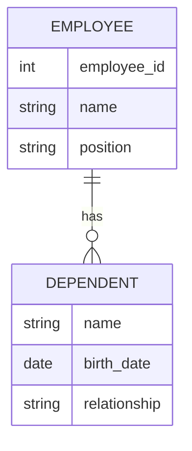

### Атрибути

Атрибути описують властивості сутностей та містять конкретні дані, що характеризують кожен екземпляр сутності.

#### Класифікація атрибутів

**Прості атрибути** містять одне атомарне значення, яке не може бути розділене на менші компоненти.

Приклади простих атрибутів:
- вік студента
- номер телефону
- дата народження

**Складені атрибути** можуть бути розділені на менші підкомпоненти, кожен з яких має самостійне значення.

Приклад складеного атрибута АДРЕСА:
- вулиця
- місто
- поштовий індекс
- країна

**Однозначні атрибути** можуть мати тільки одне значення для конкретного екземпляра сутності в певний момент часу.

**Багатозначні атрибути** можуть мати множину значень для одного екземпляра сутності.

Приклади багатозначних атрибутів:
- номери телефонів особи
- хобі студента
- мови, якими володіє викладач

**Похідні атрибути** обчислюються на основі інших атрибутів та не зберігаються безпосередньо в базі даних.

Приклади похідних атрибутів:
- вік (обчислюється з дати народження)
- загальна кількість кредитів студента
- стаж роботи співробітника

Розрізнення цих категорій — не суто термінологічна вправа: воно безпосередньо впливає на майбутню логічну схему. Багатозначний атрибут неминуче стане окремою таблицею (адже реляційна модель не дозволяє зберігати список значень в одній комірці), складений атрибут може або розкладатися на окремі стовпці, або лишатися єдиним полем — залежно від того, чи потрібно системі звертатися до його частин окремо, а похідний атрибут — це сигнал, що дане варто обчислювати запитом, а не зберігати (якщо тільки продуктивність не вимагає протилежного).

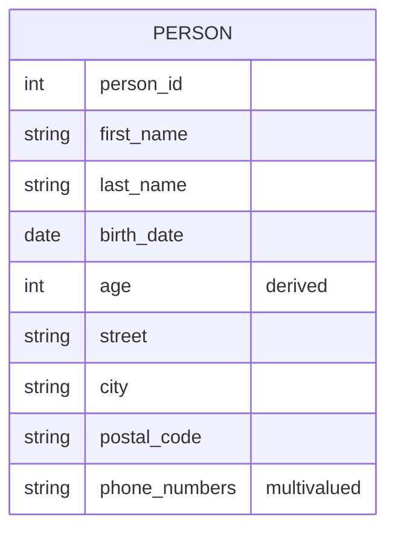

#### Ключові атрибути

Ключові атрибути або комбінації атрибутів унікально ідентифікують кожен екземпляр сутності. Розрізняють первинні та альтернативні ключі.

Первинний ключ є основним ідентифікатором сутності та має такі властивості:
- унікальність для кожного екземпляра;
- незмінність протягом життєвого циклу екземпляра;
- простота та зрозумілість.

### Зв'язки

Зв'язки представляють асоціації між двома або більше сутностями та описують, як екземпляри цих сутностей пов'язані між собою.

#### Типи зв'язків за кількістю учасників

**Бінарні зв'язки** включають дві сутності та є найпоширенішими в концептуальному моделюванні.

Приклад бінарного зв'язку:
- СТУДЕНТ навчається на КУРСІ
- ВИКЛАДАЧ викладає КУРС

**Тернарні зв'язки** включають три сутності одночасно та використовуються, коли зв'язок не може бути адекватно представлений набором бінарних зв'язків.

Приклад тернарного зв'язку:
- СТУДЕНТ здає КУРС у ВИКЛАДАЧА

**N-арні зв'язки** включають n сутностей, але на практиці використовуються рідко через складність інтерпретації.

#### Атрибути зв'язків

Зв'язки можуть мати власні атрибути, які характеризують асоціацію між сутностями.

Приклади атрибутів зв'язків:
- оцінка в зв'язку СТУДЕНТ-КУРС
- дата початку в зв'язку СПІВРОБІТНИК-ПРОЕКТ
- роль у зв'язку АКТОР-ФІЛЬМ

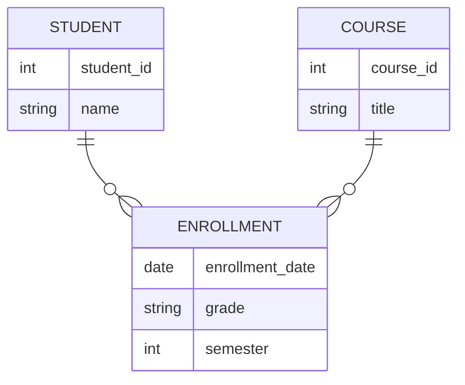

Ідентифікувавши сутності, атрибути й зв'язки, ми ще не маємо повної картини: сам факт існування зв'язку СТУДЕНТ-КУРС нічого не каже про те, скільки курсів може відвідувати один студент чи чи зобов'язаний кожен курс мати бодай одного слухача. Ці деталі описують семантичні обмеження.

## Семантичні обмеження: кардинальність, участь, ідентифікація

### Кардинальність зв'язків

Кардинальність визначає максимальну кількість екземплярів однієї сутності, які можуть бути пов'язані з одним екземпляром іншої сутності.

#### Типи кардинальності

**Один до одного (1:1)** означає, що кожен екземпляр першої сутності пов'язаний максимум з одним екземпляром другої сутності, і навпаки.

Приклади зв'язків 1:1:
- СПІВРОБІТНИК має РОБОЧЕ_МІСЦЕ
- КРАЇНА має СТОЛИЦЮ
- ОСОБА має ПАСПОРТ

**Один до багатьох (1:M)** означає, що кожен екземпляр першої сутності може бути пов'язаний з багатьма екземплярами другої сутності, але кожен екземпляр другої сутності пов'язаний максимум з одним екземпляром першої.

Приклади зв'язків 1:M:
- ВІДДІЛ містить багатьох СПІВРОБІТНИКІВ
- КУРС читається одним ВИКЛАДАЧЕМ
- ЗАМОВЛЕННЯ містить багато ТОВАРНИХ_ПОЗИЦІЙ

**Багато до багатьох (M:N)** означає, що кожен екземпляр будь-якої сутності може бути пов'язаний з багатьма екземплярами іншої сутності.

Приклади зв'язків M:N:
- СТУДЕНТ вивчає багато КУРСІВ
- АКТОР грає в багатьох ФІЛЬМАХ
- АВТОР пише багато КНИГ

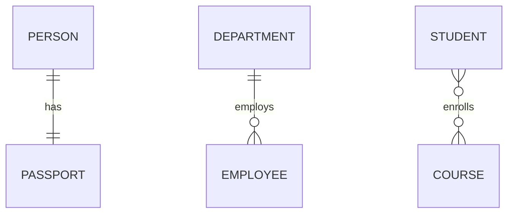

### Участь у зв'язках

Участь визначає, чи повинен кожен екземпляр сутності обов'язково брати участь у зв'язку.

#### Типи участі

**Повна участь (обов'язкова)** означає, що кожен екземпляр сутності повинен брати участь принаймні в одному екземплярі зв'язку. Графічно позначається подвійною лінією.

Приклади повної участі:
- кожен СПІВРОБІТНИК повинен працювати в якомусь ВІДДІЛІ
- кожна СЛАБКА_СУТНІСТЬ повинна бути пов'язана з ВЛАСНИЦЬКОЮ_СУТНІСТЮ

**Часткова участь (необов'язкова)** означає, що екземпляр сутності може, але не повинен брати участь у зв'язку. Графічно позначається одинарною лінією.

Приклади часткової участі:
- СПІВРОБІТНИК може керувати ПРОЕКТОМ
- СТУДЕНТ може бути СТАРОСТОЮ групи

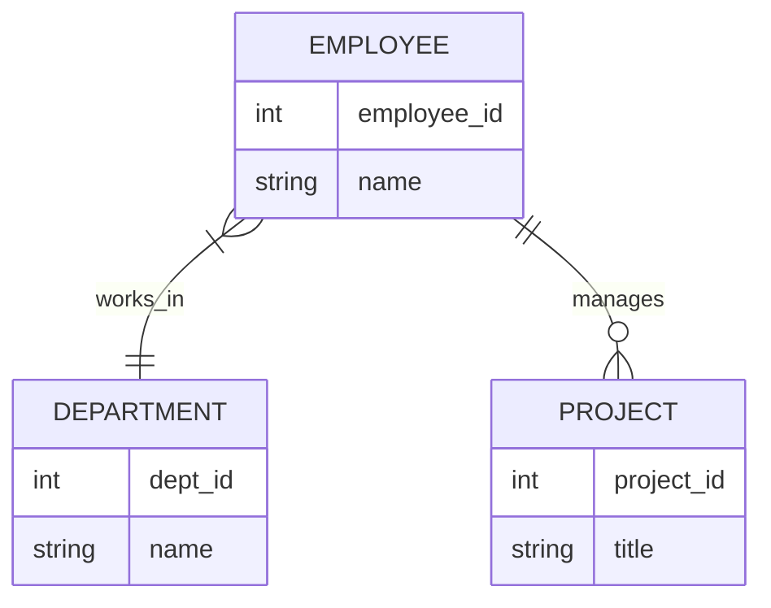

### Ідентифікуючі зв'язки

Ідентифікуючі зв'язки використовуються для визначення слабких сутностей, які не мають власного унікального ідентифікатора.

#### Характеристики ідентифікуючих зв'язків

- Слабка сутність має повну участь в ідентифікуючому зв'язку.
- Ідентифікуючий зв'язок завжди має кардинальність 1:M від власницької до слабкої сутності.
- Частковий ключ слабкої сутності в комбінації з ключем власницької сутності утворює повний ключ слабкої сутності.

Приклад ідентифікуючого зв'язку:

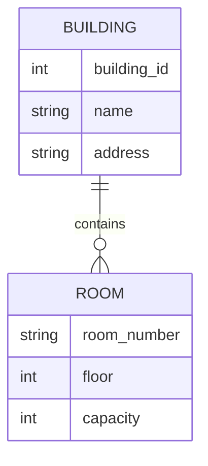

У цьому прикладі кімната ідентифікується комбінацією ідентифікатора будівлі та номера кімнати.

Базова ER-модель — сутності, атрибути, зв'язки з їхньою кардинальністю та участю — покриває більшість практичних випадків. Але реальні предметні області часто містять ієрархії й спільні структури, для яких базового набору засобів недостатньо. Для цього модель розширюють.

## Розширена ER-модель: узагальнення/спеціалізація, категорії, агрегація

### Узагальнення та спеціалізація

Узагальнення та спеціалізація є процесами створення ієрархічних відношень між сутностями, що дозволяють моделювати успадкування атрибутів та зв'язків.

#### Узагальнення

Узагальнення є процесом об'єднання кількох схожих сутностей в одну більш загальну сутність вищого рівня. Цей процес виділяє спільні атрибути та зв'язки підлеглих сутностей.

Приклад узагальнення:
- СТУДЕНТ, ВИКЛАДАЧ, АДМІНІСТРАТОР узагальнюються в ОСОБУ

#### Спеціалізація

Спеціалізація є зворотним процесом до узагальнення і полягає в розділенні загальної сутності на кілька більш специфічних підтипів.

Приклад спеціалізації:
- ТРАНСПОРТНИЙ_ЗАСІБ спеціалізується на АВТОМОБІЛЬ, МОТОЦИКЛ, ВАНТАЖІВКА

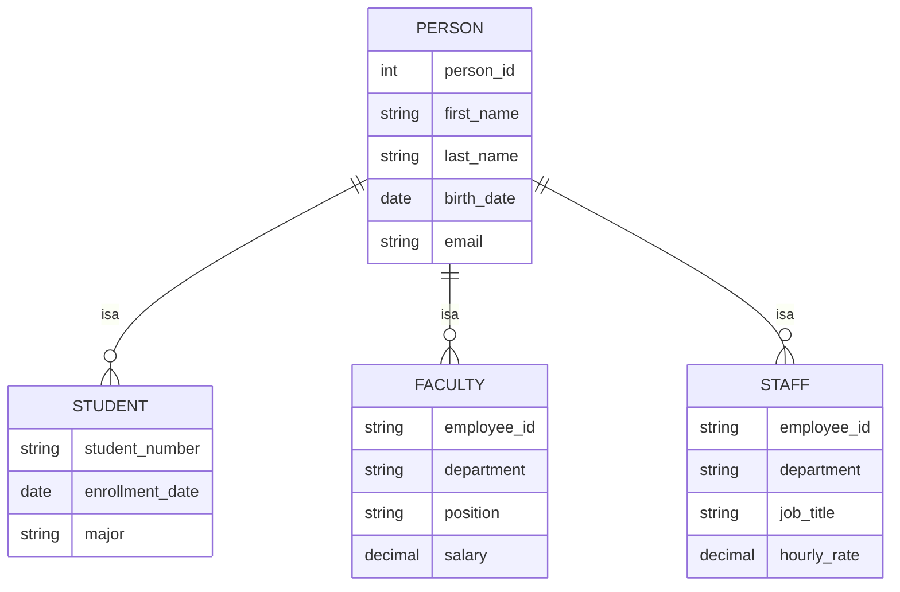

#### Обмеження спеціалізації

**Обмеження диз'юнктності:**
- Диз'юнктна спеціалізація означає, що сутність може належати тільки одному підтипу.
- Перехресна спеціалізація дозволяє сутності належати кільком підтипам одночасно.

**Обмеження повноти:**
- Повна спеціалізація означає, що кожен екземпляр надтипу повинен належати принаймні одному підтипу.
- Часткова спеціалізація дозволяє екземплярам надтипу не належати жодному підтипу.

Ці обмеження не є суто теоретичною тонкістю: саме від них залежить, яку зі стратегій реалізації ієрархій (одна таблиця на ієрархію, одна на клас чи одна на підклас) варто обрати на логічному рівні — питання, до якого ми повернемось у лекції про логічне та фізичне проєктування.

### Категорії (Union Types)

Категорії використовуються, коли підтип може бути пов'язаний з більш ніж одним надтипом. Це відрізняється від звичайної спеціалізації, де всі підтипи мають спільний надтип.

Приклад категорії:
- ВЛАСНИК може бути ОСОБОЮ або ОРГАНІЗАЦІЄЮ
- ТРАНСПОРТНИЙ_ЗАСІБ може належати ОСОБІ або КОМПАНІЇ

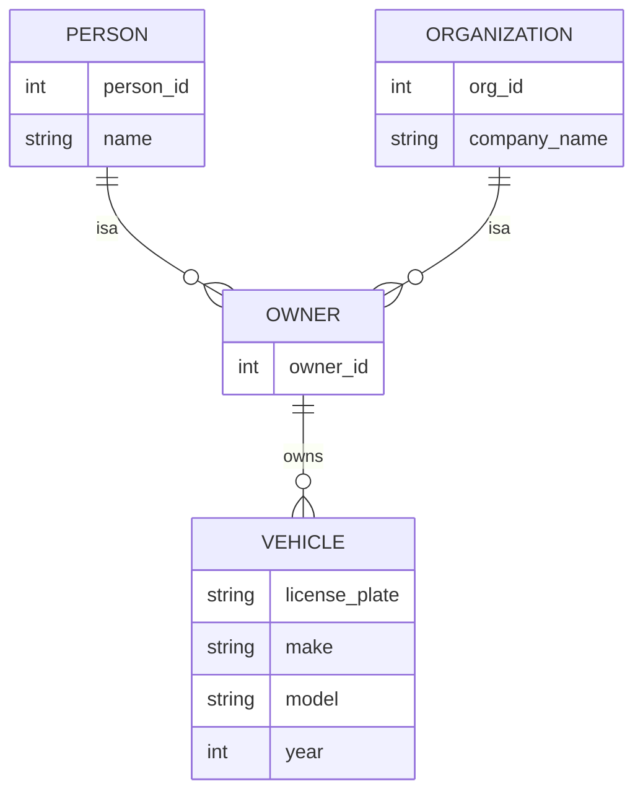

### Агрегація

Агрегація дозволяє розглядати зв'язок разом з його учасниками як сутність вищого рівня. Це корисно, коли потрібно створити зв'язки з іншими сутностями на рівні всієї агрегації.

Приклад агрегації: зв'язок між СТУДЕНТОМ, КУРСОМ та ВИКЛАДАЧЕМ може бути агрегований в сутність НАВЧАННЯ, яка потім може мати зв'язки з іншими сутностями, такими як АУДИТОРІЯ.

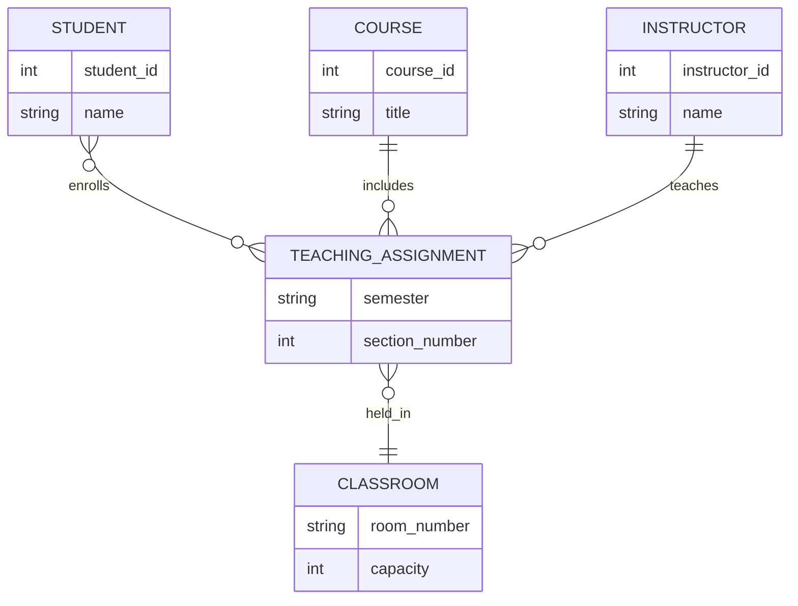

Розширена ER-модель дає виразність, потрібну для складних предметних областей. Але виразність — не єдиний критерій вибору інструменту моделювання: команди й організації історично використовували й продовжують використовувати кілька конкуруючих нотацій, і варто розуміти, чим вони відрізняються.

## Альтернативні нотації концептуального моделювання

### Нотація Чена (Chen)

Нотація Пітера Чена є класичною нотацією для ER-діаграм, запропонованою у 1976 році. Вона використовує специфічні геометричні фігури для різних елементів моделі: прямокутники для сутностей, ромби для зв'язків, овали для атрибутів, лінії для з'єднання елементів; подвійні лінії позначають повну участь, а подвійні прямокутники — слабкі сутності. Ця нотація найточніше відображає теоретичні поняття ER-моделі (зв'язок як самостійна геометрична фігура, атрибут як окремий вузол), але саме через це швидко стає громіздкою на діаграмах з десятками сутностей, тому сьогодні вона переважно використовується в навчальних матеріалах, а не в промисловому проєктуванні.


### Нотація "пташиних лапок" (Crow's Foot)

Ця нотація, також відома як Information Engineering Notation, є однією з найпопулярніших у сучасному проєктуванні баз даних і саме її розпізнає (у дещо спрощеному вигляді) синтаксис `erDiagram` у Mermaid, яким ми користуємось у цьому курсі.

Характеристики нотації Crow's Foot:
- символи на кінцях ліній позначають кардинальність замість окремих геометричних фігур для зв'язків;
- «пташина лапка» позначає «багато»;
- одна лінія позначає «один»;
- кола позначають необов'язковість;
- перпендикулярні лінії позначають обов'язковість.

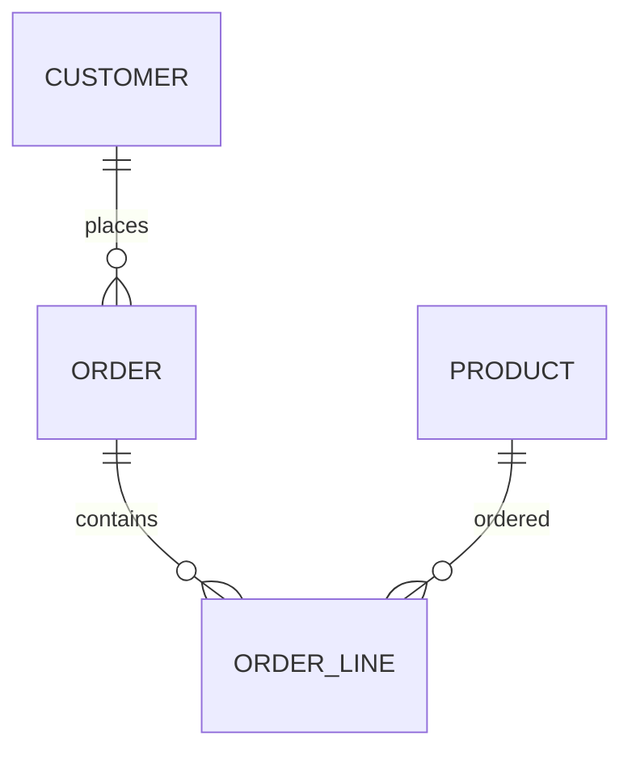

### UML Class Diagram Notation

Нотація UML адаптована для моделювання баз даних і широко використовується в об'єктно-орієнтованому проєктуванні. Класи представляються прямокутниками з трьома секціями: верхня містить ім'я класу, середня — атрибути, нижня — методи (для баз даних зазвичай порожня), а асоціації показуються лініями з позначенням мультиплісності на кінцях. Ця нотація зручна, коли концептуальна модель одразу проєктується разом з об'єктно-орієнтованим кодом застосунку, оскільки дозволяє показати дані й поведінку на одній діаграмі.


### IDEF1X

IDEF1X (Integration Definition for Information Modeling) є стандартом для концептуального моделювання даних, розробленим для потреб оборонної промисловості США. Він чітко розрізняє ідентифікуючі та не-ідентифікуючі зв'язки, вимагає строгої типізації сутностей, детальної специфікації атрибутів і підтримує домени даних. Через високий поріг входження ця нотація сьогодні зустрічається переважно у великих корпоративних та державних інформаційних системах зі сталими методологічними вимогами.


### Порівняння нотацій

| Нотація | Переваги | Недоліки | Сфера застосування |
|---------|----------|----------|-------------------|
| Чена | Класична, детальна | Складна для великих діаграм | Навчання, документація |
| Crow's Foot | Інтуїтивна, компактна | Обмежені можливості | Комерційні СУБД, діаграми-як-код (Mermaid) |
| UML | Інтеграція з об'єктним дизайном | Надлишкова для простих БД | Об'єктно-орієнтовані системи |
| IDEF1X | Строга методологія | Складна для освоєння | Великі корпоративні системи |

На практиці вибір нотації рідко буває вільним: він визначається інструментом, який використовує команда. Тому варто розуміти не тільки самі нотації, а й екосистему інструментів навколо них.

## Процес концептуального моделювання

### Етапи розробки концептуальної моделі

#### Етап 1: Аналіз вимог

Перший етап включає збір та аналіз інформації про предметну область:

- проведення інтерв'ю з користувачами та експертами предметної області;
- аналіз існуючих документів, форм та звітів;
- вивчення бізнес-процесів та правил;
- ідентифікація функціональних та не-функціональних вимог.

#### Етап 2: Ідентифікація сутностей

На цьому етапі визначаються основні сутності предметної області:

- виділення іменників з опису предметної області;
- групування схожих об'єктів у сутності;
- визначення меж та обсягу кожної сутності;
- перевірка необхідності та достатності сутностей.

#### Етап 3: Визначення атрибутів

Для кожної ідентифікованої сутності визначаються її атрибути:

- ідентифікація властивостей, що описують сутність;
- класифікація атрибутів за типами;
- визначення ключових атрибутів;
- встановлення обмежень на значення атрибутів.

#### Етап 4: Моделювання зв'язків

На цьому етапі визначаються та моделюються зв'язки між сутностями:

- ідентифікація асоціацій між сутностями;
- визначення кардинальності кожного зв'язку;
- встановлення обмежень участі;
- додавання атрибутів до зв'язків, якщо необхідно.

#### Етап 5: Валідація моделі

Останній етап включає перевірку правильності та повноти моделі:

- перевірка відповідності бізнес-правилам;
- валідація з користувачами та експертами;
- тестування моделі на прикладах реальних даних;
- оптимізація структури моделі.

Ці п'ять етапів рідко проходять лінійно один раз: валідація майже завжди повертає проєктувальника до попередніх кроків, і саме ітеративність — а не одноразове «намалювали й забули» — відрізняє робочу концептуальну модель від паперової вправи.

### Типові помилки при концептуальному моделюванні

#### Неправильна ідентифікація сутностей

Найчастіші помилки:
- моделювання атрибутів як сутностей;
- створення надлишкових сутностей;
- ігнорування важливих сутностей предметної області.

#### Помилки в атрибутах

Типові проблеми:
- включення складених атрибутів без їх розкладання на прості компоненти;
- неправильна ідентифікація багатозначних атрибутів;
- ігнорування похідних атрибутів;
- відсутність належних ключових атрибутів.

#### Помилки в зв'язках

Найпоширеніші проблеми:
- неправильне визначення кардинальності зв'язків;
- ігнорування важливих зв'язків між сутностями;
- створення надлишкових зв'язків;
- неправильне моделювання тернарних зв'язків як набору бінарних.

#### Помилки в обмеженнях

Частіші недоліки:
- нехтування бізнес-правилами при визначенні обмежень;
- неправильна специфікація участі в зв'язках;
- ігнорування семантичних обмежень предметної області.

### Інструменти концептуального моделювання

#### Графічні редактори

Сучасні інструменти для створення ER-діаграм:

**Професійні інструменти:**
- ERwin Data Modeler — професійний інструмент для корпоративного моделювання;
- PowerDesigner — комплексне рішення для моделювання даних та процесів;
- ER/Studio — інструмент для проєктування та документування баз даних.

**Безкоштовні альтернативи:**
- MySQL Workbench — вбудовані засоби моделювання для MySQL;
- pgModeler — спеціалізований інструмент для PostgreSQL;
- draw.io (Diagrams.net) — вебінструмент з підтримкою ER-діаграм.

**Онлайн-платформи:**
- Lucidchart — хмарна платформа для створення діаграм;
- Creately — інтерактивний інструмент моделювання;
- Cacoo — колаборативна платформа для діаграм.

**Легковагі та код-орієнтовані інструменти:** окрім класичних графічних редакторів, останніми роками набув поширення підхід «схема як код»: dbdiagram.io та подібні сервіси дозволяють описати ER-модель коротким текстовим DSL і одразу отримати діаграму та готовий SQL-скрипт створення таблиць, а Mermaid, який ми використовуємо в цьому курсі, дає той самий ефект прямо в Markdown-документі — діаграма зберігається як текст, версіонується в Git разом з кодом і не «розсинхронізується» з рештою документації. Дедалі більше таких інструментів пропонують і асистовану генерацію першого чорнового варіанту моделі за текстовим описом предметної області — зручно для швидкого старту, але отриманий результат обов'язково потребує тієї ж валідації бізнес-правилами, що й будь-яка інша концептуальна модель.

#### CASE-системи

Computer-Aided Software Engineering системи надають комплексний підхід до моделювання:

- автоматична генерація коду бази даних з концептуальної моделі;
- підтримка версіонування моделей;
- інтеграція з системами управління проєктами;
- колаборативна робота над моделями.

Маючи в розпорядженні всі ці поняття та інструменти, розглянемо, як вони застосовуються разом у наскрізному прикладі.

## Практичний приклад: Моделювання системи управління бібліотекою

### Аналіз вимог

Розглянемо практичний приклад створення концептуальної моделі для системи управління бібліотекою. Система повинна підтримувати такі функції:

- реєстрація читачів та управління їхніми обліковими записами;
- каталогізація книг та інших матеріалів;
- відстеження видачі та повернення матеріалів;
- управління штрафами за прострочення;
- резервування популярних видань.

### Ідентифікація основних сутностей

На основі аналізу вимог можна виділити такі основні сутності:

**ЧИТАЧ** — особи, які користуються послугами бібліотеки
**КНИГА** — основні матеріали бібліотеки
**АВТОР** — творці літературних творів
**ВИДАВНИЦТВО** — організації, що публікують книги
**КАТЕГОРІЯ** — тематичні розділи каталогу
**ВИДАЧА** — факт передачі книги читачеві
**ШТРАФ** — фінансові санкції за порушення правил

### Детальна модель

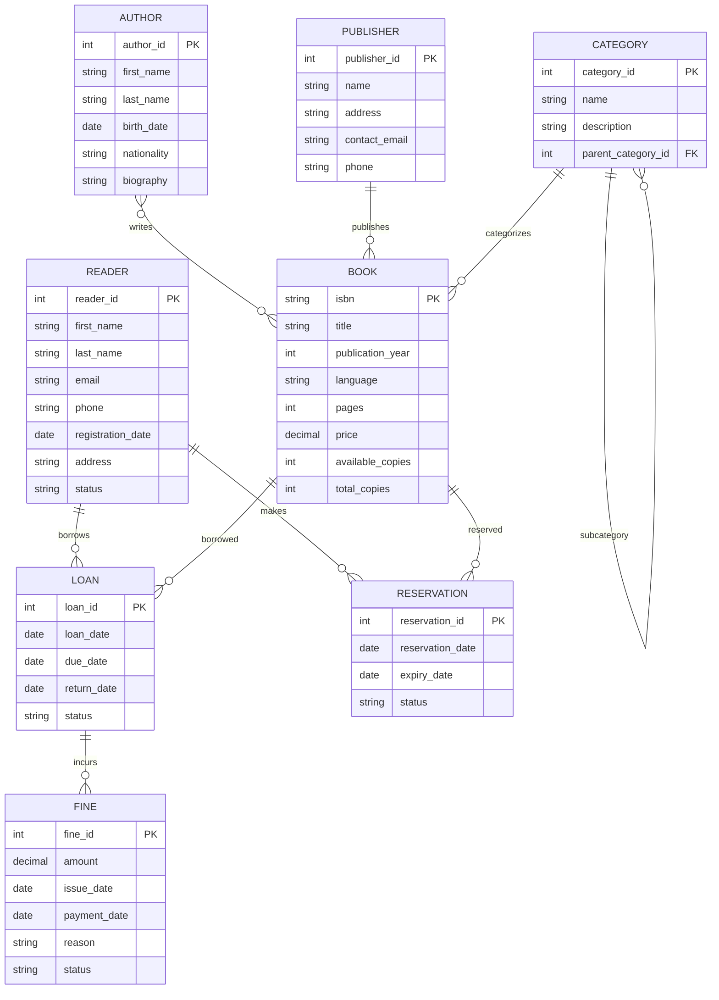

### Атрибути та їх характеристики

#### Сутність ЧИТАЧ

**Прості атрибути:**
- reader_id (ключовий) — унікальний ідентифікатор читача;
- first_name, last_name — особисті дані;
- email — для комунікації та ідентифікації;
- phone — контактна інформація;
- registration_date — дата реєстрації в бібліотеці;
- status — активний, заблокований, видалений.

**Складений атрибут:**
- address може включати вулицю, місто, поштовий індекс.

#### Сутність КНИГА

**Ключові атрибути:**
- isbn — міжнародний стандартний номер книги (первинний ключ).

**Описові атрибути:**
- title — назва твору;
- publication_year — рік видання;
- language — мова видання;
- pages — кількість сторінок;
- price — вартість примірника.

**Атрибути інвентаризації:**
- available_copies — доступні для видачі примірники;
- total_copies — загальна кількість примірників.

#### Зв'язок ВИДАЧА

Зв'язок між ЧИТАЧЕМ та КНИГОЮ має такі атрибути:
- loan_date — дата видачі;
- due_date — термін повернення;
- return_date — фактична дата повернення (може бути null);
- status — видана, повернена, прострочена.

### Бізнес-правила та обмеження

#### Обмеження цілісності

1. Читач не може взяти більше 5 книг одночасно.
2. Книга може бути видана тільки якщо `available_copies > 0`.
3. Штраф нараховується автоматично через день після `due_date`.
4. Резервування автоматично скасовується через 7 днів.

#### Похідні атрибути

- Кількість днів прострочення = `CURRENT_DATE - due_date` (якщо позитивне).
- Сума штрафу = дні_прострочення × 2 грн.
- Статус читача = «заблокований», якщо є несплачені штрафи > 50 грн.

Зверніть увагу: жодне з цих правил не випливає з самої структури сутностей — воно приходить лише з аналізу вимог. Саме тому концептуальна модель без явно зафіксованих бізнес-правил лишається неповною, хоч би якою детальною була діаграма.

### Розширення моделі

#### Спеціалізація сутності МАТЕРІАЛ

Бібліотека може мати різні типи матеріалів:

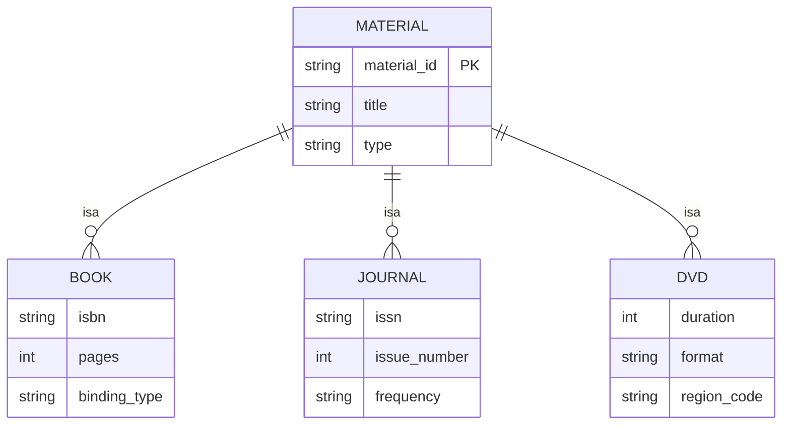

#### Категорії з ієрархією

Система категорій може мати ієрархічну структуру:

```sql
-- Приклад ієрархії категорій
-- Комп'ютерні науки (1)
--   ├── Програмування (11)
--   │   ├── Web-розробка (111)
--   │   └── Мобільна розробка (112)
--   └── Бази даних (12)
--       ├── Реляційні СУБД (121)
--       └── NoSQL системи (122)
```

## Переходи від концептуальної до логічної моделі

Концептуальна модель бібліотеки, яку ми щойно побудували, лишається абстракцією, доки не буде перетворена на конкретні таблиці. Розглянемо основні правила такого перетворення — детальніше цю тему розкриває наступна лекція про логічне та фізичне проєктування.

### Перетворення сутностей

Кожна сутність концептуальної моделі перетворюється на таблицю логічної моделі:

```sql
-- Сутність ЧИТАЧ → таблиця readers
CREATE TABLE readers (
    reader_id SERIAL PRIMARY KEY,
    first_name VARCHAR(50) NOT NULL,
    last_name VARCHAR(50) NOT NULL,
    email VARCHAR(100) UNIQUE NOT NULL,
    phone VARCHAR(20),
    registration_date DATE DEFAULT CURRENT_DATE,
    street VARCHAR(100),
    city VARCHAR(50),
    postal_code VARCHAR(10),
    status VARCHAR(20) DEFAULT 'active'
        CHECK (status IN ('active', 'blocked', 'deleted'))
);
```

### Перетворення зв'язків

#### Зв'язки 1:1

Реалізуються через додавання зовнішнього ключа в одну з таблиць:

```sql
-- Якщо кожен читач має унікальний читацький квиток
ALTER TABLE readers ADD COLUMN card_number VARCHAR(20) UNIQUE;
```

#### Зв'язки 1:M

Реалізуються додаванням зовнішнього ключа в таблицю «багато»:

```sql
-- Книга належить одному видавництву
ALTER TABLE books ADD COLUMN publisher_id INT
    REFERENCES publishers(publisher_id);
```

#### Зв'язки M:N

Реалізуються через створення окремої таблиці зв'язку:

```sql
-- Зв'язок між авторами та книгами
CREATE TABLE book_authors (
    book_isbn VARCHAR(13) REFERENCES books(isbn),
    author_id INT REFERENCES authors(author_id),
    author_role VARCHAR(50) DEFAULT 'author',
    PRIMARY KEY (book_isbn, author_id)
);
```

### Реалізація спеціалізації

Спеціалізація може бути реалізована кількома способами.

#### Підхід «одна таблиця на ієрархію»

```sql
CREATE TABLE materials (
    material_id VARCHAR(20) PRIMARY KEY,
    title VARCHAR(200) NOT NULL,
    material_type VARCHAR(20) NOT NULL,
    -- Атрибути для книг
    isbn VARCHAR(13),
    pages INT,
    binding_type VARCHAR(30),
    -- Атрибути для журналів
    issn VARCHAR(9),
    issue_number INT,
    frequency VARCHAR(20),
    -- Атрибути для DVD
    duration INT,
    format VARCHAR(10),
    region_code VARCHAR(5)
);
```

#### Підхід «одна таблиця на підклас»

```sql
CREATE TABLE materials (
    material_id VARCHAR(20) PRIMARY KEY,
    title VARCHAR(200) NOT NULL,
    material_type VARCHAR(20) NOT NULL
);

CREATE TABLE books (
    material_id VARCHAR(20) PRIMARY KEY
        REFERENCES materials(material_id),
    isbn VARCHAR(13) UNIQUE,
    pages INT,
    binding_type VARCHAR(30)
);

CREATE TABLE journals (
    material_id VARCHAR(20) PRIMARY KEY
        REFERENCES materials(material_id),
    issn VARCHAR(9),
    issue_number INT,
    frequency VARCHAR(20)
);
```

## Висновки

Концептуальне моделювання є критично важливим етапом проєктування баз даних, що визначає успіх усього проєкту. Правильно виконана концептуальна модель забезпечує:

1. **Чітке розуміння предметної області** всіма учасниками проєкту.
2. **Основу для логічного та фізичного проєктування** бази даних.
3. **Документацію бізнес-правил** та обмежень системи.
4. **Можливість валідації** вимог з користувачами та експертами.

Основні принципи успішного концептуального моделювання:

- ретельний аналіз вимог та розуміння предметної області;
- використання відповідної нотації для команди та організації;
- ітеративний підхід з постійною валідацією моделі;
- баланс між деталізацією та зрозумілістю моделі;
- урахування майбутніх потреб та можливих розширень системи.

Entity-Relationship модель залишається основним інструментом концептуального моделювання завдяки своїй експресивності та зрозумілості. Розширені можливості моделі, такі як спеціалізація, категорії та агрегація, дозволяють точно відображати складні аспекти реального світу.

Вибір конкретної нотації та інструментів моделювання залежить від специфіки проєкту, кваліфікації команди та корпоративних стандартів. Незалежно від вибраних засобів, головною метою залишається створення точної, повної та зрозумілої моделі предметної області, яка служитиме надійною основою для подальшого проєктування та розробки системи управління базами даних. У наступній лекції ми розглянемо, як забезпечити якість цієї основи на рівні самих таблиць — за допомогою теорії нормалізації.
