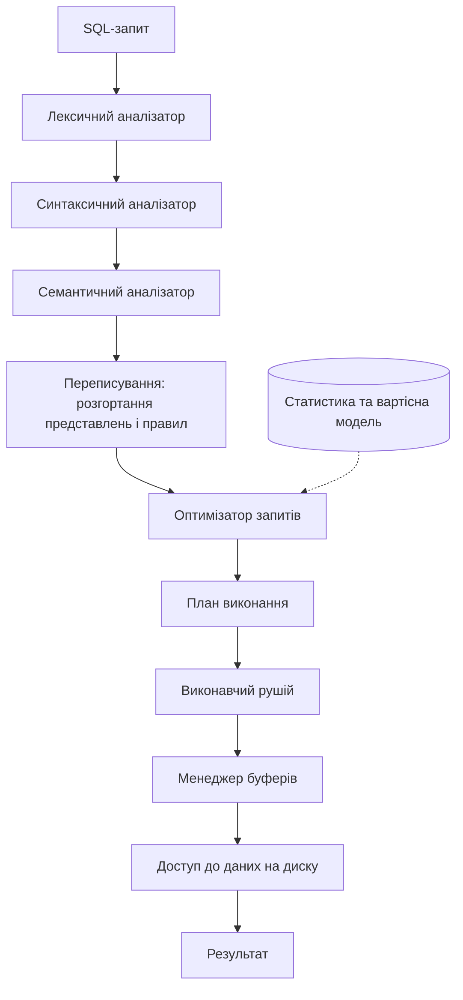
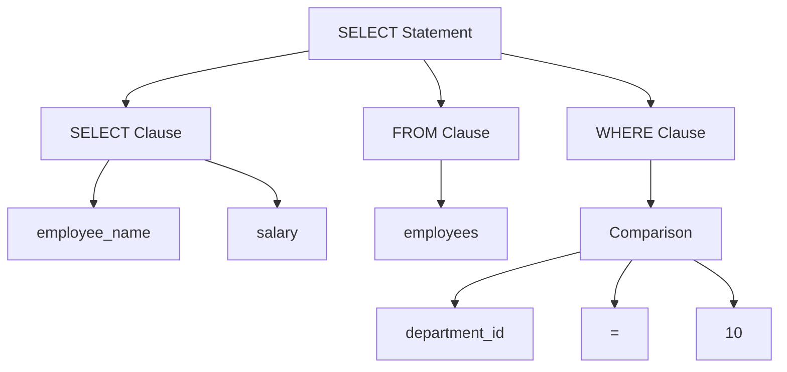
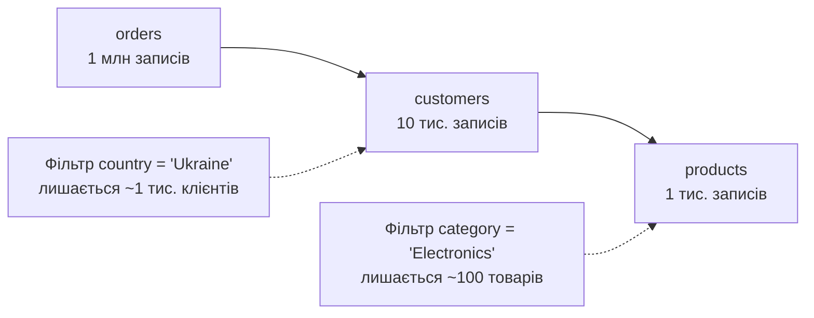
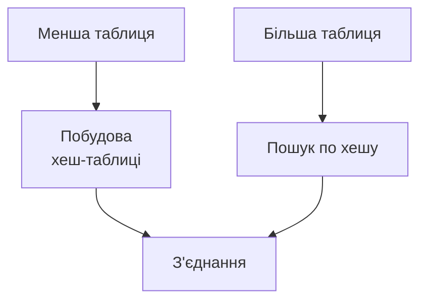
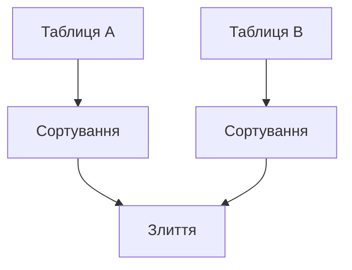
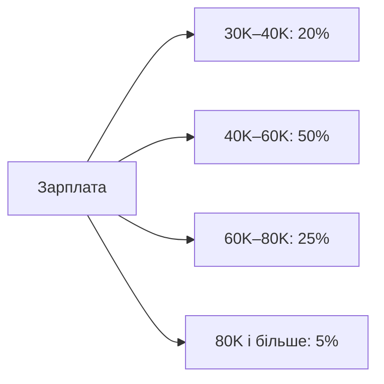
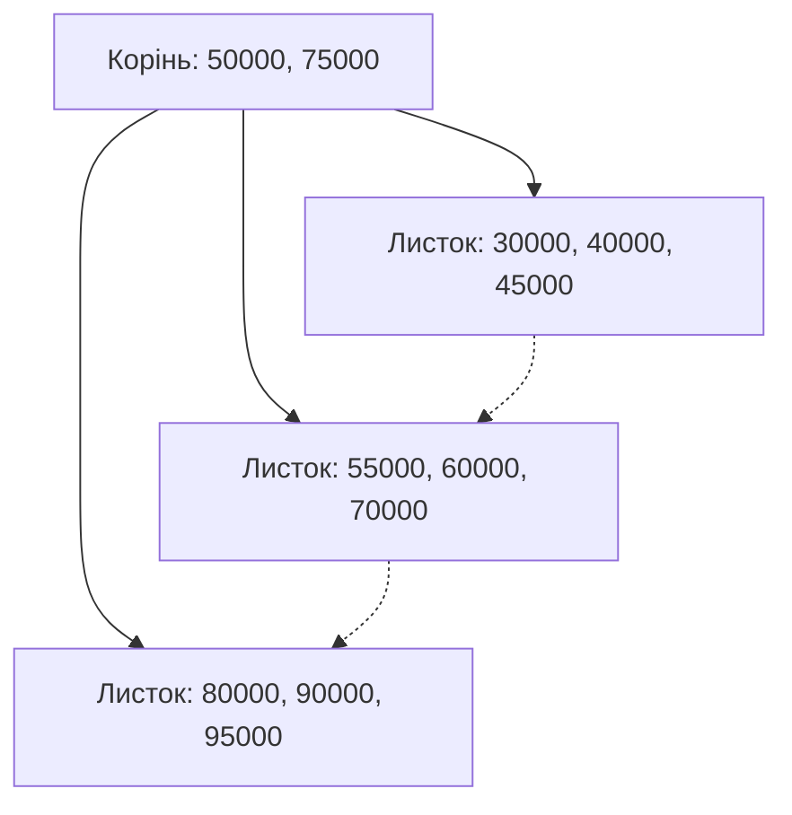

# Лекція 07 Обробка та оптимізація запитів

## Вступ

Коли ми пишемо `SELECT`, ми описуємо, **яким має бути результат**, але нічого не кажемо про те, **як його отримати**. Саме в цьому полягає сила декларативної мови SQL: розробник формулює умову, а СУБД сама вирішує, які індекси прочитати, у якому порядку з'єднати таблиці й яким алгоритмом це зробити. Компонент, що ухвалює ці рішення, називається оптимізатором запитів (у документації PostgreSQL — планувальником, *planner*), і від його вибору залежить, чи виконається запит за кілька мілісекунд, чи за кілька хвилин.

Ця лекція продовжує тему індексів і фізичного зберігання, яку ми розглядали раніше, і готує ґрунт для наступної лекції про транзакції: щоб зрозуміти, чому запити конкурують за ресурси й блокують один одного, треба спершу зрозуміти, з чого складається їхня вартість. Ми пройдемо весь шлях запиту — від тексту до результату, з'ясуємо, як оптимізатор оцінює варіанти, навчимося читати плани виконання й виправляти типові проблеми продуктивності.

Усі приклади в лекції орієнтовані на **PostgreSQL 18** (актуальну основну версію на момент оновлення матеріалу); де поведінка відрізняється в попередніх версіях або в інших СУБД, це зазначено окремо. Принципи, про які йдеться, універсальні: назви операцій і параметрів різняться, а логіка лишається тією самою в MySQL, SQL Server та Oracle.

> **Важливо.** Оптимізація — це експеримент, а не ворожіння. Будь-яке твердження на кшталт «так швидше» слід перевіряти на реальних даних за допомогою `EXPLAIN ANALYZE`. Далі ми побачимо кілька «правил», які були слушними десять років тому, а тепер уже ні.

## Архітектура обробки запитів

### Загальна схема обробки запитів

Шлях запиту від клієнта до результату проходить кілька етапів. Перші три — розбір тексту — детерміновані й майже не залежать від даних. Далі починається те, що робить СУБД «розумною»: оптимізатор обирає план, а виконавчий рушій його реалізує.



У PostgreSQL ці етапи мають конкретні назви: *parser* (лексичний і синтаксичний розбір), *analyzer* (семантичний аналіз), *rewriter* (переписування за правилами й розгортання представлень), *planner/optimizer* і *executor*. Знання цих назв допоможе читати документацію та повідомлення про помилки.

### Етапи обробки запитів

#### 1. Лексичний аналіз

Лексичний аналізатор розбиває текст SQL-запиту на окремі лексеми (токени): ключові слова, ідентифікатори, оператори, літерали та розділювачі. На цьому етапі ще не важливо, чи має запит сенс, — лише чи складається він із допустимих «слів».

Приклад запиту, який ми розглядатимемо на кількох етапах:

```sql
SELECT employee_name, salary FROM employees WHERE department_id = 10;
```

Токени:

- `SELECT` — ключове слово
- `employee_name` — ідентифікатор
- `,` — розділювач
- `salary` — ідентифікатор
- `FROM` — ключове слово
- `employees` — ідентифікатор
- `WHERE` — ключове слово
- `department_id` — ідентифікатор
- `=` — оператор
- `10` — числовий літерал
- `;` — розділювач

#### 2. Синтаксичний аналіз

Синтаксичний аналізатор перевіряє, чи відповідає послідовність токенів граматиці SQL, і будує **дерево розбору** (*parse tree*). Якщо ви забули кому або написали `SELCT`, помилка виникне саме тут (`syntax error at or near ...`).



#### 3. Семантичний аналіз

Семантичний аналізатор звіряє дерево розбору зі схемою бази даних — системним каталогом. Він перевіряє:

- існування таблиць і стовпців;
- відповідність типів даних (і вирішує, які неявні перетворення допустимі);
- права доступу користувача;
- правильність використання агрегатних функцій;
- коректність групування та сортування.

Якщо в запиті згадано стовпець, якого немає в таблиці, помилку буде виявлено саме тут (`column "..." does not exist`). Зверніть увагу: до цього моменту СУБД жодного разу не зверталася до самих даних — лише до метаданих.

Після семантичного аналізу PostgreSQL виконує **переписування** запиту: звернення до представлень (`VIEW`) підставляється їхнім визначенням, застосовуються правила та політики безпеки на рівні рядків. Тому запит до представлення для оптимізатора зазвичай нічим не відрізняється від запиту до базових таблиць.

#### 4. Оптимізація запитів

Оптимізатор — центральний компонент, що визначає найефективніший спосіб виконати запит. Для кожного запиту існує безліч еквівалентних планів: різні індекси, різний порядок з'єднань, різні алгоритми. Оптимізатор перебирає (або розумно відсікає) ці варіанти, оцінює вартість кожного за допомогою статистики та вартісної моделі й обирає найдешевший.

Результатом є **план виконання** — дерево фізичних операцій, яке виконавчий рушій обробляє знизу догори, передаючи рядки від одного вузла до іншого.

> **Підготовлені запити.** Якщо застосунок багаторазово виконує однотипний запит із різними параметрами, розбір і планування можна виконати один раз (`PREPARE` або підготовлені запити драйвера). PostgreSQL спочатку будує для кожного виклику індивідуальний план із урахуванням значення параметра, а після кількох виконань може перейти на загальний (*generic*) план. Це економить час планування, але іноді призводить до неоптимального плану для «нетипових» значень — тому режим контролюється параметром `plan_cache_mode`.

## Типи оптимізації запитів

Оптимізацію зручно поділити на два рівні. **Логічна** оптимізація перетворює запит на еквівалентний, але «дешевший» за структурою, не знаючи нічого про індекси й фізичне зберігання. **Фізична** обирає конкретні алгоритми та методи доступу, спираючись на статистику.

### Логічна оптимізація

Логічна оптимізація працює з алгебраїчними перетвореннями запиту: селекція (фільтрація рядків), проєкція (вибір стовпців) і з'єднання є операціями реляційної алгебри, для яких відомі правила еквівалентних перетворень. Ці правила застосовує сам оптимізатор — вам не потрібно «допомагати» йому, переписуючи запит вручну. Приклади нижче ілюструють **що саме** відбувається всередині, а не рекомендують писати запит у такому вигляді.

#### Основні правила логічної оптимізації

**1. Проштовхування селекції**

Умови `WHERE` переміщуються якомога ближче до джерел даних, щоб зменшити кількість рядків, які обробляються на наступних етапах: фільтрувати 10 тисяч рядків перед з'єднанням значно дешевше, ніж фільтрувати мільйон після нього.

Запит у «наївному» вигляді:

```sql
SELECT e.name, d.department_name
FROM employees e
JOIN departments d ON e.department_id = d.department_id
WHERE e.salary > 50000;
```

Концептуально оптимізатор перетворює його так, ніби фільтр застосовано ще до з'єднання:

```sql
SELECT e.name, d.department_name
FROM (SELECT * FROM employees WHERE salary > 50000) e
JOIN departments d ON e.department_id = d.department_id;
```

Ці два запити еквівалентні, і в PostgreSQL вони дадуть **однаковий план**: оптимізатор сам розгортає підзапит у `FROM` і виносить умову до сканування таблиці `employees`.

**2. Проштовхування проєкції**

Непотрібні стовпці виключаються якомога раніше, щоб зменшити обсяг даних, що передаються між операціями. Що вужчий рядок (параметр `width` у плані), то більше рядків вміщується в пам'ять і менше даних треба сортувати чи хешувати.

**3. Перестановка з'єднань**

З'єднання асоціативні й комутативні, тож порядок їх виконання можна змінювати без впливу на результат. Оптимізатор обирає порядок, за якого проміжні результати найменші.

```sql
SELECT *
FROM orders o
JOIN customers c ON o.customer_id = c.customer_id
JOIN products p ON o.product_id = p.product_id
WHERE c.country = 'Ukraine' AND p.category = 'Electronics';
```



Оптимізатор може спочатку відфільтрувати клієнтів і товари, а вже потім з'єднувати їх із величезною таблицею замовлень. Порядок таблиць у тексті запиту при цьому **не має значення**: PostgreSQL самостійно переставляє з'єднання, якщо їх не більше за `join_collapse_limit` (за замовчуванням 8). Для більшої кількості таблиць повний перебір порядків надто дорогий (кількість варіантів росте факторіально), тому для запитів із дюжиною й більше таблиць застосовується генетичний алгоритм пошуку (GEQO, параметр `geqo_threshold`, за замовчуванням 12).

**4. Перетворення підзапитів**

Корельований підзапит, який формально виконується для кожного рядка зовнішнього запиту, часто вдається перетворити на з'єднання й обробити за один прохід.

Корельований підзапит:

```sql
SELECT employee_name
FROM employees e1
WHERE salary > (SELECT AVG(salary) FROM employees e2
                WHERE e2.department_id = e1.department_id);
```

Еквівалентне з'єднання з агрегованою таблицею:

```sql
SELECT e.employee_name
FROM employees e
JOIN (SELECT department_id, AVG(salary) AS avg_salary
      FROM employees GROUP BY department_id) d
  ON e.department_id = d.department_id
WHERE e.salary > d.avg_salary;
```

PostgreSQL уміє автоматично перетворювати підзапити з `IN` та `EXISTS` у напівз'єднання (*semi-join*), а підзапити з `NOT EXISTS` — в антиз'єднання (*anti-join*). Скалярний корельований підзапит із агрегатом, як у прикладі вище, він автоматично не розгортає, тому переписування вручну тут може дати виграш (докладніше — у розділі про практичні методи). Починаючи з PostgreSQL 18, оптимізатор також уміє автоматично усувати зайві з'єднання таблиці із самою собою (*self-join removal*) у тих випадках, коли таке з'єднання не впливає на результат.

### Фізична оптимізація

Фізична оптимізація враховує конкретні методи доступу до даних, наявні індекси й статистику розподілу значень. Вона відповідає на два питання: **як прочитати** кожну таблицю та **яким алгоритмом з'єднати** результати.

#### Методи доступу до даних

**1. Послідовне сканування (Sequential Scan, `Seq Scan`)**

Послідовне читання всіх сторінок таблиці. Це не «погано» саме по собі: для невеликих таблиць або запитів, що потребують значної частки рядків, воно найдешевше, бо читання диска підряд швидше за довільне.

```sql
-- Мала таблиця довідника або умова, що вибирає більшість рядків
SELECT * FROM small_lookup_table;
```

**2. Індексне сканування (`Index Scan`)**

Пошук у індексі, а потім читання відповідних рядків із таблиці. Ефективне, коли умова вибирає невелику частку рядків.

```sql
-- Використовується індекс по первинному ключу
SELECT * FROM employees WHERE employee_id = 12345;
```

**3. Сканування лише індексу (`Index Only Scan`)**

Якщо всі потрібні стовпці вже є в індексі, звертатися до таблиці не потрібно. Це найшвидший варіант, але він працює, лише коли карта видимості (*visibility map*) підтверджує, що сторінки таблиці «чисті» — тому важливе регулярне очищення (`VACUUM`), про яке піде мова в наступній лекції.

```sql
CREATE INDEX idx_emp_dept_name ON employees (department_id) INCLUDE (name);

-- Обидва стовпці є в індексі: до таблиці можна не звертатися
SELECT department_id, name FROM employees WHERE department_id = 10;
```

**4. Растрове сканування (`Bitmap Index Scan` + `Bitmap Heap Scan`)**

Проміжний варіант між двома попередніми. PostgreSQL спочатку збирає в пам'яті бітову карту сторінок, де є потрібні рядки (за одним або кількома індексами одразу), а потім читає ці сторінки в фізичному порядку. Так вдається уникнути багаторазового повернення до тієї самої сторінки. Цей метод часто обирається, коли рядків потрібно «не мало й не багато», а також для умов із `OR`.

> **Про терміни.** У документації SQL Server часто зустрічаються терміни *Index Seek* (пошук за ключем у дереві індексу) та *Index Scan* (перегляд листків індексу). У PostgreSQL такого поділу немає: `Index Scan` охоплює обидва випадки, а перегляд усього індексу планується окремо. Не переносьте терміни однієї СУБД на іншу без перевірки.

#### Алгоритми з'єднання

Логічно `JOIN` — одна операція, але фізично існує три основні алгоритми, і вибір між ними — одне з найважливіших рішень оптимізатора.

**1. З'єднання вкладеними циклами (Nested Loop Join)**

Для кожного рядка зовнішньої таблиці виконується пошук відповідних рядків у внутрішній.


Ефективний, коли зовнішня таблиця мала, а у внутрішньої є індекс за ключем з'єднання: тоді замість 10 × 1000 порівнянь виконується 10 швидких пошуків. Це єдиний алгоритм, що підтримує довільні умови з'єднання (не лише рівність).

**2. Хеш-з'єднання (Hash Join)**

Для меншої таблиці в пам'яті будується хеш-таблиця за ключем з'єднання, після чого більшу таблицю скануємо один раз, а для кожного її рядка виконуємо пошук у хеш-таблиці.



```sql
-- Типовий кандидат на Hash Join: з'єднання за рівністю двох великих таблиць
SELECT o.order_id, c.customer_name
FROM orders o
JOIN customers c ON o.customer_id = c.customer_id;
```

Працює лише для умов рівності (*equi-join*). Якщо хеш-таблиця не вміщається в `work_mem`, вона розбивається на партії й частково скидається на диск — у плані це видно як `Batches: N` з N більше за 1, і це прямий сигнал, що виконання сповільнилося.

**3. З'єднання злиттям (Merge Join)**

Обидві таблиці сортуються за ключем з'єднання, після чого відсортовані послідовності зливаються за один прохід.



Вигідний для великих таблиць, особливо коли дані вже відсортовані (наприклад, читаються за індексом) або відсортований результат потрібен далі для `ORDER BY`, `GROUP BY`.

| Алгоритм | Коли вигідний | Обмеження |
|----------|---------------|-----------|
| Nested Loop (вкладені цикли) | Мала зовнішня таблиця, індекс на внутрішній | Дорогий для двох великих таблиць без індексу |
| Hash Join (хеш-з'єднання) | Великі таблиці, з'єднання за рівністю | Лише `=`; потрібна пам'ять `work_mem` |
| Merge Join (злиття) | Великі таблиці, дані вже відсортовані | Потрібне сортування, якщо порядку немає |

## Статистика та вартісна модель

### Статистична інформація

Оптимізатор ніколи не бачить справжніх даних під час планування — лише їх **статистичний опис**. Якість плану напряму залежить від якості цього опису: якщо статистика застаріла, оптимізатор «думає», що в таблиці 100 рядків, коли їх уже мільйон, і обирає алгоритм, який був би доречним для малої таблиці.

#### Типи статистики

**1. Кардинальність таблиць**

Кількість рядків у кожній таблиці. У PostgreSQL наближене значення зберігається в каталозі й оновлюється командами `VACUUM` та `ANALYZE`:

```sql
-- Оцінка кількості рядків (швидко, наближено)
SELECT relname, reltuples::bigint AS estimated_rows
FROM pg_class
WHERE relname = 'employees';

-- Кількість «живих» рядків за лічильниками активності
SELECT relname, n_live_tup
FROM pg_stat_user_tables
ORDER BY n_live_tup DESC;
```

Точну кількість дає лише `SELECT COUNT(*)`, який у PostgreSQL через MVCC змушений перевіряти видимість рядків і тому не є миттєвим.

**2. Розподіл значень**

Для кожного стовпця збирається перелік найчастіших значень (*most common values*), їхні частки та гістограма решти значень. Ці дані доступні в представленні `pg_stats`:

```sql
SELECT attname, n_distinct, null_frac,
       most_common_vals, most_common_freqs, histogram_bounds, correlation
FROM pg_stats
WHERE tablename = 'employees' AND attname = 'salary';
```

Гістограма розбиває значення на «кошики» з однаковою кількістю рядків, тому оптимізатор швидко оцінює, яка частка рядків потрапить у діапазон:



Поле `correlation` показує, наскільки порядок значень у стовпці збігається з фізичним порядком рядків у таблиці. Значення, близьке до 1 або −1, робить індексне сканування діапазону дешевшим, бо сусідні значення лежать на сусідніх сторінках.

**3. Селективність**

Частка рядків, що відповідають умові. **Висока селективність** означає, що умова відсіює майже все (вибирає мало рядків) і є гарною кандидаткою для індексу.

```sql
-- Висока селективність: умова вибирає один рядок із мільйона
SELECT * FROM employees WHERE employee_id = 12345;

-- Низька селективність: умова вибирає майже всю таблицю
SELECT * FROM employees WHERE status = 'ACTIVE';
```

> **Пастка термінології.** У літературі «висока селективність» інколи означає протилежне — велику частку відібраних рядків. У цьому курсі ми вживаємо її в сенсі «вибирає мало рядків».

**4. Розширена статистика**

За замовчуванням оптимізатор припускає, що значення в різних стовпцях **незалежні**, і перемножує селективності умов. Для корельованих стовпців (місто й поштовий індекс, марка й модель авто) це дає катастрофічно занижену оцінку. Вирішення — розширена статистика:

```sql
CREATE STATISTICS stat_city_zip (dependencies, ndistinct)
    ON city, zip_code FROM addresses;
ANALYZE addresses;
```

**5. Статистика використання індексів**

Лічильники того, як часто й наскільки ефективно використовується кожен індекс (`pg_stat_user_indexes`), — це вже не статистика для оптимізатора, а інструмент діагностики для розробника (див. розділ про моніторинг).

### Вартісна модель

Оптимізатор порівнює плани за **вартістю** — абстрактним числом, яке не є секундами, але призначене для порівняння варіантів між собою. Вартість складається з кількох компонент.

#### Компоненти вартості

**1. Вартість введення-виведення (I/O)**

Вартість читання сторінок із диска — зазвичай найдорожча складова. Розрізняють послідовне й довільне читання, бо на магнітних дисках друге значно повільніше:

```
I/O_cost = sequential_pages * seq_page_cost + random_pages * random_page_cost
```

У PostgreSQL за замовчуванням `seq_page_cost = 1.0`, `random_page_cost = 4.0`. Для SSD-накопичувачів співвідношення 4:1 надто песимістичне, тому в промислових налаштуваннях для SSD зазвичай встановлюють `random_page_cost` близько 1.1 — інакше оптимізатор надмірно «боїться» індексів.

**2. Вартість процесора (CPU)**

Вартість обробки рядків у пам'яті:

```
CPU_cost = rows * cpu_tuple_cost + operator_calls * cpu_operator_cost
```

Значення за замовчуванням: `cpu_tuple_cost = 0.01`, `cpu_index_tuple_cost = 0.005`, `cpu_operator_cost = 0.0025`.

**3. Вартість мережі**

У розподілених системах додається вартість передавання даних між вузлами. У одновузловому PostgreSQL цієї складової немає, але вона є в розподілених СУБД, які ми розглядали, — CockroachDB, YugabyteDB.

### Приклад оцінки вартості

Перевіримо модель на простому прикладі. Нехай таблиця `employees` займає 100 сторінок і містить 10 000 рядків. Розглянемо запит:

```sql
SELECT * FROM employees WHERE salary > 50000;
```

Вартість послідовного сканування з одним фільтром обчислюється так:

```
cost = 100 сторінок * 1.0
     + 10 000 рядків * 0.01        (обробка кожного рядка)
     + 10 000 рядків * 0.0025      (застосування умови)
     = 100 + 100 + 25 = 225
```

Саме це число ви й побачите в плані:

```
Seq Scan on employees  (cost=0.00..225.00 rows=3300 width=44)
  Filter: (salary > 50000)
```

Тепер розглянемо запит із двома умовами: `WHERE department_id = 10 AND salary > 50000`. Оптимізатор порівнює кілька варіантів:

| Варіант | Що робиться | Коли виграє |
|---------|-------------|-------------|
| Послідовне сканування | Читаємо всю таблицю й перевіряємо обидві умови | Таблиця мала або умови вибирають значну частку рядків |
| Індекс по `department_id` + фільтр | Знаходимо рядки відділу через індекс, `salary` перевіряємо вже на прочитаних рядках | Відділ невеликий |
| Складений індекс `(department_id, salary)` | Обидві умови застосовуються всередині індексу | Обидві умови разом відсіюють більшість рядків |

Який варіант виграє, залежить від того, скільки рядків вибирає кожна умова, а це знову ж таки визначає статистика. Тому те саме речення `SELECT` може виконуватися різними планами при різних значеннях параметрів і при різних обсягах даних.

> **Практичне завдання.** Створіть таблицю на 100 тисяч рядків командою `CREATE TABLE t AS SELECT g AS id, g % 100 AS dept, (random()*100000)::int AS salary FROM generate_series(1, 100000) g;`, виконайте `ANALYZE t;` і порівняйте `EXPLAIN` для запиту з індексом і без нього. Потім змініть `random_page_cost` (`SET random_page_cost = 1.1;`) і подивіться, чи змінився план.

## Індекси та їх роль в оптимізації

Індекс — це допоміжна структура даних, що дозволяє знаходити рядки без перегляду всієї таблиці, подібно до алфавітного покажчика в книжці. Але індекс — не безкоштовний: він займає місце й сповільнює запис. Мистецтво індексування полягає в тому, щоб створити рівно ті індекси, які справді використовуються.

### Типи індексів

PostgreSQL підтримує кілька типів індексів, кожен зі своїм призначенням:

| Тип | Для чого | Приклад використання |
|-----|----------|----------------------|
| B-tree | Рівність, діапазони, сортування — тип за замовчуванням | `WHERE salary BETWEEN ...`, `ORDER BY` |
| Hash | Лише точна рівність | `WHERE token = '...'` |
| GIN | Складені значення: `jsonb`, масиви, повнотекстовий пошук | `WHERE tags @> ARRAY['sql']` |
| GiST | Геометрія, діапазони, найближчі сусіди | Геопошук, `tsrange` |
| BRIN | Дуже великі таблиці, де значення корелюють із фізичним порядком | Журнали подій за часом |
| HNSW / IVFFlat (розширення pgvector) | Пошук найближчих векторів | Семантичний пошук, RAG |

#### 1. B-tree індекси

Найпоширеніший тип індексів, ефективний для перевірки рівності та діапазонних запитів, а також для сортування: листки дерева зв'язані між собою й уже впорядковані.

```sql
-- Створення B-tree індексу
CREATE INDEX idx_employee_salary ON employees (salary);

-- Запити, які можуть його використати
SELECT * FROM employees WHERE salary = 75000;
SELECT * FROM employees WHERE salary BETWEEN 50000 AND 100000;
SELECT * FROM employees ORDER BY salary LIMIT 10;
```

Структура B-tree індексу: пошук починається з кореня, проходить кілька рівнів вузлів і завершується в листку, який містить значення ключа та посилання на рядок таблиці. Через велике розгалуження навіть таблиця з мільярдом рядків потребує лише 4–5 читань сторінок.



Пунктирні стрілки між листками показують зв'язаний список, завдяки якому діапазонні запити читають сусідні листки послідовно.

#### 2. Hash індекси

Оптимізовані для точних пошуків за рівністю. До PostgreSQL 10 хеш-індекси не журналювалися й не переживали збою, тому застосовувати їх не радили. Тепер вони надійні, але виграш порівняно з B-tree зазвичай невеликий, а можливостей менше (немає діапазонів, сортування й унікальності), тому на практиці їх використовують рідко.

```sql
CREATE INDEX idx_employee_id_hash ON employees USING HASH (employee_id);
SELECT * FROM employees WHERE employee_id = 12345;
```

#### 3. Часткові індекси

Індекси, що покривають лише частину таблиці. Вони менші, швидші й дешевші в підтримці.

```sql
-- Індекс лише для активних працівників
CREATE INDEX idx_active_employees_salary
ON employees (salary)
WHERE status = 'ACTIVE';
```

Такий індекс буде використано лише тоді, коли умова запиту тягне за собою умову індексу (`status = 'ACTIVE'`).

#### 4. Складені індекси

Індекси за кількома стовпцями. Порядок стовпців має принципове значення.

```sql
CREATE INDEX idx_dept_salary ON employees (department_id, salary);

-- Використовують індекс повністю
SELECT * FROM employees WHERE department_id = 10 AND salary > 50000;

-- Використовує лише початкову частину індексу
SELECT * FROM employees WHERE department_id = 10;
```

Запит лише за `salary` (без `department_id`) у версіях до PostgreSQL 18 цей індекс, як правило, не використовувався. У **PostgreSQL 18** з'явилося *пропускове сканування* (*skip scan*): оптимізатор може «перестрибувати» між різними значеннями першого стовпця й шукати за другим. Це працює добре, коли в першому стовпці мало різних значень (десятки), і погано, коли їх тисячі, тож правило «перший стовпець мусить бути в умові» лишається слушним як загальна порада.

#### 5. Покривні індекси та індекси за виразами

Покривний індекс містить у листках додаткові стовпці (`INCLUDE`), щоб запит можна було виконати без звернення до таблиці (`Index Only Scan`). Індекс за виразом дозволяє індексувати результат функції:

```sql
-- Покривний індекс
CREATE INDEX idx_orders_customer ON orders (customer_id) INCLUDE (order_date, amount);

-- Індекс за виразом: для пошуку без урахування регістру
CREATE INDEX idx_users_email_lower ON users (lower(email));
SELECT * FROM users WHERE lower(email) = 'ivan@example.com';
```

### Стратегії індексування

#### Принципи створення індексів

**1. Індексувати стовпці в умовах WHERE, які добре відсіюють рядки**

```sql
-- Якщо часто виконується
SELECT * FROM orders WHERE customer_id = 123;

-- Створити індекс
CREATE INDEX idx_orders_customer_id ON orders (customer_id);
```

**2. Індексувати стовпці зовнішніх ключів і з'єднань**

PostgreSQL автоматично створює індекс для `PRIMARY KEY` і `UNIQUE`, але **не створює** його для стовпця із зовнішнім ключем (`FOREIGN KEY`). Без такого індексу з'єднання за цим ключем, а також перевірка посилальної цілісності при видаленні з батьківської таблиці змушені сканувати всю дочірню таблицю.

```sql
SELECT * FROM orders o JOIN customers c ON o.customer_id = c.customer_id;

-- customer_id у таблиці customers уже проіндексований як первинний ключ,
-- а от у orders індекс потрібно створити самостійно
CREATE INDEX idx_orders_customer_id ON orders (customer_id);
```

**3. Враховувати порядок стовпців у складених індексах**

Загальне правило: спочатку стовпці, за якими порівняння на рівність, потім — за яким діапазон чи сортування.

```sql
-- Якщо часто виконуються обидва запити:
SELECT * FROM employees WHERE department_id = 10 AND salary > 50000;
SELECT * FROM employees WHERE department_id = 10;

-- Правильний порядок: department_id перший
CREATE INDEX idx_dept_salary ON employees (department_id, salary);
```

**4. Писати «індексопридатні» умови**

Навіть існуючий індекс буде проігноровано, якщо умову записано так, що оптимізатор не може його застосувати:

```sql
-- Функція над стовпцем: звичайний індекс по hire_date не працює
SELECT * FROM employees WHERE EXTRACT(YEAR FROM hire_date) = 2025;
-- Правильно: діапазон над «голим» стовпцем
SELECT * FROM employees
WHERE hire_date >= '2025-01-01' AND hire_date < '2026-01-01';

-- Пошук за суфіксом чи серединою рядка не використовує B-tree
SELECT * FROM users WHERE name LIKE '%enko';
-- Пошук за префіксом використовує (за відповідних налаштувань локалі)
SELECT * FROM users WHERE name LIKE 'Petr%';
```

**5. Створювати індекси на робочих таблицях без зупинки роботи**

Звичайний `CREATE INDEX` блокує запис у таблицю на весь час побудови. Для таблиць, що обслуговують користувачів, застосовують:

```sql
CREATE INDEX CONCURRENTLY idx_orders_customer_id ON orders (customer_id);
```

Ця команда працює довше й не може виконуватися всередині транзакції, зате не блокує запис.

#### Обмеження індексів

**1. Додаткове місце на диску**

Індекси займають простір, який для великих таблиць може дорівнювати розміру самої таблиці, а то й перевищувати його.

**2. Уповільнення операцій запису**

При `INSERT`, `UPDATE`, `DELETE` потрібно оновлювати всі індекси таблиці. Кожен зайвий індекс — це додаткові записи на диск і навантаження на журнал транзакцій. Крім того, наявність індексів на змінюваних стовпцях перешкоджає оптимізації HOT-оновлень (*heap-only tuples*), які дозволяють оновлювати рядок без зміни індексів.

**3. Накладні витрати на підтримку**

Індекси потрібно очищати від застарілих записів (`VACUUM`), а іноді й перебудовувати (`REINDEX CONCURRENTLY`), коли вони «розпухають».

**4. Невикористані індекси — чистий збиток**

Зайві індекси платять за себе кожним записом, але жодного разу не прискорюють читання. Тому їх слід періодично виявляти (запит наведено в розділі про моніторинг) і видаляти.

## План виконання запитів

### Читання планів виконання

План виконання показує, як СУБД збирається виконати запит. Це головний інструмент для розуміння продуктивності: замість здогадок про те, чому запит повільний, ми дивимося, що саме відбувається.

#### PostgreSQL

```sql
-- Отримання плану виконання (запит НЕ виконується)
EXPLAIN
SELECT e.name, d.department_name
FROM employees e
JOIN departments d ON e.department_id = d.department_id
WHERE e.salary > 50000;
```

Приклад виводу (на малих таблицях, числа орієнтовні):

```
Nested Loop  (cost=0.29..8.32 rows=1 width=64)
  ->  Seq Scan on employees e  (cost=0.00..4.00 rows=1 width=36)
        Filter: (salary > 50000)
  ->  Index Scan using departments_pkey on departments d  (cost=0.29..4.31 rows=1 width=32)
        Index Cond: (department_id = e.department_id)
```

План є **деревом**: читають його знизу догори й зсередини назовні. Тут спочатку виконується сканування `employees` із фільтром, а для кожного знайденого рядка — пошук відділу за первинним ключем, і результати з'єднуються вкладеними циклами.

#### Інтерпретація плану

**1. Типи операцій**

- `Seq Scan` — послідовне сканування таблиці
- `Index Scan`, `Index Only Scan` — сканування індексу з переходом до таблиці або без
- `Bitmap Heap Scan` — читання сторінок за растровою картою
- `Nested Loop`, `Hash Join`, `Merge Join` — алгоритми з'єднання
- `Sort`, `Aggregate`, `Limit`, `Gather` — сортування, агрегація, обмеження, збір результатів паралельних процесів

**2. Вартість (cost)**

- Перше число — початкова вартість (до появи першого рядка)
- Друге число — загальна вартість

Порівнювати можна лише вартості в межах одного й того самого запиту й однієї бази.

**3. Кількість рядків (rows)**

Очікувана кількість рядків на кожному кроці. Це найважливіший показник для діагностики, як ми побачимо нижче.

**4. Ширина (width)**

Середній розмір рядка в байтах.

### Аналіз фактичної продуктивності

`EXPLAIN` показує лише **оцінку**. Щоб побачити реальні результати, додають `ANALYZE` — запит при цьому **справді виконується**:

```sql
EXPLAIN (ANALYZE, BUFFERS)
SELECT e.name, d.department_name
FROM employees e
JOIN departments d ON e.department_id = d.department_id
WHERE e.salary > 50000;
```

> **Увага.** `EXPLAIN ANALYZE` виконує запит по-справжньому, зокрема й `UPDATE`, `DELETE`, `INSERT`. Щоб перевірити план зміни даних без наслідків, обгорніть її в транзакцію й відкотіть: `BEGIN; EXPLAIN ANALYZE UPDATE ...; ROLLBACK;`.
>
> Починаючи з PostgreSQL 18, інформація про буфери (`BUFFERS`) виводиться автоматично разом з `ANALYZE`; у версіях 17 і раніше цей параметр потрібно вказувати явно.

Розширений вивід:

```
Nested Loop  (cost=0.29..8.32 rows=1 width=64) (actual time=0.045..0.048 rows=1 loops=1)
  Buffers: shared hit=4
  ->  Seq Scan on employees e  (cost=0.00..4.00 rows=1 width=36) (actual time=0.023..0.025 rows=1 loops=1)
        Filter: (salary > 50000)
        Rows Removed by Filter: 99
        Buffers: shared hit=1
  ->  Index Scan using departments_pkey on departments d  (cost=0.29..4.31 rows=1 width=32) (actual time=0.020..0.021 rows=1 loops=1)
        Index Cond: (department_id = e.department_id)
        Index Searches: 1
        Buffers: shared hit=3
Planning Time: 0.123 ms
Execution Time: 0.071 ms
```

Рядок `Index Searches` з'явився в PostgreSQL 18 і показує, скільки разів виконувався пошук у індексі (це особливо цікаво при пропусковому скануванні).

На що дивитися насамперед:

- **Оцінені й фактичні рядки** (`rows=` у дужках із `cost` та `actual ... rows=`). Якщо вони відрізняються в десятки й сотні разів, оптимізатор працював зі спотвореною картиною, і причину слід шукати в статистиці: чи виконувався `ANALYZE`, чи не потрібна розширена статистика.
- **`actual time`** — фактичний час у мілісекундах на один прохід; для вузлів із `loops` більше 1 його потрібно множити на кількість проходів.
- **`Buffers: shared hit / read`** — скільки сторінок знайдено в кеші (`hit`), а скільки довелося читати з диска чи кешу ОС (`read`).
- **`Rows Removed by Filter`** — якщо цей показник великий порівняно з кількістю повернутих рядків, можливо, бракує індексу.
- **`Batches`, `Sort Method: external merge`** — ознаки того, що `work_mem` замало й операція скидає дані на диск.

Для зручного розбору великих планів існують візуалізатори: [explain.dalibo.com](https://explain.dalibo.com) та [explain.depesz.com](https://explain.depesz.com) — достатньо вставити вивід `EXPLAIN` (краще у форматі `JSON`), і вузли з найбільшим часом буде підсвічено.

## Практичні методи оптимізації

### Оптимізація SELECT запитів

#### 1. Уникнення SELECT *

```sql
-- Неефективно
SELECT * FROM employees WHERE department_id = 10;

-- Ефективно: вибираємо тільки потрібні стовпці
SELECT employee_id, name, salary FROM employees WHERE department_id = 10;
```

Причин кілька. Ми передаємо мережею зайві дані. Ми втрачаємо можливість виконати `Index Only Scan`. І ми робимо застосунок залежним від порядку та складу стовпців: додавання нового стовпця в таблицю мовчки змінить результат. Особливо дорогий `SELECT *` для таблиць із великими текстовими й `jsonb`-полями, які зберігаються окремо (*TOAST*).

#### 2. `EXISTS`, `IN` та `NOT IN`

Порада «використовуйте `EXISTS` замість `IN`» — пережиток часів, коли оптимізатори були слабшими. У сучасному PostgreSQL обидва запити нижче зазвичай перетворюються на однаковий план із напівз'єднанням:

```sql
-- Обидва варіанти оптимізатор виконує однаково
SELECT * FROM customers
WHERE customer_id IN (SELECT customer_id FROM orders WHERE order_date > '2025-01-01');

SELECT * FROM customers c
WHERE EXISTS (SELECT 1 FROM orders o
              WHERE o.customer_id = c.customer_id AND o.order_date > '2025-01-01');
```

Справжня різниця проявляється з запереченням. `NOT IN` поводиться несподівано, якщо підзапит повертає `NULL`: умова `x NOT IN (1, 2, NULL)` ніколи не стає істинною, і запит поверне порожній результат. До того ж оптимізатор гірше працює з `NOT IN`. Тому для заперечення надійніше використовувати `NOT EXISTS`:

```sql
-- Клієнти без жодного замовлення
SELECT * FROM customers c
WHERE NOT EXISTS (SELECT 1 FROM orders o WHERE o.customer_id = c.customer_id);
```

#### 3. Оптимізація ORDER BY і сторінкового виведення

Якщо є індекс за стовпцем сортування, `ORDER BY ... LIMIT` виконується без сортування взагалі — читаємо перші рядки з індексу:

```sql
-- З індексом на salary: читаються лише перші 10 записів індексу
SELECT * FROM employees ORDER BY salary LIMIT 10;

-- Комбінація з фільтром: підходить складений індекс (department_id, salary)
SELECT * FROM employees
WHERE department_id = 10
ORDER BY salary LIMIT 10;
```

Для «сторінок» результату класичний `OFFSET` має приховану ціну: щоб віддати сторінку з номером 1000, СУБД мусить прочитати й відкинути всі попередні. Ефективніше запам'ятовувати останнє побачене значення ключа (*keyset pagination*):

```sql
-- Повільно на великих зсувах: рядки до зсуву читаються й відкидаються
SELECT * FROM orders ORDER BY id LIMIT 20 OFFSET 100000;

-- Швидко: стартуємо від відомого ключа
SELECT * FROM orders WHERE id > 100020 ORDER BY id LIMIT 20;
```

### Оптимізація JOIN операцій

#### 1. Порядок таблиць і роль оптимізатора

Багато джерел радять «ставити меншу таблицю першою». У PostgreSQL це не має значення: оптимізатор переставляє з'єднання самостійно (доки їх кількість не перевищує `join_collapse_limit`), а точність вибору залежить від статистики й індексів, а не від порядку у тексті запиту.

```sql
-- Порядок таблиць у запиті не впливає на план
SELECT c.name, o.order_date
FROM customers c
JOIN orders o ON c.customer_id = o.customer_id
WHERE c.country = 'Ukraine';
```

Розробник може вплинути на результат іншими способами: створити індекс за ключем з'єднання в більшій таблиці, оновити статистику й уникати умов, які «сліплять» оптимізатор.

#### 2. Вибір відповідного типу з'єднання

Тип з'єднання визначає **семантику** результату, а не швидкість: обирайте його відповідно до бізнес-логіки.

```sql
-- INNER JOIN: лише працівники, у яких є відділ
SELECT e.name, d.department_name
FROM employees e
INNER JOIN departments d ON e.department_id = d.department_id;

-- LEFT JOIN: усі працівники, навіть без відділу
SELECT e.name, COALESCE(d.department_name, 'Без відділу') AS dept
FROM employees e
LEFT JOIN departments d ON e.department_id = d.department_id;
```

Проте помилковий `LEFT JOIN` там, де достатньо `INNER JOIN`, обмежує свободу оптимізатора: перестановки з'єднань за наявності зовнішніх з'єднань обмежені.

### Оптимізація підзапитів

#### 1. Перетворення корельованих підзапитів

```sql
-- Корельований підзапит: обчислюється для кожного працівника
SELECT employee_name
FROM employees e1
WHERE salary = (SELECT MAX(salary) FROM employees e2
                WHERE e2.department_id = e1.department_id);

-- Віконна функція: одне проходження таблицею
SELECT employee_name
FROM (
    SELECT employee_name,
           salary,
           MAX(salary) OVER (PARTITION BY department_id) AS max_dept_salary
    FROM employees
) t
WHERE salary = max_dept_salary;
```

Корисно пам'ятати про ще один інструмент — `DISTINCT ON` та бічні з'єднання (`LATERAL`), які зручні для задач виду «останній запис для кожного»:

```sql
-- Найновіше замовлення кожного клієнта
SELECT DISTINCT ON (customer_id) customer_id, order_id, order_date
FROM orders
ORDER BY customer_id, order_date DESC;
```

#### 2. Використання CTE для читабельності

Загальні табличні вирази (*Common Table Expressions*, CTE) роблять складні запити зрозумілішими, розбиваючи їх на іменовані кроки:

```sql
WITH department_stats AS (
    SELECT department_id,
           AVG(salary) AS avg_salary,
           COUNT(*) AS employee_count
    FROM employees
    GROUP BY department_id
),
high_paying_depts AS (
    SELECT department_id
    FROM department_stats
    WHERE avg_salary > 60000 AND employee_count > 5
)
SELECT e.name, e.salary, d.department_name
FROM employees e
JOIN departments d ON e.department_id = d.department_id
JOIN high_paying_depts hpd ON e.department_id = hpd.department_id;
```

> **Зміна поведінки.** До PostgreSQL 12 кожен CTE обов'язково обчислювався окремо й «матеріалізувався» — це слугувало бар'єром оптимізації, яким іноді користувалися свідомо. Починаючи з версії 12, CTE, що використовується один раз і не має побічних ефектів, вбудовується в основний запит, як звичайний підзапит. Якщо потрібно примусово обчислити CTE один раз (наприклад, дорогий вираз використовується двічі), пишуть `WITH x AS MATERIALIZED (...)`; для протилежного — `NOT MATERIALIZED`. Отже, CTE — це засіб **читабельності**, а не «кешування».

#### 3. Проблема N+1

Найпоширеніша причина повільної роботи застосунків — не окремий погано написаний запит, а їх **кількість**. Якщо код спочатку читає 100 замовлень, а потім у циклі робить окремий запит за клієнтом кожного замовлення, виходить 101 звернення до бази замість одного.

```sql
-- Замість 100 окремих запитів у циклі:
SELECT o.order_id, c.customer_name
FROM orders o
JOIN customers c ON c.customer_id = o.customer_id
WHERE o.order_id = ANY ($1);   -- масив ідентифікаторів одним параметром
```

ORM-бібліотеки часто породжують такі запити непомітно; виявити їх допомагає `pg_stat_statements`, де запит із дуже великим числом викликів (`calls`) і малим часом виконання — типова ознака проблеми N+1.

## Моніторинг та діагностика продуктивності

### Інструменти моніторингу

#### 1. Системні представлення

PostgreSQL надає багато корисних представлень, які накопичують статистику виконання. Розширення `pg_stat_statements` потрібно підключити один раз: додати його до `shared_preload_libraries`, перезапустити сервер і виконати `CREATE EXTENSION pg_stat_statements;` (на керованих платформах, наприклад Supabase, воно зазвичай уже доступне).

```sql
-- Найповільніші запити за середнім часом (PostgreSQL 13 і новіші)
SELECT query, calls, mean_exec_time, total_exec_time
FROM pg_stat_statements
ORDER BY mean_exec_time DESC
LIMIT 10;

-- Найдорожчі запити сумарно (враховують і кількість викликів)
SELECT query, calls, total_exec_time
FROM pg_stat_statements
ORDER BY total_exec_time DESC
LIMIT 10;

-- Активні з'єднання та запити
SELECT pid, usename, application_name, client_addr, state, query
FROM pg_stat_activity
WHERE state = 'active';
```

> У PostgreSQL 12 і старіших стовпці називалися `mean_time` та `total_time`. Якщо ви бачите такі запити в старих посібниках, вони більше не працюватимуть: у версії 13 стовпці перейменовано в `mean_exec_time` і `total_exec_time`.

Статистика використання індексів допомагає знайти індекси, які нікому не потрібні:

```sql
-- Індекси, до яких жодного разу не зверталися (не рахуючи тих, що забезпечують унікальність)
SELECT s.schemaname, s.relname AS table_name, s.indexrelname AS index_name,
       pg_size_pretty(pg_relation_size(s.indexrelid)) AS size
FROM pg_stat_user_indexes s
JOIN pg_index i ON i.indexrelid = s.indexrelid
WHERE s.idx_scan = 0 AND NOT i.indisunique
ORDER BY pg_relation_size(s.indexrelid) DESC;
```

Перш ніж видаляти індекс, переконайтеся, що лічильники збиралися достатньо довго й охопили такі періодичні навантаження, як місячна звітність.

#### 2. Журналювання повільних запитів і автоматичні плани

```sql
-- Записувати в журнал запити, що виконуються довше 1 секунди (для всього сервера)
ALTER SYSTEM SET log_min_duration_statement = 1000;
SELECT pg_reload_conf();
```

Команда `SET log_min_duration_statement = 1000;` теж працює, але діє лише в поточному сеансі, а тому для постійного моніторингу не годиться. Ще зручніше розширення `auto_explain`: воно записує в журнал **плани** запитів, що перевищили заданий поріг, тож можна побачити план тоді, коли проблема справді виникла, а не відтворювати її потім.

### Типові проблеми продуктивності

#### 1. Відсутність індексів

Симптоми:

- Повільні `SELECT` на великих таблицях
- Високе навантаження на процесор
- Дорогі `Seq Scan` у планах виконання з великим `Rows Removed by Filter`

Діагностика: знайти таблиці, які частіше скануються послідовно, ніж через індекси:

```sql
SELECT relname, seq_scan, seq_tup_read, idx_scan, n_live_tup
FROM pg_stat_user_tables
WHERE seq_scan > 0 AND n_live_tup > 10000
ORDER BY seq_tup_read DESC
LIMIT 10;
```

Велика кількість прочитаних послідовним скануванням рядків у таблиці з десятками тисяч записів — привід подивитися на її найчастіші запити в `pg_stat_statements` і перевірити, чи не бракує індексу. Швидко перевірити гіпотезу «чи допоможе такий індекс» без його створення дозволяє розширення `hypopg` (гіпотетичні індекси).

#### 2. Застарілі статистики

Симптоми:

- Оцінка кількості рядків у плані сильно відрізняється від фактичної
- Оптимізатор обирає недоречні алгоритми з'єднання
- Після масового завантаження даних запити раптом сповільнилися

Рішення:

```sql
-- Оновлення статистики вручну (наприклад, після великого завантаження даних)
ANALYZE employees;

-- Частіше оновлювати статистику для таблиці, яка швидко змінюється
ALTER TABLE employees SET (autovacuum_analyze_scale_factor = 0.05);
```

Автоматичне оновлення статистики виконує фоновий процес autovacuum: за замовчуванням він запускає `ANALYZE`, коли змінено близько 10 % рядків таблиці (`autovacuum_analyze_scale_factor = 0.1`). Для дуже великих таблиць 10 % — це мільйони рядків, тому поріг знижують індивідуально. Якщо ж помилка оцінки спричинена залежністю стовпців, допоможе `CREATE STATISTICS`.

#### 3. Блокування та конкуренція

Симптоми:

- Довгі очікування транзакцій
- Зниження пропускної здатності при зростанні кількості користувачів

Моніторинг: почати варто з визначення, **хто кого блокує**. У PostgreSQL для цього є проста функція `pg_blocking_pids`, яка замінила громіздкі запити зі з'єднанням `pg_locks` із самим собою:

```sql
SELECT pid,
       pg_blocking_pids(pid) AS blocked_by,
       wait_event_type,
       wait_event,
       state,
       query
FROM pg_stat_activity
WHERE cardinality(pg_blocking_pids(pid)) > 0;
```

Природу блокувань і способи їх уникнення докладно розглянемо в наступній лекції.

#### 4. Недостатньо пам'яті для операцій

Ознаки в плані: `Sort Method: external merge  Disk: ...` для сортування та `Batches: 8` для хеш-з'єднання означають, що операція не вмістилася в `work_mem` і скидається на диск. Збільшити `work_mem` для одного важкого запиту можна командою `SET LOCAL work_mem = '256MB';` у транзакції. Підвищувати його глобально небезпечно: ліміт застосовується **до кожної операції кожного запиту**, тож при багатьох одночасних сеансах пам'ять швидко закінчиться.

## Сучасні підходи до оптимізації

### Паралельне виконання та секціонування

PostgreSQL здатен розділити важку операцію (сканування великої таблиці, агрегацію, з'єднання) між кількома процесами. У плані це вузли `Gather` і `Parallel Seq Scan`. Кількістю процесів керують `max_parallel_workers_per_gather` та пов'язані параметри. Для дуже великих таблиць застосовують **секціонування** (*partitioning*): таблицю розбивають на частини (за діапазоном дат, за списком значень чи за хешем), а оптимізатор під час планування відкидає ті секції, які не можуть містити потрібних рядків (*partition pruning*).

```sql
CREATE TABLE events (
    id bigint GENERATED ALWAYS AS IDENTITY,
    created_at timestamptz NOT NULL,
    payload jsonb
) PARTITION BY RANGE (created_at);

CREATE TABLE events_2026_09 PARTITION OF events
    FOR VALUES FROM ('2026-09-01') TO ('2026-10-01');
```

Запит із умовою за `created_at` торкатиметься лише відповідних секцій, а видалення старих даних зводиться до відокремлення чи видалення цілої секції замість дорогого `DELETE`.

### Автоматичне налаштування та штучний інтелект

Ідея, що СУБД сама налаштує себе, приваблива, але реальний стан різниться між продуктами:

- **Комерційні й хмарні СУБД** уже вміють автоматично створювати й видаляти індекси на основі спостережуваного навантаження (Oracle Automatic Indexing, автоматичне налаштування в Azure SQL Database), а також перевіряти, чи не погіршив новий індекс продуктивність, і відкочувати зміну.
- **PostgreSQL** такого механізму «з коробки» не має. Натомість є розширення, що допомагають людині: `hypopg` (перевірка гіпотетичних індексів), `pg_qualstats` (збирання найчастіших предикатів), утиліти на кшталт Dexter, що пропонують індекси.
- **Моделі машинного навчання** застосовують у дослідженнях для оцінки кардинальності та вибору планів, але в основних відкритих СУБД оптимізатор лишається класичним, вартісним.
- **Мовні моделі (LLM)** можуть допомогти пояснити план виконання або запропонувати індекс, але це лише **гіпотеза**: вони не бачать ваших реальних даних і статистики й іноді впевнено радять хибне. Кожну пропозицію потрібно перевіряти через `EXPLAIN ANALYZE` на реалістичних даних.

### Колонкове зберігання

Для аналітичних навантажень (звіти по мільйонах рядків, кілька стовпців із багатьох) рядкове зберігання надмірне: читається весь рядок, коли потрібні лише два стовпці. У колонкових системах дані одного стовпця лежать разом і добре стискаються. Для PostgreSQL це реалізують так:

- розширення **Citus** має колонкове сховище (`USING columnar`) — воно прийшло на зміну розширенню `cstore_fdw`, розробку якого припинено;
- розширення на кшталт `pg_duckdb` дозволяють виконувати аналітичні запити рушієм DuckDB і читати файли Parquet;
- окремі аналітичні СУБД — ClickHouse, DuckDB, сховища даних хмарних провайдерів.

```sql
-- Citus: колонкова таблиця для аналітики
CREATE TABLE analytics_orders (
    order_id bigint,
    customer_id bigint,
    order_date date,
    amount numeric
) USING columnar;
```

Типовий висновок: транзакційні (OLTP) та аналітичні (OLAP) навантаження мають різні вимоги, і не завжди розумно вимагати від однієї бази вирішувати обидва завдання.

### Матеріалізовані представлення

Для складних аналітичних запитів, результат яких потрібен часто й не мусить бути абсолютно свіжим, можна один раз обчислити й зберегти результат:

```sql
-- Створення матеріалізованого представлення
CREATE MATERIALIZED VIEW monthly_sales AS
SELECT
    DATE_TRUNC('month', order_date) AS month,
    SUM(amount) AS total_sales,
    COUNT(*) AS order_count,
    AVG(amount) AS avg_order_value
FROM orders
GROUP BY DATE_TRUNC('month', order_date);

-- Унікальний індекс: прискорює запити й дозволяє оновлення без блокування читання
CREATE UNIQUE INDEX idx_monthly_sales_month ON monthly_sales (month);

-- Періодичне оновлення
REFRESH MATERIALIZED VIEW CONCURRENTLY monthly_sales;
```

Звичайний `REFRESH MATERIALIZED VIEW` блокує читання представлення на час оновлення. Варіант `CONCURRENTLY` цього не робить, але вимагає наявності унікального індексу. PostgreSQL не оновлює матеріалізовані представлення самостійно — розклад задає адміністратор (`cron`, розширення `pg_cron` або завдання на боці застосунку).

## Висновки

Оптимізація запитів — критично важливий аспект роботи з базами даних, який спирається на кілька ключових ідей:

1. **Розуміння архітектури СУБД.** Знання етапів обробки запиту й того, як оптимізатор ухвалює рішення, допомагає писати запити, з якими він справляється, і не витрачати сили на «ручну оптимізацію» того, що він робить сам.
2. **Правильне використання індексів.** Індекси — основний інструмент прискорення, але кожен має ціну. Створюйте ті, що справді потрібні запитам, і видаляйте невикористані.
3. **Аналіз планів виконання.** `EXPLAIN ANALYZE` — єдиний надійний спосіб дізнатися, що відбувається. Порівнюйте оцінені й фактичні рядки: розбіжність — головна ознака проблеми зі статистикою.
4. **Розуміння даних.** Характеристики даних (розподіл, кардинальність, селективність, кореляція) визначають, який план буде оптимальним, і тому оптимізація без даних неможлива.
5. **Постійний моніторинг.** Продуктивність — не одноразове налаштування, а процес: дані ростуть, навантаження змінюються, і плани разом із ними.
6. **Скептицизм щодо «правил».** Багато порад, що передаються з покоління в покоління (`EXISTS` швидше за `IN`, порядок таблиць у `FROM`, CTE як кеш), застаріли. Перевіряйте на власних даних.

Сучасні тенденції — паралельне виконання, секціонування, колонкове зберігання, автоматизація налаштування та пошук допомоги в машинному навчанні — не скасовують основ, а спираються на них. У наступній лекції ми звернемося до питання, яке досі лишалося за кадром: що відбувається, коли одні й ті самі дані одночасно читають і змінюють багато користувачів, — тобто до транзакцій, ізоляції та блокувань.

## Джерела для поглибленого вивчення

- Документація PostgreSQL: розділи «Performance Tips» (`EXPLAIN`, статистика планувальника) та «Indexes» — [postgresql.org/docs/current](https://www.postgresql.org/docs/current/)
- Kleppmann M. *Designing Data-Intensive Applications*, розділ 3 «Storage and Retrieval» (O'Reilly)
- Carnegie Mellon University, курс 15-445/645 «Database Systems» — лекції про обробку запитів та оптимізацію (відкрито на YouTube)
- Візуалізатори планів: [explain.dalibo.com](https://explain.dalibo.com), [explain.depesz.com](https://explain.depesz.com)
- Winand M. *Use The Index, Luke!* — безкоштовний посібник про індексування в SQL: [use-the-index-luke.com](https://use-the-index-luke.com)
