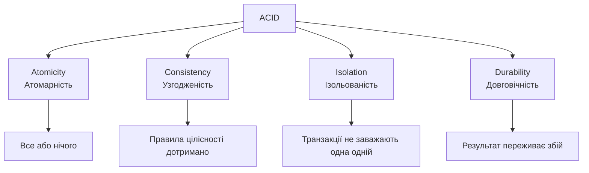
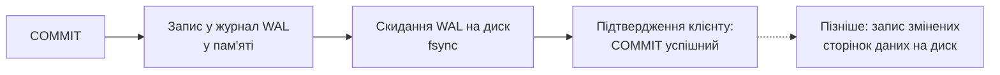
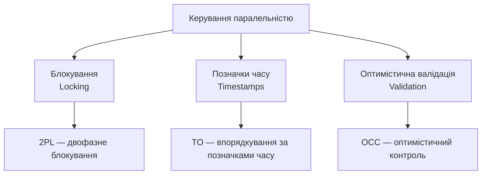
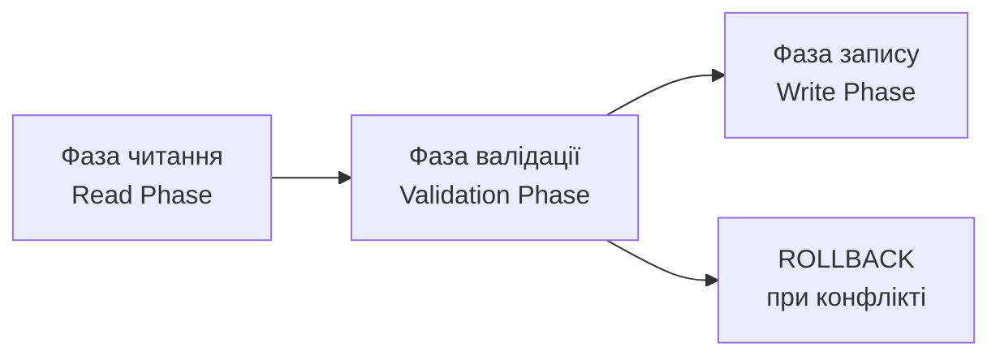
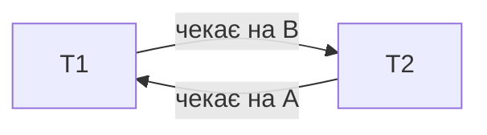
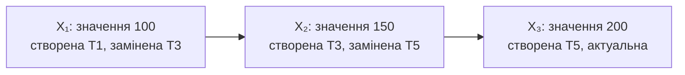
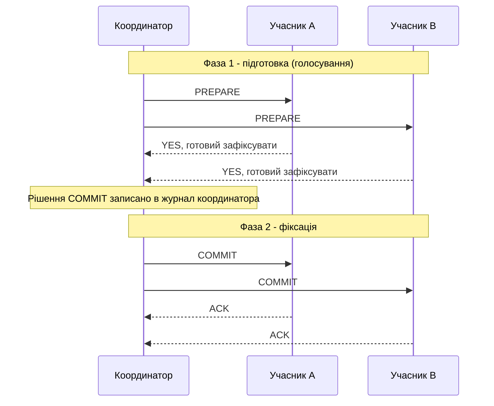
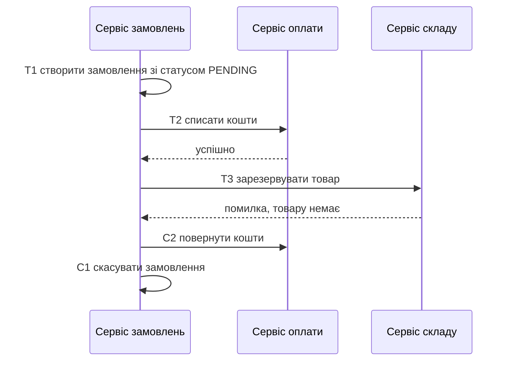
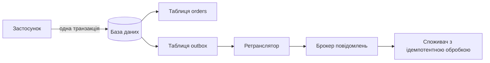

# Лекція 08 Управління транзакціями та паралельним доступом

## Вступ

Сучасні бази даних одночасно обслуговують сотні й тисячі користувачів, які читають і змінюють одні й ті самі дані. Уявіть банківський застосунок: двоє людей одночасно переказують гроші з одного рахунку, а в цей час бухгалтерія формує звіт про залишки. Без належних механізмів контролю така одночасна робота призвела б до хаосу: оновлення губилися б, звіти показували б цифри, яких ніколи не існувало, а збій сервера посеред переказу міг би зробити гроші «привидами», що зникли з одного рахунку й не з'явилися на іншому.

Попередня лекція навчила нас виконувати **окремі запити** швидко. Тепер ми ставимо інше питання: як зробити так, щоб **багато запитів, що працюють одночасно, залишалися коректними**. Відповідь дає теорія транзакцій — один із найфундаментальніших внесків інформатики в інженерію надійних систем.

У цій лекції ми розглянемо поняття транзакції та її властивості (ACID), рівні ізоляції й аномалії, які вони допускають або запобігають, протоколи керування паралельним доступом (блокування, позначки часу, оптимістичну валідацію), взаємоблокування, багатоверсійний контроль паралельності (MVCC) і, нарешті, те, що відбувається, коли одна логічна операція охоплює **кілька різних баз даних чи сервісів** — розподілені транзакції. Останній розділ особливо актуальний для сучасних застосунків із мікросервісною архітектурою.

Практичні приклади орієнтовані на **PostgreSQL 18**. Це не випадковий вибір: стандартні терміни в різних СУБД мають різну реалізацію, тож знати, як саме працює ваша система, — обов'язково. Де поведінка суттєво відрізняється в MySQL, SQL Server чи Oracle, ми це зазначатимемо.

## Концепція транзакції

Транзакція — основна одиниця роботи в системах баз даних. Це логічна одиниця обробки, що може складатися з однієї чи кількох операцій із базою даних і має сенс лише як єдине ціле.

### Визначення транзакції

Транзакція (англ. *transaction*) — це послідовність операцій із базою даних, які виконуються як єдине ціле. Транзакція або виконується повністю (**фіксується**, *commit*), або повністю скасовується (**відкочується**, *rollback*), якщо виникає помилка.

Формально транзакція складається з таких елементів:

- `BEGIN` — початок транзакції
- набір операцій читання (`READ`) та запису (`WRITE`)
- `COMMIT` — успішне завершення, усі зміни стають постійними та видимими іншим
- `ROLLBACK` — скасування всіх змін транзакції

Якщо не відкривати транзакцію явно, кожен окремий SQL-оператор виконується у власній неявній транзакції (режим *autocommit*): він фіксується одразу після завершення. Тому два послідовні `UPDATE` без `BEGIN` — це **дві незалежні** транзакції, і збій між ними залишить базу в проміжному стані.

Приклад простої транзакції переказу коштів між рахунками:

```sql
BEGIN;

-- Зняття коштів з рахунку відправника
UPDATE accounts
SET balance = balance - 1000
WHERE account_id = 'ACC001';

-- Додавання коштів на рахунок отримувача
UPDATE accounts
SET balance = balance + 1000
WHERE account_id = 'ACC002';

-- Реєстрація операції в журналі
INSERT INTO transfer_log (from_account, to_account, amount, created_at)
VALUES ('ACC001', 'ACC002', 1000, CURRENT_TIMESTAMP);

COMMIT;
```

Якщо на будь-якому кроці виникає помилка, транзакцію відкочують і всі зміни зникають. У PostgreSQL після помилки всередині транзакції вона переходить у «аварійний» стан: усі наступні команди відхиляються з повідомленням `current transaction is aborted`, доки не буде виконано `ROLLBACK`. Схематично:

```sql
BEGIN;

UPDATE accounts SET balance = balance - 1000 WHERE account_id = 'ACC001';
-- ERROR: new row for relation "accounts" violates check constraint "accounts_balance_check"
-- Якщо в таблиці задано CHECK (balance >= 0) і коштів не вистачило,
-- транзакція вже не може бути зафіксована

ROLLBACK;
-- Баланс повернуто до початкового стану
```

Зверніть увагу, що перевірку достатності коштів найнадійніше покласти на обмеження `CHECK` у самій базі, а не на «перевірку перед оновленням» у коді застосунку: між перевіркою та оновленням інша транзакція може змінити баланс. Ця проблема («перевірити, а потім діяти») повертатиметься в лекції не раз.

Якщо логіка складніша й потребує умов та виняткових ситуацій, її можна виконати всередині процедурного блоку PL/pgSQL. Оператор `DO` виконується в межах однієї транзакції, і виняток відкочує всі зміни блоку:

```sql
DO $$
DECLARE
    v_balance numeric;
BEGIN
    SELECT balance INTO v_balance
    FROM accounts WHERE account_id = 'ACC001' FOR UPDATE;

    IF v_balance < 1000 THEN
        RAISE EXCEPTION 'Недостатньо коштів на рахунку ACC001';
    END IF;

    UPDATE accounts SET balance = balance - 1000 WHERE account_id = 'ACC001';
    UPDATE accounts SET balance = balance + 1000 WHERE account_id = 'ACC002';
END $$;
```

Тут `FOR UPDATE` блокує рядок відправника, тож ніхто не змінить баланс між перевіркою й оновленням.

Для часткового відкату всередині транзакції існують **точки збереження** (*savepoints*): можна скасувати лише частину зробленого й продовжити.

```sql
BEGIN;
INSERT INTO orders (customer_id, amount) VALUES (1, 500);
SAVEPOINT after_order;
INSERT INTO order_items (order_id, product_id) VALUES (999, 42);  -- помилка
ROLLBACK TO SAVEPOINT after_order;   -- скасовано лише останній INSERT
COMMIT;                               -- замовлення збережено
```

### Операції транзакції

У теорії транзакцій розглядають лише два типи елементарних операцій.

**Операції читання** (`READ` або `SELECT`):

- отримують значення з бази даних;
- не змінюють її стан;
- позначаються як `read(X)`, де X — елемент даних.

**Операції запису** (`WRITE`, тобто `UPDATE`, `INSERT`, `DELETE`):

- змінюють значення в базі даних;
- впливають на стан системи й на інших користувачів;
- позначаються як `write(X)`.

Приклад нотації для переказу 100 одиниць із A на B:

```
T1: BEGIN
T1: read(A)
T1: A := A - 100
T1: write(A)
T1: read(B)
T1: B := B + 100
T1: write(B)
T1: COMMIT
```

Така абстрактна нотація дозволяє міркувати про коректність **розкладів** — взаємного чергування операцій різних транзакцій. Розклад коректний, якщо його результат такий самий, як і в якогось послідовного виконання тих самих транзакцій; такі розклади називають **серіалізовними**. Саме цю ідею розвивають рівні ізоляції й протоколи керування паралельністю, про які йтиметься далі.

## ACID властивості транзакцій

ACID — абревіатура чотирьох властивостей, які має гарантувати надійна транзакційна система: **A**tomicity (атомарність), **C**onsistency (узгодженість, консистентність), **I**solation (ізольованість), **D**urability (довговічність).

Історично ця ідея формувалася поступово. Джим Грей у 1981 році описав транзакцію як одиницю, що має бути атомарною, узгодженою й довговічною; у 1983 році Тео Гергер та Андреас Ройтер додали ізольованість і запропонували саме слово ACID. Відтоді ці чотири властивості лишаються еталоном, з яким порівнюють і реляційні, й нереляційні системи.


```mermaid
graph TB
    A[ACID] --> B["Atomicity<br/>Атомарність"]
    A --> C["Consistency<br/>Узгодженість"]
    A --> D["Isolation<br/>Ізольованість"]
    A --> E["Durability<br/>Довговічність"]

    B --> F["Все або нічого"]
    C --> G["Правила цілісності дотримано"]
    D --> H["Транзакції не заважають одна одній"]
    E --> I["Результат переживає збій"]
```

### Атомарність (Atomicity)

Атомарність гарантує, що транзакція виконується повністю або не виконується зовсім. Часткового виконання не існує. Це принцип «все або нічого»:

- якщо транзакція завершилася успішно (`COMMIT`), усі її зміни застосовано до бази;
- якщо її перервано (`ROLLBACK` або збій), жодна зі змін не залишається;
- проміжні стани транзакції невидимі іншим користувачам.

Ось що відбувається без атомарності — наприклад, при роботі з файлами чи кількома окремими автокомітними операціями:

```
Операція 1: зняти 1000 з рахунку A   ✓ виконано
Операція 2: додати 1000 на рахунок B ✗ збій системи

Результат: гроші зникли з рахунку A, але не з'явилися на рахунку B
```

У системі з атомарністю та сама послідовність, обгорнута в транзакцію, безпечна:

```sql
BEGIN;

UPDATE accounts SET balance = balance - 1000 WHERE account_id = 'A';
-- Якщо тут стається збій сервера...
UPDATE accounts SET balance = balance + 1000 WHERE account_id = 'B';

COMMIT;
-- ...після відновлення система не бачить запису про COMMIT,
-- тому зміни цієї транзакції вважаються скасованими
```

Як цього досягають? Класичний підхід — **журнал транзакцій**: перед зміною даних СУБД записує в нього, що вона збирається зробити, і за потреби використовує ці записи для відкату (*undo*) незавершених транзакцій. PostgreSQL влаштований дещо інакше: завдяки багатоверсійності (розділ про MVCC) старі версії рядків нікуди не зникають, а зміни незафіксованої транзакції просто залишаються невидимими для всіх. Відкат у PostgreSQL тому майже миттєвий і не потребує фізичного відновлення старих значень.

### Узгодженість (Consistency)

Узгодженість гарантує, що транзакція переводить базу даних з одного коректного стану в інший коректний стан, зберігаючи всі визначені правила цілісності. До них належать:

- обмеження домену (типи даних, діапазони значень);
- обмеження ключів (унікальність, обов'язковість);
- посилальна цілісність (зовнішні ключі);
- бізнес-правила (наприклад, баланс не може бути від'ємним).

Важливо розуміти, що узгодженість — єдина з чотирьох властивостей, яку СУБД не може забезпечити самостійно. База гарантує виконання **оголошених** правил; а от чи правильні самі правила, чи не забули ви якесь з них оголосити, залежить від розробника. Атомарність, ізольованість і довговічність — це механізми, а узгодженість — результат їх застосування до коректно описаних обмежень.

Приклад забезпечення узгодженості через обмеження:

```sql
CREATE TABLE accounts (
    account_id  VARCHAR(10) PRIMARY KEY,
    customer_id INT NOT NULL,
    balance     NUMERIC(15,2) NOT NULL CHECK (balance >= 0),
    account_type VARCHAR(20) NOT NULL,
    FOREIGN KEY (customer_id) REFERENCES customers (customer_id)
);

BEGIN;

UPDATE accounts
SET balance = balance - 5000
WHERE account_id = 'ACC001';
-- Якщо на рахунку було 3000:
-- ERROR: new row for relation "accounts" violates check constraint "accounts_balance_check"
-- Транзакція перейшла в аварійний стан і може бути лише відкочена

ROLLBACK;
```

Складніші бізнес-правила, які не виразити одним `CHECK`, реалізують у функціях, тригерах чи в коді застосунку, але завжди **всередині транзакції** і з правильним блокуванням. Розглянемо правило «сума переказів за добу не перевищує 10 000»:

```sql
CREATE OR REPLACE FUNCTION transfer_with_limit(
    p_from text, p_to text, p_amount numeric
) RETURNS void
LANGUAGE plpgsql AS $$
DECLARE
    v_today numeric;
    c_daily_limit CONSTANT numeric := 10000;
BEGIN
    -- Блокуємо рахунок відправника: паралельні перекази з нього
    -- виконуватимуться по черзі, тож ліміт не можна обійти
    PERFORM 1 FROM accounts WHERE account_id = p_from FOR UPDATE;

    SELECT COALESCE(SUM(amount), 0) INTO v_today
    FROM transfer_log
    WHERE from_account = p_from
      AND created_at >= CURRENT_DATE;

    IF v_today + p_amount > c_daily_limit THEN
        RAISE EXCEPTION 'Перевищено денний ліміт переказів';
    END IF;

    UPDATE accounts SET balance = balance - p_amount WHERE account_id = p_from;
    UPDATE accounts SET balance = balance + p_amount WHERE account_id = p_to;
    INSERT INTO transfer_log (from_account, to_account, amount, created_at)
    VALUES (p_from, p_to, p_amount, CURRENT_TIMESTAMP);
END $$;
```

Зверніть увагу на `FOR UPDATE` на початку. Без нього два одночасних перекази по 6000 обидва прочитали б суму за добу, що дорівнює нулю, обидва пройшли б перевірку, і ліміт було б порушено. Це приклад того, як узгодженість залежить від ізольованості — наступної властивості.

### Ізольованість (Isolation)

Ізольованість гарантує, що паралельне виконання транзакцій дає такий самий результат, як і їх послідовне виконання в якомусь порядку. Кожна транзакція працює так, ніби вона єдина в системі.

Що трапляється, коли ізоляції немає? Розглянемо класичні проблеми (аномалії) паралельного доступу.

**Втрата оновлення (Lost Update).** Дві транзакції читають одне значення, кожна змінює його й записує — і друга затирає результат першої.

```
Час    Транзакція T1              Транзакція T2              Значення X
------ -------------------------- -------------------------- -----------
t1     READ(X)  // X = 100                                   100
t2                                 READ(X)  // X = 100       100
t3     X = X + 50                                            100
t4                                 X = X + 30                100
t5     WRITE(X) // X = 150                                   150
t6                                 WRITE(X) // X = 130       130
t7     COMMIT                                                130
t8                                 COMMIT                    130

Очікуваний результат: 100 + 50 + 30 = 180
Фактичний результат: 130 (втрачено +50)
```

**Брудне читання (Dirty Read).** Транзакція читає зміни, які інша транзакція ще не зафіксувала й потім відкотила.

```
Час    Транзакція T1              Транзакція T2              Значення X
------ -------------------------- -------------------------- -----------
t1     READ(X)  // X = 100                                   100
t2     X = X + 50                                            100
t3     WRITE(X) // X = 150                                   150
t4                                 READ(X)  // X = 150       150
t5     ROLLBACK                                              100
t6                                 // Використовує X = 150
t7                                 COMMIT

T2 прочитала значення 150, яке ніколи не було зафіксовано
```

**Неповторюване читання (Non-repeatable Read).** Транзакція двічі читає один і той самий рядок і отримує різні значення, бо між читаннями його змінила й зафіксувала інша транзакція.

```
Час    Транзакція T1              Транзакція T2              Значення X
------ -------------------------- -------------------------- -----------
t1     READ(X)  // X = 100                                   100
t2                                 READ(X)  // X = 100       100
t3                                 X = X + 50                100
t4                                 WRITE(X)                  150
t5                                 COMMIT                    150
t6     READ(X)  // X = 150                                   150

T1 прочитала X двічі й отримала різні значення
```

**Фантомне читання (Phantom Read).** Транзакція двічі виконує запит із однією й тією самою умовою, але між виконаннями інша транзакція додає (або видаляє) рядки, що задовольняють умову, — і набір результатів змінюється.

```sql
-- Транзакція T1: підрахунок студентів групи КН-21
BEGIN;
SELECT COUNT(*) FROM students WHERE group_name = 'КН-21';
-- Результат: 25

-- Транзакція T2: додає нового студента й фіксує
INSERT INTO students (name, group_name) VALUES ('Іванов', 'КН-21');

-- Транзакція T1: повторний підрахунок
SELECT COUNT(*) FROM students WHERE group_name = 'КН-21';
-- Результат: 26 (з'явився «фантом»)
COMMIT;
```

Стандарт SQL описує саме ці чотири явища. Проте, як побачимо в розділі про рівні ізоляції, реальні СУБД мають ще й тонші аномалії, яких стандарт не перелічує, — наприклад, *асиметрію запису* (*write skew*).

Ізольованість забезпечується двома основними групами механізмів: **блокуваннями** та **версіонуванням даних** (MVCC). Обидва ми розглянемо детально.

### Довговічність (Durability)

Довговічність гарантує, що після успішного завершення транзакції (`COMMIT`) її результати збережуться назавжди, навіть якщо сервер одразу після цього втратить живлення.

Ключовий механізм — **журнал попереднього запису** (*Write-Ahead Logging*, WAL). Принцип простий: змінені сторінки даних можуть залишатися в оперативній пам'яті й потрапити на диск пізніше, але **опис змін** спершу записується в послідовний журнал і скидається на диск. Послідовний запис дешевий, а журнал дає змогу відновити зміни після збою.


```mermaid
graph LR
    A["COMMIT"] --> B["Запис у журнал WAL<br/>у пам'яті"]
    B --> C["Скидання WAL на диск<br/>fsync"]
    C --> D["Підтвердження клієнту:<br/>COMMIT успішний"]
    D -.-> E["Пізніше: запис змінених<br/>сторінок даних на диск"]
```

Процес фіксації транзакції:

```
1. Запис операцій у журнал транзакцій на диск
2. Повернення підтвердження користувачу («COMMIT успішний»)
3. Застосування змін до файлів даних (може бути відкладено)

При відновленні після збою:
1. Читання журналу з останньої контрольної точки
2. Повторне виконання (REDO) зафіксованих змін
3. Скасування (UNDO) змін незавершених транзакцій, якщо СУБД їх записала в дані
```

Для прикладу подивимося, як виглядає журнал у **класичній моделі** із записом старих і нових значень (так працюють системи на основі алгоритму ARIES). Це навчальна модель — фактичний формат журналу PostgreSQL інший:

```
[LSN: 1001] BEGIN TRANSACTION T1
[LSN: 1002] T1: OLD_VALUE(accounts.ACC001.balance) = 5000
[LSN: 1003] T1: NEW_VALUE(accounts.ACC001.balance) = 4000
[LSN: 1004] T1: OLD_VALUE(accounts.ACC002.balance) = 2000
[LSN: 1005] T1: NEW_VALUE(accounts.ACC002.balance) = 3000
[LSN: 1006] COMMIT TRANSACTION T1
```

LSN (*Log Sequence Number*) — порядковий номер запису в журналі. Якщо збій стався між записами 1005 і 1006:

```
Відновлення:
- Для T1 немає запису COMMIT
- Система виконує UNDO: повертає OLD_VALUE для всіх змін T1
- Баланси повертаються: ACC001 = 5000, ACC002 = 2000
```

**Контрольні точки** (*checkpoints*) обмежують обсяг роботи при відновленні. Періодично СУБД скидає всі змінені сторінки з пам'яті на диск і ставить у журналі позначку. Після збою відновлення починається не з початку журналу, а з останньої контрольної точки.

```
Часова шкала журналу:
[CP: 5000] CHECKPOINT
[LSN: 5001] BEGIN T1
[LSN: 5002] T1: UPDATE accounts...
[LSN: 5003] BEGIN T2
[LSN: 5004] T2: INSERT INTO transfer_log...
[LSN: 5005] COMMIT T1
[LSN: 5006] BEGIN T3
[LSN: 5007] T3: UPDATE accounts...
[ЗБІЙ СИСТЕМИ]

Відновлення:
1. Знайти останню контрольну точку (CP: 5000)
2. T1 зафіксована після контрольної точки — виконати REDO
3. T2 та T3 не зафіксовані — їхні зміни скасувати (UNDO)
```

У PostgreSQL WAL працює за принципом лише повторення (*redo-only*): після збою сервер повторює зміни з журналу, а зміни незафіксованих транзакцій залишаються в даних, але через механізм версій нікому не видимі й пізніше очищуються.

**Довговічність — це компроміс.** Скидання журналу на диск (`fsync`) при кожному `COMMIT` — найповільніша частина транзакції. Параметр `synchronous_commit = off` дозволяє серверу підтверджувати транзакцію до фізичного запису WAL, що значно прискорює запис, ціною ризику **втратити кілька останніх зафіксованих транзакцій** (проте не пошкодити базу) у разі аварії. Для журналів подій чи метрик це цілком розумний вибір, для фінансових операцій — ні. У реплікованих системах довговічність додатково залежить від того, чи чекає первинний сервер підтвердження від реплік (*синхронна реплікація*).

## Рівні ізоляції транзакцій

Повна ізоляція (виконання так, ніби транзакції йдуть по черзі) коштує продуктивності: що більше транзакцій можуть працювати справді паралельно, то вища пропускна здатність. Тому стандарт SQL визначає чотири рівні ізоляції, які пропонують компроміс між коректністю та швидкістю. Чим вищий рівень, тим менше аномалій він допускає, але тим більше конфліктів і очікувань виникає.

### Огляд рівнів ізоляції

Рівні ізоляції й аномалії, які стандарт SQL дозволяє на кожному з них:

| Рівень ізоляції | Брудне читання | Неповторюване читання | Фантомне читання |
|-----------------|----------------|-----------------------|------------------|
| READ UNCOMMITTED | Можливо | Можливо | Можливо |
| READ COMMITTED | Неможливо | Можливо | Можливо |
| REPEATABLE READ | Неможливо | Неможливо | Можливо |
| SERIALIZABLE | Неможливо | Неможливо | Неможливо |

Однак таблиця стандарту показує лише **мінімальні гарантії**. Реальні СУБД реалізують рівні по-різному, і часто дають більше, ніж вимагає стандарт:

| СУБД | Рівень за замовчуванням | Особливості |
|------|------------------------|-------------|
| PostgreSQL | READ COMMITTED | `READ UNCOMMITTED` поводиться як `READ COMMITTED`; `REPEATABLE READ` — знімкова ізоляція без фантомів; `SERIALIZABLE` — серіалізовна знімкова ізоляція (SSI) |
| MySQL (InnoDB) | REPEATABLE READ | Знімкове читання плюс блокування проміжків (*gap locks*) при блокувальних запитах |
| SQL Server | READ COMMITTED | За замовчуванням працює на блокуваннях; режим `READ_COMMITTED_SNAPSHOT` вмикає версіонування |
| Oracle | READ COMMITTED | `SERIALIZABLE` фактично є знімковою ізоляцією; `READ UNCOMMITTED` не підтримується |

Керування рівнем у PostgreSQL:

```sql
-- Для однієї транзакції — одразу в команді BEGIN
BEGIN ISOLATION LEVEL REPEATABLE READ;
-- ... запити ...
COMMIT;

-- Або першою командою після BEGIN, до будь-якого запиту
BEGIN;
SET TRANSACTION ISOLATION LEVEL SERIALIZABLE;
-- ... запити ...
COMMIT;

-- Значення за замовчуванням для сеансу
SET SESSION CHARACTERISTICS AS TRANSACTION ISOLATION LEVEL REPEATABLE READ;
```

> Команда `SET TRANSACTION ISOLATION LEVEL` діє лише на **поточну** транзакцію й лише до першого запиту в ній. Якщо виконати її поза транзакцією (без `BEGIN`), PostgreSQL видасть попередження й нічого не змінить, бо транзакція вже завершилася разом із командою.

### READ UNCOMMITTED

Найнижчий рівень: транзакція може бачити незафіксовані зміни інших транзакцій. Блокувань на читання немає, тому швидкість максимальна, а гарантій майже немає. Стандарт допускає на цьому рівні всі три аномалії.

```sql
-- Сесія 1
BEGIN;
UPDATE products SET price = 100 WHERE product_id = 'P001';
-- Транзакція не завершена, зміна не зафіксована

-- Сесія 2 (READ UNCOMMITTED у MySQL або SQL Server)
SET TRANSACTION ISOLATION LEVEL READ UNCOMMITTED;
BEGIN;
SELECT price FROM products WHERE product_id = 'P001';
-- Повертає 100 — незафіксоване значення
COMMIT;

-- Сесія 1
ROLLBACK;
-- price знову 90, але сесія 2 уже використала значення 100
```

У PostgreSQL цей сценарій закінчиться інакше: `READ UNCOMMITTED` там прирівняно до `READ COMMITTED`, і сесія 2 отримає старе значення 90. Це не помилка, а свідоме рішення: завдяки версіонуванню читання і так ніколи не блокується, тож «прискорювати» його дозволом брудних читань немає сенсу.

Де `READ UNCOMMITTED` справді використовують (у СУБД, що його підтримують): наближені звіти й моніторинг, де важлива швидкість, а не точність. Проте це небезпечна звичка — для звітів майже завжди краще підходить знімкова ізоляція, яка й швидка, і точна.

### READ COMMITTED

Стандартний рівень у більшості СУБД (PostgreSQL, Oracle, SQL Server). Кожен **окремий запит** бачить лише ті дані, що були зафіксовані до його початку. Брудного читання немає, але два запити всередині однієї транзакції можуть бачити різний стан бази.

```sql
BEGIN;  -- READ COMMITTED за замовчуванням

SELECT balance FROM accounts WHERE account_id = 'ACC001';
-- Результат: 5000

-- Інша транзакція змінює баланс на 6000 і фіксує

SELECT balance FROM accounts WHERE account_id = 'ACC001';
-- Результат: 6000 — неповторюване читання

COMMIT;
```

Запобігання брудному читанню:

```sql
-- Сесія 1
BEGIN;
UPDATE products SET price = 100 WHERE product_id = 'P001';
-- Зміну не зафіксовано

-- Сесія 2 (READ COMMITTED)
SELECT price FROM products WHERE product_id = 'P001';
-- Повертає 90: незафіксованого значення сесія 2 не бачить, і не чекає

-- Сесія 1
COMMIT;

-- Сесія 2: наступний запит уже бачить 100
```

Різниця між СУБД видна саме тут: у PostgreSQL читач не чекає й бачить попередню зафіксовану версію, а в SQL Server у режимі за замовчуванням, що працює на блокуваннях, читач **чекав би** завершення сесії 1.

Особливість `READ COMMITTED` у PostgreSQL: якщо `UPDATE` натрапляє на рядок, який щойно змінила й зафіксувала інша транзакція, він перечитує оновлену версію й перевіряє умову `WHERE` ще раз. Завдяки цьому вираз `SET balance = balance - 100` є безпечним і не спричиняє втрати оновлення навіть на цьому рівні. А от схема «прочитати значення в застосунок, обчислити, записати назад» безпечною не є.

```sql
-- БЕЗПЕЧНО на будь-якому рівні: обчислення виконує сама база
UPDATE accounts SET balance = balance - 100 WHERE account_id = 'ACC001';

-- НЕБЕЗПЕЧНО на READ COMMITTED: значення обчислено в застосунку між двома запитами
-- (1) SELECT balance FROM accounts WHERE account_id = 'ACC001';  -- застосунок отримав 500
-- (2) UPDATE accounts SET balance = 400 WHERE account_id = 'ACC001';
```

### REPEATABLE READ

Гарантує узгоджене читання протягом усієї транзакції. У PostgreSQL це **знімкова ізоляція**: транзакція бачить стан бази на момент першого запиту в ній (знімок), і жодні зміни інших транзакцій, зафіксовані пізніше, її не стосуються.

```sql
BEGIN ISOLATION LEVEL REPEATABLE READ;

SELECT balance FROM accounts WHERE account_id = 'ACC001';
-- Результат: 5000

-- Інша транзакція змінює баланс на 6000 і фіксує (вона НЕ блокується!)

SELECT balance FROM accounts WHERE account_id = 'ACC001';
-- Результат: 5000 — те саме значення, читання повторюване

COMMIT;
```

Зверніть увагу: **писар не чекає читача**. Ця відмінність від моделі блокувань суттєва. У класичній моделі «читання блокує запис» зміну довелося б відкласти до завершення першої транзакції; у знімковій — обидві працюють одночасно, і кожна бачить свою версію.

Що ж тоді, якщо *обидві* транзакції змінюють один рядок? Тут діє правило «перший записувач перемагає»:

```sql
-- Сесія 1 (REPEATABLE READ)
BEGIN ISOLATION LEVEL REPEATABLE READ;
SELECT price FROM products WHERE product_id = 'P001';    -- 90

-- Сесія 2
BEGIN;
UPDATE products SET price = 100 WHERE product_id = 'P001';
COMMIT;                                                   -- зафіксовано

-- Сесія 1 намагається змінити той самий рядок
UPDATE products SET price = price + 5 WHERE product_id = 'P001';
-- ERROR: could not serialize access due to concurrent update
-- Транзакцію потрібно відкотити й виконати знову
```

Застосунок, що працює на `REPEATABLE READ` або `SERIALIZABLE`, **зобов'язаний уміти повторювати транзакцію** після такої помилки (SQLSTATE `40001`). Це не збій, а нормальний механізм розв'язання конфлікту; ми покажемо код повторної спроби нижче.

Щодо фантомів: стандарт SQL на цьому рівні їх допускає, а от знімкова ізоляція PostgreSQL їх **не допускає** — знімок «замикає» весь набір видимих рядків. Тому запит

```sql
BEGIN ISOLATION LEVEL REPEATABLE READ;
SELECT COUNT(*) FROM orders WHERE customer_id = 'C001';   -- 5
-- Інша транзакція вставляє й фіксує нове замовлення цього клієнта
SELECT COUNT(*) FROM orders WHERE customer_id = 'C001';   -- усе ще 5
COMMIT;
```

у PostgreSQL дасть 5 обидва рази. У MySQL/InnoDB звичайні `SELECT` теж читають знімок, а от блокувальні запити (`SELECT ... FOR UPDATE`, `UPDATE`) бачать найновіші дані та блокують проміжки в індексі, щоб не допустити фантомів. Тому «що саме гарантує REPEATABLE READ» — залежить від СУБД.

### SERIALIZABLE

Найвищий рівень: результат паралельного виконання завжди збігається з результатом деякого послідовного виконання тих самих транзакцій. Усі аномалії, включно з тонкими, неможливі.

У PostgreSQL цей рівень реалізовано як **серіалізовну знімкову ізоляцію** (*Serializable Snapshot Isolation*, SSI). Транзакції працюють, як на `REPEATABLE READ`, але СУБД додатково стежить за залежностями «читання—запис» між ними (за допомогою так званих предикатних блокувань, які **нікого не блокують**) і, виявивши небезпечний цикл залежностей, примусово відкочує одну з транзакцій із помилкою серіалізації:

```
ERROR: could not serialize access due to read/write dependencies among transactions
```

Це принципова відмінність від блокувальної моделі: замість очікування ми отримуємо оптимістичну схему — «працюйте вільно, а якщо виявиться, що результат не відповідає жодному послідовному порядку, одну з вас доведеться повторити». Тому:

- код застосунку **обов'язково** має повторювати транзакцію при помилках з кодом `40001` (`serialization_failure`) і `40P01` (`deadlock_detected`);
- транзакції повинні бути короткими, щоб зменшити ймовірність конфліктів;
- на цьому рівні краще позначати транзакції, що лише читають, як `READ ONLY` — це знижує накладні витрати.

Типовий цикл повторних спроб у застосунку (мовою Python, бібліотека `psycopg` 3):

```python
import random
import time

import psycopg
from psycopg import errors

def run_serializable(conn: psycopg.Connection, work, max_attempts: int = 5):
    """Виконує функцію work(conn) в транзакції SERIALIZABLE з повторами."""
    conn.autocommit = True                    # транзакціями керуємо явно
    conn.isolation_level = psycopg.IsolationLevel.SERIALIZABLE

    for attempt in range(max_attempts):
        try:
            with conn.transaction():          # BEGIN ... COMMIT / ROLLBACK
                return work(conn)
        except (errors.SerializationFailure, errors.DeadlockDetected):
            # Експоненційна затримка з випадковим «дрижанням»
            time.sleep(random.uniform(0, 0.05 * 2 ** attempt))
    raise RuntimeError("Транзакцію не вдалося виконати після кількох спроб")
```

Головне правило: повторювати потрібно **всю транзакцію цілком**, з повторним читанням даних, а не лише останню команду, що завершилася помилкою.

### Аномалії, яких не описує стандарт

Чотири аномалії стандарту SQL — не вичерпний перелік. Знімкова ізоляція (та `REPEATABLE READ` у PostgreSQL) захищає від них, але допускає ще одну, тонкішу:

**Асиметрія запису (Write Skew).** Дві транзакції читають перетин одних і тих самих даних, ухвалюють рішення на основі прочитаного, а потім кожна змінює **різні** рядки. Жоден рядок не змінили обидві, тому «перший записувач перемагає» не спрацьовує, а спільне правило порушено.

Нехай діє правило: сума балансів двох пов'язаних рахунків не має бути від'ємною.

```sql
-- Початковий стан: ACC001 = 100, ACC002 = 100 (сума 200)

-- Транзакція T1
BEGIN ISOLATION LEVEL REPEATABLE READ;
SELECT SUM(balance) FROM accounts WHERE account_id IN ('ACC001', 'ACC002');
-- 200 — знімаємо 150 з ACC001: сума лишиться 50 ≥ 0
UPDATE accounts SET balance = balance - 150 WHERE account_id = 'ACC001';

-- Транзакція T2 (паралельно)
BEGIN ISOLATION LEVEL REPEATABLE READ;
SELECT SUM(balance) FROM accounts WHERE account_id IN ('ACC001', 'ACC002');
-- 200 — знімаємо 150 з ACC002: сума лишиться 50 ≥ 0
UPDATE accounts SET balance = balance - 150 WHERE account_id = 'ACC002';

COMMIT;  -- T1
COMMIT;  -- T2

-- Результат: ACC001 = -50, ACC002 = -50, сума = -100. Правило порушено!
```

Кожна транзакція окремо діяла коректно, але разом вони зруйнували інваріант. Є три способи цього уникнути:

1. Виконувати такі транзакції на рівні `SERIALIZABLE` з повторними спробами — PostgreSQL виявить небезпечну залежність і відкотить одну з них.
2. Явно заблокувати всі рядки, від яких залежить рішення (`SELECT ... FOR UPDATE` за обома рахунками).
3. Перенести правило на рівень схеми (обмеження, що охоплює обидва значення) — де це можливо.

**Асиметрія читання (Read Skew)** — це те, що трапляється на `READ COMMITTED`, коли два запити всередині однієї транзакції читають різні частини даних до й після чужого фіксування (наприклад, баланс двох рахунків, між читаннями яких відбувся переказ, і сума виходить хибною).

### Вибір рівня ізоляції

Рівень ізоляції — це інженерне рішення, а не питання «чим вище, тим краще»:

- **`READ COMMITTED`** — розумний вибір за замовчуванням для більшості вебзастосунків із короткими запитами, де кожен запит самодостатній.
- **`REPEATABLE READ`** — коли транзакція має бачити **узгоджений знімок** кількох запитів: формування звітів, експорт даних (саме на цьому рівні працює `pg_dump`), обчислення, що спираються на кілька читань. Застосунок має бути готовий повторювати транзакцію при `40001`.
- **`SERIALIZABLE`** — коли правила узгодженості охоплюють кілька рядків і їх складно захистити явними блокуваннями: бронювання, інвентаризація, фінансові інваріанти. Також вимагає повторних спроб.
- **`READ UNCOMMITTED`** — практично не використовується.

Відкат при конфліктах — це ціна, яку платять за коректність без блокувань. Її потрібно закладати в архітектуру застосунку з самого початку.

## Протоколи управління паралельністю

Щоб забезпечити ізоляцію, СУБД застосовують протоколи керування паралельністю. Існує три класичні підходи, які відрізняються тим, коли й як вони виявляють конфлікти.


```mermaid
graph TB
    A[Керування паралельністю] --> B["Блокування<br/>Locking"]
    A --> C["Позначки часу<br/>Timestamps"]
    A --> D["Оптимістична валідація<br/>Validation"]

    B --> E["2PL — двофазне блокування"]
    C --> F["TO — впорядкування за позначками часу"]
    D --> G["OCC — оптимістичний контроль"]
```

Це «чисті» моделі. Реальні системи комбінують підходи: PostgreSQL, наприклад, використовує багатоверсійність для читання, блокування рядків для запису та оптимістичну схему в `SERIALIZABLE`.

### Протокол блокування

Блокування — найпоширеніший механізм. Перш ніж отримати доступ до об'єкта даних, транзакція мусить отримати на нього блокування. Що більше й суворіше блокування, то вища ізоляція, але й нижча паралельність.

**Типи блокувань:**

*Спільне блокування* (Shared Lock, S-lock):

- застосовується при читанні;
- кілька транзакцій можуть одночасно утримувати S-lock на один об'єкт;
- не дозволяє іншим отримати X-lock.

*Виключне блокування* (Exclusive Lock, X-lock):

- застосовується при записі;
- лише одна транзакція може утримувати X-lock на об'єкт;
- не дозволяє іншим отримати жодного блокування.

Матриця сумісності блокувань:

| Утримується \ Запитується | S-lock | X-lock |
|---------------------------|:------:|:------:|
| **S-lock** | ✓ | ✗ |
| **X-lock** | ✗ | ✗ |

✓ — сумісно (блокування надається), ✗ — несумісно (транзакція чекає).

```sql
-- Транзакція T1: читає й утримує S-lock на запис
-- (у моделі, що працює на блокуваннях)
-- Інші транзакції теж можуть отримати S-lock, але не X-lock
```

```sql
-- Транзакція T2
BEGIN;

-- Отримує X-lock на рядок
UPDATE accounts
SET balance = balance + 1000
WHERE account_id = 'ACC001';

-- Інші транзакції, що хочуть змінити цей рядок, чекатимуть
COMMIT;  -- Блокування звільняються
```

**Двофазний протокол блокування** (Two-Phase Locking, 2PL) гарантує серіалізовність. Його правило: транзакція проходить дві фази.

- *Фаза зростання* (growing): транзакція отримує блокування і не звільняє жодного;
- *Фаза скорочення* (shrinking): після першого звільнення транзакція вже не може отримувати нових блокувань.

```
Транзакція T1:
BEGIN
    LOCK-S(A)      // Фаза зростання
    READ(A)
    LOCK-X(B)      // Фаза зростання
    READ(B)
    B = B + A
    WRITE(B)
    UNLOCK(A)      // Початок фази скорочення
    UNLOCK(B)      // Фаза скорочення
COMMIT
```

Базовий 2PL захищає від некоректних розкладів, але має недолік: якщо T1 звільнила X-lock до `COMMIT`, а потім відкотилася, транзакції, які встигли прочитати її зміни, теж доведеться відкотити. Це **каскадний відкат**. Його уникають у **строгому двофазному протоколі** (Strict 2PL): усі виключні блокування утримуються до `COMMIT` або `ROLLBACK`. Саме цей варіант використовують комерційні СУБД, що працюють на блокуваннях.

```
Транзакція T1 (Strict 2PL):
BEGIN
    LOCK-S(A)
    READ(A)
    LOCK-X(B)
    READ(B)
    B = B + A
    WRITE(B)
    // Виключні блокування НЕ звільняються
COMMIT           // ВСІ блокування звільняються тут
```

**Гранулярність блокування.** СУБД може блокувати дані на різних рівнях: усю базу, таблицю, сторінку, окремий рядок. Дрібніша гранулярність дає вищу паралельність, але потребує більше пам'яті на облік блокувань.

```
База даних
    ├── Таблиця
    │   ├── Сторінка (Page)
    │   │   └── Рядок (Row)
    │   └── Індекс
```

```sql
-- Блокування на рівні рядка (найдрібніша гранулярність)
BEGIN;
SELECT * FROM accounts WHERE account_id = 'ACC001' FOR UPDATE;
-- Блокується лише один рядок
UPDATE accounts SET balance = balance + 100 WHERE account_id = 'ACC001';
COMMIT;

-- Блокування на рівні таблиці (найгрубіша гранулярність)
BEGIN;
LOCK TABLE accounts IN EXCLUSIVE MODE;
-- Інші можуть лише читати; жодних змін таблиці, доки триває транзакція
UPDATE accounts SET balance = balance * 1.05;
COMMIT;
```

**Інтенційні блокування** (*Intention Locks*). Щоб не перевіряти при блокуванні таблиці кожен її рядок на наявність блокувань, транзакція, що збирається блокувати рядок, спершу позначає намір на вищих рівнях ієрархії:

- **IS** (Intention Shared) — намір отримати S-lock на нижчому рівні;
- **IX** (Intention Exclusive) — намір отримати X-lock на нижчому рівні;
- **SIX** (Shared + Intention Exclusive) — S-lock на поточному рівні й намір X-lock на нижчому.

Матриця сумісності:

| Утримується \ Запитується | IS | IX | S | SIX | X |
|---------------------------|:--:|:--:|:-:|:---:|:-:|
| **IS**  | ✓ | ✓ | ✓ | ✓ | ✗ |
| **IX**  | ✓ | ✓ | ✗ | ✗ | ✗ |
| **S**   | ✓ | ✗ | ✓ | ✗ | ✗ |
| **SIX** | ✓ | ✗ | ✗ | ✗ | ✗ |
| **X**   | ✗ | ✗ | ✗ | ✗ | ✗ |

Порядок дій, коли транзакція хоче **змінити рядок**:

```
1. Отримати IX-lock на базу даних
2. Отримати IX-lock на таблицю
3. Отримати X-lock на рядок
4. Виконати оновлення
5. Звільнити блокування при COMMIT
```

(Для **читання** рядка на верхніх рівнях брали б IS.) Тепер якщо інша транзакція хоче заблокувати всю таблицю для читання (S-lock), вона одразу бачить, що на таблиці вже є IX від першої транзакції — вони несумісні, і перевіряти окремі рядки не потрібно.

**Блокування в PostgreSQL.** PostgreSQL має кілька режимів блокування рядків, які вказуються в запитах `SELECT ... FOR ...`:

| Режим | Призначення |
|-------|-------------|
| `FOR UPDATE` | Найсильніший: рядок буде змінено або видалено |
| `FOR NO KEY UPDATE` | Рядок буде змінено, але без зміни ключових стовпців; слабший, не заважає `FOR KEY SHARE` |
| `FOR SHARE` | Рядок можна читати, але не змінювати |
| `FOR KEY SHARE` | Найслабший: не дозволяє лише видалити рядок чи змінити ключ; саме його автоматично бере перевірка зовнішнього ключа |

Додатково до цих режимів можна вказати поведінку, коли блокування недоступне:

```sql
-- Не чекати: одразу повернути помилку, якщо рядок заблоковано
SELECT * FROM accounts WHERE account_id = 'ACC001' FOR UPDATE NOWAIT;

-- Пропустити заблоковані рядки (класичний шаблон черги завдань)
SELECT id, payload FROM jobs
WHERE status = 'pending'
ORDER BY id
LIMIT 10
FOR UPDATE SKIP LOCKED;
```

Варіант `SKIP LOCKED` дозволяє кільком працівникам одночасно розбирати одну чергу завдань, не чекаючи один одного: кожен бере тільки ті рядки, які ще нікому не дісталися. Для блокувань, що не прив'язані до рядків таблиці (наприклад, «лише один процес запускає це нічне завдання»), існують **консультативні блокування** (*advisory locks*): `pg_advisory_xact_lock(ключ)`, які знімаються автоматично в кінці транзакції.

Цікава особливість: блокування рядків PostgreSQL не зберігає в загальній таблиці блокувань у пам'яті, а позначає прямо в заголовку версії рядка. Тому можна заблокувати мільйони рядків і не вичерпати пам'ять на облік блокувань, проте блокування рядка часто означає запис на диск.

### Протокол позначок часу

Альтернативний підхід, який узагалі не використовує блокувань: кожна транзакція отримує унікальну позначку часу, а система гарантує, що результат еквівалентний послідовному виконанню в порядку цих позначок.

Кожна транзакція T отримує позначку TS(T) при старті. Менша позначка означає, що транзакція «старша». Для кожного елемента даних X зберігаються:

- `read_TS(X)` — позначка останньої транзакції, що читала X;
- `write_TS(X)` — позначка останньої транзакції, що записувала X.

Правила протоколу.

Операція `READ(X)` від транзакції T:

```
Якщо TS(T) < write_TS(X):
    // T намагається прочитати значення, яке «з майбутнього» вже перезаписане
    ROLLBACK T (повторити з новою позначкою)
Інакше:
    Виконати READ(X)
    read_TS(X) = max(read_TS(X), TS(T))
```

Операція `WRITE(X)` від транзакції T:

```
Якщо TS(T) < read_TS(X):
    // Молодша транзакція вже прочитала X; наш запис зробив би її читання хибним
    ROLLBACK T
Інакше, якщо TS(T) < write_TS(X):
    // Запис застарів: у базі вже є новіше значення
    Базовий протокол: ROLLBACK T
    Правило Томаса (Thomas Write Rule): просто пропустити цей запис
Інакше:
    Виконати WRITE(X)
    write_TS(X) = TS(T)
```

Приклад:

```
Стан: X = 50, read_TS(X) = 10, write_TS(X) = 5

T1 з TS = 15:  READ(X)
    15 >= write_TS(5) ✓ → прочитано X = 50; read_TS(X) = 15

T2 з TS = 12:  WRITE(X, 60)
    12 < read_TS(15) ✗ → T2 намагається записати значення,
    яке вже прочитала пізніша транзакція: ROLLBACK T2

T3 з TS = 20:  WRITE(X, 70)
    20 >= read_TS(15) ✓ та 20 >= write_TS(5) ✓ → X = 70; write_TS(X) = 20
```

**Багатоверсійний варіант** (Multiversion Timestamp Ordering) зберігає кілька версій кожного об'єкта, і читання ніколи не відхиляється: транзакція просто отримує ту версію, яка була актуальною на момент її позначки.

```
Версії X: X₁ (write_TS = 5), X₂ (write_TS = 10), X₃ (write_TS = 15)

Транзакція T з TS(T) = 12 читає X:
Вибирається версія X₂ (10 ≤ 12 < 15)
```

Саме ця ідея лежить в основі MVCC, який розглянемо згодом.

Переваги: немає взаємоблокувань; читання не чекають; добре підходить для розподілених систем (позначки можна узгоджувати між вузлами — наприклад, Google Spanner використовує для цього спеціальні годинники TrueTime).

Недоліки: більше відкатів порівняно з блокуванням; накладні витрати на облік позначок і версій; складність реалізації.

### Протокол оптимістичної валідації

Оптимістичний підхід виходить із припущення, що конфлікти трапляються рідко. Транзакція виконується без жодних перевірок, а лише перед фіксацією система перевіряє, чи не конфліктує вона з іншими. Якщо конфлікт виявлено — транзакцію відкочують і виконують заново.


```mermaid
graph LR
    A["Фаза читання<br/>Read Phase"] --> B["Фаза валідації<br/>Validation Phase"]
    B --> C["Фаза запису<br/>Write Phase"]
    B --> D["ROLLBACK<br/>при конфлікті"]
```

**Фаза читання** (Read Phase): транзакція читає дані з бази, а всі зміни записує в локальний буфер (не в базу). Формуються множини прочитаних (`read_set`) і змінених (`write_set`) елементів.

**Фаза валідації** (Validation Phase): перевіряється, чи не конфліктує транзакція з іншими, що завершилися під час її виконання. За відсутності конфліктів — перехід до запису, інакше — `ROLLBACK`.

**Фаза запису** (Write Phase): зміни з локального буфера застосовуються до бази, і транзакція фіксується.

Правила валідації для транзакції Tᵢ, яка проходить перевірку, щодо кожної раніше завершеної транзакції Tⱼ (з меншою позначкою): має виконуватися **одна** з трьох умов:

```
1. Tj завершила всі фази ДО початку Ti (жодного перетину в часі).

2. write_set(Tj) ∩ read_set(Ti) = ∅ , і Tj завершила фазу запису
   ДО початку фази запису Ti.
   (Ti не читала нічого з того, що змінила Tj.)

3. write_set(Tj) ∩ read_set(Ti) = ∅ , і write_set(Tj) ∩ write_set(Ti) = ∅ ,
   і Tj завершила фазу читання ДО завершення фази читання Ti.
```

Приклад успішної валідації:

```
Транзакція T1: read_set = {A}, write_set = {A}
Транзакція T2: read_set = {B}, write_set = {B}
T2 завершилась першою; при валідації T1:
    write_set(T2) ∩ read_set(T1)  = {B} ∩ {A} = ∅ ✓
    write_set(T2) ∩ write_set(T1) = ∅ ✓
Конфліктів немає → T1 фіксується
```

Приклад конфлікту:

```
Транзакція T1: READ(X) = 100, планує WRITE(X) = 120
                read_set(T1) = {X}, write_set(T1) = {X}

Транзакція T2: READ(X) = 100, WRITE(X) = 150, COMMIT — успішно
                write_set(T2) = {X}

Валідація T1:
    write_set(T2) ∩ read_set(T1) = {X} ≠ ∅   ← конфлікт!
    T1 прочитала X до того, як T2 його змінила, тож її обчислення
    ґрунтуються на застарілому значенні → ROLLBACK T1 і повтор
```

**Оптимістичний контроль у застосунках.** Саме цей принцип використовують у вебзастосунках, коли користувач відкриває форму редагування, довго її заповнює й лише потім натискає «Зберегти». Утримувати транзакцію відкритою, доки людина думає, **не можна**: це утримує ресурси, блокує очищення старих версій і виснажує з'єднання. Тому «транзакція» тут розтягується на кілька коротких транзакцій бази, а конфлікти виявляє **стовпець версії**.

```sql
-- 1. Читання (окрема коротка транзакція): отримуємо дані та поточну версію
SELECT name, email, version FROM users WHERE user_id = 123;
-- застосунок запам'ятовує version = 7; користувач редагує форму хвилинами

-- 2. Збереження (інша коротка транзакція): один атомарний оператор
UPDATE users
SET name = 'Нове ім''я',
    email = 'new@email.com',
    version = version + 1
WHERE user_id = 123 AND version = 7;

-- Якщо оновлено 0 рядків — хтось змінив запис раніше:
-- показуємо користувачу «Дані були змінені іншим користувачем»
```

Критично, що перевірка версії та оновлення — це **один** оператор. Якщо спершу окремим `SELECT` перевірити версію, а потім виконати `UPDATE`, між цими двома командами інша транзакція може встигнути змінити запис, і перевірка нічого не варта. Кількість змінених рядків (`rowcount` у драйвері бази) — і є результатом валідації.

Такий же підхід переносять на рівень HTTP: сервер повертає заголовок `ETag` із версією ресурсу, а клієнт при зміні надсилає `If-Match`; у разі розбіжності сервер відповідає `412 Precondition Failed`. Багато ORM мають вбудовану підтримку (`@Version` у JPA/Hibernate, `lock_version` у Ruby on Rails).

Переваги оптимістичної валідації: відсутність блокувань під час читання; висока паралельність при низькій конфліктності; ефективність для транзакцій, що переважно читають.

Недоліки: високі накладні витрати при частих конфліктах (багато повторень); потреба в повторному виконанні відкочених транзакцій; складність для довгих складних транзакцій.

## Виявлення та вирішення взаємоблокувань

Взаємоблокування (*deadlock*) виникає, коли кілька транзакцій чекають одна на одну по колу, і жодна не може продовжити виконання. Це неминучий побічний ефект будь-якої системи на основі блокувань: там, де є очікування, можлива й циклічна залежність очікувань.

### Класичний приклад взаємоблокування

```
Транзакція T1:                  Транзакція T2:
LOCK-X(A) ✓                     LOCK-X(B) ✓
READ(A)                         READ(B)
A = A - 100                     B = B - 200
LOCK-X(B) ⏳ чекає              LOCK-X(A) ⏳ чекає
...                             ...
```

Залежності очікування зручно зображати **графом очікування** (*wait-for graph*): вершини — транзакції, ребро Tᵢ → Tⱼ означає, що Tᵢ чекає на ресурс, який утримує Tⱼ. Взаємоблокування існує тоді й лише тоді, коли в графі є цикл.


```mermaid
graph LR
    T1 -->|"чекає на B"| T2
    T2 -->|"чекає на A"| T1
```

Той самий сценарій у SQL:

```sql
-- Час t1: транзакція T1
BEGIN;
UPDATE accounts SET balance = balance - 100 WHERE account_id = 'ACC001';
-- T1 отримує X-lock на рядок ACC001

-- Час t2: транзакція T2
BEGIN;
UPDATE accounts SET balance = balance - 200 WHERE account_id = 'ACC002';
-- T2 отримує X-lock на рядок ACC002

-- Час t3: T1 продовжує
UPDATE accounts SET balance = balance + 100 WHERE account_id = 'ACC002';
-- T1 чекає на X-lock рядка ACC002 (його утримує T2)

-- Час t4: T2 продовжує
UPDATE accounts SET balance = balance + 200 WHERE account_id = 'ACC001';
-- T2 чекає на X-lock рядка ACC001 (його утримує T1)

-- Цикл: T1 чекає T2, T2 чекає T1
-- Через deadlock_timeout PostgreSQL виявить цикл і відкотить одну з транзакцій:
-- ERROR: deadlock detected   (SQLSTATE 40P01)
```

### Методи боротьби з взаємоблокуванням

Існує три підходи: запобігання, уникнення й виявлення.

**Запобігання: упорядкування ресурсів.** Найпростіший і найнадійніший спосіб — домовитися, що всі транзакції захоплюють ресурси в однаковому порядку. Тоді цикл очікування неможливий. Для переказу між двома рахунками — завжди блокувати спершу рахунок із меншим ідентифікатором:

```sql
CREATE OR REPLACE FUNCTION transfer_money(
    p_from text, p_to text, p_amount numeric
) RETURNS void
LANGUAGE plpgsql AS $$
BEGIN
    -- Блокуємо обидва рахунки в детермінованому порядку
    PERFORM 1
    FROM accounts
    WHERE account_id IN (p_from, p_to)
    ORDER BY account_id
    FOR UPDATE;

    UPDATE accounts SET balance = balance - p_amount WHERE account_id = p_from;
    UPDATE accounts SET balance = balance + p_amount WHERE account_id = p_to;
END $$;
```

Незалежно від того, який рахунок є відправником, а який отримувачем, обидві транзакції захоплять їх в одному порядку, і одна просто зачекає, поки інша завершиться.

**Запобігання: не захоплювати «все й одразу» блокуванням таблиць.** Іноді радять отримати всі блокування на початку транзакції. Робити це блокуванням цілих таблиць (`LOCK TABLE ... EXCLUSIVE`) — поганий спосіб: він перетворює конкурентну систему на послідовну. Правильний спосіб — заблокувати лише **потрібні рядки**, у детермінованому порядку, одним запитом:

```sql
SELECT * FROM accounts
WHERE account_id IN ('ACC001', 'ACC002')
ORDER BY account_id
FOR UPDATE;
```

**Тайм-аути.** Обмежують очікування, щоб система не «зависала» назавжди:

```sql
-- Максимальний час очікування на будь-яке блокування
SET lock_timeout = '5s';

-- Максимальний час виконання одного оператора
SET statement_timeout = '30s';

-- Відкидати сеанси, які «застрягли» всередині відкритої транзакції
ALTER SYSTEM SET idle_in_transaction_session_timeout = '60s';
SELECT pg_reload_conf();
```

Наприклад, `idle_in_transaction_session_timeout` рятує від застосунків, які відкрили транзакцію й «забули» її завершити — така транзакція тримає блокування і не дає очищувати старі версії рядків.

**Уникнення за позначками часу.** Це схеми, що використовують «вік» транзакцій, щоб ніколи не допустити циклів. Коли Tᵢ запитує ресурс, який утримує Tⱼ, у **обох** схемах перевагу має старша транзакція:

*Wait-Die* (старіша чекає, молодша «помирає»):

```
Якщо TS(Ti) < TS(Tj):   // Ti старіша
    Ti чекає (wait)
Інакше:                 // Ti молодша
    Ti відкочується (die)
```

*Wound-Wait* (старіша «ранить» молодшу):

```
Якщо TS(Ti) < TS(Tj):   // Ti старіша
    Tj відкочується (wound) — Ti забирає ресурс
Інакше:                 // Ti молодша
    Ti чекає (wait)
```

Відкочена молодша транзакція перезапускається зі **своєю початковою позначкою**, тому з часом вона стає старшою й гарантовано отримує ресурс, тож голодування не виникає. Ці схеми переважно вивчають як теоретичні (їх застосовують у деяких розподілених системах); PostgreSQL та більшість промислових СУБД обирають виявлення.

**Виявлення взаємоблокувань.** СУБД дозволяє циклам виникати, але періодично шукає їх у графі очікування й розриває, відкотивши одну транзакцію. У PostgreSQL перевірку запускають не одразу, а лише коли транзакція очікує довше за `deadlock_timeout` (за замовчуванням 1 секунда): переважна більшість очікувань закінчується сама, і запускати дорогий пошук циклів було б марною витратою.

```
Стан блокувань:
T1 утримує X-lock(A), чекає X-lock(B)
T2 утримує X-lock(B), чекає X-lock(C)
T3 утримує X-lock(C), чекає X-lock(A)

Граф очікування:
T1 → T2 → T3 → T1

Виявлено цикл — взаємоблокування
```

Алгоритм пошуку циклу в графі очікування (обхід у глибину):

```python
def detect_deadlock(wait_for_graph: dict[str, list[str]]) -> bool:
    """Повертає True, якщо в графі очікування є цикл."""
    visited: set[str] = set()
    on_stack: set[str] = set()

    def has_cycle(node: str) -> bool:
        visited.add(node)
        on_stack.add(node)
        for neighbor in wait_for_graph.get(node, []):
            if neighbor not in visited:
                if has_cycle(neighbor):
                    return True
            elif neighbor in on_stack:
                return True          # повернулися в вершину поточного шляху
        on_stack.discard(node)
        return False

    return any(has_cycle(n) for n in list(wait_for_graph) if n not in visited)
```

**Вибір жертви.** Коли цикл виявлено, потрібно відкотити одну з транзакцій. Критерії вибору різняться між СУБД: SQL Server і Oracle враховують пріоритет та «вартість» відкату, InnoDB обирає транзакцію, що змінила менше рядків, а PostgreSQL відкочує ту транзакцію, яка першою виявила цикл. Типові міркування:

- скільки роботи вже виконано (відкотити те, що встигло менше);
- скільки блокувань утримується;
- скільки разів транзакцію вже відкочували (щоб уникнути голодування).

```python
def select_victim(deadlock_cycle):
    """Вибір транзакції для відкату за мінімальною вартістю."""
    return min(deadlock_cycle, key=rollback_cost)

def rollback_cost(tx) -> float:
    execution_time = tx.current_time - tx.start_time
    num_updates = len(tx.write_set)
    # Приклад формули: чим більше роботи й попередніх відкатів, тим дорожче
    return execution_time * 0.5 + num_updates * 10 + tx.previous_rollbacks * 100
```

**Що робити застосунку.** Взаємоблокування — нормальне явище в системі з блокуваннями, а не аварія. Відповідь така сама, як для помилки серіалізації: перехопити помилку (SQLSTATE `40P01`) і **повторити транзакцію** (див. приклад `run_serializable`). Ефективний захист — це поєднання дисципліни (одинаковий порядок блокувань, короткі транзакції) та повторів.

**Діагностика в PostgreSQL:**

```sql
-- Хто кого блокує зараз
SELECT pid,
       pg_blocking_pids(pid) AS blocked_by,
       wait_event_type,
       wait_event,
       state,
       query
FROM pg_stat_activity
WHERE cardinality(pg_blocking_pids(pid)) > 0;

-- Скільки взаємоблокувань було в цій базі
SELECT datname, deadlocks FROM pg_stat_database WHERE datname = current_database();
```

Під час виявлення взаємоблокування в журнал сервера потрапляє докладний опис:

```
ERROR:  deadlock detected
DETAIL:  Process 12345 waits for ShareLock on transaction 678; blocked by process 12346.
         Process 12346 waits for ShareLock on transaction 679; blocked by process 12345.
HINT:  See server log for query details.
CONTEXT:  while updating tuple (0,42) in relation "accounts"
```

Параметри виявлення й очікування в різних СУБД:

```sql
-- PostgreSQL: скільки чекати, перш ніж шукати цикл
SHOW deadlock_timeout;                -- за замовчуванням 1 с
-- Записувати в журнал очікування довші за deadlock_timeout
ALTER SYSTEM SET log_lock_waits = on;

-- MySQL/InnoDB: виявлення циклів вмикнене й спрацьовує миттєво
SHOW VARIABLES LIKE 'innodb_deadlock_detect';
-- А це окремий параметр — тайм-аут звичайного очікування блокування
SHOW VARIABLES LIKE 'innodb_lock_wait_timeout';   -- за замовчуванням 50 с

-- SQL Server: фоновий процес періодично перевіряє граф очікування
-- і обирає жертву за пріоритетом (SET DEADLOCK_PRIORITY) та вартістю відкату
```

## Багатоверсійний контроль паралельності

Блокування чинить опір паралельності: читач блокує писаря й навпаки. Багатоверсійний контроль паралельності (*Multiversion Concurrency Control*, MVCC) вирішує цю проблему радикально: замість того щоб змушувати транзакції чекати, база зберігає **кілька версій** кожного рядка. Читач бачить ту версію, що була актуальною на момент його знімка, а писар створює нову, не чіпаючи стару.

### Основні принципи MVCC

```
Традиційний підхід (блокування):
T1: WRITE(X) → X заблоковано
T2: READ(X)  → чекає на T1 ⏳

MVCC:
T1: WRITE(X) → створює нову версію X₂
T2: READ(X)  → читає стару версію X₁ ✓ без очікування
```

Ключове гасло MVCC: **читання не блокує запис, а запис не блокує читання**. Писарі, що змінюють один і той самий рядок, усе ж чекають один на одного — але це вже значно рідша ситуація.

Кожна версія об'єкта X містить:

- значення даних;
- інформацію про транзакцію, що її створила;
- інформацію про транзакцію, що її видалила (замінила новішою);
- посилання на попередню або наступну версію.


```mermaid
graph LR
    X1["X₁: значення 100<br/>створена T1, замінена T3"] --> X2["X₂: значення 150<br/>створена T3, замінена T5"]
    X2 --> X3["X₃: значення 200<br/>створена T5, актуальна"]
```

Схематично ланцюг виглядає так:

```
X₁: value=100, created=T1, deleted=T3, next→X₂
X₂: value=150, created=T3, deleted=T5, next→X₃
X₃: value=200, created=T5, deleted=NULL, next→NULL
```

### Правила читання версій

Транзакція T з позначкою часу TS(T) бачить версію Xᵢ, якщо виконуються обидві умови:

```
1. created(Xᵢ) <= TS(T)
   // Версію створено до початку T (або в її момент)

2. deleted(Xᵢ) > TS(T) АБО deleted(Xᵢ) = NULL
   // Версію не видалено, або видалено вже після початку T
```

Приклад вибору версії:

```
Версії X:
X₁: value=100, created=5,  deleted=15
X₂: value=150, created=15, deleted=25
X₃: value=200, created=25, deleted=NULL

Транзакція T з TS(T) = 20:
X₁: created(5) <= 20 ✓, deleted(15) > 20? ✗ → НЕ ПІДХОДИТЬ
X₂: created(15) <= 20 ✓, deleted(25) > 20 ✓ → ПІДХОДИТЬ
Результат: T читає X₂ = 150
```

### Знімкова ізоляція

Знімкова ізоляція (*Snapshot Isolation*) — найпоширеніша реалізація MVCC. Її принципи:

```
При початку транзакції T:
1. Фіксується поточний стан бази даних (знімок)
2. T бачить лише дані, зафіксовані до моменту цього знімка
3. T не бачить змін, які роблять паралельні транзакції
4. Якщо T і паралельна транзакція змінюють один і той самий рядок,
   перемагає та, що перша його змінила; друга відкочується
```

Приклад у PostgreSQL:

```sql
-- Транзакція T1 (знімок зроблено в момент її першого запиту)
BEGIN ISOLATION LEVEL REPEATABLE READ;

SELECT balance FROM accounts WHERE account_id = 'ACC001';
-- 1000

-- Транзакція T2 у цей час змінює баланс і фіксує
-- UPDATE accounts SET balance = 2000 WHERE account_id = 'ACC001'; COMMIT;

-- Транзакція T1 продовжує
SELECT balance FROM accounts WHERE account_id = 'ACC001';
-- 1000 — вона все ще бачить свій знімок

COMMIT;
```

### Внутрішня реалізація в PostgreSQL

PostgreSQL зберігає версії рядків безпосередньо в таблиці. Кожна версія (*кортеж*, *tuple*) має службові поля:

- `xmin` — номер транзакції (XID), що створила версію;
- `xmax` — номер транзакції, що видалила або замінила версію (0, якщо версія актуальна);
- `ctid` — фізична адреса версії (номер сторінки й позиція); у застарілої версії він вказує на новішу.

Ці службові стовпці можна побачити самим:

```sql
SELECT xmin, xmax, ctid, account_id, balance FROM accounts;

UPDATE accounts SET balance = balance + 1 WHERE account_id = 'ACC001';

SELECT xmin, xmax, ctid, account_id, balance FROM accounts;
-- Після UPDATE у рядка змінилися xmin (новий номер транзакції) і ctid
-- (нова фізична адреса), бо створено нову версію
```

Приклад стану таблиці після кількох оновлень:

```
Кортеж 1 (стара версія):
account_id = 'ACC001', balance = 1000
xmin = 100, xmax = 150, ctid = (0,1) → вказує на (0,2)

Кортеж 2 (нова версія):
account_id = 'ACC001', balance = 1500
xmin = 150, xmax = 0 (актуальний), ctid = (0,2)
```

**Видимість версії** визначається не простим порівнянням номерів, а **знімком** (*snapshot*), який транзакція отримує на початку (для `READ COMMITTED` — на початку кожного запиту, для `REPEATABLE READ` — на початку транзакції). Знімок складається з трьох частин: найменшого номера транзакції, яка ще була активною (`xmin` знімка), першого ще не призначеного номера (`xmax` знімка) та переліку транзакцій, що були активними в момент його створення. Версія бачиться, якщо транзакція-творець `xmin` уже **зафіксована відносно цього знімка** (завершилася до його створення й не входить до переліку активних), а транзакція-видалювач `xmax` ще ні. Саме через «список активних транзакцій» правила не зводяться до нерівності «xmin < мій XID»: транзакція з меншим номером могла ще працювати в момент знімка, тож її зміни залишаються невидимими.

Для швидкості PostgreSQL кешує результат перевірки статусу транзакції прямо у версії рядка (*hint bits*) і в багатьох випадках оновлює рядок за спрощеною схемою **HOT** (*heap-only tuple*): якщо змінюється стовпець, за яким немає індексу, і на сторінці є місце, нова версія розміщується на тій самій сторінці й індекси не оновлюються.

**Інші СУБД реалізують MVCC інакше:**

| СУБД | Де зберігаються старі версії | Очищення |
|------|------------------------------|----------|
| PostgreSQL | У самій таблиці, поряд з актуальними версіями | `VACUUM` / autovacuum |
| MySQL (InnoDB), Oracle | Актуальна версія лежить у таблиці, попередні відновлюються з журналу скасування (*undo log*) | Фонове очищення журналу (*purge*) |
| SQL Server | У сховищі версій в базі `tempdb` (за умови вмикання `READ_COMMITTED_SNAPSHOT` чи `SNAPSHOT`) | Автоматично |

Підхід «версії в таблиці» швидко відкочує транзакції й читає старі значення без окремих структур, але створює «сміття» в таблиці, яке треба очищати. Підхід із журналом скасування утримує таблицю компактною, але читання давнього знімка може вимагати довгого «розмотування» журналу.

### Аномалія запису та MVCC

Знімкова ізоляція, як показано вище, не захищає від асиметрії запису (*write skew*). Для запобігання PostgreSQL пропонує SSI на рівні `SERIALIZABLE`:

```sql
BEGIN ISOLATION LEVEL SERIALIZABLE;

SELECT SUM(balance) FROM accounts WHERE account_id IN ('ACC001', 'ACC002');
UPDATE accounts SET balance = balance - 150 WHERE account_id = 'ACC001';

COMMIT;
-- Якщо паралельна транзакція зробила симетричну зміну, один із COMMIT завершиться так:
-- ERROR: could not serialize access due to read/write dependencies among transactions
-- HINT: The transaction might succeed if retried.
```

### Очищення старих версій

MVCC створює багато застарілих версій, які потрібно періодично видаляти, інакше таблиці й індекси розростуться. У PostgreSQL це робить команда `VACUUM`.

```sql
-- Очищення таблиці (не блокує читання й запис)
VACUUM accounts;

-- Очищення разом з оновленням статистики для оптимізатора
VACUUM (VERBOSE, ANALYZE) accounts;

-- Повне очищення з перезаписом таблиці (потребує ексклюзивного блокування!)
VACUUM FULL accounts;

-- Чи ввімкнено автоматичне очищення
SHOW autovacuum;
```

Важливо розуміти, що звичайний `VACUUM` **позначає місце від мертвих версій як придатне до повторного використання**, але зазвичай не повертає його операційній системі й не зменшує файл. Файл зменшує лише `VACUUM FULL`, який перезаписує таблицю під ексклюзивним блокуванням — тому на робочих системах для цього використовують утиліти на кшталт `pg_repack`, що працюють майже без блокувань.

Версію Xᵢ можна фізично видалити, коли:

```
1. Версію позначено як видалену (xmax належить зафіксованій транзакції)
2. Жодна активна транзакція вже не зможе її побачити, тобто
   видалення сталося раніше за «горизонт» — найстаріший знімок серед усіх
   активних транзакцій
```

Приклад:

```
Стан до очищення:
X₁: value=100, created=5,  deleted=15, зафіксовано
X₂: value=150, created=15, deleted=25, зафіксовано
X₃: value=200, created=25, deleted=NULL

Активні транзакції: T₁ (TS=30), T₂ (TS=35);  найстаріший знімок = 30

X₁: deleted=15 < 30 → МОЖНА ВИДАЛИТИ
X₂: deleted=25 < 30 → МОЖНА ВИДАЛИТИ
X₃: актуальна версія → ЗАЛИШАЄТЬСЯ
```

Звідси випливає важливий висновок: **одна довга транзакція перешкоджає очищенню в усій базі**, бо її знімок «тримає» горизонт і всі версії, видалені після нього, лишаються потрібними. Так само діють забуті слоти реплікації та підготовлені транзакції (про них — у розділі про розподілені транзакції).

**Автоматичне очищення** (*autovacuum*) — фоновий процес, який запускає `VACUUM` і `ANALYZE` за розкладом, зумовленим кількістю змін. Для таблиці він стартує, коли кількість мертвих версій перевищить:

```
autovacuum_vacuum_threshold + autovacuum_vacuum_scale_factor * кількість_рядків
(за замовчуванням: 50 + 0.2 * кількість_рядків)
```

Тобто для таблиці з мільйоном рядків очищення запуститься після 200 000 змін, що для інтенсивно змінюваних таблиць надто багато. Тому параметри налаштовують для окремих таблиць:

```sql
ALTER TABLE accounts SET (
    autovacuum_vacuum_threshold = 50,
    autovacuum_vacuum_scale_factor = 0.05,
    autovacuum_analyze_scale_factor = 0.05
);
```

Додаткові відомості: починаючи з PostgreSQL 12 затримка між порціями роботи autovacuum за замовчуванням становить 2 мс (`autovacuum_vacuum_cost_delay`; у версіях до 12 — 20 мс), а починаючи з версії 13 очищення запускається й за кількістю **вставлених** рядків (`autovacuum_vacuum_insert_threshold`), що важливо для таблиць, куди дані лише додають. Кожна нова версія покращує автоматичне очищення, тому актуальні значення слід звіряти з документацією своєї версії.

**Загроза переповнення лічильника транзакцій.** Номери транзакцій у PostgreSQL 32-бітні, тому для коректного порівняння «старіше/новіше» кожні ~2 мільярди транзакцій старі версії рядків мають бути «заморожені» (позначені як видимі завжди). Це теж робить (авто)очищення. Якщо його вимкнути або воно не встигає, PostgreSQL наближається до межі й змушений перейти в аварійний режим, у якому припиняє приймати запис. Тому стежити за «віком» баз потрібно завжди:

```sql
SELECT datname, age(datfrozenxid) AS xid_age
FROM pg_database
ORDER BY xid_age DESC;
```

### Переваги та недоліки MVCC

**Переваги.**

*Висока паралельність*: читання ніколи не блокує запис і навпаки.

```sql
-- Модель блокувань
T1: UPDATE accounts SET balance = 1000;   -- захоплює блокування
T2: SELECT * FROM accounts;               -- ЧЕКАЄ на T1

-- MVCC
T1: UPDATE accounts SET balance = 1000;   -- створює нові версії
T2: SELECT * FROM accounts;               -- читає старі версії, НЕ чекає
```

*Узгодженість читання*: транзакція бачить цілісний знімок без фантомів (на рівні `REPEATABLE READ` у PostgreSQL).

```sql
BEGIN ISOLATION LEVEL REPEATABLE READ;

SELECT COUNT(*) FROM products;   -- 100

-- Інша транзакція додає 10 товарів і фіксує

SELECT COUNT(*) FROM products;   -- усе ще 100
COMMIT;
```

*Швидкий відкат*: відкат транзакції не потребує фізичного відновлення старих значень — версії, створені відкоченою транзакцією, просто залишаються невидимими для всіх.

**Недоліки.**

*Накладні витрати на зберігання.* Мертві версії займають місце, доки їх не очищено. За нормальної роботи autovacuum ці витрати помірні, проте якщо очищення не встигає або його блокує довга транзакція, таблиця може розростатися в рази проти розміру «живих» даних:

```
Початковий розмір: 1 ГБ (1 млн рядків)
Таблиця з інтенсивними оновленнями, а очищення заблоковано довгою транзакцією:
    розмір може зрости в кілька разів, хоча живих даних лишається 1 ГБ
Після відновлення очищення місце повторно використовується, але файл не зменшується
```

*Вартість очищення*: `VACUUM` споживає ресурси вводу-виводу і може впливати на продуктивність у пікові години.

```sql
-- Моніторинг потреби в очищенні
SELECT
    schemaname,
    relname,
    n_dead_tup,
    n_live_tup,
    ROUND(n_dead_tup * 100.0 / NULLIF(n_live_tup + n_dead_tup, 0), 2) AS dead_ratio
FROM pg_stat_user_tables
WHERE n_dead_tup > 1000
ORDER BY dead_ratio DESC;
```

*Роздування індексів.* Індекси теж містять посилання на всі версії. Після `VACUUM` записи мертвих версій з індексу видаляються, а сторінки індексу стають придатними для повторного використання, але сам індекс не зменшується автоматично. Для зменшення потрібне перебудовування:

```sql
-- Перебудова індексу без блокування запису (PostgreSQL 12+)
REINDEX INDEX CONCURRENTLY accounts_balance_idx;

-- Перебудова всіх індексів таблиці
REINDEX TABLE CONCURRENTLY accounts;
```

### Порівняння MVCC з блокуванням

**Сценарій 1: інтенсивне читання з рідкісним записом**

```
Блокування:
- Запис блокує читачів
- Низька паралельність, довгі черги

MVCC:
- Читання не блокуються
- Висока паралельність
- Читачі отримують узгоджені дані ✓
```

**Сценарій 2: інтенсивний запис із рідкісним читанням**

```
Блокування:
- Короткі блокування, висока швидкість
- Мінімальні накладні витрати ✓

MVCC:
- Створюється багато версій
- Накладні витрати на зберігання
- Потрібне часте очищення
```

**Сценарій 3: довгі транзакції**

```
Блокування:
- Блокування утримуються довго
- Довгі черги очікування, ризик взаємоблокувань

MVCC:
- Накопичується багато версій, які не можна очистити
- Роздування бази даних, погіршення продуктивності
```

Підсумкова таблиця:

| Характеристика | MVCC | Блокування |
|----------------|------|------------|
| Читання та запис | Не блокують одне одного | Блокують |
| Паралельність | Висока | Середня |
| Накладні витрати | Простір і очищення | Час очікування |
| Взаємоблокування | Лише між писарями | Частіші |
| Довгі транзакції | Роздування | Черги очікування |

## Практичні рекомендації

### Оптимізація транзакцій

**Мінімізуйте розмір і тривалість транзакцій.** Що довше транзакція відкрита, то довше вона утримує блокування, то більша ймовірність конфліктів і то довше затримується очищення старих версій. Транзакція не повинна містити взаємодії з користувачем, мережевих викликів до зовнішніх сервісів чи довгих обчислень у застосунку.

```sql
-- Погано: одна величезна транзакція на мільйони рядків
BEGIN;
UPDATE processed_data SET status = 'done' WHERE status = 'pending';  -- 1 000 000 рядків
COMMIT;   -- утримує блокування дуже довго

-- Добре: пакетна обробка — кожна порція фіксується окремо
-- Застосунок повторює цей запит, поки він не поверне «UPDATE 0»
UPDATE processed_data
SET status = 'done'
WHERE id IN (
    SELECT id FROM processed_data
    WHERE status = 'pending'
    ORDER BY id
    LIMIT 1000
    FOR UPDATE SKIP LOCKED
);
-- Кожне виконання — окрема швидка транзакція
```

**Дотримуйтеся єдиного порядку доступу до даних.** Це найдешевший спосіб уникнути взаємоблокувань.

```sql
-- Погано: порядок залежить від того, хто відправник, а хто отримувач
BEGIN;
UPDATE accounts SET balance = balance - 100 WHERE account_id = 'ACC002';
UPDATE accounts SET balance = balance + 100 WHERE account_id = 'ACC001';
-- Ризик взаємоблокування з транзакцією, що виконує переказ у зворотному напрямку
COMMIT;

-- Добре: рядки завжди захоплюються за зростанням ідентифікатора
BEGIN;
SELECT 1 FROM accounts WHERE account_id IN ('ACC001', 'ACC002')
ORDER BY account_id FOR UPDATE;
UPDATE accounts SET balance = balance + 100 WHERE account_id = 'ACC001';
UPDATE accounts SET balance = balance - 100 WHERE account_id = 'ACC002';
COMMIT;
```

**Завжди готуйтеся до повторів.** Помилки `40001` (`serialization_failure`) і `40P01` (`deadlock_detected`) — не дефекти, а очікувана частина роботи; застосунок повинен уміти повторювати транзакцію (див. приклад вище). Операції з зовнішніми побічними ефектами (відправлення листа, виклик платіжного шлюзу) слід виносити за межі транзакції або робити **ідемпотентними** — тобто такими, що безпечно виконуються повторно.

**Обирайте між оптимістичним і песимістичним блокуванням за частотою конфліктів.**

```sql
-- Оптимістичне (для рідкісних конфліктів): версія в WHERE, без блокувань під час роботи
UPDATE accounts
SET balance = 900, version = version + 1
WHERE account_id = 'ACC001' AND version = 4;
-- 0 змінених рядків — запис змінено іншою транзакцією; повторити чи повідомити

-- Песимістичне (для частих конфліктів): блокуємо одразу і на короткий час
BEGIN;
SELECT balance FROM accounts WHERE account_id = 'ACC001' FOR UPDATE;
UPDATE accounts SET balance = 900 WHERE account_id = 'ACC001';
COMMIT;
```

Правило вибору просте: якщо один і той самий запис змінюють рідко й конфліктів мало — оптимістично; якщо на нього змагається багато потоків (лічильники, залишки на складі, черги) — песимістично або з `SKIP LOCKED`.

### Моніторинг та налагодження

Основні параметри й запити для спостереження:

```sql
-- Довгі транзакції, які тримають горизонт очищення
SELECT pid,
       now() - xact_start AS duration,
       state,
       backend_xmin,
       query
FROM pg_stat_activity
WHERE xact_start IS NOT NULL
  AND now() - xact_start > interval '5 minutes'
ORDER BY duration DESC;

-- Сеанси, «застряглі» всередині відкритої транзакції
SELECT pid, now() - state_change AS idle_for, query
FROM pg_stat_activity
WHERE state = 'idle in transaction'
ORDER BY idle_for DESC;

-- Поточні блокування та ті, що очікують
SELECT l.pid, l.locktype, l.mode, l.granted, a.query, a.wait_event
FROM pg_locks l
JOIN pg_stat_activity a ON a.pid = l.pid
WHERE NOT l.granted;

-- Загальна картина: відкати, взаємоблокування, конфлікти
SELECT datname, xact_commit, xact_rollback, deadlocks, conflicts
FROM pg_stat_database
WHERE datname = current_database();
```

Налаштування, що допомагають виявляти проблеми (для всього сервера застосовують `ALTER SYSTEM`; звичайний `SET` діє лише на поточний сеанс):

```sql
ALTER SYSTEM SET log_min_duration_statement = 1000;   -- журнал повільних запитів, мс
ALTER SYSTEM SET log_lock_waits = on;                 -- записувати довгі очікування блокувань
ALTER SYSTEM SET deadlock_timeout = '1s';
ALTER SYSTEM SET idle_in_transaction_session_timeout = '60s';
SELECT pg_reload_conf();
```

### Оптимізація MVCC

Стан очищення та роздування:

```sql
-- Статистика по таблицях
SELECT
    schemaname,
    relname,
    n_tup_ins AS inserts,
    n_tup_upd AS updates,
    n_tup_del AS deletes,
    n_live_tup AS live_tuples,
    n_dead_tup AS dead_tuples,
    last_vacuum,
    last_autovacuum
FROM pg_stat_user_tables
ORDER BY n_dead_tup DESC;

-- Розмір таблиць і частка мертвих версій
SELECT
    schemaname,
    relname,
    pg_size_pretty(pg_total_relation_size(relid)) AS total_size,
    n_live_tup,
    n_dead_tup,
    ROUND(n_dead_tup * 100.0 / NULLIF(n_live_tup + n_dead_tup, 0), 2) AS dead_ratio
FROM pg_stat_user_tables
WHERE n_live_tup > 0
ORDER BY dead_ratio DESC;
```

Налаштування autovacuum для окремих таблиць:

```sql
-- Активніше очищати таблиці з частими оновленнями
ALTER TABLE accounts SET (
    autovacuum_vacuum_scale_factor = 0.05,
    autovacuum_vacuum_threshold = 50,
    autovacuum_analyze_scale_factor = 0.05
);

-- Рідше очищати великі таблиці, куди майже нічого не змінюють
ALTER TABLE audit_log SET (
    autovacuum_vacuum_scale_factor = 0.4,
    autovacuum_vacuum_threshold = 1000
);
```

Регулярне обслуговування:

```sql
-- Перебудова роздутих індексів без блокування запису
REINDEX TABLE CONCURRENTLY accounts;

-- Повне очищення з перезаписом таблиці: лише у вікно обслуговування,
-- бо воно блокує таблицю. Для робочих систем краще pg_repack
VACUUM FULL accounts;
```

Для автоматизації регулярних завдань зручні планувальники — системний `cron` або розширення `pg_cron`, яке запускає SQL за розкладом усередині самої бази.

## Розподілені транзакції

Досі ми розглядали транзакції в межах **однієї бази даних**: одна СУБД, один журнал, один менеджер блокувань — і тому один «суддя», який вирішує, чи фіксувати зміни. Сучасні системи рідко такі прості. Інтернет-магазин зберігає замовлення в одній базі, платежі — в іншій, залишки на складі — у третій, а повідомлення розсилає через брокер. Великі бази діляться на **шарди** — частини, розміщені на різних серверах. Операція «оформити замовлення» тепер охоплює кілька незалежних систем, і постає питання: як зробити її **атомарною**, коли єдиного журналу й єдиного менеджера транзакцій немає?

Це питання називають проблемою **атомарної фіксації** (*atomic commitment*): усі учасники мають або зафіксувати зміни, або всі скасувати, навіть якщо частина з них тим часом упаде чи втратить зв'язок. Проблема принципово складна, бо мережа не надійна: повідомлення губляться, а вузол, що не відповідає, може бути як зламаним, так і просто повільним.

### Двофазна фіксація (2PC)

Найвідоміший розв'язок — **протокол двофазної фіксації** (*Two-Phase Commit*, 2PC). Не варто плутати його з двофазним блокуванням (2PL): це зовсім інший протокол, що розв'язує іншу задачу. У 2PC є **координатор** (той, хто керує транзакцією) і **учасники** (бази або сервіси, що виконують частини роботи).


```mermaid
sequenceDiagram
    participant K as Координатор
    participant A as Учасник A
    participant B as Учасник B
    Note over K,B: Фаза 1 - підготовка (голосування)
    K->>A: PREPARE
    K->>B: PREPARE
    A-->>K: YES, готовий зафіксувати
    B-->>K: YES, готовий зафіксувати
    Note over K: Рішення COMMIT записано в журнал координатора
    Note over K,B: Фаза 2 - фіксація
    K->>A: COMMIT
    K->>B: COMMIT
    A-->>K: ACK
    B-->>K: ACK
```

**Фаза 1 (підготовка).** Координатор надсилає всім учасникам запит `PREPARE`. Кожен учасник виконує свою частину роботи й **надійно записує на диск** усе необхідне для фіксації (зміни, блокування), після чого відповідає «так» (готовий) або «ні» (не може). Дуже важливо: відповівши «так», учасник **втрачає право передумати** — він зобов'язаний виконати фіксацію, якщо координатор так вирішить, навіть після власного перезапуску.

**Фаза 2 (рішення).** Якщо всі відповіли «так», координатор записує рішення `COMMIT` у власний журнал (це момент незворотності) і розсилає його всім. Якщо хоча б один відповів «ні» або не відповів — координатор ухвалює `ABORT` і розсилає скасування.

2PC гарантує атомарність, проте має серйозний недолік — **блокування учасників**. Уявіть, що координатор зламався після того, як учасники відповіли «так», але до того, як розіслав рішення. Такі учасники перебувають у стані **невизначеності** (*in doubt*): вони не можуть ні зафіксувати (раптом рішення було `ABORT`), ні скасувати (раптом було `COMMIT`). Усі їхні блокування залишаються утриманими, доки координатор не відновиться.

Ще недоліки 2PC:

- **затримка**: щонайменше два мережеві обміни й кілька синхронних записів на диск;
- **доступність**: транзакція вдається лише коли доступні **всі** учасники; якщо кожен із трьох сервісів має доступність 99,9 %, разом виходить близько 99,7 %;
- **зв'язність**: учасники змушені підтримувати спільний протокол — не кожен сервіс, тим паче зовнішній HTTP-інтерфейс чи брокер повідомлень, його реалізує.

**2PC у PostgreSQL.** PostgreSQL надає низькорівневі команди для участі в 2PC, які використовують менеджери транзакцій зовнішніх систем:

```sql
-- Учасник A
BEGIN;
UPDATE accounts SET balance = balance - 1000 WHERE account_id = 'ACC001';
PREPARE TRANSACTION 'transfer-42-a';
-- Транзакцію «відв'язано» від сеансу. Вона пережила б навіть перезапуск сервера,
-- а її блокування залишаються утриманими

-- ... після рішення координатора, з будь-якого сеансу:
COMMIT PREPARED 'transfer-42-a';
-- або
ROLLBACK PREPARED 'transfer-42-a';

-- Список підготовлених, але ще не завершених транзакцій
SELECT gid, prepared, owner FROM pg_prepared_xacts;
```

За замовчуванням ця можливість вимкнена (`max_prepared_transactions = 0`). Забута підготовлена транзакція утримує блокування й **блокує очищення старих версій** у всій базі (як довга транзакція), тому її моніторинг обов'язковий.

**Стандарт XA.** Для 2PC між різнорідними ресурсами (база даних, черга повідомлень) існує стандарт X/Open XA, реалізований у Java як JTA. Він працює, але у сучасних мікросервісних системах застосовується все рідше з причин, наведених вище.

**Консенсус усередині розподілених баз.** Розподілені СУБД нового покоління (Google Spanner, CockroachDB, YugabyteDB — про них ми говорили в лекціях про моделі даних) забезпечують розподілені ACID-транзакції між шардами саме на основі 2PC, але «вбудованої» в алгоритм консенсусу (Paxos чи Raft): кожен учасник і навіть координатор — це не один сервер, а група реплік, тож вихід одного вузла з ладу не блокує транзакцію. Отже, проблема невизначеності розв'язується, але ціна — затримки на міжвузлові обміни.

### Патерн «Сага»

Коли 2PC не підходить (мікросервіси, зовнішні системи, потреба в автономності), застосовують іншу ідею: відмовитися від глобальної атомарності й замінити її **послідовністю локальних транзакцій із компенсаціями**. Це патерн **«Сага»** (*Saga*), запропонований Гектором Гарсія-Моліною і Кеннетом Салемом у 1987 році для довгих транзакцій.

Сага розбиває бізнес-операцію на кроки T₁, T₂, …, Tₙ. Кожен крок — звичайна локальна транзакція в одному сервісі, що фіксується одразу. Для кожного кроку визначено **компенсувальну дію** C₁, C₂, …, яка семантично скасовує його наслідки. Якщо крок Tₖ завершується невдачею, виконуються компенсації для вже виконаних кроків у зворотному порядку.


```mermaid
sequenceDiagram
    participant O as Сервіс замовлень
    participant P as Сервіс оплати
    participant S as Сервіс складу
    O->>O: T1 створити замовлення зі статусом PENDING
    O->>P: T2 списати кошти
    P-->>O: успішно
    O->>S: T3 зарезервувати товар
    S-->>O: помилка, товару немає
    O->>P: C2 повернути кошти
    O->>O: C1 скасувати замовлення
```

Координувати сагу можна двома способами:

- **хореографія**: сервіси підписуються на події одне одного й самі реагують («оплату списано» → склад резервує товар); немає центральної точки, але логіку складно охопити, коли кроків багато;
- **оркестрація**: окремий компонент-оркестратор явно керує послідовністю, викликаючи кроки й компенсації; логіку видно в одному місці, зате з'являється додатковий компонент.

Сага **не дає ізоляції**: проміжні результати кроків видимі іншим одразу після їх фіксації. Поки сага виконується, інші транзакції можуть побачити замовлення в статусі `PENDING` чи кошти, які потім повернуть. Тому кажуть, що сага забезпечує «ACD без I». Захищаються від цього на рівні застосунку: явними статусами (`PENDING`, `CONFIRMED`, `CANCELLED`) як «семантичними блокуваннями», відображенням користувачеві проміжного стану, комутативними операціями.

Проєктування компенсацій — окреме мистецтво:

- компенсація має бути **ідемпотентною** й такою, що не може зазнати невдачі (її повторюють, доки не вдасться);
- не все можна скасувати: надісланого листа не «відкличеш» — потрібна компенсація за змістом (лист із вибаченням) або переставлення кроку на кінець, коли невдача вже неможлива;
- існує «точка неповернення» (*pivot transaction*): крок, після якого сага вже не відкочується, а лише рухається вперед.

### Патерн «Транзакційна скринька» (Outbox)

Дуже поширена задача: зберегти зміну в базі **і** повідомити про неї інші сервіси через брокер повідомлень (Kafka, RabbitMQ). Наївний код виконує два записи:

```
1. INSERT INTO orders ...      -- база даних
2. broker.publish("order_created", ...)  -- брокер повідомлень
```

Це проблема **подвійного запису** (*dual write*): між кроками процес може впасти. Якщо після кроку 1 і до кроку 2 — замовлення є, а подія не пішла; якщо крок 2 виконати першим — подія пішла, а замовлення не збережено. Розподілена транзакція між базою й брокером тут була б надто дорогою або неможливою.

Розв'язок — патерн **Outbox**: подія записується в **ту саму базу** й **у тій самій транзакції**, що й бізнес-дані, у спеціальну таблицю «вихідних повідомлень». Окремий процес (ретранслятор) читає цю таблицю й публікує повідомлення в брокер.


```mermaid
graph LR
    A[Застосунок] -->|"одна транзакція"| B[(База даних)]
    B --> C[Таблиця orders]
    B --> D[Таблиця outbox]
    D --> E[Ретранслятор]
    E --> F[Брокер повідомлень]
    F --> G["Споживач з ідемпотентною обробкою"]
```

```sql
CREATE TABLE outbox (
    id           bigint GENERATED ALWAYS AS IDENTITY PRIMARY KEY,
    aggregate_id text        NOT NULL,
    event_type   text        NOT NULL,
    payload      jsonb       NOT NULL,
    created_at   timestamptz NOT NULL DEFAULT now(),
    published_at timestamptz
);

-- Бізнес-зміна й подія фіксуються атомарно
BEGIN;
INSERT INTO orders (order_id, customer_id, amount) VALUES (1001, 7, 500);
INSERT INTO outbox (aggregate_id, event_type, payload)
VALUES ('1001', 'order_created', '{"order_id": 1001, "amount": 500}');
COMMIT;

-- Ретранслятор: бере пачку невідправлених повідомлень
-- (SKIP LOCKED дозволяє кільком екземплярам не заважати одне одному)
SELECT id, aggregate_id, event_type, payload
FROM outbox
WHERE published_at IS NULL
ORDER BY id
LIMIT 100
FOR UPDATE SKIP LOCKED;
-- ... публікація в брокер, після чого:
-- UPDATE outbox SET published_at = now() WHERE id = ANY(...);
```

Замість опитування таблиці ретранслятор може читати журнал WAL за допомогою **логічного декодування** (інструменти на кшталт Debezium): це знижує затримку й навантаження. Такий підхід називають збиранням змін (*Change Data Capture*, CDC).

Outbox гарантує, що подія **обов'язково буде опублікована** щонайменше один раз: якщо ретранслятор впав після публікації, але до позначки `published_at`, після перезапуску він відправить її знову. Отже, доставка **щонайменше раз** (*at-least-once*), а не «рівно раз».

### Ідемпотентність споживачів

Оскільки повідомлення можуть надходити повторно, споживач має бути **ідемпотентним**: багаторазова обробка одного повідомлення дає той самий результат, що й одноразова. Найпростіший спосіб — запам'ятовувати ідентифікатори оброблених повідомлень у тій самій транзакції, де виконується бізнес-логіка:

```sql
CREATE TABLE processed_messages (
    message_id   uuid PRIMARY KEY,
    processed_at timestamptz NOT NULL DEFAULT now()
);

BEGIN;
INSERT INTO processed_messages (message_id) VALUES ('7f9c...-...')
ON CONFLICT DO NOTHING;
-- Якщо вставлено 0 рядків — повідомлення вже оброблене: завершуємо без дій.
-- Інакше виконуємо бізнес-логіку в цій самій транзакції:
UPDATE stock SET quantity = quantity - 1 WHERE product_id = 42;
COMMIT;
```

Унікальність первинного ключа гарантує, що навіть два одночасних дублікати не пройдуть обидва. Ідемпотентність потрібна не лише споживачам подій: **платіжні API та REST-інтерфейси** також приймають *ключ ідемпотентності* (заголовок на кшталт `Idempotency-Key`), щоб повторний запит клієнта після обриву зв'язку не створив другого платежу. Комбінація «доставка щонайменше раз + ідемпотентна обробка» на практиці дає ефект «рівно раз» (*effectively once*), якого не можна добитися самою мережею.

### Порівняння підходів

| Підхід | Що гарантує | Ізоляція | Коли застосовувати | Головна ціна |
|--------|-------------|----------|--------------------|--------------|
| Одна база й одна транзакція | Повний ACID | Так | Усі дані в одній СУБД — **першочерговий вибір** | Обмеження масштабу однієї бази |
| 2PC / XA | Атомарність між ресурсами | Так (блокування утримуються) | Кілька баз, що підтримують XA, коротка транзакція, жорсткі вимоги до узгодженості | Затримка, блокування при збоях, зменшення доступності |
| Консенсус + 2PC у розподіленій СУБД | Розподілений ACID | Так | Вибір розподіленої бази (Spanner, CockroachDB, YugabyteDB) | Затримки між вузлами, вартість, обмеження продуктивності |
| Сага | Кінцева узгодженість із компенсаціями | Ні | Мікросервіси, довгі бізнес-процеси | Складність компенсацій, аномалії проміжних станів |
| Outbox + ідемпотентні споживачі | Надійна доставка подій, «ефективно рівно раз» | Ні | Синхронізація бази й брокера, інтеграції | Повтори, потреба в ідемпотентності |

Ці підходи не взаємовиключні: типова мікросервісна система поєднує локальні ACID-транзакції всередині кожного сервісу, саги для міжсервісних бізнес-процесів і outbox для надійного обміну подіями.

**Головна порада.** Найкраща розподілена транзакція — та, якої вдалося уникнути. Якщо дані, які мають змінюватися разом, можна тримати в одній базі, робіть це: ви отримуєте повний ACID безкоштовно. Розподіленість вводять лише тоді, коли для цього є вагомі причини, розуміючи, що кожен крок від одного вузла до багатьох замінює прості гарантії складними компромісами. Це відлуння теореми CAP, про яку йшлося раніше: у мережі, що може розділитися, доводиться обирати між узгодженістю й доступністю, і сага з її кінцевою узгодженістю — одне з можливих рішень цього вибору.

## Висновки

Управління транзакціями та паралельним доступом — критично важлива частина будь-якої СУБД. Основні ідеї цієї лекції:

**ACID забезпечує надійність транзакцій:**

- Атомарність гарантує, що транзакція виконується повністю або не виконується зовсім.
- Узгодженість зберігає цілісність даних згідно з правилами, які оголосив розробник, — і тому лишається спільною відповідальністю бази та застосунку.
- Ізольованість запобігає конфліктам між паралельними транзакціями.
- Довговічність гарантує збереження результатів після фіксації, а її ціна — синхронний запис журналу.

**Рівні ізоляції — це компроміс між коректністю та продуктивністю:**

- `READ COMMITTED` — розумний вибір за замовчуванням для більшості застосунків.
- `REPEATABLE READ` — узгоджений знімок для кількох запитів; вимагає готовності повторювати транзакції.
- `SERIALIZABLE` — найсильніші гарантії, зокрема проти асиметрії запису; також вимагає повторів.
- Реалізації різняться між СУБД: перш ніж покладатися на рівень, з'ясуйте, що він означає в **вашій** системі.

**Протоколи керування паралельністю мають різні характеристики:**

- Блокування — традиційний підхід із явним контролем доступу, але з ризиком взаємоблокувань.
- Позначки часу — детерміноване впорядкування без взаємоблокувань, але з більшою кількістю відкатів.
- Оптимістична валідація — ефективна при низькій конфліктності; лежить в основі колонки версії у вебзастосунках.

**Взаємоблокування потребують уваги:**

- запобігання через єдиний порядок захоплення ресурсів і тайм-аути;
- виявлення через граф очікування;
- обов'язкові повторні спроби у застосунку.

**MVCC забезпечує високу паралельність:**

- читання не блокує запис, запис не блокує читання;
- кожна транзакція бачить узгоджений знімок;
- потрібне регулярне очищення застарілих версій, і довгі транзакції цьому шкодять.

**Розподілені транзакції вимагають інших інструментів:**

- 2PC гарантує атомарність між кількома ресурсами, але блокує учасників при збоях;
- саги замінюють глобальну атомарність компенсаціями, жертвуючи ізоляцією;
- патерн Outbox та ідемпотентні споживачі забезпечують надійний обмін подіями між базою й брокером;
- найкраща розподілена транзакція — та, якої вдалося уникнути.

Розуміння цих понять дозволяє створювати надійні застосунки, які коректно працюють під високим навантаженням і зберігають цілісність даних навіть у складних багатокористувацьких та розподілених середовищах.

## Джерела для поглибленого вивчення

- Kleppmann M. *Designing Data-Intensive Applications*, розділи 7 «Transactions» та 9 «Consistency and Consensus» (O'Reilly) — найкраще сучасне пояснення рівнів ізоляції, write skew та розподілених транзакцій
- Gray J., Reuter A. *Transaction Processing: Concepts and Techniques* — класична монографія
- Документація PostgreSQL: розділи «Concurrency Control», «Explicit Locking», «Routine Vacuuming» — [postgresql.org/docs/current](https://www.postgresql.org/docs/current/mvcc.html)
- Suzuki H. *The Internals of PostgreSQL* — вільний онлайн-посібник про внутрішню будову СУБД, зокрема про MVCC, блокування та очищення: [interdb.jp/pg](https://www.interdb.jp/pg/)
- Richardson C. *Microservices Patterns* (Manning) — саги та Outbox; матеріали на [microservices.io](https://microservices.io/patterns/data/saga.html)
- Carnegie Mellon University, курс 15-445/645 «Database Systems», лекції про керування паралельністю (відкрито на YouTube)
- Hellerstein J., Stonebraker M., Hamilton J. *Architecture of a Database System* — оглядова стаття про менеджер транзакцій і блокувань
