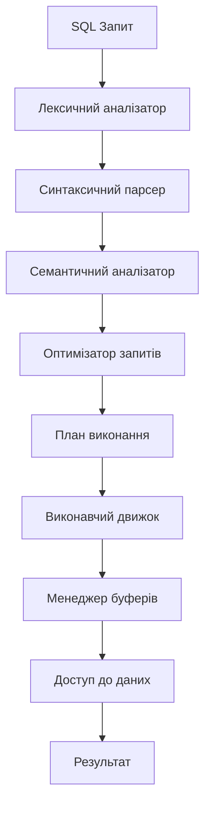
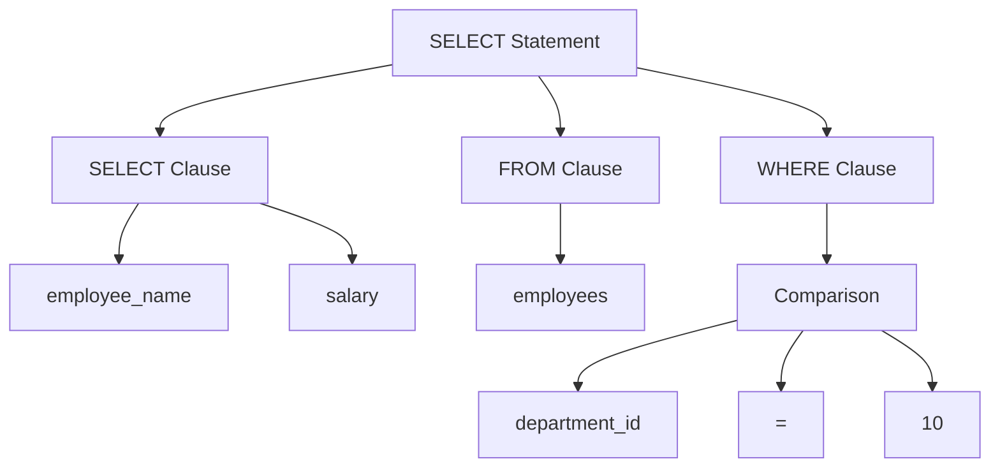
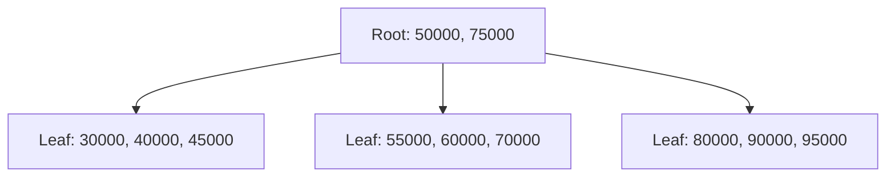

# Лекція 8. Обробка та оптимізація запитів

## Вступ

Обробка та оптимізація запитів є однією з найважливіших компонент сучасних систем управління базами даних. Ефективність виконання запитів безпосередньо впливає на продуктивність всієї інформаційної системи та якість користувацького досвіду. У цій лекції розглянемо детально процес обробки запитів у СУБД, методи оптимізації та практичні підходи до покращення продуктивності баз даних.

Сучасні СУБД обробляють мільйони запитів щодня, і навіть невелике покращення в оптимізації може призвести до значного збільшення продуктивності системи. Розуміння принципів роботи оптимізатора запитів дозволяє розробникам писати більш ефективний код та проектувати схеми баз даних, які забезпечують максимальну продуктивність.

## Архітектура обробки запитів

### Загальна схема обробки запитів

Процес обробки запиту в СУБД проходить через кілька етапів, кожен з яких відіграє важливу роль у забезпеченні коректності та ефективності виконання.



### Етапи обробки запитів

#### 1. Лексичний аналіз

Лексичний аналізатор розбиває текст SQL-запиту на окремі лексеми (токени). Це включає ключові слова, ідентифікатори, оператори, літерали та розділювачі.

Приклад лексичного аналізу запиту:

```sql
SELECT employee_name, salary FROM employees WHERE department_id = 10;
```

Токени:
- SELECT (ключове слово)
- employee_name (ідентифікатор)
- , (розділювач)
- salary (ідентифікатор)
- FROM (ключове слово)
- employees (ідентифікатор)
- WHERE (ключове слово)
- department_id (ідентифікатор)
- = (оператор)
- 10 (числовий літерал)
- ; (розділювач)

#### 2. Синтаксичний аналіз

Синтаксичний парсер перевіряє відповідність послідовності токенів граматичним правилам SQL та будує синтаксичне дерево запиту.



#### 3. Семантичний аналіз

Семантичний аналізатор перевіряє коректність запиту з точки зору схеми бази даних. Він виконує такі перевірки:

- Існування таблиць та стовпців
- Відповідність типів даних
- Права доступу користувача
- Правильність використання агрегатних функцій
- Коректність групування та сортування

Якщо в запиті використовується стовпець, який не існує в таблиці, семантичний аналізатор виявить цю помилку та поверне відповідне повідомлення.

#### 4. Оптимізація запитів

Оптимізатор запитів є центральним компонентом, який визначає найефективніший спосіб виконання запиту. Він аналізує різні можливі плани виконання та вибирає той, який має найменшу очікувану вартість.

## Типи оптимізації запитів

### Логічна оптимізація

Логічна оптимізація працює з алгебраїчними перетвореннями запиту без урахування фізичних характеристик зберігання даних.

#### Основні правила логічної оптимізації

**1. Проштовхування селекції**

Умови WHERE переміщуються якомога ближче до джерел даних для зменшення кількості записів, що обробляються на наступних етапах.

Неоптимізований запит:
```sql
SELECT e.name, d.department_name
FROM employees e
JOIN departments d ON e.department_id = d.department_id
WHERE e.salary > 50000;
```

Після проштовхування селекції:
```sql
SELECT e.name, d.department_name
FROM (SELECT * FROM employees WHERE salary > 50000) e
JOIN departments d ON e.department_id = d.department_id;
```

**2. Проштовхування проекції**

Непотрібні стовпці виключаються якомога раніше для зменшення обсягу переданих даних.

**3. Перестановка з'єднань**

Оптимізатор може змінювати порядок виконання JOIN операцій для зменшення проміжних результатів.

Початковий запит:
```sql
SELECT *
FROM orders o
JOIN customers c ON o.customer_id = c.customer_id
JOIN products p ON o.product_id = p.product_id
WHERE c.country = 'Ukraine' AND p.category = 'Electronics';
```

Оптимізатор може спочатку з'єднати customers та orders з українськими клієнтами, а потім додати products.

**4. Перетворення підзапитів**

Корельовані підзапити часто можуть бути перетворені в більш ефективні з'єднання.

Корельований підзапит:
```sql
SELECT employee_name
FROM employees e1
WHERE salary > (SELECT AVG(salary) FROM employees e2 WHERE e2.department_id = e1.department_id);
```

Еквівалентне з'єднання:
```sql
SELECT e.employee_name
FROM employees e
JOIN (SELECT department_id, AVG(salary) as avg_salary FROM employees GROUP BY department_id) d
ON e.department_id = d.department_id
WHERE e.salary > d.avg_salary;
```

### Фізична оптимізація

Фізична оптимізація враховує конкретні методи доступу до даних, індекси та статистичну інформацію про розподіл даних.

#### Методи доступу до даних

**1. Повне сканування таблиці (Table Scan)**

Читання всіх записів таблиці послідовно. Ефективний для невеликих таблиць або коли потрібна більшість записів.

```sql
-- Якщо таблиця невелика або умова вибирає більшість записів
SELECT * FROM small_lookup_table;
```

**2. Індексне сканування (Index Scan)**

Використання індексу для швидкого пошуку записів, що відповідають умові.

```sql
-- Використовується індекс на employee_id
SELECT * FROM employees WHERE employee_id = 12345;
```

**3. Пошук по індексу (Index Seek)**

Прямий перехід до конкретного значення в індексі без сканування.

```sql
-- Ефективний пошук по первинному ключу
SELECT * FROM orders WHERE order_id = 98765;
```

#### Алгоритми з'єднання

**1. Nested Loop Join**

Для кожного запису з першої таблиці виконується пошук відповідних записів у другій таблиці.


Ефективний для невеликих таблиць або коли одна з таблиць має дуже мало записів.

**2. Hash Join**

Створюється хеш-таблиця для меншої таблиці, потім сканується більша таблиця з пошуком відповідностей.

```sql
-- Hash Join часто використовується для equi-joins
SELECT o.order_id, c.customer_name
FROM orders o
JOIN customers c ON o.customer_id = c.customer_id;
```

**3. Sort-Merge Join**

Обидві таблиці сортуються по ключу з'єднання, потім виконується злиття відсортованих послідовностей.

Ефективний для великих таблиць, особливо якщо дані вже відсортовані або потрібне сортування для інших операцій.

## Статистика та вартісна модель

### Статистична інформація

Оптимізатор запитів покладається на статистичну інформацію про дані для прийняття рішень про найкращий план виконання.

#### Типи статистики

**1. Кардинальність таблиць**

Кількість записів у кожній таблиці.

```sql
-- PostgreSQL
SELECT schemaname, tablename, n_tup_ins - n_tup_del as row_count
FROM pg_stat_user_tables;
```

**2. Розподіл значень**

Гістограми показують, як розподілені значення в стовпцях.

**3. Селективність**

Відсоток записів, що відповідають певній умові.

```sql
-- Висока селективність (мало записів відповідає умові)
SELECT * FROM employees WHERE employee_id = 12345;

-- Низька селективність (багато записів відповідає умові)
SELECT * FROM employees WHERE status = 'ACTIVE';
```

**4. Інформація про індекси**

Статистика використання індексів, їх розмір та ефективність.

### Вартісна модель

Оптимізатор використовує вартісну модель для оцінки різних планів виконання. Вартість включає:

#### Компоненти вартості

**1. I/O вартість**

Вартість читання даних з диска. Зазвичай найдорожча операція.

```
I/O_cost = (pages_to_read * random_page_cost) + (sequential_pages * seq_page_cost)
```

**2. CPU вартість**

Вартість обробки даних у пам'яті.

```
CPU_cost = rows_processed * cpu_tuple_cost + comparisons * cpu_operator_cost
```

**3. Мережева вартість**

У розподілених системах враховується вартість передачі даних по мережі.

### Приклад оцінки вартості

Розглянемо запит:
```sql
SELECT * FROM employees WHERE department_id = 10 AND salary > 50000;
```

Варіанти виконання:

**Варіант 1: Повне сканування таблиці**
```
Вартість = pages_in_table * seq_page_cost + rows_in_table * cpu_tuple_cost
```

**Варіант 2: Індекс по department_id + фільтрація**
```
Вартість = index_pages * random_page_cost + matching_rows * cpu_tuple_cost
```

**Варіант 3: Композитний індекс (department_id, salary)**
```
Вартість = index_lookups * random_page_cost + exact_matches * cpu_tuple_cost
```

## Індекси та їх роль в оптимізації

### Типи індексів

#### 1. B-tree індекси

Найпоширеніший тип індексів, ефективний для рівності та діапазонних запитів.

```sql
-- Створення B-tree індексу
CREATE INDEX idx_employee_salary ON employees(salary);

-- Ефективні запити
SELECT * FROM employees WHERE salary = 75000;
SELECT * FROM employees WHERE salary BETWEEN 50000 AND 100000;
SELECT * FROM employees ORDER BY salary;
```

Структура B-tree індексу:



#### 2. Hash індекси

Оптимізовані для точних пошуків за рівністю.

```sql
-- Створення hash індексу (PostgreSQL)
CREATE INDEX idx_employee_id_hash ON employees USING HASH(employee_id);

-- Ефективний запит
SELECT * FROM employees WHERE employee_id = 12345;
```

#### 3. Часткові індекси

Індекси, що покривають тільки частину таблиці.

```sql
-- Індекс тільки для активних співробітників
CREATE INDEX idx_active_employees_salary
ON employees(salary)
WHERE status = 'ACTIVE';
```

#### 4. Композитні індекси

Індекси по кількох стовпцях.

```sql
-- Композитний індекс
CREATE INDEX idx_dept_salary ON employees(department_id, salary);

-- Ефективні запити
SELECT * FROM employees WHERE department_id = 10 AND salary > 50000;
SELECT * FROM employees WHERE department_id = 10; -- використовує початкову частину індексу
```

### Стратегії індексування

#### Принципи створення індексів

**1. Індексувати стовпці в WHERE умовах**

```sql
-- Якщо часто виконується
SELECT * FROM orders WHERE customer_id = 123;

-- Створити індекс
CREATE INDEX idx_orders_customer_id ON orders(customer_id);
```

**2. Індексувати стовпці в JOIN операціях**

```sql
-- Для ефективного з'єднання
SELECT * FROM orders o JOIN customers c ON o.customer_id = c.customer_id;

-- Індекси на обох стовпцях з'єднання
CREATE INDEX idx_orders_customer_id ON orders(customer_id);
-- customer_id у таблиці customers зазвичай вже є первинним ключем
```

**3. Враховувати порядок стовпців у композитних індексах**

```sql
-- Якщо часто виконуються обидва запити:
SELECT * FROM employees WHERE department_id = 10 AND salary > 50000;
SELECT * FROM employees WHERE department_id = 10;

-- Правильний порядок: department_id перший
CREATE INDEX idx_dept_salary ON employees(department_id, salary);
```

#### Обмеження індексів

**1. Додаткове місце на диску**

Індекси займають додатковий простір, що може бути значним для великих таблиць.

**2. Уповільнення операцій запису**

При INSERT, UPDATE, DELETE потрібно також оновлювати індекси.

**3. Накладні витрати на підтримку**

СУБД повинна підтримувати індекси у актуальному стані.

## План виконання запитів

### Читання планів виконання

План виконання показує, як СУБД планує виконати запит. Це важливий інструмент для розуміння та оптимізації продуктивності.

#### PostgreSQL

```sql
-- Отримання плану виконання
EXPLAIN SELECT e.name, d.department_name
FROM employees e
JOIN departments d ON e.department_id = d.department_id
WHERE e.salary > 50000;
```

Приклад виводу:
```
Nested Loop  (cost=0.29..8.32 rows=1 width=64)
  ->  Seq Scan on employees e  (cost=0.00..4.00 rows=1 width=36)
        Filter: (salary > 50000)
  ->  Index Scan using departments_pkey on departments d  (cost=0.29..4.31 rows=1 width=32)
        Index Cond: (department_id = e.department_id)
```

#### Інтерпретація плану

**1. Типи операцій**
- Seq Scan: послідовне сканування
- Index Scan: сканування індексу
- Nested Loop: вкладений цикл для з'єднання
- Hash Join: хеш з'єднання

**2. Вартість (cost)**
- Перше число: початкова вартість
- Друге число: загальна вартість

**3. Кількість рядків (rows)**
- Очікувана кількість рядків на кожному кроці

**4. Ширина (width)**
- Середній розмір рядка в байтах

### Аналіз фактичної продуктивності

```sql
-- Включення збору статистики виконання
EXPLAIN (ANALYZE, BUFFERS)
SELECT e.name, d.department_name
FROM employees e
JOIN departments d ON e.department_id = d.department_id
WHERE e.salary > 50000;
```

Розширений вивід:
```
Nested Loop  (cost=0.29..8.32 rows=1 width=64) (actual time=0.045..0.048 rows=1 loops=1)
  Buffers: shared hit=4
  ->  Seq Scan on employees e  (cost=0.00..4.00 rows=1 width=36) (actual time=0.023..0.025 rows=1 loops=1)
        Filter: (salary > 50000)
        Rows Removed by Filter: 99
        Buffers: shared hit=1
  ->  Index Scan using departments_pkey on departments d  (cost=0.29..4.31 rows=1 width=32) (actual time=0.020..0.021 rows=1 loops=1)
        Index Cond: (department_id = e.department_id)
        Buffers: shared hit=3
Planning Time: 0.123 ms
Execution Time: 0.071 ms
```

## Практичні методи оптимізації

### Оптимізація SELECT запитів

#### 1. Уникнення SELECT *

```sql
-- Неефективно
SELECT * FROM employees WHERE department_id = 10;

-- Ефективно - вибираємо тільки потрібні стовпці
SELECT employee_id, name, salary FROM employees WHERE department_id = 10;
```

#### 2. Використання EXISTS замість IN для підзапитів

```sql
-- Менш ефективно
SELECT * FROM customers
WHERE customer_id IN (SELECT customer_id FROM orders WHERE order_date > '2023-01-01');

-- Більш ефективно
SELECT * FROM customers c
WHERE EXISTS (SELECT 1 FROM orders o WHERE o.customer_id = c.customer_id AND o.order_date > '2023-01-01');
```

#### 3. Оптимізація ORDER BY

```sql
-- Якщо є індекс на salary
SELECT * FROM employees ORDER BY salary LIMIT 10;

-- Комбінування з WHERE для використання індексу
SELECT * FROM employees
WHERE department_id = 10
ORDER BY salary LIMIT 10;
```

### Оптимізація JOIN операцій

#### 1. Правильний порядок таблиць

```sql
-- Якщо customers набагато менша за orders
SELECT c.name, o.order_date
FROM customers c
JOIN orders o ON c.customer_id = o.customer_id
WHERE c.country = 'Ukraine';
```

#### 2. Використання відповідних типів з'єднання

```sql
-- INNER JOIN для обов'язкових зв'язків
SELECT e.name, d.department_name
FROM employees e
INNER JOIN departments d ON e.department_id = d.department_id;

-- LEFT JOIN коли потрібні всі записи з лівої таблиці
SELECT e.name, COALESCE(d.department_name, 'No Department') as dept
FROM employees e
LEFT JOIN departments d ON e.department_id = d.department_id;
```

### Оптимізація підзапитів

#### 1. Перетворення корельованих підзапитів

```sql
-- Корельований підзапит (повільно)
SELECT employee_name
FROM employees e1
WHERE salary = (SELECT MAX(salary) FROM employees e2 WHERE e2.department_id = e1.department_id);

-- З'єднання з window function (швидше)
SELECT employee_name
FROM (
    SELECT employee_name,
           salary,
           MAX(salary) OVER (PARTITION BY department_id) as max_dept_salary
    FROM employees
) t
WHERE salary = max_dept_salary;
```

#### 2. Використання CTE для читабельності

```sql
-- Common Table Expression для складних запитів
WITH department_stats AS (
    SELECT department_id,
           AVG(salary) as avg_salary,
           COUNT(*) as employee_count
    FROM employees
    GROUP BY department_id
),
high_paying_depts AS (
    SELECT department_id
    FROM department_stats
    WHERE avg_salary > 60000 AND employee_count > 5
)
SELECT e.name, e.salary, d.department_name
FROM employees e
JOIN departments d ON e.department_id = d.department_id
JOIN high_paying_depts hpd ON e.department_id = hpd.department_id;
```

## Моніторинг та діагностика продуктивності

### Інструменти моніторингу

#### 1. Системні представлення

PostgreSQL надає багато корисних системних представлень для моніторингу:

```sql
-- Найповільніші запити
SELECT query, mean_time, calls, total_time
FROM pg_stat_statements
ORDER BY mean_time DESC
LIMIT 10;

-- Статистика використання індексів
SELECT schemaname, tablename, indexname, idx_tup_read, idx_tup_fetch
FROM pg_stat_user_indexes
ORDER BY idx_tup_read DESC;

-- Активні з'єднання та запити
SELECT pid, usename, application_name, client_addr, state, query
FROM pg_stat_activity
WHERE state = 'active';
```

#### 2. Логування повільних запитів

```sql
-- Налаштування логування запитів, що виконуються довше 1 секунди
SET log_min_duration_statement = 1000;
```

### Типові проблеми продуктивності

#### 1. Відсутність індексів

Симптоми:
- Повільні SELECT запити
- Високе навантаження на CPU
- Довгі sequential scans в планах виконання

Рішення:
```sql
-- Аналіз відсутніх індексів
SELECT schemaname, tablename, attname, n_distinct, correlation
FROM pg_stats
WHERE schemaname = 'public'
AND n_distinct > 100  -- Потенційні кандидати для індексування
ORDER BY tablename, attname;
```

#### 2. Застарілі статистики

Симптоми:
- Неоптимальні плани виконання
- Оптимізатор вибирає неправильні алгоритми з'єднання

Рішення:
```sql
-- Оновлення статистики
ANALYZE employees;

-- Автоматичне оновлення статистики
ALTER TABLE employees SET (autovacuum_analyze_scale_factor = 0.05);
```

#### 3. Блокування та конкуренція

Симптоми:
- Довгі очікування транзакцій
- Зниження пропускної здатності

Моніторинг:
```sql
-- Перегляд блокувань
SELECT blocked_locks.pid AS blocked_pid,
       blocked_activity.usename AS blocked_user,
       blocking_locks.pid AS blocking_pid,
       blocking_activity.usename AS blocking_user,
       blocked_activity.query AS blocked_statement,
       blocking_activity.query AS current_statement_in_blocking_process
FROM pg_catalog.pg_locks blocked_locks
JOIN pg_catalog.pg_stat_activity blocked_activity ON blocked_activity.pid = blocked_locks.pid
JOIN pg_catalog.pg_locks blocking_locks ON blocking_locks.locktype = blocked_locks.locktype
    AND blocking_locks.DATABASE IS NOT DISTINCT FROM blocked_locks.DATABASE
    AND blocking_locks.relation IS NOT DISTINCT FROM blocked_locks.relation
    AND blocking_locks.page IS NOT DISTINCT FROM blocked_locks.page
    AND blocking_locks.tuple IS NOT DISTINCT FROM blocked_locks.tuple
    AND blocking_locks.virtualxid IS NOT DISTINCT FROM blocked_locks.virtualxid
    AND blocking_locks.transactionid IS NOT DISTINCT FROM blocked_locks.transactionid
    AND blocking_locks.classid IS NOT DISTINCT FROM blocked_locks.classid
    AND blocking_locks.objid IS NOT DISTINCT FROM blocked_locks.objid
    AND blocking_locks.objsubid IS NOT DISTINCT FROM blocked_locks.objsubid
    AND blocking_locks.pid != blocked_locks.pid
JOIN pg_catalog.pg_stat_activity blocking_activity ON blocking_activity.pid = blocking_locks.pid
WHERE NOT blocked_locks.GRANTED;
```

## Сучасні підходи до оптимізації

### Автоматична оптимізація

#### 1. Адаптивні індекси

Сучасні СУБД можуть автоматично створювати та видаляти індекси на основі патернів використання.

#### 2. Машинне навчання в оптимізації

Деякі СУБД використовують ML алгоритми для:
- Прогнозування вартості операцій
- Автоматичного налаштування параметрів
- Виявлення аномалій у продуктивності

### Columnar Storage

Для аналітичних навантажень колонкове зберігання може значно покращити продуктивність:

```sql
-- PostgreSQL с расширением cstore_fdw
CREATE FOREIGN TABLE analytics_orders (
    order_id bigint,
    customer_id bigint,
    order_date date,
    amount decimal
) SERVER cstore_server
OPTIONS(compression 'pglz');
```

### Матеріалізовані представлення

Для складних аналітичних запитів:

```sql
-- Створення матеріалізованого представлення
CREATE MATERIALIZED VIEW monthly_sales AS
SELECT
    DATE_TRUNC('month', order_date) as month,
    SUM(amount) as total_sales,
    COUNT(*) as order_count,
    AVG(amount) as avg_order_value
FROM orders
GROUP BY DATE_TRUNC('month', order_date);

-- Створення індексу на матеріалізованому представленні
CREATE INDEX idx_monthly_sales_month ON monthly_sales(month);

-- Періодичне оновлення
REFRESH MATERIALIZED VIEW monthly_sales;
```

## Висновки

Оптимізація запитів є критично важливим аспектом роботи з базами даних. Ефективна оптимізація вимагає:

1. **Розуміння архітектури СУБД** - знання того, як працює оптимізатор запитів, допомагає писати більш ефективні запити.
2. **Правильне використання індексів** - індекси є основним інструментом оптимізації, але їх потрібно використовувати розумно.
3. **Аналіз планів виконання** - регулярний моніторинг планів виконання допомагає виявляти проблеми продуктивності.
4. **Розуміння даних** - знання характеристик даних (розподіл, кардинальність, селективність) критично важливе для оптимізації.
5. **Постійний моніторинг** - продуктивність бази даних потрібно постійно відстежувати та покращувати.

Сучасні тенденції в оптимізації включають використання машинного навчання, автоматичної оптимізації та спеціалізованих структур даних для різних типів навантажень. Розробники повинні залишатися в курсі цих тенденцій та використовувати найкращі практики для забезпечення оптимальної продуктивності своїх додатків.
