# Лекція 09 Теоретичні основи NoSQL систем

## Вступ

Протягом кількох десятиліть реляційні системи керування базами даних (СУБД) залишалися домінуючим рішенням для зберігання та обробки структурованих даних. Вони й сьогодні лишаються основою більшості бізнес-систем: банків, облікових програм, електронних журналів. Проте стрімкий розвиток вебтехнологій, зростання обсягів даних та поява розподілених систем планетарного масштабу виявили принципові обмеження реляційної моделі. Ці виклики породили новий клас систем, відомих як NoSQL (часто розшифровують як Not Only SQL, тобто «не лише SQL»).

Важливо з самого початку позбутися двох поширених хибних уявлень. Перше: NoSQL не означає «без SQL» і не є «наступним поколінням», що витісняє реляційні бази. Це набір інструментів, кожен із яких спрощує одні задачі й ускладнює інші. Друге: NoSQL не є єдиною технологією. Під цією назвою об'єднано системи з дуже різними моделями даних, гарантіями та сферами застосування, тому вивчати їх слід не як «одну технологію», а як спектр проєктних рішень і компромісів.

У цій лекції ми з'ясуємо причини виникнення NoSQL, розберемо теоретичні основи розподілених систем (теорему CAP, її уточнення PACELC та семантику BASE), познайомимося з основними типами NoSQL баз даних і навчимося обирати технологію під задачу. Завершимо підходом Polyglot Persistence, коли в одному застосунку співіснує кілька СУБД, та способами їх узгодженої взаємодії. Ця лекція є теоретичним фундаментом для наступних двох: у лекції 10 ми детально вивчимо MongoDB як типового представника документних СУБД, а в лекції 11 звернемося до пошукових систем на прикладі Elasticsearch.

## Обмеження реляційної моделі для вебзастосунків інтернет-масштабу

### Історичний контекст

Реляційну модель даних запропонував Едгар Кодд у 1970 році. Вона розв'язувала проблеми тогочасних систем: залежність програм від фізичного розташування даних і відсутність формальної основи для запитів. Проєктні припущення були такими: дані зберігаються централізовано, їхній обсяг відносно невеликий, структура передбачувана, а навантаження зростає повільно. Разом із моделлю з'явилися транзакції та властивості ACID, які й донині лишаються золотим стандартом надійності.

З розвитком інтернету ці припущення почали руйнуватися. Наприкінці 1990-х і на початку 2000-х компанії на зразок Google, Amazon і Facebook зіткнулися з навантаженнями, для яких не було готових рішень: мільйони одночасних користувачів, петабайти даних, дата-центри на різних континентах. Саме тоді з'явилися публікації, що дали початок NoSQL-напрямку: Google Bigtable (2006), Amazon Dynamo (2007). Термін «NoSQL» набув поширення близько 2009 року.

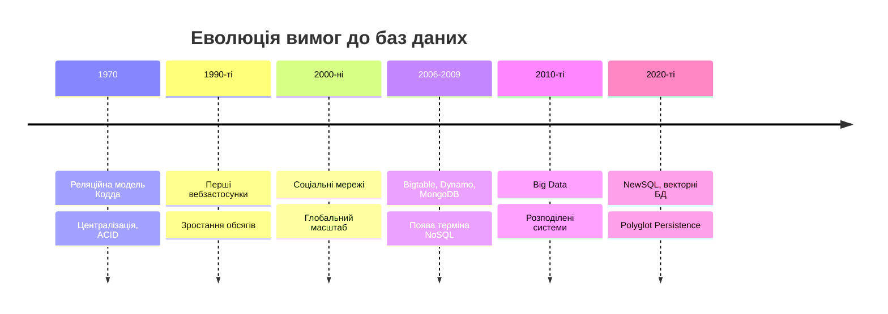

### Проблема масштабування

Реляційні СУБД традиційно масштабуються вертикально, тобто нарощуванням потужності одного сервера. Такий підхід має природні фізичні й економічні межі.

**Вертикальне масштабування** передбачає:

- збільшення оперативної пам'яті;
- встановлення потужніших процесорів;
- використання швидших дисків.

Його обмеження очевидні: фізична межа потужності одного вузла, різке зростання вартості топового обладнання, єдина точка відмови та складність забезпечення високої доступності.

Горизонтальне масштабування, навпаки, передбачає додавання нових серверів до кластера. Кожен вузол зберігає частину даних і обробляє частину запитів. Вартість зростає приблизно лінійно, а вихід окремого вузла з ладу не зупиняє систему.

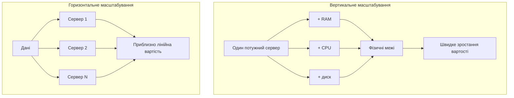

Чому ж реляційні СУБД погано масштабуються горизонтально? Причин дві. По-перше, розподіл таблиць між вузлами (шардинг, від англ. shard — «уламок») змушує JOIN-запити ходити мережею між серверами, що на порядки повільніше за локальний доступ до пам'яті. По-друге, підтримка ACID-транзакцій між вузлами вимагає складних протоколів координації (наприклад, двофазної фіксації), які збільшують затримку й знижують доступність. Звісно, шардинг реляційних баз можливий (Vitess для MySQL, розширення Citus для PostgreSQL), але він потребує значних зусиль і накладає обмеження на модель даних. NoSQL-системи ж проєктувалися з розрахунку на горизонтальне масштабування від початку.

### Жорсткість схеми даних

Реляційна модель вимагає визначити схему до внесення даних. Кожна таблиця має чітко описані стовпці з типами. Зміна схеми в робочій системі з мільйонами записів може бути складною операцією.

```sql
-- Початкова схема користувача
CREATE TABLE users (
    user_id INT PRIMARY KEY,
    username VARCHAR(50),
    email VARCHAR(100),
    created_at TIMESTAMP
);

-- Через деякий час потрібно додати нові поля
ALTER TABLE users ADD COLUMN phone VARCHAR(20);
ALTER TABLE users ADD COLUMN preferences JSON;

-- У всіх наявних записів нові поля матимуть NULL.
-- Залежно від СУБД і версії зміна структури великої таблиці
-- може вимагати блокувань або перезапису даних.
```

Слід чесно зазначити, що сучасні реляційні СУБД значно покращили цю ситуацію: у PostgreSQL додавання стовпця без значення за замовчуванням є майже миттєвою операцією, а MySQL 8 підтримує алгоритм `INSTANT`. Проте проблема не зникла повністю, а головне, змінюється саме ставлення до схеми. Сучасні застосунки розробляються ітеративно, структура даних змінюється щотижня, і потрібні різні атрибути в різних записів. Наприклад, у каталозі інтернет-магазину ноутбук має процесор і обсяг пам'яті, а книжка має ISBN і кількість сторінок.

### Складність відображення об'єктів на реляційну модель

Сучасні застосунки здебільшого проєктують у термінах об'єктів або структур, що містять вкладені елементи. Відображення таких структур на плоскі таблиці створює так звану невідповідність імпедансів (impedance mismatch, за аналогією з електротехнікою): модель, у якій мислить програміст, не збігається з моделлю, у якій зберігаються дані.

```javascript
// Об'єкт користувача в застосунку
const user = {
    id: "user123",
    name: "Іван Петров",
    email: "ivan@example.com",
    addresses: [
        { type: "home", street: "вул. Хрещатик, 1", city: "Київ", country: "Україна" },
        { type: "work", street: "просп. Перемоги, 50", city: "Київ", country: "Україна" }
    ],
    preferences: {
        language: "uk",
        notifications: { email: true, sms: false, push: true },
        theme: "dark"
    }
};
```

Для зберігання такого об'єкта в «класичній» реляційній схемі потрібно кілька таблиць:

```sql
CREATE TABLE users (
    user_id VARCHAR(50) PRIMARY KEY,
    name VARCHAR(100),
    email VARCHAR(100)
);

CREATE TABLE addresses (
    address_id SERIAL PRIMARY KEY,
    user_id VARCHAR(50) REFERENCES users(user_id),
    address_type VARCHAR(20),
    street VARCHAR(100),
    city VARCHAR(50),
    country VARCHAR(50)
);

CREATE TABLE preferences (
    user_id VARCHAR(50) PRIMARY KEY REFERENCES users(user_id),
    language VARCHAR(10),
    theme VARCHAR(20)
);

CREATE TABLE notification_settings (
    user_id VARCHAR(50) PRIMARY KEY REFERENCES users(user_id),
    email_enabled BOOLEAN,
    sms_enabled BOOLEAN,
    push_enabled BOOLEAN
);
```

Щоб отримати повну інформацію про одного користувача, доведеться виконати запит із кількома JOIN. Для веб-API, який віддає такий об'єкт тисячі разів на секунду, це помітне навантаження. Часто цю проблему пом'якшують ORM-бібліотеками, але вони лише приховують невідповідність, а не усувають її.

### Проблеми з великими обсягами даних

Сучасні застосунки генерують величезні потоки даних: соціальні мережі, системи аналітики, IoT-пристрої. Такі дані прийнято описувати через характеристики Big Data (так звані «V»):

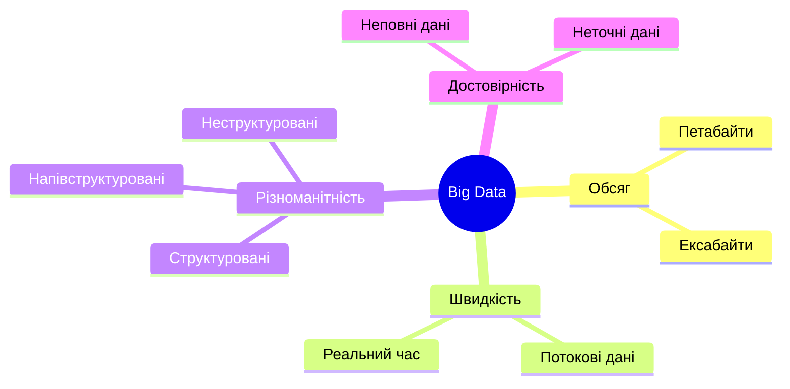

Реляційні системи оптимізовано для транзакційної обробки з високою узгодженістю. На великих обсягах вони стикаються з такими труднощами: повільні JOIN, складність секціонування таблиць, вартість реплікації та обмежена масштабованість аналітичних запитів. Втім, для аналітики сьогодні існують спеціалізовані колонкові сховища (ClickHouse, Snowflake, BigQuery), про які варто пам'ятати: вони теж не є «реляційними у класичному розумінні», але й не належать до NoSQL у вужчому сенсі.

### Географічна розподіленість

Глобальні застосунки обслуговують користувачів з усього світу. Щоб забезпечити малу затримку, копії даних розміщують ближче до користувачів. Це породжує особливі виклики:

- високі мережеві затримки між дата-центрами (десятки й сотні мілісекунд);
- необхідність реплікації даних між регіонами;
- складність підтримання узгодженості за наявності затримок і збоїв мережі;
- вимоги законодавства щодо місця зберігання персональних даних (наприклад, GDPR).

Саме ці виклики тісно пов'язані з теоретичними результатами, до яких ми переходимо.

### Реляційні СУБД не стоять на місці

Перш ніж рухатися далі, варто зафіксувати важливе спостереження: за останні роки межа між реляційними та NoSQL-системами суттєво розмилася. PostgreSQL має тип `JSONB` з індексуванням (GIN) і зручними операторами, що дає змогу зберігати документи без окремої «документної» СУБД. Він також має розширення `pgvector` для векторного пошуку та `Citus` для горизонтального масштабування. З іншого боку, MongoDB підтримує багатодокументні ACID-транзакції та схеми валідації. Тому питання «SQL чи NoSQL?» сьогодні слід ставити не як ідеологічний вибір, а як інженерне: які вимоги до моделі даних, узгодженості та масштабу має конкретна задача. Ми повернемося до цього в окремому розділі про вибір технології.

## Теорема CAP: консистентність, доступність, стійкість до розділення мережі

### Формулювання теореми

У 2000 році Ерік Брюер висунув гіпотезу, яка згодом отримала назву теореми CAP (теореми Брюера). Вона стосується розподілених систем зберігання даних, тобто систем, у яких дані розміщено на кількох вузлах, що обмінюються повідомленнями через мережу. Теорема стверджує, що така система не може одночасно гарантувати всі три властивості:

**Consistency (консистентність, узгодженість).** Усі клієнти бачать одні й ті самі дані в один і той самий момент. Точніше, після успішного завершення запису кожне наступне читання повертає це значення (або новіше). У формальному доведенні мається на увазі так звана лінеаризованість, найсильніша модель узгодженості для одного об'єкта.

**Availability (доступність).** Кожен запит до працюючого вузла отримує відповідь (успішну або таку, що повідомляє про помилку виконання), без гарантій щодо актуальності даних у відповіді.

**Partition tolerance (стійкість до розділення).** Система продовжує працювати, навіть якщо мережа розпадається на частини, які не можуть обмінюватися повідомленнями, або якщо частину повідомлень втрачено чи затримано.

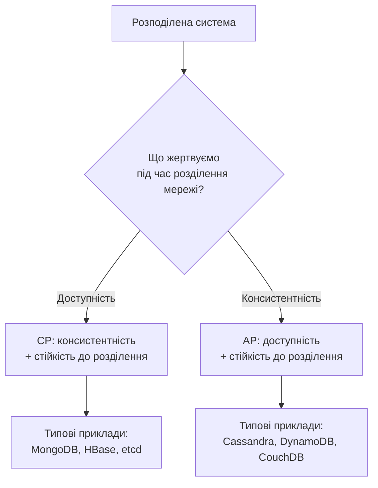

### Доказ теореми

У 2002 році Сет Гілберт і Ненсі Лінч формально довели теорему. Ідея доказу проста. Припустимо, що система має принаймні два вузли, A і B, і обидва приймають запити.

1. Клієнт записує значення на вузол A.
2. Мережа розділяється: вузли A і B більше не можуть обмінюватися повідомленнями.
3. Інший клієнт читає це значення з вузла B.

Тепер у вузла B є лише два варіанти:

- **повернути наявне (застаріле) значення.** Система залишається доступною, але порушується консистентність;
- **відмовити у відповіді** (помилка або очікування, поки мережа відновиться). Зберігається консистентність, але втрачається доступність.

Третього варіанта немає: B не може «дізнатися» про запис на A, не маючи зв'язку.

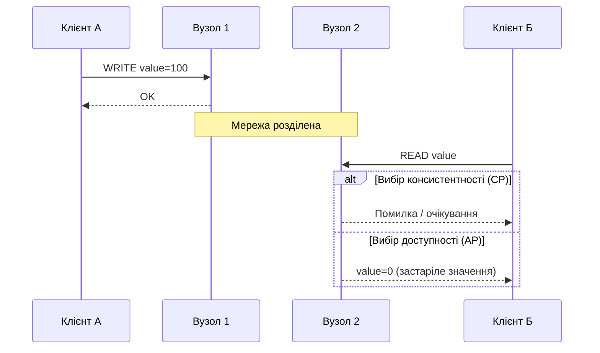

### Що теорема CAP насправді стверджує (і чого не стверджує)

Теорему CAP часто подають як «обери два з трьох», і така форма стала джерелом численних непорозумінь. Сам Брюер у 2012 році опублікував статтю з уточненнями. Розглянемо ключові з них.

**1. Стійкість до розділення не є вибором.** У реальній мережі розділення трапляються: обрив кабелю, перевантажений комутатор, збій у хмарі. Якщо система розподілена, вона має бути готовою до цього. Тому справжній вибір існує лише між C і A, і то лише під час розділення. Коли мережа справна, система може забезпечувати і консистентність, і доступність.

**2. Категорії «CA» для розподіленої системи не існує.** Сервер, що працює на одному вузлі, звісно, є «консистентним і доступним», але він не розподілений, і теорема його не стосується. Тому твердження на зразок «PostgreSQL — це CA-система» є неточним. Одновузлова PostgreSQL взагалі поза межами CAP. Якщо ж налаштувати синхронну реплікацію, то за розділення з реплікою основний вузол припинить підтверджувати записи (тобто фактично обере консистентність замість доступності).

**3. Вибір не є бінарним і не є вибором «на все життя».** Більшість сучасних систем дають змогу обирати рівень узгодженості для кожної операції окремо. Cassandra та DynamoDB, які прийнято вважати AP-системами, мають режими сильної консистентності й навіть транзакції. MongoDB, що зазвичай називають CP, дозволяє читати з вторинних вузлів із застарілими даними. Отже, точніше говорити не про «категорію системи», а про її поведінку за конкретних налаштувань.

**4. Визначення в теоремі вужчі, ніж у побуті.** Слово «доступність» у CAP означає, що кожен працюючий вузол відповідає, а не просто «сервіс здебільшого працює». Система, яка залишається доступною для більшості клієнтів, але відмовляє в меншості розділення, формально «не доступна» в сенсі CAP, хоча користувачам це може бути непомітно.

### Практичне застосування теореми CAP

**CP-системи: MongoDB.** У наборі реплік запис приймає лише первинний вузол (Primary). Якщо мережа розділилася і Primary опинився в меншості, він самоусувається, а нового первинного вузла обирає більшість. Якщо ж клієнт вимагає підтвердження запису більшістю вузлів (write concern `majority`), то записи, підтверджені таким чином, не втрачаються навіть при зміні Primary. Ціною є короткочасна недоступність запису під час виборів.

```javascript
// Запис підтверджується лише після реплікації на більшість вузлів
db.users.insertOne(
    { name: "Іван Петров", email: "ivan@example.com" },
    { writeConcern: { w: "majority", wtimeout: 5000 } }
);
// При розділенні, коли більшості немає, операція завершиться помилкою тайм-ауту
// (тайм-аут не означає, що запис точно не відбувся: його стан треба перевірити).
```

Зверніть увагу: починаючи з MongoDB 5.0 значення `w: "majority"` є типовим для запису, тобто наведений виклик лише явно фіксує те, що система робить за замовчуванням. Докладніше це розглядатиметься в лекції 10.

**AP-системи: Cassandra.** У Cassandra дані реплікуються на кілька вузлів, і клієнт для кожного запиту сам обирає рівень узгодженості. Найслабший рівень `ONE` вимагає підтвердження лише від одного вузла: це максимізує доступність і швидкість, але дозволяє читати застарілі дані.

```javascript
// Node.js, драйвер cassandra-driver
const { types } = require('cassandra-driver');

await client.execute(
    'INSERT INTO users (user_id, name) VALUES (?, ?)',
    [types.Uuid.random(), 'Іван Петров'],
    { prepare: true, consistency: types.consistencies.one }
);
// Запис підтверджується після збереження на одному вузлі,
// інші репліки отримують його згодом.
```

**Налаштовувана консистентність і кворуми.** Ідея, яку реалізують Cassandra, DynamoDB та Riak-подібні системи, спирається на прості арифметичні співвідношення. Нехай дані зберігаються в `N` репліках, запис вважається успішним після підтвердження `W` реплік, а читання опитує `R` реплік. Якщо виконано умову `R + W > N`, то набори реплік для читання та запису гарантовано перетинаються, тож читання побачить принаймні одну репліку з останнім записом. Для `N = 3` типовий вибір `W = 2, R = 2` (рівень `QUORUM`) дає сильнішу узгодженість, а `W = 1, R = 1` (рівень `ONE`) дає швидкість і доступність.

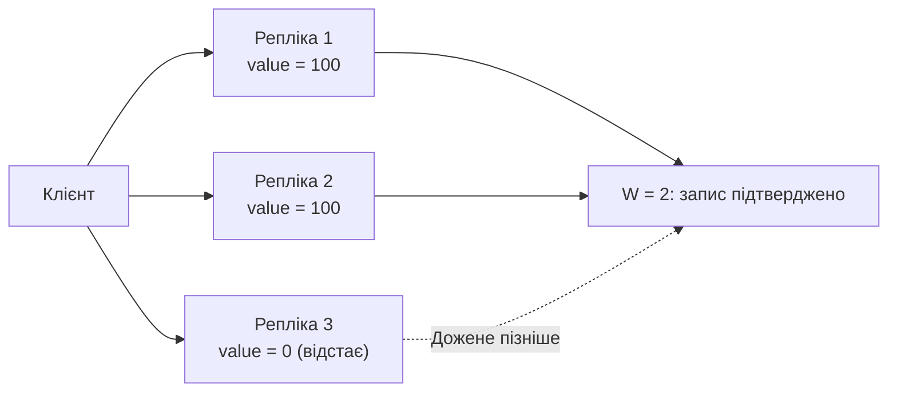

**Одновузлові та синхронні реляційні системи.** Для порівняння розглянемо класичну транзакцію, яка на одному сервері PostgreSQL виконується атомарно:

```sql
BEGIN;
UPDATE accounts SET balance = balance - 100 WHERE account_id = 1;
UPDATE accounts SET balance = balance + 100 WHERE account_id = 2;
COMMIT;
-- Атомарно: або обидві зміни, або жодної.
```

Тут теорема CAP не діє, бо система не розподілена. Коли ж дані розподіляють між кількома вузлами, ми знову стикаємося з необхідністю вибору.

### Розширення теореми CAP: PACELC

Теорема CAP описує поведінку системи лише під час розділення мережі, а розділення трапляються відносно рідко. Значно частіше система працює в нормальному режимі, і тут теж є компроміс: щоб забезпечити сильнішу узгодженість, треба чекати підтвердження від віддалених реплік, тобто збільшувати затримку.

У 2012 році Даніель Абаді запропонував розширення PACELC (вимовляється «пасел-к»), яке формулюється так:

- **P**artition: якщо відбувається розділення (**P**), система обирає між доступністю (**A**) та консистентністю (**C**);
- **E**lse: інакше (**E**), у нормальному режимі система обирає між затримкою (**L**, latency) та консистентністю (**C**).

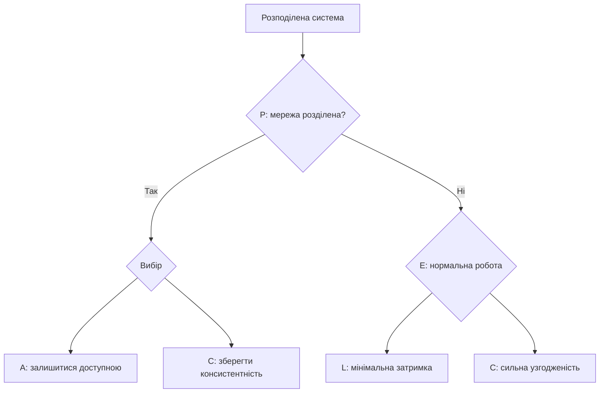

За PACELC системи описують парою значень. Наприклад, Cassandra та DynamoDB (у режимі за замовчуванням) належать до PA/EL, тобто віддають перевагу доступності й швидкості. MongoDB у типовій конфігурації — PC/EC, тобто віддає перевагу консистентності в обох режимах. Це краще відображає реальність, ніж проста мітка CP чи AP.

## BASE семантика: Basically Available, Soft state, Eventual consistency

### Контраст з ACID

Реляційні системи спираються на властивості ACID:

- **Atomicity (атомарність):** операції транзакції виконуються повністю або не виконуються взагалі;
- **Consistency (узгодженість станів):** транзакція переводить базу з одного коректного стану в інший, з дотриманням обмежень цілісності;
- **Isolation (ізольованість):** паралельні транзакції не заважають одна одній;
- **Durability (довговічність):** підтверджені зміни не губляться.

Зверніть увагу: літера C в ACID та літера C в CAP означають різне. У ACID це дотримання обмежень цілісності даних (типів, унікальності, зовнішніх ключів), у CAP це узгодженість реплік між собою. Плутанина цих двох понять є однією з найчастіших помилок.

Багато NoSQL-систем історично спиралися на альтернативний підхід, який жартома назвали BASE (буквально «основа», на противагу «кислоті» ACID):

- **Basically Available (базова доступність):** система гарантує доступність у більшості випадків;
- **Soft state (м'який стан):** стан системи може змінюватися з часом навіть без нових запитів;
- **Eventual consistency (евентуальна консистентність, згодом досягнута узгодженість):** якщо нових оновлень немає, усі репліки з часом дійдуть до однакового стану.

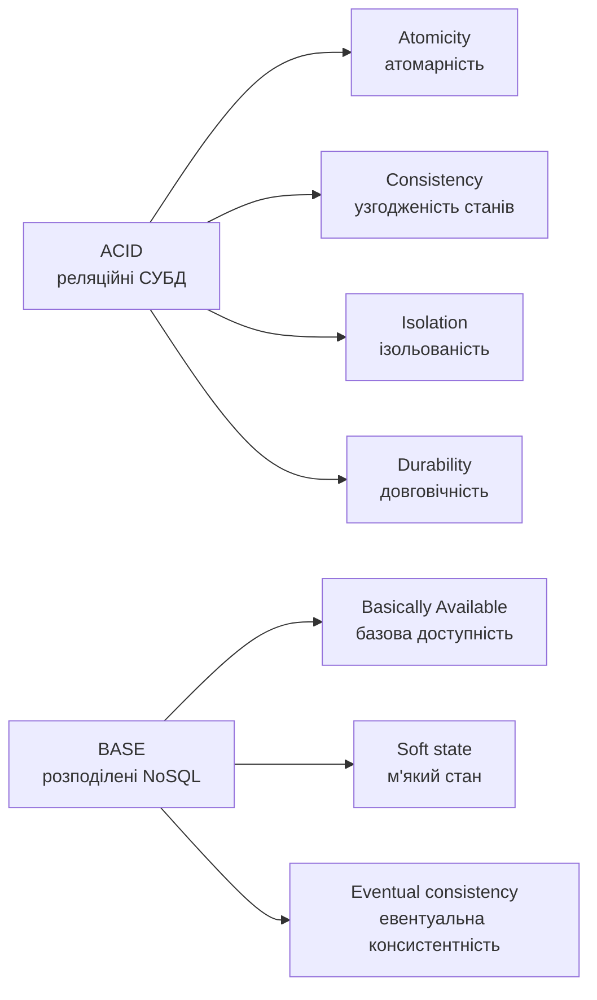

Не слід сприймати ACID і BASE як дві протилежні «партії». Це два краї спектра. Крім того, сучасні NoSQL-системи дедалі частіше пропонують ACID-транзакції там, де вони справді потрібні (MongoDB, DynamoDB, Couchbase), а розподілені реляційні системи навчилися масштабуватися (див. розділ про NewSQL). Тому BASE слід розглядати як опис способу мислення, а не жорстку властивість конкретного продукту.

### Basically Available (базова доступність)

Замість гарантії безперервної роботи BASE-системи прагнуть залишатися доступними в більшості випадків, за потреби повертаючи менш точні або неповні дані замість відмови. Такий підхід називають також «плавною деградацією» (graceful degradation).

```javascript
// Лічильник вподобань у соціальній мережі:
// за проблем із основною базою повертаємо наближене значення
async function getLikesCount(postId) {
    try {
        const exactCount = await db.likes.countDocuments({ postId });
        return { count: exactCount, approximate: false };
    } catch (error) {
        // Основна база недоступна — беремо значення з кешу
        const cached = await cache.get(`likes:${postId}`);
        return { count: cached ?? 0, approximate: true };
    }
}
```

У цьому прикладі система відповідає завжди, хоча іноді й із меншою точністю. Для лічильника вподобань це прийнятно, а для балансу банківського рахунку ні. Ця різниця в допустимості неточності і є ключем до вибору моделі узгодженості.

### Soft state (м'який стан)

В ACID-системах стан бази чітко визначений і змінюється лише внаслідок транзакцій. BASE-системи допускають, що стан змінюється й без зовнішніх запитів: через фонову синхронізацію реплік, автоматичне видалення застарілих даних чи перерахунок похідних значень.

```javascript
// Кеш з автоматичним видаленням за TTL (Time To Live, «час життя»)
class CacheWithSoftState {
    constructor() {
        this.data = new Map();
    }

    set(key, value, ttlSeconds) {
        const expiresAt = Date.now() + ttlSeconds * 1000;
        this.data.set(key, { value, expiresAt });
    }

    get(key) {
        const item = this.data.get(key);
        if (!item) return null;
        // Стан «м'який»: значення саме «протухає» з часом
        if (item.expiresAt <= Date.now()) {
            this.data.delete(key);
            return null;
        }
        return item.value;
    }
}
```

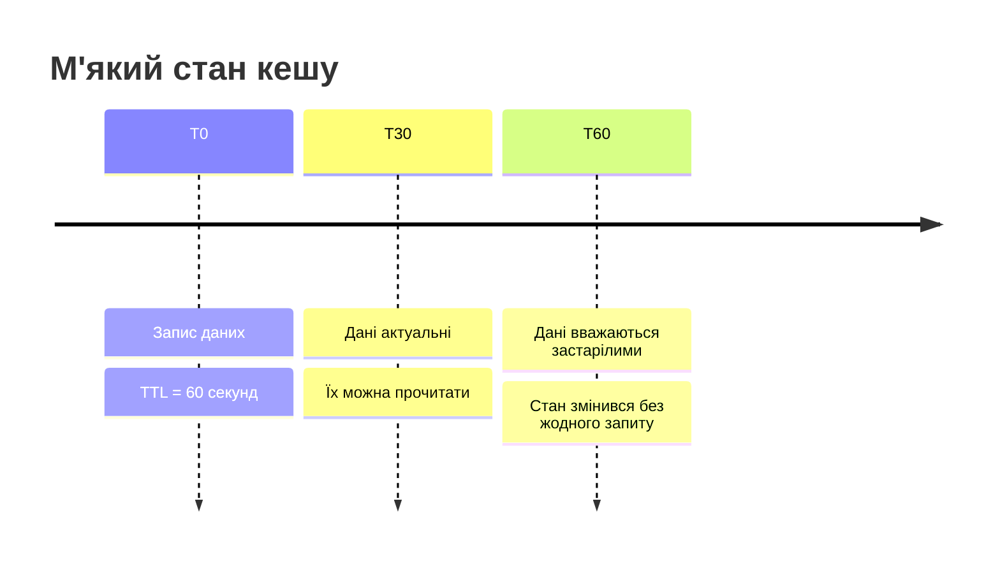

### Eventual consistency (евентуальна консистентність)

Це центральна ідея BASE. Система не гарантує негайної узгодженості реплік після запису, але обіцяє: якщо нових оновлень не надходитиме, всі репліки з часом матимуть однакове значення. На практиці «з часом» означає мілісекунди чи секунди, але без жорсткої гарантії.

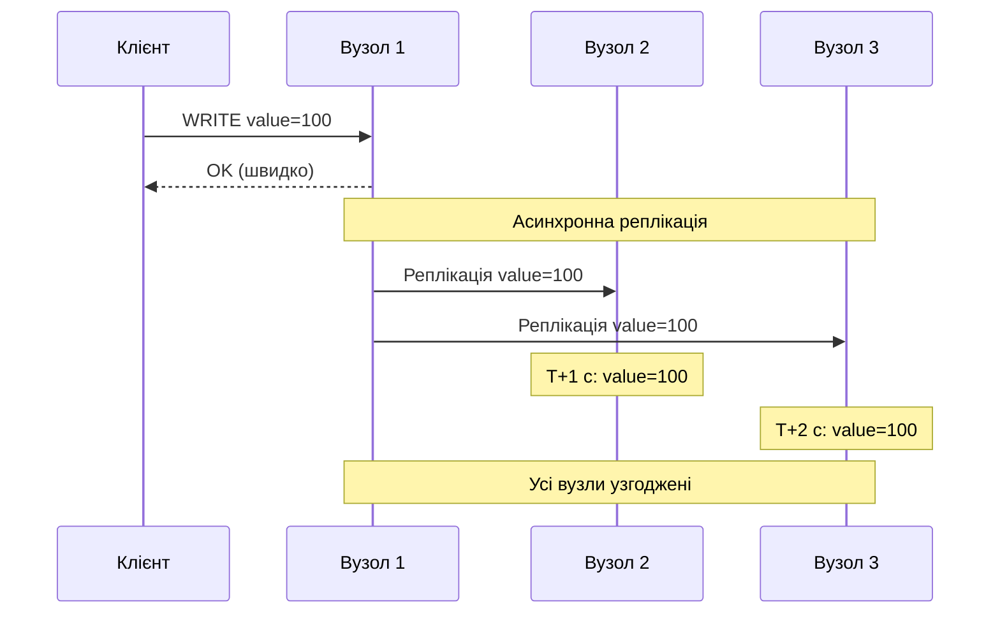

Спрощена схема відкладеної реплікації виглядає так:

```javascript
async function writeData(key, value) {
    // 1. Негайний запис у головну базу
    await masterDB.set(key, value);

    // 2. Реплікацію інших вузлів ставимо в чергу
    replicationQueue.add({ operation: 'set', key, value, timestamp: Date.now() });

    return { success: true };
}

// Фоновий процес реплікації
async function replicationWorker() {
    while (true) {
        const operation = await replicationQueue.take();
        for (const replica of replicas) {
            try {
                await replica.set(operation.key, operation.value);
            } catch (error) {
                // За помилки повертаємо операцію в чергу для повторної спроби
                replicationQueue.add(operation);
            }
        }
    }
}
```

Реальні системи використовують кілька механізмів для доведення реплік до узгодженого стану:

- **читання з виправленням (read repair):** якщо під час читання виявлено розбіжність реплік, система одразу виправляє відстаючу;
- **анти-ентропія (anti-entropy):** фоновий порівняльний обхід даних реплік (зазвичай на основі дерев Меркла) для виправлення розбіжностей;
- **підказки передачі (hinted handoff):** якщо репліка тимчасово недоступна, інший вузол зберігає для неї записи й передає їх, коли вона повернеться;
- **векторні годинники та CRDT** для відстеження й автоматичного злиття конфліктних оновлень (розглянемо нижче).

### Векторні годинники

Коли різні вузли приймають записи незалежно, потрібен спосіб зрозуміти: одне оновлення відбулося «до» іншого чи вони конкурентні? Фізичні годинники для цього не підходять, бо годинники різних машин ніколи не синхронізовані ідеально. Логічний годинник Лампорта вирішує задачу частково, а векторний годинник (vector clock) повністю фіксує причинно-наслідкові зв'язки. Кожен вузол зберігає вектор лічильників, по одному на кожен вузол системи.

Правила прості. Вузол збільшує власний лічильник, коли виконує локальну подію. Під час отримання чужого вектора вузол об'єднує його зі своїм, беручи максимум за кожним компонентом. Щоб порівняти два вектори `A` і `B`: якщо `A` менший або дорівнює `B` за кожним компонентом і хоча б в одному менший, то `A` відбулося раніше за `B`. Якщо жоден не є «меншим», події конкурентні, тобто відбулися незалежно, і це справжній конфлікт.

```javascript
class VectorClock {
    constructor(clock = {}) {
        this.clock = { ...clock };   // { nodeId: лічильник }
    }

    increment(nodeId) {
        this.clock[nodeId] = (this.clock[nodeId] || 0) + 1;
    }

    merge(other) {
        for (const [nodeId, counter] of Object.entries(other.clock)) {
            this.clock[nodeId] = Math.max(this.clock[nodeId] || 0, counter);
        }
    }

    // true, якщо this відбулося строго раніше за other
    happensBefore(other) {
        // Перевіряємо ОБ'ЄДНАННЯ ключів обох векторів
        const nodes = new Set([
            ...Object.keys(this.clock),
            ...Object.keys(other.clock)
        ]);
        let strictlySmaller = false;
        for (const node of nodes) {
            const a = this.clock[node] || 0;
            const b = other.clock[node] || 0;
            if (a > b) return false;
            if (a < b) strictlySmaller = true;
        }
        return strictlySmaller;
    }

    // true, якщо жодне з відбулося-до не виконується: події конкурентні
    concurrentWith(other) {
        return !this.happensBefore(other)
            && !other.happensBefore(this)
            && JSON.stringify(this.clock) !== JSON.stringify(other.clock);
    }
}

// Приклад
const a = new VectorClock({ node1: 1, node2: 0 });  // подія на вузлі 1
const b = new VectorClock({ node1: 0, node2: 1 });  // незалежна подія на вузлі 2
console.log(a.concurrentWith(b));   // true — конфлікт, потрібне розв'язання

b.merge(a);      // вузол 2 дізнався про подію вузла 1
b.increment('node2');
console.log(a.happensBefore(b));    // true — a передує b
```

Зверніть увагу: у реалізації порівняння обов'язково перебираються ключі обох векторів. Якщо ітерувати лише по ключах одного з них, вузли, про які цей вектор «ще не чув», буде пропущено, і результат порівняння виявиться хибним. Векторні годинники використовувалися в оригінальній Amazon Dynamo. У сучасних системах їх часто замінюють простішими механізмами (наприклад, «останній запис перемагає»), які легші в експлуатації, але допускають втрату оновлень.

### Конфлікти та їх розв'язання

Коли дві репліки містять конкурентні версії одних і тих самих даних, треба вирішити, яка з них «правильна». Основні стратегії такі.

**Last Write Wins (LWW), «останній запис перемагає».** Обирається версія з пізнішою міткою часу. Стратегія проста й широко використовується (Cassandra застосовує її за замовчуванням), але має серйозний недолік: якщо годинники вузлів розсинхронізовані, «останній» запис може виявитися насправді ранішим, а конкурентні оновлення мовчки втрачаються.

```javascript
function resolveConflict(v1, v2) {
    return v1.timestamp > v2.timestamp ? v1 : v2;
}
```

**Збереження всіх версій (siblings).** Система зберігає обидві конкурентні версії й повертає їх клієнту, а застосунок вирішує, як їх об'єднати. Так працював оригінальний Dynamo та Riak. Цей підхід не втрачає даних, але перекладає складність на застосунок.

```javascript
class MultiVersionStore {
    constructor() { this.data = new Map(); }

    write(key, value, nodeId) {
        if (!this.data.has(key)) this.data.set(key, []);
        this.data.get(key).push({ value, nodeId, timestamp: Date.now() });
    }

    read(key, resolver) {
        const versions = this.data.get(key) || [];
        if (versions.length <= 1) return versions[0]?.value ?? null;
        return resolver(versions);   // застосунок вирішує сам
    }
}
```

**CRDT (Conflict-free Replicated Data Types, безконфліктні реплікувані типи даних).** Це структури даних, спроєктовані так, що будь-які конкурентні оновлення завжди можна злити автоматично й однозначно, незалежно від порядку отримання. Прикладами є лічильники (кожен вузол збільшує лише свій компонент, а значення дорівнює сумі) та множини. CRDT лежать в основі Redis Enterprise (Active-Active), Riak та багатьох застосунків для спільного редагування. Вони не універсальні, але для лічильників, множин і прапорців є дуже елегантним рішенням.

## Таксономія NoSQL систем

NoSQL-системи класифікують за моделлю даних. Кожна модель оптимізована для певних даних і шаблонів доступу. Класична класифікація виокремлює чотири основні типи, до яких сьогодні додають ще й п'ятий: векторні бази даних.

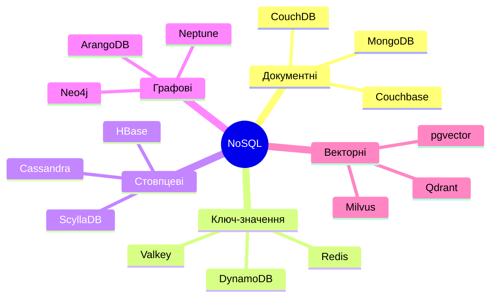

### Документні бази даних

Документні системи зберігають дані як документи, зазвичай у форматі JSON або його бінарного варіанта BSON. Кожен документ самодостатній і може містити вкладені структури та масиви. Схема гнучка: документи в межах однієї колекції можуть мати різну структуру.

**Характеристики:**

- гнучка схема (часто з можливістю необов'язкової валідації);
- підтримка вкладених структур і масивів;
- індексація довільних полів, у тому числі вкладених;
- виразні мови запитів.

```javascript
{
    "_id": ObjectId("507f1f77bcf86cd799439011"),
    "type": "blog_post",
    "title": "Вступ до NoSQL систем",
    "author": { "name": "Іван Петров", "email": "ivan@example.com" },
    "tags": ["nosql", "databases", "mongodb"],
    "comments": [
        { "user": "Марія Коваленко", "text": "Чудова стаття!",
          "date": ISODate("2026-01-15T10:30:00Z"), "likes": 5 }
    ],
    "metadata": { "views": 1523, "shares": 47 }
}
```

Типові операції в MongoDB:

```javascript
// Вставка
db.posts.insertOne({ title: "Нова стаття", tags: ["tutorial"] });

// Пошук за вкладеними полями та масивами
db.posts.find({ tags: "nosql", "metadata.views": { $gt: 1000 } });

// Оновлення вкладеної структури
db.posts.updateOne(
    { _id: ObjectId("507f1f77bcf86cd799439011") },
    {
        $push: { comments: { user: "Новий користувач", text: "Коментар", date: new Date() } },
        $inc: { "metadata.views": 1 }
    }
);
```

**Представники:** MongoDB, Couchbase, Apache CouchDB, Amazon DocumentDB, RavenDB. Окремо варто згадати, що PostgreSQL із типом `JSONB` фактично виконує роль документної бази для багатьох сценаріїв.

**Сфери застосування:** системи керування контентом, каталоги товарів, профілі користувачів, застосунки з часто змінюваною моделлю даних. MongoDB буде детально розглянуто в лекції 10.

### Сховища «ключ-значення»

Найпростіша модель NoSQL: колекція пар «ключ → значення», де значення для сховища «непрозоре» (або має просту структуру), а основні операції: прочитати, записати й видалити за ключем. Відсутність складних запитів дає змогу досягти найвищої швидкості й лінійного масштабування.

```javascript
// Node.js, бібліотека ioredis (або node-redis)
await redis.set('user:1001:name', 'Іван Петров');
const name = await redis.get('user:1001:name');

// Redis підтримує структури даних, а не лише рядки
await redis.hset('user:1001', { name: 'Іван Петров', email: 'ivan@example.com', age: '25' });
await redis.lpush('user:1001:notifications', 'Нове повідомлення');
await redis.sadd('user:1001:friends', 'user:1002', 'user:1003');
await redis.zadd('leaderboard', 100, 'user:1001', 150, 'user:1002');
```

Кілька розширених можливостей сучасних сховищ:

```javascript
// TTL: сесія автоматично зникне через годину
await redis.set('session:abc123', JSON.stringify({ userId: '1001' }), 'EX', 3600);

// Атомарні операції
await redis.incr('page:views:homepage');
await redis.hincrby('user:1001', 'points', 10);

// Публікація/підписка на повідомлення
await redis.publish('notifications', JSON.stringify({ type: 'new_message', userId: '1001' }));
```

**Представники:** Redis, Valkey, Memcached, Amazon DynamoDB. Про Redis і Valkey слід сказати окремо. У 2024 році компанія Redis змінила ліцензію з BSD на обмежувальні ліцензії (RSALv2/SSPLv1), що не є відкритим кодом за визначенням OSI. У відповідь спільнота під егідою Linux Foundation створила форк Valkey, який підтримують Amazon, Google та інші. У 2025 році з версії Redis 8 компанія додала AGPLv3 як один з варіантів ліцензування. Ця історія добре ілюструє, що вибір технології залежить не лише від функцій, а й від ліцензійної моделі та стійкості спільноти.

**Сфери застосування:** кешування, сесії, лічильники, рейтинги, черги, розподілені блокування, обмеження частоти запитів.

Про надійність: за замовчуванням Redis асинхронно реплікує дані, тому у випадку відмови основного вузла підтверджені записи можуть загубитися. Redis Cluster не гарантує сильної консистентності. Якщо для задачі це критично, як основне сховище його використовувати не варто.

### Стовпцеві (широкостовпцеві) бази даних

Стовпцеві бази (wide-column stores або column-family) ведуть родовід від Google Bigtable. Дані організовано в таблиці з рядками й стовпцями, але на відміну від реляційних, різні рядки можуть мати різні набори стовпців, а таблиця розподіляється між вузлами за ключем секції (partition key). Не плутайте цей клас із колонковими аналітичними СУБД (ClickHouse, Parquet-сховища): вони теж зберігають дані по стовпцях, але призначені для аналітики, а не для високонавантаженого запису.

Проєктування в Cassandra засадничо відрізняється від реляційного: спочатку визначають запити, а потім під кожен із них створюють таблицю. Тому в Cassandra нормально мати кілька таблиць з одними й тими самими даними.

```cql
-- CQL (Cassandra Query Language): запити вибору користувачів країни за датою реєстрації
CREATE TABLE users_by_country (
    country text,                 -- ключ секції: визначає вузол
    registration_date timestamp,  -- ключ кластеризації: порядок усередині секції
    user_id uuid,
    name text,
    email text,
    PRIMARY KEY ((country), registration_date, user_id)
) WITH CLUSTERING ORDER BY (registration_date DESC, user_id ASC);

INSERT INTO users_by_country (country, registration_date, user_id, name, email)
VALUES ('Ukraine', toTimestamp(now()), uuid(), 'Іван Петров', 'ivan@example.com');

-- Ефективний запит: обмеження по ключу секції і діапазон по ключу кластеризації
SELECT * FROM users_by_country
WHERE country = 'Ukraine'
  AND registration_date > '2026-01-01';
```

Зверніть увагу: якби `registration_date` не входило до ключа кластеризації, такий запит Cassandra відхилила б (або вимагала б небезпечного `ALLOW FILTERING`, що змушує сканувати всі дані). Це наслідок принципу: запити мусять відповідати структурі ключа.

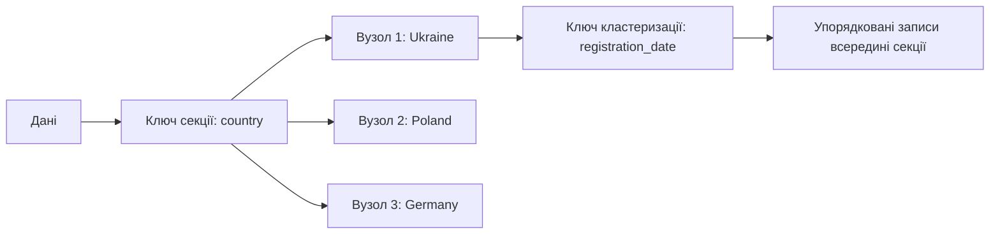

**Представники:** Apache Cassandra, ScyllaDB (сумісна з Cassandra і написана мовою C++), Apache HBase, Google Bigtable.

**Сфери застосування:** журнали подій і телеметрія, часові ряди, історія повідомлень, будь-які задачі з дуже високою інтенсивністю запису та зрозумілими наперед шаблонами запитів.

### Графові бази даних

Графові бази оптимізовані для даних, де головну цінність несуть зв'язки між сутностями. Модель складається з вузлів, ребер і властивостей, які можуть бути в обох. Головна перевага в тому, що обхід зв'язків не потребує JOIN: ребра зберігаються як прямі посилання, тому продуктивність обходу залежить від кількості реально пройдених зв'язків, а не від розміру всієї бази.

```cypher
// Створення вузлів і зв'язків мовою Cypher (Neo4j)
CREATE (ivan:Person {name: 'Іван Петров', age: 25})
CREATE (maria:Person {name: 'Марія Коваленко', age: 23})
CREATE (kyiv:City {name: 'Київ'})
CREATE (company:Company {name: 'TechCorp'})

CREATE (ivan)-[:LIVES_IN]->(kyiv)
CREATE (maria)-[:LIVES_IN]->(kyiv)
CREATE (ivan)-[:WORKS_FOR {position: 'Developer', since: 2020}]->(company)
CREATE (ivan)-[:FRIEND_OF {since: 2019}]->(maria)

// Друзі друзів
MATCH (p:Person {name: 'Іван Петров'})-[:FRIEND_OF*1..2]-(friend)
WHERE friend <> p
RETURN DISTINCT friend.name

// Колеги з того самого міста
MATCH (p:Person {name: 'Іван Петров'})-[:LIVES_IN]->(city),
      (colleague:Person)-[:LIVES_IN]->(city),
      (p)-[:WORKS_FOR]->(company),
      (colleague)-[:WORKS_FOR]->(company)
WHERE p <> colleague
RETURN colleague.name, city.name
```

Про мови запитів: Cypher, створений для Neo4j, лягла в основу відкритого стандарту openCypher, а у 2024 році опубліковано міжнародний стандарт ISO/IEC 39075 GQL (Graph Query Language) — перший новий стандарт мови баз даних після SQL. Хоча GQL поки що впроваджується поступово, його існування свідчить про зрілість графового напряму. Крім того, у стандарт SQL:2023 додано розділ SQL/PGQ для запитів до графів над реляційними таблицями.

**Представники:** Neo4j, Amazon Neptune, ArangoDB, Memgraph, JanusGraph.

**Сфери застосування:** соціальні мережі, рекомендаційні системи, виявлення шахрайства, управління знаннями, аналіз мереж і залежностей.

### Векторні бази даних

Останні кілька років з'явився ще один важливий клас: векторні бази даних. Вони зберігають **вектори-вбудови** (embeddings), тобто масиви чисел, які нейронні моделі отримують із тексту, зображень чи звуку так, що семантично близькі об'єкти мають близькі вектори. Основна операція — пошук найближчих сусідів (k-NN): знайти `k` векторів, найближчих до заданого за метрикою (косинусна відстань, скалярний добуток, евклідова відстань).

Точний пошук у мільйонах векторів надто повільний, тому використовують наближені алгоритми (ANN, approximate nearest neighbors), найпопулярніший із яких — HNSW (ієрархічні графи «малого світу»). Вони жертвують невеликою часткою точності заради швидкості на порядки вищої.

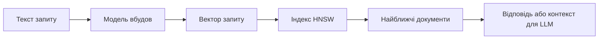

Векторні бази є основою так званого RAG (retrieval-augmented generation): перед тим як запитати велику мовну модель, застосунок знаходить у базі знань релевантні уривки й додає їх до запиту. Це стало одним із найпоширеніших патернів побудови застосунків зі штучним інтелектом, включно з ШІ-агентами, які використовують векторні сховища як довготривалу пам'ять.

**Представники:** спеціалізовані — Qdrant, Milvus, Weaviate, Pinecone; вбудовані в інші СУБД — pgvector (розширення PostgreSQL), MongoDB Atlas Vector Search, Elasticsearch, Redis. Тенденція очевидна: векторний пошук стає не окремим продуктом, а функцією, яку додають до універсальних СУБД. У лекції 11 ми побачимо це на прикладі Elasticsearch.

### Інші та мультимодельні системи

Класифікація не вичерпується п'ятьма типами. Варто згадати:

- **бази часових рядів** (InfluxDB, TimescaleDB, вбудовані time series collections у MongoDB) для метрик і телеметрії;
- **пошукові системи** (Elasticsearch, OpenSearch), розглянуті в лекції 11;
- **мультимодельні СУБД** (ArangoDB, Azure Cosmos DB), що підтримують кілька моделей даних в одному рушії.

## NoSQL, NewSQL і PostgreSQL: як вибирати сьогодні

Оскільки ми бачили, що межі між категоріями розмиваються, доцільно розглянути ще один клас систем і сформулювати практичні критерії вибору.

**NewSQL** (Google Spanner, CockroachDB, TiDB, YugabyteDB) — це розподілені бази, що зберігають реляційну модель і SQL з ACID-транзакціями, але масштабуються горизонтально. Вони досягають цього через складні протоколи консенсусу (Raft, Paxos) і, у випадку Spanner, апаратно синхронізовані годинники (TrueTime). Ціною є вищі затримки запису (кожна транзакція потребує консенсусу) і складніша експлуатація. У термінах CAP більшість із них є CP-системами, які прагнуть зробити недоступність настільки рідкісною, наскільки можливо.

Тепер підсумуємо, з чого починати вибір:

| Ситуація | Розумний початковий вибір |
|----------|---------------------------|
| Типовий вебзастосунок, дані структуровані, обсяг у межах одного сервера | PostgreSQL (можливо, з `JSONB` для гнучких частин) |
| Дані природно є вкладеними документами, схема часто змінюється | Документна БД (MongoDB) або `JSONB` |
| Потрібен швидкий кеш, сесії, лічильники | Redis або Valkey |
| Дуже інтенсивний запис, відомі наперед шаблони запитів, багато регіонів | Cassandra / ScyllaDB / DynamoDB |
| Головне — зв'язки між об'єктами і глибокі обходи | Графова БД |
| Повнотекстовий пошук із релевантністю, фасети | Elasticsearch / OpenSearch (або вбудований пошук PostgreSQL для простих задач) |
| Семантичний пошук, RAG | Векторний індекс (pgvector, спеціалізована БД або пошуковий рушій) |
| Реляційна модель + глобальне горизонтальне масштабування | NewSQL |

Корисне практичне правило: **починайте з найпростішого рішення, яке відповідає вимогам, і додавайте спеціалізовані системи лише коли з'явиться доведена потреба.** Значна частина застосунків, які «потребують NoSQL», насправді чудово працює на одній добре налаштованій PostgreSQL. І навпаки, вибір NoSQL лише тому, що він «сучасний», нерідко призводить до самостійної реалізації транзакцій і зв'язків на рівні застосунку.

## Polyglot Persistence: гетерогенні архітектури зберігання даних

### Концепція Polyglot Persistence

Polyglot Persistence (багатомовна, або поліглотна персистентність; термін вживають без перекладу) означає використання різних технологій зберігання в одному застосунку, із вибором оптимальної СУБД для кожної конкретної задачі. Підхід визнає, що не існує універсальної бази даних, яка була б найкращою для всіх типів даних і шаблонів доступу. Ідея нагадує програмування кількома мовами: ми обираємо інструмент під задачу.

**Принципи:**

- кожна технологія має сильні й слабкі сторони;
- різні частини застосунку мають різні вимоги до зберігання;
- оптимізація під конкретну задачу важливіша за уніфікацію;
- складність інтеграції виправдана лише тоді, коли вона окупається перевагами спеціалізації.

### Приклад архітектури інтернет-магазину

Розглянемо типовий інтернет-магазин, де кожен тип даних зберігається в підходящій системі.

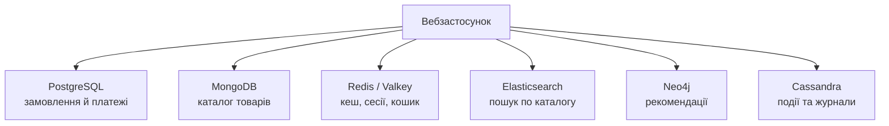

**PostgreSQL для транзакційних даних.** Замовлення й платежі потребують суворих ACID-гарантій:

```sql
CREATE TABLE orders (
    order_id     SERIAL PRIMARY KEY,
    user_id      INT NOT NULL REFERENCES users(user_id),
    total_amount NUMERIC(10,2) NOT NULL,
    status       VARCHAR(20) NOT NULL,
    created_at   TIMESTAMPTZ DEFAULT now()
);

CREATE TABLE order_items (
    order_item_id SERIAL PRIMARY KEY,
    order_id      INT NOT NULL REFERENCES orders(order_id),
    product_id    INT NOT NULL,
    quantity      INT NOT NULL,
    price         NUMERIC(10,2) NOT NULL
);

-- Атомарне оформлення замовлення
BEGIN;
WITH new_order AS (
    INSERT INTO orders (user_id, total_amount, status)
    VALUES (1001, 299.99, 'pending')
    RETURNING order_id
)
INSERT INTO order_items (order_id, product_id, quantity, price)
SELECT order_id, 501, 2, 149.99 FROM new_order;

-- Умова stock >= 2 не дасть продати те, чого немає
UPDATE products SET stock = stock - 2 WHERE product_id = 501 AND stock >= 2;
-- Якщо оновлено 0 рядків, застосунок має виконати ROLLBACK
COMMIT;
```

**MongoDB для каталогу товарів.** Різні категорії мають різні атрибути, тож гнучка схема доречна:

```javascript
db.products.insertOne({
    sku: "LAPTOP-DELL-5520",
    name: "Dell Latitude 5520",
    category: "Ноутбуки",
    price: Decimal128.fromString("35999.00"),   // у Node.js; у mongosh — NumberDecimal("35999.00")
    specifications: {
        processor: "Intel Core i7-1165G7",
        ram: "16GB DDR4",
        storage: "512GB SSD"
    },
    images: ["/images/laptop-dell-5520-1.jpg"],
    availability: { inStock: true, quantity: 15 }
});
```

**Redis для кешування й сесій:**

```javascript
// Кешування популярного товару на годину
await redis.set('product:bestseller:1', JSON.stringify({ id: 501, name: "Ноутбук Dell" }), 'EX', 3600);

// Кошик покупця
await redis.hset('cart:user:1001', { 'product:501': '2', 'product:502': '1' });

// Сесія на 30 хвилин
await redis.set('session:abc123xyz', JSON.stringify({ userId: 1001 }), 'EX', 1800);
```

**Elasticsearch для пошуку.** Клієнти версій 8 і новіших приймають параметри запиту безпосередньо, без обгортки `body`, яку використовували раніше:

```javascript
// Індексація товару
await esClient.index({
    index: 'products',
    id: '501',
    document: {
        name: 'Dell Latitude 5520',
        category: 'Ноутбуки',
        description: 'Потужний бізнес-ноутбук',
        price: 35999
    }
});

// Повнотекстовий пошук з фасетами за категоріями
const results = await esClient.search({
    index: 'products',
    query: {
        multi_match: { query: 'ноутбук core i7', fields: ['name^2', 'description'] }
    },
    aggs: {
        categories: { terms: { field: 'category.keyword' } }
    }
});
```

Більше про Elasticsearch дізнаємося в лекції 11.

**Neo4j для рекомендацій:**

```cypher
// Знаходження користувачів зі схожими покупками
MATCH (u:User {id: 1001})-[:PURCHASED]->(p:Product)<-[:PURCHASED]-(similar:User)
WHERE u <> similar
RETURN similar, COUNT(p) AS commonPurchases
ORDER BY commonPurchases DESC
LIMIT 10

// Рекомендації на основі покупок схожих користувачів
MATCH (u:User {id: 1001})-[:PURCHASED]->(:Product)<-[:PURCHASED]-(similar:User)
      -[:PURCHASED]->(rec:Product)
WHERE NOT (u)-[:PURCHASED]->(rec)
RETURN rec, COUNT(similar) AS score
ORDER BY score DESC
LIMIT 5
```

**Cassandra для подій і журналів:**

```cql
CREATE TABLE user_activity (
    user_id       uuid,
    activity_date date,
    activity_time timestamp,
    activity_type text,
    product_id    int,
    session_id    text,
    PRIMARY KEY ((user_id, activity_date), activity_time)
) WITH CLUSTERING ORDER BY (activity_time DESC);

INSERT INTO user_activity (user_id, activity_date, activity_time, activity_type, product_id, session_id)
VALUES (uuid(), '2026-01-15', toTimestamp(now()), 'product_view', 501, 'session123');
```

Секція за парою `(user_id, activity_date)` обмежує розмір кожної секції: без неї активний користувач накопичував би нескінченну секцію.

### Виклики Polyglot Persistence

Кожна додаткова система має свою ціну.

**Складність інтеграції:**

- необхідність підтримувати з'єднання з кількома базами;
- синхронізація даних між системами;
- відсутність єдиної транзакції, яка охоплює кілька баз.

**Операційні виклики:**

- різні інструменти моніторингу й адміністрування;
- потреба в експертизі з кількох технологій;
- складність резервного копіювання, оновлень і відновлення.

**Консистентність даних:**

- розподілені транзакції між різнорідними системами практично неможливі або надто дорогі;
- між системами доводиться приймати евентуальну консистентність;
- складно відстежити, яка система містить «істину» для кожного факту.

Останній пункт найважливіший: для кожного виду даних має бути визначено **єдине джерело істини** (source of truth), а решта копій вважаються похідними. У наведеному прикладі джерелом істини для замовлень є PostgreSQL, для каталогу MongoDB, а Elasticsearch і Redis містять лише похідні, відновлювані дані.

### Патерни інтеграції

**Transactional Outbox і Change Data Capture.** Найпоширеніша помилка в поліглотних системах — «подвійний запис»: застосунок спочатку записує в PostgreSQL, а потім окремим викликом оновлює Elasticsearch. Якщо між двома викликами станеться збій, системи розійдуться, і жодна транзакція цього не запобіжить. Надійне рішення — патерн **Transactional Outbox** («вихідна скринька»). Застосунок в одній локальній транзакції записує і бізнес-дані, і подію в спеціальну таблицю `outbox`. Окремий процес читає цю таблицю (або безпосередньо журнал транзакцій бази за допомогою CDC, тобто захоплення змін даних, наприклад Debezium) і надійно доставляє події в чергу повідомлень (Kafka, RabbitMQ), звідки їх споживають інші системи.

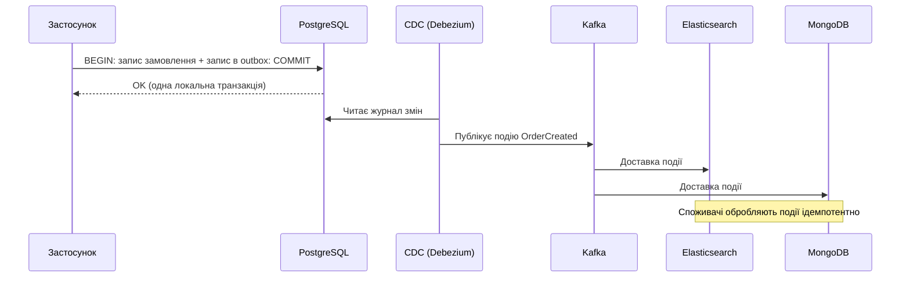

```sql
-- Локальна транзакція: бізнес-дані та подія фіксуються атомарно
BEGIN;
INSERT INTO orders (user_id, total_amount, status) VALUES (1001, 299.99, 'pending');
INSERT INTO outbox (aggregate_type, aggregate_id, event_type, payload)
VALUES ('order', 42, 'OrderCreated', '{"orderId": 42, "total": 299.99}');
COMMIT;
```

Споживачі мають бути **ідемпотентними**: повторна обробка тієї самої події не повинна псувати дані, адже гарантія доставки в такій схемі зазвичай «принаймні один раз».

**CQRS (Command Query Responsibility Segregation).** Ідея в розділенні моделей запису (команд) і читання (запитів). Команди змінюють стан у транзакційній базі, а запити читають із бази, оптимізованої під читання і наповнюваної через події.

```javascript
// Команда змінює стан у транзакційній базі та створює подію
class CreateOrderCommand {
    async execute(orderData) {
        return await postgres.transaction(async (tx) => {
            const order = await tx.orders.create(orderData);
            await tx.outbox.create({ type: 'OrderCreated', payload: order });
            return order;
        });
    }
}

// Запит читає з моделі, оптимізованої під читання
class OrderQueryService {
    async getOrderDetails(orderId) {
        return await mongodb.collection('orders_view').findOne({ _id: orderId });
    }
}
```

CQRS не варто плутати з Event Sourcing, хоча вони часто зустрічаються разом.

**Event Sourcing.** Це окремий патерн: замість зберігання поточного стану об'єкта система зберігає **послідовність подій**, які до цього стану призвели, а поточний стан виводиться їхнім відтворенням. Джерелом істини є журнал подій, який тільки доповнюється.

```javascript
// Журнал подій — єдине джерело істини
const events = [
    { type: 'AccountOpened',  data: { accountId: 'A1' } },
    { type: 'MoneyDeposited', data: { amount: 500 } },
    { type: 'MoneyWithdrawn', data: { amount: 120 } }
];

// Поточний стан — це згортка подій
function balance(events) {
    return events.reduce((sum, e) => {
        if (e.type === 'MoneyDeposited') return sum + e.data.amount;
        if (e.type === 'MoneyWithdrawn') return sum - e.data.amount;
        return sum;
    }, 0);
}
console.log(balance(events));   // 380
```

Переваги Event Sourcing: повний аудит змін, можливість «подорожі в часі» та відтворення стану на будь-який момент, природна інтеграція з подієвими архітектурами. Недоліки: складніший код, необхідність версіонування подій, складність запитів до поточного стану (тому Event Sourcing майже завжди поєднують із CQRS). Це патерн для специфічних предметних областей (фінанси, логістика), а не для будь-якого застосунку.

Зауважте відмінність від Outbox: там події лише **повідомляють** інші системи про вже збережену зміну, а в Event Sourcing події **є** самим сховищем.

## Висновки

NoSQL-системи виникли як відповідь на обмеження реляційної моделі за умов інтернет-масштабу: величезні обсяги даних, потреба в горизонтальному масштабуванні, мінливі структури даних і глобальна розподіленість. Водночас вони не є універсальною заміною реляційним базам, і сучасні реляційні СУБД теж еволюціонували, запозичивши окремі ідеї NoSQL.

Теорема CAP формалізує компроміс між консистентністю й доступністю під час розділення мережі. Правильно розуміти її як вибір поведінки в разі збою, а не як мітку, що назавжди приклеюється до продукту. Розширення PACELC додає компроміс між затримкою й консистентністю в нормальному режимі. Семантика BASE описує спосіб мислення, за якого допустимі тимчасова неузгодженість і м'який стан заради доступності та масштабованості; на практиці сучасні системи дають змогу обирати рівень узгодженості для кожної операції окремо.

Основні типи NoSQL (документні, «ключ-значення», стовпцеві, графові та векторні бази) відрізняються моделлю даних і шаблонами доступу, для яких оптимізовані. Вибір технології варто починати з найпростішого варіанта, що відповідає вимогам, часто з PostgreSQL, і додавати спеціалізовані системи, коли з'являється доведена потреба.

Підхід Polyglot Persistence поєднує кілька технологій в одній архітектурі, але вимагає дисципліни: чітко визначеного джерела істини для кожного виду даних, надійних механізмів синхронізації (Outbox, CDC) та розуміння того, що між системами доведеться приймати евентуальну консистентність.

У наступній лекції ми детально розглянемо MongoDB: її документну модель, архітектуру (реплікація, шардинг, індекси), мову запитів, транзакції, а також принципи проєктування схем для документних баз. Це дасть змогу застосувати теоретичні поняття цієї лекції на практиці.
