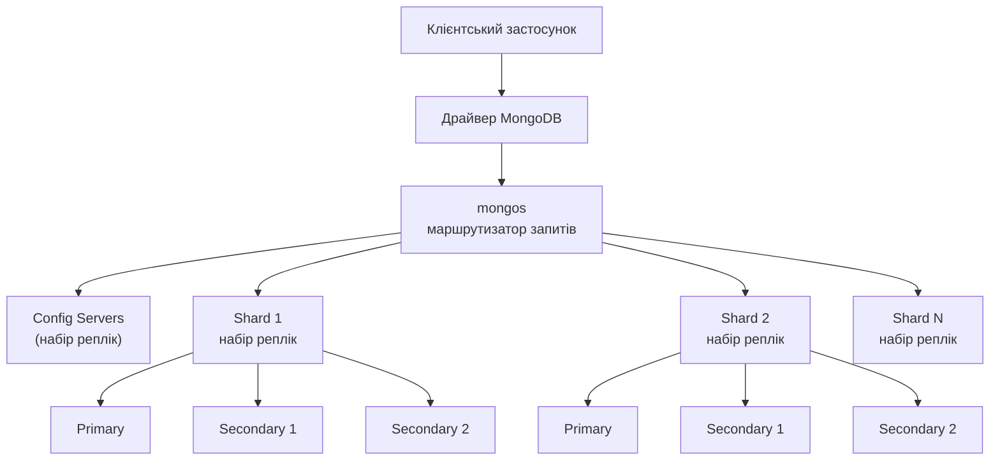
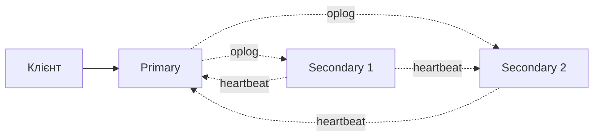
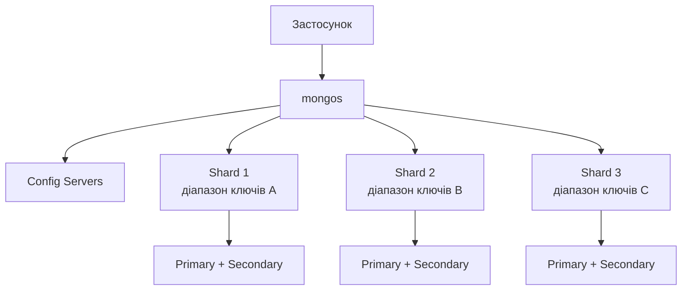
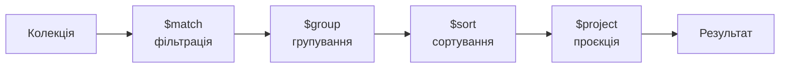
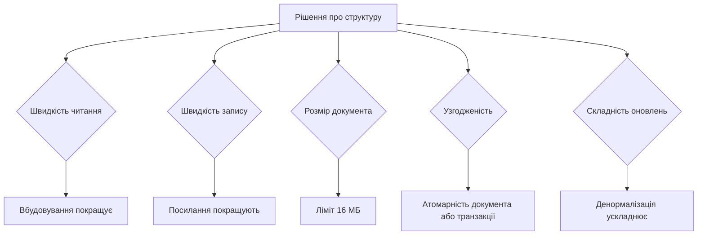
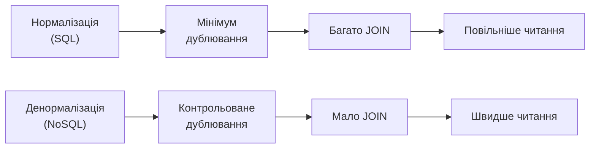

# Лекція 10 MongoDB: архітектура та проєктування схем

## Вступ

MongoDB є однією з найпопулярніших документних СУБД. У попередній лекції ми розглянули її як типового представника документних систем і побачили, де вона розташована на карті компромісів: за PACELC вона в типовій конфігурації належить до класу PC/EC, тобто віддає перевагу узгодженості. Тепер настав час зазирнути всередину. Ми вивчимо, як MongoDB зберігає дані, як забезпечує відмовостійкість і масштабування, якою мовою з нею розмовляти і, головне, як проєктувати схеми даних, які добре працюють саме в документній моделі.

Ці теми об'єднано в одну лекцію невипадково. У реляційному світі схему можна проєктувати майже незалежно від конкретної СУБД: нормальні форми однакові для PostgreSQL і MySQL. У MongoDB все інакше. Вдала схема залежить від того, що саме система вміє робити ефективно: обмеження розміру документа, атомарність на рівні одного документа, вартість багатодокументних транзакцій, особливості індексів і шардингу напряму впливають на рішення «вбудувати чи посилатися». Тому спочатку ми розберемо можливості та обмеження платформи (розділи про модель даних, архітектуру, запити, агрегацію та транзакції), а потім використаємо їх для побудови принципів проєктування схем.

Матеріал орієнтовано на MongoDB 8.x, яка є актуальною гілкою станом на 2026 рік, оболонку `mongosh` і офіційний драйвер для Node.js. Стару оболонку `mongo` було вилучено ще у версії 6.0, тому в прикладах скрізь використовується `mongosh`. Якщо ви зустрінете у старих посібниках команди на зразок `mongo --host`, замінюйте їх на `mongosh`. Також слід пам'ятати, що деталі роботи окремих функцій змінюються від версії до версії, тож за сумнівних випадків варто звіряти поведінку з документацією вашої версії (`https://www.mongodb.com/docs/manual/`).

### Підготовка середовища: MongoDB із набором реплік у Docker

Перш ніж переходити до теорії, розгорнемо середовище для експериментів. Важлива обставина: багатодокументні транзакції та потоки змін (Change Streams), які ми розглянемо далі, працюють лише на наборі реплік або шардованому кластері. Одиночний екземпляр `mongod` без набору реплік їх не підтримує. Проте набір реплік може складатися з єдиного вузла, і для навчання цього цілком достатньо.

```bash
# Запуск MongoDB як набору реплік з одного вузла
docker run -d --name mongo -p 27017:27017 mongo:8 --replSet rs0 --bind_ip_all

# Ініціалізація набору реплік (виконується один раз)
docker exec mongo mongosh --eval 'rs.initiate({ _id: "rs0", members: [{ _id: 0, host: "localhost:27017" }] })'

# Підключення
docker exec -it mongo mongosh
```

Рядок підключення для застосунку в цьому випадку матиме вигляд `mongodb://localhost:27017/?replicaSet=rs0`. Якщо ж ви запустите звичайний `mongod` без параметра `--replSet`, то приклади з транзакціями завершаться помилкою «Transaction numbers are only allowed on a replica set member or mongos». Це найпоширеніша причина, з якої студенти «не можуть запустити транзакцію».

## Документна модель даних

### Концепція документів у MongoDB

Документ є базовою одиницею зберігання даних у MongoDB. На відміну від рядка реляційної таблиці, який є плоским набором значень фіксованих стовпців, документ може мати складну ієрархічну структуру з вкладеними об'єктами та масивами. Кожен документ є набором пар «ключ-значення», де значення можуть належати до різних типів, зокрема самі бути документами чи масивами.

Документи мають кілька важливих характеристик. По-перше, вони самодостатні: документ інкапсулює всю інформацію про сутність, і це дає змогу отримати її одним читанням. По-друге, документи однієї колекції не зобов'язані мати однакову структуру. По-третє, вкладені структури та масиви дозволяють природно моделювати зв'язки, які в реляційній моделі довелося б розкладати на кілька таблиць.

Приклад простого документа студента:

```javascript
{
    "_id": ObjectId("507f1f77bcf86cd799439011"),
    "student_id": "S2026001",
    "first_name": "Іван",
    "last_name": "Петров",
    "email": "ivan.petrov@university.edu.ua",
    "birth_date": ISODate("2007-05-15T00:00:00Z"),
    "enrollment_year": 2026,
    "status": "active"
}
```

Поле `_id` є обов'язковим і унікальним у межах колекції: воно виконує роль первинного ключа. Якщо його не задано явно, драйвер або сервер згенерує значення типу `ObjectId`. Цей 12-байтовий тип складається з часової мітки створення (4 байти), випадкового значення (5 байтів) і лічильника (3 байти). Завдяки цьому `ObjectId` можна генерувати незалежно на різних вузлах без координації та без ризику колізій, а його значення приблизно зростає в часі. Час створення легко витягти: `ObjectId("507f1f77bcf86cd799439011").getTimestamp()`. Водночас `_id` не обов'язково має бути `ObjectId`: це може бути будь-яке унікальне значення, наприклад природний ключ `"S2026001"`, але тоді відповідальність за унікальність лежить на вас.

### Формат BSON

Документи зазвичай показують у вигляді JSON, бо його зручно читати людині, але внутрішньо MongoDB зберігає їх і передає мережею в бінарному форматі BSON (Binary JSON). BSON має кілька переваг над текстовим JSON. Він підтримує додаткові типи даних, яких у JSON немає (дата, бінарні дані, точні десяткові числа, різні цілочисельні типи). Він зберігає довжини полів, що дозволяє швидко пропускати непотрібні частини документа під час розбору. Нарешті, він призначений для ефективного обходу, а не для зручності читання.

Розглянемо документ із різними типами BSON:

```javascript
{
    "_id": ObjectId("507f1f77bcf86cd799439011"),
    "name": "Іван Петров",
    "registration_date": ISODate("2026-09-01T09:00:00Z"),
    "age": NumberInt(19),
    "gpa": NumberDecimal("3.85"),
    "courses_completed": NumberLong(24),
    "profile_picture": BinData(0, "aGVsbG8="),
    "email_verified": true,
    "metadata": {
        "created_at": Timestamp({ t: 1788253200, i: 1 }),
        "last_modified": ISODate("2026-10-15T14:30:00Z")
    }
}
```

Кожен спеціалізований тип має своє призначення. `Int32` і `Int64` (`NumberInt`, `NumberLong`) дають змогу економити місце й уникати помилок округлення для цілих. `Decimal128` (`NumberDecimal`) зберігає десяткові числа з точністю до 34 значущих цифр і призначений для фінансових обчислень, де двійкова арифметика з рухомою комою (тип `Double`) дає похибки (класичне `0.1 + 0.2 ≠ 0.3`). `Date` зберігає момент часу з точністю до мілісекунди, завжди в UTC. Тип `Timestamp` слід відрізняти від `Date`: це внутрішній тип для реплікації та журналу операцій, і в прикладних даних його використовувати не слід.

Назви класів у різних середовищах трохи відрізняються. Оболонка `mongosh` пропонує зручні функції, а драйвер Node.js має відповідні класи:

| Тип BSON | `mongosh` | Node.js (пакет `mongodb`) |
|----------|-----------|---------------------------|
| ObjectId | `ObjectId("...")` | `new ObjectId("...")` |
| Date | `ISODate("...")`, `new Date()` | `new Date()` |
| Int32 | `NumberInt(20)` | `new Int32(20)` |
| Int64 | `NumberLong(24)` | `Long.fromNumber(24)` |
| Decimal128 | `NumberDecimal("3.85")` | `Decimal128.fromString("3.85")` |
| Binary | `BinData(0, "...")` | `new Binary(buffer)` |

Тип числа в документі залежить від клієнта, який його записав. Драйвери зазвичай зберігають цілі числа, що вміщуються в 32 біти, як `Int32`, а дробові чи великі як `Double`. Із цього випливає практичне правило для схем валідації, яке ми побачимо нижче: якщо поле числове, не прив'язуйте валідацію до одного конкретного числового типу без потреби.

Ще одне обмеження BSON, про яке варто знати вже зараз: максимальний розмір одного документа становить 16 МБ. Це не «технічна дрібниця», а один із головних чинників проєктування схем, до якого ми повернемося.

### Колекції та схеми

Колекція є аналогом таблиці, але з суттєвими відмінностями. Вона містить набір документів, логічно пов'язаних між собою, проте не зобов'язаних мати однакову структуру. На рівні бази даних MongoDB не вимагає наперед визначеної схеми: документи однієї колекції можуть мати різні набори полів і навіть різні типи в однойменних полях. Така гнучкість дає змогу легко адаптувати модель до змін у вимогах.

Розглянемо колекцію студентів із документами різної структури:

```javascript
// Студент бакалаврату
{
    "_id": ObjectId("507f1f77bcf86cd799439011"),
    "student_id": "S2026001",
    "name": "Іван Петров",
    "degree": "bachelor",
    "year": 3,
    "major": "Інженерія програмного забезпечення"
}

// Студент магістратури з додатковими полями
{
    "_id": ObjectId("507f1f77bcf86cd799439012"),
    "student_id": "M2026001",
    "name": "Марія Коваленко",
    "degree": "master",
    "thesis_topic": "Розподілені системи обробки даних",
    "supervisor": "Проф. Іваненко",
    "defense_date": ISODate("2027-06-15T00:00:00Z")
}

// Іноземний студент із додатковою інформацією
{
    "_id": ObjectId("507f1f77bcf86cd799439013"),
    "student_id": "F2026001",
    "name": "John Smith",
    "degree": "bachelor",
    "year": 2,
    "country": "USA",
    "visa_expiry": ISODate("2027-08-31T00:00:00Z"),
    "language_proficiency": { "ukrainian": "B1", "english": "native" }
}
```

Слід одразу розвіяти поширену помилку: «гнучка схема» не означає «відсутність схеми». Схема завжди існує, просто вона живе не в базі, а в коді застосунку, який записує й читає документи. Якщо ця неявна схема не документована й не контролюється, колекція швидко перетворюється на звалище, у якому неможливо зрозуміти, які поля чому обов'язкові. Саме тому в MongoDB є механізм валідації, який ми розглянемо далі, і патерн Schema Versioning із другої половини лекції.

### Валідація схем

MongoDB дозволяє задати для колекції правила, яким мають відповідати документи. Правила описують мовою JSON Schema (у вигляді оператора `$jsonSchema`). Валідацію можна задати під час створення колекції або додати пізніше командою `collMod`.

```javascript
db.createCollection("students", {
    validator: {
        $jsonSchema: {
            bsonType: "object",
            required: ["student_id", "name", "email", "degree"],
            properties: {
                student_id: {
                    bsonType: "string",
                    pattern: "^[SMF][0-9]{7}$",
                    description: "Рядок формату S0000000"
                },
                name: {
                    bsonType: "string",
                    minLength: 1,
                    maxLength: 100,
                    description: "Повне ім'я студента"
                },
                email: {
                    bsonType: "string",
                    pattern: "^[a-zA-Z0-9._%+-]+@[a-zA-Z0-9.-]+\\.[a-zA-Z]{2,}$",
                    description: "Коректна адреса електронної пошти"
                },
                degree: {
                    enum: ["bachelor", "master", "phd"],
                    description: "Рівень освіти"
                },
                year: {
                    bsonType: "number",
                    minimum: 1,
                    maximum: 6,
                    description: "Рік навчання"
                },
                gpa: {
                    bsonType: "decimal",
                    minimum: NumberDecimal("0.0"),
                    maximum: NumberDecimal("4.0"),
                    description: "Середній бал у форматі Decimal128"
                }
            }
        }
    },
    validationLevel: "strict",
    validationAction: "error"
})
```

Зверніть увагу на поле `year`. Тут використано `bsonType: "number"`, який приймає будь-який числовий тип (`int`, `long`, `double`, `decimal`). Якщо написати `bsonType: "int"`, документ, у якому число з якоїсь причини записано як `Double` (наприклад, імпортовано з JSON чи обчислено на боці клієнта), буде відхилено з малозрозумілою помилкою про порушення валідації. Для полів, де точний числовий тип не важливий, надійніше писати `"number"`. А от для грошових сум, навпаки, варто вимагати `"decimal"`, щоб гарантувати точність.

Поведінку валідації визначають два параметри:

- `validationLevel` визначає, до яких операцій правила застосовуються. Рівень `strict` (типовий) перевіряє всі вставки та всі оновлення. Рівень `moderate` перевіряє вставки та оновлення тих документів, які **вже відповідають** правилам, а оновлення документів, що правил не задовольняють, не перевіряє. Це зручно, коли ви додаєте валідацію до колекції, у якій уже є «брудні» історичні дані: вони не блокуватимуть роботу, а всі нові записи будуть чистими.
- `validationAction` визначає, що робити з порушенням: `error` відхиляє операцію, `warn` дозволяє її, але записує попередження в журнал сервера. Режим `warn` корисний на етапі впровадження правил, коли ви хочете спочатку побачити, скільки даних їм не відповідають.

Додати або змінити валідацію наявної колекції можна так:

```javascript
db.runCommand({
    collMod: "students",
    validator: { $jsonSchema: { /* нові правила */ } },
    validationLevel: "moderate",
    validationAction: "warn"
})
```

Валідація не замінює контроль у застосунку. Вона є страховкою на рівні бази, що захищає дані від помилок у будь-якому з клієнтів, які до бази звертаються (а їх з часом стає кілька: вебзастосунок, скрипти, інструменти аналітики).

### Вкладені документи та масиви

Одна з найпотужніших можливостей MongoDB полягає в підтримці вкладених документів і масивів. Вона дозволяє природно моделювати ієрархічні структури без окремих таблиць і JOIN-операцій.

```javascript
{
    "_id": ObjectId("507f1f77bcf86cd799439011"),
    "student_id": "S2026001",
    "personal_info": {
        "first_name": "Іван",
        "last_name": "Петров",
        "middle_name": "Володимирович",
        "birth_date": ISODate("2007-05-15T00:00:00Z"),
        "gender": "male"
    },
    "contact": {
        "email": "ivan.petrov@university.edu.ua",
        "phone": "+380501234567",
        "address": {
            "city": "Київ",
            "street": "вул. Хрещатик",
            "building": "15",
            "apartment": "42",
            "postal_code": "01001"
        }
    },
    "academic_record": {
        "enrollment_year": 2026,
        "major": "Інженерія програмного забезпечення",
        "current_year": 1,
        "gpa": NumberDecimal("3.85")
    },
    "courses": [
        {
            "course_id": "CS101",
            "name": "Основи програмування",
            "credits": 6,
            "semester": 1,
            "year": 2026,
            "grade": "A",
            "instructor": "Проф. Іваненко"
        },
        {
            "course_id": "MATH201",
            "name": "Дискретна математика",
            "credits": 5,
            "semester": 1,
            "year": 2026,
            "grade": "B",
            "instructor": "Доц. Коваленко"
        }
    ],
    "skills": ["Python", "Java", "SQL", "Git"],
    "certifications": [
        {
            "name": "Oracle Certified Associate",
            "issued_by": "Oracle",
            "issue_date": ISODate("2026-06-15T00:00:00Z"),
            "expiry_date": ISODate("2029-06-15T00:00:00Z"),
            "credential_id": "OCA2026001"
        }
    ]
}
```

Вкладені документи групують пов'язані дані в логічні блоки: особисті дані, контакти й академічний запис організовані у вкладені об'єкти, що робить структуру читабельною. Масиви можуть містити як прості значення (`skills`), так і документи (`courses`, `certifications`).

Важливо, що до вкладених полів можна звертатися крізь крапку (`"contact.address.city"`), створювати на них індекси й використовувати їх у запитах та оновленнях. У масивах документів доступні спеціальні оператори: позиційний `$`, фільтрований позиційний `$[<ім'я>]` та оператор `$elemMatch`. З ними ми ознайомимося в розділі про запити.

Проте вкладеність не безкоштовна. Документ читається й записується цілком, тому розростання масиву збільшує вартість кожної операції. Вбудовані дані копіюються разом із батьківським документом, тому за їхньої спільної зміни виникає проблема узгодженості. І, як уже згадувалося, документ не може перевищувати 16 МБ. Коли вбудовувати, а коли виносити в окрему колекцію, буде детально розглянуто в розділі про проєктування схем: це центральне питання всієї лекції.

## Архітектура MongoDB

### Базова архітектура та компоненти

MongoDB має модульну архітектуру. Розуміти її потрібно з практичних міркувань: від неї залежить, як налаштувати відмовостійкість, як масштабуватися, що станеться під час збою і чому деякі операції (наприклад, транзакції) доступні не скрізь.



Основні компоненти такі:

- **`mongod`** — серверний процес, який зберігає дані, обробляє запити, підтримує індекси, виконує агрегацію та забезпечує транзакційність. Один екземпляр `mongod` може працювати самостійно або бути членом набору реплік.
- **Набір реплік (replica set)** — група екземплярів `mongod`, що зберігають однакові дані та забезпечують високу доступність.
- **Шард (shard)** — частина даних шардованого кластера. У виробничому середовищі кожен шард сам є набором реплік.
- **`mongos`** — маршрутизатор запитів у шардованому кластері. Застосунок підключається до `mongos`, який знає, на якому шарді лежать потрібні дані.
- **Конфігураційні сервери (config servers)** — набір реплік, що зберігає метадані кластера: які діапазони ключів на яких шардах розташовані.

Не кожне розгортання містить усі компоненти. Для більшості застосунків, особливо на початку, достатньо одного набору реплік. Шардинг додають тоді, коли обсяг даних чи навантаження записів перевищують можливості одного набору реплік. Такий поетапний шлях (спочатку реплікація, потім, за потреби, шардинг) є нормою.

### Реплікація

Реплікація забезпечує високу доступність і збереженість даних. Набір реплік складається з кількох екземплярів `mongod`, які зберігають однакові дані, але виконують різні ролі.



**Primary (первинний вузол)** приймає всі операції запису. Кожну зміну він записує в спеціальну колекцію, яка називається журналом операцій (oplog). **Secondary (вторинні вузли)** безперервно читають oplog первинного вузла та застосовують ці операції до власної копії даних. Реплікація асинхронна, тому вторинні вузли можуть трохи відставати, але клієнт може вимагати підтвердження запису від кількох вузлів (про це нижче).

Вузли обмінюються службовими повідомленнями (heartbeat) кожні дві секунди. Якщо вторинні вузли не чують первинного протягом таймауту виборів (за замовчуванням 10 секунд), вони починають вибори нового первинного. Голосує більшість членів набору, тому для роботи потрібна більшість вузлів (кворум). Звідси практичні наслідки:

- набір реплік повинен мати **непарну** кількість голосуючих членів (три чи п'ять), щоб при розділенні мережі завжди могла з'явитися більшість;
- два вузли не дають відмовостійкості: за втрати одного більшість зникає, і кластер не зможе обрати первинного;
- у типовому випадку автоматичне перемикання завершується приблизно за 12 секунд, протягом яких запис недоступний. Це і є та «ціна консистентності», про яку йшлося в лекції 9 (вибір C перед A під час розділення).

Існує також особливий член набору, **арбітр**, який голосує на виборах, але не зберігає даних. Арбітр дешевший за повноцінний вузол, тому його колись використовували, щоб дістати непарну кількість голосів. Проте сьогодні документація радить арбітрів уникати: вони знижують надійність запису з підтвердженням більшості й ускладнюють експлуатацію. Замість арбітра краще додати повноцінний третій вузол.

Приклад ініціалізації набору реплік із трьох вузлів:

```javascript
// Підключення до одного з вузлів: mongosh --host mongodb1.example.com:27017
rs.initiate({
    _id: "rs0",
    members: [
        { _id: 0, host: "mongodb1.example.com:27017", priority: 2 },
        { _id: 1, host: "mongodb2.example.com:27017", priority: 1 },
        { _id: 2, host: "mongodb3.example.com:27017", priority: 1 }
    ]
})

// Перевірка стану реплікації
rs.status()

// Додавання нового вузла: прихований, не голосує
rs.add({
    host: "mongodb4.example.com:27017",
    priority: 0,      // ніколи не стане первинним
    hidden: true,     // невидимий для клієнтів
    votes: 0          // не бере участі у виборах
})
```

Параметр `priority` визначає шанси вузла стати первинним: вузол із вищим пріоритетом переважає під час виборів. Прихований вузол із `priority: 0` зазвичай використовують для аналітичних запитів або резервного копіювання, щоб важкі операції не заважали робочому навантаженню.

#### Write concern: скільки вузлів мають підтвердити запис

Клієнт сам вирішує, коли вважати запис успішним. Ця гарантія називається **write concern** (рівень підтвердження запису):

- `w: 1` — достатньо підтвердження первинного вузла. Швидко, але якщо первинний відмовить до реплікації, запис може бути втрачено (при поверненні старого первинного такі записи відкочуються);
- `w: "majority"` — запис підтверджено більшістю голосуючих вузлів. Такий запис переживе відмову первинного;
- `w: 3` — підтвердження від конкретної кількості вузлів;
- додатково `j: true` вимагає, щоб запис потрапив у журнал на диску, а `wtimeout` обмежує очікування.

Починаючи з версії 5.0, значенням за замовчуванням є `w: "majority"` (за винятком випадків, коли конфігурація набору, наприклад через арбітра, не дозволяє його ефективно гарантувати). Це важлива зміна: раніше типовим було слабше `w: 1`, і багато старих посібників (разом із попередньою версією цієї лекції) описують саме його. Тепер MongoDB за замовчуванням обирає надійність, у термінах PACELC це та сама позиція PC/EC.

#### Read concern і read preference: звідки і що читати

Читання налаштовується двома незалежними параметрами.

**Read preference** визначає, з якого вузла читати:

```javascript
// Тільки з Primary (за замовчуванням): найактуальніші дані
db.students.find().readPref("primary")

// З Secondary: розподіл навантаження, але дані можуть бути застарілими
db.students.find().readPref("secondary")

// Переважно Primary, а якщо він недоступний, то Secondary
db.students.find().readPref("primaryPreferred")

// Переважно Secondary
db.students.find().readPref("secondaryPreferred")

// Найближчий вузол за мережевою затримкою
db.students.find().readPref("nearest")
```

Правило вибору просте. `primary` потрібен, коли важлива актуальність (наприклад, читання після запису). `secondary` підходить для аналітики й звітів, де кілька секунд відставання не мають значення. `nearest` мінімізує затримку для географічно розподілених застосунків. Читання зі вторинних вузлів слід використовувати свідомо: це той самий компроміс між затримкою та узгодженістю (PACELC), який ми обговорювали раніше, тільки тепер ви керуєте ним самі.

**Read concern** визначає, наскільки «підтверджені» дані ви бачите: `local` (найновіші дані вузла, навіть ще не підтверджені більшістю), `majority` (лише підтверджені більшістю, тобто такі, що не відкотяться) та `snapshot` (узгоджений знімок, використовується в транзакціях). Пара read concern `majority` і write concern `majority` дає гарантію «читаю те, що записав, і воно нікуди не зникне».

### Шардинг

Шардинг є механізмом горизонтального масштабування MongoDB: дані колекції розподіляються між кількома шардами, кожен із яких зберігає лише частину. Разом шарди утворюють повний набір даних, а `mongos` приховує це від застосунку, який бачить єдину колекцію.



Розподіл визначає **ключ шардингу (shard key)**: одне чи кілька полів документа. Значення ключа поділяються на порції (chunk), які балансувальник розкидає по шардах. Вибір ключа є найважливішим і найважче виправним рішенням при використанні шардингу, бо від нього залежить і рівномірність розподілу, і ефективність запитів. Гарний ключ шардингу має такі властивості:

- **висока кардинальність:** багато різних значень, щоб дані можна було розділити на достатню кількість порцій. Ключ на кшталт `status` із трьома значеннями розділить дані щонайбільше на три частини;
- **рівномірна частота:** жодне значення не повинно зустрічатися непропорційно часто, інакше один шард стане «гарячим»;
- **немонотонність:** ключ, що зростає з часом (наприклад, `ObjectId` чи часова мітка), спрямовує всі нові записи на один шард, а решта простоюють;
- **узгодженість із запитами:** якщо запит містить ключ шардингу, `mongos` спрямує його лише на потрібний шард (**цільовий запит**). Якщо ж ключа немає, запит розсилається на всі шарди (**scatter-gather**), що дорого.

Існує два основні типи ключів. **Хешований** ключ (`{ student_id: "hashed" }`) дає рівномірний розподіл навіть для монотонних значень, але не підтримує ефективних діапазонних запитів, бо сусідні значення потрапляють на різні шарди. **Діапазонний** ключ (`{ department: 1, course_number: 1 }`) зберігає порядок, що ефективно для діапазонних запитів, але вимагає обережності через ризик нерівномірного розподілу.

```javascript
// Хешований ключ: рівномірний розподіл
sh.shardCollection("university.students", { student_id: "hashed" })

// Діапазонний складений ключ
sh.shardCollection("university.courses", { department: 1, course_number: 1 })

// Перевірка розподілу даних між шардами
db.students.getShardDistribution()
```

Кілька зауважень щодо сучасної поведінки. Явно вмикати шардинг для бази командою `sh.enableSharding()` більше не потрібно (починаючи з версії 6.0 достатньо `sh.shardCollection()`). Для порожньої колекції індекс за ключем шардингу створюється автоматично, а для непорожньої його слід створити заздалегідь.

Раніше ключ шардингу було неможливо змінити після створення. Тепер це можливо: починаючи з 5.0 команда `reshardCollection` перерозподіляє колекцію за новим ключем, і робить це онлайн, без зупинки застосунку. А в MongoDB 8.0 з'явилися команди `moveCollection` (перемістити нешардовану колекцію на інший шард) і `unshardCollection` (повернути шардовану колекцію до нешардованого стану). Це суттєво знижує ціну помилки під час вибору ключа, але не скасовує потреби вибирати його обдумано: перешардування важка операція, що потребує вільного місця й часу.

```javascript
// Перешардування колекції за новим ключем (5.0+)
db.adminCommand({
    reshardCollection: "university.students",
    key: { enrollment_year: 1, student_id: 1 }
})
```

#### Зони: розміщення даних за географією

Зони (zones) дозволяють закріпити діапазони значень ключа за певними шардами. Типове застосування — вимоги до розміщення даних: наприклад, дані європейських користувачів мають зберігатися на шардах у європейських дата-центрах (див. згадку про GDPR у лекції 9). Щоб діапазони зон працювали, ключ шардингу має **починатися** з поля, за яким проводиться зонування.

```javascript
// Окрема колекція заявок абітурієнтів; ключ шардингу починається з поля country
sh.shardCollection("university.applicants", { country: 1, applicant_id: 1 })

// Прив'язка шардів до зон
sh.addShardToZone("shard0000", "EU")
sh.addShardToZone("shard0001", "US")

// Призначення діапазонів ключа зонам
sh.updateZoneKeyRange(
    "university.applicants",
    { country: "Ukraine", applicant_id: MinKey },
    { country: "Ukraine", applicant_id: MaxKey },
    "EU"
)

sh.updateZoneKeyRange(
    "university.applicants",
    { country: "USA", applicant_id: MinKey },
    { country: "USA", applicant_id: MaxKey },
    "US"
)
```

Старі команди `sh.addShardTag()` і `sh.addTagRange()`, які згадуються в багатьох застарілих посібниках, замінено на `sh.addShardToZone()` та `sh.updateZoneKeyRange()`. Принцип той самий, змінилися лише назви.

Насамкінець варто сказати про доцільність шардингу. Це потужний, але дорогий у супроводі інструмент: більше серверів, складніше резервне копіювання, обмеження на деякі операції, обов'язковий вибір ключа. Значна частина застосунків ніколи не потребує шардингу, бо один добре налаштований набір реплік на сучасному обладнанні витримує сотні гігабайтів і тисячі операцій на секунду. Перш ніж шардувати, варто виснажити простіші засоби: правильні індекси, оптимальна схема, вертикальне масштабування, читання зі вторинних вузлів.

### Індексування

Індекси в MongoDB працюють за тим самим принципом, що й у реляційних СУБД: додаткова структура даних (зазвичай B-дерево) дозволяє знаходити документи без перегляду всієї колекції. Без індексу за полем, за яким ви фільтруєте, MongoDB змушена виконувати **сканування колекції** (COLLSCAN), прочитуючи кожен документ. На малих колекціях це непомітно, а на мільйонах документів перетворюється на проблему. Єдиний індекс, який існує завжди, це унікальний індекс на `_id`.

**Одинарні індекси** створюються для одного поля:

```javascript
// Швидкий пошук за email
db.students.createIndex({ email: 1 })

// Унікальний індекс: гарантує відсутність дублікатів
db.students.createIndex({ student_id: 1 }, { unique: true })

// Розріджений індекс: включає лише документи, де поле існує
db.students.createIndex({ graduation_date: 1 }, { sparse: true })

// Частковий індекс: лише документи, що відповідають умові
db.students.createIndex(
    { email: 1 },
    { partialFilterExpression: { status: "active" } }
)
```

Часткові індекси (partial) є сучаснішою й гнучкішою заміною розріджених: вони індексують лише документи за довільною умовою, що економить місце й прискорює запис.

**Складені індекси** охоплюють кілька полів і корисні, коли запити фільтрують або сортують за кількома критеріями:

```javascript
db.students.createIndex({
    "academic_record.major": 1,
    "academic_record.current_year": 1
})

// Порядок полів і напрямок сортування мають значення
db.grades.createIndex({ student_id: 1, semester: -1, grade: -1 })
```

Порядок полів у складеному індексі суттєвий. Хорошим практичним орієнтиром є правило **ESR** (Equality, Sort, Range): спочатку поля, за якими застосовується перевірка на рівність, потім поля сортування, і наприкінці поля з діапазонними умовами. Індекс `{ major: 1, gpa: -1 }` ефективно обслуговує запит «студенти певної спеціальності, відсортовані за середнім балом», а також будь-який запит лише за `major` (префікс індексу), але не допоможе запиту лише за `gpa`.

**Текстові індекси** дозволяють виконувати простий повнотекстовий пошук:

```javascript
db.courses.createIndex(
    { name: "text", description: "text" },
    { default_language: "none" }
)

// Пошук
db.courses.find({ $text: { $search: "бази даних" } })

// Із оцінкою релевантності
db.courses.find(
    { $text: { $search: "бази даних" } },
    { score: { $meta: "textScore" } }
).sort({ score: { $meta: "textScore" } })
```

Тут криється важливе обмеження. Текстовий індекс MongoDB підтримує лінгвістичну обробку (стемінг, стоп-слова) лише для обмеженого набору мов, серед яких немає української. Тому для україномовних даних доводиться вказувати `default_language: "none"`: тоді індекс працює просто за словами, без врахування відмінків і словоформ, і пошук «база» не знайде «бази» чи «базою». Для серйозного повнотекстового пошуку (релевантність, українська морфологія, фасети, підсвічування збігів) MongoDB пропонує Atlas Search, а поза нею загальноприйнятим рішенням є окрема пошукова система. Саме їй присвячено лекцію 11.

**Геопросторові індекси** підтримують запити за географічними координатами. Тут є типова пастка: у форматі GeoJSON координати записуються у порядку **[довгота, широта]** (тобто `[longitude, latitude]`), а не навпаки, як звикли ми з карт.

```javascript
db.universities.createIndex({ location: "2dsphere" })

db.universities.insertOne({
    name: "КНУ імені Тараса Шевченка",
    location: { type: "Point", coordinates: [30.5136, 50.4422] }   // [довгота, широта]
})

// Університети в радіусі 5 км від центру Києва
db.universities.find({
    location: {
        $near: {
            $geometry: { type: "Point", coordinates: [30.5234, 50.4501] },
            $maxDistance: 5000    // у метрах
        }
    }
})
```

Якщо переплутати порядок і записати `[50.45, 30.52]`, координати опиняться в Індійському океані, а запит мовчки поверне порожній результат. Це одна з найпоширеніших помилок при першій роботі з геоданими.

**TTL-індекси** автоматично видаляють документи через певний час, що зручно для сесій, тимчасових кодів і журналів:

```javascript
// Документи зникнуть через 24 години після значення поля created_at
db.sessions.createIndex({ created_at: 1 }, { expireAfterSeconds: 86400 })
```

Нарешті, **хешовані індекси** використовуються переважно для хешованого шардингу, а **індекси з підстановкою (wildcard)** дозволяють індексувати поля з наперед невідомими іменами, що буває корисним для документів із динамічною структурою.

Таблиця підсумовує основні типи індексів:

| Тип | Призначення | Приклад застосування |
|-----|-------------|----------------------|
| Одинарний | Один атрибут | Пошук за email |
| Складений | Кілька атрибутів | Фільтрація й сортування за кількома полями |
| Текстовий | Простий повнотекстовий пошук | Пошук за словами в описах (обмежена мовна підтримка) |
| Геопросторовий | Географічні дані | Пошук за координатами |
| Хешований | Рівномірний розподіл | Ключ шардингу |
| TTL | Автоматичне видалення | Сесії, тимчасові дані |
| Частковий | Індексація за умовою | Лише активні документи |
| Розріджений | Лише документи з полем | Необов'язкові поля |
| Wildcard | Поля з невідомими іменами | Динамічна структура |

Індекси не безкоштовні: кожен займає місце (і в дисковому сховищі, і в оперативній пам'яті), а кожен запис у колекцію змушує оновлювати всі її індекси. Тому надлишкові індекси шкодять. Для аналізу використовують такі інструменти:

```javascript
// План виконання запиту: чи використано індекс, скільки документів переглянуто
db.students.find({ email: "ivan@example.com" }).explain("executionStats")

// Статистика використання індексів
db.students.aggregate([{ $indexStats: {} }])

// Обережне видалення: спочатку сховати індекс і подивитися, чи щось зламається
db.students.hideIndex("email_1")
// ...якщо все гаразд, індекс можна видалити
db.students.dropIndex("email_1")
```

У результаті `explain` слід дивитися на стадію виконання: `IXSCAN` означає використання індексу, `COLLSCAN` означає повне сканування колекції. Також порівнюйте `totalDocsExamined` із `nReturned`: якщо для повернення десяти документів переглянуто мільйон, індекс потрібен або неправильний.

### Колекції часових рядів

Окремої згадки заслуговує спеціальний вид колекцій, призначений для даних, що надходять у часі: показники сенсорів, метрики, курси, журнали подій. Починаючи з версії 5.0 MongoDB має вбудовані **колекції часових рядів (time series collections)**. Ви вказуєте, яке поле містить час і яке описує джерело даних, а сервер сам групує близькі за часом вимірювання у внутрішні пакети, стискає їх і будує потрібні індекси.

```javascript
db.createCollection("sensor_readings", {
    timeseries: {
        timeField: "timestamp",      // поле з часом вимірювання
        metaField: "sensor",         // поле, що описує джерело
        granularity: "minutes"       // очікувана частота вимірювань
    },
    expireAfterSeconds: 60 * 60 * 24 * 90   // автоматично видаляти дані старші 90 днів
})

// Записи виглядають як звичайні документи, по одному вимірюванню на документ
db.sensor_readings.insertOne({
    timestamp: new Date(),
    sensor: { id: "TEMP001", room: "A-101" },
    temperature: 22.5,
    humidity: 45
})
```

Це важливо для наступної частини лекції. Там ми розглянемо патерн Bucket, який ручним способом розв'язує ту саму задачу (групування великої кількості дрібних вимірювань у документи-пакети). Сьогодні для часових рядів у MongoDB майже завжди слід віддавати перевагу вбудованим колекціям часових рядів, а патерн Bucket корисний як приклад ідеї та для задач, що виходять за межі часових рядів.

## Мова запитів MongoDB

### Основні операції CRUD

MongoDB має власну мову запитів, що спирається на документи: умова пошуку, оновлення й параметри самі є документами (JSON-подібними об'єктами). Це відрізняється від SQL, де запит є рядком тексту, і має практичну перевагу: запит можна будувати програмно як звичайний об'єкт, не конкатенуючи рядки, а отже, без ризику SQL-ін'єкцій у класичному розумінні. Втім, ін'єкції операторів (NoSQL injection) існують і в MongoDB, коли в умову потрапляє неперевірений об'єкт від користувача, наприклад `{ password: { $ne: null } }` замість рядка. Тому вхідні дані слід перевіряти й тут.

Розглянемо чотири групи операцій: створення (Create), читання (Read), оновлення (Update) і видалення (Delete). Далі приклади подано у синтаксисі `mongosh`; у драйвері Node.js методи ті самі, але асинхронні, тобто перед викликом ставиться `await`.

**Вставка** додає документи до колекції. Якщо колекції ще немає, її буде створено автоматично.

```javascript
// Вставка одного документа
db.students.insertOne({
    student_id: "S2026001",
    name: "Іван Петров",
    email: "ivan@example.com",
    enrollment_year: 2026
})

// Вставка кількох документів
db.students.insertMany([
    { student_id: "S2026002", name: "Марія Коваленко", email: "maria@example.com" },
    { student_id: "S2026003", name: "Олександр Сидоров", email: "alex@example.com" }
])
```

**Читання** використовує метод `find()` із документом-фільтром і, за потреби, документом-проєкцією:

```javascript
// Усі документи колекції
db.students.find()

// З фільтром за рівністю
db.students.find({ enrollment_year: 2026 })

// Кілька умов (за замовчуванням поєднуються через AND)
db.students.find({
    enrollment_year: 2026,
    "academic_record.gpa": { $gte: NumberDecimal("3.5") }
})

// Логічні оператори
db.students.find({
    $or: [
        { "academic_record.major": "Computer Science" },
        { "academic_record.major": "Software Engineering" }
    ]
})

// Проєкція: вибрати лише потрібні поля (аналог SELECT name, email)
db.students.find(
    { enrollment_year: 2026 },
    { name: 1, email: 1, _id: 0 }
)

// Сортування й обмеження кількості
db.students.find({ enrollment_year: 2026 })
    .sort({ "academic_record.gpa": -1 })
    .limit(10)
```

Зверніть увагу на порівняння `gpa` із `NumberDecimal("3.5")`. Порівняння в MongoDB працюють між числовими типами, але якщо поле збережено як `Decimal128`, зручніше й чесніше порівнювати також із `Decimal128`, щоб не покладатися на неявне перетворення типів.

Для роботи з масивами існують спеціальні оператори. Найважливіший із них, `$elemMatch`, вимагає, щоб **один і той самий елемент** масиву задовольняв усі умови:

```javascript
// Студенти, які мають курс CS301 з оцінкою A
// Без $elemMatch умови можуть виконуватися різними елементами масиву!
db.students.find({
    courses: { $elemMatch: { course_id: "CS301", grade: "A" } }
})

// Порівняйте з некоректною формою: вона знайде і студента з CS301 (оцінка B) та CS302 (оцінка A)
db.students.find({ "courses.course_id": "CS301", "courses.grade": "A" })
```

**Оновлення** використовує оператори модифікації (`$set`, `$inc`, `$push` та інші). Ключова відмінність від SQL: ви описуєте, **що змінити**, а не передаєте новий стан усього документа.

```javascript
// Оновлення одного документа
db.students.updateOne(
    { student_id: "S2026001" },
    {
        $set: { "contact.phone": "+380501234567" },
        $inc: { "academic_record.current_year": 1 }
    }
)

// Оновлення кількох документів
db.students.updateMany(
    { enrollment_year: 2026 },
    { $set: { status: "active" } }
)

// Додавання елемента до масиву
db.students.updateOne(
    { student_id: "S2026001" },
    { $push: { courses: { course_id: "CS301", name: "Бази даних", semester: 5 } } }
)

// Зміна конкретного елемента масиву: позиційний оператор $
db.students.updateOne(
    { student_id: "S2026001", "courses.course_id": "CS301" },
    { $set: { "courses.$.grade": "A" } }
)

// Зміна всіх елементів масиву, що відповідають умові: фільтрований позиційний оператор
db.students.updateMany(
    {},
    { $set: { "courses.$[c].instructor_email": "new.email@university.edu.ua" } },
    { arrayFilters: [{ "c.instructor": "Проф. Іваненко" }] }
)

// Видалення поля
db.students.updateOne(
    { student_id: "S2026001" },
    { $unset: { temporary_field: "" } }
)

// Upsert: оновити, а якщо документа немає, створити
db.students.updateOne(
    { student_id: "S2026099" },
    { $set: { name: "Новий студент" } },
    { upsert: true }
)
```

Важлива властивість: кожна операція над **одним документом** атомарна, навіть якщо вона змінює багато полів чи елементів вкладених масивів. Двоє клієнтів, які одночасно виконують `$inc` для одного й того ж поля, обидва «зарахуються»: MongoDB не допустить втрати оновлення, тому лічильники безпечно оновлювати за допомогою `$inc`. Цю властивість ми активно використовуватимемо під час проєктування схем.

**Видалення:**

```javascript
db.students.deleteOne({ student_id: "S2026001" })
db.students.deleteMany({ status: "inactive" })
db.students.deleteMany({})   // очищення колекції; для повного видалення краще db.students.drop()
```

### Еквівалентність операторів SQL

Тим, хто знайомий із реляційними СУБД, допоможе таблиця відповідності найпоширеніших операторів:

| SQL | MongoDB | Приклад |
|-----|---------|---------|
| `=` | `$eq` | `{ age: { $eq: 18 } }` або просто `{ age: 18 }` |
| `>` | `$gt` | `{ age: { $gt: 18 } }` |
| `>=` | `$gte` | `{ age: { $gte: 18 } }` |
| `<` | `$lt` | `{ age: { $lt: 25 } }` |
| `<=` | `$lte` | `{ age: { $lte: 25 } }` |
| `!=` | `$ne` | `{ status: { $ne: "inactive" } }` |
| `IN` | `$in` | `{ major: { $in: ["CS", "SE"] } }` |
| `NOT IN` | `$nin` | `{ major: { $nin: ["Math"] } }` |
| `LIKE` | `$regex` | `{ name: { $regex: /^Іван/ } }` |
| `IS NULL` | `null` або `$exists: false` | `{ graduation_date: null }` |
| `AND` / `OR` | `$and` / `$or` | `{ $or: [{ a: 1 }, { b: 2 }] }` |

Кілька прикладів «запит SQL → запит MongoDB»:

```javascript
// SELECT * FROM students WHERE enrollment_year = 2026
db.students.find({ enrollment_year: 2026 })

// SELECT name, email FROM students WHERE gpa > 3.5
db.students.find(
    { "academic_record.gpa": { $gt: NumberDecimal("3.5") } },
    { name: 1, email: 1, _id: 0 }
)

// SELECT * FROM students ORDER BY gpa DESC LIMIT 10
db.students.find().sort({ "academic_record.gpa": -1 }).limit(10)

// SELECT COUNT(*) FROM students WHERE enrollment_year = 2026
db.students.countDocuments({ enrollment_year: 2026 })
```

Зауважимо про регулярні вирази: запит `{ name: { $regex: /^Іван/ } }` із прив'язкою до початку рядка може використовувати індекс, а `{ name: { $regex: /Іван/ } }` без `^` змушує переглядати всі значення. Так само пошук без урахування регістру (`/i`) зазвичай не використовує звичайний індекс ефективно. Для тих завдань, де потрібен справжній пошук за текстом, слід використовувати повнотекстову пошукову систему, а не регулярні вирази.

## Aggregation Pipeline

### Концепція багатоетапної обробки

Методу `find()` достатньо для вибірки документів, але аналітичні задачі (групування, підрахунок середніх, з'єднання колекцій, перетворення структури) потребують іншого інструмента. У MongoDB це **конвеєр агрегації (aggregation pipeline)**: послідовність етапів (stages), де кожен приймає документи від попереднього, перетворює їх і передає далі.



Конвеєр добре ілюструє загальну ідею: складну задачу розбито на послідовність простих кроків, кожен з яких зрозумілий сам по собі. Це нагадує конвеєри в командному рядку Unix (`grep | sort | uniq -c`). Кожен етап є документом з єдиним ключем — назвою оператора етапу.

Базовий приклад:

```javascript
db.students.aggregate([
    // Етап 1: студенти, зараховані в 2026 році
    { $match: { enrollment_year: 2026 } },

    // Етап 2: групування за спеціальністю
    {
        $group: {
            _id: "$academic_record.major",
            total_students: { $sum: 1 },
            avg_gpa: { $avg: "$academic_record.gpa" },
            max_gpa: { $max: "$academic_record.gpa" }
        }
    },

    // Етап 3: сортування за середнім балом
    { $sort: { avg_gpa: -1 } },

    // Етап 4: форматування результату
    {
        $project: {
            _id: 0,
            major: "$_id",
            total_students: 1,
            avg_gpa: { $round: ["$avg_gpa", 2] },
            max_gpa: { $round: ["$max_gpa", 2] }
        }
    }
])
```

Ефективність конвеєра залежить від порядку етапів. Головне правило: **зменшувати обсяг даних якомога раніше**. Етапи `$match` і `$sort`, розміщені на початку конвеєра, можуть використовувати індекси, а після `$group` вони вже працюють із результатом у пам'яті. Оптимізатор MongoDB здатний сам переставляти деякі етапи (наприклад, переносити `$match` перед `$project`), але покладатися на це не слід.

### Основні етапи pipeline

**`$match`** фільтрує документи, подібно до `WHERE`. Використовує ту саму мову умов, що й `find()`:

```javascript
db.students.aggregate([
    {
        $match: {
            enrollment_year: { $gte: 2022 },
            "academic_record.gpa": { $gt: NumberDecimal("3.0") },
            status: "active"
        }
    }
])
```

**`$project`** вибирає, перейменовує або обчислює поля. Усередині можна користуватися виразами: арифметичними, рядковими, умовними, датами:

```javascript
db.students.aggregate([
    {
        $project: {
            full_name: {
                $concat: ["$personal_info.first_name", " ", "$personal_info.last_name"]
            },
            initials: {
                $concat: [
                    { $substrCP: ["$personal_info.first_name", 0, 1] },
                    { $substrCP: ["$personal_info.last_name", 0, 1] }
                ]
            },
            email: "$contact.email",
            // $$NOW: поточний час, який підставляє сервер під час виконання запиту
            years_enrolled: {
                $subtract: [{ $year: "$$NOW" }, "$enrollment_year"]
            },
            gpa_category: {
                $switch: {
                    branches: [
                        { case: { $gte: ["$academic_record.gpa", NumberDecimal("3.7")] }, then: "Відмінно" },
                        { case: { $gte: ["$academic_record.gpa", NumberDecimal("3.0")] }, then: "Добре" }
                    ],
                    default: "Задовільно"
                }
            }
        }
    }
])
```

Два зауваження щодо прикладу. Оператор `$substr` застарів, замість нього слід використовувати `$substrCP` (за кодовими точками Unicode, що коректно працює з кирилицею) або `$substrBytes` (за байтами). Що ж до поточної дати: змінна `$$NOW` бере час на сервері під час виконання запиту, і це надійніше, ніж передавати `new Date()` із клієнта, який обчислюється до відправки запиту й залежить від годинника клієнта.

**`$group`** агрегує документи за вказаним ключем. Поле `_id` визначає ключ групування (може бути складеним), а решта полів це акумулятори: `$sum`, `$avg`, `$min`, `$max`, `$push` (зібрати значення в масив), `$addToSet` (у масив унікальних значень), `$first`, `$last`:

```javascript
db.enrollments.aggregate([
    {
        $group: {
            _id: { student_id: "$student_id", semester: "$semester" },
            total_credits: { $sum: "$credits" },
            courses_count: { $sum: 1 },
            avg_grade: { $avg: "$numeric_grade" },
            courses: { $push: { course_name: "$course_name", grade: "$grade" } }
        }
    }
])
```

**`$unwind`** розгортає масив: із документа з масивом із трьох елементів утворюється три документи, у кожному з яких масив замінено одним елементом. Це дозволяє групувати й фільтрувати за елементами масивів:

```javascript
db.students.aggregate([
    { $unwind: "$courses" },
    { $match: { "courses.grade": { $in: ["A", "B"] } } },
    { $group: { _id: "$student_id", high_grade_courses: { $sum: 1 } } }
])
```

**`$lookup`** реалізує з'єднання колекцій, аналог `LEFT OUTER JOIN`. Він додає до кожного документа масив відповідних документів із іншої колекції:

```javascript
db.enrollments.aggregate([
    {
        $lookup: {
            from: "courses",
            localField: "course_id",
            foreignField: "course_id",
            as: "course_info"
        }
    },
    { $unwind: "$course_info" },
    {
        $lookup: {
            from: "students",
            localField: "student_id",
            foreignField: "student_id",
            as: "student_info"
        }
    },
    { $unwind: "$student_info" },
    {
        $project: {
            student_name: "$student_info.name",
            course_name: "$course_info.name",
            grade: 1,
            semester: 1
        }
    }
])
```

Має бути зрозуміло, що `$lookup` не робить MongoDB реляційною СУБД. Це можливість «на крайній випадок», а не основний механізм роботи, і в цьому полягає одна з ключових ідей проєктування схем: якщо для типового запиту потрібно кілька `$lookup`, схема, найімовірніше, спроєктована неправильно для цього запиту. Технічно ж, для ефективності `$lookup` завжди потрібен **індекс за полем `foreignField`** у колекції, яку приєднують, інакше кожне з'єднання виконується повним скануванням.

Для складніших з'єднань `$lookup` має розширену форму з підконвеєром, що дозволяє фільтрувати й перетворювати приєднувані документи ще до їх додавання:

```javascript
db.courses.aggregate([
    {
        $lookup: {
            from: "enrollments",
            let: { cid: "$course_id" },
            pipeline: [
                { $match: { $expr: { $eq: ["$course_id", "$$cid"] }, status: "active" } },
                { $count: "active_enrollments" }
            ],
            as: "stats"
        }
    }
])
```

**Інші корисні етапи:** `$addFields` (додати поля без перелічення решти), `$sort`, `$limit`, `$skip`, `$count`, `$facet` (кілька конвеєрів над одними даними паралельно, зручно для сторінок із фасетами), `$unionWith` (об'єднання колекцій), `$setWindowFields` (віконні функції: ковзні середні, ранги), `$merge` та `$out` (запис результату в колекцію). Останні два особливо цікаві: за їх допомогою результат агрегації можна зберегти як окрему колекцію й періодично оновлювати. Таким способом реалізуються **матеріалізовані подання**, тобто попередньо обчислені звіти, до яких ми повернемося в патерні Computed.

### Складні сценарії агрегації

Розглянемо практичний приклад: статистика успішності за спеціальностями та семестрами.

```javascript
db.students.aggregate([
    // 1: розгортаємо курси студента
    { $unwind: "$courses" },

    // 2: перетворюємо літерні оцінки на числові
    {
        $addFields: {
            numeric_grade: {
                $switch: {
                    branches: [
                        { case: { $eq: ["$courses.grade", "A"] }, then: 4.0 },
                        { case: { $eq: ["$courses.grade", "B"] }, then: 3.0 },
                        { case: { $eq: ["$courses.grade", "C"] }, then: 2.0 },
                        { case: { $eq: ["$courses.grade", "D"] }, then: 1.0 }
                    ],
                    default: 0.0
                }
            }
        }
    },

    // 3: групуємо за спеціальністю та семестром
    {
        $group: {
            _id: { major: "$academic_record.major", semester: "$courses.semester" },
            avg_grade: { $avg: "$numeric_grade" },
            students: { $addToSet: "$student_id" },
            total_courses: { $sum: 1 },
            excellent_count: { $sum: { $cond: [{ $eq: ["$courses.grade", "A"] }, 1, 0] } }
        }
    },

    // 4: відсоток відмінних оцінок і кількість унікальних студентів
    {
        $addFields: {
            excellence_rate: {
                $multiply: [{ $divide: ["$excellent_count", "$total_courses"] }, 100]
            },
            unique_students: { $size: "$students" }
        }
    },

    // 5: сортування
    { $sort: { "_id.major": 1, "_id.semester": 1 } },

    // 6: форматування результату
    {
        $project: {
            _id: 0,
            major: "$_id.major",
            semester: "$_id.semester",
            avg_grade: { $round: ["$avg_grade", 2] },
            students_count: "$unique_students",
            excellence_rate: { $round: ["$excellence_rate", 1] }
        }
    }
])
```

Другий приклад — динаміка зарахування студентів за роками, де результат тривіально групується двічі: спочатку за парою «рік і спеціальність», потім за спеціальністю із зібранням динаміки в масив:

```javascript
db.students.aggregate([
    { $group: { _id: { year: "$enrollment_year", major: "$academic_record.major" }, count: { $sum: 1 } } },
    { $sort: { "_id.year": 1, "_id.major": 1 } },
    {
        $group: {
            _id: "$_id.major",
            yearly_enrollment: { $push: { year: "$_id.year", count: "$count" } }
        }
    },
    {
        $project: {
            _id: 0,
            major: "$_id",
            yearly_enrollment: 1,
            total_enrolled: { $sum: "$yearly_enrollment.count" },
            avg_yearly: { $avg: "$yearly_enrollment.count" }
        }
    }
])
```

Для довгих конвеєрів корисно знати про обмеження й інструменти. Кожен етап за замовчуванням обмежено 100 МБ оперативної пам'яті, але, починаючи з версії 6.0, за перевищення ліміту MongoDB автоматично використовує диск. Аналізувати виконання можна так само, як і для `find()`: `db.students.explain("executionStats").aggregate([...])`. А в графічному інструменті MongoDB Compass є візуальний конструктор конвеєрів, який показує проміжний результат після кожного етапу, що дуже зручно для навчання.

Сучасні можливості агрегації не обмежуються обробкою даних. Етапи `$search` та `$vectorSearch` дозволяють виконувати повнотекстовий і векторний пошук безпосередньо в конвеєрі. Вони доступні в Atlas (хмарний сервіс MongoDB), а у версії 8.2 їхні нові можливості з'явилися й у вигляді публічного попереднього перегляду для самокерованих розгортань; там же з'явилися етапи гібридного пошуку `$rankFusion` та `$scoreFusion`, які об'єднують результати кількох пошуків. Як це працює за принципом, ми розглянемо в наступній лекції на прикладі Elasticsearch.

## Транзакційна підтримка

### Атомарність на рівні документа та багатодокументні транзакції

MongoDB від початку гарантувала **атомарність операції над одним документом**: операція, що змінює документ (навіть десятки його полів і елементів вкладених масивів), або виконується повністю, або не виконується взагалі, і жодна інша операція не побачить проміжного стану. У попередній частині лекції ми вже користувалися цим фактом. Вона є фундаментальною властивістю документної моделі: якщо дані, які мають змінюватися разом, зберігаються в одному документі, то окремі транзакції не потрібні.

Проте в реальних застосунках трапляються операції, які змінюють кілька документів чи кілька колекцій одночасно: переказ коштів між рахунками, зарахування студента з одночасним оновленням лічильника місць на курсі. Для таких випадків MongoDB, починаючи з версії 4.0 (для наборів реплік) і 4.2 (для шардованих кластерів), підтримує **багатодокументні ACID-транзакції**. Це стало значним кроком для документних систем і зняло одне з традиційних заперечень проти них.

Слід одразу пояснити, як це співвідноситься з тим, що ми говорили в лекції 9. Наявність транзакцій не означає, що MongoDB перетворилася на реляційну СУБД. Транзакція в MongoDB має реальну ціну: вона утримує ресурси, збільшує затримку, збільшує ризик конфліктів записів, а на шардованому кластері вимагає координації між шардами. Тому офіційна рекомендація полягає в тому, щоб проєктувати схему так, щоб більшість операцій обходилася атомарністю на рівні одного документа, а транзакції залишати для випадків, які інакше не розв'язати. Ми ще повернемося до цього під час проєктування схем.

### Використання транзакцій

Транзакція виконується в межах **сесії**. Спочатку в `mongosh`:

```javascript
const session = db.getMongo().startSession()
const university = session.getDatabase("university")   // усі операції через цей об'єкт належать до сесії

session.startTransaction({
    readConcern: { level: "snapshot" },
    writeConcern: { w: "majority" }
})

try {
    // Операція 1: зарахування студента на курс
    university.enrollments.insertOne({
        student_id: "S2026001",
        course_id: "CS301",
        enrollment_date: new Date(),
        status: "active"
    })

    // Операція 2: оновлення студента
    university.students.updateOne(
        { student_id: "S2026001" },
        {
            $inc: { "academic_record.total_credits": 6 },
            $push: { courses: { course_id: "CS301", enrollment_date: new Date() } }
        }
    )

    session.commitTransaction()    // фіксація
} catch (error) {
    session.abortTransaction()     // відкат
    throw error
} finally {
    session.endSession()
}
```

Зверніть увагу: в `mongosh` операції виконуються через об'єкт бази, отриманий із сесії (`session.getDatabase(...)`), і передавати `{ session }` окремо не потрібно. Це одна з помилок, які трапляються, якщо переносити код драйвера в оболонку без змін.

У застосунках на Node.js використовується метод `withTransaction()`, який виконує функцію-обробник у транзакції та **автоматично повторює** її у разі тимчасових помилок (наприклад, конфлікту записів чи виборів нового первинного вузла). Тут, на відміну від оболонки, сесію потрібно передавати у кожну операцію, а всі виклики мають супроводжуватися `await`:

```javascript
const { MongoClient } = require('mongodb');

const client = new MongoClient('mongodb://localhost:27017/?replicaSet=rs0');

async function enrollStudent(studentId, courseId) {
    const session = client.startSession();
    try {
        await session.withTransaction(async () => {
            const db = client.db('university');

            await db.collection('enrollments').insertOne(
                { student_id: studentId, course_id: courseId, enrollment_date: new Date(), status: 'active' },
                { session }
            );

            const result = await db.collection('courses').updateOne(
                { course_id: courseId, $expr: { $lt: ['$enrolled_count', '$capacity'] } },
                { $inc: { enrolled_count: 1 } },
                { session }
            );

            // Якщо вільних місць немає, оновлення не спрацює: кидаємо помилку, транзакція відкотиться
            if (result.modifiedCount === 0) {
                throw new Error('На курсі немає вільних місць');
            }
        }, {
            readConcern: { level: 'snapshot' },
            writeConcern: { w: 'majority' },
            readPreference: 'primary'
        });
    } finally {
        await session.endSession();
    }
}
```

Повторне виконання обробника має практичний наслідок: функція всередині `withTransaction()` може викликатися більше одного разу, тому вона не повинна мати побічних ефектів поза транзакцією (надсилання листів, виклики зовнішніх API): їх повторення було б помилкою.

Наведений приклад ілюструє ще одну важливу думку. Перевірку наявності місць реалізовано як **умовне атомарне оновлення** (`$expr` у фільтрі), а не «прочитати, перевірити, записати». Останній шаблон у багатодокументній транзакції безпечний, але часто взагалі непотрібний: сама операція `updateOne` з умовою в фільтрі є атомарною. Ця техніка нерідко дозволяє обійтися без транзакції зовсім (наприклад, коли обидві зміни стосуються одного документа).

Розглянемо складніший приклад із передачею кредитів між студентами, де транзакція справді потрібна, бо змінюються три документи в різних колекціях:

```javascript
async function transferCredits(fromStudentId, toStudentId, credits) {
    const session = client.startSession();
    const db = client.db('university');
    const students = db.collection('students');

    try {
        await session.withTransaction(async () => {
            // Списання з умовою достатності (атомарно перевіряє й змінює)
            const debit = await students.updateOne(
                { student_id: fromStudentId, available_credits: { $gte: credits } },
                { $inc: { available_credits: -credits } },
                { session }
            );
            if (debit.modifiedCount === 0) {
                throw new Error('Недостатньо кредитів');
            }

            // Зарахування іншому студенту
            const credit = await students.updateOne(
                { student_id: toStudentId },
                { $inc: { available_credits: credits } },
                { session }
            );
            if (credit.matchedCount === 0) {
                throw new Error('Отримувача не знайдено');
            }

            // Запис в історію переказів
            await db.collection('credit_transfers').insertOne(
                { from: fromStudentId, to: toStudentId, credits, timestamp: new Date() },
                { session }
            );
        }, {
            readConcern: { level: 'snapshot' },
            writeConcern: { w: 'majority' }
        });

        return { success: true };
    } catch (error) {
        console.error('Транзакція не вдалася:', error.message);
        return { success: false, error: error.message };
    } finally {
        await session.endSession();
    }
}
```

### Рівні ізоляції та консистентність

Транзакції в MongoDB забезпечують **знімкову ізоляцію (snapshot isolation)**: усі читання всередині транзакції бачать єдиний узгоджений знімок даних станом на початок транзакції та не бачать змін, які паралельно фіксують інші клієнти. Це не те саме, що `READ COMMITTED` у реляційних СУБД (де кожне читання бачить найновіші зафіксовані дані), а ближче до рівня `REPEATABLE READ` у PostgreSQL. Різницю легко пояснити прикладом: якщо транзакція двічі прочитає один документ, то за `READ COMMITTED` між читаннями вона могла б побачити чужу зміну, а за знімкової ізоляції обидва читання повернуть однакове значення.

Якщо ж дві паралельні транзакції спробують змінити один і той самий документ, друга отримає помилку конфлікту запису (`WriteConflict`), і транзакцію доведеться повторити. Метод `withTransaction()` робить це автоматично.

Рівень узгодженості читання задається через read concern транзакції. Для транзакцій доступні три значення: `local` (значення за замовчуванням, дані з вузла без гарантії підтвердження більшістю), `majority` (лише підтверджені більшістю) і `snapshot` (знімок, підтверджений більшістю, за умови, що write concern транзакції також `majority`). Для надійності критичних операцій рекомендують комбінацію `readConcern: snapshot` та `writeConcern: majority`, яку ми й використовували в прикладах.

### Обмеження та рекомендації

Транзакції мають обмеження, які треба враховувати:

- **Час.** За замовчуванням транзакція має завершитися протягом 60 секунд (параметр сервера `transactionLifetimeLimitSeconds`). Ліміт можна змінити на власному розгортанні, але довгі транзакції утримують ресурси й погано впливають на продуктивність, тож збільшувати ліміт майже завжди помилково.
- **Обсяг.** Жорсткого обмеження на кількість операцій у транзакції немає, але що більше документів змінено, то більший тиск на систему та вища ймовірність конфліктів чи перевищення часу. Тому в одній транзакції слід змінювати обмежену кількість документів, а великі пакетні операції розбивати на дрібніші.
- **Тип набору.** Транзакції потребують набору реплік або шардованого кластера (див. розділ про підготовку середовища).
- **Операції.** Починаючи з версії 4.4, у транзакціях можна створювати колекції та індекси (за певних умов), але не всі адміністративні операції в них дозволені. Це змінилося порівняно зі старими версіями, де подібні спроби завершувалися помилкою.
- **Шардинг.** Транзакція, що зачіпає кілька шардів, виконується через двофазну фіксацію та коштує помітно дорожче, ніж на одному шарді. Це ще один аргумент на користь схеми, що тримає пов'язані дані разом.

Практичні рекомендації зводяться до кількох правил. Перш ніж застосовувати транзакцію, запитайте себе: чи можна змінити схему так, щоб пов'язані дані опинилися в одному документі? Якщо так, то це майже завжди краще. Якщо транзакція таки потрібна, робіть її **короткою**, з мінімумом операцій, без довгих обчислень і без очікування зовнішніх систем усередині. Використовуйте `withTransaction()` замість ручного керування, щоб автоматично обробляти тимчасові помилки. І пам'ятайте, що між різними системами (MongoDB та PostgreSQL, MongoDB та Elasticsearch) жодної спільної транзакції не існує: там доведеться користуватися патернами, розглянутими в лекції 9 (Outbox, ідемпотентні споживачі).

```javascript
// Добре: коротка транзакція з двома операціями
async function transfer(session, accounts, from, to, amount) {
    await accounts.updateOne({ _id: from, balance: { $gte: amount } }, { $inc: { balance: -amount } }, { session });
    await accounts.updateOne({ _id: to }, { $inc: { balance: amount } }, { session });
}

// Погано: масова вставка в одній транзакції. Розбийте на пакети по кілька сотень
// документів, а якщо атомарність між пакетами не потрібна, скористайтеся insertMany
// без транзакції.
```

## Проєктування схем даних

### Відмінності від реляційного моделювання

Вивчивши можливості та обмеження MongoDB, ми можемо перейти до центрального питання: як проєктувати схему. Проєктування схем у документних СУБД принципово відрізняється від реляційного. У реляційних базах ми прагнемо нормалізації та уникнення дублювання, а схему проєктуємо значною мірою незалежно від запитів застосунку, покладаючись на потужність оптимізатора й JOIN. У документних системах ми свідомо денормалізуємо дані, щоб досягти оптимальної продуктивності, а схема виводиться з того, **як застосунок використовує дані**. Тому одна й та сама предметна область може мати різні вдалі схеми залежно від сценаріїв використання.

Головний принцип, який можна вважати девізом документного моделювання, сформульовано в документації MongoDB так: *дані, до яких звертаються разом, слід зберігати разом* (data that is accessed together should be stored together). Цей принцип пояснює всі подальші рішення: коли вбудовувати, коли посилатися і де допустимо дублювання.

Реляційне моделювання спирається на математичну теорію відношень і нормальні форми, які мінімізують надмірність. У документному моделюванні головним критерієм є ефективність доступу до даних для конкретних сценаріїв. Порівняймо на прикладі електронного журналу.

Реляційна нормалізована схема:

```sql
CREATE TABLE students (
    student_id INT PRIMARY KEY,
    first_name VARCHAR(50),
    last_name VARCHAR(50),
    email VARCHAR(100)
);

CREATE TABLE addresses (
    address_id INT PRIMARY KEY,
    student_id INT,
    street VARCHAR(100),
    city VARCHAR(50),
    postal_code VARCHAR(10),
    FOREIGN KEY (student_id) REFERENCES students(student_id)
);

CREATE TABLE courses (
    course_id INT PRIMARY KEY,
    course_name VARCHAR(100),
    credits INT
);

CREATE TABLE enrollments (
    enrollment_id INT PRIMARY KEY,
    student_id INT,
    course_id INT,
    enrollment_date DATE,
    grade VARCHAR(2),
    FOREIGN KEY (student_id) REFERENCES students(student_id),
    FOREIGN KEY (course_id) REFERENCES courses(course_id)
);
```

Та сама предметна область у MongoDB, оптимізована для сценарію «показати профіль студента з курсами»:

```javascript
{
    "_id": ObjectId("507f1f77bcf86cd799439011"),
    "student_id": "S2026001",
    "first_name": "Іван",
    "last_name": "Петров",
    "email": "ivan.petrov@university.edu.ua",
    "address": {
        "street": "вул. Хрещатик, 15",
        "city": "Київ",
        "postal_code": "01001"
    },
    "enrollments": [
        {
            "course_id": "CS301",
            "course_name": "Бази даних",
            "credits": 6,
            "enrollment_date": ISODate("2026-09-01"),
            "grade": "A",
            "instructor": { "name": "Проф. Іваненко", "email": "ivanenko@university.edu.ua" }
        },
        {
            "course_id": "CS302",
            "course_name": "Алгоритми",
            "credits": 5,
            "enrollment_date": ISODate("2026-09-01"),
            "grade": "B",
            "instructor": { "name": "Доц. Коваленко", "email": "kovalenko@university.edu.ua" }
        }
    ]
}
```

Тут чотири таблиці перетворилися на один документ. Проте це не «правильна» схема, а лише одна з можливих. Якщо в застосунку переважають запити «які студенти записані на курс CS301» або «змінити прізвище викладача», то ця структура буде зручною лише наполовину, і краще розглянути інші варіанти. Саме тому першим кроком проєктування є аналіз запитів.

### Проєктування, орієнтоване на запити

Схему слід виводити з навантаження. Рекомендований порядок роботи такий:

1. **Описати навантаження.** Перелічити ключові операції застосунку, їхню частоту, співвідношення читання й запису, вимоги до затримки.
2. **Описати зв'язки.** Визначити сутності та зв'язки між ними: які типи (один-до-одного, один-до-багатьох, багато-до-багатьох) і яка реальна кількість пов'язаних об'єктів.
3. **Застосувати рішення й патерни.** Для кожного зв'язку вибрати вбудовування чи посилання, а для типових проблем застосувати відомі патерни (їм присвячено окремий розділ).
4. **Перевірити й ітерувати.** Протестувати схему на реалістичних обсягах, подивитися `explain`, виміряти час і за потреби переробити.

Розглянемо перший крок на прикладі системи управління курсами. Складемо матрицю операцій, де для кожного сценарію зазначено частоту, тип і задіяні дані:

| Операція | Частота | Тип | Дані |
|----------|---------|-----|------|
| Профіль студента з курсами | 1000+/хв | Читання | студент, зарахування, курси |
| Список курсів із викладачами | 500+/хв | Читання | курси, викладачі |
| Зарахування студента на курс | 100/хв | Запис | зарахування, курси |
| Оновлення оцінки | 50/хв | Запис | зарахування |
| Створення курсу | 1-2/день | Запис | курси, викладачі |
| Видалення студента | 1-5/день | Запис | студенти, зарахування |

Висновок із матриці очевидний: критичною є швидкість читання профілю студента, а всі операції запису досить рідкісні. Тому доцільно оптимізувати схему саме під це читання. Ті самі запити в MongoDB виглядають так:

```javascript
// 1. Повний профіль студента (дуже часто)
db.students.findOne({ student_id: "S2026001" })

// 2. Лише курси студента (часто)
db.students.findOne({ student_id: "S2026001" }, { enrollments: 1 })

// 3. Нове зарахування (нечасто)
db.students.updateOne(
    { student_id: "S2026001" },
    { $push: { enrollments: { course_id: "CS303", enrollment_date: new Date() } } }
)

// 4. Студенти на курсі (нечасто, потрібен індекс за вкладеним полем)
db.students.find({ "enrollments.course_id": "CS301" })

// 5. Оновлення оцінки (нечасто)
db.students.updateOne(
    { student_id: "S2026001", "enrollments.course_id": "CS301" },
    { $set: { "enrollments.$.grade": "A" } }
)
```

Якби, навпаки, найчастішим був запит «усі студенти курсу з їхніми оцінками» (наприклад, викладач заповнює відомість), вбудовування зарахувань у документ студента було б поганим рішенням, і доцільніше мати окрему колекцію зарахувань. Так проявляється принцип «схема слідує за використанням».

Оптимізована структура може бути й проміжною: у документ студента вбудовується лише мінімальна інформація про поточні курси, потрібна для швидкого відображення, а повні дані зберігаються окремо і доступні за посиланням:

```javascript
{
    "_id": ObjectId("..."),
    "student_id": "S2026001",
    "name": "Іван Петров",
    "email": "ivan@university.edu.ua",

    // Мінімум інформації для швидкого відображення
    "current_courses": [
        { "course_id": "CS301", "name": "Бази даних", "credits": 6, "instructor_name": "Проф. Іваненко" }
    ],

    // Посилання на повні дані
    "course_ids": ["CS301", "CS302", "MATH201"],

    // Похідні значення
    "total_credits": 17,
    "gpa": NumberDecimal("3.85")
}
```

#### Компроміси проєктування

Кожне рішення про структуру даних є компромісом між кількома чинниками, тому корисно чітко їх розрізняти:



**Швидкість читання проти швидкості запису.** Вбудовування прискорює читання, бо всю інформацію отримують одним запитом, але ускладнює оновлення: якщо дублюється дані викладача в документах тисяч студентів, зміна його пошти потребує оновлення тисяч документів. Приклад такого оновлення (з фільтрованим позиційним оператором):

```javascript
db.students.updateMany(
    { "enrollments.instructor.name": "Проф. Іваненко" },
    { $set: { "enrollments.$[e].instructor.email": "new.email@university.edu.ua" } },
    { arrayFilters: [{ "e.instructor.name": "Проф. Іваненко" }] }
)
```

**Розмір документа.** Обмеження в 16 МБ достатньо велике, щоб рідко впиратися в нього напряму, проте документ читається й записується цілком, тому проблеми виникають задовго до ліміту. Документ на кілька мегабайтів з масивом, що росте, уже повільно передається мережею й займає зайве місце в кеші. Класичний приклад проблеми — необмежений масив:

```javascript
// Проблема: у популярного курсу відгуків можуть бути тисячі
{
    "course_id": "CS301",
    "name": "Бази даних",
    "reviews": [
        { "student": "S001", "rating": 5, "comment": "Чудовий курс" },
        // ... тисячі відгуків
    ]
}

// Краще: відгуки в окремій колекції, а в курсі лише підсумки
// Колекція courses
{ "course_id": "CS301", "name": "Бази даних", "avg_rating": 4.5, "reviews_count": 1247 }

// Колекція reviews
{ "course_id": "CS301", "student_id": "S001", "rating": 5, "comment": "Чудовий курс", "date": ISODate("2026-10-15") }
```

**Атомарність.** Операція над одним документом атомарна, тому якщо зміна має бути атомарною, найпростіше зберігати всі пов'язані дані в одному документі:

```javascript
// Атомарне оновлення балансу й історії операцій, обидві зміни в одному документі
db.accounts.updateOne(
    { account_id: "ACC001", balance: { $gte: 100 } },
    {
        $inc: { balance: -100 },
        $push: { transactions: { amount: -100, type: "withdrawal", date: new Date() } }
    }
)
```

Раніше цей аргумент був вирішальним: атомарність вимагала вбудовування, бо інакше не було чим її забезпечити. Після появи багатодокументних транзакцій він дещо послабився, але не зник: транзакція дорожча й повільніша за операцію над одним документом, тому вбудовування залишається найдешевшим способом отримати атомарність, коли зв'язок це дозволяє. Проте обмеження розміру означає, що за необмеженого зростання масиву банківської історії (`transactions`) вбудовування зрештою доведеться замінити чимось іншим, наприклад патерном Subset чи Bucket.

**Складність оновлень.** Чим більше копій одних і тих самих даних, тим складніше підтримувати їх узгодженими. Стратегії розв'язання цієї проблеми ми розглянемо в розділі про денормалізацію.

### Вбудовування чи посилання

Питання «вбудовувати чи посилатися» виникає для кожного зв'язку між сутностями. Спочатку розглянемо обидва підходи окремо, потім їхнє поєднання, і на завершення сформулюємо критерії вибору.

#### Типи зв'язків

Корисно почати з класифікації зв'язків за кількістю пов'язаних об'єктів, бо вона суттєво підказує рішення:

- **Один-до-одного** (профіль користувача й налаштування): майже завжди вбудовування.
- **Один-до-небагатьох** (користувач і його адреси, кілька телефонів): вбудовування масиву. Кількість елементів обмежена й невелика (одиниці чи десятки).
- **Один-до-багатьох** (автор і його дописи, сотні чи тисячі): гібрид або посилання. Вбудований масив зазвичай вже проблематичний.
- **Один-до-мільйонів (one-to-squillions)** (сервер і його записи журналу, сенсор і його вимірювання): лише посилання від «багатьох» до «одного», тобто кожен запис журналу містить ідентифікатор сервера. Вбудовування тут неможливе, бо масив був би нескінченним.
- **Багато-до-багатьох** (студенти й курси, товари й категорії): або масиви посилань з однієї чи обох сторін, або окрема колекція зв'язків (як таблиця-зв'язка в SQL), залежно від того, які запити переважають.

#### Вбудовування (embedding)

Вбудовування означає зберігання пов'язаних даних усередині одного документа. Це найприродніший підхід для документної моделі й забезпечує найкращу продуктивність читання. Розглянемо блог, у якому пост зберігається разом із автором і коментарями:

```javascript
{
    "_id": ObjectId("507f1f77bcf86cd799439011"),
    "title": "Введення в NoSQL бази даних",
    "slug": "intro-to-nosql",
    "created_at": ISODate("2026-10-01T10:00:00Z"),
    "updated_at": ISODate("2026-10-15T14:30:00Z"),

    // Вбудований автор
    "author": {
        "user_id": "U001",
        "name": "Іван Петров",
        "avatar_url": "https://example.com/avatars/ivan.jpg"
    },

    "content": "Детальний текст статті...",
    "tags": ["NoSQL", "MongoDB", "Databases"],
    "category": "Technology",
    "views_count": 1547,
    "likes_count": 89,

    // Вбудовані коментарі з відповідями
    "comments": [
        {
            "comment_id": "C001",
            "author": { "user_id": "U002", "name": "Марія Коваленко" },
            "content": "Відмінна стаття!",
            "created_at": ISODate("2026-10-02T09:15:00Z"),
            "likes_count": 5,
            "replies": [
                {
                    "reply_id": "R001",
                    "author": { "user_id": "U001", "name": "Іван Петров" },
                    "content": "Дякую за відгук!",
                    "created_at": ISODate("2026-10-02T10:30:00Z")
                }
            ]
        }
    ]
}
```

Перевага цього підходу проявляється під час читання: один запит повертає все потрібне для відображення сторінки.

```javascript
const post = db.posts.findOne({ slug: "intro-to-nosql" })

// У реляційній БД знадобилося б кілька запитів або складний JOIN:
// SELECT * FROM posts WHERE slug = 'intro-to-nosql'
// SELECT * FROM users WHERE user_id = (автор поста)
// SELECT * FROM comments WHERE post_id = ...
// SELECT * FROM users WHERE user_id IN (автори коментарів)
```

Вбудовування підходить, коли: дані завжди використовуються разом із батьківським документом; зв'язок один-до-небагатьох; вбудовані дані рідко змінюються незалежно; потрібна атомарність операцій; вбудований набір має обмежений розмір.

Недоліки вбудовування пов'язані із розростанням і дублюванням. Якщо користувач змінить ім'я чи аватар, доведеться оновити всі пости й коментарі, у яких його дані вбудовано:

```javascript
db.posts.updateMany(
    { "author.user_id": "U001" },
    { $set: { "author.name": "Іван Володимирович Петров", "author.avatar_url": "https://example.com/avatars/ivan_new.jpg" } }
)

db.posts.updateMany(
    { "comments.author.user_id": "U001" },
    { $set: { "comments.$[c].author.name": "Іван Володимирович Петров" } },
    { arrayFilters: [{ "c.author.user_id": "U001" }] }
)
```

#### Посилання (referencing)

Посилання означає зберігання лише ідентифікатора пов'язаного об'єкта, як зовнішнього ключа в реляційних базах. Це усуває дублювання, але вимагає додаткових запитів для отримання повної інформації. Ту саму систему блогу можна організувати так:

```javascript
// Колекція users
{
    "_id": ObjectId("507f1f77bcf86cd799439020"),
    "user_id": "U001",
    "name": "Іван Петров",
    "email": "ivan@example.com",
    "avatar_url": "https://example.com/avatars/ivan.jpg",
    "bio": "Інженер-програміст і технічний автор",
    "stats": { "posts_count": 47, "comments_count": 234, "followers_count": 1523 }
}

// Колекція posts
{
    "_id": ObjectId("507f1f77bcf86cd799439011"),
    "title": "Введення в NoSQL бази даних",
    "slug": "intro-to-nosql",
    "author_id": "U001",                 // посилання замість вбудовування
    "content": "Детальний текст статті...",
    "created_at": ISODate("2026-10-01T10:00:00Z"),
    "tags": ["NoSQL", "MongoDB", "Databases"],
    "stats": { "views_count": 1547, "likes_count": 89, "comments_count": 2 }
}

// Колекція comments
{
    "_id": ObjectId("507f1f77bcf86cd799439030"),
    "post_id": ObjectId("507f1f77bcf86cd799439011"),     // посилання на пост
    "author_id": "U002",                                 // посилання на користувача
    "content": "Відмінна стаття!",
    "created_at": ISODate("2026-10-02T09:15:00Z"),
    "likes_count": 5,
    "parent_comment_id": null                            // для відповідей
}
```

Щоб зібрати повну картину, потрібно кілька запитів або конвеєр агрегації:

```javascript
// Варіант 1: послідовні запити (кілька звернень до бази)
const post = db.posts.findOne({ slug: "intro-to-nosql" })
const author = db.users.findOne({ user_id: post.author_id })
const comments = db.comments.find({ post_id: post._id }).toArray()
const commentAuthors = db.users.find({
    user_id: { $in: comments.map(c => c.author_id) }
}).toArray()

// Варіант 2: один запит з $lookup (потрібні індекси за foreignField)
db.posts.aggregate([
    { $match: { slug: "intro-to-nosql" } },
    { $lookup: { from: "users", localField: "author_id", foreignField: "user_id", as: "author" } },
    { $unwind: "$author" },
    { $lookup: { from: "comments", localField: "_id", foreignField: "post_id", as: "comments" } },
    {
        $project: {
            title: 1,
            content: 1,
            created_at: 1,
            "author.name": 1,
            "author.avatar_url": 1,
            comments: 1
        }
    }
])
```

Перевага посилань проявляється під час оновлення: змінити дані користувача достатньо в одному місці, і зміна відображається скрізь при наступному читанні:

```javascript
db.users.updateOne(
    { user_id: "U001" },
    { $set: { name: "Іван Володимирович Петров", avatar_url: "https://example.com/avatars/ivan_new.jpg" } }
)
```

Посилання підходять, коли: дані використовуються незалежно; зв'язок один-до-багатьох чи багато-до-багатьох; набір може рости необмежено; дані часто змінюються; важлива відсутність дублювання. Ціною є додаткові запити: замість одного читання їх потрібно кілька.

#### Гібридний підхід

На практиці найефективнішим нерідко виявляється поєднання: вбудовувати лише ту інформацію, яка часто потрібна та рідко змінюється, а решту зберігати окремо й зв'язувати посиланням. Для блогу це може виглядати так:

```javascript
// Гібридна структура поста
{
    "_id": ObjectId("507f1f77bcf86cd799439011"),
    "title": "Введення в NoSQL бази даних",
    "slug": "intro-to-nosql",

    // Вбудована базова інформація про автора: рідко змінюється, потрібна завжди
    "author": {
        "user_id": "U001",
        "name": "Іван Петров",
        "avatar_url": "https://example.com/avatars/ivan.jpg"
    },

    "content": "Детальний текст статті...",
    "created_at": ISODate("2026-10-01T10:00:00Z"),

    // Останні коментарі для швидкого показу
    "recent_comments": [
        {
            "comment_id": "C002",
            "author_name": "Олександр Сидоров",
            "content_preview": "Чи можна більше деталей про шардинг?",
            "created_at": ISODate("2026-10-03T14:20:00Z")
        }
    ],

    // Кількість усіх коментарів (самі коментарі в окремій колекції)
    "comments_count": 47,

    "stats": { "views_count": 1547, "likes_count": 89, "shares_count": 23 }
}
```

Гібридний підхід поєднує переваги обох стратегій: основні дані читаються одним запитом (швидко), повна інформація доступна за посиланням (актуально), а документ залишається компактним. Ціна його — необхідність підтримувати узгодженість вбудованих копій, що ми детально розглянемо далі. У патернах проєктування цей підхід оформлено як **Extended Reference** (розширене посилання) і **Subset** (підмножина).

### Критерії вибору між підходами

Вибір між вбудовуванням і посиланням залежить від кількох чинників, які треба оцінювати разом.

**Розмір і зростання пов'язаних даних.** Обмежений і невеликий набір можна вбудовувати, а необмежений слід виносити в окрему колекцію:

```javascript
// Добре для вбудовування: обмежена кількість елементів
{ "student_id": "S001", "contact_phones": [{ "type": "mobile", "number": "+380501234567" }] }

// Погано: необмежене зростання
{ "course_id": "CS301", "all_student_submissions": [ /* потенційно тисячі */ ] }

// Краще: окрема колекція
{ "course_id": "CS301", "student_id": "S001", "assignment": "HW1", "submitted_at": ISODate("2026-10-10") }
```

**Частота змін.** Статичні дані добре підходять для вбудовування. Часто змінюваним краще жити в окремому місці:

```javascript
// Добре для вбудовування: фіксується на момент замовлення й не змінюється
{
    "order_id": "ORD001",
    "customer": { "name": "Іван Петров", "address": "вул. Хрещатик, 15" },
    "items": [{ "product_name": "Ноутбук", "price": NumberDecimal("25000.00"), "quantity": 1 }]
}

// Погано для вбудовування: постійно змінюється
{ "product_id": "PROD001", "current_price": 25000, "stock_quantity": 15 }
```

**Шаблони доступу.** Якщо дані завжди показуються разом, вбудовуйте. Якщо часто потрібні окремо, тримайте окремо:

```javascript
// Профіль користувача завжди показується з адресою: вбудовуємо
{ "user_id": "U001", "name": "Іван Петров", "address": { "street": "вул. Хрещатик, 15", "city": "Київ" } }

// Курси й студенти потрібні окремо один від одного: три колекції
// courses:     { "course_id": "CS301", "name": "Бази даних", "credits": 6 }
// students:    { "student_id": "S001", "name": "Іван Петров" }
// enrollments: { "student_id": "S001", "course_id": "CS301", "grade": "A" }
```

Підсумуємо критерії таблицею:

| Критерій | Вбудовування | Посилання | Гібрид |
|----------|--------------|-----------|--------|
| Частота спільного використання | Завжди | Рідко | Часто |
| Розмір пов'язаних даних | Малий, обмежений | Великий чи необмежений | Малий фрагмент + повні дані окремо |
| Частота оновлень | Рідко | Часто | Змішана |
| Незалежність даних | Ні | Так | Частково |
| Атомарність | Так (один документ) | Ні (потрібні транзакції) | Частково |
| Швидкість читання | Найвища | Нижча (потрібні додаткові запити) | Висока |
| Складність оновлень | Висока за дублювання | Низька | Середня |

Ці критерії не є алгоритмом, який однозначно видає відповідь. Часто вони суперечать один одному, і вибір залежить від того, що для застосунку важливіше. Тому єдиний надійний спосіб перевірити рішення — виміряти його на реалістичних обсягах.

## Денормалізація як проєктна парадигма

### Філософія денормалізації

Якщо в реляційних базах нормалізація вважається еталоном, то в документних системах денормалізація нерідко є оптимальним підходом. Вона означає свідоме дублювання даних заради продуктивності читання. Основна ідея проста: дисковий простір дешевший за процесорний час і мережеві затримки, тож зберігати кілька копій даних економічно виправдано, якщо це прискорює доступ.



Слово «контрольоване» тут найважливіше. Денормалізація без плану перетворюється на хаос: копії розходяться, і ніхто не знає, яка з них правильна. Нагадаємо принцип із лекції 9: для кожного факту має існувати єдине джерело істини, а решта копій є похідними й мають механізм оновлення.

### Рівні денормалізації

Денормалізація не бінарна. Її можна застосувати в різному обсязі, і корисно уявляти це як шкалу:

```javascript
// Рівень 0: повна нормалізація (як в SQL): два окремі документи
// Колекція posts
{ "post_id": "P001", "author_id": "U001", "title": "Мій перший пост" }
// Колекція users
{ "user_id": "U001", "username": "ivanpetrov", "full_name": "Іван Петров" }
// Щоб показати пост з автором, потрібні два запити або $lookup.

// Рівень 1: мінімальна денормалізація: одне продубльоване поле
{ "post_id": "P001", "author_id": "U001", "author_name": "Іван Петров" }

// Рівень 2: часткова денормалізація: вбудований підмножина полів автора + посилання
{
    "post_id": "P001",
    "title": "Мій перший пост",
    "author": { "user_id": "U001", "username": "ivanpetrov", "full_name": "Іван Петров", "avatar_url": "..." },
    "author_id": "U001",
    "stats": { "views": 150, "likes": 23, "comments_count": 5 }
}

// Рівень 3: агресивна денормалізація: додатково вбудовано останні коментарі з їхніми авторами
{
    "post_id": "P001",
    "title": "Мій перший пост",
    "author": { "user_id": "U001", "username": "ivanpetrov", "full_name": "Іван Петров", "avatar_url": "..." },
    "recent_comments": [
        {
            "comment_id": "C001",
            "author": { "user_id": "U002", "username": "mariakoval", "full_name": "Марія Коваленко" },
            "text": "Чудовий пост!",
            "created_at": ISODate("2026-10-16")
        }
    ],
    "total_comments": 47
}
// Один запит повертає пост, автора й останні коментарі
```

Кожен наступний рівень швидше читає, але дорожче оновлює. Тому вибір рівня залежить від співвідношення читань і записів для конкретного поля: що частіше читається й рідше змінюється, то охочіше його слід дублювати.

### Стратегії підтримки узгодженості

Денормалізація створює проблему: коли одна й та сама інформація зберігається в кількох місцях, зміни треба поширювати на всі копії. Існує кілька стратегій, і вони не є взаємовиключними.

**Стратегія 1: синхронне оновлення в одній транзакції.** Найпростіша ідея — оновлювати всі копії разом із джерелом у багатодокументній транзакції. Вона гарантує узгодженість, але обмежена: транзакція, яка зачіпає тисячі документів, суперечить рекомендаціям із розділу про транзакції.

**Стратегія 2: евентуальна консистентність.** Джерело оновлюється негайно, а копії наздоганяють його пізніше в окремому процесі. Це принцип BASE із лекції 9, застосований на рівні схеми. Важливо, що «пізніше» має бути **надійним**: оновлення не можна просто «запустити у фоні» й сподіватися, що воно виконається (звичайний таймер у пам'яті процесу втрачається при його перезапуску). Надійних варіантів два: черга завдань і **потоки змін (Change Streams)**. Потік змін дозволяє підписатися на події колекції: сервер сповіщає, що документ змінився, а обробник оновлює копії. Токен відновлення (resume token) дає змогу продовжити з місця зупинки після перезапуску, не пропустивши жодної зміни.

```javascript
// Фоновий процес: поширення змін профілю користувача на денормалізовані копії
const changeStream = db.collection('users').watch(
    [{ $match: { operationType: { $in: ['update', 'replace'] } } }],
    { fullDocument: 'updateLookup' }      // додати до події повний актуальний документ
);

for await (const change of changeStream) {
    const user = change.fullDocument;

    await db.collection('posts').updateMany(
        { 'author.user_id': user.user_id },
        { $set: { 'author.full_name': user.full_name, 'author.avatar_url': user.avatar_url } }
    );

    await db.collection('posts').updateMany(
        { 'recent_comments.author.user_id': user.user_id },
        { $set: { 'recent_comments.$[c].author.full_name': user.full_name } },
        { arrayFilters: [{ 'c.author.user_id': user.user_id }] }
    );

    // Після успішного оброблення зберігаємо change._id як токен відновлення
}
```

Оновлення в обробнику мають бути **ідемпотентними**: повторне виконання не повинно шкодити. Тут це виконано природно, бо ми встановлюємо конкретні значення, а не збільшуємо лічильники. Потоки змін працюють лише на наборі реплік чи шардованому кластері, тому знову потрібне середовище, описане на початку лекції.

**Стратегія 3: версіонування копій.** Кожна копія має версію, що дозволяє виявити застарілі дані під час читання й виправити їх «ліниво», при найближчому зверненні:

```javascript
// У документі поста версія автора зберігається разом з копією
{
    "post_id": "P001",
    "author": { "user_id": "U001", "full_name": "Іван Петров", "avatar_url": "...", "version": 5 }
}

async function getPost(postId) {
    const post = await db.collection('posts').findOne({ post_id: postId });
    const author = await db.collection('users').findOne(
        { user_id: post.author.user_id },
        { projection: { version: 1, full_name: 1, avatar_url: 1 } }
    );

    // Якщо копія застаріла, оновлюємо її й повертаємо актуальні дані
    if (post.author.version < author.version) {
        await db.collection('posts').updateOne(
            { post_id: postId },
            { $set: { 'author.full_name': author.full_name, 'author.avatar_url': author.avatar_url, 'author.version': author.version } }
        );
        post.author = { user_id: post.author.user_id, ...author };
    }
    return post;
}
```

Недолік цього підходу в тому, що читання потребує додаткового запиту до джерела, а тоді вигода від денормалізації зникає. Він виправданий лише для рідкісних читань чи як допоміжний механізм.

**Стратегія 4: змішаний підхід.** Найпрактичніший варіант: денормалізувати лише стабільні дані (ім'я користувача, назва товару на момент замовлення), а частозмінні (ціну, залишок на складі, стан) завжди читати з джерела за посиланням:

```javascript
{
    "post_id": "P001",
    "title": "Мій пост",

    // Стабільні дані: денормалізовано
    "author": { "user_id": "U001", "username": "ivanpetrov" },

    // Змінні дані: лише посилання
    "author_id": "U001",

    "cached_stats": { "likes_count": 23, "views_count": 150, "last_updated": ISODate("2026-10-17T10:00:00Z") }
}
```

Окремий випадок: іноді денормалізовану копію **не слід оновлювати**. У замовленні ціна товару й адреса доставки фіксуються на момент оформлення. Якщо пізніше товар подорожчає чи покупець переїде, оригінальне замовлення не повинно змінитися. Тобто «копія» тут є не дублем, а історичним фактом, і синхронізувати її не потрібно. Це один із головних аргументів на користь вбудовування в замовленнях.

### Розрахунок вартості денормалізації

Рішення про денормалізацію слід підкріплювати оцінкою. Розглянемо приклад соціальної мережі з мільйоном користувачів і десятьма мільйонами постів:

| | Нормалізована схема | Денормалізована схема |
|---|---------------------|-----------------------|
| Користувачі | 1 000 000 × 1 КБ = 1 ГБ | 1 ГБ |
| Пости | 10 000 000 × 2 КБ = 20 ГБ | 10 000 000 × 2,5 КБ = 25 ГБ |
| Разом | 21 ГБ | 26 ГБ (+ приблизно 24%) |
| Показ стрічки зі 100 постів | 1 запит постів + до 100 запитів користувачів або складний `$lookup` | 1 запит |

Додатковий обсяг становить приблизно 5 ГБ, що у хмарі коштує кілька доларів на місяць. Натомість при тисячі переглядів стрічки на секунду усувається до ста тисяч зайвих запитів за секунду. Тут денормалізація очевидно виграє. Однак ситуація зміниться, якщо профіль користувача оновлюється щодня й дублюється в сотнях тисяч документів: вартість оновлень легко перевищить виграш від читання.

Отже, денормалізувати доцільно за таких умов: дані читаються значно частіше, ніж змінюються (співвідношення на кшталт 100:1 і більше); дубльований фрагмент невеликий (сотні байтів); дані відносно стабільні; продуктивність читання критична; прийнятна евентуальна консистентність або є надійний механізм синхронізації. Не слід денормалізувати, якщо дані часто змінюються, копій дуже багато (десятки тисяч), потрібна негайна узгодженість або фрагмент великий і використовується окремо.

## Міграція реляційних схем

Більшість реальних проєктів починається не з порожнього місця: є працююча реляційна система, і її потрібно перенести або доповнити документною базою. Міграція — це не механічне перенесення таблиць у колекції. Якщо кожну таблицю просто скопіювати як окрему колекцію, отримаємо ті самі з'єднання, тільки повільніші й незручніші. Тому міграція — це насамперед **перепроєктування моделі під запити** за принципами з попередніх розділів.

### Аналіз вихідної схеми

Розглянемо типову схему інтернет-магазину в MySQL/PostgreSQL:

```sql
CREATE TABLE customers (
    customer_id INT PRIMARY KEY AUTO_INCREMENT,
    name        VARCHAR(100) NOT NULL,
    email       VARCHAR(255) UNIQUE NOT NULL,
    created_at  TIMESTAMP DEFAULT CURRENT_TIMESTAMP
);

CREATE TABLE addresses (
    address_id  INT PRIMARY KEY AUTO_INCREMENT,
    customer_id INT NOT NULL REFERENCES customers(customer_id),
    city        VARCHAR(100),
    street      VARCHAR(200),
    is_primary  BOOLEAN DEFAULT FALSE
);

CREATE TABLE products (
    product_id  INT PRIMARY KEY AUTO_INCREMENT,
    name        VARCHAR(200) NOT NULL,
    category    VARCHAR(100),
    price       DECIMAL(10, 2) NOT NULL
);

CREATE TABLE orders (
    order_id    INT PRIMARY KEY AUTO_INCREMENT,
    customer_id INT NOT NULL REFERENCES customers(customer_id),
    status      VARCHAR(20) NOT NULL,
    created_at  TIMESTAMP DEFAULT CURRENT_TIMESTAMP
);

CREATE TABLE order_items (
    order_id    INT NOT NULL REFERENCES orders(order_id),
    product_id  INT NOT NULL REFERENCES products(product_id),
    quantity    INT NOT NULL,
    unit_price  DECIMAL(10, 2) NOT NULL,
    PRIMARY KEY (order_id, product_id)
);

CREATE TABLE reviews (
    review_id   INT PRIMARY KEY AUTO_INCREMENT,
    product_id  INT NOT NULL REFERENCES products(product_id),
    customer_id INT NOT NULL REFERENCES customers(customer_id),
    rating      INT CHECK (rating BETWEEN 1 AND 5),
    comment     TEXT,
    created_at  TIMESTAMP DEFAULT CURRENT_TIMESTAMP
);
```

Перш ніж писати код міграції, потрібно відповісти на три питання, які визначають цільову модель:

1. **Які запити виконує застосунок найчастіше?** Наприклад: «показати замовлення клієнта з позиціями», «показати картку товару з відгуками», «показати історію замовлень».
2. **Які сутності завжди читаються разом?** Замовлення й його позиції майже завжди; товар і всі його відгуки — рідко (відгуків може бути тисячі).
3. **Які зв'язки мають обмежену кількість елементів?** Адрес у клієнта — одиниці, позицій у замовленні — десятки, відгуків у товару — необмежено.

### Стратегії перетворення

Застосовуючи критерії з розділу «Вбудовування чи посилання», отримуємо таку карту перетворення:

| Реляційний зв'язок | Кількість | Рішення в MongoDB | Обґрунтування |
|--------------------|-----------|-------------------|---------------|
| `customers` → `addresses` | 1 : кілька | Вбудований масив `addresses` | Читаються разом, кількість обмежена |
| `orders` → `order_items` | 1 : десятки | Вбудований масив `items` | Завжди читаються разом, обмежена кількість |
| `order_items` → `products` | N : 1 | Знімок назви й ціни в позиції | Історична ціна не має змінюватися разом із каталогом |
| `customers` → `orders` | 1 : багато | Посилання `customerId` | Замовлень може бути багато, вони живуть окремо |
| `products` → `reviews` | 1 : багато | Окрема колекція + підмножина найкращих у товарі | Відгуків необмежено (патерн «Підмножина») |

Особливо важливий третій рядок. У реляційній базі `unit_price` у `order_items` — це вже денормалізація, яку ввели свідомо, щоб зміна ціни товару не змінювала старі замовлення. Документна модель лише робить цей підхід послідовним: разом із ціною зберігаємо й назву товару, щоб не робити з'єднання при показі історії.

Цільові документи виглядатимуть так:

```javascript
// Колекція customers
{
  _id: ObjectId("..."),
  legacyId: 42,                       // ідентифікатор зі старої бази
  name: "Олена Шевченко",
  email: "olena@example.com",
  addresses: [
    { city: "Луцьк", street: "вул. Лесі Українки, 10", isPrimary: true }
  ],
  createdAt: ISODate("2024-03-15T10:00:00Z")
}

// Колекція orders
{
  _id: ObjectId("..."),
  legacyId: 1001,
  customerId: ObjectId("..."),
  status: "delivered",
  items: [
    { productId: ObjectId("..."), name: "Клавіатура", quantity: 1, unitPrice: Decimal128("1299.00") },
    { productId: ObjectId("..."), name: "Миша",       quantity: 2, unitPrice: Decimal128("499.50") }
  ],
  total: Decimal128("2298.00"),
  createdAt: ISODate("2025-01-20T14:30:00Z")
}

// Колекція products
{
  _id: ObjectId("..."),
  legacyId: 7,
  name: "Клавіатура",
  category: "Периферія",
  price: Decimal128("1299.00"),
  rating: { avg: 4.6, count: 128 },   // обчислене поле (патерн «Обчислення»)
  topReviews: [ /* кілька найкорисніших відгуків */ ]
}

// Колекція reviews
{
  _id: ObjectId("..."),
  productId: ObjectId("..."),
  customerId: ObjectId("..."),
  rating: 5,
  comment: "Чудова клавіатура",
  createdAt: ISODate("2025-02-01T09:00:00Z")
}
```

Поле `legacyId` — практичний прийом: воно дає змогу під час міграції зіставляти нові документи зі старими рядками й повторно запускати міграцію без дублювання. Після завершення переходу його можна прибрати або залишити для трасування.

### Скрипт міграції на Node.js

Нижче наведено спрощений, але робочий скрипт міграції з MySQL. Він використовує пакет `mysql2` (у режимі `promise`) та офіційний драйвер `mongodb`. Ключові ідеї: **пакетна** обробка (щоб не завантажувати всю таблицю в пам'ять), **ідемпотентність** (повторний запуск не створює дублікатів) і **запис пакетами** через `bulkWrite`.

```javascript
import mysql from "mysql2/promise";
import { MongoClient, Decimal128 } from "mongodb";

const BATCH_SIZE = 1000;

const sql = await mysql.createConnection({
  host: "localhost",
  user: "shop",
  password: process.env.MYSQL_PASSWORD,
  database: "shop",
  decimalNumbers: false,        // DECIMAL повертається рядком, без втрати точності
});
const mongo = new MongoClient(process.env.MONGO_URI ?? "mongodb://localhost:27017/?replicaSet=rs0");
await mongo.connect();
const db = mongo.db("shop");

const toDecimal = (value) => Decimal128.fromString(String(value));

// 1. Клієнти з вбудованими адресами
async function migrateCustomers() {
  let lastId = 0;
  for (;;) {
    const [customers] = await sql.query(
      "SELECT * FROM customers WHERE customer_id > ? ORDER BY customer_id LIMIT ?",
      [lastId, BATCH_SIZE]
    );
    if (customers.length === 0) break;

    const ids = customers.map((c) => c.customer_id);
    const [addresses] = await sql.query(
      "SELECT * FROM addresses WHERE customer_id IN (?)", [ids]
    );
    const byCustomer = Map.groupBy(addresses, (a) => a.customer_id);

    const operations = customers.map((c) => ({
      updateOne: {
        filter: { legacyId: c.customer_id },
        update: {
          $setOnInsert: {
            legacyId: c.customer_id,
            name: c.name,
            email: c.email,
            addresses: (byCustomer.get(c.customer_id) ?? []).map((a) => ({
              city: a.city,
              street: a.street,
              isPrimary: Boolean(a.is_primary),
            })),
            createdAt: c.created_at,
          },
        },
        upsert: true,
      },
    }));
    await db.collection("customers").bulkWrite(operations, { ordered: false });
    lastId = ids.at(-1);
    console.log(`Клієнти: оброблено до id=${lastId}`);
  }
}

// 2. Замовлення з вбудованими позиціями; посилання на клієнта перетворюємо на _id
async function migrateOrders() {
  const customerIds = new Map(
    (await db.collection("customers").find({}, { projection: { legacyId: 1 } }).toArray())
      .map((c) => [c.legacyId, c._id])
  );

  let lastId = 0;
  for (;;) {
    const [orders] = await sql.query(
      "SELECT * FROM orders WHERE order_id > ? ORDER BY order_id LIMIT ?",
      [lastId, BATCH_SIZE]
    );
    if (orders.length === 0) break;

    const ids = orders.map((o) => o.order_id);
    const [items] = await sql.query(
      `SELECT oi.*, p.name AS product_name
         FROM order_items oi JOIN products p USING (product_id)
        WHERE oi.order_id IN (?)`, [ids]
    );
    const byOrder = Map.groupBy(items, (i) => i.order_id);

    const operations = orders.map((o) => {
      const orderItems = (byOrder.get(o.order_id) ?? []).map((i) => ({
        legacyProductId: i.product_id,
        name: i.product_name,
        quantity: i.quantity,
        unitPrice: toDecimal(i.unit_price),
      }));
      const total = orderItems.reduce(
        (sum, i) => sum + Number(i.unitPrice.toString()) * i.quantity, 0
      );
      return {
        updateOne: {
          filter: { legacyId: o.order_id },
          update: {
            $setOnInsert: {
              legacyId: o.order_id,
              customerId: customerIds.get(o.customer_id),
              status: o.status,
              items: orderItems,
              total: toDecimal(total.toFixed(2)),
              createdAt: o.created_at,
            },
          },
          upsert: true,
        },
      };
    });
    await db.collection("orders").bulkWrite(operations, { ordered: false });
    lastId = ids.at(-1);
    console.log(`Замовлення: оброблено до id=${lastId}`);
  }
}

await migrateCustomers();
await migrateOrders();
// ... аналогічно для products і reviews

await db.collection("customers").createIndex({ legacyId: 1 }, { unique: true });
await db.collection("customers").createIndex({ email: 1 }, { unique: true });
await db.collection("orders").createIndex({ legacyId: 1 }, { unique: true });
await db.collection("orders").createIndex({ customerId: 1, createdAt: -1 });

await sql.end();
await mongo.close();
```

Кілька зауважень до цього коду:

- **Пагінація за ключем** (`WHERE customer_id > ? ORDER BY ... LIMIT`) працює стабільно на великих таблицях, на відміну від `OFFSET`, який із кожною сторінкою сканує дедалі більше рядків.
- **`$setOnInsert` з `upsert: true`** робить міграцію ідемпотентною: повторний запуск не перезаписує вже перенесені документи. Якщо ж потрібно синхронізувати зміни зі старої бази, замість `$setOnInsert` використовують `$set`.
- **Гроші** передаємо як `Decimal128`, а не `Number`: двійкові числа з рухомою комою не можуть точно представити десяткові дроби. Зауважте, що в прикладі `total` для простоти рахується через `Number`; у промисловому коді краще виконувати арифметику в СУБД або окремою бібліотекою десяткової арифметики.
- **Унікальні індекси** доцільно створювати *після* завантаження даних: вставка в колекцію без індексів помітно швидша.
- Для дуже великих таблиць скрипт запускають паралельно по діапазонах ключів, а прогрес зберігають у контрольній точці, щоб відновитися після збою.

### Перевірка після міграції

Міграцію не можна вважати завершеною, доки не підтверджено, що дані збігаються. Мінімальний набір перевірок:

```javascript
// 1. Кількість записів
const [[{ n: sqlOrders }]] = await sql.query("SELECT COUNT(*) AS n FROM orders");
const mongoOrders = await db.collection("orders").countDocuments();
console.log({ sqlOrders, mongoOrders, збігається: sqlOrders === mongoOrders });

// 2. Контрольна сума: загальна виручка
const [[{ s: sqlSum }]] = await sql.query(
  "SELECT SUM(quantity * unit_price) AS s FROM order_items"
);
const [{ s: mongoSum }] = await db.collection("orders").aggregate([
  { $unwind: "$items" },
  { $group: { _id: null, s: { $sum: { $multiply: ["$items.quantity", "$items.unitPrice"] } } } },
  { $project: { _id: 0, s: 1 } },
]).toArray();
console.log({ sqlSum, mongoSum: mongoSum.toString() });

// 3. Вибіркова перевірка: випадкові замовлення порівнюємо поле за полем
const sample = await db.collection("orders").aggregate([{ $sample: { size: 100 } }]).toArray();
```

Додатково перевіряють цілісність посилань (чи для кожного `customerId` існує клієнт), відсутність осиротілих записів і відповідність кількості позицій у замовленнях.

### Інструменти та підходи для великих систем

Ручний скрипт підходить для навчальних і невеликих проєктів. У промислових системах застосовують готові засоби:

- **MongoDB Relational Migrator** — офіційний інструмент, який аналізує реляційну схему, пропонує цільову документну модель (зокрема вбудовування за зовнішніми ключами), дозволяє змінити її візуально й виконує як одноразове перенесення, так і безперервну реплікацію. Він також допомагає перетворити збережені процедури й запити на код застосунку.
- **Захоплення змін даних (Change Data Capture, CDC)**, наприклад Debezium: зміни зі старої бази читаються з журналу транзакцій і застосовуються до MongoDB майже в реальному часі. Це дає змогу мігрувати **без зупинки системи**: спершу виконується початкове копіювання, потім потік змін підтримує обидві бази синхронними, а після перевірки застосунок перемикається на нову.
- **Поетапна міграція за принципом «задушливого фігового дерева»** (strangler fig): функціональність переноситься модуль за модулем, старий і новий код співіснують. Це знижує ризик порівняно з одномоментним переходом.

Загальний план безпечної міграції такий: спроєктувати цільову модель за запитами → виконати початкове копіювання → увімкнути синхронізацію змін → запустити застосунок у режимі паралельного читання й порівняти результати → перемкнути читання, а потім запис → залишити стару базу як резервну на певний період.

## Патерни проєктування схем

Розібравши вбудовування, посилання та денормалізацію, ми маємо базові інструменти. Проте на практиці одні й ті самі задачі виникають знову й знову, і для них напрацьовано перевірені рішення — **патерни проєктування схем** (schema design patterns). Каталог найпоширеніших патернів опублікувала команда MongoDB, і він давно став спільною мовою розробників. Патерн — це не жорстке правило, а типовий прийом із відомими вигодами та витратами. Розглянемо дванадцять найкорисніших.

### Підмножина (Subset)

**Проблема.** Документ містить великий масив, з якого більшість запитів потребує лише невеликої частини. Наприклад, у товару тисячі відгуків, а на сторінці показують десять найновіших. Повний документ займає багато оперативної пам'яті (робочий набір не вміщується в кеш), а мережею передаються зайві дані.

**Рішення.** У основному документі зберігають лише *підмножину* найчастіше потрібних елементів, а решту виносять в окрему колекцію.

```javascript
// products: тільки 10 останніх відгуків
{
  _id: ObjectId("..."),
  name: "Клавіатура",
  price: Decimal128("1299.00"),
  recentReviews: [
    { reviewId: ObjectId("..."), author: "Олена", rating: 5, text: "Чудова", date: ISODate("2025-05-01") }
    // ... до 10 елементів
  ]
}

// reviews: усі відгуки
{ _id: ObjectId("..."), productId: ObjectId("..."), author: "Олена", rating: 5, text: "Чудова", date: ISODate("2025-05-01") }

// Додавання нового відгуку: у reviews — завжди, у products — з обрізанням до 10
db.reviews.insertOne(review);
db.products.updateOne(
  { _id: review.productId },
  { $push: { recentReviews: { $each: [review], $sort: { date: -1 }, $slice: 10 } } }
);
```

**Компроміс.** Виникає дублювання, а також потрібна логіка підтримки підмножини. Натомість документи компактні, а найчастіший запит виконується одним читанням.

### Обчислення (Computed)

**Проблема.** Запит потребує дорогих обчислень (сума, середнє, кількість), які повторюються при кожному читанні, тоді як вихідні дані змінюються рідко.

**Рішення.** Обчислити результат наперед і зберігати його поруч із даними. Оновлювати можна одразу при записі (через `$inc`) або періодично пакетним завданням.

```javascript
// Оновлення середнього рейтингу без повного перерахунку
db.products.updateOne(
  { _id: productId },
  [
    { $set: {
        "rating.sum":   { $add: ["$rating.sum", newRating] },
        "rating.count": { $add: ["$rating.count", 1] }
    } },
    { $set: { "rating.avg": { $round: [{ $divide: ["$rating.sum", "$rating.count"] }, 2] } } }
  ]
);

// Періодичний перерахунок статистики з матеріалізацією в окрему колекцію
db.orders.aggregate([
  { $match: { createdAt: { $gte: ISODate("2025-01-01") } } },
  { $group: {
      _id: { $dateToString: { format: "%Y-%m", date: "$createdAt" } },
      revenue: { $sum: "$total" },
      orders:  { $sum: 1 }
  } },
  { $merge: { into: "monthlyStats", whenMatched: "replace", whenNotMatched: "insert" } }
]);
```

`$merge` дозволяє записати результат конвеєра в колекцію, оновлюючи наявні записи, тож таку задачу зручно запускати за розкладом. Зверніть увагу на форму `updateOne` з масивом-конвеєром: вона дозволяє посилатися на поточні значення полів того самого документа в одній атомарній операції.

**Компроміс.** Обчислені дані можуть трохи відставати від вихідних; потрібно вирішити, коли й як їх оновлювати.

### Кошик (Bucket)

**Проблема.** Потік однотипних записів, що надходять безперервно (покази датчиків, події журналу). Якщо кожен запис — окремий документ, колекція й індекс стрімко розростаються, а надлишкові метадані повторюються.

**Рішення.** Групувати записи в «кошики» за проміжком часу або за кількістю: один документ містить масив вимірювань за годину чи добу разом із попередньо підрахованими агрегатами.

```javascript
// Один документ на датчик на годину
{
  sensorId: "s-17",
  start: ISODate("2025-06-01T10:00:00Z"),
  end:   ISODate("2025-06-01T11:00:00Z"),
  count: 3,
  sum: 65.9,
  measurements: [
    { t: ISODate("2025-06-01T10:00:05Z"), value: 21.4 },
    { t: ISODate("2025-06-01T10:20:05Z"), value: 22.0 },
    { t: ISODate("2025-06-01T10:40:05Z"), value: 22.5 }
  ]
}

// Додавання вимірювання: розмір кошика обмежуємо, за потреби створюємо новий (upsert)
db.readings.updateOne(
  { sensorId: "s-17", start: hourStart, count: { $lt: 200 } },
  {
    $push: { measurements: { t: now, value: 22.5 } },
    $inc:  { count: 1, sum: 22.5 },
    $setOnInsert: { end: hourEnd }
  },
  { upsert: true }
);
```

**Сучасна примітка.** Для часових рядів починаючи з MongoDB 5.0 існують **колекції часових рядів** (див. розділ про індексування та колекції часових рядів), які автоматично роблять групування, стискають дані й мають оптимізований індекс. Тому для нових проєктів із метриками чи показами датчиків спочатку розглядають саме їх. Ручний патерн «Кошик» залишається корисним, коли групування потрібне за власною логікою (наприклад, за кількістю повідомлень у чаті, а не за часом) або коли потрібні гнучкі оновлення вже записаних даних.

### Версійність схеми (Schema Versioning)

**Проблема.** Застосунок розвивається, структура документів змінюється, а мільйони старих документів мають іншу форму. Зупинити систему для одномоментного перетворення часто неможливо.

**Рішення.** Кожен документ містить поле версії схеми (`schemaVersion`). Застосунок уміє читати всі підтримувані версії й записує нові документи в актуальній. Старі документи перетворюються поступово: при зверненні або фоновим завданням.

```javascript
// Версія 1: ім'я одним рядком
{ _id: 1, schemaVersion: 1, name: "Олена Шевченко" }

// Версія 2: ім'я розділене
{ _id: 2, schemaVersion: 2, firstName: "Іван", lastName: "Коваль" }

// Читання в застосунку: нормалізація на льоту
function normalizeUser(doc) {
  if (doc.schemaVersion === 1) {
    const [firstName, ...rest] = doc.name.split(" ");
    return { ...doc, firstName, lastName: rest.join(" "), schemaVersion: 2 };
  }
  return doc;
}

// Фонова міграція пакетом: конвеєр в updateMany обробляє документи на боці сервера
db.users.updateMany(
  { schemaVersion: 1 },
  [
    { $set: {
        firstName: { $arrayElemAt: [{ $split: ["$name", " "] }, 0] },
        lastName:  { $arrayElemAt: [{ $split: ["$name", " "] }, 1] },
        schemaVersion: 2
    } },
    { $unset: "name" }
  ]
);
```

Для великих колекцій `updateMany` краще виконувати порціями (наприклад, за діапазонами `_id`), щоб не створювати пікового навантаження. Разом із валідацією схеми з `validationLevel: "moderate"` цей патерн дає змогу еволюціонувати модель без простоїв.

### Поліморфізм (Polymorphic)

**Проблема.** Об'єкти схожі, але не тотожні: спільні поля й специфічні для типу. Наприклад, каталог містить книжки, електроніку й одяг.

**Рішення.** Зберігати їх в одній колекції, додавши поле-дискримінатор (`type`). Спільні запити (пошук за назвою чи ціною) виконуються по всій колекції, а специфічні поля — лише у відповідних документах.

```javascript
db.catalog.insertMany([
  { type: "book",        title: "Проєктування даних", price: 450, author: "І. Петренко", pages: 320 },
  { type: "electronics", title: "Ноутбук",             price: 32000, warranty: 24, specs: { ram: 16, cpu: "8 ядер" } },
  { type: "clothing",    title: "Куртка",              price: 2500, size: "L", material: "поліестер" }
]);

// Загальний запит
db.catalog.find({ price: { $lt: 3000 } });

// Специфічний запит
db.catalog.find({ type: "book", pages: { $gt: 300 } });
```

**Компроміс.** Код застосунку має обробляти різні форми документів; валідацію зручно описувати через `oneOf` у `$jsonSchema`. У реляційній моделі те саме потребувало б або розрідженої таблиці з безліччю порожніх стовпців, або кількох з'єднаних таблиць.

### Розширене посилання (Extended Reference)

**Проблема.** Після посилання на іншу колекцію майже завжди потрібні одні й ті самі кілька полів пов'язаного документа (наприклад, ім'я клієнта у списку замовлень), і кожного разу доводиться виконувати `$lookup`.

**Рішення.** Разом з ідентифікатором копіюємо в документ ті поля, що потрібні для типового показу.

```javascript
// Замовлення містить ідентифікатор клієнта та копію потрібних для показу полів
{
  _id: ObjectId("..."),
  customer: {
    _id: ObjectId("..."),
    name: "Олена Шевченко",     // копія
    city: "Луцьк"               // копія
  },
  total: Decimal128("2298.00"),
  status: "delivered"
}
```

**Компроміс.** Це локальна денормалізація: копіювати варто лише **стабільні** поля (ім'я змінюється рідко, а от баланс рахунку — ні). Якщо поле змінилося, оновлення копій виконують за однією зі стратегій узгодженості, розглянутих вище (наприклад, через Change Streams). Для історичних даних, як-от адреса доставки на момент замовлення, копію взагалі не оновлюють: це знімок.

### Атрибути (Attribute)

**Проблема.** Об'єкти мають багато полів, які потрібно шукати й сортувати, але вони різні для різних документів (характеристики товарів). Індексувати кожне окремо непрактично, а індексів стає надто багато.

**Рішення.** Перетворити такі поля на масив пар «ключ — значення» й побудувати один складений індекс.

```javascript
// Замість окремих полів: { color: "чорний", weight: 1.2, ram: 16 }
{
  title: "Ноутбук",
  specs: [
    { k: "color",  v: "чорний" },
    { k: "weight", v: 1.2 },
    { k: "ram",    v: 16 }
  ]
}

db.products.createIndex({ "specs.k": 1, "specs.v": 1 });

// Пошук за кількома характеристиками
db.products.find({
  $and: [
    { specs: { $elemMatch: { k: "ram",   v: { $gte: 16 } } } },
    { specs: { $elemMatch: { k: "color", v: "чорний" } } }
  ]
});
```

**Альтернатива.** Замість цього патерну можна застосувати **індекс із символом підстановки** (wildcard index), який автоматично охоплює довільні поля вкладеного об'єкта. Його зручно використовувати, коли набір атрибутів непередбачуваний, хоча він менш селективний, ніж цілеспрямований складений індекс.

### Виняток (Outlier)

**Проблема.** Для 99 % документів обраний дизайн ідеальний, але кілька «винятків» ламають його. Наприклад, у більшості користувачів кілька десятків підписників, а в кількох знаменитостей — мільйони, і вбудований масив підписників перевищив би 16 МБ.

**Рішення.** Позначити виняткові документи прапорцем і обробляти їх окремо (наприклад, виносити зайві елементи в додаткові документи), не ускладнюючи модель для всіх.

```javascript
// Звичайний користувач: список вбудований
{ _id: "u1", followers: ["u7", "u9"], hasOverflow: false }

// Виняток: частину елементів винесено в окрему колекцію
{ _id: "star", followers: ["...перші 1000..."], hasOverflow: true }
db.followersOverflow.insertOne({ userId: "star", page: 2, followers: ["...наступні..."] });
```

Застосунок перевіряє `hasOverflow` і лише тоді читає додаткову колекцію. Головна ідея патерну: **не оптимізувати всю модель під рідкісні випадки**.

### Наближення (Approximation)

**Проблема.** Точне значення дороге, а точність не критична: лічильник переглядів, кількість «вподобайок», показники аналітики. Кожен запис у гарячий лічильник створює навантаження на запис і конкуренцію за документ.

**Рішення.** Оновлювати значення не при кожній події, а вибірково: наприклад, з імовірністю 1/100 збільшувати лічильник на 100.

```javascript
// Приблизний лічильник переглядів: записуємо в середньому раз на 100 переглядів
if (Math.random() < 0.01) {
  db.pages.updateOne({ _id: pageId }, { $inc: { views: 100 } });
}
```

**Компроміс.** Значення неточне (статистична похибка), тому патерн підходить лише там, де це прийнятно. Для фінансових даних чи лічильників залишку його застосовувати не можна.

### Дерево (Tree)

**Проблема.** Ієрархічні дані: категорії каталогу, структура підрозділів, коментарі з відповідями. Потрібно швидко знаходити предків, нащадків чи піддерево.

**Рішення.** У MongoDB кілька способів подання дерева, і вибір залежить від типових запитів:

| Підхід | Що зберігаємо | Знайти нащадків | Знайти предків | Перенести гілку |
|--------|---------------|-----------------|----------------|-----------------|
| Посилання на батька | `parentId` | Рекурсивно (`$graphLookup`) | Рекурсивно | Легко |
| Масив предків | `ancestors: [...]` | Один запит | Один запит | Оновити піддерево |
| Матеріалізований шлях | `path: ",A,B,C,"` | Регулярний вираз за префіксом | Розбір рядка | Оновити піддерево |

```javascript
// Масив предків
{ _id: "laptops", name: "Ноутбуки", parent: "computers", ancestors: ["electronics", "computers"] }

// Усі нащадки категорії «electronics» — один запит за індексом
db.categories.createIndex({ ancestors: 1 });
db.categories.find({ ancestors: "electronics" });

// Рекурсивний обхід для схеми з посиланням на батька
db.categories.aggregate([
  { $match: { _id: "electronics" } },
  { $graphLookup: {
      from: "categories",
      startWith: "$_id",
      connectFromField: "_id",
      connectToField: "parent",
      as: "descendants",
      maxDepth: 5
  } }
]);
```

**Компроміс.** Швидкі запити за предками чи нащадками обертаються складнішим оновленням при перенесенні гілки. Якщо дерево читається значно частіше, ніж змінюється (типово для каталогів), це вигідний компроміс.

### Архівування (Archive)

**Проблема.** Активні дані складають малу частку колекції, а більшість — історичні, до яких звертаються рідко. Вони займають дорогі диски й пам'ять, уповільнюють індекси.

**Рішення.** Періодично переносити старі дані в окрему колекцію, іншу базу чи дешеве сховище.

```javascript
// Перенесення замовлень старше двох років у архів
const cutoff = new Date(Date.now() - 2 * 365 * 24 * 3600 * 1000);
db.orders.aggregate([
  { $match: { createdAt: { $lt: cutoff }, status: { $in: ["delivered", "cancelled"] } } },
  { $merge: { into: "ordersArchive", whenMatched: "keepExisting", whenNotMatched: "insert" } }
]);
db.orders.deleteMany({ createdAt: { $lt: cutoff }, status: { $in: ["delivered", "cancelled"] } });
```

Дані можна також автоматично видаляти за терміном придатності через **TTL-індекс**, а в MongoDB Atlas для архівування існує вбудована функція Online Archive, яка переміщує холодні дані в об'єктне сховище, залишаючи їх доступними для запитів. Важливо спершу виконати копіювання й перевірити його, і лише потім видаляти.

### Версійність документів (Document Versioning)

**Проблема.** Потрібно зберігати історію змін документа: попередні редакції статті, зміни умов договору, аудит.

**Рішення.** Основна колекція містить лише актуальну версію, а попередні зберігаються в окремій колекції історії.

```javascript
// Поточна версія
{ _id: "doc-1", version: 3, title: "Політика", body: "Актуальний текст", updatedAt: ISODate("2025-06-01") }

// Історія
{ docId: "doc-1", version: 2, title: "Політика", body: "Попередній текст", updatedAt: ISODate("2025-03-01") }

// Оновлення зі збереженням історії: у транзакції
const session = client.startSession();
await session.withTransaction(async () => {
  const current = await db.collection("docs").findOne({ _id: "doc-1" }, { session });
  await db.collection("docsHistory").insertOne(
    { docId: current._id, version: current.version, title: current.title, body: current.body, updatedAt: current.updatedAt },
    { session }
  );
  await db.collection("docs").updateOne(
    { _id: "doc-1", version: current.version },            // оптимістичне блокування
    { $set: { body: newBody, updatedAt: new Date() }, $inc: { version: 1 } },
    { session }
  );
});
```

Умова `version: current.version` у фільтрі реалізує **оптимістичне блокування**: якщо хтось інший встиг змінити документ, оновлення не застосується, і операцію можна повторити. Поле версії тут не плутають із `schemaVersion` — це версія *даних*, а не *структури*.

> **Не плутайте.** Версійність документів зберігає історію змісту конкретного запису, а версійність схеми показує, за якою структурою побудовано запис. Перший патерн — про аудит, другий — про еволюцію моделі.

### Підсумкова таблиця патернів

| Патерн | Проблема, яку розв'язує | Основний виграш | Основний компроміс |
|--------|-------------------------|-----------------|--------------------|
| Підмножина | Завеликі документи, зайвий обсяг у пам'яті | Менший робочий набір, швидке читання | Дублювання, підтримка підмножини |
| Обчислення | Дорогі повторні розрахунки | Миттєве читання результату | Можливе відставання значень |
| Кошик | Потік дрібних однотипних записів | Менше документів та індексів | Складніша вставка; для часових рядів — див. колекції часових рядів |
| Версійність схеми | Еволюція структури без простою | Поступова міграція | Код підтримує кілька версій |
| Поліморфізм | Схожі, але різні об'єкти | Одна колекція, спільні запити | Різні форми документів у коді |
| Розширене посилання | Постійні `$lookup` за кількома полями | Немає з'єднань при показі | Копії потрібно синхронізувати |
| Атрибути | Багато змінних полів для пошуку | Один індекс замість багатьох | Незвична форма даних |
| Виняток | Рідкісні дуже великі документи | Проста модель для більшості | Додаткова логіка для винятків |
| Наближення | Гарячі лічильники | Менше записів | Неточність значень |
| Дерево | Ієрархії | Швидкі запити за предками чи нащадками | Дорожче перенесення гілок |
| Архівування | Розростання колекції історичними даними | Менша та швидша активна колекція | Окреме сховище, складніший доступ до історії |
| Версійність документів | Потрібна історія змін | Повний аудит | Додатковий обсяг, транзакції |

Патерни рідко застосовують поодинці. Типовий каталог товарів поєднує «Поліморфізм» (різні типи), «Атрибути» (характеристики), «Підмножину» (найкращі відгуки), «Обчислення» (середній рейтинг) і «Розширене посилання» (назва бренду в товарі). Мистецтво проєктування полягає в тому, щоб вибрати мінімальний набір патернів, який покриває ваші запити.

## Анти-патерни проєктування

Не менш важливо знати, чого уникати. Наведені нижче помилки трапляються найчастіше й зазвичай виявляються вже після виходу системи у виробництво, коли виправлення коштує дорого.

| Анти-патерн | Симптоми | Чому це погано | Як виправити |
|-------------|----------|----------------|--------------|
| **Необмежені масиви** | Масив зростає з часом (коментарі, події, підписники) | Документ наближається до ліміту 16 МБ; кожне оновлення переписує дедалі більший документ | Виносити в окрему колекцію, застосувати «Підмножину» чи «Кошик» |
| **Надмірна кількість колекцій** | Колекція на кожного клієнта, на кожен день | Кожна колекція та індекс споживають ресурси; зростає кількість файлів | Одна колекція з полем-ідентифікатором |
| **Реляційна модель «один в один»** | Кожна таблиця стала колекцією, скрізь `$lookup` | Втрачається головна перевага документної моделі | Перепроєктувати за запитами, вбудувати пов'язане |
| **Надлишкове вбудовування** | Глибоке вкладення, документи на мегабайти | Читається й переписується більше, ніж потрібно | Виносити рідко потрібне |
| **Відсутність індексів** | Повне сканування колекції, високе завантаження ЦП | Запити повільнішають зі зростанням даних | Аналізувати `explain()`, будувати індекси за правилом ESR |
| **Надмірна кількість індексів** | Понад десяток індексів на колекцію | Кожен запис оновлює всі індекси; індекси займають пам'ять | Видаляти невживані (`$indexStats`, `hideIndex`) |
| **Непередбачувані назви полів** | Дані як ключі: `{ "2025-01-01": 5 }` | Неможливо ефективно індексувати й запитувати | Патерн «Атрибути» |
| **Довгі транзакції як звичка** | Усе обгорнуто в транзакції | Конфлікти, тиск на пам'ять, ліміт 60 с | Проєктувати так, щоб важливі операції були одно-документними |
| **Ігнорування валідації** | У колекції накопичилися документи різної форми | Помилки в застосунку, складне очищення | `$jsonSchema`, `validationLevel: "moderate"` |
| **Заміна СУБД без моделювання** | «Перенесемо все як є, потім розберемося» | Гірші показники, ніж у реляційній базі | Перепроєктування під запити |
| **Читання зі вторинних вузлів без розуміння наслідків** | Застарілі дані на екрані користувача | Евентуальна консистентність приходить несподівано | Обирати `readPreference` і `readConcern` свідомо |

Особливо підступний перший анти-патерн. Нехай усі коментарі до статті зберігаються в її документі. Спочатку працює чудово: коментарів десятки. Проте через рік у популярної статті їх тисячі, документ став величезним, кожен новий коментар змушує сервер переписувати весь документ, а розмір поступово наближається до межі. Виправляти доводиться міграцією даних на працюючій системі. Тому завжди питайте: «Чи може цей масив рости необмежено?» Якщо так — вбудовувати його не можна.

## Контрольний список проєктування

Наприкінці зведемо викладене в перелік запитань, які варто пройти під час проєктування кожної колекції.

**Аналіз вимог**
- Які запити на читання та запис виконуватимуться, з якою частотою й у яких обсягах? Складено матрицю операцій?
- Які операції критичні за швидкістю, а які допускають затримку?
- Яка допустима евентуальна консистентність для кожного фрагмента даних?

**Модель**
- Дані, що читаються разом, зберігаються разом?
- Для кожного масиву визначена верхня межа розміру? Чи не загрожує документу ліміт 16 МБ?
- Для кожного зв'язку обрано вбудовування, посилання чи гібрид, і рішення обґрунтоване кількістю елементів та частотою змін?
- Для кожної денормалізації визначено, хто й коли оновлює копії? Історичні знімки відділено від поточних даних?
- Підібрано патерни для повторюваних задач (підмножина, обчислення, кошик тощо)?

**Цілісність**
- Описано `$jsonSchema`-валідацію для критичних колекцій?
- Визначено поле `schemaVersion` для очікуваної еволюції?
- Операції, що зачіпають кілька документів і вимагають атомарності, або переведено на однодокументні, або обгорнуто в транзакції?

**Продуктивність і масштабування**
- Для кожного запиту існує індекс, підтверджений `explain()`? Порядок полів відповідає правилу ESR?
- Немає зайвих індексів?
- Чи зможе робочий набір (дані та індекси) поміститися в пам'ять?
- Якщо планується шардинг, ключ шардування має високу кардинальність, рівномірний розподіл і не є монотонним?
- Для часових рядів розглянуто колекції часових рядів?

**Експлуатація**
- Налаштовано реплікацію, `writeConcern: majority` для важливих даних та потрібні `readConcern`/`readPreference`?
- Продумано архівування або TTL для застарілих даних?
- Схему протестовано на реалістичних обсягах, а не на десятках документів?

## Висновки

Проєктування схем у MongoDB — це відхід від звичної реляційної дисципліни «спершу нормалізуй, потім думай про запити» до протилежного порядку: **спершу запити, потім модель**. Гнучкість документної моделі не означає відсутності структури; навпаки, вона дає більше свобод і більше відповідальності.

Підсумуємо ключові ідеї лекції.

1. **Документ** — це самодостатня структура на основі BSON, що природно відображає об'єкти застосунку. Її межі: 16 МБ на документ, вкладення до ста рівнів.
2. **Архітектура** MongoDB спирається на реплікацію (набори реплік з автоматичним переобранням первинного вузла) для надійності та шардинг для горизонтального масштабування; налаштування `writeConcern`, `readConcern` та `readPreference` дозволяє обирати між швидкодією й гарантіями.
3. **Індекси** — головний засіб продуктивності; правило ESR допомагає впорядкувати поля складеного індексу, а `explain()` — перевірити результат.
4. **Мова запитів і конвеєр агрегації** дають змогу виконувати як прості вибірки, так і складну аналітику, включно з `$lookup`, `$merge` і пошуковими етапами.
5. **Багатодокументні транзакції** доступні з версії 4.0 (у шардованих кластерах — з 4.2), але це виняток, а не правило: за правильного проєктування більшість критичних операцій одно-документні й атомарні за замовчуванням.
6. **Вбудовування, посилання й гібридний підхід** обирають за кількістю елементів у зв'язку, характером читання та частотою змін.
7. **Денормалізація** — свідомий обмін місця й складності запису на швидкість читання; вона виправдана, коли читань значно більше, ніж змін, а фрагмент, що дублюється, малий і стабільний. Узгодженість копій забезпечують транзакціями, Change Streams чи версіями.
8. **Патерни проєктування** (підмножина, обчислення, кошик, версійність схеми та інші) — накопичений досвід, який економить час; **анти-патерни** (необмежені масиви, реляційна модель без змін, надлишок індексів) — попередження про типові помилки.
9. **Міграція** з реляційної бази — це перепроєктування, а не копіювання; безпечний шлях включає ідемпотентні скрипти, перевірку, а для великих систем — CDC та поступовий перехід.

Проте жодна база не універсальна. MongoDB чудово справляється з гнучкими даними, вкладеними об'єктами та горизонтальним масштабуванням, але повнотекстовий пошук із розумним урахуванням мови, релевантності, підказок та фасетів краще виконують спеціалізовані системи. Саме про них ітиметься в наступній лекції: **Пошукові системи та Elasticsearch**. Вона продовжить тему поліглотної персистентності, розпочату в лекції 9: MongoDB як основне сховище й Elasticsearch як пошуковий індекс, синхронізований через потік змін.

## Контрольні запитання

1. Чому принцип «дані, що використовуються разом, зберігаються разом» є центральним для проєктування документної схеми? Як він відрізняється від нормалізації?
2. Порівняйте вбудовування та посилання за чотирма критеріями: кількість елементів, частота змін, спосіб читання, ризик перевищення ліміту документа.
3. Що таке денормалізація? Назвіть її переваги, вартість і дві умови, за яких її застосовувати не слід.
4. Які стратегії підтримки узгодженості копій ви знаєте? Чому історичну ціну в замовленні не оновлюють?
5. Поясніть патерн «Підмножина» на прикладі товару та відгуків. Які його плюси й недоліки?
6. У чому різниця між патернами «Кошик» і колекціями часових рядів? Коли ви оберете кожен із них?
7. Що таке версійність схеми? Як за її допомогою мігрувати мільйони документів без простою?
8. Чому необмежені масиви вважають анти-патерном? Як їх виправити?
9. Як міграція з реляційної бази відрізняється від простого перенесення таблиць у колекції? Що таке ідемпотентність скрипту міграції та чому вона важлива?
10. Складіть схему MongoDB для системи бронювання квитків (рейси, пасажири, бронювання) і обґрунтуйте вибір між вбудовуванням та посиланням для кожного зв'язку.
