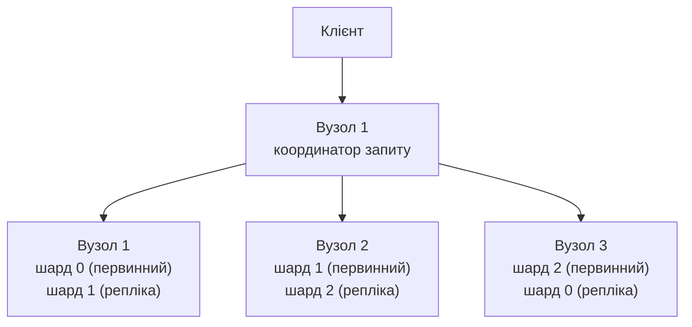
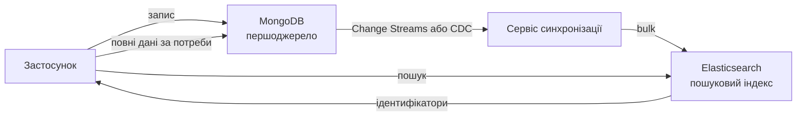

# Лекція 11 Пошукові системи та Elasticsearch

## Вступ

У попередніх лекціях ми вивчали бази даних, головне завдання яких — надійно зберігати дані й повертати їх за ключем або за умовою на значення полів: «знайти замовлення з номером 1001», «вибрати студентів групи КН-21 із балом понад 90». Але користувачі дедалі частіше формулюють запити інакше: вони вводять у рядок пошуку кілька слів, роблять друкарські помилки, пишуть «ноутбуки» і сподіваються знайти «ноутбук», очікують, що найкращі результати опиняться нагорі, а ліворуч побачать фільтри за ціною та брендом. Реляційні й документні СУБД не створювалися для такого способу роботи з даними. Його забезпечують **пошукові системи**.

Розгляньмо, чому звичайних засобів недостатньо. Запит `WHERE name LIKE '%ноутбук%'` не може скористатися індексом на основі B-дерева: початок рядка невідомий, тож СУБД змушена перечитати всі рядки таблиці. Він не знає морфології («ноутбука», «ноутбуків»), не терпить помилок, не вміє впорядкувати результати за релевантністю й не підсвічує знайдені слова. У лекції 10 ми бачили, що текстовий індекс MongoDB працює лише в базовому вигляді й не підтримує української мови; повноцінний пошук там доступний через `$search`, але це вже окрема пошукова підсистема (Atlas Search), а не власне ядро бази.

**Elasticsearch** — розподілена пошукова й аналітична система з відкритим кодом на основі бібліотеки Apache Lucene, яка й досі залишається найпоширенішим вибором для повнотекстового пошуку, аналізу журналів і, дедалі частіше, векторного та гібридного пошуку. У цій лекції, яка задумана як компактний практичний огляд, ми розберемо:

- як влаштований пошук за текстом (інвертований індекс, аналіз тексту, релевантність);
- як побудований кластер Elasticsearch;
- як описувати структуру даних і завантажувати їх;
- як писати запити й агрегації;
- як працює векторний та гібридний пошук;
- як підключити Elasticsearch до основної бази та коли обирати альтернативи.

Усі приклади виконуються локально в Docker, а код клієнта написано на Node.js, як і в лекції 10.

> **Місце в поліглотній архітектурі.** У лекції 9 ми розглядали підхід Polyglot Persistence. Elasticsearch — його типовий приклад: він **не є першоджерелом даних**, а лише пошуковим індексом, побудованим на основі даних із основної бази (наприклад, MongoDB або PostgreSQL). Утрачений індекс завжди можна відновити з першоджерела, і саме тому не варто зберігати в ньому єдину копію важливих даних.

## Основи повнотекстового пошуку

### Інвертований індекс

Ідея, на якій ґрунтуються пошукові системи, проста й знайома кожному, хто користувався предметним покажчиком наприкінці книжки. Звичайна структура даних відповідає на запитання «які слова містить документ №3?». **Інвертований індекс** відповідає на протилежне: «у яких документах трапляється слово "ноутбук"?».

Нехай маємо три документи:

| № | Текст |
|---|-------|
| 1 | Ігровий ноутбук з великим екраном |
| 2 | Офісний ноутбук для роботи |
| 3 | Великий монітор для роботи |

Після розбиття на слова (терми) й зведення до нижнього регістру отримаємо такий індекс:

| Терм | Документи (з позиціями) |
|------|-------------------------|
| ігровий | 1 (1) |
| ноутбук | 1 (2), 2 (2) |
| великий | 1 (4), 3 (2) |
| екран | 1 (5) |
| офісний | 2 (1) |
| робота | 2 (4), 3 (4) |
| монітор | 3 (3) |

Тепер запит «ноутбук» не потребує перегляду документів: досить знайти терм у впорядкованому словнику й одразу отримати список документів. Запит «великий ноутбук» перетворюється на перетин або об'єднання двох списків. Саме тому пошук серед мільйонів документів триває мілісекунди. Зберігання позицій дозволяє шукати фрази («ігровий ноутбук» саме в такому порядку), а зберігання частот — обчислювати релевантність.


### Аналіз тексту

Перетворення сирого тексту на терми називають **аналізом**, і виконує його **аналізатор** (analyzer). Він складається з трьох послідовних частин:

1. **Символьні фільтри** (character filters) — попередня обробка рядка, наприклад видалення HTML-тегів.
2. **Токенізатор** (tokenizer) — розбиття рядка на окремі слова (токени) за пробілами та розділовими знаками.
3. **Фільтри токенів** (token filters) — перетворення кожного слова: нижній регістр, вилучення стоп-слів («і», «в», «на»), зведення до основи слова, додавання синонімів.

Найважливіше правило: **той самий аналізатор застосовується і під час індексації, і під час пошуку**, інакше терми запиту не збігатимуться з термами індексу. Наприклад, слово «Ноутбуків» без нормалізації регістру ніколи не знайде «ноутбуків».

Для мов із багатою морфологією, зокрема української, критично важливий крок **лематизації** (зведення слова до словникової форми): «ноутбука», «ноутбуки», «ноутбуків» мають перетворитися на «ноутбук». Стандартний аналізатор Elasticsearch не знає української, тому його розбиття на слова працює, а от зведення до основи — ні. Для цього існує офіційний плагін **`analysis-ukrainian`**, який використовує морфологічний словник (Morfologik) бібліотеки Lucene. Як його підключити, ми побачимо далі.

### Релевантність і BM25

Знайти документи недостатньо: їх потрібно впорядкувати. Оцінку відповідності документа запиту називають **релевантністю** (у Elasticsearch — поле `_score`). З версії 5.0 для її обчислення за замовчуванням використовується алгоритм **BM25**, який розвиває класичну ідею TF-IDF:

- **TF (term frequency)** — чим частіше слово трапляється в документі, тим краще, але з насиченням: десяте входження додає значно менше за перше;
- **IDF (inverse document frequency)** — рідкісні слова цінніші за поширені: слово «ноутбук» у каталозі електроніки майже нічого не розрізняє, а «Thunderbolt» — багато;
- **нормалізація за довжиною** — збіг у короткому полі (назва) важить більше, ніж у довгому (опис).

Спрощено формула для одного терма має вигляд:

```text
score(D, q) = IDF(q) · f(q, D) · (k1 + 1) / ( f(q, D) + k1 · (1 − b + b · |D| / avgdl) )
```

Тут `f(q, D)` — кількість входжень терма в документ, `|D|` — довжина поля, `avgdl` — середня довжина поля в індексі, а параметри за замовчуванням становлять `k1 = 1,2` і `b = 0,75`. Оцінки різних термів запиту додаються. Запам'ятовувати формулу не обов'язково, важливо розуміти три чинники — частоту, рідкісність і довжину, а також те, що оцінка **відносна**: порівнювати `_score` різних запитів між собою не можна.

## Архітектура Elasticsearch

### Основні поняття

Термінологія Elasticsearch має аналогії з відомими нам системами:

| Elasticsearch | Реляційна СУБД | MongoDB |
|---------------|----------------|---------|
| Індекс (index) | Таблиця | Колекція |
| Документ (document) | Рядок | Документ |
| Поле (field) | Стовпець | Поле |
| Відображення (mapping) | Схема таблиці | Валідація схеми |
| Query DSL | SQL | Мова запитів |

Дані передаються й повертаються у форматі JSON через **REST API** по HTTP, тож працювати з Elasticsearch можна з будь-якої мови й навіть за допомогою `curl`.

### Вузли, шарди та репліки

Індекс розбивається на **первинні шарди** (primary shards), кожен із яких — самостійний індекс Lucene. Шарди розподіляються між **вузлами** кластера, що забезпечує горизонтальне масштабування. Для кожного первинного шарда можна створити одну чи більше **реплік** (replica shards) на інших вузлах: вони підвищують відмовостійкість і розподіляють навантаження читання.



Пошуковий запит виконується у два етапи. Спочатку вузол-координатор розсилає запит усім шардам індексу (кожен обробляє його локально й повертає найкращі результати), потім координатор зливає часткові відповіді в єдиний відсортований список і отримує самі документи. Кількість первинних шардів **задається під час створення індексу** й потім не змінюється (без перевпорядкування даних), тому її обирають із запасом, але без надмірності: сотні дрібних шардів створюють зайві накладні витрати. Для невеликого навчального індексу цілком достатньо одного шарда.

Порівняймо з MongoDB із лекції 10. Обидві системи поділяють дані на шарди й реплікують їх, але Elasticsearch вибирає вузол для документа за хешем ідентифікатора автоматично, а набір реплік у MongoDB є окремою від шардування концепцією.

### Майже реальний час і сегменти

Кожен шард Lucene складається з невеликих незмінних файлів — **сегментів**. Нові документи спершу потрапляють у буфер пам'яті й журнал транзакцій (`translog`, що гарантує надійність), а потім раз на секунду (`refresh_interval`, за замовчуванням `1s`) «публікуються» як новий сегмент, після чого стають доступними для пошуку. Тому Elasticsearch називають системою **майже реального часу** (near real-time): документ, який щойно записано, стає видимим для пошуку не миттєво, а приблизно за секунду. Це ще один вияв евентуальної консистентності, знайомої нам із лекції 9.

Сегменти незмінні, тому видалення й оновлення виконуються так: старий документ лише позначається як видалений, а фоново сегменти зливаються (merge) в більші, і позначені документи остаточно зникають. Практичний наслідок: часті оновлення одного документа є відносно дорогою операцією, а Elasticsearch найкраще підходить для даних, які здебільшого додаються й читаються.

Крім того, Elasticsearch **не є повноцінною транзакційною СУБД**: він не підтримує багатодокументних транзакцій, суворих обмежень цілісності й з'єднань у реляційному розумінні. Це ще одна причина тримати першоджерело даних в іншому сховищі.

## Підготовка середовища

Для навчальних цілей найпростіше запустити один вузол у Docker. Починаючи з версії 8, безпека (автентифікація й TLS) **увімкнена за замовчуванням**. Для локальних вправ ми зададимо пароль і вимкнемо TLS для HTTP-з'єднання, щоб спростити запити; у промисловому середовищі так робити не можна.

```bash
docker run -d --name es -p 9200:9200 \
  -e "discovery.type=single-node" \
  -e "xpack.security.http.ssl.enabled=false" \
  -e "ELASTIC_PASSWORD=changeme" \
  -e "ES_JAVA_OPTS=-Xms1g -Xmx1g" \
  docker.elastic.co/elasticsearch/elasticsearch:9.1.0
```

Перевіряємо, що вузол працює (користувач `elastic`):

```bash
curl -u elastic:changeme http://localhost:9200
```

У відповіді буде JSON із назвою кластера й версією. Якщо версія `9.1.0` на момент виконання вправ уже застаріла, підставте актуальну з переліку образів на docker.elastic.co; головне — дотримуватися мажорної версії 9.

**Український аналізатор** не входить до складу образу, його потрібно встановити як плагін. Найзручніше створити власний образ:

```dockerfile
FROM docker.elastic.co/elasticsearch/elasticsearch:9.1.0
RUN bin/elasticsearch-plugin install --batch analysis-ukrainian
```

```bash
docker build -t es-ukrainian .
# далі використовуємо образ es-ukrainian замість офіційного в команді docker run
```

Для роботи з даними візуально зручно скористатися **Kibana** (вебінтерфейс від Elastic із консоллю Dev Tools), але всі приклади нижче можна виконати й без неї — за допомогою `curl` або клієнта Node.js. У запитах Kibana Dev Tools вказують лише метод і шлях (`GET products/_search`), а в `curl` додають адресу вузла й автентифікацію.

Клієнт для Node.js встановлюється командою `npm install @elastic/elasticsearch` (мажорна версія має відповідати версії сервера):

```javascript
import { Client } from "@elastic/elasticsearch";

const es = new Client({
  node: "http://localhost:9200",
  auth: { username: "elastic", password: "changeme" },
});

console.log(await es.info());
```

## Відображення: опис структури індексу

### Типи полів: text і keyword

**Відображення** (mapping) визначає, як зберігається й індексується кожне поле. Найважливіша відмінність — між двома рядковими типами:

| Тип | Що відбувається | Для чого |
|-----|-----------------|----------|
| `text` | Значення проходить **аналіз** і розбивається на терми | Повнотекстовий пошук (назви, описи, статті) |
| `keyword` | Значення зберігається **цілим**, без аналізу | Точні збіги, фільтри, сортування, агрегації (бренд, категорія, тег, код) |

Помилка «текстове поле не сортується й не групується» — найчастіша в початківців: для сортування за назвою чи групування за брендом потрібне поле `keyword`. Щоб не дублювати дані, застосовують **багатополя** (multi-fields): те саме значення індексується двічі — як `text` для пошуку й як `keyword` (підполе) для фільтрів.

Інші поширені типи: `integer`, `long`, `double`, `scaled_float` (для цін), `boolean`, `date`, `object` і `nested` (вкладені об'єкти), `geo_point`, `dense_vector` (для векторів), `semantic_text` (для семантичного пошуку, див. далі).

### Створення індексу з українським аналізатором

Створимо індекс товарів для інтернет-магазину з лекції 10. Відображення задаємо явно, а не покладаємося на динамічне визначення типів: воно зручне для експериментів, але в промислових системах призводить до несподіваних типів і «вибуху полів».

```javascript
await es.indices.create({
  index: "products",
  settings: {
    number_of_shards: 1,
    number_of_replicas: 0,          // один вузол — реплік немає
    analysis: {
      analyzer: {
        ua_text: {                  // власний аналізатор поверх плагіна
          type: "custom",
          tokenizer: "standard",
          filter: ["lowercase", "ukrainian_stop", "ukrainian_morph"],
        },
      },
      filter: {
        ukrainian_stop: { type: "stop", stopwords: "_ukrainian_" },
        ukrainian_morph: { type: "ukrainian" },   // фільтр із плагіна
      },
    },
  },
  mappings: {
    dynamic: "strict",              // невідомі поля — помилка
    properties: {
      name:        { type: "text", analyzer: "ua_text",
                     fields: { raw: { type: "keyword" } } },
      description: { type: "text", analyzer: "ua_text" },
      brand:       { type: "keyword" },
      category:    { type: "keyword" },
      price:       { type: "scaled_float", scaling_factor: 100 },
      rating:      { type: "float" },
      inStock:     { type: "boolean" },
      tags:        { type: "keyword" },
      createdAt:   { type: "date" },
    },
  },
});
```

Якщо плагін установлено, простіше використати вбудований аналізатор `ukrainian` (`analyzer: "ukrainian"`); власне налаштування потрібне, коли треба додати синоніми чи інші фільтри. Аналіз можна перевірити безпосередньо:

```javascript
const res = await es.indices.analyze({
  index: "products",
  analyzer: "ua_text",
  text: "Ігрові ноутбуки з великими екранами",
});
console.log(res.tokens.map((t) => t.token));
// Приблизний результат: ["ігровий", "ноутбук", "великий", "екран"]
```

Перевірка `_analyze` — головний інструмент налагодження: коли пошук «не знаходить» очевидного, починайте з того, які терми насправді потрапили в індекс.

Значення `dynamic: "strict"` відхиляє документи з невідомими полями, `dynamic: false` мовчки ігнорує їх для пошуку, а `dynamic: true` (типово) створює нові поля автоматично. Змінити тип наявного поля не можна: доводиться створювати новий індекс і перенести дані (`_reindex`). Тому працюють із **псевдонімами** (aliases): застосунок звертається до `products`, який указує на актуальний індекс `products_v2`, і перехід відбувається без простою.

## Індексування даних

### Додавання, оновлення, видалення

Кожен документ має ідентифікатор `_id` (його можна задати самому або дозволити системі згенерувати).

```javascript
// Один документ
await es.index({
  index: "products",
  id: "7",
  document: {
    name: "Ігровий ноутбук Nova 15",
    description: "Потужний ноутбук із великим екраном 144 Гц та відеокартою для ігор",
    brand: "Nova", category: "ноутбуки", price: 42999.0,
    rating: 4.6, inStock: true, tags: ["ігровий", "144hz"],
    createdAt: "2025-05-20T10:00:00Z",
  },
});

// Часткове оновлення
await es.update({ index: "products", id: "7", doc: { price: 39999.0 } });

// Видалення
await es.delete({ index: "products", id: "7" });

// Отримання за ідентифікатором (працює миттєво, не чекає refresh)
const doc = await es.get({ index: "products", id: "7" });
```

### Пакетне завантаження

Завантажувати документи по одному повільно: кожна операція — окремий мережевий запит. Для масового індексування використовують **Bulk API**, який приймає багато операцій за один запит. Клієнт Node.js має зручний помічник `helpers.bulk`, що сам розбиває потік на пакети та повторює невдалі спроби:

```javascript
const products = [
  { name: "Офісний ноутбук Aero 14", brand: "Aero", category: "ноутбуки",
    price: 21999, rating: 4.2, inStock: true, tags: ["офіс"],
    description: "Легкий ноутбук для роботи й навчання", createdAt: "2025-03-01T00:00:00Z" },
  { name: "Монітор Vision 27", brand: "Vision", category: "монітори",
    price: 8999, rating: 4.5, inStock: true, tags: ["4k"],
    description: "Великий монітор з високою роздільною здатністю", createdAt: "2025-02-10T00:00:00Z" },
  // ...
];

const result = await es.helpers.bulk({
  datasource: products,
  onDocument: () => ({ index: { _index: "products" } }),
  refreshOnCompletion: true,     // зробити результати видимими одразу
});
console.log(result);             // { total, successful, failed, ... }
```

`refreshOnCompletion` використовують у прикладах і тестах. У робочій системі примусовий `refresh` після кожної операції шкодить продуктивності: краще прийняти затримку в одну секунду.

## Мова запитів Query DSL

### Структура пошукового запиту

Пошуковий запит описується JSON-об'єктом мовою **Query DSL**. У клієнті Node.js версій 8 і 9 параметри передаються безпосередньо в метод (без обгортки `body`, яка була обов'язковою в старих версіях).

```javascript
const res = await es.search({
  index: "products",
  query: { match: { name: "ноутбук" } },
  size: 5,
});

for (const hit of res.hits.hits) {
  console.log(hit._score.toFixed(2), hit._source.name);
}
console.log("Усього:", res.hits.total.value);
```

Запити поділяють на дві категорії, і розуміння різниці — ключ до Query DSL:

- **Запити для пошуку (query context)**: «наскільки документ відповідає?» — обчислюють `_score`. Приклад: `match`.
- **Фільтри (filter context)**: «чи відповідає документ так/ні?» — не обчислюють оцінки, а їхні результати кешуються, тому вони швидші. Приклад: `term`, `range`.

### Основні види запитів

| Запит | Призначення | Приклад |
|-------|-------------|---------|
| `match` | Повнотекстовий пошук у полі `text` (запит проходить той самий аналіз) | `{ match: { description: "великий екран" } }` |
| `match_phrase` | Фраза зі збереженим порядком слів | `{ match_phrase: { name: "ігровий ноутбук" } }` |
| `multi_match` | Пошук у кількох полях із вагами | `{ multi_match: { query: "ноутбук", fields: ["name^3", "description"] } }` |
| `term` / `terms` | Точний збіг у полі `keyword`, числі, даті | `{ term: { brand: "Nova" } }` |
| `range` | Діапазон значень | `{ range: { price: { gte: 10000, lte: 30000 } } }` |
| `exists` | Поле має значення | `{ exists: { field: "rating" } }` |
| `bool` | Комбінація умов | див. нижче |

Запит `term` не виконує аналізу. Тому шукати `term` у полі `text` («Nova» проти проаналізованого «nova») — типова помилка: збігу не буде. Для полів `text` завжди використовуйте `match`, для `keyword` — `term`.

Множник `^3` в `name^3` підвищує вагу поля: збіг у назві важить утричі більше, ніж в описі. Це найпростіший спосіб налаштувати релевантність.

### Комбінування умов: bool

Запит `bool` — головний конструктор складних запитів. Він об'єднує чотири типи умов:

| Розділ | Значення | Впливає на `_score` |
|--------|----------|---------------------|
| `must` | Умова **обов'язкова** (як AND) | так |
| `filter` | Умова **обов'язкова**, без оцінки | ні |
| `should` | Бажана; збільшує оцінку (за відсутності `must` — принаймні одна має виконатися) | так |
| `must_not` | Умова **виключає** документ | ні |

```javascript
const res = await es.search({
  index: "products",
  query: {
    bool: {
      must: [
        { multi_match: { query: "ігровий ноутбук", fields: ["name^3", "description"] } },
      ],
      filter: [
        { term:  { category: "ноутбуки" } },
        { range: { price: { lte: 50000 } } },
        { term:  { inStock: true } },
      ],
      should: [
        { range: { rating: { gte: 4.5 } } },   // трохи піднімає добре оцінені
      ],
      must_not: [
        { term: { tags: "уцінка" } },
      ],
    },
  },
  highlight: { fields: { description: {} } },
  sort: [{ _score: "desc" }, { price: "asc" }],
  _source: ["name", "price", "rating"],
  size: 10,
});
```

Тут текстова частина («ігровий ноутбук») впливає на релевантність, а категорія, ціна й наявність — лише фільтри. Такий розподіл — стандартна практика: усе, що не потребує оцінки, розміщують у `filter`. Параметр `highlight` додає до відповіді фрагменти тексту зі знайденими словами, обгорнутими в теги `<em>`, а `_source` обмежує повернені поля.

### Стійкість до помилок

Для введення користувача, що містить друкарські помилки, використовують параметр `fuzziness`, який допускає кілька змін символів (відстань Левенштейна):

```javascript
await es.search({
  index: "products",
  query: { match: { name: { query: "ноутбк Nova", fuzziness: "AUTO" } } },
});
```

Значення `AUTO` обирає допустиму відстань залежно від довжини слова. Для швидкого автодоповнення під час набору тексту застосовують окремий тип поля `search_as_you_type` або підказувач (`suggest`), а для підказок «Чи ви мали на увазі...» — `phrase_suggester`.

### Сторінки результатів

Параметри `from` і `size` реалізують просту пагінацію, але вона має обмеження: сума `from + size` за замовчуванням не може перевищувати 10 000, а глибока пагінація дорога, бо кожен шард має зібрати й передати `from + size` результатів. Для послідовного проходу по великих результатах застосовують **`search_after`**: у кожному наступному запиті передають значення сортування останнього документа попередньої сторінки, а для стабільності додають унікальне поле (наприклад, ідентифікатор) та, за потреби, **точку в часі** (`pit`), що фіксує знімок індексу на час перегляду.

## Агрегації

Крім пошуку документів, Elasticsearch сильний в **агрегаціях** — обчисленнях над множиною знайдених документів: підрахунок, групування, статистика. Саме вони дають «фасетну навігацію» інтернет-магазинів («Бренд: Nova (12), Aero (7)», «Ціна: до 10 000 (30)») і панелі аналітики.

```javascript
const res = await es.search({
  index: "products",
  query: { match: { name: "ноутбук" } },
  size: 0,                                   // самі документи не потрібні
  aggs: {
    by_brand: { terms: { field: "brand", size: 10 } },
    price_ranges: {
      range: { field: "price", ranges: [{ to: 10000 }, { from: 10000, to: 30000 }, { from: 30000 }] },
    },
    avg_price: { avg: { field: "price" } },
    per_month: { date_histogram: { field: "createdAt", calendar_interval: "month" } },
  },
});

for (const b of res.aggregations.by_brand.buckets) {
  console.log(b.key, b.doc_count);
}
```

Агрегації бувають **кошикові** (bucket): `terms`, `range`, `date_histogram` — вони розкладають документи по групах; **метричні** (metric): `avg`, `sum`, `min`, `max`, `stats`, `cardinality` — обчислюють числа; та **конвеєрні** (pipeline), що працюють над результатами інших агрегацій. Кошикові можна вкладати одна в одну (наприклад, бренди, а всередині кожного — середня ціна). Для агрегацій використовують поля `keyword`, числа й дати, які мають структуру `doc_values` (стовпцеве подання для швидкого групування).

Для аналітичних запитів у стилі SQL існує також мова **ES|QL** — конвеєрна мова запитів (`FROM products | WHERE price < 30000 | STATS avg(price) BY brand`), яка в нових версіях стала стандартним інструментом для аналітики й дослідження даних у Kibana. Вона доповнює, а не замінює Query DSL.

## Векторний та гібридний пошук

### Від слів до змісту

Лексичний пошук (BM25) працює за збігом слів: запит «комп'ютер для програмування» не знайде документ «ноутбук для розробників», бо спільних слів немає. **Семантичний** (векторний) пошук вирішує цю проблему за допомогою **ембедінгів** (векторних подань): нейронна модель перетворює текст (а також зображення чи звук) на вектор із сотень чи тисяч чисел так, що близькі за змістом тексти мають близькі вектори. Пошук зводиться до знаходження найближчих сусідів запитового вектора. Це основа систем **RAG** (Retrieval-Augmented Generation), де мовна модель відповідає на запитання на підставі знайдених у базі документів, про що ми згадували в лекції 9.

Точний пошук найближчих сусідів серед мільйонів векторів надто повільний, тому використовують наближений алгоритм **HNSW** (ієрархічні навігаційні графи «малого світу»): він жертвує невеликою точністю заради швидкості. Для економії пам'яті вектори квантують (стискають до меншої кількості біт), і в нових версіях Elasticsearch це відбувається за замовчуванням.

### Поле dense_vector і kNN-пошук

```javascript
await es.indices.create({
  index: "articles",
  mappings: {
    properties: {
      title:     { type: "text", analyzer: "ukrainian" },
      body:      { type: "text", analyzer: "ukrainian" },
      embedding: { type: "dense_vector", dims: 384, similarity: "cosine" },
    },
  },
});

// queryVector — вектор запиту, отриманий тією самою моделлю, що й для документів
const res = await es.search({
  index: "articles",
  knn: {
    field: "embedding",
    query_vector: queryVector,
    k: 5,                    // скільки найближчих повернути
    num_candidates: 50,      // скільки кандидатів розглянути на шарді
  },
  _source: ["title"],
});
```

Вектори документів і запитів мають створюватися **однією й тією самою моделлю**; кількість вимірів `dims` відповідає моделі. Модель можна запускати поза Elasticsearch (тоді застосунок сам викликає її й передає вектор) або всередині: Elasticsearch має **inference API** та тип поля **`semantic_text`**, який автоматично розбиває текст на фрагменти, створює ембедінги за допомогою вибраної моделі (вбудованої або зовнішньої) й дозволяє шукати запитом `semantic` без ручного керування векторами. Для української мови слід обирати багатомовну модель: англомовні моделі погано розрізняють українські тексти.

### Гібридний пошук

Лексичний і семантичний пошук мають взаємодоповнювальні сильні сторони. BM25 добре знаходить точні терміни, коди, імена, артикули («RTX 4060»), а векторний — перефразування й зміст. Тому на практиці найкращі результати дає **гібридний пошук**: обидва методи виконуються паралельно, а їхні списки об'єднуються. Оскільки оцінки BM25 і косинусної близькості мають різні шкали, їх не можна просто додавати. Найпоширеніший спосіб — **Reciprocal Rank Fusion (RRF)**: документ отримує оцінку `Σ 1 / (k + позиція)` у кожному списку, тож важать не значення оцінок, а лише місця в рейтингах.

У сучасних версіях Elasticsearch гібридний пошук описується через **ретрівери** (retrievers) — складні блоки, що можна вкладати:

```javascript
const res = await es.search({
  index: "articles",
  retriever: {
    rrf: {
      retrievers: [
        { standard: { query: { match: { body: "як прискорити запити до бази" } } } },
        { knn: { field: "embedding", query_vector: queryVector, k: 20, num_candidates: 100 } },
      ],
      rank_window_size: 50,
      rank_constant: 60,
    },
  },
  size: 10,
});
```

Крім RRF, існує ретрівер із лінійним поєднанням оцінок (`linear`) та інші варіанти, а нові версії додають також можливості гібридного пошуку прямо в ES|QL. Точні назви й доступність можливостей змінюються від версії до версії, тому за деталями звертайтеся до документації вашої версії. Ідея ж стабільна: **BM25 + вектори + злиття рейтингів**, за потреби з повторним ранжуванням найкращих кандидатів окремою моделлю (reranking).

## Інтеграція з основною базою даних

### Схема синхронізації

Оскільки Elasticsearch — не першоджерело даних, постає питання, як підтримувати індекс актуальним. Розглянемо типовий сценарій: товари й замовлення зберігаються в MongoDB, а пошук виконує Elasticsearch.



Застосунок пише лише в MongoDB. Зміни потрапляють у Elasticsearch **асинхронно**: сервіс синхронізації читає **Change Streams** (див. лекцію 10) або потік CDC (наприклад, через Debezium і Kafka, див. лекцію 9), перетворює документи на форму, зручну для пошуку, й записує їх пакетами. Такий підхід має істотні переваги: запис не залежить від доступності пошукової системи, а індекс можна повністю перебудувати з першоджерела.

Мінімальний приклад сервісу синхронізації на Node.js:

```javascript
import { MongoClient } from "mongodb";
import { Client } from "@elastic/elasticsearch";

const mongo = new MongoClient("mongodb://localhost:27017/?replicaSet=rs0");
const es = new Client({ node: "http://localhost:9200", auth: { username: "elastic", password: "changeme" } });
await mongo.connect();

const products = mongo.db("shop").collection("products");
const stream = products.watch([], { fullDocument: "updateLookup" });

for await (const change of stream) {
  const id = String(change.documentKey._id);
  if (change.operationType === "delete") {
    await es.delete({ index: "products", id }, { ignore: [404] });
  } else {
    const { _id, ...doc } = change.fullDocument;
    await es.index({ index: "products", id, document: doc });   // ідемпотентно
  }
}
```

Використання `_id` MongoDB як `_id` документа Elasticsearch робить операцію **ідемпотентною**: повторне доставлення тієї самої зміни лише перезапише документ тим самим вмістом. У промисловому коді додають збереження **токена відновлення** (`resumeToken`) зі стрімів змін, щоб після збою продовжити з місця зупинки, і початкове завантаження наявних даних. Затримка між записом у базу й появою в індексі становить від сотень мілісекунд до кількох секунд, і застосунок має бути готовий до цього: щойно створений товар може ще не знаходитися пошуком.

### Що індексувати

Індексуйте лише те, що потрібно для пошуку й показу результатів: назву, опис, теги, категорію, ціну, рейтинг. Повні документи з великими вкладеннями краще залишити в основній базі: пошук повертає список ідентифікаторів або короткі картки, а деталі підтягуються з першоджерела. Це тісно пов'язано з патерном «Розширене посилання» з лекції 10: пошуковий документ є проєкцією основного, зорієнтованою на запити.

## Альтернативи та вибір рішення

Elasticsearch — не єдина пошукова технологія. Вибір залежить від масштабу, навичок команди й ліцензійних вимог.

| Рішення | Особливості | Коли обирати |
|---------|-------------|--------------|
| **Elasticsearch** | Найповніша екосистема (Kibana, Beats, ES\|QL), сильні агрегації, векторний і гібридний пошук. Ліцензія: із 2024 року знову доступна відкрита AGPL поряд з іншими варіантами | Складний пошук, аналітика журналів, великі обсяги |
| **OpenSearch** | Відкрита гілка від Amazon (Apache 2.0), під керуванням Linux Foundation, API схожий на Elasticsearch версій 7.x | Потрібна повністю вільна ліцензія, хмара AWS |
| **PostgreSQL FTS + `pgvector`** | Повнотекстовий пошук і вектори прямо в реляційній базі | Невеликий обсяг, не хочеться нової інфраструктури |
| **Atlas Search / `$search` у MongoDB** | Пошук на основі Lucene всередині MongoDB, без окремої синхронізації | Уже використовується MongoDB, потрібна простота |
| **Meilisearch, Typesense** | Легкі, прості в налаштуванні, швидкі підказки під час введення | Пошук у застосунку чи на сайті невеликого й середнього масштабу |
| **Векторні бази (Qdrant, Milvus, Weaviate)** | Спеціалізовані для мільярдів векторів | Основне навантаження — семантичний пошук |

Практичне правило: **починайте з найпростішого рішення, яке задовольняє вимоги**. Якщо каталог невеликий, а пошук базовий, вистачить `tsvector` у PostgreSQL або `$search` у MongoDB. Виділена система на кшталт Elasticsearch виправдана тоді, коли потрібні гнучка релевантність, українська морфологія з налаштуванням, складні фасети, великі обсяги чи аналітика журналів. Кожна додаткова система — це нові витрати на розгортання, моніторинг, синхронізацію та узгодженість.

Elasticsearch також широко застосовується поза текстовим пошуком: для **аналізу журналів і метрик** (стек ELK: Elasticsearch, Logstash, Kibana), спостережуваності та безпекової аналітики. Це самостійні великі теми, які виходять за межі цієї лекції.

## Висновки

Пошукові системи розв'язують задачу, з якою не справляються ні реляційні, ні документні бази: швидкий, стійкий до помилок, упорядкований за релевантністю пошук за текстом.

1. **Інвертований індекс** зіставляє терми зі списками документів, тому пошук серед мільйонів записів триває мілісекунди.
2. **Аналізатор** перетворює текст на терми й має однаково застосовуватися під час індексації та пошуку. Для української мови потрібен плагін `analysis-ukrainian`.
3. **Релевантність** за алгоритмом BM25 враховує частоту слова, його рідкісність і довжину поля.
4. **Архітектура** Elasticsearch: індекси розбито на шарди й репліки, дані стають видимими майже в реальному часі (близько секунди), а сам він не є транзакційною СУБД.
5. **Відображення** визначає різницю між `text` (для пошуку) і `keyword` (для фільтрів, сортування, агрегацій); його потрібно проєктувати свідомо, бо тип поля не змінюється.
6. **Query DSL** розрізняє запити з оцінкою і фільтри без неї; складні запити будують через `bool` із розділами `must`, `filter`, `should`, `must_not`.
7. **Агрегації** дають фасети й аналітику; **векторний та гібридний пошук** (kNN, RRF) поєднує точність слів із розумінням змісту й лежить в основі систем RAG.
8. У поліглотній архітектурі Elasticsearch — **похідний індекс**: першоджерелом лишається основна база, а синхронізація виконується асинхронно, ідемпотентно й відновлювано.

Так ми завершили огляд теоретичних основ NoSQL (лекція 9), детальне вивчення документної СУБД MongoDB (лекція 10) та знайомство з пошуковими системами. Разом вони формують базовий набір сучасного розробника, який добирає технологію під задачу, а не задачу під технологію.

## Контрольні запитання

1. Чому запит `LIKE '%слово%'` неефективний і чим його замінює інвертований індекс?
2. З яких частин складається аналізатор? Чому той самий аналізатор має застосовуватися під час індексації та пошуку?
3. Поясніть, від чого залежить оцінка BM25. Чому оцінки різних запитів не можна порівнювати?
4. Чим відрізняються типи `text` і `keyword`? Яке поле слід використати для сортування за брендом?
5. У чому різниця між контекстом запиту та контекстом фільтра? Що ви помістите в розділи `must` і `filter`?
6. Чому Elasticsearch називають системою майже реального часу? Як це впливає на проєктування застосунку?
7. Чому Elasticsearch не рекомендують використовувати як єдине першоджерело даних?
8. Як працює гібридний пошук і навіщо потрібен RRF?
9. Як синхронізувати MongoDB з Elasticsearch? Чому важливі ідемпотентність і токен відновлення?
10. Для кожного випадку оберіть технологію та обґрунтуйте вибір: (а) невеликий блог із пошуком за статтями; (б) інтернет-магазин із фасетами на мільйон товарів; (в) аналіз журналів мікросервісів; (г) чат-бот із відповідями за корпоративною документацією.
