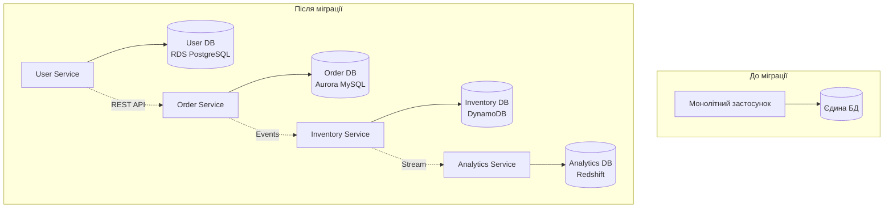

# Лекція 15. Хмарні бази даних та Database-as-a-Service

## Вступ

Сучасні інформаційні системи дедалі частіше переміщуються в хмарне середовище, що кардинально змінює підходи до розгортання та управління базами даних. Хмарні бази даних та модель Database-as-a-Service революціонізували традиційні методи роботи з даними, надаючи організаціям гнучкість, масштабованість та економічну ефективність, які були недосяжні в епоху власних дата-центрів.

Розуміння принципів хмарних баз даних є критично важливим для сучасних фахівців з програмної інженерії, оскільки більшість нових проєктів стартують саме в хмарному середовищі, а існуючі системи активно мігрують до хмари.

## Моделі хмарних обчислень для баз даних

### Три основні моделі обслуговування

Хмарні обчислення пропонують три фундаментальні моделі надання послуг, кожна з яких визначає рівень контролю та відповідальності між провайдером та клієнтом.

#### Infrastructure as a Service (IaaS)

Модель IaaS надає базову обчислювальну інфраструктуру як послугу. У контексті баз даних це означає, що провайдер надає віртуальні машини, мережу та сховище, а клієнт самостійно встановлює та конфігурує СУБД.

Характеристики IaaS для баз даних:

Клієнт отримує повний контроль над операційною системою та СУБД. Він самостійно встановлює необхідну версію СУБД, конфігурує її параметри, налаштовує безпеку та відповідає за оновлення. Провайдер забезпечує лише базову інфраструктуру: обчислювальні ресурси, дискове сховище та мережеву зв'язність.

Приклади IaaS рішень включають Amazon EC2 з самостійно встановленою базою даних, Google Compute Engine з власною конфігурацією СУБД або Azure Virtual Machines з розгорнутою БД на вибір клієнта.

Переваги моделі IaaS:

Максимальна гнучкість конфігурації дозволяє налаштувати систему під специфічні потреби. Можливість використання будь-якої СУБД та її версії надає повну свободу вибору технологій. Повний контроль над оптимізацією дає змогу досягти максимальної продуктивності для конкретного застосунку. Легкість міграції існуючих систем спрощує перехід до хмари.

Недоліки моделі IaaS:

Висока складність адміністрування вимагає кваліфікованих фахівців. Повна відповідальність за безпеку та оновлення лягає на плечі клієнта. Необхідність ручного масштабування ускладнює адаптацію до змінного навантаження. Відсутність автоматизованих механізмів відновлення потребує додаткових зусиль.

#### Platform as a Service (PaaS)

Модель PaaS надає платформу для розробки та розгортання застосунків, включаючи керовані бази даних. Провайдер бере на себе управління операційною системою, СУБД та базовою інфраструктурою.

Характеристики PaaS для баз даних:

Провайдер автоматично керує оновленнями СУБД, резервним копіюванням, моніторингом продуктивності та масштабуванням. Клієнт зосереджується на схемі бази даних, запитах та логіці застосунку, не турбуючись про адміністрування інфраструктури.

Приклади PaaS рішень:

Amazon RDS надає керовані реляційні бази даних з автоматичним резервним копіюванням та патчингом. Google Cloud SQL пропонує повністю керовані MySQL, PostgreSQL та SQL Server з вбудованою високою доступністю. Azure SQL Database забезпечує керовану хмарну базу даних з інтелектуальною оптимізацією продуктивності.

Переваги моделі PaaS:

Зниження операційних витрат досягається за рахунок автоматизації адміністративних задач. Автоматичне резервне копіювання та відновлення забезпечують надійність даних без додаткових зусиль. Вбудовані механізми масштабування дозволяють легко адаптуватися до зростаючого навантаження. Висока доступність гарантується через автоматичну реплікацію та відмовостійкість.

Недоліки моделі PaaS:

Обмежена гнучкість конфігурації не дозволяє налаштувати всі параметри СУБД. Залежність від провайдера ускладнює міграцію до іншої платформи. Можливі обмеження у версіях СУБД та розширеннях. Вища вартість порівняно з IaaS при еквівалентних ресурсах.

#### Software as a Service (SaaS)

Модель SaaS надає повністю готовий застосунок, який працює на основі бази даних. Клієнт лише використовує функціональність застосунку через веб-інтерфейс або API.

Характеристики SaaS у контексті баз даних:

Бази даних повністю приховані від користувача. Провайдер керує всіма аспектами: інфраструктурою, СУБД, схемою даних, безпекою та масштабуванням. Клієнт має доступ лише до функцій застосунку.

Приклади SaaS систем з базами даних:

Salesforce CRM зберігає клієнтські дані в захищених хмарних базах даних. Google Workspace використовує розподілені бази даних для зберігання документів та пошти. Microsoft 365 працює на основі потужних хмарних СУБД для забезпечення співпраці.

### Порівняльна таблиця моделей

Розглянемо ключові відмінності між моделями обслуговування:

За рівнем контролю IaaS надає повний контроль над СУБД та інфраструктурою, PaaS обмежує контроль схемою та конфігурацією бази даних, а SaaS надає лише контроль над даними застосунку.

За відповідальністю за адміністрування в IaaS клієнт повністю відповідає за СУБД, у PaaS провайдер керує СУБД, у SaaS провайдер керує всім стеком технологій.

За складністю управління IaaS вимагає високої кваліфікації адміністраторів, PaaS потребує знань схем баз даних, а SaaS не вимагає знань про бази даних взагалі.

За гнучкістю IaaS максимально гнучкий, PaaS помірно гнучкий, SaaS має фіксовану функціональність.

За вартістю IaaS найдешевший при оптимізації, PaaS має середню вартість, SaaS найдорожчий для еквівалентних можливостей.

## Архітектурні патерни хмарних СУБД

### Multi-tenancy: багатоорендність

Multi-tenancy є одним з фундаментальних патернів хмарних баз даних, що дозволяє ефективно використовувати ресурси між багатьма клієнтами.

#### Концепція багатоорендності

Багатоорендність означає, що єдина інстанція СУБД обслуговує множину клієнтів, забезпечуючи при цьому ізоляцію їхніх даних та ресурсів. Існує три основні моделі реалізації цього підходу.

Модель окремих баз даних передбачає, що кожен клієнт має власну базу даних на спільному сервері. Це забезпечує високу ізоляцію даних та спрощує міграцію окремих клієнтів, але вимагає більше ресурсів та ускладнює оновлення схеми для всіх клієнтів одночасно.

Модель окремих схем використовує єдину базу даних з різними схемами для кожного клієнта. Такий підхід балансує ізоляцію та ефективність використання ресурсів, дозволяє кастомізувати схему для кожного клієнта, але ускладнює управління великою кількістю схем.

Модель спільної схеми застосовує єдину схему для всіх клієнтів з ідентифікатором орендаря в кожній таблиці. Це максимально ефективно використовує ресурси та спрощує оновлення схеми, але потребує ретельного контролю доступу та може ускладнити кастомізацію для окремих клієнтів.

Приклад спільної схеми з ідентифікатором орендаря:

```sql
CREATE TABLE customers (
    customer_id SERIAL PRIMARY KEY,
    tenant_id INTEGER NOT NULL,
    customer_name VARCHAR(100) NOT NULL,
    email VARCHAR(100),
    created_at TIMESTAMP DEFAULT CURRENT_TIMESTAMP,
    CONSTRAINT fk_tenant FOREIGN KEY (tenant_id)
        REFERENCES tenants(tenant_id)
);

CREATE INDEX idx_tenant_customers ON customers(tenant_id);

CREATE TABLE orders (
    order_id SERIAL PRIMARY KEY,
    tenant_id INTEGER NOT NULL,
    customer_id INTEGER NOT NULL,
    order_date DATE NOT NULL,
    total_amount DECIMAL(10, 2),
    CONSTRAINT fk_tenant FOREIGN KEY (tenant_id)
        REFERENCES tenants(tenant_id),
    CONSTRAINT fk_customer FOREIGN KEY (customer_id)
        REFERENCES customers(customer_id)
);

CREATE INDEX idx_tenant_orders ON orders(tenant_id);
```

Забезпечення ізоляції даних між орендарями:

```sql
CREATE POLICY tenant_isolation_customers ON customers
    USING (tenant_id = current_setting('app.current_tenant')::INTEGER);

CREATE POLICY tenant_isolation_orders ON orders
    USING (tenant_id = current_setting('app.current_tenant')::INTEGER);

ALTER TABLE customers ENABLE ROW LEVEL SECURITY;
ALTER TABLE orders ENABLE ROW LEVEL SECURITY;
```

Переваги багатоорендності включають економію ресурсів через спільне використання інфраструктури, спрощене обслуговування та оновлення для всіх клієнтів одночасно, можливість динамічного перерозподілу ресурсів між орендарями.

Виклики багатоорендності полягають у забезпеченні ізоляції даних та продуктивності, складності балансування ресурсів між клієнтами з різними потребами, ризику каскадних збоїв, які можуть вплинути на всіх орендарів.

### Elasticity: еластичність

Еластичність визначає здатність системи автоматично адаптувати ресурси до поточного навантаження.

#### Вертикальна еластичність

Вертикальна еластичність означає зміну потужності окремого сервера шляхом додавання або зменшення ресурсів процесора, пам'яті чи дискового простору.

Приклад вертикального масштабування в Amazon RDS:

```python
import boto3

rds = boto3.client('rds')

def scale_database_vertically(db_instance_id, new_instance_class):
    response = rds.modify_db_instance(
        DBInstanceIdentifier=db_instance_id,
        DBInstanceClass=new_instance_class,
        ApplyImmediately=True
    )

    print(f"Масштабування БД до {new_instance_class}")
    return response

scale_database_vertically('my-database', 'db.t3.large')
```

Переваги вертикального масштабування полягають у простоті реалізації без зміни архітектури застосунку, відсутності необхідності перерозподілу даних, збереженні всіх ACID гарантій.

Недоліки включають обмеження максимальним розміром інстанції, необхідність простою при зміні конфігурації, вищу вартість порівняно з горизонтальним масштабуванням.

#### Горизонтальна еластичність

Горизонтальна еластичність передбачає додавання або видалення серверів для розподілу навантаження.

Приклад автоматичного масштабування read-репліків:

```python
import boto3
from datetime import datetime, timedelta

cloudwatch = boto3.client('cloudwatch')
rds = boto3.client('rds')

def check_and_scale_replicas(db_instance_id):
    end_time = datetime.utcnow()
    start_time = end_time - timedelta(minutes=15)

    cpu_stats = cloudwatch.get_metric_statistics(
        Namespace='AWS/RDS',
        MetricName='CPUUtilization',
        Dimensions=[{'Name': 'DBInstanceIdentifier', 'Value': db_instance_id}],
        StartTime=start_time,
        EndTime=end_time,
        Period=300,
        Statistics=['Average']
    )

    avg_cpu = sum(point['Average'] for point in cpu_stats['Datapoints']) / len(cpu_stats['Datapoints'])

    if avg_cpu > 75:
        print("Високе навантаження CPU, додаємо read-репліку")
        add_read_replica(db_instance_id)
    elif avg_cpu < 30:
        print("Низьке навантаження CPU, розглядаємо видалення репліки")

def add_read_replica(source_db_id):
    replica_id = f"{source_db_id}-replica-{datetime.now().strftime('%Y%m%d%H%M%S')}"

    rds.create_db_instance_read_replica(
        DBInstanceIdentifier=replica_id,
        SourceDBInstanceIdentifier=source_db_id,
        DBInstanceClass='db.t3.medium'
    )
```

Auto-scaling політики у хмарних СУБД:

Політики масштабування базуються на метриках продуктивності, таких як використання процесора, кількість з'єднань, пропускна здатність операцій вводу-виводу. Провайдери дозволяють встановлювати порогові значення для автоматичного додавання або видалення ресурсів.

### Pay-per-use: оплата за використання

Модель оплати за фактичне використання є однією з ключових переваг хмарних баз даних.

#### Моделі тарифікації

Оплата за обчислювальні ресурси враховує час роботи інстанцій бази даних та їхню потужність. Різні типи інстанцій мають різну вартість за годину роботи.

Оплата за зберігання даних розраховується на основі фактичного обсягу даних та типу сховища. SSD сховища дорожчі, але забезпечують вищу продуктивність.

Оплата за операції вводу-виводу враховує кількість запитів читання та запису до бази даних. Деякі провайдери встановлюють ліміти безкоштовних операцій.

Оплата за передачу даних включає вартість трафіку між регіонами або до інтернету. Передача всередині одного регіону часто безкоштовна.

Приклад оцінки витрат для PostgreSQL на AWS RDS:

```
Базова конфігурація:
- Тип інстанції: db.t3.medium (2 vCPU, 4 GB RAM)
- Вартість: 0.068 USD за годину
- Місячна вартість інстанції: 0.068 * 730 = 49.64 USD

Зберігання:
- Обсяг: 100 GB General Purpose SSD
- Вартість: 0.115 USD за GB на місяць
- Місячна вартість зберігання: 0.115 * 100 = 11.50 USD

Резервні копії:
- Додаткові 50 GB понад розмір БД
- Вартість: 0.095 USD за GB на місяць
- Місячна вартість резервних копій: 0.095 * 50 = 4.75 USD

Загальна місячна вартість: 49.64 + 11.50 + 4.75 = 65.89 USD
```

Serverless моделі оплати:

Деякі провайдери пропонують serverless бази даних, де оплата стягується за фактичне використання обчислювальних ресурсів у моменти активності.

Приклад Aurora Serverless конфігурації:

```
Одиниця виміру: Aurora Capacity Units (ACU)
Мінімальна конфігурація: 2 ACU
Максимальна конфігурація: 64 ACU

Вартість:
- 0.06 USD за ACU-годину
- При середньому використанні 4 ACU протягом місяця:
  4 ACU * 730 годин * 0.06 USD = 175.20 USD

Переваги:
- Автоматичне масштабування від 0 до максимуму
- Пауза при відсутності активності
- Оплата лише за фактичне використання
```

## Порівняльний аналіз провайдерів

### Amazon Web Services (AWS)

AWS пропонує найширший спектр сервісів баз даних серед хмарних провайдерів.

#### Amazon RDS

Amazon Relational Database Service підтримує шість основних СУБД: MySQL, PostgreSQL, MariaDB, Oracle, Microsoft SQL Server та Amazon Aurora.

Ключові характеристики RDS:

Автоматичне резервне копіювання виконується щоденно з можливістю відновлення на будь-який момент часу протягом періоду збереження. Multi-AZ розгортання забезпечує високу доступність через синхронну реплікацію до резервного екземпляра в іншій зоні доступності. Read replicas дозволяють створювати репліки для читання в тому ж або інших регіонах.

Приклад створення RDS інстанції через Terraform:

```hcl
resource "aws_db_instance" "production" {
  identifier           = "production-database"
  engine               = "postgres"
  engine_version       = "15.3"
  instance_class       = "db.t3.large"
  allocated_storage    = 100
  storage_type         = "gp3"

  db_name  = "appdb"
  username = "dbadmin"
  password = var.db_password

  multi_az               = true
  backup_retention_period = 7
  backup_window          = "03:00-04:00"
  maintenance_window     = "mon:04:00-mon:05:00"

  enabled_cloudwatch_logs_exports = ["postgresql", "upgrade"]

  skip_final_snapshot = false
  final_snapshot_identifier = "production-final-snapshot"

  tags = {
    Environment = "Production"
    Application = "MainApp"
  }
}

resource "aws_db_instance" "read_replica" {
  identifier             = "production-database-replica"
  replicate_source_db    = aws_db_instance.production.id
  instance_class         = "db.t3.medium"

  publicly_accessible = false

  tags = {
    Environment = "Production"
    Type        = "ReadReplica"
  }
}
```

#### Amazon Aurora

Amazon Aurora це хмарно-нативна СУБД, сумісна з MySQL та PostgreSQL, яка забезпечує до п'яти разів кращу продуктивність порівняно з звичайним MySQL.

Архітектурні особливості Aurora:

Розподілене сховище автоматично реплікує дані шість разів у трьох зонах доступності. Автоматичне відновлення після збоїв відбувається без втрати даних завдяки безперервній архівації до S3. Горизонтальне масштабування читання підтримує до 15 read replicas з мілісекундною затримкою реплікації.

Aurora Serverless надає автоматичне масштабування обчислювальних ресурсів на основі навантаження з можливістю повної паузи при відсутності активності.

### Google Cloud Platform (GCP)

Google Cloud пропонує керовані бази даних через Cloud SQL та власні рішення як Cloud Spanner.

#### Cloud SQL

Cloud SQL підтримує MySQL, PostgreSQL та SQL Server з повністю керованою інфраструктурою.

Особливості Cloud SQL:

Автоматичні патчі та оновлення виконуються без участі користувача у визначені вікна обслуговування. Точкове відновлення у часі дозволяє відновити базу даних на будь-який момент протягом налаштованого періоду. Високодоступні конфігурації забезпечують автоматичне перемикання при збоях.

Приклад створення Cloud SQL інстанції:

```yaml
apiVersion: sql.cnrm.cloud.google.com/v1beta1
kind: SQLInstance
metadata:
  name: production-postgres
spec:
  databaseVersion: POSTGRES_15
  region: europe-west1
  settings:
    tier: db-custom-4-16384
    availabilityType: REGIONAL
    backupConfiguration:
      enabled: true
      startTime: "03:00"
      pointInTimeRecoveryEnabled: true
      transactionLogRetentionDays: 7
    ipConfiguration:
      ipv4Enabled: false
      privateNetwork: projects/my-project/global/networks/my-vpc
    maintenanceWindow:
      day: 7
      hour: 4
    databaseFlags:
      - name: max_connections
        value: "200"
      - name: shared_buffers
        value: "4194304"
```

#### Cloud Spanner

Cloud Spanner це глобально розподілена реляційна база даних з горизонтальним масштабуванням та строгою консистентністю.

Унікальні можливості Spanner:

Глобальна консистентність забезпечує ACID транзакції в масштабах кількох континентів. Автоматичний шардинг розподіляє дані без участі розробника. Синхронна реплікація гарантує нульову втрату даних при регіональних збоях.

### Microsoft Azure

Azure пропонує широкий спектр сервісів баз даних для різних сценаріїв використання.

#### Azure SQL Database

Azure SQL Database це повністю керована реляційна база даних на основі Microsoft SQL Server.

Моделі розгортання:

Single Database надає ізольовану базу даних з гарантованими ресурсами. Elastic Pool дозволяє групувати бази даних для спільного використання ресурсів. Managed Instance забезпечує майже повну сумісність з on-premises SQL Server.

Рівні обслуговування:

DTU-based модель використовує Database Transaction Units як комплексну міру продуктивності. vCore-based модель дозволяє незалежно налаштовувати процесор, пам'ять та сховище. Serverless рівень автоматично масштабує обчислювальні ресурси та призупиняє базу даних при неактивності.

Приклад створення Azure SQL Database:

```bicep
resource sqlServer 'Microsoft.Sql/servers@2022-05-01-preview' = {
  name: 'production-sql-server'
  location: 'westeurope'
  properties: {
    administratorLogin: 'sqladmin'
    administratorLoginPassword: sqlAdminPassword
    version: '12.0'
    minimalTlsVersion: '1.2'
  }
}

resource sqlDatabase 'Microsoft.Sql/servers/databases@2022-05-01-preview' = {
  parent: sqlServer
  name: 'production-db'
  location: 'westeurope'
  sku: {
    name: 'GP_Gen5'
    tier: 'GeneralPurpose'
    capacity: 4
  }
  properties: {
    collation: 'SQL_Latin1_General_CP1_CI_AS'
    maxSizeBytes: 107374182400
    zoneRedundant: true
    readScale: 'Enabled'
    autoPauseDelay: 60
  }
}
```

### Порівняльна таблиця провайдерів

Основні критерії порівняння хмарних провайдерів баз даних:

За підтримуваними СУБД AWS пропонує найширший вибір включно з власною Aurora, GCP надає стандартні рішення плюс унікальний Spanner, Azure зосереджений на екосистемі Microsoft з SQL Server.

За географічним покриттям AWS має найбільшу кількість регіонів, Azure має сильні позиції в Європі та Азії, GCP розвиває глобальну присутність з акцентом на мережеву продуктивність.

За моделями ціноутворення AWS пропонує найбільше варіантів резервування та заощадження, GCP має найпростішу структуру цін, Azure надає переваги для клієнтів з існуючими ліцензіями Microsoft.

За інструментами моніторингу AWS CloudWatch забезпечує глибоку інтеграцію, GCP Stackdriver пропонує зручну візуалізацію, Azure Monitor має найкращу інтеграцію з екосистемою Microsoft.

## Міграційні стратегії

### Lift-and-shift міграція

Lift-and-shift або rehosting є найпростішою стратегією міграції, яка передбачає переміщення існуючої бази даних до хмари з мінімальними змінами.

#### Процес lift-and-shift міграції

Підготовчий етап включає аналіз поточної інфраструктури, оцінку обсягів даних та залежностей, планування вікна міграції з мінімальним впливом на бізнес.

Етап міграції передбачає створення резервної копії production бази даних, розгортання еквівалентної інфраструктури в хмарі, відновлення резервної копії на хмарному сервері, налаштування мережевого з'єднання та оновлення конфігурації застосунків.

Приклад lift-and-shift міграції PostgreSQL до AWS RDS:

```bash
#!/bin/bash

SOURCE_DB="production-db.company.local"
SOURCE_USER="postgres"
TARGET_DB="production-db.abc123.eu-west-1.rds.amazonaws.com"
TARGET_USER="postgres"
DUMP_FILE="production-backup.sql"

echo "Створення резервної копії джерельної БД..."
pg_dump -h $SOURCE_DB -U $SOURCE_USER -Fc -f $DUMP_FILE production

echo "Завантаження резервної копії до S3..."
aws s3 cp $DUMP_FILE s3://migration-bucket/backups/

echo "Створення RDS інстанції..."
aws rds create-db-instance \
    --db-instance-identifier production-migrated \
    --db-instance-class db.m5.xlarge \
    --engine postgres \
    --engine-version 15.3 \
    --master-username postgres \
    --master-user-password $DB_PASSWORD \
    --allocated-storage 500 \
    --multi-az

echo "Очікування готовності RDS інстанції..."
aws rds wait db-instance-available \
    --db-instance-identifier production-migrated

echo "Відновлення даних на RDS..."
pg_restore -h $TARGET_DB -U $TARGET_USER -d production $DUMP_FILE

echo "Міграція завершена!"
```

Переваги lift-and-shift:

Швидкість міграції є найбільшою перевагою цього підходу, оскільки не потрібно переписувати код застосунку. Мінімальний ризик зумовлений збереженням існуючої архітектури. Можливість поетапної оптимізації дозволяє спочатку перемістити систему, а потім поступово вдосконалювати її.

Недоліки lift-and-shift:

Неповне використання хмарних можливостей призводить до втрати потенційних переваг. Збереження технічного боргу переносить існуючі проблеми до нового середовища. Можлива неоптимальна вартість через використання застарілих підходів.

### Re-architecting міграція

Re-architecting або refactoring передбачає переробку архітектури застосунку для максимального використання хмарних можливостей.

#### Процес re-architecting міграції

Аналітична фаза включає оцінку поточної архітектури, виявлення вузьких місць та неефективностей, визначення можливостей для використання хмарних сервісів.

Фаза проєктування передбачає розробку цільової архітектури з урахуванням хмарних патернів, вибір оптимальних хмарних сервісів, планування стратегії розгортання та переходу.

Приклад переходу від монолітної БД до мікросервісної архітектури:



Стратегія поетапної міграції:

Перша фаза виділяє окремі сервіси з монолітної бази даних зі збереженням зворотної сумісності. Друга фаза мігрує критичні сервіси до хмарних керованих баз даних. Третя фаза оптимізує використання хмарних можливостей, впроваджує auto-scaling та serverless компоненти.

Приклад міграції до мікросервісної архітектури:

```python
from flask import Flask, jsonify
import psycopg2
from circuit_breaker import CircuitBreaker

app = Flask(__name__)

# Підключення до окремих БД для різних сервісів
USER_DB_CONFIG = {
    'host': 'user-db.abc123.rds.amazonaws.com',
    'database': 'users',
    'user': 'app_user',
    'password': 'secure_password'
}

ORDER_DB_CONFIG = {
    'host': 'order-db.xyz456.rds.amazonaws.com',
    'database': 'orders',
    'user': 'app_user',
    'password': 'secure_password'
}

@app.route('/api/users/<int:user_id>')
@CircuitBreaker(failure_threshold=5, recovery_timeout=30)
def get_user(user_id):
    with psycopg2.connect(**USER_DB_CONFIG) as conn:
        with conn.cursor() as cur:
            cur.execute("SELECT * FROM users WHERE id = %s", (user_id,))
            user = cur.fetchone()
            return jsonify(user)

@app.route('/api/orders/<int:order_id>')
@CircuitBreaker(failure_threshold=5, recovery_timeout=30)
def get_order(order_id):
    with psycopg2.connect(**ORDER_DB_CONFIG) as conn:
        with conn.cursor() as cur:
            cur.execute("SELECT * FROM orders WHERE id = %s", (order_id,))
            order = cur.fetchone()
            return jsonify(order)
```

Переваги re-architecting:

Максимальне використання хмарних можливостей дозволяє досягти оптимальної продуктивності та вартості. Підвищення масштабованості забезпечує готовність до зростання навантаження. Покращення відмовостійкості через використання керованих сервісів.

Недоліки re-architecting:

Тривалість проєкту може значно перевищувати lift-and-shift міграцію. Висока складність вимагає глибоких знань хмарних технологій. Ризик перериву бізнес-процесів при невдалій міграції.

## Управління витратами та оптимізація ресурсів

### Моніторинг та аналіз витрат

Ефективне управління витратами починається з детального моніторингу використання ресурсів.

#### Інструменти моніторингу витрат

AWS Cost Explorer надає візуалізацію витрат з можливістю фільтрації за сервісами, регіонами та тегами. Google Cloud Billing Reports пропонує детальний аналіз витрат з рекомендаціями щодо оптимізації. Azure Cost Management забезпечує бюджетування та прогнозування витрат.

Приклад налаштування бюджетних сповіщень AWS:

```python
import boto3

budgets = boto3.client('budgets')

def create_database_budget():
    response = budgets.create_budget(
        AccountId='123456789012',
        Budget={
            'BudgetName': 'Monthly-Database-Budget',
            'BudgetLimit': {
                'Amount': '1000',
                'Unit': 'USD'
            },
            'TimeUnit': 'MONTHLY',
            'BudgetType': 'COST',
            'CostFilters': {
                'Service': ['Amazon Relational Database Service']
            }
        },
        NotificationsWithSubscribers=[
            {
                'Notification': {
                    'NotificationType': 'ACTUAL',
                    'ComparisonOperator': 'GREATER_THAN',
                    'Threshold': 80,
                    'ThresholdType': 'PERCENTAGE'
                },
                'Subscribers': [
                    {
                        'SubscriptionType': 'EMAIL',
                        'Address': 'admin@company.com'
                    }
                ]
            }
        ]
    )
    return response
```

### Стратегії оптимізації витрат

#### Правильний вибір типу інстанції

Різні типи інстанцій оптимізовані для різних навантажень. General Purpose інстанції збалансовані за процесором та пам'яттю для типових застосунків. Memory Optimized інстанції мають підвищений обсяг RAM для баз даних в пам'яті. Burstable інстанції підходять для непередбачуваних навантажень з можливістю короткочасних сплесків.

#### Резервування ресурсів

Reserved Instances дозволяють заощадити до 60 відсотків при зобов'язанні на один або три роки використання. Savings Plans надають гнучкість у виборі конфігурацій зі знижкою до 72 відсотків.

#### Автоматизація керування ресурсами

Автоматичне зупинення непотрібних середовищ може значно знизити витрати на розробку та тестування.

Приклад автоматизації зупинки dev середовищ:

```python
import boto3
from datetime import datetime

rds = boto3.client('rds')
ec2 = boto3.client('ec2')

def stop_dev_databases():
    current_hour = datetime.now().hour
    current_day = datetime.now().weekday()

    # Зупинка у вечері робочих днів
    if current_day < 5 and current_hour >= 19:
        response = rds.describe_db_instances()

        for db in response['DBInstances']:
            tags = rds.list_tags_for_resource(
                ResourceName=db['DBInstanceArn']
            )

            for tag in tags['TagList']:
                if tag['Key'] == 'Environment' and tag['Value'] == 'Development':
                    print(f"Зупинка {db['DBInstanceIdentifier']}")
                    rds.stop_db_instance(
                        DBInstanceIdentifier=db['DBInstanceIdentifier']
                    )

def start_dev_databases():
    current_hour = datetime.now().hour
    current_day = datetime.now().weekday()

    # Запуск вранці робочих днів
    if current_day < 5 and current_hour == 8:
        response = rds.describe_db_instances()

        for db in response['DBInstances']:
            if db['DBInstanceStatus'] == 'stopped':
                tags = rds.list_tags_for_resource(
                    ResourceName=db['DBInstanceArn']
                )

                for tag in tags['TagList']:
                    if tag['Key'] == 'Environment' and tag['Value'] == 'Development':
                        print(f"Запуск {db['DBInstanceIdentifier']}")
                        rds.start_db_instance(
                            DBInstanceIdentifier=db['DBInstanceIdentifier']
                        )
```

#### Оптимізація зберігання

Використання відповідних типів дисків може значно вплинути на вартість. General Purpose SSD балансує продуктивність та ціну для більшості застосунків. Provisioned IOPS SSD необхідний для критичних застосунків з високим навантаженням вводу-виводу. Magnetic storage найдешевший варіант для рідко використовуваних даних.

Автоматичне стиснення даних та архівування застарілих записів зменшує обсяг потрібного сховища.

#### Використання spot instances для непродуктивних навантажень

Spot instances можуть коштувати до 90 відсотків дешевше звичайних, але можуть бути перервані з коротким попередженням. Підходять для аналітичних завдань, тестування, batch обробки.

## Висновки

Хмарні бази даних та модель Database-as-a-Service фундаментально змінили підходи до управління даними в сучасних інформаційних системах. Три основні моделі хмарних обчислень надають різні рівні контролю та відповідальності, дозволяючи організаціям вибрати оптимальний баланс між гнучкістю та простотою управління.

Архітектурні патерни хмарних СУБД, такі як багатоорендність, еластичність та оплата за використання, забезпечують економічну ефективність та масштабованість, недосяжні в традиційних підходах. Провідні хмарні провайдери пропонують широкий спектр сервісів баз даних, кожен з яких має свої унікальні переваги та оптимальні сценарії використання.

Вибір міграційної стратегії між lift-and-shift та re-architecting залежить від специфічних вимог проєкту, наявних ресурсів та часових обмежень. Lift-and-shift забезпечує швидкий перехід з мінімальним ризиком, тоді як re-architecting дозволяє максимально використати переваги хмарних технологій.

Ефективне управління витратами вимагає постійного моніторингу використання ресурсів, правильного вибору типів інстанцій, використання резервування та автоматизації керування середовищами. Оптимізація не є одноразовою задачею, а потребує регулярного перегляду та адаптації до змінюваних потреб бізнесу.

Розуміння принципів хмарних баз даних є критично важливим для сучасних фахівців з інженерії програмного забезпечення, оскільки більшість нових проєктів розробляються з урахуванням хмарної інфраструктури, а існуючі системи активно мігрують до хмари для отримання переваг масштабованості, надійності та економічної ефективності.
