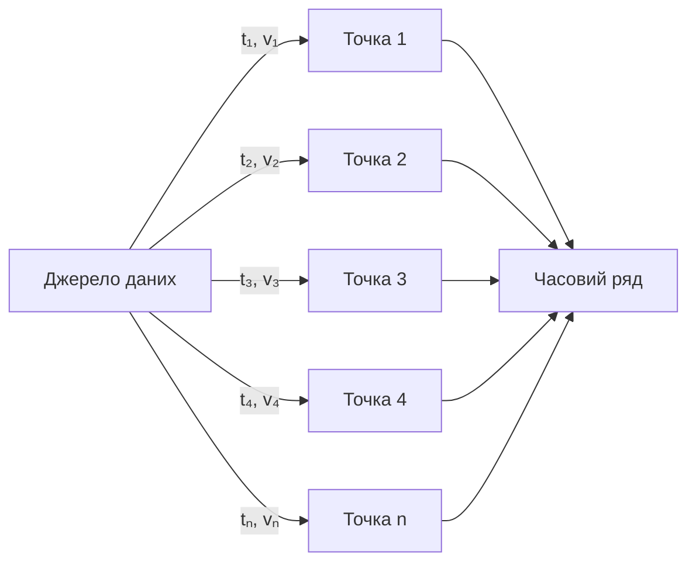
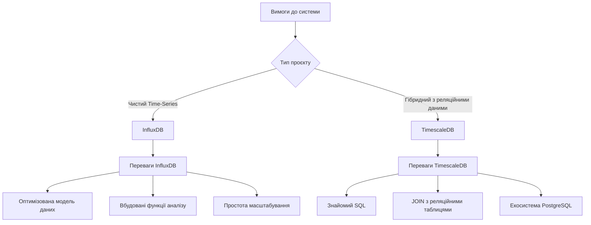
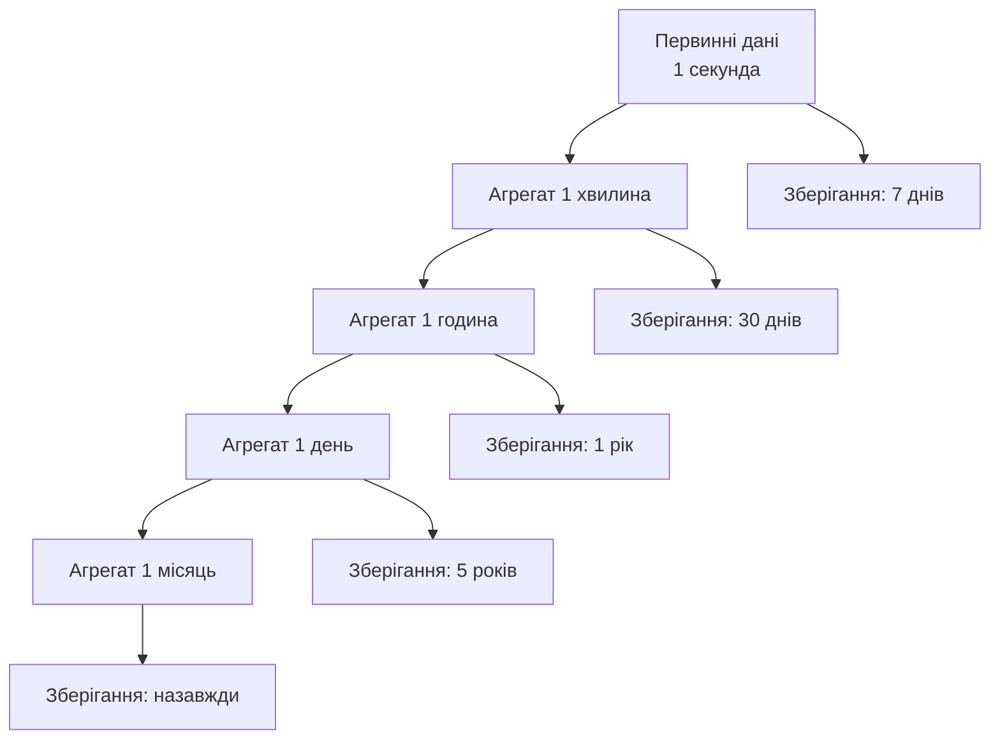
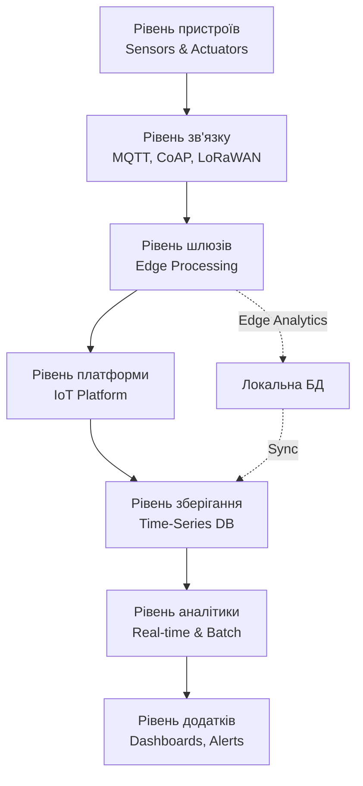
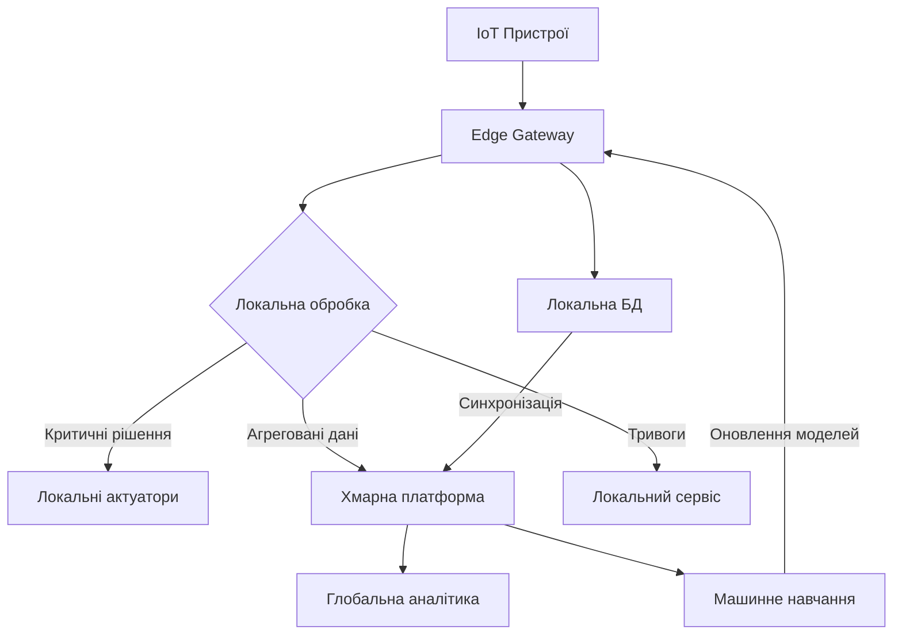
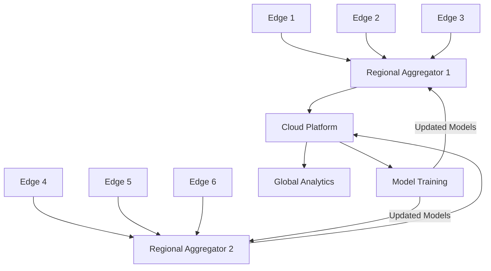

# Лекція 21. Часові ряди та IoT системи

## Вступ

Сучасний світ стикається з експоненційним зростанням обсягів даних, що генеруються різноманітними джерелами в реальному часі. Від промислових сенсорів та розумних пристроїв до фінансових торгових систем та систем моніторингу інфраструктури — усі ці системи генерують послідовності вимірювань, прив'язаних до часу. Такі дані формують часові ряди, які вимагають спеціалізованих підходів до зберігання, обробки та аналізу.

Поєднання технологій баз даних для часових рядів та екосистеми Інтернету речей створює нову парадигму роботи з даними, де критичними стають не лише обсяги, а й швидкість надходження інформації, необхідність обробки на краю мережі та здатність виявляти паттерни в реальному часі.

## Специфіка часових рядів

### Визначення та основні характеристики

Часовий ряд являє собою впорядковану послідовність числових значень, кожне з яких асоційоване з певним моментом часу. Математично часовий ряд можна визначити як набір пар {(t₁, v₁), (t₂, v₂), ..., (tₙ, vₙ)}, де tᵢ представляє часову позначку, а vᵢ відповідає виміряному значенню в цей момент.



Основні властивості часових рядів:

Монотонність часу означає, що часові позначки завжди впорядковані та не можуть зменшуватися. Для будь-яких двох послідовних точок виконується умова tᵢ < tᵢ₊₁, що забезпечує природний порядок даних.

Часова прив'язка є обов'язковою характеристикою кожного значення. Без точної часової позначки дані втрачають свою контекстуальність та стають непридатними для аналізу трендів і паттернів.

Незмінність історичних даних означає, що після запису значення в часовому ряді воно зазвичай не підлягає модифікації. Минуле не змінюється, тому операції оновлення виконуються рідко порівняно з додаванням нових вимірювань.

Висока швидкість надходження характеризується тим, що системи часових рядів часто отримують тисячі або мільйони точок даних на секунду від множини джерел.

### Типи часових рядів

Регулярні часові ряди характеризуються фіксованими інтервалами між вимірюваннями. Приклади включають щосекундні вимірювання температури, щохвилинні дані про завантаження серверів або щогодинні показники споживання електроенергії.

```sql
-- Приклад регулярного часового ряду (PostgreSQL)
CREATE TABLE temperature_readings (
    sensor_id INTEGER,
    measured_at TIMESTAMP NOT NULL,
    temperature_celsius DECIMAL(5,2),
    PRIMARY KEY (sensor_id, measured_at)
);

-- Вставка регулярних вимірювань кожні 10 секунд
INSERT INTO temperature_readings VALUES
    (101, '2025-01-15 10:00:00', 22.5),
    (101, '2025-01-15 10:00:10', 22.6),
    (101, '2025-01-15 10:00:20', 22.4),
    (101, '2025-01-15 10:00:30', 22.7);
```

Нерегулярні часові ряди мають змінні інтервали між точками даних. Такі ряди виникають в системах, що реагують на події, коли дані записуються лише при виникненні певних умов або зміні стану.

Дискретні часові ряди містять окремі вимірювання в конкретні моменти часу, тоді як неперервні ряди представляють безперервний потік значень, що може бути відсамплований з різною частотою.

### Операції з часовими рядами

Запис даних у системи часових рядів оптимізований для високої швидкості додавання нових точок. Типова архітектура використовує буферизацію в пам'яті та пакетний запис на диск для досягнення максимальної пропускної здатності.

```sql
-- Масове додавання точок даних
INSERT INTO sensor_data (sensor_id, timestamp, value, metadata)
SELECT
    sensor_id,
    generate_series(
        '2025-01-15 00:00:00'::timestamp,
        '2025-01-15 23:59:59'::timestamp,
        '1 second'::interval
    ) as timestamp,
    random() * 100 as value,
    '{"unit": "celsius"}'::jsonb as metadata
FROM sensors;
```

Агрегація даних є фундаментальною операцією для часових рядів. Типові агрегатні функції включають обчислення середніх, мінімальних та максимальних значень за певні часові вікна.

```sql
-- Агрегація за годинні інтервали
SELECT
    sensor_id,
    date_trunc('hour', measured_at) as hour,
    avg(temperature_celsius) as avg_temp,
    min(temperature_celsius) as min_temp,
    max(temperature_celsius) as max_temp,
    count(*) as measurements_count
FROM temperature_readings
WHERE measured_at >= '2025-01-15'
    AND measured_at < '2025-01-16'
GROUP BY sensor_id, date_trunc('hour', measured_at)
ORDER BY sensor_id, hour;
```

Ковзне вікно (rolling window) дозволяє обчислювати агрегатні значення для рухомого часового проміжку, що особливо корисно для виявлення трендів та аномалій.

```sql
-- Ковзне середнє за останні 5 вимірювань
SELECT
    sensor_id,
    measured_at,
    temperature_celsius,
    avg(temperature_celsius) OVER (
        PARTITION BY sensor_id
        ORDER BY measured_at
        ROWS BETWEEN 4 PRECEDING AND CURRENT ROW
    ) as moving_average_5
FROM temperature_readings
ORDER BY sensor_id, measured_at;
```

Інтерполяція використовується для заповнення пропущених значень на основі сусідніх точок даних. Лінійна інтерполяція є найпростішим методом, але існують і складніші алгоритми для більш точних оцінок.

### Виклики роботи з часовими рядами

Високий об'єм даних створює проблеми зберігання та продуктивності. Один датчик, що генерує дані щосекунди, створює 86400 записів на день, 2,6 мільйона на місяць та майже 32 мільйони на рік. При масштабуванні на тисячі датчиків обсяги стають астрономічними.

Необхідність швидкого запису вимагає оптимізованих структур даних та стратегій індексування. Традиційні B-tree індекси можуть бути неефективними для постійно зростаючих часових рядів.

Компресія стає критичною для зберігання великих обсягів історичних даних. Часові ряди часто демонструють високу кореляцію між сусідніми значеннями, що робить їх придатними для ефективного стиснення.

Запити часто працюють з недавніми даними, що дозволяє використовувати багаторівневі стратегії зберігання з гарячими, теплими та холодними рівнями для оптимізації витрат та продуктивності.

## Архітектура баз даних для часових рядів

### InfluxDB

InfluxDB є спеціалізованою базою даних для роботи з часовими рядами, розробленою з нуля для високопродуктивного запису та запитування великих обсягів даних з часовими позначками.

Архітектурні особливості InfluxDB включають використання log-structured merge-tree для оптимізації запису, власну мову запитів Flux та вбудовану підтримку механізмів retention policy для автоматичного видалення старих даних.

Модель даних InfluxDB базується на концепції вимірювань (measurements), які подібні до таблиць у реляційних базах даних. Кожне вимірювання містить часові позначки, набір полів (fields) зі значеннями та набір тегів (tags) для індексування та категоризації.

```
# Структура точки даних в InfluxDB
measurement,tag_key=tag_value field_key=field_value timestamp

# Приклад запису температури
temperature,sensor=sensor_01,location=room_1 value=22.5 1642248000000000000

# Декілька полів в одній точці
weather,location=kyiv temperature=15.2,humidity=65,pressure=1013 1642248000000000000
```

Концепція тегів та полів є фундаментальною для InfluxDB. Теги індексуються та використовуються для фільтрації даних, тоді як поля зберігають фактичні вимірювання та не індексуються за замовчуванням.

```sql
-- Приклад Flux запиту для отримання середньої температури
from(bucket: "sensors")
  |> range(start: -1h)
  |> filter(fn: (r) => r._measurement == "temperature")
  |> filter(fn: (r) => r.sensor == "sensor_01")
  |> aggregateWindow(every: 5m, fn: mean)
  |> yield(name: "mean_temperature")
```

Механізм retention policies дозволяє автоматично видаляти застарілі дані після закінчення заданого періоду зберігання. Це забезпечує контроль над зростанням бази даних без необхідності ручного втручання.

```sql
-- Створення retention policy
CREATE RETENTION POLICY "one_week" ON "sensors"
    DURATION 7d
    REPLICATION 1
    DEFAULT

-- Continuous query для агрегації та збереження в довгостроковому сховищі
CREATE CONTINUOUS QUERY "cq_30m_mean" ON "sensors"
BEGIN
  SELECT mean("value")
  INTO "sensors"."one_year"."temperature_30m_mean"
  FROM "sensors"."one_week"."temperature"
  GROUP BY time(30m), *
END
```

### TimescaleDB

TimescaleDB є розширенням PostgreSQL, що додає оптимізовану підтримку часових рядів до потужної екосистеми реляційної бази даних. Ця гібридна природа дозволяє поєднувати переваги спеціалізованих time-series баз даних зі знайомим SQL інтерфейсом та багатими можливостями PostgreSQL.

Концепція гіпертаблиць (hypertables) є ключовою інновацією TimescaleDB. Гіпертаблиця виглядає як звичайна таблиця для користувача, але внутрішньо автоматично розбивається на багато менших таблиць-чанків на основі часових інтервалів.

```sql
-- Створення звичайної таблиці
CREATE TABLE sensor_data (
    time TIMESTAMPTZ NOT NULL,
    sensor_id INTEGER NOT NULL,
    temperature DOUBLE PRECISION,
    humidity DOUBLE PRECISION,
    pressure DOUBLE PRECISION
);

-- Перетворення на гіпертаблицю
SELECT create_hypertable('sensor_data', 'time');

-- Для користувача це виглядає як звичайна таблиця
INSERT INTO sensor_data VALUES
    (NOW(), 1, 22.5, 65, 1013),
    (NOW(), 2, 21.8, 70, 1012);

SELECT * FROM sensor_data WHERE time > NOW() - INTERVAL '1 hour';
```

Автоматичне партиціонування відбувається прозоро для користувача. TimescaleDB створює нові чанки по мірі надходження даних та може автоматично видаляти або архівувати старі чанки на основі політик зберігання.

```sql
-- Налаштування політики зберігання
SELECT add_retention_policy('sensor_data', INTERVAL '90 days');

-- Створення continuous aggregate для попередньо обчислених агрегатів
CREATE MATERIALIZED VIEW sensor_data_hourly
WITH (timescaledb.continuous) AS
SELECT
    time_bucket('1 hour', time) AS hour,
    sensor_id,
    avg(temperature) as avg_temp,
    max(temperature) as max_temp,
    min(temperature) as min_temp
FROM sensor_data
GROUP BY hour, sensor_id;

-- Політика автоматичного оновлення агрегату
SELECT add_continuous_aggregate_policy('sensor_data_hourly',
    start_offset => INTERVAL '3 hours',
    end_offset => INTERVAL '1 hour',
    schedule_interval => INTERVAL '1 hour');
```

Компресія даних у TimescaleDB використовує стовпчикову компресію для драматичного зменшення об'єму зберігання. Типові коефіцієнти компресії досягають 90-95% для часових рядів.

```sql
-- Увімкнення компресії для гіпертаблиці
ALTER TABLE sensor_data SET (
    timescaledb.compress,
    timescaledb.compress_segmentby = 'sensor_id',
    timescaledb.compress_orderby = 'time DESC'
);

-- Автоматична компресія чанків старше 7 днів
SELECT add_compression_policy('sensor_data', INTERVAL '7 days');
```

Функції для роботи з часовими рядами включають спеціалізовані агрегатні функції, інтерполяцію, виявлення аномалій та інші операції, оптимізовані для часових даних.

```sql
-- Використання функції time_bucket для агрегації
SELECT
    time_bucket('15 minutes', time) AS bucket,
    sensor_id,
    avg(temperature) as avg_temp,
    stddev(temperature) as temp_stddev,
    first(temperature, time) as first_temp,
    last(temperature, time) as last_temp
FROM sensor_data
WHERE time > NOW() - INTERVAL '24 hours'
GROUP BY bucket, sensor_id
ORDER BY bucket, sensor_id;

-- Виявлення аномалій за допомогою стандартного відхилення
WITH stats AS (
    SELECT
        sensor_id,
        avg(temperature) as mean_temp,
        stddev(temperature) as stddev_temp
    FROM sensor_data
    WHERE time > NOW() - INTERVAL '24 hours'
    GROUP BY sensor_id
)
SELECT
    s.time,
    s.sensor_id,
    s.temperature,
    st.mean_temp,
    st.stddev_temp,
    abs(s.temperature - st.mean_temp) / st.stddev_temp as z_score
FROM sensor_data s
JOIN stats st ON s.sensor_id = st.sensor_id
WHERE abs(s.temperature - st.mean_temp) > 3 * st.stddev_temp
ORDER BY s.time DESC;
```

### Порівняння архітектур

InfluxDB та TimescaleDB представляють два різні підходи до вирішення проблем часових рядів. InfluxDB пропонує спеціалізоване рішення, створене з нуля для часових даних, з власною моделлю даних та мовою запитів. TimescaleDB розширює перевірену часом PostgreSQL, зберігаючи знайомий SQL інтерфейс та екосистему.



Вибір між цими системами залежить від специфічних вимог проєкту, досвіду команди та природи даних, що обробляються.

## Компресія та агрегація часових даних

### Методи компресії

Delta encoding є однією з найефективніших технік компресії часових рядів. Замість зберігання абсолютних значень система зберігає різниці між послідовними точками, які часто є значно меншими числами.

```python
# Приклад delta encoding
original_values = [1000, 1005, 1003, 1007, 1010, 1008]

# Перше значення зберігається повністю
base_value = original_values[0]  # 1000

# Наступні значення зберігаються як різниці
deltas = [original_values[i] - original_values[i-1]
          for i in range(1, len(original_values))]
# deltas = [5, -2, 4, 3, -2]

# Декомпресія
decompressed = [base_value]
for delta in deltas:
    decompressed.append(decompressed[-1] + delta)
# decompressed = [1000, 1005, 1003, 1007, 1010, 1008]
```

Run-length encoding ефективний для даних з багатьма послідовними однаковими значеннями, що часто зустрічається в системах моніторингу, де стан може залишатися незмінним протягом тривалих періодів.

Dictionary encoding створює словник унікальних значень та замінює повторювані значення компактними посиланнями на словник. Це особливо ефективно для категоріальних даних в часових рядах.

Gorilla compression, розроблений Facebook, є спеціалізованим алгоритмом для часових рядів з плаваючою комою. Він використовує XOR операції для виявлення схожості між послідовними значеннями та досягає високих коефіцієнтів компресії.

```python
# Спрощена ілюстрація Gorilla compression
import struct

def float_to_bits(f):
    return struct.unpack('>I', struct.pack('>f', f))[0]

def bits_to_float(bits):
    return struct.unpack('>f', struct.pack('>I', bits))[0]

# Послідовні значення температури
values = [22.5, 22.6, 22.4, 22.7]

# Перше значення зберігається повністю
compressed = [float_to_bits(values[0])]

# Наступні значення зберігаються як XOR з попереднім
for i in range(1, len(values)):
    prev_bits = float_to_bits(values[i-1])
    curr_bits = float_to_bits(values[i])
    xor_result = prev_bits ^ curr_bits
    compressed.append(xor_result)

# XOR результати часто мають багато нулів на початку та в кінці
# що дозволяє додаткову компресію
```

### Багаторівнева агрегація

Концепція попередньо обчислених агрегатів дозволяє зберігати підсумкову статистику на різних часових інтервалах, забезпечуючи швидкий доступ до агрегованих даних без необхідності обробки всіх первинних точок.



Реалізація багаторівневої агрегації в TimescaleDB використовує continuous aggregates для автоматичного обчислення та підтримки агрегованих представлень.

```sql
-- Щохвилинні агрегати
CREATE MATERIALIZED VIEW sensor_data_1min
WITH (timescaledb.continuous) AS
SELECT
    time_bucket('1 minute', time) AS minute,
    sensor_id,
    avg(temperature) as avg_temp,
    min(temperature) as min_temp,
    max(temperature) as max_temp,
    count(*) as sample_count
FROM sensor_data
GROUP BY minute, sensor_id;

-- Щогодинні агрегати на основі хвилинних
CREATE MATERIALIZED VIEW sensor_data_1hour
WITH (timescaledb.continuous) AS
SELECT
    time_bucket('1 hour', minute) AS hour,
    sensor_id,
    avg(avg_temp) as avg_temp,
    min(min_temp) as min_temp,
    max(max_temp) as max_temp,
    sum(sample_count) as total_samples
FROM sensor_data_1min
GROUP BY hour, sensor_id;

-- Запит автоматично використовує найбільш відповідний рівень агрегації
SELECT
    hour,
    sensor_id,
    avg_temp
FROM sensor_data_1hour
WHERE hour >= NOW() - INTERVAL '7 days'
ORDER BY hour, sensor_id;
```

Стратегії зберігання визначають, які рівні деталізації зберігаються та як довго. Типовий підхід передбачає зберігання детальних даних протягом короткого періоду та агрегованих даних протягом тривалішого часу.

### Downsampling та ретенція

Downsampling є процесом зменшення частоти дискретизації даних через агрегацію. Це дозволяє зменшити обсяг даних при збереженні важливих статистичних характеристик.

```sql
-- Автоматичний downsampling старих даних в InfluxDB
CREATE CONTINUOUS QUERY "cq_downsample_1h" ON "sensors"
BEGIN
  SELECT
    mean("temperature") AS "mean_temp",
    min("temperature") AS "min_temp",
    max("temperature") AS "max_temp",
    percentile("temperature", 95) AS "p95_temp"
  INTO "sensors"."one_year"."temperature_hourly"
  FROM "sensors"."one_week"."temperature"
  GROUP BY time(1h), *
END
```

Політики ретенції визначають життєвий цикл даних та автоматично видаляють або архівують застарілу інформацію.

```sql
-- TimescaleDB: комбінація компресії та ретенції
-- Компресія даних старше тижня
SELECT add_compression_policy('sensor_data', INTERVAL '7 days');

-- Переміщення на повільніше сховище через місяць
SELECT move_chunk(
    chunk => '_timescaledb_internal._hyper_1_1_chunk',
    destination_tablespace => 'slow_storage'
);

-- Видалення даних старше року
SELECT add_retention_policy('sensor_data', INTERVAL '365 days');
```

Вибір стратегії ретенції залежить від бізнес-вимог, регуляторних обмежень та витрат на зберігання. Критичні дані можуть вимагати тривалого зберігання первинних значень, тоді як моніторингові метрики можуть агресивно агрегуватися.

## Internet of Things: збір, зберігання, аналіз даних

### Архітектура IoT систем

Типова архітектура IoT системи складається з декількох рівнів, кожен з яких відповідає за певні аспекти збору, передачі, зберігання та аналізу даних.



Рівень пристроїв включає фізичні датчики та актуатори, що збирають дані з навколишнього середовища та виконують дії. Пристрої можуть варіюватися від простих температурних сенсорів до складних промислових контролерів.

Рівень зв'язку забезпечує передачу даних від пристроїв до центральних систем. MQTT є популярним протоколом через його легкість та ефективність для IoT сценаріїв.

```python
# Приклад MQTT клієнта на пристрої
import paho.mqtt.client as mqtt
import json
import time
from datetime import datetime

class IoTSensor:
    def __init__(self, sensor_id, mqtt_broker):
        self.sensor_id = sensor_id
        self.client = mqtt.Client()
        self.client.connect(mqtt_broker, 1883, 60)

    def read_sensor(self):
        # Симуляція читання датчика
        import random
        return {
            'sensor_id': self.sensor_id,
            'timestamp': datetime.utcnow().isoformat(),
            'temperature': 20 + random.uniform(-2, 2),
            'humidity': 60 + random.uniform(-10, 10),
            'pressure': 1013 + random.uniform(-5, 5)
        }

    def publish_data(self):
        data = self.read_sensor()
        topic = f"sensors/{self.sensor_id}/data"
        payload = json.dumps(data)
        self.client.publish(topic, payload)
        return data

# Використання
sensor = IoTSensor("sensor_001", "mqtt.example.com")
while True:
    data = sensor.publish_data()
    print(f"Published: {data}")
    time.sleep(10)  # Публікація кожні 10 секунд
```

Рівень шлюзів виконує функції агрегації, попередньої обробки та маршрутизації даних. Шлюзи можуть здійснювати фільтрацію, компресію та локальну аналітику перед передачею даних в хмару.

### Збір даних від IoT пристроїв

MQTT (Message Queuing Telemetry Transport) є легким протоколом обміну повідомленнями, розробленим спеціально для IoT. Він працює на моделі публікації-підписки, що забезпечує ефективну розсилку даних від багатьох пристроїв до багатьох споживачів.

```python
# MQTT брокер на сервері (з використанням Mosquitto та Python)
import paho.mqtt.client as mqtt
from influxdb_client import InfluxDBClient, Point
from datetime import datetime

class IoTDataCollector:
    def __init__(self, mqtt_broker, influxdb_url, influxdb_token):
        # Налаштування MQTT
        self.mqtt_client = mqtt.Client()
        self.mqtt_client.on_connect = self.on_connect
        self.mqtt_client.on_message = self.on_message
        self.mqtt_client.connect(mqtt_broker, 1883, 60)

        # Налаштування InfluxDB
        self.influx_client = InfluxDBClient(
            url=influxdb_url,
            token=influxdb_token,
            org="iot-org"
        )
        self.write_api = self.influx_client.write_api()

    def on_connect(self, client, userdata, flags, rc):
        print(f"Connected with result code {rc}")
        # Підписка на всі топіки датчиків
        client.subscribe("sensors/+/data")

    def on_message(self, client, userdata, msg):
        try:
            # Парсинг даних
            data = json.loads(msg.payload.decode())

            # Створення точки даних для InfluxDB
            point = Point("sensor_reading") \
                .tag("sensor_id", data['sensor_id']) \
                .field("temperature", float(data['temperature'])) \
                .field("humidity", float(data['humidity'])) \
                .field("pressure", float(data['pressure'])) \
                .time(data['timestamp'])

            # Запис в базу даних
            self.write_api.write(bucket="sensors", record=point)
            print(f"Stored data from {data['sensor_id']}")

        except Exception as e:
            print(f"Error processing message: {e}")

    def run(self):
        self.mqtt_client.loop_forever()

# Запуск збирача
collector = IoTDataCollector(
    mqtt_broker="localhost",
    influxdb_url="http://localhost:8086",
    influxdb_token="your-token"
)
collector.run()
```

Буферизація та пакетна обробка є критичними для ефективного збору даних від великої кількості пристроїв. Замість запису кожної точки окремо система накопичує дані в буфері та записує їх пакетами.

```python
# Пакетна обробка даних
class BatchedIoTCollector:
    def __init__(self, batch_size=1000, flush_interval=60):
        self.batch = []
        self.batch_size = batch_size
        self.flush_interval = flush_interval
        self.last_flush = time.time()

    def add_reading(self, data):
        self.batch.append(data)

        # Запис при досягненні розміру пакету або часового інтервалу
        if (len(self.batch) >= self.batch_size or
            time.time() - self.last_flush >= self.flush_interval):
            self.flush()

    def flush(self):
        if not self.batch:
            return

        # Пакетний запис в базу даних
        points = []
        for data in self.batch:
            point = Point("sensor_reading") \
                .tag("sensor_id", data['sensor_id']) \
                .field("temperature", data['temperature']) \
                .field("humidity", data['humidity']) \
                .time(data['timestamp'])
            points.append(point)

        self.write_api.write(bucket="sensors", record=points)
        print(f"Flushed {len(self.batch)} readings")

        self.batch = []
        self.last_flush = time.time()
```

### Обробка потокових даних

Stream processing дозволяє обробляти дані в реальному часі по мірі їх надходження. Apache Kafka Streams та Apache Flink є популярними фреймворками для потокової обробки IoT даних.

```python
# Приклад обробки потоку з використанням Kafka
from kafka import KafkaConsumer, KafkaProducer
import json

class IoTStreamProcessor:
    def __init__(self):
        self.consumer = KafkaConsumer(
            'sensor-raw-data',
            bootstrap_servers=['localhost:9092'],
            value_deserializer=lambda m: json.loads(m.decode('utf-8'))
        )

        self.producer = KafkaProducer(
            bootstrap_servers=['localhost:9092'],
            value_serializer=lambda m: json.dumps(m).encode('utf-8')
        )

    def process_stream(self):
        # Буфер для ковзного вікна
        window_buffer = []
        window_size = 10

        for message in self.consumer:
            data = message.value
            window_buffer.append(data)

            # Підтримка розміру вікна
            if len(window_buffer) > window_size:
                window_buffer.pop(0)

            # Обчислення метрик на вікні
            if len(window_buffer) == window_size:
                avg_temp = sum(d['temperature'] for d in window_buffer) / window_size

                # Виявлення аномалій
                current_temp = data['temperature']
                if abs(current_temp - avg_temp) > 5:
                    alert = {
                        'sensor_id': data['sensor_id'],
                        'timestamp': data['timestamp'],
                        'current_value': current_temp,
                        'average_value': avg_temp,
                        'alert_type': 'temperature_anomaly'
                    }
                    self.producer.send('sensor-alerts', value=alert)
                    print(f"Alert sent for sensor {data['sensor_id']}")
```

Виявлення аномалій в реальному часі є критичним для багатьох IoT застосувань. Статистичні методи, машинне навчання та експертні правила можуть використовуватися для ідентифікації незвичайних паттернів.

```python
# Виявлення аномалій з використанням Z-score
import numpy as np
from collections import deque

class AnomalyDetector:
    def __init__(self, window_size=100, threshold=3.0):
        self.window_size = window_size
        self.threshold = threshold
        self.data_window = deque(maxlen=window_size)

    def detect_anomaly(self, value):
        self.data_window.append(value)

        if len(self.data_window) < self.window_size:
            return False

        # Обчислення Z-score
        mean = np.mean(self.data_window)
        std = np.std(self.data_window)

        if std == 0:
            return False

        z_score = abs((value - mean) / std)
        return z_score > self.threshold

# Використання детектора
detector = AnomalyDetector(window_size=50, threshold=3.0)

for reading in sensor_readings:
    if detector.detect_anomaly(reading['temperature']):
        print(f"Anomaly detected at {reading['timestamp']}: {reading['temperature']}")
```

### Зберігання IoT даних

Вибір стратегії зберігання залежить від обсягів даних, патернів доступу та вимог до продуктивності. Типовий підхід включає комбінацію гарячого та холодного зберігання.

```sql
-- TimescaleDB: налаштування зберігання для IoT
CREATE TABLE iot_sensor_data (
    time TIMESTAMPTZ NOT NULL,
    device_id TEXT NOT NULL,
    sensor_type TEXT NOT NULL,
    value DOUBLE PRECISION,
    unit TEXT,
    metadata JSONB
);

SELECT create_hypertable('iot_sensor_data', 'time');

-- Створення індексів для типових запитів
CREATE INDEX idx_device_sensor ON iot_sensor_data (device_id, sensor_type, time DESC);

-- Компресія для даних старше 7 днів
ALTER TABLE iot_sensor_data SET (
    timescaledb.compress,
    timescaledb.compress_segmentby = 'device_id, sensor_type',
    timescaledb.compress_orderby = 'time DESC'
);

SELECT add_compression_policy('iot_sensor_data', INTERVAL '7 days');

-- Переміщення на холодне сховище через місяць
SELECT add_tiered_storage_policy('iot_sensor_data',
    move_after => INTERVAL '30 days',
    destination_tablespace => 'cold_storage'
);
```

Агрегатні таблиці для різних часових вікон забезпечують швидкий доступ до підсумкової інформації без обробки всіх первинних даних.

```sql
-- Щохвилинні агрегати
CREATE MATERIALIZED VIEW iot_data_1min
WITH (timescaledb.continuous) AS
SELECT
    time_bucket('1 minute', time) AS minute,
    device_id,
    sensor_type,
    avg(value) as avg_value,
    min(value) as min_value,
    max(value) as max_value,
    count(*) as reading_count,
    percentile_cont(0.95) WITHIN GROUP (ORDER BY value) as p95_value
FROM iot_sensor_data
GROUP BY minute, device_id, sensor_type;

-- Щоденні агрегати для довгострокових трендів
CREATE MATERIALIZED VIEW iot_data_daily
WITH (timescaledb.continuous) AS
SELECT
    time_bucket('1 day', minute) AS day,
    device_id,
    sensor_type,
    avg(avg_value) as daily_avg,
    min(min_value) as daily_min,
    max(max_value) as daily_max,
    sum(reading_count) as total_readings
FROM iot_data_1min
GROUP BY day, device_id, sensor_type;
```

## Edge Computing та розподілена аналітика

### Концепція Edge Computing

Edge computing переносить обчислення та зберігання даних ближче до джерел даних, зменшуючи латентність, знижуючи навантаження на мережу та дозволяючи автономну роботу при втраті зв'язку з хмарою.



Переваги edge computing включають зменшену латентність для критичних операцій, економію пропускної здатності через локальну обробку та фільтрацію даних, підвищену приватність через локальне зберігання чутливих даних та автономність роботи при відсутності зв'язку.

### Архітектура Edge Gateway

Edge gateway виконує роль посередника між IoT пристроями та хмарою, забезпечуючи локальну обробку, агрегацію та інтелектуальну маршрутизацію даних.

```python
# Приклад Edge Gateway з локальною обробкою
import sqlite3
import time
from datetime import datetime, timedelta

class EdgeGateway:
    def __init__(self):
        # Локальна база даних для буферизації
        self.local_db = sqlite3.connect('edge_buffer.db')
        self.setup_local_storage()

        # Моделі для локальних рішень
        self.decision_rules = self.load_decision_rules()

    def setup_local_storage(self):
        cursor = self.local_db.cursor()
        cursor.execute('''
            CREATE TABLE IF NOT EXISTS sensor_readings (
                id INTEGER PRIMARY KEY AUTOINCREMENT,
                timestamp TEXT,
                device_id TEXT,
                sensor_type TEXT,
                value REAL,
                synced INTEGER DEFAULT 0
            )
        ''')
        self.local_db.commit()

    def process_reading(self, reading):
        # Локальне зберігання
        self.store_locally(reading)

        # Локальна аналітика
        analysis_result = self.analyze_locally(reading)

        # Прийняття критичних рішень на краю
        if analysis_result['requires_action']:
            self.take_local_action(analysis_result)

        # Підготовка для синхронізації з хмарою
        if analysis_result['should_sync']:
            self.queue_for_sync(reading)

        return analysis_result

    def analyze_locally(self, reading):
        # Перевірка порогових значень
        device_rules = self.decision_rules.get(reading['device_id'], {})
        sensor_rules = device_rules.get(reading['sensor_type'], {})

        result = {
            'requires_action': False,
            'should_sync': True,
            'alerts': []
        }

        # Перевірка критичних порогів
        if 'critical_high' in sensor_rules:
            if reading['value'] > sensor_rules['critical_high']:
                result['requires_action'] = True
                result['alerts'].append({
                    'type': 'critical_high',
                    'value': reading['value'],
                    'threshold': sensor_rules['critical_high']
                })

        # Обчислення локальних агрегатів
        recent_avg = self.get_recent_average(
            reading['device_id'],
            reading['sensor_type'],
            minutes=5
        )

        # Виявлення різких змін
        if recent_avg and abs(reading['value'] - recent_avg) > sensor_rules.get('max_delta', 10):
            result['alerts'].append({
                'type': 'sudden_change',
                'value': reading['value'],
                'average': recent_avg
            })

        return result

    def get_recent_average(self, device_id, sensor_type, minutes=5):
        cursor = self.local_db.cursor()
        cutoff_time = (datetime.now() - timedelta(minutes=minutes)).isoformat()

        cursor.execute('''
            SELECT AVG(value)
            FROM sensor_readings
            WHERE device_id = ?
                AND sensor_type = ?
                AND timestamp > ?
        ''', (device_id, sensor_type, cutoff_time))

        result = cursor.fetchone()
        return result[0] if result and result[0] else None

    def take_local_action(self, analysis_result):
        # Виконання локальних дій без звернення до хмари
        for alert in analysis_result['alerts']:
            if alert['type'] == 'critical_high':
                # Активувати локальний актуатор
                self.activate_safety_mechanism(alert)
                print(f"Local action taken: Safety mechanism activated")

    def sync_with_cloud(self):
        # Синхронізація накопичених даних з хмарою
        cursor = self.local_db.cursor()
        cursor.execute('''
            SELECT * FROM sensor_readings
            WHERE synced = 0
            ORDER BY timestamp
            LIMIT 1000
        ''')

        unsynced_readings = cursor.fetchall()

        if unsynced_readings:
            # Відправка пакету в хмару
            success = self.send_to_cloud(unsynced_readings)

            if success:
                # Позначити як синхронізовані
                ids = [r[0] for r in unsynced_readings]
                cursor.execute(f'''
                    UPDATE sensor_readings
                    SET synced = 1
                    WHERE id IN ({','.join('?' * len(ids))})
                ''', ids)
                self.local_db.commit()
                print(f"Synced {len(unsynced_readings)} readings with cloud")
```

### Розподілена аналітика

Федероване навчання дозволяє навчати моделі машинного навчання на розподілених даних без необхідності централізувати дані. Кожен edge вузол навчає модель на локальних даних та відправляє лише оновлення моделі в центральну систему.

```python
# Спрощена ілюстрація федерованого навчання
class FederatedLearningEdgeNode:
    def __init__(self, node_id):
        self.node_id = node_id
        self.local_model = None
        self.local_data = []

    def receive_global_model(self, global_model):
        # Отримання глобальної моделі від центрального сервера
        self.local_model = global_model.copy()

    def collect_local_data(self, duration_minutes=60):
        # Збір локальних даних для навчання
        cursor = self.local_db.cursor()
        cutoff_time = (datetime.now() - timedelta(minutes=duration_minutes)).isoformat()

        cursor.execute('''
            SELECT device_id, sensor_type, value, timestamp
            FROM sensor_readings
            WHERE timestamp > ?
        ''', (cutoff_time,))

        self.local_data = cursor.fetchall()

    def train_local_model(self, epochs=5):
        # Навчання на локальних даних
        if not self.local_data or not self.local_model:
            return None

        # Симуляція навчання (в реальності використовується TensorFlow/PyTorch)
        for epoch in range(epochs):
            # Обробка локальних даних
            for data_point in self.local_data:
                # Оновлення локальної моделі
                pass

        # Повернення градієнтів або оновлень моделі
        model_updates = self.calculate_model_updates()
        return model_updates

    def calculate_model_updates(self):
        # Обчислення різниці між початковою та оновленою моделлю
        # Повертаються лише оновлення, а не повна модель
        return {
            'node_id': self.node_id,
            'updates': 'model_gradients',  # Фактичні градієнти
            'data_size': len(self.local_data),
            'timestamp': datetime.now().isoformat()
        }
```

Ієрархічна агрегація дозволяє поєднувати результати від множини edge вузлів на проміжних рівнях перед відправкою в центральну хмару.



### Синхронізація та консистентність

Eventual consistency є прийнятною моделлю для багатьох IoT сценаріїв, де важливіше отримати всі дані з часом, ніж мати миттєву консистентність.

```python
# Механізм синхронізації з конфліктами
class ConflictResolutionSyncer:
    def __init__(self):
        self.pending_updates = []

    def sync_reading(self, local_reading, cloud_reading):
        # Стратегія розв'язання конфліктів
        if local_reading['timestamp'] == cloud_reading['timestamp']:
            # Однаковий час - використовуємо локальну версію
            return local_reading
        elif local_reading['timestamp'] > cloud_reading['timestamp']:
            # Локальна версія новіша
            return local_reading
        else:
            # Хмарна версія новіша
            return cloud_reading

    def bidirectional_sync(self):
        # Отримання змін з хмари
        cloud_updates = self.fetch_cloud_updates()

        # Отримання локальних змін
        local_updates = self.fetch_local_updates()

        # Розв'язання конфліктів
        merged_updates = []
        for local_update in local_updates:
            matching_cloud = next(
                (c for c in cloud_updates
                 if c['id'] == local_update['id']),
                None
            )

            if matching_cloud:
                resolved = self.sync_reading(local_update, matching_cloud)
                merged_updates.append(resolved)
            else:
                merged_updates.append(local_update)

        # Застосування оновлень
        self.apply_updates(merged_updates)

        return merged_updates
```

Offline-first архітектура передбачає, що edge вузли можуть працювати автономно протягом тривалого часу та синхронізуватися з хмарою при відновленні зв'язку.

```python
# Offline-first Edge System
class OfflineFirstEdgeSystem:
    def __init__(self):
        self.is_online = False
        self.offline_queue = []
        self.max_queue_size = 10000

    def check_connectivity(self):
        # Перевірка з'єднання з хмарою
        try:
            # Спроба підключення
            self.is_online = self.test_cloud_connection()
        except Exception as e:
            self.is_online = False

    def process_data(self, reading):
        # Обробка даних незалежно від стану з'єднання
        local_result = self.local_processing(reading)

        if self.is_online:
            # Спроба відправити в хмару
            try:
                self.send_to_cloud(reading)
                # Спроба очистити чергу
                self.process_offline_queue()
            except Exception as e:
                self.is_online = False
                self.queue_for_later(reading)
        else:
            # Додати до черги для пізнішої синхронізації
            self.queue_for_later(reading)

        return local_result

    def queue_for_later(self, reading):
        self.offline_queue.append(reading)

        # Управління розміром черги
        if len(self.offline_queue) > self.max_queue_size:
            # Агрегація старих даних для економії пам'яті
            self.aggregate_old_queue_data()

    def process_offline_queue(self):
        # Відправка накопичених даних
        while self.offline_queue and self.is_online:
            batch = self.offline_queue[:100]
            try:
                self.send_batch_to_cloud(batch)
                self.offline_queue = self.offline_queue[100:]
            except Exception as e:
                self.is_online = False
                break
```

## Практичні сценарії застосування

### Промисловий моніторинг

Промислові IoT системи використовують часові ряди для моніторингу обладнання, прогнозування відмов та оптимізації процесів.

```python
# Система прогнозного обслуговування
class PredictiveMaintenanceSystem:
    def __init__(self):
        self.vibration_threshold = 5.0
        self.temperature_threshold = 80.0
        self.historical_window = 24  # годин

    def analyze_equipment_health(self, equipment_id):
        # Отримання історичних даних
        query = f"""
        SELECT
            time,
            vibration_level,
            temperature,
            rotation_speed,
            power_consumption
        FROM equipment_sensors
        WHERE equipment_id = '{equipment_id}'
            AND time > NOW() - INTERVAL '{self.historical_window} hours'
        ORDER BY time
        """

        historical_data = self.execute_query(query)

        # Аналіз трендів
        vibration_trend = self.calculate_trend(historical_data, 'vibration_level')
        temp_trend = self.calculate_trend(historical_data, 'temperature')

        # Оцінка ризику відмови
        risk_score = self.calculate_failure_risk(
            vibration_trend,
            temp_trend,
            historical_data
        )

        # Генерація рекомендацій
        if risk_score > 0.7:
            return {
                'status': 'critical',
                'risk_score': risk_score,
                'recommendation': 'Schedule immediate maintenance',
                'estimated_time_to_failure': self.estimate_ttf(historical_data)
            }
        elif risk_score > 0.4:
            return {
                'status': 'warning',
                'risk_score': risk_score,
                'recommendation': 'Plan maintenance within 48 hours'
            }
        else:
            return {
                'status': 'normal',
                'risk_score': risk_score
            }

    def calculate_trend(self, data, column):
        # Обчислення тренду з використанням лінійної регресії
        import numpy as np
        from scipy import stats

        values = [row[column] for row in data]
        x = np.arange(len(values))
        slope, intercept, r_value, p_value, std_err = stats.linregress(x, values)

        return {
            'slope': slope,
            'direction': 'increasing' if slope > 0 else 'decreasing',
            'correlation': r_value
        }
```

### Розумні будівлі та міста

Smart building системи використовують IoT датчики для оптимізації енергоспоживання, комфорту та безпеки.

```sql
-- Аналіз енергоспоживання будівлі
WITH hourly_consumption AS (
    SELECT
        time_bucket('1 hour', time) as hour,
        floor_number,
        zone,
        sum(power_watts) / 1000.0 as kwh_consumed,
        avg(temperature) as avg_temp,
        avg(occupancy_count) as avg_occupancy
    FROM building_sensors
    WHERE time > NOW() - INTERVAL '30 days'
    GROUP BY hour, floor_number, zone
),
baseline AS (
    SELECT
        extract(hour from hour) as hour_of_day,
        extract(dow from hour) as day_of_week,
        floor_number,
        zone,
        avg(kwh_consumed) as baseline_kwh,
        stddev(kwh_consumed) as kwh_stddev
    FROM hourly_consumption
    WHERE hour < NOW() - INTERVAL '7 days'  -- Базова лінія на основі минулого
    GROUP BY hour_of_day, day_of_week, floor_number, zone
)
SELECT
    h.hour,
    h.floor_number,
    h.zone,
    h.kwh_consumed,
    b.baseline_kwh,
    (h.kwh_consumed - b.baseline_kwh) as deviation,
    CASE
        WHEN h.kwh_consumed > b.baseline_kwh + 2 * b.kwh_stddev THEN 'High Anomaly'
        WHEN h.kwh_consumed > b.baseline_kwh + b.kwh_stddev THEN 'Elevated'
        WHEN h.kwh_consumed < b.baseline_kwh - b.kwh_stddev THEN 'Below Normal'
        ELSE 'Normal'
    END as consumption_status
FROM hourly_consumption h
JOIN baseline b ON
    extract(hour from h.hour) = b.hour_of_day
    AND extract(dow from h.hour) = b.day_of_week
    AND h.floor_number = b.floor_number
    AND h.zone = b.zone
WHERE h.hour >= NOW() - INTERVAL '24 hours'
ORDER BY h.hour DESC, h.floor_number, h.zone;
```

### Сільське господарство та точне землеробство

Precision agriculture використовує IoT сенсори для моніторингу умов вирощування та оптимізації використання ресурсів.

```python
# Система керування зрошенням
class IrrigationManagementSystem:
    def __init__(self):
        self.soil_moisture_thresholds = {
            'wheat': {'min': 30, 'max': 60},
            'corn': {'min': 40, 'max': 70},
            'vegetables': {'min': 50, 'max': 80}
        }

    def analyze_field_conditions(self, field_id):
        # Агрегація даних від польових сенсорів
        query = f"""
        SELECT
            zone_id,
            avg(soil_moisture) as avg_moisture,
            avg(soil_temperature) as avg_temp,
            avg(air_temperature) as air_temp,
            avg(humidity) as humidity,
            sum(rainfall_mm) as total_rainfall
        FROM field_sensors
        WHERE field_id = '{field_id}'
            AND time > NOW() - INTERVAL '1 hour'
        GROUP BY zone_id
        """

        zone_data = self.execute_query(query)

        # Визначення зон для зрошення
        irrigation_plan = []
        for zone in zone_data:
            crop_type = self.get_crop_type(field_id, zone['zone_id'])
            thresholds = self.soil_moisture_thresholds[crop_type]

            if zone['avg_moisture'] < thresholds['min']:
                # Обчислення необхідної кількості води
                water_needed = self.calculate_water_requirement(
                    zone['avg_moisture'],
                    thresholds['min'],
                    zone['air_temp'],
                    zone['humidity']
                )

                irrigation_plan.append({
                    'zone_id': zone['zone_id'],
                    'action': 'irrigate',
                    'duration_minutes': water_needed['duration'],
                    'priority': 'high' if zone['avg_moisture'] < thresholds['min'] - 10 else 'normal'
                })
            elif zone['avg_moisture'] > thresholds['max']:
                irrigation_plan.append({
                    'zone_id': zone['zone_id'],
                    'action': 'suspend',
                    'reason': 'oversaturated'
                })

        return irrigation_plan
```

## Висновки

Часові ряди та IoT системи формують критичну інфраструктуру для сучасних додатків реального часу. Спеціалізовані бази даних для часових рядів, такі як InfluxDB та TimescaleDB, надають необхідні можливості для ефективного зберігання, запитування та аналізу великих обсягів даних з часовими позначками.

Ключові принципи успішної роботи з часовими рядами включають розуміння специфіки монотонності та високої швидкості надходження даних, застосування ефективних методів компресії та агрегації, використання багаторівневих стратегій зберігання для оптимізації витрат та продуктивності.

Інтернет речей розширює виклики роботи з часовими рядами, додаючи вимоги до обробки на краю мережі, розподіленої аналітики та автономної роботи. Edge computing переносить інтелект ближче до джерел даних, забезпечуючи швидкі відповіді на критичні події та зменшуючи навантаження на мережу та хмарну інфраструктуру.

Федероване навчання та ієрархічна агрегація дозволяють будувати розподілені системи аналітики, що поєднують переваги локальної обробки з глобальною координацією. Offline-first архітектури забезпечують надійну роботу навіть при нестабільному зв'язку.

Практичні застосування охоплюють широкий спектр галузей від промислового моніторингу та прогнозного обслуговування до розумних будівель та точного землеробства. Успішна реалізація вимагає балансу між обробкою на краю та в хмарі, вибору відповідних технологій зберігання та аналітики, а також проєктування з урахуванням масштабованості та відмовостійкості.
