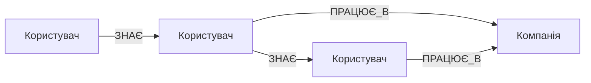
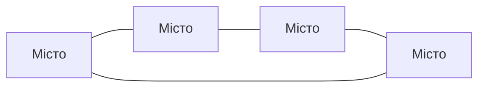
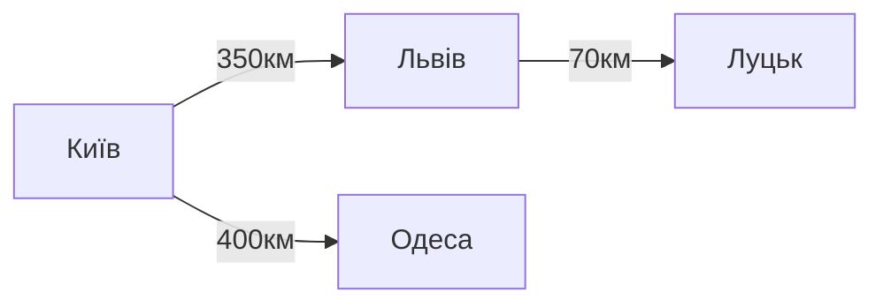
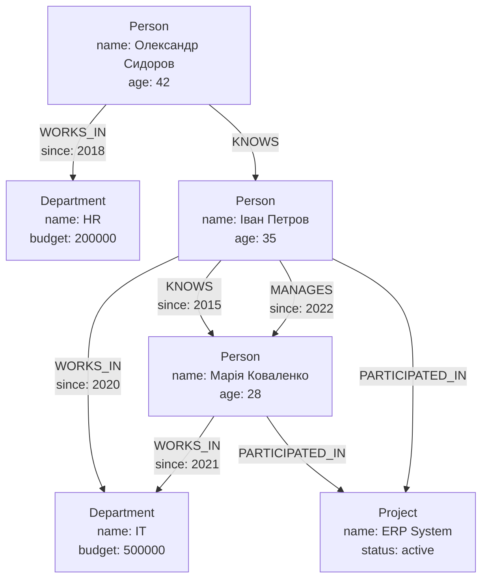
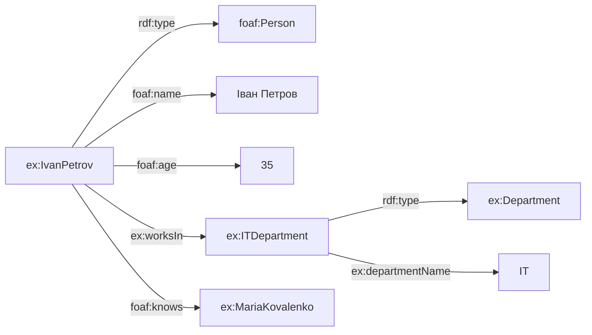
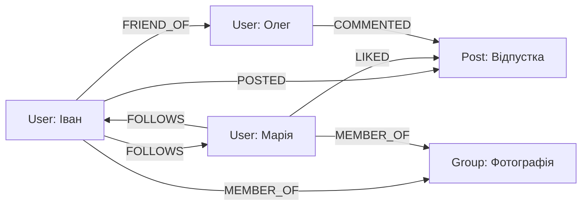
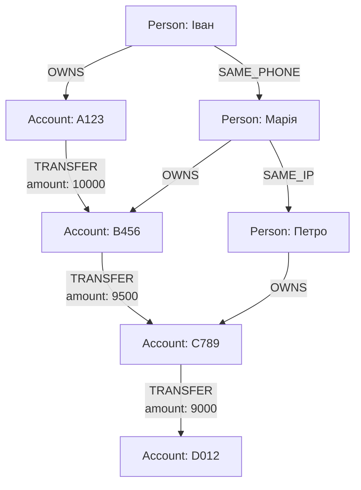

# Лекція 22. Графові бази даних та мережевий аналіз

## Вступ

У сучасному світі, де все більше значення набувають складні взаємозв'язки між даними, традиційні реляційні бази даних часто виявляються неефективними для представлення та аналізу мережевих структур. Соціальні мережі, транспортні системи, біологічні мережі, організаційні структури та багато інших предметних областей природно моделюються як графи, де об'єкти представлені вершинами, а зв'язки між ними — ребрами.

Графові бази даних виникли як відповідь на потребу ефективної роботи зі складними взаємозв'язаними даними. На відміну від реляційних баз даних, де зв'язки моделюються через зовнішні ключі та операції JOIN, графові бази даних зберігають зв'язки як фундаментальні структури першого класу, що забезпечує значно вищу продуктивність при обході графів та виконанні аналітичних запитів.

Основні визначення:

- **Граф** — абстрактна структура даних, що складається з вершин (вузлів) та ребер (зв'язків) між ними.
- **Графова база даних** — система управління базами даних, оптимізована для зберігання та обробки графових структур даних.
- **Мережевий аналіз** — набір методів та алгоритмів для дослідження структури та властивостей мережевих даних.
- **Патерн-орієнтований запит** — декларативний спосіб опису структури графа, яку потрібно знайти в базі даних.

## Основи теорії графів

### Математичні основи

Граф G визначається як упорядкована пара G = (V, E), де V — множина вершин, а E — множина ребер, що з'єднують пари вершин.

**Типи графів:**

**Орієнтований граф (Directed Graph):**

Кожне ребро має напрямок від вихідної вершини до цільової. Формально, E ⊆ V × V.



**Неорієнтований граф (Undirected Graph):**

Ребра не мають напрямку, зв'язок є двостороннім.



**Зважений граф (Weighted Graph):**

Кожне ребро має асоційовану вагу або вартість.



**Мультиграф:**

Дозволяє множинні ребра між однією парою вершин.

### Властивості графів

**Ступінь вершини:**

Кількість ребер, інцидентних вершині. Для орієнтованих графів розрізняють вхідний та вихідний ступінь.

**Шлях:**

Послідовність вершин, з'єднаних ребрами. Довжина шляху визначається кількістю ребер.

**Цикл:**

Шлях, що починається і закінчується в одній вершині.

**Зв'язність:**

Граф є зв'язним, якщо існує шлях між будь-якою парою вершин.

**Компонента зв'язності:**

Максимальний зв'язний підграф даного графа.

## Графові моделі даних

### Property Graph Model

Property Graph — найпопулярніша модель даних для графових баз даних, використовується в Neo4j, Amazon Neptune, Azure Cosmos DB.

**Основні елементи моделі:**

**Вершини (Nodes):**

Представляють сутності предметної області. Кожна вершина може мати:

- Унікальний ідентифікатор
- Одну або кілька міток (labels), що визначають тип сутності
- Набір властивостей у форматі ключ-значення

**Приклад вершини:**

```
Node ID: 1001
Labels: [Person, Employee]
Properties:
  name: "Іван Петров"
  age: 35
  email: "ivan.petrov@company.com"
  hired_date: "2020-03-15"
```

**Ребра (Relationships):**

Представляють зв'язки між вершинами. Кожне ребро має:

- Унікальний ідентифікатор
- Тип зв'язку
- Напрямок (від вихідної вершини до цільової)
- Властивості

**Приклад ребра:**

```
Relationship ID: 5001
Type: WORKS_IN
Start Node: 1001 (Person: Іван Петров)
End Node: 2001 (Department: IT)
Properties:
  since: "2020-03-15"
  position: "Senior Developer"
  salary: 85000
```

**Приклад складної структури Property Graph:**



### RDF (Resource Description Framework)

RDF — стандарт W3C для представлення інформації про ресурси в інтернеті, часто використовується в семантичному вебі та наукових базах даних.

**Структура RDF:**

Інформація в RDF представляється у вигляді тріплетів (triples) формату суб'єкт-предикат-об'єкт.

**Компоненти тріплету:**

- Суб'єкт — ресурс, про який робиться твердження
- Предикат — властивість або відношення
- Об'єкт — значення властивості або пов'язаний ресурс

**Приклад RDF тріплетів:**

```turtle
@prefix ex: <http://example.org/> .
@prefix foaf: <http://xmlns.com/foaf/0.1/> .
@prefix xsd: <http://www.w3.org/2001/XMLSchema#> .

ex:IvanPetrov rdf:type foaf:Person .
ex:IvanPetrov foaf:name "Іван Петров" .
ex:IvanPetrov foaf:age "35"^^xsd:integer .
ex:IvanPetrov ex:worksIn ex:ITDepartment .
ex:IvanPetrov foaf:knows ex:MariaKovalenko .

ex:ITDepartment rdf:type ex:Department .
ex:ITDepartment ex:departmentName "IT" .
ex:ITDepartment ex:budget "500000"^^xsd:decimal .
```

**Графове представлення RDF:**



**SPARQL — мова запитів для RDF:**

```sparql
PREFIX ex: <http://example.org/>
PREFIX foaf: <http://xmlns.com/foaf/0.1/>

SELECT ?personName ?deptName ?age
WHERE {
  ?person rdf:type foaf:Person .
  ?person foaf:name ?personName .
  ?person foaf:age ?age .
  ?person ex:worksIn ?dept .
  ?dept ex:departmentName ?deptName .
  FILTER (?age > 30)
}
ORDER BY DESC(?age)
```

### Порівняння Property Graph та RDF

| Аспект | Property Graph | RDF |
|--------|---------------|-----|
| Одиниця зберігання | Вершини та ребра з властивостями | Тріплети суб'єкт-предикат-об'єкт |
| Типізація вершин | Мітки (labels) | RDF Classes через rdf:type |
| Властивості ребер | Підтримуються нативно | Потребують reification |
| Мова запитів | Cypher, Gremlin | SPARQL |
| Складність моделі | Проста та інтуїтивна | Більш формальна, семантична |
| Використання | Практичні додатки, бізнес | Семантичний веб, наукові дані |

## Neo4j архітектура

### Огляд Neo4j

Neo4j — найпопулярніша графова база даних з підтримкою ACID транзакцій, що реалізує Property Graph модель. Написана на Java та оптимізована для зберігання графових структур на диску та в оперативній пам'яті.

**Ключові особливості Neo4j:**

- Нативне зберігання графів
- Підтримка ACID транзакцій
- Декларативна мова запитів Cypher
- Горизонтальне масштабування через кластеризацію
- Багата екосистема інструментів та бібліотек

### Архітектура зберігання

**Нативне графове зберігання:**

Neo4j використовує спеціалізовану структуру файлів, оптимізовану для графових даних. На відміну від реляційних баз даних, які моделюють зв'язки через JOIN операції, Neo4j зберігає зв'язки як фізичні структури на диску.

**Файлова структура:**

```
graph.db/
├── neostore.nodestore.db          # Вершини
├── neostore.relationshipstore.db  # Ребра
├── neostore.propertystore.db      # Властивості
├── neostore.labeltokenstore.db    # Мітки вершин
├── neostore.relationshiptypestore.db # Типи зв'язків
└── schema/                        # Індекси та обмеження
    └── index/
        └── lucene/                # Повнотекстові індекси
```

**Внутрішнє представлення вершини:**

Кожна вершина зберігається як запис фіксованого розміру, що містить:

- Ідентифікатор першого зв'язку
- Ідентифікатор першої властивості
- Ідентифікатор першої мітки
- Прапорці стану

```
Node Record (15 bytes):
[0-3]   Pointer to first relationship
[4-7]   Pointer to first property
[8-11]  Pointer to labels
[12-14] Flags and metadata
```

**Внутрішнє представлення ребра:**

Кожне ребро зберігає посилання на вихідну та цільову вершини, а також на наступні зв'язки в ланцюзі:

```
Relationship Record (34 bytes):
[0-3]   Start node ID
[4-7]   End node ID
[8-11]  Relationship type
[12-15] Previous relationship of start node
[16-19] Next relationship of start node
[20-23] Previous relationship of end node
[24-27] Next relationship of end node
[28-31] First property
[32-33] Flags
```

**Обхід графа:**

Завдяки такій структурі, обхід графа виконується без JOIN операцій через пряме читання посилань:

```
Для знаходження всіх сусідів вершини N:
1. Читаємо запис вершини N з neostore.nodestore.db
2. Отримуємо ідентифікатор першого зв'язку
3. Читаємо запис зв'язку
4. Переходимо до наступного зв'язку через pointer
5. Повторюємо до завершення ланцюга
```

### Система індексування

**Типи індексів у Neo4j:**

**B-tree індекси:**

Використовуються за замовчуванням для властивостей вершин та ребер.

```cypher
-- Створення індексу на властивість
CREATE INDEX person_name_index FOR (p:Person) ON (p.name);

-- Унікальний індекс (обмеження)
CREATE CONSTRAINT person_email_unique FOR (p:Person) REQUIRE p.email IS UNIQUE;
```

**Повнотекстові індекси:**

Базуються на Apache Lucene, підтримують складний текстовий пошук.

```cypher
-- Створення повнотекстового індексу
CALL db.index.fulltext.createNodeIndex(
  'personFulltext',
  ['Person'],
  ['name', 'description', 'bio']
);

-- Використання
CALL db.index.fulltext.queryNodes('personFulltext', 'Іван~')
YIELD node, score
RETURN node.name, score;
```

**Векторні індекси:**

Для роботи з embeddings та пошуку за подібністю.

```cypher
-- Створення векторного індексу
CREATE VECTOR INDEX product_embeddings
FOR (p:Product) ON (p.embedding)
OPTIONS {indexConfig: {
  `vector.dimensions`: 768,
  `vector.similarity_function`: 'cosine'
}};
```

### Обробка запитів

**Етапи виконання запиту в Neo4j:**

**Парсинг:**

Перетворення Cypher запиту в абстрактне синтаксичне дерево (AST).

**Семантична перевірка:**

Валідація запиту, перевірка існування міток, властивостей та функцій.

**Планування:**

Генерація логічного плану запиту та його оптимізація.

**Виконання:**

Інтерпретація плану та отримання результатів.

**Приклад плану запиту:**

```cypher
EXPLAIN
MATCH (p:Person)-[:WORKS_IN]->(d:Department)
WHERE p.age > 30
RETURN p.name, d.name;
```

```
Plan:
└── Projection (p.name, d.name)
    └── Filter (p.age > 30)
        └── Expand (p)-[:WORKS_IN]->(d)
            └── NodeByLabelScan (p:Person)
```

**Оптимізації запитів:**

**Використання індексів:**

```cypher
-- Без індексу - повне сканування
MATCH (p:Person {email: 'ivan@example.com'})
RETURN p;
// NodeByLabelScan -> Filter

-- З індексом - пряме знаходження
CREATE CONSTRAINT FOR (p:Person) REQUIRE p.email IS UNIQUE;
MATCH (p:Person {email: 'ivan@example.com'})
RETURN p;
// NodeUniqueIndexSeek
```

**Порядок операцій:**

```cypher
-- Неефективно - спочатку всі зв'язки, потім фільтр
MATCH (p:Person)-[:WORKS_IN]->(d:Department)
WHERE p.age > 30
RETURN p.name, d.name;

-- Ефективно - спочатку фільтр, потім зв'язки
MATCH (p:Person)
WHERE p.age > 30
MATCH (p)-[:WORKS_IN]->(d:Department)
RETURN p.name, d.name;
```

## Мова Cypher

### Основи Cypher

Cypher — декларативна мова запитів для графових баз даних, розроблена Neo4j. Синтаксис Cypher інспірований SQL та використовує ASCII-art для представлення графових патернів.

**Базові елементи синтаксису:**

**Вершини:**

```cypher
()                          // Анонімна вершина
(p)                         // Вершина зі змінною p
(:Person)                   // Вершина з міткою Person
(p:Person)                  // Вершина зі змінною та міткою
(p:Person {name: 'Іван'})   // Вершина з властивостями
```

**Ребра:**

```cypher
-->                         // Орієнтоване ребро вправо
<--                         // Орієнтоване ребро вліво
--                          // Неорієнтоване ребро
-[:KNOWS]->                 // Ребро з типом KNOWS
-[r:KNOWS]->                // Ребро зі змінною r
-[:KNOWS {since: 2020}]->   // Ребро з властивостями
```

**Шляхи:**

```cypher
(a)-[:KNOWS]->(b)           // Шлях довжини 1
(a)-[:KNOWS*2]-(b)          // Шлях точно довжини 2
(a)-[:KNOWS*1..3]-(b)       // Шлях довжини від 1 до 3
(a)-[:KNOWS*]-(b)           // Шлях будь-якої довжини
```

### Створення даних

**Створення вершин:**

```cypher
-- Проста вершина
CREATE (p:Person {name: 'Іван Петров', age: 35});

-- Кілька вершин одночасно
CREATE
  (p1:Person {name: 'Іван Петров', age: 35}),
  (p2:Person {name: 'Марія Коваленко', age: 28}),
  (d:Department {name: 'IT', budget: 500000});
```

**Створення зв'язків:**

```cypher
-- Створення зв'язку між існуючими вершинами
MATCH
  (p:Person {name: 'Іван Петров'}),
  (d:Department {name: 'IT'})
CREATE (p)-[:WORKS_IN {since: date('2020-03-15'), position: 'Senior Developer'}]->(d);

-- Створення вершин та зв'язків одночасно
CREATE (p:Person {name: 'Олег Сидоров'})-[:WORKS_IN]->(d:Department {name: 'HR'});
```

**MERGE — створення або знаходження:**

```cypher
-- Створити вершину, якщо не існує
MERGE (p:Person {email: 'ivan@example.com'})
ON CREATE SET p.name = 'Іван Петров', p.created = timestamp()
ON MATCH SET p.lastSeen = timestamp()
RETURN p;

-- Гарантувати існування зв'язку
MATCH
  (p:Person {name: 'Іван Петров'}),
  (d:Department {name: 'IT'})
MERGE (p)-[r:WORKS_IN]->(d)
ON CREATE SET r.since = date('2020-03-15')
RETURN p, r, d;
```

### Читання даних

**Базові запити:**

```cypher
-- Знайти всі вершини Person
MATCH (p:Person)
RETURN p;

-- Знайти вершину за властивістю
MATCH (p:Person {name: 'Іван Петров'})
RETURN p;

-- Використання WHERE для складних умов
MATCH (p:Person)
WHERE p.age > 30 AND p.age < 50
RETURN p.name, p.age
ORDER BY p.age DESC;
```

**Пошук зв'язків:**

```cypher
-- Знайти всіх працівників відділу
MATCH (p:Person)-[:WORKS_IN]->(d:Department {name: 'IT'})
RETURN p.name, p.age;

-- Знайти зв'язки в обох напрямках
MATCH (p:Person {name: 'Іван Петров'})-[:KNOWS]-(friend:Person)
RETURN friend.name;

-- Шлях з проміжними вершинами
MATCH path = (p1:Person {name: 'Іван Петров'})-[:KNOWS*1..3]-(p2:Person {name: 'Олександр Сидоров'})
RETURN path;
```

**Агрегатні функції:**

```cypher
-- Підрахунок кількості
MATCH (p:Person)-[:WORKS_IN]->(d:Department)
RETURN d.name, COUNT(p) as employeeCount
ORDER BY employeeCount DESC;

-- Статистика
MATCH (p:Person)
RETURN
  AVG(p.age) as averageAge,
  MIN(p.age) as youngestAge,
  MAX(p.age) as oldestAge,
  COUNT(p) as totalPeople;

-- Збір у колекцію
MATCH (d:Department)<-[:WORKS_IN]-(p:Person)
RETURN d.name, COLLECT(p.name) as employees;
```

### Оновлення та видалення

**Оновлення властивостей:**

```cypher
-- Оновлення однієї властивості
MATCH (p:Person {name: 'Іван Петров'})
SET p.age = 36
RETURN p;

-- Оновлення кількох властивостей
MATCH (p:Person {name: 'Іван Петров'})
SET p.age = 36, p.lastUpdated = timestamp()
RETURN p;

-- Додавання нової мітки
MATCH (p:Person {name: 'Іван Петров'})
SET p:Manager
RETURN p;
```

**Видалення:**

```cypher
-- Видалення властивості
MATCH (p:Person {name: 'Іван Петров'})
REMOVE p.age
RETURN p;

-- Видалення мітки
MATCH (p:Person {name: 'Іван Петров'})
REMOVE p:Manager
RETURN p;

-- Видалення вершини та її зв'язків
MATCH (p:Person {name: 'Іван Петров'})
DETACH DELETE p;

-- Видалення всіх вершин певного типу
MATCH (p:Person)
WHERE p.age < 18
DETACH DELETE p;
```

### Складні патерни запитів

**Умовні шляхи:**

```cypher
-- Рекомендація друзів друзів
MATCH (me:Person {name: 'Іван Петров'})-[:KNOWS]-(friend)-[:KNOWS]-(friendOfFriend)
WHERE NOT (me)-[:KNOWS]-(friendOfFriend) AND me <> friendOfFriend
RETURN DISTINCT friendOfFriend.name as recommendation, COUNT(*) as mutualFriends
ORDER BY mutualFriends DESC
LIMIT 10;
```

**OPTIONAL MATCH:**

```cypher
-- Знайти людей з необов'язковою інформацією про відділ
MATCH (p:Person)
OPTIONAL MATCH (p)-[:WORKS_IN]->(d:Department)
RETURN p.name, COALESCE(d.name, 'Немає відділу') as department;
```

**Підзапити:**

```cypher
-- Знайти відділи з зарплатою вище середньої
MATCH (d:Department)<-[:WORKS_IN]-(p:Person)
WITH AVG(p.salary) as avgSalary
MATCH (d:Department)<-[r:WORKS_IN]-(p:Person)
WHERE r.salary > avgSalary
RETURN d.name, p.name, r.salary
ORDER BY r.salary DESC;
```

## Алгоритми на графах

### Пошук найкоротших шляхів

**Алгоритм Дейкстри:**

Знаходить найкоротший шлях від вихідної вершини до всіх інших вершин у зваженому графі з невід'ємними вагами.

```cypher
-- Використання Graph Data Science бібліотеки
MATCH (start:City {name: 'Київ'}), (end:City {name: 'Львів'})
CALL gds.shortestPath.dijkstra.stream('cityGraph', {
  sourceNode: id(start),
  targetNode: id(end),
  relationshipWeightProperty: 'distance'
})
YIELD index, sourceNode, targetNode, totalCost, nodeIds, costs, path
RETURN
  [nodeId IN nodeIds | gds.util.asNode(nodeId).name] as cities,
  totalCost as totalDistance;
```

**Приклад реалізації базового BFS:**

```cypher
-- Пошук найкоротшого шляху методом ширини (BFS)
MATCH path = shortestPath(
  (start:Person {name: 'Іван Петров'})-[:KNOWS*]-(end:Person {name: 'Олександр Сидоров'})
)
RETURN path, length(path) as pathLength;
```

### Алгоритми централітету

Міри централітету визначають важливість вершин у мережі.

**Degree Centrality (Централітет за ступенем):**

Визначає важливість вершини за кількістю зв'язків.

```cypher
-- Розрахунок degree centrality
CALL gds.degree.stream('socialNetwork')
YIELD nodeId, score
RETURN gds.util.asNode(nodeId).name as person, score as connections
ORDER BY score DESC
LIMIT 10;
```

**Betweenness Centrality (Централітет за посередництвом):**

Визначає важливість вершини на основі кількості найкоротших шляхів, що проходять через неї.

```cypher
CALL gds.betweenness.stream('socialNetwork')
YIELD nodeId, score
RETURN gds.util.asNode(nodeId).name as person, score as betweenness
ORDER BY score DESC
LIMIT 10;
```

**PageRank:**

Алгоритм, розроблений Google для ранжування вебсторінок, визначає важливість вершини на основі важливості вершин, що посилаються на неї.

```cypher
CALL gds.pageRank.stream('webGraph', {
  maxIterations: 20,
  dampingFactor: 0.85
})
YIELD nodeId, score
RETURN gds.util.asNode(nodeId).url as page, score
ORDER BY score DESC
LIMIT 20;
```

### Виявлення спільнот

**Louvain Community Detection:**

Метод виявлення спільнот, що максимізує модулярність графа.

```cypher
CALL gds.louvain.stream('socialNetwork')
YIELD nodeId, communityId
RETURN communityId, COLLECT(gds.util.asNode(nodeId).name) as members, COUNT(*) as size
ORDER BY size DESC;
```

**Label Propagation:**

Швидкий алгоритм виявлення спільнот через розповсюдження міток.

```cypher
CALL gds.labelPropagation.stream('socialNetwork', {
  maxIterations: 10
})
YIELD nodeId, communityId
RETURN communityId, COUNT(*) as communitySize
ORDER BY communitySize DESC;
```

### Аналіз подібності

**Node Similarity:**

Знаходження подібних вершин на основі їх сусідів.

```cypher
CALL gds.nodeSimilarity.stream('socialNetwork', {
  topK: 5,
  similarityCutoff: 0.1
})
YIELD node1, node2, similarity
RETURN
  gds.util.asNode(node1).name as person1,
  gds.util.asNode(node2).name as person2,
  similarity
ORDER BY similarity DESC;
```

## Застосування графових баз даних

### Соціальні мережі

Графові бази даних ідеально підходять для моделювання соціальних мереж завдяки природній відповідності між графовими структурами та соціальними зв'язками.

**Модель даних соціальної мережі:**



**Приклад запитів:**

```cypher
-- Рекомендація друзів
MATCH (me:User {name: 'Іван'})-[:FRIEND_OF]-(friend)-[:FRIEND_OF]-(recommended)
WHERE NOT (me)-[:FRIEND_OF]-(recommended)
  AND me <> recommended
RETURN recommended.name, COUNT(*) as mutualFriends
ORDER BY mutualFriends DESC
LIMIT 10;

-- Стрічка новин
MATCH (me:User {name: 'Іван'})-[:FOLLOWS]->(user)-[:POSTED]->(post)
WHERE post.timestamp > timestamp() - 24 * 60 * 60 * 1000
RETURN post.content, user.name, post.timestamp
ORDER BY post.timestamp DESC
LIMIT 50;

-- Аналіз впливовості
CALL gds.pageRank.stream('socialGraph')
YIELD nodeId, score
RETURN gds.util.asNode(nodeId).name as influencer, score
ORDER BY score DESC
LIMIT 20;
```

### Виявлення шахрайства

Графові бази даних дозволяють ефективно виявляти складні патерни шахрайської діяльності через аналіз зв'язків між транзакціями, рахунками та особами.

**Модель антишахрайської системи:**



**Виявлення кругових переказів:**

```cypher
-- Знаходження циклів у переказах коштів
MATCH cycle = (acc:Account)-[:TRANSFER*3..5]->(acc)
WHERE ALL(t IN relationships(cycle) WHERE t.amount > 5000)
RETURN cycle, LENGTH(cycle) as cycleLength
ORDER BY cycleLength;
```

**Аналіз мереж зв'язків:**

```cypher
-- Виявлення підозрілих груп рахунків
MATCH (p1:Person)-[:OWNS]->(acc1:Account)-[:TRANSFER]->(acc2:Account)<-[:OWNS]-(p2:Person)
WHERE (p1)-[:SAME_PHONE|SAME_ADDRESS|SAME_IP]-(p2)
WITH p1, p2, COUNT(DISTINCT acc1) as sharedAccounts
WHERE sharedAccounts > 3
RETURN p1.name, p2.name, sharedAccounts
ORDER BY sharedAccounts DESC;
```

### Рекомендаційні системи

**Collaborative Filtering:**

```cypher
-- Рекомендація товарів на основі покупок схожих користувачів
MATCH (me:User {userId: '12345'})-[:PURCHASED]->(product)<-[:PURCHASED]-(similar:User)
WITH me, similar, COUNT(DISTINCT product) as commonProducts
ORDER BY commonProducts DESC
LIMIT 10
MATCH (similar)-[:PURCHASED]->(recommendation)
WHERE NOT (me)-[:PURCHASED]->(recommendation)
RETURN recommendation.name, COUNT(*) as recommendationScore
ORDER BY recommendationScore DESC
LIMIT 20;
```

**Content-Based Filtering:**

```cypher
-- Рекомендація на основі категорій товарів
MATCH (me:User {userId: '12345'})-[:PURCHASED]->(product)-[:IN_CATEGORY]->(category)
WITH me, category, COUNT(*) as categoryScore
ORDER BY categoryScore DESC
LIMIT 3
MATCH (category)<-[:IN_CATEGORY]-(recommendation)
WHERE NOT (me)-[:PURCHASED]->(recommendation)
RETURN recommendation.name, category.name, COUNT(*) as score
ORDER BY score DESC
LIMIT 20;
```

### Системи управління знаннями

**Онтології та семантичні мережі:**

```cypher
-- Створення онтології
CREATE
  (mammal:Class {name: 'Mammal'}),
  (dog:Class {name: 'Dog'}),
  (cat:Class {name: 'Cat'}),
  (pet:Class {name: 'Pet'})

CREATE
  (dog)-[:SUBCLASS_OF]->(mammal),
  (cat)-[:SUBCLASS_OF]->(mammal),
  (dog)-[:SUBCLASS_OF]->(pet),
  (cat)-[:SUBCLASS_OF]->(pet);

-- Пошук усіх підкласів
MATCH (base:Class {name: 'Mammal'})<-[:SUBCLASS_OF*]-(derived:Class)
RETURN derived.name;
```

## Висновки

Графові бази даних представляють фундаментально інший підхід до організації та обробки даних порівняно з традиційними реляційними системами. Основні переваги графових СУБД проявляються при роботі зі складними взаємозв'язаними даними, де важливі не тільки самі об'єкти, але й зв'язки між ними.

Property Graph модель, реалізована в Neo4j, забезпечує інтуїтивне та ефективне представлення графових структур з підтримкою властивостей як для вершин, так і для ребер. Декларативна мова Cypher дозволяє формулювати складні графові запити у природній та виразній формі, значно спрощуючи розробку додатків.

Алгоритми мережевого аналізу відкривають можливості для глибокого дослідження структури даних, виявлення прихованих патернів, важливих вузлів та спільнот. Ці можливості особливо цінні в таких областях, як аналіз соціальних мереж, виявлення шахрайства, рекомендаційні системи та управління знаннями.

Вибір між графовими та реляційними базами даних залежить від характеру даних та типових операцій. Графові СУБД особливо ефективні, коли:

- Важливі складні багаторівневі зв'язки між даними
- Потрібен швидкий обхід графів та пошук шляхів
- Структура даних динамічно змінюється
- Необхідний складний мережевий аналіз

Розуміння принципів графових баз даних та володіння інструментами для роботи з ними є важливою компетенцією сучасного інженера програмного забезпечення, оскільки все більше додатків потребують ефективної роботи з мережевими структурами даних.
