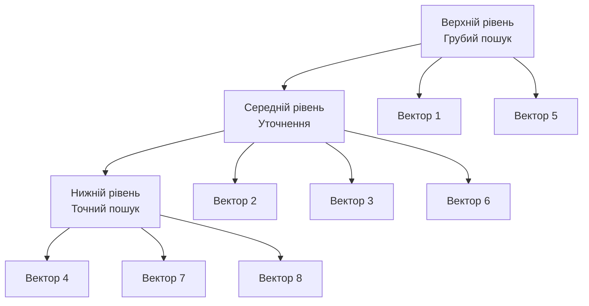
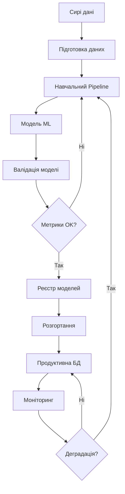

# Лекція 23. Штучний інтелект та машинне навчання у СУБД

## Вступ

Інтеграція штучного інтелекту та машинного навчання з системами управління базами даних відкриває нові можливості для обробки, аналізу та оптимізації роботи з даними. Сучасні СУБД не просто зберігають інформацію, а стають інтелектуальними платформами, здатними автоматично оптимізувати свою роботу, надавати рекомендації та обробляти складні аналітичні запити на основі технологій машинного навчання.

Ця лекція охоплює ключові напрямки застосування AI/ML у базах даних: від векторних баз для роботи з великими мовними моделями до автоматичної оптимізації продуктивності СУБД. Розглянемо також практичні застосування у вигляді рекомендаційних систем, обробки природної мови та інтеграції моделей машинного навчання з виробничими системами даних через MLOps практики.

## Векторні бази даних

### Концепція векторних представлень

Векторні бази даних спеціалізуються на зберіганні та ефективному пошуку векторних представлень даних, які називаються embedding векторами. Ці вектори отримуються шляхом перетворення складних об'єктів, таких як тексти, зображення або аудіо, в багатовимірні числові масиви, які зберігають семантичне значення оригінального об'єкту.

**Основні характеристики векторних представлень:**

Embedding вектори мають фіксовану розмірність, що залежить від використаної моделі машинного навчання. Наприклад, популярна модель OpenAI text-embedding-3-small генерує вектори розмірності 1536, тоді як деякі спеціалізовані моделі можуть створювати вектори розміром від 128 до 4096 вимірів. Кожна компонента вектора представляє певний аспект або характеристику закодованого об'єкту, хоча ці характеристики часто не мають прямої інтерпретації для людини.

Семантична близькість об'єктів відображається в геометричній близькості їхніх векторних представлень. Тексти з подібним значенням будуть мати вектори, розташовані близько один до одного у багатовимірному просторі. Це властивість робить векторні бази даних особливо корисними для семантичного пошуку, де важливе саме значення запиту, а не точне збігання ключових слів.

### Метрики подібності векторів

Для визначення близькості векторів використовуються різні метрики відстані. Вибір метрики суттєво впливає на точність пошуку та швидкість роботи системи.

**Косинусна подібність:**

Косинусна подібність вимірює кут між двома векторами у багатовимірному просторі. Значення варіюється від -1 до 1, де 1 означає однакову спрямованість векторів, 0 означає ортогональність, а -1 означає протилежну спрямованість.

```python
import numpy as np

def cosine_similarity(vector1, vector2):
    """
    Обчислює косинусну подібність між двома векторами.
    Повертає значення від -1 до 1.
    """
    dot_product = np.dot(vector1, vector2)
    norm1 = np.linalg.norm(vector1)
    norm2 = np.linalg.norm(vector2)
    return dot_product / (norm1 * norm2)

# Приклад використання
embedding1 = np.array([0.2, 0.5, 0.8, 0.1])
embedding2 = np.array([0.3, 0.4, 0.7, 0.2])

similarity = cosine_similarity(embedding1, embedding2)
print(f"Косинусна подібність: {similarity:.4f}")
```

Косинусна подібність не залежить від довжини векторів, що робить її ідеальною для порівняння текстових документів різної довжини. Вона широко використовується в векторних базах даних для семантичного пошуку.

**Евклідова відстань:**

Евклідова відстань вимірює пряму геометричну відстань між двома точками у багатовимірному просторі. На відміну від косинусної подібності, вона враховує як напрямок, так і магнітуду векторів.

```python
def euclidean_distance(vector1, vector2):
    """
    Обчислює евклідову відстань між двома векторами.
    Менше значення означає більшу подібність.
    """
    return np.linalg.norm(vector1 - vector2)

distance = euclidean_distance(embedding1, embedding2)
print(f"Евклідова відстань: {distance:.4f}")
```

Евклідова відстань чутлива до масштабу даних і часто використовується після нормалізації векторів. Вона добре працює для порівняння об'єктів однакової природи та розмірності.

**Скалярний добуток:**

Скалярний добуток або dot product враховує як кут між векторами, так і їхню довжину. Більше значення означає більшу подібність.

```python
def dot_product_similarity(vector1, vector2):
    """
    Обчислює скалярний добуток двох векторів.
    Більше значення означає більшу подібність.
    """
    return np.dot(vector1, vector2)

similarity = dot_product_similarity(embedding1, embedding2)
print(f"Скалярний добуток: {similarity:.4f}")
```

### Архітектура векторних баз даних

Сучасні векторні бази даних використовують спеціалізовані структури даних та алгоритми для ефективного зберігання та пошуку векторів у багатовимірних просторах.

**Структура зберігання:**

Векторні дані зберігаються разом з метаданими, які описують оригінальні об'єкти. Типова структура запису у векторній базі даних включає унікальний ідентифікатор, власне векторне представлення, метадані у вигляді JSON структури та додаткові атрибути для фільтрації.

```python
# Приклад структури запису у векторній БД
document = {
    "id": "doc_001",
    "embedding": [0.23, 0.45, 0.67, ...],  # 1536 вимірів
    "metadata": {
        "text": "Штучний інтелект революціонізує обробку даних",
        "source": "article",
        "author": "Іван Петров",
        "date": "2025-11-17",
        "category": "AI"
    },
    "tags": ["AI", "ML", "databases"]
}
```

**Індексні структури:**

Для швидкого пошуку близьких векторів використовуються спеціалізовані індексні структури, які дозволяють знаходити приблизних найближчих сусідів без перебору всіх векторів у базі даних.

HNSW індекс створює ієрархічний граф, де вузли представляють вектори, а ребра з'єднують близькі вектори. Пошук починається на найвищому рівні ієрархії та поступово спускається до нижніх рівнів, що забезпечує логарифмічну складність пошуку.



IVF індекс розбиває векторний простір на кластери або комірки. Під час пошуку спочатку визначається найближчий кластер, а потім виконується детальний пошук тільки всередині цього кластера, що значно зменшує кількість порівнянь.

### Практична робота з векторною базою даних

Розглянемо практичний приклад використання PostgreSQL з розширенням pgvector для роботи з векторними даними.

**Налаштування pgvector:**

```sql
-- Встановлення розширення pgvector
CREATE EXTENSION IF NOT EXISTS vector;

-- Створення таблиці для зберігання документів з embedding векторами
CREATE TABLE documents (
    id SERIAL PRIMARY KEY,
    content TEXT NOT NULL,
    embedding vector(1536),  -- Вектор розміру 1536
    metadata JSONB,
    created_at TIMESTAMP DEFAULT CURRENT_TIMESTAMP
);

-- Створення індексу для швидкого пошуку подібних векторів
CREATE INDEX ON documents USING ivfflat (embedding vector_cosine_ops)
WITH (lists = 100);
```

**Додавання документів з embedding векторами:**

```python
import psycopg2
from openai import OpenAI

# Підключення до бази даних
conn = psycopg2.connect(
    dbname="vector_db",
    user="postgres",
    password="password",
    host="localhost"
)
cursor = conn.cursor()

# Ініціалізація клієнта OpenAI
client = OpenAI()

def get_embedding(text, model="text-embedding-3-small"):
    """Отримує embedding вектор для тексту"""
    response = client.embeddings.create(
        input=text,
        model=model
    )
    return response.data[0].embedding

# Додавання документа з векторним представленням
document_text = "Векторні бази даних дозволяють ефективно шукати схожі документи"

embedding = get_embedding(document_text)

cursor.execute("""
    INSERT INTO documents (content, embedding, metadata)
    VALUES (%s, %s, %s)
""", (
    document_text,
    embedding,
    '{"category": "технології", "language": "ukrainian"}'
))

conn.commit()
```

**Семантичний пошук:**

```python
def semantic_search(query, limit=5):
    """
    Виконує семантичний пошук схожих документів.
    Повертає топ N найбільш релевантних результатів.
    """
    query_embedding = get_embedding(query)

    cursor.execute("""
        SELECT
            id,
            content,
            metadata,
            1 - (embedding <=> %s::vector) as similarity
        FROM documents
        ORDER BY embedding <=> %s::vector
        LIMIT %s
    """, (query_embedding, query_embedding, limit))

    results = cursor.fetchall()

    for doc_id, content, metadata, similarity in results:
        print(f"Схожість: {similarity:.4f}")
        print(f"Зміст: {content}")
        print(f"Метадані: {metadata}")
        print("-" * 80)

    return results

# Приклад використання
results = semantic_search(
    "Як шукати подібні текстові документи?",
    limit=3
)
```

**Гібридний пошук з фільтрацією:**

Векторні бази даних дозволяють комбінувати семантичний пошук з традиційною фільтрацією за метаданими.

```python
def hybrid_search(query, category=None, min_similarity=0.7):
    """
    Гібридний пошук: семантична подібність + фільтрація метаданих
    """
    query_embedding = get_embedding(query)

    sql = """
        SELECT
            id,
            content,
            metadata,
            1 - (embedding <=> %s::vector) as similarity
        FROM documents
        WHERE 1 - (embedding <=> %s::vector) > %s
    """
    params = [query_embedding, query_embedding, min_similarity]

    if category:
        sql += " AND metadata->>'category' = %s"
        params.append(category)

    sql += " ORDER BY embedding <=> %s::vector LIMIT 10"
    params.append(query_embedding)

    cursor.execute(sql, params)
    return cursor.fetchall()

# Пошук тільки в категорії "технології" з мінімальною схожістю 0.7
results = hybrid_search(
    "машинне навчання",
    category="технології",
    min_similarity=0.7
)
```

### Популярні векторні бази даних

**Pinecone:**

Pinecone є повністю керованою хмарною векторною базою даних, спроектованою для великомасштабних застосувань машинного навчання. Вона автоматично масштабується залежно від навантаження та надає низьку латентність при пошуку навіть у базах з мільярдами векторів.

**Weaviate:**

Weaviate поєднує векторний пошук з можливостями семантичної бази знань. Система підтримує автоматичну векторизацію даних, що означає можливість додавати текст або зображення без попереднього створення embedding векторів. Weaviate також має вбудовану підтримку GraphQL для складних запитів.

**Qdrant:**

Qdrant спеціалізується на високопродуктивному векторному пошуку з підтримкою фільтрації за метаданими. Система написана на Rust, що забезпечує високу швидкість роботи та ефективне використання ресурсів. Qdrant підтримує як хмарне розгортання, так і локальну установку.

**Milvus:**

Milvus є відкритою векторною базою даних, оптимізованою для обробки величезних обсягів векторних даних. Система підтримує розподілену архітектуру та може працювати з мільярдами векторів, забезпечуючи мілісекундну латентність пошуку.

## Автоматична оптимізація СУБД за допомогою машинного навчання

### Самоналаштовувані системи

Сучасні СУБД інтегрують технології машинного навчання для автоматичної оптимізації своєї роботи. Ці системи аналізують патерни навантаження, історію виконання запитів та характеристики даних для прийняття інтелектуальних рішень щодо оптимізації.

**Автоматична оптимізація запитів:**

Традиційні оптимізатори запитів базуються на статистиці даних та евристичних правилах. Системи з машинним навчанням можуть навчатися на історичних даних про виконання запитів для прогнозування вартості різних планів виконання.

```python
# Концептуальна модель ML оптимізатора запитів
class QueryOptimizer:
    def __init__(self):
        self.model = None  # ML модель для прогнозування вартості
        self.feature_extractor = FeatureExtractor()

    def extract_features(self, query, statistics):
        """
        Витягує характеристики запиту для ML моделі:
        - Кількість таблиць у JOIN
        - Селективність умов WHERE
        - Наявність індексів
        - Розмір таблиць
        - Кардинальність стовпців
        """
        features = {
            'num_tables': len(query.tables),
            'num_joins': len(query.joins),
            'selectivity': self.calculate_selectivity(query.where_clause),
            'table_sizes': [statistics.get_size(t) for t in query.tables],
            'available_indexes': [statistics.get_indexes(t) for t in query.tables],
            'cardinality': [statistics.get_cardinality(c) for c in query.columns]
        }
        return features

    def predict_cost(self, execution_plan):
        """
        Прогнозує вартість виконання плану запиту
        """
        features = self.extract_features(execution_plan)
        predicted_cost = self.model.predict(features)
        return predicted_cost

    def choose_best_plan(self, query):
        """
        Генерує кілька можливих планів виконання
        та вибирає найкращий на основі ML прогнозів
        """
        candidate_plans = self.generate_plans(query)

        costs = []
        for plan in candidate_plans:
            cost = self.predict_cost(plan)
            costs.append((plan, cost))

        best_plan = min(costs, key=lambda x: x[1])[0]
        return best_plan
```

**Автоматичне створення індексів:**

ML системи можуть аналізувати патерни запитів для автоматичного створення корисних індексів. Вони враховують частоту використання різних стовпців у WHERE клаузах, JOIN умовах та ORDER BY виразах.

```sql
-- PostgreSQL з автоматичним радником індексів
-- Система збирає статистику виконання запитів
CREATE EXTENSION IF NOT EXISTS pg_stat_statements;

-- Приклад запиту для аналізу повільних операцій
SELECT
    query,
    calls,
    total_time / calls as avg_time,
    rows / calls as avg_rows
FROM pg_stat_statements
WHERE calls > 100
ORDER BY avg_time DESC
LIMIT 10;
```

Інтелектуальна система може проаналізувати ці дані та запропонувати створення індексів, які найбільше покращать продуктивність.

```python
class IndexAdvisor:
    def analyze_workload(self, query_stats):
        """
        Аналізує робоче навантаження та рекомендує індекси
        """
        candidates = []

        for query in query_stats:
            if query.execution_time > threshold:
                # Аналіз запиту для виявлення потенційних індексів
                for table in query.tables:
                    for column in query.filter_columns:
                        score = self.calculate_benefit(table, column, query_stats)
                        candidates.append({
                            'table': table,
                            'column': column,
                            'score': score
                        })

        # Ранжування кандидатів з урахуванням вартості створення
        recommendations = self.rank_candidates(candidates)
        return recommendations

    def calculate_benefit(self, table, column, query_stats):
        """
        Оцінює переваги створення індексу з урахуванням:
        - Частоти використання стовпця
        - Селективності даних
        - Вартості створення індексу
        - Вартості обслуговування індексу
        """
        frequency = sum(1 for q in query_stats if column in q.columns)
        selectivity = self.estimate_selectivity(table, column)
        maintenance_cost = self.estimate_maintenance(table)

        benefit = frequency * selectivity - maintenance_cost
        return benefit
```

### Прогнозування навантаження

Машинне навчання дозволяє СУБД передбачати майбутнє навантаження та проактивно готуватися до нього.

**Прогнозування пікових навантажень:**

```python
import pandas as pd
from sklearn.ensemble import RandomForestRegressor

class LoadPredictor:
    def __init__(self):
        self.model = RandomForestRegressor(n_estimators=100)

    def prepare_features(self, historical_data):
        """
        Підготовка ознак для прогнозування навантаження:
        - Час доби
        - День тижня
        - Сезонні патерни
        - Спеціальні події
        """
        df = pd.DataFrame(historical_data)
        df['hour'] = df['timestamp'].dt.hour
        df['day_of_week'] = df['timestamp'].dt.dayofweek
        df['is_weekend'] = df['day_of_week'].isin([5, 6])
        df['month'] = df['timestamp'].dt.month

        return df

    def train(self, historical_data):
        """
        Навчання моделі на історичних даних
        """
        df = self.prepare_features(historical_data)
        X = df[['hour', 'day_of_week', 'is_weekend', 'month']]
        y = df['connection_count']

        self.model.fit(X, y)

    def predict_load(self, timestamp):
        """
        Прогнозує навантаження для заданого часу
        """
        features = self.extract_time_features(timestamp)
        predicted_load = self.model.predict([features])
        return predicted_load[0]

    def recommend_scaling(self, predictions):
        """
        Рекомендує зміни в конфігурації на основі прогнозів
        """
        recommendations = []

        for time, load in predictions:
            if load > self.high_threshold:
                recommendations.append({
                    'time': time,
                    'action': 'scale_up',
                    'expected_load': load
                })
            elif load < self.low_threshold:
                recommendations.append({
                    'time': time,
                    'action': 'scale_down',
                    'expected_load': load
                })

        return recommendations
```

### Детекція аномалій

ML системи можуть автоматично виявляти аномальну поведінку СУБД, що може вказувати на проблеми з продуктивністю або безпекою.

```python
from sklearn.ensemble import IsolationForest

class AnomalyDetector:
    def __init__(self):
        self.model = IsolationForest(contamination=0.1)

    def extract_metrics(self, system_state):
        """
        Витягує метрики для аналізу:
        - Використання CPU та пам'яті
        - Кількість активних з'єднань
        - Швидкість виконання запитів
        - I/O операції
        """
        return {
            'cpu_usage': system_state.cpu_percent,
            'memory_usage': system_state.memory_percent,
            'active_connections': system_state.connection_count,
            'query_latency': system_state.avg_query_time,
            'io_wait': system_state.io_wait_time
        }

    def detect_anomalies(self, current_metrics, historical_metrics):
        """
        Виявляє аномалії в поточних метриках
        """
        self.model.fit(historical_metrics)

        prediction = self.model.predict([current_metrics])

        if prediction[0] == -1:
            # Виявлено аномалію
            anomaly_score = self.model.score_samples([current_metrics])[0]

            return {
                'is_anomaly': True,
                'severity': self.calculate_severity(anomaly_score),
                'affected_metrics': self.identify_anomalous_metrics(current_metrics)
            }

        return {'is_anomaly': False}
```

## Рекомендаційні системи на основі даних

### Архітектура рекомендаційних систем

Рекомендаційні системи використовують дані про взаємодію користувачів з елементами для генерування персоналізованих рекомендацій. Ці системи тісно інтегровані з базами даних, які зберігають історію взаємодій, характеристики користувачів та елементів.

**Структура даних для рекомендацій:**

```sql
-- Таблиця користувачів
CREATE TABLE users (
    user_id BIGSERIAL PRIMARY KEY,
    username VARCHAR(100) UNIQUE NOT NULL,
    created_at TIMESTAMP DEFAULT CURRENT_TIMESTAMP,
    preferences JSONB,
    demographic_data JSONB
);

-- Таблиця елементів для рекомендації
CREATE TABLE items (
    item_id BIGSERIAL PRIMARY KEY,
    title VARCHAR(255) NOT NULL,
    description TEXT,
    category VARCHAR(100),
    features JSONB,
    embedding vector(512)
);

-- Таблиця взаємодій
CREATE TABLE interactions (
    interaction_id BIGSERIAL PRIMARY KEY,
    user_id BIGINT REFERENCES users(user_id),
    item_id BIGINT REFERENCES items(item_id),
    interaction_type VARCHAR(50),  -- view, click, purchase, rating
    interaction_value DECIMAL(3,2),  -- для рейтингів
    timestamp TIMESTAMP DEFAULT CURRENT_TIMESTAMP,
    context JSONB
);

-- Індекси для швидкого пошуку
CREATE INDEX idx_interactions_user ON interactions(user_id, timestamp DESC);
CREATE INDEX idx_interactions_item ON interactions(item_id, timestamp DESC);
CREATE INDEX idx_items_embedding ON items USING ivfflat (embedding vector_cosine_ops);
```

### Колаборативна фільтрація

Колаборативна фільтрація базується на припущенні, що користувачі з подібними вподобаннями в минулому матимуть подібні вподобання в майбутньому.

**User-based колаборативна фільтрація:**

```python
class CollaborativeFiltering:
    def __init__(self, db_connection):
        self.conn = db_connection

    def find_similar_users(self, user_id, limit=10):
        """
        Знаходить користувачів з подібними вподобаннями
        """
        query = """
        WITH user_items AS (
            SELECT item_id, interaction_value
            FROM interactions
            WHERE user_id = %s AND interaction_type = 'rating'
        ),
        other_users AS (
            SELECT
                i.user_id,
                CORR(i.interaction_value, ui.interaction_value) as similarity
            FROM interactions i
            JOIN user_items ui ON i.item_id = ui.item_id
            WHERE i.user_id != %s
                AND i.interaction_type = 'rating'
            GROUP BY i.user_id
            HAVING COUNT(*) >= 5  -- мінімум 5 спільних оцінок
        )
        SELECT user_id, similarity
        FROM other_users
        WHERE similarity > 0.5
        ORDER BY similarity DESC
        LIMIT %s
        """

        cursor = self.conn.cursor()
        cursor.execute(query, (user_id, user_id, limit))
        return cursor.fetchall()

    def recommend_items(self, user_id, limit=10):
        """
        Рекомендує елементи на основі вподобань схожих користувачів
        """
        similar_users = self.find_similar_users(user_id)

        query = """
        SELECT
            i.item_id,
            it.title,
            AVG(i.interaction_value * %s) as predicted_rating
        FROM interactions i
        JOIN items it ON i.item_id = it.item_id
        WHERE i.user_id = ANY(%s)
            AND i.item_id NOT IN (
                SELECT item_id
                FROM interactions
                WHERE user_id = %s
            )
        GROUP BY i.item_id, it.title
        ORDER BY predicted_rating DESC
        LIMIT %s
        """

        user_ids = [u[0] for u in similar_users]
        similarities = [u[1] for u in similar_users]

        cursor = self.conn.cursor()
        cursor.execute(query, (similarities, user_ids, user_id, limit))
        return cursor.fetchall()
```

**Item-based колаборативна фільтрація:**

```python
def find_similar_items(self, item_id, limit=10):
    """
    Знаходить схожі елементи на основі патернів оцінок користувачів
    """
    query = """
    WITH item_users AS (
        SELECT user_id, interaction_value
        FROM interactions
        WHERE item_id = %s AND interaction_type = 'rating'
    ),
    similar_items AS (
        SELECT
            i.item_id,
            CORR(i.interaction_value, iu.interaction_value) as similarity
        FROM interactions i
        JOIN item_users iu ON i.user_id = iu.user_id
        WHERE i.item_id != %s
            AND i.interaction_type = 'rating'
        GROUP BY i.item_id
        HAVING COUNT(*) >= 5
    )
    SELECT
        si.item_id,
        it.title,
        si.similarity
    FROM similar_items si
    JOIN items it ON si.item_id = it.item_id
    WHERE si.similarity > 0.5
    ORDER BY si.similarity DESC
    LIMIT %s
    """

    cursor = self.conn.cursor()
    cursor.execute(query, (item_id, item_id, limit))
    return cursor.fetchall()
```

### Content-based фільтрація

Content-based підхід рекомендує елементи на основі подібності їхніх характеристик до елементів, які користувач оцінив позитивно.

```python
class ContentBasedRecommender:
    def __init__(self, db_connection):
        self.conn = db_connection

    def get_user_profile(self, user_id):
        """
        Створює профіль користувача на основі його позитивних взаємодій
        """
        query = """
        SELECT
            it.embedding,
            i.interaction_value
        FROM interactions i
        JOIN items it ON i.item_id = it.item_id
        WHERE i.user_id = %s
            AND i.interaction_value >= 4.0
        """

        cursor = self.conn.cursor()
        cursor.execute(query, (user_id,))

        embeddings = []
        weights = []

        for embedding, rating in cursor.fetchall():
            embeddings.append(embedding)
            weights.append(rating / 5.0)

        # Зважене середнє embedding векторів
        user_profile = np.average(embeddings, axis=0, weights=weights)
        return user_profile

    def recommend_similar_items(self, user_id, limit=10):
        """
        Рекомендує елементи, схожі на профіль користувача
        """
        user_profile = self.get_user_profile(user_id)

        query = """
        SELECT
            item_id,
            title,
            1 - (embedding <=> %s::vector) as similarity
        FROM items
        WHERE item_id NOT IN (
            SELECT item_id
            FROM interactions
            WHERE user_id = %s
        )
        ORDER BY embedding <=> %s::vector
        LIMIT %s
        """

        cursor = self.conn.cursor()
        cursor.execute(query, (user_profile, user_id, user_profile, limit))
        return cursor.fetchall()
```

### Гібридні рекомендаційні системи

Гібридні системи комбінують кілька підходів для отримання кращих результатів.

```python
class HybridRecommender:
    def __init__(self, db_connection):
        self.collaborative = CollaborativeFiltering(db_connection)
        self.content_based = ContentBasedRecommender(db_connection)

    def get_recommendations(self, user_id, limit=10):
        """
        Генерує гібридні рекомендації, комбінуючи різні підходи
        """
        # Отримуємо рекомендації з різних джерел
        collab_recs = self.collaborative.recommend_items(user_id, limit=20)
        content_recs = self.content_based.recommend_similar_items(user_id, limit=20)

        # Комбінуємо результати з вагами
        combined = {}

        for item_id, title, score in collab_recs:
            combined[item_id] = {
                'title': title,
                'score': score * 0.6  # вага 60% для колаборативної фільтрації
            }

        for item_id, title, score in content_recs:
            if item_id in combined:
                combined[item_id]['score'] += score * 0.4
            else:
                combined[item_id] = {
                    'title': title,
                    'score': score * 0.4
                }

        # Сортуємо за комбінованим скором
        recommendations = sorted(
            combined.items(),
            key=lambda x: x[1]['score'],
            reverse=True
        )[:limit]

        return recommendations
```

## Обробка природної мови та чат-боти з базами знань

### Архітектура NLP систем на базі даних

Сучасні системи обробки природної мови інтегруються з базами даних для створення інтелектуальних чат-ботів та систем відповідей на запитання.

**Структура бази знань:**

```sql
-- Таблиця документів бази знань
CREATE TABLE knowledge_base (
    doc_id BIGSERIAL PRIMARY KEY,
    title VARCHAR(500) NOT NULL,
    content TEXT NOT NULL,
    category VARCHAR(100),
    tags TEXT[],
    embedding vector(1536),
    metadata JSONB,
    created_at TIMESTAMP DEFAULT CURRENT_TIMESTAMP,
    updated_at TIMESTAMP DEFAULT CURRENT_TIMESTAMP
);

-- Таблиця для зберігання історії діалогів
CREATE TABLE conversations (
    conversation_id BIGSERIAL PRIMARY KEY,
    user_id BIGINT,
    started_at TIMESTAMP DEFAULT CURRENT_TIMESTAMP,
    context JSONB
);

CREATE TABLE messages (
    message_id BIGSERIAL PRIMARY KEY,
    conversation_id BIGINT REFERENCES conversations(conversation_id),
    role VARCHAR(20),  -- 'user' або 'assistant'
    content TEXT NOT NULL,
    embedding vector(1536),
    timestamp TIMESTAMP DEFAULT CURRENT_TIMESTAMP
);

-- Індекси для швидкого семантичного пошуку
CREATE INDEX idx_kb_embedding ON knowledge_base
USING ivfflat (embedding vector_cosine_ops);

CREATE INDEX idx_messages_embedding ON messages
USING ivfflat (embedding vector_cosine_ops);
```

### Retrieval Augmented Generation (RAG)

RAG є підходом, який комбінує пошук релевантної інформації в базі знань з генерацією відповідей через великі мовні моделі.

```python
from openai import OpenAI
import psycopg2

class RAGChatbot:
    def __init__(self, db_connection):
        self.conn = db_connection
        self.client = OpenAI()

    def get_embedding(self, text):
        """Генерує embedding вектор для тексту"""
        response = self.client.embeddings.create(
            input=text,
            model="text-embedding-3-small"
        )
        return response.data[0].embedding

    def retrieve_relevant_documents(self, query, limit=5):
        """
        Шукає релевантні документи в базі знань
        """
        query_embedding = self.get_embedding(query)

        cursor = self.conn.cursor()
        cursor.execute("""
            SELECT
                doc_id,
                title,
                content,
                1 - (embedding <=> %s::vector) as similarity
            FROM knowledge_base
            WHERE 1 - (embedding <=> %s::vector) > 0.7
            ORDER BY embedding <=> %s::vector
            LIMIT %s
        """, (query_embedding, query_embedding, query_embedding, limit))

        return cursor.fetchall()

    def generate_response(self, user_query, conversation_id=None):
        """
        Генерує відповідь на основі запиту користувача та бази знань
        """
        # Пошук релевантних документів
        relevant_docs = self.retrieve_relevant_documents(user_query)

        # Формування контексту з релевантних документів
        context = "\n\n".join([
            f"Документ {i+1}: {doc[2]}"  # content
            for i, doc in enumerate(relevant_docs)
        ])

        # Отримання історії розмови якщо є
        conversation_history = []
        if conversation_id:
            conversation_history = self.get_conversation_history(conversation_id)

        # Формування промпту для LLM
        messages = [
            {
                "role": "system",
                "content": f"""Ти є помічником, який відповідає на запитання
на основі наданого контексту з бази знань. Якщо відповідь не знаходиться
в контексті, чесно скажи про це.

Контекст з бази знань:
{context}"""
            }
        ]

        # Додаємо історію розмови
        messages.extend(conversation_history)

        # Додаємо поточний запит користувача
        messages.append({
            "role": "user",
            "content": user_query
        })

        # Генерація відповіді через GPT
        response = self.client.chat.completions.create(
            model="gpt-4",
            messages=messages,
            temperature=0.7
        )

        assistant_response = response.choices[0].message.content

        # Зберігаємо повідомлення в БД
        self.save_message(conversation_id, "user", user_query)
        self.save_message(conversation_id, "assistant", assistant_response)

        return {
            'response': assistant_response,
            'sources': [doc[1] for doc in relevant_docs]  # titles
        }

    def get_conversation_history(self, conversation_id, limit=10):
        """
        Отримує останні N повідомлень з розмови
        """
        cursor = self.conn.cursor()
        cursor.execute("""
            SELECT role, content
            FROM messages
            WHERE conversation_id = %s
            ORDER BY timestamp DESC
            LIMIT %s
        """, (conversation_id, limit))

        messages = cursor.fetchall()
        return [
            {"role": role, "content": content}
            for role, content in reversed(messages)
        ]

    def save_message(self, conversation_id, role, content):
        """
        Зберігає повідомлення в базі даних
        """
        embedding = self.get_embedding(content)

        cursor = self.conn.cursor()
        cursor.execute("""
            INSERT INTO messages (conversation_id, role, content, embedding)
            VALUES (%s, %s, %s, %s)
        """, (conversation_id, role, content, embedding))

        self.conn.commit()
```

### Інтелектуальний пошук у базі знань

```python
class IntelligentSearch:
    def __init__(self, db_connection):
        self.conn = db_connection
        self.client = OpenAI()

    def hybrid_search(self, query, limit=10):
        """
        Комбінує семантичний та ключовий пошук
        """
        # Семантичний пошук через embedding
        query_embedding = self.get_embedding(query)

        cursor = self.conn.cursor()
        cursor.execute("""
            WITH semantic_search AS (
                SELECT
                    doc_id,
                    title,
                    content,
                    1 - (embedding <=> %s::vector) as semantic_score
                FROM knowledge_base
                ORDER BY embedding <=> %s::vector
                LIMIT 20
            ),
            keyword_search AS (
                SELECT
                    doc_id,
                    title,
                    content,
                    ts_rank(to_tsvector('ukrainian', content),
                            plainto_tsquery('ukrainian', %s)) as keyword_score
                FROM knowledge_base
                WHERE to_tsvector('ukrainian', content) @@
                      plainto_tsquery('ukrainian', %s)
                LIMIT 20
            )
            SELECT
                COALESCE(ss.doc_id, ks.doc_id) as doc_id,
                COALESCE(ss.title, ks.title) as title,
                COALESCE(ss.content, ks.content) as content,
                COALESCE(ss.semantic_score, 0) * 0.7 +
                COALESCE(ks.keyword_score, 0) * 0.3 as combined_score
            FROM semantic_search ss
            FULL OUTER JOIN keyword_search ks ON ss.doc_id = ks.doc_id
            ORDER BY combined_score DESC
            LIMIT %s
        """, (query_embedding, query_embedding, query, query, limit))

        return cursor.fetchall()
```

### Автоматичне поповнення бази знань

```python
class KnowledgeBaseManager:
    def __init__(self, db_connection):
        self.conn = db_connection
        self.client = OpenAI()

    def add_document(self, title, content, category=None, tags=None):
        """
        Додає документ до бази знань з автоматичною векторизацією
        """
        # Генеруємо embedding для документа
        embedding = self.get_embedding(content)

        # Автоматичне витягування метаданих через LLM
        metadata = self.extract_metadata(content)

        cursor = self.conn.cursor()
        cursor.execute("""
            INSERT INTO knowledge_base
            (title, content, category, tags, embedding, metadata)
            VALUES (%s, %s, %s, %s, %s, %s)
            RETURNING doc_id
        """, (title, content, category, tags, embedding, metadata))

        doc_id = cursor.fetchone()[0]
        self.conn.commit()

        return doc_id

    def extract_metadata(self, content):
        """
        Використовує LLM для витягування метаданих з документа
        """
        response = self.client.chat.completions.create(
            model="gpt-4",
            messages=[{
                "role": "system",
                "content": """Проаналізуй текст та витягни ключові метадані
у форматі JSON: topics (список тем), entities (важливі сутності),
summary (короткий опис), language."""
            }, {
                "role": "user",
                "content": content[:4000]  # обмежуємо довжину
            }],
            response_format={"type": "json_object"}
        )

        return response.choices[0].message.content
```

## MLOps: інтеграція моделей машинного навчання з системами даних

### Архітектура MLOps для баз даних

MLOps забезпечує надійну інтеграцію моделей машинного навчання з виробничими системами даних, включаючи версіонування моделей, моніторинг продуктивності та автоматичне перенавчання.



**Структура для MLOps:**

```sql
-- Таблиця версій моделей
CREATE TABLE ml_models (
    model_id BIGSERIAL PRIMARY KEY,
    model_name VARCHAR(100) NOT NULL,
    version VARCHAR(50) NOT NULL,
    model_type VARCHAR(50),  -- classification, regression, embedding
    framework VARCHAR(50),  -- tensorflow, pytorch, sklearn
    model_path TEXT,  -- шлях до збереженої моделі
    training_data_version VARCHAR(50),
    hyperparameters JSONB,
    metrics JSONB,
    created_at TIMESTAMP DEFAULT CURRENT_TIMESTAMP,
    created_by VARCHAR(100),
    status VARCHAR(20)  -- training, validation, production, archived
);

-- Таблиця для моніторингу продуктивності моделей
CREATE TABLE model_predictions (
    prediction_id BIGSERIAL PRIMARY KEY,
    model_id BIGINT REFERENCES ml_models(model_id),
    input_data JSONB,
    prediction JSONB,
    confidence DECIMAL(5,4),
    actual_value JSONB,  -- для обчислення точності пізніше
    prediction_time TIMESTAMP DEFAULT CURRENT_TIMESTAMP,
    inference_latency_ms INTEGER
);

-- Таблиця метрик продуктивності
CREATE TABLE model_metrics (
    metric_id BIGSERIAL PRIMARY KEY,
    model_id BIGINT REFERENCES ml_models(model_id),
    metric_name VARCHAR(50),
    metric_value DECIMAL(10,6),
    computed_at TIMESTAMP DEFAULT CURRENT_TIMESTAMP,
    data_window_start TIMESTAMP,
    data_window_end TIMESTAMP
);
```

### Feature Store інтеграція

Feature Store централізує управління ознаками для машинного навчання, забезпечуючи консистентність між навчанням та інференсом.

```sql
-- Таблиця ознак для ML моделей
CREATE TABLE feature_store (
    feature_id BIGSERIAL PRIMARY KEY,
    entity_id VARCHAR(100) NOT NULL,  -- користувач, продукт тощо
    feature_name VARCHAR(100) NOT NULL,
    feature_value JSONB NOT NULL,
    feature_version VARCHAR(50),
    computed_at TIMESTAMP DEFAULT CURRENT_TIMESTAMP,
    ttl INTERVAL,  -- час життя ознаки
    INDEX idx_entity_feature (entity_id, feature_name, computed_at)
);

-- Матеріалізоване представлення для швидкого доступу
CREATE MATERIALIZED VIEW user_features AS
SELECT
    user_id,
    MAX(CASE WHEN feature_name = 'total_purchases'
        THEN (feature_value->>'value')::NUMERIC END) as total_purchases,
    MAX(CASE WHEN feature_name = 'avg_order_value'
        THEN (feature_value->>'value')::NUMERIC END) as avg_order_value,
    MAX(CASE WHEN feature_name = 'days_since_last_purchase'
        THEN (feature_value->>'value')::INTEGER END) as days_since_last_purchase
FROM feature_store
WHERE entity_type = 'user'
    AND computed_at > NOW() - INTERVAL '7 days'
GROUP BY user_id;

CREATE INDEX idx_user_features ON user_features(user_id);
```

**Python клас для роботи з Feature Store:**

```python
class FeatureStore:
    def __init__(self, db_connection):
        self.conn = db_connection

    def compute_user_features(self, user_id):
        """
        Обчислює ознаки користувача на основі історичних даних
        """
        cursor = self.conn.cursor()

        # Обчислення різних ознак
        features = {
            'total_purchases': self.compute_total_purchases(user_id),
            'avg_order_value': self.compute_avg_order_value(user_id),
            'days_since_last_purchase': self.compute_days_since_last(user_id),
            'favorite_category': self.compute_favorite_category(user_id),
            'lifetime_value': self.compute_lifetime_value(user_id)
        }

        # Зберігання ознак
        for feature_name, feature_value in features.items():
            cursor.execute("""
                INSERT INTO feature_store
                (entity_id, feature_name, feature_value, feature_version)
                VALUES (%s, %s, %s, %s)
            """, (
                f"user_{user_id}",
                feature_name,
                {'value': feature_value, 'type': type(feature_value).__name__},
                'v1.0'
            ))

        self.conn.commit()
        return features

    def get_features(self, entity_id, feature_names):
        """
        Отримує набір ознак для сутності
        """
        cursor = self.conn.cursor()
        cursor.execute("""
            SELECT feature_name, feature_value
            FROM feature_store
            WHERE entity_id = %s
                AND feature_name = ANY(%s)
                AND computed_at = (
                    SELECT MAX(computed_at)
                    FROM feature_store
                    WHERE entity_id = %s
                        AND feature_name = feature_store.feature_name
                )
        """, (entity_id, feature_names, entity_id))

        features = {}
        for name, value in cursor.fetchall():
            features[name] = value['value']

        return features
```

### Моніторинг продуктивності моделей

```python
class ModelMonitor:
    def __init__(self, db_connection):
        self.conn = db_connection

    def log_prediction(self, model_id, input_data, prediction,
                      confidence, latency_ms):
        """
        Логує прогноз моделі для подальшого аналізу
        """
        cursor = self.conn.cursor()
        cursor.execute("""
            INSERT INTO model_predictions
            (model_id, input_data, prediction, confidence, inference_latency_ms)
            VALUES (%s, %s, %s, %s, %s)
        """, (model_id, input_data, prediction, confidence, latency_ms))

        self.conn.commit()

    def compute_model_metrics(self, model_id, time_window_hours=24):
        """
        Обчислює метрики продуктивності моделі за певний період
        """
        cursor = self.conn.cursor()

        # Обчислення різних метрик
        cursor.execute("""
            WITH recent_predictions AS (
                SELECT *
                FROM model_predictions
                WHERE model_id = %s
                    AND prediction_time > NOW() - INTERVAL '%s hours'
                    AND actual_value IS NOT NULL
            )
            SELECT
                COUNT(*) as total_predictions,
                AVG(inference_latency_ms) as avg_latency,
                PERCENTILE_CONT(0.95) WITHIN GROUP (ORDER BY inference_latency_ms)
                    as p95_latency,
                AVG(CASE
                    WHEN (prediction->>'value')::NUMERIC =
                         (actual_value->>'value')::NUMERIC
                    THEN 1 ELSE 0
                END) as accuracy
            FROM recent_predictions
        """, (model_id, time_window_hours))

        metrics = cursor.fetchone()

        # Зберігання метрик
        cursor.execute("""
            INSERT INTO model_metrics
            (model_id, metric_name, metric_value,
             data_window_start, data_window_end)
            VALUES
                (%s, 'accuracy', %s, NOW() - INTERVAL '%s hours', NOW()),
                (%s, 'avg_latency', %s, NOW() - INTERVAL '%s hours', NOW()),
                (%s, 'p95_latency', %s, NOW() - INTERVAL '%s hours', NOW())
        """, (
            model_id, metrics[3], time_window_hours,
            model_id, metrics[1], time_window_hours,
            model_id, metrics[2], time_window_hours
        ))

        self.conn.commit()
        return metrics

    def detect_model_drift(self, model_id):
        """
        Виявляє деградацію моделі порівняно з базовими метриками
        """
        cursor = self.conn.cursor()

        # Отримуємо поточні та базові метрики
        cursor.execute("""
            SELECT
                current.metric_value as current_value,
                baseline.metric_value as baseline_value,
                current.metric_name
            FROM (
                SELECT metric_name, metric_value
                FROM model_metrics
                WHERE model_id = %s
                    AND computed_at > NOW() - INTERVAL '24 hours'
                ORDER BY computed_at DESC
                LIMIT 1
            ) current
            JOIN (
                SELECT metric_name, AVG(metric_value) as metric_value
                FROM model_metrics
                WHERE model_id = %s
                    AND computed_at BETWEEN NOW() - INTERVAL '30 days'
                                       AND NOW() - INTERVAL '7 days'
                GROUP BY metric_name
            ) baseline ON current.metric_name = baseline.metric_name
        """, (model_id, model_id))

        drift_detected = False
        alerts = []

        for current, baseline, metric_name in cursor.fetchall():
            if metric_name == 'accuracy':
                if current < baseline * 0.95:  # 5% деградація
                    drift_detected = True
                    alerts.append({
                        'metric': metric_name,
                        'current': current,
                        'baseline': baseline,
                        'degradation': (baseline - current) / baseline
                    })

        return {'drift_detected': drift_detected, 'alerts': alerts}
```

### Автоматичне перенавчання

```python
class AutoRetraining:
    def __init__(self, db_connection):
        self.conn = db_connection
        self.monitor = ModelMonitor(db_connection)

    def should_retrain(self, model_id):
        """
        Визначає чи потрібно перенавчити модель
        """
        drift = self.monitor.detect_model_drift(model_id)

        if drift['drift_detected']:
            return True, "Model performance degradation detected"

        cursor = self.conn.cursor()
        cursor.execute("""
            SELECT
                COUNT(*) as new_samples,
                MAX(prediction_time) as last_prediction
            FROM model_predictions
            WHERE model_id = %s
                AND prediction_time > (
                    SELECT created_at
                    FROM ml_models
                    WHERE model_id = %s
                )
        """, (model_id, model_id))

        new_samples, last_pred = cursor.fetchone()

        if new_samples > 10000:
            return True, "Sufficient new training data available"

        return False, "No retraining needed"

    def trigger_retraining(self, model_id):
        """
        Запускає процес перенавчання моделі
        """
        should_retrain, reason = self.should_retrain(model_id)

        if should_retrain:
            cursor = self.conn.cursor()

            # Отримуємо нові дані для навчання
            cursor.execute("""
                SELECT input_data, actual_value
                FROM model_predictions
                WHERE model_id = %s
                    AND actual_value IS NOT NULL
                    AND prediction_time > (
                        SELECT created_at
                        FROM ml_models
                        WHERE model_id = %s
                    )
            """, (model_id, model_id))

            training_data = cursor.fetchall()

            # Тут буде код навчання нової версії моделі
            new_model_version = self.train_new_version(training_data)

            # Реєстрація нової версії моделі
            cursor.execute("""
                INSERT INTO ml_models
                (model_name, version, model_type, framework,
                 model_path, training_data_version, status)
                SELECT
                    model_name,
                    'v' || (CAST(SUBSTRING(version FROM 2) AS INTEGER) + 1),
                    model_type,
                    framework,
                    %s,
                    %s,
                    'validation'
                FROM ml_models
                WHERE model_id = %s
                RETURNING model_id
            """, (
                new_model_version['path'],
                new_model_version['data_version'],
                model_id
            ))

            new_model_id = cursor.fetchone()[0]
            self.conn.commit()

            return {
                'retrained': True,
                'reason': reason,
                'new_model_id': new_model_id
            }

        return {'retrained': False, 'reason': reason}
```

## Висновки

Інтеграція штучного інтелекту та машинного навчання з системами управління базами даних відкриває нові можливості для створення інтелектуальних застосунків. Векторні бази даних забезпечують ефективне зберігання та пошук семантичних представлень даних, що є критично важливим для роботи з великими мовними моделями та системами обробки природної мови.

Автоматична оптимізація СУБД за допомогою машинного навчання дозволяє системам самостійно адаптуватися до змін у навантаженні, автоматично створювати корисні індекси та виявляти аномалії в роботі. Це значно зменшує потребу в ручному налаштуванні та підвищує загальну продуктивність систем.

Рекомендаційні системи демонструють практичне застосування інтеграції ML та баз даних, комбінуючи різні підходи для надання персоналізованих рекомендацій користувачам. Гібридні методи, які поєднують колаборативну фільтрацію та content-based підходи, забезпечують найкращі результати.

Системи обробки природної мови на основі RAG архітектури дозволяють створювати інтелектуальні чат-боти з доступом до баз знань, які можуть надавати точні відповіді на основі актуальної інформації з організаційних даних.

MLOps практики забезпечують надійну інтеграцію моделей машинного навчання з виробничими системами даних, включаючи версіонування моделей, моніторинг продуктивності та автоматичне перенавчання при виявленні деградації точності.

Розуміння цих технологій є критично важливим для сучасних спеціалістів з баз даних, оскільки межа між традиційними СУБД та системами машинного навчання продовжує стиратися, створюючи нові можливості для інтелектуальної обробки та аналізу даних.
