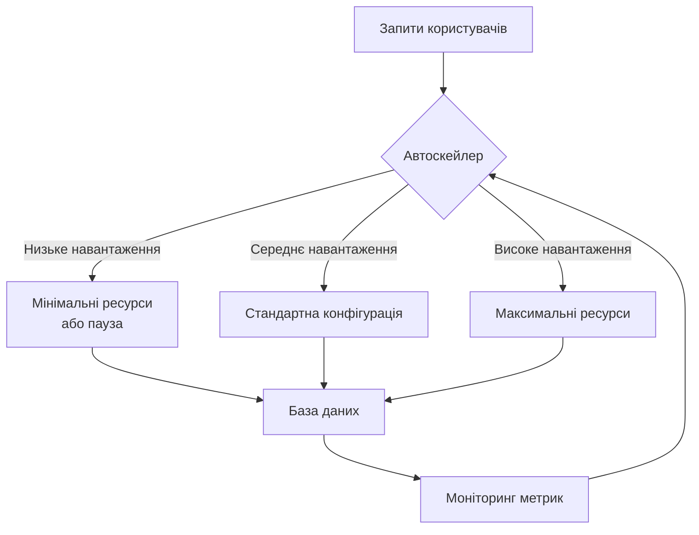
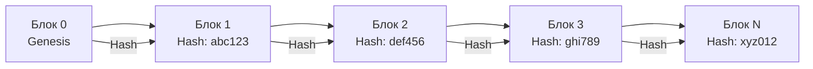
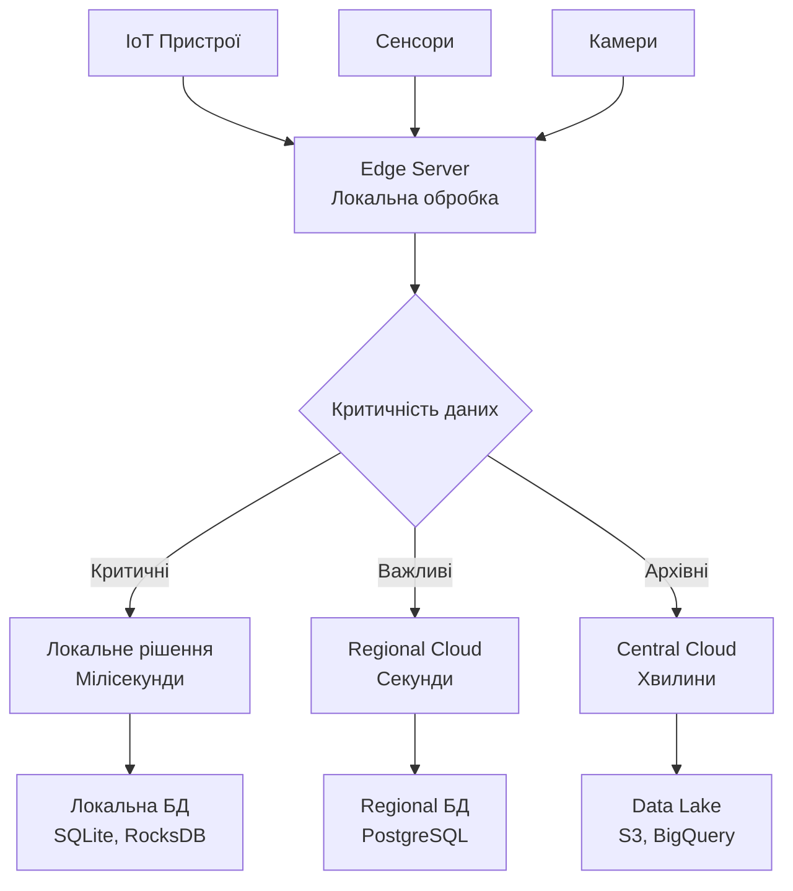

# Лекція 24. Перспективи розвитку технологій баз даних

## Вступ

Технології баз даних продовжують швидко еволюціонувати, адаптуючись до нових вимог сучасних застосунків та інфраструктури. Від serverless архітектур до потенційного впливу квантових обчислень, від блокчейн технологій до розподілених даних на периферії мережі, ландшафт баз даних трансформується фундаментальним чином.

Ця лекція розглядає ключові тренди та технології, які формуватимуть майбутнє систем управління даними. Ми проаналізуємо serverless бази даних та їхні економічні переваги, дослідимо потенційний вплив квантових обчислень на обробку даних, вивчимо децентралізовані підходи на основі блокчейн технологій, розглянемо edge computing для роботи з розподіленими даними на периферії мережі, та обговоримо професійні компетенції, які будуть необхідні фахівцям з баз даних у майбутньому.

## Serverless бази даних

### Концепція serverless архітектури

Serverless підхід до баз даних представляє парадигму, в якій розробники не управляють інфраструктурою серверів безпосередньо. Замість цього хмарний провайдер автоматично розподіляє ресурси на основі фактичного навантаження, масштабуючи їх від нуля до будь-якої необхідної потужності.

Основна ідея serverless полягає в тому, що база даних повністю керується провайдером, включаючи масштабування, резервне копіювання, патчі безпеки та оптимізацію продуктивності. Розробники працюють лише з інтерфейсами доступу до даних, не турбуючись про базову інфраструктуру.

**Ключові характеристики serverless БД:**

Автоматичне масштабування є фундаментальною характеристикою serverless баз даних. Система автоматично збільшує або зменшує обчислювальні ресурси залежно від поточного навантаження. Якщо база даних не використовується, вона може автоматично призупинятися, зменшуючи витрати до нуля за обчислювальні ресурси.



Модель оплати за використання означає, що клієнти платять тільки за фактично спожиті ресурси. Це включає обчислювальний час, об'єм зберігання даних та кількість операцій введення-виведення. Коли база даних призупинена, плата стягується тільки за зберігання даних.

### Популярні serverless платформи

**AWS Aurora Serverless:**

Amazon Aurora Serverless є реляційною базою даних, сумісною з MySQL та PostgreSQL, яка автоматично запускається, зупиняється та масштабується відповідно до потреб застосунку.

```python
import boto3

# Створення Aurora Serverless кластера через AWS SDK
rds = boto3.client('rds')

response = rds.create_db_cluster(
    DBClusterIdentifier='my-serverless-cluster',
    Engine='aurora-postgresql',
    EngineMode='serverless',
    MasterUsername='admin',
    MasterUserPassword='SecurePassword123!',
    ScalingConfiguration={
        'MinCapacity': 2,  # Мінімальні ACU (Aurora Capacity Units)
        'MaxCapacity': 16,  # Максимальні ACU
        'AutoPause': True,
        'SecondsUntilAutoPause': 300  # Пауза після 5 хв неактивності
    }
)
```

Aurora Serverless використовує концепцію ACU, де одна одиниця представляє певну кількість процесорних та пам'яті ресурсів. Система автоматично додає або видаляє ACU залежно від навантаження.

**PlanetScale:**

PlanetScale базується на Vitess, системі горизонтального масштабування MySQL, розробленій у YouTube. Платформа надає serverless MySQL базу даних з можливостями Git-подібного версіонування схеми.

```sql
-- Створення гілки схеми для розробки нових функцій
-- PlanetScale CLI команди
pscale branch create my-database feature-new-tables

-- Підключення до гілки розробки
pscale connect my-database feature-new-tables

-- Після перевірки змін, створення Deploy Request
pscale deploy-request create my-database feature-new-tables
```

**Neon:**

Neon надає serverless PostgreSQL з унікальною архітектурою, яка відокремлює зберігання від обчислень. Це дозволяє миттєво створювати копії баз даних без дублювання даних.

```javascript
// Підключення до Neon serverless PostgreSQL
const { Client } = require('pg');

const client = new Client({
    connectionString: process.env.DATABASE_URL,
    ssl: { rejectUnauthorized: false }
});

await client.connect();

// Виконання запиту - база автоматично активується
const result = await client.query('SELECT NOW()');

// База автоматично призупиниться після періоду неактивності
```

### Економічні переваги serverless

Serverless бази даних пропонують значні економічні переваги, особливо для застосунків з непередбачуваним або змінним навантаженням.

**Аналіз вартості традиційної vs serverless БД:**

Розглянемо типовий сценарій вебзастосунку з нерівномірним навантаженням протягом доби.

```python
# Калькулятор вартості для порівняння підходів
class CostComparator:
    def __init__(self):
        # Припустимі ціни (умовні одиниці на годину)
        self.traditional_db_hourly = 0.50  # EC2 + RDS
        self.serverless_active_hourly = 0.60
        self.serverless_storage_gb_month = 0.10

    def calculate_traditional_cost(self, hours_per_month=730):
        """
        Традиційна БД працює 24/7 незалежно від навантаження
        """
        compute_cost = self.traditional_db_hourly * hours_per_month
        return {
            'compute': compute_cost,
            'total': compute_cost
        }

    def calculate_serverless_cost(self, active_hours_per_month,
                                  storage_gb):
        """
        Serverless БД платить тільки за активний час
        """
        compute_cost = self.serverless_active_hourly * active_hours_per_month
        storage_cost = self.serverless_storage_gb_month * storage_gb

        return {
            'compute': compute_cost,
            'storage': storage_cost,
            'total': compute_cost + storage_cost
        }

    def compare_scenarios(self):
        """
        Порівняння для різних сценаріїв використання
        """
        scenarios = [
            {'name': 'Постійне навантаження', 'active_hours': 730},
            {'name': 'Робочі години (8x5)', 'active_hours': 160},
            {'name': 'Спорадичне використання', 'active_hours': 80},
        ]

        storage_gb = 100

        print("Порівняння вартості (умовні одиниці на місяць):\n")

        traditional = self.calculate_traditional_cost()
        print(f"Традиційна БД: ${traditional['total']:.2f}")
        print("-" * 50)

        for scenario in scenarios:
            serverless = self.calculate_serverless_cost(
                scenario['active_hours'],
                storage_gb
            )
            savings = traditional['total'] - serverless['total']
            savings_percent = (savings / traditional['total']) * 100

            print(f"\n{scenario['name']}:")
            print(f"  Serverless: ${serverless['total']:.2f}")
            print(f"  Економія: ${savings:.2f} ({savings_percent:.1f}%)")

# Виконання порівняння
comparator = CostComparator()
comparator.compare_scenarios()
```

**Оптимізація витрат через налаштування:**

```python
class ServerlessOptimizer:
    def optimize_pause_settings(self, usage_patterns):
        """
        Визначає оптимальні налаштування автоматичної паузи
        """
        idle_periods = self.analyze_idle_periods(usage_patterns)

        # Рекомендований час до паузи
        avg_idle = np.mean([p['duration'] for p in idle_periods])

        if avg_idle < 5:
            recommended_pause = 1  # 1 хвилина для дуже активних БД
        elif avg_idle < 30:
            recommended_pause = 5
        else:
            recommended_pause = 15  # 15 хвилин для рідко використовуваних БД

        # Оцінка економії
        pause_savings = self.calculate_pause_savings(
            idle_periods,
            recommended_pause
        )

        return {
            'recommended_pause_minutes': recommended_pause,
            'estimated_monthly_savings': pause_savings
        }
```

### Архітектурні патерни для serverless БД

**Connection Pooling для serverless:**

Serverless функції створюють нові з'єднання з базою даних при кожному виклику, що може швидко вичерпати ліміт з'єднань. Connection pooling вирішує цю проблему.

```javascript
// Використання RDS Proxy для connection pooling
const mysql = require('mysql2/promise');

// Підключення через RDS Proxy замість прямого підключення до БД
const pool = mysql.createPool({
    host: 'my-rds-proxy.proxy-abc123.us-east-1.rds.amazonaws.com',
    user: process.env.DB_USER,
    password: process.env.DB_PASSWORD,
    database: 'myapp',
    waitForConnections: true,
    connectionLimit: 10,
    queueLimit: 0
});

// Lambda handler function
exports.handler = async (event) => {
    const connection = await pool.getConnection();

    try {
        const [rows] = await connection.query(
            'SELECT * FROM users WHERE id = ?',
            [event.userId]
        );

        return {
            statusCode: 200,
            body: JSON.stringify(rows)
        };
    } finally {
        connection.release();
    }
};
```

**Стратегії кешування:**

```javascript
// Використання Redis для зменшення активації serverless БД
const redis = require('redis');
const client = redis.createClient({
    url: process.env.REDIS_URL
});

class CachedDatabaseAccess {
    constructor(dbPool) {
        this.db = dbPool;
        this.cache = client;
        this.ttl = 300;  // 5 хвилин
    }

    async getUserWithCache(userId) {
        const cacheKey = `user:${userId}`;

        // Спроба отримати з кешу
        const cached = await this.cache.get(cacheKey);
        if (cached) {
            console.log('Cache hit - serverless DB не активована');
            return JSON.parse(cached);
        }

        // Якщо в кеші немає, запит до БД (активація serverless)
        console.log('Cache miss - активація serverless DB');
        const [rows] = await this.db.query(
            'SELECT * FROM users WHERE id = ?',
            [userId]
        );

        const user = rows[0];

        // Збереження в кеш
        await this.cache.setEx(
            cacheKey,
            this.ttl,
            JSON.stringify(user)
        );

        return user;
    }
}
```

## Quantum computing: потенційний вплив на обробку даних

### Основи квантових обчислень

Квантові комп'ютери використовують принципи квантової механіки для обробки інформації принципово іншим способом порівняно з класичними комп'ютерами. Замість біт, які можуть бути або 0, або 1, квантові комп'ютери використовують кубіти, які можуть перебувати в суперпозиції обох станів одночасно.

**Квантова суперпозиція та заплутаність:**

Суперпозиція дозволяє кубіту представляти кілька значень одночасно до моменту вимірювання. N кубітів можуть представляти 2^N станів одночасно, що дає експоненційне зростання обчислювальної потужності.

Квантова заплутаність створює кореляції між кубітами, які не існують у класичних системах. Вимірювання одного заплутаного кубіта миттєво впливає на стан іншого, незалежно від відстані між ними.

```mermaid
graph TB
    A[Класичний біт] --> B[0 або 1]
    C[Квантовий кубіт] --> D[Суперпозиція:<br/>α|0⟩ + β|1⟩]
    D --> E[До вимірювання:<br/>обидва стани одночасно]
    D --> F[Після вимірювання:<br/>колапс до 0 або 1]
```

### Потенційні застосування в базах даних

**Квантові алгоритми пошуку:**

Алгоритм Гровера забезпечує квадратичне прискорення для неструктурованого пошуку. Замість O(N) операцій для пошуку в несортованій базі з N елементів, квантовий алгоритм потребує O(√N) операцій.

```python
# Концептуальна демонстрація квантового пошуку (псевдокод)
from qiskit import QuantumCircuit, QuantumRegister, ClassicalRegister

class QuantumDatabaseSearch:
    def __init__(self, database_size):
        """
        database_size: кількість елементів у базі даних
        Потребує ceil(log2(database_size)) кубітів
        """
        import math
        self.n_qubits = math.ceil(math.log2(database_size))
        self.database_size = database_size

    def grover_search(self, target_item):
        """
        Реалізація алгоритму Гровера для пошуку в БД
        """
        # Створення квантового кола
        qr = QuantumRegister(self.n_qubits)
        cr = ClassicalRegister(self.n_qubits)
        circuit = QuantumCircuit(qr, cr)

        # Ініціалізація суперпозиції всіх можливих станів
        for i in range(self.n_qubits):
            circuit.h(qr[i])

        # Кількість ітерацій Гровера ~ π/4 * √N
        import math
        iterations = int(math.pi / 4 * math.sqrt(self.database_size))

        for _ in range(iterations):
            # Оракул - позначає цільовий стан
            self.apply_oracle(circuit, qr, target_item)

            # Дифузійний оператор - ампліфікація амплітуди
            self.apply_diffusion(circuit, qr)

        # Вимірювання
        circuit.measure(qr, cr)

        return circuit

    def classical_search_comparison(self, database_size):
        """
        Порівняння складності пошуку
        """
        classical_ops = database_size  # O(N)
        quantum_ops = int(math.sqrt(database_size))  # O(√N)

        speedup = classical_ops / quantum_ops

        print(f"Розмір БД: {database_size}")
        print(f"Класичний пошук: {classical_ops} операцій")
        print(f"Квантовий пошук: {quantum_ops} операцій")
        print(f"Прискорення: {speedup:.2f}x")
```

**Оптимізація запитів:**

Квантові алгоритми можуть потенційно революціонізувати оптимізацію складних SQL запитів, особливо для задач, які вимагають перебору великої кількості можливих планів виконання.

```python
class QuantumQueryOptimizer:
    def optimize_join_order(self, tables, join_conditions):
        """
        Використання квантового відпалу для знаходження
        оптимального порядку JOIN операцій
        """
        # Формулювання як QUBO (Quadratic Unconstrained Binary Optimization)
        Q = self.construct_qubo_matrix(tables, join_conditions)

        # Використання квантового відпалу (D-Wave або симулятор)
        from dwave.system import DWaveSampler, EmbeddingComposite

        sampler = EmbeddingComposite(DWaveSampler())
        response = sampler.sample_qubo(Q, num_reads=1000)

        # Інтерпретація результату
        best_solution = response.first.sample
        optimal_join_order = self.decode_solution(best_solution, tables)

        return optimal_join_order

    def construct_qubo_matrix(self, tables, join_conditions):
        """
        Побудова QUBO матриці для задачі оптимізації
        Враховує вартість різних порядків JOIN
        """
        n = len(tables)
        Q = {}

        for i in range(n):
            for j in range(n):
                if i == j:
                    # Діагональні елементи - вартість таблиці
                    Q[(i, i)] = -self.estimate_table_cost(tables[i])
                else:
                    # Недіагональні - вартість JOIN
                    join_cost = self.estimate_join_cost(
                        tables[i],
                        tables[j],
                        join_conditions
                    )
                    Q[(i, j)] = join_cost

        return Q
```

### Квантово-стійка криптографія

Потужні квантові комп'ютери зможуть зламати існуючі криптографічні алгоритми, такі як RSA та ECC. Бази даних потребуватимуть міграції на квантово-стійкі алгоритми шифрування.

```python
# Приклад використання квантово-стійкої криптографії
from pqcrypto.kem.kyber512 import generate_keypair, encrypt, decrypt

class QuantumResistantDatabase:
    def __init__(self):
        # Генерація квантово-стійких ключів
        self.public_key, self.secret_key = generate_keypair()

    def encrypt_sensitive_data(self, data):
        """
        Шифрування даних квантово-стійким алгоритмом
        """
        # Kyber - квантово-стійкий KEM алгоритм
        ciphertext, shared_secret = encrypt(self.public_key)

        # Використання shared_secret для симетричного шифрування
        from cryptography.fernet import Fernet
        from hashlib import sha256

        key = Fernet(sha256(shared_secret).digest())
        encrypted_data = key.encrypt(data.encode())

        return {
            'ciphertext': ciphertext,
            'encrypted_data': encrypted_data
        }

    def decrypt_sensitive_data(self, encrypted_package):
        """
        Розшифрування квантово-стійким методом
        """
        shared_secret = decrypt(
            self.secret_key,
            encrypted_package['ciphertext']
        )

        from cryptography.fernet import Fernet
        from hashlib import sha256

        key = Fernet(sha256(shared_secret).digest())
        decrypted_data = key.decrypt(encrypted_package['encrypted_data'])

        return decrypted_data.decode()
```

### Поточний стан та обмеження

Квантові комп'ютери все ще перебувають на ранніх стадіях розвитку. Сучасні квантові системи мають обмежену кількість кубітів та страждають від квантового шуму, який спричиняє помилки в обчисленнях.

Квантова корекція помилок вимагає значної кількості фізичних кубітів для кодування одного логічного кубіта. Оцінки показують, що для практичних застосувань потрібні мільйони високоякісних кубітів, тоді як сучасні системи мають лише тисячі.

## Blockchain технології: децентралізовані бази даних

### Основи blockchain як бази даних

Blockchain є розподіленою базою даних, яка зберігає записи в ланцюгу блоків, кожен з яких криптографічно пов'язаний з попереднім. Ця структура забезпечує незмінність даних та прозорість історії транзакцій.

**Структура blockchain:**



Кожен блок містить заголовок з метаданими, хеш попереднього блоку для зв'язування ланцюга, та набір транзакцій або записів даних. Додатково блок містить nonce значення для proof-of-work консенсусу та timestamp для хронологічного впорядкування.

```python
import hashlib
import json
from time import time

class Block:
    def __init__(self, index, previous_hash, transactions, timestamp=None):
        self.index = index
        self.previous_hash = previous_hash
        self.timestamp = timestamp or time()
        self.transactions = transactions
        self.nonce = 0
        self.hash = self.calculate_hash()

    def calculate_hash(self):
        """
        Обчислює hash блоку на основі його вмісту
        """
        block_string = json.dumps({
            'index': self.index,
            'previous_hash': self.previous_hash,
            'timestamp': self.timestamp,
            'transactions': self.transactions,
            'nonce': self.nonce
        }, sort_keys=True)

        return hashlib.sha256(block_string.encode()).hexdigest()

    def mine_block(self, difficulty):
        """
        Proof-of-Work: знаходження hash з певною кількістю нулів на початку
        """
        target = '0' * difficulty

        while self.hash[:difficulty] != target:
            self.nonce += 1
            self.hash = self.calculate_hash()

        print(f"Блок змайнений: {self.hash}")


class Blockchain:
    def __init__(self):
        self.chain = []
        self.pending_transactions = []
        self.difficulty = 4  # кількість нулів на початку hash

        # Створення genesis блоку
        self.create_genesis_block()

    def create_genesis_block(self):
        """
        Створює перший блок у ланцюгу
        """
        genesis_block = Block(0, "0", [], time())
        genesis_block.mine_block(self.difficulty)
        self.chain.append(genesis_block)

    def get_latest_block(self):
        return self.chain[-1]

    def add_transaction(self, transaction):
        """
        Додає транзакцію до пулу очікуючих
        """
        self.pending_transactions.append(transaction)

    def mine_pending_transactions(self, miner_address):
        """
        Створює новий блок з очікуючими транзакціями
        """
        block = Block(
            len(self.chain),
            self.get_latest_block().hash,
            self.pending_transactions
        )

        block.mine_block(self.difficulty)
        self.chain.append(block)

        # Очищення пулу транзакцій
        self.pending_transactions = []

    def is_chain_valid(self):
        """
        Перевіряє цілісність усього blockchain
        """
        for i in range(1, len(self.chain)):
            current_block = self.chain[i]
            previous_block = self.chain[i-1]

            # Перевірка hash поточного блоку
            if current_block.hash != current_block.calculate_hash():
                return False

            # Перевірка зв'язку з попереднім блоком
            if current_block.previous_hash != previous_block.hash:
                return False

        return True
```

### Blockchain бази даних

**BigchainDB:**

BigchainDB поєднує властивості blockchain з продуктивністю традиційних розподілених баз даних. Система забезпечує високу пропускну здатність, низьку латентність та потужні можливості запитів.

```python
from bigchaindb_driver import BigchainDB
from bigchaindb_driver.crypto import generate_keypair

# Підключення до BigchainDB
bdb = BigchainDB('https://test.bigchaindb.com')

# Генерація ключової пари
alice = generate_keypair()

# Створення активу
asset_data = {
    'data': {
        'type': 'document',
        'title': 'Медична картка пацієнта',
        'patient_id': 'PAT001',
        'diagnosis': 'Діагноз XYZ'
    }
}

# Метадані транзакції
metadata = {
    'timestamp': '2025-11-17T10:30:00Z',
    'hospital': 'Київська лікарня №5'
}

# Створення CREATE транзакції
prepared_creation_tx = bdb.transactions.prepare(
    operation='CREATE',
    signers=alice.public_key,
    asset=asset_data,
    metadata=metadata
)

# Підпис транзакції
fulfilled_creation_tx = bdb.transactions.fulfill(
    prepared_creation_tx,
    private_keys=alice.private_key
)

# Відправка транзакції до мережі
sent_creation_tx = bdb.transactions.send_commit(fulfilled_creation_tx)

# Пізніше, оновлення активу через TRANSFER
transfer_asset = {
    'id': sent_creation_tx['id']
}

output_index = 0
output = fulfilled_creation_tx['outputs'][output_index]

transfer_input = {
    'fulfillment': output['condition']['details'],
    'fulfills': {
        'output_index': output_index,
        'transaction_id': fulfilled_creation_tx['id']
    },
    'owners_before': output['public_keys']
}

# Нові дані для оновлення
new_metadata = {
    'update': 'Додано результати аналізів',
    'test_results': {...}
}

prepared_transfer_tx = bdb.transactions.prepare(
    operation='TRANSFER',
    asset=transfer_asset,
    inputs=transfer_input,
    recipients=alice.public_key,
    metadata=new_metadata
)

fulfilled_transfer_tx = bdb.transactions.fulfill(
    prepared_transfer_tx,
    private_keys=alice.private_key
)
sent_transfer_tx = bdb.transactions.send_commit(fulfilled_transfer_tx)

# Запит історії активу
asset_id = sent_creation_tx['id']
asset_history = bdb.transactions.get(asset_id=asset_id)

print(f"Повна історія активу: {len(asset_history)} транзакцій")
for tx in asset_history:
    print(f"Операція: {tx['operation']}, Час: {tx['metadata'].get('timestamp')}")
```

**Hyperledger Fabric:**

Hyperledger Fabric є enterprise-oriented blockchain платформою з підтримкою приватних каналів та гнучким управлінням доступом.

```javascript
// Node.js chaincode для Hyperledger Fabric
const { Contract } = require('fabric-contract-api');

class MedicalRecordsContract extends Contract {

    async initLedger(ctx) {
        console.log('Ініціалізація ledger');
    }

    async createRecord(ctx, recordId, patientId, diagnosis, doctor) {
        const record = {
            recordId,
            patientId,
            diagnosis,
            doctor,
            timestamp: new Date().toISOString(),
            docType: 'medicalRecord'
        };

        // Перевірка чи запис вже існує
        const exists = await this.recordExists(ctx, recordId);
        if (exists) {
            throw new Error(`Запис ${recordId} вже існує`);
        }

        // Збереження в ledger
        await ctx.stub.putState(recordId, Buffer.from(JSON.stringify(record)));

        return JSON.stringify(record);
    }

    async readRecord(ctx, recordId) {
        const recordJSON = await ctx.stub.getState(recordId);

        if (!recordJSON || recordJSON.length === 0) {
            throw new Error(`Запис ${recordId} не знайдено`);
        }

        return recordJSON.toString();
    }

    async updateRecord(ctx, recordId, newDiagnosis) {
        const exists = await this.recordExists(ctx, recordId);
        if (!exists) {
            throw new Error(`Запис ${recordId} не існує`);
        }

        const recordString = await this.readRecord(ctx, recordId);
        const record = JSON.parse(recordString);

        // Оновлення діагнозу
        record.diagnosis = newDiagnosis;
        record.lastUpdated = new Date().toISOString();

        await ctx.stub.putState(recordId, Buffer.from(JSON.stringify(record)));

        return JSON.stringify(record);
    }

    async getRecordHistory(ctx, recordId) {
        // Отримання історії всіх змін запису
        const iterator = await ctx.stub.getHistoryForKey(recordId);
        const history = [];

        let result = await iterator.next();
        while (!result.done) {
            const modification = {
                txId: result.value.txId,
                timestamp: result.value.timestamp,
                isDelete: result.value.isDelete,
                value: result.value.value.toString('utf8')
            };

            history.push(modification);
            result = await iterator.next();
        }

        await iterator.close();
        return JSON.stringify(history);
    }

    async queryRecordsByPatient(ctx, patientId) {
        // Rich query для CouchDB
        const query = {
            selector: {
                docType: 'medicalRecord',
                patientId: patientId
            }
        };

        const iterator = await ctx.stub.getQueryResult(JSON.stringify(query));
        const records = await this.getAllResults(iterator);

        return JSON.stringify(records);
    }

    async recordExists(ctx, recordId) {
        const recordJSON = await ctx.stub.getState(recordId);
        return recordJSON && recordJSON.length > 0;
    }

    async getAllResults(iterator) {
        const allResults = [];

        let result = await iterator.next();
        while (!result.done) {
            const record = {
                Key: result.value.key,
                Record: JSON.parse(result.value.value.toString('utf8'))
            };
            allResults.push(record);
            result = await iterator.next();
        }

        await iterator.close();
        return allResults;
    }
}

module.exports = MedicalRecordsContract;
```

### Smart Contracts та збережені процедури

Smart contracts є самовиконуваними програмами, які працюють на blockchain і автоматично виконують бізнес-логіку при виконанні певних умов.

```solidity
// Solidity smart contract для Ethereum
pragma solidity ^0.8.0;

contract SupplyChainDatabase {

    struct Product {
        uint256 productId;
        string name;
        address manufacturer;
        uint256 manufactureDate;
        address currentOwner;
        ProductStatus status;
        Location[] locationHistory;
    }

    struct Location {
        string locationName;
        uint256 timestamp;
        string coordinates;
    }

    enum ProductStatus {
        Manufactured,
        InTransit,
        InWarehouse,
        Delivered
    }

    mapping(uint256 => Product) public products;
    mapping(address => bool) public authorizedParties;

    event ProductCreated(uint256 indexed productId, address manufacturer);
    event ProductTransferred(uint256 indexed productId, address from, address to);
    event LocationUpdated(uint256 indexed productId, string location);

    modifier onlyAuthorized() {
        require(authorizedParties[msg.sender], "Не авторизований користувач");
        _;
    }

    modifier onlyOwner(uint256 productId) {
        require(
            products[productId].currentOwner == msg.sender,
            "Тільки власник може виконати цю операцію"
        );
        _;
    }

    constructor() {
        authorizedParties[msg.sender] = true;
    }

    function createProduct(
        uint256 productId,
        string memory name
    ) public onlyAuthorized {
        require(products[productId].productId == 0, "Продукт вже існує");

        Product storage newProduct = products[productId];
        newProduct.productId = productId;
        newProduct.name = name;
        newProduct.manufacturer = msg.sender;
        newProduct.manufactureDate = block.timestamp;
        newProduct.currentOwner = msg.sender;
        newProduct.status = ProductStatus.Manufactured;

        emit ProductCreated(productId, msg.sender);
    }

    function transferProduct(
        uint256 productId,
        address newOwner
    ) public onlyOwner(productId) {
        require(authorizedParties[newOwner], "Новий власник не авторизований");

        address previousOwner = products[productId].currentOwner;
        products[productId].currentOwner = newOwner;
        products[productId].status = ProductStatus.InTransit;

        emit ProductTransferred(productId, previousOwner, newOwner);
    }

    function updateLocation(
        uint256 productId,
        string memory locationName,
        string memory coordinates
    ) public onlyAuthorized {
        require(products[productId].productId != 0, "Продукт не існує");

        Location memory newLocation = Location({
            locationName: locationName,
            timestamp: block.timestamp,
            coordinates: coordinates
        });

        products[productId].locationHistory.push(newLocation);

        emit LocationUpdated(productId, locationName);
    }

    function getLocationHistory(uint256 productId)
        public
        view
        returns (Location[] memory)
    {
        require(products[productId].productId != 0, "Продукт не існує");
        return products[productId].locationHistory;
    }

    function updateStatus(
        uint256 productId,
        ProductStatus newStatus
    ) public onlyAuthorized {
        products[productId].status = newStatus;
    }
}
```

### Переваги та обмеження blockchain БД

**Переваги:**

Незмінність даних забезпечується криптографічними механізмами. Після додавання блоку до ланцюга, його практично неможливо змінити без виявлення, оскільки це порушить хеші всіх наступних блоків.

Прозорість та аудит надають можливість будь-якому учаснику мережі перевірити історію транзакцій. Кожна зміна даних записується з відміткою часу та автором.

Децентралізація усуває єдину точку відмови. Дані реплікуються на кількох вузлах, що забезпечує високу доступність навіть при виході з ладу окремих вузлів.

**Обмеження:**

Продуктивність blockchain систем значно нижча порівняно з традиційними базами даних. Bitcoin обробляє близько 7 транзакцій на секунду, Ethereum близько 15-30, тоді як традиційні СУБД можуть обробляти тисячі транзакцій на секунду.

Масштабованість обмежена необхідністю консенсусу між вузлами та розміром блоків. Зі зростанням ланцюга збільшуються вимоги до зберігання даних на кожному вузлі.

Вартість операцій у публічних blockchain може бути високою. Наприклад, транзакції в Ethereum вимагають оплати gas fees, які можуть коливатися від кількох центів до десятків доларів залежно від навантаження мережі.

## Edge computing: розподілені дані на периферії мережі

### Концепція edge computing

Edge computing передбачає обробку та зберігання даних ближче до джерел їх генерації, замість централізованої обробки в хмарних дата-центрах. Цей підхід зменшує латентність, економить пропускну здатність мережі та забезпечує роботу навіть при відсутності підключення до центрального серверу.



### Архітектура edge баз даних

**Edge-first підхід:**

```python
import sqlite3
from datetime import datetime
import requests
import json

class EdgeDatabase:
    def __init__(self, db_path='edge_data.db', sync_interval=300):
        self.db_path = db_path
        self.sync_interval = sync_interval
        self.cloud_endpoint = 'https://api.central-cloud.com/sync'
        self.init_database()

    def init_database(self):
        """
        Ініціалізація локальної edge бази даних
        """
        conn = sqlite3.connect(self.db_path)
        cursor = conn.cursor()

        # Таблиця для сенсорних даних
        cursor.execute('''
            CREATE TABLE IF NOT EXISTS sensor_readings (
                reading_id INTEGER PRIMARY KEY AUTOINCREMENT,
                sensor_id TEXT NOT NULL,
                timestamp DATETIME DEFAULT CURRENT_TIMESTAMP,
                temperature REAL,
                humidity REAL,
                pressure REAL,
                synced BOOLEAN DEFAULT 0
            )
        ''')

        # Таблиця для критичних подій
        cursor.execute('''
            CREATE TABLE IF NOT EXISTS critical_events (
                event_id INTEGER PRIMARY KEY AUTOINCREMENT,
                event_type TEXT NOT NULL,
                severity TEXT,
                timestamp DATETIME DEFAULT CURRENT_TIMESTAMP,
                data TEXT,
                action_taken TEXT,
                synced BOOLEAN DEFAULT 0
            )
        ''')

        conn.commit()
        conn.close()

    def store_sensor_reading(self, sensor_id, temperature, humidity, pressure):
        """
        Зберігає дані сенсора локально
        """
        conn = sqlite3.connect(self.db_path)
        cursor = conn.cursor()

        cursor.execute('''
            INSERT INTO sensor_readings
            (sensor_id, temperature, humidity, pressure)
            VALUES (?, ?, ?, ?)
        ''', (sensor_id, temperature, humidity, pressure))

        conn.commit()
        reading_id = cursor.lastrowid
        conn.close()

        # Перевірка критичних умов
        if self.is_critical(temperature, humidity, pressure):
            self.handle_critical_event(sensor_id, temperature, humidity, pressure)

        return reading_id

    def is_critical(self, temperature, humidity, pressure):
        """
        Визначає чи є умови критичними (локальна обробка)
        """
        if temperature > 85 or temperature < -10:
            return True
        if humidity > 95 or humidity < 10:
            return True
        if pressure < 950 or pressure > 1050:
            return True
        return False

    def handle_critical_event(self, sensor_id, temperature, humidity, pressure):
        """
        Обробка критичної події локально без залежності від хмари
        """
        conn = sqlite3.connect(self.db_path)
        cursor = conn.cursor()

        event_data = json.dumps({
            'sensor_id': sensor_id,
            'temperature': temperature,
            'humidity': humidity,
            'pressure': pressure
        })

        # Визначення дії на основі правил
        action = self.determine_action(temperature, humidity, pressure)

        cursor.execute('''
            INSERT INTO critical_events
            (event_type, severity, data, action_taken)
            VALUES (?, ?, ?, ?)
        ''', ('environmental_alert', 'high', event_data, action))

        conn.commit()
        conn.close()

        # Виконання локальної дії
        self.execute_local_action(action)

        # Спроба негайної синхронізації з хмарою
        try:
            self.sync_critical_event(cursor.lastrowid)
        except Exception as e:
            print(f"Не вдалося синхронізувати з хмарою: {e}")
            # Продовжуємо роботу локально

    def sync_with_cloud(self):
        """
        Синхронізація локальних даних з центральною хмарою
        """
        conn = sqlite3.connect(self.db_path)
        cursor = conn.cursor()

        # Отримання несинхронізованих записів
        cursor.execute('''
            SELECT * FROM sensor_readings WHERE synced = 0 LIMIT 1000
        ''')

        unsynced_readings = cursor.fetchall()

        if unsynced_readings:
            try:
                response = requests.post(
                    f"{self.cloud_endpoint}/readings",
                    json={'readings': [dict(r) for r in unsynced_readings]},
                    timeout=10
                )

                if response.status_code == 200:
                    # Позначення записів як синхронізованих
                    reading_ids = [r[0] for r in unsynced_readings]
                    cursor.execute(f'''
                        UPDATE sensor_readings
                        SET synced = 1
                        WHERE reading_id IN ({','.join('?' * len(reading_ids))})
                    ''', reading_ids)

                    conn.commit()
                    print(f"Синхронізовано {len(unsynced_readings)} записів")

            except requests.exceptions.RequestException as e:
                print(f"Помилка синхронізації: {e}")
                # Дані залишаються локально для наступної спроби

        conn.close()
```

### IoT та edge databases

**Приклад системи розумного міста:**

```python
class SmartCityEdgeSystem:
    def __init__(self):
        self.edge_db = EdgeDatabase()
        self.devices = {}

    def register_traffic_sensor(self, sensor_id, location):
        """
        Реєстрація дорожнього сенсора
        """
        self.devices[sensor_id] = {
            'type': 'traffic',
            'location': location,
            'status': 'active'
        }

    def process_traffic_data(self, sensor_id, vehicle_count, avg_speed):
        """
        Обробка даних дорожнього руху на edge
        """
        # Локальний аналіз для визначення заторів
        congestion_level = self.calculate_congestion(vehicle_count, avg_speed)

        if congestion_level > 0.7:
            # Критична ситуація - негайна дія
            self.adjust_traffic_lights(sensor_id, congestion_level)

            # Запис події
            self.edge_db.handle_critical_event(
                sensor_id,
                vehicle_count,
                avg_speed,
                congestion_level
            )

        # Зберігання статистики локально
        self.edge_db.store_sensor_reading(
            sensor_id,
            vehicle_count,
            avg_speed,
            congestion_level
        )

    def calculate_congestion(self, vehicle_count, avg_speed):
        """
        Локальне обчислення рівня затору
        """
        if avg_speed < 10 and vehicle_count > 50:
            return 0.9
        elif avg_speed < 20 and vehicle_count > 30:
            return 0.7
        elif avg_speed < 40:
            return 0.5
        return 0.2

    def adjust_traffic_lights(self, sensor_id, congestion_level):
        """
        Адаптація світлофорів на основі локального аналізу
        """
        location = self.devices[sensor_id]['location']

        # Збільшення зеленої фази для перевантаженого напрямку
        new_timing = self.calculate_optimal_timing(congestion_level)

        # Відправка команди до контролера світлофору (локально, без хмари)
        self.send_local_command(location, new_timing)
```

### Стратегії синхронізації edge-cloud

**Conflict Resolution:**

```python
class EdgeCloudSynchronizer:
    def __init__(self, edge_db, cloud_api):
        self.edge_db = edge_db
        self.cloud_api = cloud_api

    def sync_with_conflict_resolution(self):
        """
        Синхронізація з розв'язанням конфліктів
        """
        # Отримання локальних змін
        local_changes = self.edge_db.get_changes_since_last_sync()

        # Отримання змін з хмари
        cloud_changes = self.cloud_api.get_changes(
            since_timestamp=self.edge_db.last_sync_time
        )

        # Виявлення конфліктів
        conflicts = self.detect_conflicts(local_changes, cloud_changes)

        if conflicts:
            resolved = self.resolve_conflicts(conflicts)
            return self.apply_resolved_changes(resolved)

        # Якщо конфліктів немає, просто застосовуємо зміни
        self.apply_cloud_changes(cloud_changes)
        self.push_local_changes(local_changes)

    def detect_conflicts(self, local_changes, cloud_changes):
        """
        Виявлення конфліктів модифікації одних і тих самих записів
        """
        conflicts = []

        local_ids = {change['id']: change for change in local_changes}

        for cloud_change in cloud_changes:
            if cloud_change['id'] in local_ids:
                local_change = local_ids[cloud_change['id']]

                if local_change['timestamp'] != cloud_change['timestamp']:
                    conflicts.append({
                        'id': cloud_change['id'],
                        'local': local_change,
                        'cloud': cloud_change
                    })

        return conflicts

    def resolve_conflicts(self, conflicts):
        """
        Розв'язання конфліктів за різними стратегіями
        """
        resolved = []

        for conflict in conflicts:
            # Стратегія 1: Last Write Wins
            if conflict['local']['timestamp'] > conflict['cloud']['timestamp']:
                winner = conflict['local']
                winner['source'] = 'edge'
            else:
                winner = conflict['cloud']
                winner['source'] = 'cloud'

            resolved.append(winner)

        return resolved
```

### Переваги edge computing для баз даних

Зменшення латентності є критичним для додатків реального часу. Edge обробка дозволяє приймати рішення за мілісекунди замість сотень мілісекунд при зверненні до центральної хмари.

Економія пропускної здатності досягається фільтрацією та агрегацією даних на периферії. Замість передачі всіх сирих даних, на хмару відправляються тільки агреговані метрики та критичні події.

Автономна робота забезпечує продовження функціонування системи навіть при втраті з'єднання з центральним сервером. Критичні операції виконуються локально.

## Професійні перспективи: компетенції фахівців з баз даних майбутнього

### Еволюція ролей

Роль спеціаліста з баз даних трансформується від традиційного адміністратора до багатопрофільного інженера даних, який поєднує навички роботи з різними типами СУБД, розуміння хмарних технологій, знання машинного навчання та вміння працювати з розподіленими системами.

**Сучасні ролі в індустрії:**

Database Reliability Engineer поєднує традиційне адміністрування БД з практиками SRE. Фахівець відповідає за забезпечення високої доступності, автоматизацію операцій та моніторинг продуктивності розподілених систем даних.

Data Platform Engineer розробляє та підтримує інфраструктуру для роботи з даними, включаючи озера даних, сховища даних, потокову обробку та інструменти аналітики. Роль вимагає глибокого розуміння різних технологій зберігання та обробки даних.

ML Infrastructure Engineer спеціалізується на побудові систем для підтримки машинного навчання, включаючи feature stores, model registries та MLOps pipelines.

### Ключові компетенції майбутнього

**Multi-model підхід:**

Сучасний фахівець повинен вільно орієнтуватися в різних типах баз даних та вміти обирати оптимальне рішення для конкретної задачі.

```python
class DataPlatformArchitect:
    """
    Архітектор даних обирає найкращі технології для різних use cases
    """

    def recommend_database(self, use_case):
        recommendations = {
            'transactional': {
                'primary': 'PostgreSQL',
                'alternatives': ['MySQL', 'CockroachDB'],
                'reasoning': 'ACID гарантії, складні транзакції'
            },
            'analytics': {
                'primary': 'ClickHouse',
                'alternatives': ['BigQuery', 'Snowflake'],
                'reasoning': 'Колонкове зберігання, швидка агрегація'
            },
            'document_store': {
                'primary': 'MongoDB',
                'alternatives': ['CouchDB', 'RavenDB'],
                'reasoning': 'Гнучка схема, JSON документи'
            },
            'time_series': {
                'primary': 'TimescaleDB',
                'alternatives': ['InfluxDB', 'QuestDB'],
                'reasoning': 'Оптимізація для часових рядів'
            },
            'graph': {
                'primary': 'Neo4j',
                'alternatives': ['ArangoDB', 'Amazon Neptune'],
                'reasoning': 'Складні зв\'язки, графові алгоритми'
            },
            'cache': {
                'primary': 'Redis',
                'alternatives': ['Memcached', 'Hazelcast'],
                'reasoning': 'In-memory, низька латентність'
            },
            'search': {
                'primary': 'Elasticsearch',
                'alternatives': ['Meilisearch', 'Typesense'],
                'reasoning': 'Повнотекстовий пошук, аналітика'
            },
            'vector': {
                'primary': 'Pinecone',
                'alternatives': ['Weaviate', 'Qdrant'],
                'reasoning': 'Семантичний пошук, ML embeddings'
            }
        }

        return recommendations.get(use_case, {
            'primary': 'PostgreSQL',
            'reasoning': 'Універсальне рішення за замовчуванням'
        })

    def design_data_architecture(self, requirements):
        """
        Проєктування комплексної архітектури даних
        """
        architecture = {
            'operational_layer': [],
            'analytical_layer': [],
            'caching_layer': [],
            'search_layer': []
        }

        # OLTP для транзакційних операцій
        if requirements.get('transactions'):
            architecture['operational_layer'].append({
                'database': 'PostgreSQL',
                'purpose': 'Primary transactional database',
                'features': ['ACID', 'Complex queries', 'Foreign keys']
            })

        # OLAP для аналітики
        if requirements.get('analytics'):
            architecture['analytical_layer'].append({
                'database': 'ClickHouse',
                'purpose': 'Real-time analytics',
                'features': ['Columnar storage', 'Fast aggregations']
            })

        # Кеш для швидкого доступу
        if requirements.get('high_traffic'):
            architecture['caching_layer'].append({
                'database': 'Redis',
                'purpose': 'Application cache',
                'features': ['In-memory', 'Pub/sub', 'Sorted sets']
            })

        # Пошукова система
        if requirements.get('full_text_search'):
            architecture['search_layer'].append({
                'database': 'Elasticsearch',
                'purpose': 'Full-text search and logs',
                'features': ['Inverted index', 'Analytics', 'RESTful API']
            })

        return architecture
```

**Автоматизація та Infrastructure as Code:**

```yaml
# Terraform конфігурація для розгортання multi-database infrastructure
terraform {
  required_providers {
    aws = {
      source  = "hashicorp/aws"
      version = "~> 4.0"
    }
  }
}

provider "aws" {
  region = "us-east-1"
}

# Aurora PostgreSQL для транзакцій
resource "aws_rds_cluster" "postgresql" {
  cluster_identifier      = "app-postgresql"
  engine                  = "aurora-postgresql"
  engine_mode            = "serverless"
  engine_version         = "13.9"
  database_name          = "appdb"
  master_username        = var.db_username
  master_password        = var.db_password

  scaling_configuration {
    auto_pause               = true
    min_capacity            = 2
    max_capacity            = 16
    seconds_until_auto_pause = 300
  }

  backup_retention_period = 7
  preferred_backup_window = "03:00-04:00"
}

# ElastiCache Redis для кешування
resource "aws_elasticache_cluster" "redis" {
  cluster_id           = "app-redis"
  engine               = "redis"
  node_type            = "cache.r6g.large"
  num_cache_nodes      = 1
  parameter_group_name = "default.redis7"
  port                 = 6379
}

# DocumentDB (MongoDB-compatible) для документів
resource "aws_docdb_cluster" "mongodb" {
  cluster_identifier      = "app-docdb"
  engine                  = "docdb"
  master_username         = var.db_username
  master_password         = var.db_password
  backup_retention_period = 7
  preferred_backup_window = "04:00-05:00"
  skip_final_snapshot    = false

  db_cluster_parameter_group_name = aws_docdb_cluster_parameter_group.mongodb.name
}

# OpenSearch для логів та пошуку
resource "aws_opensearch_domain" "search" {
  domain_name    = "app-search"
  engine_version = "OpenSearch_2.3"

  cluster_config {
    instance_type  = "r6g.large.search"
    instance_count = 2
  }

  ebs_options {
    ebs_enabled = true
    volume_size = 100
  }
}
```

**Observability та моніторинг:**

```python
from prometheus_client import Counter, Histogram, Gauge
import time

class DatabaseObservability:
    """
    Комплексний моніторинг різних баз даних
    """

    def __init__(self):
        # Prometheus metrics
        self.query_duration = Histogram(
            'db_query_duration_seconds',
            'Query execution time',
            ['database', 'operation']
        )

        self.query_counter = Counter(
            'db_queries_total',
            'Total number of queries',
            ['database', 'status']
        )

        self.connection_pool = Gauge(
            'db_connection_pool_size',
            'Connection pool metrics',
            ['database', 'state']
        )

    def monitor_query(self, database, operation):
        """
        Декоратор для моніторингу запитів
        """
        def decorator(func):
            def wrapper(*args, **kwargs):
                start_time = time.time()

                try:
                    result = func(*args, **kwargs)
                    status = 'success'
                    return result

                except Exception as e:
                    status = 'error'
                    raise

                finally:
                    duration = time.time() - start_time
                    self.query_duration.labels(
                        database=database,
                        operation=operation
                    ).observe(duration)

                    self.query_counter.labels(
                        database=database,
                        status=status
                    ).inc()

            return wrapper
        return decorator

    def collect_database_metrics(self, db_connections):
        """
        Збір метрик з усіх підключених баз даних
        """
        for db_name, connection in db_connections.items():
            # PostgreSQL метрики
            if db_name.startswith('postgres'):
                metrics = self.get_postgres_metrics(connection)

            # MongoDB метрики
            elif db_name.startswith('mongo'):
                metrics = self.get_mongo_metrics(connection)

            # Redis метрики
            elif db_name.startswith('redis'):
                metrics = self.get_redis_metrics(connection)

            # Оновлення Prometheus metrics
            self.update_metrics(db_name, metrics)
```

### Навчальна траєкторія

Для підготовки до майбутніх викликів фахівцям з баз даних рекомендується розвивати компетенції в наступних областях:

**Фундаментальні знання:**
- Теорія баз даних та розподілених систем
- Алгоритми та структури даних
- Операційні системи та мережі
- Принципи проєктування програмного забезпечення

**Практичні навички:**
- Володіння кількома типами СУБД (реляційні, NoSQL, NewSQL)
- Хмарні платформи (AWS, GCP, Azure)
- Containerization та Kubernetes
- Infrastructure as Code (Terraform, CloudFormation)
- CI/CD та автоматизація

**Спеціалізовані області:**
- Машинне навчання та AI
- Stream processing (Kafka, Flink)
- Blockchain технології
- Edge computing та IoT
- Безпека даних та compliance

## Висновки

Майбутнє технологій баз даних формується під впливом кількох фундаментальних трендів. Serverless архітектури революціонізують підхід до розгортання та масштабування баз даних, пропонуючи економічні переваги через модель оплати за використання та автоматичне масштабування ресурсів.

Квантові обчислення, хоча й перебувають на ранніх стадіях розвитку, мають потенціал кардинально змінити способи обробки та пошуку даних. Алгоритм Гровера обіцяє квадратичне прискорення пошуку, а квантова оптимізація може революціонізувати планування запитів. Водночас, потужні квантові комп'ютери створюють загрозу для існуючих криптографічних систем, що вимагає переходу на квантово-стійкі алгоритми.

Blockchain технології відкривають нові можливості для створення децентралізованих, незмінних та прозорих систем зберігання даних. Хоча продуктивність blockchain баз даних поступається традиційним СУБД, їхні унікальні властивості робить їх незамінними для певних застосувань, таких як відстеження ланцюгів постачання, медичні записи та фінансові системи.

Edge computing стає критично важливим для застосувань IoT та систем реального часу. Обробка даних на периферії мережі зменшує латентність, економить пропускну здатність та забезпечує автономну роботу при відсутності підключення до центральних серверів.

Для спеціалістів з баз даних майбутнього критично важливим є розвиток широкого спектру компетенцій. Multi-model підхід, вміння працювати з різними типами СУБД, знання хмарних технологій, навички автоматизації та розуміння принципів машинного навчання стають базовими вимогами. Професійний успіх вимагатиме постійного навчання та адаптації до швидко змінюваного технологічного ландшафту.

Технології баз даних продовжують еволюціонувати, стираючи традиційні межі між різними підходами до зберігання та обробки даних. Розуміння цих трендів та готовність до їх практичного застосування визначатиме успішність фахівців у галузі управління даними найближчого майбутнього.
