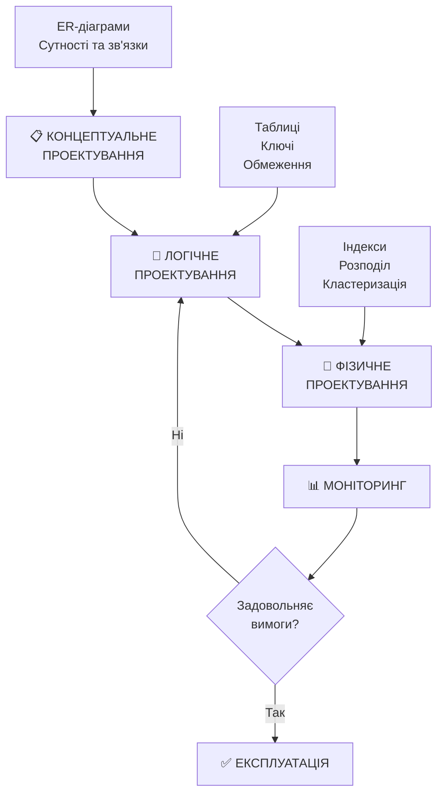
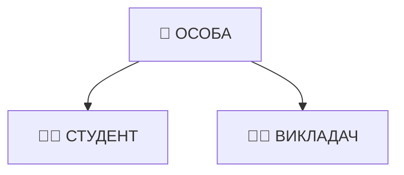
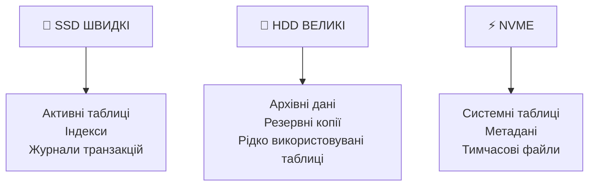
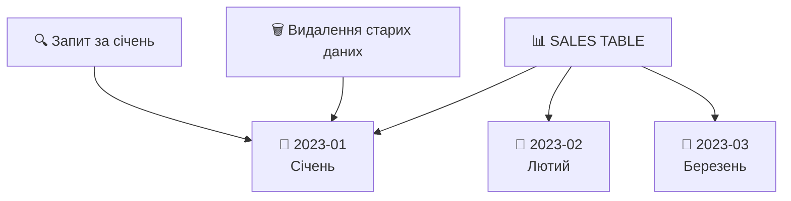
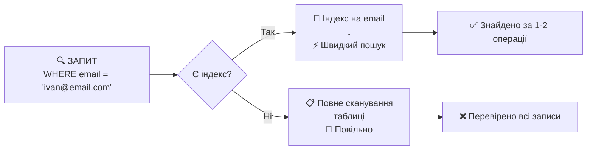
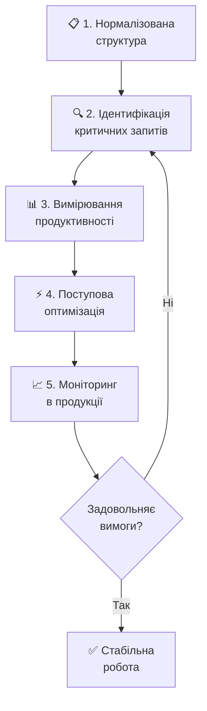

# Логічне та фізичне проектування

## План презентації

1. Етапи проектування БД
2. Логічне проектування
3. Реалізація ієрархій
4. Стратегії первинних ключів
5. Денормалізація
6. Фізичне проектування
7. Практичні рекомендації


## **📚 Основні поняття:**

**Логічне проектування** — перетворення концептуальної моделі в модель даних, підтримувану конкретною СУБД.

**Фізичне проектування** — визначення способів зберігання даних на фізичних носіях для оптимізації продуктивності.

**Денормалізація** — навмисний відхід від нормалізованої структури для покращення продуктивності.

**Кластеризація** — фізичний порядок зберігання рядків у таблиці для оптимізації доступу.

**Індекс** — допоміжна структура даних, що прискорює пошук записів у таблиці за рахунок створення впорядкованих посилань.

**Транзакція** — логічна одиниця роботи з базою даних, що виконується повністю або не виконується взагалі (принцип атомарності).


## **1. Етапи проектування БД**



### 🎯 **Мета кожного етапу:**

- **Концептуальний:** Відображення предметної області
- **Логічний:** Реалізація в конкретній СУБД
- **Фізичний:** Оптимізація продуктивності


## **2. Логічне проектування**

## Відображення сутностей

### 📋 **Основні правила:**

**1. Сутність → Таблиця**
```sql
-- Концептуальна сутність СТУДЕНТ
-- ↓
CREATE TABLE students (
    student_id INT PRIMARY KEY,
    first_name VARCHAR(50) NOT NULL,
    last_name VARCHAR(50) NOT NULL,
    email VARCHAR(100) UNIQUE
);
```

**2. Атрибути → Стовпці**
**3. Первинний ключ → PRIMARY KEY**

## Відображення зв'язків

### 🔗 **Зв'язок "один-до-багатьох":**


```sql
CREATE TABLE faculties (
    faculty_id INT PRIMARY KEY,
    faculty_name VARCHAR(100) NOT NULL
);

CREATE TABLE students (
    student_id INT PRIMARY KEY,
    first_name VARCHAR(50) NOT NULL,
    faculty_id INT,
    FOREIGN KEY (faculty_id) REFERENCES faculties(faculty_id)
);
```

### 🔄 **Зв'язок "багато-до-багатьох":**


```sql
CREATE TABLE enrollments (
    student_id INT,
    course_id INT,
    enrollment_date DATE,
    grade CHAR(2),
    PRIMARY KEY (student_id, course_id),
    FOREIGN KEY (student_id) REFERENCES students(student_id),
    FOREIGN KEY (course_id) REFERENCES courses(course_id)
);
```


## **3. Реалізація ієрархій**

## Стратегії для ієрархій спеціалізації

### 🌳 **Стратегія 1: Таблиця на ієрархію**



```sql
CREATE TABLE persons (
    person_id INT PRIMARY KEY,
    person_type VARCHAR(20) NOT NULL, -- 'STUDENT' / 'TEACHER'
    first_name VARCHAR(50) NOT NULL,
    last_name VARCHAR(50) NOT NULL,

    -- Атрибути студента
    student_number VARCHAR(20),
    enrollment_year INT,

    -- Атрибути викладача
    employee_number VARCHAR(20),
    salary DECIMAL(10,2)
);
```

**✅ Переваги:** Простота запитів, висока продуктивність
**❌ Недоліки:** Багато NULL-значень

## Стратегія 2: Таблиця на клас

```sql
CREATE TABLE students (
    person_id INT PRIMARY KEY,
    first_name VARCHAR(50) NOT NULL,
    last_name VARCHAR(50) NOT NULL,
    student_number VARCHAR(20) NOT NULL
);

CREATE TABLE teachers (
    person_id INT PRIMARY KEY,
    first_name VARCHAR(50) NOT NULL,
    last_name VARCHAR(50) NOT NULL,
    employee_number VARCHAR(20) NOT NULL
);
```

**✅ Переваги:** Відсутність NULL, ясна структура
**❌ Недоліки:** Дублювання, складні поліморфні запити

## Стратегія 3: Таблиця на підклас

```sql
CREATE TABLE persons (
    person_id INT PRIMARY KEY,
    first_name VARCHAR(50) NOT NULL,
    last_name VARCHAR(50) NOT NULL
);

CREATE TABLE students (
    person_id INT PRIMARY KEY,
    student_number VARCHAR(20) NOT NULL,
    FOREIGN KEY (person_id) REFERENCES persons(person_id)
);

CREATE TABLE teachers (
    person_id INT PRIMARY KEY,
    employee_number VARCHAR(20) NOT NULL,
    FOREIGN KEY (person_id) REFERENCES persons(person_id)
);
```

**✅ Переваги:** Нормалізована структура, гнучкість
**❌ Недоліки:** Потреба в JOIN-операціях


## **4. Стратегії первинних ключів**

## Природні vs Штучні ключі

### 🌿 **Природні ідентифікатори:**

```sql
-- Природний ключ
CREATE TABLE countries (
    country_code CHAR(3) PRIMARY KEY, -- ISO 3166-1
    country_name VARCHAR(100) NOT NULL
);

CREATE TABLE products (
    product_sku VARCHAR(20) PRIMARY KEY, -- SKU
    product_name VARCHAR(200) NOT NULL,
    price DECIMAL(10,2)
);
```

**✅ Переваги:**
- Мають бізнес-значення
- Зрозумілі користувачам
- Природні зв'язки між системами

**❌ Недоліки:**
- Можуть змінюватися
- Іноді громіздкі
- Проблеми конфіденційності

### 🔧 **Штучні ідентифікатори:**

```sql
-- Штучний ключ з автоінкрементом
CREATE TABLE customers (
    customer_id SERIAL PRIMARY KEY,
    customer_code VARCHAR(20) UNIQUE, -- природний ключ
    company_name VARCHAR(200) NOT NULL
);

-- UUID ключі
CREATE TABLE orders (
    order_id UUID PRIMARY KEY DEFAULT uuid_generate_v4(),
    customer_id INT NOT NULL,
    order_date DATE DEFAULT CURRENT_DATE
);
```

**✅ Переваги:**
- Ніколи не змінюються
- Завжди унікальні
- Ефективні для JOIN-операцій
- Підтримка розподіленого генерування (UUID)

**❌ Недоліки:**
- Не мають бізнес-значення
- Додаткова пам'ять
- Потребують додаткових індексів

## 🔄 **Гібридний підхід:**

```sql
CREATE TABLE employees (
    employee_id SERIAL PRIMARY KEY,        -- для системи
    employee_number VARCHAR(20) UNIQUE,    -- для бізнесу
    ssn VARCHAR(11) UNIQUE,                -- регуляторні вимоги
    first_name VARCHAR(50) NOT NULL
);
```


## **5. Денормалізація**

## Мотивація для денормалізації

### ⚡ **Проблема нормалізованих структур:**

```sql
-- Складний запит з множинними JOIN
SELECT
    o.order_id,
    c.company_name,     -- JOIN з customers
    p.product_name,     -- JOIN з products
    od.quantity,        -- JOIN з order_details
    od.unit_price
FROM orders o
JOIN customers c ON o.customer_id = c.customer_id
JOIN order_details od ON o.order_id = od.order_id
JOIN products p ON od.product_id = p.product_id
WHERE o.order_date >= '2023-01-01';
```

**❌ Проблеми:**
- Повільні JOIN-операції
- Високе навантаження на CPU
- Складність оптимізації

## Техніки денормалізації

### 📊 **1. Дублювання атрибутів:**

```sql
-- Денормалізована таблиця замовлень
CREATE TABLE orders_denormalized (
    order_id INT PRIMARY KEY,
    customer_id INT,
    customer_name VARCHAR(200),    -- ← Дублювання
    customer_city VARCHAR(100),    -- ← Дублювання
    order_date DATE,
    total_amount DECIMAL(12,2),

    FOREIGN KEY (customer_id) REFERENCES customers(customer_id)
);
```

### 🧮 **2. Передобчислені агрегати:**

```sql
-- Таблиця з агрегатами
CREATE TABLE customer_summary (
    customer_id INT PRIMARY KEY,
    total_orders INT DEFAULT 0,
    total_amount DECIMAL(15,2) DEFAULT 0,
    last_order_date DATE,
    average_order_value DECIMAL(10,2)
);

-- Тригер для оновлення агрегатів
CREATE OR REPLACE FUNCTION update_customer_summary()
RETURNS TRIGGER AS $
BEGIN
    -- Транзакція автоматично забезпечує атомарність оновлення
    UPDATE customer_summary
    SET
        total_orders = (SELECT COUNT(*) FROM orders WHERE customer_id = NEW.customer_id),
        total_amount = (SELECT COALESCE(SUM(total_amount), 0) FROM orders WHERE customer_id = NEW.customer_id),
        last_order_date = (SELECT MAX(order_date) FROM orders WHERE customer_id = NEW.customer_id)
    WHERE customer_id = NEW.customer_id;

    RETURN NEW;
END;
$ LANGUAGE plpgsql;

CREATE TRIGGER update_customer_summary_trigger
    AFTER INSERT OR UPDATE OR DELETE ON orders
    FOR EACH ROW EXECUTE FUNCTION update_customer_summary();
```

### 📈 **3. Розгортання ієрархій:**

```sql
-- Замість ієрархії категорій
CREATE TABLE product_categories_flat (
    product_id INT PRIMARY KEY,
    category_level_1 VARCHAR(100), -- Електроніка
    category_level_2 VARCHAR(100), -- Смартфони
    category_level_3 VARCHAR(100), -- iPhone
    product_name VARCHAR(200)
);
```

## ⚠️ **Ризики денормалізації:**

- **Проблеми цілісності** — дублювання може призвести до неузгодженості
- **Ускладнення оновлень** — зміни в кількох місцях
- **Збільшення обсягу** — дублювання займає більше місця
- **Складність підтримки** — важче розуміти та модифікувати


## **6. Фізичне проектування**

## Розміщення файлів

### 💽 **Стратегії розміщення:**



```sql
-- Розміщення на різних пристроях
CREATE TABLESPACE fast_ssd LOCATION '/fast_ssd/pg_data';
CREATE TABLESPACE archive_hdd LOCATION '/archive_hdd/pg_data';

-- Активні дані на швидких дисках
CREATE TABLE current_orders (...) TABLESPACE fast_ssd;

-- Архівні дані на повільних дисках
CREATE TABLE archived_orders (...) TABLESPACE archive_hdd;
```

## Кластеризація

### 🎯 **Мета:** Фізичний порядок зберігання для оптимізації доступу

```sql
-- Створення індексу для кластеризації
CREATE INDEX idx_orders_date ON orders(order_date);

-- Кластеризація за датою
CLUSTER orders USING idx_orders_date;
```


**✅ Переваги:**
- Покращення локальності даних
- Ефективніші діапазонні запити
- Краще стиснення

**❌ Недоліки:**
- Повільніші вставки
- Потреба в перекластеризації

## Розподіл (Partitioning)

### 📊 **Горизонтальний розподіл:**

```sql
-- Розподіл за діапазонами дат
CREATE TABLE sales (
    sale_id SERIAL,
    sale_date DATE NOT NULL,
    amount DECIMAL(10,2)
) PARTITION BY RANGE (sale_date);

-- Секції за місяцями
CREATE TABLE sales_2023_01 PARTITION OF sales
    FOR VALUES FROM ('2023-01-01') TO ('2023-02-01');

CREATE TABLE sales_2023_02 PARTITION OF sales
    FOR VALUES FROM ('2023-02-01') TO ('2023-03-01');
```



### 🔄 **Розподіл за хешем:**

```sql
-- Розподіл користувачів за хешем ID
CREATE TABLE user_activities (...) PARTITION BY HASH (user_id);

CREATE TABLE user_activities_0 PARTITION OF user_activities
    FOR VALUES WITH (modulus 4, remainder 0);
-- ... інші секції
```

**✅ Переваги розподілу:**
- Покращення продуктивності запитів
- Простіше обслуговування
- Паралельна обробка
- Ефективне видалення старих даних

### 🔄 **Транзакції в розподілених системах:**

Розподіл таблиць ускладнює роботу з **транзакціями**, особливо коли одна транзакція торкається кількох секцій:

```sql
-- Транзакція може охоплювати кілька секцій
BEGIN;
    INSERT INTO sales VALUES (1, '2023-01-15', 1000.00); -- секція sales_2023_01
    INSERT INTO sales VALUES (2, '2023-02-15', 1500.00); -- секція sales_2023_02
    UPDATE customer_summary SET total_sales = total_sales + 2500.00;
COMMIT; -- Атомарність забезпечується для всіх секцій
```

## Індексні стратегії

### 📚 **Що таке індекс?**

**Індекс** — це допоміжна структура даних, яка створює впорядковані посилання на рядки основної таблиці для прискорення пошуку.



### 🎯 **Типи індексів:**

```sql
-- B-tree (за замовчуванням) - для загальних запитів
CREATE INDEX idx_customers_email ON customers(email);

-- Складений індекс - для множинних умов
CREATE INDEX idx_orders_customer_date ON orders(customer_id, order_date);

-- Частковий індекс - для фільтрованих даних
CREATE INDEX idx_active_customers ON customers(customer_id)
WHERE status = 'ACTIVE';

-- Hash індекс - для точних пошуків
CREATE INDEX idx_products_sku ON products USING HASH(product_sku);

-- GIN індекс - для JSON даних
CREATE INDEX idx_product_attrs ON products USING GIN(attributes);
```

### 📈 **Моніторинг використання індексів:**

```sql
-- Аналіз ефективності індексів
SELECT
    schemaname,
    tablename,
    indexname,
    idx_scan,           -- кількість сканувань індексу
    idx_tup_read,       -- прочитано кортежів через індекс
    idx_tup_fetch       -- отримано кортежів з таблиці
FROM pg_stat_user_indexes
ORDER BY idx_scan DESC;

-- Знаходження невикористовуваних індексів
SELECT
    schemaname,
    tablename,
    indexname,
    pg_size_pretty(pg_relation_size(indexname::regclass)) as index_size
FROM pg_stat_user_indexes
WHERE idx_scan = 0  -- індекс ніколи не використовувався
ORDER BY pg_relation_size(indexname::regclass) DESC;
```

### ⚡ **Індекси та продуктивність:**

- **📈 Прискорюють** SELECT, WHERE, ORDER BY, JOIN
- **📉 Сповільнюють** INSERT, UPDATE, DELETE
- **💾 Займають** додатковий дисковий простір
- **🔄 Потребують** обслуговування при змінах даних


## **7. Практичні рекомендації**

## Етапність проектування

### 🔄 **Ітеративний процес:**



### 📏 **Правило 80/20:**
- **80% запитів** стосуються **20% даних**
- Оптимізуйте найпопулярніші сценарії використання

## Типові помилки

### ❌ **1. Передчасна оптимізація:**

```sql
-- НЕПРАВИЛЬНО: індекси "на всякий випадок"
CREATE INDEX idx_users_first_name ON users(first_name);
CREATE INDEX idx_users_last_name ON users(last_name);
CREATE INDEX idx_users_phone ON users(phone);
```

```sql
-- ПРАВИЛЬНО: на основі реальних запитів
SELECT query, calls, total_time
FROM pg_stat_statements
ORDER BY total_time DESC;

-- Потім створюємо відповідні індекси
CREATE INDEX idx_users_email ON users(email);        -- автентифікація
CREATE INDEX idx_users_status ON users(status, created_at); -- адмін-панель
```

### ❌ **2. Ігнорування кардинальності:**

**Кардинальність** — кількість унікальних значень у стовпці. Індекси ефективні тільки для стовпців з високою кардинальністю.

```sql
-- НЕЕФЕКТИВНО: низька кардинальність (5-10 статусів на мільйони записів)
CREATE INDEX idx_orders_status ON orders(status);

-- КРАЩЕ: часткові індекси для рідкісних значень
CREATE INDEX idx_pending_orders ON orders(order_date)
WHERE status = 'PENDING';  -- тільки 2-5% записів

-- АБО: складені індекси з високою селективністю
CREATE INDEX idx_status_customer ON orders(status, customer_id, order_date);
```

**🔍 Правило:** Індекс ефективний, коли повертає **менше 5-10%** записів таблиці.

### ❌ **3. Неправильна денормалізація:**

```sql
-- ПРОБЛЕМАТИЧНО: денормалізація без розуміння
CREATE TABLE orders_bad (
    order_id INT,
    customer_name VARCHAR(200),  -- дублювання
    product_name VARCHAR(200)    -- проблема для багатьох товарів
);

-- ПРАВИЛЬНО: денормалізація стабільних даних
CREATE TABLE orders_good (
    order_id INT,
    customer_id INT,
    customer_name_snapshot VARCHAR(200), -- знімок на момент замовлення
    order_date DATE
);
```

## Інструменти та моніторинг

### 🔧 **Корисні інструменти:**

- **pgAdmin / MySQL Workbench** — візуальне проектування
- **pg_stat_statements** — аналіз продуктивності запитів
- **EXPLAIN ANALYZE** — детальний аналіз планів виконання
- **Flyway / Liquibase** — міграції схем БД

### 📊 **Ключові метрики:**

```sql
-- Повільні запити (потребують індексів)
SELECT
    query,
    total_time,   -- загальний час виконання
    calls,        -- кількість викликів
    mean_time     -- середній час виконання
FROM pg_stat_statements
WHERE mean_time > 100 -- більше 100ms
ORDER BY total_time DESC;

-- Невикористовувані індекси (можна видалити)
SELECT
    schemaname,
    tablename,
    indexname,
    idx_scan,     -- кількість використань
    pg_size_pretty(pg_relation_size(indexname::regclass)) as size
FROM pg_stat_user_indexes
WHERE idx_scan = 0 -- ніколи не використовувався
ORDER BY pg_relation_size(indexname::regclass) DESC;

-- Ефективність транзакцій
SELECT
    datname,
    xact_commit,    -- успішні транзакції
    xact_rollback,  -- відкачені транзакції
    ROUND(100.0 * xact_rollback / (xact_commit + xact_rollback), 2) as rollback_ratio
FROM pg_stat_database
WHERE datname = current_database();
```

## Загальні принципи

### ✅ **Do's (Робіть):**

- **📊 Вимірюйте** перед оптимізацією
- **📝 Документуйте** проектні рішення
- **🔄 Використовуйте** системи контролю версій для схем
- **📈 Моніторьте** продуктивність постійно
- **🧪 Тестуйте** на реальних обсягах даних

### ❌ **Don'ts (Не робіть):**

- **🚫 Не оптимізуйте** без вимірювань
- **🚫 Не створюйте** зайві індекси
- **🚫 Не денормалізуйте** без необхідності
- **🚫 Не ігноруйте** кардинальність даних
- **🚫 Не забувайте** про підтримку цілісності


## **Висновки**

### 🎯 **Ключові принципи:**

1. **Систематичність** — використовуйте чіткі правила відображення
2. **Збалансованість** — врахуйте переваги та недоліки кожного рішення
3. **Ітеративність** — проектування є процесом постійного вдосконалення
4. **Вимірюваність** — базуйте рішення на реальних метриках

### 🚀 **Практичний підхід:**


**Правильне проектування** створює основу для **ефективних**, **масштабованих** та **підтримуваних** систем управління даними! 🎉
