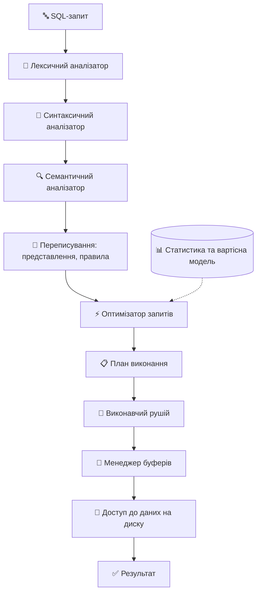
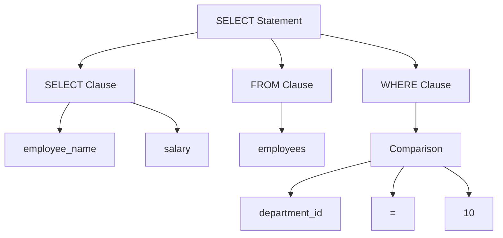
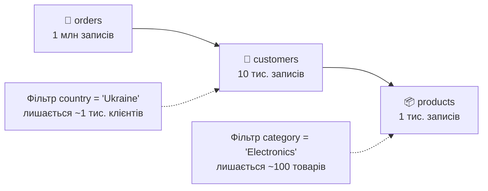
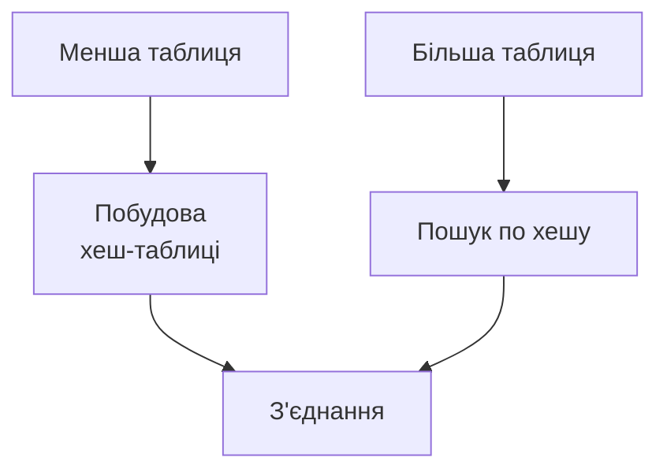
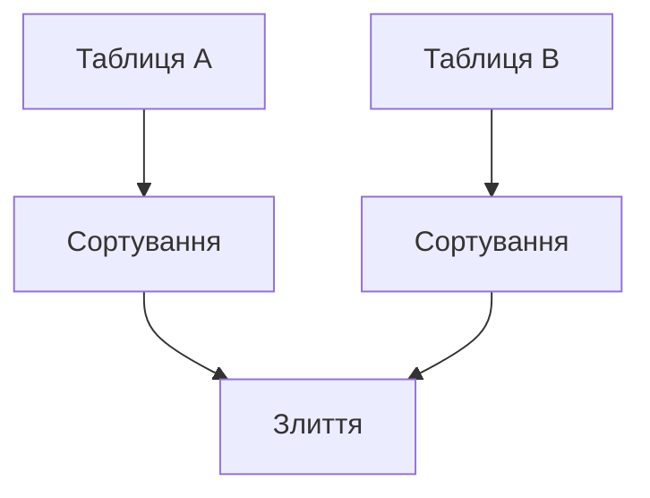
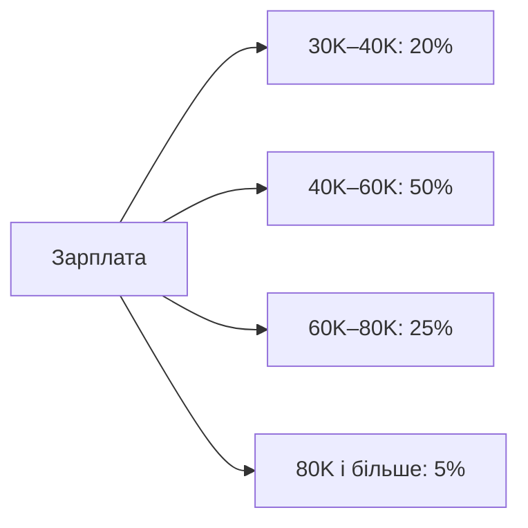
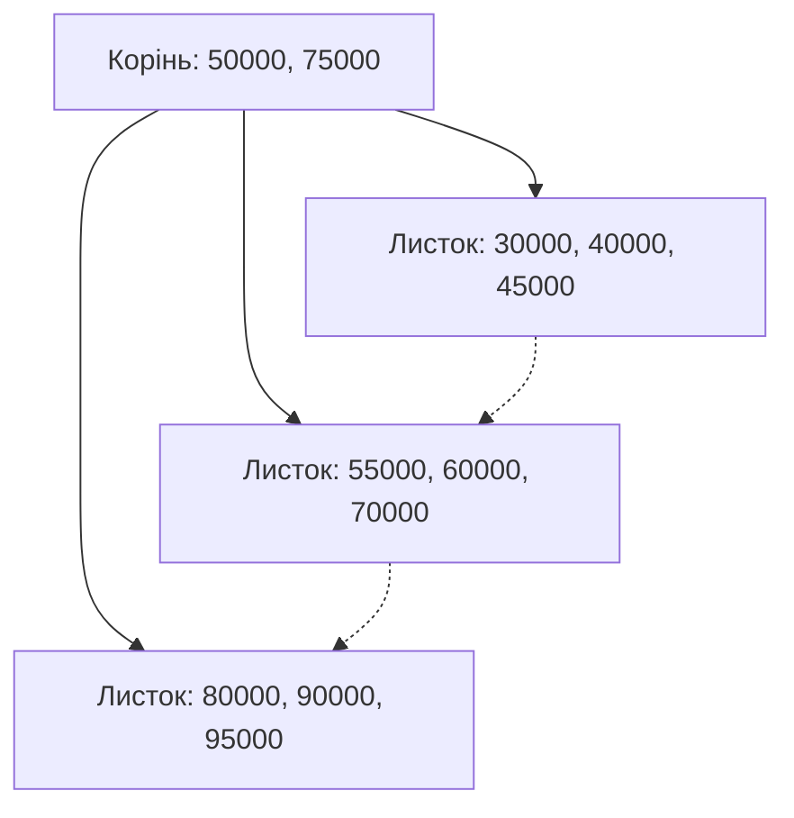
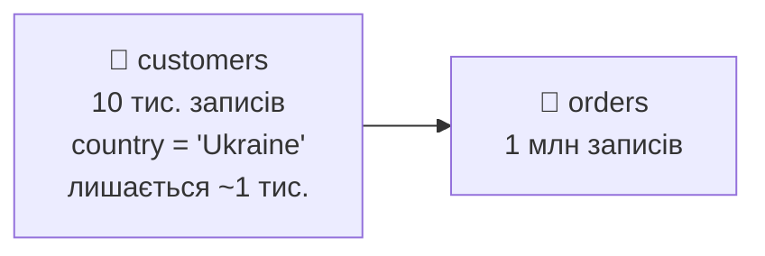

# Обробка та оптимізація запитів

## План лекції

1. Архітектура обробки запитів
2. Типи оптимізації запитів
3. Статистика та вартісна модель
4. Індекси та їх роль в оптимізації
5. План виконання запитів
6. Практичні методи оптимізації
7. Моніторинг та діагностика
8. Сучасні підходи

## **🎯 Ключові поняття:**

**Оптимізатор запитів (планувальник)** — компонент СУБД, що обирає найефективніший спосіб виконання SQL-запиту, порівнюючи різні плани.

**План виконання** — дерево фізичних операцій: методи доступу до даних, алгоритми з'єднань, сортування.

**Вартісна модель** — оцінка плану в умовних одиницях за очікуваними витратами на введення-виведення та процесор.

**Селективність** — частка рядків, що відповідають умові. Висока селективність = умова вибирає мало рядків.

> 📌 Приклади — PostgreSQL 18. **Оптимізація — це експеримент: перевіряємо через `EXPLAIN ANALYZE`.**

## **1. Архітектура обробки запитів**

## Загальна схема обробки


```mermaid
graph TD
    A[🔤 SQL-запит] --> B[📝 Лексичний аналізатор]
    B --> C[🌳 Синтаксичний аналізатор]
    C --> D[🔍 Семантичний аналізатор]
    D --> R["🔁 Переписування: представлення, правила"]
    R --> E[⚡ Оптимізатор запитів]
    S[(📊 Статистика та вартісна модель)] -.-> E
    E --> F[📋 План виконання]
    F --> G[🚀 Виконавчий рушій]
    G --> H[💾 Менеджер буферів]
    H --> I[💽 Доступ до даних на диску]
    I --> J[✅ Результат]
```

До оптимізатора СУБД працює лише з **метаданими**, а не з даними.

## Етапи обробки запитів

### 📝 **1. Лексичний аналіз**

**Розбиття SQL на токени:**

```sql
SELECT employee_name, salary
FROM employees
WHERE department_id = 10;
```

**Токени:**
- `SELECT`, `FROM`, `WHERE` ← ключові слова
- `employee_name`, `salary`, `employees`, `department_id` ← ідентифікатори
- `,` `;` ← розділювачі
- `=` ← оператор
- `10` ← числовий літерал

### 🌳 **2. Синтаксичний аналіз**


```mermaid
graph TD
    A[SELECT Statement] --> B[SELECT Clause]
    A --> C[FROM Clause]
    A --> D[WHERE Clause]

    B --> E[employee_name]
    B --> F[salary]

    C --> G[employees]

    D --> H[Comparison]
    H --> I[department_id]
    H --> J["="]
    H --> K[10]
```

Помилка граматики → `syntax error at or near ...`

### 🔍 **3. Семантичний аналіз**

**Перевірки за системним каталогом:**
- ✅ **Існування таблиць** та стовпців
- ✅ **Відповідність типів** даних
- ✅ **Права доступу** користувача
- ✅ **Коректність агрегацій** та групування

Після аналізу — **переписування**: представлення (`VIEW`) підставляються своїм визначенням.

### ⚡ **4. Оптимізація**

**Завдання оптимізатора:**
- 🔍 Перебір еквівалентних планів
- 📊 Оцінка вартості кожного за статистикою
- 🎯 Вибір найдешевшого

**Результат:** дерево операцій, яке рушій виконує знизу догори.

💡 Підготовлені запити (`PREPARE`) економлять розбір і планування, але можуть закріпити неоптимальний *generic*-план (`plan_cache_mode`).

## **2. Типи оптимізації**

## Логічна оптимізація

### 🔽 **Проштовхування селекції**

**До оптимізації:**
```sql
SELECT e.name, d.department_name
FROM employees e
JOIN departments d ON e.department_id = d.department_id
WHERE e.salary > 50000;
```

**Концептуально після:**
```sql
SELECT e.name, d.department_name
FROM (SELECT * FROM employees WHERE salary > 50000) e
JOIN departments d ON e.department_id = d.department_id;
```

✅ Оптимізатор робить це **сам** — план в обох випадках однаковий.

**Проштовхування проєкції:** непотрібні стовпці відкидаються якомога раніше.

### 🔄 **Перестановка з'єднань**


```mermaid
graph LR
    A["🛒 orders<br/>1 млн записів"] --> B["👥 customers<br/>10 тис. записів"]
    B --> C["📦 products<br/>1 тис. записів"]

    D["Фільтр country = 'Ukraine'<br/>лишається ~1 тис. клієнтів"] -.-> B
    E["Фільтр category = 'Electronics'<br/>лишається ~100 товарів"] -.-> C
```

**Результат:** спочатку фільтруємо малі таблиці!
Порядок у тексті запиту **не важливий** (`join_collapse_limit` = 8, для 12+ таблиць — GEQO).

### 🔁 **Перетворення підзапитів**

```sql
-- Корельований підзапит
SELECT employee_name FROM employees e1
WHERE salary > (SELECT AVG(salary) FROM employees e2
                WHERE e2.department_id = e1.department_id);

-- Еквівалентне з'єднання з агрегатом
SELECT e.employee_name FROM employees e
JOIN (SELECT department_id, AVG(salary) AS avg_salary
      FROM employees GROUP BY department_id) d
  ON e.department_id = d.department_id
WHERE e.salary > d.avg_salary;
```

`IN` / `EXISTS` → напівз'єднання (*semi-join*) автоматично.

## Фізична оптимізація

### 📊 **Методи доступу**

| Метод | Коли вигідний | Приклад |
|-------|---------------|---------|
| 🔍 **Seq Scan** | Мала таблиця або більшість рядків | `SELECT * FROM small_table` |
| 📇 **Index Scan** | Мало рядків | `WHERE employee_id = 12345` |
| ⚡ **Index Only Scan** | Усі стовпці є в індексі | `INCLUDE (name)` |
| 🗺️ **Bitmap Heap Scan** | «Не мало й не багато», `OR` | Кілька індексів разом |

> *Index Seek* — термін SQL Server; у PostgreSQL його немає.

### 🔗 **Алгоритми з'єднання**

**1. Nested Loop Join (вкладені цикли)**

```mermaid
graph LR
    A["Таблиця A<br/>10 записів"] --> B[Для кожного запису]
    B --> C["Пошук у таблиці B<br/>1000 записів"]
    C --> D[Результат з'єднання]
```
**Краще для:** малої зовнішньої таблиці + індекс на внутрішній

**2. Hash Join (хеш-з'єднання)**

```mermaid
graph TD
    A[Менша таблиця] --> B["Побудова<br/>хеш-таблиці"]
    C[Більша таблиця] --> D[Пошук по хешу]
    B --> E[З'єднання]
    D --> E
```
**Краще для:** великих таблиць, лише умови `=`

**3. Merge Join (з'єднання злиттям)**

```mermaid
graph TD
    A[Таблиця A] --> B[Сортування]
    C[Таблиця B] --> D[Сортування]
    B --> E[Злиття]
    D --> E
```
**Краще для:** вже відсортованих даних

## **3. Статистика та вартісна модель**

## Статистична інформація

### 📊 **Типи статистики**

**1. Кардинальність таблиць**
```sql
SELECT relname, reltuples::bigint AS estimated_rows
FROM pg_class
WHERE relname = 'employees';
```

**2. Розподіл значень (гістограми)**

```mermaid
graph LR
    A[Зарплата] --> B["30K–40K: 20%"]
    A --> C["40K–60K: 50%"]
    A --> D["60K–80K: 25%"]
    A --> E["80K і більше: 5%"]
```
Дані — у `pg_stats`: `n_distinct`, `most_common_vals`, `histogram_bounds`, `correlation`.

**3. Селективність**
```sql
-- Висока (👍 для індексу): один рядок із мільйона
SELECT * FROM employees WHERE employee_id = 12345;

-- Низька (👎 для індексу): майже вся таблиця
SELECT * FROM employees WHERE status = 'ACTIVE';
```

**4. Розширена статистика** — для корельованих стовпців
```sql
CREATE STATISTICS stat_city_zip (dependencies)
    ON city, zip_code FROM addresses;
```

## Вартісна модель

### 💰 **Компоненти вартості**

**1. I/O вартість (найдорожча)**
```
I/O_cost = sequential_pages × seq_page_cost +
           random_pages × random_page_cost
```
За замовчуванням `1.0` та `4.0`; для SSD — `random_page_cost ≈ 1.1`

**2. CPU вартість**
```
CPU_cost = rows × cpu_tuple_cost +
           operator_calls × cpu_operator_cost
```
`cpu_tuple_cost = 0.01`, `cpu_operator_cost = 0.0025`

**3. Мережева вартість** — лише в розподілених системах

### 📈 **Приклад: 100 сторінок, 10 000 рядків**

```
cost = 100 × 1.0 + 10 000 × 0.01 + 10 000 × 0.0025
     = 100 + 100 + 25 = 225
```

```
Seq Scan on employees  (cost=0.00..225.00 ...)
  Filter: (salary > 50000)
```

| Варіант | Виграє, коли |
|---------|--------------|
| 🔍 Seq Scan | Мала таблиця або багато рядків |
| 📇 Індекс по `department_id` + фільтр | Відділ невеликий |
| ⚡ Складений індекс `(department_id, salary)` | Обидві умови відсіюють більшість рядків |

## **4. Індекси та оптимізація**

## Типи індексів

| Тип | Для чого |
|-----|----------|
| 🌳 **B-tree** | Рівність, діапазони, сортування (за замовчуванням) |
| #️⃣ **Hash** | Лише `=` |
| 📚 **GIN** | `jsonb`, масиви, повнотекстовий пошук |
| 🌍 **GiST** | Геометрія, діапазони |
| 🧱 **BRIN** | Величезні таблиці зі впорядкованими даними |
| 🧠 **HNSW / IVFFlat** (pgvector) | Пошук найближчих векторів |

### 🌳 **B-tree індекси**


```mermaid
graph TD
    A["Корінь: 50000, 75000"] --> B["Листок: 30000, 40000, 45000"]
    A --> C["Листок: 55000, 60000, 70000"]
    A --> D["Листок: 80000, 90000, 95000"]
    B -.-> C
    C -.-> D
```

**✅ Ефективні для:**
- Точні пошуки: `salary = 75000`
- Діапазони: `salary BETWEEN 50000 AND 100000`
- Сортування: `ORDER BY salary`

## Спеціальні види індексів

### 🎯 **Часткові, покривні, за виразом**

```sql
-- Частковий: лише активні працівники
CREATE INDEX idx_active_salary ON employees (salary)
WHERE status = 'ACTIVE';

-- Покривний: Index Only Scan
CREATE INDEX idx_orders_customer ON orders (customer_id)
INCLUDE (order_date, amount);

-- За виразом: пошук без урахування регістру
CREATE INDEX idx_users_email_lower ON users (lower(email));
```

### #️⃣ **Hash-індекс**

```sql
CREATE INDEX idx_employee_id_hash
ON employees USING HASH (employee_id);

-- Ефективно тільки для =
SELECT * FROM employees WHERE employee_id = 12345;
```

Після PostgreSQL 10 надійний, але виграш над B-tree зазвичай малий.

## Стратегії індексування

### 🎯 **Правила створення індексів**

**1. Індексувати WHERE-умови, що добре відсіюють рядки**
```sql
CREATE INDEX idx_orders_customer_id ON orders (customer_id);
```

**2. Індексувати зовнішні ключі та JOIN-стовпці**

⚠️ PostgreSQL **не створює** індекс для `FOREIGN KEY` автоматично!

**3. Складені індекси: порядок має значення**
```sql
CREATE INDEX idx_dept_salary ON employees (department_id, salary);

-- ✅ Використовується повністю
WHERE department_id = 10 AND salary > 50000

-- ✅ Використовується частково
WHERE department_id = 10

-- ⚠️ Лише salary: до PG 17 — ні; PG 18 — skip scan,
--    якщо в department_id мало різних значень
WHERE salary > 50000
```

## Індексопридатні умови

### 🚫 **Що «сліпить» індекс**

```sql
-- ❌ Функція над стовпцем
WHERE EXTRACT(YEAR FROM hire_date) = 2025

-- ✅ Діапазон над «голим» стовпцем
WHERE hire_date >= '2025-01-01' AND hire_date < '2026-01-01'

-- ❌ Пошук за суфіксом
WHERE name LIKE '%enko'

-- ✅ Пошук за префіксом
WHERE name LIKE 'Petr%'
```

### 🔧 **Без зупинки запису**

```sql
CREATE INDEX CONCURRENTLY idx_orders_customer_id
ON orders (customer_id);
```

Не блокує запис, але довший і не працює в транзакції.

### ⚖️ **Баланс індексів**

**✅ Переваги:**
- ⚡ Швидкий пошук
- 🚀 Ефективні JOIN
- 📈 Швидке сортування

**❌ Недоліки:**
- 💾 Місце на диску
- 🐌 Уповільнення INSERT/UPDATE/DELETE (і HOT-оновлень)
- 🔧 Обслуговування; невикористані індекси — чистий збиток

## **5. План виконання запитів**

## Читання планів виконання

### 📋 **PostgreSQL EXPLAIN**

```sql
EXPLAIN SELECT e.name, d.department_name
FROM employees e
JOIN departments d ON e.department_id = d.department_id
WHERE e.salary > 50000;
```

### 📊 **Приклад плану**

```
Nested Loop  (cost=0.29..8.32 rows=1 width=64)
  ->  Seq Scan on employees e  (cost=0.00..4.00 rows=1 width=36)
        Filter: (salary > 50000)
  ->  Index Scan using departments_pkey on departments d
        (cost=0.29..4.31 rows=1 width=32)
        Index Cond: (department_id = e.department_id)
```

План читаємо **знизу догори**, зсередини назовні.

### 🔍 **Інтерпретація**

| Елемент | Значення | Пояснення |
|---------|----------|-----------|
| **cost=0.29..8.32** | Вартість | Початкова..загальна |
| **rows=1** | Рядки | Очікувана кількість |
| **width=64** | Ширина | Розмір рядка в байтах |

**Типи операцій:**
- 🔍 **Seq Scan** — послідовне сканування
- 📇 **Index Scan / Index Only Scan**
- 🗺️ **Bitmap Heap Scan**
- 🔄 **Nested Loop / Hash Join / Merge Join**

## Аналіз фактичної продуктивності

```sql
EXPLAIN (ANALYZE, BUFFERS)
SELECT e.name, d.department_name
FROM employees e
JOIN departments d ON e.department_id = d.department_id
WHERE e.salary > 50000;
```

**Розширений вивід:**
```
Nested Loop (cost=0.29..8.32 rows=1 width=64)
           (actual time=0.045..0.048 rows=1 loops=1)
  Buffers: shared hit=4
  ->  Seq Scan on employees e (actual time=0.023..0.025 rows=1 loops=1)
        Filter: (salary > 50000)
        Rows Removed by Filter: 99
        Buffers: shared hit=1
Planning Time: 0.123 ms
Execution Time: 0.071 ms
```

**⚠️ `ANALYZE` виконує запит по-справжньому!** Для `UPDATE`/`DELETE`: `BEGIN; ... ROLLBACK;`

**🆕 PostgreSQL 18:** `BUFFERS` виводиться автоматично; додано `Index Searches`.

## Що шукати в плані

### 🎯 **Ключові метрики**

- **Оцінені vs фактичні рядки** — розбіжність у десятки разів → проблема статистики
- **actual time** — множити на `loops`
- **Buffers: shared hit / read** — кеш чи диск
- **Rows Removed by Filter** — багато → бракує індексу?
- **`Batches` > 1, `external merge`** — замало `work_mem`

### 🛠️ **Візуалізатори планів**

- explain.dalibo.com
- explain.depesz.com

## **6. Практичні методи оптимізації**

## Оптимізація SELECT

### ❌ **Уникати `SELECT *`**

```sql
-- Неефективно
SELECT * FROM employees WHERE department_id = 10;

-- ✅ Ефективно
SELECT employee_id, name, salary
FROM employees WHERE department_id = 10;
```

Менше даних, можливий Index Only Scan, стійкість до змін схеми.

### 🔍 **`IN`, `EXISTS`, `NOT IN`**

```sql
-- Однаковий план у сучасному PostgreSQL
WHERE customer_id IN (SELECT customer_id FROM orders ...)
WHERE EXISTS (SELECT 1 FROM orders o
              WHERE o.customer_id = c.customer_id ...)
```

**Справжня різниця — із запереченням:**
```sql
-- ⚠️ NOT IN + NULL у підзапиті → порожній результат
-- ✅ Надійно:
SELECT * FROM customers c
WHERE NOT EXISTS (SELECT 1 FROM orders o
                  WHERE o.customer_id = c.customer_id);
```

### 📄 **Сторінкове виведення**

```sql
-- 🐌 Читає й відкидає 100 000 рядків
SELECT * FROM orders ORDER BY id LIMIT 20 OFFSET 100000;

-- ⚡ Keyset: стартуємо від відомого ключа
SELECT * FROM orders WHERE id > 100020 ORDER BY id LIMIT 20;
```

## Оптимізація JOIN

### 📊 **Порядок таблиць**

Порядок у тексті запиту **не має значення** — оптимізатор переставляє з'єднання сам.


```mermaid
graph LR
    A["👥 customers<br/>10 тис. записів<br/>country = 'Ukraine'<br/>лишається ~1 тис."] --> B["🛒 orders<br/>1 млн записів"]
```

**Що допомагає насправді:** індекс за ключем з'єднання, свіжа статистика.

### 🔗 **Типи з'єднань — це семантика**

```sql
-- ✅ INNER JOIN: лише ті, що мають відділ
SELECT e.name, d.department_name
FROM employees e
INNER JOIN departments d ON e.department_id = d.department_id;

-- ✅ LEFT JOIN: усі працівники
SELECT e.name, COALESCE(d.department_name, 'Без відділу') AS dept
FROM employees e
LEFT JOIN departments d ON e.department_id = d.department_id;
```

## Оптимізація підзапитів

### 🔄 **Перетворення корельованих підзапитів**

```sql
-- ❌ Корельований підзапит (повільно)
SELECT employee_name
FROM employees e1
WHERE salary = (
    SELECT MAX(salary) FROM employees e2
    WHERE e2.department_id = e1.department_id
);

-- ✅ Віконна функція (одне проходження)
SELECT employee_name
FROM (
    SELECT employee_name, salary,
           MAX(salary) OVER (PARTITION BY department_id) AS max_salary
    FROM employees
) t
WHERE salary = max_salary;
```

### 📝 **Common Table Expressions (CTE)**

```sql
WITH department_stats AS (
    SELECT department_id, AVG(salary) AS avg_salary,
           COUNT(*) AS employee_count
    FROM employees
    GROUP BY department_id
),
high_paying_depts AS (
    SELECT department_id FROM department_stats
    WHERE avg_salary > 60000 AND employee_count > 5
)
SELECT e.name, e.salary, d.department_name
FROM employees e
JOIN departments d ON e.department_id = d.department_id
JOIN high_paying_depts hpd ON e.department_id = hpd.department_id;
```

**⚠️ З PostgreSQL 12** CTE вбудовується в запит; це засіб **читабельності**, а не кешування. Примусово: `AS MATERIALIZED`.

## Проблема N+1

### 🔁 **101 запит замість одного**

```
-- ❌ Застосунок: у циклі для кожного замовлення
SELECT ... FROM customers WHERE customer_id = ?   -- × 100
```

```sql
-- ✅ Один запит
SELECT o.order_id, c.customer_name
FROM orders o
JOIN customers c ON c.customer_id = o.customer_id
WHERE o.order_id = ANY ($1);
```

**Ознака в `pg_stat_statements`:** дуже багато `calls` при малому часі виконання. Часто породжується ORM.

## **7. Моніторинг та діагностика**

## Інструменти моніторингу

### 📊 **Системні представлення PostgreSQL**

```sql
-- 🐌 Найповільніші запити (PostgreSQL 13+)
SELECT query, calls, mean_exec_time, total_exec_time
FROM pg_stat_statements
ORDER BY mean_exec_time DESC LIMIT 10;

-- 📇 Індекси, яких ніхто не використовує
SELECT s.relname, s.indexrelname,
       pg_size_pretty(pg_relation_size(s.indexrelid)) AS size
FROM pg_stat_user_indexes s
JOIN pg_index i ON i.indexrelid = s.indexrelid
WHERE s.idx_scan = 0 AND NOT i.indisunique;

-- 🔄 Активні запити
SELECT pid, usename, state, query
FROM pg_stat_activity
WHERE state = 'active';
```

> До PG 13 стовпці мали назви `mean_time`, `total_time`.

### 📝 **Повільні запити в журнал**

```sql
ALTER SYSTEM SET log_min_duration_statement = 1000;
SELECT pg_reload_conf();
```

`auto_explain` — записує **плани** повільних запитів.

## Типові проблеми

### 🚫 **1. Відсутність індексів**

**Симптоми:**
- 🐌 Повільні SELECT
- 🔥 Високе навантаження CPU
- 🔍 `Seq Scan` з великим `Rows Removed by Filter`

**Діагностика:**
```sql
SELECT relname, seq_scan, seq_tup_read, idx_scan, n_live_tup
FROM pg_stat_user_tables
WHERE seq_scan > 0 AND n_live_tup > 10000
ORDER BY seq_tup_read DESC LIMIT 10;
```

Перевірити гіпотезу без створення індексу — `hypopg`.

### 📊 **2. Застарілі статистики**

**Симптоми:**
- 🎯 Оцінка рядків сильно відрізняється від фактичної
- 🔄 Недоречні алгоритми з'єднання

**Рішення:**
```sql
ANALYZE employees;

ALTER TABLE employees
SET (autovacuum_analyze_scale_factor = 0.05);
```

За замовчуванням `ANALYZE` — після зміни ~10 % рядків.

### 🔒 **3. Блокування та конкуренція**

```sql
-- Хто кого блокує
SELECT pid, pg_blocking_pids(pid) AS blocked_by, state, query
FROM pg_stat_activity
WHERE cardinality(pg_blocking_pids(pid)) > 0;
```

➡️ Докладно — у наступній лекції.

### 💾 **4. Замало пам'яті для операції**

`Sort Method: external merge` або `Batches: 8` → дані йдуть на диск.
`SET LOCAL work_mem = '256MB';` — точково, не глобально!

## **8. Сучасні підходи**

## Паралельність і секціонування

### ⚙️ **Паралельні запити**

Вузли `Gather`, `Parallel Seq Scan`; `max_parallel_workers_per_gather`.

### 🧩 **Секціонування**

```sql
CREATE TABLE events (
    id bigint GENERATED ALWAYS AS IDENTITY,
    created_at timestamptz NOT NULL,
    payload jsonb
) PARTITION BY RANGE (created_at);

CREATE TABLE events_2026_09 PARTITION OF events
    FOR VALUES FROM ('2026-09-01') TO ('2026-10-01');
```

**Partition pruning:** зайві секції відкидаються ще на етапі планування.

## Автоматизація та штучний інтелект

### 🤖 **Автоматична оптимізація**

- 📇 **Комерційні й хмарні СУБД** — автоматичні індекси (Oracle, Azure SQL)
- 🐘 **PostgreSQL** — «з коробки» немає; є `hypopg`, `pg_qualstats`
- 🧠 **Машинне навчання** — переважно в дослідженнях
- 💬 **LLM-помічники** — лише **гіпотези**: перевіряємо через `EXPLAIN ANALYZE`

## Колонкове зберігання та представлення

### 📊 **Колонкове зберігання**

```sql
-- Citus: колонкова таблиця для аналітики
CREATE TABLE analytics_orders (
    order_id bigint,
    customer_id bigint,
    order_date date,
    amount numeric
) USING columnar;
```

Замінило `cstore_fdw` (розробку припинено). Також: `pg_duckdb`, Parquet, ClickHouse.

### 💾 **Матеріалізовані представлення**

```sql
CREATE MATERIALIZED VIEW monthly_sales AS
SELECT DATE_TRUNC('month', order_date) AS month,
       SUM(amount) AS total_sales,
       COUNT(*) AS order_count
FROM orders
GROUP BY DATE_TRUNC('month', order_date);

CREATE UNIQUE INDEX idx_monthly_sales_month ON monthly_sales (month);

-- Оновлення без блокування читання (потрібен унікальний індекс)
REFRESH MATERIALIZED VIEW CONCURRENTLY monthly_sales;
```

## **Підсумок та рекомендації**

### 🎯 **Ключові принципи оптимізації**

1. **🔍 Розуміння архітектури** — знання роботи оптимізатора
2. **📇 Правильні індекси** — основний інструмент, але з ціною
3. **📊 Аналіз планів** — `EXPLAIN ANALYZE`, порівняння оцінок і фактів
4. **📈 Знання даних** — розподіл, кардинальність, селективність
5. **🔄 Постійний моніторинг** — продуктивність змінюється разом з даними
6. **🧪 Скептицизм щодо «правил»** — перевіряйте на власних даних

### ✅ **Практичні рекомендації**

- 🎯 **Вибирайте лише потрібні стовпці** — уникайте `SELECT *`
- 📇 **Індексуйте зовнішні ключі** — і видаляйте невикористані індекси
- 📊 **Аналізуйте плани** — `EXPLAIN (ANALYZE)`
- 🔄 **Підтримуйте статистику свіжою** — `ANALYZE`, autovacuum
- 📈 **Шукайте N+1** — у `pg_stat_statements`

## Ресурси для подальшого вивчення

### 📚 **Книги та посібники**

- **«Designing Data-Intensive Applications»** — Martin Kleppmann, розділ 3
- **«Use The Index, Luke!»** — Markus Winand (use-the-index-luke.com)

### 🔗 **Документація**

- PostgreSQL: *Performance Tips*, *Indexes* — postgresql.org/docs

### 🎥 **Відео**

- CMU 15-445/645 Database Systems (YouTube)
