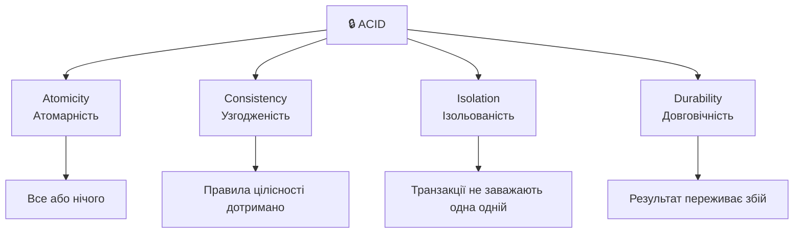
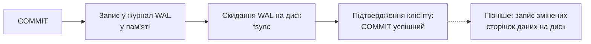
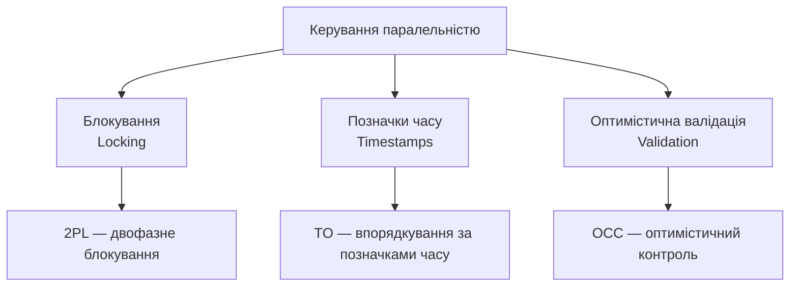
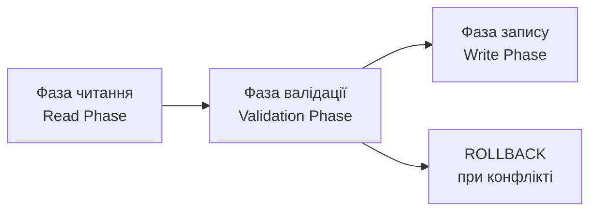
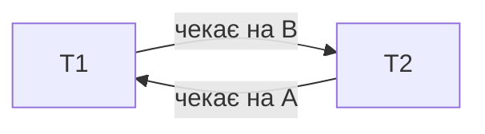
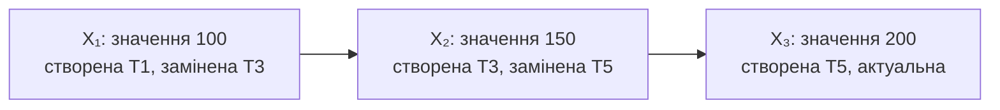
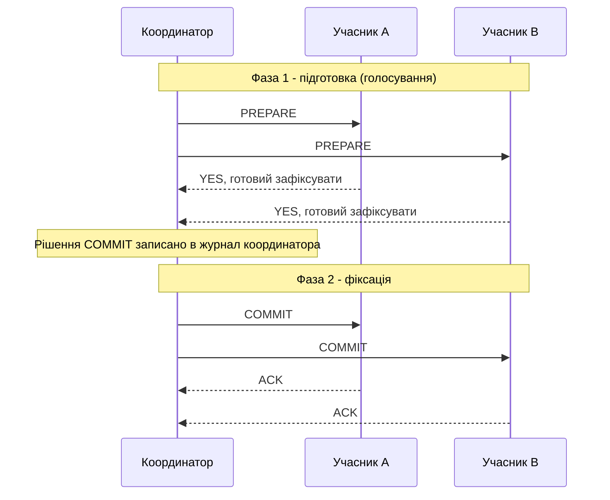
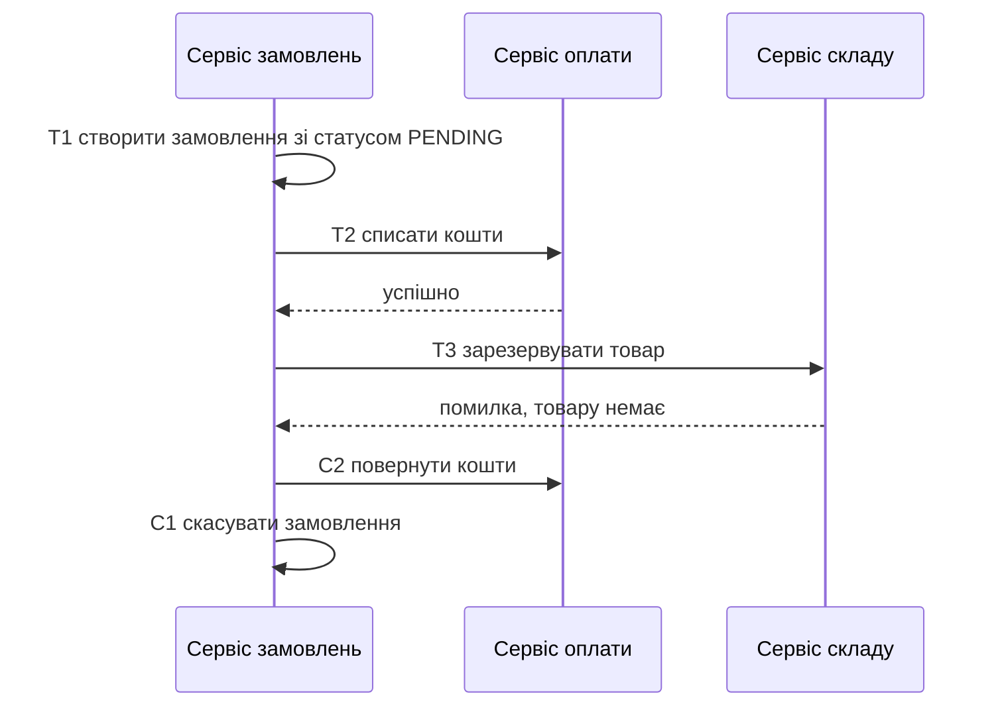
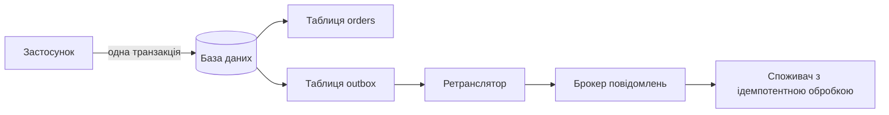

# Управління транзакціями та паралельним доступом

## План лекції

1. Концепція транзакції
2. ACID властивості транзакцій
3. Рівні ізоляції транзакцій
4. Протоколи управління паралельністю
5. Виявлення та вирішення взаємоблокувань
6. Багатоверсійний контроль паралельності (MVCC)
7. Практичні рекомендації
8. Розподілені транзакції

## 📚 **Основні поняття**

**Транзакція** — послідовність операцій з базою даних, які виконуються як єдине ціле: або повністю, або не виконуються зовсім.

**ACID** — властивості надійної транзакції: Atomicity, Consistency, Isolation, Durability.

**Блокування** — механізм, що запобігає небезпечному одночасному доступу до тих самих даних.

**MVCC** — багатоверсійний контроль паралельності: кілька версій даних замість очікування.

**Розподілена транзакція** — операція, що охоплює кілька незалежних баз чи сервісів.

> 📌 Приклади — PostgreSQL 18.

## **1. Концепція транзакції**

## Що таке транзакція?

### 💡 **Логічна одиниця роботи**

Транзакція складається з:
- **BEGIN** — початок
- Набір операцій **READ** та **WRITE**
- **COMMIT** — успішне завершення
- **ROLLBACK** — скасування всіх змін

Без `BEGIN` кожен оператор — окрема транзакція (*autocommit*).

### Приклад: переказ коштів

```sql
BEGIN;

UPDATE accounts SET balance = balance - 1000
WHERE account_id = 'ACC001';

UPDATE accounts SET balance = balance + 1000
WHERE account_id = 'ACC002';

COMMIT;
```

## Навіщо потрібні транзакції?

### ⚠️ **Без транзакцій**

```
Крок 1: Зняти 1000 з рахунку A ✓
Крок 2: ЗБІЙ СИСТЕМИ! 💥
Крок 3: Додати 1000 на рахунок B ✗

Результат: 1000 грн зникли!
```

### ✅ **З транзакціями**

```
BEGIN;
Крок 1: Зняти 1000 з рахунку A ✓
Крок 2: ЗБІЙ СИСТЕМИ! 💥
→ COMMIT не виконано, зміни скасовано

Результат: дані залишились узгодженими
```

## Операції транзакції

### 📖 **Читання (READ)**

```sql
SELECT balance FROM accounts WHERE account_id = 'ACC001';
```

- Отримання даних
- Не змінює стан системи
- Позначення: **read(X)**

### ✍️ **Запис (WRITE)**

```sql
UPDATE accounts SET balance = balance - 100
WHERE account_id = 'ACC001';
```

- Зміна даних
- Впливає на інших користувачів
- Позначення: **write(X)**

### 🧩 **Точки збереження**

```sql
SAVEPOINT s1;
-- ... помилка ...
ROLLBACK TO SAVEPOINT s1;   -- скасовано лише частину
```

## **2. ACID властивості**

## ACID: Фундамент надійності



### **Грей (1981): A, C, D. Гергер і Ройтер (1983): додали I і назву ACID**

## Атомарність (Atomicity)

### 💣 **Принцип «все або нічого»**

```
Транзакція або виконується повністю:
✓ Всі операції успішні → COMMIT

Або не виконується зовсім:
✗ Помилка або збій → ROLLBACK
```

### Приклад

```sql
BEGIN;

UPDATE accounts SET balance = balance - 1000
WHERE account_id = 'A';

-- Якщо тут збій або помилка...
UPDATE accounts SET balance = balance + 1000
WHERE account_id = 'B';

COMMIT;
-- ...усі зміни скасовуються
```

**Як:** журнал транзакцій (класично) або невидимі версії рядків (PostgreSQL).

## Узгодженість (Consistency)

### ✅ **Збереження правил цілісності**

Транзакція переводить БД з одного **коректного** стану в інший **коректний**.

```sql
CREATE TABLE accounts (
    account_id VARCHAR(10) PRIMARY KEY,
    balance NUMERIC(15,2) NOT NULL
        CHECK (balance >= 0),
    customer_id INT NOT NULL,
    FOREIGN KEY (customer_id)
        REFERENCES customers (customer_id)
);
```

⚠️ База гарантує лише **оголошені** правила. Решта — відповідальність розробника.

### Порушення узгодженості

```sql
BEGIN;

UPDATE accounts SET balance = balance - 5000
WHERE account_id = 'ACC001';   -- було 3000

-- ❌ ERROR: violates check constraint "accounts_balance_check"
-- Транзакцію можна лише відкотити
ROLLBACK;
```

## Ізольованість (Isolation)

### 🔒 **Незалежність паралельних транзакцій**

Кожна транзакція виконується так, ніби вона єдина в системі.

```
Без ізоляції:
T1: READ(X)=100 → X=X+50 → WRITE(X)=150
T2: READ(X)=100 → X=X+30 → WRITE(X)=130

Результат: 130 (втрачено +50!)

З ізоляцією:
T1: READ(X)=100 → X=X+50 → WRITE(X)=150
T2: чекає завершення T1...
T2: READ(X)=150 → X=X+30 → WRITE(X)=180

Результат: 180 ✓
```

## Проблеми без ізоляції

### 1️⃣ **Втрата оновлення (Lost Update)**

| Час | T1 | T2 | X |
|-----|----|----|---|
| t1 | READ(X)=100 | | 100 |
| t2 | | READ(X)=100 | 100 |
| t3 | X=150 | | 100 |
| t4 | | X=130 | 100 |
| t5 | WRITE(150) | | 150 |
| t6 | | WRITE(130) | 130 |

**Результат:** замість 180 маємо 130

### 2️⃣ **Брудне читання (Dirty Read)**

```
T1: UPDATE price = 100
T2: READ price = 100  ← Читає незафіксоване!
T1: ROLLBACK
T2: Використовує неіснуюче значення 100
```

## Проблеми без ізоляції (продовження)

### 3️⃣ **Неповторюване читання**

```
T1: READ(X) = 100
T2: WRITE(X) = 150; COMMIT
T1: READ(X) = 150   ← інше значення в одній транзакції!
```

### 4️⃣ **Фантомне читання**

```sql
-- T1
SELECT COUNT(*) FROM students WHERE group_name = 'КН-21';  -- 25

-- T2: INSERT нового студента групи; COMMIT

-- T1
SELECT COUNT(*) FROM students WHERE group_name = 'КН-21';  -- 26 ← фантом
```

Ізоляцію забезпечують **блокування** та **версіонування** (MVCC).

## Довговічність (Durability)

### 💾 **Збереження після COMMIT**

Після успішного завершення транзакції її результати зберігаються назавжди, навіть при збоях системи.

### Журнал попереднього запису (WAL)



```
При збої:
- REDO: повторити зафіксовані зміни з журналу
- UNDO: скасувати незавершені (класична модель)
```

### Контрольні точки (Checkpoints)

```
[CP] CHECKPOINT
[101] BEGIN T1
[102] T1: UPDATE...
[103] COMMIT T1
[104] BEGIN T2
[ЗБІЙ]

Відновлення починається з останньої CP
```

⚖️ `synchronous_commit = off` — швидше, але можна втратити останні фіксації.

## **3. Рівні ізоляції**

## Чотири рівні ізоляції SQL

### 📊 **Компроміс: коректність ⟷ продуктивність**

| Рівень | Брудне читання | Неповторюване | Фантоми |
|--------|----------------|---------------|---------|
| **READ UNCOMMITTED** | ❌ Можливо | ❌ Можливо | ❌ Можливо |
| **READ COMMITTED** | ✅ Неможливо | ❌ Можливо | ❌ Можливо |
| **REPEATABLE READ** | ✅ Неможливо | ✅ Неможливо | ❌ Можливо |
| **SERIALIZABLE** | ✅ Неможливо | ✅ Неможливо | ✅ Неможливо |

Це **мінімум за стандартом**. Реальні СУБД реалізують по-різному!

## Рівні ізоляції в різних СУБД

| СУБД | За замовчуванням | Особливості |
|------|------------------|-------------|
| **PostgreSQL** | READ COMMITTED | RU = RC; RR — знімок без фантомів; SERIALIZABLE — SSI |
| **MySQL (InnoDB)** | REPEATABLE READ | Знімок + блокування проміжків |
| **SQL Server** | READ COMMITTED | Блокування; `READ_COMMITTED_SNAPSHOT` — версії |
| **Oracle** | READ COMMITTED | SERIALIZABLE = знімкова ізоляція |

```sql
BEGIN ISOLATION LEVEL REPEATABLE READ;
-- ...
COMMIT;
```

⚠️ `SET TRANSACTION` — лише всередині транзакції, до першого запиту.

## READ UNCOMMITTED

### ⚡ **Максимальна швидкість, мінімальні гарантії**

```sql
-- Сесія 1: UPDATE price = 100 (без COMMIT)

-- Сесія 2 (MySQL, SQL Server)
SET TRANSACTION ISOLATION LEVEL READ UNCOMMITTED;
SELECT price FROM products WHERE product_id = 'P001';
-- 100 — незафіксоване значення!
```

**У PostgreSQL** цей рівень = `READ COMMITTED`: читання і так не блокується, брудних читань немає.

**⚠️ Практично не використовується.**

## READ COMMITTED

### ⭐ **Стандартний вибір (PostgreSQL, Oracle, SQL Server)**

```sql
BEGIN;

SELECT balance FROM accounts WHERE account_id = 'ACC001';
-- Результат: 5000

-- Інша транзакція змінює баланс на 6000 і фіксує

SELECT balance FROM accounts WHERE account_id = 'ACC001';
-- Результат: 6000 (неповторюване читання)

COMMIT;
```

**Характеристики:**
- ✅ Кожен запит бачить лише зафіксоване
- ❌ Дозволяє неповторюване читання
- Підходить для більшості вебзастосунків

```sql
-- ✅ Безпечно: обчислює база
UPDATE accounts SET balance = balance - 100 WHERE account_id = 'ACC001';
-- ❌ Небезпечно: прочитали в застосунок, обчислили, записали
```

## REPEATABLE READ

### 🔒 **Знімок даних на початок транзакції**

```sql
BEGIN ISOLATION LEVEL REPEATABLE READ;

SELECT balance FROM accounts WHERE account_id = 'ACC001';
-- 5000

-- Інша транзакція змінює на 6000 і фіксує (не чекає!)

SELECT balance FROM accounts WHERE account_id = 'ACC001';
-- 5000 (той самий знімок)

COMMIT;
```

### ⚔️ **Конфлікт записів: перший перемагає**

```sql
-- Сесія 1 (RR) читала рядок; сесія 2 змінила й зафіксувала
UPDATE products SET price = price + 5 WHERE product_id = 'P001';
-- ERROR: could not serialize access due to concurrent update
```

➡️ Застосунок **повторює всю транзакцію** (SQLSTATE `40001`).

У PostgreSQL фантомів на цьому рівні **немає**.

## SERIALIZABLE

### 🛡️ **Максимальні гарантії коректності**

```sql
BEGIN ISOLATION LEVEL SERIALIZABLE;

SELECT COUNT(*) FROM products WHERE category = 'Electronics';
-- ...
COMMIT;
```

**PostgreSQL — SSI:** стежить за залежностями «читання—запис» і відкочує одну транзакцію при небезпечному циклі. Нікого не блокує!

```
ERROR: could not serialize access due to
       read/write dependencies among transactions
```

**Обов'язково:**
- 🔁 повторювати транзакцію при `40001` та `40P01`
- ⏱️ тримати транзакції короткими

## Повторна спроба в застосунку

### 🔁 **Цикл повторів**

```python
def run_serializable(conn, work, max_attempts=5):
    conn.autocommit = True
    conn.isolation_level = psycopg.IsolationLevel.SERIALIZABLE

    for attempt in range(max_attempts):
        try:
            with conn.transaction():
                return work(conn)
        except (errors.SerializationFailure,
                errors.DeadlockDetected):
            time.sleep(random.uniform(0, 0.05 * 2 ** attempt))
    raise RuntimeError("Не вдалося виконати транзакцію")
```

**Правило:** повторювати **всю** транзакцію з повторним читанням.

## Асиметрія запису (Write Skew)

### ⚠️ **Аномалія, якої не знає стандарт**

Правило: сума двох рахунків ≥ 0. Початок: 100 + 100.

```sql
-- T1 (RR): читає суму 200, знімає 150 з ACC001
-- T2 (RR): читає суму 200, знімає 150 з ACC002
COMMIT; COMMIT;
-- ACC001 = -50, ACC002 = -50 → сума -100 ✗
```

Різні рядки → «перший записувач перемагає» не спрацьовує.

**Рішення:**
1. `SERIALIZABLE` + повтори
2. `SELECT ... FOR UPDATE` за обома рядками
3. Обмеження на рівні схеми

## Вибір рівня ізоляції

### 🎯 **За типом задачі**

| Рівень | Коли |
|--------|------|
| **READ COMMITTED** | Більшість вебзастосунків, короткі запити |
| **REPEATABLE READ** | Звіти, експорт: узгоджений знімок |
| **SERIALIZABLE** | Правила, що охоплюють кілька рядків |
| **READ UNCOMMITTED** | Практично не потрібен |

**Ціна коректності без блокувань — повтори транзакцій.**

## **4. Протоколи управління паралельністю**

## Три основні підходи



**Різні підходи для різних сценаріїв!** Реальні СУБД їх комбінують.

## Протокол блокування

### 🔐 **Типи блокувань**

**Спільне блокування (S-lock):**
- Для читання
- Кілька транзакцій одночасно
- Блокує виключні

**Виключне блокування (X-lock):**
- Для запису
- Лише одна транзакція
- Блокує всі інші

### Матриця сумісності

|  | S-lock | X-lock |
|--|--------|--------|
| **S-lock** | ✅ Так | ❌ Ні |
| **X-lock** | ❌ Ні | ❌ Ні |

## Двофазний протокол (2PL)

### 📈📉 **Дві фази блокування**

```
Фаза зростання (Growing):
↗ Отримання нових блокувань
✗ Заборона звільнення

Фаза скорочення (Shrinking):
↘ Звільнення блокувань
✗ Заборона отримання нових
```

### Приклад 2PL

```
BEGIN
  LOCK-S(A)      ← Фаза зростання
  READ(A)
  LOCK-X(B)      ← Фаза зростання
  WRITE(B)
  UNLOCK(A)      ← Фаза скорочення
  UNLOCK(B)      ← Фаза скорочення
COMMIT
```

## Строгий 2PL (Strict 2PL)

### 🔒 **Утримання до COMMIT**

```
BEGIN
  LOCK-S(A)
  READ(A)
  LOCK-X(B)
  WRITE(B)
  // Блокування НЕ звільняються!
COMMIT ← Тут звільняються ВСІ блокування
```

**Переваги:**
- Запобігає каскадним відкатам
- Використовується в СУБД на блокуваннях
- Гарантує серіалізовність

## Гранулярність блокування

### 🎯 **Різні рівні блокування**

```
📊 База даних
  ├─ 📋 Таблиця
  │   ├─ 📄 Сторінка
  │   │   └─ 📝 Рядок (найдрібніше)
  │   └─ 🔍 Індекс
```

```sql
-- Рядок
SELECT * FROM accounts WHERE account_id = 'ACC001' FOR UPDATE;

-- Таблиця
LOCK TABLE accounts IN EXCLUSIVE MODE;
```

**Інтенційні блокування:** IS, IX, SIX — «намір» на верхніх рівнях. Зміна рядка = **IX** на базу й таблицю + **X** на рядок.

## Блокування в PostgreSQL

### 🐘 **Режими рядкових блокувань**

| Режим | Призначення |
|-------|-------------|
| `FOR UPDATE` | Рядок буде змінено або видалено |
| `FOR NO KEY UPDATE` | Зміна без ключових стовпців |
| `FOR SHARE` | Читання без змін |
| `FOR KEY SHARE` | Захист ключа (для зовнішніх ключів) |

### 📥 **Черга завдань: SKIP LOCKED**

```sql
SELECT id, payload FROM jobs
WHERE status = 'pending'
ORDER BY id
LIMIT 10
FOR UPDATE SKIP LOCKED;
```

Також: `NOWAIT`, консультативні блокування `pg_advisory_xact_lock`.

## Протокол позначок часу

### ⏰ **Без блокувань!**

Кожна транзакція T отримує унікальну позначку **TS(T)**

```
Для кожного елемента X зберігаємо:
- read_TS(X): остання транзакція, що читала
- write_TS(X): остання транзакція, що писала
```

### Правила протоколу

**READ(X) від T:**
```
Якщо TS(T) < write_TS(X):
  ROLLBACK T
Інакше:
  Виконати READ(X)
  read_TS(X) = max(read_TS(X), TS(T))
```

**WRITE(X) від T:**
```
Якщо TS(T) < read_TS(X):
  ROLLBACK T
Інакше, якщо TS(T) < write_TS(X):
  Пропустити запис (правило Томаса)
Інакше:
  Виконати WRITE(X)
  write_TS(X) = TS(T)
```

**Багатоверсійний варіант** → основа MVCC.

## Оптимістична валідація (OCC)

### 😊 **Припускаємо, що конфліктів немає**



### Три фази виконання

**1. Фаза читання:**
- Читання даних, зміни в локальному буфері
- Формування read_set та write_set

**2. Фаза валідації:**
- Чи не змінила інша транзакція те, що ми читали?
- Конфлікт → ROLLBACK

**3. Фаза запису:**
- Застосування змін до БД, COMMIT

## Приклад OCC у застосунку

### 📝 **Редагування профілю: стовпець `version`**

```sql
-- 1. Читання (коротка транзакція)
SELECT name, email, version FROM users WHERE user_id = 123;
-- Користувач заповнює форму (хвилини) — транзакція НЕ відкрита

-- 2. Збереження: ОДИН атомарний оператор
UPDATE users
SET name = 'Нове ім''я', version = version + 1
WHERE user_id = 123 AND version = 7;

-- 0 рядків змінено → хтось інший встиг раніше
```

⚠️ Окремий `SELECT` версії перед `UPDATE` — **гонка**!

Те саме в HTTP: `ETag` + `If-Match` → `412 Precondition Failed`.

**Ефективно при рідкісних конфліктах!**

## **5. Взаємоблокування (Deadlock)**

## Що таке Deadlock?

### 🔄 **Циклічне очікування**

```
Транзакція T1:          Транзакція T2:
LOCK-X(A) ✓             LOCK-X(B) ✓
READ(A)                 READ(B)

LOCK-X(B) ⏳            LOCK-X(A) ⏳
чекає на T2...          чекає на T1...
```



**Цикл у графі очікування = взаємоблокування!**

## Детальний приклад Deadlock

```sql
-- t1: T1
UPDATE accounts SET balance = balance - 100
WHERE account_id = 'ACC001';      -- X-lock на ACC001

-- t2: T2
UPDATE accounts SET balance = balance - 200
WHERE account_id = 'ACC002';      -- X-lock на ACC002

-- t3: T1 потребує ACC002
UPDATE accounts SET balance = balance + 100
WHERE account_id = 'ACC002';      -- ⏳ чекає на T2

-- t4: T2 потребує ACC001
UPDATE accounts SET balance = balance + 200
WHERE account_id = 'ACC001';      -- ⏳ чекає на T1

-- 💥 ERROR: deadlock detected (SQLSTATE 40P01)
```

## Запобігання Deadlock

### 1️⃣ **Єдиний порядок захоплення**

```sql
-- ✅ Завжди за зростанням ID, одним запитом
SELECT 1 FROM accounts
WHERE account_id IN ('ACC001', 'ACC002')
ORDER BY account_id
FOR UPDATE;

UPDATE accounts SET balance = balance - 100 WHERE account_id = 'ACC001';
UPDATE accounts SET balance = balance + 100 WHERE account_id = 'ACC002';
```

❌ `LOCK TABLE ... EXCLUSIVE` «на всяк випадок» — перетворює систему на послідовну.

### 2️⃣ **Тайм-аути**

```sql
SET lock_timeout = '5s';
SET statement_timeout = '30s';
ALTER SYSTEM SET idle_in_transaction_session_timeout = '60s';
```

## Уникнення та виявлення

### ⚖️ **Схеми за віком транзакцій**

- **Wait-Die:** старша чекає, молодша відкочується
- **Wound-Wait:** старша «ранить» (відкочує) молодшу, молодша чекає

У обох схемах перевагу має **старша**.

### 🔍 **Граф очікування (Wait-For Graph)**

```
T1 тримає A, чекає B
T2 тримає B, чекає C
T3 тримає C, чекає A

T1 → T2 → T3 → T1   ← ЦИКЛ = DEADLOCK!
```

PostgreSQL шукає цикл після `deadlock_timeout` (1 с).

### Вибір жертви

- Обсяг виконаної роботи
- Кількість блокувань
- Попередні відкати (уникати голодування)
- У PostgreSQL — та, що першою виявила цикл

## Діагностика Deadlock

### 📊 **PostgreSQL**

```sql
-- Хто кого блокує
SELECT pid, pg_blocking_pids(pid) AS blocked_by, state, query
FROM pg_stat_activity
WHERE cardinality(pg_blocking_pids(pid)) > 0;

-- Скільки взаємоблокувань було
SELECT datname, deadlocks FROM pg_stat_database
WHERE datname = current_database();

ALTER SYSTEM SET log_lock_waits = on;
```

**Застосунок:** перехопити `40P01` і **повторити транзакцію**.

| СУБД | Параметр |
|------|----------|
| PostgreSQL | `deadlock_timeout` (1 с) |
| MySQL/InnoDB | `innodb_deadlock_detect` — миттєво; `innodb_lock_wait_timeout` — це **інше** |
| SQL Server | Фоновий монітор + `DEADLOCK_PRIORITY` |

## **6. MVCC**

## Багатоверсійний контроль паралельності

### 🔄 **Кілька версій кожного об'єкта**

```
Традиційний підхід:
T1: WRITE(X) → X заблоковано
T2: READ(X) → чекає на T1 ⏳

MVCC:
T1: WRITE(X) → створює версію X₂
T2: READ(X) → читає версію X₁  ✓ Без очікування!
```

### Основна ідея

**Читання не блокує запис**
**Запис не блокує читання**

## Структура версій

### 📦 **Ланцюг версій об'єкта**



### Правила читання версії

Транзакція T бачить версію Xᵢ, якщо:

```
1. created(Xᵢ) ≤ TS(T)
   ✓ Створена до початку T

2. deleted(Xᵢ) > TS(T) АБО deleted(Xᵢ) = NULL
   ✓ Не видалена або видалена вже після початку T
```

## Знімкова ізоляція

### 📸 **Консистентний знімок даних**

```sql
BEGIN ISOLATION LEVEL REPEATABLE READ;

SELECT balance FROM accounts WHERE account_id = 'ACC001';
-- 1000 (знімок)

-- T2 змінює баланс на 2000 і фіксує

SELECT balance FROM accounts WHERE account_id = 'ACC001';
-- 1000 (той самий знімок!)

COMMIT;
```

**Два записувачі одного рядка:** перший перемагає, другий відкочується.

## Реалізація в PostgreSQL

### 🐘 **xmin, xmax, ctid — можна побачити самим**

```sql
SELECT xmin, xmax, ctid, account_id, balance FROM accounts;
```

```
Кортеж 1 (стара версія):
balance = 1000, xmin = 100, xmax = 150, ctid = (0,1) → (0,2)

Кортеж 2 (нова версія):
balance = 1500, xmin = 150, xmax = 0 (актуальний), ctid = (0,2)
```

**Видимість** визначає **знімок**: найменший активний XID, наступний XID та перелік активних транзакцій — а не проста нерівність `xmin < мій XID`.

**HOT-оновлення:** без зміни індексів, якщо не змінюються проіндексовані стовпці.

## MVCC в інших СУБД

| СУБД | Де старі версії | Очищення |
|------|-----------------|----------|
| **PostgreSQL** | У таблиці | `VACUUM` / autovacuum |
| **MySQL (InnoDB), Oracle** | Журнал скасування (*undo*) | Фонове очищення (*purge*) |
| **SQL Server** | Сховище версій у `tempdb` | Автоматично |

**Версії в таблиці:** швидкий відкат, але «сміття» → потрібен `VACUUM`.
**Undo-журнал:** компактна таблиця, але читання давнього знімка — довше.

## Очищення старих версій

### 🧹 **VACUUM**

```sql
VACUUM accounts;                       -- не блокує читання й запис
VACUUM (VERBOSE, ANALYZE) accounts;    -- + статистика
VACUUM FULL accounts;                  -- перезапис, блокує таблицю!
```

⚠️ Звичайний `VACUUM` зазвичай **не зменшує файл** — місце лише використовується повторно. На робочих системах — `pg_repack`.

### Коли можна видалити версію?

```
1. Версію видалила зафіксована транзакція
2. Жодна активна транзакція її вже не бачить

→ Одна довга транзакція «тримає горизонт» для всієї бази!
```

## Автоматичне очищення

### ⚙️ **Autovacuum**

```
Поріг = threshold + scale_factor × кількість_рядків
За замовчуванням: 50 + 0.2 × рядків
(для 1 млн рядків — 200 000 змін!)
```

```sql
-- Агресивніше для таблиць з частими оновленнями
ALTER TABLE accounts SET (
    autovacuum_vacuum_scale_factor = 0.05,
    autovacuum_vacuum_threshold = 50
);
```

### ☠️ **Переповнення лічильника транзакцій**

32-бітні XID → «заморожування» старих версій. Стежимо за віком:

```sql
SELECT datname, age(datfrozenxid) AS xid_age
FROM pg_database ORDER BY xid_age DESC;
```

## Переваги та недоліки MVCC

### ✅ **Висока паралельність**

**Блокування:**
```
T1: UPDATE accounts → блокує
T2: SELECT * → чекає... ⏳
```

**MVCC:**
```
T1: UPDATE accounts → нова версія
T2: SELECT * → стара версія ✓ Без очікування!
```

### ✅ **Швидкий відкат і консистентне читання**

Версії відкоченої транзакції просто залишаються невидимими.

### ❌ **Недоліки**

- Мертві версії займають місце; довга транзакція → **роздування** в рази
- `VACUUM` споживає ресурси
- Роздування індексів → `REINDEX ... CONCURRENTLY`

## Порівняльна таблиця

### 📊 **MVCC vs Блокування**

| Характеристика | MVCC | Блокування |
|----------------|------|------------|
| **Читання vs Запис** | Не блокують | Блокують |
| **Паралельність** | Висока | Середня |
| **Накладні витрати** | Простір і очищення | Час очікування |
| **Deadlock** | Лише між писарями | Частіше |
| **Довгі транзакції** | Роздування | Черги |

## **7. Практичні рекомендації**

## Оптимізація транзакцій

### 1️⃣ **Мінімізація розміру**

```sql
-- ❌ ПОГАНО: один UPDATE на мільйон рядків
UPDATE processed_data SET status = 'done' WHERE status = 'pending';

-- ✅ ДОБРЕ: порції, кожна — окрема швидка транзакція
UPDATE processed_data SET status = 'done'
WHERE id IN (
    SELECT id FROM processed_data
    WHERE status = 'pending'
    ORDER BY id LIMIT 1000
    FOR UPDATE SKIP LOCKED
);   -- повторювати, доки «UPDATE 0»
```

### 2️⃣ **Єдиний порядок блокування**

```sql
-- ❌ ПОГАНО: порядок залежить від напрямку переказу
UPDATE accounts ... WHERE account_id = 'ACC002';
UPDATE accounts ... WHERE account_id = 'ACC001';

-- ✅ ДОБРЕ: спершу SELECT ... ORDER BY account_id FOR UPDATE
```

### 3️⃣ **Готуйтеся до повторів**

`40001`, `40P01` — очікувана частина роботи. Побічні ефекти (лист, платіж) — за межі транзакції або **ідемпотентні**.

## Оптимістичне vs Песимістичне

### 😊 **Оптимістичне блокування**

**Коли:** рідкісні конфлікти

```sql
UPDATE accounts
SET balance = 900, version = version + 1
WHERE account_id = 'ACC001' AND version = 4;
-- 0 рядків → дані змінились: повторити чи повідомити
```

### 😐 **Песимістичне блокування**

**Коли:** часті конфлікти (лічильники, залишки, черги)

```sql
BEGIN;
SELECT balance FROM accounts
WHERE account_id = 'ACC001' FOR UPDATE;

UPDATE accounts SET balance = 900
WHERE account_id = 'ACC001';
COMMIT;
```

## Моніторинг транзакцій

### 📊 **Довгі транзакції**

```sql
SELECT pid, now() - xact_start AS duration, state, query
FROM pg_stat_activity
WHERE xact_start IS NOT NULL
  AND now() - xact_start > interval '5 minutes'
ORDER BY duration DESC;
```

### 💤 **Застряглі всередині транзакції**

```sql
SELECT pid, now() - state_change AS idle_for, query
FROM pg_stat_activity
WHERE state = 'idle in transaction'
ORDER BY idle_for DESC;
```

### 🔧 **Налаштування**

```sql
ALTER SYSTEM SET log_min_duration_statement = 1000;
ALTER SYSTEM SET log_lock_waits = on;
ALTER SYSTEM SET idle_in_transaction_session_timeout = '60s';
SELECT pg_reload_conf();
```

`ALTER SYSTEM` — для сервера; `SET` — лише для сеансу.

## Моніторинг MVCC

### 🔍 **Роздування (Bloat)**

```sql
SELECT relname,
       pg_size_pretty(pg_total_relation_size(relid)) AS size,
       n_live_tup, n_dead_tup,
       ROUND(n_dead_tup * 100.0 /
             NULLIF(n_live_tup + n_dead_tup, 0), 2) AS dead_ratio
FROM pg_stat_user_tables
WHERE n_live_tup > 0
ORDER BY dead_ratio DESC;
```

### 🗓️ **Обслуговування**

```sql
-- Перебудова індексів без блокування запису
REINDEX TABLE CONCURRENTLY accounts;

-- Повне очищення — лише у вікно обслуговування
VACUUM FULL accounts;   -- блокує таблицю! Краще pg_repack
```

Автоматизація: `cron` або розширення `pg_cron`.

## Поширені помилки

### ❌ **Помилка 1: Довгі транзакції**

```sql
-- ПОГАНО: транзакція чекає на користувача чи зовнішній сервіс
BEGIN;
-- ... хвилини роздумів або мережевий виклик ...
COMMIT;
```
→ утримує блокування й **горизонт очищення**.

### ❌ **Помилка 2: Неправильний порядок**

Різний порядок доступу до одних і тих самих рядків → deadlock.

### ❌ **Помилка 3: Ігнорування VACUUM**

Роздування таблиць, повільні запити, ризик переповнення лічильника XID.

### ❌ **Помилка 4: Неправильний рівень ізоляції**

- `SERIALIZABLE` без повторів → помилки для користувачів
- `READ COMMITTED` там, де потрібен узгоджений знімок → хибні звіти

### ❌ **Помилка 5: «Перевірити, а потім діяти»**

`SELECT` → `if` в застосунку → `UPDATE` = гонка. Використовуйте `CHECK`, `FOR UPDATE` або умову в `WHERE`.

## **8. Розподілені транзакції**

## Коли одна база — замало

### 🌐 **Операція, що охоплює кілька систем**

Замовлення: база замовлень + платіжний сервіс + склад + брокер повідомлень.

**Проблема атомарної фіксації:** усі учасники або фіксують, або всі скасовують — попри збої й втрату зв'язку.

**Чому складно:**
- Мережа ненадійна: повідомлення губляться
- Вузол без відповіді — зламаний чи просто повільний?
- Немає єдиного журналу й єдиного менеджера транзакцій

**Три підходи:** 2PC, сага, Outbox.

## Двофазна фіксація (2PC)

### 🤝 **Координатор і учасники**



⚠️ **2PC ≠ 2PL** — це різні протоколи!

## Проблеми 2PC

### 💥 **Стан невизначеності (in doubt)**

Координатор упав після «так» учасників, але до розсилки рішення → учасники **не можуть ні фіксувати, ні скасувати** та **тримають блокування**.

### ⚖️ **Ціна**

- 🐌 Затримка: 2 мережеві обміни + синхронні записи
- 📉 Доступність: потрібні **всі** учасники (3 × 99,9 % ≈ 99,7 %)
- 🔗 Зв'язність: усі мають підтримувати протокол (XA)

### 🐘 **2PC у PostgreSQL**

```sql
BEGIN;
UPDATE accounts SET balance = balance - 1000 WHERE account_id = 'ACC001';
PREPARE TRANSACTION 'transfer-42-a';

COMMIT PREPARED 'transfer-42-a';     -- або ROLLBACK PREPARED

SELECT gid, prepared, owner FROM pg_prepared_xacts;
```

`max_prepared_transactions = 0` за замовчуванням. ⚠️ Забута підготовлена транзакція **блокує очищення**!

**Розподілені СУБД** (Spanner, CockroachDB, YugabyteDB): 2PC + консенсус Paxos/Raft.

## Патерн «Сага»

### 🔗 **Локальні транзакції + компенсації**



**Два способи координації:**
- 💃 **Хореографія** — сервіси реагують на події одне одного
- 🎼 **Оркестрація** — центральний оркестратор керує кроками

## Особливості саг

### ⚠️ **ACD без I**

Проміжні стани видимі іншим одразу. Захист: статуси (`PENDING`, `CONFIRMED`, `CANCELLED`), семантичні блокування.

### 🛠️ **Компенсації**

- Мають бути **ідемпотентними** й такими, що не можуть провалитися
- Не все скасовується: лист не «відкличеш» → компенсація за змістом
- **Точка неповернення** (*pivot*): після неї сага лише рухається вперед

**Автори:** Гарсія-Моліна, Салем (1987).

## Патерн Outbox

### ⚠️ **Проблема подвійного запису**

```
1. INSERT INTO orders ...              -- база даних
2. broker.publish("order_created")     -- брокер

Збій між кроками → замовлення є, події немає (або навпаки)
```

### ✅ **Рішення: подія — в тій самій транзакції**



## Outbox: реалізація

### 📝 **Таблиця вихідних повідомлень**

```sql
BEGIN;
INSERT INTO orders (order_id, customer_id, amount) VALUES (1001, 7, 500);
INSERT INTO outbox (aggregate_id, event_type, payload)
VALUES ('1001', 'order_created', '{"order_id": 1001}');
COMMIT;   -- атомарно!
```

```sql
-- Ретранслятор: пачка невідправлених
SELECT id, event_type, payload FROM outbox
WHERE published_at IS NULL
ORDER BY id LIMIT 100
FOR UPDATE SKIP LOCKED;
```

Альтернатива опитуванню — **CDC** (логічне декодування WAL, Debezium).

**Гарантія:** *at-least-once* — можливі повтори!

## Ідемпотентність споживачів

### 🔁 **Повторна обробка = той самий результат**

```sql
BEGIN;
INSERT INTO processed_messages (message_id) VALUES ('7f9c...')
ON CONFLICT DO NOTHING;
-- 0 рядків вставлено → вже оброблено, виходимо
UPDATE stock SET quantity = quantity - 1 WHERE product_id = 42;
COMMIT;
```

**Також:** `Idempotency-Key` у платіжних API та REST.

**Доставка щонайменше раз + ідемпотентність = «ефективно рівно раз»**

## Порівняння підходів

### 📊 **Що обрати**

| Підхід | Гарантія | Ізоляція | Ціна |
|--------|----------|----------|------|
| **Одна БД** | Повний ACID | ✅ | Масштаб однієї бази |
| **2PC / XA** | Атомарність між ресурсами | ✅ | Затримка, блокування при збоях |
| **Розподілена СУБД** | Розподілений ACID | ✅ | Затримки між вузлами |
| **Сага** | Кінцева узгодженість | ❌ | Компенсації, проміжні стани |
| **Outbox** | Надійна доставка подій | ❌ | Повтори, ідемпотентність |

### 💡 **Найкраща розподілена транзакція — та, якої вдалося уникнути**

Дані, що змінюються разом, — в одну базу. Типова система поєднує локальні ACID-транзакції, саги та Outbox.

## Контрольний список (Checklist)

### ✅ **Перед розгортанням у робочому середовищі**

**Транзакції:**
- ☐ Всі критичні операції в транзакціях
- ☐ Мінімальний розмір і тривалість
- ☐ Єдиний порядок блокування
- ☐ Повторні спроби для `40001` та `40P01`
- ☐ Немає взаємодії з користувачем усередині транзакції

**Рівень ізоляції:**
- ☐ Вибрано відповідно до типу задачі
- ☐ Протестовано під навантаженням
- ☐ Перевірено на deadlock

**Моніторинг:**
- ☐ Налаштовано логування та тайм-аути
- ☐ Відстеження довгих транзакцій

## Контрольний список (продовження)

### ✅ **MVCC та обслуговування**

- ☐ Увімкнено autovacuum, налаштовано для гарячих таблиць
- ☐ Моніторинг роздування та віку XID
- ☐ Планові `REINDEX CONCURRENTLY`
- ☐ Вікна обслуговування для `VACUUM FULL` (або `pg_repack`)

### ✅ **Розподілені системи**

- ☐ Уникнуто розподілених транзакцій, де можливо
- ☐ Саги мають ідемпотентні компенсації
- ☐ Події публікуються через Outbox
- ☐ Споживачі ідемпотентні
- ☐ Немає забутих підготовлених транзакцій (`pg_prepared_xacts`)

## Порівняльна таблиця рівнів ізоляції

### 📊 **Вибір рівня**

| Рівень | Продуктивність | Коректність | Застосування |
|--------|----------------|-------------|--------------|
| **READ UNCOMMITTED** | ⭐⭐⭐⭐⭐ | ⭐ | Практично не використовується |
| **READ COMMITTED** | ⭐⭐⭐⭐ | ⭐⭐⭐ | Веб, короткі запити |
| **REPEATABLE READ** | ⭐⭐⭐ | ⭐⭐⭐⭐ | Звіти, узгоджений знімок |
| **SERIALIZABLE** | ⭐⭐ | ⭐⭐⭐⭐⭐ | Складні інваріанти |

## Ресурси для подальшого вивчення

### 📚 **Книги**

- **«Designing Data-Intensive Applications»** — Martin Kleppmann, розділи 7 і 9
- **«Transaction Processing: Concepts and Techniques»** — Jim Gray, Andreas Reuter
- **«Microservices Patterns»** — Chris Richardson (саги, Outbox)

### 🔗 **Документація**

- PostgreSQL: *Concurrency Control*, *Explicit Locking*, *Routine Vacuuming* — postgresql.org/docs
- *The Internals of PostgreSQL* — interdb.jp/pg

### 🎥 **Відео**

- CMU 15-445/645 Database Systems (YouTube)

## **Висновки**

## Ключові висновки

### 1️⃣ **ACID — фундамент надійності**

- **Atomicity:** все або нічого
- **Consistency:** дотримання оголошених правил цілісності
- **Isolation:** незалежність транзакцій
- **Durability:** збереження після COMMIT

### 2️⃣ **Рівні ізоляції — компроміс**

```
READ UNCOMMITTED → READ COMMITTED → REPEATABLE READ → SERIALIZABLE
     Швидкість ←                                    → Коректність
```

Реалізації різняться між СУБД. Вища ізоляція = **повтори транзакцій**.

## Ключові висновки (продовження)

### 3️⃣ **Протоколи управління паралельністю**

**Блокування (2PL):**
- Явний контроль доступу
- Ризик deadlock

**Позначки часу:**
- Без блокувань
- Більше відкатів

**Оптимістична валідація:**
- Ефективна при низькій конфліктності
- Основа стовпця `version` у застосунках

## Ключові висновки (продовження)

### 4️⃣ **Взаємоблокування**

- **Запобігання:** єдиний порядок, тайм-аути
- **Виявлення:** граф очікування
- **Вирішення:** відкат жертви + повтор у застосунку

### 5️⃣ **MVCC — висока паралельність**

**Переваги:**
- Читання не блокує запис
- Консистентні знімки

**Недоліки:**
- Роздування, потреба в `VACUUM`
- Довга транзакція шкодить усій базі

## Ключові висновки (фінал)

### 6️⃣ **Розподілені транзакції**

- **2PC:** атомарність між ресурсами, але блокування при збоях
- **Сага:** компенсації замість глобальної атомарності, без ізоляції
- **Outbox + ідемпотентність:** надійний обмін подіями
- **Найкраща розподілена транзакція — та, якої вдалося уникнути**

## Практичні поради

### 💡 **Що робити завжди**

✅ Тримати транзакції короткими
✅ Дотримуватися єдиного порядку блокувань
✅ Повторювати транзакції при `40001` та `40P01`
✅ Налаштувати моніторинг і тайм-аути
✅ Стежити за autovacuum
✅ Робити споживачів подій ідемпотентними

### 💡 **Чого уникати**

❌ Транзакцій, що чекають на користувача чи зовнішні сервіси
❌ Хаотичного порядку блокувань
❌ Схеми «перевірити, а потім діяти» без блокування
❌ Ігнорування роздування БД
❌ Розподілених транзакцій там, де вистачає однієї бази
