# Теоретичні основи NoSQL систем

## План лекції

1. Обмеження реляційної моделі
2. Теорема CAP та розширення PACELC
3. Семантика BASE
4. Таксономія NoSQL систем
5. NoSQL, NewSQL і PostgreSQL: як вибирати
6. Polyglot Persistence

## **📚 Ключові поняття:**

**NoSQL** — клас СУБД, що відрізняються від класичних реляційних гнучкою схемою, орієнтацією на горизонтальне масштабування та розподілену архітектуру. Розшифровують як «не лише SQL».

**Теорема CAP** — розподілена система під час розділення мережі мусить обирати між консистентністю та доступністю.

**Евентуальна консистентність** — за відсутності нових оновлень усі репліки з часом дійдуть до однакового стану.

**Polyglot Persistence** — використання різних технологій зберігання в одному застосунку відповідно до задач.

## **1. Обмеження реляційної моделі**

## Історичний контекст

### 📅 **Від Кодда до інтернет-масштабу**

**1970 рік — реляційна модель Кодда:**

- Централізоване зберігання
- Невеликі обсяги даних
- Передбачувана структура
- Вертикальне масштабування

**2000-ні роки — виклики інтернету:**

- Розподілені системи
- Петабайти даних
- Мінливі схеми
- Горизонтальне масштабування

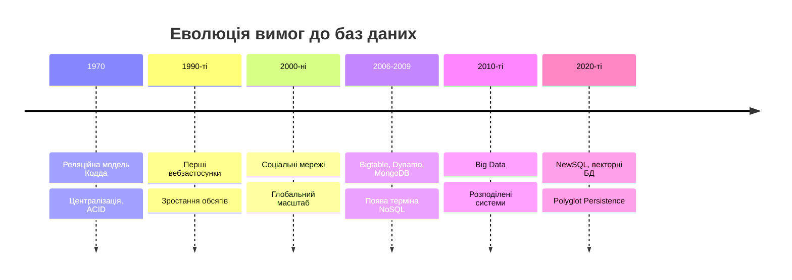

## Проблема масштабування

### 📈 **Вертикальне та горизонтальне**

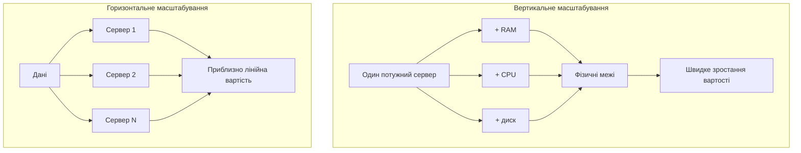

**Чому реляційні СУБД масштабуються горизонтально важко:**

- JOIN між вузлами ходить мережею
- Розподілені ACID-транзакції потребують координації (двофазна фіксація)
- Шардинг можливий (Vitess, Citus), але коштує зусиль і накладає обмеження

## Жорсткість схеми

### 🔒 **Зміна структури у робочій системі**

```sql
-- Початкова схема
CREATE TABLE users (
    user_id INT PRIMARY KEY,
    username VARCHAR(50),
    email VARCHAR(100)
);

-- Потрібно додати нові поля
ALTER TABLE users ADD COLUMN phone VARCHAR(20);
ALTER TABLE users ADD COLUMN preferences JSON;

-- У наявних записів нові поля дорівнюватимуть NULL
```

**Чесне уточнення:**

- PostgreSQL додає стовпець без значення за замовчуванням майже миттєво
- MySQL 8 має алгоритм `INSTANT`
- Проблема не зникла: змінюється ставлення до схеми, а різні записи потребують різних атрибутів

## Невідповідність імпедансів

### 🔄 **Об'єкти й реляційні таблиці**

**Об'єкт у застосунку:**

```javascript
const user = {
    id: "user123",
    name: "Іван Петров",
    addresses: [
        { type: "home", city: "Київ" },
        { type: "work", city: "Київ" }
    ],
    preferences: {
        language: "uk",
        notifications: { email: true, sms: false }
    }
};
```

**Реляційне представлення:**

```
users ──┬── addresses
        ├── preferences
        └── notification_settings

Чотири таблиці й кілька JOIN на один об'єкт
```

ORM приховує невідповідність, але не усуває її.

## Великі обсяги даних

### 📊 **Характеристики Big Data**

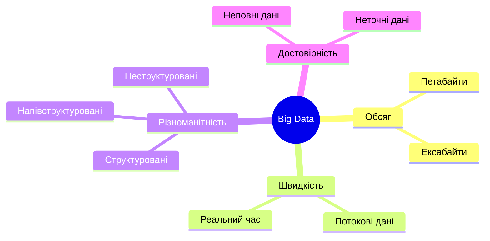

**Труднощі реляційних СУБД:**

- Повільні JOIN на великих обсягах
- Складне секціонування таблиць
- Дорога реплікація
- Аналітику краще віддати колонковим сховищам (ClickHouse, BigQuery)

## Географічна розподіленість

### 🌍 **Дані ближче до користувача**

**Виклики:**

- Затримки між дата-центрами: десятки й сотні мілісекунд
- Реплікація між регіонами
- Узгодженість за наявності збоїв мережі
- Вимоги законодавства до місця зберігання (GDPR)

Ці виклики безпосередньо пов'язані з теоремою CAP.

## Реляційні СУБД не стоять на місці

### 🔀 **Межі розмиваються**

- PostgreSQL: `JSONB` + GIN-індекси, `pgvector`, Citus
- MongoDB: багатодокументні ACID-транзакції, валідація схем
- Питання «SQL чи NoSQL?» стає інженерним, а не ідеологічним

Що вимагає задача: модель даних, узгодженість, масштаб.

## **2. Теорема CAP**

## Формулювання теореми

### 🎯 **Ерік Брюер, 2000 рік**

> Розподілена система не може одночасно гарантувати всі три властивості.

- **C** (Consistency) — кожне читання повертає останній запис (лінеаризованість)
- **A** (Availability) — кожен працюючий вузол відповідає на запит
- **P** (Partition tolerance) — система працює, коли мережа розпадається на частини

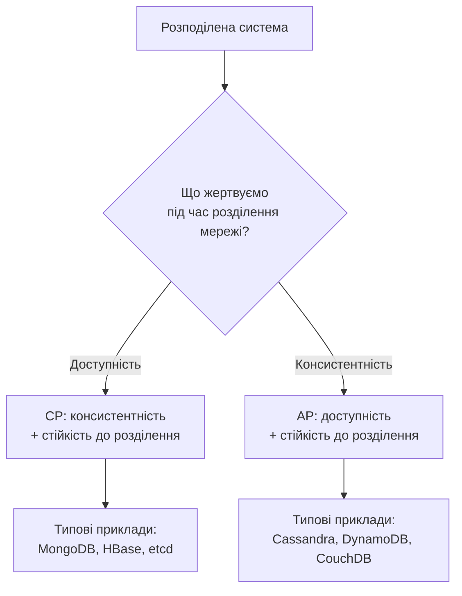

## Доказ теореми

### 🔬 **Сет Гілберт і Ненсі Лінч, 2002**

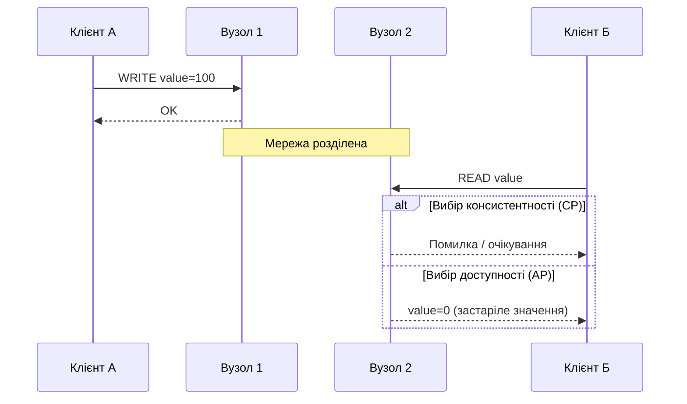

Третього варіанта немає: вузол 2 не знає про запис, не маючи зв'язку.

## Що CAP насправді стверджує

### ⚠️ **Чотири уточнення**

1. **P не є вибором.** Розділення трапляються, тож вибір C чи A лише під час розділення
2. **Категорії «CA» для розподіленої системи немає.** Одновузлова PostgreSQL поза межами CAP
3. **Вибір не бінарний.** Рівень узгодженості часто задають для кожної операції окремо
4. **«Доступність» у CAP вужча, ніж у побуті.** Відповідати має кожен працюючий вузол

## Практичне застосування CAP

### 🔒 **CP: MongoDB**

```javascript
db.users.insertOne(
    { name: "Іван Петров", email: "ivan@example.com" },
    { writeConcern: { w: "majority", wtimeout: 5000 } }
);
// Без більшості вузлів операція завершиться тайм-аутом
```

- Запис приймає лише Primary
- Primary у меншості самоусувається
- `w: "majority"` — типове значення з версії 5.0
- Ціна: короткочасна недоступність запису під час виборів

## AP та кворуми

### 🌐 **AP: Cassandra**

```javascript
await client.execute(
    'INSERT INTO users (user_id, name) VALUES (?, ?)',
    [types.Uuid.random(), 'Іван Петров'],
    { prepare: true, consistency: types.consistencies.one }
);
```

**Кворуми:** `N` реплік, запис підтверджують `W`, читання опитує `R`.

**Якщо `R + W > N`, читання побачить останній запис.**

| Налаштування (`N = 3`) | Рівень | Ефект |
|------------------------|--------|-------|
| `W = 2, R = 2` | `QUORUM` | Сильніша узгодженість |
| `W = 1, R = 1` | `ONE` | Швидкість і доступність |

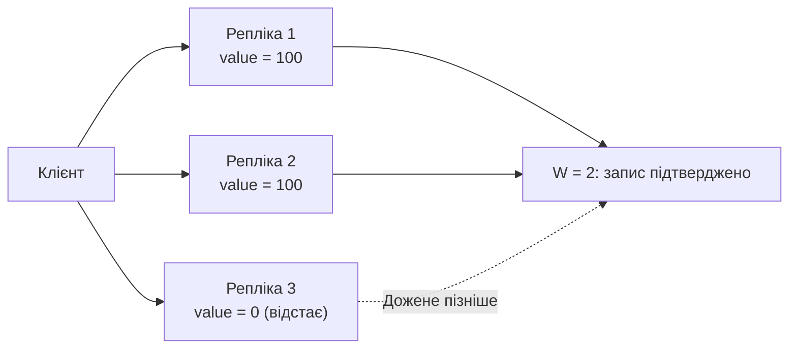

## PACELC

### 🔬 **Даніель Абаді, 2012**

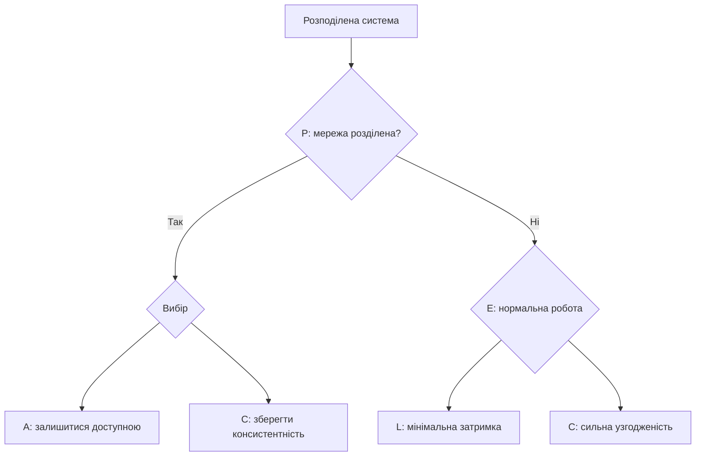

**Ключова ідея:** навіть без розділення є компроміс між затримкою та консистентністю.

- Cassandra, DynamoDB (типово): **PA/EL**
- MongoDB (типово): **PC/EC**

## **3. Семантика BASE**

## ACID та BASE

### ⚖️ **Два краї спектра**

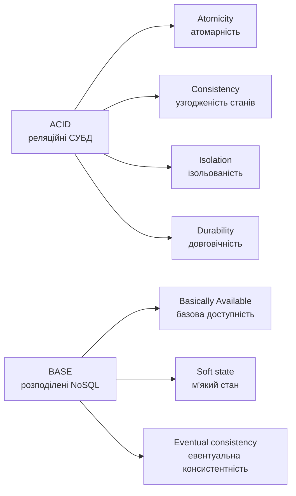

**Не плутати:** C в ACID — дотримання обмежень цілісності, C в CAP — узгодженість реплік.

Сучасні NoSQL пропонують ACID-транзакції там, де вони потрібні.

## Basically Available

### 🌐 **Плавна деградація**

**Принцип:** краще відповісти приблизно, ніж не відповісти.

```javascript
async function getLikesCount(postId) {
    try {
        const exactCount = await db.likes.countDocuments({ postId });
        return { count: exactCount, approximate: false };
    } catch (error) {
        const cached = await cache.get(`likes:${postId}`);
        return { count: cached ?? 0, approximate: true };
    }
}
```

Прийнятно для лічильника вподобань, неприйнятно для балансу рахунку.

## Soft State

### 🔄 **М'який стан**

**Принцип:** стан змінюється з часом навіть без нових запитів.

```javascript
get(key) {
    const item = this.data.get(key);
    if (!item) return null;
    if (item.expiresAt <= Date.now()) {   // TTL минув
        this.data.delete(key);
        return null;
    }
    return item.value;
}
```

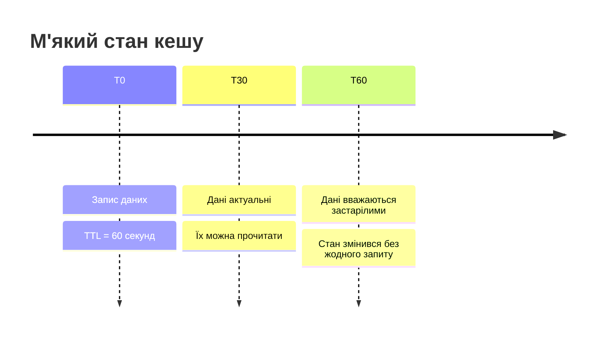

## Eventual Consistency

### ⏰ **Евентуальна консистентність**

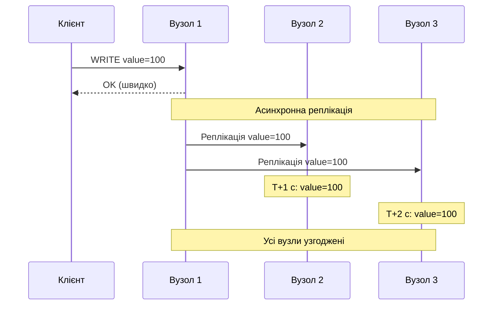

**Механізми доведення до узгодженості:**

- Read repair
- Anti-entropy (дерева Меркла)
- Hinted handoff
- Векторні годинники та CRDT

## Векторні годинники

### 🔧 **Причинно-наслідкові зв'язки**

```javascript
happensBefore(other) {
    // Перебираємо ОБ'ЄДНАННЯ ключів обох векторів
    const nodes = new Set([
        ...Object.keys(this.clock),
        ...Object.keys(other.clock)
    ]);
    let strictlySmaller = false;
    for (const node of nodes) {
        const a = this.clock[node] || 0;
        const b = other.clock[node] || 0;
        if (a > b) return false;
        if (a < b) strictlySmaller = true;
    }
    return strictlySmaller;
}
```

**Правила порівняння `A` і `B`:**

- `A ≤ B` за всіма компонентами й `<` хоча б в одному: `A` передує `B`
- Жодне не менше: події **конкурентні**, це справжній конфлікт

Ітерування лише по ключах одного вектора дає хибний результат.

## Розв'язання конфліктів

### ⚔️ **Стратегії примирення**

| Стратегія | Суть | Недолік |
|-----------|------|---------|
| **LWW** (last write wins) | Перемагає пізніша мітка часу | Розсинхронізація годинників, тиха втрата оновлень |
| **Siblings** | Зберігаються всі версії, вирішує застосунок | Складність переноситься в код |
| **CRDT** | Структури, що зливаються автоматично | Не універсальні: лічильники, множини, прапорці |

```javascript
function resolveConflict(v1, v2) {
    return v1.timestamp > v2.timestamp ? v1 : v2;   // LWW
}
```

## **4. Таксономія NoSQL систем**

## Типи NoSQL баз даних

### 📊 **П'ять категорій**

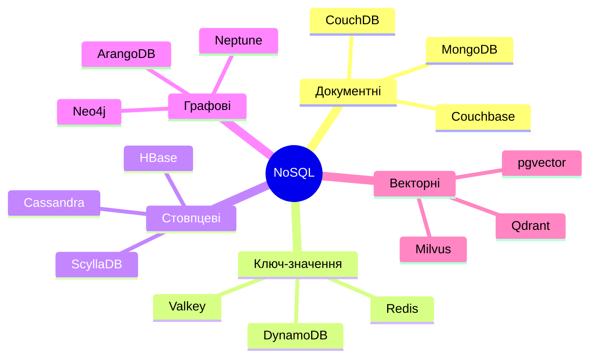

## Документні бази даних

### 📄 **MongoDB, Couchbase, CouchDB**

```javascript
{
    "_id": ObjectId("507f1f77bcf86cd799439011"),
    "title": "Вступ до NoSQL систем",
    "author": { "name": "Іван Петров", "email": "ivan@example.com" },
    "tags": ["nosql", "databases", "mongodb"],
    "comments": [
        { "user": "Марія Коваленко", "text": "Чудова стаття!", "likes": 5 }
    ],
    "metadata": { "views": 1523, "shares": 47 }
}
```

**Характеристики:**

- Гнучка схема з необов'язковою валідацією
- Вкладені структури й масиви
- Індексація довільних полів

**Сфери:** CMS, каталоги товарів, профілі. PostgreSQL з `JSONB` закриває багато таких сценаріїв.

## Операції з документами

### 🔍 **Пошук та оновлення**

```javascript
// Пошук за вкладеними полями та масивами
db.posts.find({ tags: "nosql", "metadata.views": { $gt: 1000 } });

// Оновлення вкладеної структури
db.posts.updateOne(
    { _id: ObjectId("507f1f77bcf86cd799439011") },
    {
        $push: { comments: { user: "Новий користувач", text: "Коментар", date: new Date() } },
        $inc: { "metadata.views": 1 }
    }
);
```

MongoDB розглядаємо детально в лекції 10.

## Сховища «ключ-значення»

### 🗝️ **Redis, Valkey, DynamoDB**

```javascript
await redis.set('user:1001:name', 'Іван Петров');
await redis.hset('user:1001', { name: 'Іван Петров', age: '25' });
await redis.sadd('user:1001:friends', 'user:1002', 'user:1003');
await redis.zadd('leaderboard', 100, 'user:1001');

// TTL, атомарність, публікація/підписка
await redis.set('session:abc123', data, 'EX', 3600);
await redis.incr('page:views:homepage');
await redis.publish('notifications', message);
```

**✅ Переваги:** максимальна швидкість, простота

**❌ Недоліки:** обмежені запити; асинхронна реплікація може втратити підтверджені записи, а Redis Cluster не гарантує сильної консистентності

## Ліцензійна історія Redis

### ⚖️ **Технологія — це ще й ліцензія**

- **2024:** Redis змінює ліцензію з BSD на RSALv2/SSPLv1 (не є відкритим кодом за OSI)
- **Відповідь:** Linux Foundation підтримує форк **Valkey** (Amazon, Google та інші)
- **2025:** із Redis 8 додано AGPLv3 як один із варіантів

**Висновок:** вибір залежить і від ліцензійної моделі, і від стійкості спільноти.

## Стовпцеві бази даних

### 📊 **Cassandra, ScyllaDB, HBase**

```cql
CREATE TABLE users_by_country (
    country text,                 -- ключ секції
    registration_date timestamp,  -- ключ кластеризації
    user_id uuid,
    name text,
    email text,
    PRIMARY KEY ((country), registration_date, user_id)
) WITH CLUSTERING ORDER BY (registration_date DESC, user_id ASC);

SELECT * FROM users_by_country
WHERE country = 'Ukraine' AND registration_date > '2026-01-01';
```

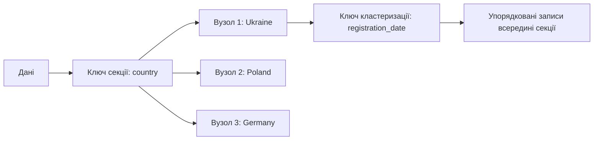

**Принцип:** спершу запити, потім таблиця під кожен із них.

## Графові бази даних

### 🕸️ **Neo4j, Neptune, ArangoDB**

```cypher
CREATE (ivan:Person {name: 'Іван Петров', age: 25})
CREATE (maria:Person {name: 'Марія Коваленко', age: 23})
CREATE (kyiv:City {name: 'Київ'})
CREATE (ivan)-[:LIVES_IN]->(kyiv)
CREATE (maria)-[:LIVES_IN]->(kyiv)
CREATE (ivan)-[:FRIEND_OF {since: 2019}]->(maria)

// Друзі друзів
MATCH (p:Person {name: 'Іван Петров'})-[:FRIEND_OF*1..2]-(friend)
WHERE friend <> p
RETURN DISTINCT friend.name
```

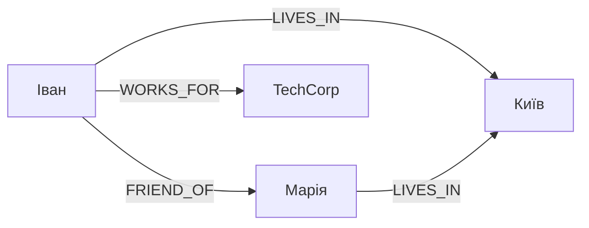

**Мови:** Cypher / openCypher, стандарт **ISO/IEC 39075 GQL** (2024), SQL/PGQ у SQL:2023.

## Векторні бази даних

### 🧭 **П'ята категорія**

- Зберігають **вектори-вбудови** (embeddings) тексту, зображень, звуку
- Основна операція: пошук `k` найближчих сусідів (k-NN)
- Наближені алгоритми (ANN), найпопулярніший HNSW: трохи точності за швидкість на порядки вищу
- Основа **RAG** та пам'яті ШІ-агентів

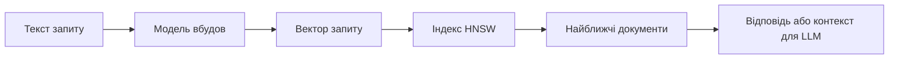

**Представники:** Qdrant, Milvus, Weaviate, Pinecone; **вбудовані:** pgvector, Atlas Vector Search, Elasticsearch.

## Інші та мультимодельні системи

### 🧩 **Класифікація не вичерпується п'ятьма типами**

- **Часові ряди:** InfluxDB, TimescaleDB, time series collections у MongoDB
- **Пошукові системи:** Elasticsearch, OpenSearch (лекція 11)
- **Мультимодельні:** ArangoDB, Azure Cosmos DB

## Порівняльна таблиця

### 📋 **Коли що використовувати**

| Тип | Модель | Сильні сторони | Використання |
|-----|--------|----------------|--------------|
| **📄 Документи** | Гнучкі JSON | Схожість на об'єкти | CMS, каталоги, профілі |
| **🗝️ Ключ-значення** | Проста пара | Максимальна швидкість | Кеш, сесії, лічильники |
| **📊 Стовпцеві** | Широкі таблиці | Масштаб запису | Журнали, метрики, IoT |
| **🕸️ Графи** | Вузли та ребра | Складні зв'язки | Соцмережі, рекомендації |
| **🧭 Вектори** | Вбудови | Семантична близькість | RAG, рекомендації |

## **5. NoSQL, NewSQL і PostgreSQL**

## NewSQL

### 🔁 **Реляційна модель + горизонтальне масштабування**

- **Представники:** Google Spanner, CockroachDB, TiDB, YugabyteDB
- SQL і ACID-транзакції поверх розподіленого сховища
- Консенсус (Raft, Paxos); у Spanner ще й синхронізовані годинники TrueTime
- **Ціна:** вища затримка запису й складніша експлуатація
- У термінах CAP переважно CP-системи

## Як вибирати сьогодні

### 🧭 **Ситуація → початковий вибір**

| Ситуація | Розумний початковий вибір |
|----------|---------------------------|
| Типовий вебзастосунок, структуровані дані, один сервер | PostgreSQL (з `JSONB` для гнучких частин) |
| Вкладені документи, мінлива схема | MongoDB або `JSONB` |
| Кеш, сесії, лічильники | Redis або Valkey |
| Інтенсивний запис, відомі запити, багато регіонів | Cassandra, ScyllaDB, DynamoDB |
| Зв'язки й глибокі обходи | Графова БД |
| Повнотекстовий пошук, фасети | Elasticsearch, OpenSearch |
| Семантичний пошук, RAG | Векторний індекс |
| Реляційна модель + глобальний масштаб | NewSQL |

**Правило:** починайте з найпростішого рішення, що відповідає вимогам.

## **6. Polyglot Persistence**

## Концепція

### 🎯 **Різні задачі, різні інструменти**

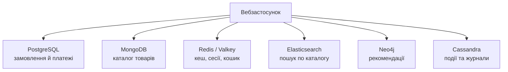

**Принцип:** кожна БД для своєї задачі, а не одна для всього. Складність виправдана лише тоді, коли окупається спеціалізацією.

## Приклад: інтернет-магазин

### 🛒 **Транзакції та каталог**

**PostgreSQL:**

```sql
BEGIN;
WITH new_order AS (
    INSERT INTO orders (user_id, total_amount, status)
    VALUES (1001, 299.99, 'pending')
    RETURNING order_id
)
INSERT INTO order_items (order_id, product_id, quantity, price)
SELECT order_id, 501, 2, 149.99 FROM new_order;

UPDATE products SET stock = stock - 2
WHERE product_id = 501 AND stock >= 2;
COMMIT;
```

**MongoDB:**

```javascript
db.products.insertOne({
    sku: "LAPTOP-DELL-5520",
    name: "Dell Latitude 5520",
    price: NumberDecimal("35999.00"),
    specifications: { processor: "Intel Core i7", ram: "16GB", storage: "512GB SSD" }
});
```

## Кеш і пошук

### ⚡ **Redis та Elasticsearch**

```javascript
// Redis: кошик і сесія
await redis.hset('cart:user:1001', { 'product:501': '2' });
await redis.set('session:abc123xyz', JSON.stringify({ userId: 1001 }), 'EX', 1800);

// Elasticsearch 8+: параметри без обгортки body
const results = await esClient.search({
    index: 'products',
    query: {
        multi_match: { query: 'ноутбук core i7', fields: ['name^2', 'description'] }
    },
    aggs: { categories: { terms: { field: 'category.keyword' } } }
});
```

Докладно про Elasticsearch: лекція 11.

## Рекомендації та журнали

### 🕸️ **Neo4j та Cassandra**

```cypher
MATCH (u:User {id: 1001})-[:PURCHASED]->(:Product)<-[:PURCHASED]-(similar:User)
      -[:PURCHASED]->(rec:Product)
WHERE NOT (u)-[:PURCHASED]->(rec)
RETURN rec, COUNT(similar) AS score
ORDER BY score DESC
LIMIT 5
```

```cql
CREATE TABLE user_activity (
    user_id uuid, activity_date date, activity_time timestamp,
    activity_type text, product_id int,
    PRIMARY KEY ((user_id, activity_date), activity_time)
) WITH CLUSTERING ORDER BY (activity_time DESC);
```

Секція `(user_id, activity_date)` обмежує розмір кожної секції.

## Виклики Polyglot Persistence

### ⚠️ **Що потрібно враховувати**

**Інтеграція:**

- Кілька з'єднань і драйверів
- Синхронізація даних між системами
- Немає єдиної транзакції на кілька баз

**Експлуатація:**

- Різні інструменти моніторингу
- Експертиза в кількох технологіях
- Складне резервне копіювання

**Консистентність:**

- Між системами лише евентуальна
- **Єдине джерело істини** для кожного виду даних; решта копій похідні

## Transactional Outbox і CDC

### 📮 **Проти «подвійного запису»**

**Проблема:** запис у PostgreSQL, а потім окремий виклик Elasticsearch. Збій між ними розводить системи.

```sql
BEGIN;
INSERT INTO orders (user_id, total_amount, status) VALUES (1001, 299.99, 'pending');
INSERT INTO outbox (aggregate_type, aggregate_id, event_type, payload)
VALUES ('order', 42, 'OrderCreated', '{"orderId": 42, "total": 299.99}');
COMMIT;
```

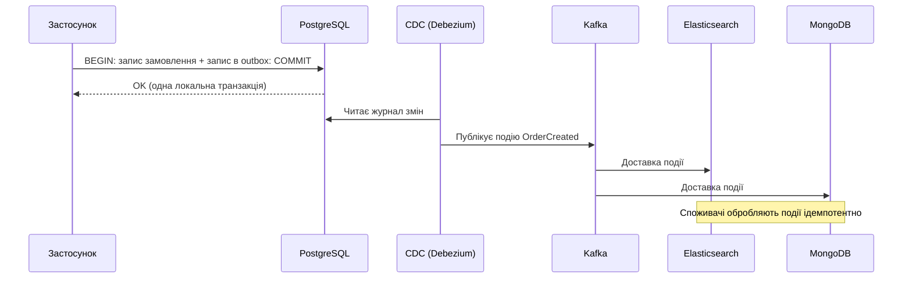

Доставка «принаймні один раз», тому споживачі мусять бути **ідемпотентними**.

## CQRS

### 📖 **Command Query Responsibility Segregation**

```javascript
// Команда: запис у транзакційну БД + подія в outbox
class CreateOrderCommand {
    async execute(orderData) {
        return await postgres.transaction(async (tx) => {
            const order = await tx.orders.create(orderData);
            await tx.outbox.create({ type: 'OrderCreated', payload: order });
            return order;
        });
    }
}

// Запит: читання з моделі, оптимізованої під читання
class OrderQueryService {
    async getOrderDetails(orderId) {
        return await mongodb.collection('orders_view').findOne({ _id: orderId });
    }
}
```

CQRS не є Event Sourcing, хоча вони часто зустрічаються разом.

## Event Sourcing

### 🧾 **Журнал подій як джерело істини**

```javascript
const events = [
    { type: 'AccountOpened',  data: { accountId: 'A1' } },
    { type: 'MoneyDeposited', data: { amount: 500 } },
    { type: 'MoneyWithdrawn', data: { amount: 120 } }
];

function balance(events) {
    return events.reduce((sum, e) => {
        if (e.type === 'MoneyDeposited') return sum + e.data.amount;
        if (e.type === 'MoneyWithdrawn') return sum - e.data.amount;
        return sum;
    }, 0);
}
// balance(events) === 380
```

| | Outbox | Event Sourcing |
|---|--------|----------------|
| **Події** | Повідомляють про вже збережену зміну | Самі є сховищем |
| **Для чого** | Синхронізація систем | Аудит, відтворення стану |

Патерн для специфічних областей (фінанси, логістика), а не для будь-якого застосунку.

## Висновки

### 🎓 **Ключові тези**

**1. Обмеження реляційної моделі:**

- Масштабування, схема, невідповідність імпедансів
- Реляційні СУБД теж еволюціонують (`JSONB`, `pgvector`, Citus)

**2. CAP і PACELC:**

- Вибір C чи A лише під час розділення
- У нормальному режимі компроміс між затримкою та консистентністю
- Системи описують поведінкою за налаштувань, а не мітками

**3. BASE:**

- Спосіб мислення, а не властивість продукту
- Евентуальна консистентність, векторні годинники, CRDT

**4. Таксономія:**

- Документні, ключ-значення, стовпцеві, графові, векторні

**5. Вибір технології:**

- Почніть із найпростішого, часто це PostgreSQL

**6. Polyglot Persistence:**

- Єдине джерело істини, Outbox і CDC, ідемпотентні споживачі

**Далі:** лекція 10, MongoDB.
