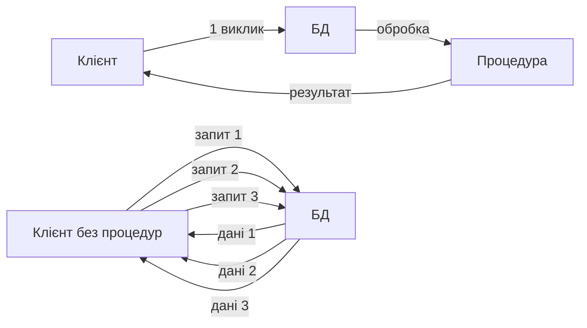
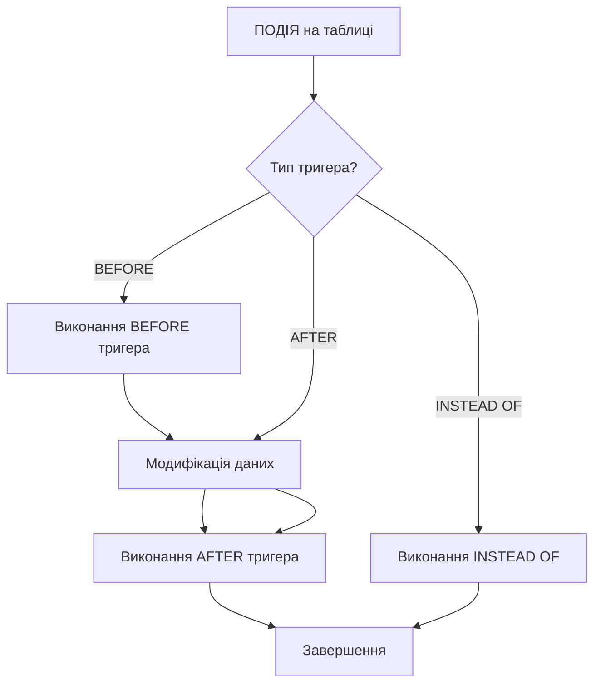
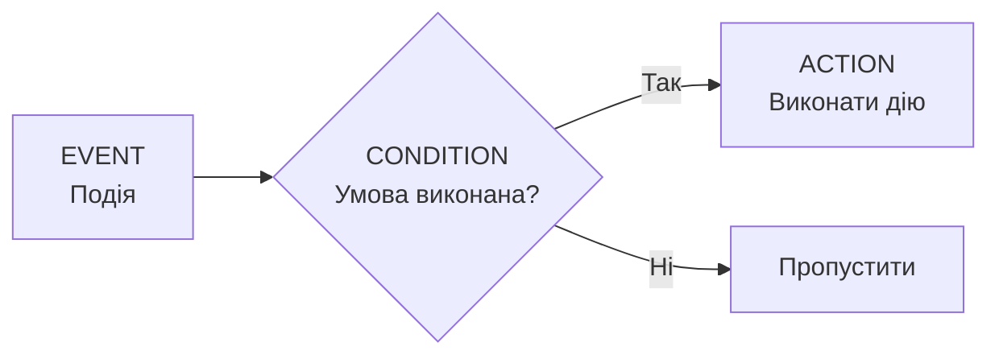
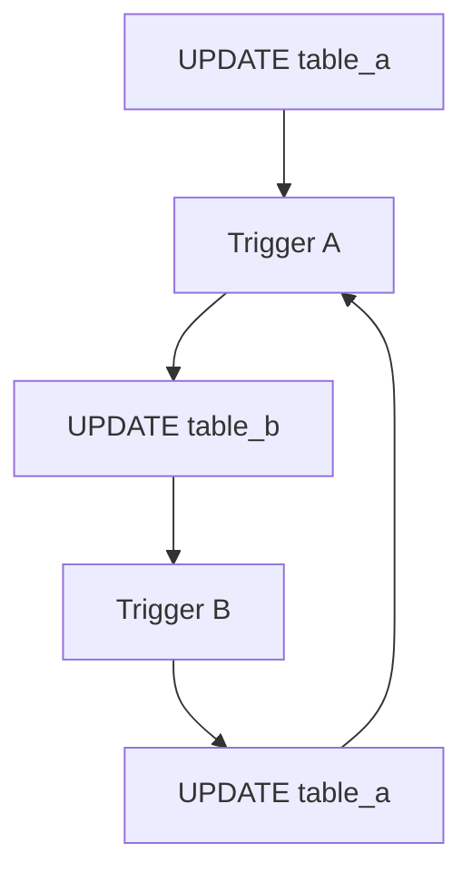
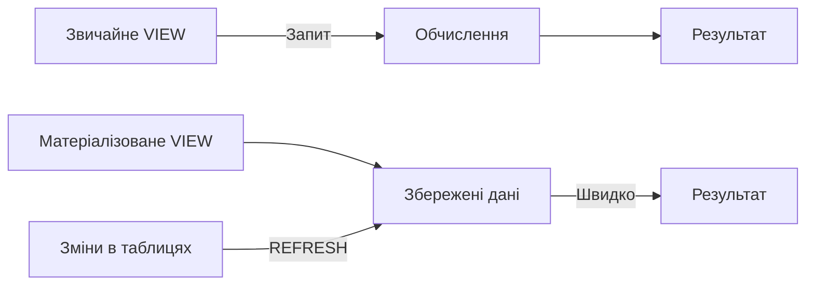
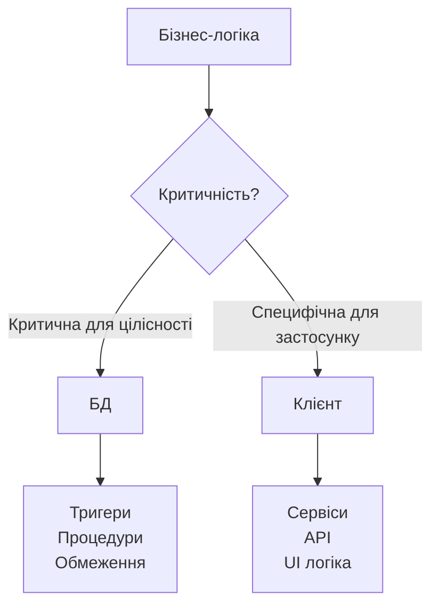

# Збережені процедури та активні бази даних

## План лекції

1. Архітектура серверного програмування
2. Тригери: семантика та класифікація
3. Управління подіями та правилами
4. Представлення (VIEW)
5. Компроміси: сервер vs клієнт

## **🎯 Ключові концепції**

**Збережена процедура** — іменований блок коду, що зберігається в БД та виконує певні дії.

**Тригер** — спеціальна процедура, що автоматично виконується у відповідь на події в БД.

**Представлення (VIEW)** — віртуальна таблиця, що базується на результаті SQL-запиту.

**Активна база даних** — БД, яка може самостійно реагувати на події без явних команд від застосунку.

## **1. Архітектура серверного програмування**

## Процедурні розширення SQL

### 🔧 **Кожна СУБД має власну процедурну мову:**

- **PostgreSQL:** PL/pgSQL
- **Oracle:** PL/SQL
- **SQL Server:** T-SQL
- **MySQL:** SQL/PSM

### 💡 **Навіщо потрібні?**

SQL — декларативна мова для роботи з множинами даних, але:

- Обмежена процедурна логіка
- Немає складних обчислень
- Відсутні структури управління потоком

## Приклад: PL/pgSQL

```sql
CREATE OR REPLACE FUNCTION calculate_order_total(order_id_param INTEGER)
RETURNS NUMERIC AS $$
DECLARE
    total_amount NUMERIC := 0;
    item_record RECORD;
BEGIN
    -- Обчислення суми замовлення
    FOR item_record IN
        SELECT quantity, unit_price
        FROM order_items
        WHERE order_id = order_id_param
    LOOP
        total_amount := total_amount +
            (item_record.quantity * item_record.unit_price);
    END LOOP;

    RETURN total_amount;
EXCEPTION
    WHEN NO_DATA_FOUND THEN
        RETURN 0;
END;
$$ LANGUAGE plpgsql;
```

## Основні елементи

### 📦 **Змінні та типи даних:**

```sql
DECLARE
    total_sales NUMERIC(10,2);
    customer_name VARCHAR(100);
    order_date DATE := CURRENT_DATE;
    is_premium BOOLEAN := FALSE;
```

### 🔄 **Структури управління:**

```sql
-- Умовні конструкції
IF total_amount > 1000 THEN
    discount_rate := 0.10;
ELSIF total_amount > 500 THEN
    discount_rate := 0.05;
ELSE
    discount_rate := 0;
END IF;

-- Цикли
FOR counter IN 1..10 LOOP
    INSERT INTO logs (message)
    VALUES ('Ітерація ' || counter);
END LOOP;
```

## Процедури vs Функції

### ⚙️ **Збережена процедура:**

- Виконує дії, може не повертати значення
- Може змінювати стан БД
- Повертає результати через OUT параметри

### 🔢 **Функція:**

- Завжди повертає значення
- Використовується у виразах SQL
- Не повинна змінювати стан (теоретично)

```sql
-- Функція
SELECT get_customer_discount(1001);

-- Процедура
CALL process_monthly_billing();
```

## Переваги серверного програмування

### ✅ **Ключові переваги:**

1. **Централізація логіки** — єдине джерело правил
2. **Зменшення трафіку** — обробка біля даних
3. **Транзакційна цілісність** — все в одній транзакції
4. **Безпека** — контроль доступу через процедури
5. **Продуктивність** — оптимізація на сервері



## **2. Тригери**

## Концепція тригерів

### 🎯 **Що таке тригер?**

Спеціальна процедура, що **автоматично** виконується у відповідь на:

- INSERT — вставка нових даних
- UPDATE — зміна існуючих даних
- DELETE — видалення даних

### 📋 **Базова структура:**

```sql
CREATE TRIGGER trigger_name
    {BEFORE | AFTER | INSTEAD OF}
    {INSERT | UPDATE | DELETE}
    ON table_name
    [FOR EACH {ROW | STATEMENT}]
    EXECUTE FUNCTION function_name();
```

## Класифікація за часом виконання



### ⏰ **Три типи:**

- **BEFORE** — до модифікації, може змінити/скасувати
- **AFTER** — після модифікації, для каскадних змін
- **INSTEAD OF** — замість операції, для VIEW

## BEFORE тригери

### ✏️ **Валідація та модифікація перед збереженням:**

```sql
CREATE OR REPLACE FUNCTION validate_employee_salary()
RETURNS TRIGGER AS $$
BEGIN
    -- Валідація
    IF NEW.salary < 0 THEN
        RAISE EXCEPTION 'Зарплата не може бути від''ємною';
    END IF;

    -- Автоматична нормалізація
    NEW.salary := ROUND(NEW.salary, 2);

    -- Автоматичне заповнення
    NEW.last_modified := CURRENT_TIMESTAMP;

    -- Перевірка максимуму
    IF NEW.salary > (SELECT max_salary
                     FROM positions
                     WHERE position_id = NEW.position_id) THEN
        RAISE EXCEPTION 'Перевищено максимум для посади';
    END IF;

    RETURN NEW; -- повертаємо модифікований запис
END;
$$ LANGUAGE plpgsql;

CREATE TRIGGER check_employee_salary
    BEFORE INSERT OR UPDATE ON employees
    FOR EACH ROW
    EXECUTE FUNCTION validate_employee_salary();
```

## AFTER тригери

### 📊 **Каскадні зміни та аудит:**

```sql
CREATE OR REPLACE FUNCTION audit_salary_changes()
RETURNS TRIGGER AS $$
BEGIN
    -- Логування всіх змін
    INSERT INTO salary_audit (
        employee_id,
        old_salary,
        new_salary,
        changed_by,
        changed_at,
        operation_type
    ) VALUES (
        COALESCE(NEW.employee_id, OLD.employee_id),
        OLD.salary,
        NEW.salary,
        current_user,
        CURRENT_TIMESTAMP,
        TG_OP
    );

    -- Сповіщення про значні зміни
    IF TG_OP = 'UPDATE' AND
       ABS(NEW.salary - OLD.salary) > OLD.salary * 0.10 THEN
        INSERT INTO notifications (message)
        VALUES ('Значна зміна зарплати: ' || NEW.employee_id);
    END IF;

    RETURN NEW;
END;
$$ LANGUAGE plpgsql;
```

## Рівні гранулярності

### 🎚️ **ROW vs STATEMENT:**

| Характеристика | FOR EACH ROW | FOR EACH STATEMENT |
|----------------|--------------|-------------------|
| **Частота виконання** | Для кожного рядка | Один раз на операцію |
| **Доступ до даних** | NEW/OLD змінні | Немає доступу до рядків |
| **Використання** | Валідація, аудит | Логування операцій |
| **Продуктивність** | Повільніше | Швидше |

```sql
-- ROW-level: для кожного зміненого рядка
CREATE TRIGGER track_product_changes
    AFTER UPDATE ON products
    FOR EACH ROW
    EXECUTE FUNCTION maintain_product_history();

-- STATEMENT-level: один раз для всієї операції
CREATE TRIGGER monitor_bulk_changes
    AFTER DELETE ON critical_data
    FOR EACH STATEMENT
    EXECUTE FUNCTION log_bulk_operations();
```

## Області застосування тригерів

### 🎯 **Основні сценарії:**

1. **🔒 Цілісність даних**
    - Складні бізнес-правила
    - Перехресні перевірки
    - Обмеження на кілька таблиць

2. **📝 Аудит та логування**
    - Автоматичний запис змін
    - Журнал операцій
    - Відстеження користувачів

3. **📊 Денормалізація**
    - Підтримка агрегатів
    - Кешування обчислень
    - Синхронізація даних

4. **🔗 Каскадні операції**
    - Складні зв'язки
    - Автоматичне оновлення
    - Бізнес-процеси

## Приклад: підтримка цілісності

```sql
CREATE OR REPLACE FUNCTION enforce_project_constraints()
RETURNS TRIGGER AS $$
DECLARE
    active_projects INTEGER;
    employee_capacity INTEGER;
BEGIN
    -- Правило 1: максимум 3 активних проєкти
    SELECT COUNT(*) INTO active_projects
    FROM project_assignments
    WHERE employee_id = NEW.employee_id
        AND status = 'ACTIVE';

    IF active_projects >= 3 THEN
        RAISE EXCEPTION 'Співробітник вже працює над
                         максимальною кількістю проєктів';
    END IF;

    -- Правило 2: завантаженість не більше 100%
    SELECT COALESCE(SUM(allocation_percentage), 0)
    INTO employee_capacity
    FROM project_assignments
    WHERE employee_id = NEW.employee_id
        AND status = 'ACTIVE';

    IF employee_capacity + NEW.allocation_percentage > 100 THEN
        RAISE EXCEPTION 'Перевищено допустиму завантаженість';
    END IF;

    RETURN NEW;
END;
$$ LANGUAGE plpgsql;
```

## Приклад: денормалізація

```sql
-- Автоматичне оновлення агрегатів
CREATE OR REPLACE FUNCTION update_order_statistics()
RETURNS TRIGGER AS $$
BEGIN
    -- Оновлення загальної суми та кількості позицій
    UPDATE orders
    SET
        total_items = (
            SELECT COUNT(*)
            FROM order_items
            WHERE order_id = COALESCE(NEW.order_id, OLD.order_id)
        ),
        total_amount = (
            SELECT COALESCE(SUM(quantity * unit_price), 0)
            FROM order_items
            WHERE order_id = COALESCE(NEW.order_id, OLD.order_id)
        ),
        last_modified = CURRENT_TIMESTAMP
    WHERE order_id = COALESCE(NEW.order_id, OLD.order_id);

    RETURN COALESCE(NEW, OLD);
END;
$$ LANGUAGE plpgsql;

CREATE TRIGGER maintain_order_totals
    AFTER INSERT OR UPDATE OR DELETE ON order_items
    FOR EACH ROW
    EXECUTE FUNCTION update_order_statistics();
```

## **3. Управління подіями**

## Модель ECA

### 📐 **Event-Condition-Action:**



### 🎯 **Компоненти:**

- **Event** — що викликає правило (INSERT, UPDATE, DELETE, час)
- **Condition** — перевірка умови після події
- **Action** — що виконується, якщо умова справджується

## Приклад ECA моделі

```sql
CREATE OR REPLACE FUNCTION eca_low_stock_alert()
RETURNS TRIGGER AS $$
BEGIN
    -- EVENT: UPDATE на inventory

    -- CONDITION: рівень запасів нижче порогу
    IF NEW.stock_quantity < (
        SELECT reorder_level
        FROM products
        WHERE product_id = NEW.product_id
    ) AND NEW.stock_quantity < OLD.stock_quantity THEN

        -- ACTION 1: створення замовлення постачальнику
        INSERT INTO purchase_orders (product_id, supplier_id, quantity)
        SELECT NEW.product_id, preferred_supplier_id, optimal_order_quantity
        FROM products WHERE product_id = NEW.product_id;

        -- ACTION 2: відправка сповіщення
        INSERT INTO notifications (type, message, priority)
        VALUES (
            'LOW_STOCK_ALERT',
            format('Низький рівень запасів для товару %s', NEW.product_id),
            'HIGH'
        );
    END IF;

    RETURN NEW;
END;
$$ LANGUAGE plpgsql;
```

## Складні правила

### 🧩 **Множинні умови та залежності:**

```sql
CREATE OR REPLACE FUNCTION complex_pricing_rule()
RETURNS TRIGGER AS $$
DECLARE
    customer_tier VARCHAR(20);
    seasonal_discount NUMERIC;
BEGIN
    -- Визначення категорії клієнта
    SELECT
        CASE
            WHEN total_spent > 50000 THEN 'PLATINUM'
            WHEN total_spent > 20000 THEN 'GOLD'
            WHEN total_spent > 5000 THEN 'SILVER'
            ELSE 'STANDARD'
        END INTO customer_tier
    FROM customers WHERE customer_id = NEW.customer_id;

    -- Базова ціна
    NEW.unit_price := (SELECT base_price FROM products
                       WHERE product_id = NEW.product_id);

    -- Знижка за категорією
    NEW.unit_price := NEW.unit_price * (
        CASE customer_tier
            WHEN 'PLATINUM' THEN 0.85
            WHEN 'GOLD' THEN 0.90
            WHEN 'SILVER' THEN 0.95
            ELSE 1.0
        END
    );

    -- Знижка за обсяг
    IF NEW.quantity >= 100 THEN
        NEW.unit_price := NEW.unit_price * 0.90;
    END IF;

    RETURN NEW;
END;
$$ LANGUAGE plpgsql;
```

## Управління ланцюжками тригерів

### ⚠️ **Проблема: циклічні виклики**



### 🛡️ **Рішення: контроль глибини:**

```sql
CREATE OR REPLACE FUNCTION prevent_trigger_recursion()
RETURNS TRIGGER AS $$
DECLARE
    current_depth INTEGER;
    max_depth CONSTANT INTEGER := 5;
BEGIN
    -- Перевірка глибини вкладеності
    SELECT COALESCE(MAX(depth), 0) INTO current_depth
    FROM trigger_execution_context
    WHERE trigger_name = TG_NAME
        AND started_at > CURRENT_TIMESTAMP - INTERVAL '1 second';

    IF current_depth >= max_depth THEN
        RAISE EXCEPTION 'Виявлено циклічний виклик тригера %', TG_NAME;
    END IF;

    -- Реєстрація виконання
    INSERT INTO trigger_execution_context (trigger_name, depth)
    VALUES (TG_NAME, current_depth + 1);

    RETURN NEW;
END;
$$ LANGUAGE plpgsql;
```

## **4. Представлення (VIEW)**

## Концепція представлень

### 🖼️ **VIEW — віртуальна таблиця:**

- Базується на SQL-запиті
- Не зберігає дані фізично
- Обчислюється динамічно при зверненні
- Спрощує складні запити

```sql
-- Створення представлення
CREATE VIEW employee_summary AS
SELECT
    e.employee_id,
    e.first_name || ' ' || e.last_name AS full_name,
    d.department_name,
    p.position_name,
    e.salary,
    EXTRACT(YEAR FROM AGE(CURRENT_DATE, e.hire_date)) AS years_employed
FROM employees e
JOIN departments d ON e.department_id = d.department_id
JOIN positions p ON e.position_id = p.position_id
WHERE e.status = 'ACTIVE';

-- Використання як звичайної таблиці
SELECT * FROM employee_summary
WHERE years_employed > 5;
```

## Переваги представлень

### ✅ **Ключові переваги:**

1. **🎭 Абстракція складності**
    - Приховування JOIN-операцій
    - Спрощення запитів
    - Інкапсуляція логіки

2. **🔒 Безпека**
    - Обмеження доступу
    - Приховування чутливих даних
    - Гранулярний контроль

3. **🔄 Логічна незалежність**
    - Зміна структури таблиць
    - Стабільний інтерфейс
    - Зворотна сумісність

4. **📊 Оптимізація**
    - Попереднє обчислення
    - Матеріалізація
    - Індексація

## Приклад: безпека через VIEW

```sql
-- Повна таблиця співробітників (конфіденційна)
CREATE TABLE employees (
    employee_id INT,
    first_name VARCHAR(50),
    last_name VARCHAR(50),
    email VARCHAR(100),
    salary NUMERIC(10,2),      -- конфіденційно
    ssn VARCHAR(11),            -- конфіденційно
    department_id INT
);

-- Представлення для HR (без зарплати)
CREATE VIEW hr_employee_view AS
SELECT
    employee_id,
    first_name,
    last_name,
    email,
    department_id
FROM employees;

-- Представлення для менеджерів (тільки їх відділ)
CREATE VIEW manager_employee_view AS
SELECT
    employee_id,
    first_name,
    last_name,
    email
FROM employees
WHERE department_id = (
    SELECT department_id
    FROM employees
    WHERE employee_id = current_user_id()
);

-- Надання доступу
GRANT SELECT ON hr_employee_view TO hr_staff;
GRANT SELECT ON manager_employee_view TO managers;
REVOKE ALL ON employees FROM hr_staff, managers;
```

## Оновлювані представлення

### ✏️ **Критерії оновлюваності:**

Представлення може підтримувати INSERT/UPDATE/DELETE, якщо:
- Базується на одній таблиці
- Немає агрегатних функцій
- Немає DISTINCT, GROUP BY, HAVING
- Немає UNION, INTERSECT
- Включає всі обов'язкові стовпці

```sql
-- Оновлюване представлення
CREATE VIEW active_employees AS
SELECT
    employee_id,
    first_name,
    last_name,
    email,
    salary
FROM employees
WHERE status = 'ACTIVE';

-- Операції працюють безпосередньо
UPDATE active_employees
SET salary = salary * 1.05
WHERE department_id = 10;

INSERT INTO active_employees (first_name, last_name, email)
VALUES ('Іван', 'Петренко', 'ivan@company.com');
```

## INSTEAD OF тригери

### 🔄 **Оновлення складних представлень:**

```sql
-- Складне представлення з JOIN
CREATE VIEW employee_department_view AS
SELECT
    e.employee_id,
    e.first_name,
    e.last_name,
    d.department_id,
    d.department_name
FROM employees e
JOIN departments d ON e.department_id = d.department_id;

-- INSTEAD OF тригер для UPDATE
CREATE OR REPLACE FUNCTION update_employee_department()
RETURNS TRIGGER AS $$
BEGIN
    -- Оновлення таблиці співробітників
    UPDATE employees
    SET
        first_name = NEW.first_name,
        last_name = NEW.last_name
    WHERE employee_id = NEW.employee_id;

    -- Оновлення таблиці департаментів
    IF OLD.department_name IS DISTINCT FROM NEW.department_name THEN
        UPDATE departments
        SET department_name = NEW.department_name
        WHERE department_id = NEW.department_id;
    END IF;

    RETURN NEW;
END;
$$ LANGUAGE plpgsql;

CREATE TRIGGER update_employee_dept_view
    INSTEAD OF UPDATE ON employee_department_view
    FOR EACH ROW
    EXECUTE FUNCTION update_employee_department();
```

## Матеріалізовані представлення

### 💾 **Materialized VIEW — фізичне зберігання:**



### ⚡ **Переваги:**

- Швидкий доступ до складних агрегацій
- Фізичні індекси
- Кешування обчислень

### ⚠️ **Недоліки:**

- Потребує оновлення
- Займає місце на диску
- Можуть бути застарілі дані

## Приклад матеріалізованого VIEW

```sql
-- Створення з агрегаціями
CREATE MATERIALIZED VIEW sales_analytics AS
SELECT
    p.category,
    DATE_TRUNC('month', o.order_date) AS month,
    COUNT(DISTINCT o.order_id) AS orders_count,
    SUM(oi.quantity * oi.unit_price) AS total_revenue,
    AVG(oi.quantity * oi.unit_price) AS avg_order_value
FROM products p
JOIN order_items oi ON p.product_id = oi.product_id
JOIN orders o ON oi.order_id = o.order_id
WHERE o.status = 'COMPLETED'
GROUP BY p.category, DATE_TRUNC('month', o.order_date);

-- Створення індексу
CREATE INDEX idx_sales_analytics_category_month
ON sales_analytics(category, month);

-- Запити виконуються миттєво
SELECT * FROM sales_analytics
WHERE month >= '2025-01-01'
ORDER BY total_revenue DESC;

-- Оновлення даних
REFRESH MATERIALIZED VIEW sales_analytics;

-- Конкурентне оновлення (не блокує читання)
REFRESH MATERIALIZED VIEW CONCURRENTLY sales_analytics;
```

## Стратегії оновлення

### 🔄 **Три підходи:**

1. **Повне оновлення**
    - Перебудова всіх даних
    - REFRESH MATERIALIZED VIEW
    - Просто, але повільно

2. **Конкурентне оновлення**
    - Не блокує читання
    - REFRESH MATERIALIZED VIEW CONCURRENTLY
    - Потребує унікального індексу

3. **Інкрементальне оновлення**
    - Тільки змінені дані
    - Через тригери
    - Найефективніше

```sql
-- Автоматизоване оновлення
CREATE OR REPLACE FUNCTION refresh_sales_analytics()
RETURNS void AS $$
BEGIN
    REFRESH MATERIALIZED VIEW CONCURRENTLY sales_analytics;

    INSERT INTO refresh_log (view_name, refreshed_at)
    VALUES ('sales_analytics', CURRENT_TIMESTAMP);
END;
$$ LANGUAGE plpgsql;

-- Щоденне оновлення через pg_cron
SELECT cron.schedule(
    'refresh-sales',
    '0 2 * * *',  -- щодня о 2:00
    'SELECT refresh_sales_analytics()'
);
```

## **5. Сервер vs Клієнт**

## Логіка на сервері БД

### ✅ **Переваги:**

1. **🎯 Централізація** — єдині правила для всіх застосунків
2. **⚡ Продуктивність** — обробка біля даних, менше трафіку
3. **🔒 Цілісність** — атомарні транзакції, ACID гарантії
4. **🛡️ Безпека** — контроль на рівні БД

### ❌ **Недоліки:**

1. **🔗 Прив'язка до СУБД** — кожна має свій діалект
2. **🧪 Складність тестування** — обмежені інструменти
3. **📈 Масштабування** — вертикальне коштовніше
4. **🔄 Версіонування** — складніше керувати змінами

```sql
-- Централізоване правило в БД
CREATE OR REPLACE FUNCTION validate_credit_limit()
RETURNS TRIGGER AS $$
BEGIN
    IF NEW.credit_limit > 100000 AND NEW.credit_rating < 'A' THEN
        RAISE EXCEPTION 'Високий ліміт тільки для рейтингу A';
    END IF;

    -- Автоматична перевірка історії
    IF EXISTS (
        SELECT 1 FROM payment_defaults
        WHERE customer_id = NEW.customer_id AND resolved = FALSE
    ) THEN
        NEW.credit_limit := LEAST(NEW.credit_limit, 10000);
    END IF;

    RETURN NEW;
END;
$$ LANGUAGE plpgsql;

-- ВСІ застосунки автоматично дотримуються цих правил
```

## Логіка в застосунку

### ✅ **Переваги:**

1. **🚀 Гнучкість розробки** — повноцінні мови програмування
2. **🧪 Краще тестування** — стандартні інструменти, моки
3. **📦 Версіонування** — Git, CI/CD, стандартні практики
4. **📈 Масштабування** — горизонтальне, дешевше

### ❌ **Недоліки:**

1. **🔄 Дублювання** — різні застосунки можуть мати різну логіку
2. **📡 Мережевий трафік** — більше звернень до БД
3. **⚠️ Ризики цілісності** — складніше гарантувати консистентність

```python
# Бізнес-логіка в застосунку
class OrderProcessor:
    def calculate_discount(self, customer_id: int, order_total: float) -> float:
        customer = self.db.get_customer(customer_id)

        # Складна логіка з ML
        discount = customer.tier_discount

        if self._is_birthday_month(customer):
            discount += 0.05

        if self._has_referrals(customer):
            discount += 0.03

        # Інтеграція з зовнішнім сервісом
        seasonal = PromotionService.get_current_discount()
        discount = max(discount, seasonal)

        return min(discount, 0.30)
```

## Гібридний підхід

### 🎯 **Найкраща практика:**



## В БД розміщувати:

### 🔒 **Критична логіка:**

- ✅ Обмеження цілісності та валідації
- ✅ Аудит та логування змін
- ✅ Складні агрегації та звіти
- ✅ Каскадні операції
- ✅ Автоматичні розрахунки

```sql
-- Приклад: критична логіка в БД
CREATE OR REPLACE FUNCTION ensure_account_integrity()
RETURNS TRIGGER AS $
BEGIN
    -- Фундаментальні правила
    IF NEW.balance < 0 AND NEW.account_type != 'CREDIT' THEN
        RAISE EXCEPTION 'Дебетовий рахунок не може мати від''ємний баланс';
    END IF;

    IF NEW.account_type = 'CREDIT' AND
       NEW.balance < NEW.credit_limit * -1 THEN
        RAISE EXCEPTION 'Перевищено кредитний ліміт';
    END IF;

    RETURN NEW;
END;
$ LANGUAGE plpgsql;
```

## В застосунку розміщувати:

### 🚀 **Бізнес-логіка:**

- ✅ Логіка, специфічна для застосунку
- ✅ Презентаційний рівень та форматування
- ✅ Інтеграція з зовнішніми API
- ✅ Складні обчислення з ML/AI
- ✅ Логіка, що часто змінюється

```python
# Приклад: бізнес-логіка в застосунку
class RecommendationEngine:
    def get_product_recommendations(self, user_id: int):
        # Складні ML алгоритми
        user_profile = self._build_user_profile(user_id)
        similar_users = self._find_similar_users(user_profile)
        products = self._collaborative_filtering(similar_users)

        # Інтеграція з зовнішніми сервісами
        trending = ExternalAPI.get_trending_products()
        products = self._merge_recommendations(products, trending)

        return products[:10]
```

## Практичний приклад

### 🏗️ **Гібридна архітектура:**

```sql
-- Шар БД: критична логіка створення замовлення
CREATE OR REPLACE FUNCTION create_order(
    customer_id_param INTEGER,
    items JSONB
)
RETURNS INTEGER AS $
DECLARE
    new_order_id INTEGER;
BEGIN
    -- Валідація в БД
    IF NOT EXISTS (
        SELECT 1 FROM customers
        WHERE customer_id = customer_id_param AND status = 'ACTIVE'
    ) THEN
        RAISE EXCEPTION 'Клієнт не активний';
    END IF;

    -- Створення замовлення
    INSERT INTO orders (customer_id, order_date, status)
    VALUES (customer_id_param, CURRENT_DATE, 'PENDING')
    RETURNING order_id INTO new_order_id;

    -- Додавання позицій та зменшення запасів (атомарно)
    -- ... логіка вставки та валідації запасів

    RETURN new_order_id;
END;
$ LANGUAGE plpgsql;
```

```python
# Шар застосунку: бізнес-процес
class OrderService:
    def place_order(self, customer_id: int, items: List[OrderItem]):
        # Валідація на рівні застосунку
        self._validate_items(items)

        # Складний розрахунок знижок
        discount = self._calculate_discount(customer_id, items)

        # Розрахунок доставки (зовнішній API)
        shipping = self._calculate_shipping(customer_id, items)

        # Виклик процедури БД
        order_id = self.db.call_function(
            'create_order',
            customer_id,
            json.dumps(items)
        )

        # Застосування знижки
        total = self._calculate_total(items)
        final_total = total * (1 - discount) + shipping

        self.db.execute(
            "UPDATE orders SET total_amount = %s WHERE order_id = %s",
            (final_total, order_id)
        )

        # Асинхронна обробка
        self._send_notifications_async(order_id)

        return Order.from_id(order_id)
```

## Критерії вибору


### 📊 **Таблиця вибору:**

| Критерій | БД | Застосунок |
|----------|----|-----------|
| Цілісність даних | ⭐⭐⭐ | ⭐ |
| Гнучкість розробки | ⭐ | ⭐⭐⭐ |
| Тестування | ⭐ | ⭐⭐⭐ |
| Масштабованість | ⭐⭐ | ⭐⭐⭐ |
| Продуктивність (великі дані) | ⭐⭐⭐ | ⭐ |
| Версіонування | ⭐ | ⭐⭐⭐ |
| Централізація логіки | ⭐⭐⭐ | ⭐ |

## Приклади розподілу

### 💼 **Реальні сценарії:**

**E-commerce система:**

- **БД:** перевірка запасів, резервування товару, розрахунок підсумкової суми
- **Застосунок:** рекомендації товарів, обробка платежів (API), відправка email

**Банківська система:**

- **БД:** переказ коштів, перевірка балансу, блокування рахунків
- **Застосунок:** розрахунок кредитного скорингу, інтеграція з платіжними системами

**CRM система:**

- **БД:** аудит змін, валідація контактів, автоматичні розрахунки
- **Застосунок:** аналітика продажів, інтеграція з email, генерація звітів

## **Висновки**

1. **Збережені процедури** дозволяють реалізувати складну логіку безпосередньо в БД
2. **Тригери** забезпечують автоматичну реакцію на події та підтримку бізнес-правил
3. **Активні БД** через модель ECA можуть самостійно управляти даними
4. **Представлення** надають абстракцію, безпеку та оптимізацію доступу
5. **Гібридний підхід** — найкраща практика розподілу логіки

## Рекомендації

1. **Використовуйте тригери для:**
    - Автоматичного аудиту
    - Валідації складних правил
    - Підтримки денормалізації
    - Каскадних операцій

2. **Уникайте тригерів для:**
    - Складної бізнес-логіки
    - Операцій, що часто змінюються
    - Логіки, специфічної для застосунку

3. **Представлення використовуйте для:**
    - Спрощення складних запитів
    - Контролю доступу
    - Забезпечення стабільного API

4. **Матеріалізовані VIEW для:**
    - Складних агрегацій
    - Звітності та аналітики
    - Оптимізації повторюваних запитів
