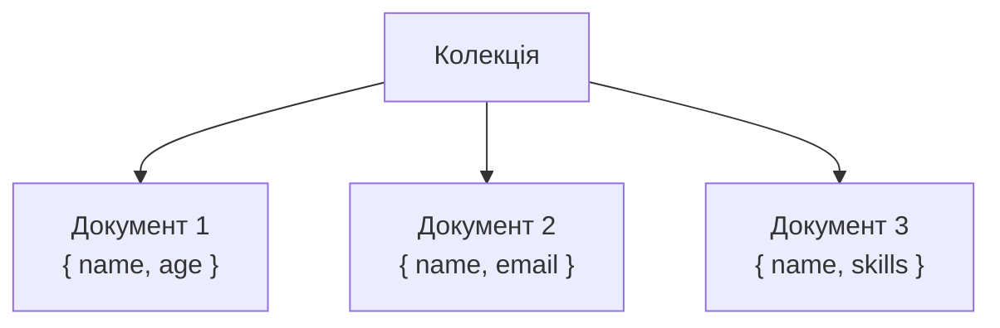
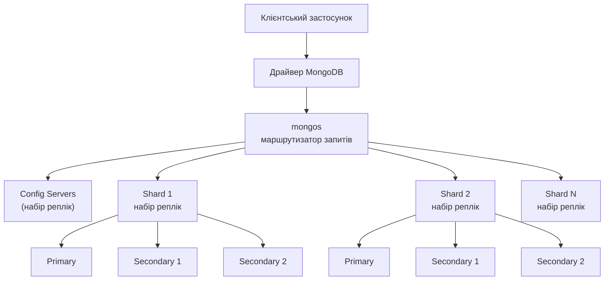
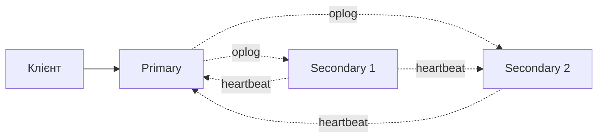
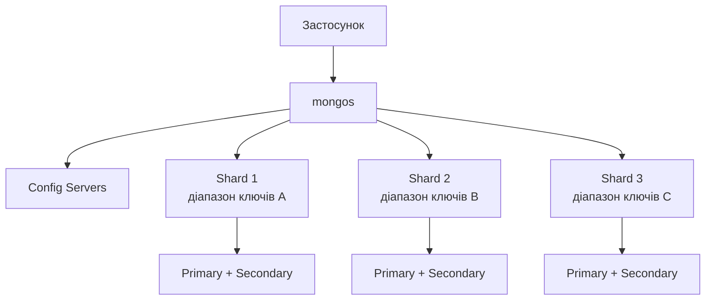
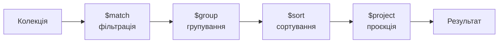
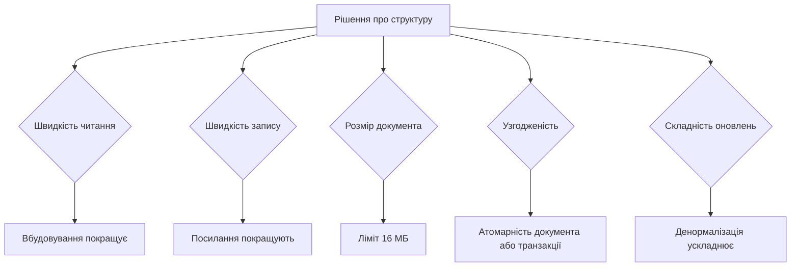
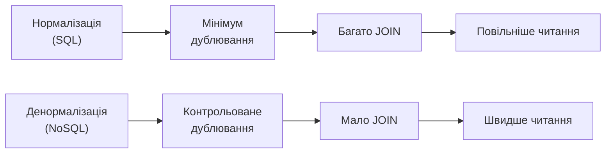

# MongoDB: архітектура та проєктування схем

## План лекції

1. Документна модель даних
2. Архітектура MongoDB
3. Мова запитів
4. Aggregation Pipeline
5. Транзакційна підтримка
6. Проєктування схем даних
7. Денормалізація
8. Міграція з реляційних баз
9. Патерни й анти-патерни

## **📚 Ключові поняття:**

**Документ** — самодостатній запис у форматі BSON із вкладеними об'єктами та масивами.

**Головний принцип проєктування** — дані, що використовуються разом, зберігаються разом.

**Набір реплік (replica set)** — вузли з одними даними: один первинний і кілька вторинних.

**Шардинг** — горизонтальний розподіл колекції між кластерами за ключем шардування.

**Денормалізація** — свідоме дублювання даних заради швидкості читання.

## **1. Документна модель даних**

## Що таке MongoDB?

### 🍃 **Документна СУБД загального призначення**

- Документи замість рядків, колекції замість таблиць
- Гнучка схема з можливістю валідації
- Багата мова запитів та конвеєр агрегації
- Реплікація й шардинг «з коробки»
- Актуальна гілка — MongoDB 8.x
- Клієнт — **mongosh** (старий `mongo` вилучено ще в 6.0)

## Підготовка середовища

### 🐳 **Docker: набір реплік з одного вузла**

```bash
docker run -d --name mongo -p 27017:27017 \
  mongo:8 --replSet rs0 --bind_ip_all
docker exec mongo mongosh --eval "rs.initiate()"
mongosh "mongodb://localhost:27017/?replicaSet=rs0"
```

Навіщо набір реплік? Без нього не працюють **транзакції** та **Change Streams**.

## Документ і BSON

### 📄 **JSON для людей, BSON для машин**

```javascript
{
  _id: ObjectId("..."),
  name: "Олена",
  age: 25,
  skills: ["SQL", "MongoDB"],
  address: { city: "Луцьк", zip: "43000" },
  createdAt: new Date()
}
```

- Бінарне подання з багатим набором типів
- Обмеження: **16 МБ** на документ

## Типи даних BSON

| Тип | Приклад | Примітка |
|-----|---------|----------|
| String | `"текст"` | UTF-8 |
| Int32 / Int64 | `Int32(5)`, `Long(5)` | Цілі |
| Double | `3.14` | Звичайне число JS |
| **Decimal128** | `Decimal128("19.99")` | Гроші й точні розрахунки |
| Boolean | `true` | |
| Date | `new Date()` | UTC, мілісекунди |
| ObjectId | `ObjectId()` | 12 байтів, унікальний |
| Array / Object | `[1, 2]`, `{ a: 1 }` | Вкладені структури |
| Binary | `BinData(...)` | Файли, вектори |

## Колекції та схеми

### 🗂️ **Гнучкість не скасовує структуру**

- Колекція не вимагає однакових документів
- Проте в застосунку структура завжди є
- Рішення: **валідація** на боці сервера


```mermaid
graph TB
    A["Колекція"] --> B["Документ 1<br/>{ name, age }"]
    A --> C["Документ 2<br/>{ name, email }"]
    A --> D["Документ 3<br/>{ name, skills }"]
```

## Валідація схеми

```javascript
db.createCollection("students", {
  validator: { $jsonSchema: {
    bsonType: "object",
    required: ["name", "age"],
    properties: {
      name: { bsonType: "string", minLength: 2 },
      age:  { bsonType: "number", minimum: 16 }
    }
  } },
  validationLevel: "strict",
  validationAction: "error"
});
```

- Змінити правила: `db.runCommand({ collMod: ... })`
- `validationLevel: "moderate"` — не чіпає старі документи
- `validationAction: "warn"` — лише журнал

## Вкладені документи та масиви

- Точкова нотація: `"address.city"`
- Масиви: `$elemMatch`, `$push`, `$pull`, `$addToSet`
- Позиційний оператор `$`, `$[]`, `$[елемент]`
- Індекси за вкладеними полями й елементами масивів (multikey)

## **2. Архітектура MongoDB**

## Базові компоненти


```mermaid
graph TB
    A["Клієнтський застосунок"] --> B["Драйвер MongoDB"]
    B --> C["mongos<br/>маршрутизатор запитів"]
    C --> D["Config Servers<br/>(набір реплік)"]
    C --> E["Shard 1<br/>набір реплік"]
    C --> F["Shard 2<br/>набір реплік"]
    C --> G["Shard N<br/>набір реплік"]

    E --> E1["Primary"]
    E --> E2["Secondary 1"]
    E --> E3["Secondary 2"]

    F --> F1["Primary"]
    F --> F2["Secondary 1"]
    F --> F3["Secondary 2"]
```

## Реплікація


```mermaid
graph LR
    A["Клієнт"] --> B["Primary"]
    B -.->|"oplog"| C["Secondary 1"]
    B -.->|"oplog"| D["Secondary 2"]
    C -.->|"heartbeat"| B
    D -.->|"heartbeat"| B
    C -.->|"heartbeat"| D
```

- Запис іде на **primary**, зміни — через **oplog**
- Heartbeat — 2 с; вибори нового primary — близько 12 с
- Мінімум 3 вузли; арбітрів уникають

## Гарантії запису та читання

| Параметр | Значення | Ефект |
|----------|----------|-------|
| `w: 1` | Лише primary | Швидко, можлива втрата при збої |
| `w: "majority"` | Більшість вузлів | **Типово з 5.0**, переживає перевибори |
| `readConcern: "majority"` | Підтверджені дані | Не бачить відкочуваних записів |
| `readPreference` | `primary`, `secondaryPreferred`… | Куди спрямувати читання |

Читання зі вторинних вузлів = **евентуальна консистентність**.

## Шардинг


```mermaid
graph TB
    A["Застосунок"] --> B["mongos"]
    B --> C["Config Servers"]
    B --> D["Shard 1<br/>діапазон ключів A"]
    B --> E["Shard 2<br/>діапазон ключів B"]
    B --> F["Shard 3<br/>діапазон ключів C"]

    D --> D1["Primary + Secondary"]
    E --> E1["Primary + Secondary"]
    F --> F1["Primary + Secondary"]
```

## Ключ шардування

### 🔑 **Найважливіше рішення кластера**

- Висока кардинальність
- Рівномірний розподіл записів
- Відповідність типовим запитам
- Уникати монотонних ключів (`_id`, час) — «гаряча» ділянка
- **Хешований** ключ — рівномірність; **діапазонний** — швидкі діапазони

```javascript
sh.shardCollection("university.students", { studentId: "hashed" });
```

## Керування шардуванням

- `sh.enableSharding` більше не потрібне (з 6.0)
- `reshardCollection` — змінити ключ (з 5.0)
- `moveCollection`, `unshardCollection` — з 8.0
- **Зони** — прив'язка діапазонів ключів до конкретних шардів (`updateZoneKeyRange`)

## Індексування

### ⚡ **Без індексів — повне сканування колекції**

```javascript
db.students.createIndex({ email: 1 }, { unique: true });
db.students.createIndex({ group: 1, gpa: -1 });
db.students.find({ group: "КН-21" }).explain("executionStats");
```

## Типи індексів

| Тип | Призначення |
|-----|-------------|
| Одинарний / складений | Основні запити |
| Multikey | Масиви |
| **Partial** | Лише потрібні документи |
| **TTL** | Автовидалення за часом |
| **Wildcard** | Довільні поля |
| Text | Простий текстовий пошук (**без підтримки української**) |
| 2dsphere | Геодані (`[довгота, широта]`) |

Порядок полів складеного індексу — правило **ESR**: Equality → Sort → Range.

## Колекції часових рядів

```javascript
db.createCollection("sensor_data", {
  timeseries: { timeField: "ts", metaField: "sensor", granularity: "minutes" },
  expireAfterSeconds: 60 * 60 * 24 * 90
});
```

- З версії 5.0; автоматичне групування й стиснення
- Готова альтернатива ручному патерну «Кошик»

## **3. Мова запитів MongoDB**

## CRUD-операції

```javascript
db.students.insertOne({ name: "Олена", age: 20 });
db.students.find({ age: { $gte: 18 } }, { name: 1, _id: 0 });
db.students.updateOne({ name: "Олена" }, { $set: { age: 21 } });
db.students.deleteOne({ name: "Олена" });
```

## SQL і MongoDB

| SQL | MongoDB |
|-----|---------|
| `SELECT ... WHERE` | `find(filter, projection)` |
| `INSERT` | `insertOne`, `insertMany` |
| `UPDATE ... SET` | `updateOne`, `updateMany` + `$set` |
| `DELETE` | `deleteOne`, `deleteMany` |
| `ORDER BY`, `LIMIT` | `.sort()`, `.limit()` |
| `GROUP BY`, `JOIN` | Aggregation Pipeline, `$lookup` |

## Оператори запитів

| Група | Оператори |
|-------|-----------|
| Порівняння | `$eq`, `$ne`, `$gt`, `$gte`, `$lt`, `$lte`, `$in`, `$nin` |
| Логічні | `$and`, `$or`, `$not`, `$nor` |
| Елементів | `$exists`, `$type` |
| Масивів | `$all`, `$elemMatch`, `$size` |
| Оновлення | `$set`, `$unset`, `$inc`, `$push`, `$pull`, `$addToSet` |

## **4. Aggregation Pipeline**

## Концепція конвеєра


```mermaid
graph LR
    A["Колекція"] --> B["$match<br/>фільтрація"]
    B --> C["$group<br/>групування"]
    C --> D["$sort<br/>сортування"]
    D --> E["$project<br/>проєкція"]
    E --> F["Результат"]
```

- Етапи виконуються послідовно
- `$match` та `$sort` — якнайраніше, щоб використати індекси

## Основні етапи

| Етап | Дія |
|------|-----|
| `$match` | Фільтрація |
| `$group` | Групування й агрегати |
| `$project`, `$addFields` | Форма документа |
| `$sort`, `$limit`, `$skip` | Порядок і обсяг |
| `$unwind` | Розгортання масиву |
| `$lookup` | З'єднання колекцій (у т. ч. з підконвеєром) |
| `$merge`, `$out` | Запис результату в колекцію |

## Приклад конвеєра

```javascript
db.orders.aggregate([
  { $match: { status: "delivered" } },
  { $unwind: "$items" },
  { $group: {
      _id: "$items.name",
      revenue: { $sum: { $multiply: ["$items.quantity", "$items.unitPrice"] } }
  } },
  { $sort: { revenue: -1 } },
  { $limit: 5 }
]);
```

## `$lookup` — аналог JOIN

- Працює, але дорожчий за вбудовування
- Якщо `$lookup` у кожному запиті — ознака поганої моделі
- Підконвеєр дає складні умови з'єднання

## Пошукові етапи

- `$search` — повнотекстовий пошук (**Atlas Search**, а тепер і в самокерованих кластерах)
- `$vectorSearch` — векторний пошук
- `$rankFusion`, `$scoreFusion` — гібридний пошук (8.x)
- Докладніше про пошук — **лекція 11**

## **5. Транзакційна підтримка**

## Атомарність у MongoDB

### ⚛️ **Одиниця атомарності — документ**

- Запис в один документ, зокрема з вкладеними даними, атомарний
- Добре спроєктована схема здебільшого не потребує транзакцій
- Багатодокументні транзакції: **4.0** (набір реплік), **4.2** (шардинг)
- Потрібен набір реплік

## Використання транзакцій

```javascript
const session = client.startSession();
try {
  await session.withTransaction(async () => {
    await accounts.updateOne({ _id: "A", balance: { $gte: 100 } },
      { $inc: { balance: -100 } }, { session });
    await accounts.updateOne({ _id: "B" },
      { $inc: { balance: 100 } }, { session });
  });
} finally {
  await session.endSession();
}
```

`withTransaction` сам повторює операцію за тимчасових помилок.

## Ізоляція

- **Snapshot isolation** усередині транзакції
- `readConcern: "snapshot"`, `writeConcern: "majority"`
- Конфлікт запису → `WriteConflict`, транзакція повторюється

## Обмеження та поради

- Ліміт часу — **60 с** (`transactionLifetimeLimitSeconds`)
- Транзакції — виняток, а не правило
- Короткі, з малою кількістю операцій
- Умовні оновлення (`$gte` у фільтрі) замість «прочитати → перевірити → записати»
- Колекції та індекси можна створювати всередині транзакції (з 4.4)

## **6. Проєктування схем даних**

## Реляційне й документне моделювання

| | Реляційне | Документне |
|---|-----------|------------|
| Відправна точка | **Дані** | **Запити** |
| Нормалізація | Головна мета | Свідомий компроміс |
| Зв'язки | Зовнішні ключі, JOIN | Вбудовування, посилання |
| Схема | Жорстка | Гнучка, з валідацією |

## Проєктування, орієнтоване на запити

### 🎯 **Спершу запити, потім модель**

1. Перелічити операції читання та запису
2. Оцінити частоту й обсяги
3. Скласти матрицю операцій
4. Визначити, що читається разом
5. Обрати вбудовування чи посилання
6. Перевірити `explain()` та навантаженням

## Типи зв'язків

| Зв'язок | Приклад | Підхід |
|---------|---------|--------|
| Один до одного | Користувач — профіль | Вбудовування |
| Один до кількох | Клієнт — адреси | Вбудований масив |
| Один до багатьох | Товар — відгуки | Посилання, підмножина |
| Один до «мільярдів» | Датчик — покази | Посилання на «батька», кошики |
| Багато до багатьох | Студенти — курси | Масиви посилань |

## Вбудовування чи посилання

| Критерій | Вбудовування | Посилання |
|----------|--------------|-----------|
| Читання | Один запит | Кілька запитів або `$lookup` |
| Атомарність | Природна | Потрібні транзакції |
| Кількість елементів | Мала, обмежена | Велика, необмежена |
| Зміни | Рідкі | Часті |
| Ризик | Ліміт 16 МБ | Складніше читання |

## Критерії вибору


```mermaid
graph TB
    A["Рішення про структуру"] --> B{"Швидкість читання"}
    A --> C{"Швидкість запису"}
    A --> D{"Розмір документа"}
    A --> E{"Узгодженість"}
    A --> F{"Складність оновлень"}

    B --> G["Вбудовування покращує"]
    C --> H["Посилання покращують"]
    D --> I["Ліміт 16 МБ"]
    E --> J["Атомарність документа або транзакції"]
    F --> K["Денормалізація ускладнює"]
```

## Гібридний підхід

- Посилання + копія кількох потрібних полів
- Приклад: у замовленні — `customerId` і `customerName`
- Виграш: показ без `$lookup`
- Ціна: копії треба підтримувати

## **7. Денормалізація як проєктна парадигма**

## Філософія


```mermaid
graph LR
    A["Нормалізація<br/>(SQL)"] --> B["Мінімум<br/>дублювання"]
    B --> C["Багато JOIN"]
    C --> D["Повільніше читання"]

    E["Денормалізація<br/>(NoSQL)"] --> F["Контрольоване<br/>дублювання"]
    F --> G["Мало JOIN"]
    G --> H["Швидше читання"]
```

## Рівні денормалізації

| Рівень | Що робимо | Приклад |
|--------|-----------|---------|
| 0 | Нормалізація | Лише посилання |
| 1 | Ключові поля-копії | Ім'я клієнта в замовленні |
| 2 | Значні фрагменти | Підмножина відгуків у товарі |
| 3 | Повне вбудовування | Весь профіль у документі |

## Стратегії узгодженості

1. **Транзакція** — копії оновлюються разом
2. **Change Streams** — фонове оновлення за потоком змін
3. **Версії** — копія містить версію, застарілі оновлюють ліниво
4. **Змішана** — залежно від критичності

Історичні знімки (ціна в замовленні) **не оновлюють**.

## Вартість денормалізації

| | Нормалізована | Денормалізована |
|---|---------------|-----------------|
| Обсяг (соцмережа) | 21 ГБ | 26 ГБ (+24 %) |
| Показ стрічки | 1 + до 100 запитів | 1 запит |

**Денормалізуємо, коли:** читань ≫ змін, фрагмент малий і стабільний.

**Не денормалізуємо, коли:** дані часто змінюються, копій десятки тисяч, потрібна негайна узгодженість.

## **8. Міграція реляційних схем**

## Принцип міграції

### 🔄 **Перепроєктування, а не копіювання таблиць**

| Реляційний зв'язок | Рішення |
|--------------------|---------|
| Клієнт → адреси | Вбудований масив |
| Замовлення → позиції | Вбудований масив із знімком назви й ціни |
| Клієнт → замовлення | Посилання `customerId` |
| Товар → відгуки | Окрема колекція + підмножина |

## Скрипт міграції

- Пакетна обробка з пагінацією за ключем
- `upsert` + `$setOnInsert` — **ідемпотентність**
- `legacyId` — зіставлення зі старою базою
- Гроші — `Decimal128`
- Індекси — після завантаження

## Перевірка та інструменти

- Порівняти кількість записів і контрольні суми
- Вибіркове порівняння полів
- Перевірка цілісності посилань
- **Relational Migrator** — офіційний інструмент MongoDB
- **CDC** (Debezium) — міграція без зупинки системи
- Поетапний перехід: старий і новий код співіснують

## **9. Патерни та анти-патерни**

## Каталог патернів

| Патерн | Проблема | Рішення |
|--------|----------|---------|
| Підмножина | Завеликий документ | Найчастіше потрібне — у документі, решта — окремо |
| Обчислення | Дорогі розрахунки | Зберігати готовий результат |
| Кошик | Потік дрібних записів | Групувати в документи |
| Версійність схеми | Еволюція структури | Поле `schemaVersion` |
| Поліморфізм | Схожі, але різні об'єкти | Поле-дискримінатор `type` |
| Розширене посилання | Постійні `$lookup` | Копія кількох полів |

## Каталог патернів (продовження)

| Патерн | Проблема | Рішення |
|--------|----------|---------|
| Атрибути | Змінні поля для пошуку | Масив `{ k, v }` + один індекс |
| Виняток | Рідкісні гігантські документи | Прапорець і окрема обробка |
| Наближення | Гарячі лічильники | Оновлювати вибірково |
| Дерево | Ієрархії | Масив предків, шлях, `$graphLookup` |
| Архівування | Історичні дані | `$merge` в архів, TTL |
| Версійність документів | Історія змін | Колекція історії + оптимістичне блокування |

## Підмножина: приклад

```javascript
db.products.updateOne(
  { _id: review.productId },
  { $push: { recentReviews: {
      $each: [review], $sort: { date: -1 }, $slice: 10
  } } }
);
```

## Кошик і колекції часових рядів

- **Кошик**: документ на годину або на 200 записів + `count`, `sum`
- Для нових метрик — спершу **колекції часових рядів**
- Кошик — коли потрібна власна логіка групування

## Версійність схеми

```javascript
db.users.updateMany({ schemaVersion: 1 }, [
  { $set: {
      firstName: { $arrayElemAt: [{ $split: ["$name", " "] }, 0] },
      lastName:  { $arrayElemAt: [{ $split: ["$name", " "] }, 1] },
      schemaVersion: 2
  } },
  { $unset: "name" }
]);
```

Читання: застосунок розуміє всі версії; міграція — поступово.

## Анти-патерни

| Анти-патерн | Виправлення |
|-------------|-------------|
| Необмежені масиви | Окрема колекція, підмножина |
| Колекція на кожного клієнта | Одна колекція + поле |
| Таблиці як колекції | Перепроєктувати під запити |
| Надмірні індекси | `$indexStats`, `hideIndex` |
| Дані як ключі | Патерн «Атрибути» |
| Транзакції всюди | Однодокументні операції |
| Відсутність валідації | `$jsonSchema` |

## Контрольний список

- Що читається разом — зберігається разом?
- Кожен масив має верхню межу?
- Кожна копія має «власника» оновлень?
- Для кожного запиту є індекс (перевірено `explain()`)?
- Продумано шардинг, архівування, `writeConcern`?
- Схему перевірено на реалістичних обсягах?

## Висновки

- Документ — одиниця атомарності; модель — від запитів
- Реплікація та шардинг забезпечують надійність і масштаб
- Вбудовування, посилання, денормалізація — керовані компроміси
- Патерни економлять час, анти-патерни — попереджають
- Міграція = перепроєктування
- Далі: **пошукові системи та Elasticsearch** — поліглотна персистентність на практиці
