# Теоретичні основи NoSQL систем

## План лекції

1. Обмеження реляційної моделі
2. Теорема CAP
3. BASE семантика
4. Таксономія NoSQL систем
5. Polyglot Persistence

## **📚 Ключові поняття:**

**NoSQL** — клас систем управління базами даних, які відрізняються від традиційних реляційних СУБД відсутністю фіксованої схеми, горизонтальною масштабованістю та підтримкою розподіленої архітектури.

**CAP теорема** — фундаментальний принцип розподілених систем, що стверджує неможливість одночасного забезпечення консистентності, доступності та стійкості до розділення мережі.

**Евентуальна консистентність** — модель, за якої система гарантує досягнення узгодженого стану всіх реплік через певний час після припинення оновлень.

**Polyglot Persistence** — архітектурний підхід, що передбачає використання різних технологій зберігання даних в одному додатку відповідно до специфіки задач.

## **1. Обмеження реляційної моделі**

## Історичний контекст

### 📅 **Реляційна модель та сучасність**

**1970 рік — Едгар Кодд:**
- Централізоване зберігання
- Невеликі обсяги даних
- Передбачувана структура
- Вертикальне масштабування

**2000-і роки — Виклики інтернету:**
- Розподілені системи
- Петабайти інформації
- Динамічні схеми даних
- Горизонтальне масштабування

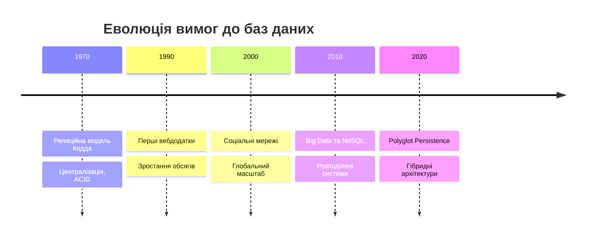
```mermaid
timeline
    title Еволюція вимог до баз даних
    1970 : Реляційна модель Кодда
         : Централізація, ACID
    1990 : Перші вебдодатки
         : Зростання обсягів
    2000 : Соціальні мережі
         : Глобальний масштаб
    2010 : Big Data та NoSQL
         : Розподілені системи
    2020 : Polyglot Persistence
         : Гібридні архітектури
```

## Проблема масштабування

### 📈 **Вертикальне vs Горизонтальне**

**Вертикальне масштабування (реляційні СУБД):**
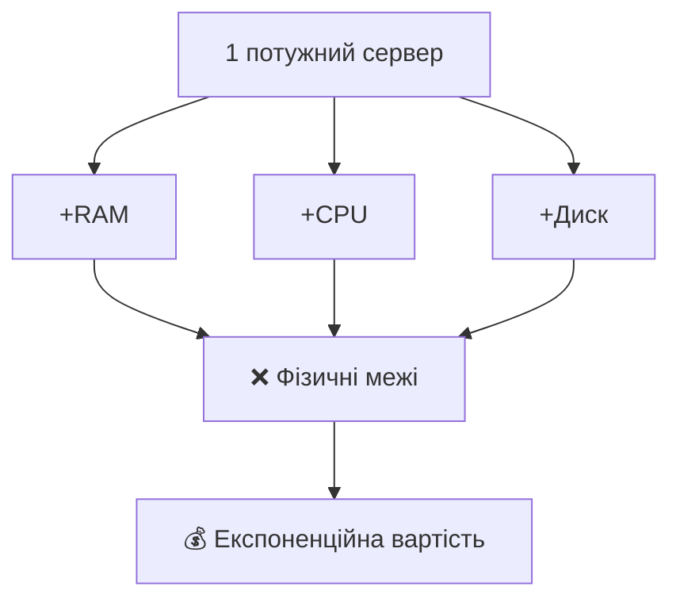
```mermaid
graph TB
    A[1 потужний сервер] --> B[+RAM]
    A --> C[+CPU]
    A --> D[+Диск]

    B --> E[❌ Фізичні межі]
    C --> E
    D --> E
    E --> F[💰 Експоненційна вартість]
```

**Горизонтальне масштабування (NoSQL):**
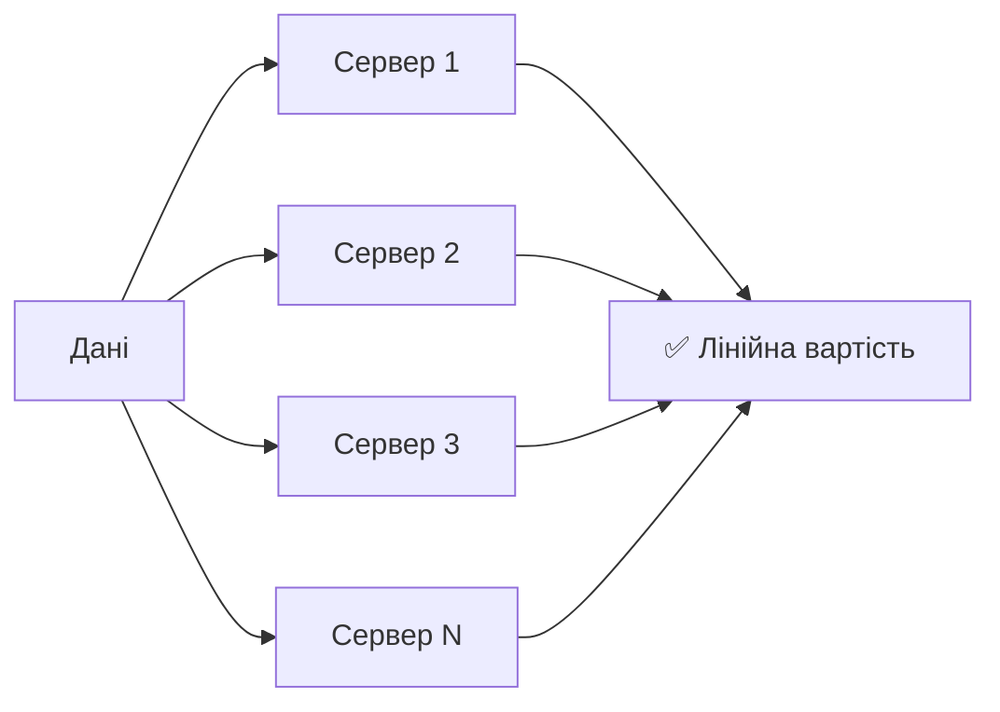
```mermaid
graph LR
    A[Дані] --> B[Сервер 1]
    A --> C[Сервер 2]
    A --> D[Сервер 3]
    A --> E[Сервер N]

    B --> F[✅ Лінійна вартість]
    C --> F
    D --> F
    E --> F
```

## Жорсткість схеми

### 🔒 **Проблеми фіксованої структури**

```sql
-- Початкова схема
CREATE TABLE users (
    user_id INT PRIMARY KEY,
    username VARCHAR(50),
    email VARCHAR(100)
);

-- ❌ Потрібно додати нові поля
ALTER TABLE users ADD COLUMN phone VARCHAR(20);
ALTER TABLE users ADD COLUMN preferences JSON;

-- ⏰ Міграція 100М записів = години простою
```

**vs NoSQL гнучкість:**

```javascript
// ✅ Різні документи можуть мати різну структуру
db.users.insertOne({
    username: "ivan",
    email: "ivan@example.com"
});

db.users.insertOne({
    username: "maria",
    email: "maria@example.com",
    phone: "+380501234567",  // Новe поле
    preferences: { theme: "dark" }  // Нова структура
});
```

## Impedance Mismatch

### 🔄 **Об'єктна модель vs Реляційні таблиці**

**Об'єкт в додатку:**
```javascript
const user = {
    id: "user123",
    name: "Іван Петров",
    addresses: [
        { type: "home", city: "Київ" },
        { type: "work", city: "Київ" }
    ],
    preferences: {
        language: "uk",
        notifications: { email: true, sms: false }
    }
};
```

**Реляційне представлення:**
```
users ──┬── addresses
        ├── preferences
        └── notification_settings

❌ Потрібно 4 таблиці + JOIN операції
```

## Великі обсяги даних

### 📊 **Характеристики Big Data**

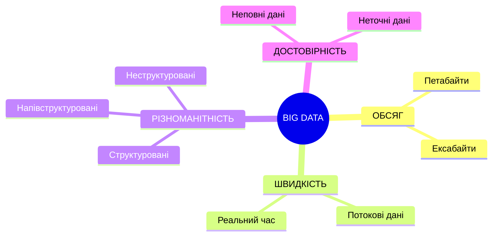
```mermaid
mindmap
  root((BIG DATA))
    ОБСЯГ
      Петабайти
      Ексабайти
    ШВИДКІСТЬ
      Потокові дані
      Реальний час
    РІЗНОМАНІТНІСТЬ
      Структуровані
      Напівструктуровані
      Неструктуровані
    ДОСТОВІРНІСТЬ
      Неповні дані
      Неточні дані
```

**Проблеми реляційних СУБД:**
- 🐌 Повільна обробка JOIN на великих обсягах
- 💾 Складність партіціонування
- 🔄 Неефективна реплікація
- 📈 Погана масштабованість аналітики

## **2. Теорема CAP**

## Формулювання теореми CAP

### 🎯 **Ерік Брюер, 2000 рік**

> **Розподілена система не може одночасно гарантувати всі три властивості:**

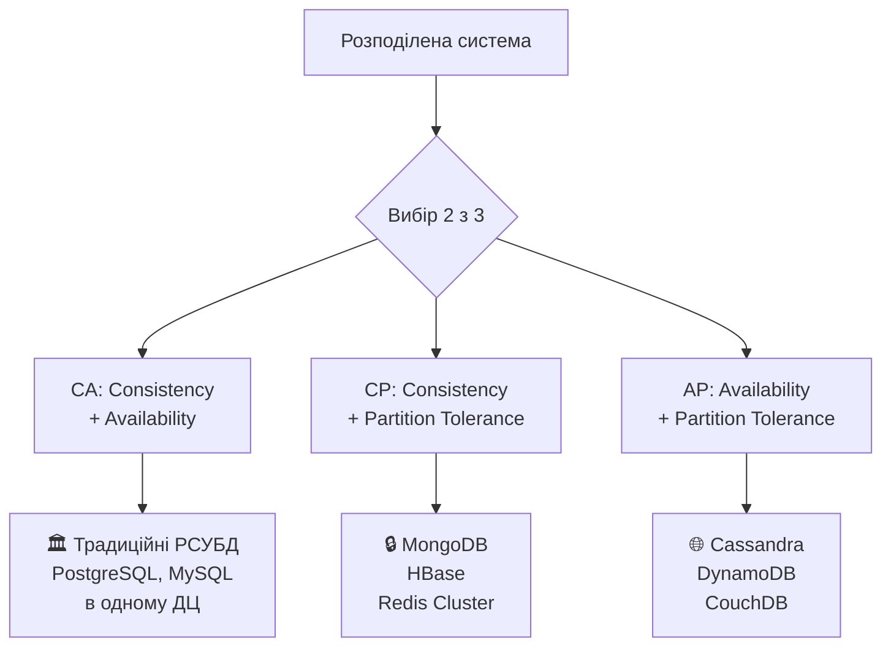
```mermaid
graph TD
    A[Розподілена система] --> B{Вибір 2 з 3}

    B --> C[CA: Consistency<br/>+ Availability]
    B --> D[CP: Consistency<br/>+ Partition Tolerance]
    B --> E[AP: Availability<br/>+ Partition Tolerance]

    C --> F[🏛️ Традиційні РСУБД<br/>PostgreSQL, MySQL<br/>в одному ДЦ]

    D --> G[🔒 MongoDB<br/>HBase<br/>Redis Cluster]

    E --> H[🌐 Cassandra<br/>DynamoDB<br/>CouchDB]
```

## Три властивості CAP

### **C - Consistency (Консистентність)**

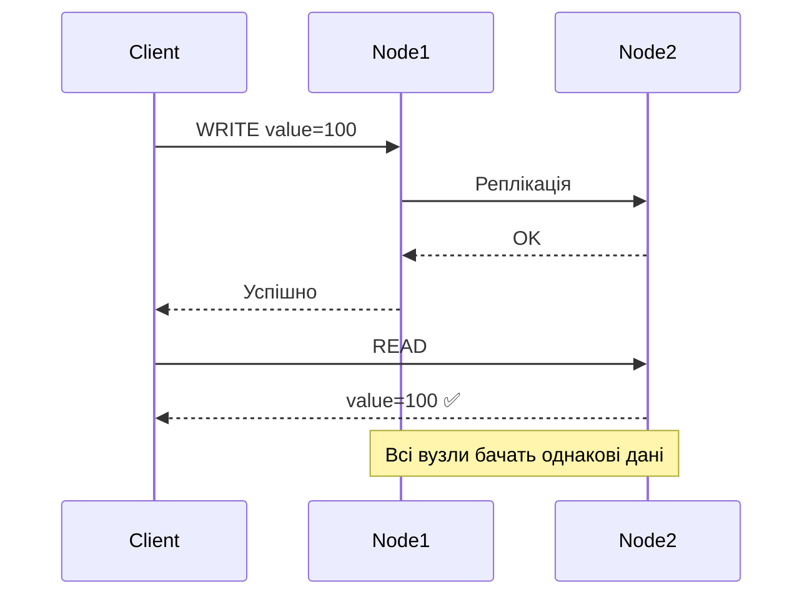
```mermaid
sequenceDiagram
    participant Client
    participant Node1
    participant Node2

    Client->>Node1: WRITE value=100
    Node1->>Node2: Реплікація
    Node2-->>Node1: OK
    Node1-->>Client: Успішно

    Client->>Node2: READ
    Node2-->>Client: value=100 ✅

    Note over Node1,Node2: Всі вузли бачать однакові дані
```

**✅ Гарантія:** Всі вузли повертають одне й те саме значення

## **A - Availability (Доступність)**

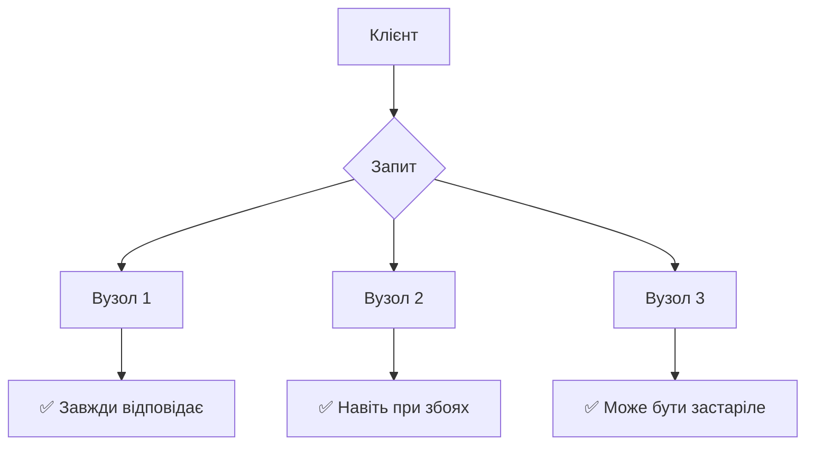
```mermaid
graph TB
    A[Клієнт] --> B{Запит}
    B --> C[Вузол 1]
    B --> D[Вузол 2]
    B --> E[Вузол 3]

    C --> F[✅ Завжди відповідає]
    D --> G[✅ Навіть при збоях]
    E --> H[✅ Може бути застаріле]
```

**✅ Гарантія:** Кожен запит отримує відповідь (успіх/помилка)

## **P - Partition Tolerance (Стійкість до розділення)**

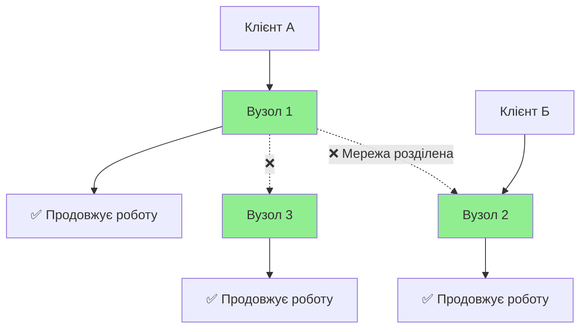
```mermaid
graph TB
    A[Вузол 1] -.❌ Мережа розділена.-> B[Вузол 2]
    A -.❌.-> C[Вузол 3]

    D[Клієнт А] --> A
    E[Клієнт Б] --> B

    A --> F[✅ Продовжує роботу]
    B --> G[✅ Продовжує роботу]
    C --> H[✅ Продовжує роботу]

    style A fill:#90EE90
    style B fill:#90EE90
    style C fill:#90EE90
```

**✅ Гарантія:** Система працює при мережевих розділеннях

## Доказ теореми CAP

### 🔬 **Сет Гілберт та Ненсі Лінч, 2002**

**Ситуація розділення мережі:**

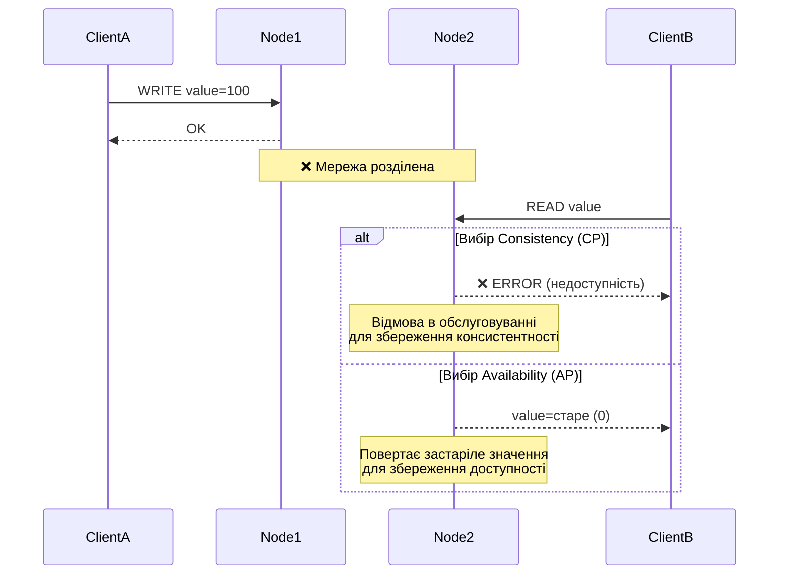
```mermaid
sequenceDiagram
    participant ClientA
    participant Node1
    participant Node2
    participant ClientB

    ClientA->>Node1: WRITE value=100
    Node1-->>ClientA: OK

    Note over Node1,Node2: ❌ Мережа розділена

    ClientB->>Node2: READ value

    alt Вибір Consistency (CP)
        Node2-->>ClientB: ❌ ERROR (недоступність)
        Note over Node2: Відмова в обслуговуванні<br/>для збереження консистентності
    else Вибір Availability (AP)
        Node2-->>ClientB: value=старе (0)
        Note over Node2: Повертає застаріле значення<br/>для збереження доступності
    end
```

## CA vs CP vs AP системи

### 📊 **Практичні приклади**

| Тип | Системи | Вибір | Компроміс |
|-----|---------|-------|-----------|
| **CA** | PostgreSQL, MySQL (1 ДЦ) | C+A | ❌ Не витримує розділення |
| **CP** | MongoDB, HBase, Redis | C+P | ⏸️ Недоступність при збоях |
| **AP** | Cassandra, DynamoDB | A+P | 🔄 Евентуальна консистентність |

**Приклад CA (PostgreSQL):**
```sql
BEGIN TRANSACTION;
UPDATE accounts SET balance = balance - 100 WHERE id = 1;
UPDATE accounts SET balance = balance + 100 WHERE id = 2;
COMMIT;  -- ✅ Атомарно або ❌ повний відкат
```

## CP системи: MongoDB

### 🔒 **Консистентність + Стійкість до розділення**

```javascript
// Write concern "majority" - консистентність
db.users.insertOne(
    { name: "Іван", email: "ivan@example.com" },
    { writeConcern: { w: "majority", wtimeout: 5000 } }
);

// ✅ Запис на більшість реплік
// ❌ При розділенні - відмова в записі
```

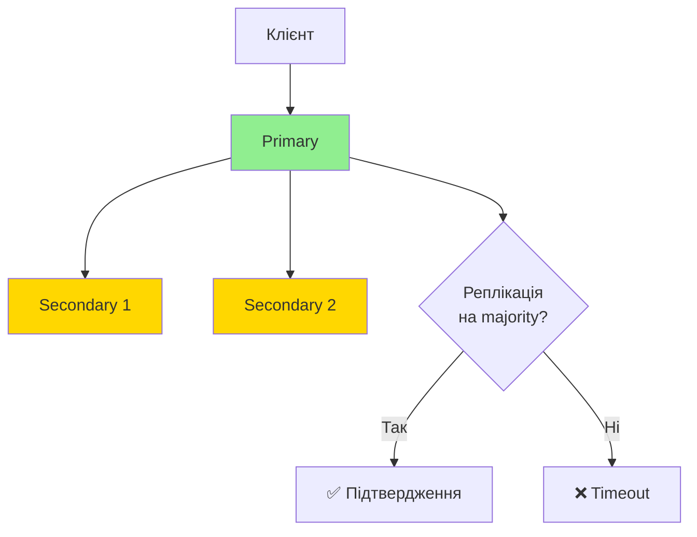
```mermaid
graph TB
    A[Primary] --> B[Secondary 1]
    A --> C[Secondary 2]

    D[Клієнт] --> A
    A --> E{Реплікація<br/>на majority?}
    E -->|Так| F[✅ Підтвердження]
    E -->|Ні| G[❌ Timeout]

    style A fill:#90EE90
    style B fill:#FFD700
    style C fill:#FFD700
```

## AP системи: Cassandra

### 🌐 **Доступність + Стійкість до розділення**

```javascript
// Consistency level ONE - доступність
client.execute(
    'INSERT INTO users (id, name) VALUES (?, ?)',
    [uuid(), 'Іван Петров'],
    { consistency: consistencies.one }
);

// ✅ Запис на один вузол
// 🔄 Поступова реплікація
// 📖 Можливе читання застарілих даних
```

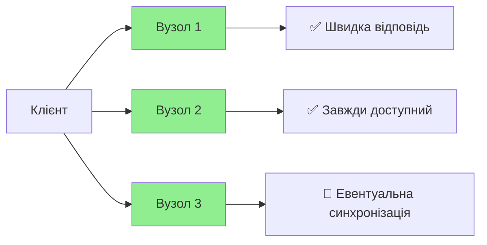
```mermaid
graph LR
    A[Клієнт] --> B[Вузол 1]
    A --> C[Вузол 2]
    A --> D[Вузол 3]

    B --> E[✅ Швидка відповідь]
    C --> F[✅ Завжди доступний]
    D --> G[🔄 Евентуальна синхронізація]

    style B fill:#90EE90
    style C fill:#90EE90
    style D fill:#90EE90
```

## PACELC розширення

### 🔬 **Даніель Абаді, 2012**

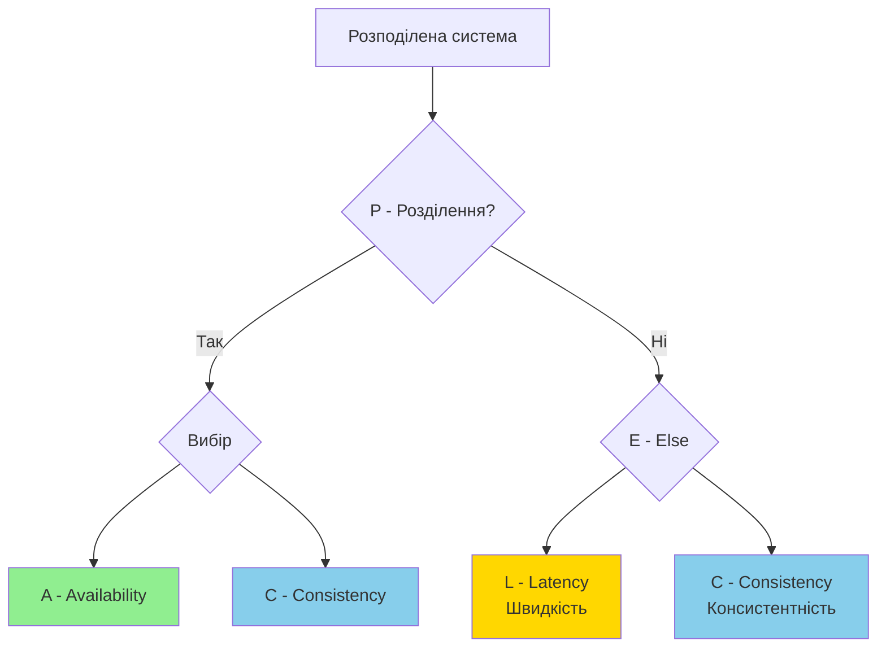
```mermaid
graph TD
    A[Розподілена система] --> B{P - Розділення?}

    B -->|Так| C{Вибір}
    C --> D[A - Availability]
    C --> E[C - Consistency]

    B -->|Ні| F{E - Else}
    F --> G[L - Latency<br/>Швидкість]
    F --> H[C - Consistency<br/>Консистентність]

    style D fill:#90EE90
    style E fill:#87CEEB
    style G fill:#FFD700
    style H fill:#87CEEB
```

**Ключова ідея:** Навіть без розділення є компроміс між швидкістю та консистентністю

## **3. BASE семантика**

## ACID vs BASE

### ⚖️ **Два підходи до управління даними**

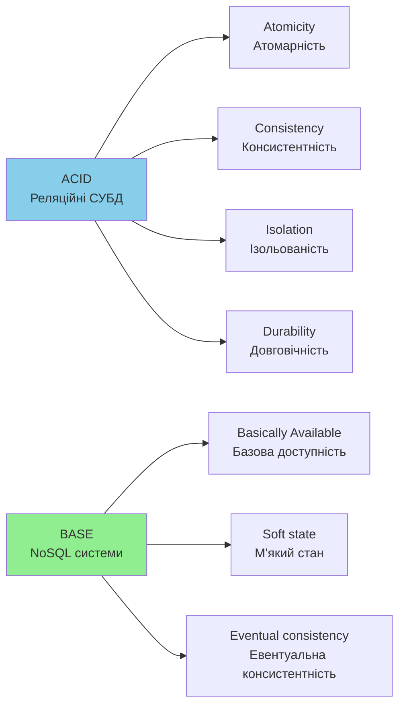
```mermaid
graph LR
    A[ACID<br/>Реляційні СУБД] --> B[Atomicity<br/>Атомарність]
    A --> C[Consistency<br/>Консистентність]
    A --> D[Isolation<br/>Ізольованість]
    A --> E[Durability<br/>Довговічність]

    F[BASE<br/>NoSQL системи] --> G[Basically Available<br/>Базова доступність]
    F --> H[Soft state<br/>М'який стан]
    F --> I[Eventual consistency<br/>Евентуальна консистентність]

    style A fill:#87CEEB
    style F fill:#90EE90
```

## Basically Available

### 🌐 **Базова доступність**

**Принцип:** Система доступна більшу частину часу, навіть якщо повертає неповні дані

```javascript
// Приклад: Лічильник лайків в соціальній мережі
async function getLikesCount(postId) {
    try {
        // Спроба отримати точне значення
        const exactCount = await db.likes.count({ postId });
        return { count: exactCount, approximate: false };
    } catch (error) {
        // ✅ При збої - повертаємо кешоване значення
        const cached = await cache.get(`likes:${postId}`);
        return {
            count: cached || 0,
            approximate: true  // Позначка про приблизність
        };
    }
}
```

**✅ Результат:** Система завжди відповідає, можливо з меншою точністю

## Soft State

### 🔄 **М'який стан**

**Принцип:** Стан системи може змінюватися з часом без нових запитів

```javascript
// Кеш з автоматичним видаленням (TTL)
class CacheWithSoftState {
    set(key, value, ttlSeconds) {
        const expiresAt = Date.now() + (ttlSeconds * 1000);
        this.data.set(key, { value, expiresAt });

        // Фоновий процес видалення
        setTimeout(() => {
            if (this.data.get(key)?.expiresAt <= Date.now()) {
                this.data.delete(key);  // 🔄 Стан змінюється
            }
        }, ttlSeconds * 1000);
    }
}
```

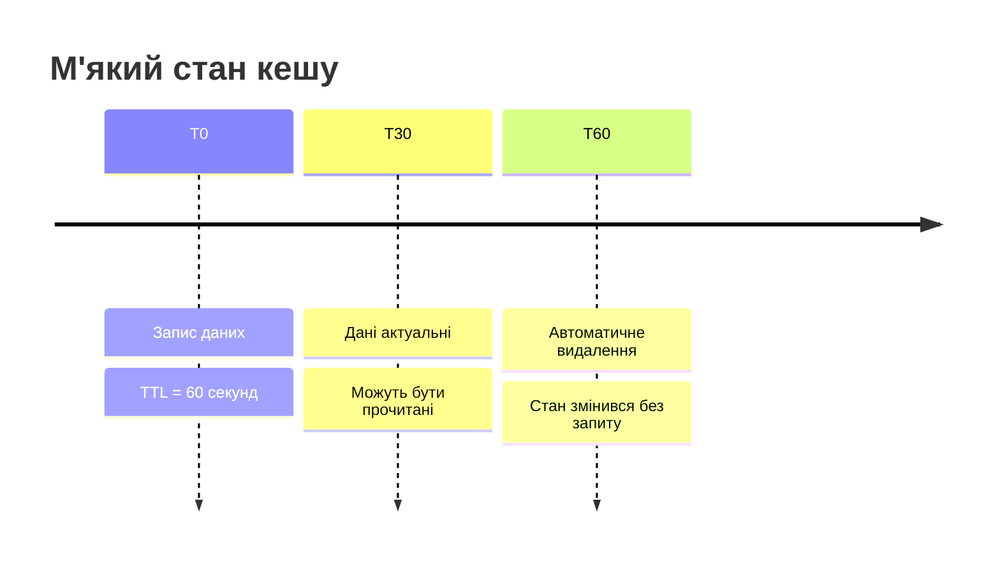
```mermaid
timeline
    title М'який стан кешу
    T0 : Запис даних
       : TTL = 60 секунд
    T30 : Дані актуальні
        : Можуть бути прочитані
    T60 : Автоматичне видалення
        : Стан змінився без запиту
```

## Eventual Consistency

### ⏰ **Евентуальна консистентність**

**Принцип:** Якщо оновлень немає, всі вузли з часом досягнуть однакового стану

```mermaid
sequenceDiagram
    participant Client
    participant Node1
    participant Node2
    participant Node3

    Client->>Node1: WRITE value=100
    Node1-->>Client: OK (швидко)

    Note over Node1,Node2,Node3: Асинхронна реплікація

    Node1->>Node2: Replicate value=100
    Node1->>Node3: Replicate value=100

    Note over Node2: T+1s: value=100
    Note over Node3: T+2s: value=100

    Note over Node1,Node2,Node3: ✅ Всі вузли консистентні
```

## Механізми досягнення консистентності

### 🔧 **Vector Clocks**

```javascript
// Відстеження причинно-наслідкових зв'язків
class VectorClock {
    constructor() {
        this.clock = {};  // {nodeId: timestamp}
    }

    increment(nodeId) {
        this.clock[nodeId] = (this.clock[nodeId] || 0) + 1;
    }

    merge(otherClock) {
        for (const [nodeId, timestamp] of Object.entries(otherClock.clock)) {
            this.clock[nodeId] = Math.max(
                this.clock[nodeId] || 0,
                timestamp
            );
        }
    }
}
```

**Використання:**
```javascript
// Node 1: {node1: 1, node2: 0}
// Node 2: {node1: 0, node2: 1}
// Після злиття: {node1: 1, node2: 1}
```

## Розв'язання конфліктів

### ⚔️ **Стратегії примирення**

**1. Last Write Wins (LWW):**
```javascript
function resolveConflict(value1, value2) {
    // ⏰ Перемагає пізніший запис
    return value1.timestamp > value2.timestamp ? value1 : value2;
}
```

**2. Версіонування:**
```javascript
// 📚 Зберігаємо всі версії
class MultiVersionStore {
    write(key, value, nodeId) {
        this.versions.push({
            value: value,
            nodeId: nodeId,
            timestamp: Date.now()
        });
    }

    read(key, resolver) {
        const versions = this.versions.get(key);
        return resolver(versions);  // Додаток вирішує
    }
}
```

## Приклад евентуальної консистентності

### 📱 **Соціальна мережа: лічильник друзів**

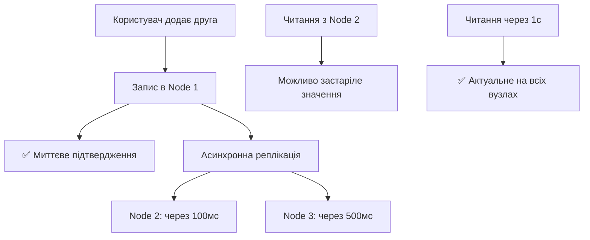
```mermaid
graph TB
    A[Користувач додає друга] --> B[Запис в Node 1]
    B --> C[✅ Миттєве підтвердження]

    B --> D[Асинхронна реплікація]
    D --> E[Node 2: через 100мс]
    D --> F[Node 3: через 500мс]

    G[Читання з Node 2] --> H[Можливо застаріле значення]
    I[Читання через 1с] --> J[✅ Актуальне на всіх вузлах]
```

**✅ Переваги:**
- Швидка відповідь користувачу
- Система залишається доступною
- Консистентність досягається з часом

**⚠️ Компроміс:**
- Короткий період неузгодженості
- Прийнятно для лічильників, лайків, перегляд��в

## **4. Таксономія NoSQL систем**

## Типи NoSQL баз даних

### 📊 **Чотири основні категорії**

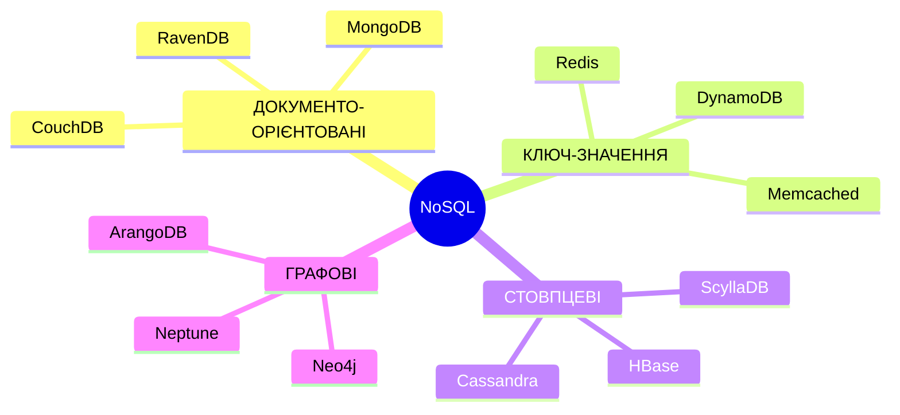
```mermaid
mindmap
  root((NoSQL))
    ДОКУМЕНТО-ОРІЄНТОВАНІ
      MongoDB
      CouchDB
      RavenDB
    КЛЮЧ-ЗНАЧЕННЯ
      Redis
      Memcached
      DynamoDB
    СТОВПЦЕВІ
      Cassandra
      HBase
      ScyllaDB
    ГРАФОВІ
      Neo4j
      Neptune
      ArangoDB
```

## Документо-орієнтовані БД

### 📄 **MongoDB, CouchDB**

**Модель даних:**
```javascript
{
    "_id": ObjectId("507f1f77bcf86cd799439011"),
    "title": "Вступ до NoSQL",
    "author": {
        "name": "Іван Петров",
        "email": "ivan@example.com"
    },
    "tags": ["nosql", "databases", "mongodb"],
    "comments": [
        {
            "user": "Марія",
            "text": "Чудова стаття!",
            "date": ISODate("2024-01-15")
        }
    ],
    "metadata": {
        "views": 1523,
        "likes": 47
    }
}
```

## Переваги документів

### ✅ **Чому документи?**

**Гнучкість структури:**
```javascript
// Різні товари з різними атрибутами
db.products.insertMany([
    {
        type: "laptop",
        specs: { processor: "i7", ram: "16GB" }
    },
    {
        type: "book",
        specs: { pages: 350, isbn: "978-3-16-148410-0" }
    }
]);
// ✅ Без зміни схеми!
```

**Природне відображення об'єктів:**
```javascript
// JS об'єкт → MongoDB документ (1:1)
const user = { name: "Іван", age: 25 };
db.users.insertOne(user);  // Прямий запис
```

## Операції з документами

### 🔍 **Пошук та оновлення**

```javascript
// Складний пошук
db.posts.find({
    "tags": "nosql",
    "metadata.views": { $gt: 1000 },
    "author.email": { $regex: "@example.com" }
});

// Вкладене оновлення
db.posts.updateOne(
    { "_id": ObjectId("507f1f77bcf86cd799439011") },
    {
        $push: { comments: newComment },
        $inc: { "metadata.views": 1 }
    }
);

// Агрегація
db.posts.aggregate([
    { $match: { "tags": "nosql" } },
    { $group: { _id: "$author.name", total: { $sum: 1 } } },
    { $sort: { total: -1 } }
]);
```

## Ключ-значення сховища

### 🗝️ **Redis, Memcached, DynamoDB**

**Найпростіша модель:**
```javascript
// Базові операції
await redis.set('user:1001:name', 'Іван Петров');
const name = await redis.get('user:1001:name');

// Структуровані дані
await redis.hset('user:1001', {
    'name': 'Іван Петров',
    'email': 'ivan@example.com',
    'age': '25'
});

// Списки
await redis.lpush('queue:tasks', 'task1', 'task2');

// Множини
await redis.sadd('user:1001:friends', 'user:1002', 'user:1003');
```

**✅ Переваги:** Максимальна швидкість, простота
**❌ Недоліки:** Обмежені можливості запитів

## Розширені можливості Redis

### ⚡ **Не тільки кеш**

**Time To Live:**
```javascript
// Автоматичне видалення через 1 годину
await redis.setex('session:abc123', 3600, sessionData);
```

**Атомарні операції:**
```javascript
// Лічильники
await redis.incr('page:views:homepage');  // Atomic increment

// Транзакції
const multi = redis.multi();
multi.decrby('account:A', 100);
multi.incrby('account:B', 100);
await multi.exec();
```

**Pub/Sub:**
```javascript
// Підписка на канал
await redis.subscribe('notifications');
// Публікація повідомлення
await redis.publish('notifications', message);
```

## Стовпцеві бази даних

### 📊 **Cassandra, HBase, ScyllaDB**

**Модель даних:**
```javascript
CREATE TABLE users_by_country (
    country text,           // Partition key
    user_id uuid,          // Clustering key
    name text,
    email text,
    registration_date timestamp,
    PRIMARY KEY (country, user_id)
);
```

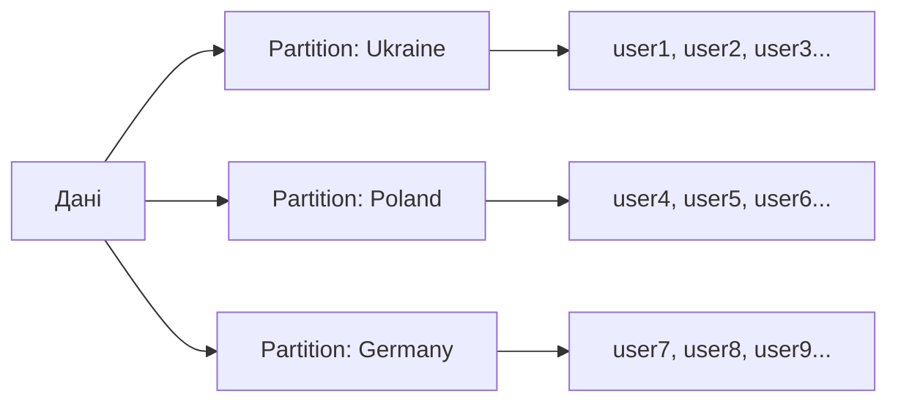
```mermaid
graph LR
    A[Дані] --> B[Partition: Ukraine]
    A --> C[Partition: Poland]
    A --> D[Partition: Germany]

    B --> E[user1, user2, user3...]
    C --> F[user4, user5, user6...]
    D --> G[user7, user8, user9...]
```

**✅ Переваги:** Масштабованість, швидкі записи
**❌ Недоліки:** Обмежені JOIN, складність запитів

## Графові бази даних

### 🕸️ **Neo4j, Amazon Neptune**

**Модель даних:**
```cypher
// Створення вузлів та зв'язків
CREATE (ivan:Person {name: 'Іван Петров', age: 25})
CREATE (maria:Person {name: 'Марія Коваленко', age: 23})
CREATE (kyiv:City {name: 'Київ'})
CREATE (company:Company {name: 'TechCorp'})

CREATE (ivan)-[:LIVES_IN]->(kyiv)
CREATE (maria)-[:LIVES_IN]->(kyiv)
CREATE (ivan)-[:WORKS_FOR {position: 'Developer'}]->(company)
CREATE (ivan)-[:FRIEND_OF {since: 2019}]->(maria)
```

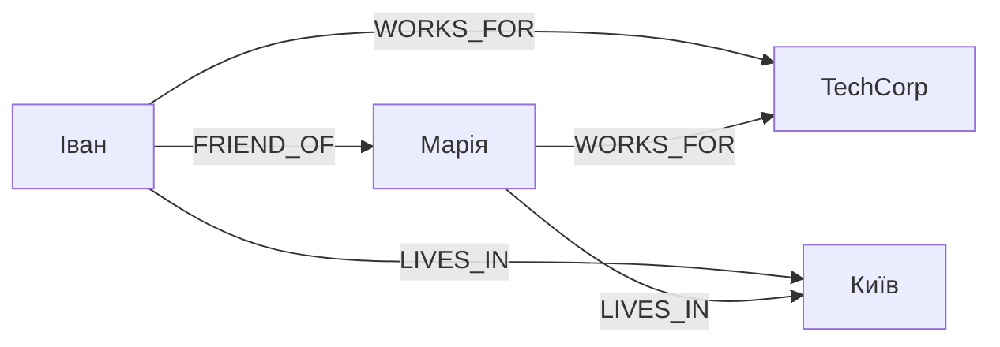
```mermaid
graph LR
    A[Іван] -->|FRIEND_OF| B[Марія]
    A -->|WORKS_FOR| C[TechCorp]
    B -->|WORKS_FOR| C
    A -->|LIVES_IN| D[Київ]
    B -->|LIVES_IN| D
```

## Графові запити

### 🔍 **Потужність зв'язків**

```cypher
// Друзі друзів
MATCH (person:Person {name: 'Іван Петров'})-[:FRIEND_OF*1..2]-(friend)
RETURN DISTINCT friend.name

// Рекомендація колег
MATCH (person:Person {name: 'Іван Петров'})-[:LIVES_IN]->(city),
      (colleague)-[:LIVES_IN]->(city),
      (person)-[:WORKS_FOR]->(company),
      (colleague)-[:WORKS_FOR]->(company)
WHERE person <> colleague
RETURN colleague.name, city.name

// Найкоротший шлях
MATCH path = shortestPath(
    (start:Person {name: 'Іван'})-[*]-(end:Person {name: 'Олег'})
)
RETURN path
```

**✅ Переваги:** Природне моделювання зв'язків, швидкі обходи
**❌ Недоліки:** Складність масштабування

## Порівняльна таблиця

### 📋 **Коли що використовувати?**

| Тип | Модель | Сильні сторони | Використання |
|-----|--------|----------------|--------------|
| **📄 Документи** | Гнучкі JSON | Схожість на об'єкти | CMS, каталоги, профілі |
| **🗝️ Ключ-значення** | Проста пара | Максимальна швидкість | Кеш, сесії, черги |
| **📊 Стовпцеві** | Широкі таблиці | Масштаб запису | Логи, метрики, IoT |
| **🕸️ Графи** | Вузли+ребра | Складні зв'язки | Соцмережі, рекомендації |

## **5. Polyglot Persistence**

## Концепція

### 🎯 **Різні задачі — різні інструменти**

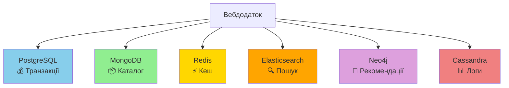
```mermaid
graph TB
    A[Вебдодаток] --> B[PostgreSQL<br/>💰 Транзакції]
    A --> C[MongoDB<br/>📦 Каталог]
    A --> D[Redis<br/>⚡ Кеш]
    A --> E[Elasticsearch<br/>🔍 Пошук]
    A --> F[Neo4j<br/>👥 Рекомендації]
    A --> G[Cassandra<br/>📊 Логи]

    style B fill:#87CEEB
    style C fill:#90EE90
    style D fill:#FFD700
    style E fill:#FFA500
    style F fill:#DDA0DD
    style G fill:#F08080
```

**Принцип:** Кожна БД для своєї задачі, а не одна БД для всього

## Приклад: Інтернет-магазин

### 🛒 **Гетерогенна архітектура**

**PostgreSQL — Замовлення та платежі:**
```sql
-- ACID транзакції критичні
BEGIN TRANSACTION;
    INSERT INTO orders (user_id, total) VALUES (1001, 299.99);
    UPDATE products SET stock = stock - 1 WHERE id = 501;
    INSERT INTO payments (order_id, amount) VALUES (LAST_INSERT_ID(), 299.99);
COMMIT;
```

**MongoDB — Каталог товарів:**
```javascript
// Гнучка структура для різних категорій
db.products.insertOne({
    sku: "LAPTOP-DELL-5520",
    name: "Dell Latitude 5520",
    specs: {
        processor: "Intel Core i7",
        ram: "16GB",
        storage: "512GB SSD"
    },
    reviews: [/* масив відгуків */]
});
```

## Кеш та пошук

### **Redis — Кешування:**
```javascript
// Швидкий доступ до популярних даних
await redis.setex(
    'product:bestseller:1',
    3600,  // TTL: 1 година
    JSON.stringify(productData)
);

// Кошик покупця
await redis.hset('cart:user:1001', {
    'product:501': '2',
    'product:502': '1'
});
```

### **Elasticsearch — Повнотекстовий пошук:**
```javascript
// Складний пошук з фільтрами
const results = await esClient.search({
    index: 'products',
    body: {
        query: {
            multi_match: {
                query: 'ноутбук core i7',
                fields: ['name^2', 'description']
            }
        }
    }
});
```

## Рекомендації та аналітика

### **Neo4j — Рекомендаційна система:**
```cypher
// Схожі користувачі
MATCH (user:User {id: 1001})-[:PURCHASED]->(product)<-[:PURCHASED]-(similar)
RETURN similar, COUNT(product) as commonPurchases
ORDER BY commonPurchases DESC
LIMIT 10

// Персоналізовані рекомендації
MATCH (user:User {id: 1001})-[:PURCHASED]->(p1)<-[:PURCHASED]-(similar)
      -[:PURCHASED]->(recommendation)
WHERE NOT (user)-[:PURCHASED]->(recommendation)
RETURN recommendation, COUNT(similar) as score
ORDER BY score DESC
```

### **Cassandra — Логування подій:**
```javascript
// Масштабований запис подій
INSERT INTO user_activity (
    user_id, activity_date, activity_time,
    activity_type, product_id
) VALUES (uuid(), '2024-01-15', now(), 'product_view', 501);
```

## Виклики Polyglot Persistence

### ⚠️ **Що потрібно враховувати?**

**Складність інтеграції:**
- 🔗 Кілька з'єднань з різними БД
- 🔄 Синхронізація даних між системами
- 💼 Управління розподіленими транзакціями

**Операційні виклики:**
- 🛠️ Різні інструменти моніторингу
- 👨‍💻 Потрібна експертиза в багатьох технологіях
- 💾 Складне резервне копіювання

**Консистентність:**
- ⏰ Відсутність глобальних транзакцій
- 🔄 Евентуальна консистентність між системами
- 📊 Складність відстеження змін

## Паттерни інтеграції

### 🔄 **Event Sourcing**

```mermaid
sequenceDiagram
    participant App
    participant EventBus
    participant Postgres
    participant MongoDB
    participant Elasticsearch

    App->>EventBus: ProductCreated Event
    EventBus->>Postgres: Зберегти транзакцію
    EventBus->>MongoDB: Додати до каталогу
    EventBus->>Elasticsearch: Індексувати для пошуку

    Note over EventBus: Асинхронна обробка
```

**Переваги:**
- ✅ Незалежна обробка подій
- ✅ Можливість відтворення стану
- ✅ Аудит всіх змін

## CQRS паттерн

### 📖 **Command Query Responsibility Segregation**

```mermaid
graph LR
    A[Додаток] --> B{CQRS}

    B --> C[Commands<br/>Запис]
    B --> D[Queries<br/>Читання]

    C --> E[PostgreSQL<br/>Транзакційна БД]
    D --> F[MongoDB<br/>Денормалізовані дані]

    E -.Реплікація.-> F

    style C fill:#FFB6C1
    style D fill:#90EE90
```

**Приклад:**
```javascript
// Command: запис у транзакційну БД
class CreateOrderCommand {
    async execute(orderData) {
        const order = await postgres.orders.create(orderData);
        await eventBus.publish('OrderCreated', order);
        return order;
    }
}

// Query: читання з оптимізованої БД
class OrderQueryService {
    async getOrderDetails(orderId) {
        return await mongodb.orders.findOne({ _id: orderId });
    }
}
```

## Коли використовувати Polyglot?

### ✅ **Критерії вибору**

**Так, якщо:**
- 📈 Різні частини системи мають різні вимоги
- ⚡ Критична продуктивність для окремих операцій
- 🌐 Глобальний масштаб з різними регіонами
- 💪 Команда має експертизу в різних БД

**Ні, якщо:**
- 🏢 Невеликий додаток з простими вимогами
- 👨‍💻 Мала команда без досвіду
- 💰 Обмежений бюджет на інфраструктуру
- ⏰ Швидкий time-to-market важливіший

## Практичні рекомендації

### 💡 **Best Practices**

```mermaid
mindmap
  root((Polyglot<br/>Persistence))
    ПОЧАТОК
      Одна БД спочатку
      Додавати поступово
      Базуватись на метриках
    ІНТЕГРАЦІЯ
      Event-driven
      CQRS для розділення
      API шлюзи
    МОНІТОРИНГ
      Єдина панель
      Розподілене трейсування
      Alerting на аномалії
    КОМАНДА
      Документація
      Навчання
      Код-рев'ю
```

## Висновки

### 🎓 **Ключові тези**

**1. Обмеження реляційної моделі:**
- Вертикальне масштабування обмежене
- Жорсткість схеми гальмує розвиток
- Impedance mismatch ускладнює розробку

**2. Теорема CAP:**
- Неможливо мати C+A+P одночасно
- Вибір залежить від вимог системи
- PACELC додає компроміс Latency vs Consistency

**3. BASE семантика:**
- Доступність важливіша за консистентність
- М'який стан — нормальна частина роботи
- Евентуальна консистентність прийнятна для багатьох задач

**4. Таксономія NoSQL:**
- 📄 **Документи:** гнучкі схеми, природне відображення об'єктів
- 🗝️ **Ключ-значення:** максимальна швидкість, простота
- 📊 **Стовпцеві:** масштабованість записів, аналітика
- 🕸️ **Графи:** складні зв'язки, мережевий аналіз

**5. Polyglot Persistence:**
- Різні задачі потребують різних інструментів
- Складність виправдана оптимізацією
- Event Sourcing та CQRS для інтеграції
