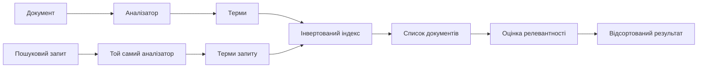
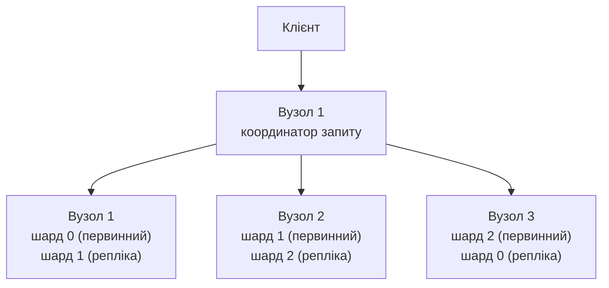
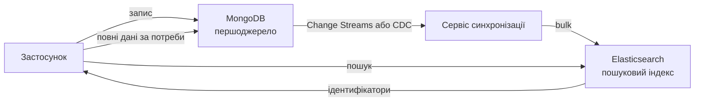

# Пошукові системи та Elasticsearch

## План лекції

1. Основи повнотекстового пошуку
2. Архітектура Elasticsearch
3. Підготовка середовища
4. Відображення
5. Індексування даних
6. Мова запитів Query DSL
7. Агрегації
8. Векторний та гібридний пошук
9. Інтеграція з основною базою
10. Альтернативи та вибір

## **📚 Ключові поняття:**

**Інвертований індекс** — відповідність «терм → список документів».

**Аналізатор** — перетворює текст на терми (токенізатор + фільтри).

**BM25** — алгоритм релевантності: частота слова, його рідкісність, довжина поля.

**Гібридний пошук** — лексичний (BM25) + векторний, рейтинги зливаються (RRF).

**Elasticsearch** — не першоджерело, а **похідний пошуковий індекс**.

## **1. Основи повнотекстового пошуку**

## Чому не `LIKE '%слово%'`

### 🔍 **Звичайні бази не створені для пошуку**

- Індекс B-дерева не допомагає: початок рядка невідомий
- Немає морфології («ноутбука» ≠ «ноутбук»)
- Немає стійкості до помилок
- Немає рейтингу за релевантністю та підсвічування
- Текстовий індекс MongoDB не підтримує української

## Інвертований індекс

| Терм | Документи |
|------|-----------|
| ігровий | 1 |
| ноутбук | 1, 2 |
| великий | 1, 3 |
| робота | 2, 3 |

- Пошук терма → одразу список документів
- Позиції → пошук фраз; частоти → релевантність



## Аналіз тексту

1. **Символьні фільтри** — очищення (напр., HTML)
2. **Токенізатор** — розбиття на слова
3. **Фільтри токенів** — регістр, стоп-слова, лематизація, синоніми

**Правило:** один аналізатор для індексації й пошуку.

Українська: плагін **`analysis-ukrainian`** (Morfologik).

## Релевантність: BM25

- **TF** — частота слова в документі (з насиченням)
- **IDF** — рідкісні слова цінніші
- **Довжина поля** — збіг у короткому полі важить більше
- Параметри за замовчуванням: `k1 = 1,2`, `b = 0,75`
- `_score` відносний: різні запити порівнювати не можна

## **2. Архітектура Elasticsearch**

## Основні поняття

| Elasticsearch | Реляційна СУБД | MongoDB |
|---------------|----------------|---------|
| Індекс | Таблиця | Колекція |
| Документ | Рядок | Документ |
| Відображення (mapping) | Схема | Валідація |
| Query DSL | SQL | Мова запитів |

REST API, обмін у форматі JSON.

## Вузли, шарди, репліки



- Запит: розсилка шардам → злиття результатів
- Кількість первинних шардів задають при створенні індексу

## Майже реальний час

- Сегменти Lucene незмінні
- `refresh_interval` = **1 с**: запис стає видимим для пошуку не миттєво
- Оновлення = позначити старе + записати нове
- Немає багатодокументних транзакцій
- Висновок: Elasticsearch — **не** єдине первинне сховище

## **3. Підготовка середовища**

## Docker

```bash
docker run -d --name es -p 9200:9200 \
  -e "discovery.type=single-node" \
  -e "xpack.security.http.ssl.enabled=false" \
  -e "ELASTIC_PASSWORD=changeme" \
  docker.elastic.co/elasticsearch/elasticsearch:9.1.0
```

- З версії 8 безпека **увімкнена за замовчуванням**
- TLS вимикаємо лише для навчання
- Перевірка: `curl -u elastic:changeme http://localhost:9200`

## Український аналізатор

```dockerfile
FROM docker.elastic.co/elasticsearch/elasticsearch:9.1.0
RUN bin/elasticsearch-plugin install --batch analysis-ukrainian
```

## Клієнт Node.js

```javascript
import { Client } from "@elastic/elasticsearch";

const es = new Client({
  node: "http://localhost:9200",
  auth: { username: "elastic", password: "changeme" },
});
```

- Мажорна версія клієнта = версії сервера
- Параметри передаємо без обгортки `body`
- Kibana Dev Tools — зручна консоль

## **4. Відображення**

## text і keyword

| Тип | Аналіз | Призначення |
|-----|--------|-------------|
| `text` | так | Повнотекстовий пошук |
| `keyword` | ні | Фільтри, сортування, агрегації |

- **Багатополя**: `name` (text) + `name.raw` (keyword)
- Інші типи: `integer`, `scaled_float`, `date`, `boolean`, `nested`, `geo_point`, `dense_vector`, `semantic_text`

## Індекс товарів

```javascript
await es.indices.create({
  index: "products",
  settings: { number_of_shards: 1, number_of_replicas: 0 },
  mappings: {
    dynamic: "strict",
    properties: {
      name:     { type: "text", analyzer: "ukrainian",
                  fields: { raw: { type: "keyword" } } },
      brand:    { type: "keyword" },
      category: { type: "keyword" },
      price:    { type: "scaled_float", scaling_factor: 100 },
      inStock:  { type: "boolean" }
    }
  }
});
```

## Налагодження аналізу

```javascript
await es.indices.analyze({
  index: "products", analyzer: "ukrainian",
  text: "Ігрові ноутбуки з великими екранами"
});
// → ["ігровий", "ноутбук", "великий", "екран"]
```

- Не знаходить очевидного? Дивимося, які терми в індексі
- Тип поля не змінюється → новий індекс + `_reindex`
- **Псевдоніми** (aliases) — перехід без простою

## **5. Індексування даних**

## CRUD

```javascript
await es.index({ index: "products", id: "7", document: { ... } });
await es.update({ index: "products", id: "7", doc: { price: 39999 } });
await es.delete({ index: "products", id: "7" });
const doc = await es.get({ index: "products", id: "7" });
```

`get` за ідентифікатором видимий одразу; пошук — після `refresh`.

## Пакетне завантаження

```javascript
await es.helpers.bulk({
  datasource: products,
  onDocument: () => ({ index: { _index: "products" } }),
  refreshOnCompletion: true
});
```

- Bulk API — багато операцій за один запит
- Примусовий `refresh` — лише в тестах

## **6. Мова запитів Query DSL**

## Запит і фільтр

| | Query context | Filter context |
|---|---------------|----------------|
| Питання | «Наскільки відповідає?» | «Відповідає чи ні?» |
| `_score` | обчислюється | ні |
| Кеш | ні | так |
| Приклади | `match` | `term`, `range` |

## Основні запити

| Запит | Призначення |
|-------|-------------|
| `match` | Повнотекстовий пошук у `text` |
| `match_phrase` | Фраза з порядком слів |
| `multi_match` | Кілька полів, ваги (`name^3`) |
| `term` / `terms` | Точний збіг у `keyword` |
| `range` | Діапазон |
| `bool` | Комбінація |

`term` для полів `text` — типова помилка.

## Запит bool

| Розділ | Змістом | `_score` |
|--------|---------|----------|
| `must` | Обов'язково | так |
| `filter` | Обов'язково | ні |
| `should` | Бажано | так |
| `must_not` | Виключити | ні |

## Приклад bool

```javascript
await es.search({
  index: "products",
  query: { bool: {
    must:   [{ multi_match: { query: "ігровий ноутбук",
                              fields: ["name^3", "description"] } }],
    filter: [{ term: { category: "ноутбуки" } },
             { range: { price: { lte: 50000 } } },
             { term: { inStock: true } }],
    should: [{ range: { rating: { gte: 4.5 } } }]
  } },
  highlight: { fields: { description: {} } },
  size: 10
});
```

## Помилки, підказки, сторінки

- `fuzziness: "AUTO"` — допускає друкарські помилки
- `search_as_you_type`, `suggest` — автодоповнення
- `from` + `size` ≤ 10 000; глибока пагінація дорога
- **`search_after`** + `pit` — стабільний обхід великих результатів

## **7. Агрегації**

## Фасети й аналітика

```javascript
await es.search({
  index: "products", size: 0,
  query: { match: { name: "ноутбук" } },
  aggs: {
    by_brand:  { terms: { field: "brand", size: 10 } },
    avg_price: { avg: { field: "price" } },
    per_month: { date_histogram: { field: "createdAt",
                                   calendar_interval: "month" } }
  }
});
```

## Види агрегацій

| Вид | Приклади |
|-----|----------|
| Кошикові (bucket) | `terms`, `range`, `date_histogram` |
| Метричні (metric) | `avg`, `sum`, `stats`, `cardinality` |
| Конвеєрні (pipeline) | Обчислення над результатами інших |

- Працюють із `keyword`, числами, датами (`doc_values`)
- **ES|QL** — конвеєрна мова для аналітики

## **8. Векторний та гібридний пошук**

## Від слів до змісту

- Ембедінг: текст → вектор; схожий зміст → близькі вектори
- Пошук найближчих сусідів; наближений алгоритм **HNSW**
- Вектори документів і запитів — **однією моделлю**
- Для української — багатомовна модель
- Основа систем **RAG**

## dense_vector і kNN

```javascript
mappings: { properties: {
  embedding: { type: "dense_vector", dims: 384, similarity: "cosine" }
} }

await es.search({
  index: "articles",
  knn: { field: "embedding", query_vector: queryVector,
         k: 5, num_candidates: 50 }
});
```

- `semantic_text` — Elasticsearch сам створює ембедінги

## Гібридний пошук

| BM25 | Вектори |
|------|---------|
| Точні терміни, коди, імена | Перефразування, зміст |
| Не знає синонімів | Може загубити точний збіг |

- Шкали оцінок різні → **RRF**: `Σ 1 / (k + позиція)`
- Ретрівери: `standard` + `knn` → `rrf`
- За потреби — повторне ранжування (reranking)

## **9. Інтеграція з основною базою**

## Схема синхронізації



## Сервіс синхронізації

```javascript
const stream = products.watch([], { fullDocument: "updateLookup" });
for await (const change of stream) {
  const id = String(change.documentKey._id);
  if (change.operationType === "delete") {
    await es.delete({ index: "products", id }, { ignore: [404] });
  } else {
    const { _id, ...doc } = change.fullDocument;
    await es.index({ index: "products", id, document: doc });
  }
}
```

## Вимоги до синхронізації

- Ідемпотентність: `_id` MongoDB = `_id` документа
- Токен відновлення (`resumeToken`) — продовження після збою
- Початкове завантаження + повна перебудова з першоджерела
- Затримка: від сотень мілісекунд до секунд
- Індексувати лише потрібне для пошуку

## **10. Альтернативи та вибір**

## Порівняння рішень

| Рішення | Коли обирати |
|---------|--------------|
| **Elasticsearch** | Складний пошук, аналітика журналів, великі обсяги |
| **OpenSearch** | Вільна ліцензія Apache 2.0, хмара AWS |
| **PostgreSQL FTS + `pgvector`** | Невеликий обсяг, без нової інфраструктури |
| **Atlas Search / `$search`** | Уже є MongoDB, потрібна простота |
| **Meilisearch, Typesense** | Простий пошук для сайту, підказки |
| **Векторні бази** | Основне навантаження — семантичний пошук |

**Правило:** починайте з найпростішого рішення, що задовольняє вимоги.

## Висновки

- Інвертований індекс + аналізатор + BM25 = швидкий релевантний пошук
- `text` — для пошуку, `keyword` — для фільтрів і агрегацій
- `bool`: `must`, `filter`, `should`, `must_not`
- Агрегації дають фасети; вектори й RRF — розуміння змісту
- Elasticsearch — **похідний індекс**, синхронізований асинхронно та ідемпотентно
- Кожна нова система коштує: обирайте свідомо
