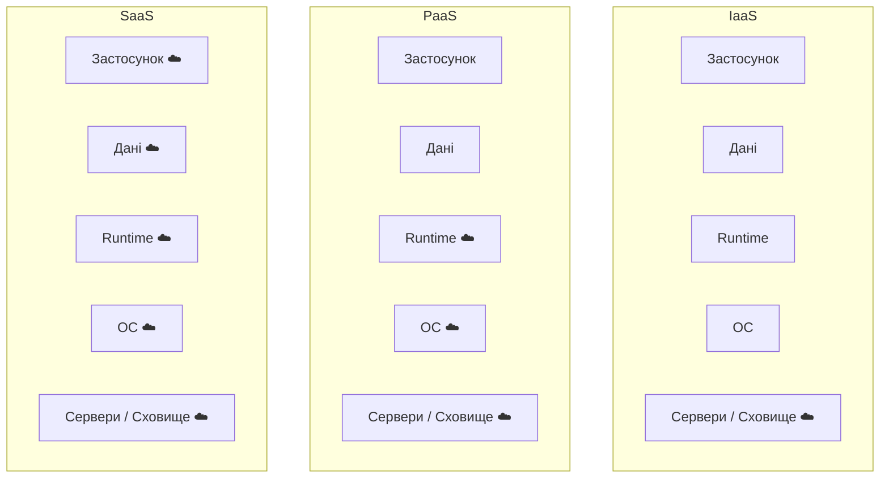
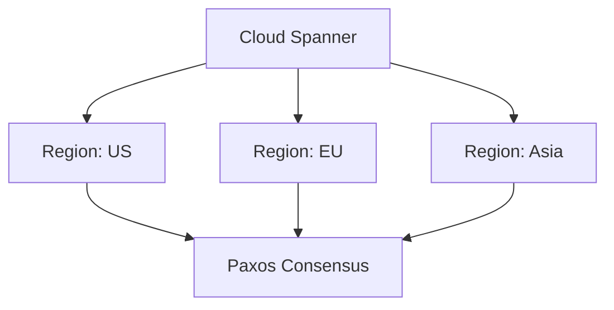
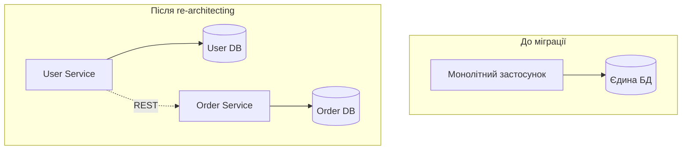
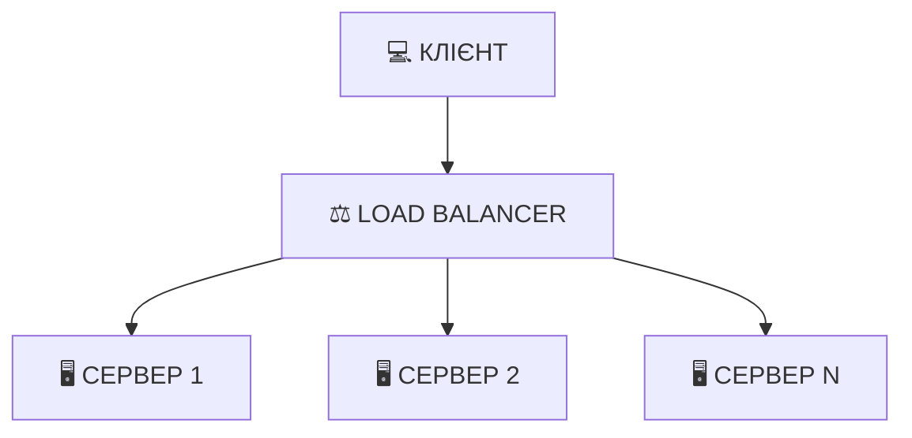
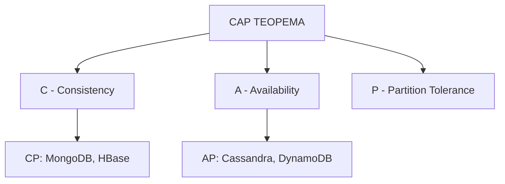
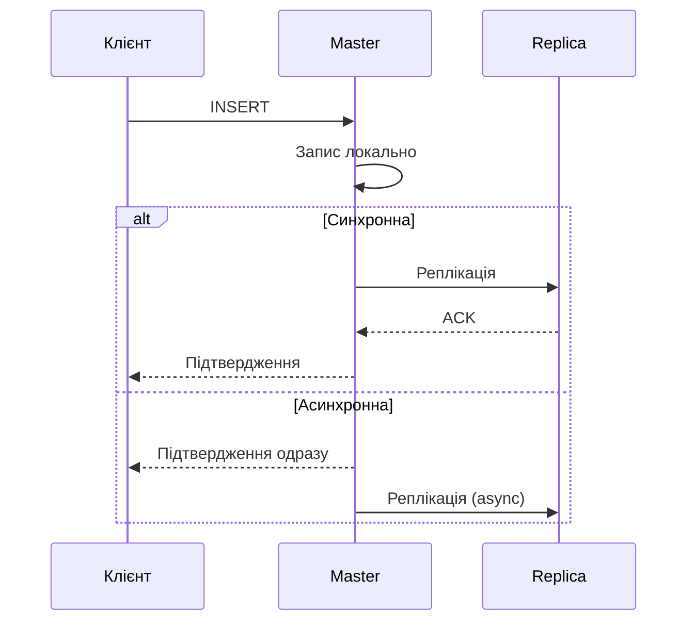

# Презентація 12. Хмарні та розподілені СУБД

## План лекції

1. Моделі хмарних сервісів та DBaaS
2. Архітектурні патерни хмарних СУБД
3. Провідні хмарні платформи
4. Міграція до хмари
5. Вертикальне та горизонтальне масштабування
6. Шардинг, реплікація, консенсус
7. NewSQL та конвергенція розподіленого SQL

## **☁️ Основні поняття:**

**Хмарні обчислення** — надання обчислювальних ресурсів через інтернет на основі оплати за використання.

**DBaaS** (Database as a Service) — керована база даних як сервіс у хмарі.

**Масштабування** — процес збільшення потужності системи для обробки зростаючого навантаження.

**Шардинг** — горизонтальний розподіл даних між кількома серверами.

**Реплікація** — створення та підтримка копій даних на кількох серверах.

**Консенсус** — процес досягнення згоди між вузлами розподіленої системи про стан даних.

## **1. Моделі хмарних сервісів**

## IaaS, PaaS, SaaS

### 🏗️ **Три рівні хмарних сервісів:**



**IaaS:** VM + сховище + мережа, клієнт сам ставить СУБД (EC2, Compute Engine)
**PaaS:** керована СУБД — бекапи, патчі, масштабування (RDS, Cloud SQL, Azure SQL DB)
**SaaS:** готовий застосунок, БД повністю прихована (Salesforce, Google Workspace)

## Порівняння моделей для БД

| Модель | Контроль | Адміністрування | Масштабування | Вартість |
|--------|----------|-----------------|---------------|----------|
| **IaaS** | 🟢 Високий | 🔴 Повне на клієнті | 🟡 Ручне | 💰 Низька |
| **PaaS** | 🟡 Середній | 🟡 Часткове | 🟢 Керовані | 💰💰 Середня |
| **DBaaS/Serverless** | 🔴 Обмежений | 🟢 Мінімальне | 🟢 Автоматичне | 💰💰💰 Висока |

## **2. Архітектурні патерни хмарних СУБД**

## Multi-tenancy (багатоорендність)

### 🏘️ **Три моделі ізоляції клієнтів:**

- **Окремі бази даних** — максимальна ізоляція, більше ресурсів
- **Окремі схеми** — баланс ізоляції та ефективності
- **Спільна схема + `tenant_id`** — максимальна ефективність, потребує RLS

```sql
CREATE TABLE customers (
    customer_id SERIAL PRIMARY KEY,
    tenant_id INTEGER NOT NULL,
    ...
);

CREATE POLICY tenant_isolation ON customers
    USING (tenant_id = current_setting('app.current_tenant')::INTEGER);

ALTER TABLE customers ENABLE ROW LEVEL SECURITY;
```

## Еластичність та Pay-per-use

### 📈 **Вертикальна vs горизонтальна еластичність:**

- **Вертикальна** — зміна класу інстанції (`db.t3.medium` → `db.t3.large`)
- **Горизонтальна** — авто-масштабування read-реплік за метриками CPU

**Serverless-оплата (Aurora Serverless v2):**
```
MinCapacity: 0.5 ACU   MaxCapacity: 256 ACU
Оплата: ≈0.06–0.12 USD за ACU-годину
Auto-pause при відсутності активності
```

## **3. Провідні хмарні платформи**

## AWS: RDS, Aurora, Aurora DSQL

### 🔶 **Екосистема Amazon:**

- **RDS** — 6 движків (PostgreSQL, MySQL, MariaDB, Oracle, SQL Server, Aurora), Multi-AZ, read replicas
- **Aurora** — розподілене сховище, 6 копій у 3 AZ, до 15 read replicas
- **Aurora DSQL (GA травень 2025)** — serverless, PostgreSQL-сумісна, **активна-активна мультирегіональна** база

```hcl
resource "aws_db_instance" "production" {
  engine         = "postgres"
  engine_version = "17.4"
  instance_class = "db.t3.large"
  multi_az       = true
}
```

## GCP: Cloud SQL, Spanner, AlloyDB

### 🔵 **Екосистема Google:**

- **Cloud SQL** — PostgreSQL/MySQL/SQL Server, PITR, регіональна доступність
- **Cloud Spanner** — глобальна консистентність через TrueTime, автоматичний шардинг
- **AlloyDB** — PostgreSQL-сумісний, колонкове прискорення аналітики



## Azure: SQL Database, Cosmos DB, HorizonDB

### 🔷 **Екосистема Microsoft:**

- **Azure SQL Database** — Single/Elastic Pool/Managed Instance, DTU/vCore/Serverless
- **Cosmos DB** — multi-model, 5 рівнів консистентності, глобальний розподіл
- **Azure HorizonDB (анонс, кінець 2025)** — відповідь на Spanner/Aurora DSQL

**Незалежні гравці:** MongoDB Atlas (multi-cloud), Neon (serverless PostgreSQL, branching), PlanetScale (MySQL/Vitess **+ PlanetScale Postgres**)

## **4. Міграція до хмари**

## Стратегія «6R»

### 🚀 **Шість шляхів міграції:**

| # | Стратегія | Суть |
|---|---|---|
| 1 | **Rehost** (lift-and-shift) | Переміщення без змін, найшвидше |
| 2 | **Replatform** | Незначні оптимізації |
| 3 | **Refactor / Re-architect** | Переписування під хмару |
| 4 | **Repurchase** | Заміна на SaaS |
| 5 | **Retire** | Виведення з експлуатації |
| 6 | **Retain** | Залишити on-premises |

## Lift-and-shift vs Re-architecting



**Lift-and-shift:** швидко, мінімальний ризик, зберігає технічний борг
**Re-architecting:** повільніше, складніше, максимум переваг хмари

**Інструменти:** AWS DMS + Schema Conversion Tool — near-zero-downtime міграція через CDC

## Cutover-стратегії

### 🔀 **Big Bang / Phased / Blue-Green**

- **Big Bang** — одномоментне перемикання, downtime, ризиковано
- **Phased** — поступовий перерозподіл трафіку, без downtime
- **Blue-Green** — паралельні середовища, миттєве перемикання, легкий rollback

## **5. Вертикальне та горизонтальне масштабування**

## Вертикальне масштабування (Scale Up)

### 💪 **Збільшення потужності одного сервера**

```sql
-- Для сервера з 64 GB RAM
ALTER SYSTEM SET shared_buffers = '16GB';
ALTER SYSTEM SET effective_cache_size = '48GB';
ALTER SYSTEM SET max_parallel_workers = 8;
```

✅ Простота, ACID без зусиль, немає мережевої латентності
❌ Фізична межа потужності, єдина точка відмови, простій при апгрейді

> PostgreSQL 18 (2025): нова асинхронна I/O-підсистема (`io_uring`) розширює межі вертикального масштабування на потужних багатоядерних серверах.

## Горизонтальне масштабування (Scale Out)

### 🌐 **Додавання нових серверів**



✅ Практично необмежена масштабованість, відмовостійкість, географічний розподіл
❌ Складність архітектури, проблеми консистентності, мережева латентність

## CAP-теорема

### 🔺 **Неможливо гарантувати C, A, P одночасно:**



| Тип | Пріоритет | Приклади | Сценарії |
|---|---|---|---|
| **CP** | Консистентність | MongoDB, HBase | Фінансові транзакції |
| **AP** | Доступність | Cassandra, DynamoDB | Соціальні мережі |

## **6. Шардинг, реплікація, консенсус**

## Стратегії шардингу

| Стратегія | Розподіл | Діапазонні запити | Складність |
|-----------|----------|-------------------|------------|
| **Діапазонний** | Нерівномірний | ✅ Ефективні | 🟢 Низька |
| **Хешований** (consistent hashing) | Рівномірний | ❌ Неефективні | 🟡 Середня |
| **Директорний** | Гнучкий | 🟡 Залежить | 🔴 Висока |

**Рекомендації:** multi-tenant → директорний; рівномірне навантаження → хешований; часові дані → діапазонний

## Реплікація: синхронна vs асинхронна



**Синхронна:** нульова втрата даних, вища латентність
**Асинхронна:** низька латентність, ризик втрати даних при збої master

**Master-Slave:** простота, єдина точка відмови для запису
**Master-Master (BDR):** відсутність єдиної точки відмови, складні конфлікти

## Консенсус: Paxos vs Raft

| Характеристика | Paxos | Raft |
|----------------|-------|------|
| Складність | Висока | Середня |
| Зрозумілість | Складно | Просто |
| Використання | Google Chubby | etcd, Consul, CockroachDB |

**Raft:** Leader → Follower → Candidate, вибори через таймаут heartbeat, реплікація логу на більшість вузлів

## **7. NewSQL та конвергенція розподіленого SQL**

## Що таке NewSQL?

### 🆕 **SQL + ACID + горизонтальна масштабованість:**

- Розподілені транзакції, автоматичний шардинг, вбудована реплікація, глобальна консистентність
- **Приклади:** Google Cloud Spanner, CockroachDB, YugabyteDB, VoltDB

```sql
CREATE TABLE users (
    user_id UUID PRIMARY KEY,
    country STRING
) PARTITION BY LIST (country) (
    PARTITION europe VALUES IN ('UK', 'DE', 'FR', 'UA')
);
```

## Розподілений SQL як DBaaS (2025)

### 🌍 **NewSQL стає мейнстрімною DBaaS-послугою:**

- **Amazon Aurora DSQL** (GA травень 2025) — serverless, активна-активна мультирегіональна
- **Azure HorizonDB** (анонс кінець 2025) — відповідь Microsoft
- **YugabyteDB** — PostgreSQL-сумісна, Raft-консенсус

**Ключовий висновок:** межа між «просто хмарною БД» і «розподіленою архітектурою» зникає — складність шардингу й консенсусу ховається всередині керованого сервісу.

## Висновки

### 🎯 **Ключові моменти:**

- **Хмарні моделі** (IaaS/PaaS/SaaS) визначають баланс контролю й зручності
- **Архітектурні патерни** (multi-tenancy, еластичність, pay-per-use) — основа економіки хмари
- **Масштабування:** вертикальне — просто, але обмежено; горизонтальне — необмежено, але складно
- **Шардинг, реплікація, консенсус** — «двигуни» будь-якої розподіленої СУБД
- **NewSQL / розподілений SQL (Aurora DSQL, Spanner, CockroachDB, HorizonDB)** — конвергенція обох тем в одну послугу
