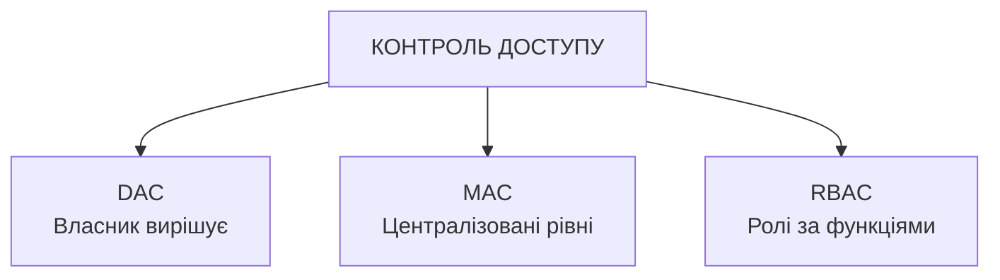
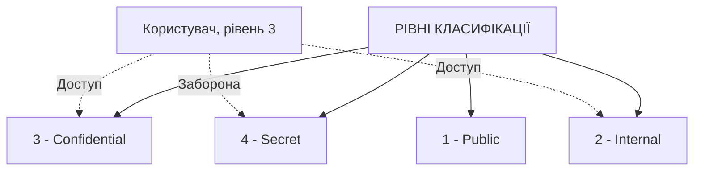
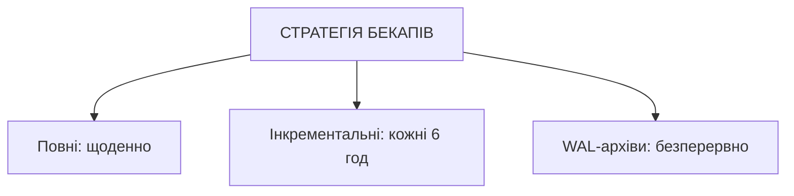
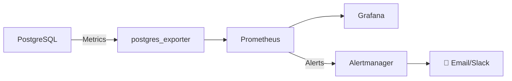

# Презентація 13. Безпека та адміністрування СУБД

## План лекції

1. Моделі контролю доступу
2. Загрози безпеці баз даних
3. Криптографічні методи захисту
4. Аудит та резервне копіювання
5. Метрики продуктивності СУБД
6. Профілювання запитів та вузькі місця
7. Інструменти моніторингу та планове обслуговування
8. Конвергенція безпеки й продуктивності

## **🔒📊 Основні поняття:**

**Автентифікація** — перевірка ідентичності користувача. **Авторизація** — надання прав доступу.

**Аудит** — систематичне відстеження дій користувачів.

**Throughput** — кількість операцій за одиницю часу (TPS, QPS). **Response Time** — час виконання операції. **Bottleneck** — вузьке місце, що обмежує продуктивність.

## **1. Моделі контролю доступу**

## DAC, MAC, RBAC

### 🔑 **Три моделі організації прав:**



| Модель | Гнучкість | Безпека | Складність | Використання |
|--------|-----------|---------|------------|--------------|
| **DAC** | 🟢 Висока | 🟡 Середня | 🟢 Низька | Комерційні СУБД |
| **MAC** | 🔴 Низька | 🟢 Висока | 🔴 Висока | Урядові/військові системи |
| **RBAC** | 🟡 Середня | 🟡 Середня | 🟡 Середня | Корпоративні системи |

```sql
-- RBAC: ролі + ієрархія
CREATE ROLE sales_role;
GRANT SELECT, INSERT, UPDATE ON sales.customers TO sales_role;
GRANT sales_role TO john_sales;

SET ROLE sales_role; -- динамічне перемикання в сесії
```

## MAC: Row-Level Security

### 🏛️ **Read-down / write-up:**



```sql
ALTER TABLE documents ENABLE ROW LEVEL SECURITY;

CREATE POLICY mac_read_down ON documents
FOR SELECT
USING (classification_level <= (
    SELECT clearance_level FROM user_clearance WHERE username = current_user
));
```

## **2. Загрози безпеці баз даних**

## SQL ін'єкції

### 💉 **Найнебезпечніша вразливість веб-застосунків:**

```python
# НЕБЕЗПЕЧНО
query = f"SELECT * FROM users WHERE username = '{username}'"
# Атака: username = "admin' --" → пароль не перевіряється!
```

**Типи:** Union-based, Boolean-based blind, Time-based blind, Second-order

**Захист:**
```python
# БЕЗПЕЧНО — параметризований запит
cursor.execute("SELECT * FROM users WHERE username = %s", (username,))
```
+ ORM, валідація вводу (whitelist), обмеження прав ролі в БД (`REVOKE DROP, TRUNCATE`)

## Несанкціонований доступ

### 🚪 **MFA, rate limiting, виявлення аномалій:**

```python
import pyotp
totp = pyotp.TOTP(pyotp.random_base32())
if totp.verify(token):
    print("Login successful!")
```

**Виявлення аномалій:** множинні невдалі спроби з різних IP, вхід з нетипової локації, «неможливі подорожі» (два входи з різних країн за короткий час)

> **Актуалізація:** PostgreSQL 18 (2025) додав вбудовану **OAuth 2.0 автентифікацію** — інтеграція з Azure AD/Okta/Google замість власних 2FA-рішень

## Витоки даних

### 📤 **Data Loss Prevention:**

```sql
-- Маскування чутливих даних для аналітиків
CREATE OR REPLACE FUNCTION mask_credit_card(card_number TEXT)
RETURNS TEXT AS $$
    SELECT '****-****-****-' || right(card_number, 4);
$$ LANGUAGE sql IMMUTABLE;

CREATE VIEW customers_masked AS
SELECT customer_id, mask_credit_card(credit_card_number) as credit_card FROM customers;

GRANT SELECT ON customers_masked TO analyst_role;
REVOKE ALL ON customers FROM analyst_role;
```

**Виявлення ексфільтрації:** масове читання, доступ у незвичний час, доступ до нетипових таблиць

## **3. Криптографічні методи захисту**

## Шифрування at rest / in transit

### 🔐 **Два рівні захисту даних:**

```sql
-- At rest: шифрування стовпців
CREATE EXTENSION pgcrypto;
INSERT INTO secure_customers (ssn_encrypted)
VALUES (pgp_sym_encrypt('123-45-6789', 'key'));
```

```conf
# In transit: SSL/TLS
ssl = on
ssl_min_protocol_version = 'TLSv1.2'
# pg_hba.conf: hostssl all all 0.0.0.0/0 scram-sha-256
```

**TDE** (Transparent Data Encryption) — шифрування всієї БД на рівні файлової системи

## Управління ключами

### 🔑 **Key Management:**

- Централізоване зберігання: **AWS KMS, Azure Key Vault, HashiCorp Vault**
- Регулярна ротація ключів (≈90 днів)
- Розділення обов'язків + аудит використання

**Ротація:** генерація нового ключа → перешифрування даних → архівування старого → оновлення конфігурації

## **4. Аудит та резервне копіювання**

## Комплексний аудит

```sql
CREATE TABLE comprehensive_audit_log (
    audit_id BIGSERIAL PRIMARY KEY,
    timestamp TIMESTAMP DEFAULT CURRENT_TIMESTAMP,
    database_user VARCHAR(50),
    operation_type VARCHAR(20),
    old_values JSONB, new_values JSONB,
    client_ip INET
) PARTITION BY RANGE (timestamp);
```

**Що логувати:** зміни даних, доступ до чутливих даних, зміни схеми/привілеїв, невдалі спроби

**Виявлення:** масові видалення, зміна привілеїв (`GRANT`/`REVOKE`/`ALTER ROLE`)

## Стратегії резервного копіювання

### 💾 **Правило 3-2-1:**



```bash
pg_dump -Fc -f backup.dump production
aws s3 cp backup.dump.gz s3://backups/full/
```

**PITR:** `recovery_target_time = '2026-01-15 14:30:00'`

**Обов'язково:** тестове відновлення бекапів!

> **Актуалізація:** production-стандарт 2025–2026 — **pgBackRest** замість саморобних bash-скриптів (паралельні бекапи, шифрування, перевірка цілісності з коробки)

## **5. Метрики продуктивності СУБД**

## Throughput і Response Time

### ⚡ **TPS, QPS, персентилі:**

```sql
SELECT xact_commit + xact_rollback as total_transactions,
    ROUND(100.0 * xact_commit / NULLIF(xact_commit + xact_rollback, 0), 2) as success_rate
FROM pg_stat_database WHERE datname = current_database();
```

**Персентилі часу відгуку:** P50 < 10ms · P95 < 100ms · P99 < 500ms — середнє маскує «хвіст» повільних запитів

```sql
SELECT query, calls, mean_exec_time, total_exec_time,
    ROUND(100.0 * total_exec_time / SUM(total_exec_time) OVER (), 2) AS percent_total_time
FROM pg_stat_statements ORDER BY total_exec_time DESC LIMIT 20;
```

## Утилізація ресурсів

### 💻 **CPU, пам'ять, диск:**

| Ресурс | Ключова метрика | Норма |
|---|---|---|
| CPU | System/process usage, I/O wait | wait < 20% |
| Пам'ять | Cache hit ratio | > 95% |
| Диск | IOPS, throughput, seq scans | мінімум Seq Scan на великих таблицях |

```sql
SELECT datname, ROUND(100.0 * blks_hit / NULLIF(blks_hit + blks_read, 0), 2) AS cache_hit_ratio
FROM pg_stat_database WHERE datname = current_database();
```

## **6. Профілювання запитів та вузькі місця**

## EXPLAIN ANALYZE

### 🔍 **План виконання vs фактичне виконання:**

```sql
EXPLAIN ANALYZE
SELECT * FROM customers WHERE city = 'Київ';
/*
Seq Scan on customers (actual time=0.015..15.234 rows=10000 loops=1)
  Rows Removed by Filter: 90000
Execution Time: 16.456 ms
*/
```

| Проблема | Симптом | Рішення |
|---|---|---|
| Seq Scan великої таблиці | rows > 10 000 | Додати індекс |
| Неточна оцінка | plan_rows ≠ actual_rows | `ANALYZE table;` |
| Високе дискове читання | Shared Read Blocks велике | ↑ `shared_buffers`/`work_mem` |
| Nested Loop, багато ітерацій | loops > 1000 | Форсувати hash/merge join |

> **Актуалізація:** PostgreSQL 18 додав **skip scan** для багатостовпцевих B-tree індексів — індекс `(a,b)` тепер працює й для запитів лише за `b`

## N+1 проблема

### 🐌 **Класична пастка ORM:**

| Підхід | Запитів | Час (100 записів) |
|--------|---------|-------------------|
| **N+1** | 101 | ~1010ms |
| **JOIN** | 1 | ~25ms |
| **Eager Loading** | 2 | ~30ms |

```python
# Правильно — один запит з JOIN замість циклу
cur.execute("""
    SELECT c.customer_id, o.order_id FROM customers c
    LEFT JOIN orders o ON c.customer_id = o.customer_id
    WHERE c.customer_id IN (SELECT customer_id FROM customers LIMIT 10)
""")
```

## **7. Інструменти моніторингу та планове обслуговування**

## Prometheus + Grafana



**Алерти:** cache hit ratio < 90%, довгі запити > 1 хв, блокування > 5 хв

**Інші інструменти:** pgAdmin (GUI + Dashboard), pgBadger (аналіз логів постфактум)

## VACUUM, ANALYZE, REINDEX

### 🧹 **Регулярне обслуговування:**

```sql
VACUUM (VERBOSE, ANALYZE) customers;
REINDEX INDEX CONCURRENTLY idx_customers_city;
```

| Операція | Частота |
|----------|---------|
| ANALYZE / VACUUM | Щоденно |
| REINDEX | Щотижня |
| Архівування | Щомісяця |
| Бекап (повний) | Щоденно |

> **Актуалізація:** PostgreSQL 18 — нова I/O-підсистема `io_uring` прискорює VACUUM і масове читання на NVMe

## **8. Конвергенція безпеки й продуктивності**

## Спільна інфраструктура DBRE

### 🔗 **Дві дисципліни — одна практика:**

- Журнали аудиту й метрик продуктивності мають однакову проблему (зростання обсягу) → однакове рішення (партиціонування за часом)
- Один стек Prometheus/Grafana покриває і CPU-метрики, і security-алерти
- Один метод виявлення аномалій (mean ± 3·stddev) — для TPS і для підозрілих входів
- Погано оптимізований запит (`Seq Scan` мільйона рядків) — це і проблема швидкодії, і вектор DoS-атаки

**Тренд:** класичний DBA → **Database Reliability Engineer (DBRE)** — єдина відповідальність за надійність, безпеку й продуктивність

## Висновки

### 🎯 **Ключові принципи:**

**Безпека:** багаторівневий захист (DAC/MAC/RBAC + шифрування + аудит + бекапи), проактивний підхід, комплаєнс (GDPR, HIPAA)

**Продуктивність:** систематичний збір метрик, `EXPLAIN ANALYZE` для всіх повільних запитів, планове обслуговування

**Об'єднавчий висновок:** спільна інфраструктура журналювання й моніторингу обслуговує обидві задачі — це і є суть сучасного адміністрування баз даних
