# Презентація 14. Elasticsearch та пошукові системи

## План презентації

1. Вступ до повнотекстового пошуку
2. Архітектура Elasticsearch
3. Інвертовані індекси
4. Аналіз тексту та токенізація
5. Пошукові запити
6. Агрегації та аналітика

---

## **💡 Еволюція пошуку**

**Від простого до складного**

### 📊 **Проблеми традиційного пошуку:**

```sql
-- SQL LIKE - повільно і обмежено
SELECT * FROM articles
WHERE content LIKE '%elasticsearch%'
-- Проблеми:
-- ❌ Повне сканування таблиці
-- ❌ Без урахування морфології
-- ❌ Немає ранжування за релевантністю
-- ❌ Не працює з синонімами
```

### ✅ **Рішення Elasticsearch:**

- ⚡ Миттєвий пошук у мільярдах документів
- 🔤 Морфологічний аналіз
- 📊 Ранжування за релевантністю
- 🌍 Підтримка багатьох мов
- 📈 Аналітика у реальному часі

---

## Що таке Elasticsearch?

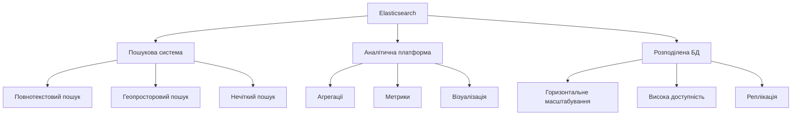

**Базується на Apache Lucene**
- Open source з 2010 року
- Написаний на Java
- RESTful API (JSON over HTTP)

---

## Застосування Elasticsearch

### 🎯 **Популярні use cases:**

**Пошук:**
- 🛒 E-commerce каталоги (Amazon, eBay)
- 📰 Пошук по новинах та контенту
- 📚 Бібліотеки документів
- 🔍 Enterprise search

**Аналітика:**
- 📊 Бізнес-аналітика
- 📈 Логування та моніторинг (ELK Stack)
- 🔐 Безпека та SIEM
- 📱 Аналітика додатків

**Реального часу:**
- 🚨 Алерти та моніторинг
- 📍 Геопросторові додатки
- 💬 Рекомендаційні системи

---

## **1. Вступ до повнотекстового пошуку**

## Інвертований індекс: концепція

### 📚 **Пряме vs Інвертоване індексування:**

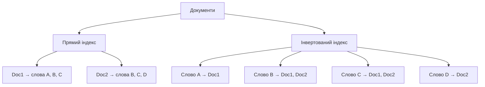

**Пряме індексування:** Документ → Терміни
**Інвертоване індексування:** Термін → Документи

---

## Приклад створення індексу

### 📝 **Вихідні документи:**

```javascript
// Документ 1
{
    "id": 1,
    "title": "Вступ до баз даних",
    "content": "Бази даних є фундаментальною частиною систем"
}

// Документ 2
{
    "id": 2,
    "title": "NoSQL системи",
    "content": "NoSQL бази пропонують гнучкі схеми даних"
}

// Документ 3
{
    "id": 3,
    "title": "Elasticsearch та пошук",
    "content": "Elasticsearch забезпечує швидкий пошук у даних"
}
```

---

## Інвертований індекс

### 🔍 **Після аналізу та індексування:**

```javascript
const invertedIndex = {
    "баз": [1, 2],
    "даних": [1, 2, 3],
    "фундаментальною": [1],
    "частиною": [1],
    "систем": [1],
    "nosql": [2],
    "пропонують": [2],
    "гнучкі": [2],
    "схеми": [2],
    "elasticsearch": [3],
    "забезпечує": [3],
    "швидкий": [3],
    "пошук": [3]
}

// Пошук "баз даних":
// 1. Знаходимо документи для "баз" → [1, 2]
// 2. Знаходимо документи для "даних" → [1, 2, 3]
// 3. Об'єднуємо → [1, 2, 3]
// 4. Ранжуємо за релевантністю → Doc 1 найкращий
```

---

## Процес пошуку

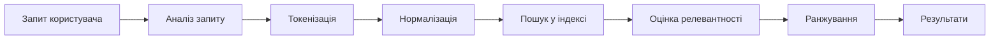

**Швидкість:** Пошук у мільярдах документів < 100ms!

**Чому так швидко?**
- Індекс зберігається в пам'яті
- Оптимізовані структури даних
- Розподілена обробка

---

## **2. Архітектура Elasticsearch**

## Компоненти кластера

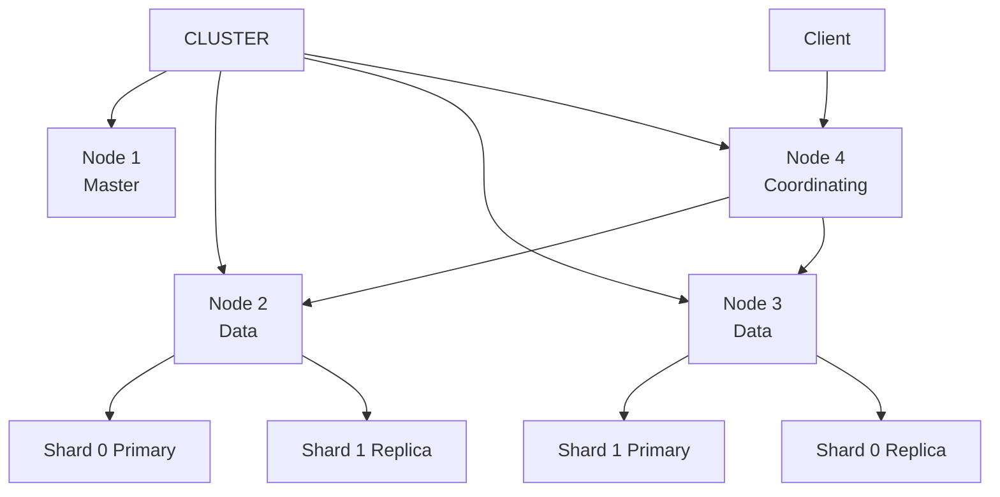

**Типи вузлів:**
- 👑 Master - керування кластером
- 💾 Data - зберігання даних
- 🔀 Coordinating - маршрутизація
- 🔧 Ingest - обробка даних

---

## Ієрархія даних

### 📊 **Організація інформації:**

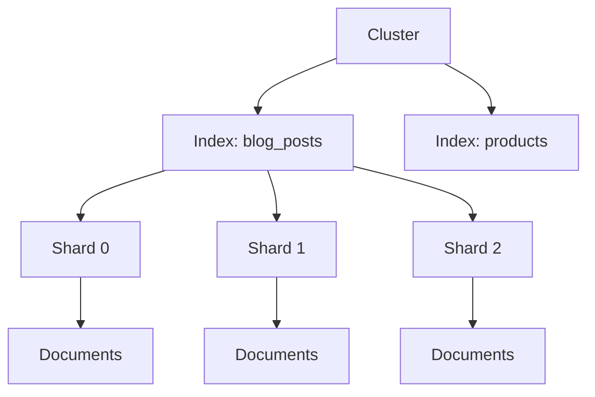

**Термінологія:**
- **Cluster** ≈ База даних (SQL)
- **Index** ≈ Таблиця (SQL)
- **Document** ≈ Рядок (SQL)
- **Field** ≈ Колонка (SQL)
- **Shard** = Частина індексу

---

## Створення індексу

### ⚙️ **Налаштування та маппінг:**

```javascript
PUT /blog_posts
{
    "settings": {
        "number_of_shards": 3,
        "number_of_replicas": 2,
        "analysis": {
            "analyzer": {
                "ukrainian_analyzer": {
                    "type": "custom",
                    "tokenizer": "standard",
                    "filter": ["lowercase", "stop_filter"]
                }
            }
        }
    },
    "mappings": {
        "properties": {
            "title": {
                "type": "text",
                "analyzer": "ukrainian_analyzer"
            },
            "content": {
                "type": "text",
                "analyzer": "ukrainian_analyzer"
            },
            "author": { "type": "keyword" },
            "published_date": { "type": "date" },
            "tags": { "type": "keyword" },
            "views_count": { "type": "integer" }
        }
    }
}
```

---

## Типи полів

| Тип | Призначення | Приклад |
|-----|-------------|---------|
| **text** | Повнотекстовий пошук | Стаття, опис |
| **keyword** | Точний пошук, фільтрація | Email, статус |
| **integer/long** | Числа | Вік, ID |
| **float/double** | Дробові числа | Ціна, рейтинг |
| **date** | Дати | Дата публікації |
| **boolean** | true/false | Активний, опубліковано |
| **object** | Вкладені об'єкти | Адреса |
| **nested** | Масив об'єктів | Коментарі |
| **geo_point** | Координати | Локація |

---

## Шардинг та реплікація

### 📦 **Розподіл даних:**

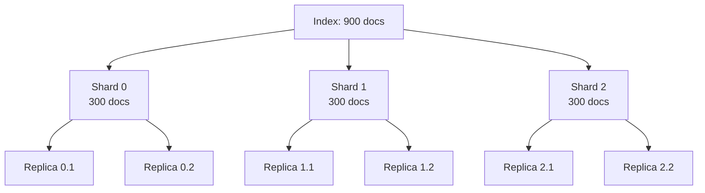

**Primary Shard:**
- Містить унікальну частину даних
- Кількість фіксується при створенні
- Приймає операції запису

**Replica Shard:**
- Копія primary shard
- Забезпечує відмовостійкість
- Розподіляє навантаження читання

---

## Життєвий цикл запиту

### 🔄 **Етапи обробки:**

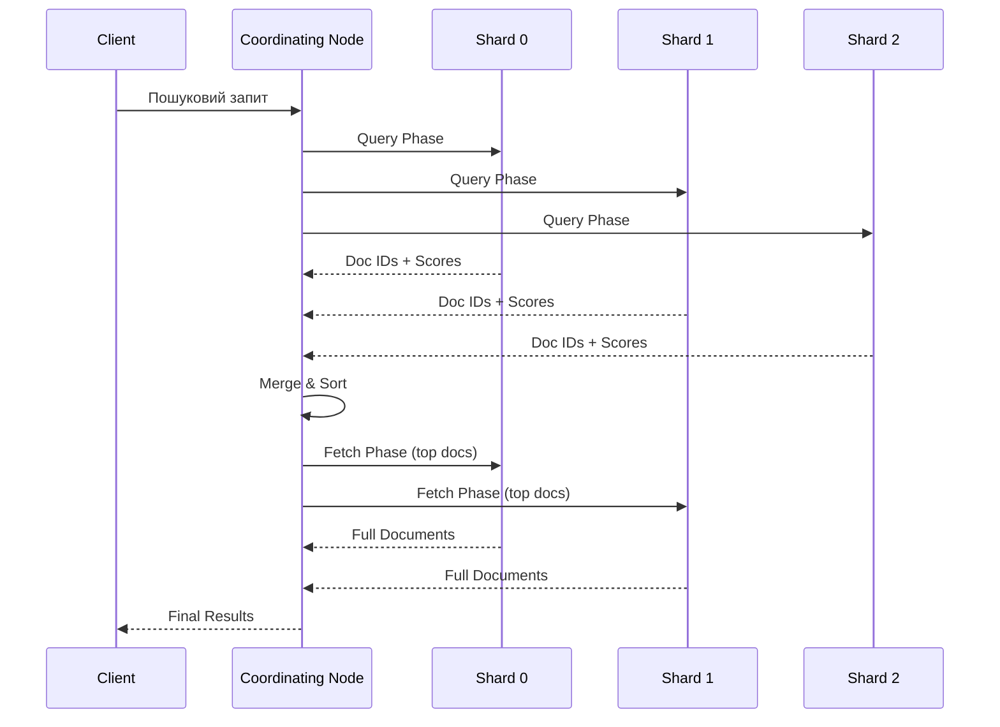

---

## **3. Інвертовані індекси**

## Структура індексу

### 🏗️ **Компоненти:**

```javascript
// Інвертований індекс складається з:

// 1. Term Dictionary (Словник термінів)
const termDictionary = {
    "elasticsearch": {
        "doc_freq": 3,  // У скількох документах
        "postings_ptr": 0x1234  // Покажчик на список
    },
    "пошук": {
        "doc_freq": 5,
        "postings_ptr": 0x5678
    }
}

// 2. Posting Lists (Списки постінгів)
const postingLists = {
    "elasticsearch": [
        {
            "doc_id": 1,
            "term_freq": 3,      // Частота в документі
            "positions": [5, 23, 47],  // Позиції в тексті
            "field": "content"
        },
        {
            "doc_id": 5,
            "term_freq": 1,
            "positions": [12],
            "field": "title"
        }
    ]
}

// 3. Field Data (Метадані полів)
// 4. Doc Values (Для сортування та агрегацій)
```

---

## Компресія індексів

### 💾 **Оптимізація зберігання:**

```javascript
// Без компресії: зберігаємо абсолютні ID
const uncompressed = [5, 23, 47, 103, 205, 312, 501]
// Розмір: 7 × 4 байти = 28 байтів

// Delta encoding: зберігаємо різниці
const deltaEncoded = [5, 18, 24, 56, 102, 107, 189]
// Малі числа → менше байтів при кодуванні

// Variable Byte Encoding
const compressed = [
    0x05,        // 5    → 1 байт
    0x12,        // 18   → 1 байт
    0x18,        // 24   → 1 байт
    0x38,        // 56   → 1 байт
    0x66,        // 102  → 1 байт
    0x6B,        // 107  → 1 байт
    0x81, 0x3D   // 189  → 2 байти
]
// Розмір: 8 байтів (у 3.5 рази менше!)
```

**Додаткові оптимізації:**
- Prefix compression для словника
- Block compression для списків
- Roaring bitmaps для великих списків

---

## Сегментна архітектура

### 📂 **Lucene segments:**

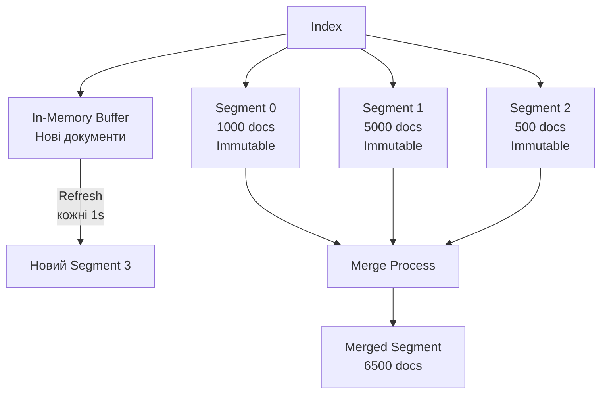

**Переваги:**
- ✅ Швидка індексація
- ✅ Паралельний пошук
- ✅ Легке видалення

**Процеси:**
- **Refresh** - нові дані стають видимими (1s)
- **Flush** - запис на диск (30s)
- **Merge** - об'єднання сегментів

---

## Індексування документа

### ✏️ **Процес додавання:**

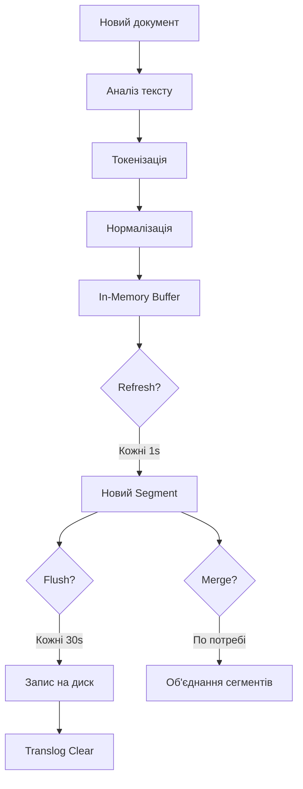

---

## **4. Аналіз тексту**

## Analyzer Pipeline

### 🔤 **Етапи обробки:**

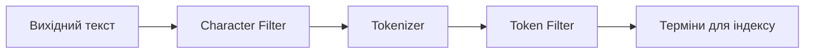

**Character Filter:**
- HTML strip (`<b>text</b>` → `text`)
- Mapping (`& → and`)
- Pattern replace

**Tokenizer:**
- Standard (розбиття по пробілах/розділових знаках)
- Whitespace (тільки пробіли)
- Pattern (за регулярним виразом)

**Token Filter:**
- Lowercase
- Stop words
- Synonyms
- Stemming

---

## Приклад аналізу

### 📝 **Обробка тексту:**

```javascript
// Вихідний текст
const originalText = "Elasticsearch - це ПОТУЖНА пошукова система!"

// Character Filter: HTML strip
// (у цьому прикладі не змінює)
const afterCharFilter = "Elasticsearch - це ПОТУЖНА пошукова система!"

// Tokenizer: standard
const afterTokenizer = [
    "Elasticsearch",
    "це",
    "ПОТУЖНА",
    "пошукова",
    "система"
]

// Token Filter 1: lowercase
const afterLowercase = [
    "elasticsearch",
    "це",
    "потужна",
    "пошукова",
    "система"
]

// Token Filter 2: stop words (українські)
const afterStopWords = [
    "elasticsearch",
    "потужна",
    "пошукова",
    "система"
]

// Фінальні терміни для індексування
const finalTerms = [
    "elasticsearch",
    "потужна",
    "пошукова",
    "система"
]
```

---

## Створення аналізатора

### ⚙️ **Кастомний український аналізатор:**

```javascript
PUT /my_index
{
    "settings": {
        "analysis": {
            "char_filter": {
                "quotes_filter": {
                    "type": "mapping",
                    "mappings": [
                        "« => \"",
                        "» => \""
                    ]
                }
            },
            "tokenizer": {
                "ukrainian_tokenizer": {
                    "type": "standard"
                }
            },
            "filter": {
                "ukrainian_stop": {
                    "type": "stop",
                    "stopwords": ["і", "в", "на", "з", "до", "для", "це", "є"]
                },
                "ukrainian_stemmer": {
                    "type": "stemmer",
                    "language": "russian"  // Approximation для української
                }
            },
            "analyzer": {
                "ukrainian_analyzer": {
                    "char_filter": ["quotes_filter"],
                    "tokenizer": "ukrainian_tokenizer",
                    "filter": [
                        "lowercase",
                        "ukrainian_stop",
                        "ukrainian_stemmer"
                    ]
                }
            }
        }
    }
}
```

---

## Тестування аналізатора

### 🧪 **Analyze API:**

```javascript
POST /my_index/_analyze
{
    "analyzer": "ukrainian_analyzer",
    "text": "Бази даних зберігають важливу інформацію"
}

// Результат:
{
    "tokens": [
        {
            "token": "баз",
            "start_offset": 0,
            "end_offset": 4,
            "type": "<ALPHANUM>",
            "position": 0
        },
        {
            "token": "дан",
            "start_offset": 5,
            "end_offset": 10,
            "type": "<ALPHANUM>",
            "position": 1
        },
        {
            "token": "зберіга",
            "start_offset": 11,
            "end_offset": 21,
            "type": "<ALPHANUM>",
            "position": 2
        },
        {
            "token": "важлив",
            "start_offset": 22,
            "end_offset": 29,
            "type": "<ALPHANUM>",
            "position": 3
        },
        {
            "token": "інформац",
            "start_offset": 30,
            "end_offset": 40,
            "type": "<ALPHANUM>",
            "position": 4
        }
    ]
}
```

---

## **5. Пошукові запити**

## Типи запитів

### 🔍 **Query Types:**

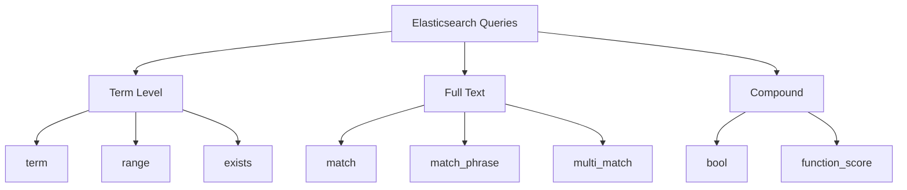

**Term Level:** Точний пошук (keyword fields)
**Full Text:** Пошук з аналізом (text fields)
**Compound:** Комбінації запитів

---

## Match Query

### 📝 **Базовий повнотекстовий пошук:**

```javascript
// Простий match
GET /blog_posts/_search
{
    "query": {
        "match": {
            "content": "elasticsearch пошук"
        }
    }
}

// Match з операторами
GET /blog_posts/_search
{
    "query": {
        "match": {
            "content": {
                "query": "elasticsearch пошук",
                "operator": "and",  // ЗА ЗАМОВЧУВАННЯМ "or"
                "fuzziness": "AUTO"  // Нечіткий пошук
            }
        }
    }
}

// Match Phrase - точна фраза
GET /blog_posts/_search
{
    "query": {
        "match_phrase": {
            "content": "повнотекстовий пошук"
        }
    }
}
```

---

## Multi-Match Query

### 🎯 **Пошук у кількох полях:**

```javascript
GET /blog_posts/_search
{
    "query": {
        "multi_match": {
            "query": "elasticsearch",
            "fields": [
                "title^3",    // Вага 3 (найважливіше)
                "content^2",  // Вага 2
                "tags"        // Вага 1 (за замовчуванням)
            ],
            "type": "best_fields"  // або "most_fields", "cross_fields"
        }
    }
}
```

**Типи multi_match:**
- `best_fields` - найкраще поле
- `most_fields` - більшість полів
- `cross_fields` - терміни в різних полях
- `phrase` - фраза у полях
- `phrase_prefix` - автодоповнення

---

## Bool Query

### 🔗 **Комбінування умов:**

```javascript
GET /blog_posts/_search
{
    "query": {
        "bool": {
            // MUST - обов'язкові (AND)
            "must": [
                { "match": { "content": "elasticsearch" } }
            ],

            // SHOULD - бажані (OR, впливають на score)
            "should": [
                { "match": { "tags": "tutorial" } },
                { "match": { "tags": "beginner" } }
            ],

            // MUST_NOT - виключення (NOT)
            "must_not": [
                { "match": { "status": "draft" } }
            ],

            // FILTER - обов'язкові без впливу на score
            "filter": [
                { "range": { "published_date": { "gte": "2024-01-01" } } },
                { "term": { "author": "ivan_petrov" } }
            ],

            "minimum_should_match": 1
        }
    }
}
```

---

## Range Query

### 📊 **Діапазони значень:**

```javascript
// Числовий діапазон
GET /products/_search
{
    "query": {
        "range": {
            "price": {
                "gte": 1000,    // >=
                "lte": 5000     // <=
            }
        }
    }
}

// Діапазон дат
GET /blog_posts/_search
{
    "query": {
        "range": {
            "published_date": {
                "gte": "2024-01-01",
                "lt": "2024-12-31",
                "format": "yyyy-MM-dd"
            }
        }
    }
}

// Відносні дати
GET /logs/_search
{
    "query": {
        "range": {
            "timestamp": {
                "gte": "now-7d",  // Останні 7 днів
                "lt": "now"
            }
        }
    }
}
```

---

## Нечіткий пошук

### 🔤 **Fuzzy Search - помилки в запиті:**

```javascript
// Автоматична fuzziness
GET /blog_posts/_search
{
    "query": {
        "match": {
            "title": {
                "query": "elesticsearch",  // Помилка в слові
                "fuzziness": "AUTO"         // Знайде "elasticsearch"
            }
        }
    }
}

// Ручне налаштування
GET /blog_posts/_search
{
    "query": {
        "fuzzy": {
            "title": {
                "value": "elesticsearch",
                "fuzziness": 2,              // Максимум 2 редагування
                "prefix_length": 3,          // Перші 3 символи точні
                "max_expansions": 50         // Максимум варіантів
            }
        }
    }
}
```

**Levenshtein Distance:**
- 0 = точне співпадіння
- 1 = 1 редагування (додавання/видалення/заміна/транспозиція)
- 2 = 2 редагування
- AUTO = 0 для 1-2 символів, 1 для 3-5, 2 для >5

---

## Ранжування результатів

### 📊 **TF-IDF та BM25:**

```javascript
// Elasticsearch використовує BM25 за замовчуванням
{
    "_score": 4.52,  // Оцінка релевантності
    "_source": {
        "title": "Вступ до Elasticsearch"
    }
}

// Фактори, що впливають на score:
// 1. Term Frequency (TF) - частота терміну в документі
// 2. Inverse Document Frequency (IDF) - рідкість терміну
// 3. Field Length - довжина поля
// 4. Boost - вага поля

// Пояснення score
GET /blog_posts/_search
{
    "explain": true,
    "query": {
        "match": { "content": "elasticsearch" }
    }
}
```

---

## Custom Scoring

### ⚖️ **Власні правила ранжування:**

```javascript
GET /blog_posts/_search
{
    "query": {
        "function_score": {
            "query": {
                "match": { "content": "elasticsearch" }
            },
            "functions": [
                // Boost за популярністю
                {
                    "field_value_factor": {
                        "field": "views_count",
                        "factor": 0.1,
                        "modifier": "log1p"
                    }
                },
                // Boost за свіжістю
                {
                    "gauss": {
                        "published_date": {
                            "origin": "now",
                            "scale": "30d",
                            "decay": 0.5
                        }
                    }
                }
            ],
            "score_mode": "sum",      // Як комбінувати функції
            "boost_mode": "multiply"  // Як поєднати з query score
        }
    }
}
```

---

## **6. Агрегації та аналітика**

## Типи агрегацій

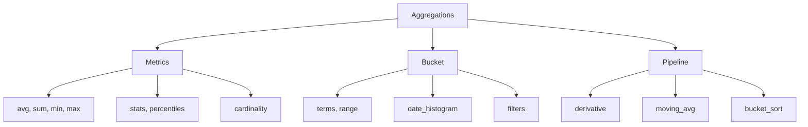

**Metrics:** Обчислення метрик
**Bucket:** Групування документів
**Pipeline:** Агрегації над агрегаціями

---

## Metric Aggregations

### 📊 **Статистичні метрики:**

```javascript
GET /blog_posts/_search
{
    "size": 0,  // Не повертаємо документи
    "aggs": {
        // Базова статистика
        "views_stats": {
            "stats": {
                "field": "views_count"
            }
        },

        // Розширена статистика
        "views_extended": {
            "extended_stats": {
                "field": "views_count"
            }
        },

        // Персентилі
        "views_percentiles": {
            "percentiles": {
                "field": "views_count",
                "percents": [25, 50, 75, 95, 99]
            }
        },

        // Унікальні значення
        "unique_authors": {
            "cardinality": {
                "field": "author"
            }
        }
    }
}
```

---

## Bucket Aggregations

### 📦 **Групування даних:**

```javascript
GET /blog_posts/_search
{
    "size": 0,
    "aggs": {
        // Групування за категоріями
        "posts_by_category": {
            "terms": {
                "field": "category",
                "size": 10
            }
        },

        // Діапазони
        "views_ranges": {
            "range": {
                "field": "views_count",
                "ranges": [
                    { "key": "low", "to": 100 },
                    { "key": "medium", "from": 100, "to": 1000 },
                    { "key": "high", "from": 1000 }
                ]
            }
        },

        // Гістограма по датах
        "posts_over_time": {
            "date_histogram": {
                "field": "published_date",
                "calendar_interval": "month"
            }
        }
    }
}
```

---

## Вкладені агрегації

### 🎭 **Багаторівневий аналіз:**

```javascript
GET /blog_posts/_search
{
    "size": 0,
    "aggs": {
        "categories": {
            "terms": {
                "field": "category",
                "size": 5
            },
            "aggs": {
                // Вкладена агрегація: автори в кожній категорії
                "top_authors": {
                    "terms": {
                        "field": "author",
                        "size": 3
                    },
                    "aggs": {
                        // Ще глибша вкладеність: статистика автора
                        "avg_views": {
                            "avg": { "field": "views_count" }
                        },
                        "total_posts": {
                            "value_count": { "field": "_id" }
                        }
                    }
                },
                // Середня кількість переглядів у категорії
                "avg_category_views": {
                    "avg": { "field": "views_count" }
                }
            }
        }
    }
}
```

---

## Результат вкладених агрегацій

### 📈 **Ієрархічна структура:**

```javascript
{
    "aggregations": {
        "categories": {
            "buckets": [
                {
                    "key": "Technology",
                    "doc_count": 450,
                    "avg_category_views": { "value": 678.5 },
                    "top_authors": {
                        "buckets": [
                            {
                                "key": "ivan_petrov",
                                "doc_count": 87,
                                "avg_views": { "value": 1234.5 },
                                "total_posts": { "value": 87 }
                            },
                            {
                                "key": "maria_koval",
                                "doc_count": 65,
                                "avg_views": { "value": 890.2 },
                                "total_posts": { "value": 65 }
                            }
                        ]
                    }
                }
            ]
        }
    }
}
```

---

## Pipeline Aggregations

### 🔄 **Агрегації над результатами:**

```javascript
GET /blog_posts/_search
{
    "size": 0,
    "aggs": {
        // Базова агрегація по місяцях
        "posts_per_month": {
            "date_histogram": {
                "field": "published_date",
                "calendar_interval": "month"
            },
            "aggs": {
                "monthly_views": {
                    "sum": { "field": "views_count" }
                }
            }
        },

        // Pipeline: Moving Average
        "views_moving_avg": {
            "moving_avg": {
                "buckets_path": "posts_per_month>monthly_views",
                "window": 3,
                "model": "simple"
            }
        },

        // Pipeline: Derivative (зміна)
        "views_change": {
            "derivative": {
                "buckets_path": "posts_per_month>monthly_views"
            }
        },

        // Pipeline: Cumulative Sum
        "cumulative_views": {
            "cumulative_sum": {
                "buckets_path": "posts_per_month>monthly_views"
            }
        }
    }
}
```

---

## Візуалізація з Kibana

### 📊 **Dashboard приклад:**

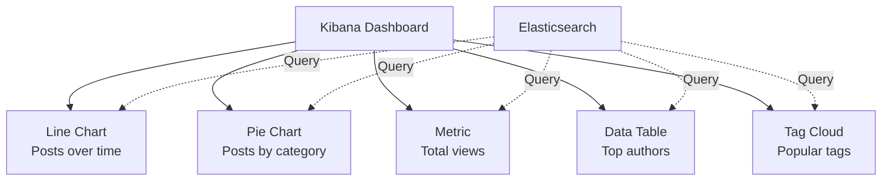

**Типові візуалізації:**
- 📈 Line/Area charts - тренди
- 🥧 Pie/Donut - розподіл
- 📊 Bar/Column - порівняння
- 🗺️ Maps - геодані
- 📝 Tables - детальні дані

---

## Інтеграція з іншими системами

### 🔗 **Архітектурні паттерни:**

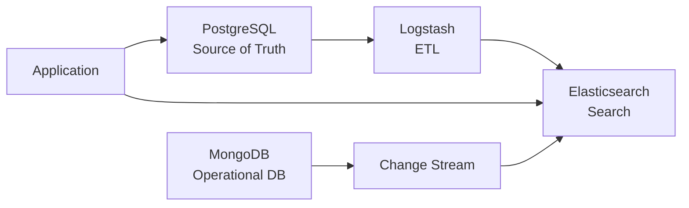

**Паттерн 1: SQL + Elasticsearch**
- PostgreSQL - транзакційні дані
- Logstash - синхронізація
- Elasticsearch - пошук

**Паттерн 2: MongoDB + Elasticsearch**
- MongoDB - основне сховище
- Change Streams - реального часу
- Elasticsearch - повнотекстовий пошук

---

## Bulk операції

### ⚡ **Масова індексація:**

```javascript
// Bulk API для ефективності
POST /_bulk
{ "index": { "_index": "blog_posts", "_id": "1" } }
{ "title": "Post 1", "content": "...", "author": "ivan" }
{ "index": { "_index": "blog_posts", "_id": "2" } }
{ "title": "Post 2", "content": "...", "author": "maria" }
{ "update": { "_index": "blog_posts", "_id": "3" } }
{ "doc": { "views_count": 100 } }
{ "delete": { "_index": "blog_posts", "_id": "4" } }

// Node.js bulk helper
const { helpers } = require('@elastic/elasticsearch')

await helpers.bulk({
    datasource: dataIterator,
    onDocument(doc) {
        return { index: { _index: 'blog_posts' } }
    },
    flushBytes: 5000000,  // 5MB
    concurrency: 5
})
```

---

## Продуктивність та оптимізація

### ⚡ **Best Practices:**

**Індексування:**
- ✅ Bulk операції (1000-5000 docs/batch)
- ✅ Disable refresh при масовій індексації
- ✅ Збільшити refresh_interval
- ❌ Уникати індексування в пікові години

**Пошук:**
- ✅ Використовувати filter замість query де можливо
- ✅ Кешувати часті запити
- ✅ Обмежувати кількість шардів (< 20 на GB heap)
- ❌ Уникати deep pagination

**Архітектура:**
- ✅ Розмір шарда 10-50 GB
- ✅ Heap memory = 50% RAM (max 31GB)
- ✅ SSD диски
- ✅ Достатньо реплік для відмовостійкості

---

## Моніторинг кластера

### 📊 **Ключові метрики:**

```javascript
// Здоров'я кластера
GET /_cluster/health

{
    "cluster_name": "production",
    "status": "green",  // green, yellow, red
    "number_of_nodes": 9,
    "active_primary_shards": 15,
    "active_shards": 45,
    "unassigned_shards": 0
}

// Статистика індексів
GET /_cat/indices?v

// index      health status pri rep docs.count store.size
// blog_posts green  open     3   2    1000000      5.2gb

// Статистика вузлів
GET /_cat/nodes?v

// ip           heap.percent ram.percent cpu load_1m
// 192.168.1.1  45          78          12  2.1
```

---

## Порівняння: SQL vs Elasticsearch

| Аспект | SQL DB | Elasticsearch |
|--------|--------|---------------|
| **Пошук** | LIKE (повільно) | Inverted index (швидко) |
| **Морфологія** | Немає | Так (analyzers) |
| **Релевантність** | Немає | Scoring (BM25) |
| **Масштабування** | Вертикальне | Горизонтальне |
| **Транзакції** | ACID | Eventual consistency |
| **Агрегації** | GROUP BY | Aggregations API |
| **Схема** | Жорстка | Гнучка (dynamic mapping) |
| **Use Case** | Транзакції | Пошук + Аналітика |

---

## Коли використовувати Elasticsearch?

### ✅ **Ідеально підходить:**

- 🔍 **Повнотекстовий пошук**
  - Каталоги продуктів
  - Системи документів
  - Новинні сайти

- 📊 **Аналітика логів**
  - ELK Stack (Elasticsearch, Logstash, Kibana)
  - Моніторинг додатків
  - Безпека (SIEM)

- 📈 **Real-time аналітика**
  - Дашборди
  - Метрики бізнесу
  - IoT дані

---

## Коли НЕ використовувати?

### ❌ **Менш підходить:**

**Не використовуйте як:**
- 💾 Основне сховище даних (не СУБД)
- 💰 Транзакційну систему (eventual consistency)
- 🔐 Єдине джерело істини

**Альтернативи:**
- Транзакції → PostgreSQL, MySQL
- Документи → MongoDB
- Key-Value → Redis
- Графи → Neo4j

**Ідеальна архітектура:**
> SQL/NoSQL (джерело істини) + Elasticsearch (пошук)

---

## ELK Stack

### 📚 **Екосистема Elastic:**

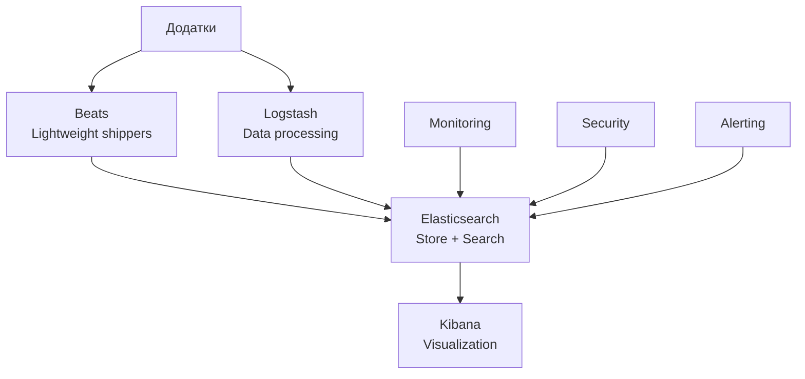

**Beats:** Легкі агенти збору даних
- Filebeat - логи
- Metricbeat - метрики
- Packetbeat - мережа
- Heartbeat - uptime

**Logstash:** ETL pipeline
**Elasticsearch:** Зберігання + пошук
**Kibana:** Візуалізація + управління

---

## Висновки

### 🎯 **Ключові переваги Elasticsearch:**

**Продуктивність:**
- ⚡ Миттєвий пошук у мільярдах документів
- 📊 Реального часу аналітика
- 🔄 Горизонтальне масштабування

**Можливості:**
- 🔤 Повнотекстовий пошук з морфологією
- 📈 Багаті агрегації
- 🌍 Підтримка багатьох мов
- 📍 Геопросторовий пошук

**Архітектура:**
- 🔄 Розподілена система
- 💾 Висока доступність
- 🛡️ Відмовостійкість
- 📊 RESTful API
