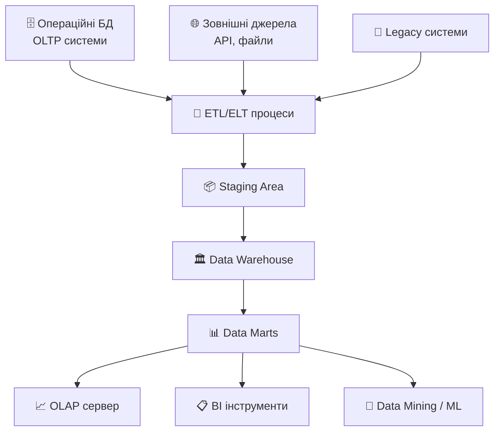
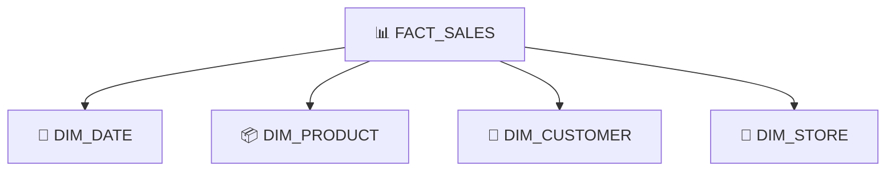
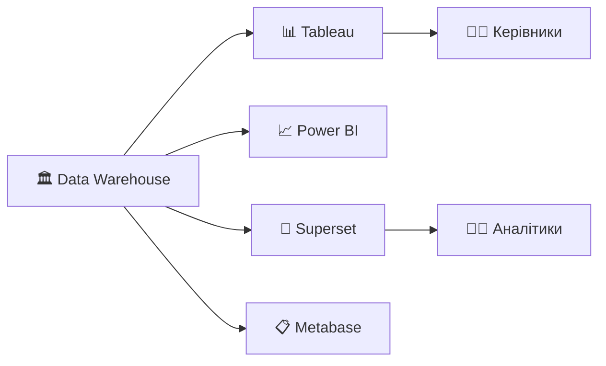
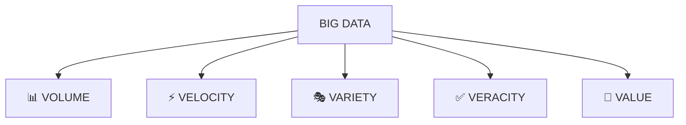
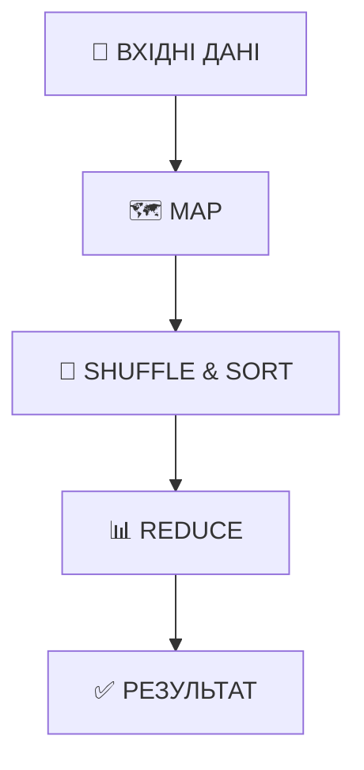
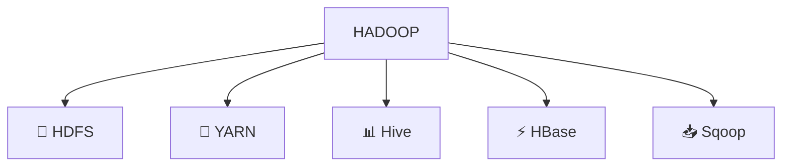
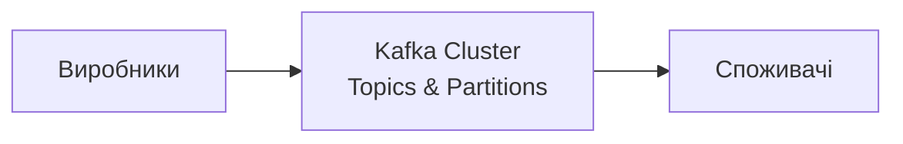
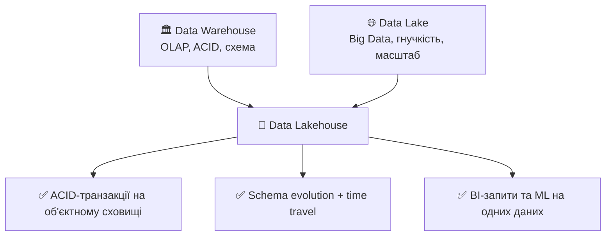

# Лекція 14. Аналітичні СУБД та обробка великих даних

## План лекції

1. OLTP vs OLAP: фундаментальні відмінності
2. Архітектура сховищ даних та ETL/ELT
3. OLAP операції та багатовимірний аналіз
4. Колонкові СУБД для аналітики
5. Big Data: характеристики та розподілені обчислення
6. Hadoop екосистема та NoSQL для Big Data
7. Потокова обробка даних
8. Data Lakehouse — конвергенція сховищ і озер даних

## **📊 Чому OLAP і Big Data — одна лекція**

**Дві традиції аналітики даних, що зійшлися в одній точці:**

- 🏛️ **DSS/OLAP** — структуровані сховища, зоряні схеми, суворий ETL
- 🌐 **Big Data** — неструктуровані потоки, розподілені кластери, схема "на читання"

**Сьогодні:** Snowflake, BigQuery, Databricks одночасно є і сховищем даних, і платформою Big Data

**Спільний знаменник:** Data Lakehouse — тема, якою завершується лекція

---

# Частина I. Системи підтримки прийняття рішень та OLAP

## **📊 Основні концепції**

**DSS (Decision Support System)** — інформаційна система для підтримки управлінських рішень.

**OLAP (Online Analytical Processing)** — технологія інтерактивного багатовимірного аналізу.

**Data Warehouse** — предметно-орієнтована, інтегрована, історична колекція даних для аналітики.

**Куб даних** — багатовимірне представлення, де виміри — характеристики, а комірки — метрики.

## **1. OLTP vs OLAP**

### 🔄 **Два типи робочих навантажень**

| Характеристика | OLTP | OLAP |
|---|---|---|
| **Призначення** | Операційна діяльність | Аналіз та рішення |
| **Джерело даних** | Поточні дані | Історичні дані |
| **Тип операцій** | INSERT, UPDATE, DELETE | SELECT з агрегацією |
| **Час відгуку** | Мілісекунди | Секунди/хвилини |
| **Нормалізація** | Висока (3НФ+) | Денормалізована |
| **Розмір БД** | Гігабайти | Терабайти–петабайти |
| **Користувачі** | Співробітники | Аналітики, менеджери |

**Чому розділення неминуче:** конкуренція за ресурси, неоптимальна структура для звітів, обмежена історія в OLTP

## **2. Архітектура сховищ даних**


```mermaid
graph TB
    A[🗄️ Операційні БД<br/>OLTP системи] --> B[🔄 ETL/ELT процеси]
    C[🌐 Зовнішні джерела<br/>API, файли] --> B
    D[💾 Legacy системи] --> B

    B --> E[📦 Staging Area]
    E --> F[🏛️ Data Warehouse]

    F --> G[📊 Data Marts]

    G --> H[📈 OLAP сервер]
    G --> I[📋 BI інструменти]
    G --> J[🔬 Data Mining / ML]
```

**Компоненти:** джерела → staging → сховище → вітрини (data marts) → OLAP/BI

## **ETL vs ELT**

### 🔧 **Класичний ETL**

**Extract → Transform → Load** — трансформація до завантаження, окремий ETL-сервер

### ⚡ **Сучасний ELT**

**Extract → Load → Transform** — трансформація всередині хмарного сховища (Snowflake, BigQuery), обчислювальна потужність DWH використовується напряму

> **Актуалізація:** **dbt (data build tool)** — стандарт де-факто для ELT-трансформацій: SQL-моделі, версіонування, тести якості даних, автоматична документація

## **Багатовимірне моделювання: зоряна схема**


```mermaid
graph TB
    A[📊 FACT_SALES] --> B[📅 DIM_DATE]
    A --> C[📦 DIM_PRODUCT]
    A --> D[👤 DIM_CUSTOMER]
    A --> E[🏪 DIM_STORE]
```

**Факти:** вимірювані показники (продажі, кількість)
**Виміри:** описові атрибути (що, коли, де, хто)

**Snowflake schema:** нормалізовані виміри — компроміс "розмір ↔ швидкість"

> **Актуалізація:** **SCD Type 2** (Slowly Changing Dimensions) — стандартний прийом зберігання історії змін вимірів (`valid_from`/`valid_to`, версійні ключі)

## **3. OLAP операції**

### 🔍 **П'ять ключових операцій над кубом**

1. **Drill-Down** 🔽 — деталізація (Рік → Квартал → Місяць)
2. **Roll-Up** 🔼 — узагальнення (Магазин → Регіон)
3. **Slice** ✂️ — зріз (фіксація одного виміру)
4. **Dice** 🎲 — підкуб (умови по кількох вимірах)
5. **Pivot** 🔄 — поворот осей таблиці

**Приклад Slice:**
```sql
SELECT product_category, region_name, SUM(total_amount)
FROM fact_sales
JOIN dim_date ON fact_sales.date_key = dim_date.date_key
WHERE dim_date.year = 2024 AND dim_date.month = 1
GROUP BY product_category, region_name;
```

## **Типи OLAP архітектур**

| Тип | Зберігання | Швидкість | Обсяг |
|---|---|---|---|
| **MOLAP** | Багатовимірні масиви | Найшвидший | Обмежений |
| **ROLAP** | Реляційна БД | Повільніший | Необмежений |
| **HOLAP** | Гібрид (агрегати MOLAP + деталі ROLAP) | Компроміс | Компроміс |

## **4. Колонкові СУБД**

### 📦 **Рядкове vs колонкове зберігання**

**Рядкове:** всі поля запису разом → OLTP
**Колонкове:** всі значення стовпця разом → OLAP

**Переваги колонкового зберігання:**
- 📊 Читання лише потрібних стовпців
- 🗜️ Стиснення 10x–100x (однорідні значення)
- ⚡ Векторизація (SIMD-інструкції)
- 📈 Швидка агрегація (`SUM`, `AVG` по мільярдах рядків)

**Провідні системи:** ClickHouse, Amazon Redshift, Google BigQuery, Apache Druid

> **Актуалізація:** **Snowflake** — хмарна колонкова платформа з розділенням compute/storage, окремі "warehouses" масштабуються незалежно — фактичний стандарт enterprise-аналітики 2025–2026

## **5. BI-інструменти**


```mermaid
graph LR
    A[🏛️ Data Warehouse] --> B[📊 Tableau]
    A --> C[📈 Power BI]
    A --> D[🔧 Superset]
    A --> E[📋 Metabase]

    B --> F[👨‍💼 Керівники]
    D --> G[👨‍💻 Аналітики]
```

| Інструмент | Тип | Найкраще для |
|---|---|---|
| **Tableau** | Комерційний | Візуалізація, презентації |
| **Power BI** | Комерційний (MS-стек) | DAX, Excel-інтеграція |
| **Superset** | Open source | Технічні команди, SQL Lab |
| **Metabase** | Open source | Простота, малий бізнес |

---

# Частина II. Обробка великих обсягів даних (Big Data)

## **🌐 Big Data у цифрах (щодня у світі)**

- 📧 333 млрд електронних листів
- 🎥 720 000 годин відео на YouTube
- 💳 5 млрд пошукових запитів Google
- 🏭 1 ексабайт даних IoT-сенсорів

**Проблема:** традиційні СУБД не справляються з такими обсягами

## **1. Модель 5V**


```mermaid
graph TD
    A[BIG DATA] --> B[📊 VOLUME]
    A --> C[⚡ VELOCITY]
    A --> D[🎭 VARIETY]
    A --> E[✅ VERACITY]
    A --> F[💎 VALUE]
```

- **Volume** — терабайти → ексабайти
- **Velocity** — реальний час, мілісекунди
- **Variety** — структуровані/напівструктуровані/неструктуровані (80–90% — неструктуровані)
- **Veracity** — достовірність і якість джерел
- **Value** — цінність інсайту, а не лише обсяг

## **2. MapReduce**


```mermaid
graph TB
    A[📄 ВХІДНІ ДАНІ] --> B[🗺️ MAP]
    B --> C[🔀 SHUFFLE & SORT]
    C --> D[📊 REDUCE]
    D --> E[✅ РЕЗУЛЬТАТ]
```

**Ідея:** розбити задачу на незалежні паралельні частини

**Word Count:** Map → `(databases,1),(databases,1)…` → Shuffle → `databases:[1,1]` → Reduce → `(databases,2)`

## **Apache Spark**

### ⚡ **10–100x швидше за MapReduce**

- 📊 In-memory обробка між операціями
- 🔧 Єдина платформа: batch, streaming, SQL, ML (MLlib), графи (GraphX)
- 💻 API: Python, Scala, Java, R, SQL

| | MapReduce | Spark |
|---|---|---|
| Швидкість | Базова | 10–100x швидше |
| Обробка в пам'яті | ❌ | ✅ |
| Універсальність | Тільки batch | Batch + Streaming |

> **Актуалізація:** **Spark 4.0** — Spark Connect (тонкі клієнти, від'єднані від драйвера), ANSI SQL за замовчуванням, покращена підтримка Python (PySpark) для ML/AI-пайплайнів

## **3. Hadoop екосистема**


```mermaid
graph TB
    A[HADOOP] --> B[💾 HDFS]
    A --> C[🔄 YARN]
    A --> D[📊 Hive]
    A --> E[⚡ HBase]
    A --> F[📥 Sqoop]
```

**HDFS:** NameNode (метадані) + DataNode (блоки 128–256 MB, реплікація ×3)
**YARN:** ResourceManager + NodeManager — кілька фреймворків (Spark, Flink) на одному кластері

> **Актуалізація:** класичний on-prem Hadoop-кластер здає позиції: більшість нових проєктів використовують хмарне об'єктне сховище (S3/GCS/ADLS) + Spark/Kubernetes замість HDFS/YARN. Hive та Sqoop лишаються нішевими legacy-інструментами

## **4. NoSQL для Big Data**

### 🌐 **Cassandra (wide-column, peer-to-peer)**

```sql
CREATE TABLE sensor_data (
    sensor_id text,
    timestamp timestamp,
    temperature decimal,
    PRIMARY KEY (sensor_id, timestamp)
) WITH CLUSTERING ORDER BY (timestamp DESC);
```

**Query-driven design**, настроювана консистентність (ONE/QUORUM/ALL)

### ⚡ **HBase (HDFS-based NoSQL)**

HMaster + RegionServer, координація через ZooKeeper — випадковий доступ до великих таблиць

## **5. Потокова обробка**


```mermaid
graph LR
    A[Виробники] --> B[Kafka Cluster<br/>Topics & Partitions]
    B --> C[Споживачі]
```

**Гарантії доставки:** at-most-once / at-least-once / exactly-once

| Система | Особливість |
|---|---|
| **Kafka Streams** | Легка бібліотека для трансформацій |
| **Storm** | Історичний лідер low-latency; нині legacy |
| **Spark Streaming** | Мікробатчі |
| **Flink** | Справжній streaming, exactly-once, лідер напряму |

> **Актуалізація:** **Kafka 4.0** — KRaft-режим повністю замінює ZooKeeper (спрощена архітектура, вищий масштаб метаданих)

---

# Частина III. Data Lakehouse — конвергенція

## **🔗 Дві традиції зустрічаються**


```mermaid
graph TB
    A[🏛️ Data Warehouse<br/>OLAP, ACID, схема] --> C[🌊 Data Lakehouse]
    B[🌐 Data Lake<br/>Big Data, гнучкість, масштаб] --> C
    C --> D[✅ ACID-транзакції на об'єктному сховищі]
    C --> E[✅ Schema evolution + time travel]
    C --> F[✅ BI-запити та ML на одних даних]
```

**Проблема Data Lake без Lakehouse:** "data swamp" — дані є, але без транзакцій, схеми й якості

**Рішення:** табличні формати з ACID-гарантіями поверх дешевого об'єктного сховища (S3/ADLS/GCS)

## **Провідні формати Lakehouse**

| Формат | Розробник | Особливість |
|---|---|---|
| **Delta Lake** | Databricks | Time travel, ACID, тісна інтеграція зі Spark |
| **Apache Iceberg** | Netflix → Apache | Schema/partition evolution без переписування даних |
| **Apache Hudi** | Uber → Apache | Оптимізований під інкрементальні upsert-и |

```sql
-- Iceberg: time travel
SELECT * FROM sales FOR VERSION AS OF 1234567890;

-- Iceberg: еволюція схеми без переписування таблиці
ALTER TABLE sales ADD COLUMN discount DECIMAL(5,2);
```

**Підсумок:** Lakehouse знімає штучний поділ між "сховищем для BI" і "озером для Big Data/ML" — один шар даних для обох задач

---

## **Висновки**

**1. Розділення навантажень:** OLTP для операцій, OLAP для аналізу — конфлікт не розв'язати в одній БД

**2. Архітектура сховищ:** ETL/ELT, зоряна схема, багатовимірні куби

**3. Колонкове зберігання:** 10x–100x прискорення аналітичних запитів

**4. Big Data = 5V:** Volume, Velocity, Variety, Veracity, Value

**5. Розподілені обчислення:** MapReduce → Spark, Hadoop → хмарне сховище + Spark/K8s

**6. Потокова обробка:** Kafka (KRaft) + Flink — реал-тайм аналітика

**7. Data Lakehouse:** Delta Lake / Iceberg / Hudi — конвергенція сховища й озера даних в один шар
