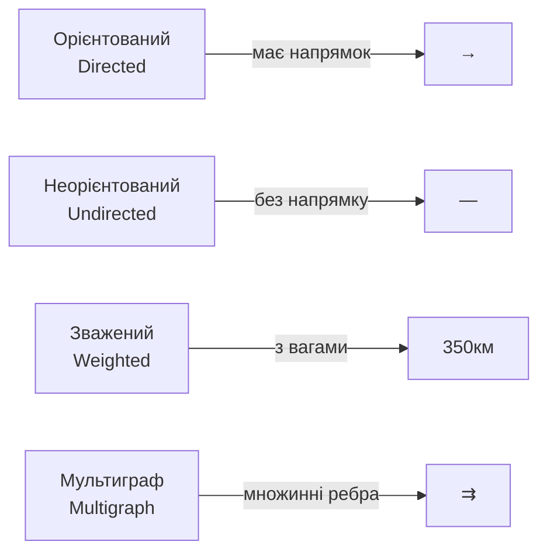
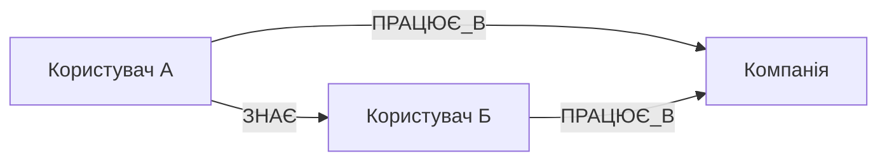
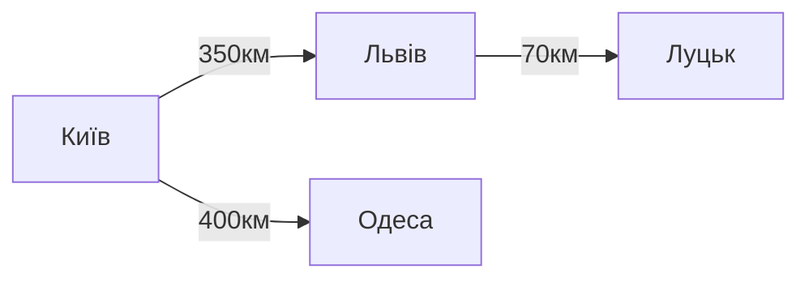
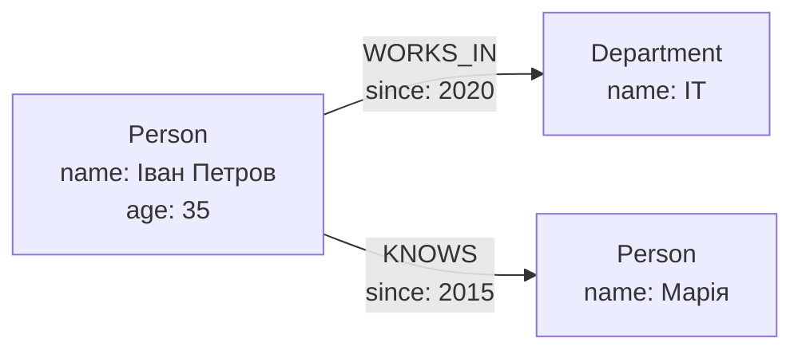
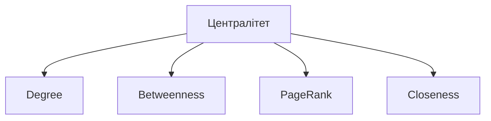
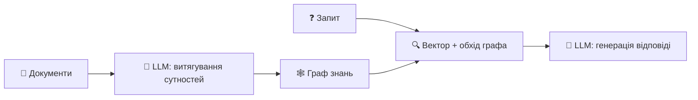

# Лекція 15. Графові бази даних та мережевий аналіз

## План лекції

1. Основи теорії графів
2. Графові моделі даних
3. Neo4j архітектура
4. Мова Cypher
5. Алгоритми на графах
6. Практичні застосування
7. GraphRAG: графи знань для LLM

## **📚 Основні поняття:**

**Граф** — абстрактна структура даних, що складається з вершин (вузлів) та ребер (зв'язків) між ними.

**Графова база даних** — система управління базами даних, оптимізована для зберігання та обробки графових структур даних.

**Мережевий аналіз** — набір методів та алгоритмів для дослідження структури та властивостей мережевих даних.

**Патерн-орієнтований запит** — декларативний спосіб опису структури графа, яку потрібно знайти в базі даних.

**Зв'язок із попередньою лекцією:** якщо OLAP/Big Data (лекція 14) оптимізують агрегацію над великими масивами, то графові СУБД — обхід і аналіз *зв'язків* між сутностями.

## **1. Основи теорії графів**

## Математичні основи

### 📐 **Визначення графа:**

Граф G = (V, E), де:
- **V** — множина вершин (vertices/nodes)
- **E** — множина ребер (edges/relationships)

### 🔄 **Типи графів:**



## Приклади графів

### 🌐 **Орієнтований граф:**



**Застосування:** Соціальні мережі, системи слідування

### 🗺️ **Зважений граф:**



**Властивості:** ступінь вершини, шлях, цикл, зв'язність

## **2. Графові моделі даних**

## Property Graph Model

### 🎯 **Найпопулярніша модель для GraphDB**



**Компоненти:**
- **Вершини** — сутності з властивостями та мітками
- **Ребра** — зв'язки з типом, напрямком та властивостями

## RDF та порівняння моделей

### 🌐 **RDF — тріплети суб'єкт-предикат-об'єкт**

```turtle
ex:IvanPetrov rdf:type foaf:Person .
ex:IvanPetrov foaf:name "Іван Петров" .
ex:IvanPetrov ex:worksIn ex:ITDepartment .
```

**Мова запитів:** SPARQL

| Аспект | Property Graph | RDF |
|--------|----------------|-----|
| **Одиниця зберігання** | Вершини + ребра | Тріплети |
| **Мова запитів** | Cypher, Gremlin | SPARQL |
| **Використання** | Бізнес-додатки | Семантичний веб |

> **Актуалізація:** до обох моделей додається третій тип "властивості" — **вектор embeddings** на вершині/ресурсі, поєднуючи точний структурний пошук із семантичним пошуком за подібністю (основа GraphRAG)

## **3. Neo4j архітектура**

## Огляд Neo4j

### 🚀 **Найпопулярніша графова СУБД**

- 📊 Нативне зберігання графів, без JOIN
- 🔒 ACID транзакції
- 📝 Cypher — декларативна мова запитів
- 📈 Горизонтальне масштабування

**Обхід графа:** пряме читання pointer-ланцюга вершина → ребро → ребро, без JOIN операцій

## Індексування у Neo4j

### 📑 **Три типи індексів:**

**B-tree** — за замовчуванням, для точних значень і діапазонів
**Fulltext (Lucene)** — повнотекстовий пошук
**Векторні** — для embeddings і пошуку за подібністю

```cypher
CREATE VECTOR INDEX product_embeddings
FOR (p:Product) ON (p.embedding)
OPTIONS {indexConfig: {
  `vector.dimensions`: 768,
  `vector.similarity_function`: 'cosine'
}};
```

> **Актуалізація:** Neo4j 5.x — квантування векторів, гібридні запити (вектор + `MATCH`-фільтр), розмірності узгоджені із сучасними embedding-моделями (1536 для `text-embedding-3-*`)

## **4. Мова Cypher**

### 🎨 **ASCII-art синтаксис**

```cypher
(p:Person {name: 'Іван'})   // Вершина з міткою й властивістю
-[:KNOWS {since: 2020}]->   // Ребро з типом і властивістю
(a)-[:KNOWS*1..3]-(b)       // Шлях довжини від 1 до 3
```

> **Актуалізація:** з 2024 року Cypher — основа міжнародного стандарту **GQL** (ISO/IEC 39075:2024), першої стандартизованої мови графових запитів

## Основні операції Cypher

```cypher
-- CREATE
CREATE (p:Person {name: 'Іван Петров', age: 35});

-- MERGE (створити або знайти)
MERGE (p:Person {email: 'ivan@example.com'})
ON CREATE SET p.created = timestamp();

-- MATCH + WHERE + агрегація
MATCH (p:Person)-[:WORKS_IN]->(d:Department)
RETURN d.name, COUNT(p) as employeeCount, AVG(p.age) as avgAge;

-- DETACH DELETE
MATCH (p:Person {name: 'Іван Петров'})
DETACH DELETE p;
```

## **5. Алгоритми на графах**

## Пошук шляхів та централітет

### 🛣️ **Дейкстра, BFS**

```cypher
CALL gds.shortestPath.dijkstra.stream('cityGraph', {
  sourceNode: id(start), targetNode: id(end),
  relationshipWeightProperty: 'distance'
})
YIELD nodeIds, totalCost
RETURN [nodeId IN nodeIds | gds.util.asNode(nodeId).name] as route, totalCost;
```



## Виявлення спільнот та подібності

**Louvain** — максимізація модулярності графа
**Label Propagation** — швидке розповсюдження міток
**Node Similarity** — подібність за спільними сусідами

```cypher
CALL gds.louvain.stream('socialNetwork')
YIELD nodeId, communityId
RETURN communityId, COLLECT(gds.util.asNode(nodeId).name) as members;
```

> **Актуалізація:** GDS-бібліотека тепер підтримує **GNN**-алгоритми (`node2vec`, `FastRP`, `GraphSAGE`) — генерація embeddings вершин прямо в СУБД

## **6. Практичні застосування**

## Основні сценарії використання

| Сценарій | Приклад запиту |
|---|---|
| 👥 **Соціальні мережі** | Рекомендація друзів друзів, стрічка новин |
| 🔒 **Fraud detection** | Пошук циклів переказів, спільні контакти |
| 🎯 **Рекомендації** | Collaborative + content-based filtering |
| 🧠 **Knowledge graphs** | Онтології, ієрархії класів (SUBCLASS_OF) |

**Приклад — виявлення циклу переказів:**
```cypher
MATCH cycle = (acc:Account)-[:TRANSFER*3..5]->(acc)
WHERE ALL(t IN relationships(cycle) WHERE t.amount > 5000)
RETURN cycle, LENGTH(cycle) as cycleLength;
```

## Коли GraphDB — правильний вибір

| ✅ Підходить | ❌ Не найкращий вибір |
|---|---|
| Складні багаторівневі зв'язки | Табличні дані без зв'язків |
| Швидкий обхід і пошук шляхів | OLAP-агрегації, фінзвітність |
| Динамічна схема | Часові ряди |
| Мережевий аналіз, спільноти | Прості CRUD |

## Екосистема та альтернативи

**Neo4j:** Desktop, Browser, Bloom (візуалізація), GDS, APOC, Aura (DBaaS)

| СУБД | Мова запитів | Особливість |
|---|---|---|
| **Neo4j** | Cypher/GQL | Найпопулярніша, ACID |
| **Amazon Neptune** | Gremlin, SPARQL | Керована AWS |
| **ArangoDB** | AQL | Multi-model |
| **TigerGraph** | GSQL | Аналітика реального часу |

## **7. GraphRAG: графи знань для LLM**

### 🕸️ **Нова роль графових БД у 2024–2025**



**Проблема чистого векторного RAG:** погано відповідає на запитання, що вимагають простеження *ланцюга зв'язків*

**Переваги GraphRAG:**
- 🔗 Багатоступеневі запитання через зв'язки
- 📊 Агрегація на рівні спільнот сутностей
- ✅ Пояснюваність відповіді через конкретні вузли й ребра

```cypher
CALL db.index.vector.queryNodes('docEmbeddings', 5, $queryEmbedding)
YIELD node AS seed, score
MATCH (seed)-[:MENTIONS|RELATED_TO*1..2]-(context)
RETURN DISTINCT context.text LIMIT 20;
```

**Місток до лекції 16:** графові й векторні технології сходяться в єдину архітектуру ШІ-систем

## **Висновки**

### 🎓 **Ключові takeaways:**

**Графові БД — революція у роботі зі зв'язками:**
- 🔗 Зв'язки як структури першого класу, обхід без JOIN
- 📝 Cypher/GQL — декларативні запити
- 🧠 Потужні алгоритми мережевого аналізу (централітет, спільноти)

**Застосування:** соціальні мережі, fraud detection, рекомендації, knowledge graphs

**Нове:** GraphRAG — графи знань як основа надійних, пояснюваних ШІ-систем

**Наступна лекція:** штучний інтелект, векторні бази даних і перспективи розвитку СУБД
