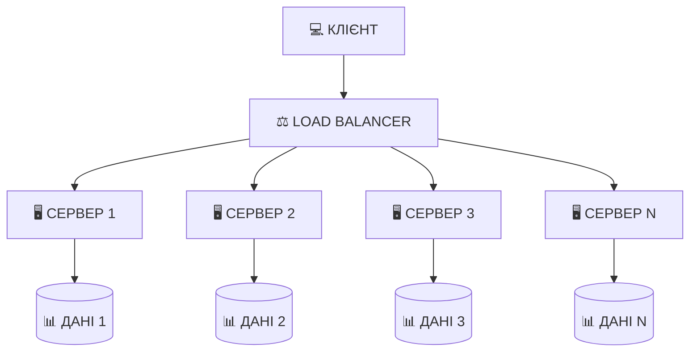
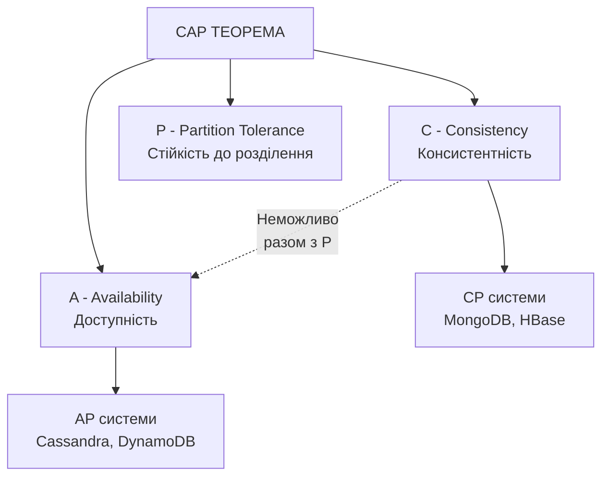
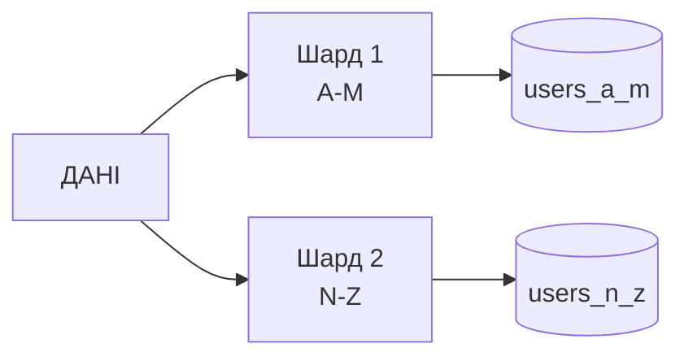
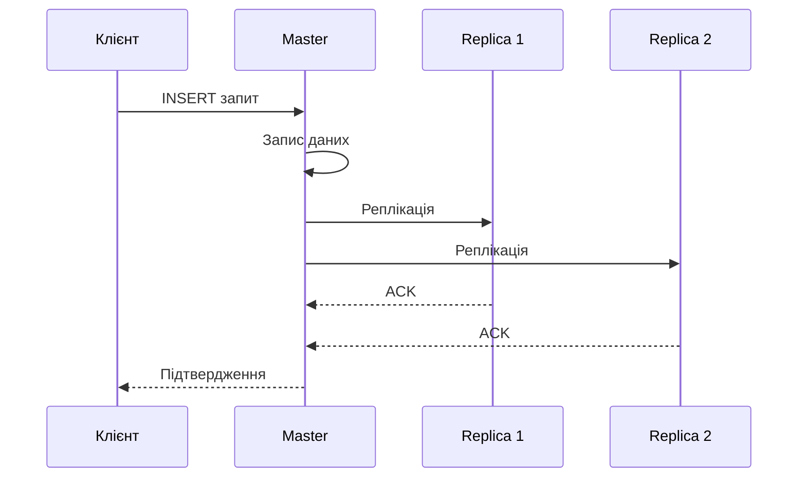
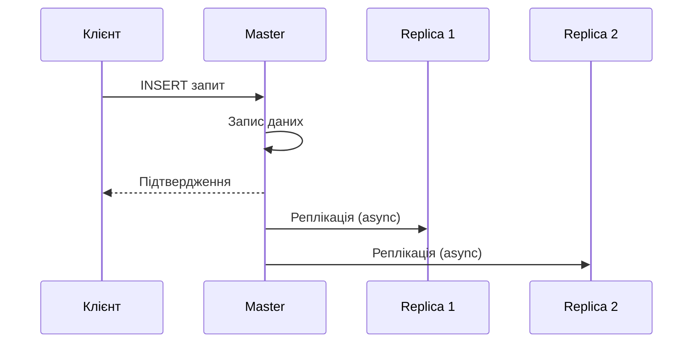
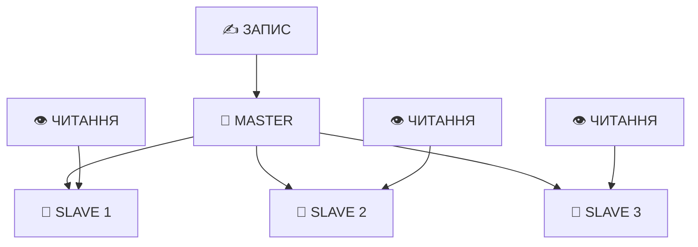
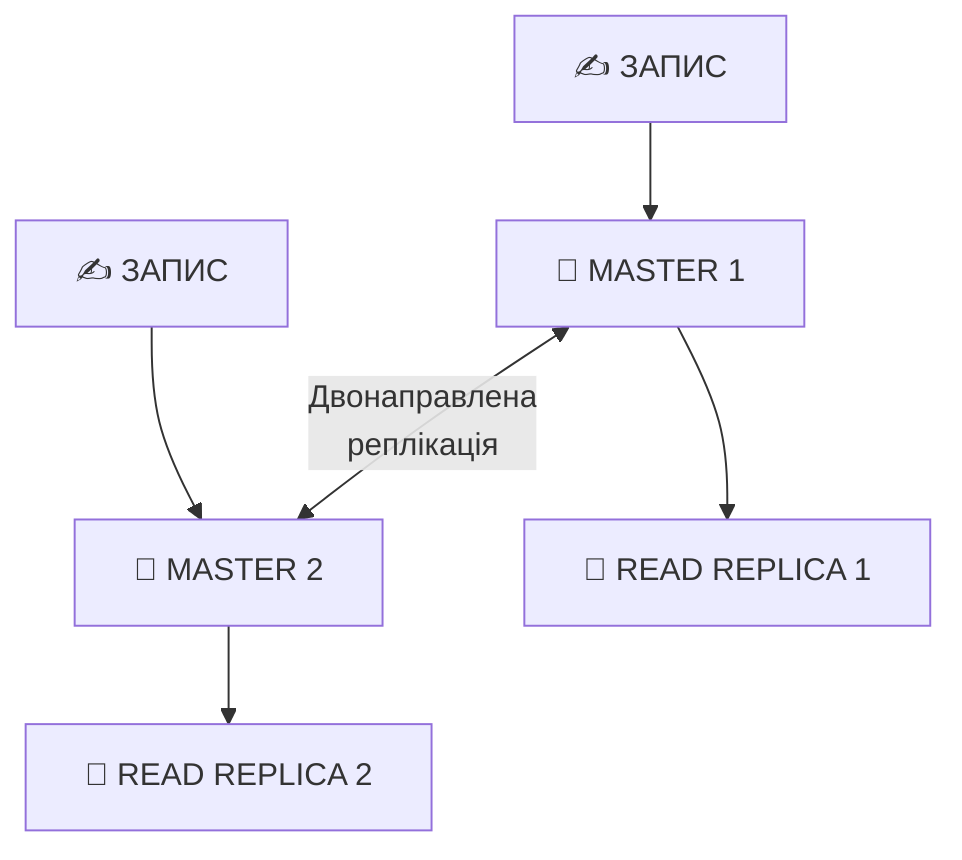
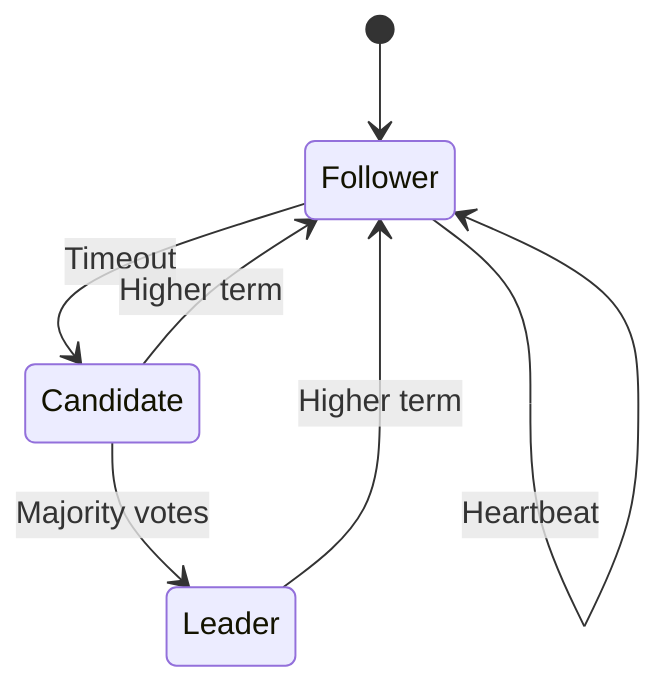

# Масштабування та розподілені архітектури

## План лекції

1. Вертикальне та горизонтальне масштабування
2. Стратегії шардингу
3. Реплікація даних
4. Консенсус у розподілених системах
5. NewSQL системи

## **📈 Основні поняття:**

**Масштабування** — процес збільшення потужності системи для обробки зростаючого навантаження.

**Шардинг** — горизонтальний розподіл даних між кількома базами даних або серверами.

**Реплікація** — створення та підтримка копій даних на кількох серверах.

**Консенсус** — процес досягнення згоди між вузлами розподіленої системи про стан даних.

## **1. Вертикальне та горизонтальне масштабування**

## Вертикальне масштабування (Scale Up)

### 💪 **Збільшення потужності одного сервера**

**Підходи:**
- Додавання процесорів та ядер
- Збільшення оперативної пам'яті
- Заміна HDD на SSD/NVMe
- Оновлення мережевих карт

### ✅ **Переваги:**
- Простота реалізації
- Збереження ACID гарантій
- Відсутність мережевої латентності
- Простіше адміністрування

### ❌ **Недоліки:**
- Обмеження масштабованості
- Єдина точка відмови
- Висока вартість
- Необхідність простою при оновленні

## Приклад вертикального масштабування

### 📊 **Оптимізація PostgreSQL для потужного сервера:**

```sql
-- Для сервера з 64 GB RAM
ALTER SYSTEM SET shared_buffers = '16GB';
ALTER SYSTEM SET effective_cache_size = '48GB';
ALTER SYSTEM SET work_mem = '256MB';
ALTER SYSTEM SET maintenance_work_mem = '2GB';

-- Налаштування для SSD
ALTER SYSTEM SET random_page_cost = 1.1;
ALTER SYSTEM SET effective_io_concurrency = 200;

-- Паралельне виконання
ALTER SYSTEM SET max_parallel_workers_per_gather = 4;
ALTER SYSTEM SET max_parallel_workers = 8;
```

**Результат:** Підвищення продуктивності без зміни коду

## Горизонтальне масштабування (Scale Out)

### 🌐 **Додавання нових серверів**



### ✅ **Переваги:**
- Практично необмежена масштабованість
- Відмовостійкість
- Економічна ефективність
- Географічний розподіл

## Недоліки горизонтального масштабування

### ⚠️ **Виклики розподіленості:**

**Складність архітектури:**
- Потреба в координації між вузлами
- Розподілене управління транзакціями
- Складніше тестування

**Проблеми консистентності:**
- Синхронізація даних між вузлами
- Розв'язання конфліктів
- Eventual consistency

**Мережева латентність:**
- Затримки при передачі даних
- Вплив на продуктивність

## CAP теорема

### 🔺 **Неможливо гарантувати всі три властивості одночасно:**



**Практичні наслідки:** Треба обирати між консистентністю та доступністю при мережевих проблемах

## CP vs AP системи

### 🎯 **Вибір залежить від вимог:**

| Тип | Пріоритет | Поведінка при розділенні | Приклади |
|-----|-----------|-------------------------|----------|
| **CP** | Консистентність | Частина вузлів недоступна | MongoDB, HBase |
| **AP** | Доступність | Можлива розбіжність даних | Cassandra, Riak |

**CP підходить для:** Фінансові транзакції, інвентаризація

**AP підходить для:** Соціальні мережі, рекомендації

## **2. Стратегії шардингу**

## Діапазонний шардинг

### 📊 **Розподіл за діапазонами значень:**



**Приклад:**
```sql
-- Шард 1: користувачі 2022 року
CREATE TABLE users_2022 (
    user_id BIGSERIAL PRIMARY KEY,
    registration_date DATE CHECK (
        registration_date >= '2022-01-01' AND
        registration_date < '2023-01-01'
    )
);
```

### ✅ **Переваги:** Ефективні діапазонні запити, простота
### ❌ **Недоліки:** Нерівномірний розподіл, hotspots

## Хешований шардинг

### 🔢 **Розподіл через хеш-функцію:**

```python
def get_shard(user_id, num_shards=4):
    shard_id = hash(user_id) % num_shards
    return f"shard_{shard_id}"

# user_id=12345 -> shard_2
# user_id=67890 -> shard_1
```

**Consistent Hashing:**
- Мінімізація перерозподілу при додаванні вузлів
- Використання віртуальних вузлів
- Рівномірне навантаження

### ✅ **Переваги:** Рівномірний розподіл, передбачуваність
### ❌ **Недоліки:** Складні діапазонні запити, перехешування

## Директорний шардинг

### 📋 **Lookup таблиця для визначення шарду:**

```sql
-- Довідник розміщення
CREATE TABLE shard_directory (
    tenant_id INTEGER PRIMARY KEY,
    shard_name VARCHAR(50),
    shard_host VARCHAR(255),
    shard_database VARCHAR(100)
);

-- Запит до довідника
SELECT shard_host, shard_database
FROM shard_directory
WHERE tenant_id = 1001;
```

### ✅ **Переваги:** Максимальна гнучкість, легка міграція
### ❌ **Недоліки:** Додаткова точка відмови, додаткова латентність

## Порівняння стратегій шардингу

| Стратегія | Розподіл | Діапазонні запити | Складність |
|-----------|----------|-------------------|------------|
| **Діапазонний** | Нерівномірний | ✅ Ефективні | 🟢 Низька |
| **Хешований** | Рівномірний | ❌ Неефективні | 🟡 Середня |
| **Директорний** | Гнучкий | 🟡 Залежить | 🔴 Висока |

**Рекомендації:**
- Multi-tenant системи → Директорний
- Рівномірне навантаження → Хешований
- Часові дані → Діапазонний

## **3. Реплікація даних**

## Синхронна реплікація

### ⏱️ **Чекає підтвердження від реплік:**



### ✅ **Переваги:**
- Нульова втрата даних
- Консистентність читання
- Автоматичне відновлення

### ❌ **Недоліки:**
- Підвищена латентність
- Зниження доступності
- Обмеження продуктивності

## Асинхронна реплікація

### ⚡ **Не чекає підтвердження:**



### ✅ **Переваги:**
- Низька латентність
- Висока доступність
- Краща продуктивність

### ❌ **Недоліки:**
- Можлива втрата даних
- Затримка реплікації
- Складний failover

## Master-Slave архітектура

### 👥 **Класична архітектура реплікації:**



**Розподіл навантаження:**
- Master обробляє всі записи
- Slaves обробляють читання
- Автоматичний failover з Patroni

### ✅ **Переваги:** Простота, розподіл читання
### ❌ **Недоліки:** Єдина точка відмови для запису

## Master-Master архітектура

### 🔄 **Багато серверів приймають запити на запис:**



**Особливості:**
- Географічний розподіл
- Відсутність єдиної точки відмови
- Потреба в розв'язанні конфліктів

### ✅ **Переваги:** Відмовостійкість, розподіл запису
### ❌ **Недоліки:** Складність конфліктів, складна підтримка

## **4. Консенсус у розподілених системах**

## Paxos алгоритм

### 🏛️ **Класичний алгоритм консенсусу:**

**Ролі:**
- **Proposer** — пропонує значення
- **Acceptor** — приймає/відхиляє пропозиції
- **Learner** — дізнається про консенсус

**Фази:**
1. **Prepare** — запит дозволу з номером пропозиції
2. **Promise** — обіцянка не приймати нижчі номери
3. **Accept** — відправка значення для прийняття
4. **Accepted** — підтвердження прийняття

**Використання:** Google Chubby, деякі версії ZooKeeper

## Raft алгоритм

### 🎯 **Більш зрозуміла альтернатива Paxos:**



**Ролі:**
- **Leader** — приймає запити, реплікує
- **Follower** — пасивно приймає оновлення
- **Candidate** — претендент на лідерство

**Переваги Raft:**
- Простіше зрозуміти
- Чітка специфікація
- Легше імплементувати

## Порівняння Paxos та Raft

| Характеристика | Paxos | Raft |
|----------------|-------|------|
| **Складність** | Висока | Середня |
| **Зрозумілість** | Складно | Просто |
| **Варіативність** | Багато версій | Чітка специфікація |
| **Використання** | Google Chubby | etcd, Consul, CockroachDB |

**Продуктивність:** Подібна теоретична продуктивність

**Вибір:** Raft для нових проєктів через простоту

## **5. NewSQL системи**

## Що таке NewSQL?

### 🆕 **Поєднання переваг SQL та NoSQL:**

**Цілі NewSQL:**
- Збереження SQL та ACID
- Горизонтальне масштабування
- Висока доступність
- Оптимізація для сучасного обладнання

**Ключові особливості:**
- Розподілені транзакції
- Автоматичний шардинг
- Вбудована реплікація
- Глобальна консистентність

## Приклади NewSQL систем

### 🗄️ **Основні представники:**

**Google Cloud Spanner:**
- Глобальна консистентність
- Використання атомарних годинників
- Автоматична реплікація

**CockroachDB:**
- PostgreSQL-сумісний
- Raft консенсус
- Geo-distributed

**VoltDB:**
- In-memory обробка
- Горизонтальне масштабування
- ACID гарантії

## CockroachDB — приклад

### 🪳 **PostgreSQL-сумісна розподілена БД:**

```sql
-- Створення таблиці з партиціонуванням
CREATE TABLE users (
    user_id UUID PRIMARY KEY,
    email STRING UNIQUE,
    country STRING,
    created_at TIMESTAMP
) PARTITION BY LIST (country) (
    PARTITION europe VALUES IN ('UK', 'DE', 'FR', 'UA'),
    PARTITION americas VALUES IN ('US', 'CA', 'BR'),
    PARTITION asia VALUES IN ('JP', 'CN', 'IN')
);

-- Налаштування розміщення
ALTER PARTITION europe OF INDEX users@primary
    CONFIGURE ZONE USING constraints = '[+region=eu-west]';
```

**Переваги:** SQL, ACID, горизонтальне масштабування

## Коли використовувати NewSQL?

### 🎯 **Сценарії застосування:**

**Підходить для:**
- Глобально розподілені застосунки
- Потреба в ACID та масштабуванні
- Складні транзакції на великих даних
- Фінансові системи, e-commerce

**Не підходить для:**
- Прості однорегіональні застосунки
- Екстремально висока латентність критична
- Специфічні NoSQL use cases

**Компроміси:**
- Складність впровадження
- Вища латентність vs традиційні RDBMS
- Обмежена екосистема інструментів

## Висновки

### 📌 **Ключові моменти:**

**Вибір стратегії масштабування:**
- Вертикальне — для помірного зростання
- Горизонтальне — для необмеженого масштабування

**Шардинг:**
- Діапазонний — для часових даних
- Хешований — для рівномірного розподілу
- Директорний — для multi-tenant

**Реплікація:**
- Синхронна — нульова втрата даних
- Асинхронна — висока продуктивність

**NewSQL — майбутнє для багатьох застосунків**
