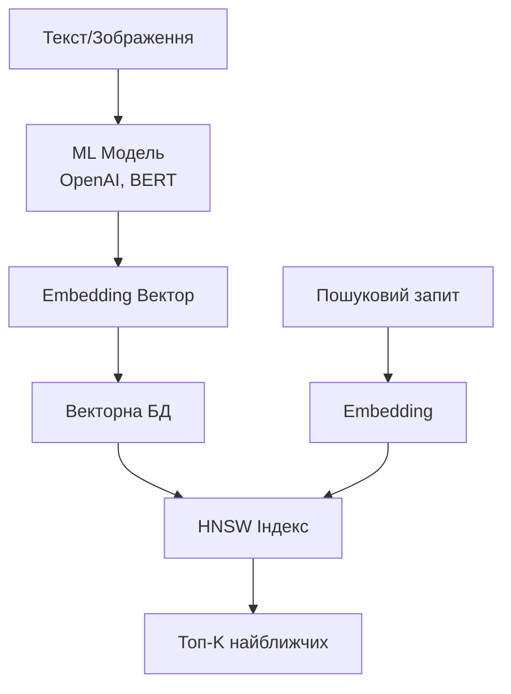
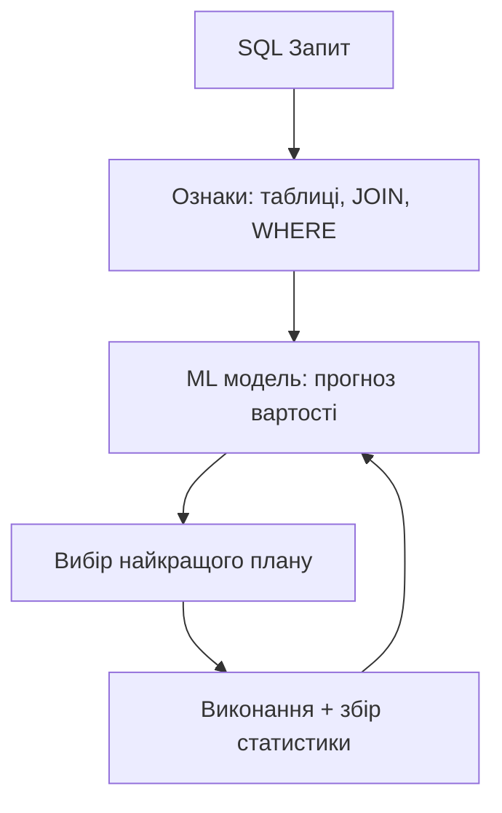
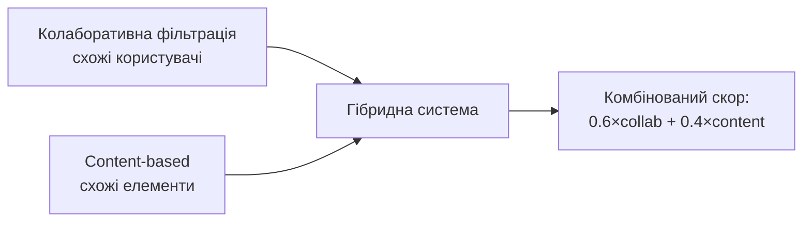
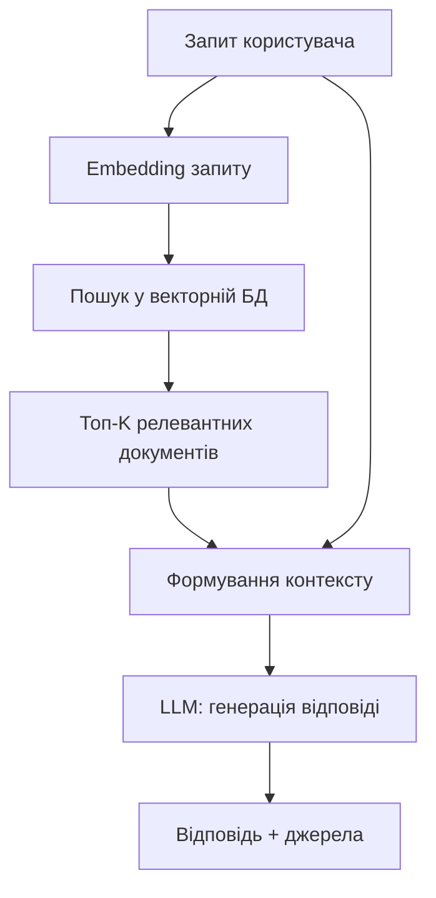
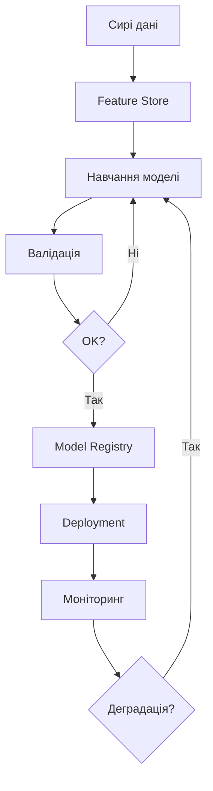
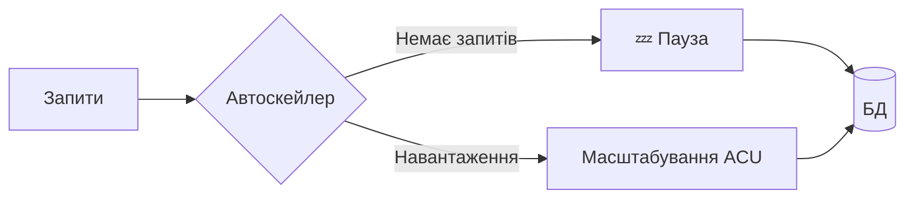
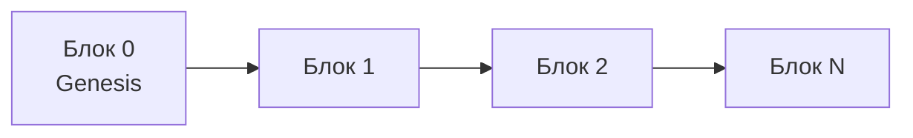
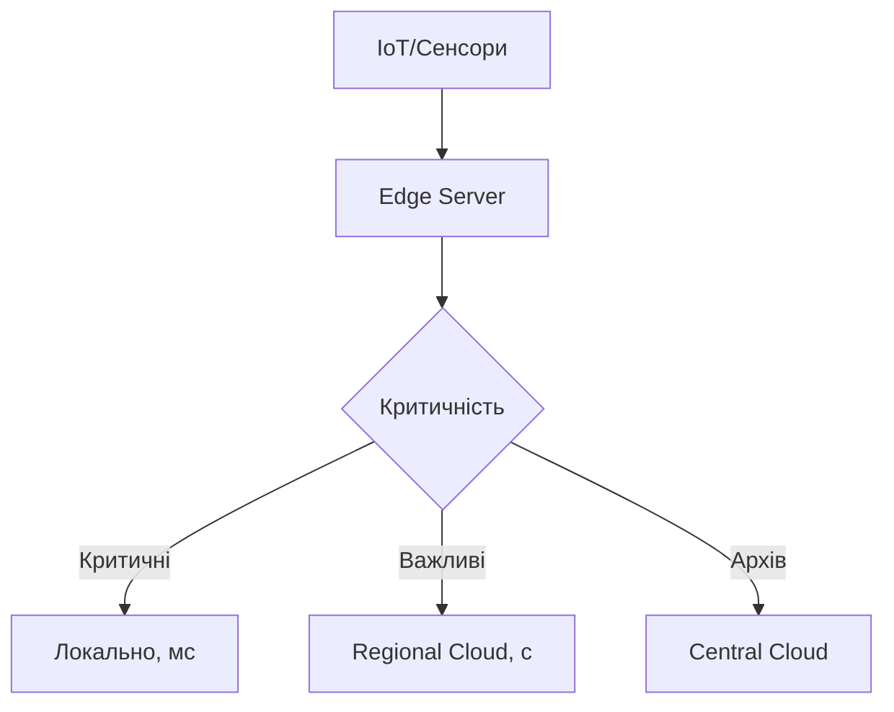
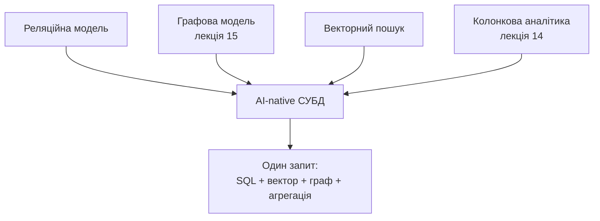

# Лекція 16. Штучний інтелект, векторні бази даних та перспективи розвитку СУБД

## План лекції

1. Векторні бази даних (розширено)
2. Автоматична оптимізація СУБД
3. Рекомендаційні системи
4. NLP, чат-боти та RAG / GraphRAG
5. MLOps
6. Serverless (стисло — див. лекцію 12)
7. Quantum computing
8. Blockchain технології
9. Edge computing
10. Професійні компетенції майбутнього
11. Конвергенція технологій СУБД

**Зв'язок з попередніми лекціями:** графи знань (лекція 15) + вектори (ця лекція) = GraphRAG; аналітика й Big Data (лекція 14) живлять feature stores для ML.

## **1. Векторні бази даних**

### 🔢 **Embedding вектори: семантика → геометрія**

Перетворення тексту/зображення/аудіо у багатовимірний числовий масив, що зберігає семантичне значення. Схожі за змістом об'єкти → близькі вектори.

**Метрики подібності:** косинусна подібність, евклідова відстань, скалярний добуток


```mermaid
graph TB
    A[Текст/Зображення] --> B[ML Модель<br/>OpenAI, BERT]
    B --> C[Embedding Вектор]
    C --> D[Векторна БД]
    D --> E[HNSW Індекс]
    G[Пошуковий запит] --> H[Embedding] --> E
    E --> I[Топ-K найближчих]
```

## pgvector: практика

```sql
CREATE EXTENSION vector;

CREATE TABLE documents (
    id SERIAL PRIMARY KEY,
    content TEXT NOT NULL,
    embedding vector(1536),
    metadata JSONB
);

-- HNSW — сучасний індекс за замовчуванням
CREATE INDEX ON documents USING hnsw (embedding vector_cosine_ops)
WITH (m = 16, ef_construction = 64);
```

```python
cursor.execute("""
    SELECT content, 1 - (embedding <=> %s::vector) as similarity
    FROM documents
    ORDER BY embedding <=> %s::vector
    LIMIT 5
""", (query_embedding, query_embedding))
```

> **Актуалізація:** HNSW витіснив IVFFlat як індекс за замовчуванням (pgvector ≥ 0.5.0); поширюється квантування векторів (product/binary quantization) для стиснення в 4–32 рази.

## Векторні БД: спеціалізовані vs вбудовані

| БД | Тип |
|---|---|
| **Pinecone, Weaviate, Qdrant, Milvus** | Спеціалізовані векторні СУБД |
| **PostgreSQL (pgvector), MongoDB Atlas, Elasticsearch, Redis** | Вектор як "ще один тип колонки" в існуючій СУБД |

> **Актуалізація (розширений розділ):** ключовий тренд — **уникати окремої векторної БД**, якщо основна СУБД вже підтримує вектори достатньо добре. Спеціалізовані рішення лишаються оптимальними лише для мільярдів векторів і максимальної швидкості ANN-пошуку.

**Застосування:** RAG-системи, семантичний пошук, мультимодальний пошук (текст↔зображення), рекомендації

## **2. Автоматична оптимізація СУБД**

### 🤖 **ML для оптимізації запитів**


```mermaid
graph TB
    A[SQL Запит] --> B[Ознаки: таблиці, JOIN, WHERE]
    B --> C[ML модель: прогноз вартості]
    C --> D[Вибір найкращого плану]
    D --> E[Виконання + збір статистики]
    E --> C
```

**Автоматичне створення індексів:** аналіз `pg_stat_statements` → оцінка користі кандидата (частота × селективність − вартість обслуговування)

**Прогнозування навантаження:** RandomForest на ознаках (година, день тижня, сезонність) → проактивне масштабування

**Детекція аномалій:** Isolation Forest на метриках CPU/пам'яті/латентності → сповіщення

## **3. Рекомендаційні системи**

### 🎯 **Три підходи**


```mermaid
graph LR
    A[Колаборативна фільтрація<br/>схожі користувачі] --> D[Гібридна система]
    B[Content-based<br/>схожі елементи] --> D
    D --> E[Комбінований скор:<br/>0.6×collab + 0.4×content]
```

```sql
-- Пошук схожих користувачів (кореляція оцінок)
WITH user_items AS (
    SELECT item_id, interaction_value FROM interactions WHERE user_id = 1001
)
SELECT i.user_id, CORR(i.interaction_value, ui.interaction_value) as similarity
FROM interactions i JOIN user_items ui ON i.item_id = ui.item_id
GROUP BY i.user_id HAVING COUNT(*) >= 5;
```

**Content-based:** профіль користувача = зважене середнє embeddings улюблених елементів → векторний пошук схожих

## **4. NLP, чат-боти та RAG**

### 🤖 **Retrieval Augmented Generation**


```mermaid
graph TB
    A[Запит користувача] --> B[Embedding запиту]
    B --> C[Пошук у векторній БД]
    C --> D[Топ-K релевантних документів]
    D --> E[Формування контексту]
    A --> E
    E --> F[LLM: генерація відповіді]
    F --> G[Відповідь + джерела]
```

```python
def retrieve_relevant_docs(query, limit=5):
    query_embedding = get_embedding(query)
    cursor.execute("""
        SELECT title, content, 1 - (embedding <=> %s::vector) as similarity
        FROM knowledge_base
        WHERE 1 - (embedding <=> %s::vector) > 0.7
        ORDER BY embedding <=> %s::vector LIMIT %s
    """, (query_embedding, query_embedding, query_embedding, limit))
    return cursor.fetchall()
```

**Гібридний пошук:** семантичний (70%) + повнотекстовий ts_rank (30%)

> **Актуалізація:** тренд 2025–2026 — **agentic RAG** (LLM сама вирішує, коли й як звертатися до бази знань) та **GraphRAG** (доповнення вектора обходом графа знань — див. лекцію 15) для багатоступеневих запитань.

## **5. MLOps**


```mermaid
graph TB
    A[Сирі дані] --> B[Feature Store]
    B --> C[Навчання моделі]
    C --> D[Валідація]
    D --> E{OK?}
    E -->|Ні| C
    E -->|Так| F[Model Registry]
    F --> G[Deployment]
    G --> H[Моніторинг]
    H --> I{Деградація?}
    I -->|Так| C
```

**Feature Store:** централізоване управління ознаками, консистентність train/inference
**Model Registry:** версіонування моделей, метрики, статус (training/production/archived)
**Drift-детекція:** порівняння поточної точності з базовою (>5% деградації → перенавчання)

## **6. Serverless бази даних** (детальніше — лекція 12)

### ☁️ **Оплата за використання, автомасштабування 0→N**


```mermaid
graph LR
    A[Запити] --> B{Автоскейлер}
    B -->|Немає запитів| C[💤 Пауза]
    B -->|Навантаження| D[Масштабування ACU]
    C --> F[(БД)]
    D --> F
```

**Архітектурні прийоми:** Connection Pooling (RDS Proxy), кешування (Redis) для зменшення "холодних" активацій

## **7. Quantum Computing**

### ⚛️ **Кубіти: суперпозиція станів**

**Алгоритм Гровера:** квадратичне прискорення пошуку — O(√N) замість O(N)

| Розмір БД | Класичний пошук | Квантовий пошук |
|---|---|---|
| 1,000,000 | 1,000,000 | 1,000 |

**Квантово-стійка криптографія:** Kyber (KEM), Dilithium, SPHINCS+

> **Актуалізація:** з 2024 року NIST **офіційно стандартизував** ці алгоритми (ML-KEM, ML-DSA, SLH-DSA) — питання "коли" мігрувати стає питанням "як швидко".

**Поточний стан:** тисячі фізичних кубітів, потрібні мільйони для практичних задач — горизонт 2030+

## **8. Blockchain технології**

### ⛓️ **Розподілена незмінна база даних**


```mermaid
graph LR
    A[Блок 0<br/>Genesis] --> B[Блок 1] --> C[Блок 2] --> D[Блок N]
```

**Переваги:** незмінність, прозорість, децентралізація
**Обмеження:** 7–30 TPS проти тисяч у традиційних СУБД, вартість операцій (gas fees)

**Use cases:** ланцюги постачання, медичні записи, фінансові транзакції (BigchainDB, Hyperledger Fabric, smart contracts)

> **Актуалізація:** фокус зсунувся до **Layer 2** (rollups для масштабування) та **RWA-токенізації** (blockchain веде реєстр прав власності, дані — у традиційних СУБД). Blockchain доповнює, а не замінює традиційні БД.

## **9. Edge Computing**

### 🌐 **Обробка ближче до джерела даних**


```mermaid
graph TB
    A[IoT/Сенсори] --> B[Edge Server]
    B --> C{Критичність}
    C -->|Критичні| D[Локально, мс]
    C -->|Важливі| E[Regional Cloud, с]
    C -->|Архів| F[Central Cloud]
```

**Переваги:** латентність 1–10 мс (проти 100–500 мс у хмарі), економія трафіку до 99% (агрегація на периферії), автономність при втраті зв'язку

**Синхронізація:** conflict resolution (Last Write Wins), edge-database на SQLite/RocksDB

## **10. Професійні компетенції майбутнього**

### 👤 **Нові ролі**

| Роль | Фокус |
|---|---|
| **Database Reliability Engineer** | SRE + DBA, автоматизація, SLA |
| **Data Platform Engineer** | Data lakes, streaming, governance |
| **ML Infrastructure Engineer** | Feature stores, model registries, MLOps |

**Multi-model підхід:** PostgreSQL (транзакції), ClickHouse (аналітика), MongoDB (документи), Neo4j (графи), Redis (кеш), Elasticsearch (пошук), pgvector/Pinecone (вектори)

**Навчальна траєкторія:** фундамент (SQL, теорія БД) → практичні навички (NoSQL, хмара, Kubernetes, IaC) → спеціалізація (AI/ML, stream processing, edge, blockchain)

## **11. Куди рухається світ СУБД: конвергенція**


```mermaid
graph TB
    A[Реляційна модель] --> E[AI-native СУБД]
    B[Графова модель<br/>лекція 15] --> E
    C[Векторний пошук] --> E
    D[Колонкова аналітика<br/>лекція 14] --> E
    E --> F[Один запит:<br/>SQL + вектор + граф + агрегація]
```

**Три спостереження:**
1. Спеціалізовані СУБД не зникають, а **вбудовуються** одна в одну (вектори в Postgres, GraphRAG в Neo4j)
2. **AI стає драйвером вимог** до СУБД — потрібні одночасно ACID, векторний пошук і графовий обхід
3. Роль інженера — **архітектор даних**, що свідомо комбінує кілька моделей в одному стеку

## **Висновки**

**Векторні БД** — фундамент AI-застосунків; вектор дедалі частіше — просто тип колонки, а не окрема категорія СУБД

**Автооптимізація та MLOps** — ML робить СУБД самоналаштовуваними, feature stores і model registries — стандарт продакшену

**Perspective-технології:** пост-квантова криптографія вже стандарт (NIST), edge computing — усталена практика IoT, blockchain і квантовий пошук — довгострокова перспектива

**Головний висновок курсу:** нові технології доповнюють, а не замінюють реляційні, NoSQL і NewSQL підходи — успіх фахівця залежить від вміння свідомо комбінувати моделі даних під конкретну задачу
