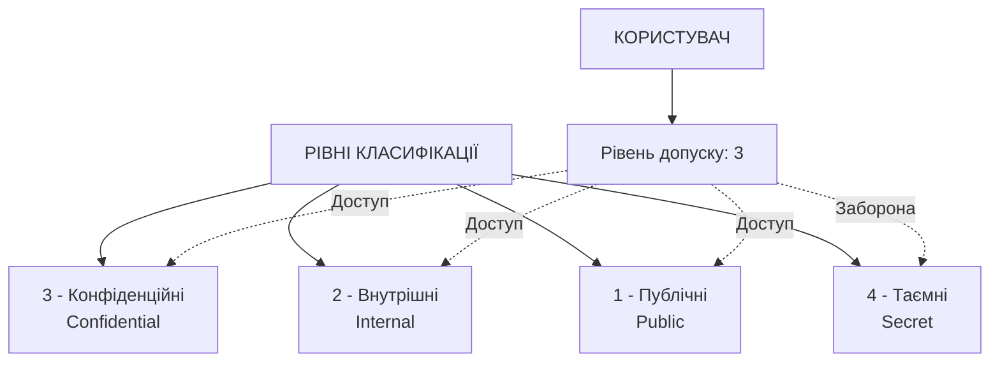
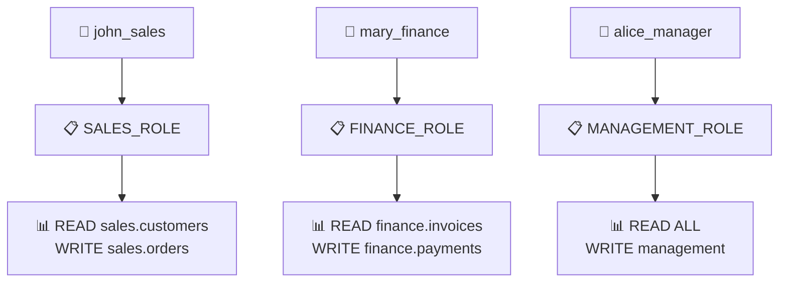
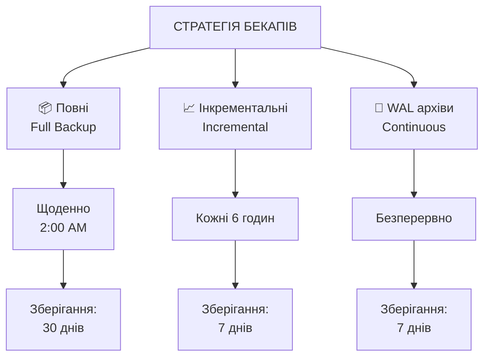

# Безпека та адміністрування баз даних

## План лекції

1. Моделі контролю доступу
2. Загрози безпеці баз даних
3. Криптографічні методи захисту
4. Аудит та моніторинг
5. Стратегії резервного копіювання

## **🔒 Основні поняття:**

**Автентифікація** — процес перевірки ідентичності користувача.

**Авторизація** — надання прав доступу до ресурсів.

**Аудит** — систематичне відстеження дій користувачів.

**Шифрування** — перетворення даних у нечитаний формат для захисту.

## **1. Моделі контролю доступу**

## Дискреційна модель (DAC)

### 🔑 **Власник визначає права доступу:**

**Принципи:**
- Кожен об'єкт має власника
- Власник може надавати права
- Права можуть передаватися далі

```sql
-- Створення ролей
CREATE ROLE app_admin LOGIN PASSWORD 'secure';
CREATE ROLE app_developer LOGIN PASSWORD 'secure';
CREATE ROLE app_readonly LOGIN PASSWORD 'secure';

-- Надання прав
GRANT SELECT, INSERT, UPDATE, DELETE
    ON ALL TABLES IN SCHEMA app_data
    TO app_developer;

GRANT SELECT ON ALL TABLES IN SCHEMA app_data
    TO app_readonly;
```

### ✅ **Переваги:** Гнучкість, простота
### ❌ **Недоліки:** Складний централізований контроль

## Мандатна модель (MAC)

### 🏛️ **Централізовані правила на основі рівнів безпеки:**



**Правила:**
- Read-down: можна читати свій рівень та нижче
- Write-up: можна писати свій рівень
- No read-up/write-down

### ✅ **Переваги:** Централізований контроль, безпека
### ❌ **Недоліки:** Складність впровадження, менша гнучкість

## Реалізація MAC в PostgreSQL

### 🔐 **Row-level security для MAC:**

```sql
-- Таблиця з рівнями класифікації
CREATE TABLE documents (
    document_id SERIAL PRIMARY KEY,
    title VARCHAR(200),
    content TEXT,
    classification_level INTEGER CHECK (
        classification_level BETWEEN 1 AND 4
    )
);

-- Таблиця допусків користувачів
CREATE TABLE user_clearance (
    username VARCHAR(50) PRIMARY KEY,
    clearance_level INTEGER CHECK (
        clearance_level BETWEEN 1 AND 4
    )
);

-- Політика read-down
CREATE POLICY mac_read_down ON documents
FOR SELECT
USING (
    classification_level <= (
        SELECT clearance_level
        FROM user_clearance
        WHERE username = current_user
    )
);
```

## Рольова модель (RBAC)

### 👥 **Права організовані навколо ролей:**



**Компоненти:**
- Користувачі
- Ролі (функції в організації)
- Права (операції з об'єктами)
- Сесії (активні ролі)

## Приклад RBAC

### 📋 **Створення ролей та призначення прав:**

```sql
-- Створення функціональних ролей
CREATE ROLE sales_role;
CREATE ROLE finance_role;
CREATE ROLE hr_role;

-- Надання прав ролям
GRANT USAGE ON SCHEMA sales TO sales_role;
GRANT SELECT, INSERT, UPDATE ON sales.customers TO sales_role;
GRANT SELECT, INSERT, UPDATE ON sales.orders TO sales_role;

-- Створення користувачів
CREATE ROLE john_sales LOGIN PASSWORD 'password';
CREATE ROLE mary_finance LOGIN PASSWORD 'password';

-- Призначення ролей користувачам
GRANT sales_role TO john_sales;
GRANT finance_role TO mary_finance;

-- Динамічне перемикання ролей
SET ROLE sales_role;
```

### ✅ **Переваги:** Простота адміністрування, відповідність структурі
### ❌ **Недоліки:** Можлива надмірність прав

## Порівняння моделей

| Модель | Гнучкість | Безпека | Складність | Використання |
|--------|-----------|---------|------------|--------------|
| **DAC** | 🟢 Висока | 🟡 Середня | 🟢 Низька | Комерційні СУБД |
| **MAC** | 🔴 Низька | 🟢 Висока | 🔴 Висока | Військові системи |
| **RBAC** | 🟡 Середня | 🟡 Середня | 🟡 Середня | Корпоративні системи |

**Рекомендації:**
- Бізнес-застосунки → RBAC
- Урядові системи → MAC
- Малі проєкти → DAC

## **2. Загрози безпеці баз даних**

## SQL ін'єкції

### 💉 **Одна з найнебезпечніших атак:**

**Вразливий код:**
```python
# НЕБЕЗПЕЧНО!
query = f"SELECT * FROM users WHERE username = '{username}'"
cursor.execute(query)
```

**Атака:**
```python
username = "admin' --"
# Результат: SELECT * FROM users WHERE username = 'admin' --'
# Частина після -- коментується!
```

**Наслідки:**
- Несанкціонований доступ
- Витік даних
- Зміна/видалення даних
- Виконання команд ОС

## Типи SQL ін'єкцій

### 🎯 **Основні різновиди:**

**Union-based:**
```sql
' UNION SELECT credit_card, cvv, expiry FROM payments --
```

**Boolean-based blind:**
```sql
' AND SUBSTRING(password, 1, 1) = 'a' --
```

**Time-based blind:**
```sql
' AND IF(SUBSTRING(password,1,1)='a', SLEEP(5), 0) --
```

**Second-order:**
- Шкідливий код зберігається в БД
- Виконується пізніше в іншому запиті

## Захист від SQL ін'єкцій

### 🛡️ **Ефективні методи захисту:**

**1. Параметризовані запити:**
```python
# БЕЗПЕЧНО!
query = "SELECT * FROM users WHERE username = %s"
cursor.execute(query, (username,))
```

**2. ORM:**
```python
# Автоматична параметризація
user = session.query(User).filter(
    User.username == username
).first()
```

**3. Валідація вводу:**
```python
import re

if not re.match(r'^[a-zA-Z0-9_]+$', username):
    raise ValueError("Invalid username")
```

**4. Обмеження прав в БД:**
```sql
GRANT SELECT, INSERT, UPDATE ON users TO app_user;
REVOKE DROP, TRUNCATE ON ALL TABLES FROM app_user;
```

## Несанкціонований доступ

### 🚪 **Захист від зловмисного входу:**

**Методи атак:**
- Підбір паролів (brute force)
- Фішинг
- Викрадені облікові дані
- Exploitation вразливостей

**Захист:**
- Багатофакторна автентифікація (2FA)
- Складні паролі
- Обмеження спроб входу
- Моніторинг аномальної активності

## Багатофакторна автентифікація

### 🔐 **Додатковий рівень захисту:**

```python
import pyotp

# Генерація секретного ключа
secret = pyotp.random_base32()

# Створення TOTP
totp = pyotp.TOTP(secret)

# Генерація QR коду для Google Authenticator
uri = totp.provisioning_uri(
    name='user@example.com',
    issuer_name='MyApp'
)

# Перевірка токену
token = input("Enter 2FA code: ")
if totp.verify(token):
    print("Login successful!")
```

**Типи факторів:**
- Щось, що ви знаєте (пароль)
- Щось, що ви маєте (телефон)
- Щось, чим ви є (біометрія)

## Rate Limiting та виявлення атак

### ⏱️ **Обмеження спроб входу:**

**Стратегія:**
- Максимум 5 спроб за 5 хвилин
- Блокування на 15 хвилин при перевищенні
- Сповіщення адміністраторів

**Виявлення аномалій:**
- Множинні невдалі спроби
- Вхід з нетипової локації
- Одночасні входи з різних країн
- Вхід у незвичний час

**Дії:**
- Автоматичне блокування
- Запит додаткової автентифікації
- Сповіщення користувача

## **3. Криптографічні методи захисту**

## Шифрування даних у спокої

### 💾 **Encryption at Rest:**

**Рівні шифрування:**

**Шифрування стовпців:**
```sql
CREATE EXTENSION pgcrypto;

-- Шифрування чутливих даних
INSERT INTO customers (
    email,
    ssn_encrypted,
    credit_card_encrypted
) VALUES (
    'user@example.com',
    pgp_sym_encrypt('123-45-6789', 'key'),
    pgp_sym_encrypt('4532-1234-5678', 'key')
);

-- Розшифрування
SELECT
    email,
    pgp_sym_decrypt(ssn_encrypted, 'key') as ssn
FROM customers;
```

**Прозоре шифрування (TDE):** Шифрування всієї БД на рівні файлової системи

## Шифрування при передачі

### 🔐 **Encryption in Transit - SSL/TLS:**

**Налаштування PostgreSQL:**
```conf
# postgresql.conf
ssl = on
ssl_cert_file = 'server.crt'
ssl_key_file = 'server.key'
ssl_ca_file = 'root.crt'
ssl_min_protocol_version = 'TLSv1.2'
```

**Вимагання SSL:**
```conf
# pg_hba.conf
hostssl all all 0.0.0.0/0 md5
hostnossl all all 0.0.0.0/0 reject
```

**Підключення з SSL:**
```python
conn = psycopg2.connect(
    host='db.example.com',
    database='production',
    user='app_user',
    password='password',
    sslmode='verify-full',
    sslrootcert='/path/to/root.crt'
)
```

## Управління ключами шифрування

### 🔑 **Key Management:**

**Принципи:**
- Централізоване зберігання ключів
- Регулярна ротація ключів (90 днів)
- Розділення обов'язків
- Аудит використання ключів

**Рішення:**
- AWS KMS (Key Management Service)
- Azure Key Vault
- HashiCorp Vault
- Google Cloud KMS

**Ротація ключів:**
1. Генерація нового ключа
2. Перешифрування даних
3. Архівування старого ключа
4. Оновлення конфігурації

## **4. Аудит та моніторинг**

## Система аудиту

### 📊 **Комплексне логування:**

```sql
-- Таблиця аудиту
CREATE TABLE audit_log (
    audit_id BIGSERIAL PRIMARY KEY,
    timestamp TIMESTAMP DEFAULT CURRENT_TIMESTAMP,
    username VARCHAR(50),
    operation VARCHAR(20),
    table_name VARCHAR(100),
    old_values JSONB,
    new_values JSONB,
    client_ip INET,
    success BOOLEAN
);

-- Тригер аудиту
CREATE TRIGGER audit_customers
AFTER INSERT OR UPDATE OR DELETE ON customers
FOR EACH ROW EXECUTE FUNCTION audit_function();
```

**Що логувати:**
- Всі операції зміни даних
- Доступ до чутливих даних
- Зміни схеми БД
- Зміни привілеїв
- Невдалі спроби доступу

## Аналіз логів безпеки

### 🔍 **Виявлення підозрілої активності:**

```sql
-- Масове читання даних
SELECT username, COUNT(*) as operations
FROM audit_log
WHERE timestamp > CURRENT_TIMESTAMP - INTERVAL '1 hour'
  AND operation = 'SELECT'
GROUP BY username
HAVING COUNT(*) > 1000;

-- Доступ вночі
SELECT username, COUNT(*) as night_operations
FROM audit_log
WHERE EXTRACT(HOUR FROM timestamp) BETWEEN 0 AND 6
  AND timestamp > CURRENT_TIMESTAMP - INTERVAL '7 days'
GROUP BY username
HAVING COUNT(*) > 10;

-- Масові видалення
SELECT username, table_name, COUNT(*) as deletions
FROM audit_log
WHERE operation = 'DELETE'
  AND timestamp > CURRENT_TIMESTAMP - INTERVAL '24 hours'
GROUP BY username, table_name
HAVING COUNT(*) > 100;
```

## Моніторинг в реальному часі

### ⚡ **Автоматичне виявлення загроз:**

**Алерти:**
- Множинні невдалі входи
- Доступ до незвичних таблиць
- Зміни критичних даних
- Підозріла зміна привілеїв

**Автоматичні дії:**
- Блокування облікового запису
- Запит додаткової автентифікації
- Сповіщення адміністраторів
- Логування для розслідування

**Інтеграція:**
- SIEM системи (Splunk, ELK)
- Alerting (PagerDuty, Slack)
- Ticketing системи (Jira)

## **5. Стратегії резервного копіювання**

## Типи резервних копій

### 💾 **Комплексна стратегія:**



**Правило 3-2-1:**
- 3 копії даних
- 2 різних носії
- 1 копія офсайт

## Автоматизація резервного копіювання

### 🤖 **Скрипт для PostgreSQL:**

```bash
#!/bin/bash

# Повне резервне копіювання
TIMESTAMP=$(date +%Y%m%d_%H%M%S)
BACKUP_FILE="full_backup_$TIMESTAMP.dump"

pg_dump -Fc -f "$BACKUP_FILE" production

# Стиснення
gzip "$BACKUP_FILE"

# Вивантаження до S3
aws s3 cp "$BACKUP_FILE.gz" \
    "s3://backups/full/$BACKUP_FILE.gz"

# Видалення старих локальних копій
find /backups -name "*.gz" -mtime +30 -delete
```

**Планування через cron:**
```cron
# Повне щоденно о 2:00
0 2 * * * /usr/local/bin/backup.sh full

# Інкрементальне кожні 6 годин
0 */6 * * * /usr/local/bin/backup.sh incremental
```

## Відновлення після збоїв

### 🔧 **Процедури відновлення:**

**Повне відновлення:**
```bash
# Завантаження бекапу з S3
aws s3 cp s3://backups/full/latest.dump.gz .

# Розпакування
gunzip latest.dump.gz

# Відновлення
pg_restore -d production -Fc latest.dump
```

**Point-in-Time Recovery (PITR):**
```bash
# Відновлення до конкретного часу
restore_command = 'cp /wal_archive/%f %p'
recovery_target_time = '2024-10-05 14:30:00'
recovery_target_action = 'promote'
```

**Тестування відновлення:** Регулярно перевіряйте, що бекапи можна відновити!

## Моніторинг бекапів

### 📊 **Перевірка стану:**

```sql
-- Останні успішні бекапи
SELECT
    backup_type,
    MAX(backup_time) as last_backup,
    EXTRACT(EPOCH FROM (
        CURRENT_TIMESTAMP - MAX(backup_time)
    ))/3600 as hours_ago
FROM backup_history
GROUP BY backup_type;

-- Розмір бекапів
SELECT
    backup_type,
    pg_size_pretty(AVG(backup_size)) as avg_size,
    COUNT(*) as count
FROM backup_history
WHERE backup_time > CURRENT_DATE - INTERVAL '30 days'
GROUP BY backup_type;
```

**Алерти:**
- Бекап не виконувався > 24 години
- Різке збільшення розміру бекапу
- Невдале відновлення при тесті

## Висновки

### 🎯 **Ключові принципи безпеки:**

**Багаторівневий захист:**
- Контроль доступу (RBAC/MAC)
- Шифрування (at rest + in transit)
- Аудит та моніторинг
- Резервне копіювання

**Проактивний підхід:**
- Регулярні аудити безпеки
- Оновлення систем
- Навчання персоналу
- Тестування процедур відновлення

**Комплаєнс:**
- GDPR, HIPAA, PCI DSS
- Документування процедур
- Регулярні перевірки
