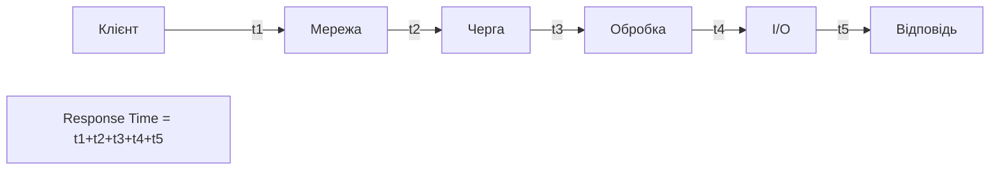
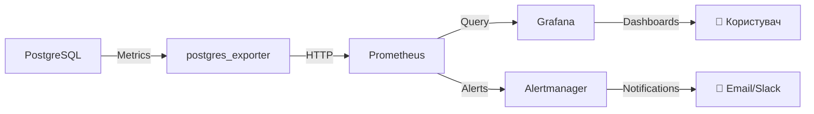

# Моніторинг продуктивності та налагодження

## План лекції

1. Метрики продуктивності СУБД
2. Профілювання запитів
3. Виявлення вузьких місць
4. Інструменти моніторингу
5. Планове обслуговування

## **📊 Основні поняття:**

**Throughput** — кількість операцій за одиницю часу (TPS, QPS).

**Response Time** — час виконання операції від початку до завершення.

**Latency** — затримка між запитом та відповіддю.

**Bottleneck** — вузьке місце, що обмежує продуктивність системи.

## **1. Метрики продуктивності СУБД**

## Пропускна здатність (Throughput)

### ⚡ **Кількість операцій за секунду:**

**Основні метрики:**
- **TPS** (Transactions Per Second) — транзакції/сек
- **QPS** (Queries Per Second) — запити/сек
- **Throughput** — обсяг даних/сек

```sql
-- Моніторинг транзакцій
SELECT
    xact_commit + xact_rollback as total_transactions,
    xact_commit as committed,
    xact_rollback as rolled_back,
    ROUND(100.0 * xact_commit /
        NULLIF(xact_commit + xact_rollback, 0), 2)
        as success_rate
FROM pg_stat_database
WHERE datname = current_database();
```

**Норми:** 1000-10000 TPS для OLTP систем

## Час відгуку (Response Time)

### ⏱️ **Час виконання операцій:**



**Персентилі:**
- **P50** (медіана) — 50% запитів
- **P95** — 95% запитів швидше
- **P99** — 99% запитів швидше

**Цільові показники:**
- P50 < 10ms
- P95 < 100ms
- P99 < 500ms

## Аналіз часу відгуку

### 📈 **Статистика запитів:**

```sql
-- Найповільніші запити
SELECT
    query,
    calls,
    mean_exec_time,
    max_exec_time,
    stddev_exec_time,
    ROUND(100.0 * total_exec_time /
        SUM(total_exec_time) OVER (), 2)
        as percent_total_time
FROM pg_stat_statements
ORDER BY mean_exec_time DESC
LIMIT 20;

-- Запити з нестабільним часом виконання
SELECT
    query,
    calls,
    mean_exec_time,
    stddev_exec_time,
    CASE
        WHEN mean_exec_time > 0
        THEN stddev_exec_time / mean_exec_time
        ELSE 0
    END as coefficient_of_variation
FROM pg_stat_statements
WHERE calls > 100
ORDER BY coefficient_of_variation DESC;
```

## Утилізація ресурсів

### 💻 **Моніторинг системних ресурсів:**

**CPU:**
- Загальне використання
- Використання по ядрах
- I/O wait time

**Пам'ять:**
- Shared buffers
- Work mem
- Cache hit ratio

**Диск:**
- IOPS (операцій/сек)
- Throughput (MB/сек)
- Latency (мс)

## Моніторинг CPU та пам'яті

### 📊 **Системні метрики:**

```sql
-- Ефективність кешування
SELECT
    datname,
    blks_hit,
    blks_read,
    ROUND(100.0 * blks_hit /
        NULLIF(blks_hit + blks_read, 0), 2)
        as cache_hit_ratio
FROM pg_stat_database
WHERE datname = current_database();

-- Використання буферів
SELECT
    CASE class
        WHEN 'relation' THEN 'Tables/Indexes'
        WHEN 'visibility map' THEN 'VM'
        ELSE class
    END as buffer_type,
    COUNT(*) as buffers,
    pg_size_pretty(COUNT(*) * 8192) as size
FROM pg_buffercache
GROUP BY class;
```

**Норми:**
- Cache hit ratio > 95%
- CPU wait < 20%

## Моніторинг дискової активності

### 💾 **I/O метрики:**

```sql
-- Таблиці з найбільшою I/O активністю
SELECT
    relname,
    heap_blks_read,
    heap_blks_hit,
    ROUND(100.0 * heap_blks_hit /
        NULLIF(heap_blks_hit + heap_blks_read, 0), 2)
        as cache_ratio,
    idx_blks_read,
    idx_blks_hit
FROM pg_statio_user_tables
ORDER BY heap_blks_read + idx_blks_read DESC
LIMIT 20;

-- Sequential scans (можливо потрібен індекс)
SELECT
    schemaname,
    tablename,
    seq_scan,
    seq_tup_read,
    idx_scan,
    n_live_tup
FROM pg_stat_user_tables
WHERE seq_scan > 0
ORDER BY seq_scan DESC;
```

## **2. Профілювання запитів**

## EXPLAIN — план виконання

### 🔍 **Аналіз запитів:**

```sql
EXPLAIN
SELECT * FROM customers WHERE city = 'Київ';

/*
Результат:
Seq Scan on customers  (cost=0.00..2084.00 rows=10000 width=...)
  Filter: ((city)::text = 'Київ'::text)
*/
```

**Основні поняття:**
- **cost** — оціночна вартість (startup..total)
- **rows** — очікувана кількість рядків
- **width** — середня ширина рядка

**Типи операцій:**
- Seq Scan — послідовне сканування
- Index Scan — використання індексу
- Nested Loop — вкладені цикли
- Hash Join — з'єднання через хеш

## EXPLAIN ANALYZE — реальне виконання

### ⚡ **Фактична статистика:**

```sql
EXPLAIN (ANALYZE, BUFFERS)
SELECT c.first_name, COUNT(o.order_id)
FROM customers c
LEFT JOIN orders o ON c.customer_id = o.customer_id
WHERE c.city = 'Київ'
GROUP BY c.customer_id, c.first_name;

/*
Hash Join  (cost=... rows=10000 width=...)
           (actual time=5.234..45.123 rows=9823 loops=1)
  Hash Cond: (o.customer_id = c.customer_id)
  Buffers: shared hit=1234 read=567
  ->  Seq Scan on orders o
      (actual time=0.015..12.456 rows=50000 loops=1)
  ->  Hash
      ->  Seq Scan on customers c
          Filter: (city = 'Київ')
          Rows Removed by Filter: 90177
Planning Time: 0.543 ms
Execution Time: 46.234 ms
*/
```

## Інтерпретація плану виконання

### 📖 **Що шукати:**

**Проблемні патерни:**

**Seq Scan на великих таблицях:**
```
⚠️ Seq Scan on orders (rows=1000000)
→ Потрібен індекс!
```

**Неточні оцінки:**
```
⚠️ rows=100 (actual rows=100000)
→ Застаріла статистика, потрібен ANALYZE
```

**Високий I/O:**
```
⚠️ Buffers: shared read=10000
→ Дані не в кеші
```

**Nested Loop з багатьма ітераціями:**
```
⚠️ Nested Loop (actual loops=10000)
→ Розглянути hash/merge join
```

## Автоматичний аналіз проблем

### 🤖 **Скрипт виявлення проблем:**

```python
def analyze_query_plan(plan):
    issues = []

    # Seq Scan на великих таблицях
    if plan['node_type'] == 'Seq Scan':
        if plan.get('actual_rows', 0) > 10000:
            issues.append({
                'severity': 'WARNING',
                'type': 'Sequential Scan',
                'message': f"Seq scan: {plan['actual_rows']} rows",
                'suggestion': 'Add index'
            })

    # Неточні оцінки
    if 'actual_rows' in plan and 'plan_rows' in plan:
        ratio = plan['actual_rows'] / max(plan['plan_rows'], 1)
        if ratio > 10 or ratio < 0.1:
            issues.append({
                'severity': 'WARNING',
                'type': 'Poor Estimate',
                'message': f"Est: {plan['plan_rows']}, Actual: {plan['actual_rows']}",
                'suggestion': 'Run ANALYZE'
            })

    return issues
```

## **3. Виявлення вузьких місць**

## N+1 проблема

### 🐌 **Класична проблема продуктивності:**

**Неефективно (N+1 запитів):**
```python
# 1 запит для клієнтів
customers = db.query("SELECT * FROM customers LIMIT 10")

# N запитів для замовлень кожного клієнта
for customer in customers:
    orders = db.query(
        "SELECT * FROM orders WHERE customer_id = %s",
        (customer['id'],)
    )
```

**Ефективно (1 запит):**
```python
# Один запит з JOIN
results = db.query("""
    SELECT c.*, o.order_id, o.total_amount
    FROM customers c
    LEFT JOIN orders o ON c.customer_id = o.customer_id
    WHERE c.customer_id IN (
        SELECT customer_id FROM customers LIMIT 10
    )
""")
```

## Порівняння підходів

### 📊 **Різниця в продуктивності:**

| Підхід | Запитів | Час (10 записів) | Час (100 записів) |
|--------|---------|------------------|-------------------|
| **N+1** | 11 | 110ms | 1010ms |
| **JOIN** | 1 | 15ms | 25ms |
| **Eager Loading** | 2 | 20ms | 30ms |

**Висновок:** JOIN найефективніший для більшості випадків

**Коли N+1 прийнятно:**
- Дуже мала кількість записів (< 5)
- Складна логіка фільтрації
- Потреба в lazy loading

## Відсутність індексів

### 🔍 **Виявлення потреби в індексах:**

```sql
-- Таблиці без індексів на FK
SELECT
    c.conrelid::regclass AS table_name,
    a.attname AS column_name,
    'Missing index on FK' AS issue
FROM pg_constraint c
JOIN pg_attribute a ON a.attrelid = c.conrelid
    AND a.attnum = ANY(c.conkey)
WHERE c.contype = 'f'
  AND NOT EXISTS (
      SELECT 1 FROM pg_index i
      WHERE i.indrelid = c.conrelid
        AND a.attnum = ANY(i.indkey)
  );

-- Стовпці в WHERE без індексів
-- Аналіз pg_stat_statements для частих фільтрів
```

**Рекомендації:** Індекси на FK, часті WHERE/JOIN умови

## Неоптимальні запити

### 🐛 **Типові помилки:**

**SELECT * замість конкретних стовпців:**
```sql
-- Погано
SELECT * FROM customers WHERE city = 'Київ';

-- Добре
SELECT customer_id, first_name, last_name
FROM customers WHERE city = 'Київ';
```

**Функції на індексованих стовпцях:**
```sql
-- Погано (індекс не використовується)
SELECT * FROM orders
WHERE YEAR(order_date) = 2024;

-- Добре
SELECT * FROM orders
WHERE order_date >= '2024-01-01'
  AND order_date < '2025-01-01';
```

**Підзапити замість JOIN:**
```sql
-- Погано
SELECT * FROM customers c
WHERE c.customer_id IN (
    SELECT customer_id FROM orders
);

-- Добре
SELECT DISTINCT c.*
FROM customers c
JOIN orders o ON c.customer_id = o.customer_id;
```

## **4. Інструменти моніторингу**

## Вбудовані інструменти PostgreSQL

### 🛠️ **Системні представлення:**

```sql
-- Комплексне представлення моніторингу
CREATE VIEW system_health AS
SELECT
    (SELECT COUNT(*) FROM pg_stat_activity
     WHERE state = 'active') as active_conn,
    (SELECT COUNT(*) FROM pg_stat_activity
     WHERE state = 'idle in transaction') as idle_in_tx,
    (SELECT COUNT(*) FROM pg_locks
     WHERE NOT granted) as blocked_queries,
    pg_size_pretty(pg_database_size(current_database())) as db_size,
    (SELECT ROUND(100.0 * blks_hit /
         NULLIF(blks_hit + blks_read, 0), 2)
     FROM pg_stat_database
     WHERE datname = current_database()) as cache_hit_ratio;

-- Довгі запити
CREATE VIEW long_queries AS
SELECT pid, now() - query_start as duration,
       usename, query
FROM pg_stat_activity
WHERE state != 'idle'
  AND now() - query_start > interval '1 minute'
ORDER BY duration DESC;
```

## pg_stat_statements

### 📊 **Розширення для статистики запитів:**

```sql
-- Встановлення
CREATE EXTENSION pg_stat_statements;

-- Топ повільних запитів
SELECT
    LEFT(query, 50) as query_preview,
    calls,
    ROUND(mean_exec_time::numeric, 2) as avg_time_ms,
    ROUND(total_exec_time::numeric, 2) as total_time_ms
FROM pg_stat_statements
ORDER BY mean_exec_time DESC
LIMIT 10;

-- Запити що споживають найбільше часу
SELECT
    LEFT(query, 50) as query_preview,
    calls,
    ROUND(total_exec_time::numeric, 2) as total_ms,
    ROUND(100.0 * total_exec_time /
        SUM(total_exec_time) OVER (), 2) as percent
FROM pg_stat_statements
ORDER BY total_exec_time DESC
LIMIT 10;
```

## Prometheus + Grafana

### 📈 **Професійний моніторинг:**



**Метрики:**
- Активні з'єднання
- Розмір БД
- Cache hit ratio
- Throughput (TPS)
- Query latency (P50, P95, P99)

**Алерти:**
- Cache hit ratio < 90%
- Активні з'єднання > 80% max
- Довгі запити > 1 хвилина
- Блокування > 5 хвилин

## pgAdmin та pgBadger

### 🖥️ **GUI інструменти:**

**pgAdmin:**
- Графічне управління БД
- Dashboard з метриками
- Query tool з EXPLAIN
- Графічний аналіз планів

**pgBadger:**
```bash
# Аналіз логів PostgreSQL
pgbadger /var/log/postgresql/postgresql.log \
    -o report.html

# Генерує:
# - Топ запитів
# - Графіки активності
# - Статистику помилок
# - Аналіз блокувань
```

**Інші інструменти:** pgHero, pg_stat_monitor, DataDog

## **5. Планове обслуговування**

## VACUUM та ANALYZE

### 🧹 **Очищення та оновлення статистики:**

**VACUUM:**
- Видаляє мертві рядки (dead tuples)
- Звільняє простір
- Запобігає transaction ID wraparound

**ANALYZE:**
- Збирає статистику для оптимізатора
- Оновлює pg_stats
- Покращує плани виконання

```sql
-- Ручне обслуговування
VACUUM (VERBOSE, ANALYZE) customers;

-- VACUUM FULL (потребує блокування!)
VACUUM FULL customers;

-- Автовакуум (рекомендовано)
ALTER SYSTEM SET autovacuum = on;
ALTER SYSTEM SET autovacuum_naptime = '1min';
```

## Моніторинг роздування таблиць

### 📈 **Виявлення bloat:**

```sql
SELECT
    schemaname,
    tablename,
    pg_size_pretty(pg_total_relation_size(
        schemaname||'.'||tablename)) as total_size,
    n_dead_tup,
    n_live_tup,
    ROUND(100.0 * n_dead_tup /
        NULLIF(n_live_tup + n_dead_tup, 0), 2)
        as dead_percent,
    last_vacuum,
    last_autovacuum
FROM pg_stat_user_tables
WHERE n_dead_tup > 1000
ORDER BY n_dead_tup DESC;
```

**Норми:**
- dead_percent < 10%
- autovacuum в останні 24 години

**Дії при bloat > 20%:** VACUUM FULL або pg_repack

## Оновлення статистики

### 📊 **Точність для оптимізатора:**

```sql
-- Оновлення всієї БД
ANALYZE;

-- Конкретна таблиця
ANALYZE customers;

-- Розширена статистика для кореляції
CREATE STATISTICS customers_city_country_stats
    (dependencies)
ON city, country FROM customers;

ANALYZE customers;

-- Перегляд статистики
SELECT
    attname,
    n_distinct,
    most_common_vals,
    histogram_bounds
FROM pg_stats
WHERE tablename = 'customers'
  AND attname = 'city';
```

## Дефрагментація та архівування

### 🗜️ **Оптимізація структур:**

```sql
-- Перебудова індексів
REINDEX INDEX CONCURRENTLY idx_customers_city;
REINDEX TABLE CONCURRENTLY customers;

-- Архівування старих даних
CREATE TABLE orders_archive (LIKE orders);

WITH archived AS (
    DELETE FROM orders
    WHERE order_date < CURRENT_DATE - INTERVAL '2 years'
    RETURNING *
)
INSERT INTO orders_archive SELECT * FROM archived;

VACUUM ANALYZE orders;
```

**Автоматизація через pg_cron:**
```sql
SELECT cron.schedule(
    'archive-old-orders',
    '0 3 1 * *',  -- Першого числа о 3:00
    'SELECT archive_old_orders()'
);
```

## Планування обслуговування

### 📅 **Регулярне обслуговування:**

| Операція | Частота | Час виконання |
|----------|---------|---------------|
| **ANALYZE** | Щоденно | 02:00 |
| **VACUUM** | Щоденно | 02:30 |
| **REINDEX** | Щотижня | Неділя 03:00 |
| **Архівування** | Щомісяця | 1-го числа 03:00 |
| **Бекап (повний)** | Щоденно | 01:00 |
| **Перевірка бекапів** | Щотижня | Субота 04:00 |

**Важливо:** Виконувати в години мінімального навантаження!

## Висновки

### 🎯 **Ключові принципи моніторингу:**

**Систематичний підхід:**
- Збір метрик (throughput, latency, resources)
- Аналіз трендів
- Проактивні алерти
- Регулярне обслуговування

**Профілювання:**
- EXPLAIN ANALYZE для всіх повільних запитів
- Виявлення N+1 проблем
- Оптимізація індексів

**Інструменти:**
- pg_stat_statements для аналізу
- Prometheus/Grafana для моніторингу
- Автоматизація через pg_cron
