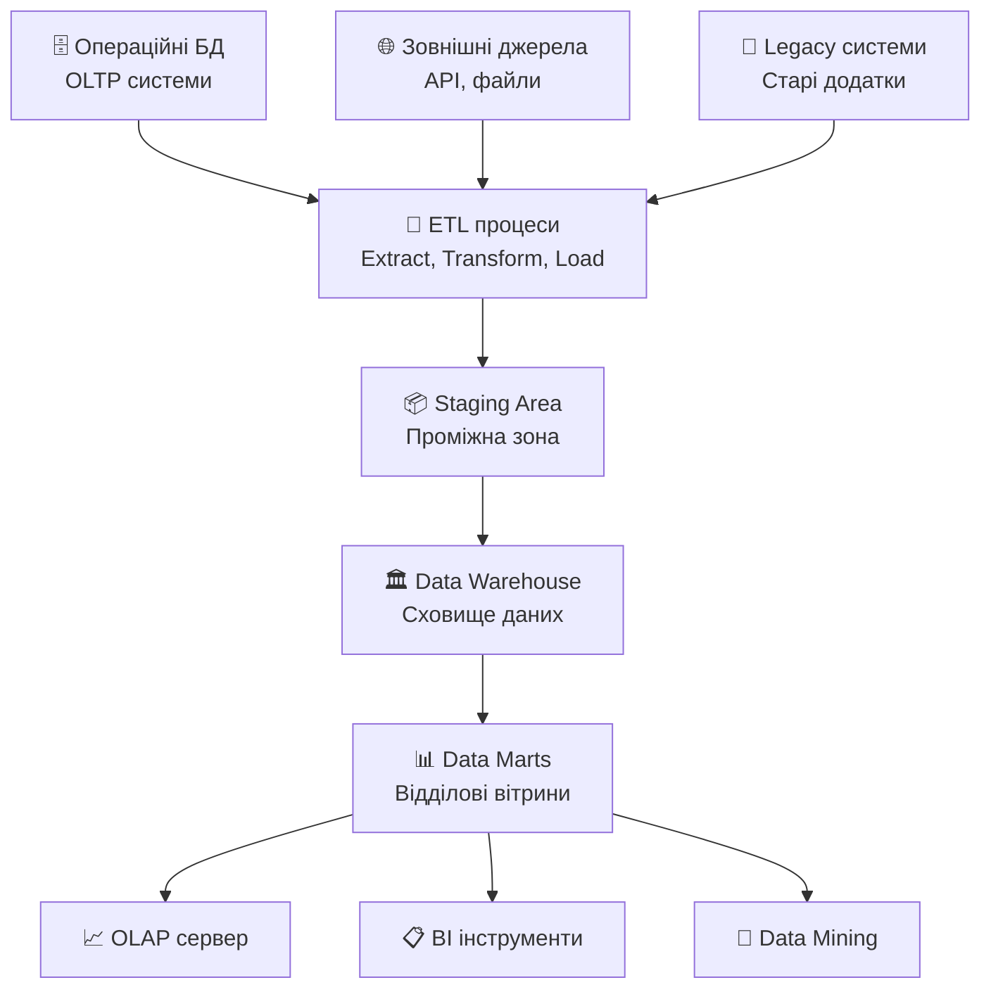
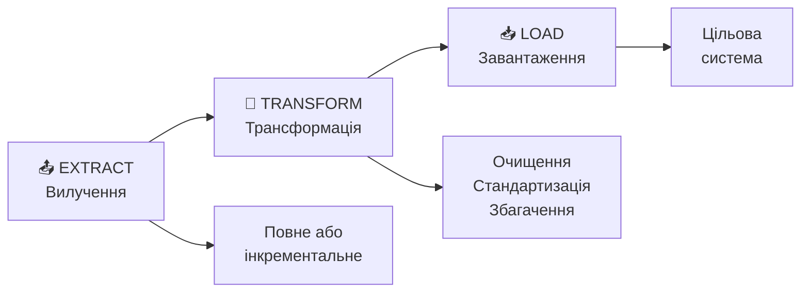
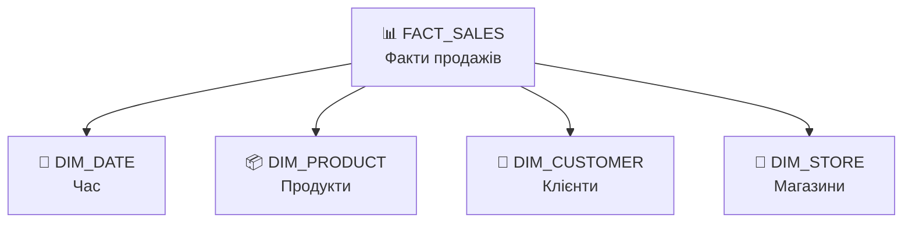
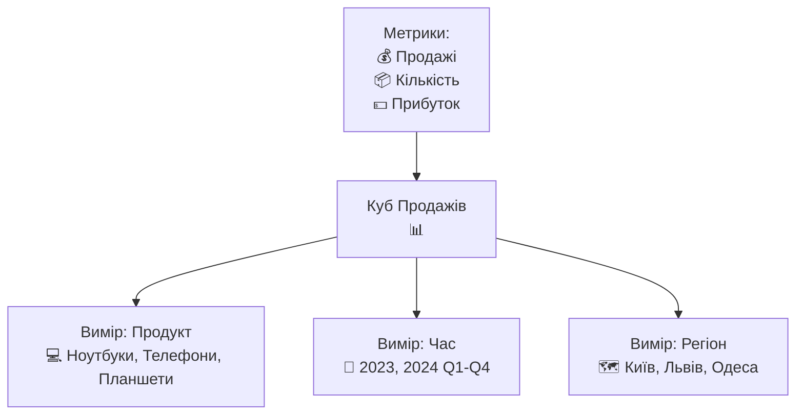
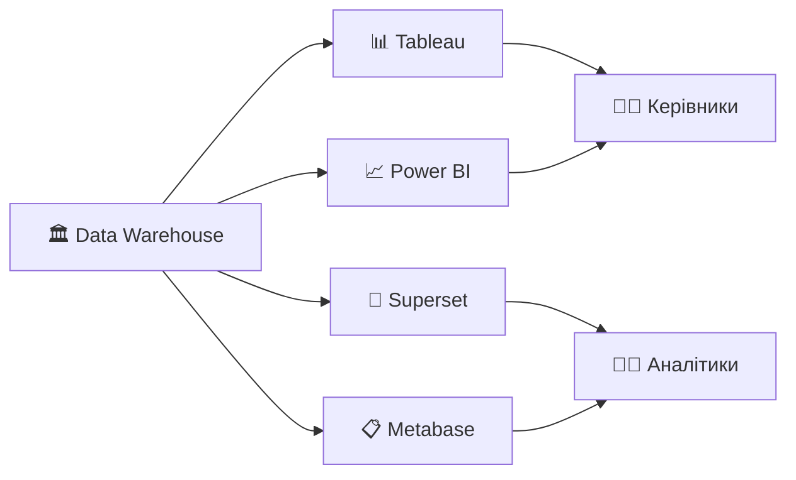
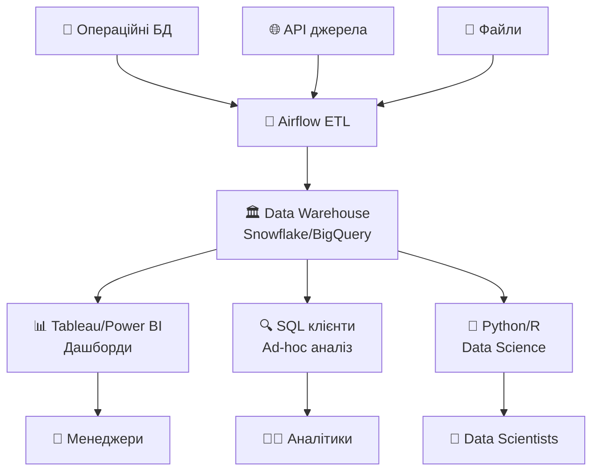

# Системи підтримки прийняття рішень та OLAP

## План лекції

1. OLTP vs OLAP: фундаментальні відмінності
2. Архітектура сховищ даних
3. OLAP операції та багатовимірний аналіз
4. Колонкові СУБД для аналітики
5. Інструменти бізнес-інтелекту

## **📊 Основні концепції**

**Система підтримки прийняття рішень (DSS)** — комп'ютеризована інформаційна система для підтримки управлінської діяльності в умовах складних завдань.

**OLAP (Online Analytical Processing)** — технологія інтерактивного багатовимірного аналізу даних для підтримки прийняття рішень.

**Сховище даних (Data Warehouse)** — предметно-орієнтована, інтегрована, незмінна та історична колекція даних для аналітики.

**Куб даних** — багатовимірне представлення даних, де виміри відповідають характеристикам аналізу, а комірки містять метрики.

## **1. OLTP vs OLAP**

## Фундаментальні відмінності

### 🔄 **Два типи робочих навантажень**

**OLTP (Online Transaction Processing):**
- 💼 Підтримка повсякденних операцій
- ⚡ Короткі, прості транзакції
- 📝 Вставка, оновлення, видалення
- 👥 Тисячі одночасних користувачів
- 🎯 Поточний стан даних

**OLAP (Online Analytical Processing):**
- 📊 Аналітична обробка та звіти
- 🔍 Складні, довготривалі запити
- 📈 Агрегація великих обсягів
- 👨‍💼 Десятки аналітиків
- 📅 Історичні дані за роки

## Порівняльна таблиця

| Характеристика | OLTP | OLAP |
|---|---|---|
| **Призначення** | Операційна діяльність | Аналіз та рішення |
| **Джерело даних** | Поточні дані | Історичні дані |
| **Тип операцій** | INSERT, UPDATE, DELETE | SELECT з агрегацією |
| **Час відгуку** | Мілісекунди | Секунди/хвилини |
| **Нормалізація** | Висока (3НФ+) | Денормалізована |
| **Розмір БД** | Гігабайти | Терабайти |
| **Користувачі** | Співробітники | Аналітики, менеджери |

## Приклади операцій

### 💳 **OLTP: Створення замовлення**

```sql
BEGIN TRANSACTION;

INSERT INTO orders (customer_id, order_date)
VALUES (12345, CURRENT_TIMESTAMP)
RETURNING order_id;

INSERT INTO order_items (order_id, product_id, quantity)
VALUES (98765, 101, 2);

UPDATE products
SET stock_quantity = stock_quantity - 2
WHERE product_id = 101;

COMMIT;
```

**Характеристики:** кілька записів, швидко, актуалізує дані

## Приклади операцій (продовження)

### 📊 **OLAP: Аналіз продажів**

```sql
SELECT
    r.region_name,
    p.category,
    DATE_TRUNC('month', o.order_date) as month,
    SUM(oi.quantity * oi.price) as revenue,
    AVG(oi.quantity * oi.price) as avg_order
FROM orders o
JOIN order_items oi ON o.order_id = oi.order_id
JOIN products p ON oi.product_id = p.product_id
JOIN customers c ON o.customer_id = c.customer_id
JOIN regions r ON c.region_id = r.region_id
WHERE o.order_date >= CURRENT_DATE - INTERVAL '3 years'
GROUP BY r.region_name, p.category, month;
```

**Характеристики:** мільйони записів, множинні JOIN, агрегація

## Конфлікт вимог

### ⚠️ **Чому потрібне розділення?**

**Проблеми аналітики на OLTP:**

1. 🔥 **Конкуренція за ресурси**
   - Складні запити сповільнюють операції
   - Критичні процеси стають повільними

2. 🏗️ **Неоптимальна структура**
   - Нормалізація для транзакцій ≠ для аналітики
   - Багато JOIN для простих звітів

3. 📅 **Обмежена історія**
   - OLTP зберігає поточний стан
   - Аналіз потребує років даних

**Рішення:** Окремі системи для різних навантажень

## **2. Архітектура сховищ даних**

## Компоненти архітектури



## Ключові компоненти

### 1. 🗂️ **Джерела даних**

- Операційні БД відділів
- Зовнішні системи та API
- Файли (CSV, Excel, JSON)
- Legacy додатки

### 2. 📦 **Staging Area (Проміжна зона)**

- Тимчасове зберігання сирих даних
- Валідація перед інтеграцією
- Можливість відновлення при збоях
- Формат близький до джерела

## Ключові компоненти (продовження)

### 3. 🏛️ **Data Warehouse (Сховище)**

- Центральне інтегроване сховище
- Предметно-орієнтована організація
- Повна історія змін
- Дані не видаляються

### 4. 📊 **Data Marts (Вітрини)**

- Підмножини для конкретних відділів
- Оптимізовані для специфічних завдань
- Приклади: вітрини продажів, маркетингу, фінансів

## ETL процес детально

### 🔄 **Extract, Transform, Load**



**Extract:** Читання з різних джерел
**Transform:** Очищення, збагачення, обчислення
**Load:** Завантаження у сховище

## Transform: Ключові операції

### 🔧 **Трансформація даних**

**Очищення:**
- Видалення дублікатів
- Виправлення помилок
- Обробка пропущених значень

**Стандартизація:**
- Уніфікація форматів дат
- Узгодження назв
- Нормалізація адрес

**Збагачення:**
- Додавання географічних координат
- Обчислення похідних показників
- Класифікація та категоризація

## Багатовимірне моделювання

### ⭐ **Зоряна схема (Star Schema)**



**Компоненти:**
- **Факти:** вимірювані показники (продажі, кількість)
- **Виміри:** описові атрибути (що, коли, де, хто)

## Зоряна схема: Структура

### 📋 **Таблиця фактів**

```sql
CREATE TABLE fact_sales (
    sale_id BIGSERIAL PRIMARY KEY,
    date_key INTEGER NOT NULL,
    product_key INTEGER NOT NULL,
    customer_key INTEGER NOT NULL,
    store_key INTEGER NOT NULL,
    quantity INTEGER,
    unit_price DECIMAL(10,2),
    total_amount DECIMAL(12,2),
    profit_amount DECIMAL(12,2),
    FOREIGN KEY (date_key) REFERENCES dim_date(date_key),
    FOREIGN KEY (product_key) REFERENCES dim_product(product_key)
);
```

**Містить:** метрики + зовнішні ключі до вимірів

## Зоряна схема: Виміри

### 📅 **Вимір часу**

```sql
CREATE TABLE dim_date (
    date_key INTEGER PRIMARY KEY,
    full_date DATE NOT NULL,
    day_of_week VARCHAR(10),
    month_name VARCHAR(10),
    quarter_number INTEGER,
    year_number INTEGER,
    is_weekend BOOLEAN,
    is_holiday BOOLEAN,
    holiday_name VARCHAR(50)
);
```

**Характеристики:**
- Денормалізована структура
- Усі часові атрибути в одній таблиці
- Швидкий доступ без JOIN

## Переваги зоряної схеми

### ✅ **Чому зоряна схема?**

**Переваги:**

1. 👍 **Простота розуміння**
   - Інтуїтивна для бізнес-користувачів
   - Відображає бізнес-процеси

2. ⚡ **Висока продуктивність**
   - Мінімум JOIN операцій
   - Швидкі запити

3. 🎯 **Гнучкість аналізу**
   - Легко додавати нові виміри
   - Підтримка різних перспектив

4. 🔧 **Простота супроводу**
   - Зрозуміла структура
   - Легко модифікувати

## **3. OLAP операції**

## Концепція куба даних

### 📦 **Багатовимірне представлення**



**Комірка куба:** перетин вимірів містить метрики
**Приклад:** Продажі ноутбуків у Києві за Q1 2024

## Основні OLAP операції

### 🔍 **П'ять ключових операцій**

1. **Drill-Down** 🔽 — деталізація
   - Рік → Квартал → Місяць → День

2. **Roll-Up** 🔼 — узагальнення
   - День → Місяць → Квартал → Рік

3. **Slice** ✂️ — зріз
   - Фіксація одного виміру

4. **Dice** 🎲 — підкуб
   - Вибірка по кількох вимірах

5. **Pivot** 🔄 — поворот
   - Зміна орієнтації осей

## Drill-Down: Деталізація

### 🔽 **Від загального до конкретного**

```sql
-- Рівень 1: Річні продажі
SELECT year, SUM(revenue)
FROM fact_sales
GROUP BY year;

-- Рівень 2: Квартальні продажі
SELECT year, quarter, SUM(revenue)
FROM fact_sales
WHERE year = 2024
GROUP BY year, quarter;

-- Рівень 3: Місячні продажі
SELECT year, month, SUM(revenue)
FROM fact_sales
WHERE year = 2024 AND quarter = 1
GROUP BY year, month;
```

**Застосування:** пошук причин змін, детальний аналіз

## Roll-Up: Узагальнення

### 🔼 **Від деталей до загального**

```sql
-- Узагальнення від магазинів до регіонів
SELECT
    region_name,
    quarter,
    COUNT(DISTINCT store_id) as stores,
    SUM(total_amount) as total_revenue
FROM fact_sales
JOIN dim_store ON fact_sales.store_key = dim_store.store_key
JOIN dim_region ON dim_store.region_key = dim_region.region_key
GROUP BY region_name, quarter;
```

**Застосування:** бачення загальної картини, стратегічні рішення

## Slice: Зріз куба

### ✂️ **Фіксація одного виміру**

```sql
-- Зріз для січня 2024
SELECT
    product_category,
    region_name,
    SUM(quantity) as units_sold,
    SUM(total_amount) as revenue
FROM fact_sales
JOIN dim_date ON fact_sales.date_key = dim_date.date_key
WHERE dim_date.year = 2024
  AND dim_date.month = 1
GROUP BY product_category, region_name;
```

**Результат:** 2D зріз 3D куба
**Застосування:** аналіз за конкретний період

## Dice: Підкуб

### 🎲 **Обмеження по кількох вимірах**

```sql
-- Вибір підкуба з умовами
SELECT
    product_name,
    region_name,
    month,
    SUM(revenue) as total_revenue
FROM fact_sales
WHERE year = 2024
  AND month BETWEEN 1 AND 6
  AND product_category IN ('Ноутбуки', 'Планшети')
  AND region IN ('Київ', 'Львів')
GROUP BY product_name, region_name, month;
```

**Результат:** менший куб з обраними діапазонами
**Застосування:** фокусований аналіз сегментів

## Pivot: Поворот

### 🔄 **Зміна перспективи**

**До повороту:** Продукти по рядках, місяці по стовпцях

| Продукт | Січень | Лютий | Березень |
|---------|--------|-------|----------|
| Ноутбуки | 100K | 120K | 110K |
| Телефони | 80K | 90K | 85K |

**Після повороту:** Місяці по рядках, продукти по стовпцях

| Місяць | Ноутбуки | Телефони |
|--------|----------|----------|
| Січень | 100K | 80K |
| Лютий | 120K | 90K |
| Березень | 110K | 85K |

## Типи OLAP архітектур

### 🏗️ **Три підходи**

**MOLAP (Multidimensional OLAP):**
- 📊 Багатовимірні масиви
- ⚡ Найшвидший аналіз
- 💾 Обмеження розміру

**ROLAP (Relational OLAP):**
- 🗄️ Реляційна БД
- 📈 Великі обсяги
- 🐌 Повільніші запити

**HOLAP (Hybrid OLAP):**
- 🔄 Комбінація підходів
- 📊 Агрегати в MOLAP
- 🗄️ Деталі в ROLAP

## **4. Колонкові СУБД**

## Рядкове vs Колонкове зберігання

### 📦 **Фундаментальна відмінність**

```mermaid
graph TB
    subgraph Рядкове
        R1[ID:1 | Name:Ivan | Age:25 | City:Kyiv]
        R2[ID:2 | Name:Maria | Age:30 | City:Lviv]
    end

    subgraph Колонкове
        C1[ID: 1 | 2 | 3]
        C2[Name: Ivan | Maria | Petro]
        C3[Age: 25 | 30 | 28]
        C4[City: Kyiv | Lviv | Kyiv]
    end
```

**Рядкове:** всі поля запису разом
**Колонкове:** всі значення стовпця разом

## Переваги колонкового зберігання

### ✅ **Чому колонки для аналітики?**

**1. 📊 Ефективність вибірки**
```sql
SELECT city, AVG(age)
FROM users
GROUP BY city;
```
- Рядкове: читає ВСІ стовпці
- Колонкове: читає ТІЛЬКИ city та age

**2. 🗜️ Краще стиснення**
- Подібні значення стискаються ефективніше
- Економія 10x-100x місця

## Переваги колонкового зберігання (2)

### ✅ **Продовження переваг**

**3. ⚡ Векторизація**
- SIMD інструкції процесора
- Пакетна обробка даних
- Швидкість 10x-100x

**4. 📈 Ефективна агрегація**
```sql
SELECT SUM(sales), AVG(profit)
FROM fact_sales
WHERE year = 2024;
```
- Послідовні дані в пам'яті
- Швидке обчислення статистик

## ClickHouse

### ⚡ **Швидка колонкова СУБД**

**Характеристики:**
- Створена Yandex для веб-аналітики
- Мільярди записів за секунди
- SQL-сумісна

**Приклад:**
```sql
CREATE TABLE analytics (
    date Date,
    user_id UInt32,
    action String,
    duration UInt32
) ENGINE = MergeTree()
PARTITION BY toYYYYMM(date)
ORDER BY (user_id, date);
```

**Використання:** реклама, веб-аналітика, логи

## Інші колонкові СУБД

### 🗄️ **Екосистема колонкових систем**

**Amazon Redshift:**
- ☁️ Хмарне сховище даних
- 🔄 Автоматичне масштабування
- 💰 Оплата за використання

**Google BigQuery:**
- 🚀 Serverless
- 📊 Петабайти даних
- 🤖 Вбудоване ML

**Apache Druid:**
- ⏱️ Реальний час
- 📈 Часові ряди
- 🎯 Sub-second запити

## **5. BI інструменти**

## Екосистема бізнес-інтелекту

### 📊 **Інструменти візуалізації**



**Призначення:** перетворення даних у зрозумілі інсайти

## Популярні BI платформи

### 1. 📊 **Tableau**

**Переваги:**
- Інтуїтивний drag-and-drop інтерфейс
- Потужна візуалізація
- Підключення до десятків джерел

**Використання:**
- Інтерактивні дашборди
- Ad-hoc аналіз
- Презентації для керівництва

**Недоліки:**
- Висока вартість
- Складне масштабування

## Популярні BI платформи (2)

### 2. 📈 **Power BI (Microsoft)**

**Переваги:**
- Інтеграція з екосистемою Microsoft
- Доступна ціна
- Desktop версія безкоштовна

**Особливості:**
- DAX мова для обчислень
- Природня інтеграція з Excel
- Хмарний та on-premise варіанти

**Підходить для:**
- Організацій на Microsoft стеку
- Середнього та малого бізнесу

## Популярні BI платформи (3)

### 3. 🔧 **Apache Superset**

**Переваги:**
- ✅ Відкритий код (безкоштовний)
- 🎨 Сучасний інтерфейс
- 📊 Широкий вибір візуалізацій

**Особливості:**
- Підтримка SQL Lab для ad-hoc запитів
- Інтеграція з більшістю БД
- Можливість самостійного хостингу

**Підходить для:**
- Технічних команд
- Організацій з обмеженим бюджетом

## Типова аналітична архітектура



## Приклад інтеграції

### 🔄 **ETL з Apache Airflow**

```python
from airflow import DAG
from datetime import datetime, timedelta

dag = DAG(
    'daily_sales_etl',
    schedule_interval='0 2 * * *',  # Щодня о 2:00
    start_date=datetime(2024, 1, 1)
)

extract_task = PythonOperator(
    task_id='extract_sales',
    python_callable=extract_from_oltp
)

transform_task = PythonOperator(
    task_id='transform_data',
    python_callable=clean_and_aggregate
)

load_task = PythonOperator(
    task_id='load_to_warehouse',
    python_callable=load_to_dwh
)

extract_task >> transform_task >> load_task
```

## Приклад аналітичного звіту

### 📊 **KPI дашборд**

```sql
-- Ключові показники за місяць
WITH monthly_stats AS (
    SELECT
        COUNT(DISTINCT order_id) as orders,
        SUM(total_amount) as revenue,
        AVG(total_amount) as avg_order,
        COUNT(DISTINCT customer_id) as customers
    FROM fact_sales
    WHERE date_key >= DATE_TRUNC('month', CURRENT_DATE)
)
SELECT
    orders,
    revenue,
    avg_order,
    customers,
    revenue / customers as revenue_per_customer
FROM monthly_stats;
```

**Візуалізація:** карточки з трендами, графіки

## Best Practices

### 💡 **Рекомендації**

**Проєктування сховища:**
- ⭐ Використовуйте зоряну схему для простоти
- 📅 Детальний вимір часу
- 🔑 Сурогатні ключі замість природних
- 📊 Попередньо агреговані факти

**ETL процеси:**
- 🔄 Інкрементальне завантаження
- ✅ Валідація даних
- 📝 Логування та моніторинг
- 🔧 Ідемпотентність операцій

## Best Practices (2)

### 💡 **Продовження рекомендацій**

**Продуктивність:**
- 📊 Партиціонування великих таблиць
- 🗂️ Індекси на ключах з'єднань
- 💾 Матеріалізовані представлення
- 📈 Статистика для оптимізатора

**Безпека та управління:**
- 🔒 Row-level security для конфіденційних даних
- 👥 Розмежування доступу за ролями
- 📝 Документація метаданих
- 🔄 Версіонування ETL скриптів

## **Висновки**

## Ключові висновки

### 📌 **Що ми вивчили**

**1. Розділення навантажень**
- OLTP для операцій, OLAP для аналізу
- Різні вимоги → різні системи
- Конфлікт неможливо розв'язати в одній БД

**2. Архітектура сховищ**
- ETL як серце інтеграції даних
- Зоряна схема для інтуїтивного моделювання
- Багатовимірні куби для аналізу

## Ключові висновки (2)

### 📌 **Продовження**

**3. OLAP можливості**
- П'ять базових операцій для дослідження
- Різні архітектури (MOLAP, ROLAP, HOLAP)
- Баланс між швидкістю та гнучкістю

**4. Колонкове зберігання**
- Революція в аналітичній продуктивності
- 10x-100x прискорення для типових запитів
- ClickHouse, Redshift, BigQuery

**5. BI екосистема**
- Інструменти для всіх типів користувачів
- Від технічних до бізнес-орієнтованих

## Практичні рекомендації

### 🎯 **Вибір технологій**

**Для малого бізнесу:**
- PostgreSQL + Power BI
- Metabase для простих звітів

**Для середнього бізнесу:**
- Snowflake/BigQuery
- Tableau/Power BI
- dbt для трансформацій

**Для enterprise:**
- Спеціалізовані колонкові СУБД
- Повна BI платформа
- Data governance інструменти

## Тенденції розвитку

### 🚀 **Майбутнє аналітики**

**Emerging напрямки:**

1. **🤖 AI-powered аналітика**
   - Автоматичне виявлення інсайтів
   - Природномовні запити
   - Прогнозна аналітика

2. **⚡ Реальний час**
   - Streaming analytics
   - Operational intelligence
   - Instant decision-making

3. **☁️ Cloud-native**
   - Serverless warehouses
   - Автоматичне масштабування
   - Pay-per-query моделі
