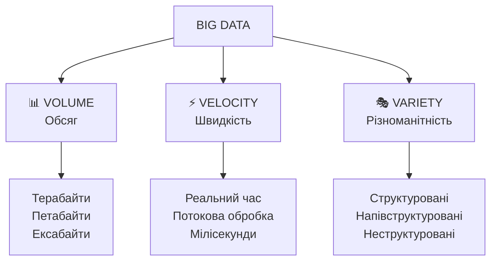
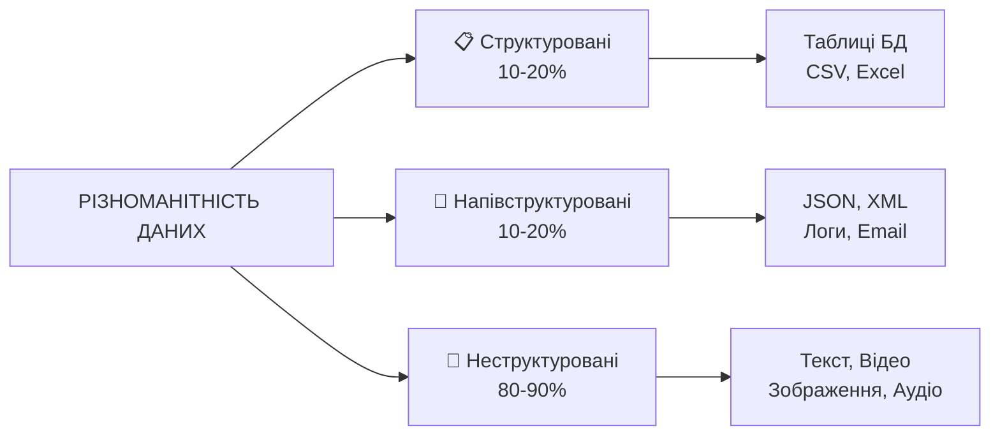
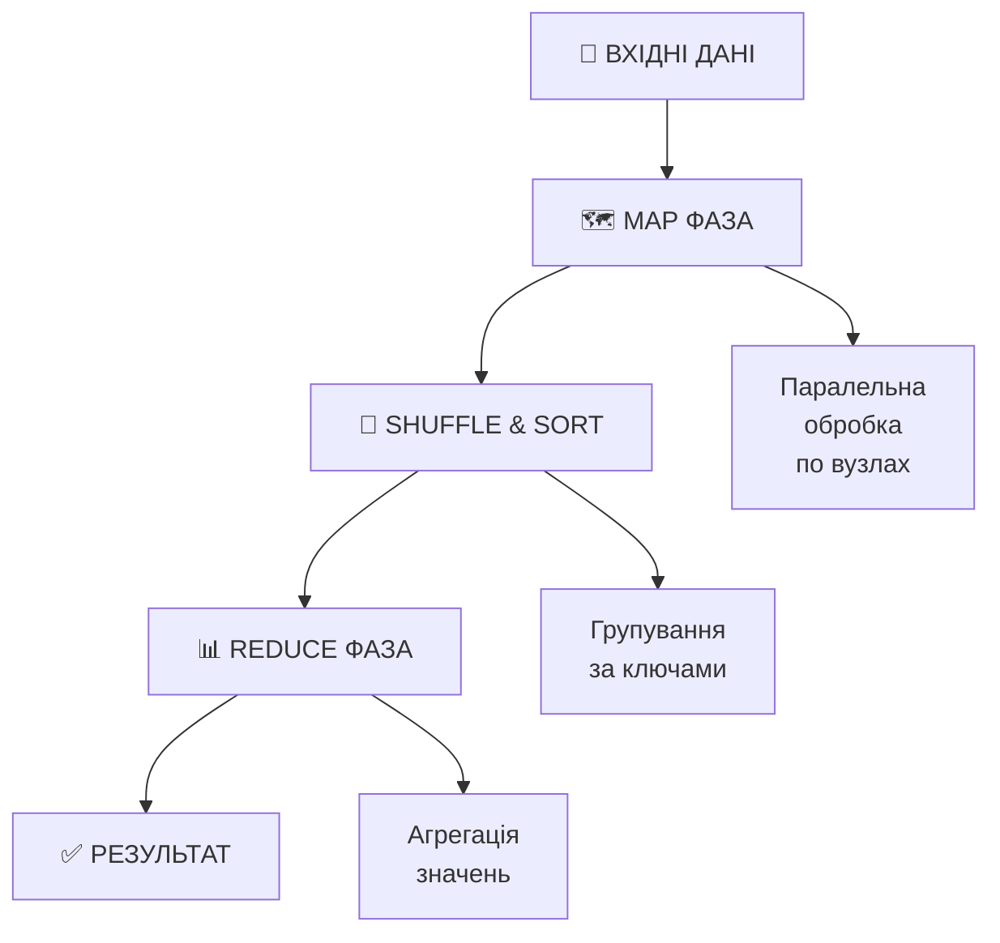
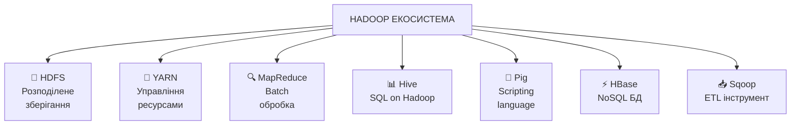
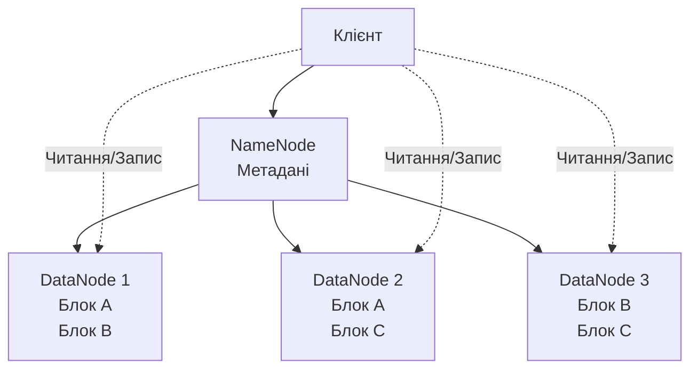
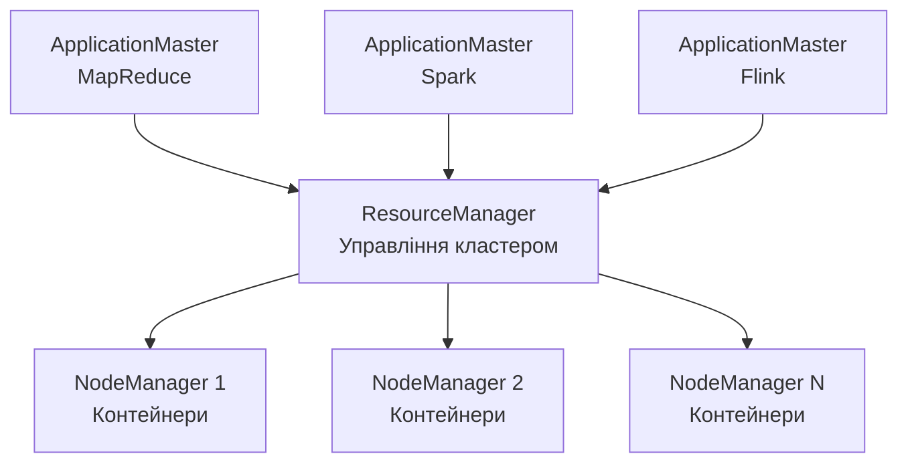
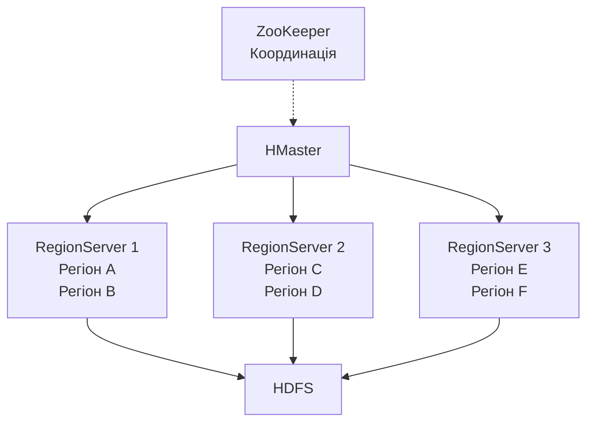
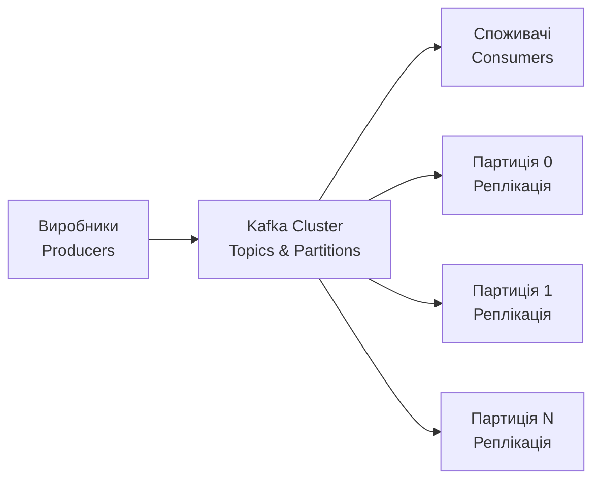
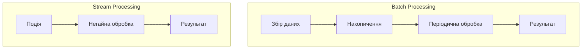
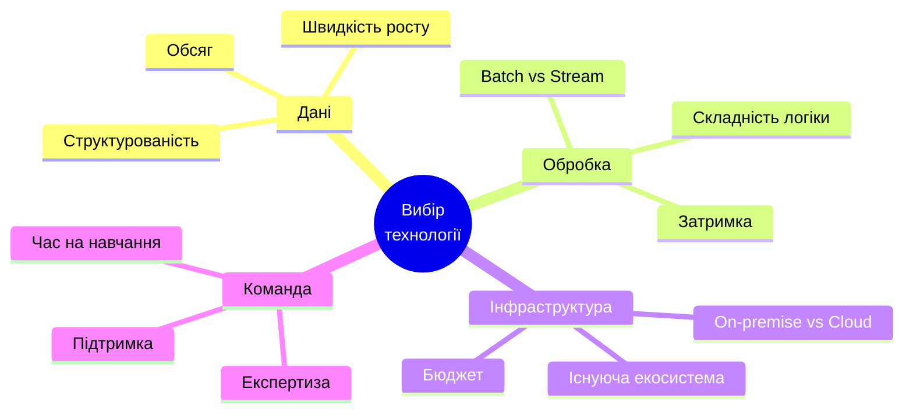

# Обробка великих обсягів даних (Big Data)

## План лекції

1. Характеристики Big Data
2. Розподілені обчислювальні парадигми
3. Hadoop екосистема
4. NoSQL системи для Big Data
5. Потокова обробка даних

---

## Що таке Big Data?

## 🌐 Big Data у цифрах

**Щодня у світі:**

- 📧 **333 мільярди** електронних листів
- 🎥 **720,000 годин** відео на YouTube
- 📱 **500 мільйонів** твітів
- 💳 **5 мільярдів** пошукових запитів Google
- 🏭 **1 ексабайт** даних IoT сенсорів

**Проблема:** Традиційні СУБД не справляються з такими обсягами

---

## Модель 3V

## Базові характеристики Big Data



---

## Volume (Обсяг)

## 📊 Volume — Величезні обсяги даних

**Приклади масштабів:**

**Соціальні мережі:**
- Facebook: **4 PB** даних щодня
- YouTube: **500 годин** відео щохвилини
- Twitter: **500 млн** твітів щодня

**Наука:**
- Великий адронний колайдер: **30 PB** щороку
- Square Kilometre Array: **1 EB** щодня

**IoT:**
- Автономний автомобіль: **4 TB** щодня

---

## Velocity (Швидкість)

## ⚡ Velocity — Швидкість генерації

**Критичні сценарії:**

**Фінансовий трейдинг:**
- Мільйони транзакцій за **мілісекунди**
- Виявлення шахрайства в **реальному часі**

**Соціальні мережі:**
- Піки навантаження під час подій
- Рекомендації миттєво

**Моніторинг:**
- Виявлення вторгнень
- Аварійна сигналізація
- Медичний моніторинг

---

## Variety (Різноманітність)

## 🎭 Variety — Різні типи даних



**Виклик:** Обробка різнорідних даних єдиною системою

---

## Розширена модель 5V

## Додаткові виміри Big Data

**4️⃣ Veracity (Достовірність):**
- ✅ Якість та надійність даних
- ❌ Неточності та помилки
- 🔍 Неповнота інформації
- ⚠️ Суперечливість джерел

**5️⃣ Value (Цінність):**
- 💎 Виявлення корисних інсайтів
- 📉 Низьке співвідношення сигнал/шум
- 🎯 Контекст та інтерпретація

---

## MapReduce — концепція

## MapReduce парадигма



**Ключова ідея:** Розбити задачу на незалежні частини

---

## MapReduce — приклад

## Підрахунок слів (Word Count)

**Вхідні дані:**
```
"databases are important"
"databases store data"
```

**Map фаза:**
```
(databases, 1), (are, 1), (important, 1)
(databases, 1), (store, 1), (data, 1)
```

**Shuffle & Sort:**
```
databases: [1, 1]
are: [1]
important: [1]
store: [1]
data: [1]
```

**Reduce фаза:**
```
(databases, 2), (are, 1), (important, 1), (store, 1), (data, 1)
```

---

## Apache Spark

## ⚡ Apache Spark — швидкість та зручність

**Основні переваги:**

📊 **In-Memory обробка:**
- Дані в пам'яті між операціями
- **10-100x швидше** за MapReduce

🔧 **Єдина платформа:**
- Batch обробка
- Потокова обробка (Streaming)
- SQL запити
- Машинне навчання (MLlib)
- Обробка графів (GraphX)

💻 **Зручні API:**
- Scala, Python, Java, R
- Інтерактивні оболонки

---

## Spark vs MapReduce

## Порівняння продуктивності

| Характеристика | MapReduce | Spark |
|----------------|-----------|-------|
| **Швидкість** | Базова | **10-100x швидше** |
| **Ітеративні алгоритми** | Повільно | **Ефективно** |
| **Зручність розробки** | Складна | **Проста** |
| **Обробка в пам'яті** | ❌ | ✅ |
| **Інтерактивний режим** | ❌ | ✅ |
| **Універсальність** | Batch only | **Batch + Streaming** |

---

## Hadoop екосистема

## 🐘 Apache Hadoop



---

## HDFS архітектура

## HDFS — Hadoop Distributed File System



**Особливості:**
- 📦 Блоки 128-256 MB
- 🔄 Реплікація (зазвичай 3 копії)
- 🎯 Write-once, read-many

---

## YARN архітектура

## YARN — Yet Another Resource Negotiator



**Переваги:** Кілька фреймворків на одному кластері

---

## Cassandra

## Apache Cassandra — NoSQL для Big Data

**Архітектурні принципи:**

🌐 **Peer-to-peer:** Немає єдиної точки відмови

📍 **Розподілення:** Консистентне хешування

🔄 **Реплікація:** Настроювана кількість копій

⚖️ **Консистентність:** Настроюваний рівень (ONE, QUORUM, ALL)

**Випадки використання:**
- 📈 Великі обсяги записів
- ⏱️ Часові ряди даних
- 🌍 Глобальний розподіл

---

## Cassandra модель даних

## Wide-Column модель

```sql
-- Приклад таблиці в Cassandra
CREATE TABLE sensor_data (
    sensor_id text,
    timestamp timestamp,
    temperature decimal,
    humidity decimal,
    PRIMARY KEY (sensor_id, timestamp)
) WITH CLUSTERING ORDER BY (timestamp DESC);

-- Ефективний запит
SELECT * FROM sensor_data
WHERE sensor_id = 'sensor_001'
  AND timestamp > '2024-01-01'
  AND timestamp < '2024-01-31';
```

**Особливість:** Проектування під запити (query-driven design)

---

## HBase

## Apache HBase — HDFS NoSQL

**Архітектура:**



**Використання:** Випадковий доступ до великих таблиць

---

## Apache Kafka

## Kafka — платформа потокової обробки



**Можливості:**
- 📊 Трильйони подій на день
- 🔒 Довговічне зберігання
- ⚡ Низька затримка
- 📈 Горизонтальне масштабування

---

## Гарантії доставки Kafka

## Моделі доставки повідомлень

**1️⃣ At-most-once:**
- ❌ Можливі втрати
- ✅ Немає дублів
- ⚡ Найшвидше

**2️⃣ At-least-once:**
- ✅ Без втрат
- ❌ Можливі дублі
- 🔄 Потрібна ідемпотентність

**3️⃣ Exactly-once:**
- ✅ Без втрат
- ✅ Без дублів
- 🐢 Найповільніше

---

## Потокова обробка

## Системи Stream Processing

| Система | Особливості | Використання |
|---------|-------------|--------------|
| **Kafka Streams** | Бібліотека Java<br/>Проста інтеграція | Трансформації Kafka |
| **Storm** | Низька затримка<br/>At-least-once | Реал-тайм аналітика |
| **Spark Streaming** | Мікробатчі<br/>Інтеграція з Spark | Batch + Streaming |
| **Flink** | Справжній streaming<br/>Exactly-once | Складна stateful обробка |

---

## Apache Flink

## Flink — справжнє потокове streaming

**Ключові особливості:**

⚡ **True streaming:** Не мікробатчі, справжня обробка подій

⏰ **Event time:** Коректна обробка при затримках

💾 **Stateful:** Складні вікна, join'и, pattern matching

✅ **Exactly-once:** Гарантії без дублювання

🔄 **Checkpointing:** Автоматичне збереження стану

---

## Порівняння архітектур

## Batch vs Streaming



**Вибір залежить від:**
- ⏱️ Вимоги до затримки
- 📊 Складності обробки
- 💰 Вартості інфраструктури

---

## Випадки використання

## Реальні застосування Big Data

**🏦 Фінанси:**
- Виявлення шахрайства в реал-таймі
- Високочастотний трейдинг
- Аналіз ризиків

**🛒 E-commerce:**
- Рекомендаційні системи
- Персоналізація контенту
- Аналіз поведінки користувачів

**🏭 IoT та промисловість:**
- Предиктивне обслуговування
- Оптимізація процесів
- Моніторинг обладнання

---

## Виклики Big Data

## Основні проблеми та рішення

**📊 Якість даних:**
- Очищення та валідація
- Виявлення аномалій
- Управління метаданими

**🔒 Безпека:**
- Шифрування даних
- Контроль доступу
- Аудит операцій

**💰 Вартість:**
- Оптимізація зберігання
- Хмарні рішення
- Стиснення даних

**👥 Кадри:**
- Дефіцит спеціалістів
- Навчання персоналу
- Інструменти для аналітиків

---

## Вибір технології

## Як обрати правильну технологію?



---

## Рекомендації по технологіям

## Практичні поради

**📊 Batch аналітика:**
- Hadoop + Hive для великих обсягів
- Spark для швидкості та зручності

**⚡ Реал-тайм обробка:**
- Kafka для передачі даних
- Flink для складної логіки
- Storm для простих сценаріїв

**💾 Зберігання:**
- HDFS для batch даних
- Cassandra для часових рядів
- HBase для випадкового доступу

---

## Майбутнє Big Data

## Тренди та перспективи

**🤖 AI/ML інтеграція:**
- Автоматична оптимізація
- Інтелектуальна аналітика
- AutoML для Big Data

**☁️ Serverless Big Data:**
- Автоматичне масштабування
- Оплата за використання
- Спрощене управління

**🔗 Real-time всюди:**
- Зникнення різниці між batch та streaming
- Continuous intelligence
- Edge computing

---

## Висновки

✅ **Big Data — це 5V:** Volume, Velocity, Variety, Veracity, Value

✅ **Розподілені обчислення:** MapReduce → Spark для ефективної обробки

✅ **Hadoop екосистема:** HDFS, YARN та компоненти для комплексного рішення

✅ **NoSQL для масштабу:** Cassandra, HBase для петабайтів даних

✅ **Потокова обробка:** Kafka, Flink для реал-тайм аналітики

**Головне:** Вибір технології залежить від конкретних вимог
