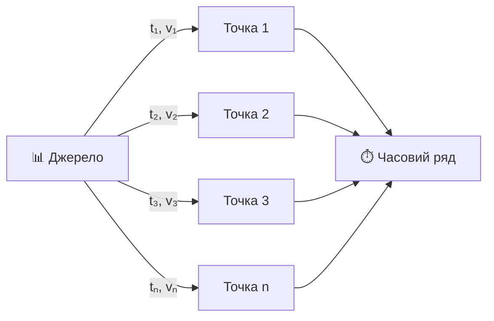
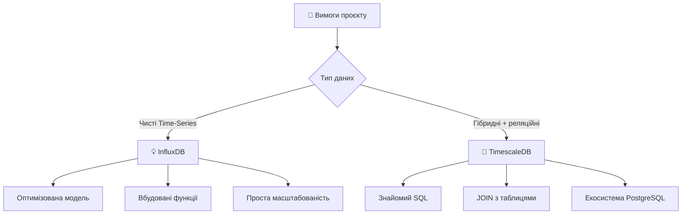
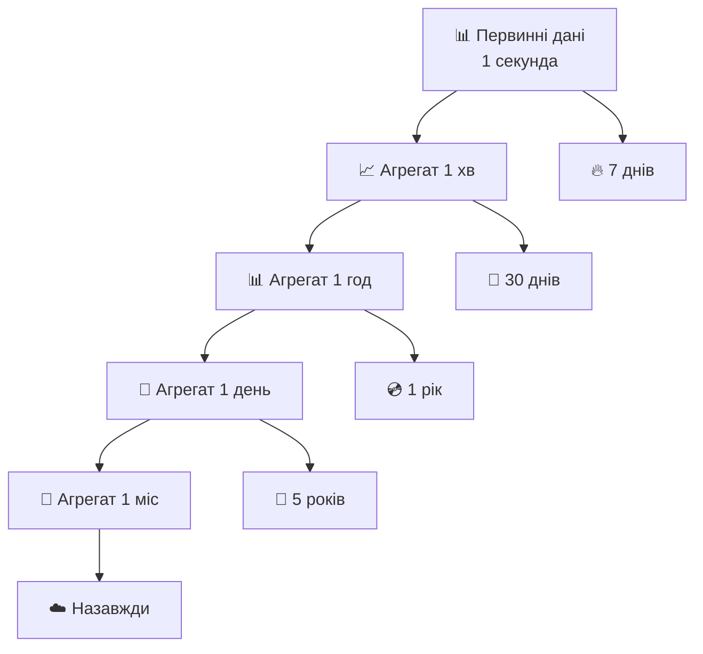
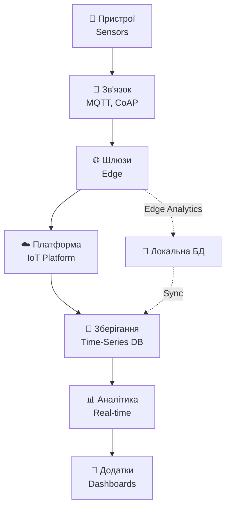
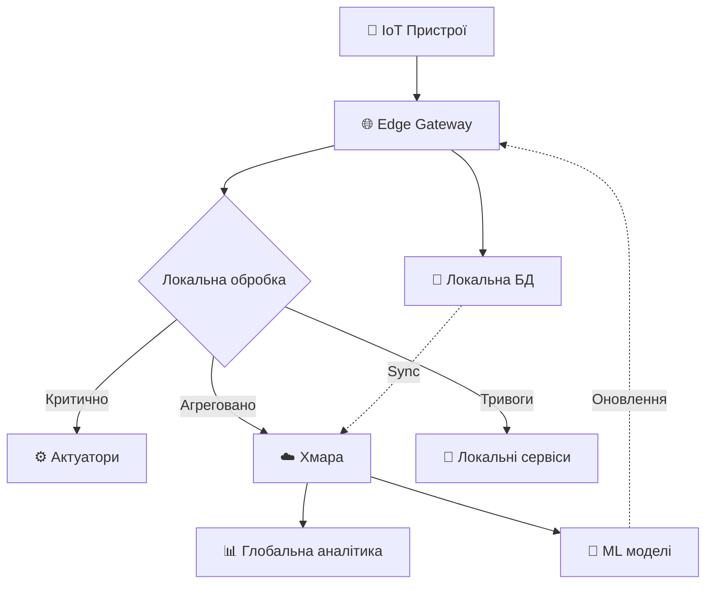
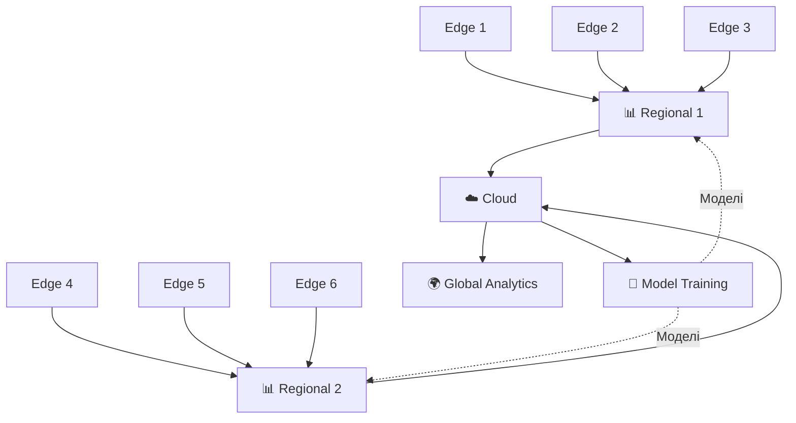

# Часові ряди та IoT системи

## План лекції

1. Специфіка часових рядів
2. Архітектура time-series баз даних
3. Компресія та агрегація даних
4. Internet of Things: збір та зберігання
5. Edge computing та розподілена аналітика

## Що таке часові ряди?

**Часовий ряд** — впорядкована послідовність числових значень, кожне з яких асоційоване з певним моментом часу.

**Математично:** {(t₁, v₁), (t₂, v₂), ..., (tₙ, vₙ)}



**Приклади:**
- Температура сенсорів кожні 10 секунд
- Ціни акцій щохвилини
- Метрики серверів в реальному часі

## Основні властивості часових рядів

### 🔄 **Монотонність часу**

tᵢ < tᵢ₊₁ — часові позначки завжди зростають

### 📍 **Обов'язкова часова прив'язка**

Без часової позначки дані втрачають контекст

### 🔒 **Незмінність історії**

Минуле не змінюється — рідкісні оновлення

### ⚡ **Висока швидкість надходження**

Тисячі-мільйони точок даних на секунду

## Типи часових рядів

### 📅 **Регулярні часові ряди**

Фіксовані інтервали між вимірюваннями

```sql
-- Температура кожні 10 секунд
CREATE TABLE temperature_readings (
    sensor_id INTEGER,
    measured_at TIMESTAMP NOT NULL,
    temperature_celsius DECIMAL(5,2),
    PRIMARY KEY (sensor_id, measured_at)
);

INSERT INTO temperature_readings VALUES
    (101, '2025-01-15 10:00:00', 22.5),
    (101, '2025-01-15 10:00:10', 22.6),
    (101, '2025-01-15 10:00:20', 22.4);
```

### 🎯 **Нерегулярні часові ряди**

Змінні інтервали, реагування на події

## Виклики роботи з часовими рядами

### 💾 **Високий об'єм даних**

**1 датчик, 1 с інтервал:**
- 86,400 записів/день
- 2.6M записів/місяць
- 31.5M записів/рік

**При масштабуванні на тисячі датчиків — астрономічні обсяги**

### ⚡ **Швидкий запис**

Традиційні B-tree індекси неефективні

### 🗜️ **Необхідність компресії**

Висока кореляція між сусідніми значеннями

### 🔥 **Гарячі vs Холодні дані**

Багаторівневе зберігання для оптимізації

## Архітектура баз даних для часових рядів

### 📊 **InfluxDB**

Спеціалізована БД для часових рядів

**Ключові особливості:**
- Log-structured merge-tree
- Власна мова Flux
- Retention policies
- Теги для індексування

```
# Структура точки даних
measurement,tag_key=tag_value field_key=field_value timestamp

# Приклад
temperature,sensor=sensor_01,location=room_1 value=22.5 1642248000000000000

# Декілька полів
weather,location=kyiv temperature=15.2,humidity=65,pressure=1013
```

## InfluxDB: Flux запити

```sql
-- Середня температура за годину
from(bucket: "sensors")
  |> range(start: -1h)
  |> filter(fn: (r) => r._measurement == "temperature")
  |> filter(fn: (r) => r.sensor == "sensor_01")
  |> aggregateWindow(every: 5m, fn: mean)
  |> yield(name: "mean_temperature")

-- Retention policy
CREATE RETENTION POLICY "one_week" ON "sensors"
    DURATION 7d
    REPLICATION 1
    DEFAULT
```

**✅ Переваги:** Оптимізована модель, вбудована аналітика
**⚠️ Недоліки:** Нестандартна мова запитів

## TimescaleDB

**PostgreSQL + Time-Series оптимізації**

### 🔄 **Гіпертаблиці (Hypertables)**

Виглядає як звичайна таблиця, всередині — автоматичне партиціонування

```sql
-- Створення таблиці
CREATE TABLE sensor_data (
    time TIMESTAMPTZ NOT NULL,
    sensor_id INTEGER NOT NULL,
    temperature DOUBLE PRECISION,
    humidity DOUBLE PRECISION
);

-- Перетворення на гіпертаблицю
SELECT create_hypertable('sensor_data', 'time');

-- Працює як звичайна таблиця
INSERT INTO sensor_data VALUES (NOW(), 1, 22.5, 65);
SELECT * FROM sensor_data WHERE time > NOW() - INTERVAL '1 hour';
```

## TimescaleDB: Компресія та політики

```sql
-- Увімкнення компресії
ALTER TABLE sensor_data SET (
    timescaledb.compress,
    timescaledb.compress_segmentby = 'sensor_id',
    timescaledb.compress_orderby = 'time DESC'
);

-- Автоматична компресія через 7 днів
SELECT add_compression_policy('sensor_data', INTERVAL '7 days');

-- Retention policy
SELECT add_retention_policy('sensor_data', INTERVAL '90 days');
```

**🎯 Коефіцієнт компресії: 90-95%**

## Порівняння InfluxDB vs TimescaleDB



## Методи компресії часових даних

### 📉 **Delta Encoding**

Зберігання різниць замість абсолютних значень

```python
original_values = [1000, 1005, 1003, 1007, 1010, 1008]

base_value = 1000
deltas = [5, -2, 4, 3, -2]

# Економія простору за рахунок менших чисел
```

### 🔤 **Dictionary Encoding**

Словник унікальних значень + компактні посилання

### ⚡ **Gorilla Compression**

XOR операції для плаваючої коми (Facebook)

**Типовий коефіцієнт: 10-20x компресія**

## Багаторівнева агрегація



**Принцип:** Деталі свіжі, історія агрегована

## Continuous Aggregates в TimescaleDB

```sql
-- Щохвилинні агрегати
CREATE MATERIALIZED VIEW sensor_data_1min
WITH (timescaledb.continuous) AS
SELECT
    time_bucket('1 minute', time) AS minute,
    sensor_id,
    avg(temperature) as avg_temp,
    min(temperature) as min_temp,
    max(temperature) as max_temp,
    count(*) as sample_count
FROM sensor_data
GROUP BY minute, sensor_id;

-- Політика оновлення
SELECT add_continuous_aggregate_policy('sensor_data_1min',
    start_offset => INTERVAL '3 hours',
    end_offset => INTERVAL '1 hour',
    schedule_interval => INTERVAL '1 hour');
```

## Архітектура IoT систем



## MQTT: Протокол для IoT

**Message Queuing Telemetry Transport** — легкий протокол pub/sub

```python
# MQTT клієнт на пристрої
import paho.mqtt.client as mqtt
import json

class IoTSensor:
    def __init__(self, sensor_id, broker):
        self.sensor_id = sensor_id
        self.client = mqtt.Client()
        self.client.connect(broker, 1883, 60)

    def publish_data(self):
        data = {
            'sensor_id': self.sensor_id,
            'timestamp': datetime.utcnow().isoformat(),
            'temperature': 22.5,
            'humidity': 65
        }
        topic = f"sensors/{self.sensor_id}/data"
        self.client.publish(topic, json.dumps(data))
```

**✅ Переваги:** Легкий, надійний, масштабований

## Збір даних від IoT пристроїв

```python
# MQTT брокер + InfluxDB
class IoTDataCollector:
    def __init__(self):
        self.mqtt_client = mqtt.Client()
        self.mqtt_client.on_message = self.on_message
        self.mqtt_client.subscribe("sensors/+/data")

        self.influx_client = InfluxDBClient(url="http://localhost:8086")

    def on_message(self, client, userdata, msg):
        data = json.loads(msg.payload)

        # Запис в InfluxDB
        point = Point("sensor_reading") \
            .tag("sensor_id", data['sensor_id']) \
            .field("temperature", data['temperature']) \
            .field("humidity", data['humidity']) \
            .time(data['timestamp'])

        self.influx_client.write(bucket="sensors", record=point)
```

## Пакетна обробка для продуктивності

```python
class BatchedCollector:
    def __init__(self, batch_size=1000, flush_interval=60):
        self.batch = []
        self.batch_size = batch_size
        self.flush_interval = flush_interval

    def add_reading(self, data):
        self.batch.append(data)

        # Flush при досягненні розміру або часу
        if (len(self.batch) >= self.batch_size or
            time.time() - self.last_flush >= self.flush_interval):
            self.flush()

    def flush(self):
        # Пакетний запис в БД
        self.influx_client.write(bucket="sensors", record=self.batch)
        self.batch = []
```

**📊 Продуктивність: 100x покращення vs одиночні записи**

## Потокова обробка даних

### ⚡ **Apache Kafka для IoT**

```python
# Stream processing з Kafka
class IoTStreamProcessor:
    def __init__(self):
        self.consumer = KafkaConsumer('sensor-raw-data')
        self.producer = KafkaProducer('sensor-alerts')

    def process_stream(self):
        window_buffer = []

        for message in self.consumer:
            data = message.value
            window_buffer.append(data)

            # Ковзне вікно
            if len(window_buffer) == 10:
                avg_temp = sum(d['temperature'] for d in window_buffer) / 10

                # Виявлення аномалій
                if abs(data['temperature'] - avg_temp) > 5:
                    alert = {'sensor_id': data['sensor_id'],
                             'anomaly': 'temperature'}
                    self.producer.send('sensor-alerts', alert)
```

## Виявлення аномалій в реальному часі

### 📊 **Z-Score метод**

```python
class AnomalyDetector:
    def __init__(self, window_size=100, threshold=3.0):
        self.window = deque(maxlen=window_size)
        self.threshold = threshold

    def detect(self, value):
        self.window.append(value)

        if len(self.window) < window_size:
            return False

        mean = np.mean(self.window)
        std = np.std(self.window)

        z_score = abs((value - mean) / std)
        return z_score > self.threshold

# Використання
detector = AnomalyDetector()
if detector.detect(reading['temperature']):
    print(f"🚨 Аномалія: {reading['temperature']}")
```

## Edge Computing: Концепція

**Обчислення на краю мережі** — обробка даних ближче до джерел



## Переваги Edge Computing

### ⚡ **Знижена латентність**

Миттєві рішення без звернення до хмари

### 📡 **Економія пропускної здатності**

Локальна фільтрація та агрегація

### 🔒 **Підвищена приватність**

Чутливі дані залишаються локально

### 🔄 **Автономність**

Робота при втраті зв'язку з хмарою

## Edge Gateway: Архітектура

```python
class EdgeGateway:
    def __init__(self):
        self.local_db = sqlite3.connect('edge_buffer.db')
        self.decision_rules = self.load_rules()

    def process_reading(self, reading):
        # 1. Локальне зберігання
        self.store_locally(reading)

        # 2. Локальна аналітика
        analysis = self.analyze_locally(reading)

        # 3. Критичні рішення
        if analysis['requires_action']:
            self.take_local_action(analysis)

        # 4. Синхронізація з хмарою
        if analysis['should_sync']:
            self.queue_for_sync(reading)

    def analyze_locally(self, reading):
        # Перевірка порогів без звернення до хмари
        recent_avg = self.get_recent_average(reading['sensor_id'])

        if abs(reading['value'] - recent_avg) > threshold:
            return {'requires_action': True, 'alert': 'sudden_change'}
```

## Федероване навчання

**Навчання ML моделей на розподілених даних**

```python
class FederatedLearningNode:
    def __init__(self, node_id):
        self.node_id = node_id
        self.local_model = None

    def receive_global_model(self, model):
        self.local_model = model.copy()

    def train_local_model(self):
        # Навчання на локальних даних
        for data_point in self.local_data:
            # Оновлення моделі
            pass

        # Повернення градієнтів (не даних!)
        return self.calculate_model_updates()

    def calculate_model_updates(self):
        # Лише оновлення моделі, не самі дані
        return {'node_id': self.node_id, 'gradients': [...]}
```

**🔒 Переваги:** Дані залишаються локально, privacy

## Ієрархічна агрегація



**Принцип:** Локальна обробка → Регіональна агрегація → Глобальний аналіз

## Offline-First архітектура

```python
class OfflineFirstEdge:
    def __init__(self):
        self.is_online = False
        self.offline_queue = []

    def process_data(self, reading):
        # Обробка незалежно від з'єднання
        local_result = self.local_processing(reading)

        if self.is_online:
            try:
                self.send_to_cloud(reading)
                self.process_offline_queue()  # Очистка черги
            except:
                self.is_online = False
                self.queue_for_later(reading)
        else:
            self.queue_for_later(reading)

    def queue_for_later(self, reading):
        self.offline_queue.append(reading)

        # Управління розміром черги
        if len(self.offline_queue) > 10000:
            self.aggregate_old_data()
```

## Промисловий моніторинг

### 🏭 **Прогнозне обслуговування**

```python
class PredictiveMaintenance:
    def analyze_equipment(self, equipment_id):
        # Історичні дані за 24 години
        data = self.get_historical_data(equipment_id, hours=24)

        # Аналіз трендів
        vibration_trend = self.calculate_trend(data, 'vibration')
        temp_trend = self.calculate_trend(data, 'temperature')

        # Оцінка ризику відмови
        risk_score = self.calculate_failure_risk(
            vibration_trend,
            temp_trend
        )

        if risk_score > 0.7:
            return {
                'status': 'critical',
                'recommendation': 'Негайне обслуговування',
                'ttf': self.estimate_time_to_failure(data)
            }
```

## Розумні будівлі

```sql
-- Аналіз енергоспоживання
WITH hourly_consumption AS (
    SELECT
        time_bucket('1 hour', time) as hour,
        floor_number,
        sum(power_watts) / 1000.0 as kwh_consumed,
        avg(occupancy_count) as avg_occupancy
    FROM building_sensors
    GROUP BY hour, floor_number
)
SELECT
    hour,
    floor_number,
    kwh_consumed,
    CASE
        WHEN kwh_consumed > baseline + 2*stddev THEN 'Аномалія'
        ELSE 'Норма'
    END as status
FROM hourly_consumption
```

**📊 Результат:** Оптимізація споживання на 20-30%

## Precision Agriculture

### 🌾 **Система зрошення**

```python
class IrrigationSystem:
    thresholds = {
        'wheat': {'min': 30, 'max': 60},
        'corn': {'min': 40, 'max': 70}
    }

    def analyze_field(self, field_id):
        zones = self.get_zone_data(field_id)

        plan = []
        for zone in zones:
            crop = self.get_crop_type(zone['id'])
            moisture = zone['avg_moisture']

            if moisture < self.thresholds[crop]['min']:
                water_needed = self.calculate_water(moisture, crop)
                plan.append({
                    'zone': zone['id'],
                    'action': 'irrigate',
                    'duration': water_needed
                })

        return plan
```

## Висновки

### 📊 **Часові ряди**

- Спеціалізовані БД: InfluxDB, TimescaleDB
- Компресія 90-95%
- Багаторівнева агрегація

### 🌐 **IoT системи**

- MQTT для зв'язку
- Потокова обробка
- Виявлення аномалій в реальному часі

### 🔧 **Edge Computing**

- Зменшена латентність
- Автономна робота
- Федероване навчання

### 🏭 **Практичні застосування**

- Промисловий моніторинг
- Розумні будівлі
- Точне землеробство
