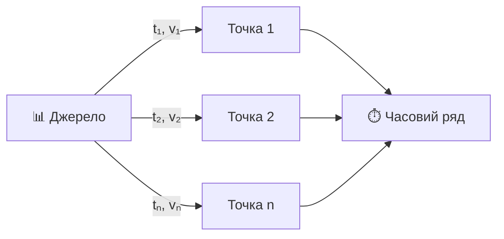
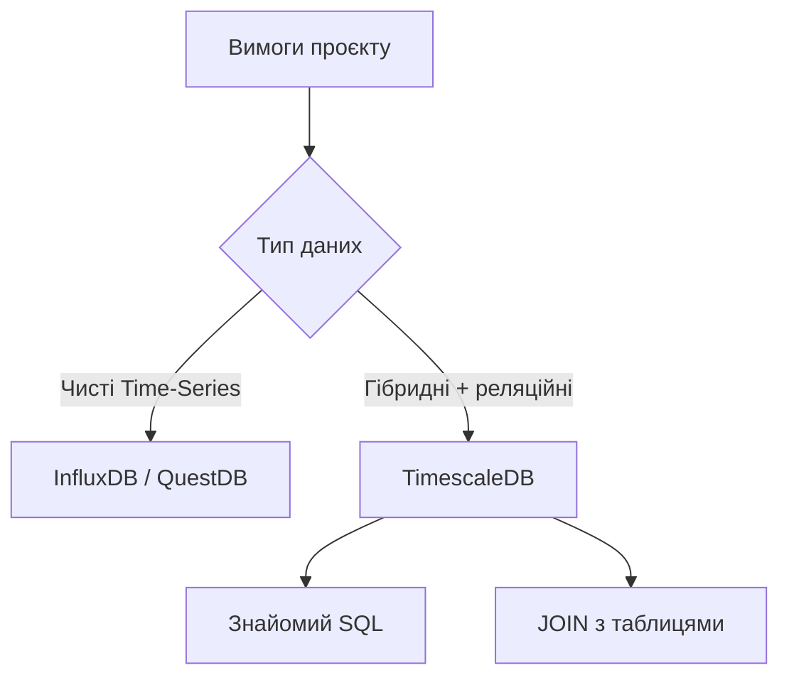
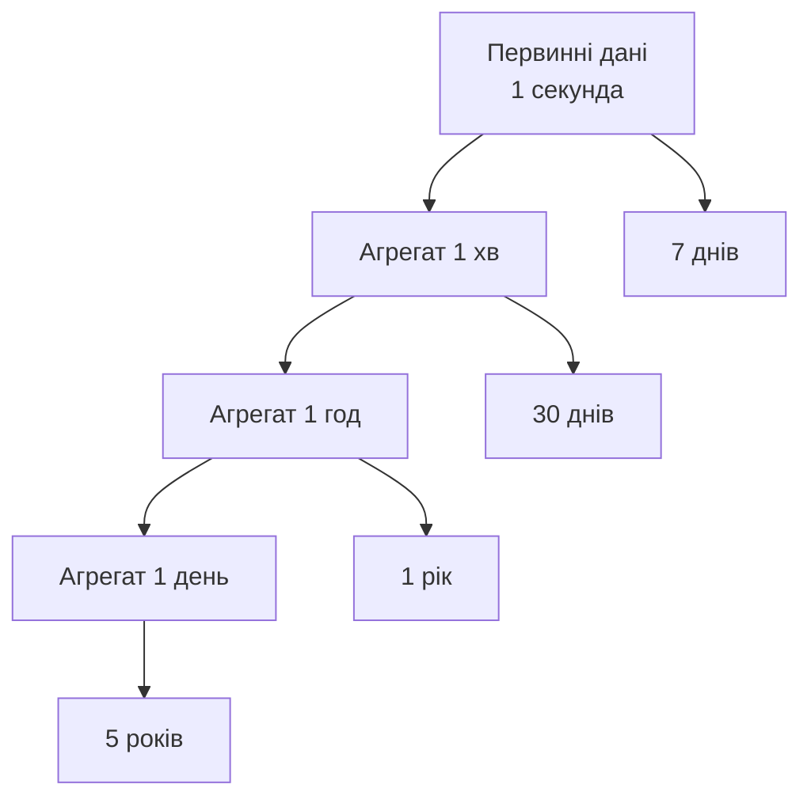
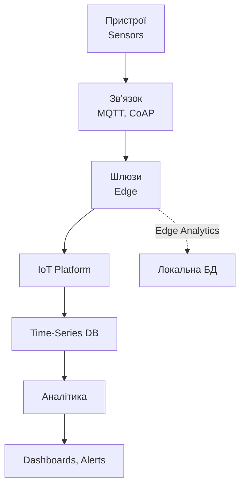
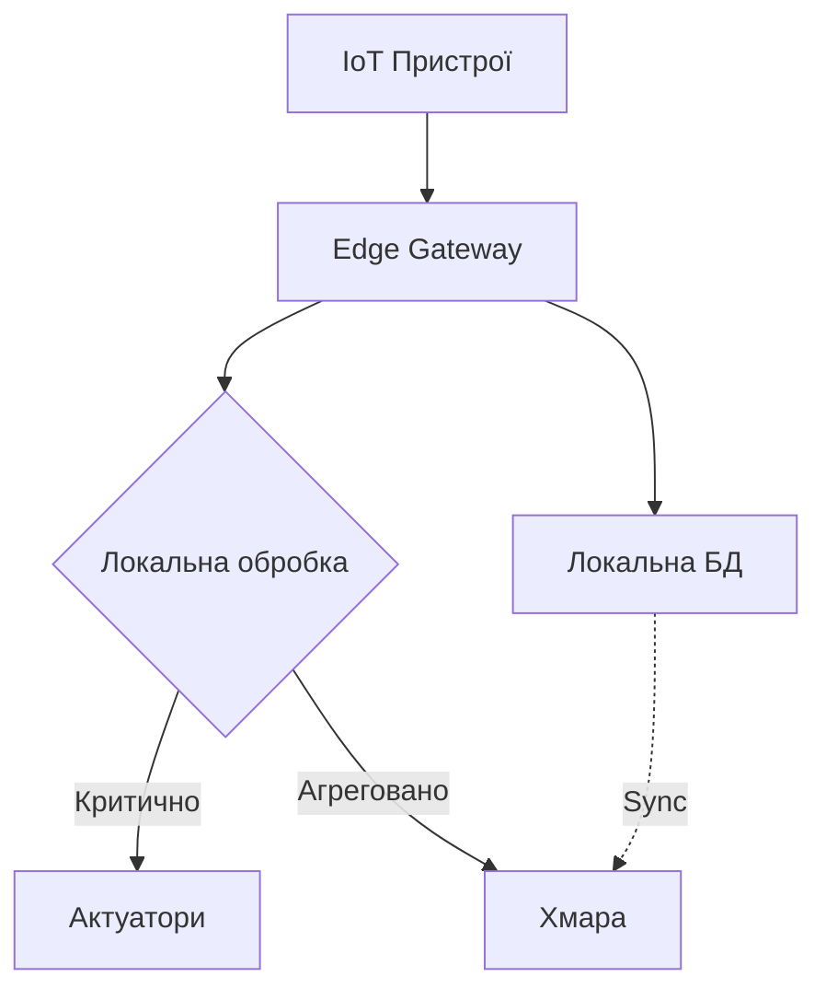

# Лекція 21. Часові ряди та IoT системи (самостійне вивчення)

## План лекції

1. Специфіка часових рядів
2. Архітектура time-series баз даних
3. Компресія та агрегація даних
4. Internet of Things: збір та зберігання
5. Edge computing та розподілена аналітика

**Примітка:** тема винесена як самостійна — не входить до основної перенумерованої послідовності Теми 5–6, але перетинається з лекціями 13, 14 і 16.

## Що таке часові ряди?

**Часовий ряд** — впорядкована послідовність числових значень, кожне з яких асоційоване з певним моментом часу.

**Математично:** {(t₁, v₁), (t₂, v₂), ..., (tₙ, vₙ)}


```mermaid
graph LR
    A[📊 Джерело] -->|t₁, v₁| B[Точка 1]
    A -->|t₂, v₂| C[Точка 2]
    A -->|tₙ, vₙ| E[Точка n]

    B --> F[⏱️ Часовий ряд]
    C --> F
    E --> F
```

**Приклади:** температура сенсорів кожні 10 секунд, ціни акцій щохвилини, метрики серверів у реальному часі

## Властивості та типи часових рядів

**Властивості:**
- 🔄 Монотонність часу (tᵢ < tᵢ₊₁)
- 📍 Обов'язкова часова прив'язка
- 🔒 Незмінність історії
- ⚡ Висока швидкість надходження

**Типи:** регулярні (фіксовані інтервали) vs нерегулярні (реагування на події)

## Виклики роботи з часовими рядами

### 💾 **Високий об'єм даних**

**1 датчик, 1 с інтервал:** 86,400 записів/день → 31.5M записів/рік

**При масштабуванні на тисячі датчиків — астрономічні обсяги**

**Інші виклики:** швидкий запис (B-tree неефективні), необхідність компресії, гарячі vs холодні дані

## InfluxDB

### 📊 **Спеціалізована БД для часових рядів**

```
# Структура точки даних
measurement,tag_key=tag_value field_key=field_value timestamp
temperature,sensor=sensor_01,location=room_1 value=22.5 1642248000000000000
```

```sql
-- Flux запит
from(bucket: "sensors")
  |> range(start: -1h)
  |> filter(fn: (r) => r._measurement == "temperature")
  |> aggregateWindow(every: 5m, fn: mean)
```

> **Актуалізація:** InfluxDB 3.0 (рушій IOx на Rust + Apache Arrow/Parquet) додав нативний SQL і стовпчикове зберігання — Flux лишається для сумісності зі старими проєктами.

## TimescaleDB

**PostgreSQL + Time-Series оптимізації**

```sql
CREATE TABLE sensor_data (
    time TIMESTAMPTZ NOT NULL,
    sensor_id INTEGER NOT NULL,
    temperature DOUBLE PRECISION
);
SELECT create_hypertable('sensor_data', 'time');

-- Компресія + retention
ALTER TABLE sensor_data SET (
    timescaledb.compress,
    timescaledb.compress_segmentby = 'sensor_id'
);
SELECT add_compression_policy('sensor_data', INTERVAL '7 days');
SELECT add_retention_policy('sensor_data', INTERVAL '90 days');
```

**🎯 Коефіцієнт компресії: 90-95%**

## Порівняння time-series СУБД


```mermaid
graph TB
    A[Вимоги проєкту] --> B{Тип даних}
    B -->|Чисті Time-Series| C[InfluxDB / QuestDB]
    B -->|Гібридні + реляційні| D[TimescaleDB]

    D --> F1[Знайомий SQL]
    D --> F2[JOIN з таблицями]
```

> **Актуалізація:** **QuestDB** — нативний SQL, надвисока пропускна здатність запису — набирає популярності як третій варіант поруч з InfluxDB і TimescaleDB.

## Методи компресії часових даних

**Delta Encoding** — зберігання різниць замість абсолютних значень
**Dictionary Encoding** — словник унікальних значень + компактні посилання
**Gorilla Compression** (Facebook) — XOR операції для плаваючої коми, 10–20x стиснення

```python
original_values = [1000, 1005, 1003, 1007, 1010, 1008]
base_value = 1000
deltas = [5, -2, 4, 3, -2]
```

## Багаторівнева агрегація


```mermaid
graph TD
    A[Первинні дані<br/>1 секунда] --> B[Агрегат 1 хв]
    B --> C[Агрегат 1 год]
    C --> D[Агрегат 1 день]

    A --> F[7 днів]
    B --> G[30 днів]
    C --> H[1 рік]
    D --> I[5 років]
```

**Принцип:** деталі свіжі, історія агрегована (continuous aggregates в TimescaleDB)

## Архітектура IoT систем


```mermaid
graph TB
    A[Пристрої<br/>Sensors] --> B[Зв'язок<br/>MQTT, CoAP]
    B --> C[Шлюзи<br/>Edge]
    C --> D[IoT Platform]
    D --> E[Time-Series DB]
    E --> F[Аналітика]
    F --> G[Dashboards, Alerts]

    C -.->|Edge Analytics| H[Локальна БД]
```

**MQTT** — легкий pub/sub протокол, стандарт для IoT-зв'язку

## Збір та обробка IoT-даних

```python
class IoTDataCollector:
    def on_message(self, client, userdata, msg):
        data = json.loads(msg.payload)
        point = Point("sensor_reading") \
            .tag("sensor_id", data['sensor_id']) \
            .field("temperature", data['temperature']) \
            .time(data['timestamp'])
        self.write_api.write(bucket="sensors", record=point)
```

**Пакетна обробка (batching):** запис пакетами замість поодиноких вставок — приріст продуктивності на порядки

**Stream processing:** Kafka/Flink (див. лекцію 14) + ковзне вікно для виявлення аномалій (Z-score)

## Edge Computing: концепція


```mermaid
graph TB
    A[IoT Пристрої] --> B[Edge Gateway]
    B --> C{Локальна обробка}
    C -->|Критично| D[Актуатори]
    C -->|Агреговано| E[Хмара]
    B --> G[Локальна БД]
    G -.->|Sync| E
```

**Переваги:** знижена латентність, економія пропускної здатності, приватність, автономність при втраті зв'язку

> **Актуалізація:** на edge-пристроях дедалі частіше запускають TinyML-моделі для inference (ONNX Runtime, вбудовані NPU) — межа між "правилами" й "AI" на краю мережі стирається (див. лекцію 16).

## Розподілена аналітика

**Федероване навчання:** кожен edge-вузол навчає модель локально й надсилає лише градієнти (не самі дані) → приватність

**Ієрархічна агрегація:** Edge → Regional Aggregator → Cloud → Global Analytics

**Offline-first:** обробка незалежно від з'єднання, черга для пізнішої синхронізації, conflict resolution (Last Write Wins)

## Практичні застосування

| Галузь | Приклад |
|---|---|
| 🏭 **Промисловий моніторинг** | Прогнозне обслуговування — аналіз трендів вібрації/температури, оцінка ризику відмови |
| 🏢 **Розумні будівлі** | Аналіз енергоспоживання проти базової лінії, виявлення аномалій |
| 🌾 **Точне землеробство** | Керування зрошенням за вологістю ґрунту та типом культури |

## **Висновки**

**Часові ряди:** спеціалізовані БД (InfluxDB 3.0, TimescaleDB, QuestDB), компресія 90-95%, багаторівнева агрегація

**IoT-системи:** MQTT, потокова обробка, виявлення аномалій у реальному часі

**Edge Computing:** знижена латентність, автономність, федероване навчання, дедалі частіше — і TinyML inference на пристрої

**Практичні застосування:** промисловий моніторинг, розумні будівлі, точне землеробство

**Зв'язок з курсом:** перетинається з потоковою обробкою (лекція 14), моніторингом продуктивності (лекція 13) та edge computing як трендом (лекція 16)
