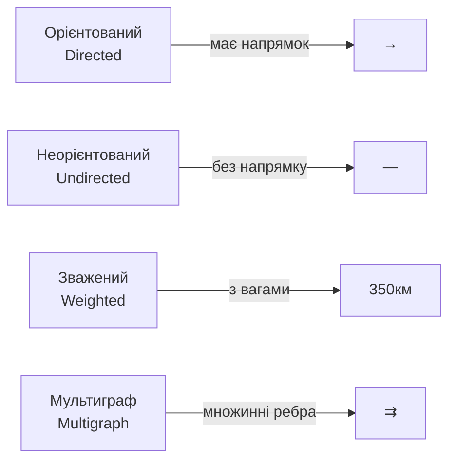
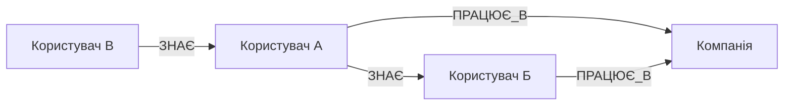
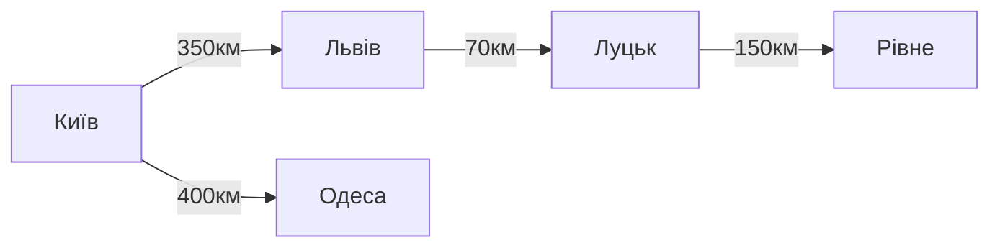
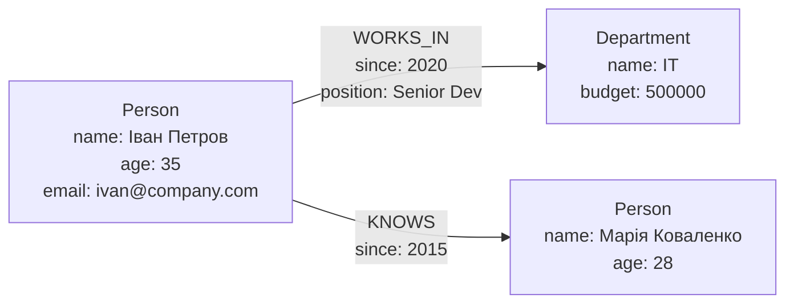
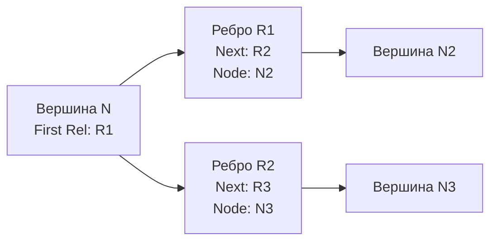
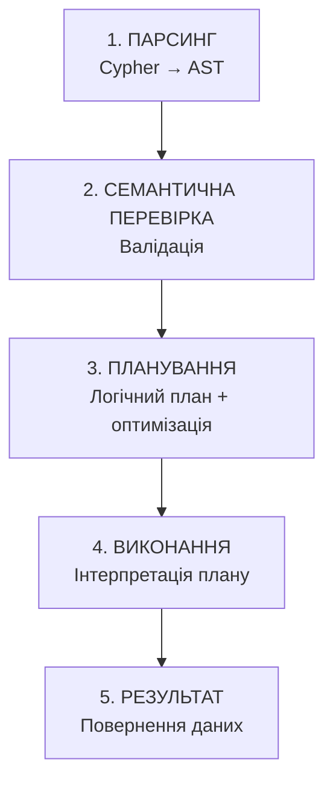
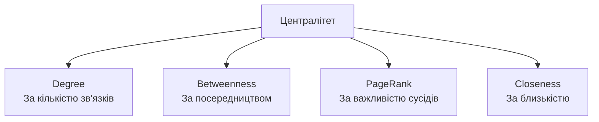
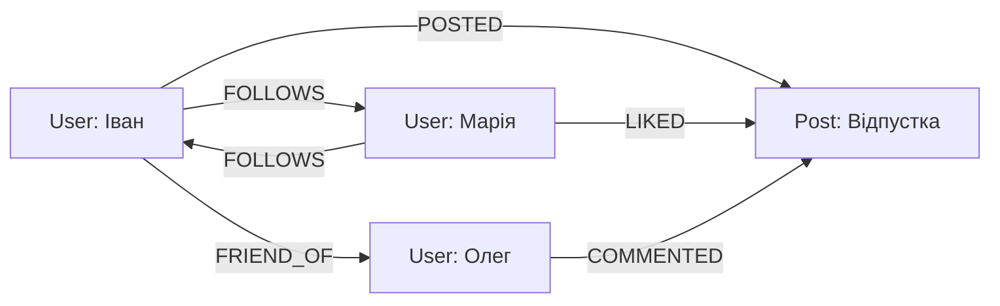
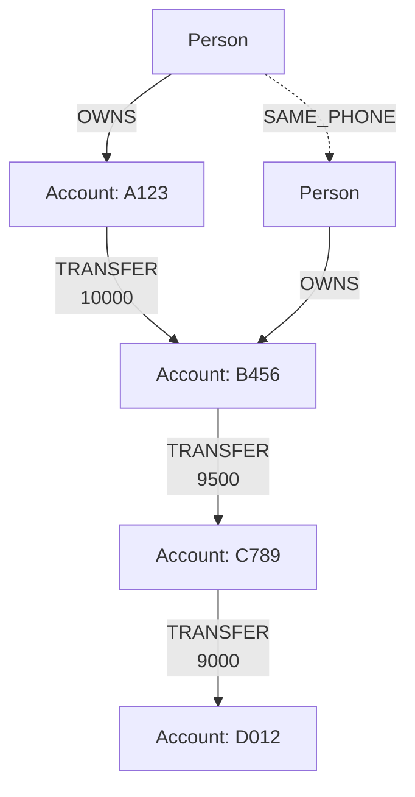

# Графові бази даних та мережевий аналіз

## План лекції

1. Основи теорії графів
2. Графові моделі даних
3. Neo4j архітектура
4. Мова Cypher
5. Алгоритми на графах
6. Практичні застосування

## **📚 Основні поняття:**

**Граф** — абстрактна структура даних, що складається з вершин (вузлів) та ребер (зв'язків) між ними.

**Графова база даних** — система управління базами даних, оптимізована для зберігання та обробки графових структур даних.

**Мережевий аналіз** — набір методів та алгоритмів для дослідження структури та властивостей мережевих даних.

**Патерн-орієнтований запит** — декларативний спосіб опису структури графа, яку потрібно знайти в базі даних.

## **1. Основи теорії графів**

## Математичні основи

### 📐 **Визначення графа:**

Граф G = (V, E), де:
- **V** — множина вершин (vertices/nodes)
- **E** — множина ребер (edges/relationships)

### 🔄 **Типи графів:**



## Приклади графів

### 🌐 **Орієнтований граф:**



**Застосування:** Соціальні мережі, системи слідування

### 🗺️ **Зважений граф:**



**Застосування:** Транспортні системи, маршрутизація

## Властивості графів

### 📊 **Ключові характеристики:**

**Ступінь вершини:**
- Кількість ребер, інцидентних вершині
- Для орієнтованих: вхідний + вихідний ступінь

**Шлях:**
- Послідовність вершин, з'єднаних ребрами
- Довжина = кількість ребер

**Цикл:**
- Шлях, що починається і закінчується в одній вершині

**Зв'язність:**
- Граф зв'язний, якщо є шлях між будь-якою парою вершин

## **2. Графові моделі даних**

## Property Graph Model

### 🎯 **Найпопулярніша модель для GraphDB**

**Основні елементи:**



**Компоненти:**
- **Вершини** — сутності з властивостями та мітками
- **Ребра** — зв'язки з типом, напрямком та властивостями

## Структура Property Graph

### 📋 **Вершина (Node):**

```
Node ID: 1001
Labels: [Person, Employee]
Properties:
  name: "Іван Петров"
  age: 35
  email: "ivan.petrov@company.com"
  hired_date: "2020-03-15"
```

### 🔗 **Ребро (Relationship):**

```
Relationship ID: 5001
Type: WORKS_IN
Start Node: 1001 (Person: Іван Петров)
End Node: 2001 (Department: IT)
Properties:
  since: "2020-03-15"
  position: "Senior Developer"
  salary: 85000
```

## RDF (Resource Description Framework)

### 🌐 **Стандарт W3C для семантичного вебу**

**Структура — тріплети (triples):**

```
Суб'єкт → Предикат → Об'єкт
```

**Приклад у форматі Turtle:**

```turtle
@prefix ex: <http://example.org/> .
@prefix foaf: <http://xmlns.com/foaf/0.1/> .

ex:IvanPetrov rdf:type foaf:Person .
ex:IvanPetrov foaf:name "Іван Петров" .
ex:IvanPetrov foaf:age "35" .
ex:IvanPetrov ex:worksIn ex:ITDepartment .
```

**Мова запитів:** SPARQL

## Порівняння моделей

| Аспект | Property Graph | RDF |
|--------|----------------|-----|
| **Одиниця зберігання** | Вершини + ребра | Тріплети |
| **Властивості ребер** | ✅ Нативно | ⚠️ Reification |
| **Мова запитів** | Cypher, Gremlin | SPARQL |
| **Складність** | 🟢 Проста | 🟡 Більш формальна |
| **Використання** | Бізнес-додатки | Семантичний веб |
| **Типізація** | Labels | RDF Classes |

## **3. Neo4j архітектура**

## Огляд Neo4j

### 🚀 **Найпопулярніша графова СУБД**

**Ключові особливості:**

- 📊 **Нативне зберігання** графів
- 🔒 **ACID транзакції**
- 📝 **Cypher** — декларативна мова запитів
- 📈 **Горизонтальне масштабування**
- 🛠️ **Багата екосистема** інструментів

**Написана на:** Java

**Ліцензування:**
- Community Edition (GPL)
- Enterprise Edition (комерційна)

## Архітектура зберігання

### 💾 **Нативне графове зберігання:**

```
graph.db/
├── neostore.nodestore.db          # Вершини
├── neostore.relationshipstore.db  # Ребра
├── neostore.propertystore.db      # Властивості
├── neostore.labeltokenstore.db    # Мітки
└── schema/index/lucene/           # Індекси
```

### 🔧 **Внутрішнє представлення вершини:**

```
Node Record (15 bytes):
[0-3]   → Перше ребро
[4-7]   → Перша властивість
[8-11]  → Перші мітки
[12-14] → Метадані
```

## Обхід графа без JOIN

### ⚡ **Пряме читання зв'язків:**



**Алгоритм обходу:**
1. Читаємо запис вершини N
2. Отримуємо ID першого зв'язку
3. Читаємо запис зв'язку
4. Переходимо до наступного через pointer
5. Повторюємо до завершення ланцюга

**Результат:** ❌ Немає JOIN операцій!

## Система індексування

### 📑 **Типи індексів у Neo4j:**

**B-tree індекси:**

```cypher
-- Створення індексу
CREATE INDEX person_name_index
FOR (p:Person) ON (p.name);

-- Унікальний індекс
CREATE CONSTRAINT person_email_unique
FOR (p:Person) REQUIRE p.email IS UNIQUE;
```

**Повнотекстові індекси (Lucene):**

```cypher
-- Створення fulltext індексу
CALL db.index.fulltext.createNodeIndex(
  'personFulltext',
  ['Person'],
  ['name', 'description', 'bio']
);

-- Використання
CALL db.index.fulltext.queryNodes(
  'personFulltext',
  'Іван~'
) YIELD node, score;
```

## Обробка запитів

### 🔄 **Етапи виконання запиту:**



**Приклад плану:**

```
└── Projection (p.name, d.name)
    └── Filter (p.age > 30)
        └── Expand (p)-[:WORKS_IN]->(d)
            └── NodeByLabelScan (p:Person)
```

## **4. Мова Cypher**

## Основи синтаксису Cypher

### 🎨 **ASCII-art для графів**

**Вершини:**

```cypher
()                          // Анонімна вершина
(p)                         // Зі змінною
(:Person)                   // З міткою
(p:Person)                  // Змінна + мітка
(p:Person {name: 'Іван'})   // З властивостями
```

**Ребра:**

```cypher
-->                         // Орієнтоване →
<--                         // Орієнтоване ←
--                          // Неорієнтоване
-[:KNOWS]->                 // З типом
-[r:KNOWS {since: 2020}]->  // З властивостями
```

## Створення даних

### ➕ **CREATE — створення вершин та ребер:**

```cypher
-- Проста вершина
CREATE (p:Person {
  name: 'Іван Петров',
  age: 35,
  email: 'ivan@example.com'
});

-- Вершини та зв'язки одночасно
CREATE
  (p1:Person {name: 'Іван Петров'}),
  (p2:Person {name: 'Марія Коваленко'}),
  (d:Department {name: 'IT'}),
  (p1)-[:WORKS_IN {since: date('2020-03-15')}]->(d),
  (p2)-[:WORKS_IN {since: date('2021-06-01')}]->(d),
  (p1)-[:KNOWS {since: 2015}]->(p2);
```

## MERGE — створити або знайти

### 🔄 **Гарантує існування:**

```cypher
-- Створити вершину, якщо не існує
MERGE (p:Person {email: 'ivan@example.com'})
ON CREATE SET
  p.name = 'Іван Петров',
  p.created = timestamp()
ON MATCH SET
  p.lastSeen = timestamp()
RETURN p;
```

```cypher
-- Гарантувати існування зв'язку
MATCH
  (p:Person {name: 'Іван Петров'}),
  (d:Department {name: 'IT'})
MERGE (p)-[r:WORKS_IN]->(d)
ON CREATE SET r.since = date('2020-03-15')
RETURN p, r, d;
```

## Читання даних — базові запити

### 🔍 **MATCH — пошук патернів:**

```cypher
-- Всі вершини типу Person
MATCH (p:Person)
RETURN p;

-- За властивістю
MATCH (p:Person {name: 'Іван Петров'})
RETURN p;

-- Складні умови
MATCH (p:Person)
WHERE p.age > 30 AND p.age < 50
RETURN p.name, p.age
ORDER BY p.age DESC;
```

**Пошук зв'язків:**

```cypher
-- Працівники відділу
MATCH (p:Person)-[:WORKS_IN]->(d:Department {name: 'IT'})
RETURN p.name, p.age;
```

## Складні патерни запитів

### 🎯 **Рекомендація друзів друзів:**

```cypher
MATCH (me:Person {name: 'Іван Петров'})
      -[:KNOWS]-(friend)
      -[:KNOWS]-(recommended)
WHERE NOT (me)-[:KNOWS]-(recommended)
  AND me <> recommended
RETURN DISTINCT
  recommended.name,
  COUNT(*) as mutualFriends
ORDER BY mutualFriends DESC
LIMIT 10;
```

**Змінна довжина шляхів:**

```cypher
-- Шлях довжини від 1 до 3
MATCH path = (p1:Person {name: 'Іван'})
             -[:KNOWS*1..3]-
             (p2:Person {name: 'Олександр'})
RETURN path, length(path);
```

## Агрегатні функції

### 📊 **Статистика та групування:**

```cypher
-- Підрахунок за відділами
MATCH (p:Person)-[:WORKS_IN]->(d:Department)
RETURN
  d.name,
  COUNT(p) as employeeCount,
  AVG(p.age) as avgAge
ORDER BY employeeCount DESC;
```

**Збір у колекції:**

```cypher
-- Список працівників по відділах
MATCH (d:Department)<-[:WORKS_IN]-(p:Person)
RETURN
  d.name,
  COLLECT(p.name) as employees,
  COUNT(p) as count;
```

## Оновлення та видалення

### ✏️ **SET — оновлення властивостей:**

```cypher
-- Оновлення
MATCH (p:Person {name: 'Іван Петров'})
SET p.age = 36,
    p.lastUpdated = timestamp()
RETURN p;

-- Додавання мітки
MATCH (p:Person {name: 'Іван Петров'})
SET p:Manager
RETURN p;
```

### 🗑️ **DELETE — видалення:**

```cypher
-- Видалення вершини з усіма зв'язками
MATCH (p:Person {name: 'Іван Петров'})
DETACH DELETE p;
```

## **5. Алгоритми на графах**

## Пошук найкоротших шляхів

### 🛣️ **Алгоритм Дейкстри**

Знаходить найкоротший шлях у зваженому графі:

```cypher
-- Використання GDS бібліотеки
MATCH (start:City {name: 'Київ'}),
      (end:City {name: 'Львів'})
CALL gds.shortestPath.dijkstra.stream('cityGraph', {
  sourceNode: id(start),
  targetNode: id(end),
  relationshipWeightProperty: 'distance'
})
YIELD nodeIds, totalCost
RETURN
  [nodeId IN nodeIds | gds.util.asNode(nodeId).name] as route,
  totalCost as totalDistance;
```

**BFS (Breadth-First Search):**

```cypher
MATCH path = shortestPath(
  (start:Person {name: 'Іван'})-[:KNOWS*]-(end:Person {name: 'Олег'})
)
RETURN path, length(path);
```

## Алгоритми централітету

### ⭐ **Міри важливості вершин**



**Degree Centrality:**

```cypher
CALL gds.degree.stream('socialNetwork')
YIELD nodeId, score
RETURN
  gds.util.asNode(nodeId).name as person,
  score as connections
ORDER BY score DESC
LIMIT 10;
```

## PageRank

### 📄 **Алгоритм Google для ранжування**

**Принцип:** Важливість залежить від важливості тих, хто посилається

```cypher
CALL gds.pageRank.stream('webGraph', {
  maxIterations: 20,
  dampingFactor: 0.85
})
YIELD nodeId, score
RETURN
  gds.util.asNode(nodeId).url as page,
  score
ORDER BY score DESC
LIMIT 20;
```

**Параметри:**
- **maxIterations** — кількість ітерацій
- **dampingFactor** — фактор загасання (зазвичай 0.85)

## Виявлення спільнот

### 👥 **Community Detection**

**Louvain Method:**

```cypher
CALL gds.louvain.stream('socialNetwork')
YIELD nodeId, communityId
RETURN
  communityId,
  COLLECT(gds.util.asNode(nodeId).name) as members,
  COUNT(*) as size
ORDER BY size DESC;
```

**Label Propagation:**

```cypher
CALL gds.labelPropagation.stream('socialNetwork', {
  maxIterations: 10
})
YIELD nodeId, communityId
RETURN communityId, COUNT(*) as size
ORDER BY size DESC;
```

## Аналіз подібності

### 🔍 **Node Similarity**

Знаходження подібних вершин на основі спільних сусідів:

```cypher
CALL gds.nodeSimilarity.stream('socialNetwork', {
  topK: 5,
  similarityCutoff: 0.1
})
YIELD node1, node2, similarity
RETURN
  gds.util.asNode(node1).name as person1,
  gds.util.asNode(node2).name as person2,
  similarity
ORDER BY similarity DESC;
```

**Застосування:**
- Рекомендаційні системи
- Знаходження схожих користувачів
- Групування товарів

## **6. Практичні застосування**

## Соціальні мережі

### 👥 **Ідеальний use case для GraphDB**



**Типові запити:**

```cypher
-- Рекомендація друзів
MATCH (me:User {name: 'Іван'})
      -[:FRIEND_OF]-(friend)
      -[:FRIEND_OF]-(recommended)
WHERE NOT (me)-[:FRIEND_OF]-(recommended)
  AND me <> recommended
RETURN recommended.name, COUNT(*) as mutualFriends
ORDER BY mutualFriends DESC;
```

## Соціальні мережі — стрічка новин

### 📰 **News Feed алгоритм:**

```cypher
-- Останні пости від тих, на кого підписаний
MATCH (me:User {name: 'Іван'})
      -[:FOLLOWS]->(user)
      -[:POSTED]->(post)
WHERE post.timestamp > timestamp() - 24*60*60*1000
RETURN
  post.content,
  user.name,
  post.timestamp
ORDER BY post.timestamp DESC
LIMIT 50;
```

**Аналіз впливовості:**

```cypher
CALL gds.pageRank.stream('socialGraph')
YIELD nodeId, score
RETURN
  gds.util.asNode(nodeId).name as influencer,
  score
ORDER BY score DESC
LIMIT 20;
```

## Виявлення шахрайства

### 🔒 **Fraud Detection**



**Виявлення кругових переказів:**

```cypher
-- Знаходження циклів у переказах
MATCH cycle = (acc:Account)-[:TRANSFER*3..5]->(acc)
WHERE ALL(t IN relationships(cycle)
      WHERE t.amount > 5000)
RETURN cycle, LENGTH(cycle) as cycleLength;
```

## Fraud Detection — мережі зв'язків

### 🕸️ **Аналіз підозрілих груп:**

```cypher
-- Виявлення пов'язаних рахунків
MATCH (p1:Person)-[:OWNS]->(acc1:Account)
      -[:TRANSFER]->(acc2:Account)
      <-[:OWNS]-(p2:Person)
WHERE (p1)-[:SAME_PHONE|SAME_ADDRESS|SAME_IP]-(p2)
WITH p1, p2, COUNT(DISTINCT acc1) as sharedAccounts
WHERE sharedAccounts > 3
RETURN
  p1.name,
  p2.name,
  sharedAccounts
ORDER BY sharedAccounts DESC;
```

**Патерни шахрайства:**
- 🔁 Кругові перекази
- 🔗 Спільні контакти (телефон, IP)
- ⚡ Незвичайна швидкість транзакцій
- 🌐 Складні мережі рахунків

## Рекомендаційні системи

### 🎯 **Collaborative Filtering**

```cypher
-- Рекомендація товарів
MATCH (me:User {userId: '12345'})
      -[:PURCHASED]->(product)
      <-[:PURCHASED]-(similar:User)
WITH me, similar, COUNT(DISTINCT product) as common
ORDER BY common DESC
LIMIT 10
MATCH (similar)-[:PURCHASED]->(recommendation)
WHERE NOT (me)-[:PURCHASED]->(recommendation)
RETURN
  recommendation.name,
  COUNT(*) as score
ORDER BY score DESC
LIMIT 20;
```

## Рекомендації — Content-Based

### 📦 **На основі категорій:**

```cypher
-- Рекомендація по категоріях
MATCH (me:User {userId: '12345'})
      -[:PURCHASED]->(product)
      -[:IN_CATEGORY]->(category)
WITH me, category, COUNT(*) as categoryScore
ORDER BY categoryScore DESC
LIMIT 3
MATCH (category)<-[:IN_CATEGORY]-(recommendation)
WHERE NOT (me)-[:PURCHASED]->(recommendation)
RETURN
  recommendation.name,
  category.name,
  COUNT(*) as score
ORDER BY score DESC;
```

**Гібридний підхід:** Комбінування collaborative + content-based

## Системи управління знаннями

### 🧠 **Онтології та Knowledge Graphs**

```cypher
-- Створення ієрархії класів
CREATE
  (mammal:Class {name: 'Mammal'}),
  (dog:Class {name: 'Dog'}),
  (cat:Class {name: 'Cat'}),
  (pet:Class {name: 'Pet'})
CREATE
  (dog)-[:SUBCLASS_OF]->(mammal),
  (cat)-[:SUBCLASS_OF]->(mammal),
  (dog)-[:SUBCLASS_OF]->(pet);

-- Пошук усіх підкласів
MATCH (base:Class {name: 'Mammal'})
      <-[:SUBCLASS_OF*]-(derived:Class)
RETURN derived.name;
```

**Застосування:** Wikipedia, медичні онтології, наукові бази знань

## Інші застосування GraphDB

### 🌟 **Різноманітні use cases:**

**Мережеві операції:**
- 📡 Телекомунікації — оптимізація мереж
- 🚗 Транспорт — маршрутизація, логістика
- ⚡ Енергосистеми — управління grid

**Біоінформатика:**
- 🧬 Білкові взаємодії
- 🦠 Епідеміологія
- 💊 Drug discovery

**Бізнес:**
- 🏢 Організаційні структури
- 📊 Supply chain management
- 🔐 Identity and Access Management (IAM)

## Коли використовувати GraphDB?

### ✅ **Ідеально підходить для:**

- 🔗 **Складні багаторівневі зв'язки** між даними
- 🚀 **Швидкий обхід графів** та пошук шляхів
- 🔄 **Динамічна структура** — часті зміни схеми
- 📈 **Мережевий аналіз** — централітет, спільноти
- 🎯 **Рекомендації** на основі зв'язків

### ❌ **Не найкращий вибір для:**

- 📊 **Табличні дані** без складних зв'язків
- 💰 **Фінансова звітність** — OLAP операції
- 📈 **Часові ряди** — time-series дані
- 🔢 **Прості CRUD** операції

## Порівняння з реляційними БД

| Аспект | GraphDB | RDBMS |
|--------|---------|-------|
| **Зв'язки** | 🟢 Першого класу | 🟡 Через JOIN |
| **Обхід графа** | ⚡ Надшвидкий | 🐌 Багато JOIN |
| **Гнучкість схеми** | 🟢 Висока | 🟡 Обмежена |
| **Транзакції** | 🟢 ACID | 🟢 ACID |
| **Складні зв'язки** | 🟢 Природно | 🔴 Складно |
| **Агрегації** | 🟡 Обмежені | 🟢 Потужні |
| **Масштабування** | 🟡 Складніше | 🟢 Зріліше |

**Висновок:** Вибір залежить від характеру даних та операцій!

## Інструменти та екосистема

### 🛠️ **Neo4j екосистема:**

**Розробка:**
- **Neo4j Desktop** — локальне середовище
- **Neo4j Browser** — вебінтерфейс для запитів
- **Neo4j Bloom** — візуалізація графів

**Драйвери:**
- Java, Python, JavaScript, .NET, Go
- Bolt протокол для комунікації

**Аналітика:**
- **Graph Data Science (GDS)** — бібліотека алгоритмів
- **APOC** — extended процедури

**Розгортання:**
- Neo4j Aura (хмарний DBaaS)
- Docker контейнери
- Kubernetes операторі

## Альтернативні GraphDB

### 🗄️ **Інші графові бази даних:**

| СУБД | Мова запитів | Особливості |
|------|--------------|-------------|
| **Neo4j** | Cypher | Найпопулярніша, ACID |
| **Amazon Neptune** | Gremlin, SPARQL | Керована AWS |
| **ArangoDB** | AQL | Multi-model (граф+док+КV) |
| **JanusGraph** | Gremlin | Розподілена, масштабована |
| **TigerGraph** | GSQL | Аналітика в реальному часі |
| **OrientDB** | SQL-like | Multi-model |

**Вибір залежить від:** хмари, масштабу, моделі даних, інтеграції

## Висновки

### 🎓 **Ключові takeaways:**

**Графові БД — революція у роботі зі зв'язками:**
- 🔗 Зв'язки як структури першого класу
- ⚡ Швидкий обхід без JOIN
- 📝 Декларативні запити через Cypher
- 🧠 Потужні алгоритми мережевого аналізу

**Застосування:**
- 👥 Соціальні мережі
- 🔒 Виявлення шахрайства
- 🎯 Рекомендаційні системи
- 🧠 Knowledge graphs
- 🌐 Мережеві системи

**Майбутнє:** Зростання популярності для складних взаємозв'язаних даних!

## Практичні рекомендації

### 💡 **Поради для роботи з GraphDB:**

**Проєктування:**
- 🎯 Моделюйте предметну область як граф з самого початку
- 🏷️ Використовуйте осмислені назви міток та зв'язків
- 📊 Додавайте властивості до ребер для контексту

**Оптимізація:**
- 📑 Створюйте індекси на часто використовувані властивості
- 🔍 Використовуйте EXPLAIN для аналізу планів запитів
- 🎯 Фільтруйте рано, обходьте пізно

**Масштабування:**
- 📈 Плануйте горизонтальне масштабування заздалегідь
- 🔄 Використовуйте кластеризацію для високої доступності
- 💾 Моніторте використання пам'яті та дискового простору
