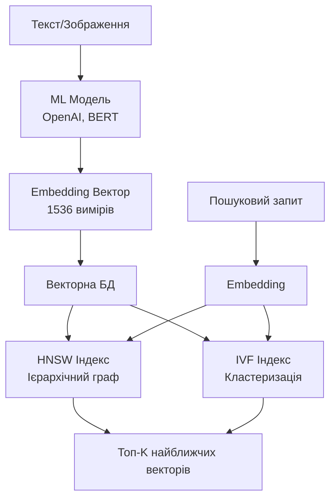
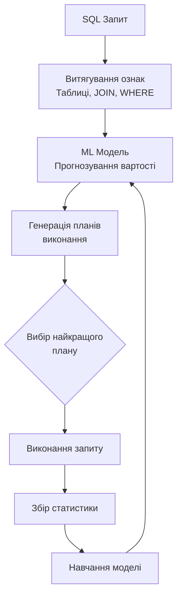
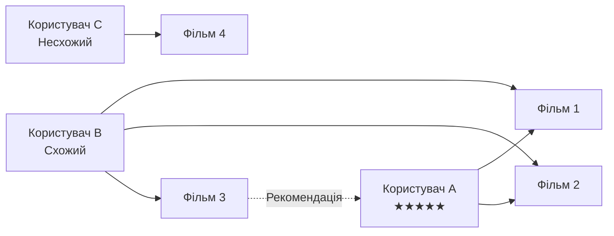
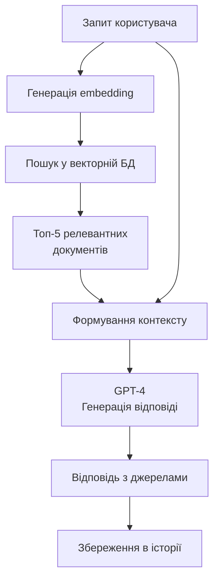
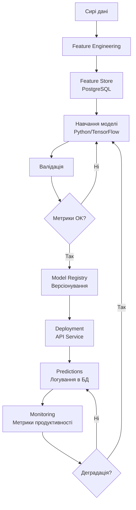

# Штучний інтелект та машинне навчання у СУБД

## План презентації

1. Векторні бази даних
2. Автоматична оптимізація СУБД
3. Рекомендаційні системи
4. Обробка природної мови та чат-боти
5. MLOps: інтеграція ML з системами даних

## **1. Векторні бази даних**

## Концепція векторних представлень

### 🔢 **Що таке embedding вектори?**

Перетворення складних об'єктів (текст, зображення, аудіо) у багатовимірні числові масиви, які зберігають семантичне значення.

```python
# Приклад embedding вектора
text = "Штучний інтелект революціонізує обробку даних"
embedding = [0.23, 0.45, 0.67, 0.12, ..., 0.89]  # 1536 вимірів

# Схожі тексти мають близькі вектори
similar_text = "AI трансформує роботу з даними"
similar_embedding = [0.25, 0.43, 0.68, 0.11, ..., 0.87]
```

**✨ Ключова ідея:** Семантична подібність = Геометрична близькість

## Метрики подібності

### 📐 **Три основні метрики:**

**1. Косинусна подібність** — кут між векторами

```python
similarity = cos(θ) = (A · B) / (||A|| × ||B||)
# Значення від -1 до 1
```

**2. Евклідова відстань** — пряма відстань

```python
distance = √(Σ(ai - bi)²)
# Менше значення = більша подібність
```

**3. Скалярний добуток** — враховує напрямок і довжину

```python
similarity = A · B = Σ(ai × bi)
```

## Архітектура векторних БД



## Практична робота з pgvector

### 💾 **PostgreSQL + векторні можливості:**

```sql
-- Встановлення розширення
CREATE EXTENSION vector;

-- Створення таблиці
CREATE TABLE documents (
    id SERIAL PRIMARY KEY,
    content TEXT NOT NULL,
    embedding vector(1536),
    metadata JSONB
);

-- Створення індексу для швидкого пошуку
CREATE INDEX ON documents
USING ivfflat (embedding vector_cosine_ops)
WITH (lists = 100);
```

## Семантичний пошук

### 🔍 **Приклад пошуку схожих документів:**

```python
# Генерація embedding для запиту
query = "Як працюють векторні бази даних?"
query_embedding = get_embedding(query)

# Семантичний пошук
cursor.execute("""
    SELECT
        content,
        1 - (embedding <=> %s::vector) as similarity
    FROM documents
    ORDER BY embedding <=> %s::vector
    LIMIT 5
""", (query_embedding, query_embedding))

# Результат: найбільш релевантні документи
# навіть якщо вони не містять точних ключових слів!
```

**🎯 Переваги:** Знаходить семантично схожий контент, а не тільки збіги слів

## Популярні векторні БД

### 🗄️ **Провідні рішення на ринку:**

| База даних | Особливості | Використання |
|------------|-------------|--------------|
| **Pinecone** | Повністю керована хмарна БД | Продакшн AI застосунки |
| **Weaviate** | Автовекторизація, GraphQL | Семантичний пошук |
| **Qdrant** | Високопродуктивний Rust | Real-time застосунки |
| **Milvus** | Мільярди векторів | Великомасштабні системи |
| **pgvector** | Розширення PostgreSQL | Інтеграція з існуючою БД |

## Застосування векторних БД

### 💡 **Реальні use cases:**

**🤖 RAG системи**
- Чат-боти з доступом до баз знань
- Інтелектуальні асистенти

**🔎 Семантичний пошук**
- Пошук документів за змістом
- Рекомендації контенту

**🖼️ Пошук за зображеннями**
- Знаходження схожих фото
- Визначення дублікатів

**🎵 Аудіо аналіз**
- Пошук схожої музики
- Розпізнавання звуків

## **2. Автоматична оптимізація СУБД**

## Самоналаштовувані системи

### 🤖 **ML для оптимізації запитів:**



**🎯 Результат:** Автоматичний вибір оптимального плану виконання

## ML оптимізатор запитів

### 📊 **Характеристики для аналізу:**

```python
features = {
    'num_tables': 5,              # Кількість таблиць
    'num_joins': 4,               # Кількість JOIN
    'selectivity': 0.15,          # Селективність WHERE
    'table_sizes': [1000, 5000, 200],  # Розміри таблиць
    'available_indexes': [...],   # Наявні індекси
    'cardinality': [...]          # Кардинальність
}

# ML модель прогнозує вартість
predicted_cost = model.predict(features)
```

**✅ Переваги над традиційним оптимізатором:**
- Навчання на реальних даних виконання
- Адаптація до специфіки навантаження
- Врахування складних патернів

## Автоматичне створення індексів

### 📈 **Index Advisor на базі ML:**

```python
# Аналіз робочого навантаження
query_stats = analyze_workload()

for query in slow_queries:
    # Витягування потенційних індексів
    candidates = extract_index_candidates(query)

    for candidate in candidates:
        # Оцінка користі індексу
        benefit_score = calculate_benefit(
            frequency=query.execution_count,
            selectivity=estimate_selectivity(candidate),
            maintenance_cost=estimate_cost(candidate)
        )

        if benefit_score > threshold:
            recommend_index(candidate)
```

**🎯 Метрики для оцінки:**
- Частота використання стовпця
- Селективність даних
- Вартість обслуговування

## Прогнозування навантаження

### 📉 **Передбачення пікових навантажень:**

```python
# Підготовка ознак
features = {
    'hour_of_day': 14,           # Година доби
    'day_of_week': 2,            # День тижня
    'is_weekend': False,         # Вихідний день
    'month': 11,                 # Місяць
    'special_events': []         # Спеціальні події
}

# Прогноз навантаження
predicted_load = model.predict(features)

if predicted_load > high_threshold:
    # Проактивне масштабування
    scale_up_resources()
```

## Детекція аномалій

### 🚨 **Автоматичне виявлення проблем:**

```python
from sklearn.ensemble import IsolationForest

# Збір метрик системи
current_metrics = {
    'cpu_usage': 85,
    'memory_usage': 72,
    'active_connections': 150,
    'query_latency': 250,
    'io_wait': 15
}

# Виявлення аномалій
if anomaly_detector.is_anomaly(current_metrics):
    alert = {
        'severity': 'high',
        'affected_metrics': ['cpu_usage', 'query_latency'],
        'recommendation': 'Scale up or optimize queries'
    }
    send_alert(alert)
```

**🔍 Виявляє:** Нетипову поведінку, проблеми продуктивності, потенційні атаки

## **3. Рекомендаційні системи**

## Архітектура рекомендацій

### 🎯 **Структура даних:**

```sql
-- Користувачі
CREATE TABLE users (
    user_id BIGSERIAL PRIMARY KEY,
    preferences JSONB,
    demographic_data JSONB
);

-- Елементи для рекомендації
CREATE TABLE items (
    item_id BIGSERIAL PRIMARY KEY,
    title VARCHAR(255),
    features JSONB,
    embedding vector(512)
);

-- Взаємодії
CREATE TABLE interactions (
    user_id BIGINT REFERENCES users(user_id),
    item_id BIGINT REFERENCES items(item_id),
    interaction_type VARCHAR(50),  -- view, click, purchase
    interaction_value DECIMAL(3,2), -- рейтинг
    timestamp TIMESTAMP
);
```

## Колаборативна фільтрація

### 👥 **User-based підхід:**



**📊 Логіка:**
1. Знайти користувачів зі схожими вподобаннями
2. Подивитись що їм сподобалось
3. Рекомендувати ці елементи

## SQL для колаборативної фільтрації

### 🔢 **Пошук схожих користувачів:**

```sql
-- Обчислення кореляції між користувачами
WITH user_items AS (
    SELECT item_id, interaction_value
    FROM interactions
    WHERE user_id = 1001
),
similar_users AS (
    SELECT
        i.user_id,
        CORR(i.interaction_value, ui.interaction_value) as similarity
    FROM interactions i
    JOIN user_items ui ON i.item_id = ui.item_id
    WHERE i.user_id != 1001
    GROUP BY i.user_id
    HAVING COUNT(*) >= 5
)
SELECT user_id, similarity
FROM similar_users
WHERE similarity > 0.5
ORDER BY similarity DESC;
```

## Content-based фільтрація

### 📝 **На основі характеристик:**

```python
# Профіль користувача = зважене середнє улюблених елементів
user_profile = weighted_average([
    item1.embedding * rating1,
    item2.embedding * rating2,
    item3.embedding * rating3
])

# Пошук схожих елементів
recommended_items = vector_search(
    query=user_profile,
    limit=10,
    exclude=already_interacted
)
```

**🎯 Переваги:**
- Не потребує даних про інших користувачів
- Пояснювані рекомендації
- Працює для нових користувачів

## Гібридні системи

### 🔀 **Комбінування підходів:**

```python
# Різні джерела рекомендацій
collab_recs = collaborative_filtering(user_id, weight=0.6)
content_recs = content_based(user_id, weight=0.4)

# Комбінований скор
combined_scores = {}
for item, score in collab_recs:
    combined_scores[item] = score * 0.6

for item, score in content_recs:
    combined_scores[item] = combined_scores.get(item, 0) + score * 0.4

# Топ рекомендації
recommendations = sorted(combined_scores.items(),
                        key=lambda x: x[1],
                        reverse=True)[:10]
```

**✨ Найкраща точність:** Використання сильних сторін обох підходів

## **4. NLP та чат-боти з базами знань**

## RAG архітектура

### 🤖 **Retrieval Augmented Generation:**



**🎯 Переваги RAG:**
- Відповіді на основі актуальних даних
- Посилання на джерела
- Менше галюцинацій

## База знань для чат-бота

### 📚 **Структура зберігання:**

```sql
-- Документи бази знань
CREATE TABLE knowledge_base (
    doc_id BIGSERIAL PRIMARY KEY,
    title VARCHAR(500),
    content TEXT,
    category VARCHAR(100),
    embedding vector(1536),
    metadata JSONB,
    created_at TIMESTAMP DEFAULT CURRENT_TIMESTAMP
);

-- Історія розмов
CREATE TABLE conversations (
    conversation_id BIGSERIAL PRIMARY KEY,
    user_id BIGINT,
    context JSONB
);

CREATE TABLE messages (
    message_id BIGSERIAL PRIMARY KEY,
    conversation_id BIGINT,
    role VARCHAR(20),  -- user або assistant
    content TEXT,
    embedding vector(1536),
    timestamp TIMESTAMP DEFAULT CURRENT_TIMESTAMP
);
```

## RAG процес крок за кроком

### 1️⃣ **Пошук релевантних документів**

```python
def retrieve_relevant_docs(query, limit=5):
    # Генерація embedding для запиту
    query_embedding = get_embedding(query)

    # Семантичний пошук
    cursor.execute("""
        SELECT title, content,
               1 - (embedding <=> %s::vector) as similarity
        FROM knowledge_base
        WHERE 1 - (embedding <=> %s::vector) > 0.7
        ORDER BY embedding <=> %s::vector
        LIMIT %s
    """, (query_embedding, query_embedding, query_embedding, limit))

    return cursor.fetchall()
```

### 2️⃣ **Формування промпту**

```python
# Контекст з релевантних документів
context = "\n\n".join([
    f"Документ {i+1}: {doc['content']}"
    for i, doc in enumerate(relevant_docs)
])

# Промпт для LLM
prompt = f"""На основі наступного контексту відповідай на запитання:

Контекст:
{context}

Запитання: {user_query}

Якщо відповідь не знаходиться в контексті, чесно скажи про це."""
```

### 3️⃣ **Генерація відповіді**

```python
response = openai.chat.completions.create(
    model="gpt-4",
    messages=[
        {"role": "system", "content": prompt},
        {"role": "user", "content": user_query}
    ]
)

answer = response.choices[0].message.content
```

## Гібридний пошук

### 🔍 **Семантичний + Ключовий:**

```sql
-- Комбінація векторного та full-text пошуку
WITH semantic_search AS (
    SELECT doc_id,
           1 - (embedding <=> %s::vector) as semantic_score
    FROM knowledge_base
    ORDER BY embedding <=> %s::vector
    LIMIT 20
),
keyword_search AS (
    SELECT doc_id,
           ts_rank(to_tsvector('ukrainian', content),
                   plainto_tsquery('ukrainian', %s)) as keyword_score
    FROM knowledge_base
    WHERE to_tsvector('ukrainian', content) @@
          plainto_tsquery('ukrainian', %s)
)
SELECT
    COALESCE(s.doc_id, k.doc_id) as doc_id,
    COALESCE(s.semantic_score, 0) * 0.7 +
    COALESCE(k.keyword_score, 0) * 0.3 as combined_score
FROM semantic_search s
FULL OUTER JOIN keyword_search k ON s.doc_id = k.doc_id
ORDER BY combined_score DESC;
```

## **5. MLOps: інтеграція ML з БД**

## MLOps архітектура



## Feature Store

### 🗃️ **Централізоване управління ознаками:**

```sql
-- Таблиця ознак
CREATE TABLE feature_store (
    feature_id BIGSERIAL PRIMARY KEY,
    entity_id VARCHAR(100),      -- user_123, product_456
    feature_name VARCHAR(100),
    feature_value JSONB,
    feature_version VARCHAR(50),
    computed_at TIMESTAMP,
    ttl INTERVAL
);

-- Матеріалізоване представлення для швидкого доступу
CREATE MATERIALIZED VIEW user_features AS
SELECT
    user_id,
    MAX(CASE WHEN feature_name = 'total_purchases'
        THEN (feature_value->>'value')::NUMERIC END) as total_purchases,
    MAX(CASE WHEN feature_name = 'avg_order_value'
        THEN (feature_value->>'value')::NUMERIC END) as avg_order_value
FROM feature_store
WHERE entity_type = 'user'
GROUP BY user_id;
```

**✅ Переваги:** Консистентність між навчанням та інференсом

## Версіонування моделей

### 📦 **Model Registry:**

```sql
-- Таблиця версій моделей
CREATE TABLE ml_models (
    model_id BIGSERIAL PRIMARY KEY,
    model_name VARCHAR(100),
    version VARCHAR(50),
    model_type VARCHAR(50),     -- classification, regression
    framework VARCHAR(50),       -- tensorflow, pytorch
    model_path TEXT,
    hyperparameters JSONB,
    metrics JSONB,
    status VARCHAR(20),          -- training, production, archived
    created_at TIMESTAMP
);

-- Приклад запису
INSERT INTO ml_models VALUES (
    'churn_predictor',
    'v2.1',
    'classification',
    'pytorch',
    's3://models/churn_v2.1.pt',
    '{"learning_rate": 0.001, "batch_size": 32}',
    '{"accuracy": 0.92, "precision": 0.89}',
    'production'
);
```

## Моніторинг продуктивності

### 📊 **Логування предикцій:**

```sql
-- Таблиця для логування
CREATE TABLE model_predictions (
    prediction_id BIGSERIAL PRIMARY KEY,
    model_id BIGINT REFERENCES ml_models(model_id),
    input_data JSONB,
    prediction JSONB,
    confidence DECIMAL(5,4),
    actual_value JSONB,         -- для оцінки точності
    prediction_time TIMESTAMP,
    inference_latency_ms INTEGER
);

-- Таблиця метрик
CREATE TABLE model_metrics (
    metric_id BIGSERIAL PRIMARY KEY,
    model_id BIGINT,
    metric_name VARCHAR(50),
    metric_value DECIMAL(10,6),
    computed_at TIMESTAMP
);
```

## Детекція деградації моделі

### 📉 **Автоматичне виявлення проблем:**

```python
def detect_model_drift(model_id):
    # Поточні метрики
    current_accuracy = get_recent_accuracy(model_id, days=1)

    # Базові метрики
    baseline_accuracy = get_baseline_accuracy(model_id)

    # Деградація більше 5%
    if current_accuracy < baseline_accuracy * 0.95:
        return {
            'drift_detected': True,
            'current': current_accuracy,
            'baseline': baseline_accuracy,
            'degradation': (baseline_accuracy - current_accuracy) / baseline_accuracy,
            'action': 'trigger_retraining'
        }

    return {'drift_detected': False}
```

**🚨 Дії при деградації:**
- Автоматичне перенавчання
- Сповіщення команди
- Повернення до попередньої версії

## Автоматичне перенавчання

### 🔄 **Pipeline перенавчання:**

```python
class AutoRetraining:
    def should_retrain(self, model_id):
        # Умови для перенавчання
        drift = detect_model_drift(model_id)
        new_data = count_new_samples(model_id)

        if drift['drift_detected']:
            return True, "Performance degradation"

        if new_data > 10000:
            return True, "Sufficient new training data"

        return False, "No retraining needed"

    def trigger_retraining(self, model_id):
        # Отримання нових даних
        training_data = fetch_new_training_data(model_id)

        # Навчання нової версії
        new_model = train_model(training_data)

        # Валідація
        metrics = validate_model(new_model)

        if metrics['accuracy'] > threshold:
            # Реєстрація нової версії
            register_new_model_version(new_model, metrics)
            return {'success': True, 'metrics': metrics}
```

## Практичні рекомендації

### ✅ **Best Practices MLOps:**

**🔄 Версіонування:**
- Код, дані та моделі у Git
- Відстеження експериментів (MLflow, Weights & Biases)

**📊 Моніторинг:**
- Логування всіх предикцій
- Метрики в реальному часі (Prometheus, Grafana)
- A/B тестування нових моделей

**🚀 Deployment:**
- Canary deployments
- Blue-green deployments
- Automated rollback

**📈 Feature Store:**
- Централізоване управління ознаками
- Консистентність між навчанням та інференсом
- Кешування для продуктивності

## Висновки

### 🎯 **Ключові takeaways:**

**🔢 Векторні БД** — фундамент для AI застосунків, семантичного пошуку та RAG систем

**🤖 Автооптимізація** — ML робить СУБД розумнішими, самоналаштовуваними та ефективнішими

**🎁 Рекомендації** — інтеграція ML з БД створює персоналізовані користувацькі досвіди

**💬 NLP + БД** — чат-боти з базами знань надають точні, контекстуальні відповіді

**🔧 MLOps** — надійна інтеграція ML з production системами через Feature Stores, моніторинг та автоматизацію

**🚀 Майбутнє:** Все більше AI функціональності буде вбудовано безпосередньо в СУБД
