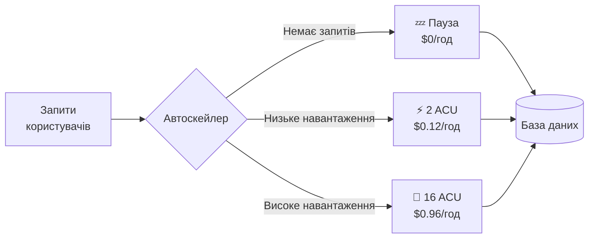
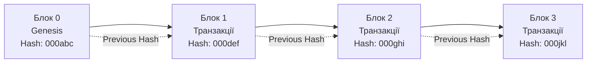
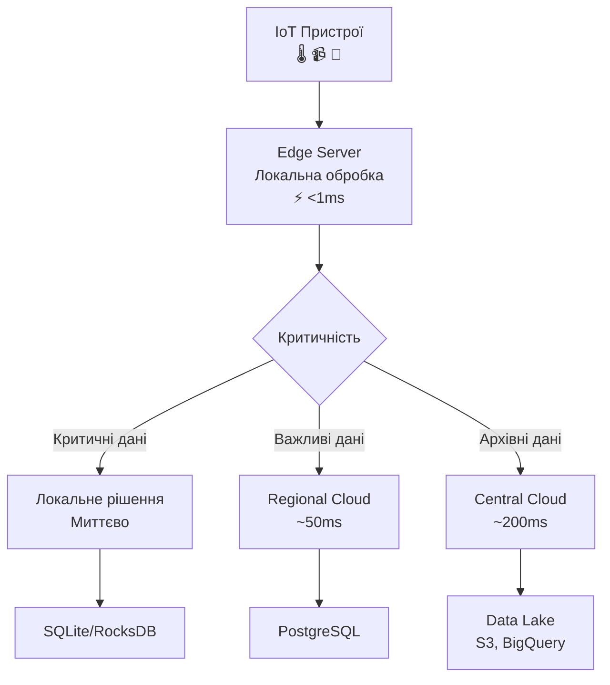
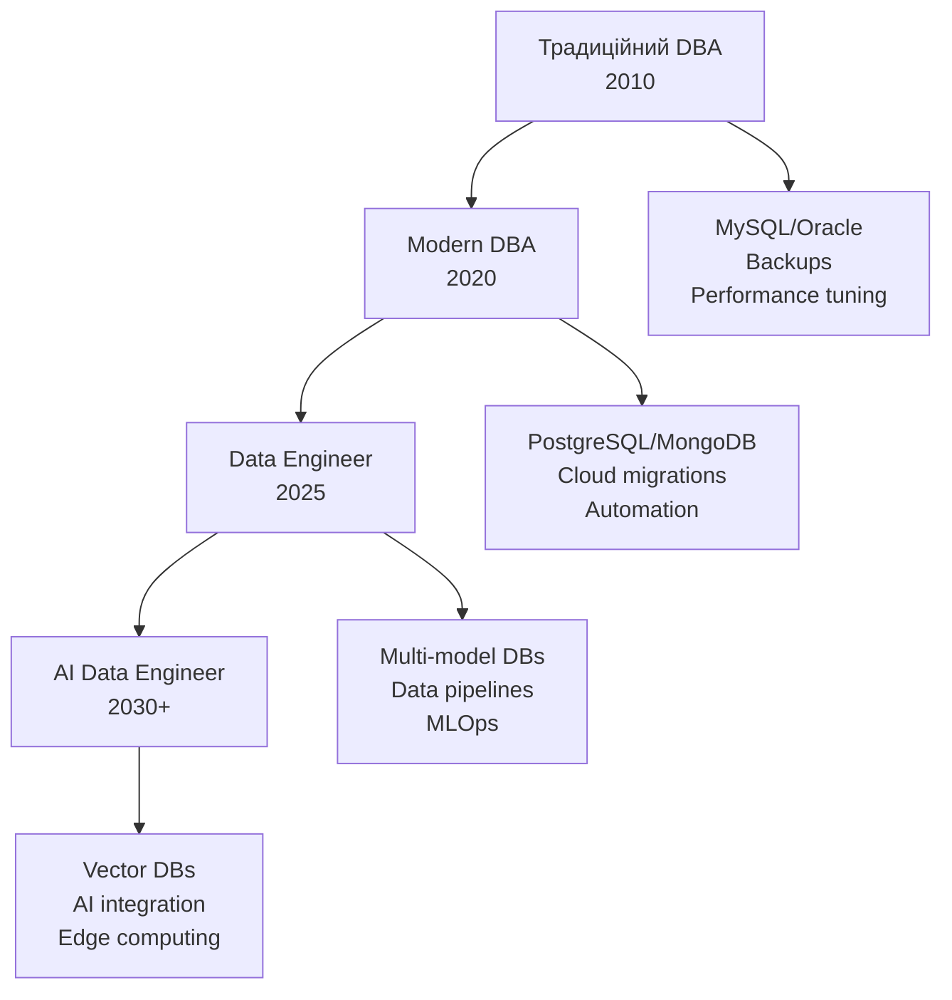

# Перспективи розвитку технологій баз даних

## План презентації

1. Serverless бази даних
2. Quantum computing
3. Blockchain технології
4. Edge computing
5. Професійні компетенції майбутнього

## **1. Serverless бази даних**

## Концепція serverless

### ☁️ **Що таке serverless БД?**

База даних, яка:
- 🔄 **Автоматично масштабується** від 0 до необхідної потужності
- 💰 **Оплата за використання** — платите тільки за активний час
- 🚀 **Без управління інфраструктурою** — провайдер керує всім
- ⚡ **Миттєвий старт** — активація за мілісекунди



## Aurora Serverless

### 🌟 **AWS Aurora Serverless v2:**

```python
import boto3

rds = boto3.client('rds')

# Створення serverless кластера
response = rds.create_db_cluster(
    DBClusterIdentifier='my-app-db',
    Engine='aurora-postgresql',
    EngineMode='serverless',
    ScalingConfiguration={
        'MinCapacity': 0.5,    # Мінімум 0.5 ACU
        'MaxCapacity': 16,     # Максимум 16 ACU
        'AutoPause': True,
        'SecondsUntilAutoPause': 300  # Пауза після 5 хв
    }
)
```

**⚡ ACU (Aurora Capacity Units):**
- 1 ACU ≈ 2 GB RAM + відповідний CPU
- Масштабування з кроком 0.5 ACU
- Швидкість: секунди, не хвилини

## PlanetScale

### 🌍 **Serverless MySQL з Git-flow:**

```bash
# Створення гілки для розробки
pscale branch create my-database feature-new-schema

# Підключення до гілки
pscale connect my-database feature-new-schema

# Після тестування — deploy request
pscale deploy-request create my-database feature-new-schema

# Злиття в production
pscale deploy-request deploy my-database 1
```

**✨ Унікальні можливості:**
- Branching схеми БД як Git
- Non-blocking schema changes
- Автоматичне горизонтальне масштабування
- Built-in connection pooling

## Економічні переваги

### 💰 **Порівняння вартості:**

```python
# Традиційна БД: 24/7 робота
traditional_cost = 0.50 * 730  # $365/міс

# Serverless: тільки активний час
scenarios = {
    'Постійне навантаження (730 год)': 0.60 * 730,  # $438/міс
    'Робочі години (160 год)': 0.60 * 160,         # $96/міс
    'Спорадичне (80 год)': 0.60 * 80,              # $48/міс
}

# Економія для спорадичного використання
savings = traditional_cost - 48  # $317/міс (87% економія!)
```

**📊 Висновок:** Serverless вигідний для:
- Розробки та тестування
- Застосунків з нерівномірним навантаженням
- Стартапів з обмеженим бюджетом

## Архітектурні патерни

### 🔌 **Connection Pooling для serverless:**

```javascript
// ❌ Погано: кожна Lambda створює нове з'єднання
exports.handler = async (event) => {
    const connection = await mysql.createConnection({...});
    // Швидке вичерпання ліміту з'єднань!
};

// ✅ Добре: використання RDS Proxy
const pool = mysql.createPool({
    host: 'rds-proxy.amazonaws.com',  // RDS Proxy endpoint
    connectionLimit: 10
});

exports.handler = async (event) => {
    const connection = await pool.getConnection();
    try {
        const [rows] = await connection.query('SELECT ...');
        return rows;
    } finally {
        connection.release();
    }
};
```

## Кешування для serverless

### ⚡ **Зменшення активацій БД:**

```javascript
const redis = require('redis');
const client = redis.createClient({
    url: process.env.REDIS_URL
});

async function getUserData(userId) {
    const cacheKey = `user:${userId}`;

    // Спроба з кешу
    const cached = await client.get(cacheKey);
    if (cached) {
        console.log('Cache HIT - БД не активована');
        return JSON.parse(cached);
    }

    // Cache MISS - активація serverless БД
    console.log('Cache MISS - активація serverless БД');
    const user = await db.query('SELECT * FROM users WHERE id = ?', [userId]);

    // Збереження в кеш на 5 хвилин
    await client.setEx(cacheKey, 300, JSON.stringify(user));

    return user;
}
```

**💡 Результат:** Менше активацій = менша вартість

## **2. Quantum Computing**

## Основи квантових обчислень

### ⚛️ **Кубіти vs Біти:**

```mermaid
graph TB
    A[Класичний біт] --> B[0 або 1<br/>Одне значення]

    C[Квантовий кубіт] --> D[Суперпозиція<br/>α|0⟩ + β|1⟩]
    D --> E[До вимірювання:<br/>обидва стани одночасно]
    D --> F[Після вимірювання:<br/>колапс до 0 або 1]

    G[N класичних біт] --> H[2^N комбінацій<br/>по одній за раз]

    I[N кубітів] --> J[2^N станів<br/>одночасно!]
```

**🚀 Квантова перевага:**
- 3 кубіти = 8 станів одночасно
- 10 кубітів = 1024 стани
- 300 кубітів = більше станів ніж атомів у Всесвіті!

## Алгоритм Гровера

### 🔍 **Квантове прискорення пошуку:**

```python
# Класичний пошук: O(N)
def classical_search(database, target):
    for i, item in enumerate(database):
        if item == target:
            return i
    return -1

# Час для 1 мільйона елементів
classical_time = 1_000_000  # операцій

# Квантовий пошук: O(√N)
quantum_time = math.sqrt(1_000_000)  # 1000 операцій

speedup = classical_time / quantum_time  # 1000x прискорення!
```

**📊 Порівняння:**

| Розмір БД | Класичний пошук | Квантовий пошук | Прискорення |
|-----------|----------------|-----------------|-------------|
| 1,000 | 1,000 | 32 | 31x |
| 1,000,000 | 1,000,000 | 1,000 | 1,000x |
| 1,000,000,000 | 1,000,000,000 | 31,623 | 31,623x |

## Оптимізація запитів

### ⚡ **Квантова оптимізація JOIN:**

```python
# Традиційний оптимізатор перебирає варіанти
def classical_join_optimization(tables):
    # Кількість варіантів = N!
    # Для 10 таблиць = 3,628,800 варіантів
    best_plan = None
    best_cost = infinity

    for plan in all_permutations(tables):
        cost = estimate_cost(plan)
        if cost < best_cost:
            best_cost = cost
            best_plan = plan

    return best_plan

# Квантовий відпал може знайти оптимум швидше
def quantum_join_optimization(tables):
    # Формулювання як QUBO проблеми
    Q = construct_qubo_matrix(tables)

    # Квантовий відпал (D-Wave)
    solution = quantum_annealer.solve(Q)

    return decode_solution(solution)
```

## Квантово-стійка криптографія

### 🔒 **Загроза від квантових комп'ютерів:**

**❌ Вразливі алгоритми:**
- RSA — зламається за години
- ECC (Elliptic Curve) — зламається за хвилини
- DSA — зламається швидко

**✅ Квантово-стійкі алгоритми:**
- **Kyber** — Key Encapsulation Mechanism
- **Dilithium** — Digital Signatures
- **SPHINCS+** — Hash-based signatures

```python
from pqcrypto.kem.kyber512 import generate_keypair, encrypt, decrypt

# Генерація квантово-стійких ключів
public_key, secret_key = generate_keypair()

# Шифрування
ciphertext, shared_secret = encrypt(public_key)

# Розшифрування
decrypted_secret = decrypt(secret_key, ciphertext)
```

**⚠️ Дія:** Почати міграцію вже зараз!

## Поточний стан квантових обчислень

### 📊 **Де ми зараз:**

**Кількість кубітів:**
- IBM Condor: 1,121 кубіт (2023)
- Google Willow: 105 кубітів (2024)
- Atom Computing: 1,180 кубітів (2023)

**Проблеми:**
- 🔴 Квантовий шум — помилки в обчисленнях
- 🔴 Декогеренція — втрата квантового стану
- 🔴 Корекція помилок — потребує тисячі фізичних кубітів для 1 логічного

**⏰ Таймлайн:**
- 2025-2030: Quantum advantage для окремих задач
- 2030-2040: Практичні квантові БД?

## **3. Blockchain технології**

## Blockchain як БД

### ⛓️ **Структура ланцюга блоків:**



**🔐 Кожен блок містить:**
- Заголовок з метаданими
- Hash попереднього блоку
- Набір транзакцій
- Nonce для Proof-of-Work
- Timestamp

## Властивості blockchain БД

### ✅ **Ключові характеристики:**

**🔒 Незмінність:**
- Неможливо змінити історію без виявлення
- Кожна зміна видима всім учасникам

**👁️ Прозорість:**
- Повна історія транзакцій
- Аудит-friendly

**🌐 Децентралізація:**
- Немає єдиної точки відмови
- Розподілене зберігання

**⚖️ Консенсус:**
- Узгодження між вузлами
- Захист від шахрайства

## BigchainDB

### 🗄️ **Blockchain з продуктивністю БД:**

```python
from bigchaindb_driver import BigchainDB
from bigchaindb_driver.crypto import generate_keypair

bdb = BigchainDB('https://test.bigchaindb.com')
alice = generate_keypair()

# Створення активу (CREATE)
asset = {
    'data': {
        'type': 'medical_record',
        'patient_id': 'PAT001',
        'diagnosis': 'Diagnosis XYZ',
        'doctor': 'Dr. Smith'
    }
}

metadata = {
    'timestamp': '2025-11-17T10:00:00Z',
    'hospital': 'City Hospital'
}

# CREATE транзакція
tx = bdb.transactions.prepare(
    operation='CREATE',
    signers=alice.public_key,
    asset=asset,
    metadata=metadata
)

signed_tx = bdb.transactions.fulfill(tx, private_keys=alice.private_key)
sent_tx = bdb.transactions.send_commit(signed_tx)
```

## Smart Contracts

### 📜 **Самовиконуваний код:**

```solidity
// Solidity smart contract
contract SupplyChain {
    struct Product {
        uint256 id;
        string name;
        address manufacturer;
        address currentOwner;
        uint256 manufactureDate;
        Status status;
    }

    enum Status { Manufactured, InTransit, Delivered }

    mapping(uint256 => Product) public products;

    event ProductCreated(uint256 id, address manufacturer);
    event ProductTransferred(uint256 id, address from, address to);

    function createProduct(uint256 id, string memory name) public {
        products[id] = Product({
            id: id,
            name: name,
            manufacturer: msg.sender,
            currentOwner: msg.sender,
            manufactureDate: block.timestamp,
            status: Status.Manufactured
        });

        emit ProductCreated(id, msg.sender);
    }

    function transferProduct(uint256 id, address newOwner) public {
        require(products[id].currentOwner == msg.sender);

        products[id].currentOwner = newOwner;
        products[id].status = Status.InTransit;

        emit ProductTransferred(id, msg.sender, newOwner);
    }
}
```

## Hyperledger Fabric

### 🏢 **Enterprise blockchain:**

```javascript
// Chaincode для медичних записів
class MedicalRecordsContract extends Contract {

    async createRecord(ctx, recordId, patientId, diagnosis) {
        const record = {
            recordId,
            patientId,
            diagnosis,
            timestamp: new Date().toISOString(),
            docType: 'medicalRecord'
        };

        await ctx.stub.putState(recordId, Buffer.from(JSON.stringify(record)));
        return JSON.stringify(record);
    }

    async getRecordHistory(ctx, recordId) {
        // Повна історія всіх змін
        const iterator = await ctx.stub.getHistoryForKey(recordId);
        const history = [];

        let result = await iterator.next();
        while (!result.done) {
            history.push({
                txId: result.value.txId,
                timestamp: result.value.timestamp,
                value: result.value.value.toString()
            });
            result = await iterator.next();
        }

        return JSON.stringify(history);
    }
}
```

## Переваги vs Обмеження

### ⚖️ **Реалістичний погляд:**

**✅ Переваги:**
- Незмінність та аудит
- Децентралізація
- Прозорість операцій
- Відсутність посередників

**❌ Обмеження:**
- Низька продуктивність (7-30 TPS vs тисячі)
- Висока вартість операцій
- Складність масштабування
- Проблеми зі зберіганням великих обсягів

**🎯 Ідеальні use cases:**
- Ланцюги постачання
- Медичні записи
- Фінансові транзакції
- Цифрові активи (NFT)

## **4. Edge Computing**

## Концепція Edge Computing

### 🌐 **Обробка на периферії мережі:**



**🎯 Переваги:**
- Низька латентність
- Автономна робота
- Економія трафіку
- Приватність даних

## Edge Database архітектура

### 💾 **Локальне зберігання + синхронізація:**

```python
class EdgeDatabase:
    def __init__(self, db_path='edge.db'):
        self.db = sqlite3.connect(db_path)
        self.cloud_api = 'https://central-cloud.com/sync'

    def store_sensor_data(self, sensor_id, temperature, humidity):
        # Локальне зберігання
        self.db.execute("""
            INSERT INTO sensor_readings
            (sensor_id, temperature, humidity, synced)
            VALUES (?, ?, ?, 0)
        """, (sensor_id, temperature, humidity))

        # Перевірка критичних умов ЛОКАЛЬНО
        if self.is_critical(temperature, humidity):
            self.handle_critical_event(sensor_id)

        self.db.commit()

    def is_critical(self, temp, humidity):
        # Локальна обробка без залежності від хмари
        return temp > 85 or temp < -10 or humidity > 95

    def sync_with_cloud(self):
        # Синхронізація несинхронізованих даних
        unsynced = self.db.execute(
            "SELECT * FROM sensor_readings WHERE synced = 0"
        ).fetchall()

        try:
            requests.post(self.cloud_api, json={'data': unsynced})
            self.db.execute("UPDATE sensor_readings SET synced = 1")
        except:
            # Продовжуємо роботу локально
            pass
```

## IoT та розумні міста

### 🏙️ **Приклад: Smart Traffic System:**

```python
class SmartTrafficEdge:
    def process_traffic_data(self, sensor_id, vehicle_count, avg_speed):
        # Локальний аналіз затору
        congestion = self.calculate_congestion(vehicle_count, avg_speed)

        if congestion > 0.7:
            # Критична ситуація — негайна дія
            # БЕЗ затримки на звернення до центральної хмари
            self.adjust_traffic_lights(sensor_id, congestion)

            # Логування події
            self.log_critical_event(sensor_id, congestion)

        # Фонова синхронізація статистики
        self.queue_for_sync(sensor_id, vehicle_count, avg_speed)

    def calculate_congestion(self, count, speed):
        if speed < 10 and count > 50:
            return 0.9  # Сильний затор
        elif speed < 20 and count > 30:
            return 0.7  # Помірний затор
        return 0.3  # Нормальний рух

    def adjust_traffic_lights(self, sensor_id, congestion):
        # Адаптація світлофорів ЛОКАЛЬНО
        optimal_timing = self.calculate_timing(congestion)
        self.send_command_to_lights(sensor_id, optimal_timing)
```

**⚡ Результат:** Реакція за мілісекунди замість секунд

## Стратегії синхронізації

### 🔄 **Conflict Resolution:**

```python
def sync_with_conflict_resolution():
    local_changes = edge_db.get_changes()
    cloud_changes = cloud_api.get_changes()

    # Виявлення конфліктів
    conflicts = detect_conflicts(local_changes, cloud_changes)

    if conflicts:
        for conflict in conflicts:
            # Стратегія: Last Write Wins
            if conflict.local_timestamp > conflict.cloud_timestamp:
                winner = conflict.local_data
            else:
                winner = conflict.cloud_data

            apply_resolved_change(winner)

    # Застосування неконфліктних змін
    apply_changes(local_changes, cloud_changes)
```

**🎯 Стратегії розв'язання:**
- Last Write Wins
- Версіонування
- Merge з бізнес-логікою
- Ручне розв'язання

## Переваги Edge Computing

### 📊 **Числа говорять:**

**Латентність:**
- Хмара: 100-500 ms
- Edge: 1-10 ms
- **Прискорення: 10-500x**

**Трафік:**
- Всі дані → хмара: 1 TB/день
- Агреговані дані → хмара: 10 GB/день
- **Економія: 99%**

**Автономність:**
- Хмара недоступна: система не працює ❌
- Edge: критичні функції працюють ✅

**Use cases:**
- 🚗 Автономні автомобілі
- 🏭 Промислові IoT
- 🏥 Медичні пристрої
- 🎮 Cloud gaming

## **5. Професійні компетенції**

## Еволюція ролей

### 👤 **Від DBA до Data Engineer:**



## Нові ролі в індустрії

### 🎯 **Сучасні спеціалізації:**

**Database Reliability Engineer (DBRE)**
- SRE + DBA
- Автоматизація та моніторинг
- Забезпечення SLA 99.99%+
- Incident response

**Data Platform Engineer**
- Побудова data lakes
- Streaming pipelines (Kafka, Flink)
- Інтеграція різних джерел даних
- Data governance

**ML Infrastructure Engineer**
- Feature stores
- Model registries
- ML pipelines
- A/B testing infrastructure

**Vector Database Specialist**
- Embedding management
- Semantic search optimization
- RAG systems
- AI integration

## Multi-model підхід

### 🎭 **Розуміння різних типів БД:**

```python
class DataArchitect:
    def choose_database(self, use_case):
        recommendations = {
            'Транзакції': 'PostgreSQL',
            'Аналітика': 'ClickHouse',
            'Документи': 'MongoDB',
            'Часові ряди': 'TimescaleDB',
            'Графи': 'Neo4j',
            'Кеш': 'Redis',
            'Пошук': 'Elasticsearch',
            'Вектори': 'Pinecone'
        }
        return recommendations.get(use_case)

    def design_architecture(self, requirements):
        architecture = []

        if requirements['transactions']:
            architecture.append('PostgreSQL')

        if requirements['analytics']:
            architecture.append('ClickHouse')

        if requirements['search']:
            architecture.append('Elasticsearch')

        if requirements['caching']:
            architecture.append('Redis')

        return architecture
```

**💡 Ключ до успіху:** Знати коли використовувати кожну технологію

## Infrastructure as Code

### 🛠️ **Автоматизація всього:**

```yaml
# Terraform для multi-database deployment
resource "aws_rds_cluster" "postgresql" {
  engine = "aurora-postgresql"
  engine_mode = "serverless"
  scaling_configuration {
    min_capacity = 2
    max_capacity = 16
  }
}

resource "aws_elasticache_cluster" "redis" {
  engine = "redis"
  node_type = "cache.r6g.large"
}

resource "aws_docdb_cluster" "mongodb" {
  engine = "docdb"
  master_username = var.username
}

resource "aws_opensearch_domain" "search" {
  engine_version = "OpenSearch_2.3"
  cluster_config {
    instance_type = "r6g.large.search"
  }
}
```

**✅ Результат:** Повторюване, версіоноване, тестоване

## Observability та моніторинг

### 📊 **Комплексний моніторинг:**

```python
from prometheus_client import Counter, Histogram, Gauge

class DatabaseObservability:
    def __init__(self):
        self.query_duration = Histogram(
            'db_query_duration_seconds',
            'Query execution time',
            ['database', 'operation']
        )

        self.query_counter = Counter(
            'db_queries_total',
            'Total queries',
            ['database', 'status']
        )

        self.connection_pool = Gauge(
            'db_connection_pool',
            'Connection pool size',
            ['database', 'state']
        )

    def monitor_query(self, db_name, operation):
        # Декоратор для автоматичного моніторингу
        def decorator(func):
            def wrapper(*args, **kwargs):
                with self.query_duration.labels(db_name, operation).time():
                    result = func(*args, **kwargs)
                self.query_counter.labels(db_name, 'success').inc()
                return result
            return wrapper
        return decorator
```

## Навчальна траєкторія

### 📚 **Roadmap для фахівця з БД:**

**🎓 Фундамент (6-12 місяців):**
- SQL та реляційні БД
- Теорія баз даних
- Linux та мережі
- Git та автоматизація

**🚀 Практичні навички (12-18 місяців):**
- NoSQL БД (MongoDB, Redis, Cassandra)
- Хмарні платформи (AWS, GCP, Azure)
- Docker та Kubernetes
- CI/CD pipelines

**🔬 Спеціалізація (18+ місяців):**
- Векторні БД та AI integration
- Stream processing (Kafka, Flink)
- Edge computing
- Blockchain (опціонально)

## Ключові компетенції 2025+

### 🎯 **Must-have навички:**

**💻 Технічні:**
- Multi-model БД
- Infrastructure as Code
- Observability
- ML basics

**🔧 Soft Skills:**
- Розв'язання проблем
- Комунікація
- Навчання протягом життя
- Співпраця

**📊 Бізнес розуміння:**
- Cost optimization
- SLA management
- Data governance
- Security compliance

## Зарплатні очікування

### 💰 **Ринок України (2025):**

| Рівень | Досвід | Зарплата (USD) |
|--------|--------|----------------|
| Junior | 0-1 рік | $800-1,500 |
| Middle | 1-3 роки | $1,500-3,000 |
| Senior | 3-5 років | $3,000-5,000 |
| Lead | 5+ років | $5,000-8,000 |

**🚀 Спеціалізації з premium:**
- Vector DB specialist: +30%
- ML Infrastructure: +40%
- Blockchain engineer: +25%

**🌍 Міжнародний ринок:** 2-3x вище

## Тренди наступних 5 років

### 🔮 **Що чекає індустрію:**

**2025-2026:**
- Масове впровадження векторних БД
- Serverless стає стандартом
- AI-асистенти для DBA

**2027-2028:**
- Quantum-ready системи
- Повсюдний edge computing
- Автоматична оптимізація як норма

**2029-2030:**
- Квантові БД для specialized tasks
- Повна автоматизація рутинних задач
- Фокус на AI integration

**🎯 Стратегія:** Постійне навчання та адаптація

## Ресурси для навчання

### 📖 **Рекомендовані джерела:**

**Онлайн курси:**
- AWS Database Specialty
- Google Cloud Database Engineer
- MongoDB University
- Coursera: Data Engineering

**Книги:**
- "Designing Data-Intensive Applications" (Martin Kleppmann)
- "Database Internals" (Alex Petrov)
- "The Data Warehouse Toolkit" (Ralph Kimball)

**Практика:**
- Особисті проєкти на GitHub
- Участь у open-source
- Kaggle competitions
- Технічні блоги

## Висновки

### 🎯 **Ключові takeaways:**

**☁️ Serverless** — майбутнє для багатьох застосунків, економія коштів та зусиль

**⚛️ Quantum** — готуйтеся зараз, впровадження вже близько

**⛓️ Blockchain** — нішеві але важливі застосування, не панацея

**🌐 Edge** — критично для IoT та real-time систем

**👤 Професіонал майбутнього** — multi-skilled, адаптивний, з фокусом на AI

**🚀 Головне:** Постійне навчання, практика, адаптація до змін

**💡 Пам'ятайте:** Технології змінюються, але фундаментальні принципи залишаються
